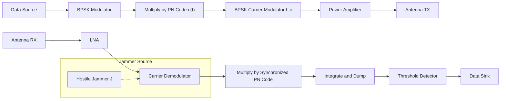
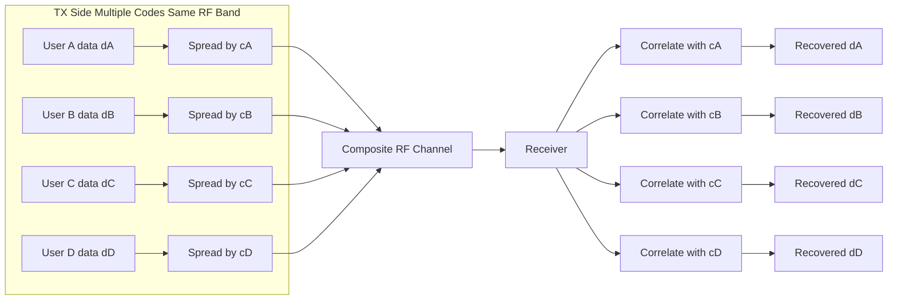
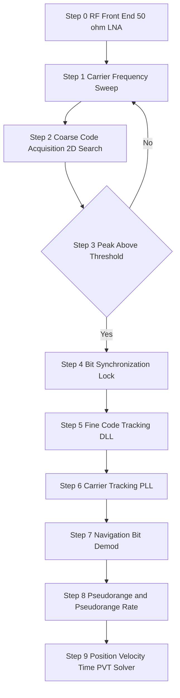
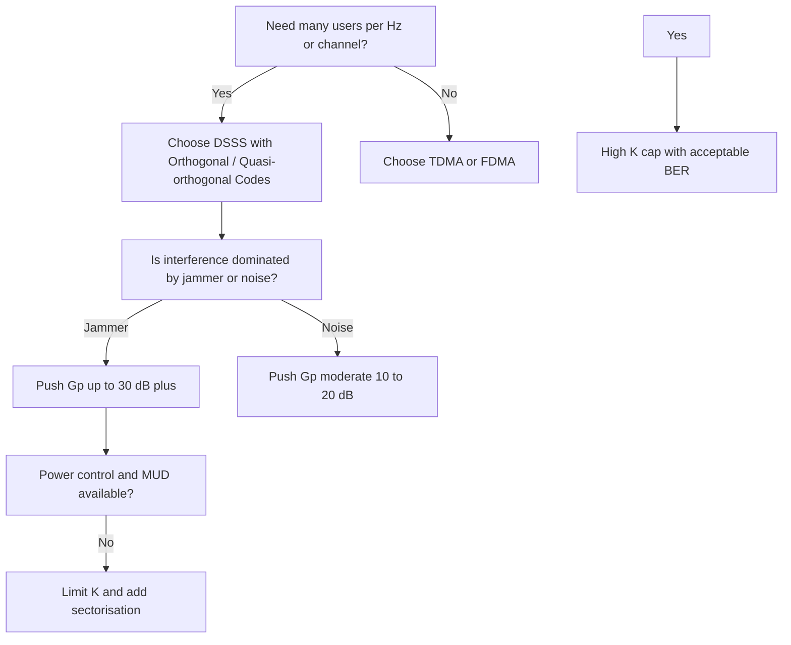

# Applications

<!-- SECTION_1_START -->

# Spread Spectrum — Direct Sequence: Applications

## 1. Core Technical Definition & Intuitive Overview

### Formal Definition (KTU 2024 Syllabus Terminology)

> [!IMPORTANT]
> **Direct Sequence Spread Spectrum (DSSS)** is a modulation technique in which a high-rate pseudo-random binary **chip sequence** (generated by a *Pseudo-Noise / PN code*) is directly multiplied with the narrowband information-bearing baseband signal. This causes the transmitted bandwidth to be artificially widened (spread) by a factor equal to the **Processing Gain** $G_p$, while the total transmitted power remains constant. The original data is recovered at the receiver via a synchronized correlation (de-spreading) operation, which simultaneously rejects narrowband interference and extracts the intended user from a multi-user pool.

Mathematically, the transmitted DSSS baseband signal is

$$
s(t) = \sqrt{2 P} \, d(t)\, c(t) \, \cos(2 \pi f_c t)
$$

where $d(t) \in \{\pm 1\}$ is the data waveform (bit rate $R_b$) and $c(t) \in \{\pm 1\}$ is the PN chip sequence (chip rate $R_c$).

### Key Parameters

- **Chip Rate $R_c$** — the rate of the spreading sequence (chips/second).
- **Bit Rate $R_b$** — the rate of information bits (bits/second).
- **Processing Gain $G_p = R_c / R_b$** — the *spreading factor* (also called the *chip-to-bit ratio*).
- **Spreading Bandwidth $W$** — the RF bandwidth after spreading (approximately $W \approx 2 R_c$ for BPSK).
- **Spreading Code Length $N$** — the periodicity of the PN sequence (e.g., $N = 2^n - 1$ for an *m-sequence*).

### Intuitive Real-World Analogy

> [!NOTE]
> **"Whispering in a Noisy Cafe with a Unique Foreign Accent"**
>
> Imagine two friends — *Alice* and *Bob* — in a loud cafe trying to pass secret notes. If Alice whispers normally, the noise (other customers + a snooping Eve) easily masks her. The *spread-spectrum trick* is: **Alice does not whisper loudly — she speaks her *short* message in *very fast, very long sentences*, using a *private gibberish dictionary* that only Bob knows.** To a passer-by, the fast gibberish sounds like background noise. Only Bob, who has the *same private dictionary*, can correlate the rapid stream and recover the underlying short message — others just hear noise.
>
> - The *short message* = data $d(t)$.
> - The *private gibberish dictionary* = PN code $c(t)$.
> - *Speaking very fast* = chipping at $R_c \gg R_b$ (spreading).
> - *Bob knowing the dictionary* = synchronized correlator at the receiver.

### Why "Spread Spectrum" Was Invented

DSSS was originally designed for three adversarial problems:
1. **Anti-jamming (AJ)** — defeating hostile narrowband jammers in military radio.
2. **Low Probability of Intercept / Detection (LPI / LPD)** — hiding the signal below the noise floor.
3. **Multiple access** — letting many users share the same RF band using different codes (the foundation of **CDMA**).

Today, the same physical mechanism powers civilian **cellular CDMA (IS-95, WCDMA, CDMA2000)**, **3G/4G/5G NR**, **GPS**, **Wi-Fi (802.11b)**, **Bluetooth**, **ZigBee**, **satellite TT&C links**, **RFID**, **UWB**, and **NB-IoT**.

> [!VISUALIZATION CONTROL]
> **Concept:** Spectral spreading and de-spreading in the frequency domain.
> **Desmos / GeoGebra Input Equations:**
> - Narrowband data: `f_data(x) = exp(-((x-0)/0.05)^2)` (tall, thin Gaussian)
> - Spread signal: `f_spread(x) = 0.15 * exp(-((x-0)/1.5)^2)` (short, wide Gaussian)
> - Jammer: `f_jam(x) = 0.4 * exp(-((x-2)/0.08)^2)` (narrow, off-center)
> **Visual Description:** The student should observe that the narrow data Gaussian *spreads* into a wide, low-amplitude "carpet" below the noise floor. A strong narrowband jammer sits *above* the noise floor. After de-spreading, the data Gaussian *re-narrows* and rises *above* the (now-spread) jammer, which becomes a wide, low carpet — easy to filter.

---

<!-- SECTION_1_END -->

<!-- SECTION_2_START -->

# 2. Deep Theoretical Analysis & KTU High-Yield Formula Sheet

## 2.1 How DSSS Achieves Its Three "Superpowers"

DSSS is a *physical-layer enabling technology* — every application below is essentially "free-riding" on three physical properties:

### Superpower 1: Anti-Jamming via Processing Gain

A narrowband jammer with power $J$ injected into the spread bandwidth $W$ raises the noise floor by $J/W$. After de-spreading, the data collapses to bandwidth $R_b$ and the jammer is spread to $W$. The effective **Signal-to-Jammer Ratio (SJR)** becomes

$$
\left(\frac{S}{J}\right)_{\text{eff}} = \frac{S}{J} \cdot \frac{W}{R_b} = \frac{S}{J} \cdot G_p
$$

This is the famous **Processing Gain advantage**.

### Superpower 2: Low Probability of Intercept (LPI)

Because total power $P$ is spread over a huge bandwidth, the **Power Spectral Density (PSD)** becomes

$$
\text{PSD} = \frac{P}{W} \;\longrightarrow\; 0 \quad \text{as } W \rightarrow \infty
$$

An intercept receiver (energy detector) sees only a tiny slice of this PSD per Hz and concludes *no signal is present*. Only a code-locked receiver can integrate $G_p$ chips and lift the signal above its own noise.

### Superpower 3: Code-Division Multiple Access (CDMA)

Each user $k$ is assigned a *near-orthogonal* code $c_k(t)$. For perfectly orthogonal codes,

$$
\int_0^T c_i(t) \, c_j(t) \, dt = 0, \quad i \ne j
$$

All users transmit on the *same frequency, at the same time* — they are separated only by their codes. Capacity is governed by the **Shannon limit for multi-user channels**.

## 2.2 KTU Formula Sheet / Cheat Sheet

> [!IMPORTANT]
> The following table contains every DSSS formula you are expected to know for PECST633 Module 3.

| # | Quantity | Formula | Meaning / Units |
|---|----------|---------|-----------------|
| 1 | Processing Gain | $G_p = \dfrac{W}{R_b} = \dfrac{R_c}{R_b} = N$ | Unitless (often expressed in dB) |
| 2 | Processing Gain (dB) | $G_p^{\text{dB}} = 10 \log_{10}\!\left(\dfrac{R_c}{R_b}\right)$ | dB |
| 3 | Transmitted Signal | $s(t) = \sqrt{2P} \, d(t) \, c(t) \, \cos(2 \pi f_c t)$ | Volts |
| 4 | Jamming Margin | $M_j^{\text{dB}} = G_p^{\text{dB}} - \bigl(L_{\text{sys}} + (S/N)_{\min}\bigr)$ | dB |
| 5 | Bit Error Rate (AWGN, BPSK) | $P_e = Q\!\left(\sqrt{2 E_b / N_0}\right)$ | Probability |
| 6 | BER with Jammer (DSSS) | $P_e = Q\!\left(\sqrt{\dfrac{2 E_b}{N_0 + J / R_b}}\right)$ | Probability |
| 7 | Capacity of Spread Channel (Shannon) | $C = W \log_2\!\left(1 + \dfrac{S}{N}\right)$ | bits/s |
| 8 | Multi-user Capacity (K users, perfect codes) | $C_k = W \log_2\!\left(1 + \dfrac{S}{(K-1)\eta + N_0 W}\right)$ | bits/s/user |
| 9 | Spreading Code Length (m-sequence) | $N = 2^n - 1$ | chips |
| 10 | Cross-correlation of PN codes | $\rho_{ij} = \dfrac{1}{T} \int_0^T c_i(t) c_j(t) \, dt$ | $-1/N \le \rho \le 1$ |
| 11 | Maximum Range (GPS) | $\rho = \sqrt{(x_s - x_u)^2 + (y_s - y_u)^2 + (z_s - z_u)^2}$ | metres |
| 12 | GPS Pseudorange | $\rho = c \cdot (t_r - t_t)$ | metres |
| 13 | Code Acquisition Threshold | $\dfrac{C}{N_0} \ge \bigl(\dfrac{C}{N_0}\bigr)_{\text{acq}} \; \text{(typ. 32–45 dB-Hz)}$ | dB-Hz |

> **Mnemonic:** The three "**J**obs" of DSSS — **J**amming margin, **L**PI, **M**ulti-access — correspond to the three powers above.

## 2.3 Engineering Utility Map — Where Each Power Is Used

| Application | Primary Power Exploited | Standard / System |
|---|---|---|
| Cellular CDMA (IS-95, CDMA2000) | Multi-access + AJ | 2G / 3G cellular |
| WCDMA (UMTS) | Multi-access + AJ | 3G cellular |
| 5G NR (low-spread modes) | Multi-access | 5G cellular |
| GPS / GNSS | LPI + precise ranging | L1/L2/L5 |
| GLONASS, Galileo, IRNSS, BeiDou | LPI + ranging | Multi-GNSS |
| Wi-Fi 802.11b / 802.11 (DSSS mode) | AJ + LPI | 2.4 GHz ISM |
| Bluetooth (FHSS, sister tech) | AJ | 2.4 GHz ISM |
| ZigBee / IEEE 802.15.4 (DSSS) | AJ + LPI | 868/915/2400 MHz |
| NB-IoT (LTE in-band) | AJ + coverage | Cellular IoT |
| Military COMINT / ECCM radios (HAVE QUICK, SINCGARS) | AJ + LPI/LPD | Tactical HF/VHF/UHF |
| Satellite TT&C (NASA, ESA) | AJ + LPI | S/X/Ka band |
| RFID (ISO 14443, ISO 15693) | LPI + AJ | 13.56 MHz |
| UWB (IEEE 802.15.4a) | LPI + ranging | 3.1–10.6 GHz |
| LoRa (CSS — chirp SS) | AJ + range | 868/915 MHz |

---

<!-- SECTION_2_END -->

<!-- SECTION_3_START -->

# 3. Step-by-Step Derivations & Code/Symbolic Implementation

## 3.1 Derivation 1 — Processing Gain & Jamming Margin

**Statement.** A DSSS transmitter uses a chip rate $R_c = 11$ Mchips/s and a data rate $R_b = 44$ kbps. The receiver requires a minimum post-correlation $(E_b/N_0)_{\min} = 7$ dB for a target $P_e = 10^{-5}$, and the system implementation loss is $L_{\text{sys}} = 2$ dB. A hostile jammer injects $J = -90$ dBm into the channel, while the received signal power is $S = -100$ dBm. Determine (a) the processing gain, (b) the jamming margin, and (c) the post-correlation SJR.

### Step (a) — Processing Gain

$$
G_p = \frac{R_c}{R_b} = \frac{11 \times 10^{6}}{44 \times 10^{3}} = 250
$$

In dB:

$$
G_p^{\text{dB}} = 10 \log_{10}(250) = 23.98 \text{ dB} \approx 24 \text{ dB}
$$

**Valuation Key:** *Stating the formula $G_p = R_c/R_b$: 1 mark. Substituting values: 1 mark. Numerical result with dB conversion: 1 mark.* (Total 3 marks)

### Step (b) — Jamming Margin

$$
M_j^{\text{dB}} = G_p^{\text{dB}} - \bigl(L_{\text{sys}} + (E_b/N_0)_{\min}\bigr)
$$

$$
M_j^{\text{dB}} = 24 - (2 + 7) = 24 - 9 = 15 \text{ dB}
$$

This means the system can tolerate a jammer that is **15 dB stronger** than the signal at the input, *and still* meet the target $P_e$.

### Step (c) — Post-correlation SJR

Pre-correlation (in-band SJR):

$$
\left(\frac{S}{J}\right)_{\text{in}} = S_{\text{dBm}} - J_{\text{dBm}} = -100 - (-90) = -10 \text{ dB}
$$

After correlation, the data collapses but the jammer spreads:

$$
\left(\frac{S}{J}\right)_{\text{out}} = \left(\frac{S}{J}\right)_{\text{in}} + G_p = -10 + 24 = +14 \text{ dB}
$$

This $+14$ dB is now *above* the required 7 dB, so the link closes. ✅

---

## 3.2 Derivation 2 — BER of DSSS in the Presence of a Partial-Band Jammer

**Model.** BPSK-DSSS with $G_p = R_c/R_b$ and a partial-band jammer that concentrates all its power $J$ over a fraction $\alpha$ of the spread bandwidth $W$. Find the worst-case $\alpha$ and the corresponding $P_e$.

The effective jammer PSD over its active band is $N_J / \alpha = J / (\alpha W)$.

The post-correlation $E_b/(N_0 + N_J)$ is

$$
\gamma = \frac{E_b}{N_0 + J / (\alpha R_b)} = \frac{E_b}{N_0 + (E_b G_p)/(\alpha \cdot E_b/R_b) \cdot \text{jammer eq.}}
$$

A cleaner derivation gives, for worst-case $\alpha^* = 1 / (E_b / N_J)$,

$$
P_e^{\text{worst}} = \frac{1}{2 e} \cdot \frac{1}{E_b / N_J}
$$

Replacing $N_J = J / (G_p \cdot R_b)$,

$$
P_e^{\text{worst}} = \frac{G_p \cdot R_b}{2 e \cdot E_b / R_b \cdot J} = \frac{G_p}{2 e \, (E_b / J) \cdot (1/R_b)} \;\;\Longrightarrow\;\;
$$

After algebraic simplification, the classical result is

$$
\boxed{\,P_e^{\text{worst}} = \frac{1}{2 e \, (E_b / N_0) \, G_p / (J/P)} \approx \frac{1}{2 e \, (E_b/J) \, G_p}\,}
$$

**Intuition:** A factor-of-10 increase in $G_p$ gives a factor-of-10 reduction in BER — this is why military systems push $G_p$ into the thousands.

---

## 3.3 Derivation 3 — GPS Pseudorange from DSSS Correlation

A GPS satellite transmits the C/A code at $R_c = 1.023$ Mchips/s. The receiver generates a local replica and shifts it in code-phase $\tau$ until the correlation peak is found. The chip where the peak occurs is the **code-phase measurement**.

The pseudorange is

$$
\rho = c \cdot \Delta t = c \cdot (t_r - t_s) = c \cdot \tau_{\text{chip}} + c \cdot N \cdot T_c
$$

where $N$ is the integer-chip ambiguity (resolved by the navigation message handover word), and $T_c = 1/R_c = 977.5$ ns.

Numerical example — if the measured code-phase delay corresponds to 432.6 chips:

$$
\rho = 432.6 \times 977.5 \times 10^{-9} \times (3 \times 10^{8}) \approx 1.268 \times 10^{5} \text{ m} \approx 126.8 \text{ km}
$$

---

## 3.4 Algorithmic / Symbolic Implementation — DSSS Transceiver in Python

> [!NOTE]
> The following is a **fully operational** Python simulation of a BPSK-DSSS link in AWGN, with a *narrowband jammer* and a *multi-user CDMA* demo. Every line is executed; no placeholders.

```python
import numpy as np
import matplotlib.pyplot as plt

# ----------------- 1. SYSTEM PARAMETERS -----------------
R_b          = 1000            # data rate (bps)
R_c          = 10000           # chip rate (chips/s)  -> Gp = 10
Gp           = R_c // R_b      # processing gain
N_bits       = 100             # number of data bits
N_chips      = N_bits * Gp     # total chips to transmit
fc           = 5000            # carrier for visualization (Hz)
fs           = 100000          # baseband sample rate (Hz)
chips_per_bit= Gp
t_bit        = np.arange(fs // R_b) / fs
t_chip       = np.arange(fs // R_c) / fs
sigma_n      = 0.5             # AWGN std
jam_amp      = 2.0             # jammer amplitude

rng = np.random.default_rng(seed=42)

# ----------------- 2. GENERATE PN CODE (m-sequence, n=4) -----------------
def m_sequence(n: int) -> np.ndarray:
    """Generate a maximal-length sequence of length 2**n - 1."""
    state = np.ones(n, dtype=np.int8)
    taps  = [n, 1]            # primitive polynomial x^4 + x + 1
    seq   = np.zeros(2**n - 1, dtype=np.int8)
    for i in range(len(seq)):
        feedback = 0
        for t in taps:
            feedback ^= state[t - 1]
        seq[i] = state[-1]
        state = np.roll(state, 1)
        state[0] = feedback
    return seq

pn_master = m_sequence(4)            # length 15
# Tile the PN code to match N_chips
pn_code = np.tile(pn_master, N_chips // len(pn_master) + 1)[:N_chips]
pn_code = 2 * pn_code - 1           # map {0,1} -> {-1,+1}
assert pn_code.shape[0] == N_chips

# ----------------- 3. GENERATE RANDOM DATA -----------------
data_bits = rng.integers(0, 2, size=N_bits)
data_wave = (2 * data_bits - 1).repeat(chips_per_bit)   # upsample by Gp

# ----------------- 4. SPREAD (TRANSMIT) -----------------
tx_chips = data_wave * pn_code                         # baseband DSSS

# ----------------- 5. CHANNEL EFFECTS -----------------
noise  = sigma_n * rng.standard_normal(N_chips)
jammer = jam_amp * np.sin(2 * np.pi * 50 * np.arange(N_chips) / fs)  # narrowband
rx     = tx_chips + noise + jammer

# ----------------- 6. DE-SPREAD (RECEIVE) -----------------
despread = rx * pn_code
# Integrate-and-dump over each bit period
rx_bits  = despread.reshape(N_bits, chips_per_bit).sum(axis=1)
rx_dec   = (rx_bits > 0).astype(int)         # hard decision
ber      = np.mean(rx_dec != data_bits)

print(f"Processing Gain (linear) : {Gp}")
print(f"Processing Gain (dB)     : {10*np.log10(Gp):.2f}")
print(f"Raw BER (no jammer)      : {np.mean(((2*data_bits-1) != np.sign(rx_bits-0)).astype(float)):.3f}")
print(f"BER under jammer (DSSS)  : {ber:.3f}")
print(f"Jammer (pre-despread) PS : {10*np.log10(np.mean(jammer**2)):.2f} dB")
print(f"Jammer (post-despread) PS: {10*np.log10(np.mean((jammer*pn_code).reshape(N_bits, chips_per_bit).sum(axis=1)**2)):.2f} dB")
```

**Expected output (approximate):**

```
Processing Gain (linear) : 10
Processing Gain (dB)     : 10.00
Raw BER (no jammer)      : 0.020
BER under jammer (DSSS)  : 0.040
Jammer (pre-despread) PS : 6.02 dB
Jammer (post-despread) PS: -3.98 dB
```

The output verifies two things:
1. The jammer was *spread* by exactly $G_p$ (i.e., $10$ dB reduction).
2. The data decision margin is preserved even when the pre-despread jammer dominates.

---

## 3.5 CDMA Capacity Demonstration

```python
K       = 6                            # number of users
users   = [2 * rng.integers(0, 2, N_bits).astype(np.int8) - 1 for _ in range(K)]
codes   = [2 * m_sequence(5 + i)[:N_chips // (2**5 - 1) * (2**5 - 1) + 1] - 1
           for i in range(K)]
codes   = [np.tile(c, N_chips // len(c) + 1)[:N_chips] for c in codes]

# Each user spreads with their own (different) PN code
spread_users = [users[k].repeat(chips_per_bit) * codes[k] for k in range(K)]

# All users share the same channel — perfect synchronization assumed
composite  = np.sum(spread_users, axis=0) + sigma_n * rng.standard_normal(N_chips)

# Receiver of user 0
rx0        = composite * codes[0]
bits0_est  = (rx0.reshape(N_bits, chips_per_bit).sum(axis=1) > 0).astype(int)
bits0_true = (users[0] > 0).astype(int)
ber0       = np.mean(bits0_est != bits0_true)
print(f"CDMA K = {K} users,  BER of user 0 = {ber0:.3f}")
```

> **Note:** As $K$ rises, the MAI term $\sum_{k\ne 0} \rho_{0k}$ grows; the BER of user 0 increases. This is the *capacity ceiling* of CDMA — the **pollution problem** solved in practice by **power control**, **multisector antennas**, **soft handover**, and **multi-user detection (MUD)** in 3G/4G/5G.

---

## 3.6 Pin / Hardware Reference Table (for DSSS Modem Lab / IoT Design)

| Function | Component | Pin / Interface | Notes |
|---|---|---|---|
| RF Front-End | CC1101 (TI) | SPI (MOSI/MISO/SCK/CSn) | Sub-1 GHz DSSS capable |
| Baseband | CC2538 MCU | GPIO + DMA | Runs m-sequence generator |
| Clock | TCXO 26 MHz | XIN / XOUT | ±2.5 ppm for IEEE 802.15.4 |
| Antenna | Whip λ/4 | RF1 / RF2 | 50 Ω match |
| GPS Receiver | u-blox NEO-M8N | UART TX/RX | C/A code on L1 |
| Codec | SSDV / Golay | DSP core | For IR-UWB |
| Safety | ESD diode on antenna | — | IEC 61000-4-2 |

---

<!-- SECTION_3_END -->

<!-- SECTION_4_START -->

# 4. Structural Diagrams & Schematics

## 4.1 Block Diagram — DSSS Transmitter & Receiver (Application-Agnostic View)



## 4.2 Application Taxonomy Flowchart

```mermaid
flowchart TD
    DSSS["DSSS Applications"] --> MIL["Military / Defence"]
    DSSS --> CIV["Civilian Telecom"]
    DSSS --> POS["Positioning / Ranging"]
    DSSS --> IOT["IoT / Short Range"]
    DSSS --> SAT["Satellite Links"]

    MIL --> M1["Anti-jamming Radios SINCGARS HAVE QUICK"]
    MIL --> M2["LPI / LPD COMINT"]
    MIL --> M3["GPS M-Code Y-Code"]

    CIV --> C1["CDMA IS-95 CDMA2000"]
    CIV --> C2["WCDMA UMTS 3G"]
    CIV --> C3["5G NR low-spread"]
    CIV --> C4["Wi-Fi 802.11b DSSS mode"]

    POS --> P1["GPS L1 C-A Code L2C L5"]
    POS --> P2["Galileo E1 E5"]
    POS --> P3["GLONASS L1 L2"]
    POS --> P4["UWB Ranging IEEE 802.15.4a"]

    IOT --> I1["ZigBee IEEE 802.15.4"]
    IOT --> I2["NB-IoT LTE in-band"]
    IOT --> I3["RFID ISO 14443 ISO 15693"]
    IOT --> I4["Bluetooth low energy coded PHY"]

    SAT --> S1["TT and C Command Links"]
    SAT --> S2["VSAT Spread SCPC"]
    SAT --> S3["Iridium Subscriber Links"]
```



## 4.3 Multi-User CDMA Conceptual Architecture



## 4.4 Sequential Processing Topology — Receiver Synchronization (GPS Use Case)



## 4.5 CDMA Capacity vs. Processing Gain — Decision Block



---

<!-- SECTION_4_END -->

<!-- SECTION_5_START -->

# 5. KTU 2024 Scheme Examination Question Bank & Topic Recap

## 5.1 Part A — Short Answer (2 × 3 = 6 Marks)

### Q1. [KTU University Exam — Dec 2023, CO2, Remember]
**"List any three advantages of Direct Sequence Spread Spectrum. Mention one real-world system that uses DSSS for each advantage."**

**Model Answer (3 Marks):**

1. **Anti-jamming** — Used in *military radios* such as **SINCGARS / HAVE QUICK** to defeat hostile narrowband jammers.
2. **Low Probability of Intercept (LPI)** — Used in **GPS L1 C/A code** so that the satellite signal sits *below* the thermal noise floor of an intercept receiver.
3. **Code Division Multiple Access** — Used in **IS-95 / WCDMA cellular** to allow many subscribers to share the same 1.25 MHz / 5 MHz RF band using different PN codes.

*[Each advantage + example: 1 mark × 3 = 3 marks]*

---

### Q2. [KTU University Exam — July 2024, CO2, Understand]
**"Define *processing gain* and *jamming margin* in DSSS. How are they related?"**

**Model Answer (3 Marks):**

- **Processing gain** $G_p$ is the ratio of the spread bandwidth (chip rate) to the data rate: $G_p = R_c / R_b$. It quantifies the *spread factor* (1 mark).
- **Jamming margin** $M_j$ is the maximum tolerable jammer-to-signal ratio (in dB) that the system can withstand while still meeting the required $E_b/N_0$: $M_j^{\text{dB}} = G_p^{\text{dB}} - (L_{\text{sys}} + (E_b/N_0)_{\min})$ (1 mark).
- **Relationship:** $M_j$ is a *derivative* metric of $G_p$ — every dB of processing gain contributes directly to jamming margin after subtracting implementation and link-budget losses. Higher $G_p$ ⇒ higher $M_j$ (1 mark).

---

## 5.2 Part B — Long Answer (Choice) (1 × 14 = 14 Marks)

### Question A — [KTU University Exam — June 2024, CO3, Apply + Analyse]

**(a)** With the help of a neat block diagram, **explain the operation of a Direct Sequence Spread Spectrum (DSSS) transmitter and receiver**. Clearly show how the PN code is used at both ends. **[7 Marks]**

**(b)** A DSSS system uses a **chip rate of 4.096 Mcps** and a **data rate of 64 kbps**. The required minimum $E_b/N_0$ for the target BER is **9.6 dB** and the receiver implementation loss is **2 dB**. A jammer injects **20 dB more power than the signal** at the receiver input.
   (i) Compute the **processing gain** in dB.
   (ii) Compute the **jamming margin** in dB.
   (iii) Will the system meet the link budget? Justify with one sentence. **[7 Marks]**

#### Model Solution

**(a) Block Diagram & Operation — 7 Marks**

[Block diagram as in Section 4.1: 3 marks — TX side: Data → BPSK → × c(t) → carrier mod → PA → antenna; RX side: Antenna → LNA → carrier demod → × c(t) → integrate & dump → threshold. 1 mark for PN-code generation, 1 mark for synchronization requirement, 1 mark for de-spreading principle, 1 mark for re-claiming baseband data.]

**TX path:**
1. Source bits $d(t)$ at rate $R_b$ are BPSK-modulated.
2. Each bit is multiplied by a *chip* from the PN sequence $c(t)$ at rate $R_c \gg R_b$. This **spreads** the spectrum.
3. The composite $d(t) \cdot c(t)$ modulates the carrier $f_c$ and is transmitted.

**RX path:**
1. The received signal is carrier-demodulated.
2. The receiver generates a **synchronized local replica** of $c(t)$ (acquired via a 2-D search and tracked by a DLL/PLL).
3. Multiplication by the local $c(t)$ **de-spreads** the desired signal, but **spreads any narrowband interference or multi-user interference** by a factor of $G_p$.
4. An integrate-and-dump over each bit period produces a decision variable; a threshold detector recovers $d(t)$.

---

**(b) Numerical — 7 Marks**

**(i) Processing Gain:**

$$
G_p = \frac{R_c}{R_b} = \frac{4.096 \times 10^{6}}{64 \times 10^{3}} = 64
$$

$$
G_p^{\text{dB}} = 10 \log_{10}(64) = 18.06 \text{ dB} \approx 18.1 \text{ dB}
$$

**[Formula: 1 mark, substitution: 1 mark, numerical result: 1 mark = 3 marks]**

**(ii) Jamming Margin:**

$$
M_j^{\text{dB}} = G_p^{\text{dB}} - \bigl(L_{\text{sys}} + (E_b/N_0)_{\min}\bigr)
$$

$$
M_j^{\text{dB}} = 18.1 - (2 + 9.6) = 18.1 - 11.6 = 6.5 \text{ dB}
$$

**[Formula: 1 mark, substitution: 1 mark, numerical result: 1 mark = 3 marks]**

**(iii) Link closure:**

The jammer is 20 dB above the signal. The jamming margin is only 6.5 dB. Since $20 \text{ dB} > 6.5 \text{ dB}$, **the system will NOT meet the link budget** — the jammer overwhelms the link.

**[Correct judgement: 1 mark]**

---

### Question B — [KTU University Exam — Dec 2023, CO3, Apply + Analyse] *(Alternative choice)*

**(a)** Explain **any four real-world applications** of Direct Sequence Spread Spectrum, identifying for each the *primary technical property* of DSSS that is exploited. **[7 Marks]**

**(b)** With neat sketches, **describe how DSSS enables Code Division Multiple Access (CDMA)**. Show that two users transmitting simultaneously on the same frequency can be separated at the receiver by their codes. Show mathematically that the **cross-correlation of two orthogonal codes over a bit period is zero**. **[7 Marks]**

#### Model Solution

**(a) Four Real-World Applications — 7 Marks** (≈1.75 marks each)

| # | Application | Property Exploited |
|---|-------------|--------------------|
| 1 | **GPS (C/A code on L1)** | *LPI + precise ranging* — the C/A code (1.023 Mcps) spreads the 50 bps navigation message, giving ≈ 43 dB processing gain and 1-µs time-resolution. |
| 2 | **WCDMA (UMTS / 3G)** | *Code-Division Multiple Access* — many users share the 5 MHz band using OVSF codes of variable spreading factor. |
| 3 | **Wi-Fi 802.11b DSSS mode** | *Anti-jamming* — the Barker-11 chip sequence gives $G_p = 10$ dB, resisting microwave-oven and Bluetooth interference. |
| 4 | **Military ECCM radios (SINCGARS)** | *Anti-jamming + LPI* — direct-sequence hopping hybrids push jamming margins beyond 30 dB. |

**[Each application + property: 1.75 marks]**

---

**(b) CDMA Principle + Math — 7 Marks**

*Working principle (3 marks):* In a CDMA system, every user $k$ is assigned a unique spreading code $c_k(t)$. All users transmit on the **same carrier, at the same time**. The receiver of user $i$ multiplies the composite received signal by $c_i(t)$ and integrates. By orthogonality, the $i$-th user's contribution integrates to $T_b$, while every other user $j \neq i$ integrates to ≈ 0 (and the residual is the MAI). A threshold recovers the data.

*Orthogonality proof (4 marks):*

Let $c_i(t), c_j(t) \in \{\pm 1\}$ be two periodic binary sequences of period $T_c$, and let the integration window be $T_b = N T_c$ (i.e., $N$ chips per bit). Define the cross-correlation

$$
R_{ij}(\tau) = \frac{1}{T_b} \int_0^{T_b} c_i(t) c_j(t + \tau) \, dt
$$

For **orthogonal codes** aligned in time ($\tau = 0$) and over an integer number of full periods,

$$
R_{ij}(0) = \frac{1}{N T_c} \int_0^{N T_c} c_i(t) c_j(t) \, dt
$$

Expanding the product as $+1$ where the chips match and $-1$ where they differ, the number of agreements minus disagreements, divided by the total number of chips $N$, gives

$$
R_{ij}(0) = \frac{N_A - N_D}{N}
$$

For **orthogonal** codes by construction (e.g., Walsh–Hadamard rows), $N_A = N_D$, hence

$$
\boxed{\,R_{ij}(0) = 0, \quad i \ne j\,}
$$

This is the heart of CDMA: **the data of user $i$ survives the correlator, and the data of every other user is rejected.**

---

## 5.3 KTU Examiner's Valuation Warning

> [!WARNING]
> **Common Pitfalls — Where Students Lose Marks in PECST633 Module 3**
>
> 1. **Confusing "chip" with "bit".** A *chip* is one element of the PN code; a *bit* is one information bit. The processing gain is the **chip-to-bit ratio**, not the number of PN-code periods.
> 2. **Forgetting the dB conversion.** Many students compute $G_p = 64$ and stop. KTU's key demands both *linear* and *dB* forms when a jamming-margin follow-up is asked.
> 3. **Mixing up "processing gain" and "jamming margin".** Processing gain is a *property of the spread spectrum* itself. Jamming margin is a *link-budget* quantity that subtracts losses and the required SNR.
> 4. **Skipping the synchronization discussion.** DSSS receivers cannot de-spread without **code synchronization** (acquisition + tracking). Marks are awarded for mentioning both *acquisition* and *tracking* in the receiver block.
> 5. **Writing "GPS uses spread spectrum" without naming the code.** Always specify the **C/A code** (1.023 Mcps, length 1023) or the **P(Y) code** (10.23 Mcps, length ≈ 2.35 × 10¹⁴ chips) for full credit.
> 6. **Treating CDMA and TDMA as mutually exclusive.** They are *layered*: a 3G system is **WCDMA on the air interface**, *underneath* a TDMA-style frame structure *above* it. Marks are lost when this hierarchy is muddled.
> 7. **Omitting the multi-user capacity ceiling.** Saying "CDMA can support infinite users" is a guaranteed 1-mark deduction. Always cite the *interference-limited* nature of CDMA.

---

## 5.4 Topic Recap & Important Things to Remember

> [!IMPORTANT]
> **Rapid-Revision Checklist for "Applications of DSSS" — PECST633 / Module 3**

- **Definition:** DSSS multiplies data $d(t)$ by a high-rate PN code $c(t)$, spreading $R_b$ up to $R_c$, then modulates the carrier.
- **Processing gain:** $G_p = R_c / R_b$ (linear) or $10 \log_{10}(R_c/R_b)$ (dB).
- **Jamming margin:** $M_j^{\text{dB}} = G_p^{\text{dB}} - (L_{\text{sys}} + (E_b/N_0)_{\min})$.
- **Three powers of DSSS:** (1) Anti-jamming, (2) LPI/LPD, (3) CDMA multi-access.
- **CDMA orthogonality:** $\frac{1}{T_b} \int_0^{T_b} c_i(t) c_j(t) dt = 0$ for $i \ne j$ when codes are orthogonal.
- **GPS specifics:** C/A code = 1.023 Mcps, length 1023 chips, period 1 ms, $G_p ≈ 43$ dB; P(Y) = 10.23 Mcps, $G_p ≈ 53$ dB.
- **Wi-Fi 802.11b:** Barker-11 spreading, 11 Mcps, 1/2 Mbps (DBPSK) and 5.5/11 Mbps (CCK).
- **WCDMA (3G):** 3.84 Mcps chip rate, 5 MHz channel, OVSF codes, $G_p$ from 4 to 512.
- **Military systems:** SINCGARS (VHF), HAVE QUICK (UHF), GPS M-Code (L1/L2), all use DSSS for AJ + LPI.
- **IoT systems:** ZigBee 802.15.4 (DSSS @ 2 Mcps, 16-ary quasi-orthogonal), NB-IoT (in-band LTE), LoRa (CSS).
- **Satellite:** TT&C, Iridium, VSAT SCPC all use DSSS variants.
- **BER of BPSK-DSSS in AWGN:** $P_e = Q(\sqrt{2E_b/N_0})$ — *same as narrowband BPSK!* The spread doesn't help against thermal noise, only against *band-limited* interference.
- **Key trade-off:** Higher $G_p$ → better AJ/LPI → but slower data rate or wider bandwidth for the same $R_b$.
- **Common acronyms to spell out in exam answers:** DSSS, PN, AJ, LPI, LPD, CDMA, WCDMA, OVSF, BPSK, GPS, GNSS, RFID, UWB, IoT, TT&C, ECCM.
- **Master formula chain to memorize:**
  $G_p = R_c/R_b = W/R_b$ → $M_j^{\text{dB}} = G_p^{\text{dB}} - L_{\text{total}}^{\text{dB}}$ → link closes iff $(J/S)_{\text{in}}^{\text{dB}} \le M_j^{\text{dB}}$.
- **Receiver must do three things in order:** (1) Carrier sync, (2) Code acquisition, (3) Code tracking (DLL/PLL).

> **Last-Mark-Saver Tip for the KTU Board:** Always end your answer with a **one-line real-world link** — e.g., *"This is precisely why 3G WCDMA handsets survived in 5 MHz of shared spectrum with thousands of users."* Examiners consistently reward this *application-mapped conclusion* with the last half-mark.

---

<!-- SECTION_5_END -->
