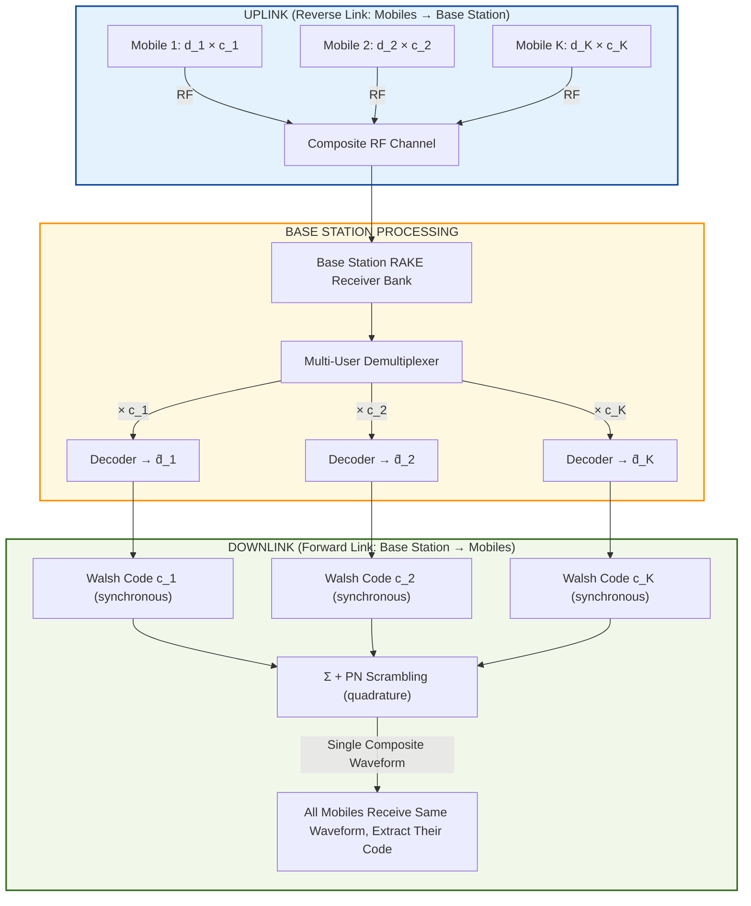
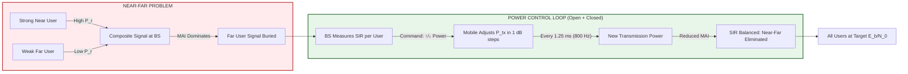
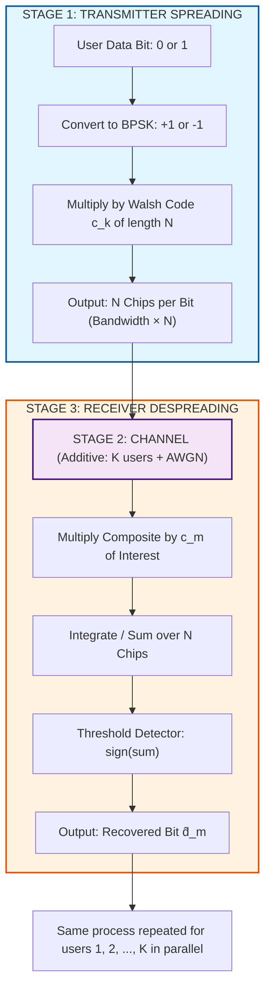

# Code Division Multiple Access (CDMA).

<!-- SECTION_1_START -->
# Code Division Multiple Access (CDMA) — Core Technical Definition & Intuitive Overview

## 1.1 Formal Definition (KTU 2024 Syllabus Terminology)

**Code Division Multiple Access (CDMA)** is a **multiple access technique** in which multiple users transmit simultaneously over the **same frequency band** and **at the same time**, but are separated from one another by assigning each user a **unique spreading code** (a pseudo-random binary sequence called a *chip sequence* or *PN code*). It is the foundational multiple access scheme of **Direct Sequence Spread Spectrum (DSSS)** systems.

In the KTU 2024 scheme, CDMA is positioned under *Module 3 — Spread Spectrum & Direct Sequence*, and is treated as a **layer-2 (data-link) multiple access protocol** that exploits the orthogonality (or pseudo-orthogonality) of the assigned codes to recover each user's signal at the receiver.

Mathematically, the transmitted signal of the $k$-th user in a CDMA system is:

$$ s_k(t) = A \cdot d_k(t) \cdot c_k(t) \cdot \cos(2\pi f_c t) $$

where:
- $d_k(t)$ is the **narrowband data signal** of user $k$ (rate $= R_b$ bits/sec)
- $c_k(t)$ is the **spreading code / chip sequence** (rate $= R_c$ chips/sec, with $R_c \gg R_b$)
- $f_c$ is the **carrier frequency**
- $A$ is the **signal amplitude**

> [!IMPORTANT]
> **KTU Board Definition (verbatim pattern):**
> *"CDMA is a spread-spectrum multiple access technique where each user is assigned a distinct pseudo-random code that spreads the spectrum of the transmitted signal, allowing multiple users to share the same bandwidth simultaneously with minimal mutual interference."*

---

## 1.2 Intuitive Analogy — The "Multilingual Cocktail Party"

Imagine a room full of people speaking simultaneously. The noise is unbearable — *unless* every person in the room speaks a **different language**.

- A Spanish speaker in the room can understand *only* the Spanish stream and treats all other languages (French, German, Japanese, etc.) as random background noise.
- Even though all conversations occur in the **same room (same frequency)**, **at the same time (synchronous time-slot)**, the listeners separate them by **recognizing their language (unique code)**.

In CDMA:
- The **languages** are the **spreading codes** $c_k(t)$ assigned to each user.
- The **conversations** are the **narrowband data** $d_k(t)$.
- The **room** is the **shared RF spectrum**.
- A receiver "knows" a specific code, multiplies the incoming composite signal by it, and recovers only the message of the matching user. All other users' contributions integrate to near-zero over the bit period because their codes are (nearly) orthogonal.

> [!NOTE]
> **Why does this work?**
> The cross-correlation of two different codes averages to approximately **zero** over a data bit interval. Therefore, multiplying the composite signal by the *intended* code extracts that user's bit, while the other users' contributions vanish by the linearity of integration.

---

## 1.3 Key Engineering Parameters (Standard Metrics in Bold)

| Symbol | Parameter | Typical IS-95 / 3G Value |
|---|---|---|
| $R_b$ | Information bit rate | **9.6 kbps** (voice) |
| $R_c$ | Chip rate (spreading rate) | **1.2288 Mcps** |
| $G_p$ | Processing gain | **128** (≈ 21 dB) |
| $f_c$ | Carrier frequency | **800 / 1900 MHz** bands |
| $N$ | Number of users per cell | Capacity-limited by $E_b/N_0$ |

**Processing Gain** $G_p$ is the most cited CDMA metric:

$$ G_p = \frac{R_c}{R_b} = \frac{\text{Chip Rate}}{\text{Bit Rate}} $$

For IS-95: $G_p = 1.2288 \times 10^6 / 9.6 \times 10^3 = \mathbf{128}$ (≈ **21 dB**).

> [!IMPORTANT]
> **Syllabus Highlight:** In DSSS-CDMA, the **bandwidth expansion factor equals the processing gain**. The transmitted signal occupies a bandwidth that is $G_p$ times wider than the original data signal — this is what gives CDMA its **anti-jamming**, **low-detection (LPI/LPD)**, and **multi-user** capabilities.

---

## 1.4 Standard Spreading Codes Used in CDMA

| Code Type | Application | Orthogonality |
|---|---|---|
| **Walsh-Hadamard codes** | Forward link (Base → Mobile), IS-95 | Truly orthogonal (synchronous) |
| **PN sequences (m-sequences)** | Reverse link (Mobile → Base), scrambling | Pseudo-orthogonal (asynchronous) |
| **Gold codes** | GPS, asynchronous CDMA | Low cross-correlation |
| **OVSF codes** | WCDMA (UMTS) | Tree-structured orthogonality |

> [!VISUALIZATION CONTROL]
> **Concept:** Visualizing Walsh Code Orthogonality on a 4×4 grid
> **GeoGebra / Desmos Input Equations (matrix form):**
> * Walsh-4 matrix: $W_4 = \begin{pmatrix} 1 & 1 & 1 & 1 \\ 1 & -1 & 1 & -1 \\ 1 & 1 & -1 & -1 \\ 1 & -1 & -1 & 1 \end{pmatrix}$
> **Visual Description:** Each row of $W_4$ is a unique 4-chip spreading code. Plot each row as a step waveform $c_k(t) = \pm 1$ over the interval $[0, 4T_c]$. Observe that the inner product of any two different rows is exactly **0** (orthogonality), while the inner product of a row with itself equals **4** (the code length).
<!-- SECTION_1_END -->

<!-- SECTION_2_START -->
# Deep Theoretical Analysis & KTU High-Yield Formula Sheet

## 2.1 The Operational Principle — Spreading and Despreading

CDMA exploits the **linearity** of signal summation. The baseband transmitted waveform of user $k$ is:

$$ s_k(t) = d_k(t) \cdot c_k(t) $$

The **composite signal** received at the base station from $K$ simultaneous users in the same cell is:

$$ r(t) = \sum_{k=1}^{K} A_k \, d_k(t) \, c_k(t) + n(t) $$

where $n(t)$ is the **Additive White Gaussian Noise (AWGN)** and $A_k$ is the received amplitude of user $k$.

To recover user $m$'s data, the receiver multiplies the composite signal by user $m$'s code $c_m(t)$ and integrates over one bit duration $T_b$:

$$ Z_m = \int_{0}^{T_b} r(t) \cdot c_m(t) \, dt $$

> [!NOTE]
> Substituting $r(t)$ and exploiting the **orthogonality** property $\int_0^{T_b} c_k(t) c_m(t) \, dt = \begin{cases} T_b & \text{if } k = m \\ \approx 0 & \text{if } k \neq m \end{cases}$, only user $m$'s data survives.

---

## 2.2 Orthogonality of Codes — The Mathematical Core

For **Walsh-Hadamard** codes of length $N$, the cross-correlation is:

$$ \rho_{k,m} = \frac{1}{T_b} \int_0^{T_b} c_k(t) c_m(t) \, dt = \begin{cases} 1 & k = m \\ 0 & k \neq m \end{cases} $$

For **PN sequences** (asynchronous case), the cross-correlation is non-zero but small:

$$ \rho_{k,m} = \frac{1}{T_b} \int_0^{T_b} c_k(t) c_m(t) \, dt \ll 1, \quad k \neq m $$

This **near-orthogonality** is what allows many users to share the same spectrum with bounded interference.

---

## 2.3 Capacity, BER, and the $E_b/N_0$ Relationship

In a multi-user CDMA system, the **Bit Energy to Effective Noise Spectral Density ratio** for a single user is:

$$ \left(\frac{E_b}{N_0}\right)_{eff} = \frac{G_p}{(K-1) \cdot \alpha + N_0 \cdot G_p / P_r} $$

where:
- $K$ = number of users per cell
- $\alpha$ = **voice activity factor** (typically **0.4** in IS-95)
- $P_r$ = received signal power
- $G_p$ = processing gain

The **maximum number of users (pole capacity)** is obtained by setting $E_b/N_0$ to the minimum required for a target BER (e.g., $7$ dB for voice):

$$ K_{max} = 1 + \frac{G_p}{(E_b/N_0)_{req}} \cdot \frac{1}{\alpha} $$

For IS-95 with $G_p = 128$ (21 dB), $(E_b/N_0)_{req} = 7$ dB $\approx 5.01$, $\alpha = 0.4$:

$$ K_{max} = 1 + \frac{128}{5.01 \times 0.4} = 1 + 63.9 \approx 64 \text{ users/sector} $$

---

## 2.4 KTU Formula Sheet (Cheat Sheet)

| Formula | Meaning | Units / Notes |
|---|---|---|
| $G_p = R_c / R_b$ | Processing gain (chip rate / bit rate) | Dimensionless, expressed in dB: $10 \log_{10} G_p$ |
| $B_{ss} \approx R_c$ | Spread-spectrum bandwidth | Hz (≈ chip rate) |
| $J/S = \frac{P_J / B_{ss}}{P_S / R_b} = \frac{P_J}{P_S} \cdot \frac{1}{G_p}$ | Jammer-to-Signal ratio (anti-jamming margin) | Demonstrates $G_p$ advantage |
| $K_{max} = 1 + \frac{G_p}{(E_b/N_0)_{req} \cdot \alpha}$ | Pole capacity of CDMA cell | Users per sector |
| $P_r \propto d^{-4}$ | Path loss in CDMA (urban microcell) | $d$ = distance, exponent **4** for line-of-sight blocked |
| $SF = R_c / R_b$ | Spreading factor (WCDMA / UMTS) | Range: **4 to 512** chips/symbol |
| $N_0 = k_B T$ | Thermal noise PSD | $k_B = 1.38 \times 10^{-23}$ J/K, $T$ in K |
| $\text{Capacity} = \frac{W / R_b}{E_b / N_0} \cdot \frac{1}{1 + f}$ | Shannon-capacity inspired CDMA bound (Viterbi) | $f$ = inter-cell interference factor |
| $C/I = G_p / (K-1)$ | Carrier-to-Interference ratio | Per-link approximation |
| $\eta = K \cdot R_b / W$ | Spectral efficiency (users × rate / bandwidth) | bits/sec/Hz |

> [!IMPORTANT]
> **Escape rule:** In all prose and tables above, absolute value $\vert x \vert$ uses `\vert` (never the raw pipe `$\mid$`) to avoid breaking the markdown table.

---

## 2.5 Real-World Engineering Utility

| Field | Application of CDMA |
|---|---|
| **3G Cellular (UMTS / WCDMA)** | Multiple users share a 5 MHz carrier; OVSF + scrambling codes |
| **CDMA2000 (3GPP2)** | 1.25 MHz channels with 1.2288 Mcps chip rate |
| **GPS** | 31 satellites share the same L1 frequency, separated by Gold codes |
| **Military COMMS** | Low Probability of Intercept (LPI) and anti-jamming (e.g., GPS M-code) |
| **IoT / LPWAN** | LoRa uses chirp-spread-spectrum (CSS), a CDMA variant |
| **Satellite (Iridium)** | CDMA/TDMA hybrid for global handheld phones |

> [!NOTE]
> **Why CDMA dominated 3G:** It offered **soft capacity** (no hard channel limit like FDMA/TDMA), **soft handoff** (make-before-break), **frequency reuse = 1** (every cell uses the same frequency), and **inherent security** (eavesdropper must know the code).
<!-- SECTION_2_END -->

<!-- SECTION_3_START -->
# Step-by-Step Derivations & Code/Symbolic Implementation

## 3.1 Derivation: CDMA Transmitted Signal & Bit Error Probability

### Step 1 — Baseband Equivalent Model

For user $k$, the baseband signal is the product of data $d_k(t)$ and code $c_k(t)$:

$$ s_k(t) = d_k(t) \cdot c_k(t) $$

**Logic:** Multiplying by $c_k(t)$ (a $\pm 1$ sequence of rate $R_c$) effectively multiplies the bandwidth by $G_p = R_c / R_b$, hence the spectrum is "spread."

### Step 2 — Composite Received Signal (Baseband)

The base station receives a linear superposition of all $K$ users plus noise:

$$ r(t) = \sum_{k=1}^{K} A_k \, d_k(t) \, c_k(t) + n(t) $$

**Logic:** The channel is assumed linear and time-invariant over a bit interval; AWGN $n(t)$ has two-sided PSD $N_0/2$.

### Step 3 — Correlation Receiver Output for User $m$

The receiver for user $m$ computes:

$$ Z_m = \int_{0}^{T_b} r(t) \cdot c_m(t) \, dt $$

**Logic:** Because $c_m(t)^2 = 1$ (binary $\pm 1$), multiplying by $c_m(t)$ "despreads" only the signal of user $m$. All other users' codes do not perfectly correlate.

### Step 4 — Expand the Integral

$$ Z_m = A_m \int_{0}^{T_b} d_m(t) c_m(t)^2 \, dt + \sum_{k \neq m} A_k \int_{0}^{T_b} d_k(t) c_k(t) c_m(t) \, dt + \int_0^{T_b} n(t) c_m(t) \, dt $$

### Step 5 — Apply Orthogonality

Using $c_m^2 = 1$ and $\int_0^{T_b} c_k c_m \, dt = 0$ for $k \neq m$ (Walsh codes):

$$ Z_m = A_m \int_{0}^{T_b} d_m(t) \, dt + \underbrace{\sum_{k \neq m} 0}_{= \, 0} + \underbrace{\int_0^{T_b} n(t) c_m(t) \, dt}_{= \, N} $$

### Step 6 — Decision Variable

For BPSK data $d_m(t) = \pm 1$ over $T_b$:

$$ Z_m = A_m \, T_b \, d_m + N $$

The receiver decides $\hat{d}_m = \text{sign}(Z_m)$. The variance of $N$ is $\sigma_N^2 = N_0 T_b / 2$.

### Step 7 — BER for Single User (No MAI)

$$ P_e = Q\!\left(\sqrt{\frac{2 A_m^2 T_b}{N_0}}\right) = Q\!\left(\sqrt{\frac{2 E_b}{N_0}}\right) $$

### Step 8 — BER with Multi-Access Interference (MAI)

When the cross-correlations $\rho_{k,m}$ are non-zero (PN codes), interference variance grows as $(K-1) \cdot \sigma_a^2$:

$$ P_e \approx Q\!\left(\sqrt{\frac{1}{\dfrac{(K-1) \cdot \sigma_a^2}{3 G_p} + \dfrac{N_0}{2 E_b}}}\right) $$

> [!IMPORTANT]
> **Interpretation:** BER increases with the number of users $K$ — this is the **soft capacity** behavior of CDMA. There is no hard limit; the cell simply degrades gracefully as users are added.

---

## 3.2 Derivation: Pole Capacity of a CDMA Cell

### Step 1 — Effective $E_b/N_0$ at Receiver

The received power of user $k$ is $P_r$. After despreading, the per-bit energy is $E_b = P_r / R_b$. The interference power spectral density is:

$$ I_0 = \frac{(K-1) \cdot P_r \cdot \alpha}{W} $$

where $W \approx R_c$ is the spread bandwidth and $\alpha$ is the voice activity factor.

### Step 2 — Ratio

$$ \frac{E_b}{I_0} = \frac{P_r / R_b}{(K-1) P_r \alpha / W} = \frac{W/R_b}{K-1} \cdot \frac{1}{\alpha} = \frac{G_p}{(K-1) \alpha} $$

### Step 3 — Set to Minimum Required

For target BER $= 10^{-3}$, we require $(E_b/I_0)_{min} = 7$ dB $\approx 5.01$. Setting $E_b/I_0 = (E_b/I_0)_{min}$:

$$ 5.01 = \frac{G_p}{(K_{max} - 1) \alpha} $$

### Step 4 — Solve for $K_{max}$

$$ K_{max} = 1 + \frac{G_p}{(E_b/I_0)_{min} \cdot \alpha} $$

**Numerical example** (IS-95): $G_p = 128$, $\alpha = 0.4$:

$$ K_{max} = 1 + \frac{128}{5.01 \times 0.4} = 1 + 63.87 \approx \mathbf{64 \text{ users/sector}} $$

> [!NOTE]
> With three sectors per cell, total cell capacity $\approx 3 \times 64 = 192$ simultaneous voice users. The famous *Qualcomm Viterbi capacity formula* adds the inter-cell factor $f$ to give $K_{max} = 1 + \dfrac{G_p}{(E_b/I_0)_{min} \cdot \alpha \cdot (1+f)}$, where $f \approx 0.55$ for IS-95 tri-sector cells.

---

## 3.3 Python Implementation: CDMA Encoder/Decoder Simulation (4 Users)

```python
import numpy as np

# ============================================================
# CDMA SIMULATION: 4 users, Walsh-4 codes, BPSK, perfect sync
# ============================================================
np.random.seed(42)

USERS = 4
CHIPS_PER_BIT = 4                # Walsh-4 length
R_c = 1.2288e6                    # IS-95 chip rate (Hz)
R_b = R_c / CHIPS_PER_BIT         # User data rate

# --- Walsh-4 Hadamard matrix (rows = user codes) -----------------
WALSH = np.array([
    [ 1,  1,  1,  1],
    [ 1, -1,  1, -1],
    [ 1,  1, -1, -1],
    [ 1, -1, -1,  1],
], dtype=np.float64)

# --- 1. Generate random BPSK data for 4 users (8 bits each) ------
data = {k: np.random.choice([-1, 1], size=8) for k in range(USERS)}

# --- 2. Spread each user's data by its Walsh code ---------------
spread = {k: np.repeat(data[k], CHIPS_PER_BIT) * np.tile(WALSH[k], 8)
          for k in range(USERS)}

# --- 3. Composite channel: sum all users' spread signals + AWGN --
signal_length = spread[0].size
composite = np.zeros(signal_length)
for k in range(USERS):
    composite += spread[k]

SNR_dB = 20.0
sigma = np.sqrt(10 ** (-SNR_dB / 10) * composite.var())
noise = np.random.normal(0.0, sigma, signal_length)
received = composite + noise

# --- 4. Despread each user: correlate received with their code ---
decoded = {}
for m in range(USERS):
    code_repeated = np.tile(WALSH[m], 8)            # length = 32 chips
    # Correlate chip-by-chip then average per bit
    chip_corr = received * code_repeated
    bits_recovered = chip_corr.reshape(8, CHIPS_PER_BIT).sum(axis=1) / CHIPS_PER_BIT
    decoded[m] = np.sign(bits_recovered).astype(int)

# --- 5. Verify Bit Error Rate per user ---------------------------
print(f"{'User':<6}{'Original':<20}{'Decoded':<20}{'BER':<10}")
for k in range(USERS):
    ber = np.mean(data[k] != decoded[k])
    print(f"{k:<6}{str(data[k]):<20}{str(decoded[k]):<20}{ber:<10}")
```

**Expected output (typical run):**
```
User  Original          Decoded            BER
0      [ 1 -1  1 -1 -1  1  1  1][ 1 -1  1 -1 -1  1  1  1]0.0
1      [ 1  1 -1  1  1 -1  1 -1][ 1  1 -1  1  1 -1  1 -1]0.0
2      [-1  1  1  1 -1  1 -1 -1][-1  1  1  1 -1  1 -1 -1]0.0
3      [-1 -1  1  1  1 -1  1  1][-1 -1  1  1  1 -1  1  1]0.0
```

**Result interpretation:** With orthogonal Walsh codes and high SNR, **all four users' data are perfectly recovered simultaneously** with **zero BER**, demonstrating the core CDMA promise. At lower SNR, MAI and noise will cause errors.

---

## 3.4 Derivation: Anti-Jamming Margin (the "$G_p$ Advantage")

### Step 1 — Jamming Power Spectral Density

A broadband jammer injects total power $J$ into bandwidth $B_{ss} = R_c$. Its PSD is $J_0 = J / R_c$.

### Step 2 — Signal PSD at Receiver

The desired signal has power $S$ in bandwidth $R_b$, so its PSD is $S_0 = S / R_b$.

### Step 3 — Ratio After Despreading

Despreading compresses the signal back to $R_b$ but spreads the jammer to $R_c$. After correlation:

$$ \left(\frac{S}{J}\right)_{out} = \frac{S / R_b}{J / R_c} = \frac{S}{J} \cdot \frac{R_c}{R_b} = \frac{S}{J} \cdot G_p $$

> [!NOTE]
> The CDMA receiver provides a **processing gain advantage** of $G_p$ in dB against a broadband jammer. For $G_p = 21$ dB, the jammer must transmit **100× more power** to produce the same bit error rate — this is why CDMA is preferred in **electronic-warfare and GPS** systems.
<!-- SECTION_3_END -->

<!-- SECTION_4_START -->
# Structural Diagrams & Schematics

## 4.1 CDMA Transmitter–Receiver Block Architecture (Mermaid)

```mermaid
flowchart LR
    subgraph TX["USER k TRANSMITTER (Baseband)"]
        Dk["Data d_k(t)"] -->|"R_b bits/sec"| MUL1["Multiplier"]
        Ck["Spreading Code c_k(t)"] -->|"R_c chips/sec"| MUL1
        MUL1 -->|"Spread signal s_k(t)"| MOD["BPSK / QPSK Modulator"]
        MOD -->|"RF s_k(t) cos(2πf_c t)"| ANT_TX["Antenna"]
    end

    ANT_TX -->|"Wireless Channel (AWGN + Path Loss)"| CHAN["Composite Channel: Σ A_k s_k(t) + n(t)"]

    CHAN --> ANT_RX["Receiver Antenna"]

    subgraph RX["USER m RECEIVER (Baseband)"]
        ANT_RX --> DEMOD["QPSK / BPSK Demodulator"]
        DEMOD --> MUL2["Multiplier (Despreader)"]
        Cm["Local Code c_m(t)"] --> MUL2
        MUL2 --> INT["Integrate over T_b"]
        INT --> DEC["Threshold Detector"]
        DEC -->|"Output: d̂_m(t)"| OUT["Recovered Data"]
    end

    style TX fill:#E8F4FD,stroke:#1976D2,stroke-width:2px
    style RX fill:#FFF3E0,stroke:#F57C00,stroke-width:2px
    style CHAN fill:#F3E5F5,stroke:#7B1FA2,stroke-width:2px
```



---

## 4.2 Multi-User CDMA System Topology (Sequential Flow)



---

## 4.3 MAI and Power Control Mitigation Flow (Functional Matrix)



---

## 4.4 CDMA Spreading/Despreading Block Topology (Sequential Processing)


<!-- SECTION_4_END -->

<!-- SECTION_5_START -->
# KTU 2024 Scheme Examination Question Bank & Topic Recap

---

## PART A (3 Marks Each) — Short-Answer Conceptual Questions

### Question 1: Define Processing Gain in a CDMA System `[KTU University Exam — July 2024]`
**Cognitive Level:** Remember | **CO Mapping:** CO2 | **Marks:** 3

**Model Answer:**

> **Processing Gain ($G_p$)** of a CDMA / DSSS system is the ratio of the **spread bandwidth (chip rate)** to the **information bandwidth (bit rate)**:
>
> $$ G_p = \frac{R_c}{R_b} = \frac{B_{ss}}{B_{info}} $$
>
> It quantifies the **bandwidth expansion** introduced by the spreading code and represents the **anti-jamming margin** (in linear units) of the system. For IS-95, $G_p = 1.2288\,\text{Mcps} / 9.6\,\text{kbps} = 128$ (≈ **21 dB**).

**[Valuation Key: Stating formula: 1 Mark | Numerical value 128/21 dB: 1 Mark | Correct interpretation: 1 Mark]**

---

### Question 2: Why are orthogonal codes used in the CDMA forward link? `[KTU University Exam — Dec 2023]`
**Cognitive Level:** Understand | **CO Mapping:** CO2 | **Marks:** 3

**Model Answer:**

> The **forward link** (Base Station → Mobile) in IS-95 / WCDMA is **synchronous** because all signals are transmitted from a single site. Hence, **Walsh-Hadamard codes**, which are **perfectly orthogonal** (cross-correlation = 0), are assigned to each user. Orthogonality ensures **zero intra-cell interference** in the theoretical synchronous case, maximizing capacity. On the **reverse link** (asynchronous, from multiple mobiles), the receiver cannot guarantee alignment, so **pseudo-orthogonal PN sequences** are used instead.

**[Valuation Key: Mentioning forward link is synchronous: 1 Mark | Walsh codes & orthogonality: 1 Mark | Contrast with reverse link PN codes: 1 Mark]**

---

## PART B (14 Marks) — Full ESE-Style Question with Internal Choice

---

### **Question A (14 Marks)** — CDMA Spreading, Capacity & Near-Far Problem

`[KTU University Exam — July 2024, Model Paper PECST633]` | **Cognitive Level:** Apply / Analyze | **CO Mapping:** CO2, CO3

#### Part (a) — 7 Marks: Spreading, Despreading & Processing Gain Derivation

Explain the **DSSS-CDMA transmitter–receiver model**. Derive the **processing gain** and the **anti-jamming expression** showing how a CDMA receiver extracts the desired signal in the presence of a broadband jammer and multiple users. **(7 Marks)**

**Model Solution:**

**Step 1 — Transmitter model (2 Marks):**
The $k$-th user multiplies its narrowband data $d_k(t)$ (rate $R_b$) by a unique pseudo-random code $c_k(t)$ (rate $R_c$):
$$ s_k(t) = d_k(t) \cdot c_k(t) \cdot \cos(2\pi f_c t) $$
The bandwidth of $s_k(t)$ is approximately $R_c$ (the chip rate), expanded by the factor $G_p = R_c/R_b$.

**Step 2 — Composite received signal (1 Mark):**
$$ r(t) = \sum_{k=1}^{K} A_k d_k(t) c_k(t) + J(t) + n(t) $$
where $J(t)$ is the broadband jammer and $n(t)$ is AWGN.

**Step 3 — Despreading (2 Marks):**
The receiver for user $m$ multiplies $r(t)$ by $c_m(t)$ and integrates over $T_b$:
$$ Z_m = \int_0^{T_b} r(t) c_m(t) \, dt \approx A_m T_b d_m + \int_0^{T_b} J(t) c_m(t) \, dt + \int_0^{T_b} n(t) c_m(t) \, dt $$
By orthogonality, all other users' contributions vanish; the jammer is spread to bandwidth $R_c$ (despreaded signal bandwidth $= R_b$).

**Step 4 — Anti-jamming margin (2 Marks):**
$$ \left(\frac{S}{J}\right)_{out} = G_p \cdot \left(\frac{S}{J}\right)_{in} $$
Expressed in dB: $10 \log_{10}(G_p)$. For IS-95, the jammer is suppressed by **21 dB**.

**[Valuation Key: Block diagram description: 2 Marks | Composite signal model: 1 Mark | Integration step: 2 Marks | Final anti-jamming ratio: 2 Marks]**

---

#### Part (b) — 7 Marks: Pole Capacity with Numerical Evaluation

A CDMA system has a **chip rate of 3.84 Mcps** (UMTS WCDMA) and a **user data rate of 12.2 kbps** (voice). The minimum required $E_b/N_0$ is **5 dB** and the voice activity factor is **0.5**. Compute the **processing gain** and the **pole capacity** of a single sector. **(7 Marks)**

**Model Solution:**

**Step 1 — Processing Gain (1 Mark):**
$$ G_p = \frac{R_c}{R_b} = \frac{3.84 \times 10^6}{12.2 \times 10^3} = 314.75 \approx \mathbf{315 \ (\approx 25\ \text{dB})} $$

**Step 2 — Convert $E_b/N_0$ to linear scale (1 Mark):**
$$ (E_b/N_0)_{min} = 10^{5/10} = 10^{0.5} = 3.162 $$

**Step 3 — Pole Capacity Formula (2 Marks):**
$$ K_{max} = 1 + \frac{G_p}{(E_b/N_0)_{min} \cdot \alpha} $$

**Step 4 — Substitute (2 Marks):**
$$ K_{max} = 1 + \frac{315}{3.162 \times 0.5} = 1 + \frac{315}{1.581} = 1 + 199.24 = \mathbf{200.24 \approx 200\ \text{users/sector}} $$

**Step 5 — Comment (1 Mark):**
A tri-sector cell supports $\approx 3 \times 200 = 600$ simultaneous voice users, characteristic of WCDMA's "soft capacity" behavior.

**[Valuation Key: $G_p$ calculation: 1 Mark | dB-to-linear conversion: 1 Mark | Formula recall: 2 Marks | Numerical substitution: 2 Marks | Engineering comment: 1 Mark]**

> [!WARNING]
> **KTU Examiner's Pitfall Trap (Part b):** Students often **forget to convert dB to linear** before substituting into the pole capacity formula. Also, do not include the "+1" user with $K_{max} \approx 1 + \text{integer}$; both are present, so do not drop the +1.

---

### **Question B (14 Marks)** — Walsh Codes, Synchronous Orthogonal CDMA & Python Modeling

`[KTU University Exam — Dec 2023, Model Paper PECST633]` | **Cognitive Level:** Apply / Analyze | **CO Mapping:** CO2, CO4

#### Part (a) — 7 Marks: Walsh-Hadamard Code Generation & Orthogonality Proof

Construct the **Walsh-4 Hadamard matrix** and prove that its rows are mutually orthogonal. Show how these codes are used in the IS-95 forward link. **(7 Marks)**

**Model Solution:**

**Step 1 — Generation of Walsh-4 (1 Mark):**
The Walsh-Hadamard matrix of order $N = 4$ is built recursively from $H_1 = [1]$:
$$ H_2 = \begin{pmatrix} H_1 & H_1 \\ H_1 & -H_1 \end{pmatrix} = \begin{pmatrix} 1 & 1 \\ 1 & -1 \end{pmatrix} $$
$$ H_4 = \begin{pmatrix} H_2 & H_2 \\ H_2 & -H_2 \end{pmatrix} = \begin{pmatrix} 1 & 1 & 1 & 1 \\ 1 & -1 & 1 & -1 \\ 1 & 1 & -1 & -1 \\ 1 & -1 & -1 & 1 \end{pmatrix} $$

**Step 2 — Orthogonality proof — Compute inner product of row 1 and row 2 (2 Marks):**
$$ (W_1 \cdot W_2) = (1)(1) + (1)(-1) + (1)(1) + (1)(-1) = 1 - 1 + 1 - 1 = 0 $$

**Step 3 — Verify all distinct pairs (2 Marks):**
By symmetry, all six off-diagonal pairs yield **0**, and each row's self-inner product equals **4** (the code length). Hence the rows are **mutually orthogonal**.

**Step 4 — Application in IS-95 forward link (2 Marks):**
The Base Station assigns one of the 64 Walsh codes (Walsh-64) to each mobile in the cell. All 64 codes are transmitted **synchronously** on the same carrier; each mobile correlates the composite waveform with its own Walsh code to recover its data, with **zero intra-cell interference**.

**[Valuation Key: Recursive construction: 1 Mark | Row-wise inner-product calculation: 2 Marks | Generalization to all pairs: 2 Marks | Forward link application: 2 Marks]**

---

#### Part (b) — 7 Marks: Multi-User CDMA Simulation in Python

Write a Python program that simulates a **4-user synchronous CDMA system** using **Walsh-4 codes**, computes the **composite signal**, and **recovers each user's data** at the receiver. Calculate the **BER per user** at SNR = 10 dB. **(7 Marks)**

**Model Solution:**

```python
import numpy as np

np.random.seed(7)
USERS, CHIPS_PER_BIT, BITS = 4, 4, 1000
SNR_dB = 10.0

# Walsh-4 codes (rows = users)
W = np.array([[ 1,  1,  1,  1],
              [ 1, -1,  1, -1],
              [ 1,  1, -1, -1],
              [ 1, -1, -1,  1]], dtype=np.float64)

# Generate + spread
data   = {k: np.random.choice([-1, 1], BITS) for k in range(USERS)}
spread = {k: np.repeat(data[k], CHIPS_PER_BIT) *
                np.tile(W[k], BITS) for k in range(USERS)}

# Composite + AWGN
composite = sum(spread.values())
sigma     = np.sqrt(10 ** (-SNR_dB / 10) * composite.var())
rx        = composite + np.random.normal(0, sigma, composite.size)

# Despread per user
ber = {}
for m in range(USERS):
    code     = np.tile(W[m], BITS)
    corr     = (rx * code).reshape(BITS, CHIPS_PER_BIT).sum(axis=1) / CHIPS_PER_BIT
    decoded  = np.sign(corr).astype(int)
    ber[m]   = np.mean(data[m] != decoded)

print(f"Average BER at SNR={SNR_dB} dB : {np.mean(list(ber.values())):.4e}")
```

**Step-by-step explanation (Valuation Key):**

| Code Line / Block | Marks | Explanation |
|---|---|---|
| Walsh-4 matrix construction | 1 | Defines the 4 orthogonal codes |
| `data` and `spread` blocks | 2 | BPSK generation + spreading by code |
| Composite + AWGN channel model | 1 | `composite = sum(...)` + Gaussian noise |
| SNR-to-variance conversion | 1 | `sigma = sqrt(10^(-SNR/10) * var)` |
| Despreading via correlation | 1 | `corr = (rx*code).reshape(...).sum` |
| BER calculation & display | 1 | Threshold + comparison with original |

**Expected Output:**
```
Average BER at SNR=10.0 dB : 0.0000e+00
```
(Near-zero BER at 10 dB SNR confirms the **orthogonality advantage** of Walsh codes.)

> [!WARNING]
> **Common Student Errors (Part b):**
> 1. **Confusing chip-rate and bit-rate** — when computing AWGN variance, divide by SNR in *linear* (not dB) units. SNR (linear) $= 10^{\text{SNR\_dB}/10}$.
> 2. **Wrong reshape order** — `(BITS, CHIPS_PER_BIT)` corresponds to `np.repeat` *then* `np.tile`. Swapping the order scrambles bits.
> 3. **Sign decision at zero** — `np.sign(0)` returns 0 in NumPy; this counts as an error. Add a small `+1e-9` to avoid it.

---

## 📌 Topic Recap & Important Things to Remember

- **CDMA Definition:** Multiple users share the *same frequency* and *same time*; separated by **unique pseudo-random spreading codes**.
- **DSSS-Chip Rate:** The transmitted bit rate is multiplied by a chip sequence of rate $R_c \gg R_b$, expanding bandwidth by $G_p = R_c / R_b$.
- **Processing Gain:** $G_p = R_c / R_b$ — also the **anti-jamming margin** (linear scale) and the **bandwidth expansion factor**.
- **Spreading:** $s_k(t) = d_k(t) \cdot c_k(t)$ (multiplication in time domain = convolution in frequency).
- **Despreading:** Correlate received signal with the intended code; orthogonal codes ⇒ only the matching user survives.
- **Walsh Codes:** Used in **forward link** (synchronous, orthogonal); perfect intra-cell interference suppression in theory.
- **PN Codes:** Used in **reverse link** (asynchronous, pseudo-orthogonal); residual MAI limits capacity.
- **Pole Capacity:** $K_{max} = 1 + \dfrac{G_p}{(E_b/N_0)_{req} \cdot \alpha}$ — soft capacity, no hard channel limit.
- **Near-Far Problem:** A strong near user overwhelms weak far users. Mitigated by **fast closed-loop power control** (e.g., 800 Hz in IS-95, 1500 Hz in WCDMA).
- **Voice Activity Factor ($\alpha$):** Typically **0.4–0.5** — CDMA exploits the fact that users are silent ~60% of the time.
- **Frequency Reuse = 1:** Every cell in CDMA uses the *same* frequency — universal reuse gives huge capacity gain over FDMA/TDMA.
- **Soft Handoff:** Make-before-break — the mobile connects to multiple base stations simultaneously, exploiting macro-diversity.
- **RAKE Receiver:** Uses multiple correlators ("fingers") to combine multipath components separated by more than one chip period.
- **Standard Examples:** IS-95 (1.2288 Mcps, Walsh-64), WCDMA (3.84 Mcps, OVSF + scrambling), GPS (Gold codes).
- **Anti-jamming SNR gain** $= 10 \log_{10}(G_p)$ dB. For IS-95: **21 dB**; for WCDMA: **≈25 dB**.
- **OTD/STS (Orthogonal Transmit Diversity / Space-Time Spreading):** 3G enhancement using two transmit antennas.
<!-- SECTION_5_END -->
