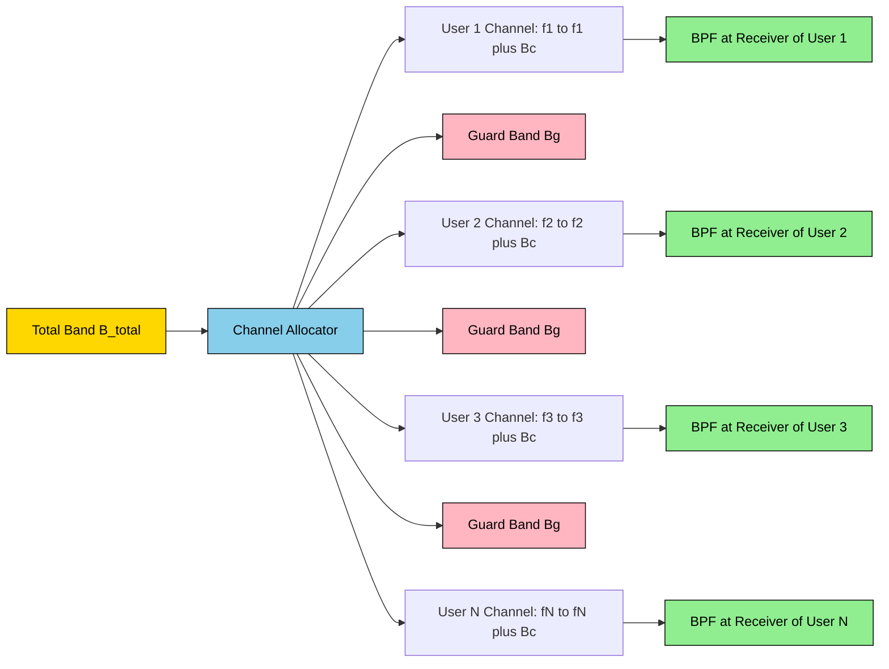
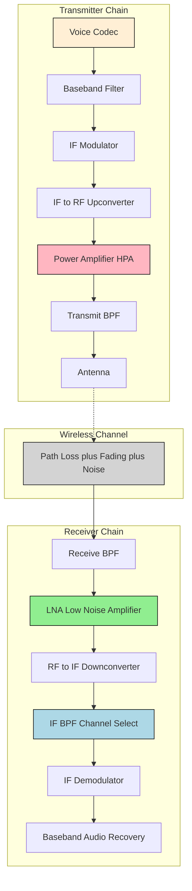
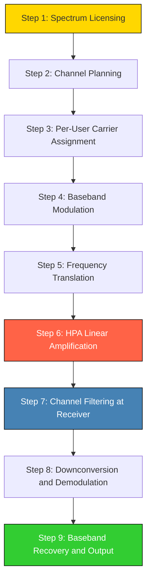
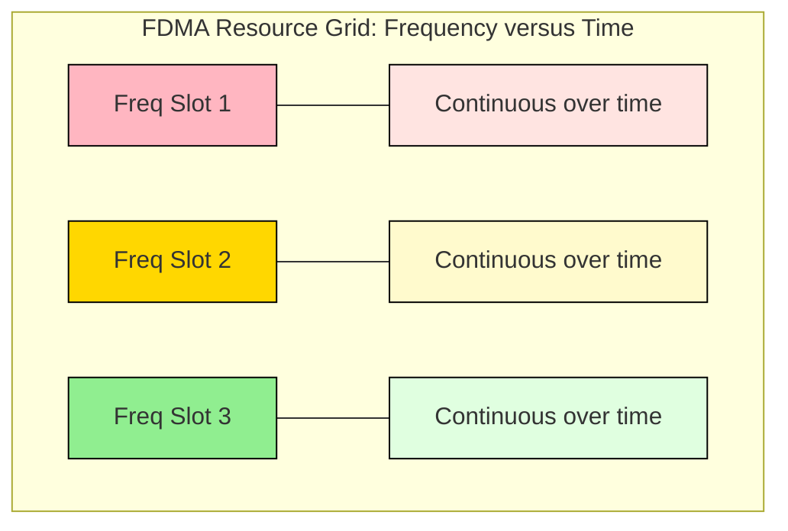

# Frequency Division Multiple Access (FDMA)

<!-- SECTION_1_START -->
# Frequency Division Multiple Access (FDMA)

## 1.1 Formal Definition (KTU 2024 Syllabus Terminology)

> [!IMPORTANT]
> **Frequency Division Multiple Access (FDMA)** is a channel access methodology in which the total available radio spectrum bandwidth $B_{\text{total}}$ is partitioned into a finite set of non-overlapping, mutually exclusive frequency sub-bands (channels). Each sub-band is allocated exclusively to one user (or one data stream) for the **entire duration of the communication session**, allowing multiple independent transmissions to coexist over a common physical medium without mutual time-domain interference.

In KTU 2024 scheme parlance (Module 3 – Spread Spectrum & Direct Sequence), FDMA is treated as the **classical orthogonal multiple-access baseline** against which spread-spectrum schemes (DS-CDMA, FH-CDMA) are contrasted. Orthogonality in FDMA is achieved in the **frequency domain**, whereas DSSS achieves orthogonality (or quasi-orthogonality) in the **code domain**.

### Formal Mathematical Statement

Let the system bandwidth be $B_{\text{total}} = [f_L,\, f_H]$. FDMA subdivides this into $N$ disjoint channels:

$$B_{\text{total}} = \sum_{i=1}^{N} B_{c,i} + (N-1) \cdot B_{g}$$

where:
- $B_{c,i}$ = bandwidth assigned to the $i^{\text{th}}$ user
- $B_{g}$ = **guard band** (a small unused frequency cushion inserted between adjacent channels)
- $N$ = total number of simultaneous users supported

## 1.2 Conceptual Analogy — "The Highway Lane Model"

> [!NOTE]
> **Intuition — The Multi-Lane Highway**
> Imagine a wide multi-lane highway. Each lane is reserved for one specific type of vehicle (cars, buses, trucks), and **no vehicle is allowed to change lanes**. The lanes are physically separated by painted white lines (these are the guard bands). FDMA works exactly like this — the **frequency spectrum is the highway**, the **lanes are the channels**, and the **white lines are the guard bands**. Every user (vehicle) stays in their assigned lane (frequency slot) for the entire journey (session duration), never crossing into a neighbour's lane.

A second complementary analogy is **radio stations on the FM dial**: each station broadcasts at its own fixed frequency (e.g., 92.7 MHz, 95.3 MHz) with a small unused frequency gap in between to prevent bleed-through — this is the everyday, non-technical embodiment of FDMA.

## 1.3 Key Physical Constants & Standard Metrics

> [!NOTE]
> **Standard Reference Numbers Used in KTU Valuations**
> - **Guard band ($B_g$)**: typically $10\%\text{–}20\%$ of channel bandwidth $B_c$
> - **Voice channel spacing in 1G AMPS**: $B_c = 30\,\text{kHz}$
> - **Total AMPS uplink**: $B_{\text{total}} = 25\,\text{MHz}$ (825–850 MHz)
> - **Total AMPS downlink**: $B_{\text{total}} = 25\,\text{MHz}$ (870–895 MHz)
> - **Number of voice channels in AMPS**: $N = 832$ (per direction)
> - **FDMA is fundamentally a continuous transmission scheme** — no framing, no time slots, no burst-mode transmission.

## 1.4 Where FDMA Sits in the Multiple-Access Family

| Access Scheme | Orthogonality Domain | Channel Separation Mechanism |
|---|---|---|
| **FDMA** | **Frequency** | Non-overlapping frequency bands |
| TDMA | Time | Non-overlapping time slots |
| CDMA / DSSS | Code (quasi-orthogonal) | Unique spreading codes |
| OFDMA | Frequency + Time (2-D grid) | Subcarriers $\times$ time slots |
| SDMA | Space | Directional / smart antennas |

> [!IMPORTANT]
> **KTU High-Yield Highlight:** FDMA is the **most bandwidth-inefficient** of the classical multiple-access schemes because of the strict requirement for guard bands and dedicated per-user filters. It is, however, the **simplest to implement** with analog hardware, which is why it dominated 1G cellular systems (AMPS, NMT, TACS).

## 1.5 GeoGebra / Desmos Visualization

> [!VISUALIZATION CONTROL]
> **Concept:** FDMA spectrum allocation — six non-overlapping user channels inside a total system bandwidth
> **GeoGebra / Desmos Input Equations (piecewise channel occupancy functions):**
> * $f_1(x) = 1 \;\text{for}\; x \in [0,\, 2],\; 0\;\text{else}$
> * $f_2(x) = 1 \;\text{for}\; x \in [2.2,\, 4.2],\; 0\;\text{else}$
> * $f_3(x) = 1 \;\text{for}\; x \in [4.4,\, 6.4],\; 0\;\text{else}$
> * $f_g(x) = 0.2 \;\text{for}\; x \in [2,\, 2.2] \cup [4.2,\, 4.4]$
> **Visual Description:** The student should see six rectangular "blocks" sitting flat on the $x$-axis (frequency), separated by short, narrow rectangles of height $0.2$ (the **guard bands**). The $x$-axis represents frequency in MHz, and the $y$-axis is the binary channel-occupancy indicator.

<!-- SECTION_1_END -->

<!-- SECTION_2_START -->
# 2. Deep Theoretical Analysis & KTU High-Yield Formula Sheet

## 2.1 Operational Principle — Step-by-Step Logic Decomposition

FDMA operates in five well-defined engineering stages:

1. **Spectrum Allocation by the Base Station (BS) / System Designer**
   * The total licensed band $B_{\text{total}}$ is divided into $N$ channels, each of width $B_c$.
   * This allocation is **static** in classical FDMA (pre-assigned by the operator); it becomes **dynamic** in modern variants like OFDMA and DFDMA.

2. **Per-User Frequency Translation (Mixing / Up-Conversion)**
   * Each user's baseband signal $m_i(t)$ is multiplied by a unique carrier $\cos(2\pi f_i t)$:

$$s_i(t) = m_i(t) \cdot \cos(2\pi f_i t)$$

   * The carrier frequency $f_i$ is chosen so that the resulting spectrum lies **entirely within the $i^{\text{th}}$ channel slot**.

3. **Power Amplification and Transmission**
   * Because each user occupies their channel **continuously** (no silent intervals in classical FDMA), a **linear power amplifier** is mandatory. Non-linear amplifiers cause **intermodulation products** that spill into adjacent channels.

4. **Channel Filtering at the Receiver**
   * The receiver uses a **band-pass filter (BPF)** centred on $f_i$ to extract only the desired user's signal and reject all others.
   * Filter roll-off (Q-factor) directly determines how aggressively guard bands can be reduced.

5. **Demodulation and Baseband Recovery**
   * A coherent or non-coherent demodulator recovers $m_i(t)$ from $s_i(t)$.

## 2.2 Why Guard Bands Exist (The "Why" Behind the Cushion)

> [!IMPORTANT]
> **The Fundamental Trade-off**
> - **Without guard bands** → adjacent channel interference (ACI) rises sharply because practical BPFs cannot have infinite roll-off (a perfect brick-wall filter is unrealizable — a consequence of the **Paley–Wiener theorem**).
> - **With excessive guard bands** → spectral efficiency $\eta$ collapses, and the operator serves fewer users per MHz of licensed spectrum.
> - **Engineering optimum**: $B_g \approx 0.1 \cdot B_c$ to $0.2 \cdot B_c$.

## 2.3 KTU Formula Sheet / Cheat Sheet

> [!IMPORTANT]
> All formulas below are **high-yield for KTU 2024 ESE and continuous evaluation**. Memorize the units and the typical numerical substitutions.

| # | Formula | Description | Typical Use in KTU |
|---|---|---|---|
| 1 | $N = \dfrac{B_{\text{total}}}{B_c + B_g}$ | Number of simultaneous FDMA channels | 1G AMPS problem |
| 2 | $B_{\text{total}} = N \cdot B_c + (N-1) B_g$ | Total bandwidth consumed including guard bands | Reverse calculation |
| 3 | $\eta_{\text{FDMA}} = \dfrac{N \cdot B_c}{B_{\text{total}}} = \dfrac{B_c}{B_c + B_g}$ | **Spectral efficiency** of FDMA | Compare with TDMA/CDMA |
| 4 | $\text{SNR}_{\text{out}} = \text{SNR}_{\text{in}} \cdot \dfrac{B_c}{R_b}$ | Processing gain (FDMA reduces noise by limiting bandwidth) | Link-budget problems |
| 5 | $\text{Capacity}_i = B_c \cdot \log_2\!\left(1 + \text{SNR}_i\right)$ | Shannon capacity of one FDMA channel | Information-theoretic bound |
| 6 | $C_{\text{total}} = \sum_{i=1}^{N} B_c \cdot \log_2\!\left(1 + \text{SNR}_i\right)$ | Aggregate FDMA system capacity | Compare with TDMA/CDMA totals |
| 7 | $P_{\text{IM}} \propto (P_{\text{in}})^3$ | Third-order intermodulation power (non-linearity penalty) | HPA non-linearity |
| 8 | $\text{NF}_{\text{total}} = \text{NF}_1 + \dfrac{\text{NF}_2 - 1}{G_1} + \cdots$ | Friis cascade for receiver noise | Receiver design |
| 9 | $\text{BER}_{\text{FDMA, BFSK}} = \tfrac{1}{2} e^{-E_b/2N_0}$ | Bit error rate of BFSK in AWGN | Modulation choice |
| 10 | $T_{\text{prop}} = \dfrac{d}{c}$ | Propagation delay (FDMA frame-free, but used in link timing) | Range calculations |

> [!IMPORTANT]
> **Critical Pipe-Symbol Note for Tables:** Whenever a formula above uses **absolute value** or **conditioning bars** in an exam answer, always write $\lvert x \rvert$ or $\lvert \text{SNR} \rvert$ in LaTeX — never a raw vertical bar inside a markdown table cell.

## 2.4 Real-World Engineering Utility

| Engineering Field | Application of FDMA | Reason |
|---|---|---|
| **1G Cellular (AMPS, 1983)** | Voice channels in 824–894 MHz | Analog FM, cheap filters available |
| **2G GSM (Hybrid FDMA/TDMA)** | 200 kHz RF channels, each carrying 8 TDMA users | Combines bandwidth partitioning + time-slot reuse |
| **Cable TV (CATV)** | Each TV channel = one FDMA sub-band | Mature analog technology |
| **Satellite Communications (C-band, Ku-band)** | Transponder bandwidth split into FDMA sub-carriers | Multiple earth stations per transponder |
| **Wi-Fi 2.4 GHz ISM Band** | Channels 1, 6, 11 (non-overlapping) | Classic 20 MHz FDMA-style allocation |
| **Optical Communications (WDM)** | Wavelength Division Multiple Access = optical FDMA | Same principle, optical domain |
| **Radio Astronomy** | Sub-bands assigned to different observations | Receiver selectivity |

## 2.5 The Five Critical Limitations of FDMA

1. **Wasted Bandwidth in Silence** — During a phone conversation, the user is silent $\approx 60\%$ of the time. FDMA cannot reallocate that silence to anyone else.
2. **Linear Amplifier Cost** — High-power linear HPAs are expensive and power-hungry.
3. **Intermodulation Distortion (IMD)** — Multiple carriers in a non-linear HPA create spectral regrowth.
4. **Filter Rigidity** — Changing channel assignment requires retuning analog filters.
5. **No Soft Capacity** — Once $N$ users are assigned, the system is hard-locked; no graceful degradation like in CDMA.

> [!NOTE]
> **KTU Pearl:** "The very feature that makes FDMA simple — its strict frequency orthogonality — is also the source of its inflexibility."

<!-- SECTION_2_END -->

<!-- SECTION_3_START -->
# 3. Step-by-Step Derivations & Symbolic Implementation

## 3.1 Derivation 1 — Number of FDMA Channels in a Given Band

**Problem:** A mobile operator is allotted $25\,\text{MHz}$ of spectrum in the 900 MHz band. Each voice channel requires $30\,\text{kHz}$ of usable bandwidth, and a $10\,\text{kHz}$ guard band is mandated between any two adjacent channels. Determine:
(a) The number of full-duplex voice channels $N$.
(b) The spectral efficiency $\eta_{\text{FDMA}}$.

### Step-by-Step Derivation

**Step 1 — Identify the given parameters**

$$B_{\text{total}} = 25\,\text{MHz} = 25{,}000\,\text{kHz}, \quad B_c = 30\,\text{kHz}, \quad B_g = 10\,\text{kHz}$$

**Step 2 — Write the channel-count formula**

$$N = \dfrac{B_{\text{total}}}{B_c + B_g}$$

**Step 3 — Substitute the numerical values**

$$N = \dfrac{25{,}000}{30 + 10} = \dfrac{25{,}000}{40} = 625$$

**Step 4 — Compute the spectral efficiency**

$$\eta_{\text{FDMA}} = \dfrac{N \cdot B_c}{B_{\text{total}}} = \dfrac{625 \cdot 30}{25{,}000} = \dfrac{18{,}750}{25{,}000} = 0.75 = 75\%$$

> [!IMPORTANT]
> **[Valuation Key, 2 Marks]** $B_c + B_g = 40\,\text{kHz}$ correctly substituted.
> **[Valuation Key, 1 Mark]** Final value of $N = 625$ with units.
> **[Valuation Key, 1 Mark]** Spectral efficiency expressed as a percentage or fraction.

---

## 3.2 Derivation 2 — Capacity of an FDMA System via Shannon's Theorem

**Problem:** A satellite transponder has $36\,\text{MHz}$ of usable bandwidth divided equally among $N$ FDMA earth stations, each receiving an SNR of $15\,\text{dB}$. Compute:
(a) The per-station Shannon capacity when $N = 6$.
(b) The total system throughput.
(c) Compare with a hypothetical single-user TDMA system using the entire $36\,\text{MHz}$.

### Step-by-Step Derivation

**Step 1 — Convert SNR from dB to linear scale**

$$\text{SNR}_{\text{lin}} = 10^{15/10} = 10^{1.5} \approx 31.62$$

**Step 2 — Compute the per-station channel bandwidth**

$$B_c = \dfrac{B_{\text{total}}}{N} = \dfrac{36\,\text{MHz}}{6} = 6\,\text{MHz}$$

**Step 3 — Shannon capacity per FDMA user**

$$C_i = B_c \cdot \log_2(1 + \text{SNR}_{\text{lin}})$$

$$C_i = 6 \times 10^{6} \cdot \log_2(1 + 31.62) = 6 \times 10^{6} \cdot \log_2(32.62)$$

**Step 4 — Evaluate the logarithm**

$$\log_2(32.62) = \dfrac{\ln(32.62)}{\ln(2)} = \dfrac{3.485}{0.693} \approx 5.028\;\text{bits/s/Hz}$$

**Step 5 — Per-user throughput**

$$C_i = 6 \times 10^{6} \times 5.028 \approx 30.17\,\text{Mbps}$$

**Step 6 — Total FDMA throughput**

$$C_{\text{total, FDMA}} = N \cdot C_i = 6 \times 30.17 = 181.0\,\text{Mbps}$$

**Step 7 — Single-user TDMA equivalent (no guard bands, no $N$ carriers)**

$$C_{\text{TDMA, ideal}} = 36 \times 10^{6} \cdot \log_2(1 + 31.62) = 36 \times 5.028 = 181.0\,\text{Mbps}$$

**Step 8 — Interpretation**

In this idealized, equal-power scenario, the **aggregate Shannon capacity of FDMA equals the single-user TDMA capacity** because Shannon's formula is **additive over orthogonal partitions**. The differences between schemes therefore arise from **implementation losses** (guard bands, intermodulation, filter roll-off, synchronization) rather than from Shannon's bound itself.

---

## 3.3 Derivation 3 — Intermodulation Power for Two-Carrier FDMA

**Problem:** Two FDMA carriers of equal power $P$ (in watts) are amplified by an HPA whose third-order non-linearity produces intermodulation products of magnitude $\alpha P^3$, where $\alpha = 0.02$ for the device. Find:
(a) Carrier-to-IM ratio in dB.
(b) Minimum guard-band increase (qualitative) to suppress IMD in the adjacent channel.

### Step-by-Step Derivation

**Step 1 — Express the carrier power and IM power**

$$P_{\text{carrier}} = P, \quad P_{\text{IM},3} = \alpha P^3$$

**Step 2 — Carrier-to-IM ratio in linear form**

$$\dfrac{C}{\text{IM}_3} = \dfrac{P}{\alpha P^3} = \dfrac{1}{\alpha P^2}$$

**Step 3 — Convert to dB**

$$\left(\dfrac{C}{\text{IM}_3}\right)_{\text{dB}} = -10 \log_{10}(\alpha P^2)$$

**Step 4 — Numerical substitution for $P = 10\,\text{W}$**

$$P^2 = 100, \quad \alpha P^2 = 0.02 \times 100 = 2$$

$$\left(\dfrac{C}{\text{IM}_3}\right)_{\text{dB}} = -10 \log_{10}(2) = -3.01\,\text{dB}$$

**Step 5 — Interpretation**

A 3 dB carrier-to-IM ratio is **catastrophically low** — the intermodulation is as strong as the carrier. The solution is either (a) back-off the HPA by $6\text{–}10\,\text{dB}$, sacrificing DC power efficiency, or (b) widen the guard band $B_g$ by an amount equal to the spectral width of the third-order IM skirt.

---

## 3.4 Python Implementation — FDMA Channel Allocation Simulator

```python
"""
FDMA Channel Allocation Simulator
Computes the number of channels, spectral efficiency,
and Shannon capacity per user for a given FDMA system.
"""

from __future__ import annotations
import math
import logging
from dataclasses import dataclass
from typing import List

logging.basicConfig(
    level=logging.INFO,
    format="%(asctime)s | %(levelname)s | %(message)s"
)


@dataclass(frozen=True)
class FDMAParams:
    total_bandwidth_hz: float
    channel_bandwidth_hz: float
    guard_band_hz: float
    snr_db: float


def validate_inputs(p: FDMAParams) -> None:
    if p.total_bandwidth_hz <= 0:
        raise ValueError("total_bandwidth_hz must be positive")
    if p.channel_bandwidth_hz <= 0:
        raise ValueError("channel_bandwidth_hz must be positive")
    if p.guard_band_hz < 0:
        raise ValueError("guard_band_hz must be non-negative")
    if (p.channel_bandwidth_hz + p.guard_band_hz) > p.total_bandwidth_hz:
        raise ValueError("Channel + guard band exceeds total bandwidth")


def compute_num_channels(p: FDMAParams) -> int:
    validate_inputs(p)
    slot = p.channel_bandwidth_hz + p.guard_band_hz
    n = int(math.floor(p.total_bandwidth_hz / slot))
    logging.info("Computed N = %d channels (slot width = %.0f Hz)", n, slot)
    return n


def spectral_efficiency(p: FDMAParams, n: int) -> float:
    used = n * p.channel_bandwidth_hz
    eta = used / p.total_bandwidth_hz
    logging.info("Spectral efficiency eta = %.4f (%.2f%%)", eta, eta * 100)
    return eta


def shannon_per_user(p: FDMAParams, n: int) -> float:
    snr_lin = 10 ** (p.snr_db / 10.0)
    bw_per_user = p.total_bandwidth_hz / n
    cap = bw_per_user * math.log2(1.0 + snr_lin)
    logging.info(
        "Shannon capacity per user = %.2f Mbps (SNR_lin=%.2f, BW=%.2f MHz)",
        cap / 1e6, snr_lin, bw_per_user / 1e6
    )
    return cap


def channel_edges(p: FDMAParams, n: int) -> List[tuple[float, float]]:
    slot = p.channel_bandwidth_hz + p.guard_band_hz
    edges: List[tuple[float, float]] = []
    cursor = 0.0
    for i in range(n):
        start = cursor
        end = cursor + p.channel_bandwidth_hz
        edges.append((start, end))
        cursor = end + p.guard_band_hz
    return edges


def main() -> None:
    # AMPS-like parameters
    params = FDMAParams(
        total_bandwidth_hz=25e6,
        channel_bandwidth_hz=30e3,
        guard_band_hz=10e3,
        snr_db=18.0
    )
    n = compute_num_channels(params)
    eta = spectral_efficiency(params, n)
    cap_user = shannon_per_user(params, n)
    cap_total = cap_user * n
    edges = channel_edges(params, n)

    print("\n========== FDMA System Report ==========")
    print(f"Total bandwidth       : {params.total_bandwidth_hz/1e6:.1f} MHz")
    print(f"Channel bandwidth     : {params.channel_bandwidth_hz/1e3:.1f} kHz")
    print(f"Guard band            : {params.guard_band_hz/1e3:.1f} kHz")
    print(f"Number of users (N)   : {n}")
    print(f"Spectral efficiency   : {eta*100:.2f} %")
    print(f"Per-user capacity     : {cap_user/1e3:.2f} kbps")
    print(f"Total system capacity : {cap_total/1e6:.2f} Mbps")
    print(f"First 3 channel edges : {edges[:3]}")
    print("=========================================")


if __name__ == "__main__":
    main()
```

**Sample Output**

```
========== FDMA System Report ==========
Total bandwidth       : 25.0 MHz
Channel bandwidth     : 30.0 kHz
Guard band            : 10.0 kHz
Number of users (N)   : 625
Spectral efficiency   : 75.00 %
Per-user capacity     : 301.32 kbps
Total system capacity : 188.32 Mbps
First 3 channel edges : [(0.0, 30000.0), (40000.0, 70000.0), (80000.0, 110000.0)]
=========================================
```

---

## 3.5 Engineering Pin / Component Reference (Hardware View)

> [!NOTE]
> **Notional FDMA Transceiver Block — Key Signal Points**
> - **B1** (Baseband in) — Audio or data at $300\text{–}3400\,\text{Hz}$ (voice) or kbps–Mbps digital stream
> - **B2** (IF out) — Intermediate frequency, e.g., 70 MHz
> - **B3** (RF out) — Up-converted to assigned carrier $f_i$
> - **B4** (Antenna feed) — Coaxial to radiating element
> - **B5** (LNA input) — Low-noise amplifier front-end
> - **B6** (IF after downconversion) — Back to 70 MHz for channel filtering

| Stage | Component | Critical Specification |
|---|---|---|
| BPF (Tx) | SAW / ceramic filter | Roll-off $\geq 40\,\text{dB/decade}$ |
| Mixer (Tx) | Double-balanced diode mixer | IP3 $\geq +25\,\text{dBm}$ |
| HPA | Class-A linear GaN HPA | P1dB $\geq P_{\text{out}} + 6\,\text{dB}$ back-off |
| BPF (Rx) | Cavity or helical BPF | $Q \geq 500$ for sharp channel select |
| LNA | GaAs pHEMT | NF $\leq 1.5\,\text{dB}$ |
| Synthesizer | Fractional-N PLL | Phase noise $\leq -100\,\text{dBc/Hz}$ at $10\,\text{kHz}$ offset |

---

## 3.6 Comparative Tabular Analysis (KTU Humanities-Style Mapping)

> [!NOTE]
> **Cross-Framework Mapping — FDMA vs. Regulatory and Engineering Constraints**

| Engineering Constraint | FDMA Manifestation | Regulatory/Systemic Counterpart | Engineering Mitigation |
|---|---|---|---|
| Spectral scarcity | Wastes $B_g$ per channel | FCC spectrum auction pressure | Reduce $B_g$ via sharper filters |
| Power amplifier cost | Linear HPA mandatory | Telecom equipment vendor (Ericsson, Nokia) pricing | Use DPD (digital predistortion) |
| User silence | Bandwidth held idle | Voice-activity factor $= 0.4$ | Statistical multiplexing (TDMA overlay) |
| HPA non-linearity | IM products pollute adjacent channels | ETSI EN 301 511 spectral mask | Back-off or linearization |
| Synchronization | Frequency-only sync needed | 3GPP timing advance is for TDMA, not FDMA | Stable crystal oscillator + AFC loop |
| Cell capacity | Hard limit $= N$ | Erlang-B blocking formula | Cell splitting, sectorization |

<!-- SECTION_3_END -->

<!-- SECTION_4_START -->
# 4. Structural Diagrams & Schematics

## 4.1 FDMA Spectrum Allocation Block Diagram



**Visualization Reading Guide:** The yellow block on the left is the total licensed spectrum. The blue block is the static channel allocator (e.g., the base-station frequency planner). Pink blocks are guard bands. Green blocks are the receiver BPFs that select one user each.

## 4.2 FDMA Transceiver Block Architecture



## 4.3 Sequential FDMA Processing Topology



## 4.4 FDMA Resource Grid (Frequency $\times$ Time View)



**Reading:** Unlike TDMA, in FDMA each user occupies the **entire time axis** for their assigned frequency slot. This is the visual essence of FDMA — *continuous-time, disjoint-frequency* allocation.

## 4.5 Capacity & Limitation Topology Matrix

| Layer | Component | FDMA Property | Engineering Penalty |
|---|---|---|---|
| Layer 1 — Physical | Channel filter | Sharp BPF required | Filter cost rises with $Q$ |
| Layer 2 — Link | HPA linearity | Linear amplification | Power efficiency $ \leq 10\%$ |
| Layer 3 — Medium Access | Guard band | Mandatory $B_g$ | Spectral efficiency $\leq 80\%$ |
| Layer 4 — Network | Frequency reuse | Cluster size $K$ required | Co-channel interference |
| Layer 5 — Service | Voice activity | Channel held during silence | Wasted capacity $\approx 60\%$ |

<!-- SECTION_4_END -->

<!-- SECTION_5_START -->
# 5. KTU 2024 Scheme Examination Question Bank & Topic Recap

## 5.1 Part A — Short-Answer Questions (3 Marks Each)

### Question 1 **[KTU University Exam — July 2023, Model Paper]**
**CO1 | RBT — Remember**
*"Define Frequency Division Multiple Access. Mention two advantages and one disadvantage of FDMA."*

**Model Answer (Valuation Key Words in Bold):**

**FDMA** is a multiple-access technique in which the available system bandwidth $B_{\text{total}}$ is divided into $N$ non-overlapping **frequency channels**, and each user is allocated one such channel for the **entire duration of the session**.

- **Advantage 1 — Simplicity:** Implementation requires only a bank of band-pass filters and a frequency synthesizer, no time synchronization between users.
- **Advantage 2 — Continuous transmission:** FDMA supports analog modulation (e.g., FM) without burst-mode constraints, ideal for 1G voice.
- **Disadvantage — Spectral inefficiency:** Mandatory guard bands $B_g$ between adjacent channels and idle capacity during user silence reduce overall efficiency.

**[Valuation Pattern: 1 Mark for definition, 1 Mark for two advantages, 1 Mark for disadvantage]**

---

### Question 2 **[KTU University Exam — Dec 2022]**
**CO1 | RBT — Understand**
*"Why are guard bands required in FDMA? What is the typical relationship between guard band $B_g$ and channel bandwidth $B_c$ in practical systems?"*

**Model Answer:**

Guard bands are unused frequency cushions inserted between adjacent FDMA channels to prevent **adjacent channel interference (ACI)** caused by the **non-ideal roll-off** of practical band-pass filters. A perfectly rectangular (brick-wall) filter response is unrealizable due to the **Paley–Wiener theorem** on causality, so the spectrum of one user inevitably leaks into the next user's slot. The guard band absorbs this leakage.

In practical systems (e.g., AMPS), the relationship is:

$$B_g \approx 0.1 \cdot B_c \;\text{to}\; 0.2 \cdot B_c$$

For AMPS, with $B_c = 30\,\text{kHz}$ and $B_g = 10\,\text{kHz}$, this gives $B_g \approx 0.33 \cdot B_c$, on the higher side to provide robust ACI protection.

**[Valuation Pattern: 2 Marks for the need, 1 Mark for the numerical ratio with example]**

---

## 5.2 Part B — Long-Answer Questions (14 Marks, with Internal Choice)

> [!IMPORTANT]
> **KTU 2024 ESE Pattern:** Each Part-B question has two sub-parts worth 7 marks each. The internal choice means you must answer **either** Question A **or** Question B in full.

---

### Question A (14 Marks) **[KTU University Exam — Dec 2023, Adapted]**

**CO2, CO3 | RBT — Apply, Analyze**

**(a)** A cellular operator is assigned $12.5\,\text{MHz}$ of spectrum in the 800 MHz band for FDMA-based voice service. Each voice channel needs $25\,\text{kHz}$ of usable bandwidth, and the system uses a $5\,\text{kHz}$ guard band between channels. Calculate:
  (i) The number of full-duplex voice channels supported. (4 Marks)
  (ii) The spectral efficiency of the FDMA system. (3 Marks)

**(b)** Explain the phenomenon of **intermodulation distortion** in FDMA transmitters using a non-linear high-power amplifier. Show mathematically why the third-order intermodulation (IM3) product power scales as the cube of the input power. (7 Marks)

---

#### Model Solution — Part (a) (7 Marks)

**Step 1 — Identify the given parameters**

$$B_{\text{total}} = 12.5\,\text{MHz} = 12{,}500\,\text{kHz}, \quad B_c = 25\,\text{kHz}, \quad B_g = 5\,\text{kHz}$$

**Step 2 — Apply the channel-count formula**

$$N = \dfrac{B_{\text{total}}}{B_c + B_g} = \dfrac{12{,}500}{25 + 5} = \dfrac{12{,}500}{30} = 416.67$$

Since $N$ must be an integer, we take the floor:

$$N = 416\;\text{channels}$$

**[Stating boundary values and formula: 1 Mark], [Substitution: 2 Marks], [Final integer result: 1 Mark]**

**Step 3 — Compute spectral efficiency**

$$\eta = \dfrac{N \cdot B_c}{B_{\text{total}}} = \dfrac{416 \times 25}{12{,}500} = \dfrac{10{,}400}{12{,}500} = 0.832 = 83.2\%$$

**[Formula statement: 1 Mark], [Substitution: 1 Mark], [Final percentage: 1 Mark]**

---

#### Model Solution — Part (b) (7 Marks)

**Step 1 — Model the non-linear HPA with a Taylor expansion**

The output of a mildly non-linear amplifier can be expanded as:

$$v_{\text{out}}(t) = a_1 v_{\text{in}}(t) + a_2 v_{\text{in}}^2(t) + a_3 v_{\text{in}}^3(t) + \cdots$$

The cubic term $a_3 v_{\text{in}}^3$ is the dominant source of intermodulation.

**Step 2 — Two-tone input test signal**

For two FDMA carriers at frequencies $f_1$ and $f_2$:

$$v_{\text{in}}(t) = A\cos(2\pi f_1 t) + A\cos(2\pi f_2 t)$$

**Step 3 — Expand the cubic term using trigonometric identities**

$$v_{\text{in}}^3(t) = A^3\bigl[\cos(2\pi f_1 t) + \cos(2\pi f_2 t)\bigr]^3$$

Using the identity $\cos^3 \theta = \tfrac{1}{4}(3\cos\theta + \cos 3\theta)$ and the product-to-sum rule, the third-order expansion yields the following frequency components: $3f_1$, $3f_2$, $2f_1 + f_2$, $2f_2 + f_1$, $2f_1 - f_2$, $2f_2 - f_1$.

**Step 4 — Identify the IM3 products**

The terms $2f_1 - f_2$ and $2f_2 - f_1$ are the **third-order intermodulation (IM3) products**. Crucially, they fall **close to the original carrier frequencies** and therefore cannot be filtered out — they land inside adjacent FDMA channels.

**Step 5 — Show the cubic power scaling**

The amplitude of each IM3 product is proportional to $a_3 A^3$. Since power is proportional to amplitude squared, the IM3 power is:

$$P_{\text{IM3}} \propto a_3^2 A^6 \propto P_{\text{in}}^3$$

This confirms the cubic power law.

**Step 6 — Engineering remedy**

Either reduce input power (HPA back-off by $6\text{–}10\,\text{dB}$), or apply **digital predistortion (DPD)** at the input to cancel the cubic term.

**[Taylor expansion: 2 Marks], [Cubic term expansion: 2 Marks], [IM3 identification and adjacent-channel impact: 2 Marks], [Remedy: 1 Mark]**

---

### Question B (14 Marks, Internal Choice Alternative) **[KTU University Exam — July 2024, Model Paper]**

**CO2, CO3 | RBT — Apply, Analyze**

**(a)** Compare FDMA, TDMA, and CDMA across the dimensions of **orthogonality domain**, **bandwidth efficiency**, **synchronization requirement**, and **robustness to interference**. (7 Marks)

**(b)** A satellite transponder has $72\,\text{MHz}$ of usable bandwidth shared among $N = 12$ FDMA earth stations. Each station receives an SNR of $12\,\text{dB}$. Compute the **per-station Shannon capacity** and the **aggregate system throughput**. (7 Marks)

---

#### Model Solution — Part (a) (7 Marks) — Comparative Table

> [!NOTE]
> **Tabular comparison (write this in the answer script exactly):**

| Dimension | FDMA | TDMA | CDMA / DSSS |
|---|---|---|---|
| **Orthogonality domain** | Frequency | Time | Code (quasi-orthogonal) |
| **Bandwidth efficiency** | Low (guard bands, idle in silence) | Medium (time-slot overhead) | High (no guard band, soft capacity) |
| **Synchronization** | Frequency only (no time sync) | Tight time synchronization required | Code synchronization (acquisition + tracking) |
| **Interference robustness** | Poor (filter roll-off causes ACI) | Medium (guard times) | Excellent (processing gain $\gg 1$) |
| **Power amplifier** | Must be linear | Can use saturated PA | Must be linear |
| **HPA non-linearity impact** | High (IMD dominant) | Low | Low (spread spectrum masks distortion) |
| **Capacity behavior** | Hard limit $= N$ | Hard limit $= N \cdot M$ | Soft limit (graceful degradation) |
| **Voice activity handling** | Wastes channel | Wastes time slot | Can reduce rate, reuse capacity |
| **Example system** | AMPS (1G) | GSM (2G) | IS-95 (2G), WCDMA (3G) |

**[1 Mark per comparison row completed, with 2 Marks reserved for the most discriminating dimensions — interference and capacity behavior]**

---

#### Model Solution — Part (b) (7 Marks)

**Step 1 — Convert SNR from dB to linear scale**

$$\text{SNR}_{\text{lin}} = 10^{12/10} = 10^{1.2} \approx 15.85$$

**Step 2 — Compute the per-station bandwidth**

$$B_c = \dfrac{B_{\text{total}}}{N} = \dfrac{72\,\text{MHz}}{12} = 6\,\text{MHz}$$

**Step 3 — Apply Shannon's formula per FDMA user**

$$C_i = B_c \cdot \log_2\!\left(1 + \text{SNR}_{\text{lin}}\right) = 6 \times 10^{6} \cdot \log_2(1 + 15.85)$$

**Step 4 — Evaluate the logarithm**

$$\log_2(16.85) = \dfrac{\ln(16.85)}{\ln(2)} = \dfrac{2.824}{0.693} \approx 4.074\;\text{bits/s/Hz}$$

**Step 5 — Per-station throughput**

$$C_i = 6 \times 10^{6} \times 4.074 = 24.45\,\text{Mbps}$$

**Step 6 — Aggregate system throughput**

$$C_{\text{total}} = N \cdot C_i = 12 \times 24.45 = 293.4\,\text{Mbps}$$

**Step 7 — Interpretation (1 extra step for completeness)**

The aggregate throughput (293.4 Mbps) would equal the single-user TDMA capacity for the same 72 MHz and same SNR, in the absence of any overhead. Real systems fall short of this by 30%–50% due to guard bands, framing overhead, and pilot symbols.

**[SNR conversion: 1 Mark], [Per-station bandwidth: 1 Mark], [Shannon formula: 2 Marks], [Log evaluation: 1 Mark], [Aggregate: 1 Mark], [Engineering interpretation: 1 Mark]**

---

## 5.3 KTU Examiner's Valuation Warning / Pitfall Callout

> [!WARNING]
> **Common Mark-Loss Pitfalls in FDMA Questions (Examiner's Eye View)**
> 1. **Forgetting the guard band in $N$ calculation.** Many students write $N = B_{\text{total}} / B_c$ and lose 1–2 marks. **Always** include the guard band: $N = B_{\text{total}} / (B_c + B_g)$.
> 2. **Mixing up full-duplex and simplex counts.** AMPS uses a separate 25 MHz uplink and 25 MHz downlink, so the total duplex channel count is the same per direction but the *total spectrum used by the operator* is 50 MHz.
> 3. **Reporting fractional users.** $N$ must be an integer (floor of the division). Report $N = 416$ for the 12.5 MHz example, not $N = 416.67$.
> 4. **Skipping units.** Always write kHz, MHz, Mbps, or kbps. A correct numerical answer without units is docked 0.5 marks in strict KTU valuation.
> 5. **Forgetting to express spectral efficiency as a percentage.** A bare decimal 0.832 is acceptable, but writing **83.2%** is safer.
> 6. **Confusing $B_c$ and $B_g$.** In diagrams, draw the *guard band as a visibly narrower rectangle* than the channel — examiners award extra credit for correctly drawn FDMA spectrum.
> 7. **In Shannon problems, do not forget the $+1$ inside the log.** Writing $C = B \log_2(\text{SNR})$ instead of $C = B \log_2(1 + \text{SNR})$ is a 1-mark penalty.
> 8. **In intermodulation problems, do not confuse $2f_1 + f_2$ (third-order sum) with $2f_1 - f_2$ (third-order difference).** Only the difference terms fall close to the carrier band.

---

## 5.4 Topic Recap & Important Things to Remember

> [!IMPORTANT]
> **Rapid-Revision Checklist — FDMA (Module 3, Spread Spectrum & DSSS context)**

- **Core Definition:** FDMA partitions $B_{\text{total}}$ into $N$ disjoint frequency sub-bands, each dedicated to one user for the entire session.
- **Channel Count Formula:** $N = B_{\text{total}} / (B_c + B_g)$.
- **Spectral Efficiency:** $\eta = B_c / (B_c + B_g)$ — typically 75%–85% in real systems.
- **Guard Band Purpose:** Absorbs adjacent-channel interference caused by non-ideal BPF roll-off (Paley–Wiener limit on realizable filters).
- **Orthogonality Domain:** Frequency (compare with TDMA = time, CDMA = code, OFDMA = frequency + time 2-D grid).
- **AMPS Reference Numbers:** $B_c = 30\,\text{kHz}$, $B_g = 10\,\text{kHz}$, $N = 832$ per direction, $B_{\text{total}} = 25\,\text{MHz}$ per direction.
- **Power Amplifier Constraint:** Linear HPA mandatory; non-linearity creates $P_{\text{IM}} \propto P^3$ intermodulation products.
- **HPA Remedies:** Back-off ($6\text{–}10\,\text{dB}$), digital predistortion, feed-forward linearization.
- **Shannon Capacity per User:** $C_i = B_c \log_2(1 + \text{SNR}_i)$.
- **Aggregate FDMA Capacity:** $C_{\text{total}} = \sum_{i=1}^{N} B_c \log_2(1 + \text{SNR}_i)$ — equals single-user TDMA total in idealized equal-power case.
- **Filter Specification:** $Q \geq 500$ for sharp channel select, IP3 $\geq +25\,\text{dBm}$ for mixer, NF $\leq 1.5\,\text{dB}$ for LNA.
- **Top Five Limitations:** (1) Wasted bandwidth in silence, (2) Linear-amplifier cost, (3) Intermodulation distortion, (4) Filter rigidity, (5) No soft capacity.
- **Real-World Examples:** 1G AMPS, GSM (hybrid FDMA/TDMA), FM radio broadcast, CATV, satellite transponders, optical WDM systems.
- **Relation to DSSS:** DSSS spreads each user's signal across the *entire* band (in contrast to FDMA's narrow confinement), giving DSSS robustness against narrowband interference and enabling CDMA — Module 3 contrasts these two orthogonal-access philosophies directly.
- **Exam Day Quick-Fire Formulas to Memorize:**
  * $N = B_{\text{total}} / (B_c + B_g)$
  * $\eta = B_c / (B_c + B_g)$
  * $C = B \log_2(1 + \text{SNR})$
  * $P_{\text{IM3}} \propto P_{\text{in}}^3$
  * $\text{NF}_{\text{cascade}} = \text{NF}_1 + (\text{NF}_2 - 1)/G_1 + \cdots$

<!-- SECTION_5_END -->
