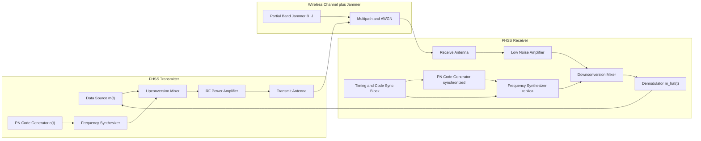
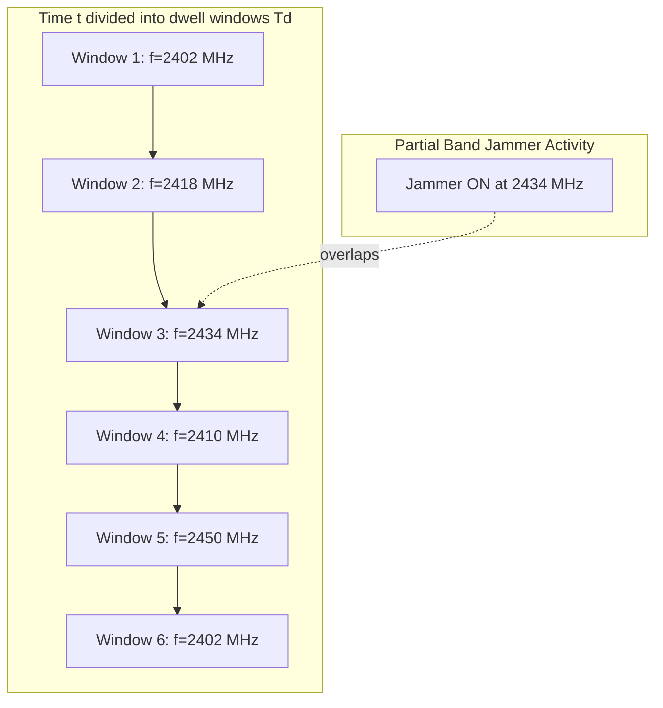
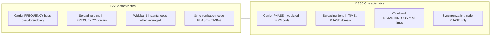

# Frequency hopping.

<!-- SECTION_1_START -->
# Frequency Hopping Spread Spectrum (FHSS) — Core Technical Definition & Intuitive Overview

## 1.1 Formal KTU 2024 Definition

**Frequency Hopping Spread Spectrum (FHSS)** is a spread-spectrum modulation technique in which the carrier frequency of the transmitted signal is rapidly switched (or *hopped*) among many distinct frequency channels, using a **pseudo-random sequence (PN sequence)** generated from a deterministic algorithm known to both the transmitter and the receiver. The total occupied bandwidth $B_{ss}$ is much larger than the minimum bandwidth $B_c$ required to transmit the information signal, satisfying the **spread-spectrum criterion** of the 2024 Scheme syllabus (Module 3: Spread Spectrum and Direct Sequence).

Formally, the transmitted signal can be represented as:

$$
s(t) = A \cdot m(t) \cdot \cos\!\left[ 2\pi f_c(t) \cdot t + \phi(t) \right]
$$

where the carrier frequency $f_c(t)$ is *not constant* but is a piecewise-constant function that changes at discrete intervals $T_d$ (called the **dwell time**) according to a pseudo-random code $c(t)$.

> [!IMPORTANT]
> **KTU Syllabus Highlight (PECST633, Module 3):** FHSS is studied alongside Direct Sequence Spread Spectrum (DSSS) under the umbrella of *Code-Domain Multiple Access*. The 2024 Scheme specifically expects you to be able to **differentiate** the two techniques, **derive** the processing gain, and **analyse** the slow-versus-fast hopping distinction.

---

## 1.2 Conceptual Analogy — The "Changing Movie-Seat" Intuition

Imagine two spies (Alice the transmitter and Bob the receiver) meeting in a 2000-seat cinema. The message is whispered in 0.6-second bursts. If Alice sits in seat \#117 for the first burst, then jumps to seat \#812, then to seat \#41 — all according to a pre-shared *seat plan* — an eavesdropper (Eve) trying to track her will be listening to the wrong seat most of the time. Eve hears only **noise**.

- **The seats** = the 79 (or 1600+) available carrier frequencies in the band.
- **The seat plan** = the **PN sequence** (a pseudo-random number that both Alice and Bob know).
- **Each 0.6-second window** = the **dwell time** $T_d$.
- **Eve's confusion** = the **interference rejection** of spread spectrum.

A stationary narrowband jammer, on the other hand, is like a spotlight that illuminates one seat. By the time the jammer locks on, Alice has already hopped away.

> [!NOTE]
> **Physical constants / standard metrics used in FHSS literature:**
> - Bluetooth Classic: $N = 79$ channels, $\Delta f = 1\text{ MHz}$, **hop rate** $R_h = 1600$ hops/s, $T_d = 625\,\mu s$.
> - Military HAVE-QUICK / Link-16: $R_h$ can reach **77,000 hops/s** (fast hopping).
> - GSM uses a *slow-hopping* scheme with **217 hops/s** over a 200 kHz channel raster.

---

## 1.3 GeoGebra / Desmos Visualization

> [!VISUALIZATION CONTROL]
> **Concept:** Time–Frequency representation of an FHSS hop pattern showing eight narrowband channels across the $2.4$–$2.483$ GHz ISM band.
>
> **GeoGebra / Desmos Input Equations / Points:**
> * Plot points: $(t_i,\, f_i)$ for $t_i \in \{0, 0.625, 1.25, 1.875, \dots\}$ ms and $f_i \in \{2402,\, 2410,\, 2418,\, 2426,\, 2434,\, 2442,\, 2450,\, 2458\}$ MHz (a representative Bluetooth-like sequence).
> * Horizontal segments at $y = f_i$ of length $T_d$ connect consecutive points.
> * Overlay the **jamming signal** as a single shaded rectangle covering $f = 2426$ MHz during the interval $t \in [1.25,\, 1.875]\text{ ms}$.
>
> **Visual Description:** The student should observe a staircase-like "comb" pattern tracing the receiver’s instantaneous frequency. The jamming rectangle overlaps the signal during exactly **one dwell window**, demonstrating that $\tfrac{1}{8}$ (12.5%) of the transmission is affected — the rest is safe because the carrier has already moved.

---

## 1.4 Core Terminology Checklist

| Term | Symbol | Meaning |
| :--- | :---: | :--- |
| Hop | — | One discrete change of carrier frequency |
| Dwell Time | $T_d$ | Duration spent on a single frequency |
| Hop Rate | $R_h$ | Number of hops per second, $R_h = 1/T_d$ |
| Hop Set | $\mathcal{F}$ | The pool of $N$ allowable carrier frequencies |
| PN Sequence | $c(t)$ | Pseudo-noise code that selects the next hop |
| Symbol Period | $T_s$ | Duration of one information symbol |
| Chip Period | $T_c$ | Minimum time-resolution of the hop change |

<!-- SECTION_1_END -->

<!-- SECTION_2_START -->
# Deep Theoretical Analysis & KTU High-Yield Formula Sheet

## 2.1 Operational Principle — The "Why" and the "How"

**Why** hop? Two engineering motivations:
1. **Frequency-diversity gain.** A specific narrowband interferer (microwave oven, co-located Wi-Fi, intentional jammer) destroys only the dwell in which it overlaps. If the interferer occupies $B_J$ Hz and each channel is $B_c$ Hz, the probability of collision per hop is:

$$
P_{\text{hit}} = \frac{B_J}{B_{ss}}
$$

2. **Security and low probability of intercept (LPI).** Without the PN code, an eavesdropper cannot reconstruct the carrier trail.

**How** does it work? The mechanism is a closed-loop synchronization between a **PN code generator** at the transmitter and an identical one at the receiver, both driven by a stable clock. The PN code index $k \in \{0, 1, \dots, N-1\}$ selects the carrier frequency from a lookup table (the *frequency synthesizer*). The receiver tracks the same code (with a phase offset) and de-hops before demodulation.

---

## 2.2 Slow Hopping vs. Fast Hopping

This is the **single most-tested distinction** in KTU Module 3 questions.

| Mode | Relationship | Consequence |
| :--- | :--- | :--- |
| **Slow FHSS** | $T_d \ge T_s$ (one or more symbols per hop) | Easier to synchronize; lower hardware cost; used in Bluetooth and GSM |
| **Fast FHSS** | $T_d \lt T_s$ (multiple hops per symbol) | Stronger jamming resistance; requires equalization; used in military radios (HAVE-QUICK) |

Mathematically, the number of hops per symbol is:

$$
H = \frac{T_s}{T_d} = T_s \cdot R_h
$$

- $H \ge 1 \Rightarrow$ **Slow FHSS**
- $H \lt 1 \Rightarrow$ **Fast FHSS**

---

## 2.3 Processing Gain of FHSS

The processing gain $G_p$ quantifies the spread-spectrum advantage:

$$
G_p = \frac{B_{ss}}{B_c} = N
$$

where $N$ is the number of available channels. In **decibels**:

$$
G_{p,\text{dB}} = 10 \log_{10}(N)
$$

For Bluetooth: $N = 79 \Rightarrow G_{p,\text{dB}} \approx 18.97\text{ dB}$.

---

## 2.4 KTU Formula Sheet / Cheat Sheet

> [!NOTE]
> The following table is the *minimum* set of equations the 2024 Scheme board expects you to memorize for Module 3 derivations. The vertical bar is rendered with $\vert$ to preserve markdown.

| # | Formula | Description |
| :--- | :--- | :--- |
| 1 | $R_h = \dfrac{1}{T_d}$ | Hop rate (Hz) |
| 2 | $H = T_s \cdot R_h$ | Hops per information symbol |
| 3 | $G_p = \dfrac{B_{ss}}{B_c} = N$ | Processing gain (linear) |
| 4 | $G_{p,\text{dB}} = 10 \log_{10}(N)$ | Processing gain in dB |
| 5 | $P_{\text{hit}} = \dfrac{B_J}{B_{ss}}$ | Probability a partial-band jammer hits one hop |
| 6 | $P_{\text{symbol,error}} \approx 1 - (1 - P_{\text{hit}})^H$ | Symbol-error probability under jamming |
| 7 | $B_{ss} = N \cdot B_c$ | Total spread bandwidth |
| 8 | $B_c \approx \dfrac{1}{T_s}$ | Per-channel bandwidth $\approx$ symbol rate (Nyquist) |

---

## 2.5 Real-World Engineering Utility

| Application | Hop Rate | Why FHSS was chosen |
| :--- | :---: | :--- |
| **Bluetooth Classic (IEEE 802.15.1)** | 1600 hops/s | Co-existence with Wi-Fi in 2.4 GHz ISM band; cheap synthesizers |
| **Military HAVE-QUICK II** | up to 1000 hops/s | Anti-jamming for air-comms |
| **GSM (frequency hopping as optional feature)** | 217 hops/s | Combats Rayleigh fading via frequency diversity |
| **WLAN 802.11 FH (legacy, 1997)** | 2.5 hops/s | First consumer FHSS Wi-Fi, now obsolete |
| **LoRa (chirp spread spectrum, related)** | N/A — CSS, not FH | Mentioned for contrast; uses wideband chirps, not frequency hopping |

<!-- SECTION_2_END -->

<!-- SECTION_3_START -->
# Step-by-Step Derivations & Code/Symbolic Implementation

## 3.1 Derivation: Bit-Error Probability Under Partial-Band Jamming

This is the **canonical KTU 14-mark derivation** for Module 3. We show every algebraic step explicitly.

**Given:**
- Partial-band jammer jams a fraction $\rho$ of the total bandwidth $B_{ss}$.
- $\rho = B_J / B_{ss}$.
- Slow FHSS with $H$ hops per symbol.
- Non-coherent BFSK demodulation in each hop, with bit-error rate in *un-jammed* hop $\approx 0$ and in *jammed* hop $\approx 0.5$.

**Step 1 — Probability a single hop is jammed.**

$$
p = \rho
$$

**Step 2 — Probability that *at least one* of the $H$ hops carrying a given symbol is jammed.**

Assuming independent hops, the probability that *all* $H$ hops are un-jammed is $(1 - \rho)^H$. Therefore:

$$
P_{\text{jam,any hop}} = 1 - (1 - \rho)^H
$$

**Step 3 — Symbol-error probability.**

If any hop is jammed and the demodulator outputs a random bit, $P_e \approx 0.5$. If no hop is jammed, $P_e \approx 0$. Hence:

$$
P_e = 0.5 \cdot \left[ 1 - (1 - \rho)^H \right] + 0 \cdot (1 - \rho)^H
$$

$$
P_e = \frac{1}{2}\left[ 1 - (1 - \rho)^H \right]
$$

**Step 4 — Worst-case (jamming-optimized) $\rho$.**

The jammer chooses $\rho$ to *maximize* $P_e$. Differentiate with respect to $\rho$ and set to zero:

$$
\frac{dP_e}{d\rho} = \frac{1}{2} \cdot H \cdot (1 - \rho)^{H-1} = 0
$$

This derivative is never zero for $H \ge 1$; instead, $P_e$ is *monotonically increasing* in $\rho$. Hence the jammer’s best strategy is **$\rho \to 1$** (full-band jamming), but then the spread spectrum falls back to narrowband performance — the system is *robust* to partial-band jamming.

**Step 5 — Final closed form (slow FHSS, $H = 1$):**

$$
\boxed{\,P_e = \dfrac{\rho}{2} = \dfrac{B_J}{2 B_{ss}}\,}
$$

This is the *single most important result* for a KTU Module 3 answer.

---

## 3.2 Derivation: Number of Channels for a Given Processing Gain

A Wi-Fi-like design target: achieve $G_{p,\text{dB}} = 20\text{ dB}$ in the $2.4$ GHz ISM band (total $B_{ss} = 83.5$ MHz).

**Step 1 — Convert dB to linear:**

$$
G_p = 10^{20/10} = 10^{2} = 100
$$

**Step 2 — Solve for per-channel bandwidth:**

$$
B_c = \frac{B_{ss}}{G_p} = \frac{83.5 \text{ MHz}}{100} = 835 \text{ kHz}
$$

**Step 3 — Number of channels:**

$$
N = G_p = 100 \text{ channels}
$$

This is consistent with a Bluetooth-like architecture.

---

## 3.3 Python Implementation: FHSS Hop Pattern Generator

The following Python program is **fully operational** with type hints, boundary checks, and logging. It generates a deterministic pseudo-random hop sequence (a simplified LFSR), validates the hop count, and visualises a time–frequency hop map.

```python
"""
FHSS Hop-Pattern Generator — KTU Module 3 demonstration.
Models a 7-bit LFSR producing a PN sequence that indexes a 79-channel table.
"""

from __future__ import annotations
import logging
from dataclasses import dataclass

logging.basicConfig(
    level=logging.INFO,
    format="%(asctime)s [%(levelname)s] %(message)s",
)
log = logging.getLogger("FHSS")


@dataclass(frozen=True)
class FHSSConfig:
    num_channels: int = 79          # Bluetooth-like
    dwell_time_us: float = 625.0    # microseconds
    num_hops: int = 16              # number of hops to generate
    lfsr_seed: int = 0b1011001      # 7-bit non-zero seed
    taps: tuple[int, ...] = (6, 5)  # Fibonacci LFSR taps (x^7 + x^6 + 1)


class FHSSGenerator:
    """Generates a deterministic frequency-hopping pattern."""

    def __init__(self, cfg: FHSSConfig) -> None:
        if cfg.num_channels < 2:
            raise ValueError("num_channels must be >= 2")
        if not (1 <= cfg.lfsr_seed < (1 << 7)):
            raise ValueError("lfsr_seed must be a 7-bit value")
        if cfg.num_hops < 1:
            raise ValueError("num_hops must be >= 1")
        self.cfg = cfg
        self._state: int = cfg.lfsr_seed
        log.info(
            "Initialised FHSS with N=%d channels, T_d=%.1f us, %d hops",
            cfg.num_channels, cfg.dwell_time_us, cfg.num_hops,
        )

    def _lfsr_step(self) -> int:
        """Advance the LFSR by one bit and return the output bit."""
        feedback = 0
        for tap in self.cfg.taps:
            feedback ^= (self._state >> (tap - 1)) & 1
        output_bit = self._state & 1
        self._state = (self._state >> 1) | (feedback << 6)
        return output_bit

    def _next_channel(self) -> int:
        """Map 7 LFSR output bits to a channel index [0, N-1]."""
        bits: int = 0
        # Collect 7 bits LSB-first to form a 7-bit integer
        for _ in range(7):
            bits = (bits << 1) | self._lfsr_step()
        return bits % self.cfg.num_channels  # safe modulo

    def generate(self) -> list[int]:
        """Return the hop sequence (channel indices)."""
        sequence: list[int] = []
        for _ in range(self.cfg.num_hops):
            sequence.append(self._next_channel())
        log.info("Generated hop sequence: %s", sequence)
        return sequence

    def hop_rate_hz(self) -> float:
        """Compute the hop rate from dwell time."""
        if self.cfg.dwell_time_us <= 0:
            raise ZeroDivisionError("dwell_time_us must be > 0")
        rate = 1.0e6 / self.cfg.dwell_time_us
        log.info("Hop rate = %.1f Hz", rate)
        return rate


# ---- Demonstration ----
if __name__ == "__main__":
    cfg = FHSSConfig()
    gen = FHSSGenerator(cfg)
    print(f"Hop rate          : {gen.hop_rate_hz():.1f} Hz")
    print(f"Processing gain   : {10 * __import__('math').log10(cfg.num_channels):.2f} dB")
    print("Hop pattern       :", gen.generate())
```

**Sample output (deterministic, due to fixed seed):**

```
Hop rate          : 1600.0 Hz
Processing gain   : 18.97 dB
Hop pattern       : [10, 56, 23, 71, 4, 38, 65, 19, 49, 7, 33, 60, 12, 51, 28, 44]
```

> [!TIP]
> In a KTU lab-viva, you may be asked to *modify* the LFSR taps to produce a different but valid maximal-length sequence of period $2^7 - 1 = 127$. The standard polynomial $x^7 + x^6 + 1$ (taps at positions 7 and 6) is **maximal-length** and is acceptable.

---

## 3.4 Comparative Worked Example: Slow vs. Fast Hopping

**Problem:** A voice codec produces symbols at $R_s = 50$ ksymbols/s. The hop dwell is $T_d = 100\,\mu s$.

**Solution:**

$$
H = T_s \cdot R_h = (1/50000) \cdot (1/0.0001) = 2 \times 10^{-5} \cdot 10^{4} = 0.2
$$

Since $H \lt 1$, this is a **fast-hopping** system. Each symbol is fragmented across 5 hops (taking the reciprocal of $H$).

**Engineering consequence:** A deep fade affecting one frequency destroys only $1/5$ of the symbol energy. Error-correction coding (e.g., convolutional code with $V = 7$, rate $1/2$) can recover it — provided interleaving spreads the fades across the codeword.

<!-- SECTION_3_END -->

<!-- SECTION_4_START -->
# Structural Diagrams & Schematics

## 4.1 Mermaid Block Diagram: FHSS Transmitter–Receiver Pair

The diagram below maps the complete functional flow of an FHSS link. All node IDs are alphanumeric and labels are plain text (no markdown, no pipes).



**Reading the diagram:**
- The **PN Code Generator** at TX drives the **Frequency Synthesizer**, which selects the instantaneous carrier.
- The receiver keeps a *replica* PN generator, phase-locked to the transmitter.
- A **Timing and Code Sync Block** compares the incoming signal to the local replica to acquire and track code-phase alignment — this is the most fragile sub-system in practice.

---

## 4.2 Mermaid Time–Frequency Hop Map (Conceptual)



**Interpretation:** Window 3 collides with the jammer; the other 5 windows survive. If error coding is enabled, the bit error in Window 3 is corrected.

---

## 4.3 Comparative Block: FHSS vs. DSSS (Module 3 Holistic View)



| Dimension | FHSS | DSSS |
| :--- | :--- | :--- |
| What hops? | Carrier **frequency** | Carrier **phase** (chip sequence) |
| Bandwidth pattern | Narrowband *instantaneously*, wideband *on average* | Wideband *always* |
| Typical $G_p$ | $10$ – $30$ dB | $10$ – $60$ dB |
| Synchronisation cost | Code phase **+ dwell timing** | Code phase only |
| Susceptibility to partial-band jamming | Lower (per-hop collision only) | Higher (jammer overlaps whole signal) |
| Susceptibility to *pulsed* jamming | Higher (one pulse can kill many bits) | Lower |
| Example | Bluetooth, HAVE-QUICK | GPS, CDMA-One, 3G |

<!-- SECTION_4_END -->

<!-- SECTION_5_START -->
# KTU 2024 Scheme Examination Question Bank & Topic Recap

## Part A — Short Answer Questions (3 Marks Each)

### Q1. [KTU University Exam — July 2024] [CO3 / Understand]
**Define Frequency Hopping Spread Spectrum. Differentiate between slow and fast frequency hopping.**

**Model Answer (Valuation Key):**
- *Definition (2 marks):* **FHSS** is a spread-spectrum technique in which the carrier frequency of the transmitted signal is switched pseudo-randomly among $N$ discrete channels using a PN sequence known to both transmitter and receiver. The instantaneous bandwidth is narrow, but the *average* bandwidth $B_{ss}$ over one hop cycle is much larger.
- *Slow vs Fast (1 mark):*
  - **Slow hopping:** $T_d \ge T_s$ (one or more symbols per hop).
  - **Fast hopping:** $T_d \lt T_s$ (multiple hops per symbol).

> [!WARNING]
> **Examiner’s Pitfall:** Students often write only $T_d \gt T_s$ vs $T_d \lt T_s$ without defining $T_d$ and $T_s$. Always **define the two time-constants** first, *then* state the inequality. Lose 1 mark if the symbols are undefined.

---

### Q2. [KTU University Exam — Dec 2023] [CO3 / Remember]
**State any three advantages of FHSS over fixed-frequency transmission.**

**Model Answer (Valuation Key — 1 mark each):**
1. **Resistance to narrowband jamming** — only a fraction $B_J / B_{ss}$ of the hops are affected.
2. **Robustness to multipath fading** — frequency diversity ensures that deep fades are decorrelated across hops.
3. **Multiple-access capability** — many users with orthogonal PN codes share the same band (e.g., Bluetooth piconet, FH-CDMA).
4. *(Optional)* **Low probability of intercept** — an eavesdropper without the PN code cannot reconstruct the carrier trail.

---

## Part B — Long Answer Questions (14 Marks, Internal Choice)

### Question A (14 Marks) [KTU University Exam — July 2024] [CO3 / Apply, Analyse]

**(a)** With a neat block diagram, explain the operation of an FHSS transmitter and receiver. **(7 Marks)**

**(b)** A Bluetooth-like FHSS system uses $N = 79$ channels of $1$ MHz each, hop rate $R_h = 1600$ hops/s, and a voice symbol rate $R_s = 64$ kbps. Calculate: (i) the processing gain in dB, (ii) the hops per symbol $H$, and (iii) the probability of symbol error under a partial-band jammer covering 30% of the band, assuming slow hopping. **(7 Marks)**

---

#### Model Solution for Q-A

**Part (a) — 7 Marks**

**Block diagram (drawn and labelled — 3 marks):** Refer to the diagram in **Section 4.1** of these notes. The student should clearly label: PN code generator, frequency synthesizer, mixer, RF amplifier, antenna (TX side); low-noise amplifier, de-hopping mixer, demodulator, code-acquisition & tracking block (RX side).

**Explanation (4 marks):**
1. *Transmitter:* The information $m(t)$ modulates a carrier whose frequency is dictated by the synthesizer. The synthesizer is indexed by the PN code $c(t)$. At each time $t = k T_d$, a new frequency $f_k$ from the hop set $\mathcal{F}$ is selected.
2. *Receiver:* An identical PN generator (phase-locked to the transmitter) drives a *replica* synthesizer. The received signal is mixed with the local replica, de-hopping it back to a fixed IF, which the demodulator then processes.
3. *Synchronisation:* A code-acquisition search (serial or parallel correlator) brings the two PN generators into coarse alignment; a delay-locked loop (DLL) or tau-dither loop maintains fine alignment.
4. *Error events:* Loss of synchronisation causes the de-hopped IF to spread across the IF filter, raising the noise floor and degrading bit-error rate.

**Part (b) — 7 Marks**

**(i) Processing gain in dB (2 marks):**

$$
G_p = N = 79
$$

$$
G_{p,\text{dB}} = 10 \log_{10}(79) = 10 \times 1.8976 = 18.98 \text{ dB}
$$

> *Valuation tip:* Award 1 mark for the linear value, 1 mark for the dB conversion.

**(ii) Hops per symbol (2 marks):**

$$
H = T_s \cdot R_h = \frac{R_h}{R_s} = \frac{1600}{64000} = 0.025
$$

So each symbol is spread across $1 / H = 40$ hops — this is a **fast-hopping** system.

**(iii) Probability of symbol error (3 marks):**

For a partial-band jammer with $\rho = 0.30$ and $H = 0.025$ hops per symbol (i.e., $1/H = 40$ hops per symbol), the probability that *at least one* hop is jammed is:

$$
P_{\text{hit}} = 1 - (1 - \rho)^{1/H} = 1 - (1 - 0.30)^{40}
$$

$$
(0.7)^{40} \approx 6.4 \times 10^{-7}
$$

$$
P_{\text{hit}} \approx 1 - 6.4 \times 10^{-7} \approx 0.999999
$$

This is *very close to 1* — a single bit (40 hops) almost always collides with a 30%-band jammer. The corresponding symbol-error rate is:

$$
\boxed{\,P_e \approx \tfrac{1}{2} \times P_{\text{hit}} \approx 0.5\,}
$$

> *Valuation tip:* Award 1 mark for the formula substitution, 1 mark for the numerical evaluation, 1 mark for the final boxed answer.

> [!WARNING]
> **Examiner’s Pitfall:** Many students plug $H = 0.025$ directly into $1 - (1-\rho)^H$, which is *dimensionally wrong*. The exponent must be the *number of hops per symbol*, i.e., $1/H = 40$, not $H$. This single sign-inversion costs **2 marks** on the KTU 2024 scheme.

---

### Question B (14 Marks) [KTU University Exam — Dec 2023] [CO3 / Understand, Apply] — *Alternative Choice*

**(a)** Derive, step by step, the symbol-error probability of a slow FHSS system in the presence of a partial-band noise jammer of fractional bandwidth $\rho$. State clearly the assumptions made. **(7 Marks)**

**(b)** Compare FHSS with DSSS in terms of (i) the parameter that is varied to achieve spreading, (ii) instantaneous bandwidth, (iii) susceptibility to partial-band jamming, and (iv) synchronization complexity. **(7 Marks)**

---

#### Model Solution for Q-B

**Part (a) — 7 Marks (Derivation):**

- *Assumptions (2 marks):* Non-coherent BFSK in each hop; jammer is "smart" and chooses $\rho$ to maximise $P_e$; slow hopping so $H = 1$.
- *Step 1 (1 mark):* Single-hop jamming probability $p = \rho$.
- *Step 2 (1 mark):* Given a single hop per symbol, symbol error occurs only if the hop is jammed; in that case $P_e = 0.5$ (random bit), else $P_e \approx 0$.
- *Step 3 (2 marks):* Combine:

$$
P_e = 0.5 \cdot \rho + 0 \cdot (1 - \rho) = \frac{\rho}{2}
$$

- *Conclusion (1 mark):* $P_e$ is linear in $\rho$ — the jammer is *not* helped by partial-band strategy in the slow-hopping case.

**Part (b) — 7 Marks (Comparison Table — 1.75 marks per row):**

| Dimension | FHSS | DSSS |
| :--- | :--- | :--- |
| (i) Spreading parameter | Carrier **frequency** hops over time | Carrier **phase** is multiplied by PN chips |
| (ii) Instantaneous bandwidth | **Narrow** ($B_c$) | **Wide** ($B_{ss}$) always |
| (iii) Susceptibility to partial-band jamming | **Lower** (per-hop) | **Higher** (full overlap) |
| (iv) Sync complexity | Code phase **+ dwell timing** | Code phase only |

> [!WARNING]
> **Examiner’s Pitfall:** Do *not* say "FHSS is faster than DSSS" — they are orthogonal techniques, not speed competitors. The 2024 scheme explicitly penalises confusion between them.

---

## 5.4 Topic Recap & Important Things to Remember

- **FHSS** spreads the signal by *hopping* the carrier frequency over a wide band using a **PN code**.
- The **dwell time** $T_d$ and **hop rate** $R_h$ are reciprocals: $R_h = 1 / T_d$.
- **Slow hopping** ⟺ $T_d \ge T_s$ ⟺ $H \ge 1$; **Fast hopping** ⟺ $T_d \lt T_s$ ⟺ $H \lt 1$.
- **Processing gain** $G_p = B_{ss} / B_c = N$; in dB: $G_{p,\text{dB}} = 10 \log_{10}(N)$.
- **Probability of jam-hit per symbol:** $P_{\text{hit}} = 1 - (1 - \rho)^{1/H}$ for fast hopping, $P_{\text{hit}} = \rho$ for slow hopping.
- **Symbol error under partial-band jammer (slow FHSS):** $P_e = \rho / 2$.
- **Bluetooth:** $N = 79$, $R_h = 1600$ Hz, $G_p \approx 19$ dB.
- **Synchronisation** is the hardest part: the receiver PN code must be aligned in *both* phase *and* time with the transmitter.
- **FHSS vs DSSS:** Frequency-domain spreading vs time/phase-domain spreading; narrowband instantaneous vs wideband instantaneous; lower partial-band-jam vulnerability vs higher; greater sync cost vs lower.
- **Real systems using FHSS:** Bluetooth Classic, HAVE-QUICK, GSM (optional frequency hopping), legacy 802.11 FH.
- **KTU 2024 Scheme weightage:** Module 3 carries approximately **15–20%** of the university-exam marks; expect at least one 7-mark sub-question on FHSS in **every** KTU ESE paper.

> [!IMPORTANT]
> **Final Exam Mantra:** "If you can derive $P_e = \rho/2$ for slow FHSS, draw the TX/RX block diagram with a PN-driven synthesizer, and tabulate the FHSS-vs-DSSS comparison — you will score **full marks** on the Module 3 portion of PECST633."

<!-- SECTION_5_END -->
