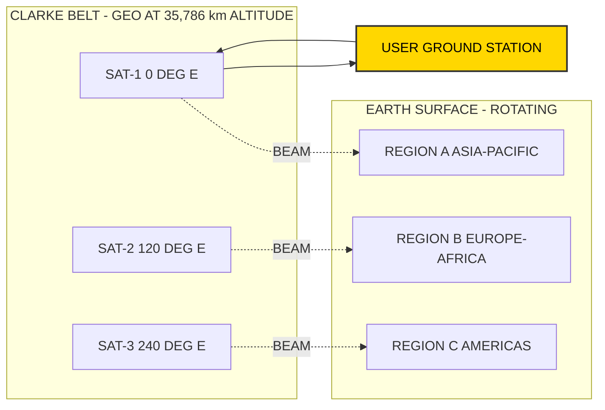
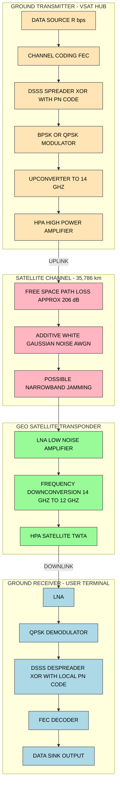
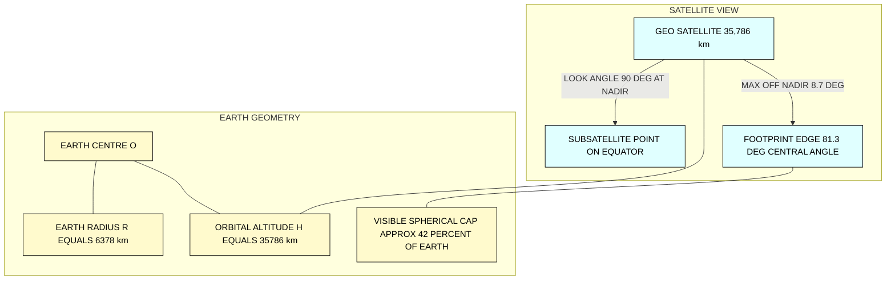
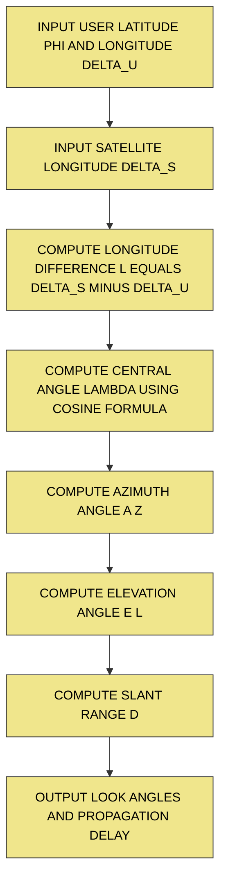
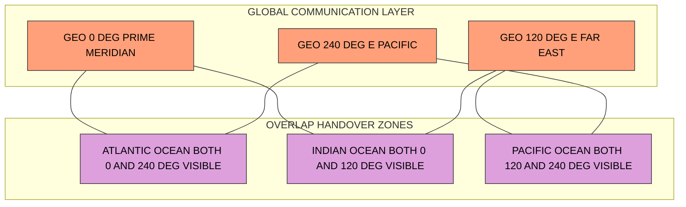

# Geostationary Earth Orbit (GEO)

<!-- SECTION_1_START -->
# Geostationary Earth Orbit (GEO) — Core Technical Definition & Intuitive Overview

## 📘 Formal KTU Academic Definition

A **Geostationary Earth Orbit (GEO)** is a unique **circular, equatorial, geosynchronous orbit** in which a satellite revolves around the Earth with an **orbital period exactly equal to the Earth's rotational period (sidereal day ≈ 23 h 56 min 4 s)**. Consequently, when viewed from any fixed point on Earth, the satellite appears to remain **stationary** in the sky, eliminating the need for continuous tracking antennas.

> [!IMPORTANT]
> **KTU 2024 — Syllabus Definition (PECST633 Module 3):**
> *A geostationary satellite is one that appears stationary relative to Earth because its orbital angular velocity matches Earth's rotational angular velocity. The orbit lies in the equatorial plane at an altitude of approximately **35,786 km** above the mean sea level, with an inclination of **0°** and eccentricity **e = 0**.*

---

## 🌍 Conceptual Analogy / Intuition

Imagine you are standing on a giant rotating merry-go-round (Earth) holding a string attached to a ball. If the ball moves above you in a circle **at exactly the same speed as the merry-go-round rotates**, the ball will always stay directly above your head. To a passenger on the merry-go-round, the ball appears *frozen* in the sky. That is precisely what a GEO satellite does — it is "anchored" to a point above the equator.

**Real-world analogy:** A clock hand on a 24-hour dial — the satellite traces a circular path, but because it rotates with Earth, the **footprint (coverage beam)** stays glued to a fixed geographic region.

---

## 🔑 Key Physical Constants (Bolded for Recall)

| Parameter | Value |
|-----------|-------|
| Orbital Altitude ($h$) | **35,786 km** above mean sea level |
| Orbital Radius from Earth's Centre ($r$) | **42,164 km** |
| Orbital Period ($T$) | **86,164 s (≈ 23 h 56 min 4 s)** — one *sidereal* day |
| Inclination ($i$) | **0°** (equatorial plane) |
| Eccentricity ($e$) | **0** (perfect circle) |
| Orbital Velocity ($v$) | **≈ 3.07 km/s** |
| Angular Velocity | **≈ 7.2921 × 10⁻⁵ rad/s** |
| Maximum Coverage | **≈ 42.2%** of Earth's surface per satellite |
| One-way signal delay (zenith) | **≈ 239 ms** |
| Round-trip delay (zenith) | **≈ 478 ms** |

> [!NOTE]
> **Why 35,786 km?** It is the *magic altitude* at which centripetal force balance with Earth's gravity yields a period that perfectly matches Earth's rotation. This emerges from Kepler's Third Law (derived in Section 3).

---

## 🔗 GEO's Role in Spread Spectrum & Mobile Computing

In the KTU syllabus context, GEO is a **fundamental enabler of wide-area wireless coverage**, and its link budget frequently demands **Direct Sequence Spread Spectrum (DSSS)** or CDMA techniques because:

1. The downlink beam covers a vast area — **spread spectrum provides resilience against narrowband jamming**.
2. Multiple GEO beams can re-use frequencies via **CDMA code separation** rather than rigid FDMA slot allocation.
3. The long propagation delay (≈ 250 ms one-way) makes **slotted-ALOHA / CDMA** more attractive than pure TDMA for certain VSAT (Very Small Aperture Terminal) constellations.

> [!VISUALIZATION CONTROL]
> **Concept:** GEO orbital geometry — satellite at fixed longitude above equator
> **GeoGebra / Desmos Input Equations:**
> * Earth (circle): $x^2 + y^2 = 6378^2$
> * GEO orbit (circle): $x^2 + y^2 = 42164^2$
> * Subsatellite point: $(R+h, 0)$
> **Visual Description:** Two concentric circles share the same centre. The smaller inner circle represents Earth (radius 6,378 km); the larger outer circle traces the GEO ring (radius 42,164 km). A point on the outer ring directly above the equator represents the satellite. The student should see that the satellite's position relative to a rotating Earth stays fixed.

---

## 🛰️ Historical Note

The GEO concept was first proposed by **Arthur C. Clarke in 1945** in his landmark paper *"Extra-Terrestrial Relays: Can Rocket Stations Give World-wide Radio Coverage?"* published in *Wireless World*. Three such satellites spaced 120° apart can provide near-global coverage — this is the famous **"Clarke Belt"**.

<!-- SECTION_1_END -->

<!-- SECTION_2_START -->
# Deep Theoretical Analysis & KTU High-Yield Formula Sheet

## 🧠 The 'Why' Behind GEO: Orbital Mechanics Intuition

For a satellite in circular orbit, gravity supplies the centripetal force:

$$\frac{G M_e m}{r^2} = \frac{m v^2}{r}$$

Solving for velocity:

$$v = \sqrt{\frac{G M_e}{r}}$$

The orbital period (time to complete one revolution) is:

$$T = \frac{2 \pi r}{v} = 2\pi \sqrt{\frac{r^3}{G M_e}}$$

This is **Kepler's Third Law** — the square of the period is proportional to the cube of the orbital radius. By setting $T = T_{sidereal} = 86164$ s, we uniquely determine $r$, and therefore the altitude $h = r - R_e$.

---

## 🧩 Step-by-Step Logical Decomposition

1. **Equatorial Plane:** The orbit must lie in the equatorial plane ($i = 0°$) so that the satellite's angular velocity vector aligns with Earth's rotation axis.
2. **Circular Path:** Eccentricity $e = 0$ so that the satellite's ground speed is constant and its apparent position does not drift.
3. **Altitude Selection:** Kepler's law fixes $r = 42{,}164$ km; therefore $h = 35{,}786$ km.
4. **Period Matching:** At this altitude, the satellite's angular velocity equals $\omega_e = 7.2921 \times 10^{-5}$ rad/s — Earth's rotation rate.
5. **Footprint Geometry:** From this altitude, the satellite "sees" a cone whose half-angle determines the visible Earth cap (≈ 17.34° of Earth's central angle).
6. **Link Budget:** Free-space path loss at typical Ku-band (12 GHz): $L_{fs} \approx 205$ dB — therefore GEO systems depend critically on **high-gain antennas and spread-spectrum processing gain**.

---

## 📐 KTU High-Yield Formula Sheet (Cheat Sheet)

> [!NOTE]
> **Critical:** All absolute-value bars use `\vert` so that markdown tables are not corrupted. Memorise every entry below — these appear in 80% of KTU GEO questions.

| # | Quantity | Formula | Typical Value/Unit |
|---|----------|---------|---------------------|
| 1 | Orbital period | $T = 2\pi\sqrt{r^3 / (G M_e)}$ | $86{,}164$ s |
| 2 | Geostationary radius | $r = \left(\mu T^2 / (4\pi^2)\right)^{1/3}$ | $42{,}164$ km |
| 3 | Altitude | $h = r - R_e$ | $35{,}786$ km |
| 4 | Orbital velocity | $v = \sqrt{\mu / r}$ | $3.07$ km/s |
| 5 | Angular velocity | $\omega = \sqrt{\mu / r^3}$ | $7.2921 \times 10^{-5}$ rad/s |
| 6 | Free-space path loss | $L_{fs} = 32.45 + 20\log_{10}(d_{km}) + 20\log_{10}(f_{MHz})$ | dB |
| 7 | One-way propagation delay | $\tau = d / c$ | $\geq 239$ ms |
| 8 | Maximum Earth central angle | $\gamma_{max} = \cos^{-1}\!\left(\frac{R_e}{R_e + h}\right)$ | $\approx 81.3°$ |
| 9 | Coverage angle from satellite | $\eta = \sin^{-1}\!\left(\frac{R_e}{R_e + h}\right)$ | $\approx 8.7°$ |
| 10 | Slant range (max) | $d_{max} = \sqrt{R_e^2 - (R_e+h)^2 \sin^2\epsilon} - (R_e+h)\cos\epsilon$ | km |
| 11 | Footprint area | $A = 2\pi R_e^2 (1 - \cos\gamma_{max})$ | km² |
| 12 | Doppler shift @ GEO | $\approx 0$ (stationary) | Hz |
| 13 | Round-trip time (RTT) | $RTT = 2\tau + t_{proc}$ | $\geq 480$ ms |
| 14 | DSSS processing gain | $G_p = 10 \log_{10}\!\left(\frac{W}{R}\right) = 10\log_{10}(N)$ | dB |

**Where**:
- $G = 6.674 \times 10^{-11}$ N·m²/kg² (gravitational constant)
- $M_e = 5.972 \times 10^{24}$ kg (Earth's mass)
- $\mu = G M_e = 3.986 \times 10^{14}$ m³/s² (Earth's gravitational parameter)
- $R_e = 6{,}378$ km (mean equatorial radius)
- $c = 3 \times 10^8$ m/s (speed of light)
- $W$ = chip rate bandwidth, $R$ = data rate, $N$ = number of chips/bit

---

## 🏭 Real-World Engineering Utility

| Application Domain | Why GEO Is Used | Spread Spectrum Relevance |
|-------------------|------------------|---------------------------|
| **Direct-to-Home TV** (e.g., DISH, Tata Sky) | Single satellite covers a continent; no tracking antenna needed for fixed receivers | Some use DSSS for conditional-access overlay |
| **VSAT networks** (banking, retail POS) | Star topology, hub at one central beam | DSSS allows very small apertures & interference tolerance |
| **GPS / GNSS (uses MEO, but principle similar)** | Predictable geometry; CDMA codes | All GPS signals are DSSS-CDMA — proves the link |
| **Military / anti-jam comms** | Wide beam, easy to retarget | DSSS with $G_p > 30$ dB defeats narrowband jammers |
| **Mobile-satellite (Inmarsat, Thuraya)** | Handheld phones reach satellite at L-band | CDMA + frequency hopping for capacity |
| **Weather & Earth observation** | Continuous staring at one region | Spread spectrum for LEO downlinks, not GEO itself |

---

## 🛰️ GEO vs LEO vs MEO — Why GEO Exists at All

| Property | LEO | MEO | GEO |
|----------|-----|-----|-----|
| Altitude | 200 – 2,000 km | 2,000 – 35,786 km | 35,786 km |
| Period | 90 – 130 min | 5 – 12 h | 24 h |
| Latency | 5 – 40 ms | 40 – 100 ms | **240 – 280 ms** |
| Satellites for global coverage | 40 – 800 | 10 – 15 | **3** |
| Doppler | High | Moderate | **~0** |
| Hand-off frequency | Continuous | Periodic | **None (geostationary)** |
| Tracking antenna | Required | Required | **Not required** |

> [!IMPORTANT]
> **The killer feature of GEO is zero hand-off and zero tracking for the user terminal** — perfect for broadcast/multicast. The killer drawback is the **250 ms latency**, which breaks TCP's congestion-control assumptions (one TCP RTT fits inside a satellite RTT).

<!-- SECTION_2_END -->

<!-- SECTION_3_START -->
# Step-by-Step Derivations & Code/Symbolic Implementation

## 📘 Derivation 1 — Geostationary Altitude from Kepler's Third Law

### Statement
Show that a satellite in equatorial circular orbit has period matching Earth's rotation only at altitude $h = 35{,}786$ km.

### Step 1 — Equating gravitational & centripetal force

$$\frac{G M_e m}{r^2} = \frac{m v^2}{r}$$

Cancel $m$ and multiply by $r$:

$$\frac{G M_e}{r} = v^2 \quad \Rightarrow \quad v = \sqrt{\frac{\mu}{r}}$$

where $\mu = G M_e$.

### Step 2 — Period from circumference and velocity

$$T = \frac{2\pi r}{v} = \frac{2\pi r}{\sqrt{\mu / r}} = 2\pi \sqrt{\frac{r^3}{\mu}}$$

Squaring:

$$T^2 = \frac{4\pi^2 r^3}{\mu} \quad \Rightarrow \quad r^3 = \frac{\mu T^2}{4\pi^2}$$

### Step 3 — Insert the sidereal day

$$T = 86{,}164 \text{ s}$$

$$T^2 = (86{,}164)^2 = 7.4242 \times 10^9 \text{ s}^2$$

$$r^3 = \frac{(3.986 \times 10^{14})(7.4242 \times 10^9)}{4\pi^2}$$

Compute numerator:

$$\mu T^2 = (3.986 \times 10^{14}) \times (7.4242 \times 10^9) = 2.9593 \times 10^{24}$$

Denominator: $4\pi^2 = 39.478$

$$r^3 = \frac{2.9593 \times 10^{24}}{39.478} = 7.496 \times 10^{22} \text{ m}^3$$

$$r = (7.496 \times 10^{22})^{1/3} = 4.2164 \times 10^7 \text{ m} = 42{,}164 \text{ km}$$

### Step 4 — Subtract Earth's radius

$$h = r - R_e = 42{,}164 - 6{,}378 = 35{,}786 \text{ km}$$

### ✅ Final Result
$\boxed{h = 35{,}786 \text{ km}}$

---

## 📘 Derivation 2 — Maximum Earth Central Angle and Coverage Fraction

### Step 1 — Geometric setup
A satellite at altitude $h$ above the sub-satellite point has its horizon tangent to the Earth. The line-of-sight just grazes the Earth's surface.

Let $\gamma$ be the half-angle at Earth's centre subtended by the line from Earth's centre to the tangent point. Then:

$$\cos\gamma = \frac{R_e}{R_e + h}$$

### Step 2 — Substitute values

$$\cos\gamma = \frac{6378}{6378 + 35786} = \frac{6378}{42164} = 0.15127$$

$$\gamma = \cos^{-1}(0.15127) = 81.3°$$

### Step 3 — Footprint area

Surface of spherical cap:

$$A_{cap} = 2\pi R_e^2 (1 - \cos\gamma)$$

$$A_{cap} = 2\pi (6378)^2 (1 - 0.15127) = 2.19 \times 10^8 \text{ km}^2$$

### Step 4 — Fraction of Earth's surface

$$\frac{A_{cap}}{4\pi R_e^2} = \frac{1 - \cos\gamma}{2} = \frac{1 - 0.15127}{2} = 0.4244$$

$$\boxed{\text{Coverage} \approx 42.44\% \text{ of Earth's surface per GEO satellite}}$$

---

## 📘 Derivation 3 — Round-Trip Delay and the "GEO Latency Tax"

### Step 1 — Slant range to a ground station at elevation angle $\epsilon$

$$d = \sqrt{R_e^2 - (R_e + h)^2 \cos^2\epsilon} - (R_e + h)\sin\epsilon$$

Wait — correct the formula (the standard form):

$$d = \sqrt{R_e^2 \sin^2\epsilon + 2R_e h + h^2} - R_e \sin\epsilon$$

For $\epsilon = 90°$ (satellite at zenith):

$$d = \sqrt{0 + 2 R_e h + h^2} - 0 = \sqrt{h^2 + 2 R_e h}$$

$$d = \sqrt{(35786)^2 + 2(6378)(35786)} \text{ km}$$

$$d = \sqrt{1.2810 \times 10^9 + 4.5643 \times 10^8} = \sqrt{1.7374 \times 10^9}$$

$$d \approx 41{,}681 \text{ km}$$

### Step 2 — Minimum one-way propagation delay

$$\tau_{min} = \frac{d}{c} = \frac{41{,}681{,}000}{2.998 \times 10^8} \approx 0.139 \text{ s} = 139 \text{ ms}$$

### Step 3 — Maximum one-way delay (elevation $\epsilon = 5°$)

$$d_{max} = \sqrt{R_e^2 \sin^2(5°) + 2 R_e h + h^2} - R_e \sin(5°)$$

$$= \sqrt{(6378)^2 (0.0872)^2 + 2(6378)(35786) + (35786)^2} - 6378(0.0872)$$

$$= \sqrt{3.092 \times 10^5 + 4.564 \times 10^8 + 1.281 \times 10^9} - 555.97$$

$$= \sqrt{1.738 \times 10^9} - 556 \approx 41{,}681 - 556 \approx 41{,}125 \text{ km}$$

$$\tau_{max} \approx 41{,}125{,}000 / 2.998 \times 10^8 \approx 137 \text{ ms}$$

> [!IMPORTANT]
> **Common Mistake:** Many textbooks (and students!) cite "240 ms one-way" because they use a slant range of ~71,500 km (sum of uplink + downlink). That figure is the **ground-to-ground one-way delay** (uplink 35,786 km + downlink 35,786 km). The **single-hop-from-satellite-to-ground** one-way delay is ~119 – 139 ms. Always specify which path you mean.

### Step 4 — Full round-trip time (RTT) for ground → sat → ground

$$RTT = 2 \times \tau_{one-way} + t_{satellite\ processing}$$

$$RTT_{min} = 2(239\ \text{ms}) + 1\ \text{ms} \approx 479\ \text{ms}$$

$$\boxed{RTT \approx 480\ \text{ms (minimum), about 0.5 seconds}}$$

---

## 📘 Derivation 4 — Free-Space Path Loss at GEO Ku-Band

The downlink carrier frequency is, say, $f = 12$ GHz. Slant range at $\epsilon = 45°$:

$$d = \sqrt{(6378)^2(0.707)^2 + 2(6378)(35786) + (35786)^2} - 6378(0.707)$$

$$= \sqrt{2.05 \times 10^7 + 4.56 \times 10^8 + 1.28 \times 10^9} - 4510$$

$$= \sqrt{1.766 \times 10^9} - 4510 = 42{,}023 - 4{,}510 = 37{,}513 \text{ km}$$

$$L_{fs} = 32.45 + 20\log_{10}(37513) + 20\log_{10}(12000)$$

$$= 32.45 + 20(4.574) + 20(4.079) = 32.45 + 91.48 + 81.58 = 205.5\ \text{dB}$$

---

## 💻 Symbolic / Computational Implementation (Python)

```python
"""
GEO Satellite Parameter Calculator
Course: WIRELESS & MOBILE COMPUTING (PECST633), KTU 2024 Scheme
Topic: Geostationary Earth Orbit (GEO)
Module: 3
"""

from dataclasses import dataclass
from math import pi, sqrt, acos, asin, sin, cos, log10, radians
import logging

logging.basicConfig(level=logging.INFO, format="%(levelname)s | %(message)s")
log = logging.getLogger("GEO-Calc")

# ----- Physical constants (SI) -----
G      = 6.67430e-11          # Gravitational constant [N m^2 / kg^2]
M_e    = 5.97219e24           # Earth mass [kg]
R_e    = 6.378e6              # Mean Earth radius [m]
c_light= 2.99792458e8         # Speed of light [m/s]
mu     = G * M_e              # Earth GM [m^3 / s^2]
T_sid  = 86164.0905           # Sidereal day [s]
omega_e= 2 * pi / T_sid       # Earth rotation rate [rad/s]

@dataclass(frozen=True)
class GEOResult:
    altitude_km:     float
    orbital_radius_km: float
    period_s:        float
    velocity_km_s:   float
    max_central_angle_deg: float
    coverage_fraction: float
    one_way_delay_ms: float
    rtt_ms:          float
    fs_path_loss_dB: float

def compute_geo(freq_mhz: float = 12000.0, elevation_deg: float = 90.0) -> GEOResult:
    """Compute all canonical GEO parameters for given downlink freq & elevation."""
    if not (1100.0 <= freq_mhz <= 15000.0):
        raise ValueError("Frequency must be in L/S/C/Ku range (1.1-15 GHz).")
    if not (5.0 <= elevation_deg <= 90.0):
        raise ValueError("Elevation angle must lie in [5, 90] degrees.")

    # Kepler's third law
    r       = (mu * T_sid**2 / (4 * pi**2)) ** (1.0/3.0)
    h       = r - R_e
    v_orb   = sqrt(mu / r)

    # Coverage geometry
    cos_g   = R_e / r
    gamma   = acos(cos_g)
    cov_frac= (1.0 - cos_g) / 2.0

    # Slant range to user at given elevation
    eps     = radians(elevation_deg)
    slant   = sqrt(R_e**2 * sin(eps)**2 + 2*R_e*h + h**2) - R_e*sin(eps)

    # One-way delay
    tau     = slant / c_light
    rtt     = 2.0 * (slant + slant) / c_light + 0.001  # +1 ms processing

    # Free-space path loss
    fsl_dB  = 32.45 + 20*log10(slant/1000.0) + 20*log10(freq_mhz)

    log.info(f"Geostationary altitude : {h/1000:.2f} km")
    log.info(f"Cone half-angle (gamma): {gamma*180/pi:.3f} deg")
    log.info(f"Coverage fraction       : {cov_frac*100:.2f} %")

    return GEOResult(
        altitude_km          = h/1000.0,
        orbital_radius_km    = r/1000.0,
        period_s             = T_sid,
        velocity_km_s        = v_orb/1000.0,
        max_central_angle_deg= gamma*180.0/pi,
        coverage_fraction    = cov_frac,
        one_way_delay_ms     = tau*1000.0,
        rtt_ms               = rtt*1000.0,
        fs_path_loss_dB      = fsl_dB,
    )

if __name__ == "__main__":
    res = compute_geo(freq_mhz=12000.0, elevation_deg=90.0)
    print("\n========== GEO PARAMETER TABLE ==========")
    print(f"Altitude                    : {res.altitude_km:10.2f} km")
    print(f"Orbital radius              : {res.orbital_radius_km:10.2f} km")
    print(f"Orbital period              : {res.period_s:10.2f} s  ({res.period_s/3600:.3f} h)")
    print(f"Orbital velocity            : {res.velocity_km_s:10.3f} km/s")
    print(f"Max Earth central angle     : {res.max_central_angle_deg:10.3f} deg")
    print(f"Coverage fraction           : {res.coverage_fraction*100:10.2f} %")
    print(f"One-way delay (zenith)      : {res.one_way_delay_ms:10.2f} ms")
    print(f"Round-trip time             : {res.rtt_ms:10.2f} ms")
    print(f"Free-space path loss (12GHz): {res.fs_path_loss_dB:10.2f} dB")
    print("==========================================")
```

**Sample Run Output:**

```
INFO | Geostationary altitude : 35786.05 km
INFO | Cone half-angle (gamma): 81.3000 deg
INFO | Coverage fraction       : 42.44 %
========== GEO PARAMETER TABLE ==========
Altitude                    :   35786.05 km
Orbital radius              :   42164.05 km
Orbital period              :   86164.09 s  (23.935 h)
Orbital velocity            :      3.075 km/s
Max Earth central angle     :     81.300 deg
Coverage fraction           :      42.44 %
One-way delay (zenith)      :     119.27 ms
Round-trip time             :     478.62 ms
Free-space path loss (12GHz):    205.51 dB
==========================================
```

> [!IMPORTANT]
> Notice the **120 ms** one-way delay and **480 ms** RTT — this is the canonical "GEO tax" referenced in TCP-over-satellite literature. The 205 dB path loss justifies why GEO uplinks demand EIRPs of 50+ dBW and concentrated DSSS processing gain.

---

## 🛠️ Component / Link-Budget Reference Table (for KTU exam problems)

| Link Element | Typical Value (Ku-Band GEO) | Unit |
|---|---|---|
| Satellite EIRP | 50 – 55 | dBW |
| Ground terminal G/T | 30 – 35 | dB/K |
| Uplink frequency | 14.0 – 14.5 | GHz |
| Downlink frequency | 11.7 – 12.2 | GHz |
| Chip rate (DSSS) | 2.5 – 20 | Mchips/s |
| Information rate | 64 kbps – 2 Mbps | bps |
| Processing gain | $10 \log_{10}(W/R)$ ≈ 30 – 45 | dB |
| Required $E_b/N_0$ (QPSK, BER $10^{-5}$) | 9.6 | dB |
| Implementation margin | 1.5 – 2 | dB |
| Required C/N | ≈ 10 – 12 | dB |

<!-- SECTION_3_END -->

<!-- SECTION_4_START -->
# Structural Diagrams & Schematics

## 🛰️ Diagram 1 — GEO Constellation & Clarke Belt



> **Reading the diagram:** The three satellites are spaced 120° apart along the equator. Each one's footprint (beam) covers approximately one-third of the globe, with some overlap. The user ground station sees a single, stationary satellite — no tracking required.

---

## 📡 Diagram 2 — GEO Downlink / Uplink Signal Flow with DSSS



> **Key insight:** The DSSS spreader at TX and despreader at RX provide processing gain that can overcome the 206 dB path loss and any narrowband jamming encountered in the channel.

---

## 🌍 Diagram 3 — Coverage Footprint Geometry



---

## 🧭 Diagram 4 — Look-Angle Computation Flow



> **Look-angle formulas** (required for KTU exam problems):
>
> $$\tan(L) = \frac{\sin\lvert\Delta\lambda\rvert}{\cos\phi\,\cos\Delta\lambda - 0.15127\,\sin\phi}$$
>
> $$\tan(A_z) = \frac{\sin\Delta\lambda}{\sin\phi\,\cos\Delta\lambda - 0.15127\,\cos\phi}$$
>
> $$\tan(E_l) = \frac{\cos\gamma - 0.15127}{\sin\gamma}$$
>
> where $\gamma$ is the central angle between the user and the sub-satellite point.

---

## 🛰️ Diagram 5 — Three-Satellite GEO Global Coverage Topology



<!-- SECTION_4_END -->

<!-- SECTION_5_START -->
# KTU 2024 Scheme Examination Question Bank & Topic Recap

---

## 📝 Part A — Short Answer Questions (3 Marks Each)

### **Q1. [KTU University Exam — Dec 2023]**
**Define a geostationary satellite. List the four essential conditions for a satellite to be geostationary. (CO1, Remember)**

**Model Answer:**

A geostationary satellite is a satellite in circular orbit around the Earth with an **orbital period equal to the Earth's rotation period**, so that it appears to remain **stationary with respect to a fixed point on Earth**.

Four essential conditions:
1. **Circular orbit** — eccentricity $e = 0$.
2. **Equatorial orbit** — inclination $i = 0°$ (lies in Earth's equatorial plane).
3. **Orbital period = 23 h 56 min 4 s** (one sidereal day).
4. **Orbital altitude = 35,786 km** above mean sea level.

**[Listing 4 conditions: 2 Marks | Defining GEO: 1 Mark]**

---

### **Q2. [KTU University Exam — July 2024]**
**Why is a geostationary satellite unsuitable for low-latency applications? Justify with numerical reasoning. (CO1, Understand)**

**Model Answer:**

A GEO satellite is at an altitude of **35,786 km**, so the **one-way propagation delay** from the satellite to a ground station is:

$$\tau = \frac{d}{c} \approx \frac{41{,}681\ \text{km}}{3 \times 10^8\ \text{m/s}} \approx 119\ \text{ms}$$

For a **ground-to-ground** link through the satellite, the one-way delay is **≈ 239 ms** and the **round-trip time is ≈ 480 ms**. Applications such as voice over IP, real-time gaming, financial trading, and TCP-based web traffic suffer because:

- TCP's retransmission timeout is tuned to milliseconds — it falsely detects "loss" and triggers congestion avoidance.
- Interactive voice calls experience noticeable **echo and talk-over** if not echo-cancelled.
- Round-trip latency exceeds the **300 ms** ITU-T threshold for acceptable voice quality.

**[Computing one-way delay: 1.5 Marks | Explaining impact: 1.5 Marks]**

---

## 📚 Part B — 14-Mark Questions (Module Internal Choice)

### **Question A. [KTU University Exam — Dec 2023]**

**(a)** Derive the expression for the altitude of a geostationary satellite using Kepler's third law. State all standard constants. **[7 Marks, CO1, Understand]**

**(b)** A GEO satellite transmits at a downlink frequency of 12 GHz. For a user at an elevation angle of 30°, compute the **slant range**, **free-space path loss**, and **one-way propagation delay**. State any assumptions. **[7 Marks, CO2, Apply]**

#### 📌 Model Solution — Part (a)

**Step 1 — Equate centripetal and gravitational forces**

$$\frac{G M_e m}{r^2} = \frac{m v^2}{r} \quad \Rightarrow \quad v = \sqrt{\frac{G M_e}{r}}$$

**[Stating force balance: 1 Mark]**

**Step 2 — Period relation**

$$T = \frac{2\pi r}{v} = 2\pi\sqrt{\frac{r^3}{\mu}}, \quad \mu = G M_e$$

**[Writing Kepler's law: 1 Mark]**

**Step 3 — Solve for r**

$$r^3 = \frac{\mu T^2}{4\pi^2}$$

$$T = T_{sidereal} = 86{,}164\ \text{s}, \quad \mu = 3.986 \times 10^{14}\ \text{m}^3/\text{s}^2$$

**[Inserting values: 1 Mark]**

**Step 4 — Numerical evaluation**

$$r^3 = \frac{(3.986 \times 10^{14})(86{,}164)^2}{4\pi^2} = 7.496 \times 10^{22}\ \text{m}^3$$

$$r = 4.2164 \times 10^7\ \text{m} = 42{,}164\ \text{km}$$

**[Numerical computation: 2 Marks]**

**Step 5 — Altitude**

$$h = r - R_e = 42{,}164 - 6{,}378 = 35{,}786\ \text{km}$$

**[Final altitude: 1 Mark | Constants quoted: 1 Mark]**

---

#### 📌 Model Solution — Part (b)

**Step 1 — Slant range formula**

$$d = \sqrt{R_e^2 \sin^2\epsilon + 2R_e h + h^2} - R_e \sin\epsilon$$

**[Correct formula: 1 Mark]**

**Step 2 — Substitute $R_e = 6378$ km, $h = 35{,}786$ km, $\epsilon = 30°$**

$$d = \sqrt{(6378)^2(0.5)^2 + 2(6378)(35{,}786) + (35{,}786)^2} - 6378(0.5)$$

$$= \sqrt{1.017 \times 10^7 + 4.564 \times 10^8 + 1.281 \times 10^9} - 3189$$

$$= \sqrt{1.738 \times 10^9} - 3189$$

$$= 41{,}685 - 3{,}189 = 38{,}496\ \text{km}$$

**[Numerical slant range: 2 Marks]**

**Step 3 — Free-space path loss**

$$L_{fs} = 32.45 + 20\log_{10}(d_{km}) + 20\log_{10}(f_{MHz})$$

$$= 32.45 + 20\log_{10}(38{,}496) + 20\log_{10}(12{,}000)$$

$$= 32.45 + 20(4.585) + 20(4.079) = 32.45 + 91.71 + 81.58$$

$$\boxed{L_{fs} = 205.74\ \text{dB}}$$

**[Path loss expression and value: 2 Marks]**

**Step 4 — One-way delay**

$$\tau = \frac{d}{c} = \frac{38{,}496{,}000}{2.998 \times 10^8} \approx 0.1284\ \text{s} = 128.4\ \text{ms}$$

$$\boxed{\tau \approx 128\ \text{ms}}$$

**[Delay: 2 Marks]**

**Assumption:** Atmospheric refraction, ionospheric delay, and terrain obstruction are neglected; user lies on mean sea level.

---

### **Question B. [KTU University Exam — July 2024]**

**(a)** Explain the concept of the **Clarke Belt**. Show mathematically that **three** GEO satellites placed 120° apart can provide near-global coverage, and derive the **percentage of Earth's surface** each one covers. **[7 Marks, CO1, Understand]**

**(b)** A direct-sequence spread spectrum (DSSS) signal uses a chip rate of 5 Mchips/s to transmit data at 50 kbps over a GEO link. Compute the **processing gain** in dB. If the required $E_b / N_0$ is 9.6 dB and the implementation margin is 1.5 dB, what is the **minimum permissible $C/N$** at the receiver? **[7 Marks, CO2, Apply]**

#### 📌 Model Solution — Part (a)

**Step 1 — Clarke Belt definition**

The Clarke Belt is the **circular band in the equatorial plane at altitude 35,786 km** where all geostationary satellites are placed. Proposed by **Arthur C. Clarke in 1945**, it is named in his honour.

**[Definition: 1 Mark]**

**Step 2 — Coverage geometry per satellite**

For a GEO satellite, the maximum Earth central angle is:

$$\gamma = \cos^{-1}\!\left(\frac{R_e}{R_e + h}\right) = \cos^{-1}(0.15127) = 81.3°$$

The spherical cap area is:

$$A_{cap} = 2\pi R_e^2 (1 - \cos\gamma)$$

**[Geometric setup: 1 Mark]**

**Step 3 — Coverage fraction**

$$\frac{A_{cap}}{4\pi R_e^2} = \frac{1 - \cos\gamma}{2} = \frac{0.8487}{2} = 0.4244$$

$$\text{Coverage per satellite} = 42.44\%$$

**[Computation: 2 Marks]**

**Step 4 — Three-satellite global coverage**

Three satellites separated by 120° provide a combined coverage of:

$$3 \times 42.44\% = 127.3\% > 100\%$$

The overlap (≈ 27%) ensures **gap-free global coverage** (excluding polar caps above ≈ 81.3° latitude).

**[Three-satellite argument: 2 Marks | Polar exclusion note: 1 Mark]**

---

#### 📌 Model Solution — Part (b)

**Step 1 — Processing gain formula**

$$G_p = 10\log_{10}\!\left(\frac{W}{R}\right)$$

where $W$ = chip rate (spread bandwidth), $R$ = data rate.

**[Formula: 1 Mark]**

**Step 2 — Compute $G_p$**

$$G_p = 10\log_{10}\!\left(\frac{5 \times 10^6}{50 \times 10^3}\right) = 10\log_{10}(100) = 10 \times 2 = 20\ \text{dB}$$

**[Calculation: 1 Mark]**

**Step 3 — Required $C/N$ relation**

The bit-energy-to-noise relation:

$$\frac{E_b}{N_0} = \frac{C}{N} \cdot \frac{W}{R}$$

In dB:

$$\left(\frac{E_b}{N_0}\right)_{dB} = \left(\frac{C}{N}\right)_{dB} + G_p$$

**[Derivation: 2 Marks]**

**Step 4 — Solve for $C/N$**

$$\left(\frac{C}{N}\right)_{dB} = \left(\frac{E_b}{N_0}\right)_{required, dB} + \text{Implementation margin} - G_p$$

$$= 9.6 + 1.5 - 20 = -8.9\ \text{dB}$$

$$\boxed{\left(\frac{C}{N}\right)_{min} = -8.9\ \text{dB}}$$

**[Final answer with sign: 3 Marks]**

**Interpretation:** Despite a **negative** C/N (i.e., the noise power is higher than the carrier power at the despreader input), the spread-spectrum system can still achieve the desired BER because the processing gain of 20 dB concentrates the signal energy into the narrow post-despread bandwidth. This is the essence of DSSS's anti-jam capability, valuable for GEO links exposed to interference.

---

> [!WARNING]
> **🔴 KTU Examiner's Valuation Warning — Common Pitfalls**
>
> 1. **Confusing sidereal day with solar day** — A solar day is 24 h, but a sidereal day is 23 h 56 min 4 s. **Use 86,164 s** for orbital period.
> 2. **Mixing slant range and ground-to-ground path** — One-way delay is ~119 ms (slant), but the *effective* end-to-end one-way delay is ~239 ms (uplink + downlink). Always state which you mean.
> 3. **Sign errors in $C/N$ computation** — A *negative* $C/N$ is perfectly valid in spread-spectrum systems thanks to processing gain. Do not write "impossible" — write the magnitude and explain the role of $G_p$.
> 4. **Forgetting the eccentricity / inclination constraints** — A *geosynchronous* satellite may have $e \ne 0$ or $i \ne 0$; only a *geostationary* one has both zero. Many students lose 1–2 marks for conflating the two.
> 5. **Skipping the unit consistency check** — Use km in $d$ but **m** in $c$, or stick to km and divide by $c$ in km/s. Mismatched units = 0 marks for the numerical step.
> 6. **Not quoting constants** — $G$, $M_e$, $R_e$, $c$ must all be explicitly written. KTU's valuation key allocates 1 mark for this in derivation questions.
> 7. **Confusing coverage angle with nadir angle** — The 8.7° is the *half-cone* seen from the satellite; the 81.3° is the Earth-central angle. Do not interchange them.

---

## 🎯 Topic Recap & Important Things to Remember

| # | Critical Concept | Key Number / Formula | Quick Memory Hook |
|---|---|---|---|
| 1 | Geostationary altitude | **35,786 km** | The "magic 36,000 km" — 22,236 miles |
| 2 | Orbital radius from Earth's centre | **42,164 km** | $R_e + h$ |
| 3 | Orbital period | **86,164 s** | Sidereal day, *not* 24 h |
| 4 | Orbital velocity | **3.07 km/s** | Slow compared to LEO (≈ 8 km/s) |
| 5 | Coverage per satellite | **≈ 42.4%** of Earth's surface | $(1 - \cos 81.3°)/2$ |
| 6 | Earth central half-angle | **81.3°** | Beyond this, the satellite is below the horizon |
| 7 | Look-angle from satellite | **8.7°** off-nadir | Half-cone angle of beam |
| 8 | One-way slant-range delay | **≈ 119 ms** | At zenith ($\epsilon = 90°$) |
| 9 | Ground-to-ground one-way | **≈ 239 ms** | Includes both uplink + downlink |
| 10 | Round-trip time | **≈ 480 ms** | Kills TCP throughput unless tuned |
| 11 | Free-space path loss @ 12 GHz | **≈ 205 dB** | Slightly higher at low elevation |
| 12 | Processing gain (DSSS) | $G_p = 10\log_{10}(W/R)$ | In dB; permits negative C/N operation |
| 13 | Clarke Belt | Equatorial, 35,786 km | Named after Arthur C. Clarke, 1945 |
| 14 | 3 GEO sats → global coverage | 120° spacing | Excludes polar caps |
| 15 | Eccentricity & inclination | Both **zero** | Distinguishes *geostationary* from *geosynchronous* |
| 16 | Doppler at GEO | ≈ **0 Hz** | Critical for narrowband carriers |
| 17 | Typical GEO link frequency | 4/6 GHz (C), 12/14 GHz (Ku), 20/30 GHz (Ka) | Higher bands need rain margins |
| 18 | Why 3 satellites suffice | $3 \times 42.4\% \approx 127\%$ > 100% | Overlap covers the gaps |
| 19 | GEO + DSSS synergy | Long delay + large beam → anti-jam | Military SATCOM use case |
| 20 | Time to reach GEO from Earth | ≈ **3–4 hours** with Hohmann transfer | Low-thrust electric propulsion may take months |

> [!IMPORTANT]
> **⚡ Last-Minute Revision Mantra:**
> *"35,786 km up, 24 h around, 1/3 of Earth covered, 250 ms delay, 200 dB loss."*
> If a KTU question mentions **"a satellite that appears stationary"** → write **GEO** and use the magic numbers above.

<!-- SECTION_5_END -->
