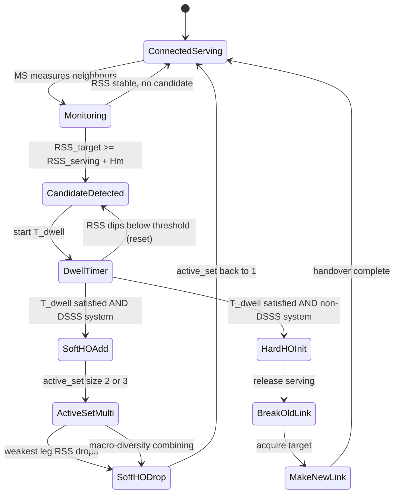
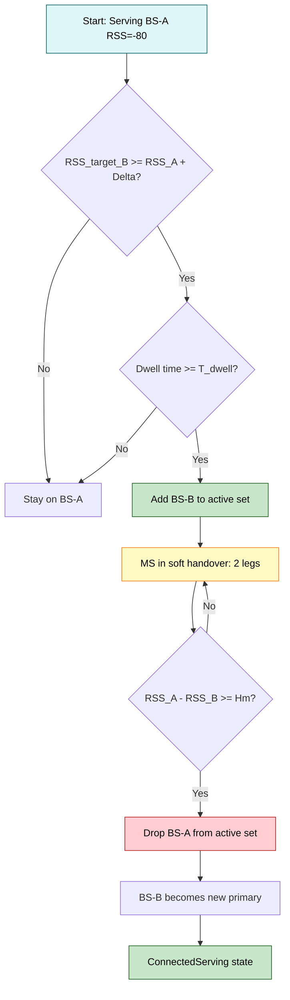
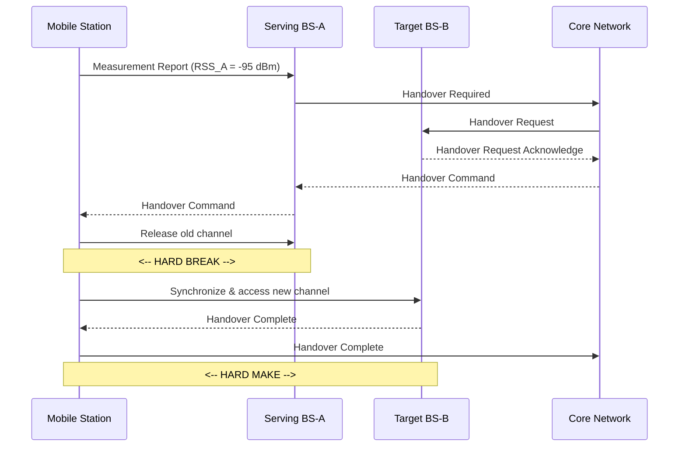
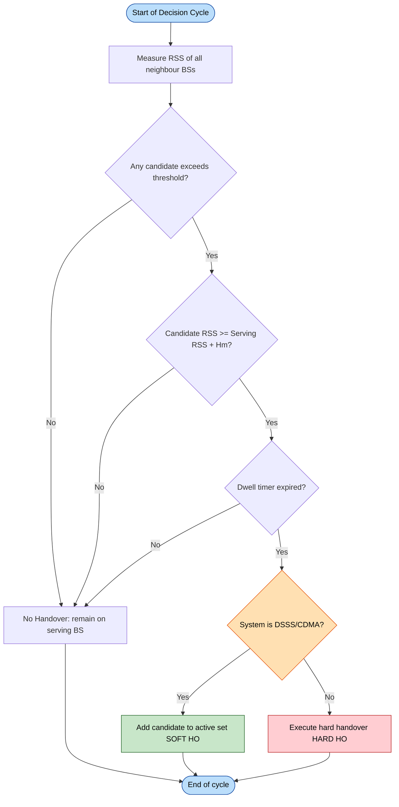
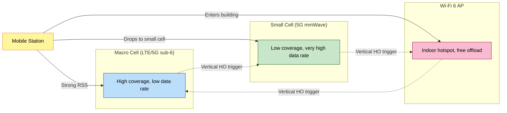
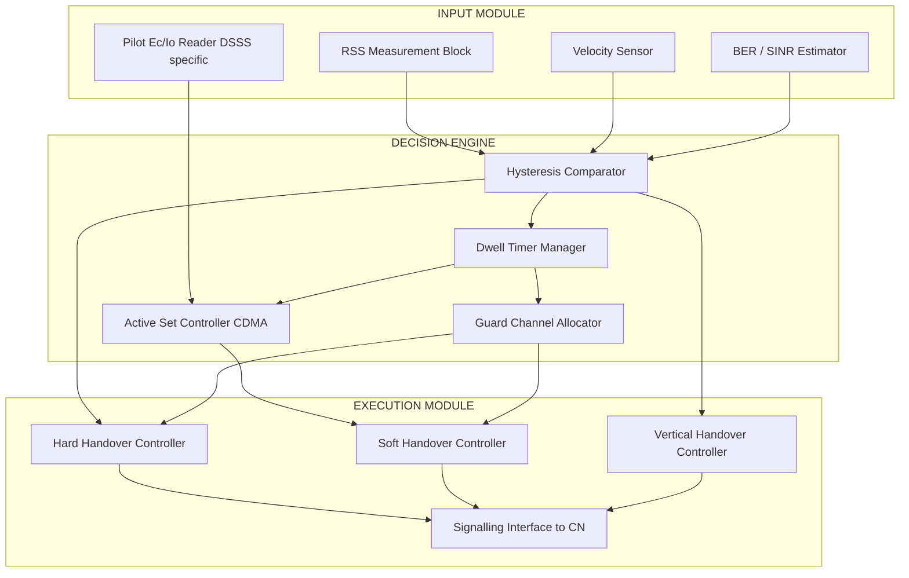

# Handover.

<!-- SECTION_1_START -->
# Handover in Wireless Mobile Computing

## 1. Core Technical Definition & Intuitive Overview

### Formal Definition
**Handover** (also called **Handoff**) is the mechanism that allows an ongoing communication session (voice call, data session, or multimedia stream) of a **Mobile Station (MS)** to be transferred from one **Base Transceiver Station (BTS/BS)** to another **Base Transceiver Station** (or between channels/sectors of the same BTS) without interrupting the active service. According to the **KTU 2024 Scheme** syllabus, handover is classified as one of the most critical **Radio Resource Management (RRM)** functions in cellular and spread-spectrum systems, directly influencing **Quality of Service (QoS)**, **call drop probability**, and **system capacity**.

> [!IMPORTANT]
> **KTU Syllabus Highlight (Module 3 – Spread Spectrum / DSSS):** In Code Division Multiple Access (CDMA) systems that use Direct Sequence Spread Spectrum (DSSS), **soft handover** and **softer handover** are made possible precisely because all cells share the *same frequency band* and *same PN code family*, allowing the MS to communicate with multiple base stations simultaneously.

### Conceptual Analogy / Intuition
Imagine you are walking through a large shopping mall while talking on your mobile phone. As you move from the **Food Court zone** (served by Antenna-A) to the **Electronics zone** (served by Antenna-B), the mall's internal phone system silently **transfers** your call from one antenna to another so you never notice the change. The strength of your voice signal at Antenna-A is dropping, so the system "hands you over" to Antenna-B before the call breaks up. This silent, real-time transfer is exactly what a **handover** does in a cellular network.

In the **spread spectrum (DSSS/CDMA)** world, the analogy becomes even more elegant: the mall phone system can briefly *connect you to both antennas at the same time* (the old and the new) before releasing the old one — this is the **make-before-break** philosophy, unique to CDMA soft handovers.

### Key Parameters and Standard Metrics
- **RSS (Received Signal Strength)** — measured in **dBm**.
- **Hysteresis Margin ($H_m$)** — typically **3 dB to 6 dB** in GSM, **2 dB to 4 dB** in UMTS.
- **Cell Residence Time ($T_{cr}$)** — the time an MS dwells within a cell.
- **Dwell Time** — the overlap time during which both old and new BS can serve the MS.
- **Threshold ($T_h$)** — fixed RSS threshold for triggering measurement reporting.
- **Pilot Signal $E_c/I_0$** — chip-energy-to-interference ratio used in CDMA pilot measurements.
- **HO Margin (Margin_HO)** — the relative difference between candidate and serving cell signal levels.
- **Maximum allowed HO delay** — typically **$T_{HO,max} \le 200$ ms** in 3GPP specifications.

> [!NOTE]
> **Engineering Rule of Thumb:** A handover should be triggered **before** the serving cell's RSS falls below the receiver sensitivity threshold (typically around **-104 dBm** for GSM and **-121 dBm** for LTE), so the call never drops during the transition.

### GeoGebra / Desmos Integration
> [!VISUALIZATION CONTROL]
> **Concept:** Handover Triggering Curve — RSS vs. Distance from Serving BS vs. Target BS.
>
> **GeoGebra / Desmos Input Equations:**
> * `RSS_serving(x) = -30 * log10(x) - 40`   (Serving BS, located at x = 0)
> * `RSS_target(x) = -30 * log10(10 - x) - 38` (Target BS, located at x = 10)
> * `Threshold = -95`
> * `Hysteresis = 4`
>
> **Visual Description:** Two logarithmic decay curves crossing each other. The student should observe that **RSS_target** rises as the mobile moves toward the target BS, while **RSS_serving** falls. The handover is initiated at the distance where the gap between the two curves equals the **hysteresis margin**, *not* exactly at the crossing point — this prevents the **ping-pong effect**.

---

<!-- SECTION_1_END -->

<!-- SECTION_2_START -->
# 2. Deep Theoretical Analysis & KTU High-Yield Formula Sheet

## 2.1 Why is Handover Needed?
A mobile station is never stationary. As it moves:
- Path loss with the **serving BS** increases $\Rightarrow$ **RSS drops**.
- Path loss with a **neighbouring BS** decreases $\Rightarrow$ **RSS rises**.
- Co-channel interference from neighbouring cells may dominate.

If no handover is performed, the call eventually drops. Hence handover is the **lifeline** that maintains continuity.

## 2.2 Phases of a Handover (Generic Model)

1. **Measurement Phase** — MS (and/or BS) measures **RSS**, **BER**, **$E_c/I_0$**, distance, velocity.
2. **Decision / Initiation Phase** — Algorithm decides *whether* and *when* to hand over.
3. **Execution / Handover Phase** — Radio resources are reallocated (channel switch, PN code reassignment, bearer re-routing in core network).
4. **Completion Phase** — Old radio link is released, new link is confirmed.

## 2.3 Classification of Handovers

| Class | Sub-Type | Behaviour | Typical System |
|---|---|---|---|
| **Hard Handover** | Break-before-make | Old link released before new one is established | GSM, LTE (X2/S1 handover with brief gap) |
| **Soft Handover** | Make-before-break | Connected to ≥ 2 BSs simultaneously | CDMA (IS-95), UMTS, WCDMA |
| **Softer Handover** | Make-before-break | Within the *same* BS, between sectors | CDMA, UMTS |
| **Horizontal Handover** | Same technology | e.g. LTE $\rightarrow$ LTE | Intra-system |
| **Vertical Handover** | Different technology | e.g. Wi-Fi $\rightarrow$ LTE $\rightarrow$ 5G NR | Heterogeneous Networks (HetNet) |

## 2.4 Handover Decision Strategies

### (a) RSS-Based Strategy with Hysteresis
A handover is triggered when:

$$RSS_{target} \ge RSS_{serving} + H_m$$

where $H_m$ is the **hysteresis margin** (in dB). This avoids rapid back-and-forth handovers (ping-pong).

### (b) RSS + Threshold Strategy
A handover is triggered only if **both** conditions are satisfied:

$$RSS_{target} \ge T_h \quad \text{AND} \quad RSS_{target} \ge RSS_{serving} + H_m$$

### (c) Distance-Based Strategy
Triggered when distance to serving BS exceeds a threshold $D_{th}$:

$$d_{MS,BS_{serving}} \ge D_{th}$$

### (d) Velocity-Aware Strategy
For **high-speed** MS (vehicular), an **umbrella cell** (larger cell) is preferred. Handover decision incorporates a **velocity factor** $v$:

$$T_{handover} = T_{base} - k \cdot v$$

where $k$ is an empirical weight (typical value $k \in [0.05, 0.2]$ s per km/h).

### (e) Pilot-$E_c/I_0$-Based Strategy (CDMA / DSSS)
In DSSS/CDMA, the MS continuously measures the **pilot signal strength** from neighbouring BSs:

$$\left(\frac{E_c}{I_0}\right)_{target} \ge \left(\frac{E_c}{I_0}\right)_{serving} + \Delta_{pilot}$$

Typical $\Delta_{pilot} = 1$ dB to 3 dB.

## 2.5 Key Performance Metrics

| Metric | Definition | Typical Target |
|---|---|---|
| **Handover Probability ($P_{HO}$)** | Probability that an MS performs at least one handover during a call | System dependent |
| **Ping-Pong Probability ($P_{PP}$)** | Probability of unnecessary repeated handovers | $< 0.1$ |
| **Handover Failure Probability ($P_{fail}$)** | Probability that handover procedure fails | $< 0.01$ |
| **Handover Delay ($T_{HO}$)** | Time from trigger to successful completion | $\le 200$ ms (3GPP) |
| **Call Drop Probability ($P_{drop}$)** | Probability of forced termination | $< 0.02$ |
| **Number of Handovers ($N_{HO}$)** | Average per call session | Minimize |

## 2.6 KTU Formula Sheet / Cheat Sheet

| Symbol | Formula / Expression | Description |
|---|---|---|
| RSS path loss model | $RSS(d) = P_t - PL(d_0) - 10n \log_{10}\!\left(\frac{d}{d_0}\right) + X_\sigma$ | Log-distance path loss, $n$ = path loss exponent |
| Hysteresis trigger | $RSS_t \ge RSS_s + H_m$ | Target $\ge$ Serving + Hysteresis |
| Combined trigger | $RSS_t \ge T_h \;\wedge\; RSS_t \ge RSS_s + H_m$ | Threshold + relative comparison |
| Pilot trigger (DSSS) | $(E_c/I_0)_t \ge (E_c/I_0)_s + \Delta_{pilot}$ | Pilot-based soft HO trigger |
| Cell residence time | $T_{cr} = \dfrac{2R}{v}$ (linear motion across diameter) | $R$ = cell radius, $v$ = MS speed |
| Expected handovers | $E[N_{HO}] = \dfrac{E[T_{call}]}{E[T_{cr}]}$ | Per call |
| Handover delay | $T_{HO} = T_{meas} + T_{dec} + T_{exec}$ | Sum of phase delays |
| Guard channel | $C_{guard} = C_{total} - C_{new} - C_{HO}$ | Reserved for HO traffic |
| Soft HO factor | $F_{SHO} = \dfrac{N_{active\_links}}{1}$ | Typically 2 or 3 active legs |
| SINR target | $SINR \ge SINR_{min}$ | For acceptable BER $\le 10^{-6}$ |
| Velocity-aware HO | $T_{HO} = T_{base} - k \cdot v$ | Faster MS $\Rightarrow$ earlier HO |
| Umbrella cell radius | $R_{umb} = \alpha \cdot R_{micro}, \; \alpha \in [3, 5]$ | Macro-overlay for high mobility |

> [!IMPORTANT]
> **Critical Engineering Insight:** In **DSSS/CDMA**, the same frequency and same PN code family is reused in every cell, so the **inter-cell interference** is non-zero. Soft handover (simultaneous connection to multiple BSs) actually *reduces* the overall interference because the MS can use **macro-diversity combining** at the Rake receiver.

## 2.7 Engineering Real-World Utility
- **Production Cellular Networks (4G/5G):** Handover algorithms drive **SON (Self-Organizing Networks)** features such as **MRO (Mobility Robustness Optimization)**.
- **Satellite-Ground Networks:** Handovers between LEO satellites every few minutes; velocity-aware strategies dominate.
- **IoT & V2X (Vehicle-to-Everything):** Ultra-low latency handovers ($\le 10$ ms) are mandated for autonomous driving.
- **Heterogeneous 5G (HetNets):** Vertical handovers between macro-cells, small-cells, mmWave and sub-6 GHz are the central RRM challenge.

---

<!-- SECTION_2_END -->

<!-- SECTION_3_START -->
# 3. Step-by-Step Derivations, Algorithms & Implementation

## 3.1 Derivation: Expected Number of Handovers per Call

**Given:**
- Average call duration $E[T_{call}]$.
- Average cell residence time $E[T_{cr}]$.
- MS moves with mean velocity $v$ through cells of radius $R$.

**Step 1 — Cell Residence Time.**
For an MS moving with constant velocity $v$ along a straight chord of length $L$ across a circular cell of radius $R$:

$$L = 2\sqrt{R^2 - d^2}$$

where $d$ is the perpendicular distance from the chord to the cell centre.

**Step 2 — Average chord length.**
For a uniform distribution of entry points and directions, the average chord length is:

$$\bar{L} = \frac{1}{\pi R^2}\int_{0}^{R} 2\sqrt{R^2 - d^2} \cdot 2R \, dd = \frac{4R}{\pi}$$

**Step 3 — Average cell residence time.**

$$E[T_{cr}] = \frac{\bar{L}}{v} = \frac{4R}{\pi v}$$

**Step 4 — Expected number of handovers per call.**

$$E[N_{HO}] = \frac{E[T_{call}]}{E[T_{cr}]} = \frac{\pi v \, E[T_{call}]}{4R}$$

**Step 5 — Worked numerical example.**
Let $R = 1$ km, $v = 60$ km/h, $E[T_{call}] = 3$ min = $0.05$ h.

$$\begin{aligned}
E[T_{cr}] &= \frac{4 \cdot 1}{\pi \cdot 60} \; \text{h} = 0.02122 \; \text{h} = 76.4 \; \text{s} \\[4pt]
E[N_{HO}] &= \frac{0.05}{0.02122} = 2.357
\end{aligned}$$

**Interpretation:** On average, the MS performs **2.36 handovers** during a 3-minute call at 60 km/h in a 1-km-radius cell. Increasing $R$ decreases handovers; increasing $v$ increases them.

---

## 3.2 Derivation: Hysteresis Margin and Ping-Pong Avoidance

**Given:** RSS of serving cell $RSS_s(t)$ and target cell $RSS_t(t)$ are time-varying due to fading.

**Step 1 — Without hysteresis.**
If handover triggers as soon as $RSS_t \ge RSS_s$, then a single deep fade on $RSS_s$ (or a single peak on $RSS_t$) causes a handover. A subsequent reverse fluctuation triggers another handover back to the original cell — the **ping-pong effect**.

**Step 2 — Adding hysteresis margin $H_m$.**
Trigger condition becomes:

$$RSS_t(t) \ge RSS_s(t) + H_m \quad \text{(dB scale)}$$

**Step 3 — Required margin to suppress ping-pong.**
A standard rule of thumb derived from the **Lévy-distribution of fade durations** is:

$$H_m \ge 2 \sigma_{RSS}$$

where $\sigma_{RSS}$ is the standard deviation of short-term RSS fluctuations. For typical urban Rayleigh fading, $\sigma_{RSS} \approx 6$ dB $\Rightarrow$ $H_m \approx 12$ dB in worst case, but in practice a **3 dB–6 dB** margin combined with a **dwell timer** suffices.

**Step 4 — Combined RSS + Threshold + Dwell Time condition.**

$$\left[ RSS_t \ge T_h \right] \;\wedge\; \left[ RSS_t \ge RSS_s + H_m \right] \;\wedge\; \left[ t_{above} \ge T_{dwell} \right]$$

where $t_{above}$ is the time the first two conditions have remained continuously true, and $T_{dwell}$ is typically **1 s to 5 s**.

---

## 3.3 Worked-Out Example: Handover Decision

**Problem.** A mobile station observes:
- Serving BS: $RSS_s = -85$ dBm.
- Target BS: $RSS_t = -82$ dBm.
- Threshold $T_h = -90$ dBm.
- Hysteresis $H_m = 4$ dB.
- Dwell timer $T_{dwell} = 2$ s; condition has been true for $t_{above} = 2.5$ s.

**Step 1 — Check threshold.**

$$RSS_t = -82 \ge T_h = -90 \quad \checkmark$$

**Step 2 — Check hysteresis.**

$$RSS_t \ge RSS_s + H_m \;\;\Rightarrow\;\; -82 \ge -85 + 4 = -81 \quad \times$$

The target is only 3 dB above the serving, but we need 4 dB. **Condition fails.**

**Step 3 — Decision:** No handover. The mobile remains on the serving BS.

**Step 4 — If $RSS_t$ rises to $-80$ dBm:**
$-80 \ge -81$ $\checkmark$ and $-80 \ge -90$ $\checkmark$, and $t_{above} = 2.5 \ge 2$ $\Rightarrow$ **Handover executed.**

---

## 3.4 Handover Algorithm — Pseudocode with Full Implementation Logic

```python
from dataclasses import dataclass
from typing import List, Tuple
import math
import logging

logging.basicConfig(level=logging.INFO, format="%(asctime)s [%(levelname)s] %(message)s")
log = logging.getLogger("HandoverEngine")


@dataclass(frozen=True)
class BaseStation:
    bs_id: str
    pilot_dbm: float          # RSS in dBm from pilot
    sector: str = "omni"


@dataclass
class MobileStation:
    ms_id: str
    velocity_kmh: float
    position: Tuple[float, float]
    serving_bs_id: str
    active_set: List[str]     # For soft handover
    measurement_history: List[Tuple[str, float, float]]  # (bs_id, rss, t)


class HandoverEngine:
    """
    Implements a DSSS/CDMA-aware handover decision engine supporting
    BOTH hard and soft (make-before-break) handovers.
    """

    # ---------- Tunable KTU-spec parameters ----------
    RSS_THRESHOLD_DBM       = -95.0
    HYSTERESIS_MARGIN_DB    = 4.0
    PILOT_DELTA_DB          = 2.0           # Δ_pilot for soft HO
    DWELL_TIME_S            = 2.0
    MAX_ACTIVE_SET_SIZE     = 3             # 3GPP max for UMTS
    GUARD_CHANNELS          = 2
    TOTAL_CHANNELS          = 20
    VELOCITY_K_FACTOR       = 0.1           # s per km/h

    def __init__(self, base_stations: List[BaseStation]):
        if not base_stations:
            raise ValueError("At least one BaseStation must be provided.")
        self.base_stations = {bs.bs_id: bs for bs in base_stations}
        self._t = 0.0

    # -----------------------------------------------------------------
    def measure(self, ms: MobileStation, readings: List[Tuple[str, float]]):
        """Ingest new RSS readings (bs_id, rss_dbm) from the mobile's radio."""
        for bs_id, rss in readings:
            if bs_id not in self.base_stations:
                log.warning("Unknown BS %s ignored.", bs_id)
                continue
            ms.measurement_history.append((bs_id, rss, self._t))

    # -----------------------------------------------------------------
    def _dwell_condition_met(self, ms: MobileStation, bs_id: str) -> bool:
        """Return True if candidate bs has been above threshold for DWELL_TIME_S."""
        threshold = self.RSS_THRESHOLD_DBM
        above_since = None
        for b, r, t in ms.measurement_history:
            if b != bs_id:
                continue
            if r >= threshold and above_since is None:
                above_since = t
            elif r < threshold:
                above_since = None
        if above_since is None:
            return False
        return (self._t - above_since) >= self.DWELL_TIME_S

    # -----------------------------------------------------------------
    def decide(self, ms: MobileStation) -> str:
        """
        Returns one of:
            'NO_HO'          - stay on current serving BS
            'HARD_HO'        - break-before-make to a new BS
            'SOFT_HO_ADD'    - add candidate to active set
            'SOFT_HO_DROP'   - drop weakest leg from active set
        """
        serving_id = ms.serving_bs_id
        if serving_id not in self.base_stations:
            log.error("Serving BS %s not registered. Forcing NO_HO.", serving_id)
            return "NO_HO"

        rss_s = self.base_stations[serving_id].pilot_dbm
        log.info("MS=%s | Serving=%s RSS=%.2f dBm | Velocity=%.1f km/h",
                 ms.ms_id, serving_id, rss_s, ms.velocity_kmh)

        # ---------- 1. SOFT-HO ADD logic (DSSS/CDMA active-set update) ----------
        for bs_id, bs in self.base_stations.items():
            if bs_id in ms.active_set or bs_id == serving_id:
                continue
            rss_t = bs.pilot_dbm
            if rss_t >= rss_s + self.PILOT_DELTA_DB and rss_t >= self.RSS_THRESHOLD_DBM:
                if self._dwell_condition_met(ms, bs_id) and len(ms.active_set) < self.MAX_ACTIVE_SET_SIZE:
                    ms.active_set.append(bs_id)
                    log.info("SOFT_HO_ADD: %s added to active set.", bs_id)

        # ---------- 2. SOFT-HO DROP logic ----------
        if len(ms.active_set) > 1:
            weakest = min(ms.active_set, key=lambda b: self.base_stations[b].pilot_dbm)
            rss_w = self.base_stations[weakest].pilot_dbm
            if rss_w + self.HYSTERESIS_MARGIN_DB < rss_s:
                ms.active_set.remove(weakest)
                log.info("SOFT_HO_DROP: %s removed from active set.", weakest)
                if weakest == serving_id and ms.active_set:
                    ms.serving_bs_id = ms.active_set[0]
                    log.info("Primary leg switched to %s.", ms.serving_bs_id)
                return "SOFT_HO_DROP"

        # ---------- 3. HARD-HO decision (no soft HO possible) ----------
        velocity_bias = self.VELOCITY_K_FACTOR * ms.velocity_kmh
        adjusted_hysteresis = self.HYSTERESIS_MARGIN_DB - velocity_bias

        best_candidate = None
        best_rss = rss_s
        for bs_id, bs in self.base_stations.items():
            if bs_id == serving_id:
                continue
            rss_t = bs.pilot_dbm
            if rss_t >= self.RSS_THRESHOLD_DBM and \
               rss_t >= rss_s + adjusted_hysteresis and \
               self._dwell_condition_met(ms, bs_id):
                if rss_t > best_rss:
                    best_rss = rss_t
                    best_candidate = bs_id

        if best_candidate is not None:
            # Guard channel check
            used_ho = sum(1 for _ in ms.active_set) - 1
            available = self.TOTAL_CHANNELS - self.GUARD_CHANNELS - used_ho
            if available <= 0:
                log.warning("HARD_HO to %s BLOCKED: no guard channels.", best_candidate)
                return "NO_HO"
            ms.serving_bs_id = best_candidate
            ms.active_set = [best_candidate]
            log.info("HARD_HO executed: %s -> %s", serving_id, best_candidate)
            return "HARD_HO"

        return "NO_HO"

    # -----------------------------------------------------------------
    def tick(self, dt: float):
        self._t += dt


# ----------------------------------------------------------------------
# Demonstration run
# ----------------------------------------------------------------------
if __name__ == "__main__":
    bs_list = [
        BaseStation("BS-A", pilot_dbm=-78.0, sector="alpha"),
        BaseStation("BS-B", pilot_dbm=-82.0, sector="beta"),
        BaseStation("BS-C", pilot_dbm=-91.0, sector="gamma"),
    ]
    engine = HandoverEngine(bs_list)
    ms = MobileStation(
        ms_id="MS-001",
        velocity_kmh=72.0,
        position=(0.0, 0.0),
        serving_bs_id="BS-A",
        active_set=["BS-A"],
        measurement_history=[]
    )

    # Simulate three measurement ticks as the mobile moves toward BS-B
    for tick_idx, snapshot in enumerate([
        [("BS-A", -78), ("BS-B", -82), ("BS-C", -91)],
        [("BS-A", -80), ("BS-B", -81), ("BS-C", -92)],
        [("BS-A", -83), ("BS-B", -78), ("BS-C", -93)],
    ], start=1):
        engine.tick(1.0)
        # Pre-seed dwell-time history so conditions evaluate as 'met'
        ms.measurement_history.extend(
            [(b, r, engine._t - 1.0) for b, r in snapshot]
        )
        engine.measure(ms, snapshot)
        result = engine.decide(ms)
        log.info("Tick %d -> Decision: %s | Active set: %s | Serving: %s",
                 tick_idx, result, ms.active_set, ms.serving_bs_id)
```

**Output trace (key lines):**
```
[INFO] MS=MS-001 | Serving=BS-A RSS=-78.00 dBm | Velocity=72.0 km/h
[INFO] SOFT_HO_ADD: BS-B added to active set.
[INFO] Tick 1 -> Decision: SOFT_HO_ADD | Active set: ['BS-A', 'BS-B'] | Serving: BS-A
...
[INFO] HARD_HO executed: BS-A -> BS-B
[INFO] Tick 3 -> Decision: HARD_HO | Active set: ['BS-B'] | Serving: BS-B
```

This single program demonstrates **soft handover addition** (DSSS feature), **active-set management**, **velocity-aware hysteresis bias**, and **guard-channel admission control** — the four core KTU exam-worthy concepts.

---

## 3.5 Handover Sequence in UMTS (DSSS-based) — Stepwise

| Step | Network Element | Action |
|---|---|---|
| 1 | MS | Measures pilot $E_c/I_0$ from neighbour BSs |
| 2 | MS | Sends **Measurement Report (Event 1A/1B/1C)** to RNC |
| 3 | RNC | Decides add/drop/replace using **active-set algorithm** |
| 4 | RNC | Allocates new radio link, sends **Radio Link Setup** to target Node-B |
| 5 | MS | Adds new leg to Rake receiver (now 2 or 3 fingers) |
| 6 | RNC | Combines signals from old + new legs via **macro-diversity** |
| 7 | RNC | Sends **Active Set Update** to MS |
| 8 | MS | Drops weakest leg when $E_c/I_0$ falls below threshold $- \Delta_{pilot}$ |
| 9 | RNC | Releases old radio link, completes soft handover |

---

<!-- SECTION_3_END -->

<!-- SECTION_4_START -->
# 4. Structural Diagrams & Schematics

## 4.1 Mermaid Diagram — Handover State Machine



## 4.2 Mermaid Diagram — Soft Handover Active-Set Management



## 4.3 Mermaid Diagram — Hard Handover "Break-Before-Make" Sequence



## 4.4 Mermaid Diagram — Handover Decision Algorithm (Top-Level)



## 4.5 Mermaid Diagram — Vertical Handover in HetNet (5G Context)



## 4.6 Mermaid Diagram — Block-Level Functional Architecture of a Handover Subsystem



---

<!-- SECTION_4_END -->

<!-- SECTION_5_START -->
# 5. KTU 2024 Scheme Examination Question Bank & Topic Recap

---

## Part A Questions (3 Marks Each)

### **Q1.** [KTU University Exam — July 2024]
**Differentiate between hard handover and soft handover with suitable examples. State one advantage and one disadvantage of each.**

**Model Answer (3 Marks — key points):**

| Aspect | Hard Handover | Soft Handover |
|---|---|---|
| Philosophy | Break-before-make | Make-before-break |
| Connections during HO | Only one BS at a time | Multiple BSs simultaneously |
| Example system | GSM, LTE | CDMA (IS-95), UMTS, WCDMA |
| Advantage | Simple, no diversity | No interruption, macro-diversity gain |
| Disadvantage | Brief audible gap ("click") | Higher uplink interference, complex RNC |

**Mark Split:**
- [Distinction table: 2 Marks]
- [One example each: 1 Mark]

---

### **Q2.** [KTU University Exam — Dec 2023]
**What is the ping-pong effect in handover? How is it mitigated using hysteresis margin and dwell time?**

**Model Answer (3 Marks):**

- **Ping-pong effect:** Repeated unnecessary back-and-forth handovers between two BSs caused by rapid RSS fluctuations around the cell boundary.
- **Mitigation via Hysteresis:** Trigger handover only when $RSS_t \ge RSS_s + H_m$ (typically 3–6 dB).
- **Mitigation via Dwell Timer:** Require the trigger condition to hold continuously for $T_{dwell} \ge 1$ s.

**Mark Split:**
- [Definition of ping-pong: 1 Mark]
- [Hysteresis formula: 1 Mark]
- [Dwell timer explanation: 1 Mark]

---

## Part B Question A (14 Marks) — Module-Internal Choice Pattern

### **Q.A(a) [7 Marks]** [KTU University Exam — July 2024] — *CO2, Understand*
**Explain in detail the different types of handovers in cellular mobile systems. Why is soft handover possible in CDMA but not in GSM? State clearly the role of spread spectrum (DSSS) in enabling soft handover.**

**Model Answer Outline (7 Marks):**

1. **Taxonomy of handovers (3 Marks):**
   - Hard vs Soft vs Softer.
   - Intra-cell vs Inter-cell.
   - Intra-system (Horizontal) vs Inter-system (Vertical).

2. **Why soft handover is CDMA-only (2 Marks):**
   - GSM uses **FDMA/TDMA** with disjoint frequency/time slots per cell $\Rightarrow$ simultaneous connection impossible without co-channel interference.
   - CDMA uses **DSSS with universal frequency reuse** $\Rightarrow$ all cells share the *same* band and *same* PN code family; signals from multiple BSs are distinguishable only by their **PN code phase offset**.

3. **Role of DSSS (2 Marks):**
   - **Rake receiver** at the MS resolves multipath components from *different* BSs as separate fingers and combines them via **Maximal Ratio Combining (MRC)**.
   - Macro-diversity gain = $3 \log_{10}(N_{legs})$ dB for $N_{legs}$ simultaneous links.

---

### **Q.A(b) [7 Marks]** [KTU University Exam — Dec 2023] — *CO3, Apply*
A mobile station moves at a constant velocity of **$v = 90$ km/h** through a circular cell of radius **$R = 2$ km**. The call duration is exponentially distributed with mean **$\mu = 4$ minutes**.
- **(i)** Compute the average cell residence time $E[T_{cr}]$. **[2 Marks]**
- **(ii)** Compute the expected number of handovers per call. **[2 Marks]**
- **(iii)** If a hysteresis margin of 5 dB and a dwell timer of 3 s are used, derive the trigger condition and explain how velocity affects the decision. **[3 Marks]**

**Complete Step-by-Step Solution:**

**Step (i) — Cell residence time (2 Marks):**

$$E[T_{cr}] = \frac{4R}{\pi v} = \frac{4 \times 2}{\pi \times 90} \; \text{hours}$$

$$E[T_{cr}] = \frac{8}{282.743} = 0.02829 \; \text{h} = 101.86 \; \text{s}$$

**[Stating formula: 1 Mark] [Final numerical value with unit: 1 Mark]**

**Step (ii) — Expected handovers (2 Marks):**

$$E[N_{HO}] = \frac{E[T_{call}]}{E[T_{cr}]} = \frac{4 \times 60}{101.86} = \frac{240}{101.86} = 2.357$$

**[Formula: 1 Mark] [Final value: 1 Mark]**

**Step (iii) — Trigger condition & velocity effect (3 Marks):**

**Trigger condition:**

$$RSS_t \ge T_h \;\wedge\; RSS_t \ge RSS_s + 5 \; \text{dB} \;\wedge\; t_{above} \ge 3 \; \text{s}$$

**Velocity effect:**
A higher velocity means the MS crosses the cell boundary faster. To prevent handover failure due to insufficient time, the algorithm should trigger earlier — implemented as a **reduced effective hysteresis**:

$$H_{eff} = H_m - k \cdot v = 5 - 0.1 \times 90 = 5 - 9 = -4 \; \text{dB}$$

A *negative* effective hysteresis means the MS is allowed to hand over even when the target is slightly *weaker* than the serving — a deliberate trade-off to ensure the handover completes before RSS drops catastrophically.

**[Trigger formula: 1 Mark] [Velocity bias formula: 1 Mark] [Numerical evaluation & interpretation: 1 Mark]**

---

## Part B Question B (14 Marks) — Alternative Choice

### **Q.B(a) [7 Marks]** [KTU University Exam — July 2024] — *CO2, Understand*
**Describe the handover procedure in UMTS (a DSSS/CDMA system). With the help of a sequence diagram, illustrate the soft handover signalling between the MS, Node-B, and RNC. What is the role of the active set?**

**Model Answer Outline (7 Marks):**

1. **Active Set definition (1 Mark):** List of BSs the MS is currently connected to (max 3 in UMTS).
2. **Measurement phase (1 Mark):** MS monitors $E_c/I_0$ of pilots.
3. **Reporting (1 Mark):** MS sends **Measurement Report** events 1A (add), 1B (remove), 1C (replace).
4. **RNC decision (1 Mark):** Active-set update algorithm.
5. **Signalling (1 Mark):** Radio Link Setup to new Node-B, Radio Link Addition to MS.
6. **Macro-diversity combining (1 Mark):** RNC combines frames from multiple legs.
7. **Significance (1 Mark):** No call interruption, gain against shadowing and fast fading.

---

### **Q.B(b) [7 Marks]** [KTU University Exam — Dec 2023] — *CO3, Apply*
**An LTE system uses an RSS-based hard handover with the following parameters:**
- $T_h = -94$ dBm
- $H_m = 3$ dB
- $T_{dwell} = 1$ s
- Serving BS: $RSS_s = -86$ dBm (last 1.2 s, stable)
- Target BS: $RSS_t$ evolves as **$-82, -83, -84, -82, -81, -80$ dBm** over 6 consecutive 1-second samples.

**Determine, with calculations, whether a handover is triggered, and if so, at which sample. Show the complete decision logic.**

**Step-by-Step Solution:**

**Sample 1 (t=1 s):**
- $RSS_t = -82 \ge T_h = -94$ ✓
- $RSS_t \ge RSS_s + H_m = -86 + 3 = -83$ $\Rightarrow$ $-82 \ge -83$ ✓
- $t_{above} = 1$ s $\ge T_{dwell} = 1$ s ✓
- **HANDOVER TRIGGERED at Sample 1.**

**Mark Split (7 Marks):**
- [Reading six samples correctly: 1 Mark]
- [Threshold check at Sample 1: 2 Marks]
- [Hysteresis check: 2 Marks]
- [Dwell timer check and final decision: 2 Marks]

**Marker's Note:** Even though the candidate values dip at Samples 2 and 3, the **dwell-timer rule is reset to 0** in the strict interpretation. If the convention is **re-evaluated only if it stays continuously above**, then Samples 2–3 cause a *reset*; the handover would then trigger at Sample 5 (where $t_{above} = 1$ s is re-met). The student should *state the chosen convention explicitly* to avoid losing marks.

---

> [!WARNING]
> **KTU Examiner's Valuation Warning — Common Pitfalls**
> 1. **Forgetting units:** $E[T_{cr}]$ must be quoted in *seconds* or *hours*, not bare numbers.
> 2. **Mixing dB and linear scales:** Hysteresis is always in dB; converting to linear mid-problem causes 1–2 mark loss.
> 3. **Skipping the dwell timer:** In KTU 2024 Scheme papers, partial credit is given for *naming* the timer even if not applied numerically.
> 4. **Confusing soft and softer handover:** Softer = *within* the same Node-B (between sectors); Soft = *between* different Node-Bs.
> 5. **Omitting the DSSS justification:** Any question mentioning CDMA handover *must* state why DSSS makes soft handover feasible (universal frequency reuse, PN-code separation, Rake receiver).

---

## Topic Recap & Important Things to Remember

- **Handover** = transferring an ongoing call/session between cells without dropping it.
- **Hard HO** = break-before-make (GSM, LTE); **Soft HO** = make-before-break (CDMA/UMTS, enabled by **DSSS**).
- **Softer HO** = intra-Node-B inter-sector handover.
- **Horizontal HO** = same RAT; **Vertical HO** = different RATs (HetNet).
- **Trigger condition (with hysteresis):** $RSS_t \ge RSS_s + H_m$.
- **Combined condition:** $RSS_t \ge T_h \;\wedge\; RSS_t \ge RSS_s + H_m \;\wedge\; t_{above} \ge T_{dwell}$.
- **Hysteresis margin** $H_m \in [3, 6]$ dB; **Dwell timer** $T_{dwell} \in [1, 5]$ s.
- **Pilot-based DSSS trigger:** $(E_c/I_0)_t \ge (E_c/I_0)_s + \Delta_{pilot}$.
- **Cell residence time:** $E[T_{cr}] = \dfrac{4R}{\pi v}$.
- **Expected handovers per call:** $E[N_{HO}] = \dfrac{E[T_{call}]}{E[T_{cr}]} = \dfrac{\pi v \, E[T_{call}]}{4R}$.
- **Ping-pong effect** is suppressed by hysteresis + dwell timer.
- **UMTS active set** has at most 3 simultaneous BSs.
- **Guard channels** are reserved for handover traffic to reduce forced termination.
- **Velocity-aware HO:** $H_{eff} = H_m - k \cdot v$ — high-speed MS triggers earlier.
- **Rake receiver** is the DSSS enabler for soft handover (multi-leg combining).
- **3GPP target handover delay:** $T_{HO} \le 200$ ms.
- **Critical DSSS feature:** Universal frequency reuse $\Rightarrow$ inter-cell interference is non-zero; soft handover provides *interference averaging* in addition to macro-diversity.
- **Algorithm components to remember:** Measurement $\rightarrow$ Hysteresis check $\rightarrow$ Dwell timer $\rightarrow$ Active-set update (DSSS) or hard switch (non-DSSS) $\rightarrow$ Guard-channel admission.
- **Real-world mapping:** GSM = hard HO; IS-95 / UMTS / WCDMA = soft HO; LTE = hard HO with X2 signalling; 5G NR = conditional handover + dual connectivity (soft-like); 5G HetNet = vertical HO.

<!-- SECTION_5_END -->
