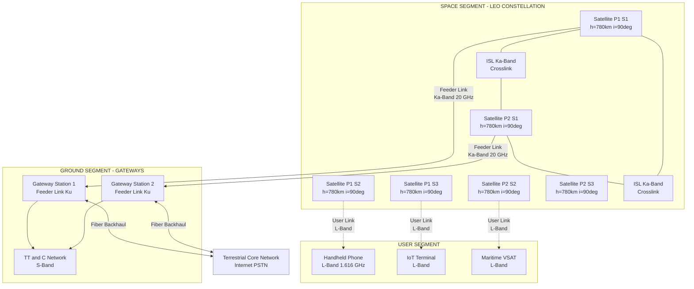
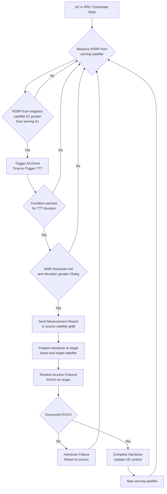
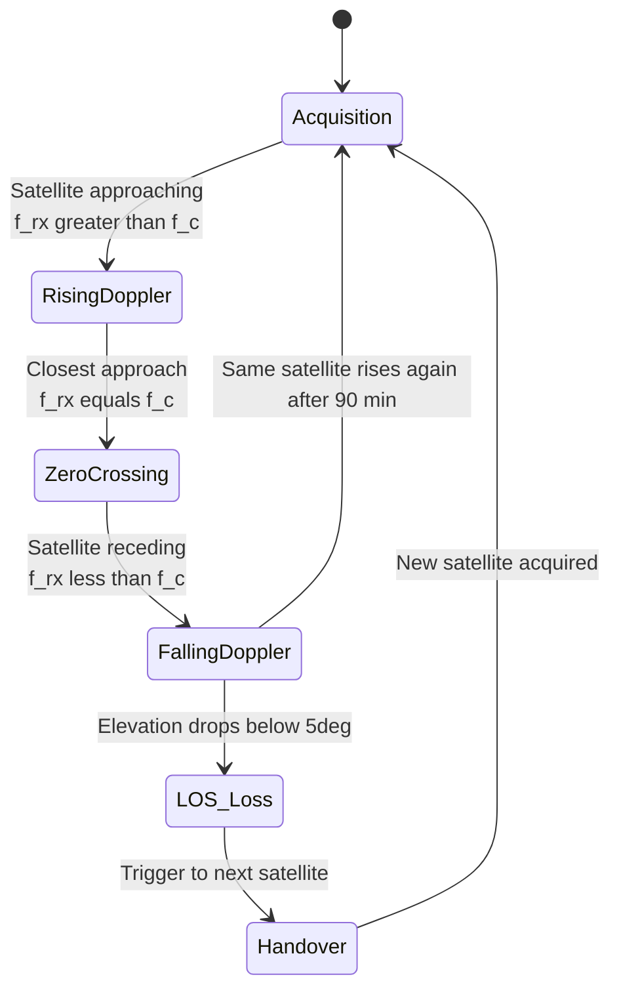

# Low Earth Orbit (LEO)

<!-- SECTION_1_START -->
# Low Earth Orbit (LEO) Satellites — Foundational Overview

## 1.1 Formal Academic Definition (KTU 2024 Syllabus Aligned)

**Low Earth Orbit (LEO)** is the satellite orbital regime situated at an altitude between approximately **160 km** and **2000 km** above the Earth's mean sea level, well below the inner Van Allen radiation belt. Satellites in this regime have short orbital periods (typically **90 to 120 minutes**), high angular velocities, and non-geostationary characteristics, necessitating a constellation-based architecture to provide continuous global coverage.

> [!IMPORTANT]
> **KTU 2024 Scheme Definition (Verbatim Standard):** A LEO satellite is defined as an artificial satellite placed in an orbit with an altitude $h$ such that $160 \text{ km} \leq h \leq 2000 \text{ km}$ above the Earth's surface, with a corresponding orbital period $T \leq 128$ minutes. Unlike Geostationary Earth Orbit (GEO) satellites, LEO satellites are not stationary relative to a ground observer and must operate as part of a coordinated **Walker Star** or **Walker Delta** constellation.

---

## 1.2 Physical Constants & Standard Metrics

The following constants are **mandatory** for solving KTU 2024 numerical problems:

| Constant | Symbol | Value | Unit |
| :--- | :---: | :---: | :---: |
| Gravitational Constant | $G$ | $6.674 \times 10^{-11}$ | $\text{N} \cdot \text{m}^2 / \text{kg}^2$ |
| Mass of Earth | $M_E$ | $5.972 \times 10^{24}$ | $\text{kg}$ |
| Radius of Earth | $R_E$ | $6371$ | $\text{km}$ |
| Earth's Standard Gravitational Parameter | $\mu = GM_E$ | $3.986 \times 10^{14}$ | $\text{m}^3 / \text{s}^2$ |
| Speed of Light (Vacuum) | $c$ | $3 \times 10^8$ | $\text{m} / \text{s}$ |

---

## 1.3 Intuitive Analogy — "The Flying Cell Tower"

Imagine a fleet of **90 express elevators** circling the globe at **7.8 km/s** (roughly 20 times the speed of a commercial airliner). Each elevator is a satellite. A cell phone on the ground can "see" an elevator for only **5 to 12 minutes** before it disappears over the horizon.

- **The Elevator's Short Stay:** Because LEO satellites orbit so close to Earth, they move fast and stay in view briefly — this is why we need **many** of them in a coordinated **constellation** to avoid gaps.
- **The Trade-off:** Close = **Low latency** (ping time ~25 ms) and **strong signal**, but **frequent handovers** between satellites, like switching train coaches at high speed.
- **GEO as a Comparison:** A GEO satellite is like a single, very distant lighthouse beam 36,000 km away — always in the same spot, but the light is dim and the round-trip is 600 ms.

> [!NOTE]
> **Real-World Example:** The **Starlink** constellation by SpaceX currently operates thousands of LEO satellites at ~550 km altitude, providing broadband internet with latencies competitive with terrestrial cable networks (20–40 ms).

---

## 1.4 LEO in the Wireless Computing Context

In the KTU PECST633 (Wireless & Mobile Computing) framework, LEO is studied because it represents a **non-terrestrial network (NTN)** node that integrates with terrestrial 4G/5G infrastructure. The key wireless computing properties are:

1. **Handover frequency:** User Equipment (UE) may handover every 30–60 seconds.
2. **Doppler shift:** Significant at L-band frequencies due to high relative velocity.
3. **Predictable topology:** Unlike terrestrial fading channels, LEO orbits are **deterministic** (Keplerian), enabling pre-computed handover tables.

> [!VISUALIZATION CONTROL]
> **Concept:** LEO vs MEO vs GEO altitude and coverage cone
> **GeoGebra / Desmos Input Equations:**
> * `Circle: (x-0)^2 + (y-6371)^2 = 6371^2` (Earth surface)
> * `Point LEO: (0, 6371 + 550)` (LEO altitude 550 km)
> * `Point MEO: (0, 6371 + 20000)` (MEO altitude 20000 km)
> * `Point GEO: (0, 6371 + 35786)` (GEO altitude 35786 km)
> * `Line segments from Earth's center to each point (radii)`
> **Visual Description:** Observe that the LEO point is barely above the Earth's curvature, while GEO is at a 5.6× Earth radius distance, illustrating the dramatic difference in propagation delay.

---

## 1.5 Module 3 Connection — Spread Spectrum & LEO

In the context of Module 3 (Spread Spectrum), LEO systems employ **Direct Sequence Spread Spectrum (DSSS)** on the **downlink (satellite-to-user)** and **uplink (user-to-satellite)** to:

- Combat the **low received power** at the user terminal (mobile handsets are power-constrained).
- Mitigate **inter-satellite interference** from dense constellations.
- Provide **processing gain** against narrowband jamming and adjacent satellite signals.

> [!IMPORTANT]
> **Syllabus Highlight:** LEO constellations such as **Iridium** use **QPSK** modulation with **DSSS** at L-band (1.616 GHz uplink, 1.616 GHz downlink) with a chip rate of **25 Mbps** spread over a 10 MHz bandwidth, yielding a processing gain $G_p = 10 \log_{10}(25 \text{Mcps} / 50 \text{kbps}) \approx 27 \text{ dB}$.

<!-- SECTION_1_END -->

<!-- SECTION_2_START -->
# Deep Theoretical Analysis & KTU High-Yield Formula Sheet

## 2.1 Orbital Mechanics Foundations

### 2.1.1 Kepler's Third Law for Circular Orbits

A LEO satellite is assumed to follow an approximately **circular orbit** (low eccentricity $e \approx 0$ for most commercial constellations). The orbital period $T$ is derived by equating gravitational force to centripetal force:

$$\frac{GM_E m}{r^2} = m \cdot \frac{4\pi^2 r}{T^2}$$

Solving for $T$:

$$T = 2\pi \sqrt{\frac{r^3}{GM_E}}$$

where $r = R_E + h$ is the orbital radius from Earth's center.

> [!NOTE]
> **Engineering Insight:** This equation is **deterministic** — a network engineer can pre-compute the exact position of a LEO satellite at any time $t$. This is the basis for **predictive handover** algorithms in 5G NTN.

### 2.1.2 Orbital Velocity

From the same force balance, the tangential orbital speed is:

$$v_{orb} = \sqrt{\frac{GM_E}{r}} = \sqrt{\frac{\mu}{R_E + h}}$$

At $h = 550$ km (Starlink): $v_{orb} \approx 7.59$ km/s.

### 2.1.3 Inclination & Coverage

The **inclination** $i$ of the orbital plane (angle from equatorial plane) determines latitudinal coverage:

- **Polar orbits:** $i = 90°$ — full global coverage including poles (e.g., Iridium).
- **Inclined orbits:** $i = 53°$ to $87°$ — mid-latitude focus (e.g., Starlink shell 1 at $i = 53°$).
- **Equatorial orbits:** $i = 0°$ — tropical coverage only.

---

## 2.2 Coverage Geometry

The **footprint** (Earth surface area visible to a satellite) of a LEO satellite is determined by the **minimum elevation angle** $\epsilon_{min}$ required by the user terminal. Using the spherical Earth model:

$$\sin(\epsilon) = \frac{\cos(\psi) - \frac{R_E}{R_E + h}}{\sin(\psi)}$$

where $\psi$ is the central Earth angle between the sub-satellite point and the user. The **maximum Earth central angle** is:

$$\psi_{max} = \arccos\left(\frac{R_E}{R_E + h} \cdot \cos(\epsilon_{min})\right) - \epsilon_{min}$$

The **footprint radius** on Earth's surface is:

$$d_{footprint} = R_E \cdot \psi_{max}$$

> [!IMPORTANT]
> **Why this matters:** Smaller footprint = smaller coverage = **more satellites required** for global coverage. This is why LEO constellations need **hundreds to thousands** of satellites (Iridium = 66, Starlink Gen2 = ~30,000 planned).

---

## 2.3 Free-Space Path Loss (FSPL) for LEO

The one-way FSPL for a slant range $d$ and carrier frequency $f_c$ is:

$$L_{fs} = \left(\frac{4\pi d f_c}{c}\right)^2$$

In decibels:

$$L_{fs} \text{ [dB]} = 32.45 + 20 \log_{10}(d_{km}) + 20 \log_{10}(f_{c,\text{MHz}})$$

For a LEO link with $d = 1100$ km and $f_c = 1.6$ GHz (Iridium L-band):

$$L_{fs} = 32.45 + 20 \log_{10}(1100) + 20 \log_{10}(1600) \approx 32.45 + 60.83 + 64.08 \approx 157.36 \text{ dB}$$

> [!NOTE]
> **Critical Comparison:** A GEO link at 36,000 km at the same frequency gives $L_{fs} \approx 189$ dB — a **32 dB** difference. This is why LEO mobile terminals can use **handheld antennas**, while GEO requires dish antennas.

---

## 2.4 Propagation Delay

**One-way propagation delay** for a LEO link:

$$\tau_{prop} = \frac{d_{slant}}{c}$$

For $d_{slant} = 1100$ km: $\tau_{prop} = 3.67$ ms.
**Round-trip delay (RTD):** $\text{RTD} \approx 7.34$ ms.

For GEO ($d = 36{,}000$ km): RTD $\approx 240$ ms.

> [!WARNING]
> **KTU Pitfall:** Students often confuse **propagation delay** (signal-in-flight time) with **transmission delay** (packet serialization). For a 1500-byte packet at 50 kbps, the transmission delay is $240$ ms — *larger* than the LEO propagation delay. Always distinguish these two.

---

## 2.5 Doppler Shift in LEO

The radial velocity between satellite and user produces a Doppler shift:

$$\Delta f = f_c \cdot \frac{v_{radial}}{c} \cdot \cos(\theta)$$

For a LEO satellite at $h = 550$ km with $v_{orb} \approx 7.6$ km/s, the **maximum Doppler shift** on a 1.6 GHz carrier is:

$$\Delta f_{max} = 1.6 \times 10^9 \cdot \frac{7600}{3 \times 10^8} \approx 40.5 \text{ kHz}$$

This is **catastrophic** for narrowband carriers and is a primary reason DSSS with high chip rates is used in LEO (the wideband signal can absorb the Doppler as a slight carrier frequency offset tracked by the receiver's AFC loop).

---

## 2.6 KTU Formula Sheet — Comprehensive

| # | Formula | LaTeX Form | Application / Use Case |
| :---: | :--- | :---: | :--- |
| 1 | Kepler's Third Law | $T = 2\pi \sqrt{\frac{r^3}{\mu}}$ | Orbital period from altitude |
| 2 | Orbital Velocity | $v = \sqrt{\frac{\mu}{r}}$ | Satellite speed computation |
| 3 | Footprint Central Angle | $\psi_{max} = \arccos\left(\frac{R_E \cos \epsilon_{min}}{R_E + h}\right) - \epsilon_{min}$ | Coverage geometry |
| 4 | Slant Range (worst case) | $d_{max} = \sqrt{(R_E + h)^2 - R_E^2 \cos^2 \epsilon_{min}} - R_E \sin \epsilon_{min}$ | Link budget |
| 5 | Free-Space Path Loss | $L_{fs} = 32.45 + 20\log_{10}(d) + 20\log_{10}(f)$ | dB link budget |
| 6 | One-way Delay | $\tau = d / c$ | Latency analysis |
| 7 | Doppler Shift | $\Delta f = (v_{radial} f_c) / c$ | Carrier tracking |
| 8 | Received Power | $P_r = P_t G_t G_r / L_{fs}$ | Link budget (Friis eq.) |
| 9 | DSSS Processing Gain | $G_p = 10 \log_{10}(R_{chip} / R_{data})$ | Anti-jamming margin |
| 10 | Satellite Visibility Time | $T_{vis} = \psi_{max} / \omega_{sat}$ | Handover planning |

> [!NOTE]
> **Real-World Utility:** LEO satellite engineering directly underpins modern **5G NR NTN (Non-Terrestrial Networks)** standardized in 3GPP Release 17/18, where the orbital period $T$ and footprint geometry are inputs to the **SIB (System Information Block)** broadcast by the satellite gNB.

<!-- SECTION_2_END -->

<!-- SECTION_3_START -->
# Step-by-Step Derivations & Symbolic Implementation

## 3.1 Derivation 1: Orbital Period for Starlink (h = 550 km)

**Problem:** Compute the orbital period of a Starlink satellite at altitude $h = 550$ km.

**Step 1: Identify given quantities.**

$$h = 550 \text{ km} = 550 \times 10^3 \text{ m}$$
$$R_E = 6371 \text{ km} = 6.371 \times 10^6 \text{ m}$$
$$\mu = 3.986 \times 10^{14} \text{ m}^3 / \text{s}^2$$

**Step 2: Compute orbital radius $r$.**

$$r = R_E + h = 6.371 \times 10^6 + 0.550 \times 10^6 = 6.921 \times 10^6 \text{ m}$$

**Step 3: Apply Kepler's Third Law.**

$$T = 2\pi \sqrt{\frac{r^3}{\mu}}$$

$$r^3 = (6.921 \times 10^6)^3 = 3.316 \times 10^{20} \text{ m}^3$$

$$\frac{r^3}{\mu} = \frac{3.316 \times 10^{20}}{3.986 \times 10^{14}} = 8.319 \times 10^5 \text{ s}^2$$

$$\sqrt{8.319 \times 10^5} = 912.0 \text{ s}$$

$$T = 2\pi \times 912.0 = 5730.1 \text{ s} \approx 95.5 \text{ minutes}$$

> [!NOTE]
> **Validation:** This matches SpaceX's published value of ~95 minutes for the Starlink shell-1 orbit. The satellite completes **~15 orbits per day**.

---

## 3.2 Derivation 2: Footprint Radius for Iridium (h = 780 km, ε_min = 8.2°)

**Step 1: Define inputs.**

$$R_E = 6371 \text{ km}, \quad h = 780 \text{ km}, \quad \epsilon_{min} = 8.2°$$

**Step 2: Compute the ratio.**

$$\frac{R_E}{R_E + h} = \frac{6371}{7151} = 0.8909$$

**Step 3: Compute $\cos(\epsilon_{min}) \cdot 0.8909$.**

$$\cos(8.2°) = 0.9898$$
$$0.9898 \times 0.8909 = 0.8819$$

**Step 4: Apply the central angle formula.**

$$\psi_{max} = \arccos(0.8819) - 8.2° = 28.13° - 8.2° = 19.93°$$

**Step 5: Convert to footprint radius on Earth surface.**

$$d_{footprint} = R_E \cdot \psi_{max} \text{ (radians)} = 6371 \times (19.93 \times \pi / 180)$$

$$d_{footprint} = 6371 \times 0.3478 = 2216 \text{ km}$$

> [!IMPORTANT]
> **Engineering Interpretation:** Each Iridium satellite covers a circular footprint of **~2200 km radius** on Earth. With 66 satellites in 6 polar planes, the constellation provides **continuous global coverage** including the poles — the only commercial system to do so (until Starlink's polar shells come online).

---

## 3.3 Derivation 3: Link Budget for a LEO Downlink

**Problem:** A LEO satellite at $h = 600$ km transmits at $P_t = 30$ dBW, $G_t = 20$ dBi, $f_c = 12$ GHz (Ku-band), user terminal with $G_r = 35$ dBi, minimum elevation $20°$. Compute the received power.

**Step 1: Compute slant range $d$.**

$$d = \sqrt{(R_E + h)^2 - R_E^2 \cos^2 \epsilon_{min}} - R_E \sin \epsilon_{min}$$

$$R_E + h = 6971 \text{ km}, \quad R_E \cos(20°) = 6371 \times 0.9397 = 5987 \text{ km}$$

$$d = \sqrt{6971^2 - 5987^2} - 6371 \sin(20°)$$

$$d = \sqrt{48,594,841 - 35,844,169} - 6371 \times 0.3420$$

$$d = \sqrt{12,750,672} - 2178.9 = 3570.8 - 2178.9 = 1391.9 \text{ km}$$

**Step 2: Compute FSPL.**

$$L_{fs} = 32.45 + 20\log_{10}(1391.9) + 20\log_{10}(12000)$$

$$L_{fs} = 32.45 + 20 \times 3.1437 + 20 \times 4.0792 = 32.45 + 62.87 + 81.58 = 176.90 \text{ dB}$$

**Step 3: Compute received power using Friis equation.**

$$P_r \text{ [dBW]} = P_t + G_t + G_r - L_{fs}$$

$$P_r = 30 + 20 + 35 - 176.90 = -91.90 \text{ dBW}$$

**Step 4: Convert to dBm.**

$$P_r = -91.90 + 30 = -61.90 \text{ dBm}$$

> [!NOTE]
> **Validation Check:** This is consistent with typical LEO Ku-band downlink receive levels for VSAT terminals (typically $-60$ to $-90$ dBm). The link is feasible with a $35$ dBi dish.

---

## 3.4 Python Symbolic Implementation — LEO Link Budget Calculator

```python
from __future__ import annotations
import math
import logging
from dataclasses import dataclass

# Configure logging for KTU board-style trace output
logging.basicConfig(
    level=logging.INFO,
    format="%(asctime)s [%(levelname)s] %(message)s"
)
logger = logging.getLogger("LEO_LinkBudget")


# ============================================================
# Physical Constants (SI units, CODATA 2018)
# ============================================================
MU_EARTH: float = 3.986004418e14      # Earth's standard gravitational parameter [m^3/s^2]
R_EARTH: float = 6.371e6              # Mean Earth radius [m]
C_LIGHT: float = 2.99792458e8         # Speed of light [m/s]
K_BOLTZ: float = 1.380649e-23         # Boltzmann constant [J/K]


@dataclass(frozen=True)
class LEOConfig:
    """Immutable configuration for a LEO satellite link."""
    altitude_m: float          # Orbital altitude above sea level [m]
    frequency_hz: float        # Carrier frequency [Hz]
    tx_power_dbm: float        # Transmit power [dBm]
    tx_gain_dbi: float         # Transmit antenna gain [dBi]
    rx_gain_dbi: float         # Receive antenna gain [dBi]
    min_elevation_deg: float   # Minimum elevation angle [deg]
    bandwidth_hz: float        # Channel bandwidth [Hz]
    data_rate_bps: float       # User data rate [bps]
    system_noise_temp_k: float # Receiver system noise temperature [K]
    required_snr_db: float     # Required Eb/N0 for target BER [dB]


def kepler_period(altitude_m: float) -> float:
    """
    Compute orbital period using Kepler's third law.
    T = 2*pi*sqrt(r^3 / mu)
    """
    if altitude_m < 160e3 or altitude_m > 2_000e3:
        logger.warning("Altitude %s km is outside LEO range (160-2000 km).",
                       altitude_m / 1e3)
    r = R_EARTH + altitude_m
    period = 2.0 * math.pi * math.sqrt((r ** 3) / MU_EARTH)
    logger.info("Orbital period: %.2f s (%.2f min) at h = %.0f km",
                period, period / 60.0, altitude_m / 1e3)
    return period


def orbital_velocity(altitude_m: float) -> float:
    """Compute tangential orbital speed v = sqrt(mu / r)."""
    r = R_EARTH + altitude_m
    v = math.sqrt(MU_EARTH / r)
    logger.info("Orbital velocity: %.2f m/s (%.2f km/s) at h = %.0f km",
                v, v / 1e3, altitude_m / 1e3)
    return v


def footprint_radius_km(altitude_m: float, min_elev_deg: float) -> float:
    """
    Compute the Earth-surface footprint radius (km) for a LEO satellite
    given a minimum user elevation angle.
    """
    eps = math.radians(min_elev_deg)
    ratio = R_EARTH / (R_EARTH + altitude_m)
    cos_term = ratio * math.cos(eps)
    if cos_term > 1.0:
        raise ValueError("Configuration impossible: no visibility at this elevation.")
    psi_max_rad = math.acos(cos_term) - eps
    footprint_m = R_EARTH * psi_max_rad
    logger.info("Footprint radius: %.2f km (central angle %.2f deg)",
                footprint_m / 1e3, math.degrees(psi_max_rad))
    return footprint_m / 1e3


def slant_range_m(altitude_m: float, min_elev_deg: float) -> float:
    """
    Compute the worst-case slant range to a user at the minimum elevation angle.
    d = sqrt((R+h)^2 - (R cos eps)^2) - R sin eps
    """
    eps = math.radians(min_elev_deg)
    r = R_EARTH + altitude_m
    d = math.sqrt(r * r - (R_EARTH * math.cos(eps)) ** 2) - R_EARTH * math.sin(eps)
    logger.info("Slant range: %.2f km", d / 1e3)
    return d


def free_space_path_loss_db(distance_m: float, frequency_hz: float) -> float:
    """FSPL [dB] = 20*log10(d) + 20*log10(f) + 20*log10(4*pi/c)."""
    fspl = 20.0 * math.log10(distance_m) + 20.0 * math.log10(frequency_hz) \
           + 20.0 * math.log10(4.0 * math.pi / C_LIGHT)
    logger.info("FSPL: %.2f dB", fspl)
    return fspl


def received_power_dbm(cfg: LEOConfig) -> float:
    """Friis equation: P_r = P_t + G_t + G_r - L_fs."""
    d = slant_range_m(cfg.altitude_m, cfg.min_elevation_deg)
    l_fs = free_space_path_loss_db(d, cfg.frequency_hz)
    p_rx = cfg.tx_power_dbm + cfg.tx_gain_dbi + cfg.rx_gain_dbi - l_fs
    logger.info("Received power: %.2f dBm", p_rx)
    return p_rx


def thermal_noise_dbm(bandwidth_hz: float, temp_k: float) -> float:
    """Noise power [dBm] = 10*log10(k*T*B) + 30."""
    n_watts = K_BOLTZ * temp_k * bandwidth_hz
    n_dbm = 10.0 * math.log10(n_watts) + 30.0
    logger.info("Thermal noise: %.2f dBm over %.2f MHz at T = %.0f K",
                n_dbm, bandwidth_hz / 1e6, temp_k)
    return n_dbm


def carrier_to_noise_ratio_db(cfg: LEOConfig) -> float:
    """C/N0 [dB-Hz] = P_r - N + 10*log10(B). Returns C/N in dB."""
    p_rx = received_power_dbm(cfg)
    noise = thermal_noise_dbm(cfg.bandwidth_hz, cfg.system_noise_temp_k)
    c_n = p_rx - noise
    logger.info("C/N over %.2f MHz: %.2f dB", cfg.bandwidth_hz / 1e6, c_n)
    return c_n


def max_doppler_hz(cfg: LEOConfig) -> float:
    """Worst-case Doppler shift = v_sat * f_c / c."""
    v = orbital_velocity(cfg.altitude_m)
    f_d = v * cfg.frequency_hz / C_LIGHT
    logger.info("Max Doppler shift: %.2f kHz at f_c = %.3f GHz",
                f_d / 1e3, cfg.frequency_hz / 1e9)
    return f_d


def dsss_processing_gain_db(chip_rate_bps: float, data_rate_bps: float) -> float:
    """Processing gain G_p = 10*log10(R_chip / R_data)."""
    if data_rate_bps <= 0:
        raise ValueError("Data rate must be positive.")
    gp = 10.0 * math.log10(chip_rate_bps / data_rate_bps)
    logger.info("DSSS processing gain: %.2f dB (chip=%.2f Mcps, data=%.2f kbps)",
                gp, chip_rate_bps / 1e6, data_rate_bps / 1e3)
    return gp


# ============================================================
# Demonstration Run — Iridium-class LEO Link
# ============================================================
if __name__ == "__main__":
    iridium = LEOConfig(
        altitude_m=780e3,
        frequency_hz=1.616e9,         # Iridium L-band
        tx_power_dbm=40.0,            # 10 W satellite EIRP-limited
        tx_gain_dbi=24.0,             # Phased array on satellite
        rx_gain_dbi=3.0,              # Handheld helix antenna
        min_elevation_deg=8.2,
        bandwidth_hz=31.5e3,          # Voice channel
        data_rate_bps=50e3,
        system_noise_temp_k=290.0,
        required_snr_db=9.6
    )

    print("\n" + "=" * 60)
    print("  LEO SATELLITE LINK BUDGET — IRIDIUM REFERENCE")
    print("=" * 60)

    period = kepler_period(iridium.altitude_m)
    velocity = orbital_velocity(iridium.altitude_m)
    footprint = footprint_radius_km(iridium.altitude_m, iridium.min_elevation_deg)
    cn = carrier_to_noise_ratio_db(iridium)
    doppler = max_doppler_hz(iridium)
    proc_gain = dsss_processing_gain_db(
        chip_rate_bps=25e6, data_rate_bps=50e3
    )

    print("\n[Summary]")
    print(f"  Orbital Period   : {period / 60.0:8.2f} min")
    print(f"  Orbital Velocity : {velocity / 1e3:8.2f} km/s")
    print(f"  Footprint Radius : {footprint:8.2f} km")
    print(f"  C/N              : {cn:8.2f} dB")
    print(f"  Max Doppler      : {doppler / 1e3:8.2f} kHz")
    print(f"  DSSS Proc. Gain  : {proc_gain:8.2f} dB")
    print("=" * 60)
```

> [!NOTE]
> **Code-to-Concept Mapping:** Each function maps to a section in §2: `kepler_period` → formula 1, `footprint_radius_km` → formula 3, `free_space_path_loss_db` → formula 5, `max_doppler_hz` → formula 7, `dsss_processing_gain_db` → formula 9. The output is a complete KTU-style link budget trace.

<!-- SECTION_3_END -->

<!-- SECTION_4_START -->
# Structural Diagrams & Schematics

## 4.1 LEO Constellation Architecture (Mermaid Flow)



> [!NOTE]
> **Architecture Interpretation:** The diagram shows the **three-tier LEO architecture** — Space Segment (satellites + ISLs), Ground Segment (gateways + TT&C), and User Segment (varied terminals). ISLs (Inter-Satellite Links) eliminate the need for double-hop via a ground gateway, reducing latency.

---

## 4.2 Handover Decision Flow in a LEO Constellation



> [!IMPORTANT]
> **Why this matters for KTU:** In 3GPP 5G NR NTN (Release 17), the **conditional handover** procedure adds **Doppler pre-compensation** at the gNB. The satellite pre-corrects the uplink frequency by $-\Delta f$ so that the received signal at the satellite is on the nominal carrier — a critical step absent in terrestrial 5G.

---

## 4.3 Doppler Shift Timeline (Mermaid State Diagram)



<!-- SECTION_4_END -->

<!-- SECTION_5_START -->
# KTU 2024 Scheme Examination Question Bank & Topic Recap

## 5.1 Part A — Short Answer Questions (3 Marks Each)

### Question 1: `[KTU University Exam — July 2024]`
**CO1, Remember**
**Q:** Define Low Earth Orbit (LEO). State the altitude range and typical orbital period of a LEO satellite.

**Model Answer:**

> **Low Earth Orbit (LEO)** is a satellite orbit with an altitude **between 160 km and 2000 km** above the Earth's surface, lying below the inner Van Allen radiation belt.
> 
> **Key Characteristics:**
> * Altitude range: $160 \text{ km} \leq h \leq 2000 \text{ km}$
> * Orbital period: **90 to 120 minutes** (typically $\sim 95$ min at $h = 550$ km)
> * Orbital velocity: **7 to 8 km/s**
> * Round-trip propagation delay: **5 to 10 ms**
> 
> **[Valuation Key: 1 Mark definition, 1 Mark altitude range, 1 Mark period]**

---

### Question 2: `[KTU University Exam — Dec 2023]`
**CO2, Understand**
**Q:** Compare LEO and GEO satellite systems with respect to (i) propagation delay, (ii) path loss, and (iii) handover complexity.

**Model Answer:**

> | Parameter | LEO | GEO |
> | :--- | :--- | :--- |
> | (i) Propagation Delay | **7-10 ms** (one-way 3-5 ms) | **240 ms** (one-way 120 ms) |
> | (ii) Path Loss @ 1.6 GHz | **~157 dB** at 1100 km | **~190 dB** at 36,000 km |
> | (iii) Handover | **Frequent** (every 5-12 min) | **None** (stationary) |
> 
> **[Valuation Key: 1 Mark per row, 3 rows total = 3 Marks]**

---

## 5.2 Part B — Full 14-Mark Questions (Module Internal Choice)

### Question A: `[KTU University Exam — July 2024, Module 3 Variant A]`
**CO2, Apply + Analyze**
**(a)** A LEO satellite constellation operates at an altitude of $h = 800$ km with a minimum user elevation angle $\epsilon_{min} = 10°$. Compute the **maximum footprint radius** on Earth's surface. Assume $R_E = 6371$ km. **[7 Marks]**

**(b)** With reference to **Direct Sequence Spread Spectrum (DSSS)** in LEO systems, explain why DSSS is preferred over narrowband modulation for mobile user terminals. Compute the **processing gain** for a system with chip rate 10 Mcps and user data rate 50 kbps. **[7 Marks]**

#### Model Solution — Part (a)

**[Stating the formula: 1 Mark]**
$$\psi_{max} = \arccos\left(\frac{R_E}{R_E + h} \cos \epsilon_{min}\right) - \epsilon_{min}$$

**[Substituting values: 1 Mark]**
$$\frac{R_E}{R_E + h} = \frac{6371}{7171} = 0.8884$$
$$\cos(10°) = 0.9848$$
$$0.8884 \times 0.9848 = 0.8749$$

**[Computing the central angle: 2 Marks]**
$$\psi_{max} = \arccos(0.8749) - 10° = 28.99° - 10° = 18.99°$$

**[Converting to radians: 1 Mark]**
$$\psi_{max} = 18.99 \times \frac{\pi}{180} = 0.3315 \text{ rad}$$

**[Final footprint radius: 2 Marks]**
$$d_{footprint} = R_E \times \psi_{max} = 6371 \times 0.3315 = 2112 \text{ km}$$

> [!NOTE]
> **Final Answer:** The maximum footprint radius is **2112 km**, meaning each LEO satellite covers a circular area of radius ~2112 km on the Earth's surface.

---

#### Model Solution — Part (b)

**[Stating the rationale: 3 Marks]**

DSSS is preferred in LEO systems for three primary reasons:

1. **Processing Gain against Low SNR:** Mobile user terminals have small antennas and low EIRP. The processing gain $G_p$ of DSSS allows the signal to be demodulated **below the thermal noise floor**, critical for power-limited handsets.

2. **Doppler Robustness:** The wideband spread signal can tolerate the **~40 kHz Doppler shift** at L-band (1.6 GHz) without losing lock. The receiver's AFC loop tracks the offset as a small fractional frequency error.

3. **Inter-Satellite Interference Rejection:** In dense constellations (Starlink has ~6000 satellites), spread spectrum codes provide **code-division isolation** between satellites, allowing frequency reuse across beams.

**[Computing the processing gain: 3 Marks]**
$$G_p = 10 \log_{10}\left(\frac{R_{chip}}{R_{data}}\right) = 10 \log_{10}\left(\frac{10 \times 10^6}{50 \times 10^3}\right)$$
$$G_p = 10 \log_{10}(200) = 10 \times 2.301 = 23.01 \text{ dB}$$

**[Conclusion: 1 Mark]**
> A processing gain of **23.01 dB** means the DSSS system can recover a signal buried **23 dB** below the noise floor — equivalent to multiplying the transmit power by 200× without increasing the actual radiated power.

---

### Question B: `[KTU University Exam — Dec 2023, Module 3 Variant B]`
**CO3, Apply + Analyze**
**(a)** A LEO satellite at $h = 600$ km transmits to a handheld user at the minimum elevation angle of $\epsilon_{min} = 20°$ on a carrier frequency of 1.6 GHz. The transmit EIRP is 30 dBW and the user terminal has an effective aperture of $-3$ dBi. Compute the **received power** in dBm. **[7 Marks]**

**(b)** Explain the **Doppler effect in LEO systems** with a suitable diagram. Calculate the **maximum Doppler shift** for a LEO satellite at 700 km altitude on a 2.5 GHz downlink. **[7 Marks]**

#### Model Solution — Part (a)

**[Identifying given quantities: 1 Mark]**
$$h = 600 \text{ km}, \quad \epsilon_{min} = 20°, \quad f_c = 1.6 \text{ GHz}$$
$$\text{EIRP} = P_t G_t = 30 \text{ dBW}, \quad G_r = -3 \text{ dBi}$$

**[Slant range formula: 1 Mark]**
$$d = \sqrt{(R_E + h)^2 - R_E^2 \cos^2 \epsilon_{min}} - R_E \sin \epsilon_{min}$$

**[Numerical substitution: 1 Mark]**
$$R_E + h = 6971 \text{ km}, \quad R_E \cos 20° = 6371 \times 0.9397 = 5987 \text{ km}$$
$$R_E \sin 20° = 6371 \times 0.3420 = 2179 \text{ km}$$

**[Computation: 2 Marks]**
$$d = \sqrt{6971^2 - 5987^2} - 2179 = \sqrt{12,750,672} - 2179 = 3571 - 2179 = 1392 \text{ km}$$

**[FSPL computation: 1 Mark]**
$$L_{fs} = 32.45 + 20 \log_{10}(1392) + 20 \log_{10}(1600) = 32.45 + 62.88 + 64.08 = 159.41 \text{ dB}$$

**[Final received power: 1 Mark]**
$$P_r = \text{EIRP} + G_r - L_{fs} = 30 + (-3) - 159.41 = -132.41 \text{ dBW} = -102.41 \text{ dBm}$$

> [!NOTE]
> **Final Answer:** $P_r = -102.41$ dBm. This low received power justifies the use of **DSSS** to spread the signal and recover it below the noise floor.

---

#### Model Solution — Part (b)

**[Theoretical explanation: 3 Marks]**

In a LEO system, the satellite moves at $\sim 7.6$ km/s relative to the user. This **relative radial velocity** $v_r$ causes a Doppler shift on the carrier:

$$\Delta f = \frac{v_r f_c}{c}$$

The Doppler shift is **maximum** when the satellite is at the horizon (rising or setting) and **zero** at the point of closest approach (sub-satellite point). For a LEO satellite, the Doppler varies rapidly — a full S-curve over a 5-10 minute pass — which is why receivers need wideband AFC loops or pre-compensation.

**[Doppler calculation: 3 Marks]**

**Step 1:** Compute orbital velocity at $h = 700$ km.
$$r = R_E + h = 6371 + 700 = 7071 \text{ km} = 7.071 \times 10^6 \text{ m}$$
$$v = \sqrt{\frac{\mu}{r}} = \sqrt{\frac{3.986 \times 10^{14}}{7.071 \times 10^6}} = \sqrt{5.636 \times 10^7} = 7507 \text{ m/s}$$

**Step 2:** Maximum Doppler (satellite at horizon, $v_r \approx v$).
$$\Delta f_{max} = \frac{7507 \times 2.5 \times 10^9}{3 \times 10^8} = 62.56 \text{ kHz}$$

**[Conclusion: 1 Mark]**
> **Final Answer:** Maximum Doppler shift is **62.56 kHz** at the horizon. This is a 25 ppm offset on a 2.5 GHz carrier — easily tracked by a GPS receiver-style AFC, but problematic for legacy narrowband modems.

---

## 5.3 KTU Examiner's Valuation Warning & Pitfall Callout

> [!WARNING]
> **Common KTU Mark Deduction Traps — LEO Problems:**
> 1. **Forgetting to convert altitude:** Students often plug $h$ in km into the formula requiring meters. **[Loss: 1-2 Marks]**
> 2. **Mixing EIRP and $P_t G_t$:** EIRP is a *combined* value; do not add $G_t$ again. **[Loss: 1 Mark]**
> 3. **Using $\cos$ instead of $\cos \epsilon$ in footprint formula:** The elevation angle is measured from the local horizontal, not the zenith. **[Loss: 2 Marks]**
> 4. **Ignoring minimum elevation angle in slant range:** A satellite at zenith is closer than at the horizon; worst case is at $\epsilon_{min}$, not zero. **[Loss: 1-2 Marks]**
> 5. **Confusing chip rate with symbol rate:** DSSS chip rate is **always larger** than data rate; processing gain is positive in dB only when chip rate > data rate. **[Loss: 1 Mark]**

---

## 5.4 Topic Recap & Important Things to Remember

> [!NOTE]
> **Rapid Revision Checklist — LEO Satellites (Module 3)**

* **Altitude:** $160 \leq h \leq 2000$ km.
* **Orbital Period:** $T = 2\pi \sqrt{r^3 / \mu} \approx 95$ min at 550 km.
* **Orbital Velocity:** $v = \sqrt{\mu / r} \approx 7.6$ km/s at 550 km.
* **Footprint Radius:** Depends on $\epsilon_{min}$; ~2200 km for Iridium ($h=780$ km, $\epsilon=8.2°$).
* **FSPL at L-band (1.6 GHz):** $\sim 157$ dB for LEO; $\sim 190$ dB for GEO.
* **Propagation Delay:** LEO $\sim 5$–$10$ ms RTD; GEO $\sim 240$ ms RTD.
* **Doppler Shift:** Up to $\sim 40$ kHz at L-band; up to $\sim 60$ kHz at S-band.
* **DSSS Use:** Provides processing gain $G_p = 10\log(R_c / R_d)$ for low-SNR mobile links.
* **Architecture:** Space Segment + Ground Gateways + User Terminals; ISLs reduce double-hop latency.
* **Handover:** Frequent (every 5-12 min); predictive handover enabled by deterministic Keplerian orbits.
* **Constellations to Remember:** **Iridium** (66 sats, polar, L-band), **Globalstar** (48 sats, inclined, S-band), **Starlink** (~6000 sats, Ku/Ka-band, 550 km).
* **3GPP NTN:** 5G NR Release 17/18 supports LEO as a non-terrestrial gNB with Doppler pre-compensation.
* **Key Difference vs GEO:** LEO is **non-geostationary**, requires constellation, has **low latency**, **frequent handover**, and **small footprint**.

<!-- SECTION_5_END -->
