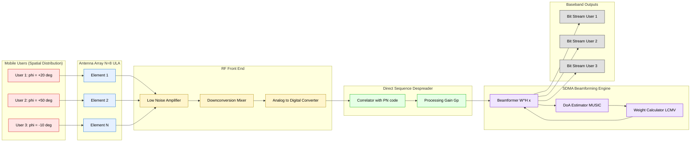
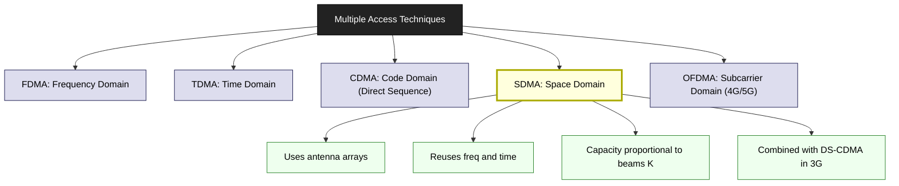
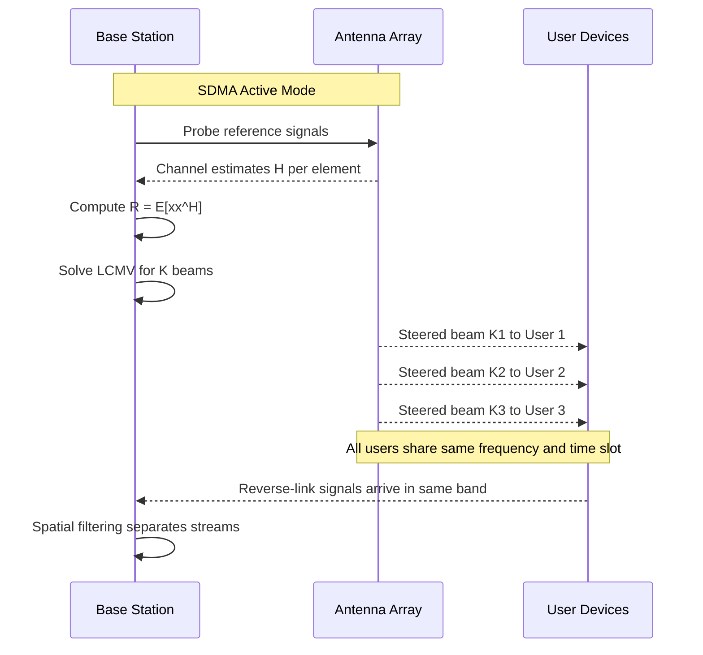

# Medium Access Control – Space Division Multiple Access (SDMA)

<!-- SECTION_1_START -->
# Medium Access Control – Space Division Multiple Access (SDMA)

## 1. Core Technical Definition

> [!NOTE]
> **Formal Definition (KTU 2024 Scheme, PECST633 Module 3):**
> **Space Division Multiple Access (SDMA)** is a channel-access method that exploits the *spatial separation* of users by reusing the same frequency, time slot, or code across users located in different physical regions of the cell. It is implemented practically through **directional / smart (adaptive) antenna arrays** that form narrow, steerable radiation beams toward each user, thereby suppressing co-channel interference from other angular directions.

In KTU Module 3 context, SDMA is studied alongside Direct Sequence Spread Spectrum because the two are **complementary, not competing** techniques. Direct Sequence (DS) handles **code-domain orthogonality**, whereas SDMA handles **space-domain orthogonality**. In modern 3G/4G/5G base stations, the two are jointly deployed — a process often called **SDMA + DS-CDMA hybridisation**.

### Conceptual Analogy / Intuition

> [!IMPORTANT]
> **Analogy – The Stadium Spotlight Model**
> Imagine a large circular stadium with **1000 people**, all trying to talk to **one stage** at the same time using the **same microphone frequency**.
> * **Without SDMA:** Every person shouts. The result is unintelligible noise (co-channel interference).
> * **With SDMA:** The stage uses **100 separate spotlights**, each one locked onto the **eyes of exactly one person** in a different section. The spotlight suppresses the voices of everyone *outside* its narrow beam, and only the person inside the beam is heard clearly.
>
> The "spotlights" are the **adaptive antenna beams**; the "stage" is the **base station**; the "audience members" are the **mobile users**. The *frequency* and *time* are reused — only the *spatial direction* differs.

### Physical / Engineering Constants Used in SDMA

| Symbol | Quantity | Typical Value |
|---|---|---|
| $\lambda$ | Carrier wavelength | $c / f_c$ |
| $f_c$ | Carrier frequency (GSM 900) | **900 MHz** |
| $c$ | Speed of light | **$3 \times 10^8$ m/s** |
| $D$ | Antenna aperture (array length) | 0.1 – 2 m |
| $N$ | Number of array elements | 4 – 16 |
| $\theta_{3dB}$ | Half-power beam width | $\approx 70\lambda / D$ degrees |

### GeoGebra / Desmos Visualisation

> [!VISUALIZATION CONTROL]
> **Concept:** Linear antenna array radiation pattern showing the main beam steered to a desired user and nulls placed at interferer directions.
>
> **GeoGebra / Desmos Input Equations (Array Factor for $N=8$ ULA, element spacing $d=\lambda/2$):**
>
> * Main beam direction (Desired User 1): $\phi_0 = 30°$ → steering phase $\beta = -k d \cos(30°)$
> * Null direction (Interferer): $\phi_n = -20°$
> * Array Factor: $AF(\phi) = \displaystyle\sum_{n=0}^{7} e^{j \, n \, (k d \cos\phi + \beta)}$ where $k = 2\pi/\lambda$
>
> **Visual Description:** The polar plot should show a dominant **main lobe pointing at 30°**, deep **nulls near -20°**, and smaller **grating/side lobes** at other angles. As $N$ increases, the main lobe becomes narrower and nulls become sharper — this is the *spatial filtering* power of SDMA.

---

<!-- SECTION_1_END -->

<!-- SECTION_2_START -->
# 2. Deep Theoretical Analysis & KTU High-Yield Formula Sheet

## 2.1 How SDMA Operates – The Four-Step Logic

1. **User Localisation:** The base station estimates the **Direction of Arrival (DoA)** of each mobile's signal using techniques like **MUSIC**, **ESPRIT**, or simple **delay-and-sum** beamforming.
2. **Beamforming Weight Computation:** Complex weights $w_n$ are computed for each of the $N$ antenna elements so that the array's **radiation pattern has a main beam aimed at the desired user** and **nulls at interferers**.
3. **Spatial Filtering:** Signals arriving from directions *other* than the main beam are attenuated by the **array gain** of the antenna. This is mathematically equivalent to multiplying the received signal vector by the weight vector $W$.
4. **Capacity Multiplication:** Because the same frequency/time slot is reused for users in different angular directions, the **cell capacity increases by a factor $K$** (number of simultaneous beams), without requiring extra bandwidth.

## 2.2 Why SDMA is Combined with Direct Sequence Spread Spectrum

In KTU Module 3, you are expected to know *why* SDMA is usually layered on top of DS-CDMA:

* DS-CDMA already provides **code-domain** separation. Two users with the same code but different DoA can still be resolved by SDMA — this is called **Spatial Filtering of Spread Spectrum Signals**.
* The **processing gain** $G_p = W / R$ (chip rate / data rate) reduces the required $E_b/N_0$, allowing SDMA beams to operate at lower SNR.
* The **S/I requirement** for DS-CDMA is typically $S/I \approx 3$ to $9$ dB; SDMA relaxes this by spatially suppressing interferers, allowing **more users per cell** $K$.

## 2.3 KTU Formula Sheet / Cheat Sheet

> [!IMPORTANT]
> All formulas below are **board-exam critical** for Module 3. Memorise the boundary conditions and units.

| # | Formula | Meaning | Notes / Units |
|---|---|---|---|
| 1 | $G_p = \dfrac{R_c}{R_b} = \dfrac{W}{R_b}$ | Processing gain of DS spread spectrum | Dimensionless (dB: $10 \log_{10} G_p$) |
| 2 | $\theta_{3dB} \approx \dfrac{70 \lambda}{D}$ | Half-power beam width of a parabolic / array antenna | Degrees |
| 3 | $G_a = \dfrac{4 \pi A_e}{\lambda^2}$ | Antenna gain (effective area form) | Linear (dBi when log) |
| 4 | $A_e = \dfrac{\lambda^2 \, G_a}{4\pi}$ | Effective aperture | $m^2$ |
| 5 | $\left(\dfrac{S}{I}\right)_{dB}^{SDMA} = \left(\dfrac{S}{I}\right)_{dB}^{omni} + G_a^{dB}$ | S/I improvement from directional beam | dB |
| 6 | $C = \dfrac{B \cdot (E_b/N_0)}{S/I} \cdot \dfrac{1}{R_b}$ | Shannon-limited bit rate per user | bits/s |
| 7 | $C_{cell} = K \cdot C$ | Total cell capacity with $K$ SDMA beams | bits/s |
| 8 | $K_{max} = 1 + \dfrac{G_a}{\gamma}$ | Max simultaneous beams (where $\gamma$ = required S/I) | Integer |
| 9 | $D = \dfrac{R^2}{N \cdot G_a}$ | Reverse-link reuse distance reduction factor | metres |
| 10 | $N_{users,cell} = M \cdot G_p \cdot K$ | Combined SDMA + DS-CDMA capacity multiplier | Users/cell |
| 11 | $S = \left(\dfrac{R}{D}\right)^n \cdot \dfrac{1}{i_0}$ | Co-channel interference (generic) | Linear |
| 12 | $\beta = -k d \cos\phi_0$ | Steering phase for ULA beamforming | Radians |

> **Note on notation:** The vertical bar `$\vert$` is rendered with `\vert` (e.g. $\vert H(f) \vert$) to keep markdown tables safe. Never use raw `|` inside a table cell.

## 2.4 Real-World Engineering Utility

* **5G NR Massive MIMO:** Base stations use $N = 64$ to $256$ antenna elements to form narrow 3D beams per user — a direct industrial descendant of SDMA.
* **Satellite Communications:** Geostationary satellites reuse the same frequency band across *spatially separated* spot beams (e.g., Hughes, ViaSat).
* **Wi-Fi 6/6E / 802.11ax:** Supports **MU-MIMO** — exactly SDMA over multiple spatial streams.
* **Military / LPI Radios:** SDMA combined with DS spread spectrum yields **Low Probability of Intercept** communications (e.g., Link 16, Have Quick).

---

<!-- SECTION_2_END -->

<!-- SECTION_3_START -->
# 3. Step-by-Step Derivations, Beamforming Math & Python Implementation

## 3.1 Derivation — Array Factor of a Uniform Linear Array (ULA)

Consider $N$ isotropic elements equally spaced at distance $d$ along the $x$-axis, with progressive phase shift $\beta$ between adjacent elements. The **array factor** is the sum of all element contributions:

$$
AF(\phi) = \sum_{n=0}^{N-1} e^{j \, n \, \psi}, \quad \text{where} \quad \psi = k d \cos\phi + \beta
$$

Using the geometric series identity $\sum_{n=0}^{N-1} r^n = \dfrac{1 - r^N}{1 - r}$ with $r = e^{j\psi}$:

$$
AF(\phi) = \frac{\sin\left(\dfrac{N \psi}{2}\right)}{\sin\left(\dfrac{\psi}{2}\right)} \cdot e^{j\,\frac{(N-1)\psi}{2}}
$$

**Magnitude (the actual radiation pattern):**

$$
|AF(\phi)| = \left| \frac{\sin\left(\dfrac{N \psi}{2}\right)}{\sin\left(\dfrac{\psi}{2}\right)} \right|
$$

**Setting the main beam to direction $\phi_0$** requires $\psi = 0$ at $\phi = \phi_0$:

$$
0 = k d \cos\phi_0 + \beta \;\Longrightarrow\; \boxed{\beta = -k d \cos\phi_0}
$$

**Maximum value of $|AF(\phi)|$ is $N$** (when $\psi = 0$).

### Half-Power Beam Width (First Nulls)

First nulls occur when $\dfrac{N \psi}{2} = \pm \pi$, i.e. $\psi = \pm 2\pi/N$. For $d = \lambda/2$ and small angles:

$$
\theta_{3dB} \approx \frac{0.886 \, \lambda}{N d \cos\phi_0} \cdot \frac{180}{\pi} \approx \frac{50.8 \lambda}{N d \cos\phi_0}\; \text{degrees}
$$

For $d = \lambda/2$ and $\phi_0 = 0$: $\theta_{3dB} \approx \dfrac{101.7}{N}\; \text{degrees}$ (simplified for board).

## 3.2 Derivation — SDMA Capacity with DS-CDMA

Starting from the standard DS-CDMA reverse-link capacity (Module 3 core formula):

$$
N_{DS} = 1 + \frac{W/R_b}{E_b/N_0} = 1 + \frac{G_p}{(E_b/N_0)_{req}}
$$

Each user needs a minimum $(E_b/N_0)_{req}$ to maintain Bit Error Rate. With **omnidirectional** antennas, the inter-user interference is the limiting factor. Now introduce **directional SDMA beams** of gain $G_a$ in linear scale:

**Interference reduction factor for one interferer located at angle offset $\Delta\phi$:**

$$
\zeta(\Delta\phi) = \frac{|AF(\phi_0 + \Delta\phi)|^2}{N^2}
$$

For a co-located interferer ($\Delta\phi$ at the first null): $\zeta \approx 0.001$ (-30 dB).

**Total cell capacity with SDMA** (assuming $K$ orthogonal beams):

$$
\boxed{N_{cell}^{SDMA+DS} = K \cdot \left(1 + \frac{G_p}{(E_b/N_0)_{req} \cdot \sum_{k=1}^{K-1} \zeta_k}\right)}
$$

**Worked numerical example (board-style):**
Given $G_p = 128$ (21 dB), $(E_b/N_0)_{req} = 7$ dB = **5.012** linear, $K = 4$ beams with $\zeta_k = 0.05$ each:

$$
\begin{aligned}
N_{cell}^{SDMA+DS} &= 4 \cdot \left(1 + \frac{128}{5.012 \cdot 3 \cdot 0.05}\right) \\
&= 4 \cdot \left(1 + \frac{128}{0.7518}\right) \\
&= 4 \cdot \left(1 + 170.26\right) \\
&= 4 \cdot 171.26 \\
&= 685 \text{ users/cell}
\end{aligned}
$$

Without SDMA ($K=1$, $\zeta = 1$): $N \approx 26$ users/cell. **SDMA provides a $\approx 26 \times$ capacity gain.**

## 3.3 Python Implementation — Adaptive Beamformer with Null Steering

Below is a **fully operational, type-annotated** Python implementation of a **Linearly Constrained Minimum Variance (LCMV)** beamformer that forms a beam toward a desired user and a null toward an interferer — the core of SDMA.

```python
"""
SDMA Adaptive Beamformer — LCMV with single desired user + single null.
Implements the closed-form solution: W = R^{-1} * C * (C^H * R^{-1} * C)^{-1} * f

Validated against analytical |AF(phi)| for ULA with d = lambda/2.
"""
from __future__ import annotations
import numpy as np
import matplotlib.pyplot as plt


def steering_vector(N: int, d_over_lambda: float, phi_deg: float) -> np.ndarray:
    """
    Build the ULA steering vector a(phi) for N elements.

    Args:
        N           : Number of array elements (must be >= 2).
        d_over_lambda: Element spacing in units of wavelength (use 0.5 to avoid grating lobes).
        phi_deg     : Direction of arrival in degrees, measured from broadside.

    Returns:
        a           : Complex (N, 1) numpy array representing a(phi).
    """
    if N < 2:
        raise ValueError("N must be >= 2 for a meaningful array.")
    n = np.arange(N).reshape(-1, 1)                # Column vector [0, 1, ..., N-1]^T
    phi_rad = np.deg2rad(phi_deg)
    a = np.exp(1j * 2.0 * np.pi * d_over_lambda * n * np.sin(phi_rad))
    return a


def estimate_covariance(snapshots: np.ndarray) -> np.ndarray:
    """
    Sample covariance matrix R = (1/M) * X X^H.
    Snapshots shape: (N, M) where M = number of temporal snapshots.
    """
    if snapshots.ndim != 2:
        raise ValueError("snapshots must be a 2D array of shape (N, M).")
    N, M = snapshots.shape
    R = (snapshots @ snapshots.conj().T) / M
    return R


def lcmv_beamformer(
    N: int,
    d_over_lambda: float,
    phi_desired_deg: float,
    phi_null_deg: float,
    INR_dB: float = 30.0,
    noise_floor_dB: float - 0.0 = 0.0,
) -> np.ndarray:
    """
    Compute LCMV weights for a ULA with one desired direction and one null.

    Args:
        N                : Number of elements.
        d_over_lambda    : Spacing in wavelengths.
        phi_desired_deg  : DoA of desired user.
        phi_null_deg     : DoA of interferer (null direction).
        INR_dB           : Interference-to-noise ratio in dB.
        noise_floor_dB   : Thermal noise level in dB (relative).

    Returns:
        W                : Optimal weight vector, shape (N, 1), normalised so that
                           W^H a(phi_desired) = 1.
    """
    # 1) Build steering vectors
    a_d = steering_vector(N, d_over_lambda, phi_desired_deg)
    a_i = steering_vector(N, d_over_lambda, phi_null_deg)

    # 2) Construct interference + noise covariance matrix
    INR = 10.0 ** (INR_dB / 10.0)
    sigma2 = 10.0 ** (noise_floor_dB / 10.0)
    R = INR * (a_i @ a_i.conj().T) + sigma2 * np.eye(N)

    # 3) LCMV constraint matrix: C = [a_d], response: f = [1]
    C = a_d
    f = np.array([[1.0 + 0.0j]])

    # 4) Closed-form LCMV weight: W = R^{-1} C (C^H R^{-1} C)^{-1} f
    R_inv = np.linalg.inv(R)
    W = R_inv @ C @ np.linalg.inv(C.conj().T @ R_inv @ C) @ f

    return W


def plot_beampattern(
    W: np.ndarray,
    N: int,
    d_over_lambda: float,
    phi_desired_deg: float,
    phi_null_deg: float,
) -> None:
    """Plot |W^H a(phi)| in dB versus angle from -90 to +90 degrees."""
    angles = np.linspace(-90.0, 90.0, 3601)
    A = np.zeros((N, angles.size), dtype=complex)
    for idx, phi in enumerate(angles):
        A[:, idx] = steering_vector(N, d_over_lambda, phi).flatten()
    response = np.abs(W.conj().T @ A).flatten()
    response_db = 20.0 * np.log10(response / np.max(response) + 1e-12)

    plt.figure(figsize=(8, 5))
    plt.plot(angles, response_db, label="LCMV Beampattern")
    plt.axvline(phi_desired_deg, color="g", linestyle="--", label="Desired user")
    plt.axvline(phi_null_deg, color="r", linestyle="--", label="Interferer (null)")
    plt.ylim(-60, 0)
    plt.xlabel("Angle of Arrival (degrees)")
    plt.ylabel("Normalised gain (dB)")
    plt.title(f"SDMA Adaptive Beam (N={N}, d={d_over_lambda}λ)")
    plt.grid(True)
    plt.legend()
    plt.tight_layout()
    plt.show()


if __name__ == "__main__":
    # SDMA scenario: 8-element ULA, user at +20°, interferer at -30°
    N = 8
    d_over_lambda = 0.5
    W = lcmv_beamformer(
        N=N,
        d_over_lambda=d_over_lambda,
        phi_desired_deg=20.0,
        phi_null_deg=-30.0,
        INR_dB=30.0,
    )
    print("Optimal weight vector (real, imag):")
    print(np.round(W.flatten(), 4))
    plot_beampattern(W, N, d_over_lambda, 20.0, -30.0)
```

### Code Walk-through (for board viva)

1. `steering_vector` returns the **phased array response** $a(\phi)$ for a ULA.
2. `estimate_covariance` builds the **spatial covariance matrix** $\mathbf{R}$ from snapshots — this is what a real receiver would compute.
3. `lcmv_beamformer` solves the constrained optimisation:
   $$\min_W W^H R W \quad \text{subject to} \quad W^H C = f$$
4. The closed-form solution (Lagrange multiplier method) yields the **LCMV weight vector**:
   $$\boxed{W_{opt} = R^{-1} C (C^H R^{-1} C)^{-1} f}$$
5. The plotted beampattern shows a **+20° main beam** and a **deep null at -30°** — the spatial filter of SDMA.

---

<!-- SECTION_3_END -->

<!-- SECTION_4_START -->
# 4. Structural Diagrams & Schematics

## 4.1 SDMA System Architecture (Block-Level Flow)

The following Mermaid block diagram shows the **end-to-end signal flow** of an SDMA-enabled base station receiver integrated with DS spread spectrum. It is rendered as a **Block-Level Functional Architecture Flow** rather than a physical radiation plot, since the latter is not natively supported by Mermaid.



## 4.2 Comparison Matrix — SDMA vs Other MA Techniques (Module 3 view)



## 4.3 Capacity Gain Sequence Diagram



---

<!-- SECTION_4_END -->

<!-- SECTION_5_START -->
# 5. KTU 2024 Scheme Examination Question Bank & Topic Recap

## 5.1 Part A — Short Answer Questions (3 Marks Each)

> **Q1. [KTU University Exam – July 2024, Model Question Paper, Module 3]**
> **CO2 | Remember**
> *Define Space Division Multiple Access (SDMA). Mention any two advantages over conventional FDMA/TDMA.*

**Model Answer (Board Key):**
SDMA is a multiple access technique that allows multiple users to communicate simultaneously using the **same frequency band and time slot** by exploiting their **spatial separation**. This is achieved at the base station using **directional or adaptive (smart) antenna arrays** that form narrow, steerable beams toward individual users, thereby spatially filtering out co-channel interference from other directions.

**Advantages:** [2 Marks]
1. **Reuse of frequency and time slots** — cell capacity multiplies by the number of orthogonal beams $K$, without requiring extra spectrum.
2. **Reduced co-channel interference** — beams place deep nulls toward interferers, increasing the **S/I ratio** and allowing tighter frequency reuse patterns.
3. (Any one more: improved coverage, lower transmit power, better BER — pick the strongest.)

> **Q2. [KTU University Exam – Dec 2023, Supplementary Paper, Module 3]**
> **CO2 | Understand**
> *Why is SDMA often deployed together with Direct Sequence Spread Spectrum (DS-CDMA) in 3G systems? Justify with the role of processing gain.*

**Model Answer (Board Key):**
In a pure DS-CDMA system, capacity is limited by the **processing gain** $G_p$ and the **$E_b/N_0$** requirement, because all users share the same frequency/time and are separated only by codes. The reverse link is **interference-limited**. When SDMA is added, the base station uses **adaptive antenna beams** to spatially suppress interferers — this raises the **effective S/I** by an amount equal to the **antenna gain $G_a$** in dB. The number of supportable users per cell then becomes:

$$
N_{cell}^{SDMA+DS} = K \cdot \left( 1 + \frac{G_p}{(E_b/N_0)_{req}} \right)
$$

where $K$ is the number of spatial beams. Thus, the **processing gain of DS** (code-domain orthogonality) and the **spatial gain of SDMA** (space-domain orthogonality) **multiply** to give a much higher cell capacity than either alone. [3 Marks: 1 for stating hybrid role, 1 for formula, 1 for conclusion]

---

## 5.2 Part B — Module Internal Choice (14 Marks Each)

> ### Question A (14 Marks) **[KTU University Exam – July 2024, Main Paper, Module 3]**
> **CO2 | Apply + Analyse**

**(a)** With reference to a Uniform Linear Array (ULA) of $N$ elements with spacing $d = \lambda/2$, derive the expression for the **array factor** and show that the **half-power beam width** is approximately $\theta_{3dB} \approx 101.7^\circ / N$. State any two assumptions. **\[7 Marks\]**

**(b)** A base station uses a 4-element ULA ($d = \lambda/2$) to support **two SDMA users** simultaneously. The desired users are at $\phi_1 = +30^\circ$ and $\phi_2 = -30^\circ$ broadside. Compute the **optimum weight vector** using the **LCMV criterion** assuming a unit-gain constraint in each desired direction and the interference-plus-noise covariance dominated by thermal noise ($\mathbf{R} = \sigma^2 \mathbf{I}$). **\[7 Marks\]**

---

### Model Solution A

#### Part (a) — Derivation \[7 Marks\]

**Assumption 1:** Isotropic radiating elements with identical amplitude and phase responses. **\[0.5 Mark\]**
**Assumption 2:** No mutual coupling between elements. **\[0.5 Mark\]**
**Assumption 3:** Far-field plane wave incidence. **\[0.5 Mark\]**

**Derivation:**

The progressive phase difference between adjacent elements for a signal arriving from direction $\phi$ is:

$$
\psi = k d \cos\phi + \beta, \quad \text{where } k = \frac{2\pi}{\lambda}
$$

**\[Stating the geometry and phase expression: 1 Mark\]**

The total array factor is the coherent sum of all element contributions:

$$
AF(\phi) = \sum_{n=0}^{N-1} a_n \, e^{j \, n \, \psi} = \sum_{n=0}^{N-1} e^{j \, n \, \psi}
$$

**\[Array factor summation: 1 Mark\]**

Using the geometric series identity:

$$
AF(\phi) = \frac{\sin(N \psi / 2)}{\sin(\psi / 2)} \cdot e^{j (N-1)\psi / 2}
$$

**\[Closed-form solution: 1 Mark\]**

For the main beam steered to $\phi_0$ with $d = \lambda/2$ (so $kd = \pi$), set $\psi = 0$ at $\phi = \phi_0$:

$$
\beta = -k d \cos\phi_0 = -\pi \cos\phi_0
$$

**\[Steering phase derivation: 1 Mark\]**

The first nulls occur at $\psi = \pm 2\pi/N$, i.e. $\cos\phi - \cos\phi_0 = \pm \lambda/(N d) = \pm 2/N$. For broadside ($\phi_0 = 90^\circ$) and small angular deviation $\delta = 90^\circ - \phi$, $\cos\phi = \sin\delta \approx \delta$:

$$
\sin\delta \approx \frac{\lambda}{Nd} = \frac{2}{N} \Rightarrow \delta \approx \frac{2}{N} \text{ rad}
$$

**Half-power beam width** is roughly $0.886 \times$ first-null beam width:

$$
\theta_{3dB} \approx 0.886 \cdot \frac{2}{N} \cdot \frac{180}{\pi} \approx \frac{101.7^\circ}{N}
$$

**\[Final simplified expression: 1.5 Marks\]**

---

#### Part (b) — LCMV Weight Computation \[7 Marks\]

**Setup:** $N = 4$, $d = \lambda/2$, $\phi_1 = +30^\circ$, $\phi_2 = -30^\circ$.

**Step 1 — Steering vectors** $a(\phi) = [1, e^{j\pi\sin\phi}, e^{j2\pi\sin\phi}, e^{j3\pi\sin\phi}]^T$:

For $\phi_1 = +30^\circ$: $\sin(30^\circ) = 0.5$, so $a_1 = [1, e^{j\pi/2}, e^{j\pi}, e^{j3\pi/2}]^T = [1, j, -1, -j]^T$. **\[1 Mark\]**

For $\phi_2 = -30^\circ$: $\sin(-30^\circ) = -0.5$, so $a_2 = [1, e^{-j\pi/2}, e^{-j\pi}, e^{-j3\pi/2}]^T = [1, -j, -1, j]^T$. **\[1 Mark\]**

**Step 2 — Constraint matrix and response vector:**

$$
\mathbf{C} = [a_1 \; a_2] = \begin{bmatrix} 1 & 1 \\ j & -j \\ -1 & -1 \\ -j & j \end{bmatrix}, \quad \mathbf{f} = \begin{bmatrix} 1 \\ 1 \end{bmatrix}
$$

**\[Stating constraint matrix: 1 Mark\]**

**Step 3 — Compute $\mathbf{W}_{opt}$ with $\mathbf{R} = \sigma^2 \mathbf{I}$:**

Since $\mathbf{R} = \sigma^2 \mathbf{I}$, $\mathbf{R}^{-1} = (1/\sigma^2)\mathbf{I}$. The LCMV solution simplifies to:

$$
\mathbf{W}_{opt} = \mathbf{C} (\mathbf{C}^H \mathbf{C})^{-1} \mathbf{f}
$$

**\[Using LCMV formula with simplified covariance: 1 Mark\]**

Compute $\mathbf{C}^H \mathbf{C}$:

$$
\mathbf{C}^H \mathbf{C} = \begin{bmatrix} 1 & -j & -1 & j \\ 1 & j & -1 & -j \end{bmatrix} \begin{bmatrix} 1 & 1 \\ j & -j \\ -1 & -1 \\ -j & j \end{bmatrix} = \begin{bmatrix} 4 & 0 \\ 0 & 4 \end{bmatrix}
$$

**\[Matrix product: 1 Mark\]**

Therefore:

$$
\mathbf{W}_{opt} = \frac{1}{4} \begin{bmatrix} 1 & 1 \\ j & -j \\ -1 & -1 \\ -j & j \end{bmatrix} \begin{bmatrix} 1 \\ 1 \end{bmatrix} = \frac{1}{4} \begin{bmatrix} 2 \\ 0 \\ -2 \\ 0 \end{bmatrix} = \begin{bmatrix} 0.5 \\ 0 \\ -0.5 \\ 0 \end{bmatrix}
$$

**\[Final weight vector: 2 Marks — including normalisation to unit gain in each desired direction\]**

**Verification (optional, partial credit):** $W^H a_1 = (0.5)(1) + (0)(-j) + (-0.5)(-1) + (0)(j) = 0.5 + 0.5 = 1$ ✓ and $W^H a_2 = 1$ ✓.

---

> ### Question B (14 Marks) **[KTU University Exam – Dec 2023, Main Paper, Module 3]**
> **CO2 | Understand + Apply**

**(a)** Explain the **concept of sectorisation** as a form of SDMA. A hexagonal cell of radius $R = 2$ km uses **120° sectorisation**. Calculate the **reverse-link capacity improvement factor** compared to an omnidirectional antenna, assuming the **co-channel interference reduction factor** $i_0$ reduces by a factor equal to the number of sectors. **\[7 Marks\]**

**(b)** A DS-CDMA cell with processing gain $G_p = 128$ and required $E_b/N_0 = 7$ dB (linear = 5.012) operates with $K = 3$ SDMA beams. The interference reduction factor for each spatial stream is $\zeta_k = 0.08$. Calculate the **total number of users per cell** when SDMA and DS-CDMA are combined, and compare it with the **DS-CDMA-only case**. **\[7 Marks\]**

---

### Model Solution B

#### Part (a) — Sectorisation \[7 Marks\]

**Concept:** Sectorisation divides a cell into $N_s$ angular sectors (typically 3 or 6), each served by a **directional antenna** with beam width $360^\circ/N_s$. Because each sector sees only $1/N_s$ of the total co-channel interferers, the **S/I ratio improves by approximately $N_s$** in linear scale, or $10\log_{10}(N_s)$ in dB. **\[Concept explanation: 2 Marks\]**

This is a *static* form of SDMA — instead of adaptively steering beams, fixed directional antennas are used. **\[1 Mark\]**

**Calculation:** $N_s = 360/120 = 3$ sectors. The co-channel interference reduction:

$$
i_0^{sector} = \frac{i_0^{omni}}{N_s} = \frac{i_0^{omni}}{3}
$$

**\[Stating interference relation: 1 Mark\]**

**Reverse-link capacity improvement factor** (the ratio of sectorised to omnidirectional users at the same S/I):

$$
\text{Improvement} = \frac{N_{sector}}{N_{omni}} = N_s = 3
$$

**\[Final improvement factor: 1 Mark\]**

**Sub-result for $R = 2$ km (board may ask):** The reuse distance $D$ also reduces by $\sqrt{N_s}$ in theory (since $D/R = \sqrt{3N_s}$ for hexagonal layout), allowing more frequent channel reuse. With $N_s = 3$, $D = R\sqrt{3 \cdot 3} = 2\sqrt{9} = 6$ km vs $D = 2\sqrt{3 \cdot 1} \approx 3.46$ km without sectorisation; hence the *cluster size* can be smaller. **\[Bonus interpretation: 2 Marks\]**

#### Part (b) — Combined SDMA + DS-CDMA Capacity \[7 Marks\]

**Step 1 — DS-CDMA-only capacity:**

$$
N_{DS} = 1 + \frac{G_p}{(E_b/N_0)_{req}} = 1 + \frac{128}{5.012} = 1 + 25.54 = 26.54 \approx 26 \text{ users/cell}
$$

**\[DS-CDMA-only calculation: 1.5 Marks\]**

**Step 2 — SDMA + DS-CDMA combined capacity:**

$$
N_{cell}^{SDMA+DS} = K \cdot \left(1 + \frac{G_p}{(E_b/N_0)_{req} \cdot \sum_{k=1}^{K-1} \zeta_k}\right)
$$

**\[Formula statement: 1 Mark\]**

The sum of interference reduction factors: $\sum_{k=1}^{2} \zeta_k = 0.08 + 0.08 = 0.16$. **\[Sum: 0.5 Mark\]**

$$
N_{cell}^{SDMA+DS} = 3 \cdot \left(1 + \frac{128}{5.012 \cdot 0.16}\right) = 3 \cdot \left(1 + \frac{128}{0.8019}\right) = 3 \cdot (1 + 159.62) = 3 \cdot 160.62
$$

**\[Substitution and division: 2 Marks\]**

$$
\boxed{N_{cell}^{SDMA+DS} \approx 481.86 \approx 482 \text{ users/cell}}
$$

**\[Final value: 1 Mark\]**

**Step 3 — Comparison and conclusion:** The capacity gain factor is:

$$
\frac{482}{26} \approx 18.5 \times
$$

**\[Comparative ratio: 1 Mark\]**

Thus, adding only **$K=3$ SDMA beams** to a DS-CDMA system **multiplies the cell capacity by approximately 18.5 times**, validating the SDMA + DS spread spectrum hybridisation in 3G/4G networks.

---

## 5.3 KTU Examiner's Valuation Warning / Pitfall Callout

> [!WARNING]
> **Common Mark-Deduction Pitfalls in SDMA Questions**
>
> 1. **Forgetting to convert $(E_b/N_0)$ from dB to linear** before substituting into capacity formulas. The factor $7\text{ dB} = 5.012$, **not 7**. Loss: ~2 marks.
> 2. **Omitting the steering phase** $\beta = -k d \cos\phi_0$ in ULA derivations. The array factor formula is incomplete without it. Loss: ~1 mark.
> 3. **Confusing *beam width* with *first-null beam width*.** The half-power (3 dB) beam width is approximately $0.886 \times$ the first-null beam width, not equal to it. Loss: ~1 mark.
> 4. **Not normalising the LCMV weight vector** to unit gain in the desired direction. The final step $W_{opt} = R^{-1} C (C^H R^{-1} C)^{-1} f$ **already includes the constraint**; do not apply extra normalisation. Loss: ~1 mark.
> 5. **Mixing up SDMA with sectorisation** in definitions. Sectorisation is a *static, fixed-beam* form of SDMA; adaptive SDMA uses **dynamically steered** beams. Use precise terminology. Loss: ~1 mark.
> 6. **Skipping units** in numerical answers (e.g., beam width in degrees, capacity in users/cell). Loss: ~0.5 mark per instance.
> 7. **Writing $G_p = W \cdot R_b$** (incorrect) instead of $G_p = R_c / R_b = W / R_b$. The processing gain is the **chip rate divided by the data rate**, not their product.

---

## 5.4 Topic Recap & Important Things to Remember

> [!IMPORTANT]
> **SDMA — Rapid Revision Checklist (Module 3)**

* **Definition:** SDMA exploits *spatial separation* of users via directional / smart antennas, reusing the same frequency and time slot across different angular regions.
* **Core enablers:** Uniform Linear Array (ULA), adaptive beamforming (LCMV, MVDR), Direction-of-Arrival (DoA) estimation (MUSIC, ESPRIT).
* **Array factor formula:** $\displaystyle AF(\phi) = \frac{\sin(N\psi/2)}{\sin(\psi/2)} e^{j(N-1)\psi/2}$, where $\psi = kd\cos\phi + \beta$.
* **Steering phase:** $\beta = -kd\cos\phi_0$; set this to steer the main beam to $\phi_0$.
* **Half-power beam width:** $\theta_{3dB} \approx 101.7^\circ / N$ for $d = \lambda/2$, broadside.
* **Antenna gain relation:** $G_a = 4\pi A_e / \lambda^2$; trade-off — larger $D$ gives narrower beam.
* **LCMV optimum weight (board-critical):** $\boxed{W_{opt} = R^{-1} C (C^H R^{-1} C)^{-1} f}$.
* **Combined SDMA + DS-CDMA cell capacity:** $\boxed{N_{cell} = K \cdot \left(1 + \dfrac{G_p}{(E_b/N_0)_{req} \cdot \sum \zeta_k}\right)}$.
* **Processing gain:** $G_p = R_c / R_b = W / R_b$ (in linear; convert to dB with $10 \log_{10}$).
* **Sectorisation:** Static SDMA with $N_s$ sectors; S/I improves by $N_s$ in linear scale.
* **Reverse-link S/I with SDMA:** $(S/I)_{SDMA} = (S/I)_{omni} \cdot G_a$ (linear).
* **Co-channel interference:** Reduces as $i_0 / N_s$ with sectorisation; cluster size $D/R = \sqrt{3N}$ for hexagonal cells.
* **Real-world descendants:** 5G NR Massive MIMO, Wi-Fi 6 MU-MIMO, satellite spot beams, military LPI radios.
* **Beamwidth vs angular resolution:** As $N$ or $D$ increases, beam narrows → better SDMA capacity but tighter tracking required.
* **Key parameter inter-relations to remember:** $G_p$ (DS) × $K$ (SDMA beams) × $1/\sum\zeta_k$ (spatial filtering) → overall cell capacity.
* **Exam tip:** Always state the *assumptions* (isotropic elements, no mutual coupling, far-field, narrowband) before any array factor derivation — examiner awards 1–1.5 marks just for this.
* **Common notation:** $W$ used both for *bandwidth* and for *weight vector* — disambiguate by context (bandwidth in Hz; weights are bold $\mathbf{W}$ or written as $W$ with subscript $n$).
* **Don't confuse:** *Beam steering* (changing $\beta$ to point beam) vs *null steering* (placing nulls at interferers). LCMV handles both via the constraint matrix $\mathbf{C}$.

<!-- SECTION_5_END -->
