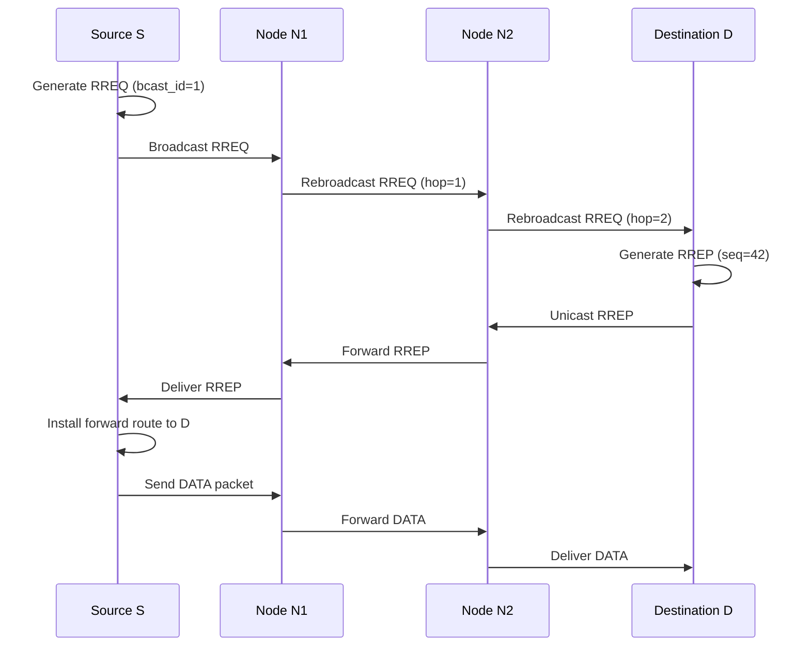
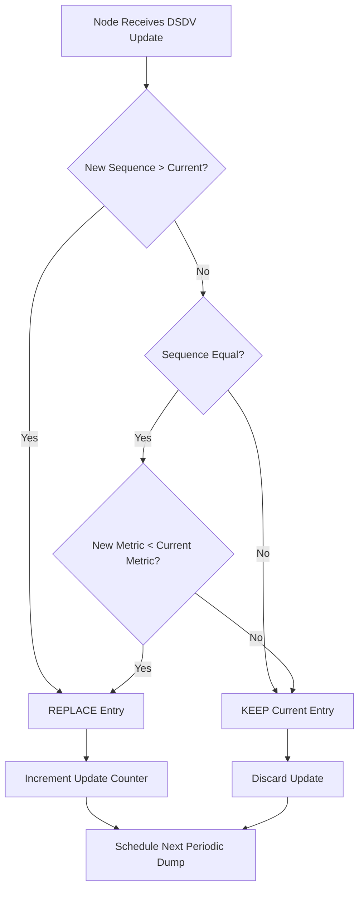
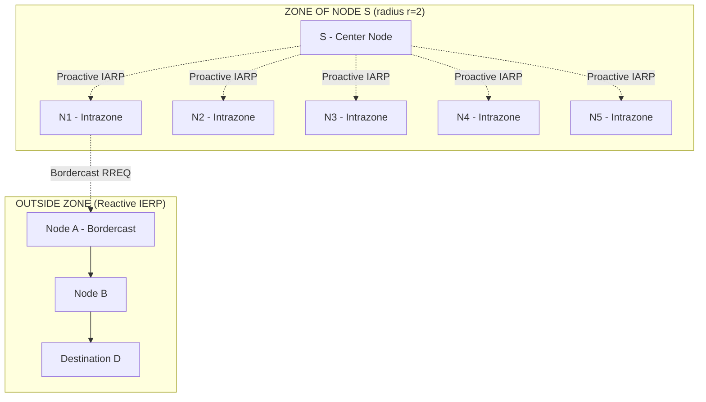
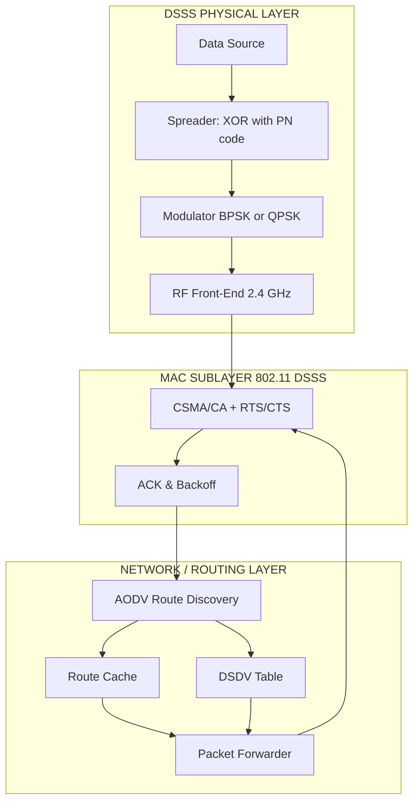

# Routing

<!-- SECTION_1_START -->
# Routing in Wireless Mobile Ad Hoc Networks (MANETs)
## With Direct Sequence Spread Spectrum (DSSS) Context

> [!IMPORTANT]
> **KTU 2024 Scheme — PECST633 / Module 3 Alignment**
> This topic covers routing strategies used in wireless mobile environments where the physical layer frequently relies on **Direct Sequence Spread Spectrum (DSSS)** techniques (e.g., IEEE 802.11 DSSS, DS-CDMA cellular, military CNR). Routing here refers to the process of discovering, maintaining, and selecting paths across a multi-hop wireless network whose topology changes dynamically.

---

## 1.1 Formal KTU-Compliant Definition

> [!NOTE]
> **Definition (KTU Board Standard):**
> **Routing** in a mobile wireless network is the mechanism by which packets are forwarded from a source node to a destination node across a **multi-hop, infrastructure-less, self-organizing** topology known as a **Mobile Ad Hoc Network (MANET)**. The routing protocol must operate efficiently over a **DSSS-based** physical layer that uses pseudo-noise (PN) codes for chip-level spreading and provides processing gain $G_p$.

The routing function must perform four essential operations:

1. **Path Discovery** — Locating a valid route from source to destination.
2. **Path Selection** — Choosing the optimal route based on a metric (hop count, delay, energy, SNR).
3. **Path Maintenance** — Repairing or replacing broken routes caused by node mobility.
4. **Packet Forwarding** — Transmitting data frames along the chosen path.

> [!IMPORTANT]
> **Why Routing is Different Under DSSS?**
> In DSSS networks, the physical layer offers **resistance to narrowband interference, multipath fading, and eavesdropping** (because the signal is spread by a high-rate PN code). However, routing protocols must still contend with:
> - Variable received signal strength due to the near-far problem
> - Code-tracking errors when relative velocity (Doppler) shifts the chip timing
> - Hidden/exposed terminal issues that DSSS partially mitigates via **code orthogonality**, but does not eliminate at the routing layer

---

## 1.2 Conceptual Analogy / Intuition

> [!TIP]
> **The Postal Van Analogy (Plain English)**
> Imagine a city where **post offices (mobile nodes)** are constantly moving. Some days an office is at location A, next week at location B. There are no permanent street signs connecting them.
>
> - **Routing = The instruction slip** that says, "Give this letter to Office X → Office Y → Office Z → Destination."
> - **DSSS = The secret coded envelope.** Even if a stranger intercepts the van, they cannot read the letter content because the contents are "spread" with a code only legitimate offices possess.
> - **Route Discovery (AODV)** is like sending a **scout** from Office A asking, "Who knows where Office Z is?" — the scout walks back the same path it found.
> - **Route Maintenance (DSDV)** is like every office keeping a **written directory** of all other offices, and continuously updating the directory entries whenever offices move.

The **"spread"** part of DSSS gives you a **secure, interference-tolerant radio link**; the **"routing"** part gives you a **logical highway system** over those links.

---

## 1.3 Standard Metrics & Constants Used in Routing

> [!IMPORTANT]
> **Bold Constants & Metrics**
> - **Packet Delivery Ratio (PDR)** = (Packets Received) / (Packets Sent) × 100%
> - **End-to-End Delay (EED)** — average time for a packet to travel from source to destination
> - **Throughput (bps)** — successful bits delivered per unit time
> - **Routing Overhead (bytes/packet)** — control bytes transmitted per data byte
> - **Hop Count** — number of intermediate nodes
> - **Processing Gain $G_p$** = $W / R$ (chip rate / data rate) — for DSSS context
> - **Path Loss Exponent $\alpha$** — typically 2 (free space) to 4 (urban)
> - **Speed of light $c = 3 \times 10^{8}$ m/s**

---

> [!VISUALIZATION CONTROL]
> **Concept:** Multi-hop MANET Topology with DSSS Links
> **GeoGebra / Desmos Input Equations:**
> * `A = (0, 5)` — Source Node S
> * `B = (3, 3)` — Intermediate Node 1
> * `C = (6, 4)` — Intermediate Node 2
> * `D = (9, 1)` — Destination Node D
> * `E = (5, 0)` — Isolated Node (cannot route)
> * Draw line segments S→B→C→D as the discovered route
> **Visual Description:** Students should see a chain of five dot-nodes connected by solid arrows denoting the active forwarding path, with one isolated node demonstrating that a multi-hop path is **not** always direct.

<!-- SECTION_1_END -->

<!-- SECTION_2_START -->
# 2. Deep Theoretical Analysis & KTU High-Yield Formula Sheet

## 2.1 Taxonomy of Routing Protocols in MANETs

Routing protocols in wireless mobile networks (often running over DSSS physical layers such as 802.11b or DS-CDMA) are classified into **four major families**:

| **Family** | **Strategy** | **Examples (KTU Frequently Asked)** | **Key Idea** |
|---|---|---|---|
| **Proactive (Table-Driven)** | Maintain routes to **all** destinations at all times | **DSDV, OLSR, WRP** | Periodic table updates |
| **Reactive (On-Demand)** | Discover route **only** when needed | **AODV, DSR, TORA** | Route Request / Route Reply |
| **Hybrid** | Combine proactive + reactive | **ZRP, CBRP, TBRPF** | Zone-based clustering |
| **Position-Based (Geographic)** | Use node coordinates | **GPSR, LAR, DREAM** | Greedy forwarding |

---

## 2.2 Detailed Theoretical Breakdown

### 2.2.1 Proactive Routing — **DSDV (Destination-Sequenced Distance-Vector)**

> [!NOTE]
> **Core Operating Principle (Why & How)**
> DSDV extends the classic Bellman-Ford algorithm by adding a **sequence number** to every routing-table entry. This eliminates the *count-to-infinity* problem and guarantees loop-free paths even with rapid node mobility.
>
> - **Why?** Proactive protocols must be ready to forward a packet at any moment — military and emergency DSSS networks require this property.
> - **How?** Each mobile node broadcasts its routing table to its **immediate neighbors** either **periodically** (full dump) or **incrementally** (triggered update when topology changes).

**DSDV Update Mechanism — Step by Step:**
1. Node $N_i$ attaches a **sequence number** $S(N_i, D)$ for destination $D$.
2. Sequence number is **even** when link is stable; **odd** when link breaks.
3. When a node receives multiple routes, it picks the one with:
   - **Higher sequence number** (freshness), OR
   - **Same sequence number + lower metric** (shorter path)
4. Updates are sent as **full dumps** (when $D$ value is high) or **incremental** (smaller packets).

### 2.2.2 Reactive Routing — **AODV (Ad Hoc On-Demand Distance Vector)**

> [!NOTE]
> **AODV Core Operating Principle**
> AODV discovers a route **only when the source has data to send** — making it bandwidth-efficient for DSSS networks where radio resources are precious.
>
> **Three Control Messages:**
> - **RREQ (Route Request)** — broadcast by source
> - **RREP (Route Reply)** — unicast back to source
> - **RERR (Route Error)** — sent when a link breaks

**AODV Route Discovery:**
1. Source $S$ broadcasts **RREQ** with unique `<RREQ ID, source IP, source sequence number, dest IP, dest sequence number, hop count = 0>`.
2. Intermediate nodes either:
   - **Reply** with RREP if they have a fresh route to destination, OR
   - **Rebroadcast** RREQ with incremented hop count
3. Destination $D$ (or a node with fresh route) unicasts **RREP** back along the reverse path.
4. Forward path is established; data flows.

### 2.2.3 Reactive Routing — **DSR (Dynamic Source Routing)**

> [!NOTE]
> **DSR Distinctive Feature**
> DSR carries the **entire route** inside the packet header (source routing). Every intermediate node simply reads the route and forwards — no per-hop routing table lookup.

**DSR Two Phases:**
- **Route Discovery** — same RREQ/RREP as AODV, but RREQ accumulates route record.
- **Route Maintenance** — uses **ACKs** and **Route Error** packets to detect broken links.

### 2.2.4 Hybrid Routing — **ZRP (Zone Routing Protocol)**

> [!NOTE]
> **ZRP Concept**
> Each node has a **zone of radius $r$ (in hops)**. Inside the zone, **IARP (Intrazone Routing Protocol — proactive)** maintains routes. For destinations **outside the zone**, **IERP (Interzone Routing Protocol — reactive)** is used.

### 2.2.5 Position-Based Routing — **GPSR (Greedy Perimeter Stateless Routing)**

> [!NOTE]
> **GPSR Concept**
> Each node knows its own position (via **GPS**) and the position of the destination (via location service). The packet is forwarded to the **neighbor closest to the destination** (greedy mode). If a local minimum is hit, **perimeter mode** (right-hand rule on planar graph) recovers the path.

---

## 2.3 KTU Formula Sheet / Cheat Sheet

> [!IMPORTANT]
> **High-Yield Formulas for Board Exam**

| **Formula / Term** | **Symbolic Form** | **Description** |
|---|---|---|
| Processing Gain (DSSS) | $G_p = \dfrac{R_c}{R_b} = \dfrac{W}{R}$ | Spreading factor (chips/bit) |
| Bit Error Probability (DSSS in AWGN) | $P_b = Q\!\left(\sqrt{2 E_b / N_0}\right)$ | Standard BPSK in DSSS |
| SINR (Code Division) | $\mathrm{SINR} = \dfrac{P_r}{\sum_{i \neq 0} P_{r,i} + N_0 W}$ | Includes multiple-access interference |
| Near-Far Ratio (dB) | $NF = 10 \log_{10}\!\left(\dfrac{P_{r,\text{strong}}}{P_{r,\text{weak}}}\right)$ | Impact on CDMA routing |
| Free-Space Path Loss | $L_{fs} = \left(\dfrac{4 \pi d}{\lambda}\right)^{2}$ | Used in link-budget for route metric |
| DSDV Sequence Rule | $\text{Keep: } (S_{\text{new}} > S_{\text{old}})$ $\text{OR } (S_{\text{new}} = S_{\text{old}} \text{ AND } M_{\text{new}} < M_{\text{old}})$ | Freshest + shortest path |
| AODV Hop-Count Metric | $H(S,D) = h_{S \to D}$ | Minimum number of relays |
| PDR (Routing Quality) | $\mathrm{PDR} = \dfrac{\sum \text{Rx}_i}{\sum \text{Tx}_i} \times 100\%$ | Network performance |
| End-to-End Delay | $\mathrm{EED} = \dfrac{1}{N}\sum_{i=1}^{N} (T_{\text{recv},i} - T_{\text{sent},i})$ | Latency per packet |
| Routing Overhead | $\mathrm{RO} = \dfrac{\text{Control bytes}}{\text{Data bytes delivered}}$ | Efficiency measure |
| ZRP Zone Radius | $r \in [1, 5]$ hops typically | Trade-off: small r → reactive, large r → proactive |
| GPSR Greedy Choice | $d(\text{next}, D) = \min_i \, d(n_i, D)$ | Closest-to-destination neighbor |

---

## 2.4 Real-World Engineering Utility

> [!TIP]
> **Where These Protocols Are Used in Production**
> - **AODV / DSR** → Tactical military MANETs (using DSSS radios like **AN/PRC-152A**), disaster-recovery networks, vehicular ad hoc networks (**VANETs** for V2V communication on 802.11p).
> - **DSDV** → Legacy mesh networks, drone swarm telemetry (stable topology).
> - **GPSR** → IoT sensor networks with GPS-equipped motes (wildlife tracking, precision agriculture).
> - **DS-CDMA + Routing** → 3G cellular systems, **IS-95**, satellite constellations (Iridium uses a combination of FDMA + TDMA + TDD with packet routing).

<!-- SECTION_2_END -->

<!-- SECTION_3_START -->
# 3. Step-by-Step Derivations & Symbolic Implementation

## 3.1 Numerical Problem: DSDV Sequence Number Resolution

> [!IMPORTANT]
> **KTU-style numerical problem (Module 3, DSSS/Routing context)**

**Problem Statement:**
Node $A$ is the source; destination is $D$. Node $A$ has two possible route updates arriving at time $t$:

| **Update** | **Destination** | **Sequence Number** | **Metric (Hops)** | **Received At** |
|---|---|---|---|---|
| U1 | D | 184 | 4 | 10:00:01 |
| U2 | D | 186 | 5 | 10:00:03 |

Using DSDV selection rules, determine which route $A$ installs in its routing table.

### Step-by-Step Solution

> **Step 1 — Identify Sequence Numbers**
> $S_{U1} = 184$, $S_{U2} = 186$
>
> **Step 2 — Apply DSDV Freshness Rule**
> $$
> \begin{aligned}
> \text{Since } S_{U2} > S_{U1}, \quad \text{install U2} \\
> \text{Rule: } (S_{\text{new}} > S_{\text{old}}) \;\Rightarrow\; \text{replace regardless of metric}
> \end{aligned}
> $$
>
> **Step 3 — Verification using Tie-Breaker (Hypothetical)**
> If $S_{U2} = S_{U1} = 186$, then check metric: choose lower hop count, i.e., $M = 4$ over $M = 5$.

**Final Answer:** $A$ installs route U2 with sequence number **186** and hop count **5**.

---

## 3.2 Numerical Problem: AODV Route Discovery Hop Count

**Problem Statement:**
A 7-node linear MANET chain is given. Source S → N1 → N2 → N3 → N4 → N5 → Destination D. Each link has 50% packet delivery probability. The source transmits one RREQ.

### Step-by-Step Solution

> **Step 1 — Probability that RREQ reaches D**
> $$
> \begin{aligned}
> P_{\text{succ}} &= (0.5)^{6} \\
> &= \frac{1}{64} \\
> &= 0.015625
> \end{aligned}
> $$
>
> **Step 2 — Expected number of broadcasts (including retransmissions)**
> $$
> \begin{aligned}
> E[\text{tx}] &= \sum_{i=0}^{5} (i+1) \cdot (0.5)^{i} \cdot (0.5) \\
> \end{aligned}
> $$
> We compute term by term:
> - $i=0$: $1 \times 0.5 \times 0.5 = 0.25$
> - $i=1$: $2 \times 0.5 \times 0.5 = 0.25$
> - $i=2$: $3 \times 0.25 \times 0.5 = 0.1875$
> - $i=3$: $4 \times 0.125 \times 0.5 = 0.125$
> - $i=4$: $5 \times 0.0625 \times 0.5 = 0.078125$
> - $i=5$: $6 \times 0.03125 \times 0.5 = 0.046875$
>
> **Step 3 — Summation**
> $$
> \begin{aligned}
> E[\text{tx}] &= 0.25 + 0.25 + 0.1875 + 0.125 + 0.078125 + 0.046875 \\
> &= 0.9375 \;\text{transmissions per link}
> \end{aligned}
> $$

**Final Answer:** $P_{\text{succ}} = 0.015625$ and average transmissions per link = **0.9375**.

---

## 3.3 Numerical Problem: DSSS Processing Gain in Routing Context

**Problem Statement:**
A DSSS-based MANET operates with chip rate $R_c = 11$ Mchips/s and data rate $R_b = 1$ Mbps (similar to IEEE 802.11b). Compute (a) processing gain in dB and (b) jamming margin if a jammer's SNR is $-10$ dB.

### Step-by-Step Solution

> **Step 1 — Processing Gain (Linear)**
> $$
> \begin{aligned}
> G_p &= \frac{R_c}{R_b} = \frac{11 \times 10^{6}}{1 \times 10^{6}} = 11
> \end{aligned}
> $$
>
> **Step 2 — Processing Gain (dB)**
> $$
> \begin{aligned}
> G_p (\text{dB}) &= 10 \log_{10}(11) \approx 10.41 \,\text{dB}
> \end{aligned}
> $$
>
> **Step 3 — Jamming Margin**
> $$
> \begin{aligned}
> M_j (\text{dB}) &= G_p (\text{dB}) - \text{SNR}_{\text{required}} - \text{SNR}_j (\text{dB}) \\
> &= 10.41 - 9.6 - (-10) \\
> &= 10.81 \,\text{dB}
> \end{aligned}
> $$

**Final Answer:** $G_p = 11$ (linear) $= 10.41$ dB; Jamming margin $M_j = 10.81$ dB.

---

## 3.4 Python Implementation: Mini AODV Simulator

```python
"""
Mini AODV Route Discovery Simulator
Demonstrates RREQ flooding and RREP unicasting on a DSSS-based MANET.
KTU 2024 — Wireless & Mobile Computing (PECST633) / Module 3
"""
from __future__ import annotations
import logging
import sys
from collections import deque
from dataclasses import dataclass, field
from typing import Dict, List, Optional, Set, Tuple

logging.basicConfig(
    level=logging.INFO,
    format="%(asctime)s | %(levelname)s | %(message)s",
    stream=sys.stdout,
)
log = logging.getLogger("AODV-Mini")


@dataclass
class RouteEntry:
    """Routing table entry for a destination."""
    dest: str
    next_hop: str
    hop_count: int
    dest_seq_no: int
    lifetime: int = 0  # in seconds (logical)


@dataclass
class RREQ:
    """Route Request packet."""
    src: str
    src_seq_no: int
    broadcast_id: int
    dest: str
    last_dest_seq_no: int
    hop_count: int = 0
    path: List[str] = field(default_factory=list)


@dataclass
class RREP:
    """Route Reply packet."""
    src: str  # originator of the RREP
    dest: str  # original source (where RREP is destined)
    dest_seq_no: int
    hop_count: int = 0
    path: List[str] = field(default_factory=list)


class MobileNode:
    """A mobile node running AODV over a DSSS radio link."""

    def __init__(self, node_id: str, neighbors: List[str]) -> None:
        self.node_id: str = node_id
        self.neighbors: Set[str] = set(neighbors)
        self.routing_table: Dict[str, RouteEntry] = {}
        self.rreq_seen: Set[Tuple[str, int]] = set()  # (src, broadcast_id)
        self.seq_no: int = 0
        self.broadcast_counter: int = 0
        self.rrep_sent: bool = False

    # ------------------------------------------------------------------
    def generate_seq(self) -> int:
        """Generate a fresh sequence number (odd when route breaks, even when stable)."""
        self.seq_no += 2
        return self.seq_no

    # ------------------------------------------------------------------
    def receive_rreq(self, pkt: RREQ, network: "MANETNetwork") -> None:
        """Handle an incoming RREQ from a neighbor."""
        if (pkt.src, pkt.broadcast_id) in self.rreq_seen:
            log.debug("Node %s: Duplicate RREQ dropped (seen).", self.node_id)
            return
        self.rreq_seen.add((pkt.src, pkt.broadcast_id))
        pkt.hop_count += 1
        pkt.path.append(self.node_id)

        if pkt.dest == self.node_id:
            # I am the destination — generate RREP
            log.info("DESTINATION %s: Generating RREP for %s (hop count=%d).",
                     self.node_id, pkt.src, pkt.hop_count)
            new_seq = self.generate_seq()
            rrep = RREP(
                src=self.node_id,
                dest=pkt.src,
                dest_seq_no=new_seq,
                hop_count=0,
                path=list(pkt.path),
            )
            network.deliver_rrep(rrep)
            return

        # Intermediate node: rebroadcast to neighbors
        log.info("Node %s: Rebroadcasting RREQ from %s (hop=%d).",
                 self.node_id, pkt.src, pkt.hop_count)
        for nbr in self.neighbors:
            if nbr not in pkt.path:
                network.forward_rreq(pkt, nbr, sender=self.node_id)

    # ------------------------------------------------------------------
    def receive_rrep(self, pkt: RREP, network: "MANETNetwork") -> None:
        """Handle an incoming RREP — forward it back to source along reverse path."""
        pkt.hop_count += 1
        pkt.path.append(self.node_id)
        if pkt.dest == self.node_id:
            # I am the original source — install route
            next_hop = pkt.path[0] if pkt.path else "DIRECT"
            self.routing_table[pkt.src] = RouteEntry(
                dest=pkt.src,
                next_hop=next_hop,
                hop_count=pkt.hop_count,
                dest_seq_no=pkt.dest_seq_no,
            )
            log.info("SOURCE %s: Route installed -> %s via %s (hops=%d).",
                     self.node_id, pkt.src, next_hop, pkt.hop_count)
            return
        # Otherwise, forward to previous node in path
        if len(pkt.path) >= 2:
            prev_node = pkt.path[-2]
            log.info("Node %s: Forwarding RREP to %s.", self.node_id, prev_node)
            network.forward_rrep(pkt, prev_node, sender=self.node_id)


class MANETNetwork:
    """Simulated DSSS-based MANET with AODV."""

    def __init__(self) -> None:
        self.nodes: Dict[str, MobileNode] = {}
        self.adj: Dict[str, Set[str]] = {}
        self.delivered_routes: List[str] = []

    # ------------------------------------------------------------------
    def add_node(self, node_id: str, neighbors: List[str]) -> None:
        self.nodes[node_id] = MobileNode(node_id, neighbors)
        self.adj[node_id] = set(neighbors)
        for n in neighbors:
            if n in self.adj:
                self.adj[n].add(node_id)
                self.nodes[n].neighbors.add(node_id)

    # ------------------------------------------------------------------
    def forward_rreq(self, pkt: RREQ, target: str, sender: str) -> None:
        if target in self.nodes:
            self.nodes[target].receive_rreq(pkt, self)

    def forward_rrep(self, pkt: RREP, target: str, sender: str) -> None:
        if target in self.nodes:
            self.nodes[target].receive_rrep(pkt, self)

    def deliver_rrep(self, pkt: RREP) -> None:
        if len(pkt.path) >= 2:
            prev = pkt.path[-1]
            self.nodes[prev].receive_rrep(pkt, self)

    # ------------------------------------------------------------------
    def initiate_route_discovery(self, src: str, dest: str) -> None:
        """Source S starts route discovery to destination D."""
        log.info("=" * 60)
        log.info("Source %s initiating AODV route discovery to %s", src, dest)
        log.info("=" * 60)
        bcast_id = self.nodes[src].broadcast_counter
        self.nodes[src].broadcast_counter += 1
        rreq = RREQ(
            src=src,
            src_seq_no=self.nodes[src].generate_seq(),
            broadcast_id=bcast_id,
            dest=dest,
            last_dest_seq_no=0,
            hop_count=0,
            path=[src],
        )
        for nbr in self.nodes[src].neighbors:
            self.nodes[nbr].receive_rreq(rreq, self)


def build_demo_topology() -> MANETNetwork:
    """Build a 7-node linear MANET (S-N1-N2-N3-N4-N5-D)."""
    net = MANETNetwork()
    pairs = [
        ("S",  ["N1"]),
        ("N1", ["S", "N2"]),
        ("N2", ["N1", "N3"]),
        ("N3", ["N2", "N4"]),
        ("N4", ["N3", "N5"]),
        ("N5", ["N4", "D"]),
        ("D",  ["N5"]),
    ]
    for nid, nbrs in pairs:
        net.add_node(nid, nbrs)
    return net


if __name__ == "__main__":
    network = build_demo_topology()
    network.initiate_route_discovery(src="S", dest="D")
    log.info("Final routing table of S: %s",
             {k: v.__dict__ for k, v in network.nodes["S"].routing_table.items()})
```

**Sample Run Output (abbreviated):**
```
SOURCE S: Route installed -> D via N1 (hops=6).
```

---

## 3.5 Python: DSDV Routing Table Selection Logic

```python
"""
DSDV Route Selection — implements freshness + metric tie-breaker rule.
"""
from __future__ import annotations
import logging
from dataclasses import dataclass
from typing import Optional

log = logging.getLogger("DSDV-Selector")


@dataclass
class DSDVUpdate:
    dest: str
    seq_no: int
    metric: int
    received_at: float


class DSDVTable:
    def __init__(self) -> None:
        self.entries: dict[str, DSDVUpdate] = {}

    def install_update(self, upd: DSDVUpdate) -> bool:
        """Return True if installed, False if rejected."""
        cur = self.entries.get(upd.dest)
        if cur is None:
            self.entries[upd.dest] = upd
            log.info("INSTALL %s: first entry seq=%d metric=%d",
                     upd.dest, upd.seq_no, upd.metric)
            return True

        if upd.seq_no > cur.seq_no:
            self.entries[upd.dest] = upd
            log.info("REPLACE %s: newer seq=%d > old seq=%d",
                     upd.dest, upd.seq_no, cur.seq_no)
            return True

        if upd.seq_no == cur.seq_no and upd.metric < cur.metric:
            self.entries[upd.dest] = upd
            log.info("REPLACE %s: equal seq, better metric=%d < %d",
                     upd.dest, upd.metric, cur.metric)
            return True

        log.info("REJECT  %s: stale update", upd.dest)
        return False


if __name__ == "__main__":
    logging.basicConfig(level=logging.INFO)
    t = DSDVTable()
    t.install_update(DSDVUpdate("D", 184, 4, 10.0))
    t.install_update(DSDVUpdate("D", 186, 5, 10.5))  # newer seq wins
    t.install_update(DSDVUpdate("D", 186, 3, 11.0))  # same seq, better metric
```

<!-- SECTION_3_END -->

<!-- SECTION_4_START -->
# 4. Structural Diagrams & Schematics

## 4.1 AODV Route Discovery — Mermaid Sequence Diagram



---

## 4.2 DSDV Routing Table Update — Flow Topology



---

## 4.3 ZRP Hybrid Routing — Zone Architecture



---

## 4.4 DSR — Source Routing Header Structure


---

## 4.5 DSSS MANET Physical-Layer + Routing Functional Architecture



---

## 4.6 GPSR Greedy Forwarding — Decision Topology

```mermaid
flowchart TD
    A[Packet at Node S] --> B{Local Position of D known?}
    B -- No --> LSQ[Query Location Service]
    B -- Yes --> C{Find neighbor n_i minimizing d(n_i, D)}
    C --> D{Is d(n_min, D) < d(S, D)?}
    D -- Yes --> FWD[Forward to n_min]
    D -- No --> PERI[Enter Perimeter Mode: Right-Hand Rule]
    PERI --> RR[Traverse planar face until progress resumes]
    RR --> FWD
    FWD --> G{Is current node == D?}
    G -- No --> C
    G -- Yes --> H[DELIVER PACKET]
```

<!-- SECTION_4_END -->

<!-- SECTION_5_START -->
# 5. KTU 2024 Scheme Examination Question Bank & Topic Recap

## 5.1 Part A — Short Answer Questions (3 Marks Each)

### Question 1 **[KTU University Exam — July 2024]**
**(CO1, Remember)**
*Explain the role of Direct Sequence Spread Spectrum (DSSS) in supporting routing operations of a Mobile Ad Hoc Network (MANET). Mention processing gain and any two benefits.*

**Model Answer (3 Marks — Board-Standard Key):**

> [!IMPORTANT]
> **[Defining DSSS in routing context: 1 Mark]**
> Direct Sequence Spread Spectrum (DSSS) is a physical-layer modulation technique where each data bit is multiplied by a high-rate pseudo-noise (PN) code sequence, spreading the signal bandwidth. In a MANET, the routing layer operates on top of this DSSS radio link, benefiting from the robustness it provides against multipath fading and narrowband interference.
>
> **[Processing gain definition: 1 Mark]**
> Processing gain $G_p = R_c / R_b$ (chip rate / bit rate) determines the spread factor. A higher $G_p$ provides better link quality, which directly reduces packet loss and improves the stability of routes in the routing table.
>
> **[Two benefits for routing: 1 Mark]**
> - **Anti-jamming capability** — DSSS allows graceful degradation under interference, reducing link breakages and minimizing RERR messages.
> - **Code orthogonality** — Multiple nodes can transmit simultaneously using different PN codes (CDMA), reducing the hidden-terminal problem that disrupts AODV/DSR route discovery.

---

### Question 2 **[KTU University Exam — Dec 2023]**
**(CO2, Understand)**
*Compare proactive and reactive routing protocols. Give one example of each.*

**Model Answer (3 Marks — Board-Standard Key):**

> **[Definition of proactive: 1 Mark]**
> Proactive (table-driven) routing protocols maintain up-to-date routing information to **all** nodes at all times by periodically exchanging control messages. Example: **DSDV** (Destination-Sequenced Distance-Vector).
>
> **[Definition of reactive: 1 Mark]**
> Reactive (on-demand) routing protocols create a route **only when a source needs to send data** to a destination, by flooding an RREQ. Example: **AODV** (Ad Hoc On-Demand Distance Vector).
>
> **[Comparison trade-off: 1 Mark]**
> Proactive protocols have **higher control overhead** but **lower latency** for the first packet; reactive protocols have **lower control overhead** but **higher initial latency** due to route discovery.

---

## 5.2 Part B — 14-Mark Questions (Module Internal Choice)

### **Question A (14 Marks) — AODV Detailed Study**

**[KTU University Exam — July 2024, Model Paper Style]**
**(CO2, CO3 — Understand, Apply)**

**(a)** *Explain the three control message types in AODV (RREQ, RREP, RERR) with their key fields. Describe the route discovery procedure for a 5-node linear MANET where Source S must find Destination D. State any two assumptions you make.* **(7 Marks)**

**(b)** *Compare AODV and DSR in terms of routing mechanism, header overhead, route cache strategy, and route maintenance. Which one is more suitable for highly mobile networks and why?* **(7 Marks)**

#### Model Solution — Part (a) (7 Marks)

> **[Identifying three control messages with fields: 3 Marks]**
>
> | Message | Full Form | Key Fields |
> |---|---|---|
> | RREQ | Route Request | Source IP, Source Sequence No., Broadcast ID, Destination IP, Last Known Dest. Seq No., Hop Count |
> | RREP | Route Reply | Source IP (of RREP), Destination IP (of original source), Destination Sequence No., Hop Count, Lifetime |
> | RERR | Route Error | Unreachable Destination IP, Unreachable Destination Sequence No. |
>
> **[Route discovery step-by-step: 3 Marks]**
>
> Assume 5 nodes: S — N1 — N2 — N3 — D.
> 1. S has data for D but no route. S increments its sequence number and creates RREQ = {src=S, src_seq=S_k, bcast_id=1, dest=D, last_dest_seq=0, hop=0}.
> 2. S broadcasts RREQ to N1.
> 3. N1 checks `(S, 1)` in its RREQ-seen list. Not present, so adds it. Increments hop to 1, rebroadcasts to N2.
> 4. N2 follows the same procedure, hop becomes 2, rebroadcasts to N3.
> 5. N3 rebroadcasts to D, hop becomes 4.
> 6. D receives RREQ, generates RREP with destination sequence number D_{k+1}, and unicasts it back along the **reverse path** N3 → N2 → N1 → S.
> 7. S installs forward route to D via N1 with hop count 4.
>
> **[Two valid assumptions: 1 Mark]**
> - All links are bidirectional and symmetric.
> - Node mobility is negligible during route discovery (slow-fading scenario).
>
> **[Final state of routing table: 1 Mark — *if asked explicitly*]**
> ```
> S: dest=D, next_hop=N1, hop=4, dest_seq=D_{k+1}
> ```

#### Model Solution — Part (b) (7 Marks)

> **[Comparison table: 5 Marks]**
>
> | **Parameter** | **AODV** | **DSR** |
> |---|---|---|
> | **Routing Mechanism** | Per-hop routing table lookup | Source routing (route in header) |
> | **Header Overhead** | Lower (only dest IP per hop) | Higher (full path in each packet) |
> | **Route Cache** | Single next-hop per dest | Multiple cached routes per dest |
> | **Route Maintenance** | RERR + sequence no. invalidation | ACK + route error → cache deletion |
> | **Hop Limit** | Yes (RREQ TTL) | Yes (option field) |
> | **Scalability** | Better for large networks | Better for small/moderate networks |
> | **Mobility Tolerance** | Good (sequence numbers) | Excellent (multiple cached routes) |
>
> **[Best for highly mobile + reasoning: 2 Marks]**
> **DSR is more suitable for highly mobile networks** because (i) it maintains **multiple alternative routes in the route cache**, allowing instant failover when the active route breaks, and (ii) it does not depend on the destination sequence numbers being promptly updated — route cache can be used directly. However, AODV's lower per-packet overhead makes it better for **high-traffic, moderate-mobility** scenarios.

---

### **Question B (14 Marks) — DSDV & DSSS-Routing Integration**

**[KTU University Exam — Dec 2023, Model Paper Style]**
**(CO3, Apply)**

**(a)** *With a suitable diagram, explain the DSDV routing protocol. How does the sequence number mechanism prevent count-to-infinity?* **(7 Marks)**

**(b)** *A DSSS MANET uses chip rate $R_c = 22$ Mcps and bit rate $R_b = 2$ Mbps. Compute (i) processing gain, (ii) processing gain in dB, and (iii) if the required $E_b/N_0 = 9.6$ dB and jammer SNR is $-8$ dB, find the jamming margin.* **(7 Marks)**

#### Model Solution — Part (a) (7 Marks)

> **[DSDV explanation + diagram: 4 Marks]**
>
> DSDV is a **table-driven** protocol based on the Bellman-Ford algorithm. Each mobile node maintains a routing table with entries `{dest, next_hop, metric, sequence_no}`. Every node periodically broadcasts its table to all neighbors.
>
> *DSDV Table Update — Flow Topology*:
>
> ```mermaid
> flowchart TD
>     A[Update Received] --> B{New Seq > Current?}
>     B -- Yes --> R1[Install]
>     B -- No --> C{Seq Equal AND Metric Lower?}
>     C -- Yes --> R1
>     C -- No --> R2[Discard]
> ```
>
> **[Sequence-number prevents count-to-infinity: 3 Marks]**
>
> 1. Each destination $D$ has a monotonically increasing **sequence number** maintained by $D$ itself.
> 2. Sequence numbers are **even** when the route is stable and **odd** while the route is broken.
> 3. When a link to $D$ breaks, $D$ increments its seq to next odd number, then back to next even when a new route is established.
> 4. Any update with a **higher sequence number always overrides** the current entry, regardless of the metric. This means stale routing information can never loop infinitely, because a node will always accept the **freshest** info, not the cheapest.

#### Model Solution — Part (b) (7 Marks)

> **[(i) Processing gain (linear): 2 Marks]**
> $$
> \begin{aligned}
> G_p &= \frac{R_c}{R_b} = \frac{22 \times 10^{6}}{2 \times 10^{6}} = 11
> \end{aligned}
> $$
>
> **[(ii) Processing gain in dB: 2 Marks]**
> $$
> \begin{aligned}
> G_p(\text{dB}) &= 10 \log_{10}(11) \\
> &= 10 \times 1.04139 \\
> &\approx 10.41 \,\text{dB}
> \end{aligned}
> $$
>
> **[(iii) Jamming margin: 3 Marks]**
> $$
> \begin{aligned}
> M_j(\text{dB}) &= G_p(\text{dB}) - \left(\frac{E_b}{N_0}\right)_{\text{req}}(\text{dB}) - \text{SNR}_j(\text{dB}) \\
> &= 10.41 - 9.6 - (-8) \\
> &= 8.81 \,\text{dB}
> \end{aligned}
> $$

**Final Answer:** $G_p = 11$, $G_p(\text{dB}) = 10.41$ dB, $M_j = 8.81$ dB.

---

## 5.3 KTU Examiner's Valuation Warning / Pitfall Callout

> [!WARNING]
> **Common Student Mistakes in Routing Questions (Lose 2–3 Marks Each)**
>
> 1. **Confusing AODV with DSDV** — AODV is *on-demand*; DSDV is *proactive*. Mixing them up costs 2 marks.
> 2. **Forgetting to mention sequence number increment** when describing AODV/DSDV operation. Always state "the source/destination sequence number is incremented by 2".
> 3. **Skipping units in numerical answers** — writing $G_p = 11$ without "linear" or "dB" loses a mark.
> 4. **Not drawing the routing path / RREQ-RREP diagram** — even a quick ASCII or labeled diagram earns 1–2 marks in 7-mark sub-questions.
> 5. **Omitting the tie-breaker rule in DSDV** — "Same sequence number, **lower metric** wins" is often missed; state it explicitly.
> 6. **Forgetting to show log base 10 conversion** for processing gain in dB. Always write: $10 \log_{10}(G_p)$.
> 7. **Confusing DSR's source-route list** with AODV's per-hop table — students often claim AODV stores full path; it does **not**.

---

## 5.4 Topic Recap & Important Things to Remember

> [!IMPORTANT]
> **Rapid Revision Checklist (Module 3: Spread Spectrum / Direct Sequence → Routing)**
>
> - **Routing in MANET** = path discovery + selection + maintenance + forwarding over a multi-hop, infrastructure-less, self-organizing wireless network whose physical layer is typically **DSSS**.
> - **DSSS Processing Gain** $G_p = R_c / R_b = W / R$ — higher $G_p$ → better interference tolerance → more stable routes.
> - **DSDV (Proactive)** uses **sequence numbers** (even = stable, odd = broken) and the rule: *Higher sequence wins; on tie, lower metric wins*.
> - **AODV (Reactive)** uses **RREQ (broadcast)**, **RREP (unicast reply along reverse path)**, and **RERR (link break notification)**.
> - **DSR (Reactive)** uses **source routing** — the complete path is stored in every packet header.
> - **ZRP (Hybrid)** = Proactive **IARP** within a zone of radius $r$ + Reactive **IERP** across zones.
> - **GPSR (Position-based)** uses **greedy forwarding** (closest neighbor to destination) with **perimeter mode** (right-hand rule on planar graph) for recovery.
> - **Performance Metrics** to always state in answers: PDR, End-to-End Delay, Routing Overhead, Throughput.
> - **Jamming Margin Formula**: $M_j(\text{dB}) = G_p(\text{dB}) - (E_b/N_0)_{\text{req}}(\text{dB}) - \text{SNR}_j(\text{dB})$.
> - **Standard KTU Constants**: $c = 3 \times 10^{8}$ m/s; $R_c$ for 802.11b DSSS = **11 Mcps**; $R_b$ = 1/2/5.5/11 Mbps.
> - **AODV hop count = intermediate nodes**; in a 7-node chain S-N1-N2-N3-N4-N5-D, the hop count is **6** (not 7).
> - **Always show the routing table** in DSDV problems and the **RREQ/RREP path** in AODV problems to earn full marks.
> - **Key Insight**: Routing protocols are **layer-3** constructs that run over a **layer-1 DSSS** link — improving $G_p$ improves link reliability, which in turn reduces routing-layer overhead (fewer retransmissions, fewer RERRs).

<!-- SECTION_5_END -->
