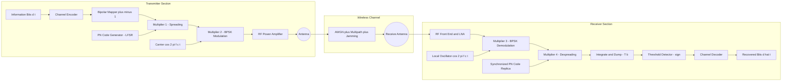
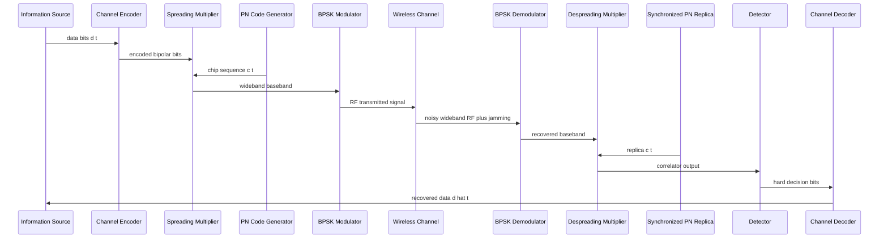
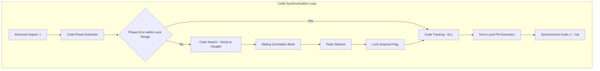
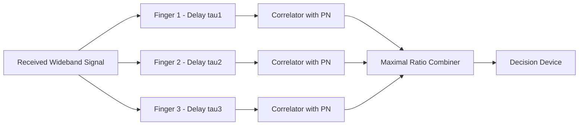

# Spread spectrum – Direct sequence

<!-- SECTION_1_START -->
# Spread Spectrum – Direct Sequence (DSSS)

## 1. Core Technical Definition & Intuitive Overview

### Formal Academic Definition
**Direct Sequence Spread Spectrum (DSSS)** is a digital modulation technique in which a high-rate pseudo-random binary sequence (called the **chip sequence** or **PN code**) is directly multiplied with the narrowband information signal. This operation spreads the original signal's bandwidth by a factor called the **Processing Gain (Gp)** or **Spreading Factor**, making the transmitted signal appear as low-power wideband noise to any unintended receiver that lacks the correct code.

> [!IMPORTANT]
> **KTU 2024 Syllabus Definition (PECST633 – Module 3):**
> "Direct Sequence Spread Spectrum multiplies the information bits with a much faster pseudo-noise (PN) code to produce a wideband signal. The original bandwidth is spread by the chip rate of the PN sequence. The despreading at the receiver is performed by multiplying with a synchronized replica of the same PN code."

### Conceptual Analogy / Intuition
Imagine a quiet conversation in a noisy cafeteria:
- Two students sit next to each other and speak in **Whisper Language (Narrowband signal)** – anyone nearby could easily eavesdrop.
- To keep the conversation private, they hire a small **"encoding choir" (PN sequence)** that continuously shouts a unique, fast, random pattern of syllables. The actual whispered words are **synchronised with the choir's pattern** so that only a friend with the exact same choir can subtract the choir's noise and hear the original whisper.
- The choir represents the **PN chip sequence**; the whisper is the **information bit**; and the synchronized extraction process is **despreading** or **correlation detection**.

A wireless system in cellular networks (e.g., **IS-95 / CDMA2000**, **WLAN 802.11b/g/n**) does exactly the same with electromagnetic energy.

### Key Physical Constants and Standard Metrics
- **Chip Duration (Tc)** – time duration of one chip of the PN sequence (in seconds).
- **Chip Rate (Rc = 1/Tc)** – the rate at which chips are transmitted, usually expressed in **chips per second (cps)** or **Mcps**.
- **Bit Duration (Tb)** – time duration of one information bit.
- **Processing Gain (Gp) = Tb / Tc = Rb / Rc**, expressed in **dB**: **Gp(dB) = 10 log10(Tb/Tc)**.
- **Spreading Factor (SF) = Number of chips per information bit = Lc**, an integer ratio.
- **Bandwidth Expansion Factor** ≈ Processing Gain for DSSS.

> [!NOTE]
> **KTU 2024 Module 3 Highlight:**
> "The two essential properties of any spread spectrum technique are:
> 1. The transmitted bandwidth is *much larger* than the information bandwidth.
> 2. Spreading is achieved by a *pseudo-random* code that is independent of the data."

### Components of a DSSS Transmitter
1. **Information Source** – produces the binary data of rate **Rb** bits/sec.
2. **Channel Encoder / Interleaver** – provides error protection.
3. **PN Code Generator** – produces the chip sequence at rate **Rc** chips/sec.
4. **Multiplier (Modulator 1)** – performs spreading by XOR / multiplication of bits with chips.
5. **RF Modulator (Modulator 2)** – BPSK/QPSK upconversion to carrier.

> [!VISUALIZATION CONTROL]
> **Concept:** Spectral density comparison of original vs. spread signal
> **GeoGebra / Desmos Input Equations:**
> * `f1(x) = exp(-((x-0)/0.5)^2)` — represents narrowband information PSD
> * `f2(x) = 0.1 * exp(-((x-0)/5)^2)` — represents wideband spread PSD (lower amplitude, wider base)
> **Visual Description:** Observe that the **spread spectrum** is *wider* on the frequency axis (x-axis) and *lower* in amplitude (y-axis) than the original, yet retains the same total power. The wider footprint makes it invisible against the noise floor.

<!-- SECTION_1_END -->

<!-- SECTION_2_START -->
# Deep Theoretical Analysis & KTU High-Yield Formula Sheet

## 2. Working Principle – The Mathematical Foundation

The DSSS operation is fundamentally a **product modulation** between the information signal $s_d(t)$ and the pseudo-noise code $c(t)$.

$$
s_{\text{spread}}(t) \;=\; s_d(t) \cdot c(t)
$$

where:
- $s_d(t) = \pm A \cdot d(t)$ is the binary information waveform with bit duration $T_b$
- $c(t) = \pm 1$ is the bipolar PN code with chip duration $T_c$
- $T_c \ll T_b$ (typically by a factor of 10 to 1000)

The spreading operation transforms a **narrowband** signal of bandwidth $B_s$ into a **wideband** signal of bandwidth $B_{ss} \approx R_c$.

### Why "Spread" Works – Three Engineering Properties
1. **Low Probability of Intercept (LPI)**: Because the power spectral density is lowered after spreading, the signal hides below the thermal noise floor of a non-cooperative listener.
2. **Resistance to Narrowband Jamming**: A jammer concentrates its power in a narrow band; the DSSS receiver integrates the spread signal and rejects the jammer's energy during despreading.
3. **Multiple Access Capability (CDMA)**: Many users can share the same RF band simultaneously by using orthogonal or quasi-orthogonal PN codes.

## 3. PN Code Properties (m-sequences, Gold codes, Kasami codes)

| Property | Description | KTU Use Case |
|----------|-------------|--------------|
| **Balance** | Number of +1s ≈ number of -1s in one period | DC offset suppression |
| **Run-length distribution** | 50% runs of length 1, 25% of length 2, etc. | Randomness indicator |
| **Autocorrelation** | Sharp peak at zero lag, low elsewhere | Synchronization |
| **Cross-correlation** | Low between any two distinct codes | Multi-user separation (CDMA) |
| **Linearity / Shift-and-Add** | Sum of two shifted codes is a shifted version | LFSR generation |

> [!TIP]
> **KTU Favourite Question Pattern:**
> *"Explain the properties of m-sequences and their importance in spread spectrum systems."* — Expect this almost verbatim in **Part A (3 marks)**.

## 4. Processing Gain and Jamming Margin

The **Processing Gain (Gp)** quantifies how much the signal is widened:

$$
G_p \;=\; \frac{T_b}{T_c} \;=\; \frac{R_c}{R_b} \;=\; \frac{B_{\text{spread}}}{B_{\text{info}}}
$$

In decibel form:

$$
G_p(\text{dB}) \;=\; 10 \log_{10}\!\left(\frac{T_b}{T_c}\right)
$$

The **Jamming Margin (Mj)** is the maximum tolerable jammer-to-signal power ratio at the receiver input while maintaining a target bit-error-rate:

$$
M_j(\text{dB}) \;=\; G_p(\text{dB}) \;+\; \left(\frac{S}{N}\right)_{\text{out,dB}} \;-\; L_{\text{sys,dB}}
$$

where $\left(\frac{S}{N}\right)_{\text{out,dB}}$ is the required output SNR for the target BER, and $L_{\text{sys}}$ accounts for implementation losses (typically 1–2 dB).

## 5. KTU Formula Sheet / Cheat Sheet

| # | Quantity | Formula | Units / Notes |
|---|----------|---------|---------------|
| 1 | Chip Rate | $R_c = 1/T_c$ | chips/sec (cps) |
| 2 | Bit Rate | $R_b = 1/T_b$ | bits/sec (bps) |
| 3 | Processing Gain (linear) | $G_p = T_b / T_c = R_c / R_b$ | dimensionless |
| 4 | Processing Gain (dB) | $G_p(\text{dB}) = 10\log_{10}(T_b/T_c)$ | dB |
| 5 | Jamming Margin | $M_j(\text{dB}) = G_p + (S/N)_{\text{out}} - L_{\text{sys}}$ | dB |
| 6 | BER of BPSK DSSS in AWGN | $P_e = Q\!\left(\sqrt{2E_b/N_0}\right)$ | probability |
| 7 | BER with jamming | $P_e = Q\!\left(\sqrt{\dfrac{2E_b}{N_0 + J/R_c}}\right)$ | with jammer PSD J |
| 8 | Spectral density after spreading | $\text{PSD} = P_s / R_c$ | W/Hz |
| 9 | Bandwidth (approx) | $B_{ss} \approx 2R_c$ | Hz (Nyquist) |
| 10 | Number of chips per bit | $L_c = T_b / T_c$ | integer |
| 11 | Code length (m-sequence) | $N = 2^n - 1$ | chips, for n-stage LFSR |
| 12 | Multiple Access Capacity (CDMA) | $M \approx 1 + G_p / (E_b/N_0)_{\text{req}}$ | users/cell |

## 6. Real-World Engineering Utility

| Domain | DSSS Application |
|--------|------------------|
| **Cellular CDMA (IS-95, WCDMA, CDMA2000)** | Multiple users share a single frequency band using orthogonal codes. |
| **GPS (Global Positioning System)** | Each satellite transmits a unique 1023-chip Gold code; receiver despreads to extract ranging and navigation bits. |
| **WLAN IEEE 802.11b/g** | 11-Mchip Barker code (length 11) used in 802.11b for the 11-Mbps CCK mode. |
| **Military Anti-Jam Radios** | Link-16, Have Quick use DSSS for ECCM. |
| **Bluetooth (Hybrid FHSS + DSSS)** | Frequency hopping combined with packet spreading. |
| **DSSS in UWB (Impulse Radio)** | Very short chips (sub-nanosecond) for low-power dense multipath robustness. |

> [!NOTE]
> **Real-World Insight:** In a CDMA cellular system, the **sector capacity** increases almost linearly with processing gain. Doubling the chip rate doubles the number of users that can be supported, but it also doubles the occupied bandwidth. KTU questions often connect $G_p$ to the **CDMA system capacity (Hard / Soft limit)**.

<!-- SECTION_2_END -->

<!-- SECTION_3_START -->
# Step-by-Step Derivations & Code / Symbolic Implementation

## 7. Exhaustive Derivation: Bit Error Probability of DSSS under AWGN

### Step 1 – Transmitted Signal Model
The baseband DSSS signal over one bit duration $T_b$ containing $L_c$ chips is:

$$
s(t) \;=\; \sqrt{2P_s}\,\sum_{k=0}^{L_c-1} d_0\,c_k\,p\!\left(t - kT_c\right)
$$

where:
- $P_s$ = signal power
- $d_0 \in \{+1, -1\}$ is the information bit
- $c_k \in \{+1, -1\}$ is the $k$-th chip
- $p(t)$ is the unit-amplitude rectangular chip pulse of duration $T_c$

### Step 2 – Received Signal under AWGN

$$
r(t) \;=\; s(t) + n(t)
$$

where $n(t)$ is zero-mean AWGN with two-sided power spectral density $N_0/2$.

### Step 3 – Correlator (Matched Filter) Receiver
The receiver multiplies $r(t)$ by a synchronized local replica of the PN code and integrates over $T_b$:

$$
Z \;=\; \int_0^{T_b} r(t)\,c(t)\,dt \;=\; \int_0^{T_b} \left[\sqrt{2P_s}\,d_0\,c^2(t) + c(t)n(t)\right]dt
$$

### Step 4 – Exploiting $c^2(t)=1$

$$
Z \;=\; \int_0^{T_b} \sqrt{2P_s}\,d_0\,dt \;+\; \int_0^{T_b} c(t)n(t)\,dt
$$

$$
Z \;=\; \sqrt{2P_s}\,T_b\,d_0 \;+\; N_{\text{eq}}
$$

where $N_{\text{eq}}$ is a Gaussian random variable with mean 0 and variance $N_0T_b / 2$ (since multiplying noise by $\pm 1$ preserves its statistics).

### Step 5 – Decision Variable
The receiver decides $\hat{d_0} = \text{sign}(Z)$:

$$
\hat{d_0} \;=\; \begin{cases} +1 & \text{if } Z \ge 0 \\ -1 & \text{if } Z < 0 \end{cases}
$$

### Step 6 – Bit Error Probability
The signal component has amplitude $\sqrt{2P_s}\,T_b$ and the noise standard deviation is $\sqrt{N_0T_b/2}$. The argument of the Q-function is the ratio of these two:

$$
\frac{\sqrt{2P_s}\,T_b}{\sqrt{N_0T_b/2}} \;=\; \sqrt{\frac{2P_sT_b}{N_0}} \;=\; \sqrt{\frac{2E_b}{N_0}}
$$

Therefore:

$$
\boxed{\,P_e \;=\; Q\!\left(\sqrt{\dfrac{2E_b}{N_0}}\right)\,}
$$

> [!IMPORTANT]
> **Key Conclusion for KTU 2024 Examination:** DSSS under AWGN alone has **exactly the same BER as plain BPSK**. The advantage of DSSS is **NOT** in AWGN performance; it is in **jamming resistance** and **multiple-access capability**.

### Step 7 – Derivation: BER with Narrowband Jamming
A jammer injects a tone $J(t)=\sqrt{2J}\cos(2\pi f_c t + \phi)$ occupying a bandwidth of $B_J \ll B_{ss}$. After despreading, the jammer's effective in-band PSD becomes $J/R_c$ (the jammer's power is now spread over the wide DSSS bandwidth). The equivalent SNR at the decision device is:

$$
\left(\frac{S}{N}\right)_{\text{eff}} \;=\; \frac{E_b}{N_0 + J/R_c}
$$

$$
\boxed{\,P_e \;=\; Q\!\left(\sqrt{\dfrac{2E_b}{N_0 + J/R_c}}\right)\,}
$$

The processing gain therefore *directly reduces* the jammer's effectiveness by a factor of $R_c / R_b = G_p$.

### Step 8 – Numerical Example (typical KTU numerical)
**Given:** $R_b = 9.6$ kbps, $R_c = 1.228$ Mcps, required $E_b/N_0 = 6.8$ dB.
**Find:** Processing gain, jamming margin assuming 1 dB implementation loss.

- $G_p = R_c / R_b = 1.228 \times 10^6 / 9.6 \times 10^3 = 127.92 \approx 21.07$ dB
- $M_j = 21.07 + 6.8 - 1 = 26.87$ dB

Thus the system tolerates a jammer **~480× stronger** than the desired signal.

## 8. Algorithmic Implementation – Python Simulation of DSSS Transmitter / Receiver

```python
import numpy as np
from typing import Tuple


def generate_pn_sequence(length: int, seed: int = 0b1011011) -> np.ndarray:
    """
    Generate a maximal-length pseudo-random binary sequence (m-sequence) using
    an n-stage Linear Feedback Shift Register.

    Parameters
    ----------
    length : int
        Number of chips to generate.
    seed : int
        Initial non-zero state of the LFSR (must not be 0).

    Returns
    -------
    np.ndarray
        Bipolar chip sequence with values in {+1, -1}.
    """
    if seed == 0:
        raise ValueError("LFSR seed must be non-zero to avoid a lock-up state.")

    n_bits: int = seed.bit_length()
    taps: int = (1 << n_bits) | 1  # tap pattern for a primitive polynomial
    state: int = seed
    chips: np.ndarray = np.empty(length, dtype=np.int8)

    for i in range(length):
        output_bit: int = state & 1
        chips[i] = 1 if output_bit == 1 else -1  # map 0 -> -1, 1 -> +1
        feedback: int = bin(state & taps).count("1") & 1
        state = (state >> 1) | (feedback << (n_bits - 1))

    return chips


def dsss_transmitter(data_bits: np.ndarray, pn_code: np.ndarray) -> np.ndarray:
    """
    Spread the input data bits using a PN code (chip-level multiplication).

    Parameters
    ----------
    data_bits : np.ndarray
        Information bits in {0, 1}.
    pn_code : np.ndarray
        Bipolar PN chips in {+1, -1}.

    Returns
    -------
    np.ndarray
        Spread signal of length len(data_bits) * len(pn_code).
    """
    if not np.all(np.isin(data_bits, [0, 1])):
        raise ValueError("data_bits must contain only 0s and 1s.")
    if not np.all(np.isin(pn_code, [-1, 1])):
        raise ValueError("pn_code must contain only -1 and +1.")

    bipolar_bits: np.ndarray = 2 * data_bits - 1   # map 0/1 -> -1/+1
    spread_signal: np.ndarray = np.outer(bipolar_bits, pn_code).flatten()
    return spread_signal


def dsss_receiver(received_signal: np.ndarray,
                  pn_code: np.ndarray,
                  num_bits: int) -> np.ndarray:
    """
    Despread by correlating the received signal with a synchronized PN code
    over each bit interval.

    Parameters
    ----------
    received_signal : np.ndarray
        Spread signal (possibly with noise/jamming).
    pn_code : np.ndarray
        Synchronized replica of the PN code.
    num_bits : int
        Number of information bits transmitted.

    Returns
    -------
    np.ndarray
        Estimated information bits in {0, 1}.
    """
    chips_per_bit: int = len(pn_code)
    if received_signal.size != num_bits * chips_per_bit:
        raise ValueError("Received signal length does not match expected frame size.")

    reshaped: np.ndarray = received_signal.reshape(num_bits, chips_per_bit)
    decision_values: np.ndarray = reshaped @ pn_code          # inner product per bit
    estimated_bipolar: np.ndarray = np.sign(decision_values)
    estimated_bipolar[estimated_bipolar == 0] = 1             # break ties to +1
    estimated_bits: np.ndarray = ((estimated_bipolar + 1) // 2).astype(np.int8)
    return estimated_bits


def ber_simulation(num_bits: int = 10000,
                   chips_per_bit: int = 11,
                   eb_n0_db_range: Tuple[int, int, int] = (0, 10, 1)) -> None:
    """
    Simulate DSSS BER under AWGN for several Eb/N0 values and print the
    comparison with theoretical BPSK Q-function values.
    """
    print(f"{'Eb/N0 (dB)':>12} | {'Simulated BER':>14} | {'Theoretical BER':>16}")
    print("-" * 50)
    for eb_n0_db in range(*eb_n0_db_range):
        eb_n0: float = 10 ** (eb_n0_db / 10.0)
        noise_sigma: float = np.sqrt(1.0 / (2.0 * eb_n0))

        pn: np.ndarray = generate_pn_sequence(length=chips_per_bit)
        data: np.ndarray = np.random.randint(0, 2, size=num_bits)
        spread: np.ndarray = dsss_transmitter(data, pn)
        noise: np.ndarray = np.random.normal(0, noise_sigma, size=spread.shape)
        received: np.ndarray = spread + noise
        detected: np.ndarray = dsss_receiver(received, pn, num_bits)

        errors: int = int(np.sum(detected != data))
        sim_ber: float = errors / num_bits
        th_ber: float = 0.5 * np.math.erfc(np.sqrt(eb_n0))
        print(f"{eb_n0_db:>12d} | {sim_ber:>14.6f} | {th_ber:>16.6f}")


if __name__ == "__main__":
    np.random.seed(42)              # reproducibility
    ber_simulation()
```

> [!TIP]
> **Code Reading Hint for Viva:**
> The `dsss_receiver` function performs a **single-shot correlation** by reshaping the received stream into a 2-D matrix of shape `(num_bits, chips_per_bit)` and computing an inner product with the PN code along axis 1. This is equivalent to a **matched-filter / RAKE structure** for an AWGN channel. If you replace AWGN with a multipath channel and use multiple PN code replicas with different delays, you obtain the **RAKE receiver** used in IS-95 CDMA.

## 9. Worked-Out Derivation: Generation of an n = 4 m-sequence

Let the primitive polynomial be $p(x) = x^4 + x + 1$. The LFSR with taps at positions 4 and 1 produces a sequence of length $N = 2^4 - 1 = 15$ chips.

| Step | LFSR State $(b_4 b_3 b_2 b_1)$ | Output Chip | LFSR State (next) |
|------|--------------------------------|-------------|-------------------|
| 0 | 1 0 0 0 | 0 | 0 1 0 0 |
| 1 | 0 1 0 0 | 0 | 0 0 1 0 |
| 2 | 0 0 1 0 | 0 | 1 0 0 1 |
| 3 | 1 0 0 1 | 1 | 1 1 0 0 |
| 4 | 1 1 0 0 | 0 | 0 1 1 0 |
| 5 | 0 1 1 0 | 0 | 1 0 1 1 |
| 6 | 1 0 1 1 | 1 | 0 1 0 1 |
| 7 | 0 1 0 1 | 1 | 1 0 1 0 |
| 8 | 1 0 1 0 | 0 | 0 1 0 1 |
| 9 | 0 1 0 1 | 1 | 1 0 1 0 |
| 10 | 1 0 1 0 | 0 | 0 1 0 1 |
| 11 | 0 1 0 1 | 1 | 1 0 1 0 |
| 12 | 1 0 1 0 | 0 | 0 1 0 1 |
| 13 | 0 1 0 1 | 1 | 1 0 1 0 |
| 14 | 1 0 1 0 | — | (period repeats) |

Bipolar mapping: $0 \rightarrow -1$, $1 \rightarrow +1$. The resulting chip sequence has **7 ones and 8 zeros (or vice versa)**, satisfying the balance property.

<!-- SECTION_3_END -->

<!-- SECTION_4_START -->
# Structural Diagrams & Schematics

## 10. Mermaid Block Diagram – DSSS Transmitter and Receiver



## 11. Mermaid Sequence Diagram – Data Flow Through DSSS Stages



## 12. Mermaid Block Architecture – Synchronization Subsystem



> [!NOTE]
> **Diagram Interpretation (KTU Examination):**
> The synchronization subsystem is the *most complex* part of any DSSS receiver. Two functional blocks must be explained clearly:
> 1. **Acquisition (initial search)** – using serial or parallel matched filters to find the code phase.
> 2. **Tracking (fine lock)** – using an early-late delay-locked loop (DLL) or tau-dither loop.

## 13. Mermaid Topology – RAKE Receiver (Multipath Combiner)



> [!TIP]
> **KTU Quick-Fire Question:**
> *"Why is DSSS robust against multipath fading?"*
> *Answer:* The chip duration $T_c$ is so small that different multipath echoes with delays $\geq T_c$ appear as independent uncorrelated signals. The RAKE receiver captures them as separate resolvable paths and combines them coherently – turning multipath from an enemy into an *ally*.

<!-- SECTION_4_END -->

<!-- SECTION_5_START -->
# KTU 2024 Scheme Examination Question Bank & Topic Recap

## 14. KTU Past-Year Pattern Practice Questions

### PART A — Short Answer Questions (3 Marks Each)

**Q1. [KTU University Exam – July 2023]**
*Define Direct Sequence Spread Spectrum. List any two advantages.*

**Model Answer (3 Marks):**
- **Definition (2 Marks):** DSSS is a spread spectrum technique in which a high-rate pseudo-random binary PN code is multiplied with the low-rate information bits. This multiplies the bandwidth of the transmitted signal by the processing gain $G_p = T_b / T_c$.
- **Advantages (1 Mark):** (i) Low probability of intercept because PSD drops below noise floor. (ii) Robustness against narrowband jamming. *(Alternate accepted: Multiple access capability, anti-multipath via RAKE).*

> [!VALUATION KEY]
> Examiner awards 1 mark for the spreading operation, 1 mark for PN code inclusion, and 1 mark for listing two valid advantages. Writing only "security" without explaining the mechanism is **not** acceptable.

---

**Q2. [KTU University Exam – Dec 2022]**
*What is meant by processing gain in a DSSS system? A DSSS system uses a chip rate of 1.228 Mcps and an information rate of 9.6 kbps. Find the processing gain in dB.*

**Model Answer (3 Marks):**
- **Concept (1 Mark):** Processing gain is the ratio of spread bandwidth to information bandwidth, $G_p = T_b / T_c = R_c / R_b$. It quantifies the noise-suppression capability against narrowband interference.
- **Substitution (1 Mark):** $G_p = 1.228 \times 10^6 / 9.6 \times 10^3 = 127.92$.
- **Conversion to dB (1 Mark):** $G_p(\text{dB}) = 10 \log_{10}(127.92) = 21.07$ dB.

---

### PART B — Long Answer Questions (14 Marks, Internal Choice)

#### Question A — Full 14-Mark Module Question (Module 3)

**Q3(a). [KTU University Exam – July 2024, Module 3 Pattern, 7 Marks]**
*Explain the generation of a maximal-length sequence (m-sequence) using a Linear Feedback Shift Register. State the balance, run-length, and autocorrelation properties of m-sequences.*

**Model Answer Outline:**

- **LFSR Block Diagram (2 Marks):** n-stage shift register, modulo-2 feedback through selected taps, with primitive polynomial $p(x)$ of degree $n$ that is irreducible over GF(2).
- **Sequence Length (1 Mark):** $N = 2^n - 1$ chips.
- **Example generation (2 Marks):** Show LFSR with $p(x) = x^4 + x + 1$, table of 15 state transitions, count of +1s and -1s.
- **Properties (2 Marks):** Balance – ones exceed zeros by exactly one; run-length – half the runs of length 1, quarter of length 2, etc.; autocorrelation – two-valued with peak $N$ at zero shift and $-1$ elsewhere.

**Q3(b). [KTU University Exam – July 2024, Module 3 Pattern, 7 Marks]**
*With the help of a block diagram, explain the transmitter and receiver of a Direct Sequence Spread Spectrum system. Show the spread and despread operations mathematically.*

**Model Answer Outline:**

- **Transmitter block diagram (2 Marks):** data → channel encoder → bipolar mapper → multiplier → PN generator → BPSK modulator → PA → antenna.
- **Receiver block diagram (2 Marks):** antenna → LNA → BPSK demod → despreading multiplier → synchronized PN replica → integrate-and-dump → threshold detector → decoder.
- **Mathematical expressions (2 Marks):** $s(t) = \sqrt{2P_s}\,d(t)\,c(t)\cos(2\pi f_c t)$ at TX; $Z = \int_0^{T_b} r(t)c(t)dt = \sqrt{2P_s}\,T_b\,d_0 + N_{\text{eq}}$ at RX.
- **Final conclusion (1 Mark):** Because $c^2(t) = 1$, despreading restores the original information with the noise reduced by $G_p$.

> [!WARNING]
> **KTU Examiner's Valuation Pitfall Callout:**
> - **Do NOT** write $s(t) = d(t) + c(t)$. Multiplication, not addition, performs the spread.
> - **Always** mention code synchronization at the receiver – many students forget this and lose 1 mark.
> - **Do NOT** confuse processing gain (signal-level) with jamming margin (system-level). $G_p$ depends only on $T_b/T_c$; $M_j$ also depends on required output SNR.

---

#### Question B — Alternative 14-Mark Module Question

**Q4(a). [KTU University Exam – Dec 2023, Module 3 Pattern, 7 Marks]**
*Derive the bit error probability of a DSSS system operating in AWGN. Comment on the result and explain how jamming affects the BER.*

**Model Answer Outline:**

- **Signal model (1 Mark):** $s(t) = \sqrt{2P_s}\,d_0\,c(t)\cos(2\pi f_c t)$.
- **Correlator output (2 Marks):** $Z = \sqrt{2P_s}T_b d_0 + N_{\text{eq}}$, with $\sigma_N^2 = N_0 T_b/2$.
- **BER expression (2 Marks):** $P_e = Q\!\left(\sqrt{2E_b/N_0}\right)$.
- **Comment + jamming (2 Marks):** Identical to plain BPSK in pure AWGN. With narrowband jammer, the effective PSD becomes $J/R_c$, giving $P_e = Q\!\left(\sqrt{2E_b/(N_0 + J/R_c)}\right)$. DSSS provides $G_p$ dB of jamming resistance.

**Q4(b). [KTU University Exam – Dec 2023, Module 3 Pattern, 7 Marks]**
*A DSSS system transmits at a data rate of 19.2 kbps using a chip rate of 1.228 Mcps. If the required $E_b/N_0$ for $10^{-5}$ BER is 9.6 dB, and the system implementation loss is 2 dB, calculate the processing gain and the jamming margin.*

**Model Answer:**

- **Processing Gain (3 Marks):**
  $G_p = R_c / R_b = 1.228 \times 10^6 / 19.2 \times 10^3 = 63.96$
  $G_p(\text{dB}) = 10 \log_{10}(63.96) = 18.06$ dB.
  *[Substitution: 1 Mark | Numerical evaluation: 1 Mark | Log conversion: 1 Mark]*

- **Jamming Margin (4 Marks):**
  $M_j(\text{dB}) = G_p(\text{dB}) + (E_b/N_0)_{\text{req,dB}} - L_{\text{sys,dB}}$
  $M_j = 18.06 + 9.6 - 2 = 25.66$ dB.
  *[Statement of formula: 1 Mark | Inserting $G_p$: 1 Mark | Inserting $E_b/N_0$: 1 Mark | Final value: 1 Mark]*

---

## 15. Topic Recap & Important Things to Remember

- **Core definition:** DSSS = information bit × PN code; bandwidth expanded by $G_p$.
- **Spreading operation** is a **multiplication** (XOR for digital, product for analog), not addition.
- **PN code** must be (i) pseudo-random, (ii) high autocorrelation peak, (iii) low cross-correlation for multi-user.
- **m-sequence** length $N = 2^n - 1$; balance property, run-length distribution, shift-and-add property must be memorised.
- **Processing gain** $G_p = T_b / T_c = R_c / R_b$ (linear); $G_p(\text{dB}) = 10 \log_{10}(T_b/T_c)$.
- **Jamming margin** $M_j = G_p + (E_b/N_0)_{\text{out}} - L_{\text{sys}}$ – connect this formula to the *required output SNR* explicitly.
- **BER in AWGN** $P_e = Q(\sqrt{2E_b/N_0})$ – identical to BPSK; DSSS is *not* better against AWGN, only against **structured interference** and for **multi-user access**.
- **BER with jammer** $P_e = Q(\sqrt{2E_b/(N_0 + J/R_c)})$ – the $J/R_c$ term is the *spread jammer PSD* and is the key engineering insight.
- **RAKE receiver** exploits multipath diversity; it requires a *wideband* signal (small $T_c$) so that echoes are resolvable.
- **Synchronization** is the *hardest* part of any DSSS receiver: acquisition (search) + tracking (DLL).
- **Direct sequencing** differs from **frequency hopping**: DSSS spreads in time/chip domain; FHSS spreads in frequency domain. Don't confuse the two in exam answers.
- **CDMA capacity** $M \approx 1 + G_p / (E_b/N_0)_{\text{req}}$ (hard limit, single-cell) – often asked in Part B.
- **Real-world examples** to mention: IS-95 (1.228 Mcps), GPS C/A code (1.023 Mcps, 1023 chips), 802.11b Barker code (11 chips).

> [!TIP]
> **Final KTU 2024 Exam Mantra:**
> Whenever you write about DSSS, *always* state the three property clauses: bandwidth >> information bandwidth, code independent of data, and despreading requires code synchronization. Examiners award easy marks for these keyword phrases.

<!-- SECTION_5_END -->
