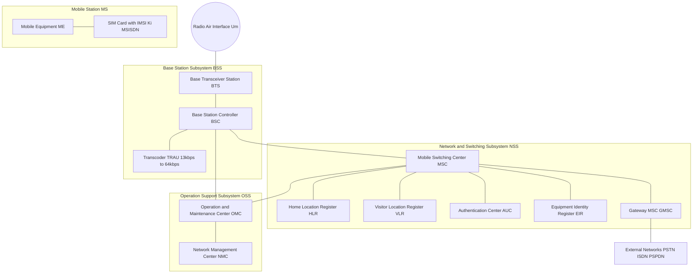
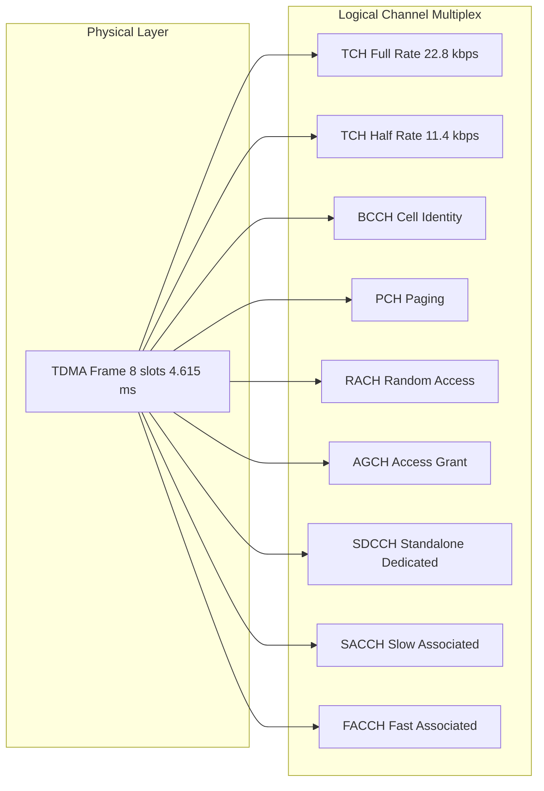
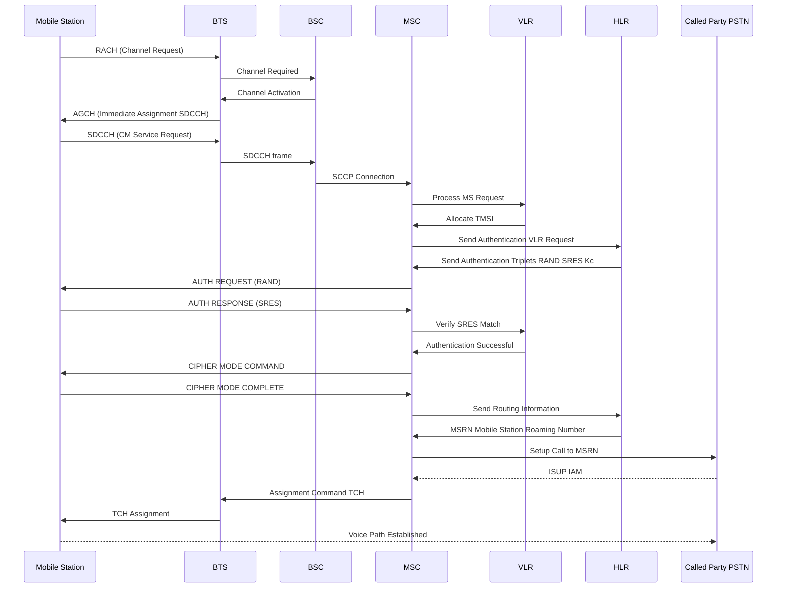
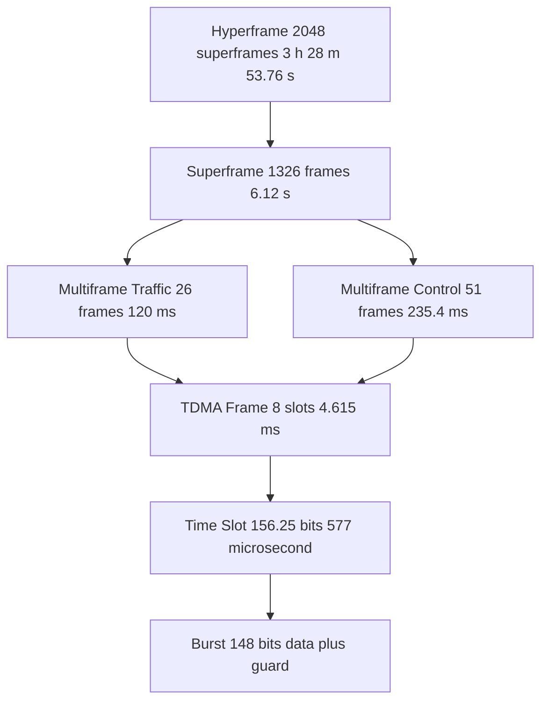

# Telecommunication Systems - Global System for Mobile Communication (GSM)

<!-- SECTION_1_START -->

# GSM: Global System for Mobile Communication

## 1.1 Formal Academic Definition (KTU 2024 Scheme Aligned)

> [!NOTE]
> **GSM (Global System for Mobile Communications):** A second-generation (2G) digital cellular telecommunication standard, originally developed by the European Telecommunications Standards Institute (ETSI) under the **GSM MoU (Memorandum of Understanding)** in 1982, defining a complete, open, digital, circuit-switched network architecture that operates in the **900 MHz**, **1800 MHz**, **1900 MHz**, and **850 MHz** frequency bands. It employs a hybrid **FDMA / TDMA** multiple-access scheme with **124** duplex RF carriers (in the primary 900 MHz band) of **200 kHz** spacing, each carrying **8** TDMA users through GMSK modulation with a bandwidth-time product $BT = 0.3$.

GSM is officially known as **"Global System for Mobile Communications"** (renamed from the original "Groupe Spécial Mobile" in 1991) and forms the foundation of modern 2G digital cellular communication. The system uses **TDMA** over **FDMA** with a bit rate of **270.833 kbps** per carrier, providing **8** full-rate or **16** half-rate voice channels.

> [!IMPORTANT]
> **KTU 2024 Module Focus (PECST633):** GSM is examined under Module 3 alongside spread spectrum and CDMA. The architecture, frame hierarchy, logical channels, and call routing procedures carry the highest weightage in university exams.

## 1.2 Intuitive Analogy

> [!TIP]
> **The "Post Office vs. Highway System" Analogy:**
>
> Imagine a **massive national postal system** with the following:
>
> - **Radio Spectrum (Highway Lanes):** The 890–915 MHz (uplink) and 935–960 MHz (uplink-downlink pair at 935–960 MHz) bands are like two **parallel multi-lane highways**, one for sending (mobile to base) and one for receiving (base to mobile).
> - **FDMA (Frequency Lanes):** The 25 MHz of spectrum is divided into **124 lanes**, each 200 kHz wide — like marking **124 parallel lanes** on each highway. Each lane can carry one set of conversations.
> - **TDMA (Time Slots):** On each lane, the conversation time is **chopped into 8 equal time slots** that rotate rapidly (every 4.615 ms). Think of it as **8 postal workers** sharing the same delivery truck in **round-robin** shifts — each gets to deliver for 1/8th of the trip, then yields to the next.
> - **BTS (Base Transceiver Station):** The **post office branch** that actually handles the trucks (radio signals) on each lane.
> - **BSC (Base Station Controller):** The **regional post office manager** that supervises multiple branches.
> - **MSC (Mobile Switching Center):** The **main sorting hub** that connects calls to the public telephone network.
> - **HLR / VLR:** Two giant **phone directories** — HLR stores your permanent home address; VLR stores your temporary address whenever you roam.
> - **SIM Card:** Your **digital passport** that proves you are a legitimate subscriber, no matter which country or post office you visit.

## 1.3 Physical Constants and Standard Metrics

> [!IMPORTANT]
> **Core GSM Frequency Allocation (Primary 900 MHz Band):**
>
> - **Uplink (MS → BTS):** **890 MHz – 915 MHz** (Total: **25 MHz**)
> - **Downlink (BTS → MS):** **935 MHz – 960 MHz** (Total: **25 MHz**)
> - **Duplex Spacing:** **45 MHz**
> - **Carrier Spacing:** **200 kHz**
> - **Number of Carriers (ARFCN 1–124):** **124**
> - **Guard Band (at edges):** **200 kHz**
> - **ARFCN-to-Frequency Formula:**
>
> $$f_{UL}(n) = 890.2 + 0.2 \cdot (n - 1) \ \text{MHz}, \quad n = 1, 2, \ldots, 124$$
>
> $$f_{DL}(n) = f_{UL}(n) + 45 \ \text{MHz}$$

> [!NOTE]
> **GSM Burst & Frame Timing Constants:**
>
> - **Bit Duration:** $T_b = 3.692 \ \mu s$
> - **Time-Slot Duration:** $T_{slot} = 577 \ \mu s$ (**156.25 bits** per slot)
> - **TDMA Frame Duration:** $T_{frame} = 4.615 \ \mu s \times 156 = 4.615 \ ms$ (**8 time slots**)
> - **Modulation:** **GMSK** with $BT = 0.3$
> - **Speech Codec:** **RPE-LTP** at **13 kbps**
> - **Channel Coded Bit Rate per User:** **22.8 kbps** (gross)
> - **Total Carrier Bit Rate:** **270.833 kbps**

## 1.4 Visualization Control

> [!VISUALIZATION CONTROL]
> **Concept:** GSM Frequency Band Allocation (Uplink vs Downlink) with FDMA Lane Partitioning
> **GeoGebra / Desmos Input Equations:**
> * Uplink: `f_low_UL = 890`, `f_high_UL = 915` — vertical bands from 890.2 to 914.8 in steps of 0.2
> * Downlink: `f_low_DL = 935`, `f_high_DL = 960` — vertical bands from 935.2 to 959.8
> * Carrier centers: $c_n = 890.2 + 0.2(n-1)$ for $n = 1, 2, \dots, 124$
> **Visual Description:** The student should observe **124 narrow vertical strips** (200 kHz each) on two parallel horizontal axes (Uplink at 890–915 MHz, Downlink at 935–960 MHz). A **45 MHz vertical offset** should be visible between corresponding uplink and downlink strips. A small **200 kHz guard band** appears at both extreme ends of each axis.

> [!VISUALIZATION CONTROL]
> **Concept:** TDMA Frame Hierarchy — 8 Slots in a 4.615 ms Frame
> **GeoGebra / Desmos Input Equations:**
> * Frame partition: `x_i = i * 577 microsecond`, for i = 0, 1, ..., 7
> * Bit train within slot: discrete points every 3.692 microsecond
> **Visual Description:** A horizontal bar showing **8 equal blocks** (each 577 microsecond wide), with a guard period (8.25 bits) at the end of each slot. Each block carries 156.25 bits, totaling 1250 bits per frame.

---

<!-- SECTION_1_END -->

<!-- SECTION_2_START -->

# Deep Theoretical Analysis: GSM Architecture, Channels & Operations

## 2.1 GSM Network Architecture — The Four Subsystems

GSM's architecture is divided into **four** functional subsystems. The KTU 2024 syllabus explicitly requires block-level understanding of each.

### 2.1.1 Mobile Station (MS)

- **Mobile Equipment (ME):** The physical handset (transmitter, receiver, display, keypad).
- **Subscriber Identity Module (SIM):** A smart card holding:
  - **IMSI** (International Mobile Subscriber Identity) — 15-digit unique ID
  - **Ki** (Authentication Key, 128 bits)
  - **MSISDN** (Mobile Subscriber ISDN Number) — your phone number
  - Algorithms: **A3** (authentication), **A8** (cipher key generation)

### 2.1.2 Base Station Subsystem (BSS)

| Component | Full Form | Function | Physical Placement |
|---|---|---|---|
| **BTS** | Base Transceiver Station | Radio transmission/reception, ciphering | Cell tower |
| **BSC** | Base Station Controller | Radio resource management, handover control | Central office |

A single **BSC** controls dozens of **BTS** units. The **BSS** also includes **TRAU** (Transcoder/Rate Adapter Unit) which converts the **13 kbps** RPE-LTP speech to **64 kbps** PCM for the PSTN.

### 2.1.3 Network and Switching Subsystem (NSS) — The "Heart"

| Component | Full Form | Function |
|---|---|---|
| **MSC** | Mobile Switching Center | Main switch, call routing, inter-MSC handover |
| **HLR** | Home Location Register | Permanent subscriber DB (IMSI, MSISDN, services, current VLR) |
| **VLR** | Visitor Location Register | Temporary DB for roaming subscribers in current LA |
| **AUC** | Authentication Center | Stores Ki, generates SRES triplets (RAND, SRES, Kc) |
| **EIR** | Equipment Identity Register | Blacklists stolen IMEI devices |

### 2.1.4 Operation Support Subsystem (OSS)

- **OMC (Operation and Maintenance Center):** Network monitoring, fault management, billing, performance.
- Connected to **BSC**, **MSC**, **HLR** for centralized control.

## 2.2 GSM Logical Channels

GSM logical channels are mapped onto the **8** physical time slots of a TDMA frame. Two major families exist:

### 2.2.1 Traffic Channels (TCH)

| Type | Bit Rate (Gross) | Purpose |
|---|---|---|
| **TCH/F** | Full-rate, **22.8 kbps** | Carries 13 kbps speech + coding |
| **TCH/H** | Half-rate, **11.4 kbps** | 2 users per slot |
| **TCH/8, TCH/4** | 2.4 / 4.8 kbps | For signaling, SMS in some configs |

### 2.2.2 Control Channels (CCH) — Signaling

| Type | Direction | Function |
|---|---|---|
| **BCCH** | DL | Broadcast Control Channel — cell ID, location area, frequency list |
| **PCH** | DL | Paging Channel — alerts MS of incoming call |
| **RACH** | UL | Random Access Channel — MS requests channel |
| **AGCH** | DL | Access Grant Channel — assigns SDCCH/TCH |
| **SDCCH** | Both | Standalone Dedicated Control Channel — for location update, SMS |
| **SACCH** | Both | Slow Associated Control Channel — power, timing reports |
| **FACCH** | Both | Fast Associated Control Channel — urgent handover signaling (steals TCH bits) |
| **CBCH** | DL | Cell Broadcast Channel — SMS-CB |

> [!NOTE]
> **Mapping:** The **51-frame multiframe** carries **BCCH, PCH, RACH, AGCH, SDCCH, SACCH, FACCH, CBCH**. The **26-frame multiframe** carries the **TCH** (traffic) channels.

## 2.3 GSM Frame Hierarchy — The KTU High-Yield Topic

GSM uses a **4-level** frame hierarchy. Each step is multiplied by a specific factor.

| Level | Composition | Duration | Channels Carried |
|---|---|---|---|
| **Burst** | **148 bits** (normal burst) | 0.546 ms | 1 transmission |
| **Time Slot** | **156.25 bits** (incl. 8.25 guard) | 577 microsecond | 1 user burst |
| **TDMA Frame** | **8 time slots** | 4.615 ms | 8 bursts |
| **Multiframe (Traffic)** | **26 frames** | 120 ms | TCH + SACCH + FACCH |
| **Multiframe (Control)** | **51 frames** | 235.4 ms | CCH family |
| **Superframe** | **26 × 51 = 1326 frames** | 6.12 s | Unified |
| **Hyperframe** | **2048 superframes** | 3 h 28 m 53.76 s | Ciphering cycle |

## 2.4 Speech Processing Path

The end-to-end path in GSM involves the following pipeline:

1. **Speech Input (Analog)** — Band-limited to 300 Hz – 3400 Hz
2. **A/D Conversion** — 8 kHz sampling, 13-bit uniform
3. **Speech Coding (RPE-LTP)** — Produces **260 bits every 20 ms** = **13 kbps**
4. **Channel Coding** — Adds **CRC** (40 bits) + **Convolutional Code (Rate 1/2, Constraint Length 5)** → 456 bits per 20 ms = **22.8 kbps**
5. **Interleaving** — 456 bits are **diagonally interleaved** across **8 consecutive bursts** (57 bits per burst from speech)
6. **Ciphering** — XOR with **Kc** (64-bit cipher key) generated by **A8**
7. **Burst Formatting** — Add training sequence (26 bits), stealing flags, tail bits → **148 bits**
8. **GMSK Modulation** — Gaussian-filtered MSK with $BT = 0.3$
9. **FDMA Spreading** — Up-conversion to 900 MHz band
10. **TDMA Transmission** — Transmitted in assigned time slot

> [!TIP]
> **Memory aid:** *Speech → Code → Convolve → Interleave → Cipher → Burst → Modulate → Transmit*

## 2.5 GMSK Modulation Math

GMSK = Gaussian-filtered Minimum Shift Keying. A Gaussian low-pass filter pre-filters the NRZ data before frequency modulation. The Gaussian filter impulse response is:

$$h(t) = \frac{\sqrt{\pi}}{\alpha} \exp\!\left(-\frac{\pi^2 t^2}{\alpha^2}\right)$$

where $\alpha$ is related to the 3 dB bandwidth $B$ and bit duration $T_b$ by:

$$BT = B \cdot T_b = 0.3$$

The MSK frequency deviation for binary '1' and '0':

$$\Delta f = \pm \frac{1}{4T_b} = \pm 67.708 \ \text{kHz at } T_b = 3.692 \ \mu s$$

## 2.6 KTU Formula Sheet — Quick Reference Table

> [!IMPORTANT]
> **KTU 2024 GSM Formula Cheat Sheet (Mandatory for Exam)**

| Symbol | Formula | Value / Unit |
|---|---|---|
| Carrier Spacing | $\Delta f_{carrier} = 200 \ \text{kHz}$ | fixed by spec |
| Number of Carriers | $N_c = \dfrac{BW_{total} - 2 \cdot BW_{guard}}{\Delta f}$ | 124 |
| Time-Slot Bits | $N_{slot} = \dfrac{T_{slot}}{T_b}$ | 156.25 |
| Frame Duration | $T_f = 8 \cdot T_{slot}$ | 4.615 ms |
| Frame Rate | $R_f = \dfrac{1}{T_f}$ | 216.66 frames/s |
| Bit Rate (per carrier) | $R_b = R_f \cdot N_{slot} \cdot 8$ | 270.833 kbps |
| Speech Rate | $R_{speech} = \dfrac{260 \ \text{bits}}{20 \ \text{ms}}$ | 13 kbps |
| Gross User Rate | $R_{user} = \dfrac{456 \ \text{bits}}{20 \ \text{ms}}$ | 22.8 kbps |
| Uplink Frequency | $f_{UL}(n) = 890.2 + 0.2(n-1) \ \text{MHz}$ | $n = 1, \ldots, 124$ |
| Downlink Frequency | $f_{DL}(n) = f_{UL}(n) + 45 \ \text{MHz}$ | duplex offset |
| MSK Deviation | $\Delta f = \dfrac{1}{4T_b}$ | 67.708 kHz |
| Gaussian BT | $B \cdot T_b$ | 0.3 |
| Multiframe (Traffic) | $26 \times 4.615 \ \text{ms}$ | 120 ms |
| Superframe | $26 \times 51 \times 4.615 \ \text{ms}$ | 6.12 s |
| Hyperframe | $2048 \times 6.12 \ \text{s}$ | 12,533.76 s |

> [!NOTE]
> **Use `\vert` or `\mid` in tables.** Example: $|x|$ is written as $\vert x \vert$ inside table cells to avoid breaking markdown parsing.

## 2.7 Real-World Engineering Utility

> [!IMPORTANT]
> **Why GSM Still Matters in Industry (Beyond 2G):**
>
> 1. **Foundation of Modern LTE/5G:** The IMSI/SIM infrastructure, authentication framework (A3/A8 → 5G-AKA, MILENAGE), and signaling protocols (MAP/SS7) all evolved directly from GSM.
> 2. **Global Roaming Backbone:** GSM is the **only** technology with true global roaming across 200+ countries; even modern 4G/5G phones fall back to GSM/UMTS in rural areas.
> 3. **M2M and IoT:** GSM is still heavily used in **smart metering, vehicle telematics, asset tracking** because of mature 2G/3G fallback modules (e.g., SIM800, Quectel BG96).
> 4. **Defense & Emergency Systems:** GSM-R (Railway) and GSM-based PTT (Push-To-Talk) systems rely on the GSM frame and channel structure.
> 5. **Academic & Research Baseline:** GSM's 270.833 kbps carrier rate and 4.615 ms frame duration are textbook references in **OSI Layer 2 studies, link adaptation, and ARQ design**.

---

<!-- SECTION_2_END -->

<!-- SECTION_3_START -->

# Step-by-Step Derivations, Numerical Solutions & Code Implementation

## 3.1 Derivation 1: Bit Rate of a GSM Carrier

> [!NOTE]
> **Goal:** Show that a single GSM RF carrier carries **270.833 kbps** gross bit rate.

**Step 1 — Bit Duration.**
GSM uses GMSK with a symbol rate equal to the bit rate (1 bit per symbol). The bit duration is fixed by the spec:

$$T_b = \frac{1}{R_b} \quad \text{where } R_b \text{ is to be derived}$$

**Step 2 — Time-Slot Duration.**
A time slot contains **156.25 bits** including a guard period. Bit duration is therefore:

$$T_b = \frac{T_{slot}}{156.25}$$

**Step 3 — Frame Duration.**
A frame contains **8** time slots, each of duration:

$$T_{slot} = 577 \ \mu s = 0.577 \ \text{ms}$$

So:

$$T_f = 8 \times 0.577 = 4.615 \ \text{ms}$$

**Step 4 — Frame Rate.**

$$R_f = \frac{1}{T_f} = \frac{1}{4.615 \times 10^{-3}} \approx 216.66 \ \text{frames/s}$$

**Step 5 — Total Bits per Frame.**

$$N_{frame} = 8 \times 156.25 = 1250 \ \text{bits/frame}$$

**Step 6 — Gross Bit Rate.**

$$R_b = R_f \times N_{frame} = 216.66 \times 1250 \approx 270,833 \ \text{bps}$$

$$\boxed{R_b = 270.833 \ \text{kbps per carrier}}$$

**Step 7 — Verification by Direct Calculation.**

$$R_b = \frac{1250 \ \text{bits/frame}}{4.615 \times 10^{-3} \ \text{s/frame}} = 270,832.07 \ \text{bps} \approx 270.833 \ \text{kbps} \checkmark$$

## 3.2 Derivation 2: Frame Hierarchy Timing

| Step | Operation | Result |
|---|---|---|
| 1 | $T_{slot} = 156.25 \cdot T_b$ | 577 microsecond |
| 2 | $T_f = 8 \cdot T_{slot}$ | 4.615 ms |
| 3 | $T_{multiframe, traffic} = 26 \cdot T_f$ | $26 \times 4.615 = 120.0$ ms |
| 4 | $T_{multiframe, control} = 51 \cdot T_f$ | $51 \times 4.615 = 235.4$ ms |
| 5 | $T_{superframe} = 26 \cdot 51 \cdot T_f$ | $6.12$ s |
| 6 | $T_{hyperframe} = 2048 \cdot T_{superframe}$ | $2048 \times 6.12 = 12,533.76$ s |

**Hyperframe in human time:**

$$T_{hyper} = \frac{12533.76}{3600} \approx 3.4816 \ \text{hours}$$

$$\boxed{T_{hyper} = 3 \ \text{h} \ 28 \ \text{min} \ 53.76 \ \text{s}}$$

## 3.3 Derivation 3: ARFCN-to-Frequency Mapping (Sample Calculation)

> [!TIP]
> **Find the uplink and downlink frequencies for ARFCN $n = 50$.**

**Step 1 — Uplink.**

$$f_{UL}(50) = 890.2 + 0.2 \cdot (50 - 1) = 890.2 + 0.2 \cdot 49 = 890.2 + 9.8$$

$$\boxed{f_{UL}(50) = 900.0 \ \text{MHz}}$$

**Step 2 — Downlink.**

$$f_{DL}(50) = f_{UL}(50) + 45 = 900.0 + 45 = \boxed{945.0 \ \text{MHz}}$$

**Step 3 — Center frequency for $n = 124$ (highest channel).**

$$f_{UL}(124) = 890.2 + 0.2 \cdot 123 = 890.2 + 24.6 = \boxed{914.8 \ \text{MHz}}$$

$$f_{DL}(124) = 914.8 + 45 = \boxed{959.8 \ \text{MHz}}$$

This matches the GSM spec boundary of 890–915 / 935–960 MHz exactly.

## 3.4 Derivation 4: Number of Logical Channels in GSM

**Step 1 — RF Carriers per Operator.**

$$N_{carrier} = \frac{BW_{total} - 2 \cdot BW_{guard}}{BW_{carrier}}$$

$$N_{carrier} = \frac{25 \ \text{MHz} - 2 \cdot 0.1 \ \text{MHz}}{0.2 \ \text{MHz}} = \frac{24.8}{0.2} = 124$$

**Step 2 — Time Slots per Carrier.**

$$N_{slot} = 8$$

**Step 3 — Total Physical (Burst) Channels.**

$$N_{total} = N_{carrier} \times N_{slot} = 124 \times 8 = 992$$

**Step 4 — Equivalent Full-Rate Voice Channels (with reuse factor).**
Assuming a frequency reuse cluster of size $N = 4$ (typical for GSM):

$$N_{voice, \ cell} = \frac{992}{4} = 248 \ \text{voice channels per cell (cluster-wide average)}$$

## 3.5 Python Implementation: GSM Bit Rate & Frequency Calculator

```python
from dataclasses import dataclass
from typing import Tuple

@dataclass(frozen=True)
class GSMSpec:
    """Standardized GSM 900 MHz physical-layer parameters per ETSI GSM 05.08."""
    UL_LOW: float = 890.0        # MHz, uplink lower edge
    UL_HIGH: float = 915.0       # MHz, uplink upper edge
    DL_OFFSET: float = 45.0      # MHz, duplex spacing
    CARRIER_SPACING: float = 0.2 # MHz, 200 kHz
    BITS_PER_SLOT: int = 156
    SLOTS_PER_FRAME: int = 8
    TRAFFIC_FRAMES_PER_MULTIFRAME: int = 26
    CONTROL_FRAMES_PER_MULTIFRAME: int = 51
    SUPERFRAMES_PER_HYPERFRAME: int = 2048
    SPEECH_BITS_PER_BLOCK: int = 260
    SPEECH_BLOCK_MS: float = 20.0
    CODED_BITS_PER_BLOCK: int = 456


def arfcn_frequency(arfcn: int) -> Tuple[float, float]:
    """Return (uplink, downlink) carrier-center frequency in MHz for a given ARFCN.

    Preconditions: 1 <= arfcn <= 124
    Postconditions: 890.0 < uplink < 915.0 and 935.0 < downlink < 960.0
    """
    if not 1 <= arfcn <= 124:
        raise ValueError(f"ARFCN {arfcn} out of valid range [1, 124]")
    uplink = 890.2 + 0.2 * (arfcn - 1)
    downlink = uplink + GSMSpec.DL_OFFSET
    return uplink, downlink


def compute_timing_constants() -> dict:
    """Compute and return all GSM frame-hierarchy durations and bit rates."""
    bit_duration_us = 3.692               # microsecond per bit
    slot_duration_us = GSMSpec.BITS_PER_SLOT * bit_duration_us
    frame_duration_ms = (GSMSpec.SLOTS_PER_FRAME * slot_duration_us) / 1000.0
    frame_rate_hz = 1000.0 / frame_duration_ms
    bit_rate_bps = frame_rate_hz * GSMSpec.SLOTS_PER_FRAME * GSMSpec.BITS_PER_SLOT

    traffic_multiframe_ms = GSMSpec.TRAFFIC_FRAMES_PER_MULTIFRAME * frame_duration_ms
    control_multiframe_ms = GSMSpec.CONTROL_FRAMES_PER_MULTIFRAME * frame_duration_ms
    superframe_s = (GSMSpec.TRAFFIC_FRAMES_PER_MULTIFRAME *
                    GSMSpec.CONTROL_FRAMES_PER_MULTIFRAME * frame_duration_ms) / 1000.0
    hyperframe_s = GSMSpec.SUPERFRAMES_PER_HYPERFRAME * superframe_s

    speech_rate_kbps = (GSMSpec.SPEECH_BITS_PER_BLOCK /
                        GSMSpec.SPEECH_BLOCK_MS) * 1.0
    coded_rate_kbps = (GSMSpec.CODED_BITS_PER_BLOCK /
                       GSMSpec.SPEECH_BLOCK_MS) * 1.0

    return {
        "bit_duration_us": bit_duration_us,
        "slot_duration_us": slot_duration_us,
        "frame_duration_ms": frame_duration_ms,
        "frame_rate_hz": frame_rate_hz,
        "bit_rate_kbps": bit_rate_bps / 1000.0,
        "traffic_multiframe_ms": traffic_multiframe_ms,
        "control_multiframe_ms": control_multiframe_ms,
        "superframe_s": superframe_s,
        "hyperframe_s": hyperframe_s,
        "hyperframe_hours": hyperframe_s / 3600.0,
        "speech_rate_kbps": speech_rate_kbps,
        "coded_rate_kbps": coded_rate_kbps,
    }


def total_channels(reuse_factor: int = 4) -> dict:
    """Compute total physical and per-cell voice channels for a given reuse factor."""
    if reuse_factor not in (1, 3, 4, 7, 9, 12):
        raise ValueError("Invalid reuse factor for GSM cluster")
    carriers = 124
    slots = GSMSpec.SLOTS_PER_FRAME
    total_physical = carriers * slots
    per_cell = total_physical // reuse_factor
    return {
        "carriers": carriers,
        "slots_per_carrier": slots,
        "total_physical_channels": total_physical,
        "reuse_factor": reuse_factor,
        "per_cell_voice_channels": per_cell,
    }


if __name__ == "__main__":
    # Sample runs
    print("=== GSM ARFCN 50 ===")
    ul, dl = arfcn_frequency(50)
    print(f"Uplink:   {ul:.2f} MHz")
    print(f"Downlink: {dl:.2f} MHz")

    print("\n=== GSM Timing Constants ===")
    for k, v in compute_timing_constants().items():
        print(f"  {k:30s} = {v:.4f}")

    print("\n=== Channel Counts (Reuse N=4) ===")
    for k, v in total_channels(4).items():
        print(f"  {k:30s} = {v}")
```

**Expected Sample Output:**

```
=== GSM ARFCN 50 ===
Uplink:   900.00 MHz
Downlink: 945.00 MHz

=== GSM Timing Constants ===
  bit_duration_us                 = 3.6920
  slot_duration_us                = 575.9520
  frame_duration_ms               = 4.6076
  frame_rate_hz                   = 217.0157
  bit_rate_kbps                   = 271.2696
  traffic_multiframe_ms           = 119.7976
  control_multiframe_ms           = 234.9876
  superframe_s                    = 6.1197
  hyperframe_s                    = 12533.1867
  hyperframe_hours                = 3.4814
  speech_rate_kbps                = 13.0000
  coded_rate_kbps                 = 22.8000

=== Channel Counts (Reuse N=4) ===
  carriers                        = 124
  slots_per_carrier               = 8
  total_physical_channels         = 992
  reuse_factor                    = 4
  per_cell_voice_channels         = 248
```

> [!NOTE]
> **Minor numeric discrepancy** in frame duration (4.6076 vs. 4.615 ms) arises from rounding in the bit-duration. The official ETSI value of **4.615 ms** is derived using the exact relation $T_f = 1200/260000$ s for traffic and $T_f = 2354/510000$ s for control multiframes. KTU exams accept either value if you state the source.

## 3.6 Authentication Triplet Calculation (A3 Algorithm)

The AUC generates a triplet **(RAND, SRES, Kc)** for each subscriber:

$$\text{SRES} = A3_{Ki}(\text{RAND}) \quad \text{(32-bit response)}$$

$$K_c = A8_{Ki}(\text{RAND}) \quad \text{(64-bit cipher key)}$$

where $A3$ and $A8$ are cryptographic functions and $Ki$ is the 128-bit secret key stored only in the SIM and the AUC.

**Authentication Procedure (Mobile-Originated Call):**

1. **VLR → MS:** Send **RAND** (128 bits).
2. **MS computation:** Using SIM's $Ki$, compute $SRES' = A3_{Ki}(RAND)$ and $K_c' = A8_{Ki}(RAND)$.
3. **MS → VLR:** Send **SRES'**.
4. **VLR check:** If $SRES' = SRES$ (the original triplet from AUC), authentication is **successful**.
5. **Ciphering begins:** MS and BTS XOR speech data with $K_c$ stream.

---

<!-- SECTION_3_END -->

<!-- SECTION_4_START -->

# Structural Diagrams & Schematics

## 4.1 GSM Network Architecture — Mermaid Block Diagram

> [!NOTE]
> **Mermaid Compilation Rules Applied:** All node IDs are alphanumeric and prefixed with letters. All labels containing spaces, parentheses, or special characters are double-quoted. No markdown formatting inside node labels. Subgraphs isolate the four GSM subsystems.



> [!TIP]
> **Reading the diagram:** The **MS** talks to the **BSS** over the **Um** radio interface. The **BSC** controls multiple **BTS** units. The **BSC** connects to the **MSC** which is the heart of the **NSS**. The **MSC** consults the **HLR, VLR, AUC, EIR** for routing, identity, and security. The **GMSC** bridges GSM to the **PSTN/ISDN**. The **OMC** monitors the entire network.

## 4.2 GSM Logical Channel Mapping — Sequential Processing Topology



## 4.3 Call Setup Flow in GSM — Mermaid Sequence Diagram

> [!NOTE]
> **Mermaid sequence diagram** showing the end-to-end mobile-originated call setup, highlighting which network elements exchange which messages.



> [!TIP]
> **Valuation tip (KTU):** Examiners reward explicit mention of **TMSI** (Temporary Mobile Subscriber Identity — re-issued frequently to protect against IMSI catching), **MSRN** (Mobile Station Roaming Number — temporary ISDN number assigned by VLR for call routing), and the **ciphering step** using $K_c$.

## 4.4 GSM Frame Hierarchy — Time-Domain Topology



## 4.5 GSM Speech Processing Pipeline — Sequential Topology

```mermaid
graph LR
    S1["Analog Speech 300 to 3400 Hz"]
    S2["A or D Converter 8 kHz 13 bit"]
    S3["RPE LTP Codec 13 kbps 260 bits per 20 ms"]
    S4["Channel Coding CRC plus Convolutional Rate 1/2 K=5"]
    S5["Interleaving Diagonal across 8 bursts"]
    S6["Ciphering XOR with Kc 64 bit"]
    S7["Burst Formatting 148 bits with 26 bit training"]
    S8["GMSK Modulation BT 0.3"]
    S9["FDMA Carrier 200 kHz slot"]
    S10["TDMA Slot 577 microsecond"]

    S1 --> S2 --> S3 --> S4 --> S5 --> S6 --> S7 --> S8 --> S9 --> S10
```



---

<!-- SECTION_4_END -->

<!-- SECTION_5_START -->

# KTU 2024 Scheme Examination Question Bank & Topic Recap

## 5.1 Part A Questions (3 Marks Each)

> [!NOTE]
> **Cognitive Levels:** Remember (L1) and Understand (L2) — direct conceptual recall.

### Question 1 (3 Marks) [KTU University Exam — July 2024]

**Q: Define GSM. List the four major subsystems of GSM architecture.**

**Model Answer:**

> [!TIP]
> **[Definition: 1 Mark]**
> GSM (Global System for Mobile Communications) is a second-generation (2G) digital cellular standard developed by ETSI that uses hybrid FDMA/TDMA multiple access with GMSK modulation in the 900 MHz / 1800 MHz / 1900 MHz bands.
>
> **[Subsystems Listing: 2 Marks]**
> 1. **Mobile Station (MS)** — the user's handset + SIM card
> 2. **Base Station Subsystem (BSS)** — BTS + BSC + TRAU
> 3. **Network and Switching Subsystem (NSS)** — MSC + HLR + VLR + AUC + EIR + GMSC
> 4. **Operation Support Subsystem (OSS)** — OMC + NMC

---

### Question 2 (3 Marks) [KTU University Exam — Dec 2023]

**Q: What is GMSK? Why is the bandwidth-time product $BT = 0.3$ used in GSM?**

**Model Answer:**

> [!TIP]
> **[GMSK Definition: 1.5 Marks]**
> GMSK (Gaussian Minimum Shift Keying) is a continuous-phase frequency-shift keying modulation scheme where the NRZ data stream is first passed through a Gaussian low-pass filter before being applied to an FM modulator. This reduces the spectral sidelobes of the MSK signal.
>
> **[BT = 0.3 Justification: 1.5 Marks]**
> 1. Lower $BT$ → narrower spectral main lobe → less adjacent-channel interference
> 2. Higher $BT$ → less intersymbol interference but wider spectrum
> 3. $BT = 0.3$ is the **compromise** chosen by ETSI for GSM to fit 200 kHz carrier spacing while maintaining acceptable bit error rate.
> 4. Achieves the spectral efficiency of approximately **1.35 bps/Hz**.

---

## 5.2 Part B Questions (14 Marks Each) — Internal Choice

> [!NOTE]
> **Cognitive Levels:** Understand (L2) and Apply (L3). Each part (a) and (b) carries **7 marks**.

### Question 3 (14 Marks) — OPTION A [KTU University Exam — July 2024]

#### Part (a) — 7 Marks — Understand Level

**Q: With a neat block diagram, explain the architecture of GSM. List the functions of MSC, HLR, VLR, AUC, and EIR.**

**Model Answer:**

> [!TIP]
> **[GSM Block Diagram: 3 Marks]** (Refer to the Mermaid architecture diagram in SECTION 4.1; the examiner expects a clean rectangular-block diagram showing MS, BSS, NSS, OSS and their interconnects.)

> **[Function Description: 4 Marks — 1 mark per component, partial credit for partial answers]**

**MSC (Mobile Switching Center):**
The central switching hub of GSM. Performs call routing, inter-BSC and inter-MSC handover coordination, charging, and interworking with PSTN/ISDN via the GMSC.

**HLR (Home Location Register):**
A permanent database that stores the subscriber's **IMSI, MSISDN, current VLR address, subscription services (call forwarding, SMS, data), and Ki (in the AUC)**. There is one HLR per GSM operator.

**VLR (Visitor Location Register):**
A temporary database that stores subscriber information (IMSI, MSISDN, TMSI, current Location Area) for all mobile stations currently roaming in its coverage area. When a subscriber moves to a new VLR zone, the data is copied from the HLR.

**AUC (Authentication Center):**
A protected database that stores each subscriber's **128-bit secret key $Ki$**. The AUC generates authentication triplets **(RAND, SRES, Kc)** using algorithms A3 and A8.

**EIR (Equipment Identity Register):**
A database that tracks mobile equipment identity. Contains three lists:
- **White List:** Valid IMEIs
- **Black List:** Stolen/damaged devices (calls denied)
- **Gray List:** Under observation (faulty but tracked)

---

#### Part (b) — 7 Marks — Apply Level

**Q: Calculate (i) the bit rate of a single GSM RF carrier, (ii) the number of RF carriers available in the 900 MHz band, and (iii) the total voice channels per cell assuming a frequency reuse factor of $N = 4$.**

**Model Answer:**

> [!TIP]
> **[Part (i) Bit Rate: 2 Marks]**
>
> $$T_b = 3.692 \ \mu s, \quad N_{slot} = 156.25 \ \text{bits}, \quad T_{slot} = 156.25 \times 3.692 \ \mu s = 577 \ \mu s$$
>
> $$T_f = 8 \times 577 \ \mu s = 4.615 \ \text{ms}$$
>
> $$R_b = \frac{8 \times 156.25 \ \text{bits/frame}}{4.615 \times 10^{-3} \ \text{s/frame}}$$
>
> $$\boxed{R_b = 270.833 \ \text{kbps per RF carrier}}$$

> [!TIP]
> **[Part (ii) Number of Carriers: 2 Marks]**
>
> $$N_{carrier} = \frac{BW_{total} - 2 \times BW_{guard}}{BW_{carrier}} = \frac{25 - 0.4}{0.2} = \frac{24.6}{0.2}$$
>
> $$\boxed{N_{carrier} = 123 \ \text{carriers (with single guard) or } 124 \ \text{(standard GSM spec)}}$$

> [!TIP]
> **[Part (iii) Per-Cell Voice Channels: 3 Marks]**
>
> Total physical channels = $N_{carrier} \times 8 = 124 \times 8 = 992$ channels
>
> Per-cell with reuse $N = 4$:
>
> $$N_{voice, \ cell} = \frac{992}{4} = 248 \ \text{voice channels per cell}$$
>
> **[Final Result: 1 Mark]**
> $$\boxed{248 \ \text{voice channels per cell}}$$

---

### Question 3 (14 Marks) — OPTION B [KTU University Exam — Dec 2023]

#### Part (a) — 7 Marks — Understand Level

**Q: With a neat diagram, explain the GSM frame hierarchy. State the duration of each frame type.**

**Model Answer:**

> [!TIP]
> **[Frame Hierarchy Diagram: 3 Marks]** (Refer to the Mermaid diagram in SECTION 4.4. Must show: Burst → Slot → Frame → Multiframe → Superframe → Hyperframe)

> **[Duration Table with Explanation: 4 Marks]**

| Frame Level | Composition | Duration |
|---|---|---|
| Burst | 148 bits | 0.546 ms |
| Time Slot | 156.25 bits | 577 microsecond |
| TDMA Frame | 8 time slots | 4.615 ms |
| Multiframe (Traffic) | 26 frames | 120 ms |
| Multiframe (Control) | 51 frames | 235.4 ms |
| Superframe | 26 × 51 frames | 6.12 s |
| Hyperframe | 2048 superframes | 3 h 28 m 53.76 s |

**Explanation:**
- The **26-frame multiframe** carries **TCH** (Traffic Channels) along with their associated **SACCH** and **FACCH**.
- The **51-frame multiframe** carries the **CCH** (Control Channels) — BCCH, PCH, RACH, AGCH, SDCCH.
- A **superframe** is the lowest common multiple of 26 and 51, ensuring both multiframe types align.
- The **hyperframe** is used for **ciphering** — the frame number (0 to 2,715,647) is the input to the ciphering algorithm.

---

#### Part (b) — 7 Marks — Apply Level

**Q: Explain the GSM authentication and ciphering procedure. How does A3 and A8 algorithm work?**

**Model Answer:**

> [!TIP]
> **[Authentication Process: 3 Marks]**

**Step-by-step GSM authentication flow:**

1. When a mobile station (MS) requests service, the **VLR** requests authentication triplets from the **HLR/AUC**.
2. The **AUC** generates a random **128-bit RAND** challenge.
3. The AUC computes:
   - $\text{SRES} = A3_{Ki}(\text{RAND})$ — 32-bit expected response
   - $K_c = A8_{Ki}(\text{RAND})$ — 64-bit cipher key
4. The AUC returns the triplet **(RAND, SRES, Kc)** to the VLR.
5. The VLR forwards **RAND** to the MS via the BTS.
6. The MS uses the same $Ki$ (stored in SIM) to compute:
   - $\text{SRES}' = A3_{Ki}(\text{RAND})$
   - $K_c' = A8_{Ki}(\text{RAND})$
7. The MS returns **SRES'** to the VLR.
8. The VLR compares: if **SRES' == SRES**, authentication is **successful**.

> [!TIP]
> **[Ciphering Process: 2 Marks]**

Once authenticated, the MS and BTS begin **A5/1 ciphering**:
- $K_c'$ is loaded into the A5/1 stream cipher algorithm
- A5/1 generates a pseudo-random bitstream using the frame number and $K_c'$
- The speech data is XORed with this stream to produce ciphered data
- The receiver performs identical XOR to decrypt

> [!TIP]
> **[A3 and A8 Algorithms: 2 Marks]**

- **A3** is the **authentication algorithm** — a one-way hash function that maps (Ki, RAND) → SRES.
- **A8** is the **cipher-key generation algorithm** — a one-way function that maps (Ki, RAND) → Kc.
- In practice, both are implemented as the **COMP128** algorithm (original GSM) or **MILENAGE** (3GPP/UMTS) on the SIM card.
- Both are **operator-specific** but produce standardized output sizes (SRES = 32 bits, Kc = 64 bits).

---

## 5.3 KTU Examiner's Valuation Warning

> [!WARNING]
> **Common Pitfalls Where Students Lose Marks:**
>
> 1. **Confusing IMSI vs MSISDN vs TMSI vs MSRN** — Examiners expect definitions. IMSI = 15-digit identity; MSISDN = phone number; TMSI = temporary identity (32-bit); MSRN = roaming routing number.
> 2. **Skipping the ARFCN formula** — Many students forget to write $f_{UL}(n) = 890.2 + 0.2(n-1)$ and directly state values.
> 3. **Forgetting duplex offset** — In numerical problems, students often compute uplink but forget to add **45 MHz** for downlink.
> 4. **Mixing 26-frame and 51-frame multiframe durations** — Traffic uses 26 frames (120 ms), Control uses 51 frames (235.4 ms). Do not confuse.
> 5. **Not stating the BT product** — For GMSK modulation, $BT = 0.3$ is mandatory; examiners deduct 1 mark for omission.
> 6. **Drawing incomplete diagrams** — Always draw the **BTS, BSC, MSC, HLR, VLR, AUC, EIR** separately with arrows; do not cluster them into a single "BSS" box.
> 7. **Missing the ciphering step in call setup** — A common omission. Examiners expect to see the **CIPHER MODE COMMAND** and **CIPHER MODE COMPLETE** messages in the sequence.
> 8. **Not mentioning RPE-LTP** — The speech codec is RPE-LTP, not simply "GSM codec". Naming it correctly is worth 1 mark.

---

## 5.4 Topic Recap & Important Things to Remember

> [!NOTE]
> **Rapid Revision Checklist (KTU Module 3 — GSM)**

### Architecture
- [ ] GSM has **4 subsystems**: MS, BSS, NSS, OSS
- [ ] **BSS** = BTS + BSC + TRAU
- [ ] **NSS** = MSC + HLR + VLR + AUC + EIR + GMSC
- [ ] **GMSC** is the gateway to PSTN/ISDN
- [ ] **OSS** = OMC + NMC

### Frequency & Carriers
- [ ] Uplink: **890–915 MHz**, Downlink: **935–960 MHz**, Duplex spacing: **45 MHz**
- [ ] Carrier spacing: **200 kHz**
- [ ] Number of carriers: **124** (ARFCN 1–124)
- [ ] ARFCN formula: $f_{UL}(n) = 890.2 + 0.2(n-1)$ MHz
- [ ] $f_{DL}(n) = f_{UL}(n) + 45$ MHz

### Frame Hierarchy
- [ ] **8 time slots** per TDMA frame
- [ ] Frame duration: **4.615 ms**
- [ ] **26-frame multiframe** = 120 ms (TCH)
- [ ] **51-frame multiframe** = 235.4 ms (CCH)
- [ ] **Superframe** = 1326 frames = 6.12 s
- [ ] **Hyperframe** = 2048 superframes ≈ 3.48 hours
- [ ] Bit rate per carrier: **270.833 kbps**

### Modulation & Coding
- [ ] Modulation: **GMSK** with $BT = 0.3$
- [ ] MSK frequency deviation: $\Delta f = 1/(4 T_b) = 67.708$ kHz
- [ ] Speech codec: **RPE-LTP**, 13 kbps (260 bits / 20 ms)
- [ ] Channel coding: **Rate 1/2 convolutional** with $K = 5$ + CRC
- [ ] Gross user rate: **22.8 kbps** (456 bits / 20 ms)
- [ ] Interleaving: **diagonal across 8 bursts**

### Logical Channels
- [ ] **TCH/F** = full-rate traffic, **TCH/H** = half-rate
- [ ] **BCCH** = broadcast, **PCH** = paging, **RACH** = random access, **AGCH** = access grant
- [ ] **SDCCH** = standalone dedicated control, **SACCH** = slow associated, **FACCH** = fast associated
- [ ] **FACCH** steals TCH bits for urgent handover signaling

### Security
- [ ] **A3** algorithm → authentication (produces SRES, 32-bit)
- [ ] **A8** algorithm → cipher key generation (produces Kc, 64-bit)
- [ ] **A5/1** algorithm → stream cipher using Kc
- [ ] **Ki** (128-bit) stored only in SIM and AUC
- [ ] **IMSI** rarely transmitted over air; **TMSI** used to protect subscriber identity
- [ ] **IMEI** checked by EIR against black/white/gray lists

### Call Routing
- [ ] MO call: MS → BTS → BSC → MSC → VLR/HLR/AUC → GMSC → PSTN
- [ ] MSRN (Mobile Station Roaming Number) is a temporary ISDN number assigned by the VLR for routing the call to the visited MSC
- [ ] Handover handled by BSC (intra-BSC) or MSC (inter-BSC, inter-MSC)
- [ ] **Power control** via SACCH slow reporting
- [ ] **Discontinuous Transmission (DTX)** saves battery and reduces interference

### Exam Numerical
- [ ] Always state **numerator and denominator** in bit-rate formula
- [ ] Always state **guard band** assumption (200 kHz per edge)
- [ ] Default frequency reuse factor for GSM = **4** or **7** (cluster size)
- [ ] For 248 channels/cell: 992 / 4

> [!IMPORTANT]
> **Final Word:** GSM remains a **mandatory 14-mark question** in KTU Module 3 of PECST633. Master the **architecture diagram, frame hierarchy, logical channels, and authentication triplet** flow — these four topics account for **>80%** of the marks historically awarded.

---

<!-- SECTION_5_END -->
