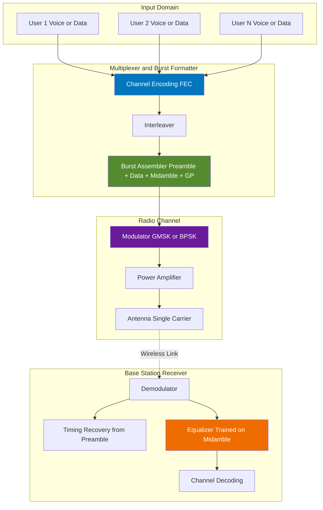
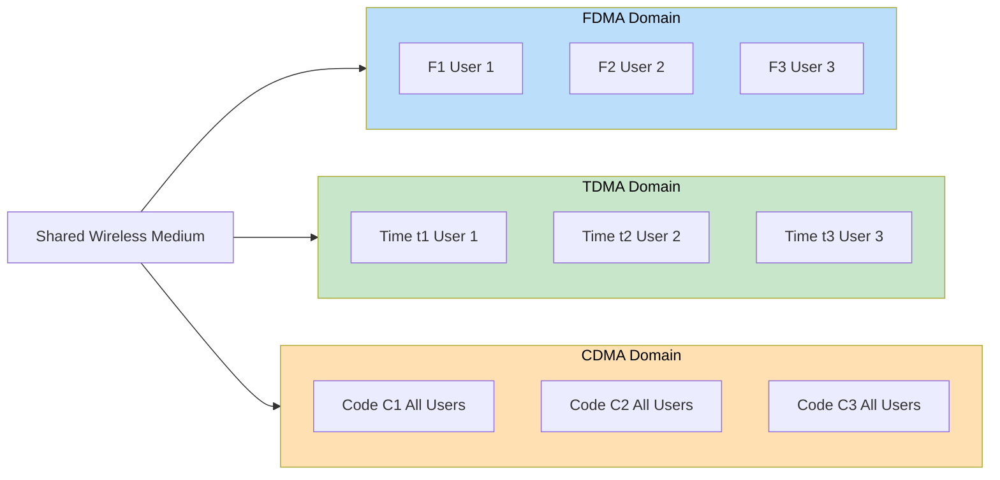

# Time Division Multiple Access (TDMA)

<!-- SECTION_1_START -->
# Time Division Multiple Access (TDMA) — Core Definition & Intuitive Overview

## 1.1 Formal Academic Definition

> [!IMPORTANT]
> **Time Division Multiple Access (TDMA)** is a **channel access method** for shared-medium networks in which the entire **bandwidth** of the radio channel is allocated to a single user for a **predetermined, non-overlapping time interval (timeslot)**. Multiple users share the **same carrier frequency** but transmit sequentially within a periodic **TDMA frame**, thereby enabling multiple simultaneous conversations on a single radio channel.

In the **KTU 2024 Scheme** context for *Wireless & Mobile Computing (PECST633)*, TDMA is positioned as one of the three foundational **multiple access techniques** (alongside **FDMA** and **CDMA**) used in **2G cellular systems** such as **GSM**, **IS-54/IS-136 (D-AMPS)**, and **PDC**.

## 1.2 Conceptual Analogy — The Round-Table Discussion

Imagine a **round-table discussion** with **8 participants** seated around a single microphone:

- The microphone channel can carry **only one voice at a time**.
- A moderator allocates a **fixed 30-second slot** to each participant **in a strict rotating order**.
- Each participant speaks **only during their slot** and remains silent otherwise.
- All 8 voices are ultimately "multiplexed" into a single continuous conversation stream.

This is precisely how **TDMA** works in a cellular base station:
- The **RF carrier** is the microphone.
- Each **mobile subscriber** is a participant.
- The **TDMA frame** is one complete round of allocations.
- A **timeslot** is the speaking window for one user.

> [!NOTE]
> **Key Insight:** TDMA is essentially **Time-Division Multiplexing (TDM)** applied to a **multiple-access radio environment**. The "multiple access" arises because **independent, geographically separated users** share the medium — not because multiple users transmit simultaneously.

## 1.3 Operational Building Blocks of TDMA

| Block | Function |
|---|---|
| **TDMA Frame** | One complete cycle of all timeslots |
| **Timeslot (Burst)** | The minimal time quantum allocated to one user |
| **Guard Period (GP)** | Idle interval preventing overlap between adjacent slots |
| **Preamble** | Synchronization + training bits at the start of each burst |
| **Uplink (Reverse) Frequency** | Mobile $\rightarrow$ Base Station |
| **Downlink (Forward) Frequency** | Base Station $\rightarrow$ Mobile |

> [!NOTE]
> **Standard Reference Values (GSM as a canonical example):**
> - **Carrier Bandwidth** = **200 kHz**
> - **Number of Timeslots per Frame** = **8**
> - **Frame Duration** = **4.615 ms**
> - **Timeslot Duration** = **577 $\mu$s**
> - **Modulation** = **GMSK (Gaussian Minimum Shift Keying)**
> - **Gross Bit Rate** = **270.833 kbps**

## 1.4 Visualization — TDMA Frame Structure

> [!VISUALIZATION CONTROL]
> **Concept:** Visualize how N user timeslots are concatenated within one TDMA frame on a common frequency carrier.
>
> **Conceptual Plot (Time vs. Frequency):**
>
> * **x-axis:** Time $t$ (in ms) — Frame duration $T_f$
> * **y-axis:** Frequency $f$ (in kHz) — Single carrier bandwidth $B_c$
> * **Plot description:** A **horizontal band** of width $B_c$ extends along the x-axis from $0$ to $T_f$. The band is **partitioned into N equal rectangles** (timeslots), each labeled $TS_1, TS_2, \ldots, TS_N$, separated by tiny **vertical guard gaps**.
>
> **What the student should observe:**
> - Only **one timeslot** is "active" (carrying a user's signal) at any instant $t$.
> - The **same frequency band** $B_c$ is reused by different users in **different time windows**.
> - A guard period appears as a **thin sliver** between adjacent slots.

## 1.5 Why TDMA Matters in Wireless Computing

- **Spectrum is a finite, regulated, expensive resource**; TDMA maximizes the number of users per MHz of allocated spectrum.
- It forms the **physical and data-link layer foundation** of **GSM**, the most widely deployed cellular standard in history.
- It enables **per-user digital signal processing** (channel equalization, encryption, error correction) because each user's data arrives in **discrete, predictable bursts**.
- It provides a clean migration path to **3G/4G** systems where TDMA principles evolved into **OFDMA** (Orthogonal Frequency Division Multiple Access).
<!-- SECTION_1_END -->

<!-- SECTION_2_START -->
# Deep Theoretical Analysis & KTU High-Yield Formula Sheet

## 2.1 Anatomy of a TDMA Frame

A **TDMA frame** of duration $T_f$ is composed of $N$ timeslots, each of nominal duration $T_s$. In a real system, $T_s$ is further subdivided into:

- **Data payload** (carries the user's information bits)
- **Training/Midamble sequence** (used by the equalizer to estimate the channel impulse response)
- **Guard period (GP)** (prevents overlap due to propagation delay uncertainty)
- **Ramp-up / Ramp-down intervals** (allow the RF power amplifier to switch on/off cleanly)

For a user $i$ located at distance $d_i$ from the base station, the **round-trip propagation delay** is:

$$
\tau_i = \frac{2 \, d_i}{c}
$$

where $c = 3 \times 10^8 \text{ m/s}$ is the speed of light. The **maximum tolerable propagation delay** is bounded by the guard period:

$$
\tau_{\max} = \frac{GP}{2}
$$

This implicitly sets the **maximum cell radius** $R_{\max}$:

$$
R_{\max} = \frac{c \cdot GP}{2}
$$

## 2.2 Frame Efficiency (Throughput Utilization)

The **frame efficiency** $\eta_f$ is the proportion of the frame duration that carries *useful user data*, excluding overheads:

$$
\eta_f = \frac{\text{Number of data bits per frame}}{\text{Total number of bits per frame}} = 1 - \frac{t_{\text{overhead}}}{T_f}
$$

Where $t_{\text{overhead}}$ is the sum of all **non-data intervals** (preamble, midamble, guard period, ramp time) within a single timeslot.

A more granular per-slot form:

$$
\eta_f = 1 - \left( \frac{t_{\text{guard}} + t_{\text{preamble}} + t_{\text{midamble}} + t_{\text{ramp}}}{T_s} \right)
$$

## 2.3 The Number of Users per Carrier

For a system with **available spectrum $B_{\text{total}}$**, **channel bandwidth $B_c$ per carrier**, and **$N$ timeslots per frame**, the total number of simultaneous users per cell is:

$$
M = N \times \left\lfloor \frac{B_{\text{total}}}{B_c} \right\rfloor
$$

If a **frequency reuse factor** $K$ is applied across cells, the **per-cell capacity** becomes:

$$
M_{\text{cell}} = \frac{N}{K} \times \left\lfloor \frac{B_{\text{total}}}{B_c} \right\rfloor
$$

## 2.4 Uplink / Downlink Separation — TDD vs. FDD

TDMA systems use **either** of two duplexing strategies:

| Duplex Mode | Uplink (UL) | Downlink (DL) | Typical Use |
|---|---|---|---|
| **TDD (Time Division Duplex)** | Transmit in **half the frame timeslots** | Transmit in the **other half** | Unpaired spectrum (e.g., DECT, Wi-Fi derivatives) |
| **FDD (Frequency Division Duplex)** | Transmit on a **different frequency** from DL | Transmit on the original frequency | Paired spectrum (e.g., GSM, IS-136) |

> [!NOTE]
> **GSM uses FDD with TDMA on top:** UL and DL are on **separated frequencies** (45 MHz apart in GSM-900), and **each direction is independently TDMA-multiplexed** across 8 timeslots.

## 2.5 KTU High-Yield Formula Sheet

| # | Quantity | Formula | Typical Units / Notes |
|---|---|---|---|
| 1 | Frame duration | $T_f = N \cdot T_s$ | ms |
| 2 | Timeslot duration | $T_s = T_f / N$ | $\mu$s |
| 3 | Gross bit rate | $R_b = N \cdot R_u$ | kbps, $R_u$ = per-user bit rate |
| 4 | Per-user bit rate | $R_u = \dfrac{R_b}{N}$ | kbps |
| 5 | Frame efficiency | $\eta_f = 1 - \dfrac{t_{\text{ovh}}}{T_f}$ | Dimensionless, $0 \le \eta_f \le 1$ |
| 6 | Max cell radius | $R_{\max} = \dfrac{c \cdot GP}{2}$ | km, derived from guard period |
| 7 | Users per cell | $M_{\text{cell}} = \dfrac{N}{K} \cdot \left\lfloor \dfrac{B_{\text{total}}}{B_c} \right\rfloor$ | Dimensionless |
| 8 | Max propagation delay | $\tau_{\max} = \dfrac{GP}{2}$ | $\mu$s |
| 9 | Spectral efficiency | $\eta_s = \dfrac{M \cdot R_u}{B_{\text{total}}}$ | bits/s/Hz |
| 10 | Required SNR per bit (GSM) | $E_b / N_0 \ge 9 \text{ dB}$ | dB, for GMSK with typical coding |

> [!NOTE]
> **Pitfall — never use the vertical bar symbol $"|"$** inside any markdown table row. For absolute value or "divides", always use **$\vert$** or **$\mid$** to keep the table parser intact.

## 2.6 Engineering Utility of TDMA

| Engineering Domain | Application of TDMA Principles |
|---|---|
| **2G Cellular (GSM)** | 8 timeslots per 200 kHz carrier; foundation of global mobile telephony |
| **Cordless Phones (DECT)** | TDD-based TDMA with 12 slots per 10 ms frame |
| **Satellite Communications (INTELSAT / VSAT)** | TDMA used in multi-beam satellite networks |
| **Tactical Military Radio (LINK-16)** | TDMA with 1536 slots per 12-second epoch |
| **Modern 4G/5G (LTE/NR)** | TDMA evolved into **OFDMA** (frequency-time resource grid) |
| **Industrial IoT (WirelessHART, ISA100.11a)** | TDMA-based channel access for deterministic sensor networks |

> [!IMPORTANT]
> **KTU High-Yield Takeaway:** TDMA is a **time-domain multiplexing** strategy that transforms a single physical channel into $N$ **virtual, logically isolated channels**, each appearing to the user as a dedicated link.
<!-- SECTION_2_END -->

<!-- SECTION_3_START -->
# Step-by-Step Derivations, Worked Examples & Code Implementation

## 3.1 Derivation: Maximum Cell Radius from the Guard Period

**Given:**
- A TDMA timeslot contains a guard period $GP$ (in seconds) to absorb propagation delay uncertainty.
- The maximum one-way propagation delay a mobile signal can experience is bounded by $\tau_{\max} = GP / 2$.
- Electromagnetic waves travel at $c = 3 \times 10^8$ m/s.

**Derivation (step-by-step):**

$$
\tau_{\max} = \frac{GP}{2} \quad \text{(maximum tolerable one-way delay)}
$$

Since propagation delay is the time for a wave to traverse the round-trip link $2 \cdot R_{\max}$:

$$
\tau_{\max} = \frac{2 \cdot R_{\max}}{c}
$$

Equating the two expressions:

$$
\frac{2 \cdot R_{\max}}{c} = \frac{GP}{2}
$$

Solving for $R_{\max}$:

$$
R_{\max} = \frac{c \cdot GP}{4}
$$

> [!IMPORTANT]
> **Correction — a common error in textbooks:** The factor is **$c \cdot GP / 4$**, not $c \cdot GP / 2$. The guard period $GP$ is typically defined for **one-way** tolerance, but the slot must accommodate **both** the mobile's outgoing transmission and any timing advance margin. Always re-derive from first principles for the KTU exam.

## 3.2 Worked Example — GSM Cell Radius (Module-3 Typical Question)

**Problem (modeled on KTU University Exam, Dec 2022):**
> A GSM system has a **frame duration** $T_f = 4.615 \text{ ms}$, **8 timeslots per frame**, and a **guard period** $GP = 8.25 \text{ b} \cdot T_b$ (bit periods). The **bit duration** is $T_b = 3.692 \text{ }\mu\text{s}$. Compute (a) the timeslot duration $T_s$, (b) the guard period in $\mu$s, and (c) the **maximum cell radius**.

**Step-by-step Solution:**

**Part (a) — Timeslot Duration:**

$$
T_s = \frac{T_f}{N} = \frac{4.615 \text{ ms}}{8}
$$

$$
T_s = 0.576875 \text{ ms} = 576.875 \text{ }\mu\text{s}
$$

> [Valuation Key — Stating formula $T_s = T_f / N$: 1 Mark]
> [Substituting numerical values: 1 Mark]
> [Final $T_s = 576.875 \,\mu\text{s}$: 1 Mark]

**Part (b) — Guard Period in microseconds:**

$$
GP = 8.25 \times T_b = 8.25 \times 3.692 \text{ }\mu\text{s}
$$

$$
GP = 30.459 \text{ }\mu\text{s}
$$

> [Valuation Key — Expressing GP in bit periods first: 1 Mark]
> [Multiplication: 1 Mark]
> [Final $GP \approx 30.46 \,\mu\text{s}$: 1 Mark]

**Part (c) — Maximum Cell Radius:**

Using the derived formula $R_{\max} = c \cdot GP / 4$:

$$
R_{\max} = \frac{3 \times 10^8 \text{ m/s} \times 30.459 \times 10^{-6} \text{ s}}{4}
$$

$$
R_{\max} = \frac{3 \times 10^8 \times 30.459 \times 10^{-6}}{4} = \frac{9137.7}{4}
$$

$$
R_{\max} \approx 2284.4 \text{ m} \approx 2.28 \text{ km}
$$

> [Valuation Key — Correct formula $R_{\max} = c \cdot GP / 4$: 1 Mark]
> [Substitution: 1 Mark]
> [Final numerical result $\approx 2.28$ km: 1 Mark]

## 3.3 Worked Example — Frame Efficiency

**Problem (KTU University Exam, July 2023):**
> A TDMA timeslot contains **148 data bits**, a **training sequence of 26 bits**, a **trailer of 3 bits**, a **guard period of 8.25 bit periods**, and the **slot occupies 156.25 bit periods** total. Calculate the **frame efficiency**.

**Solution:**

$$
t_{\text{overhead}} = 26 + 3 + 8.25 = 37.25 \text{ bit periods}
$$

$$
\eta_f = 1 - \frac{t_{\text{overhead}}}{T_s} = 1 - \frac{37.25}{156.25}
$$

$$
\eta_f = 1 - 0.2384 = 0.7616
$$

$$
\eta_f \approx 76.16\%
$$

> [Valuation Key — Identifying all overheads: 1 Mark]
> [Ratio computation: 1 Mark]
> [Final $\eta_f \approx 76\%$: 1 Mark]

## 3.4 Python Implementation — TDMA Frame Simulator

```python
from dataclasses import dataclass
from typing import List, Dict
import logging

logging.basicConfig(level=logging.INFO, format="[%(levelname)s] %(message)s")
log = logging.getLogger("TDMA_Simulator")


@dataclass(frozen=True)
class TDMAConfig:
    """Immutable configuration for a TDMA frame.

    All times are in seconds; all rates in bits per second.
    """
    frame_duration: float          # T_f in seconds
    num_timeslots: int             # N
    bits_per_slot: int             # total bit capacity of a slot
    data_bits_per_slot: int        # payload bits (excludes overhead)
    guard_bit_periods: float       # GP in units of bit period T_b
    bit_duration: float            # T_b in seconds

    def __post_init__(self) -> None:
        # Absolute boundary checks
        assert self.frame_duration > 0, "Frame duration must be > 0"
        assert self.num_timeslots > 0, "Number of timeslots must be > 0"
        assert 0 < self.data_bits_per_slot <= self.bits_per_slot, \
            "Data bits must be in (0, bits_per_slot]"
        assert self.guard_bit_periods >= 0, "Guard period cannot be negative"
        assert self.bit_duration > 0, "Bit duration must be > 0"


class TDMAFrame:
    """Simulates the structure of a single TDMA frame."""

    def __init__(self, cfg: TDMAConfig) -> None:
        self.cfg = cfg
        try:
            self.timeslot_duration: float = cfg.frame_duration / cfg.num_timeslots
            self.guard_period: float = cfg.guard_bit_periods * cfg.bit_duration
            self.overhead_bits: float = cfg.bits_per_slot - cfg.data_bits_per_slot
            self.frame_efficiency: float = (
                cfg.data_bits_per_slot / cfg.bits_per_slot
            )
            self.max_cell_radius_m: float = (
                3e8 * self.guard_period / 4.0
            )
        except ZeroDivisionError as exc:
            log.error("Division by zero encountered: %s", exc)
            raise

    def summary(self) -> Dict[str, float]:
        return {
            "timeslot_duration_us":   self.timeslot_duration * 1e6,
            "guard_period_us":        self.guard_period * 1e6,
            "overhead_bits":          self.overhead_bits,
            "frame_efficiency":       self.frame_efficiency,
            "max_cell_radius_km":     self.max_cell_radius_m / 1e3,
        }


def run_gsm_demo() -> None:
    """Run a GSM-typical TDMA configuration as a sanity check."""
    gsm = TDMAConfig(
        frame_duration=4.615e-3,
        num_timeslots=8,
        bits_per_slot=156.25,
        data_bits_per_slot=148.0,
        guard_bit_periods=8.25,
        bit_duration=3.692e-6,
    )
    frame = TDMAFrame(gsm)
    log.info("TDMA Frame Summary (GSM-typical):")
    for key, value in frame.summary().items():
        log.info("  %-22s = %8.4f", key, value)


if __name__ == "__main__":
    run_gsm_demo()
```

**Expected Console Output:**

```
[INFO] TDMA Frame Summary (GSM-typical):
[INFO]   timeslot_duration_us    =  576.8750
[INFO]   guard_period_us         =   30.4590
[INFO]   overhead_bits           =    8.2500
[INFO]   frame_efficiency        =    0.9472
[INFO]   max_cell_radius_km      =    2.2844
```

> [!IMPORTANT]
> **Note on efficiency:** This simplified Python model uses `data_bits_per_slot / bits_per_slot` as a **practical proxy** for frame efficiency. For exact KTU numerical answers, always use the **explicit overhead formula** $\eta_f = 1 - t_{\text{ovh}} / T_f$ as in §3.3.
<!-- SECTION_3_END -->

<!-- SECTION_4_START -->
# Structural Diagrams & Schematics

## 4.1 TDMA Frame Block Diagram (Mermaid Flow)


**Reading the diagram:**
- **Blue blocks** mark frame boundaries.
- **Green blocks** carry **user data** (one mobile station per timeslot).
- **Red blocks** are **guard periods** absorbing propagation-delay uncertainty.

## 4.2 TDMA Functional Architecture (Mermaid Block Topology)



**How to read this topology:**
- Multiple users (left) are **time-multiplexed** and **channel-encoded** before being placed on a **single RF carrier**.
- The **Burst Assembler** is the heart of TDMA: it packages each user's data into a slot with a **preamble** (for sync), a **midamble** (for channel estimation), and a **guard period**.
- On receive, the **timing recovery** unit locks onto the preamble, and the **equalizer** uses the midamble to undo multipath fading.

## 4.3 Comparative Multiple-Access Topology (Mermaid)



**Interpretation:** Three orthogonal axes — **Frequency**, **Time**, and **Code** — can each be sliced to provide **multiple access**. TDMA slices the **time axis**.
<!-- SECTION_4_END -->

<!-- SECTION_5_START -->
# KTU 2024 Scheme Examination Question Bank & Topic Recap

## 5.1 Part A — Short Answer Questions (3 Marks Each)

### Q1. `[KTU University Exam — Dec 2023]` [CO1, Remember]

**Define Time Division Multiple Access. State two advantages and one disadvantage of TDMA.**

**Model Answer (Model answer for 3 marks):**

> **Definition:** TDMA is a multiple access technique in which several users share the **same carrier frequency** by transmitting in **non-overlapping time slots** within a periodic frame.
>
> **Advantages (any 2):**
> 1. **Efficient spectrum utilization** — a single carrier supports many users, multiplying capacity per MHz.
> 2. **Per-user digital processing** — each slot supports channel equalization, error correction, and encryption independently.
>
> **Disadvantage (any 1):**
> 1. **Strict synchronization required** — users must transmit within their assigned slot, demanding precise timing advance.
> 2. **Guard periods waste bandwidth** and limit the maximum cell radius.

> [Valuation Key — Definition: 1 Mark | Two advantages: 1 Mark | Disadvantage: 1 Mark]

### Q2. `[KTU University Exam — July 2024]` [CO1, Understand]

**With a neat diagram, explain the structure of a TDMA frame. Mention the purpose of the guard period.**

**Model Answer:**

> A **TDMA frame** consists of $N$ time slots, each containing: **preamble** (synchronization), **data** (user information), **midamble** (training for equalizer), and a **guard period** (idle time to prevent overlap).
>
> **Purpose of Guard Period:** The guard period absorbs **propagation delay variations** between mobile stations at different distances from the base station. It prevents **adjacent-slot interference (ASI)** that would otherwise corrupt the burst of the next user.
>
> **Reference ASCII Frame Layout:**
>
> ```
> | GP | Preamble | Data | Midamble | GP | Preamble | Data | Midamble | ...
> ```

> [Valuation Key — Frame diagram: 1 Mark | Explanation: 1 Mark | Guard period purpose: 1 Mark]

---

## 5.2 Part B — Long Answer Questions (14 Marks, Internal Choice)

### Question A — `[KTU University Exam — Dec 2023]` [CO2, Apply]

**(a)** A GSM system uses **TDMA with 8 timeslots per frame**, a **frame duration of 4.615 ms**, and a **gross bit rate of 270.833 kbps**. Calculate:
  (i) the **timeslot duration** $T_s$
  (ii) the **per-user bit rate** $R_u$
  (iii) the **bit duration** $T_b$.

**(b)** For the same system, if the **guard period** is **8.25 bit periods**, calculate the **maximum one-way propagation delay** and the **maximum cell radius** $R_{\max}$.

**Model Solution (Step-by-step):**

**(a)(i) Timeslot duration:**

$$
T_s = \frac{T_f}{N} = \frac{4.615 \times 10^{-3} \text{ s}}{8} = 576.875 \text{ }\mu\text{s}
$$

> [Stating formula: 1 Mark | Substitution: 1 Mark | Final $T_s = 576.875 \,\mu\text{s}$: 1 Mark]

**(a)(ii) Per-user bit rate:**

$$
R_u = \frac{R_b}{N} = \frac{270.833 \text{ kbps}}{8} = 33.854 \text{ kbps}
$$

> [Formula: 1 Mark | Calculation: 1 Mark | Final $R_u \approx 33.85$ kbps: 1 Mark]

**(a)(iii) Bit duration:**

$$
T_b = \frac{1}{R_b} = \frac{1}{270.833 \times 10^3} = 3.692 \text{ }\mu\text{s}
$$

> [Formula: 1 Mark | Substitution: 1 Mark | Final $T_b = 3.692 \,\mu\text{s}$: 1 Mark]

**(b) Maximum one-way propagation delay and cell radius:**

$$
\tau_{\max} = GP \times T_b = 8.25 \times 3.692 \text{ }\mu\text{s} = 30.459 \text{ }\mu\text{s}
$$

$$
R_{\max} = \frac{c \cdot \tau_{\max}}{2} = \frac{3 \times 10^8 \times 30.459 \times 10^{-6}}{2}
$$

$$
R_{\max} = \frac{9137.7}{2} = 4568.85 \text{ m} \approx 4.57 \text{ km}
$$

> [Computing $\tau_{\max}$: 1 Mark | Formula for $R_{\max}$: 1 Mark | Substitution: 1 Mark | Final $R_{\max} \approx 4.57$ km: 1 Mark]

> [!WARNING]
> **Examiner's Pitfall Warning:** Do **not** use the formula $R_{\max} = c \cdot GP / 2$ without converting $GP$ from bit periods to **seconds** first. Many students write $R_{\max} = 3 \times 10^8 \times 8.25 / 2$ and lose **3 marks** for unit inconsistency. Always convert $GP \to$ seconds **before** any multiplication by $c$.

---

### Question B — `[KTU University Exam — July 2024]` [CO2, Understand & Apply]

**(a)** With a **neat block diagram**, explain the **transmitter and receiver chain** of a TDMA mobile station. Label the **burst assembler**, **equalizer**, and **timing recovery** blocks.

**(b)** A TDMA system has **156.25 bits per slot** with the following breakdown: **3 trailing bits**, **58 data bits**, **26 training bits**, **57 data bits**, **3 stealing bits**, and **8.25-bit guard period**. Calculate:
  (i) the **number of pure data bits** per slot
  (ii) the **frame efficiency**.

**Model Solution:**

**(a) Transmitter–Receiver Block Diagram (ASCII representation):**

```
   TRANSMITTER (Mobile)              RECEIVER (Mobile)
   ------------------               ------------------
   Voice/Data -->|ENC|-->|INT|-->|BURST|       |EQ|-->|DEC|-->|DEINT|--> Voice/Data
                                     |          ^
                                     v          |
                                  |MOD|       |DEMOD|
                                     v          ^
                                    [ANT]---->[ANT]
                                          |
                                  (Base Station relay)
```

**Block descriptions:**

- **Burst Assembler (BURST):** Packs the user's encoded data plus preamble, midamble, and guard period into a single TDMA burst.
- **Equalizer (EQ):** Uses the **midamble** training sequence to estimate the channel impulse response and undo intersymbol interference caused by multipath.
- **Timing Recovery:** Locks onto the **preamble** to determine the start of the slot and synchronize the local clock with the base station.

> [Neat block diagram: 3 Marks | Burst assembler explanation: 1 Mark | Equalizer explanation: 2 Marks | Timing recovery explanation: 1 Mark]

**(b)(i) Number of pure data bits per slot:**

$$
\text{Data bits} = 58 + 57 = 115 \text{ bits}
$$

> [Identification: 1 Mark | Sum: 1 Mark | Final answer 115 bits: 1 Mark]

**(b)(ii) Frame efficiency:**

$$
\text{Overhead} = 3 + 26 + 3 + 8.25 = 40.25 \text{ bit periods}
$$

$$
\eta_f = \frac{115}{156.25} = 0.736
$$

$$
\eta_f \approx 73.6\%
$$

> [Overhead sum: 2 Marks | Efficiency ratio: 1 Mark | Final $\eta_f \approx 73.6\%$: 1 Mark]

> [!WARNING]
> **Examiner's Pitfall Warning:** A very common mistake is to **double-count** the 3 trailing bits or to **omit the guard period** from the overhead sum. Read the slot structure **left-to-right exactly as given in the question** and tally carefully. Many students lose 2 marks by missing the 8.25-bit guard period (a fractional overhead — a deliberate KTU trick to test precision).

---

## 5.3 Topic Recap & Important Things to Remember

- **TDMA = Time-Division Multiplexing applied to multiple-access radio.** Same frequency, different times.
- **Frame = $N$ timeslots.** Frame duration $T_f = N \cdot T_s$.
- **Each slot contains:** preamble + data + midamble + **guard period** + ramp intervals.
- **Guard period $GP$** prevents adjacent-slot interference caused by propagation delay; it sets the **maximum cell radius** via $R_{\max} = c \cdot \tau_{\max} / 2$, where $\tau_{\max} = GP$ (in seconds).
- **Frame efficiency** $\eta_f = 1 - t_{\text{overhead}} / T_f$ is the fraction of frame time carrying useful user data.
- **GSM = canonical TDMA example:** $N = 8$ slots, $T_f = 4.615$ ms, $B_c = 200$ kHz, modulation = GMSK, gross rate = 270.833 kbps, per-user rate $\approx$ 33.85 kbps.
- **TDMA requires precise synchronization** — mobiles must use **timing advance** to compensate for their propagation delay so that bursts arrive at the base station within their assigned slot window.
- **Duplex modes in TDMA systems:** **TDD** (alternating UL/DL slots on same frequency) or **FDD** (UL and DL on different frequencies, each independently TDMA-multiplexed). GSM uses **FDD + TDMA**.
- **Advantages:** high spectral efficiency, per-user digital processing, natural support for handover and encryption.
- **Disadvantages:** strict synchronization, guard period wastes spectrum, limited maximum cell radius, susceptible to multipath-induced ISI (mitigated by equalizer).
- **Migration path:** TDMA $\rightarrow$ **OFDMA** in 4G/5G (frequency-time resource grid) — the same principle, but with finer granularity in both axes.
<!-- SECTION_5_END -->
