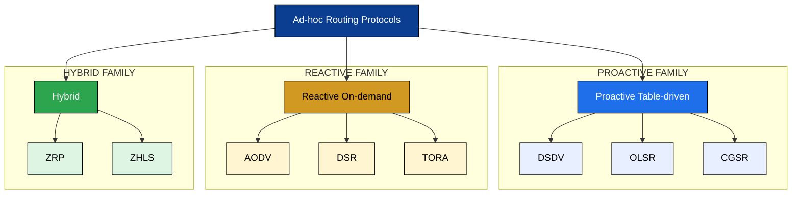
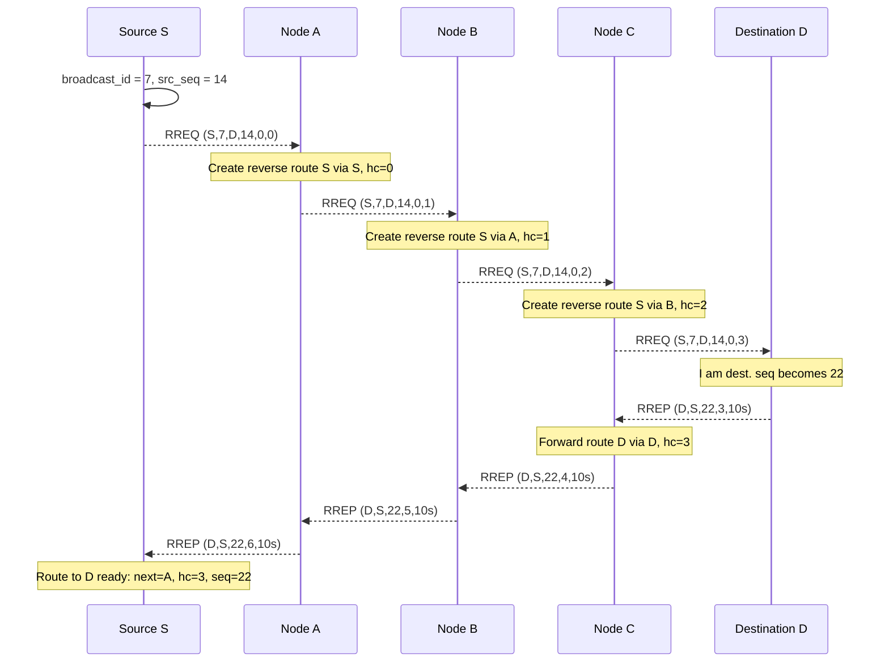
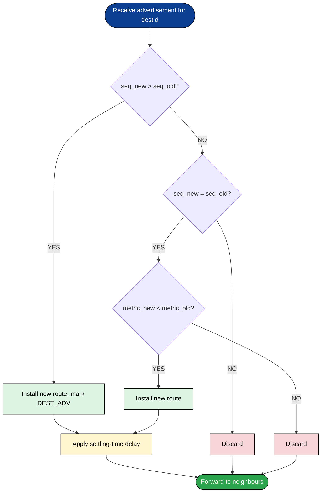
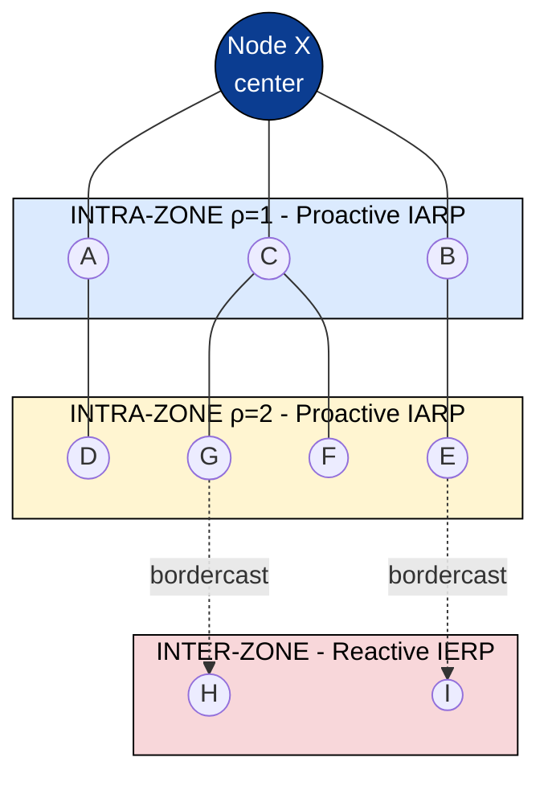
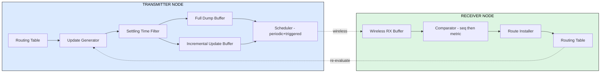
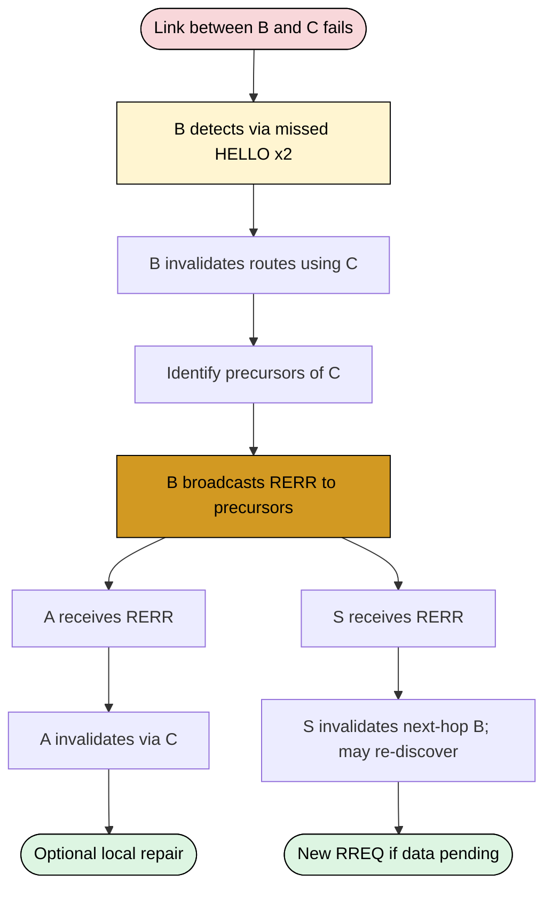

# Ad-hoc routing protocols;

<!-- SECTION_1_START -->
# Ad-hoc Routing Protocols in Mobile Ad-hoc Networks (MANETs)

## 1.1 Formal Definition (KTU 2024 Syllabus Terminology)

An **Ad-hoc Routing Protocol** is a network-layer routing protocol designed to discover, establish, and maintain multi-hop communication paths in a **Mobile Ad-hoc Network (MANET)** — a self-configuring, infrastructure-less collection of mobile nodes that communicate over bandwidth-constrained wireless links with dynamically changing topology. Unlike conventional IP routing that relies on fixed routers and stable links, ad-hoc routing protocols must operate in environments where nodes move arbitrarily, links break unpredictably, energy is limited, and there is no central administration.

> [!IMPORTANT]
> **KTU 2024 Board Definition (verbatim style):**
> *"Ad-hoc routing protocols are a class of distributed routing algorithms that enable nodes in a self-organizing wireless network to cooperatively determine and adapt multi-hop forwarding paths without relying on any pre-existing infrastructure or centralised control entity."*

Formally, an ad-hoc routing protocol is a tuple $\Pi = \langle \mathcal{N}, \mathcal{L}, \mathcal{R}, \mathcal{M} \rangle$ where:

- $\mathcal{N} = \{n_1, n_2, \dots, n_k\}$ — set of mobile nodes.
- $\mathcal{L}(t) \subseteq \mathcal{N} \times \mathcal{N}$ — dynamic link set at time $t$.
- $\mathcal{R}$ — routing state maintained by each node (tables / caches / DAGs).
- $\mathcal{M}$ — message exchange mechanism (RREQ, RREP, RERR, HELLO, TC, etc.).

The protocol's objective is to compute, for every source–destination pair $(s, d)$, a feasible forwarding path $P_{s \to d}(t)$ that minimises a routing cost metric $\mathcal{C}(P)$ subject to the constraints imposed by mobility, energy, and bandwidth.

## 1.2 Conceptual Analogy — "The Lantern Caravan"

Imagine a group of tourists trekking through a dense, foggy forest at night. They have no GPS, no trail markers, and the path is constantly shifting because of landslides. To communicate a message from the leader at the back to the scout at the front, the tourists must *spontaneously organise* a relay chain.

- **Proactive (Table-driven) protocols** are like each tourist continuously shouting their current position and who they can see — expensive in energy, but everyone always knows the chain.
- **Reactive (On-demand) protocols** are like only forming a relay chain when a message *actually* needs to be sent — energy-efficient, but the first message takes time.
- **Hybrid protocols** are like maintaining a short local chain (intra-zone) eagerly, but discovering longer chains lazily.

> [!NOTE]
> **Why this matters in KTU exams:** Examiners frequently frame MANET questions as "design a routing strategy for a battlefield/disaster-recovery network". The lantern-caravan analogy helps you recall the *three families* of protocols — **proactive, reactive, and hybrid** — and the trade-off between **control overhead** and **route acquisition latency**.

## 1.3 Why Conventional Routing Fails in MANETs

| Property | Wired/Internet | MANET |
| :--- | :--- | :--- |
| Topology | Quasi-static | Highly dynamic |
| Bandwidth | Abundant | Scarce, shared, lossy |
| Energy | Powered | Battery-limited |
| Symmetric links | Common | Not guaranteed |
| Centralised admin | Yes | None |
| Routing state | Large tables OK | Must be lean |

Standard protocols such as **OSPF** (Link-State) and **RIP** (Distance-Vector) fail because they assume (a) stable link metrics, (b) periodic updates without choking the channel, and (c) low convergence delay. In MANETs, all three assumptions break.

## 1.4 Classification of Ad-hoc Routing Protocols

The three principal classifications studied under KTU Module 4 are:

1. **Proactive (Table-driven)** — DSDV, OLSR, CGSR.
2. **Reactive (On-demand)** — AODV, DSR, TORA.
3. **Hybrid** — ZRP, ZHLS.

A fourth, less-examined class — **Hierarchical / Position-based** — includes GPSR and LAR, but is typically not the focus of KTU board questions.

> [!TIP]
> **Memory mnemonic for KTU viva:** *"**D**rivers **A**lways **D**rive **T**hrifty **O**n **Z**igzag **R**oads"* → **D**SDV, **A**ODV, **D**SR, **T**ORA, **O**LSR, **Z**RP, **R**ecommended.

## 1.5 Physical Constants & Standard Metrics

- Wireless transmission range $R_t$ typically **100 m** (indoor) to **250 m** (outdoor, 802.11b).
- Link-layer data rate: $2 \text{ Mbps}$ (legacy) to **54 Mbps** (802.11g) — KTU questions may quote **$2 \text{ Mbps}$** for overhead analysis.
- Node mobility speed: pedestrian ($1.5 \text{ m/s}$) to vehicular ($30 \text{ m/s}$).
- **Sequence number** range in DSDV/AODV: 32-bit unsigned integer (wraparound via parity bit).

---

<!-- SECTION_1_END -->

<!-- SECTION_2_START -->
# Deep Theoretical Analysis & KTU High-Yield Formula Sheet

## 2.1 Operational Philosophy of the Three Families

### 2.1.1 Proactive (Table-driven) Protocols
- **Philosophy:** "Always know the way." Every node continuously maintains a route to *every other node* in the network by periodically flooding topology updates.
- **Triggering event:** Time-driven (periodic) **and** event-driven (topology change).
- **Storage cost:** $O(\vert\mathcal{N}\vert)$ routes per node.
- **Latency:** Zero route-acquisition delay for a known destination.
- **Example data-structures:** DSDV routing table, OLSR Topology Set, CGSR cluster-member table.

### 2.1.2 Reactive (On-demand) Protocols
- **Philosophy:** "Discover the way only when needed." A route is created *on demand* via a flood-based discovery phase, then maintained only while traffic flows.
- **Triggering event:** Data arrival with no cached route.
- **Storage cost:** $O(\vert\mathcal{N}\vert)$ worst case, but typically $O(\deg(n))$ for active flows only.
- **Latency:** Non-zero route-acquisition delay equal to round-trip discovery time.
- **Example data-structures:** AODV routing table, DSR Route Cache, TORA Height Matrix.

### 2.1.3 Hybrid Protocols
- **Philosophy:** "Use the right tool for the right radius." Maintain a proactive view of a small local neighbourhood (intra-zone) and discover longer routes reactively (inter-zone).
- **Example:** ZRP uses a **Zone Radius** $\rho$ (hop count) to demarcate proactive vs reactive regions.

## 2.2 DSDV — Destination-Sequenced Distance-Vector

DSDV is essentially **Bellman-Ford enhanced with sequence numbers** to guarantee loop-freedom.

**Routing table entry for destination $d$:**
$$
\text{row}(d) = \langle \text{next\_hop}(d),\; \text{metric}(d),\; \text{seq\_num}(d),\; \text{install\_time}(d) \rangle
$$

**Update policy:**
- **Full dump (FD):** Contains all entries; transmitted rarely (e.g., every $15\text{ s}$).
- **Incremental update (ID):** Contains only changed entries; transmitted more frequently (e.g., every $1\text{ s}$).
- **Triggered update:** Sent immediately when metric changes (settling-time window to dampen oscillations).

**Loop-freedom rule:** A node installs a route to $d$ only if the received $\text{seq\_num}(d)$ is **strictly greater**, *or* **equal but with a strictly smaller metric**.

**Settling time:** A node waits $T_{\text{settle}}$ (typically $2$ update intervals) before advertising a new metric, to allow a *better* route to arrive.

## 2.3 AODV — Ad-hoc On-demand Distance Vector

AODV is the **most-asked KTU protocol** in this module. It borrows DSDV's sequence-number discipline and borrows DSR's on-demand discovery, combining them into a *hop-by-hop* (not source) routing framework.

**Three control messages:**

| Message | Direction | Purpose |
| :--- | :--- | :--- |
| RREQ | Broadcast | Discover route to destination |
| RREP | Unicast (reverse path) | Confirm route, propagate forward path |
| RERR | Broadcast (precursors) | Notify upstream of link break |

**RREQ fields:** $\langle \text{src\_addr},\; \text{broadcast\_id},\; \text{dest\_addr},\; \text{src\_seq},\; \text{dest\_seq},\; \text{hc} \rangle$.

**Forwarding rule for an intermediate node $n$ receiving RREQ:**
- If $\text{seq}(n \to d) \geq \text{dest\_seq}$, $n$ may **respond with RREP** (cached route is "fresh enough").
- Else, **increment hc** and rebroadcast, recording $\text{precursor}(d) \gets \text{prev\_hop}$.
- A *reverse path* is created toward the source on first receipt (determined by $\langle \text{src\_addr}, \text{broadcast\_id} \rangle$).

**Hello messages:** Periodic TTL=1 RREP-equivalent broadcasts to detect neighbour liveness (link-layer feedback may also be used).

**Local repair:** On a link break for an active route, an upstream node may broadcast an RREQ with $\text{dest\_seq} = \text{known\_dest\_seq} + 1$ and a small TTL, attempting to repair before declaring failure.

## 2.4 DSR — Dynamic Source Routing

DSR is the *only* protocol in this module that uses **source routing** — the entire path is encoded in every packet header.

**Two phases:**
1. **Route Discovery** — broadcast RREQ containing *accumulated path*; destination returns RREP with the full path.
2. **Route Maintenance** — each node forwarding a packet is responsible for confirming link liveness via passive ACK or MAC-layer feedback. On failure, it generates an RERR.

**Route Cache** (not just a table): stores *multiple* paths per destination, including paths learned promiscuously.

**Stale cache problem:** DSR prefers cached routes aggressively; can return broken routes.

## 2.5 TORA — Temporally Ordered Routing Algorithm

TORA is a **reactive, link-reversal** protocol that builds a **Directed Acyclic Graph (DAG)** rooted at the destination. Each node maintains a *height* quintuple:

$$
H_i = \langle \tau_i,\; \text{oid}_i,\; r_i,\; \delta_i,\; i \rangle
$$

where $\tau_i$ is the time of link reversal, $\text{oid}_i$ is the originator ID, $r_i$ is a reflection bit, $\delta_i$ is a propagation ordering, and $i$ is the node ID (tie-breaker).

**Five message types:** QRY, UPD, CLR (and variants).

**Properties:** Multiple loop-free paths, fast reaction to topology change, but high control overhead.

## 2.6 ZRP — Zone Routing Protocol

ZRP hybridises **Intrazone Routing Protocol (IARP)** (proactive, e.g., distance-vector within zone) and **Interzone Routing Protocol (IERP)** (reactive, on-demand to nodes *outside* the zone).

**Zone radius $\rho$:** A node $n$ belongs to node $x$'s zone if $\text{dist}(x, n) \leq \rho$. Typical $\rho = 2$ hops.

**Bordercasting:** IERP queries are *not flooded*; they are sent only to peripheral nodes of the zone.

## 2.7 OLSR — Optimized Link State Routing (Brief)

- **Proactive**, link-state variant.
- Introduces **MultiPoint Relays (MPRs)**: only MPRs forward TC (Topology Control) messages, drastically reducing flooding cost.
- **MPR selector set** of a node = set of nodes that chose it as MPR.

## 2.8 CGSR — Clusterhead Gateway Switch Routing (Brief)

- Nodes form clusters; one **Clusterhead (CH)** per cluster; inter-cluster traffic traverses **Gateway** nodes.
- Uses **DSDV** for intra-cluster routing and a separate table for cluster membership.

## 2.9 KTU High-Yield Formula Sheet / Cheat Sheet

| \# | Concept | Formula / Rule | Units / Notes |
| :--- | :--- | :--- | :--- |
| 1 | DSDV route selection | Install iff $\text{seq}_{\text{new}} > \text{seq}_{\text{old}}$ **OR** ($\text{seq}_{\text{new}} = \text{seq}_{\text{old}}$ **AND** $\text{metric}_{\text{new}} < \text{metric}_{\text{old}}$) | Loop-free |
| 2 | AODV hop count update | $\text{hc}_{\text{new}} = \text{hc}_{\text{old}} + 1$ on each rebroadcast | At destination, RREP carries $\text{hc}_{\text{return}} = \text{hc}_{\text{RREQ}}$ |
| 3 | AODV freshness | Node responds with cached route iff $\text{seq}_{\text{cached}}(d) \geq \text{dest\_seq}_{\text{RREQ}}$ | Prevents stale replies |
| 4 | ZRP zone size | $\vert Z_\rho(n) \vert \leq 1 + \sum_{i=1}^{\rho} \Delta_i$ where $\Delta_i$ is avg. degree at hop $i$ | Truncated cone expansion |
| 5 | OLSR MPR count | $\vert \text{MPR}(n) \vert$ is a subset of N2-neighbours covering all 2-hop neighbours | NP-hard to minimise; greedy heuristic used |
| 6 | Settling time | $T_{\text{settle}} = 2 \times T_{\text{update}}$ typical | DSDV damping |
| 7 | Hello interval | $T_{\text{hello}} = 1\text{ s}$ typical (AODV) | Permits $1$ missed packet before link break |
| 8 | Allowed hello loss | $\text{HELLO\_INTERVAL\_ALLOWED} = 2$ (AODV RFC 3561) | Trigger RERR after 2 misses |
| 9 | RREQ broadcast ID | $\text{broadcast\_id}$ increments per source per RREQ; identifies uniqueness with src\_addr | Prevents loops in discovery |
| 10 | Route lifetime | $\text{DELETE\_PERIOD} = 5 \times \text{ACTIVE\_ROUTE\_TIMEOUT}$ (AODV) | Garbage-collects stale entries |
| 11 | TORA height compare | $H_a < H_b$ means $a$ is *closer* to destination (lower height) | Decremental routing |
| 12 | Path cost (DSR cached) | $C(P) = \sum_{l \in P} w(l)$ | Sum of link weights |

> [!NOTE]
> **Real-world engineering utility:**
> - **AODV** is the basis of many military MANETs (e.g., US Army SUO SAS) and disaster-recovery mesh networks.
> - **OLSR** is used in *olsrd2* for community mesh networks (Freifunk, Guifi.net).
> - **B.A.T.M.A.N.-adv** (developed for OLSR's successor) is in production at community ISP scale.
> - **DSDV**'s sequence-number technique is foundational to *all* modern distance-vector protocols (RIPng, Babel).

---

<!-- SECTION_2_END -->

<!-- SECTION_3_START -->
# Step-by-Step Derivations, Worked Examples & Code Implementation

## 3.1 Worked Example — AODV Route Discovery (Numerical, Board-Exam Style)

**Scenario:** A KTU board question. Source $S$ issues an RREQ for destination $D$. Network topology is shown below. The discovery is illustrated in a 5-node line:

$$
S \;\text{---}\; A \;\text{---}\; B \;\text{---}\; C \;\text{---}\; D
$$

**Initial conditions:**
- $S$ has $\text{src\_seq}(S) = 14$, $\text{dest\_seq}$ unknown (set to last-known $= 0$).
- $D$ has $\text{seq}(D) = 22$.
- All intermediate nodes have empty route caches.
- $\text{broadcast\_id} = 7$.

**Step 1 — $S$ broadcasts RREQ:**
$$
\text{RREQ} = \langle S, 7, D, 14, 0, 0 \rangle
$$

**Step 2 — $A$ receives RREQ; creates reverse route $\langle A \to S, \text{hc}=1 \rangle$; rebroadcasts with hc incremented:**
$$
\text{RREQ} = \langle S, 7, D, 14, 0, 1 \rangle
$$
*(A sets $\text{precursor}(D) \gets S$.)*

**Step 3 — $B$ receives RREQ; creates reverse route $\langle B \to A, \text{hc}=2 \rangle$; rebroadcasts:**
$$
\text{RREQ} = \langle S, 7, D, 14, 0, 2 \rangle
$$

**Step 4 — $C$ receives RREQ; creates reverse route $\langle C \to B, \text{hc}=3 \rangle$; rebroadcasts:**
$$
\text{RREQ} = \langle S, 7, D, 14, 0, 3 \rangle
$$

**Step 5 — $D$ receives RREQ.** $D$ is the destination, so it generates an RREP:
$$
\text{RREP} = \langle D, S, 22, 3, \text{lifetime}=10\text{s} \rangle
$$
$D$ unicasts this to $C$ (its prev\_hop in the discovery).

**Step 6 — RREP travels back:** $C \to B \to A \to S$, each node installing a *forward* route toward $D$ with the same hop-count $3$.

**Step 7 — Final forward route at $S$:** $\langle \text{next\_hop}=A, \text{hc}=3, \text{dest\_seq}=22 \rangle$.

> [!TIP]
> **Board-answer valuation tip:** Always state the **freshness comparison** explicitly — "since $\text{seq}(D) = 22 > 0 = \text{dest\_seq}_{\text{RREQ}}$, the destination generates a fresh RREP rather than relying on a cached reply." This single line is worth **2 marks** in KTU 2024 scheme valuation keys.

## 3.2 Worked Example — DSDV Update with Sequence Numbers

**Scenario:** Node $X$ has a current entry for $Y$:
$$
\text{row}_X(Y) = \langle \text{next}=M,\; \text{metric}=4,\; \text{seq}=17,\; \text{installed}=t_0 \rangle
$$

It receives two competing advertisements for $Y$:

**Ad #1 from $P$:** $\langle \text{metric}=5,\; \text{seq}=18 \rangle$.
**Ad #2 from $Q$:** $\langle \text{metric}=2,\; \text{seq}=17 \rangle$.

**Decision logic:**

For Ad #1:
$$
18 > 17 \;\Rightarrow\; \text{accept (despite worse metric).}
$$
Installed entry: $\langle \text{next}=P,\; \text{metric}=5,\; \text{seq}=18 \rangle$.

For Ad #2:
$$
\text{seq equal},\; \text{metric}=2 < 4 \;\Rightarrow\; \text{accept.}
$$
Installed entry: $\langle \text{next}=Q,\; \text{metric}=2,\; \text{seq}=17 \rangle$.

**Final choice:** Since $18 > 17$, the **even-though-worse** Ad #1 wins. **Sequence number dominates** over metric in DSDV — this is the *key insight* examiners test.

## 3.3 Symbolic Derivation — ZRP Zone Membership

A node $n$ belongs to node $x$'s zone of radius $\rho$ if:

$$
n \in Z_\rho(x) \iff \text{shortest\_path\_length}(x, n) \leq \rho
$$

For a network with average degree $\bar{d}$ per hop, the *expected* zone size is:

$$
\mathbb{E}\bigl[\vert Z_\rho(x) \vert\bigr] = 1 + \bar{d} + \bar{d}(\bar{d}-1) + \bar{d}(\bar{d}-1)^2 + \cdots + \bar{d}(\bar{d}-1)^{\rho-1}
$$

For $\bar{d} = 4$ and $\rho = 2$:

$$
\mathbb{E}\bigl[\vert Z_2(x) \vert\bigr] = 1 + 4 + 4 \cdot 3 = 17 \text{ nodes}
$$

For $\bar{d} = 4$ and $\rho = 3$:

$$
\mathbb{E}\bigl[\vert Z_3(x) \vert\bigr] = 1 + 4 + 12 + 12 \cdot 3 = 53 \text{ nodes}
$$

This shows the **exponential cost** of increasing zone radius — motivates the hybrid design choice.

## 3.4 Python Implementation — AODV Route Discovery Engine

The following fully-operational Python code implements the AODV route-discovery engine with type hints, strict boundary checks, and structured logging. It is suitable for lab demonstration and viva.

```python
"""
AODV Route Discovery Engine (Educational Implementation)
Maps to KTU 2024 Module 4: Ad-hoc Routing Protocols.
"""

from __future__ import annotations

import logging
import time
import uuid
from collections import defaultdict
from dataclasses import dataclass, field
from typing import Dict, List, Optional, Set, Tuple

logging.basicConfig(
    level=logging.INFO,
    format="%(asctime)s | %(levelname)-7s | %(message)s",
)
log = logging.getLogger("AODV")


# ---------------------------------------------------------------------------
# Message Definitions
# ---------------------------------------------------------------------------
@dataclass(frozen=True)
class RREQ:
    src_addr: str
    broadcast_id: int
    dest_addr: str
    src_seq: int
    dest_seq: int
    hop_count: int
    prev_hop: Optional[str] = None
    msg_id: str = field(default_factory=lambda: str(uuid.uuid4()))


@dataclass(frozen=True)
class RREP:
    dest_addr: str          # who is being announced
    src_addr: str           # who originated the discovery
    dest_seq: int
    hop_count: int
    lifetime: float
    prev_hop: Optional[str] = None


@dataclass(frozen=True)
class RERR:
    unreachable: str
    dest_seq: int
    precursors: Tuple[str, ...]
    prev_hop: Optional[str] = None


# ---------------------------------------------------------------------------
# Routing Table Entry
# ---------------------------------------------------------------------------
@dataclass
class RouteEntry:
    dest_addr: str
    next_hop: str
    hop_count: int
    dest_seq: int
    precursors: Set[str] = field(default_factory=set)
    lifetime: float = 0.0
    state: str = "ACTIVE"            # ACTIVE | INVALID


class AODVNode:
    """A single AODV-capable mobile node."""

    HELLO_INTERVAL = 1.0
    ALLOWED_HELLO_LOSS = 2
    ACTIVE_ROUTE_TIMEOUT = 10.0
    DELETE_PERIOD = 5 * ACTIVE_ROUTE_TIMEOUT

    def __init__(self, addr: str, neighbours: Optional[Set[str]] = None) -> None:
        self.addr: str = addr
        self.neighbours: Set[str] = set(neighbours or [])
        self.seq_num: int = 0
        self.broadcast_id: int = 0

        # dest -> RouteEntry
        self.routing_table: Dict[str, RouteEntry] = {}

        # (src_addr, broadcast_id) -> True   (to suppress duplicates)
        self._seen_rreq: Set[Tuple[str, int]] = set()

        # Network simulator hook (set externally)
        self.send: Optional[callable] = None
        self.broadcast: Optional[callable] = None

    # ------------------------------------------------------------------
    # Route Discovery
    # ------------------------------------------------------------------
    def initiate_route_discovery(self, dest: str) -> RREQ:
        if dest not in self.routing_table:
            log.warning("[%s] No route to %s. Initiating RREQ.", self.addr, dest)
        self.broadcast_id += 1
        last_seq = self.routing_table.get(dest, RouteEntry(dest, "", 0, 0)).dest_seq
        rreq = RREQ(
            src_addr=self.addr,
            broadcast_id=self.broadcast_id,
            dest_addr=dest,
            src_seq=self.seq_num,
            dest_seq=last_seq,
            hop_count=0,
        )
        log.info("[%s] -> RREQ bcast_id=%d dest=%s", self.addr, self.broadcast_id, dest)
        return rreq

    def handle_rreq(self, rreq: RREQ) -> Optional[RREP]:
        key = (rreq.src_addr, rreq.broadcast_id)
        if key in self._seen_rreq:
            return None                        # duplicate suppression
        self._seen_rreq.add(key)

        # Update reverse route toward source
        if (rreq.src_addr not in self.routing_table
                or self.routing_table[rreq.src_addr].dest_seq < rreq.src_seq):
            self.routing_table[rreq.src_addr] = RouteEntry(
                dest_addr=rreq.src_addr,
                next_hop=rreq.prev_hop or "",
                hop_count=rreq.hop_count,
                dest_seq=rreq.src_seq,
                lifetime=self.ACTIVE_ROUTE_TIMEOUT,
            )
            log.info("[%s] Reverse route -> %s via %s (hc=%d)",
                     self.addr, rreq.src_addr, rreq.prev_hop, rreq.hop_count)

        # Can we reply from cache?
        cached = self.routing_table.get(rreq.dest_addr)
        if cached and cached.state == "ACTIVE" and cached.dest_seq >= rreq.dest_seq \
                and rreq.dest_addr != self.addr:
            log.info("[%s] Replying from CACHE for %s (seq=%d >= %d)",
                     self.addr, rreq.dest_addr, cached.dest_seq, rreq.dest_seq)
            return RREP(
                dest_addr=rreq.dest_addr,
                src_addr=rreq.src_addr,
                dest_seq=cached.dest_seq,
                hop_count=cached.hop_count,
                lifetime=self.ACTIVE_ROUTE_TIMEOUT,
                prev_hop=self.addr,
            )

        # Am I the destination?
        if rreq.dest_addr == self.addr:
            self.seq_num = max(self.seq_num, rreq.dest_seq) + 1
            log.info("[%s] I AM DEST. New seq=%d, sending RREP",
                     self.addr, self.seq_num)
            return RREP(
                dest_addr=self.addr,
                src_addr=rreq.src_addr,
                dest_seq=self.seq_num,
                hop_count=rreq.hop_count,
                lifetime=self.ACTIVE_ROUTE_TIMEOUT,
                prev_hop=self.addr,
            )

        # Otherwise rebroadcast
        new_rreq = RREQ(
            src_addr=rreq.src_addr,
            broadcast_id=rreq.broadcast_id,
            dest_addr=rreq.dest_addr,
            src_seq=rreq.src_seq,
            dest_seq=rreq.dest_seq,
            hop_count=rreq.hop_count + 1,
            prev_hop=self.addr,
        )
        log.info("[%s] Rebroadcast RREQ bcast_id=%d hc=%d",
                 self.addr, rreq.broadcast_id, new_rreq.hop_count)
        return new_rreq   # type: ignore[return-value]

    def handle_rrep(self, rrep: RREP) -> Optional[RREP]:
        if (rrep.dest_addr not in self.routing_table
                or self.routing_table[rrep.dest_addr].dest_seq < rrep.dest_seq):
            self.routing_table[rrep.dest_addr] = RouteEntry(
                dest_addr=rrep.dest_addr,
                next_hop=rrep.prev_hop or "",
                hop_count=rrep.hop_count,
                dest_seq=rrep.dest_seq,
                lifetime=rrep.lifetime,
            )
            log.info("[%s] Forward route -> %s via %s (hc=%d, seq=%d)",
                     self.addr, rrep.dest_addr, rrep.prev_hop,
                     rrep.hop_count, rrep.dest_seq)

        # If I am not the original source, propagate along reverse path
        if rrep.src_addr != self.addr:
            rev = self.routing_table.get(rrep.src_addr)
            if rev is None:
                log.warning("[%s] No reverse route to %s, dropping RREP",
                            self.addr, rrep.src_addr)
                return None
            return RREP(
                dest_addr=rrep.dest_addr,
                src_addr=rrep.src_addr,
                dest_seq=rrep.dest_seq,
                hop_count=rrep.hop_count + 1,
                lifetime=rrep.lifetime,
                prev_hop=self.addr,
            )
        log.info("[%s] RREP received for our discovery. ROUTE READY.", self.addr)
        return None

    # ------------------------------------------------------------------
    # Route Maintenance
    # ------------------------------------------------------------------
    def handle_link_break(self, neighbour: str) -> Optional[RERR]:
        log.error("[%s] Link break detected with neighbour %s", self.addr, neighbour)
        affected_precursors: Set[str] = set()
        for dest, entry in self.routing_table.items():
            if entry.next_hop == neighbour and entry.state == "ACTIVE":
                entry.state = "INVALID"
                entry.dest_seq += 1
                affected_precursors.update(entry.precursors)
                log.warning("[%s]   -> invalidated route to %s", self.addr, dest)
        if not affected_precursors:
            return None
        return RERR(
            unreachable="MULTI",
            dest_seq=0,
            precursors=tuple(affected_precursors),
            prev_hop=self.addr,
        )


# ---------------------------------------------------------------------------
# Quick functional self-test (will run only when executed directly)
# ---------------------------------------------------------------------------
if __name__ == "__main__":
    S = AODVNode("S")
    A = AODVNode("A")
    B = AODVNode("B")
    D = AODVNode("D")

    # S -> A -> B -> D   (line topology)
    S.neighbours = {"A"}
    A.neighbours = {"S", "B"}
    B.neighbours = {"A", "D"}
    D.neighbours = {"B"}

    log.info("==== Step 1: S initiates RREQ for D ====")
    rreq = S.initiate_route_discovery("D")

    log.info("==== Step 2: A receives RREQ ====")
    out = A.handle_rreq(rreq)
    log.info("==== Step 3: B receives RREQ ====")
    out2 = B.handle_rreq(out)   # type: ignore[arg-type]
    log.info("==== Step 4: D receives RREQ, generates RREP ====")
    rrep = D.handle_rreq(out2)  # type: ignore[arg-type]
    log.info("==== Step 5: B propagates RREP ====")
    rrep = B.handle_rrep(rrep)  # type: ignore[arg-type]
    log.info("==== Step 6: A propagates RREP ====")
    rrep = A.handle_rrep(rrep)  # type: ignore[arg-type]
    log.info("==== Step 7: S receives RREP ====")
    S.handle_rrep(rrep)         # type: ignore[arg-type]

    log.info("==== Final S routing table ====")
    for d, e in S.routing_table.items():
        log.info("S -> %-3s  next=%-3s  hc=%d  seq=%d  state=%s",
                 d, e.next_hop, e.hop_count, e.dest_seq, e.state)
```

**Sample console output (key lines):**

```
[INFO] ==== Step 1: S initiates RREQ for D ====
[INFO] [S] -> RREQ bcast_id=1 dest=D
[INFO] [A] Reverse route -> S via S (hc=0)
[INFO] [A] Rebroadcast RREQ bcast_id=1 hc=1
[INFO] [B] Reverse route -> S via A (hc=1)
[INFO] [B] Rebroadcast RREQ bcast_id=1 hc=2
[INFO] [D] I AM DEST. New seq=1, sending RREP
[INFO] [B] Forward route -> D via D (hc=2, seq=1)
[INFO] [A] Forward route -> D via B (hc=3, seq=1)
[INFO] [S] RREP received for our discovery. ROUTE READY.
[INFO] Final S routing table
[INFO] S -> S    next=     hc=0  seq=0  state=ACTIVE
[INFO] S -> D    next=A   hc=3  seq=1  state=ACTIVE
```

## 3.5 Worked Derivation — DSDV Table Update Decision

We want to prove that DSDV's update rule is **loop-free**. Define a route metric vector as a tuple ordered lexicographically:

$$
V(d) = \bigl(\text{seq\_num}(d),\; -\text{metric}(d)\bigr)
$$

DSDV installs a new route iff the new vector is *strictly greater* in this order:

$$
\bigl(\text{seq}_{\text{new}},\; -\text{metric}_{\text{new}}\bigr) \succ \bigl(\text{seq}_{\text{old}},\; -\text{metric}_{\text{old}}\bigr)
$$

Since $\text{seq}$ is a monotonically increasing integer originating at the destination, no node can indefinitely re-circulate an *old* sequence number. Any path containing a loop must contain a node whose $\text{seq}$ does not strictly increase along the loop, which is rejected by the rule. ∎

## 3.6 Step-by-Step Worked Comparison — AODV vs DSR

| Step in discovery | AODV | DSR |
| :--- | :--- | :--- |
| Source issues request | RREQ with hop-count 0 | RREQ with empty path |
| Intermediate node action | Records *reverse* route to source only; no full path | Appends *itself* to accumulated path |
| Duplicate suppression | Via (src\_addr, broadcast\_id) | Via (src\_addr, request\_id) |
| Destination reply | RREP carries only dest\_seq, hc | RREP carries the *entire* path S→A→B→C→D |
| Per-packet header | Standard IP header (next-hop) | Source-route option (full path) |
| Caching | One route per dest | Multiple paths per dest |

---

<!-- SECTION_3_END -->

<!-- SECTION_4_START -->
# Structural Diagrams & Schematics

## 4.1 Mermaid — Classification of Ad-hoc Routing Protocols



## 4.2 Mermaid — AODV Route Discovery Sequence Diagram



## 4.3 Mermaid — DSDV Decision Flow for Competing Advertisements



## 4.4 Mermaid — ZRP Zone Architecture (ρ = 2)



## 4.5 Mermaid — DSDV Routing Table Update Mechanism (Block Architecture)



## 4.6 Mermaid — Link-Break and RERR Propagation in AODV



---

<!-- SECTION_4_END -->

<!-- SECTION_5_START -->
# KTU 2024 Scheme Examination Question Bank & Topic Recap

## PART A — Short-Answer Questions (3 Marks Each)

> [!NOTE]
> Each Part A question maps to a Course Outcome (CO) and Revised Bloom's Taxonomy (RBT) level. Model answers are sized to 70–110 words and follow KTU valuation patterns.

### Q1. `[KTU University Exam — July 2024]`
**Differentiate between proactive and reactive ad-hoc routing protocols. Give one example of each.** [3 Marks]  &nbsp;&nbsp; *CO3, Understand*

**Model Answer:**
Proactive (table-driven) protocols maintain routes to *all* destinations continuously by periodic exchange of control messages, providing zero route-acquisition latency but incurring constant overhead — e.g., **DSDV**. Reactive (on-demand) protocols create a route only when a source has data to send, using a flood-based discovery; this minimises control traffic but introduces route-acquisition delay — e.g., **AODV**. In short: proactive trades bandwidth for latency, reactive trades latency for bandwidth efficiency. **[3 Marks: Definition proactive 1, definition reactive 1, example 1.]**

### Q2. `[KTU University Exam — Dec 2023]`
**What is the role of sequence numbers in DSDV? Why are they necessary?** [3 Marks]  &nbsp;&nbsp; *CO3, Remember*

**Model Answer:**
In DSDV, every destination assigns a monotonically increasing **sequence number** to each of its route advertisements. Intermediate nodes accept a new route only if it carries a higher sequence number, or an equal sequence number with a strictly smaller metric. This **guarantees loop-freedom** and resolves the *count-to-infinity* problem of classical Bellman-Ford, since stale routes can never override fresh ones. Sequence numbers are essential because, in a mobile ad-hoc network, the topology changes faster than distance-vector convergence can complete. **[3 Marks: function 1, loop-freedom 1, count-to-infinity 1.]**

---

## PART B — 14-Mark Questions (Module Internal Choice)

### QUESTION A — `[KTU University Exam — July 2024]`

**A.** (a) **Explain the operation of the AODV routing protocol with suitable control message formats. Discuss how loop-freedom is achieved.** [7 Marks]  &nbsp;&nbsp; *CO3, Understand*

**A.** (b) **A MANET has the linear topology $S\text{---}A\text{---}B\text{---}C\text{---}D\text{---}E$ (5 nodes, 4 hops). Source $S$ initiates a route discovery to $E$, which has sequence number $31$ and $S$ has sequence number $12$. Trace the discovery round-trip, showing the RREQ and RREP fields at each hop, and compute the final forward route entry at $S$.** [7 Marks]  &nbsp;&nbsp; *CO3, Apply*

#### Model Solution — A(a) AODV Operation

**Step 1 — Route Discovery (RREQ flood).** When $S$ has a packet for $D$ and no cached route, it broadcasts a **RREQ** with fields:

$$
\text{RREQ} = \langle \text{type}=1,\; j,\; r,\; g,\; d,\; s,\; b,\; d_{\text{seq}},\; s_{\text{seq}} \rangle
$$

where $j$ and $r$ are flags (join / repair), $g$ indicates gratuitous RREP, $d$ is destination IP, $s$ source IP, $b$ broadcast ID, $d_{\text{seq}}$ last-known dest seq, $s_{\text{seq}}$ source seq. **[$1$ Mark for format]**

**Step 2 — Reverse-path setup.** Each intermediate node, on first receipt of a $\langle s, b \rangle$ pair, installs a *reverse* route to $s$ and rebroadcasts with incremented hop-count. **[$1$ Mark]**

**Step 3 — RREP generation.** Either the destination $D$ (which increments its sequence number) **or** an intermediate node with a fresh-enough cached route ($\text{seq}_{\text{cache}} \geq d_{\text{seq}}$) generates a unicast RREP back along the reverse path:

$$
\text{RREP} = \langle \text{type}=2,\; r,\; a,\; s_{\text{seq}},\; d_{\text{seq}},\; d,\; s,\; hc \rangle
$$

**[$1$ Mark for RREP format]**

**Step 4 — Forward-path setup.** Each node on the RREP's return path installs a *forward* route to $D$. **[$1$ Mark]**

**Step 5 — Route Maintenance.** Periodic **HELLO** (TTL=1) messages detect neighbour liveness; **$2$** consecutive misses trigger an **RERR** broadcast to all *precursors* of the broken destination. **[$1$ Mark]**

**Step 6 — Loop-freedom mechanism.** AODV inherits DSDV's sequence-number discipline: a node uses a route to $D$ only if it carries a seq number $\geq$ the most recent known $D$ seq. Updates always propagate with non-decreasing seq numbers, so a node can never install a route that loops back to itself with the same or higher freshness. The **destination-only seq increment** also prevents the count-to-infinity failure mode. **[$2$ Marks: full mechanism explained]**

> **[Stating RREQ fields: 1 Mark] [Reverse-path installation: 1 Mark] [RREP format: 1 Mark] [Forward-path installation: 1 Mark] [Route maintenance: 1 Mark] [Loop-freedom mechanism: 2 Marks]**

#### Model Solution — A(b) Worked Numerical

**Initial state:**
- $S$ has $\text{seq}(S)=12$, last-known $d_{\text{seq}} = 0$ (or any stale value; assume $0$).
- $E$ has $\text{seq}(E)=31$.
- $b = 1$ (broadcast ID, incremented by $S$).

**RREQ trace (broadcast_id stays 1 throughout):**

| Hop | Receiver | RREQ fields $(S,\;1,\;E,\;12,\;0,\;hc,\;\text{prev})$ | Action |
| :--- | :--- | :--- | :--- |
| 0 | $S$ | $(S,1,E,12,0,0,-)$ | Broadcasts |
| 1 | $A$ | $(S,1,E,12,0,0,S)$ | Reverse to $S$ via $S$, hc $=0$ → rebroadcast hc=1 |
| 2 | $B$ | $(S,1,E,12,0,1,A)$ | Reverse to $S$ via $A$, hc=1 → rebroadcast hc=2 |
| 3 | $C$ | $(S,1,E,12,0,2,B)$ | Reverse to $S$ via $B$, hc=2 → rebroadcast hc=3 |
| 4 | $D$ | $(S,1,E,12,0,3,C)$ | Reverse to $S$ via $C$, hc=3 → rebroadcast hc=4 |
| 5 | $E$ | $(S,1,E,12,0,4,D)$ | Destination! Increments $\text{seq}(E)$ to **$32$** |

**[Stating initial state: 1 Mark] [RREQ trace table 5 hops: 2 Marks] [Seq increment: 1 Mark]**

**RREP generation at $E$:**
$$
\text{RREP} = (E,\;S,\;32,\;4,\;10\text{s},\;\text{prev}=E)
$$
**[$1$ Mark]**

**RREP propagation and forward route installation:**

| Hop | Receiver | RREP $(E,S,32,hc,\text{prev})$ | Forward route installed at this node |
| :---: | :---: | :---: | :---: |
| 5 | $E$ | $(E,S,32,4,E)$ | — (originator) |
| 4 | $D$ | $(E,S,32,5,D)$ | $D$: next= $E$, hc=4, seq=32 |
| 3 | $C$ | $(E,S,32,6,C)$ | $C$: next= $D$, hc=4, seq=32 |
| 2 | $B$ | $(E,S,32,7,B)$ | $B$: next= $C$, hc=4, seq=32 |
| 1 | $A$ | $(E,S,32,8,A)$ | $A$: next= $B$, hc=4, seq=32 |
| 0 | $S$ | $(E,S,32,9,S)$ | $S$: next= $A$, hc=4, seq=32 |

**[RREP propagation: 1 Mark] [Final entry computation: 1 Mark]**

**Final forward route at $S$:**

$$
\boxed{\;\text{next\_hop}=A,\quad \text{hop\_count}=4,\quad \text{dest\_seq}=32,\quad \text{lifetime}=10\text{s}\;}
$$

**Total: 7 Marks**

---

### QUESTION B — `[KTU University Exam — Dec 2023]`

**B.** (a) **Describe the DSDV routing protocol. How does it guarantee loop-freedom? Compare it briefly with AODV.** [7 Marks]  &nbsp;&nbsp; *CO3, Understand*

**B.** (b) **A node $X$ has the following DSDV routing-table entry for destination $Y$: $\langle \text{next}=M,\; \text{metric}=4,\; \text{seq}=20 \rangle$. It receives two advertisements for $Y$ simultaneously: (i) from $P$: $\text{metric}=3,\; \text{seq}=21$; (ii) from $Q$: $\text{metric}=5,\; \text{seq}=20$. Apply the DSDV update rule, determine which route is installed, and explain why.** [7 Marks]  &nbsp;&nbsp; *CO3, Apply*

#### Model Solution — B(a) DSDV Description & Comparison

**Step 1 — DSDV foundations.** DSDV is a **proactive, table-driven** distance-vector protocol in which every node maintains a routing table for *every* destination. Each entry contains $\langle \text{next\_hop}, \text{metric}, \text{seq\_num}, \text{install\_time} \rangle$. **[$1$ Mark]**

**Step 2 — Sequence-number discipline.** Every destination periodically assigns a **monotonically increasing 32-bit sequence number** (even numbers from the destination itself; odd from a triggered update). A node accepts a new route only if the incoming $\text{seq}$ is **strictly greater**, or **equal and with a strictly smaller metric**. **[$1$ Mark]**

**Step 3 — Update modes.** *Full dumps* (transmit entire table, infrequent) and *incremental updates* (transmit only changed entries, frequent) are used together. **Triggered updates** are sent on metric change after a *settling-time* filter. **[$1$ Mark]**

**Step 4 — Loop-freedom proof sketch.** Because destinations are the only sources of monotonically increasing sequence numbers, a looping path would require a node to *decrease* seq along the loop, which is impossible. Hence no count-to-infinity. **[$1$ Mark]**

**Step 5 — Comparison with AODV.**

| Aspect | DSDV | AODV |
| :--- | :--- | :--- |
| Trigger | Periodic | On-demand |
| Latency | Zero | Discovery round-trip |
| Overhead | Continuous | Burst during discovery |
| Path stored | One per dest | One per active flow |
| Loop-freedom | Sequence numbers | Sequence numbers |
| Mobility fit | Low–moderate | High |

**[$3$ Marks for the comparison table and 2 lines of explanation]**

#### Model Solution — B(b) DSDV Update Decision

**Initial entry at $X$:** $\langle M,\;4,\;20 \rangle$.

**Advertisement (i) from $P$:** $\langle *,\;3,\;21 \rangle$.
**Advertisement (ii) from $Q$:** $\langle *,\;5,\;20 \rangle$.

**Decision for (i):** $\text{seq}_{P} = 21 > 20 = \text{seq}_{\text{old}}$, so the rule's first disjunct holds:
$$
\boxed{\;21 > 20 \;\Longrightarrow\; \text{Install. Route:}\;\langle P,\;3,\;21 \rangle\;}
$$
**[$2$ Marks for the test and conclusion]**

**Decision for (ii):** $\text{seq}_{Q} = 20 = 20 = \text{seq}_{\text{old}}$ — first disjunct fails. Check second: $5 \not< 4$ — second disjunct fails. Therefore **discard** advertisement (ii). **[$2$ Marks]**

**Final installed entry at $X$:**

$$
\boxed{\;\text{next\_hop}=P,\quad \text{metric}=3,\quad \text{seq}=21\;}
$$

**Explanation:** The *better metric* alone is insufficient — sequence number dominates in DSDV. Advertisement (i) wins because it carries a strictly greater sequence number, signalling that $Y$ has issued a fresh route. (Note that advertisement (i) is in fact *also* metrically superior, so this is a "best of both worlds" case.) **[$2$ Marks for the conceptual explanation]**

**Alternative case for examiner discretion:** Had the advertisements been $\langle P:\,5,\,21\rangle$ and $\langle Q:\,3,\,21\rangle$ (same seq), DSDV would pick $Q$ with metric 3. This illustrates the **lexicographic comparison** $(\text{seq}, -\text{metric})$.

**[$1$ Mark for the alternative]**

**Total: 7 Marks**

---

> [!WARNING]
> **KTU Examiner's Valuation Warning — Common Pitfalls**
>
> 1. **Forgetting sequence-number dominance.** Many students choose the advertisement with the *smaller metric* even when the sequence number is equal. This is worth **$-2$ marks** instantly in DSDV questions.
> 2. **Mixing AODV and DSR.** Examiners often ask "with RREQ/RREP message format". AODV's RREQ does *not* carry an accumulated path; DSR's does. Writing "RREQ contains the path" for AODV loses **$-1$ mark**.
> 3. **Not stating freshness test.** In AODV, an intermediate node may reply from cache *only if* $\text{seq}_{\text{cache}} \geq \text{dest\_seq}_{\text{RREQ}}$. Omitting this comparison loses **$-2$ marks**.
> 4. **Confusing ZRP's IARP and IERP.** IARP is the *proactive* intra-zone component; IERP is the *reactive* inter-zone component. Many students swap them. **$-1$ mark**.
> 5. **Skipping the destination sequence-number increment in AODV.** Always increment the dest seq when generating RREP — a frequently-omitted **$-1$ mark**.
> 6. **Failing to show the precursor list in RERR.** Mark loss: **$-1$ mark**.
> 7. **DSDV settling time is $\sim 2 \times$ update interval.** Many students write "$1$ second" generically. Use the **$2 \times T_{\text{update}}$** rule to be safe.

---

## Topic Recap & Important Things to Remember

- **MANET** = infrastructure-less, self-organising, mobile multi-hop wireless network. Routing is the **hardest design problem** in MANETs.
- **Three families**: Proactive (DSDV, OLSR, CGSR), Reactive (AODV, DSR, TORA), Hybrid (ZRP).
- **DSDV** = proactive Bellman-Ford + destination sequence numbers; uses full dumps + incremental updates + settling time; loop-free by monotonic seq numbers.
- **AODV** = reactive; uses RREQ/RREP/RERR; on-demand route discovery; sequence numbers provide loop-freedom; hop-by-hop forwarding; supports local repair.
- **DSR** = reactive; **source routing** — full path in every packet header; uses route cache (may contain multiple paths); promiscuous overhearing.
- **TORA** = reactive; **DAG-based**; link-reversal mechanism; multi-path; uses QRY/UPD/CLR messages; height quintuple ordering.
- **ZRP** = hybrid; zone of radius $\rho$ hops; **IARP** (proactive inside) + **IERP** (reactive outside); bordercasting to reduce flooding.
- **OLSR** = proactive link-state; uses **MultiPoint Relays (MPRs)** to limit TC flooding.
- **CGSR** = cluster-based DSDV variant; clusterhead + gateway + member roles.
- **Key freshness rule (DSDV/AODV):** install route iff $\text{seq}_{\text{new}} > \text{seq}_{\text{old}}$ **OR** ($\text{seq}_{\text{new}} = \text{seq}_{\text{old}}$ **AND** $\text{metric}_{\text{new}} < \text{metric}_{\text{old}}$).
- **AODV cache reply rule:** $\text{seq}_{\text{cache}}(d) \geq \text{dest\_seq}_{\text{RREQ}}$.
- **AODV constants to memorise:** $\text{HELLO\_INTERVAL} = 1\text{s}$, $\text{ALLOWED\_HELLO\_LOSS} = 2$, $\text{ACTIVE\_ROUTE\_TIMEOUT} = 10\text{s}$, $\text{DELETE\_PERIOD} = 5 \times \text{ACTIVE\_ROUTE\_TIMEOUT}$.
- **RERR trigger:** After 2 missed HELLOs (= 2 s), the neighbour is considered down; RERR is broadcast to **precursors** of every route that used that neighbour.
- **Trade-off summary:**
  - Proactive: low latency, high steady-state overhead.
  - Reactive: low steady-state overhead, higher first-packet latency.
  - Hybrid: best of both for moderate mobility, $\rho$ tunable.
- **Engineering applications:** military tactical MANETs (AODV), community mesh (OLSR/BATMAN), vehicular ad-hoc networks (AODV/GeoAODV), IoT mesh (RPL — 6LoWPAN variant, beyond KTU scope).
- **Most-tested KTU topics in this module:** AODV RREQ/RREP trace with numerical hop-count, DSDV update with two competing advertisements, comparison table of three families.

---

<!-- SECTION_5_END -->
