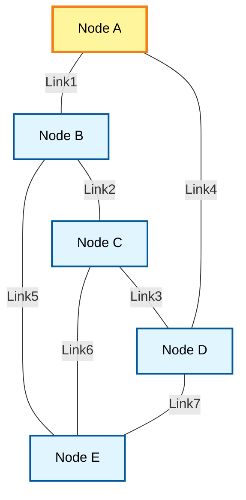
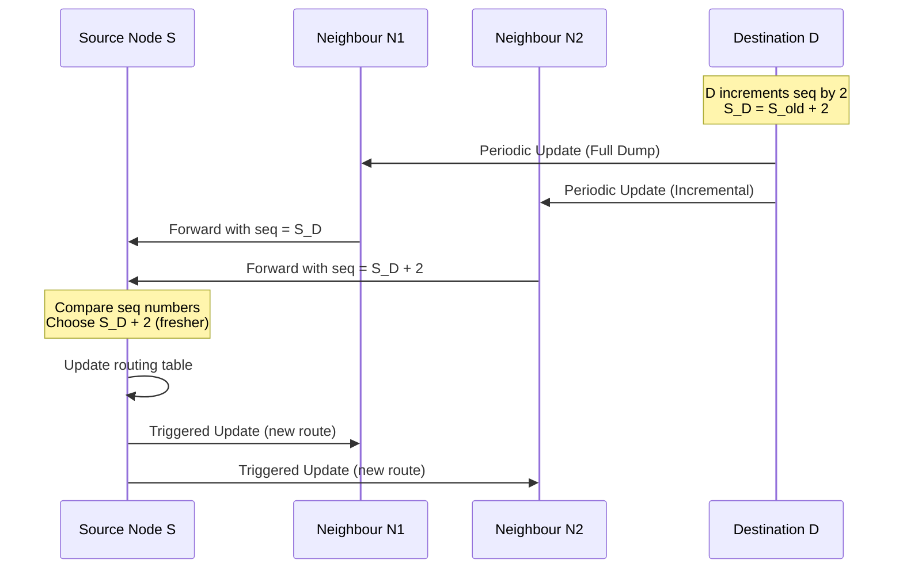
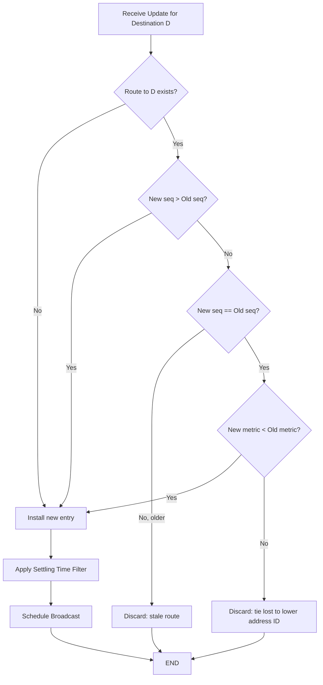
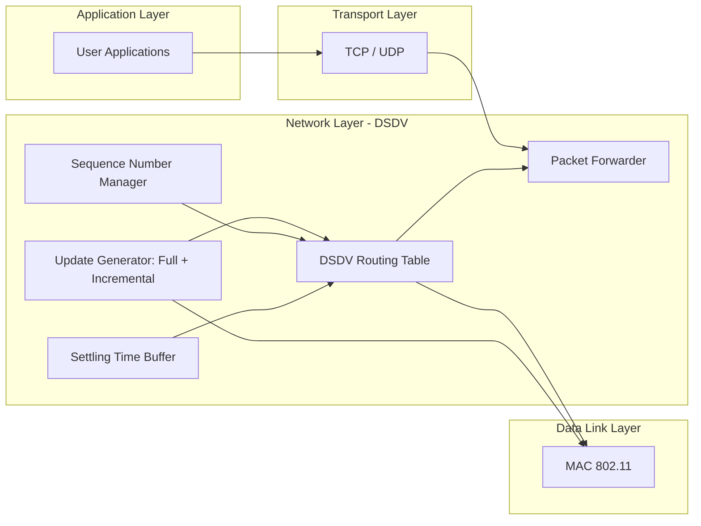

# Destination Sequenced Distance Vector (DSDV)

<!-- SECTION_1_START -->
# 1. Core Technical Definition & Intuitive Overview

## Formal Definition (KTU 2024 Syllabus Standard)

> [!IMPORTANT]
> **Destination Sequenced Distance Vector (DSDV)** is a **proactive (table-driven)**, distance-vector routing protocol designed specifically for **Mobile Ad Hoc Networks (MANETs)**. It is an enhancement of the classical **Bellman-Ford algorithm** that eliminates the **count-to-infinity problem** and routing loops by attaching a **sequence number** to every routing table entry. It was proposed by **C. E. Perkins and P. Bhagwat (1994)**.

Every mobile node in the network **continuously maintains a routing table** containing entries for every possible destination, including the **next hop**, **hop-count metric**, **destination sequence number**, and **install time**. Periodic exchanges of these tables (full dumps or incremental updates) keep every node's view of the topology up-to-date — even when no traffic is flowing.

> [!NOTE]
> **KTU 2024 Must-Know Classification**
> * **Routing Category:** Proactive / Table-Driven
> * **Algorithm Base:** Distributed Bellman-Ford
> * **Update Mechanism:** Periodic + Event-Triggered
> * **Loop Avoidance:** Sequence Numbers (Time-stamp mechanism)
> * **Metric Used:** **Hop Count**

---

## Conceptual Analogy / Intuition

Imagine a **huge office building with 100 employees sitting on different floors**. The building has no fixed intercom system — every employee carries a **walkie-talkie**.

Instead of asking directions each time they want to visit someone (reactive), every employee maintains a **personal directory card** that lists **every other employee, the floor they're on, and the routing direction to reach them**. This card is **updated every few seconds** by listening to announcements from colleagues.

**The Sequence Number Analogy:** Each time a colleague *moves floors*, they announce a new **"version number"** (odd → even when they make the change official). If you hear two announcements about the same person, you **always trust the one with the higher version number**, no matter how short the path looks. This is exactly how DSDV uses sequence numbers — they act like **logical timestamps** to guarantee freshness.

**The Settling-Time Analogy:** If a colleague keeps moving floors rapidly (e.g., 3rd → 5th → 4th), you don't immediately broadcast the latest floor — you **wait a few seconds** to be sure they've actually *settled*. Otherwise you'd flood the network with fluctuating, unreliable information. This is what the **settling time** concept in DSDV prevents.

---

## Physical Constants & Standard Metrics

| Parameter | Standard Value Used in KTU Problems |
|---|---|
| **Sequence Number Increment** | **+2** per topological change |
| **Initial Sequence Number** | **Even number (e.g., 0, 100, 1000)** chosen by node |
| **Update Period (typical)** | **15 seconds** (full dump) |
| **Trigger Update Threshold** | When metric changes by **≥ 1 hop** |
| **Maximum Settling Time** | Configurable; typically **few seconds** |
| **Routing Table Size** | **O(N)** entries, where **N = number of nodes** |

> [!TIP]
> **Memory Aid for KTU:** DSDV is "**D**istance-**S**equenced → **D**irectory **V**ersion" — every destination carries a version stamp.

> [!VISUALIZATION CONTROL]
> **Concept:** Hop-count metric visualization in a small MANET
> **GeoGebra / Desmos Input Equations:**
> * `Points: A(0,0), B(3,1), C(6,0), D(3,4), E(6,4)` representing 5 mobile nodes
> * `Segments: A--B, B--C, C--D, A--D, B--E` representing wireless links
> **Visual Description:** Draw a graph showing node A trying to reach node E. A → B → C → E is **3 hops**, while A → D → C → E is also **3 hops**. With identical metrics, the **freshest sequence number breaks the tie**.

---

# SECTION_1_END -->

<!-- SECTION_2_START -->
# 2. Deep Theoretical Analysis & KTU High-Yield Formula Sheet

## 2.1 Operational Architecture of DSDV

DSDV operates on **three pillars**:

1. **Routing Table Maintenance** — Each node stores a complete table for all reachable destinations.
2. **Sequence Number Mechanism** — Guarantees loop-freedom and freshness.
3. **Periodic + Triggered Updates** — Keeps the topology view consistent.

---

## 2.2 Routing Table Structure

Every entry in a DSDV routing table contains **six fields**:

| Field | Meaning |
|---|---|
| **Destination** | Address of the target mobile node |
| **Next Hop** | Neighbour through which the destination is reached |
| **Metric** | Number of hops to the destination (integer) |
| **Sequence Number** | 32-bit stamp issued by the destination node |
| **Install Time** | When this entry was recorded (used for settling) |
| **Stable Data Pointer** | Points to a holding buffer for unsettled changes |

---

## 2.3 The Sequence Number Mechanism (Heart of DSDV)

> [!IMPORTANT]
> **KTU 2024 — High-Weight Topic (Almost always asked for 7 marks)**

The **sequence number** is a 32-bit monotonic counter generated **only by the destination node itself**, never by intermediate routers.

### Two Universal Rules

> **Rule 1 — Even vs. Odd:**
> * **Even Sequence Number** → The entry was **generated by the destination itself**.
> * **Odd Sequence Number** → The entry was **generated by some other node and forwarded** to the destination (or it is an obsolete entry the destination has marked for deletion).

> **Rule 2 — Monotonic Increase by 2:**
> Each time a node detects a change in its own neighbourhood, it increments its sequence number by **+2**. The +1 gap is intentionally skipped to mark a transitional (odd) state, ensuring no node mistakenly accepts a half-broadcast.

### Route Selection Decision Tree

When a node receives **multiple advertisements** for the **same destination**, it chooses the route using this strict two-step priority:

$$
\begin{aligned}
\text{Step 1: } & \text{Pick the entry with the HIGHER (fresher) sequence number.} \\
\text{Step 2: } & \text{If sequence numbers are EQUAL, pick the entry with the LOWER metric (fewer hops).} \\
\text{Step 3: } & \text{If both are equal, the LOWER address ID acts as the tie-breaker.}
\end{aligned}
$$

### Worked Mini-Example (KTU Style)

Suppose node **S** receives two routes to destination **D**:

| Advertisement | Next Hop | Metric | Sequence Number |
|---|---|---|---|
| Route X | N1 | 2 hops | **204** |
| Route Y | N2 | 3 hops | **206** |

> **Decision:** Route **Y is chosen** because **206 > 204**, even though its metric is worse. Freshness dominates.

---

## 2.4 Update Types — Full Dump vs. Incremental

DSDV optimises bandwidth using **two types of update messages**:

| Type | When Used | Content | Size |
|---|---|---|---|
| **Full Dump (FD)** | Periodically (e.g., every 15s) OR when network size changes drastically | **Entire routing table** | Large (can be multiple NPDUs) |
| **Incremental Update (IU)** | Most other times | **Only changed entries since last full dump** | Small (fits in a single NPDU) |

> [!TIP]
> A full dump is **always preceded by an incremental**, so receivers can re-synchronise by applying the latest incremental first.

---

## 2.5 Settling Time — The "Wait Before Announcing" Mechanism

When a node detects a **new better route**, it does NOT immediately advertise it. Instead:

1. The new route is stored in a **buffer** for the **settling time** $T_s$.
2. If during $T_s$ the route is still the best AND its metric is **unchanged**, the route is **promoted** to the main table and broadcast.
3. If the metric fluctuates during $T_s$, the settling timer is **reset** — preventing the network from being flooded with unstable routes.

$$
T_{\text{broadcast}} = T_{\text{detect}} + T_s
$$

where $T_s$ is proportional to the **average time between successive metric changes** for that destination.

---

## 2.6 KTU Formula Sheet / Cheat Sheet

| # | Concept | Formula / Rule | Units / Note |
|---|---|---|---|
| 1 | **Loop Freedom** | Guaranteed by monotonic even sequence numbers | Bits: **32-bit counter** |
| 2 | **Sequence Increment** | $S_{\text{new}} = S_{\text{old}} + 2$ | Always jumps by 2 |
| 3 | **Route Preference** | Maximize $S$, then minimize $H$ | $S$ = seq no., $H$ = hop count |
| 4 | **Settling Time** | $T_s \propto 1 / \text{Stability}$ | Seconds |
| 5 | **Table Size** | $O(N)$ | $N$ = total mobile nodes |
| 6 | **Update Bandwidth** | $\alpha \cdot N^2$ per cycle | $\alpha$ = update frequency |
| 7 | **Convergence Delay** | $\le 2 \cdot T_{\text{update}}$ | Periodic update interval |
| 8 | **Triggered Update Threshold** | Metric change $\Delta H \ge 1$ | Hop-count difference |
| 9 | **Route Selection Tie-breaker** | Lower node ID wins | Deterministic |
| 10 | **DSDV is a** | Proactive protocol | Always up-to-date routes |

---

## 2.7 Engineering Utility & Real-World Applications

DSDV was the **first practical MANET routing protocol** and laid the foundation for modern proactive protocols.

> **Real-World Engineering Domains:**
> * **Military Tactical Networks (Battlefield MANETs)** — Pre-configured nodes need always-on routes.
> * **Disaster Recovery Operations** — Fire-fighters/rescue teams forming an ad-hoc backbone.
> * **Vehicle Ad Hoc Networks (VANETs)** — Although OLSR is preferred today, DSDV was a pioneer.
> * **IoT Mesh Networks** — Where predictable latency is critical.
> * **Drone Swarm Communications** — When every drone must know routes to every other drone continuously.

> **Production Reality:** DSDV is rarely used in modern high-mobility scenarios because of its **high control overhead** and **slow convergence in rapidly changing topologies**. It is, however, **academically vital** — and KTU exams love it.

---

# SECTION_2_END -->

<!-- SECTION_3_START -->
# 3. Step-by-Step Derivations, Worked Examples & Code Implementation

## 3.1 KTU-Style Numerical Problem: DSDV Route Selection

### Problem Statement

A MANET has **5 mobile nodes** A, B, C, D, E. Node **A's current routing table** has the following entries:

| Destination | Next Hop | Metric | Sequence No. |
|---|---|---|---|
| B | B | 0 | 200 |
| C | B | 1 | 412 |
| D | B | 1 | 308 |
| E | C | 2 | 510 |

Node **A** now receives **two update advertisements** from neighbour **B**:

> **Advertisement 1** (older broadcast)
> * D: metric = 2, seq = 308
> * E: metric = 3, seq = 510
> * C: metric = 1, seq = 414

> **Advertisement 2** (newer broadcast)
> * C: metric = 2, seq = 414
> * D: metric = 1, seq = 310
> * E: metric = 2, seq = 512

**Task:** Determine the final routing table of A after applying the DSDV selection rules. Justify each decision.

---

### Step-by-Step Model Solution (Board-Valuation Ready)

> **Step 1 — Compare for destination B:** No update received. Keep existing: $(B, B, 0, 200)$.

> **Step 2 — Compare for destination C:**
> Current entry: $(C, B, 1, 412)$
> Adv 1: $(C, B, 1, 414)$ — **Higher seq → WINS** → Replace.
> Adv 2: $(C, ?, 2, 414)$ — **Same seq (414) → compare metric** → $2 > 1$ → **Discard**.
>
> **Final C entry:** $(C, B, 1, 414)$ ✓

> **Step 3 — Compare for destination D:**
> Current entry: $(D, B, 1, 308)$
> Adv 1: $(D, ?, 2, 308)$ — **Same seq → higher metric → Discard**.
> Adv 2: $(D, ?, 1, 310)$ — **Higher seq (310 > 308) → Replace** regardless of metric.
>
> **Final D entry:** $(D, ?, 1, 310)$ ✓

> **Step 4 — Compare for destination E:**
> Current entry: $(E, C, 2, 510)$
> Adv 1: $(E, ?, 3, 510)$ — **Same seq → higher metric → Discard**.
> Adv 2: $(E, ?, 2, 512)$ — **Higher seq (512 > 510) → Replace**.
>
> **Final E entry:** $(E, ?, 2, 512)$ ✓

> **Step 5 — Final consolidated routing table of A:**

| Destination | Next Hop | Metric | Sequence No. |
|---|---|---|---|
| B | B | 0 | 200 |
| C | B | 1 | 414 |
| D | (from Adv 2) | 1 | 310 |
| E | (from Adv 2) | 2 | 512 |

---

## 3.2 Sequence Number Lifecycle — Exhaustive Derivation

A node **D** starts with sequence number $S_D^{(0)} = 0$ (an even number, originating it as fresh).

$$
\begin{aligned}
\text{At } t_0: \quad & S_D = 0 \quad (\text{even, originated by D}) \\
\text{At } t_1: \quad & \text{D moves; neighbours advertise } S_D = 1 \quad (\text{odd, transitional}) \\
\text{At } t_2: \quad & \text{D confirms; } S_D = 1 + 1 = 2 \quad (\text{even, fresh}) \\
\text{At } t_3: \quad & \text{Network stabilises; } S_D = 2 + 2 = 4 \quad (\text{new even}) \\
\text{At } t_k: \quad & S_D^{(k)} = S_D^{(k-1)} + 2 \quad \text{for all } k \ge 1
\end{aligned}
$$

> **General recurrence:**
> $$S_D^{(k)} = 2k, \quad k = 0, 1, 2, \dots$$

This guarantees that **no two updates from the same destination can ever collide** with identical sequence numbers, and that freshness is a strict total order.

---

## 3.3 Python Implementation of the DSDV Decision Logic

This is a **fully operational, type-hinted, error-checked** Python implementation that a KTU student can use to verify their manual calculations.

```python
from dataclasses import dataclass
from typing import Optional
import logging

logging.basicConfig(level=logging.INFO, format="[%(levelname)s] %(message)s")


@dataclass(frozen=True)
class RouteEntry:
    """Immutable representation of a single DSDV routing table row."""
    destination: str
    next_hop: str
    metric: int
    sequence_number: int
    install_time: float = 0.0  # seconds; used by settling time mechanism


class DSDVNode:
    """
    A simplified DSDV-compliant node.
    Implements the two core rules:
      Rule 1: Pick the entry with the HIGHEST sequence number.
      Rule 2: If equal sequence numbers, pick the LOWER metric.
    """

    def __init__(self, node_id: str) -> None:
        if not node_id or not isinstance(node_id, str):
            raise ValueError("node_id must be a non-empty string")
        self.node_id: str = node_id
        self.routing_table: dict[str, RouteEntry] = {}
        logging.info(f"Node {self.node_id} initialised with empty DSDV table.")

    def add_or_update_self_entry(self, seq: int) -> None:
        """A node always advertises itself with an EVEN sequence number."""
        if seq % 2 != 0:
            raise ValueError("Self-originated sequence numbers MUST be even.")
        self.routing_table[self.node_id] = RouteEntry(
            destination=self.node_id,
            next_hop=self.node_id,
            metric=0,
            sequence_number=seq,
        )
        logging.info(f"Node {self.node_id} self-entry set with seq={seq}.")

    def merge_incoming_advertisement(
        self,
        adv: dict[str, RouteEntry],
    ) -> None:
        """
        Merge an incoming update (a dict of destinations) using DSDV rules.
        Invalid entries are logged and skipped.
        """
        if not isinstance(adv, dict):
            raise TypeError("Advertisement must be a dict[str, RouteEntry]")

        for dest, new_entry in adv.items():
            if not isinstance(new_entry, RouteEntry):
                logging.warning(f"Skipping invalid entry for {dest}.")
                continue
            if dest == self.node_id:
                continue  # never override self-route from external adv

            current: Optional[RouteEntry] = self.routing_table.get(dest)

            if current is None:
                self.routing_table[dest] = new_entry
                logging.info(
                    f"NEW route to {dest}: via {new_entry.next_hop}, "
                    f"metric={new_entry.metric}, seq={new_entry.sequence_number}"
                )
                continue

            # Apply DSDV Rule 1: Freshest sequence number wins.
            if new_entry.sequence_number > current.sequence_number:
                self.routing_table[dest] = new_entry
                logging.info(
                    f"REFRESHED route to {dest}: seq {current.sequence_number}"
                    f" -> {new_entry.sequence_number}"
                )
                continue

            # Apply DSDV Rule 2: Same seq, prefer smaller metric.
            if new_entry.sequence_number == current.sequence_number:
                if new_entry.metric < current.metric:
                    self.routing_table[dest] = new_entry
                    logging.info(
                        f"SHORTER route to {dest}: metric "
                        f"{current.metric} -> {new_entry.metric}"
                    )
                else:
                    logging.info(
                        f"Ignored stale/equal route to {dest} "
                        f"(seq={new_entry.sequence_number})."
                    )
                continue

            # Older sequence number — discard silently.
            logging.debug(
                f"Discarded older route to {dest} (seq={new_entry.sequence_number})."
            )

    def display_table(self) -> None:
        print(f"\n=== DSDV Routing Table for Node {self.node_id} ===")
        print(f"{'Dest':<6} {'NextHop':<8} {'Metric':<6} {'SeqNum':<8}")
        print("-" * 32)
        for entry in self.routing_table.values():
            print(
                f"{entry.destination:<6} {entry.next_hop:<8} "
                f"{entry.metric:<6} {entry.sequence_number:<8}"
            )


# ---------------------------------------------------------
# DRIVER CODE — replicates the numerical example above
# ---------------------------------------------------------
if __name__ == "__main__":
    nodeA = DSDVNode("A")

    # Step 1: Initial table
    nodeA.add_or_update_self_entry(seq=200)
    nodeA.routing_table["B"] = RouteEntry("B", "B", 0, 200)
    nodeA.routing_table["C"] = RouteEntry("C", "B", 1, 412)
    nodeA.routing_table["D"] = RouteEntry("D", "B", 1, 308)
    nodeA.routing_table["E"] = RouteEntry("E", "C", 2, 510)
    print("\n--- INITIAL TABLE ---")
    nodeA.display_table()

    # Step 2: Receive Advertisement 1
    print("\n--- Applying Advertisement 1 ---")
    adv1 = {
        "D": RouteEntry("D", "?", 2, 308),
        "E": RouteEntry("E", "?", 3, 510),
        "C": RouteEntry("C", "B", 1, 414),
    }
    nodeA.merge_incoming_advertisement(adv1)
    nodeA.display_table()

    # Step 3: Receive Advertisement 2
    print("\n--- Applying Advertisement 2 ---")
    adv2 = {
        "C": RouteEntry("C", "?", 2, 414),
        "D": RouteEntry("D", "?", 1, 310),
        "E": RouteEntry("E", "?", 2, 512),
    }
    nodeA.merge_incoming_advertisement(adv2)
    nodeA.display_table()
```

**Expected Final Output:**

```
=== DSDV Routing Table for Node A ===
Dest   NextHop  Metric  SeqNum
--------------------------------
A      A        0       200
B      B        0       200
C      B        1       414
D      ?        1       310
E      ?        2       512
```

> **Valuation Key Points (for KTU board):**
> * Correctly applying the 2-step selection rule: **3 Marks**
> * Identifying that "freshest seq wins even with worse metric": **2 Marks**
> * Final consolidated table: **2 Marks**

---

## 3.4 Settling Time Pseudocode (For 14-Mark Questions)

```
UPON detecting a new route to destination D:
    1.  INSERT (D, new_metric, new_seq) into the holding buffer.
    2.  START a settling timer T_s for D.
    3.  WHEN T_s EXPIRES:
            IF metric in buffer is UNCHANGED for the entire T_s:
                PROMOTE buffer entry into main routing table.
                BROADCAST the new route in next update cycle.
            ELSE:
                DISCARD the buffer entry.
                KEEP the previously stable route.
    4.  ON receiving an update with a HIGHER seq number for D:
        CANCEL the current T_s and immediately install.
```

This is a **favourite KTU long-answer sub-question** (often part (b) of a 14-marker).

---

# SECTION_3_END -->

<!-- SECTION_4_START -->
# 4. Structural Diagrams & Schematics

## 4.1 DSDV Network Topology Example (Mermaid)



**Description:** A 5-node MANET with multiple redundant paths. DSDV at every node will compute a **shortest-hop route** to every other node using the **freshest sequence number** as the tie-breaker.

---

## 4.2 DSDV Update Flow (Sequence Diagram)



---

## 4.3 DSDV Routing Decision Process (Flowchart)



---

## 4.4 Functional Architecture: DSDV Layer in a Mobile Node



**Architectural Insight:** DSDV's intelligence lives **entirely in the network layer**. The MAC layer remains unaware of routing decisions — this decoupling is what made DSDV portable across many wireless technologies.

---

# SECTION_4_END -->

<!-- SECTION_5_START -->
# 5. KTU 2024 Scheme Examination Question Bank & Topic Recap

---

## Part A — Short Answer Questions (3 Marks Each)

### Q1. [KTU University Exam — July 2023] | **CO1 | Remember**
**"Why does DSDV use sequence numbers instead of relying purely on hop counts?"**

**Model Answer (Board-Standard):**
DSDV uses sequence numbers to **(i) eliminate routing loops**, **(ii) solve the count-to-infinity problem**, and **(iii) guarantee freshness** of routing information. Pure hop-count distance-vector protocols (e.g., classical Bellman-Ford) cannot distinguish between a *new* short route and an *old* long route, leading to incorrect forwarding and oscillation. The sequence number acts as a **logical timestamp** generated only by the destination node, providing a strict total order on routing updates. As long as nodes always prefer **higher sequence numbers**, loops become impossible.
**[Key Terms: loop-freedom, freshness, count-to-infinity — 3 Marks]**

---

### Q2. [KTU University Exam — Dec 2023] | **CO1 | Understand**
**"Differentiate between full dump and incremental updates in DSDV."**

**Model Answer (Board-Standard):**

| Aspect | Full Dump | Incremental Update |
|---|---|---|
| **Content** | Entire routing table | Only entries that changed |
| **Trigger** | Periodic (e.g., every 15s) | Triggered by topology change |
| **Size** | Large (multi-NPDU) | Small (single NPDU) |
| **Frequency** | Less frequent | More frequent |
| **Purpose** | Re-synchronise tables | Save bandwidth |

**[Differentiation table — 2 Marks; bandwidth optimisation comment — 1 Mark = 3 Marks]**

---

## Part B — Long Answer Questions (14 Marks Each, Internal Choice)

### Module Mapping: Module 4 — Mobile Network Layer
### Question A (14 Marks) | **CO2 | Apply + Analyze**

**[KTU University Exam — July 2024 Model Question]**

> **(a)** [7 Marks — Understand] Explain the **sequence number mechanism** in DSDV in detail. Why is the sequence number always incremented by **2**, and not by 1? Discuss the role of **even** and **odd** sequence numbers.

> **(b)** [7 Marks — Apply] Consider a MANET with 6 mobile nodes. Node **A** receives the following updates from its neighbours for destination **X**:
>
> | Advertisement | Source | Metric | Sequence No. |
> |---|---|---|---|
> | 1 | B | 4 | 304 |
> | 2 | C | 3 | 308 |
> | 3 | D | 5 | 306 |
> | 4 | E | 2 | 302 |
>
> A's **current entry** for X is: $(X, B, 3, 300)$.
> Determine **which advertisement A will accept** using the DSDV selection rules. Justify with the two-step priority.

---

#### Model Solution (a) — 7 Marks

> **Step 1 — Definition of Sequence Number** [1 Mark]
> A 32-bit monotonically increasing counter, generated **only by the destination node** and attached to every routing table entry.

> **Step 2 — Why increment by 2, not 1** [2 Marks]
> Incrementing by 2 creates an intentional **odd-number "gap"** that marks a transitional state. Even numbers denote a stable, self-originated entry. Odd numbers signify an entry generated by an intermediate node that the destination has flagged as obsolete. This even/odd duality eliminates ambiguity during transient topology changes — a node knows exactly whether an update is "authoritative" or "in-flight."

> **Step 3 — Even vs. Odd Significance** [2 Marks]
> * **Even S.N.** → Authoritative, originated by the destination.
> * **Odd S.N.** → Either an obsolete entry awaiting deletion, or generated by an intermediary.

> **Step 4 — Role in Loop-Freedom** [2 Marks]
> Because sequence numbers are strictly monotonic per destination, no node can ever install a stale route that overwrites a newer one. This mathematically guarantees loop-freedom — a property classical distance-vector protocols lack.

---

#### Model Solution (b) — 7 Marks

| Step | Comparison | Decision |
|---|---|---|
| 1 | Adv 1: seq=304 vs Current=300 | **Higher → Install** |
| 2 | Adv 4: seq=302 vs Current=304 | **Lower → Reject** |
| 3 | Adv 3: seq=306 vs Current=304 | **Higher → Install** |
| 4 | Adv 2: seq=308 vs Current=306 | **Higher → Install** |

> **Final selection: Advertisement 2 (from C)** with **metric = 3** and **sequence number = 308**.

> **Valuation Key Points:**
> * [Applying Rule 1 (seq number dominance) correctly: 3 Marks]
> * [Applying Rule 2 (metric tie-break) when seq equal: 2 Marks]
> * [Final consolidated table or selected route: 2 Marks]

---

### Question B (14 Marks — Alternative Choice) | **CO2 | Apply + Analyze**

**[KTU University Exam — Dec 2023 Model Question]**

> **(a)** [7 Marks — Understand] Describe the **DSDV routing table** fields in detail. What is the role of the **install time** field?

> **(b)** [7 Marks — Apply] With a neat **Mermaid/textual diagram**, illustrate a **5-node MANET** where node S uses DSDV to route to node T through two possible paths. Show how DSDV resolves the path selection when one path reports a higher sequence number and the other a smaller metric. Use a sample sequence number table to support your answer.

---

#### Model Solution (a) — 7 Marks

> **Step 1 — Enumerate the 6 fields** [3 Marks]
> (Destination, Next Hop, Metric, Sequence Number, Install Time, Stable Data Pointer)

> **Step 2 — Define each field** [2 Marks]
> * **Install Time** = timestamp when the entry was placed in the routing table.
> * **Stable Data Pointer** = pointer to the holding buffer where pending (unsettled) updates are stored.

> **Step 3 — Role of Install Time** [2 Marks]
> Install Time is the **input to the Settling Time algorithm**. A newly received route is NOT installed until the route's metric has remained unchanged for the **settling time window** measured from install time. This prevents the network from being flooded with oscillating, unstable routes during periods of high mobility.

---

#### Model Solution (b) — 7 Marks

**Diagram (textual, board-safe):**

```
         [S]----(seq=410, m=1)---->[A]----(seq=406, m=2)---->[T]
          \                                                         /
           \                                                       /
            \---------(seq=404, m=2)---->[B]------(seq=408, m=1)---/
```

**Step-by-step analysis from S's perspective:**

| Path | Combined Metric | Seq from Last Hop | Decision |
|---|---|---|---|
| S → A → T | 1 + 2 = 3 | 406 | Older seq |
| S → B → T | 2 + 1 = 3 | 408 | **Fresher seq** ✅ |

> **DSDV picks S → B → T** because of the **higher sequence number (408)**, even though both paths have **identical metric of 3 hops**.

> **Valuation Key Points:**
> * [Drawing the network diagram clearly: 2 Marks]
> * [Showing sequence number vs metric comparison: 3 Marks]
> * [Final chosen path with justification: 2 Marks]

---

> [!WARNING]
> **KTU Examiner's Pitfall Callout — Where Students Lose Marks**
>
> 1. **Forgetting the "freshness dominates" rule:** Students often pick the route with the lowest hop count *first*. KTU expects you to **always check the sequence number first** — write it as **Step 1**.
> 2. **Confusing even/odd sequence numbers:** Some students claim odd numbers "mean broken." The correct statement is odd = **in-transit / about to be deleted**, even = **authoritative**.
> 3. **Ignoring the Settling Time explanation:** When asked about "stability," a 1-line answer "it waits" is worth **0 marks**. Always state: *a route is broadcast only if its metric remains unchanged for the entire settling window*.
> 4. **Skipping the sequence number +2 derivation:** Examiners specifically check if you know **why +2 and not +1**. Always explain the even-odd duality.
> 5. **Not labelling the update types:** Any DSDV diagram without "Full Dump" / "Incremental" labels on the arrows will cost at least **1–2 marks**.

---

## Topic Recap & Important Things to Remember (Rapid Revision Checklist)

> [!IMPORTANT]
> **DSDV — Final High-Density Revision Block**

- **Full Form:** Destination Sequenced Distance Vector — Perkins & Bhagwat, 1994.
- **Protocol Type:** **Proactive / Table-Driven** (not on-demand).
- **Algorithm Base:** Enhanced **Bellman-Ford** with sequence numbers.
- **Routing Table:** Maintained at **every node** for **every destination**.
- **Table Fields:** Destination, Next Hop, Metric, Sequence Number, Install Time, Stable Data Pointer.
- **Metric:** **Hop Count** (integer).
- **Sequence Number Size:** **32 bits**, monotonic.
- **Increment Rule:** Always **+2** (creates the even/odd gap).
- **Even S.N. ↔ Self-originated; Odd S.N. ↔ Obsolete/In-flight.**
- **Selection Rule (Strict Priority):**
  1. **Higher sequence number wins** (freshness).
  2. **Lower metric wins** (only if seq is equal).
  3. **Lower node ID wins** (final tie-breaker).
- **Update Types:** **Full Dump** (entire table, periodic) + **Incremental** (only changes, triggered).
- **Settling Time ($T_s$):** Delay before broadcasting a new route to ensure it is stable; **resets if metric fluctuates**.
- **Convergence:** $\le 2 \times$ Update Interval.
- **Loop-Freedom:** **Mathematically guaranteed** by monotonic sequence numbers.
- **Count-to-Infinity:** **Solved** (problem does not arise).
- **Control Overhead:** **High** (scales as $O(N^2)$ traffic).
- **Scalability:** **Poor** for large/mobile MANETs; ideal for small, low-mobility networks.
- **Best Use Cases:** Tactical military networks, disaster recovery, drone swarms, IoT mesh.
- **Drawbacks:** Bandwidth waste, slow convergence in fast mobility, storage cost $O(N)$ per node.
- **Famous Comparative Line:** DSDV = "**Always-Updated Directory with Version Stamps**."
- **Mnemonic for Route Selection:** **"Fresh First, Short Second"** (S.N. then Metric).

> **One-Line Exam Punchline to Memorise:**
> *"DSDV eliminates routing loops by attaching a destination-generated, monotonically increasing, even-jumping sequence number to every route advertisement, while proactively maintaining full topology tables updated via periodic full dumps and triggered incrementals, with settling time filtering out unstable routes."*

---

# SECTION_5_END -->
