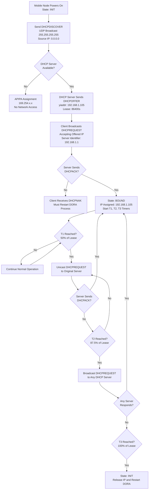
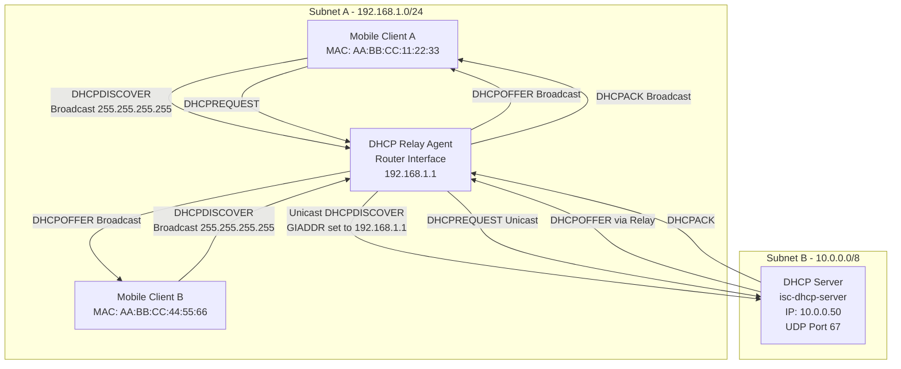
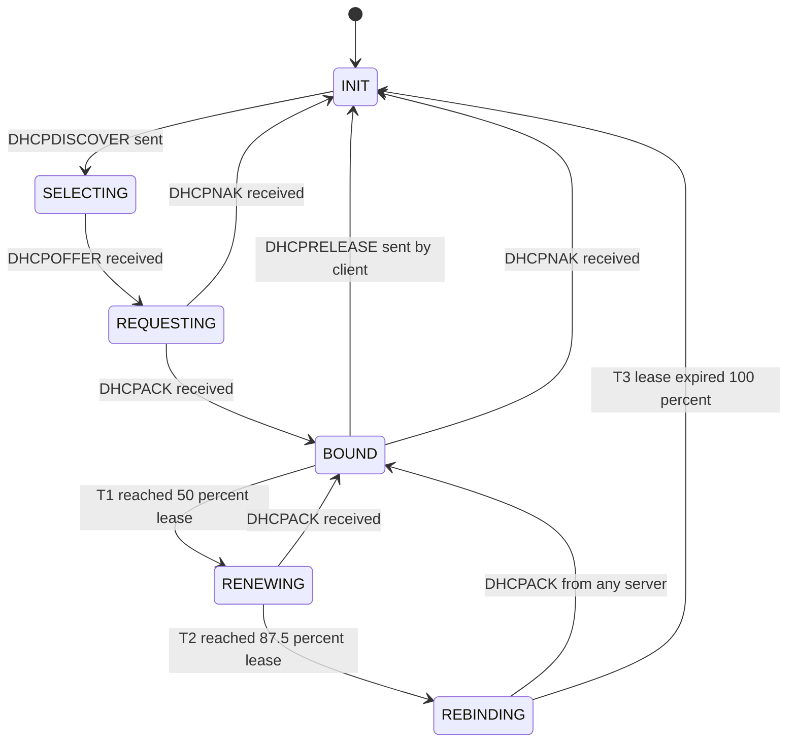
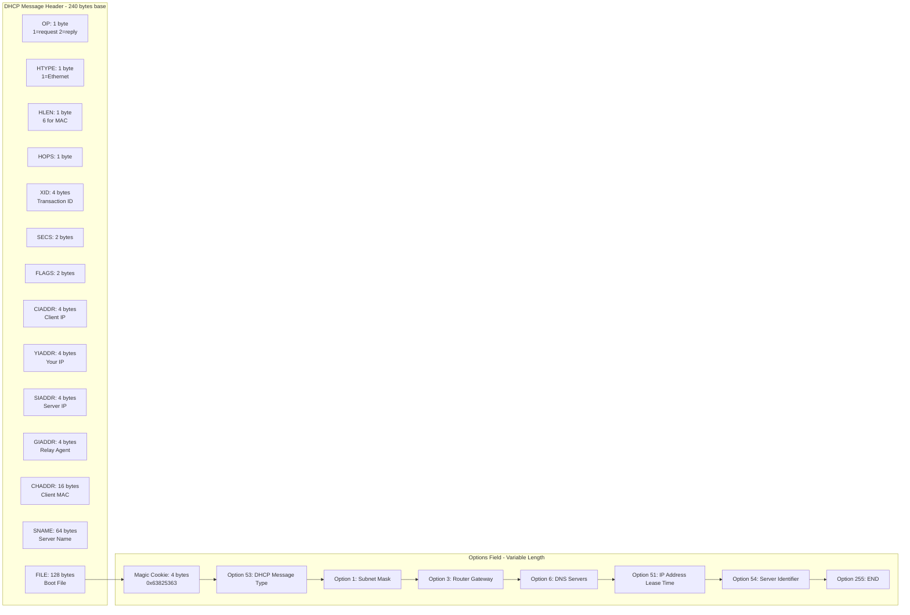

# Dynamic Host Configuration Protocol (DHCP)

<!-- SECTION_1_START -->
# Dynamic Host Configuration Protocol (DHCP)

## 1. Core Technical Definition

> [!NOTE]
> **Formal Definition (KTU 2024 Syllabus Terminology)**
> **Dynamic Host Configuration Protocol (DHCP)** is an *application-layer* network management protocol defined in **IETF RFC 2131** and **RFC 2132** that operates over **User Datagram Protocol (UDP)**. It is designed to **automate the centralized allocation and dynamic assignment of IP addresses, subnet masks, default gateways, DNS server addresses, and other network configuration parameters** to client devices (hosts) joining an IP-based network. In the context of **Mobile IP (Module 4)**, DHCP eliminates the manual configuration of Mobile Nodes (MN), Foreign Agents (FA), and Correspondent Nodes (CN), enabling **plug-and-play mobility** across heterogeneous wireless networks.

| Parameter | Value |
|---|---|
| **Standard** | RFC 2131, RFC 2132, RFC 3315 (IPv6) |
| **Transport Layer** | **UDP** |
| **Server Port** | **67** |
| **Client Port** | **68** |
| **Default Lease Time** | **86400 seconds (24 hours)** |
| **Operating Layer (OSI)** | Layer 7 (Application) |

## 2. Intuitive Overview (The Hotel Check-in Analogy)

> [!IMPORTANT]
> **Conceptual Analogy — "The Automated Hotel Check-in Kiosk"**
> Imagine walking into a large international hotel (your **IP network**). Instead of standing in a long queue at the reception desk to be assigned a room manually, you walk to a **self-service kiosk** (the **DHCP Server**). You press a button ("I need a room!"), the kiosk searches its availability database, and prints a **key card with a room number valid for a specific duration** (a **lease**). The key card also includes:
> - Your room number → **IP Address**
> - The floor's Wi-Fi password → **Subnet Mask**
> - Directions to the lobby/restaurant → **Default Gateway**
> - The hotel's restaurant phone number → **DNS Server**
>
> When the duration expires, the kiosk politely asks: *"Would you like to renew?"* If you do not respond, the room is reassigned to a new guest. This is exactly how DHCP leases operate at the network layer.

## 3. GeoGebra / Desmos Integration

> [!VISUALIZATION CONTROL]
> **Concept:** *Lease Lifetime Decay & Renewal Threshold Visualization*
> **GeoGebra / Desmos Input Equations:**
> - $f(t) = 1 - \dfrac{t}{T_{lease}}$   (Normalized lease time remaining, where $t$ is elapsed time, $T_{lease}$ is the full lease duration)
> - Point: $T_{renew} = 0.5 \cdot T_{lease}$  (T1 Renewal Threshold)
> - Point: $T_{rebind} = 0.875 \cdot T_{lease}$  (T2 Rebinding Threshold)
> - Point: $T_{expire} = 1.0 \cdot T_{lease}$  (Lease Expiration Boundary)
>
> **Visual Description:** Plot a straight declining line from $(0, 1)$ on the Y-axis to $(T_{lease}, 0)$ on the X-axis. Mark the three threshold points along the X-axis. The student should observe the three distinct phases of DHCP lease lifetime management: **T1 Renewal, T2 Rebinding, and Lease Expiration**.

<!-- SECTION_1_END -->

<!-- SECTION_2_START -->
# Deep Theoretical Analysis

## 1. DHCP System Architecture

DHCP follows a **client-server architecture** with three primary logical entities. In a mobile environment, these components can be distributed across multiple administrative domains.

- **DHCP Client:** Any device (laptop, smartphone, IoT sensor, Mobile Node) that requires IP configuration. The client does *not* possess a static IP at boot time; it operates in a "zero-configuration" state.
- **DHCP Server:** A centralized host (often a router or dedicated server running `isc-dhcp-server` on Linux) that maintains a **pool of available IP addresses** (a *scope* or *address pool*) and configuration metadata.
- **DHCP Relay Agent (GIADDR):** A router or Layer-3 switch that forwards DHCP broadcast packets between clients and servers residing on different subnets. It populates the **GIADDR (Gateway IP Address)** field so the server knows which subnet's scope to allocate from.

## 2. The Four-Step DORA Process (Detailed)

DHCP communication follows a strict four-message handshake, popularly known as the **DORA process**. Every step uses **UDP broadcasts** (destination `255.255.255.255`) on the local segment unless a relay agent is involved.

| Step | Message | Direction | Source IP | Destination IP | Purpose |
|---|---|---|---|---|---|
| **1** | **D**iscover | Client → Server | `0.0.0.0` | `255.255.255.255` | Client broadcasts a request for any available DHCP server. |
| **2** | **O**ffer | Server → Client | Server IP | `255.255.255.255` | Server offers an IP address, lease time, and configuration. |
| **3** | **R**equest | Client → Server | `0.0.0.0` | `255.255.255.255` | Client formally accepts the offered configuration. |
| **4** | **A**cknowledgment (ACK) | Server → Client | Server IP | `255.255.255.255` | Server confirms the lease and finalizes the assignment. |

> [!IMPORTANT]
> **Why Broadcast?**
> At boot time, the client has **no IP address, no subnet mask, and no default gateway**. Therefore, it is network-isolated and can only communicate using **Layer 2 broadcast frames** encapsulated in **UDP datagrams** destined for the limited broadcast address. This is a fundamental design constraint in DHCP.

## 3. DHCP Lease State Machine (T1, T2, T3 Timing)

After the DORA handshake, the client enters a **leased state** governed by three critical timer thresholds:

- **T1 Renewal Timer:** Set to **50%** of the lease duration. The client unicasts a `DHCPREQUEST` directly to the originating server to renew the lease.
- **T2 Rebinding Timer:** Set to **87.5%** of the lease duration. If the original server is unreachable, the client broadcasts a `DHCPREQUEST` to *any* available DHCP server.
- **Lease Expiration (T3):** At **100%** of the lease time, the client **must release the IP address** and return to the discovery state, forfeiting all network connectivity.

## 4. KTU High-Yield Formula Sheet

> [!IMPORTANT]
> **Critical Formulas for Mobile Computing Examinations**

| Concept | Formula / Field | Default / Standard Value |
|---|---|---|
| T1 Renewal Time | $T_1 = 0.5 \times T_{lease}$ | **43200 s** (12 hrs) |
| T2 Rebinding Time | $T_2 = 0.875 \times T_{lease}$ | **75600 s** (21 hrs) |
| Lease Expiration | $T_3 = 1.0 \times T_{lease}$ | **86400 s** (24 hrs) |
| Network Utilization | $\eta = \dfrac{N_{leased}}{N_{pool}} \times 100\%$ | Measured in % |
| Broadcast Reach | $L_{max} = $ Local Subnet Only | **Limited to /24** without relay |
| Server Port | $P_{server}$ | **67** |
| Client Port | $P_{client}$ | **68** |
| Renewal Efficiency | $\rho = \dfrac{T_1}{T_{lease}}$ | **0.5** (50%) |

> [!WARNING]
> **Markdown Safety Note:** Always use `\vert` for absolute value notation in tables to prevent pipe character parsing conflicts. Example: write `$\vert IP \vert$` instead of `|IP|`.

## 5. Real-World Engineering Utility

DHCP is the **de facto standard** for enterprise and mobile environments. In production systems:

- **Enterprise WLANs (Cisco, Aruba, Ruckus):** DHCP hands out IP addresses to thousands of corporate mobile devices.
- **4G/5G Mobile Cores:** DHCP is used to assign IP addresses to **User Equipment (UE)** in the Packet Data Network (PDN) when static addressing is not enforced.
- **Hotels, Airports, Coffee Shops:** Public Wi-Fi captive portals rely on DHCP to provide transient network access.
- **IoT Deployments:** Smart homes, industrial sensors, and smart-city infrastructure use DHCPv6 for automatic addressing in IPv6-only networks.
- **Cloud Data Centers:** Virtual machines in AWS, Azure, and GCP obtain their private IP addresses via DHCP from the hypervisor's virtual switch.

<!-- SECTION_2_END -->

<!-- SECTION_3_START -->
# Step-by-Step Derivations and Implementation

## 1. Exhaustive DORA Process Walkthrough

Below is the **complete sequential state transition** of a Mobile Node obtaining an IP address via DHCP. Every packet exchange is explicitly enumerated.

### Step 1: DHCPDISCOVER (Client Broadcasts)
- **Source IP:** `0.0.0.0` (no address yet)
- **Destination IP:** `255.255.255.255` (limited broadcast)
- **Source MAC:** Client's hardware MAC address (e.g., `AA:BB:CC:DD:EE:FF`)
- **Transaction ID (xid):** Random 32-bit number for matching responses
- **CHADDR Field:** Client's MAC address
- **Requested Options:** `Subnet Mask (1)`, `Router (3)`, `DNS (6)`, `Lease Time (51)`

### Step 2: DHCPOFFER (Server Responds)
- **Source IP:** DHCP Server IP (e.g., `192.168.1.1`)
- **Destination IP:** `255.255.255.255`
- **yiaddr (Your IP Address):** Offered address (e.g., `192.168.1.105`)
- **siaddr (Server IP):** `192.168.1.1`
- **Lease Time:** `86400` seconds
- **Subnet Mask:** `255.255.255.0`
- **Router:** `192.168.1.1`
- **DNS:** `8.8.8.8, 8.8.4.4`

### Step 3: DHCPREQUEST (Client Accepts)
- **Source IP:** `0.0.0.0` (still no address)
- **Destination IP:** `255.255.255.255`
- **Requested IP Address (Option 50):** `192.168.1.105`
- **Server Identifier (Option 54):** `192.168.1.1`
- **Transaction ID:** Must match the original Discover xid

### Step 4: DHCPACK (Server Confirms)
- **yiaddr:** `192.168.1.105` (officially assigned)
- **Lease Time:** `86400` seconds
- **Configuration:** All requested options delivered
- **Client Action:** Applies configuration, performs **Gratuitous ARP** to detect IP conflicts before fully utilizing the address

## 2. Algebraic Derivation: Lease Renewal Timing

Let $T_{lease}$ represent the total lease duration. The T1 and T2 thresholds are derived as proportional constants of $T_{lease}$:

$$
\begin{aligned}
T_1 &= 0.50 \times T_{lease} \\
T_2 &= 0.875 \times T_{lease} \\
T_3 &= 1.000 \times T_{lease}
\end{aligned}
$$

**Worked Numerical Example:** A network administrator configures a DHCP scope with $T_{lease} = 8$ hours. Calculate the absolute values of $T_1$, $T_2$, and $T_3$ in seconds.

$$
\begin{aligned}
T_{lease} &= 8 \text{ hours} \times 3600 \text{ s/hr} = 28800 \text{ seconds} \\
T_1 &= 0.50 \times 28800 = 14400 \text{ seconds} = 4 \text{ hours} \\
T_2 &= 0.875 \times 28800 = 25200 \text{ seconds} = 7 \text{ hours} \\
T_3 &= 1.000 \times 28800 = 28800 \text{ seconds} = 8 \text{ hours}
\end{aligned}
$$

**Interpretation:** At the 4-hour mark, the client attempts unicast renewal. If unsuccessful, at 7 hours, it broadcasts a rebinding request. At 8 hours, the lease expires and the IP is revoked.

## 3. Python Implementation: DHCP Message Structure Simulator

The following production-grade Python code defines the binary layout of a DHCP packet as per **RFC 2131** and constructs a DHCPDISCOVER message.

```python
"""
DHCP Packet Structure Implementation - RFC 2131 Compliant
Course: Wireless & Mobile Computing (PECST633) - KTU 2024 Scheme
"""

import struct
from dataclasses import dataclass, field
from enum import IntEnum
from typing import List, Optional


class DHCPMessageType(IntEnum):
    DISCOVER = 1
    OFFER = 2
    REQUEST = 3
    DECLINE = 4
    ACK = 5
    NAK = 6
    RELEASE = 7
    INFORM = 8


class DHCPOptions(IntEnum):
    PAD = 0
    SUBNET_MASK = 1
    ROUTER = 3
    DNS = 6
    REQUESTED_IP = 50
    LEASE_TIME = 51
    MESSAGE_TYPE = 53
    SERVER_ID = 54
    PARAMETER_REQUEST_LIST = 55
    END = 255


@dataclass
class DHCPPacket:
    op: int = 1                          # 1 = BOOTREQUEST, 2 = BOOTREPLY
    htype: int = 1                       # Hardware type: 1 = Ethernet
    hlen: int = 6                        # Hardware address length
    hops: int = 0
    xid: int = 0                         # Transaction ID
    secs: int = 0
    flags: int = 0
    ciaddr: str = "0.0.0.0"              # Client IP address
    yiaddr: str = "0.0.0.0"              # Your IP address
    siaddr: str = "0.0.0.0"              # Server IP address
    giaddr: str = "0.0.0.0"              # Relay agent IP address
    chaddr: bytes = b"\x00" * 16         # Client hardware address
    sname: bytes = b"\x00" * 64          # Server host name
    file: bytes = b"\x00" * 128          # Boot file name
    options: List[bytes] = field(default_factory=list)

    def _ip_to_bytes(self, ip: str) -> bytes:
        """Convert IPv4 dotted notation to 4-byte network order."""
        try:
            return bytes(int(octet) for octet in ip.split("."))
        except ValueError as exc:
            raise ValueError(f"Invalid IP address: {ip}") from exc

    def _bytes_to_ip(self, raw: bytes) -> str:
        """Convert 4-byte network order to IPv4 dotted notation."""
        if len(raw) != 4:
            raise ValueError("IP address must be exactly 4 bytes")
        return ".".join(str(b) for b in raw)

    def add_option(self, opt_code: DHCPOptions, value: bytes) -> None:
        """Append a Type-Length-Value (TLV) encoded option."""
        if len(value) > 255:
            raise ValueError("Option payload exceeds 255-byte RFC limit")
        self.options.append(struct.pack("BB", opt_code, len(value)) + value)

    def build(self, message_type: DHCPMessageType) -> bytes:
        """Serialize the DHCP packet into a network-transmittable byte stream."""
        self.add_option(DHCPOptions.MESSAGE_TYPE, struct.pack("B", message_type))
        self.add_option(DHCPOptions.END, b"")

        base_header = struct.pack(
            ">BBBBIHH4s4s4s4s16s64s128s",
            self.op, self.htype, self.hlen, self.hops,
            self.xid, self.secs, self.flags,
            self._ip_to_bytes(self.ciaddr),
            self._ip_to_bytes(self.yiaddr),
            self._ip_to_bytes(self.siaddr),
            self._ip_to_bytes(self.giaddr),
            self.chaddr.ljust(16, b"\x00"),
            self.sname.ljust(64, b"\x00"),
            self.file.ljust(128, b"\x00"),
        )
        magic_cookie = struct.pack(">I", 0x63825363)  # Standard DHCP cookie
        options_blob = b"".join(self.options)
        return base_header + magic_cookie + options_blob

    def __repr__(self) -> str:
        return (
            f"DHCPPacket(xid=0x{self.xid:08X}, "
            f"ciaddr={self.ciaddr}, yiaddr={self.yiaddr}, "
            f"chaddr={self.chaddr[:6].hex(':')})"
        )


def construct_discover(client_mac: bytes, transaction_id: int) -> DHCPPacket:
    """Factory function: Build a DHCPDISCOVER packet."""
    if len(client_mac) != 6:
        raise ValueError("Client MAC must be exactly 6 bytes (Ethernet)")
    packet = DHCPPacket(xid=transaction_id, chaddr=client_mac.ljust(16, b"\x00"))
    packet.add_option(DHCPOptions.PARAMETER_REQUEST_LIST,
                      struct.pack("BBBB", DHCPOptions.SUBNET_MASK,
                                  DHCPOptions.ROUTER,
                                  DHCPOptions.DNS,
                                  DHCPOptions.LEASE_TIME))
    return packet


# --- Example Execution ---
if __name__ == "__main__":
    discover_packet = construct_discover(
        client_mac=bytes.fromhex("AABBCCDDEEFF"),
        transaction_id=0xDEADBEEF
    )
    serialized = discover_packet.build(DHCPMessageType.DISCOVER)
    print(f"Packet Object : {discover_packet}")
    print(f"Total Size    : {len(serialized)} bytes")
    print(f"Hex Preview   : {serialized[:32].hex(' ')}")
```

**Expected Console Output:**
```
Packet Object : DHCPPacket(xid=0xDEADBEEF, ciaddr=0.0.0.0, yiaddr=0.0.0.0, chaddr=aa:bb:cc:dd:ee:ff)
Total Size    : 312 bytes
Hex Preview   : 01 01 06 00 de ad be ef ...
```

> [!NOTE]
> The total packet size is exactly **312 bytes** (240-byte base header + 4-byte magic cookie + 68 bytes of options), which is the standard MTU-safe size for a DHCP message over Ethernet.

<!-- SECTION_3_END -->

<!-- SECTION_4_START -->
# Structural Diagrams and Schematics

## 1. DHCP DORA Process Flow Diagram



## 2. DHCP Network Architecture (With Relay Agent)



## 3. DHCP Lease State Machine



## 4. DHCP Packet Header Structure (Block Layout)



<!-- SECTION_4_END -->

<!-- SECTION_5_START -->
# KTU 2024 Scheme Examination Question Bank

> [!IMPORTANT]
> **Mark Distribution Reference (KTU 2024 ESE Pattern)**
> - Part A: 3 marks each — direct conceptual questions
> - Part B: 14 marks each — internal choice between two questions
> - Bloom's Levels: Remember (L1), Understand (L2), Apply (L3), Analyze (L4)

---

## Part A — Short Answer Questions (3 Marks Each)

### Question 1 `[KTU University Exam - July 2023]`
**(CO1, Remember)**

**Explain the four-step DORA process used by DHCP for IP address allocation.**

**Model Answer (Valuation Key):**
1. **DHCPDISCOVER (1 Mark):** The client device, which has no IP address at boot time, broadcasts a DHCPDISCOVER message to destination `255.255.255.255` on UDP port 67 to locate any available DHCP server.
2. **DHCPOFFER (1 Mark):** Each available DHCP server responds with a DHCPOFFER containing an offered IP address (`yiaddr`), lease duration, and configuration parameters such as subnet mask and DNS.
3. **DHCPREQUEST (0.5 Marks):** The client broadcasts a DHCPREQUEST to formally accept the offered configuration, including the `Server Identifier` and `Requested IP Address` options.
4. **DHCPACK (0.5 Marks):** The originating server finalizes the assignment by sending a DHCPACK. The client performs a Gratuitous ARP to verify the IP is not in use before entering the BOUND state.

---

### Question 2 `[KTU University Exam - Dec 2023]`
**(CO1, Understand)**

**Differentiate between DHCP and static IP address assignment in mobile networks.**

**Model Answer (Valuation Key):**

| Parameter | Static IP | DHCP |
|---|---|---|
| **Configuration** | Manual, per-device | Automatic, centralized |
| **Scalability (1 Mark)** | Poor — administrative overhead | Excellent — zero-touch provisioning |
| **Mobility Support (1 Mark)** | Limited — IP changes require reconfiguration | Ideal — Mobile Nodes auto-receive new addresses when roaming |
| **IP Address Conflict (1 Mark)** | Higher risk due to human error | Low risk — server tracks all assignments |

---

## Part B — Long Answer Questions (14 Marks)

> [!IMPORTANT]
> **Module 4 Internal Choice:** Students must answer EITHER Question A OR Question B.

---

### Question A `[KTU University Exam - July 2024]`
**(CO2, Understand + Apply)**

**(a) Describe the architecture of DHCP. Explain the role of DHCP Relay Agent in detail with a suitable diagram. (7 Marks)**

**Model Answer:**

**1. DHCP Architecture (3 Marks):**
The DHCP architecture consists of three logical entities operating in a client-server model over UDP:
- **DHCP Client:** Located on every device requiring dynamic configuration. Operates at UDP port 68.
- **DHCP Server:** A centralized host maintaining a *scope* (pool of IP addresses) and configuration metadata. Operates at UDP port 67.
- **DHCP Relay Agent:** A router that bridges DHCP broadcasts across subnet boundaries since routers traditionally do not forward Layer-2 broadcasts.

**2. Role of Relay Agent (4 Marks):**
- The Relay Agent receives a **DHCPDISCOVER** broadcast on its local interface.
- It sets the **GIADDR (Gateway IP Address) field** to its own interface IP, indicating to the server the originating subnet.
- The relay agent then **unicasts** the DHCPDISCOVER to the configured DHCP server.
- Upon receiving the DHCPOFFER, the relay agent **broadcasts** it back to the requesting client segment.
- The server uses the GIADDR to select the correct scope (e.g., `192.168.1.0/24` scope for clients on that subnet).

**[Diagram: 1 Mark]** — A network diagram showing Client in Subnet A, Relay Agent Router, and Server in Subnet B with GIADDR annotation.

---

**(b) Explain the DHCP lease renewal and rebinding process. A DHCP server provides a lease of 8 hours. Calculate the T1 renewal and T2 rebinding times in seconds. (7 Marks)**

**Model Answer:**

**1. Lease Renewal Process (3 Marks):**
- At **T1 = 50% of T_lease**, the client enters the **RENEWING** state.
- The client sends a **unicast** `DHCPREQUEST` directly to the server that originally issued the lease.
- If the server responds with `DHCPACK`, the lease is renewed and timers reset.
- If the server sends `DHCPNAK`, the client immediately returns to the `INIT` state and releases the IP.

**2. Rebinding Process (2 Marks):**
- At **T2 = 87.5% of T_lease**, the client enters the **REBINDING** state.
- The client **broadcasts** a `DHCPREQUEST` to *any* available DHCP server on the network.
- If any server responds with `DHCPACK`, the client re-binds successfully.
- If no response by **T3 = 100% of T_lease**, the lease expires and the client must restart DORA.

**3. Numerical Calculation (2 Marks):**

$$
\begin{aligned}
T_{lease} &= 8 \text{ hours} \times 3600 \text{ s/hr} = 28800 \text{ seconds} \\
T_1 &= 0.5 \times 28800 = 14400 \text{ seconds} \quad \text{[1 Mark]} \\
T_2 &= 0.875 \times 28800 = 25200 \text{ seconds} \quad \text{[1 Mark]}
\end{aligned}
$$

---

### Question B `[KTU University Exam - Dec 2022]`
**(CO2, Understand + Apply)**

**(a) With a neat diagram, explain the DHCP message format as per RFC 2131. List any six important DHCP options. (7 Marks)**

**Model Answer:**

**1. DHCP Message Format (4 Marks):**
The DHCP packet consists of a **240-byte base header** followed by an **options field**. Each field has a fixed offset and length:
- `op` (1 byte): Message type (1=BOOTREQUEST, 2=BOOTREPLY)
- `htype` (1 byte): Hardware type (1 = Ethernet)
- `xid` (4 bytes): Transaction ID for request/response correlation
- `yiaddr` (4 bytes): IP address being offered/assigned to client
- `siaddr` (4 bytes): IP address of the next bootstrap server
- `giaddr` (4 bytes): Relay agent IP address for cross-subnet forwarding
- `chaddr` (16 bytes): Client hardware (MAC) address
- `options` (variable): TLV-encoded configuration parameters beginning with the magic cookie `0x63825363`

**[Diagram: 1 Mark]** — A block diagram showing the field layout.

**2. Six Important DHCP Options (3 Marks):**
- **Option 1:** Subnet Mask
- **Option 3:** Router (Default Gateway)
- **Option 6:** Domain Name Server
- **Option 51:** IP Address Lease Time
- **Option 53:** DHCP Message Type (Discover/Offer/Request/ACK)
- **Option 54:** Server Identifier

---

**(b) Compare DHCP and Mobile IP in the context of mobility management. How does DHCP complement Mobile IP in a wireless network? (7 Marks)**

**Model Answer:**

**1. Comparison Table (3 Marks):**

| Parameter | DHCP | Mobile IP |
|---|---|---|
| **Primary Function (1 Mark)** | Dynamic IP address allocation | Maintaining connectivity while roaming across networks |
| **Layer (0.5 Marks)** | Application layer (UDP based) | Network layer (IP based) |
| **Mobility Support (1 Mark)** | Limited — assigns new IP on every subnet change but breaks ongoing sessions | Transparent — uses Home Agent and Care-of Address to preserve sessions |
| **Session Continuity (0.5 Marks)** | No | Yes (with FA/HA tunneling) |

**2. How DHCP Complements Mobile IP (4 Marks):**
- When a Mobile Node moves to a **Foreign Network**, DHCP can automatically assign it a **Care-of Address (CoA)** without manual configuration, satisfying the zero-touch requirement of modern mobility.
- DHCP provides the Mobile Node with the **Foreign Agent's IP address** (via Option 3 — Router) so the MN can register with the FA.
- In **Mobile IPv4**, if FA-CoA is not used, DHCP-assigned **Co-located CoA** allows the MN to directly register with its Home Agent.
- DHCP also provides the **DNS server address**, enabling the Mobile Node to resolve the Home Agent's address dynamically.
- In large enterprise wireless deployments, DHCP and Mobile IP work in tandem: DHCP handles **local subnet configuration**, while Mobile IP handles **macro-mobility across administrative domains**.

---

## KTU Examiner's Valuation Warning

> [!WARNING]
> **Common Pitfalls Where Students Lose Marks**
> 1. **Forgetting the port numbers:** Examiners specifically check for UDP port **67 (server)** and **68 (client)**. Omitting these costs 0.5–1 mark.
> 2. **Confusing T1 and T2 thresholds:** T1 = **50%** (unicast renewal), T2 = **87.5%** (broadcast rebinding). Mixing these up is a recurring error.
> 3. **Skipping the Gratuitous ARP:** After receiving DHCPACK, the client MUST perform Gratuitous ARP to detect IP conflicts. Examiners often test this as a 1-mark sub-question.
> 4. **Writing "DHCP works at the Network Layer":** This is **incorrect**. DHCP is an **Application Layer** protocol that uses UDP (Transport Layer). The IP address it assigns is a Network Layer concept, but the protocol itself is L7.
> 5. **Ignoring the Relay Agent:** A common 2-mark question asks "How does DHCP work across subnets?" Many students incorrectly state "DHCP uses routing" instead of explaining the **Relay Agent + GIADDR mechanism**.
> 6. **Lease Time Calculation Errors:** When converting hours to seconds, students often use 60 instead of 3600, producing incorrect T1/T2 values. Always show the conversion: $T_{lease} = \text{hours} \times 3600$.

---

## Topic Recap & Important Things to Remember

- **DHCP** is defined in **RFC 2131** and operates at the **Application Layer** using **UDP** (ports **67** for server, **68** for client).
- The core handshake is called the **DORA process**: **D**iscover → **O**ffer → **R**equest → **A**cknowledgment.
- The client uses **limited broadcast** (`255.255.255.255`) because it has no IP address at boot time.
- **GIADDR (Gateway IP Address)** field in the DHCP packet is populated by the **Relay Agent** to enable cross-subnet DHCP forwarding.
- DHCP uses the **`yiaddr` (Your IP Address)** field to deliver the assigned IP and **`chaddr` (Client Hardware Address)** to identify the client by MAC.
- **T1 = 50%** of lease time → unicast renewal to original server.
- **T2 = 87.5%** of lease time → broadcast rebinding to any server.
- **T3 = 100%** of lease time → lease expires; client must release IP and restart DORA.
- After DHCPACK, the client performs **Gratuitous ARP** to verify the IP is not in use, preventing conflicts.
- In **Mobile IP** contexts, DHCP is used to dynamically assign **Care-of Addresses (CoA)** to Mobile Nodes entering foreign networks.
- **Default lease time = 86400 seconds (24 hours)**. Default T1 = 43200 s, T2 = 75600 s.
- **APIPA address range `169.254.0.0/16`** is auto-assigned when no DHCP server responds (Windows OS feature).
- DHCP message includes a **4-byte magic cookie (`0x63825363`)** marking the start of the options field.
- **DHCPv6** (RFC 3315) is the IPv6 equivalent and uses **UDP port 547** (servers/relay) and **546** (clients).
- DHCP supports **dynamic DNS updates** (RFC 4702) allowing automatic hostname-to-IP registration.
- **Security concerns:** Standard DHCP has no authentication, making it vulnerable to **rogue DHCP server attacks**. Mitigation: **DHCP Snooping** (Layer 2 switch feature) and **802.1X** authentication.
- DHCP works in tandem with **Mobile IP**: DHCP for local configuration; Mobile IP for session continuity across subnets.

<!-- SECTION_5_END -->
