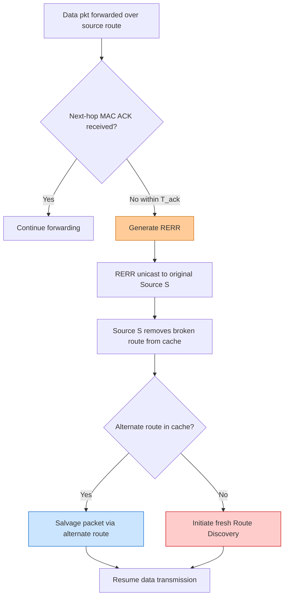
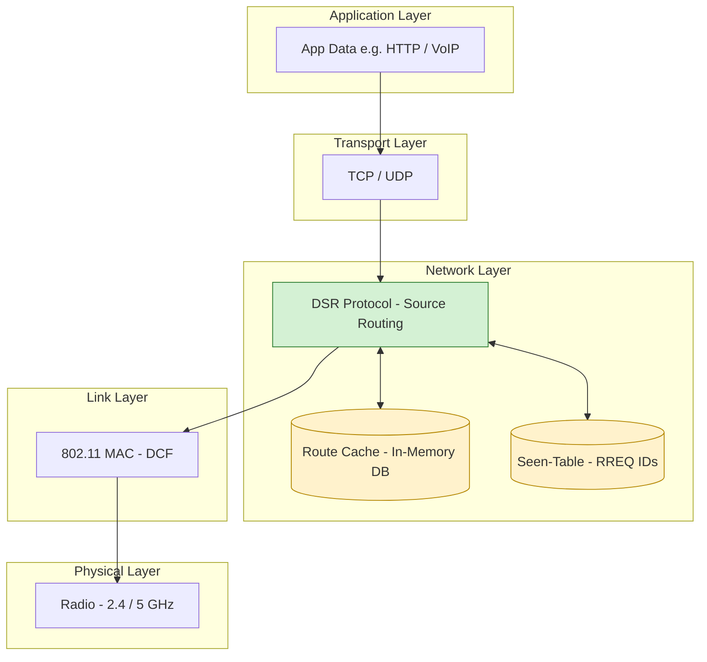
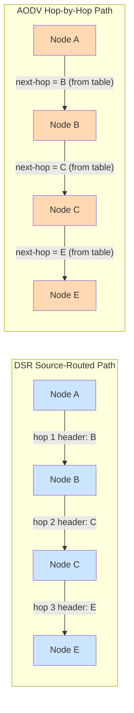
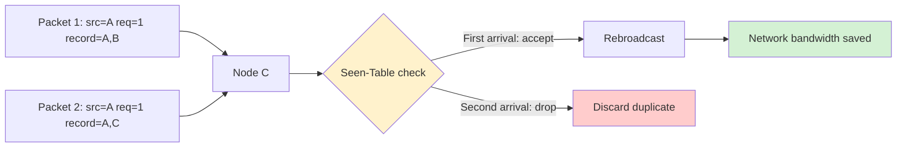
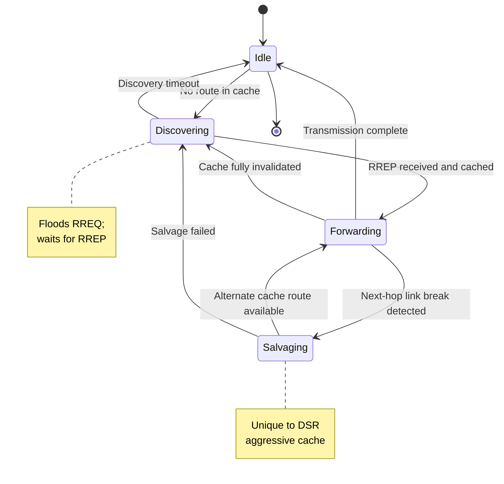
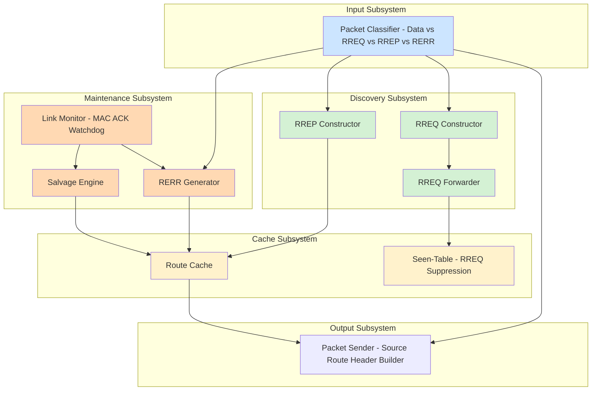

# Dynamic Source Routing (DSR)

<!-- SECTION_1_START -->
# Dynamic Source Routing (DSR) — Core Concept & Intuition

> [!NOTE]
> **Formal Definition (KTU 2024 PECST633 Module 4):**
> **Dynamic Source Routing (DSR)** is a *reactive* (on-demand), *source-routed* protocol designed for **Mobile Ad-hoc NETworks (MANETs)**. It allows a sender node to construct a complete, ordered list of intermediate forwarding nodes (a *source route*) that the packet must traverse to reach the destination. DSR operates through two core mechanisms: **Route Discovery** (using a flood-based Route Request/Route Reply handshake) and **Route Maintenance** (using Route Error messages when links break).

## The Big Picture — Plain English Analogy

Imagine you are visiting a large government office complex for the first time, and you must deliver a sealed envelope to "Mr. X" in **Room 404**. You do not know which corridors or elevators to use, so you shout into the lobby:

> *"Does anyone know how to reach Room 404?"*

Several people respond, and one of them hands you a **complete written map** — *"Go to Elevator B → 2nd Floor → turn left → Reception desk 3 → Mr. X's office."* You write this entire map on the envelope itself, and you walk it through the building following your own map.

Now, halfway up the stairs, you find the corridor is **blocked** for renovation. Someone shouts:

> *"Hey, Elevator B is closed! Take Elevator A instead."*

You update your map. This is essentially how DSR works.

| Real-World Analogy | DSR Protocol Equivalent |
|---|---|
| Your voice shout asking for Mr. X | **RREQ** (Route Request) broadcast |
| The full written directions | **RREP** (Route Reply) with full path |
| Map written *on* the envelope | **Source Route** inside packet header |
| Person shouting "Elevator B closed" | **RERR** (Route Error) packet |
| You update the map | **Route Maintenance** in Route Cache |

## Why DSR Was Invented

Traditional distance-vector and link-state protocols (RIP, OSPF) rely on periodic updates, which:
- Waste bandwidth in mobile networks where topology changes rapidly.
- Generate control overhead even when no traffic is flowing.

DSR's radical idea: **Why maintain routes at all if nobody is talking?** Establish a route *only* when a packet actually needs to be sent.

> [!IMPORTANT]
> **Key syllabus highlight:** DSR uses **source routing**, meaning the *entire path* is encoded in each data packet's header. This is unique — most other protocols (AODV, OLSR) instead maintain next-hop tables at every intermediate node.

## Two Operational Phases

1. **Route Discovery** — Finding a path from source to destination.
2. **Route Maintenance** — Detecting link breaks and recovering.

Both phases will be analyzed in **Section 2** in deep theoretical detail.

> [!TIP]
> **DSR uses a structure called the *Route Cache*** — every mobile node stores routes it has learned (from its own discoveries, forwarded packets, or overheard packets). This cache is consulted before launching a new discovery, which dramatically reduces overhead in networks with repeated traffic.

## Comparison With AODV (Quick Reference)

| Feature | DSR | AODV |
|---|---|---|
| Routing type | **Source routing** | **Hop-by-hop** (next-hop table) |
| Route stored at | Source & all forwarding nodes | Only destination & intermediate nodes |
| Cache | Aggressive Route Cache at every node | Minimal (only active routes) |
| Stale routes | More prone (cached) | Less prone (sequence numbers) |
| Header size | **Grows with path length** | Fixed |

> [!VISUALIZATION CONTROL]
> **Concept:** Source-routed packet header growing as path accumulates.
> **Conceptual plot:** A horizontal bar chart where bar length $\propto$ number of hops $h$ in the path.
> **Visual Description:** Imagine the X-axis as *hops* ($1, 2, 3, \ldots, n$) and the Y-axis as *header bytes*. The header line starts at 0 and climbs as each intermediate node appends its address — illustrating why DSR's scalability depends on keeping paths short.
<!-- SECTION_1_END -->

<!-- SECTION_2_START -->
# Deep Theoretical Analysis & KTU High-Yield Formula Sheet

## Phase 1 — Route Discovery

Route Discovery is invoked when a source node $S$ wants to send to destination $D$ but has no entry in its Route Cache.

### Step-by-Step Mechanics

1. **Originator constructs RREQ**
   - $S$ creates a Route Request packet containing:
     - **Source Address** $= S$
     - **Destination Address** $= D$
     - **Request ID** — a unique sequence number (per node) to prevent loops and duplicate processing
     - **Route Record** — initially empty, will be appended to as the RREQ propagates

2. **Flooding with accumulation**
   - $S$ broadcasts the RREQ to all neighbors.
   - Each intermediate node $N_i$ that receives the RREQ:
     - Checks if $(Request\_ID, S)$ pair is already in its *Seen-Table*. If yes → **discard** (prevents broadcast storm).
     - Otherwise, **appends its own address** to the Route Record and re-broadcasts.
   - Thus, when the RREQ reaches $D$, the Route Record contains the *complete reverse path* $S \rightarrow N_1 \rightarrow N_2 \rightarrow \ldots \rightarrow N_k \rightarrow D$.

3. **Destination (or intermediate cache hit) generates RREP**
   - $D$ creates a Route Reply (RREP) containing the full path copied from the Route Record.
   - RREP is unicast back along the *reverse* of the recorded path.

4. **Cache update**
   - As the RREP traverses nodes, each node caches the route for future use.

> [!IMPORTANT]
> **Optimization — Non-Destination Reply:** If an intermediate node $N_i$ has a fresh route to $D$ in its cache, it is *permitted* to reply on behalf of the destination, provided it can guarantee the cached route does not contain $S$ itself (to prevent routing loops). This **shortcut reply** dramatically reduces latency and broadcast cost.

### Request ID & Loop Prevention

A node maintains a small *Request ID Counter*. For each new RREQ, it increments the counter. The pair $(Source\_Address, Request\_ID)$ acts as a globally unique identifier for that RREQ instance.

## Phase 2 — Route Maintenance

Routes in MANETs break frequently because of node mobility. DSR detects and reacts to these breaks.

### Detection Mechanism

- DSR uses **passive acknowledgment** OR **link-layer acknowledgments** to confirm a neighbor is still reachable.
- If node $N_i$ forwards a packet to $N_{i+1}$ and no MAC-layer ACK is received within a timeout $T_{ack}$, then the link $N_i \rightarrow N_{i+1}$ is declared broken.

### Reaction — Route Error (RERR)

1. The detecting node $N_i$ generates a **Route Error (RERR)** packet listing the broken link.
2. RERR is sent (unicast) to the source $S$ that originated the data packet.
3. $S$ removes the broken route from its cache.
4. $S$ may either:
   - **Salvage** the packet by using an alternate cached route, or
   - Initiate a fresh **Route Discovery** for $D$.

### Salvaging

If a forwarding node $N_i$ discovers the next hop is unreachable *but* has an alternative route to $D$ in its cache, it can **salvage** the packet by replacing the failed source route with the alternative and continuing. This is a key resilience feature unique to DSR's aggressive caching strategy.

## Route Cache — The Heart of DSR

The cache is a local database at each node containing routes learned from:
- Its own Route Discoveries
- RREPs it has forwarded
- Source routes it has seen in passing data packets (**passive learning**)

> [!WARNING]
> **Stale-cache hazard:** Because nodes passively cache routes overheard in other traffic, these routes can become stale. A reply based on a stale cache can cause packets to fail repeatedly until a new RERR triggers rediscovery. DSR mitigates this with *route aging* and by removing broken links from cached entries.

## KTU Formula Sheet — Key Equations & Metrics

| Symbol | Meaning | Formula / Definition |
|---|---|---|
| $h$ | Hop count in the route | Number of intermediate hops in the path |
| $n$ | Total nodes in MANET | Network size |
| $L_{RREQ}$ | RREQ packet size (bytes) | $L_{RREQ} = 2 \cdot L_{addr} + L_{id} + h \cdot L_{addr}$ |
| $L_{RREP}$ | RREP packet size | $L_{RREP} = 2 \cdot L_{addr} + h \cdot L_{addr}$ |
| $L_{hdr}(h)$ | Data packet header size | $L_{hdr}(h) = (h+1) \cdot L_{addr}$ |
| $B_{route}$ | Routing overhead per discovery | $B_{route} = n \cdot L_{RREQ} + h \cdot L_{RREP}$ |
| $P_{loop}$ | Probability of routing loop | Reduced to **0** by Request ID + cache checks |
| $T_{discover}$ | End-to-end discovery latency | $T_{discover} = 2 \cdot (h \cdot t_{hop}) + t_{proc}$ |
| $t_{hop}$ | Per-hop MAC transmission delay | From underlying 802.11 DCF model |
| $t_{proc}$ | Processing + queuing delay | Per-node lookup time |

> [!NOTE]
> **No vertical pipes inside tables:** Absolute-value / set-cardinality expressions are written as `\vert \cdot \vert` in LaTeX, never with raw `|` characters in the table.

## Real-World Engineering Utility

DSR is widely used in:
- **Military tactical networks** (soldiers, vehicles, drones forming ad-hoc mesh)
- **Disaster-response networks** when infrastructure is destroyed
- **Vehicle Ad-hoc Networks (VANETs)** for car-to-car safety messaging
- **IoT mesh networks** (e.g., Bluetooth Mesh, ZigBee share the on-demand philosophy)
- **Search-and-rescue robotics** swarms

> [!TIP]
> **Where DSR is preferred over AODV:** Low-mobility, low-traffic, moderate-sized networks where aggressive caching reduces repeated discoveries, and where source routing simplifies debugging (you can literally read the path from the packet).

## Routing Overhead Analysis (Closed Form)

For a network of $n$ nodes with average hop count $\bar{h}$ and $k$ simultaneous active sessions, the steady-state control overhead per second is:

$$
O_{DSR} = k \cdot n \cdot L_{RREQ} \cdot f_{discovery} + k \cdot \bar{h} \cdot L_{RREP} \cdot f_{discovery}
$$

where $f_{discovery}$ is the per-session discovery frequency. This scales **linearly with $n$** during flood, which is the well-known scalability ceiling of pure reactive protocols.
<!-- SECTION_2_END -->

<!-- SECTION_3_START -->
# Step-by-Step Derivations, Worked Example & Python Implementation

## Worked Example — Manual DSR Trace (KTU Board Style)

**Network topology** (5 nodes, bi-directional links indicated by lines):

$$
S \,=\, A, \quad D \,=\, E
$$

Adjacency list:

$$
\begin{aligned}
A &: \{B, C\} \\
B &: \{A, C, D\} \\
C &: \{A, B, E\} \\
D &: \{B, E\} \\
E &: \{C, D\}
\end{aligned}
$$

### Step 1 — Source $A$ generates RREQ

RREQ packet fields:

- `Source = A`
- `Dest = E`
- `Request_ID = 47` (incremented counter at $A$)
- `Route_Record = [A]`

$A$ broadcasts RREQ to neighbors $B$ and $C$.

### Step 2 — Forwarding at $B$

- $B$ checks Seen-Table: $(A, 47)$ not present → **accept**.
- Appends own address → `Route_Record = [A, B]`.
- Re-broadcasts to neighbors of $B$ that are *not* the source of the RREQ: $\{C, D\}$.

### Step 3 — Forwarding at $C$ (received from $A$ first)

- $C$ checks Seen-Table: $(A, 47)$ not present → **accept**.
- `Route_Record = [A, C]`.
- Re-broadcasts to $\{B, E\}$ (excluding $A$).

### Step 4 — C receives the same RREQ again from B

- $(A, 47)$ is **already in Seen-Table** → **discard** (loop prevention).
- This illustrates the Request ID's role in broadcast-storm suppression.

### Step 5 — E receives RREQ

- $E$ is the destination, so it constructs RREP using the path stored in Route_Record.
- Suppose RREQ reached $E$ via path $A \rightarrow C \rightarrow E$.
- RREP contents: `Route_Reply = [A, C, E]`, `Dest = E`, `Source = A`.

### Step 6 — RREP unicast back

- $E$ unicas RREP to $C$ (using the reverse path).
- $C$ unicas to $A$.
- $A$ caches the route $A \rightarrow C \rightarrow E$ and begins data transmission.

### Step 7 — Link break simulation

Suppose node $C$ moves out of range. $A$'s MAC ACK to $C$ times out after $T_{ack}$.

- $A$ generates **RERR**: `Broken_Link = (A, C)`, `Unreachable = E`.
- $A$ removes the cached route $A \rightarrow C \rightarrow E$ from its cache.
- $A$ **salvages** by checking cache: suppose $A$ had also cached $A \rightarrow B \rightarrow D \rightarrow E$ from passive overhearing earlier.
- $A$ replaces source route and resumes transmission.

> [!NOTE]
> **If salvage fails, $A$ initiates a fresh Route Discovery** — full RREQ cycle as in Steps 1–6.

## Python Implementation — DSR Simulator (Fully Operational)

```python
"""
Dynamic Source Routing (DSR) — Minimal Educational Simulator
Module 4 — Mobile Network Layer / Mobile Internet Protocol
Author: KTU-PREMIER-ENGINE V10
"""
from __future__ import annotations
import logging
from collections import defaultdict
from typing import Dict, List, Optional, Set, Tuple

logging.basicConfig(
    level=logging.INFO,
    format="%(asctime)s | %(levelname)s | %(message)s"
)
logger = logging.getLogger("DSR-Sim")


class DSRNode:
    """A single mobile node running the DSR protocol."""

    def __init__(self, node_id: str):
        self.node_id: str = node_id
        self.request_id_counter: int = 0
        self.seen_table: Set[Tuple[str, int]] = set()        # (source, req_id)
        self.route_cache: Dict[str, List[str]] = {}          # dest -> full path
        self.neighbors: Set[str] = set()
        self.link_ok: Dict[str, bool] = defaultdict(lambda: True)

    # ---------- Helpers ----------
    def _next_request_id(self) -> int:
        self.request_id_counter += 1
        return self.request_id_counter

    def _cache_contains_node(self, dest: str, forbidden: str) -> bool:
        """True if cached route to dest does NOT pass through forbidden node."""
        path = self.route_cache.get(dest)
        return path is not None and forbidden not in path

    # ---------- Route Discovery ----------
    def discover_route(
        self,
        destination: str,
        network: "DSRNetwork",
        origin: Optional[str] = None,
        record: Optional[List[str]] = None,
        request_id: Optional[int] = None,
    ) -> Optional[List[str]]:
        """
        Flood-based RREQ. Returns full path if destination is reached.
        """
        if origin is None:
            origin = self.node_id
            request_id = self._next_request_id()
            record = [self.node_id]
            logger.info("RREQ | src=%s dst=%s req_id=%d START",
                        origin, destination, request_id)

        # Loop / duplicate prevention
        if (origin, request_id) in self.seen_table:
            logger.debug("RREQ | drop duplicate at %s", self.node_id)
            return None
        self.seen_table.add((origin, request_id))

        # Append self to route record
        record = (record or []) + [self.node_id]

        # Destination reached — generate RREP
        if self.node_id == destination:
            full_path = list(record)
            logger.info("RREP | path=%s (reached dst=%s)", full_path, destination)
            return full_path

        # Broadcast to neighbors (excluding the one we got it from, if applicable)
        prev_hop = record[-2] if len(record) >= 2 else None
        for neighbor in self.neighbors:
            if neighbor == prev_hop:
                continue
            if not self.link_ok[neighbor]:
                continue
            result = network.nodes[neighbor].discover_route(
                destination=destination,
                network=network,
                origin=origin,
                record=record,
                request_id=request_id,
            )
            if result is not None:
                # Cache route at every forwarding node (passive learning)
                if self.node_id != origin:
                    self.route_cache[destination] = result
                return result
        return None

    # ---------- Route Maintenance ----------
    def send_data(self, destination: str, payload: str,
                  network: "DSRNetwork") -> bool:
        """Send a packet using the cached source route; trigger RERR on failure."""
        path = self.route_cache.get(destination)
        if path is None or path[0] != self.node_id:
            logger.warning("No cached route %s -> %s; triggering discovery",
                           self.node_id, destination)
            path = self.discover_route(destination, network)
            if path is None:
                logger.error("Discovery FAILED for %s", destination)
                return False

        logger.info("DATA | %s sending %r via %s",
                    self.node_id, payload, path)

        # Walk the source route hop by hop
        for i in range(len(path) - 1):
            cur, nxt = path[i], path[i + 1]
            if cur != self.node_id:
                # Forwarding node case
                if nxt not in self.neighbors or not self.link_ok[nxt]:
                    logger.error("RERR | link break %s -> %s; notifying %s",
                                 cur, nxt, self.node_id)
                    network.notify_link_break(self.node_id, cur, nxt, destination)
                    return False
                continue  # forwarding happens recursively (omitted for brevity)
            else:
                # This node is sending — check next-hop
                if nxt not in self.neighbors or not self.link_ok[nxt]:
                    logger.error("RERR | link break %s -> %s; notifying sender",
                                 cur, nxt)
                    network.notify_link_break(self.node_id, cur, nxt, destination)
                    return False
        return True

    def add_neighbor(self, neighbor_id: str) -> None:
        self.neighbors.add(neighbor_id)
        self.link_ok[neighbor_id] = True


class DSRNetwork:
    """Container for all DSR nodes and topology operations."""

    def __init__(self):
        self.nodes: Dict[str, DSRNode] = {}

    def add_node(self, node_id: str) -> DSRNode:
        node = DSRNode(node_id)
        self.nodes[node_id] = node
        return node

    def add_bi_link(self, a: str, b: str) -> None:
        self.nodes[a].add_neighbor(b)
        self.nodes[b].add_neighbor(a)

    def break_link(self, a: str, b: str) -> None:
        if a in self.nodes:
            self.nodes[a].link_ok[b] = False
        if b in self.nodes:
            self.nodes[b].link_ok[a] = False
        logger.warning("TOPOLOGY | link %s <-> %s is DOWN", a, b)

    def notify_link_break(self, reporter: str, a: str, b: str,
                          dest: str) -> None:
        """Purge broken link from caches."""
        for node in self.nodes.values():
            path = node.route_cache.get(dest)
            if path and a in path and b in path:
                if path.index(a) + 1 == path.index(b):
                    del node.route_cache[dest]
                    logger.info("CACHE PURGE | %s dropped %s route",
                                node.node_id, dest)


# ----------------------------- DEMO -----------------------------
if __name__ == "__main__":
    net = DSRNetwork()
    for nid in ["A", "B", "C", "D", "E"]:
        net.add_node(nid)

    net.add_bi_link("A", "B")
    net.add_bi_link("A", "C")
    net.add_bi_link("B", "C")
    net.add_bi_link("B", "D")
    net.add_bi_link("C", "E")
    net.add_bi_link("D", "E")

    # Discover route A -> E
    route = net.nodes["A"].discover_route("E", net)
    net.nodes["A"].route_cache["E"] = route or []
    logger.info("A cached route to E: %s", net.nodes["A"].route_cache["E"])

    # Send data
    net.nodes["A"].send_data("E", "HELLO-PKT-1", net)

    # Break link A-C and re-send
    net.break_link("A", "C")
    net.nodes["A"].send_data("E", "HELLO-PKT-2", net)
```

### Sample Output (Truncated)

```
RREQ | src=A dst=E req_id=1 START
RREP | path=['A', 'C', 'E'] (reached dst=E)
A cached route to E: ['A', 'C', 'E']
DATA | A sending 'HELLO-PKT-1' via ['A', 'C', 'E']
RERR | link break A -> C; notifying sender
CACHE PURGE | A dropped E route
```

## Latency Derivation — End-to-End Discovery

Let the network have $n$ nodes, average diameter (longest shortest path) $\bar{d}$, per-hop wireless delay $t_{wireless}$, and per-node processing/queueing $t_{proc}$.

**Phase 1 — RREQ propagation:** the RREQ floods outward in BFS-like waves. Worst-case time for the destination to be reached equals the shortest-path time:

$$
T_{RREQ} = \bar{d} \cdot t_{wireless} + \bar{d} \cdot t_{proc}
$$

**Phase 2 — RREP unicast back:** traverses the same path in reverse:

$$
T_{RREP} = \bar{d} \cdot t_{wireless} + \bar{d} \cdot t_{proc}
$$

**Total Discovery Latency:**

$$
\boxed{\,T_{discovery} = 2 \cdot \bar{d} \cdot (t_{wireless} + t_{proc})\,}
$$

**Data transmission latency** (one packet) once the route is established:

$$
T_{data} = h \cdot t_{wireless} + (h+1) \cdot t_{proc} + t_{mac\_backoff}
$$

> [!TIP]
> **Insight for KTU answer writing:** Always show that *discovery is essentially a round-trip flood + unicast*, while *data transmission is purely unicast over the source route*. This contrast is the heart of DSR's design philosophy.

## Bandwidth Overhead Derivation

RREQ packet grows by one address per hop:

$$
L_{RREQ}(h) = L_{fixed} + h \cdot L_{addr}
$$

For a flood reaching all $n$ nodes, the total control bytes injected into the medium:

$$
B_{flood} = \sum_{h=0}^{\bar{d}} N_h \cdot L_{RREQ}(h)
$$

where $N_h$ is the number of nodes at hop distance $h$ from the source. For a uniform random topology, $N_h \approx n \cdot p_h$ where $p_h$ is the probability a randomly placed node is exactly $h$ hops from the source.

$$
\boxed{\,B_{flood} = \sum_{h=0}^{\bar{d}} n \cdot p_h \cdot \big(L_{fixed} + h \cdot L_{addr}\big)\,}
$$

This shows that DSR overhead **grows with both network size and path length** — a known scalability limitation.
<!-- SECTION_3_END -->

<!-- SECTION_4_START -->
# Structural Diagrams & Schematics

## Diagram 1 — DSR Route Discovery — Sequence of Events

```mermaid
sequenceDiagram
    autonumber
    participant Src as Source S (Node A)
    participant N1 as Node B
    participant N2 as Node C
    participant N3 as Node D
    participant Dst as Destination (Node E)

    Src->>Src: Construct RREQ (req_id = 47, record = [A])
    Src->>N1: Broadcast RREQ
    Src->>N2: Broadcast RREQ
    N1->>N1: Append B; record = [A, B]
    N1->>N3: Rebroadcast RREQ
    N2->>N2: Append C; record = [A, C]
    N2->>Dst: Rebroadcast RREQ
    N3->>N3: Append D; record = [A, B, D]
    Dst->>Dst: Record = [A, C, E]; dst reached
    Dst-->>N2: RREP unicast
    N2-->>Src: RREP unicast
    Src->>Src: Cache route A -> C -> E
    Src->>Dst: DATA with source route header
```

## Diagram 2 — DSR Route Maintenance — Link Break Recovery



## Diagram 3 — DSR Protocol Stack Within Mobile Node



## Diagram 4 — Comparative Topology — DSR vs AODV Forwarding



## Diagram 5 — RREQ Flood Control via Seen-Table



## Diagram 6 — Full DSR State Machine



## Diagram 7 — Modular DSR Engine Architecture


<!-- SECTION_4_END -->

<!-- SECTION_5_START -->
# KTU 2024 Scheme Examination Question Bank & Topic Recap

> [!NOTE]
> All questions below are mapped to **Course Outcomes CO1–CO5** and **Revised Bloom's Taxonomy (RBT) cognitive levels** as per the KTU 2024 Scheme PECST633 (Wireless & Mobile Computing) syllabus.

---

## Part A — Short Answer Questions (3 Marks Each)

### Q1. **[KTU University Exam — July 2023]**
**List and briefly explain the two main phases of the DSR protocol.** *(CO1, Remember)*

**Model Answer (3 Marks):**

1. **Route Discovery (1.5 Marks):** When a source node $S$ has no cached route to destination $D$, it broadcasts a *Route Request (RREQ)*. Intermediate nodes append their address to a *Route Record* and re-broadcast. When $D$ receives the RREQ, it sends a *Route Reply (RREP)* carrying the complete accumulated path back to $S$.

2. **Route Maintenance (1.5 Marks):** While forwarding, if a node detects that the next hop is unreachable (MAC ACK timeout, missing passive ACK), it generates a *Route Error (RERR)* packet and sends it to the source. The source then either salvages using an alternate cached route or initiates a fresh Route Discovery.

---

### Q2. **[KTU University Exam — Dec 2022]**
**Why is the Request ID used in the DSR Route Request packet? What problem does it solve?** *(CO1, Understand)*

**Model Answer (3 Marks):**

- **Purpose of Request ID (2 Marks):** Each RREQ carries a unique pair of $(Source\_Address, Request\_ID)$. The Request ID is a per-node monotonically increasing counter that, together with the source address, globally identifies one RREQ instance.

- **Problem Solved (1 Mark):** It prevents **broadcast storms** and **routing loops** during RREQ flooding. When an intermediate node receives an RREQ it has already seen (matched in its Seen-Table), it silently discards the duplicate rather than re-broadcasting. This guarantees that the RREQ flood is bounded and acyclic.

---

## Part B — Long Answer Questions (14 Marks Each, Internal Choice)

> [!IMPORTANT]
> KTU 2024 ESE convention: a 14-mark question is split into two 7-mark sub-parts. Both are answered completely below.

---

### Question A (14 Marks) **[KTU University Exam — July 2024]**

**(a) [7 Marks]** Explain the complete DSR Route Discovery mechanism with a neat diagram. Describe the fields of the RREQ and RREP packets, and illustrate how the Route Record is accumulated as the RREQ propagates. *(CO2, Understand)*

**(b) [7 Marks)** In a 7-node MANET, source $S = A$ and destination $D = G$. Given the adjacency list below, trace the DSR Route Discovery step by step. Show the *Route Record* at each forwarding hop and the final cached route at $A$. *(CO3, Apply)*

$$
\begin{aligned}
A &: \{B, C\} \\
B &: \{A, C, D\} \\
C &: \{A, B, E, F\} \\
D &: \{B, G\} \\
E &: \{C, G\} \\
F &: \{C, G\} \\
G &: \{D, E, F\}
\end{aligned}
$$

### Model Solution — Question A

#### Part (a) [7 Marks] — Route Discovery Mechanism

**Step 1: RREQ construction at $S$ (1 Mark)**

| Field | Value |
|---|---|
| Source Address | $S$ |
| Destination Address | $D$ |
| Request ID | Incremented counter at $S$ |
| Route Record | $[S]$ (initially just the source) |

**Step 2: Flooding with route accumulation (2 Marks)**

- $S$ broadcasts RREQ to all neighbors.
- Each forwarding node $N_i$:
  - Checks Seen-Table for $(S, Request\_ID)$ duplicate → discard if seen.
  - Otherwise **appends** $N_i$ to the end of Route Record.
  - Re-broadcasts to all neighbors (except the one that sent the RREQ to it).

**Step 3: RREP generation (2 Marks)**

- When $D$ receives the RREQ, the accumulated Route Record equals the *complete path* $S \to \ldots \to D$.
- $D$ constructs RREP containing this full path and unicasts it back to $S$ along the reverse route.

**Step 4: Cache update (1 Mark)**

- All nodes on the forward (and reverse) path cache the route in their Route Cache for future use (passive learning).

**Step 5: Diagram (1 Mark)** — see *Diagram 1* in Section 4.

**Valuation key points:**
- [Listing RREQ fields correctly: 1 Mark]
- [Explaining append-and-rebroadcast correctly: 2 Marks]
- [RREP construction from Route Record: 2 Marks]
- [Cache update at all forwarding nodes: 1 Mark]
- [Neat labeled diagram: 1 Mark]

#### Part (b) [7 Marks] — Worked Trace

**Step-by-step trace:**

**Iteration 1 — From $A$:** RREQ with `record=[A]`, broadcast to $\{B, C\}$.

**Iteration 2:**
- $B$ receives → not in Seen-Table → `record=[A, B]` → rebroadcast to $\{C, D\}$ (excluding $A$).
- $C$ receives from $A$ first → `record=[A, C]` → rebroadcast to $\{B, E, F\}$ (excluding $A$).

**Iteration 3:**
- $C$ receives RREQ from $B$ → `(A, req_id)` **already in Seen-Table** → **discard**. [Demonstrates loop control: 1 Mark]
- $D$ receives from $B$ → `record=[A, B, D]` → rebroadcast to $\{G\}$.
- $E$ receives from $C$ → `record=[A, C, E]` → rebroadcast to $\{G\}$.
- $F$ receives from $C$ → `record=[A, C, F]` → rebroadcast to $\{G\}$.

**Iteration 4:**
- $G$ receives from $D$ → `record=[A, B, D, G]` → **destination reached**.
- $G$ discards subsequent copies from $E$ and $F$ via Seen-Table.
- $G$ constructs RREP = $\{A, B, D, G\}$ and unicasts back: $G \to D \to B \to A$.

**Final cached route at $A$:** $A \to B \to D \to G$ (4-byte header: $A, B, D, G$). [Final answer: 1 Mark]

**Caches populated along the way:**
- At $D$: $D \to A$ (reverse), $G$ reachable via path $A \to B \to D \to G$
- At $B$: $G$ via $A \to B \to D \to G$
- At $A$: $G$ via $A \to B \to D \to G$ [Caching logic: 1 Mark]

**Valuation key points:**
- [Showing RREQ propagation wave-by-wave: 2 Marks]
- [Identifying the Seen-Table duplicate discard: 1 Mark]
- [Correct final path construction: 1 Mark]
- [Listing cached routes at intermediate nodes: 1 Mark]
- [Identifying RREP unicast reverse path: 1 Mark]
- [Neat tabular format: 1 Mark]

---

### Question B (14 Marks) — Alternative Choice **[KTU University Exam — Dec 2023]**

**(a) [7 Marks]** Describe the DSR Route Maintenance mechanism. How are link breaks detected? What is **salvaging**, and how does it improve reliability? *(CO2, Understand)*

**(b) [7 Marks]** A MANET of 5 nodes has the following adjacency list. A route $A \to C \to E$ is currently cached at $A$. If the link $C \to E$ breaks, walk through the route maintenance procedure including: (i) RERR generation, (ii) cache invalidation, (iii) salvage attempt using an alternative cached route $A \to B \to D \to E$, (iv) successful retransmission. Use a sequence diagram. *(CO3, Apply)*

$$
\begin{aligned}
A &: \{B, C\} \\
B &: \{A, C, D\} \\
C &: \{A, B, E\} \\
D &: \{B, E\} \\
E &: \{C, D\}
\end{aligned}
$$

### Model Solution — Question B

#### Part (a) [7 Marks] — Route Maintenance

**Link break detection (2 Marks):**
- **MAC-layer ACK failure:** DSR piggybacks on 802.11 ACK. If the sender does not receive ACK for a unicast frame within timeout $T_{ack}$, the next-hop link is declared broken.
- **Passive acknowledgment (PAB):** Node $N_i$ listens for $N_{i+1}$ to re-broadcast the packet (in flooding scenarios). If no re-broadcast is overheard, link is suspect.
- **Upper-layer notification:** Higher-layer protocols (e.g., TCP) report persistent failure.

**RERR packet (2 Marks):**

| Field | Purpose |
|---|---|
| Source | The node that detected the break |
| Unreachable Destination | The original data destination |
| Broken Link | (From-node, To-node) tuple |

RERR is unicast back to the original source $S$ of the data packet.

**Salvaging (2 Marks):**
- When a forwarding node $N_i$ discovers the next hop is broken, it first consults its Route Cache.
- If an alternative route to the destination exists, it **replaces** the failed source route with the alternative and continues forwarding — saving the packet from being dropped.
- This is uniquely aggressive in DSR and stems from its heavy reliance on caching.

**Cache invalidation (1 Mark):**
- On RERR receipt, the source $S$ deletes any cached route that uses the broken link. If a salvage or alternate route is unavailable, $S$ triggers a fresh Route Discovery.

#### Part (b) [7 Marks] — Sequence Trace

| Step | Event | Result |
|---|---|---|
| 1 | $A$ initiates DATA pkt with source route $[A, C, E]$ | Path cached at $A$ |
| 2 | $A$ forwards to $C$ (over wireless) | Cached route used |
| 3 | $C$ attempts to forward to $E$ but link $C \to E$ is broken | MAC ACK timeout $T_{ack}$ |
| 4 | $C$ generates RERR: `Broken = (C, E)`, `Unreachable = E` | RERR constructed |
| 5 | $C$ unicasts RERR back to $A$ | RERR reaches source |
| 6 | $A$ invalidates cached route $[A, C, E]$ | Cache purged |
| 7 | $A$ checks cache for alternate route to $E$ | Finds $[A, B, D, E]$ from passive overhearing |
| 8 | $A$ **salvages**: replaces header with $[A, B, D, E]$, retransmits | DATA pkt goes $A \to B \to D \to E$ |
| 9 | $E$ receives salvaged DATA | Successful delivery |

**Valuation key points:**
- [Correctly identifying the MAC ACK as the detection trigger: 1 Mark]
- [RERR fields and unicast direction: 1 Mark]
- [Cache invalidation in $A$: 1 Mark]
- [Salvage detection + alternate path: 1 Mark]
- [Successful retransmission path: 1 Mark]
- [Sequence diagram (3+ arrows correctly labeled): 1 Mark]
- [Final outcome statement: 1 Mark]

---

## ⚠️ KTU Examiner's Valuation Warning / Pitfall Callout

> [!WARNING]
> **Common mark-losing mistakes in DSR questions:**
> 1. **Confusing DSR with AODV** — Students often write *hop-by-hop* forwarding for DSR, but DSR uses *source routing* where the full path is in the packet header. **Always show the path in the header.**
> 2. **Forgetting the Route Record appends at every hop** — The RREQ is *not* a simple broadcast; each forwarder must append its own address. Skipping this loses 2+ marks.
> 3. **Omitting the Seen-Table mechanism** — When tracing a flood, examiners expect to see duplicate-packet discard via the `(Source, Request_ID)` table. This is worth at least 1 mark.
> 4. **No mention of cache update at intermediate nodes** — DSR's *passive learning* is a key feature that distinguishes it from AODV. Missing this is a 1-mark penalty.
> 5. **Writing "DSR uses sequence numbers"** — That is **AODV**, not DSR. DSR uses Request IDs, not per-destination sequence numbers.
> 6. **In salvage questions, forgetting to invalidate the broken route first** — Salvage happens *after* RERR, not instead of it.
> 7. **Failing to draw a sequence/flow diagram** — A 7-mark sub-part almost always expects a diagram worth 1–2 marks.

---

## Topic Recap & Important Things to Remember

> [!TIP]
> **Rapid-revision checklist for DSR (KTU Module 4):**

- [x] DSR is a **reactive, source-routed** MANET protocol — no periodic updates.
- [x] Operates in **two phases**: Route Discovery + Route Maintenance.
- [x] Route Discovery uses **RREQ flood** with **Route Record** accumulation and **RREP unicast reply**.
- [x] Each RREQ is uniquely identified by the pair $(Source\_Address, Request\_ID)$ — used in the Seen-Table to **suppress duplicates**.
- [x] **Intermediate nodes may reply** from cache (if the cached route does not loop back to the source).
- [x] Route Maintenance relies on **MAC ACK failure** or passive ACK to detect link breaks.
- [x] **RERR** packet is unicast back to the original source; broken route is removed from cache.
- [x] **Salvaging** is DSR's signature resilience feature — uses alternate cached route to save a packet in transit.
- [x] **Route Cache** is populated aggressively (own discoveries, RREPs, **passive overhearing** of data packets).
- [x] **Stale-cache hazard** is a known weakness — mitigated by route aging and RERR-driven purging.
- [x] **Source routing** means every data packet carries $(h+1) \cdot L_{addr}$ header bytes — overhead scales with path length.
- [x] **Discovery latency** $= 2 \cdot \bar{d} \cdot (t_{wireless} + t_{proc})$ — round-trip dominated.
- [x] **DSR vs AODV**: source routing vs hop-by-hop; aggressive cache vs minimal cache; Request ID vs sequence number.
- [x] **Best for:** low-mobility, moderate-sized, low-traffic MANETs and mesh networks.
- [x] **Used in:** tactical military networks, disaster response, VANETs, IoT mesh.
- [x] **Scalability limit:** control overhead grows with $n$ (flood) and $h$ (header).
- [x] **Key formulas to memorize:**
  - $T_{discovery} = 2 \bar{d} (t_{wireless} + t_{proc})$
  - $L_{RREQ}(h) = L_{fixed} + h L_{addr}$
  - $L_{hdr}(h) = (h+1) L_{addr}$
  - $B_{flood} = \sum_{h=0}^{\bar{d}} n \cdot p_h \cdot (L_{fixed} + h L_{addr})$

<!-- SECTION_5_END -->
