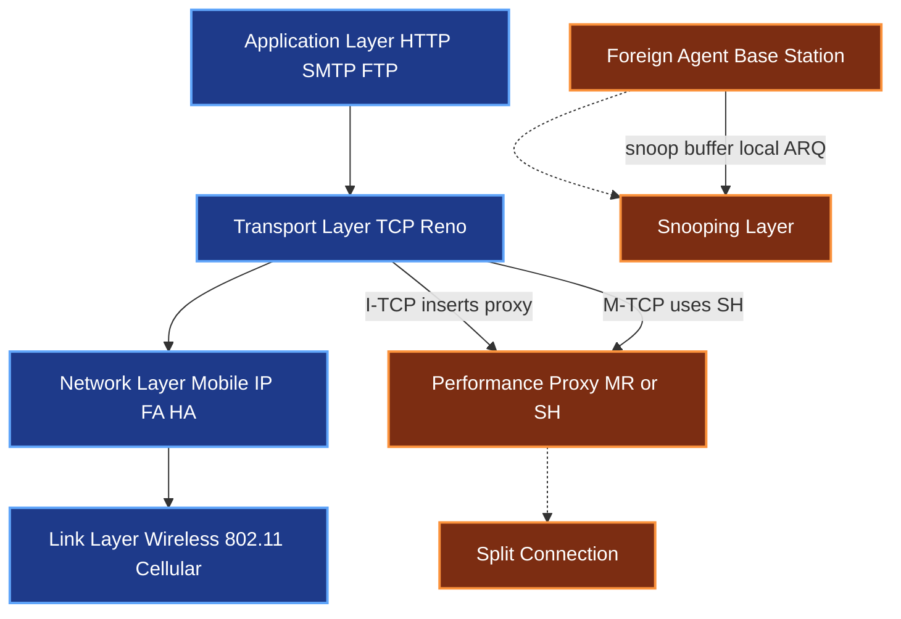
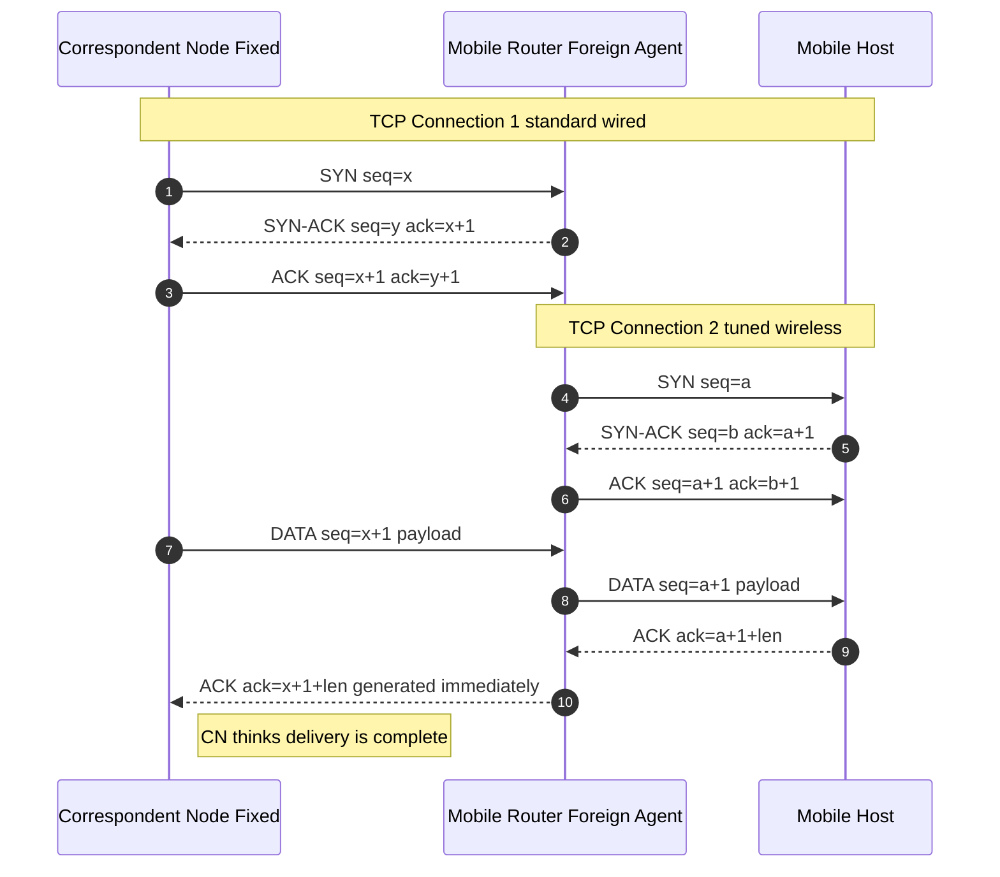
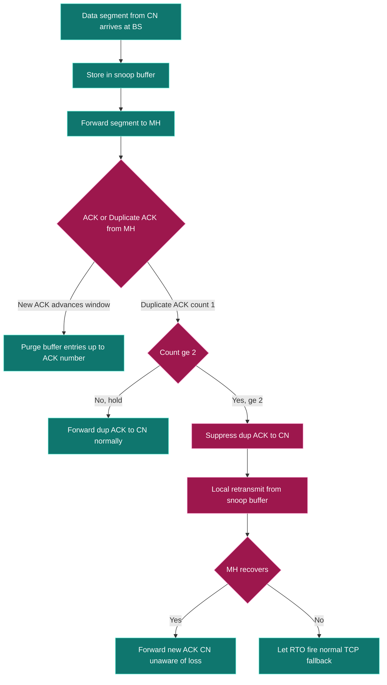
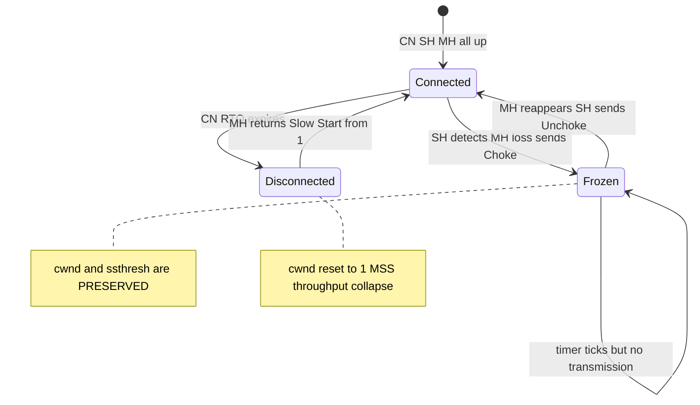
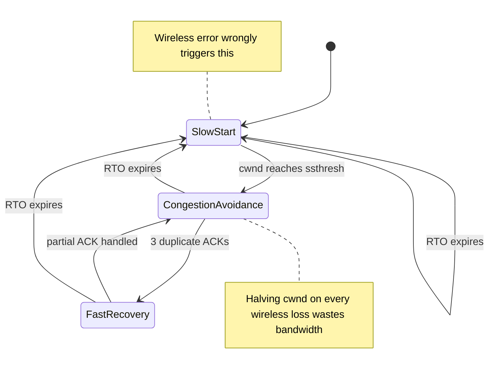
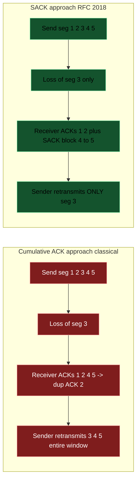
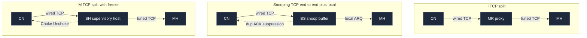

# Improvements in Classical TCP;

<!-- SECTION_1_START -->

# 📡 Improvements in Classical TCP — KTU Module 4 Notes

## 1.1 Classical TCP — What It Is

**Transmission Control Protocol (TCP)** is the dominant transport-layer protocol of the Internet, designed primarily for **wired, reliable, low-bit-error-rate networks** with relatively **stable round-trip times (RTT)**. Classical TCP variants — **TCP Tahoe, TCP Reno, TCP NewReno, and TCP Vegas** — interpret *any* packet loss as a sign of **network congestion** and react by shrinking the congestion window ($cwnd$).

In the KTU 2024 syllabus, "Classical TCP" refers to the **TCP Reno family** (Tahoe + Reno + NewReno), which is the textbook baseline used in all comparisons with wireless-aware extensions.

> [!NOTE]
> **Formal Definition (KTU 2024 Module 4):**
> *Classical TCP* is a connection-oriented, reliable, byte-stream transport protocol that uses **sliding-window flow control**, **cumulative positive ACKs**, **slow start**, **congestion avoidance**, and **retransmission timeouts (RTO)** to guarantee in-order, loss-free delivery. It treats the path between sender and receiver as a *single, homogeneous, wired* pipe.

## 1.2 Why Classical TCP Struggles in Wireless & Mobile Networks

Wireless links introduce three pathologies that wired networks do not have:

1. **High, bursty bit-error rates (BER)** — typically $10^{-3}$ to $10^{-6}$, vs. $10^{-9}$ in fiber.
2. **Frequent, unpredictable handoffs** between base stations, causing packet reordering or temporary disconnection.
3. **Variable latency and bandwidth asymmetry** between uplink and downlink.

Because TCP Reno cannot distinguish *congestion loss* from *wireless loss*, every wireless error forces it to:

- Trigger **fast retransmit** (after 3 duplicate ACKs),
- Halve $cwnd$ via **fast recovery**, and
- Possibly fall back to **slow start** if RTO expires.

> [!IMPORTANT]
> **Syllabus Highlight (CO3 / KTU Module 4):**
> The fundamental flaw of classical TCP in mobile IP is its *congestion-centric loss model*. In wireless, this leads to **throughput collapse**, **unfair bandwidth sharing**, and **energy waste** on the mobile node.

## 1.3 The Intuition — A Real-World Analogy

> [!TIP]
> **Conceptual Analogy: The Over-Cautious Truck Driver 🚛**
>
> Imagine a delivery driver (TCP sender) driving on a single road. Every time the truck **stops even briefly** — for a red light, a pothole, or a flat tyre — the driver assumes there is a **massive traffic jam ahead** and **cuts speed by half**, then slowly accelerates again.
>
> - On a *highway* (wired network), stops are almost always due to jams → the strategy works.
> - On a *wobbly mountain road* (wireless link), stops are usually due to *potholes* (bit errors) or *landslides* (handoffs), not jams. Yet the driver keeps slowing down unnecessarily.
>
> **Improvements in TCP** are essentially *training the driver* to ask: *"Was that a jam, or just a bad road?"* and react accordingly.

## 1.4 Where the Problem Manifests

The Mobile Node (MH) moves across **Foreign Agents (FA)** while communicating with a **Correspondent Node (CN)** through a **Home Agent (HA)**. The TCP sender at CN sits on the fixed Internet; the wireless last hop is invisible to it.

| Network Segment | Characteristics | TCP Assumption |
|---|---|---|
| Wired (CN → HA → FA) | Low BER, stable RTT | ✅ Matches TCP model |
| Wireless (FA → MH) | High BER, fading, mobility | ❌ **Violates TCP model** |
| Handoff tunnel | Reordering, jitter, possible blackout | ❌ **Violates TCP model** |

> [!WARNING]
> **Common KTU Mistake:** Students often write that "TCP doesn't work in wireless." The correct phrasing is: **"TCP *underperforms* and *misbehaves* in wireless because its loss-recovery heuristics are tuned for congestion, not for wireless errors."** The protocol still functions — it just wastes bandwidth and battery.

<!-- SECTION_1_END -->

<!-- SECTION_2_START -->

## 2. Deep Theoretical Analysis & KTU High-Yield Formula Sheet

### 2.1 Anatomy of Classical TCP (Reno) — The Mechanisms

Classical TCP Reno uses four interacting mechanisms:

1. **Slow Start (SS)** — starts with $cwnd = 1$ MSS; doubles every RTT ($cwnd \mathrel{+}= MSS$ per ACK).
2. **Congestion Avoidance (CA)** — once $cwnd \geq ssthresh$, grows linearly ($cwnd \mathrel{+}= MSS^2 / cwnd$ per ACK).
3. **Fast Retransmit** — on receiving **3 duplicate ACKs**, retransmit the missing segment *without* waiting for RTO.
4. **Fast Recovery** — on fast retransmit, set $ssthresh = cwnd / 2$ and $cwnd = ssthresh + 3 \cdot MSS$, then resume CA (do *not* enter SS).

> [!NOTE]
> **TCP Tahoe** vs **TCP Reno**: Tahoe treats *3 duplicate ACKs* the same as a timeout — it drops to $cwnd = 1$ and re-enters Slow Start. Reno is more aggressive: it halves $cwnd$ and stays in Congestion Avoidance. NewReno refines the partial-ACK handling.

### 2.2 Why These Mechanisms Fail in Wireless

| Classical TCP Reaction | Wired Cause | Wireless Reality | Net Effect |
|---|---|---|---|
| 3 dup-ACKs → fast retransmit | Congestion | Random bit-error | Unnecessary retransmit |
| $cwnd \leftarrow cwnd/2$ | Eases congestion | Channel was fine | **Throughput halved** |
| RTO expiry → Slow Start | Severe congestion | Brief fading/handoff | **cwnd collapses to 1** |
| Handoff reordering | Rare | Common | Spurious fast retransmits |
| Long disconnection | Path failure | Mobile in tunnel | Sender keeps retransmitting, wastes battery |

### 2.3 The Family of TCP Improvements (KTU Module 4 Core)

The KTU 2024 syllabus groups the improvements into **two strategies**:

- **Strategy A — Split-Connection Approaches** (break the end-to-end TCP path): I-TCP, M-TCP.
- **Strategy B — End-to-End Approaches with Local Help** (keep end-to-end semantics, add local intelligence): Snooping TCP, T/TCP, TCP-aware subnetwork, Selective Retransmission, Transmission/Timeout Freezing.

### 2.4 KTU High-Yield Formula Sheet

> [!IMPORTANT]
> **All quantities below appear routinely in KTU Module 4 numerical/model problems. Memorize the formulas and the units.**

| # | Concept | Formula / Rule | Variable Meaning | Typical Unit |
|---|---|---|---|---|
| 1 | Steady-state TCP throughput (simplified) | $B \approx \dfrac{MSS}{RTT} \cdot \dfrac{1}{\sqrt{p}}$ | $p$ = packet loss probability | packets/s |
| 2 | Slow start growth (per RTT) | $cwnd_{n+1} = 2 \cdot cwnd_n$ | exponential growth | MSS |
| 3 | Congestion avoidance growth (per RTT) | $cwnd_{n+1} = cwnd_n + MSS$ | linear growth | MSS |
| 4 | Fast recovery threshold | $ssthresh = \lfloor cwnd/2 \rfloor$ (in MSS) | half of current window | MSS |
| 5 | RTO estimation (RFC 6298) | $RTO = SRTT + 4 \cdot RTTVAR$ | smoothed RTT | ms |
| 6 | Bandwidth–Delay Product | $BDP = R \cdot d_{prop}$ | $R$ = link rate, $d_{prop}$ = one-way delay | bits |
| 7 | Optimal window size | $W_{opt} = R \cdot RTT$ | avoids under-utilization | MSS |
| 8 | I-TCP goodput (split) | $G_{I} = \min(G_{FH}, G_{MH})$ | bottleneck of two hops | bps |
| 9 | Snooping local recovery gain | $T_{local} \approx RTT_{wireless}/2$ | saves full RTT per loss | ms |
| 10 | Energy per bit (mobile) | $E_b = P_{tx} \cdot \tau / N$ | $P_{tx}$ = transmit power | J/bit |

> **Sanity-check trick (KTU exam):** Whenever you see "wireless," ask *"is $p$ due to congestion or error?"* — every formula in this table is *loss-insensitive* by design, which is exactly the bug the improvements fix.

### 2.5 Real-World Engineering Utility

These improvements are not academic curiosities — they appear in production:

- **I-TCP / M-TCP philosophy** lives on in **LTE/5G proxy-based TCP accelerators** used by telecom operators.
- **Snooping TCP** is the ancestor of **PDCP (Packet Data Convergence Protocol)** in 4G/5G RAN, which performs local ARQ on the wireless hop.
- **Selective Acknowledgment (SACK, RFC 2018)** is now **mandatory in nearly all TCP stacks** (Linux, Windows, macOS).
- **T/TCP (RFC 1644)** evolved into **TCP Fast Open (TFO, RFC 7413)**, deployed by Google and Apple to shave one RTT off web connections.
- **TCP-aware subnetworks** underpin **MPTCP (Multipath TCP)** in smartphones, which bonds Wi-Fi + cellular intelligently.

<!-- SECTION_2_END -->

<!-- SECTION_3_START -->

## 3. Step-by-Step Analysis of Each TCP Improvement

### 3.1 Indirect TCP (I-TCP) — Bakre & Badrinath (1995)

**Idea:** Insert a **Mobile Router (MR = FA)** in the middle and break the single TCP connection into **two independent TCP connections**.

- **Connection 1 (FH ↔ MR):** Standard TCP over the wired Internet.
- **Connection 2 (MR ↔ MH):** A *tuned* TCP variant optimized for the wireless hop (e.g., smaller window, SACK, local retransmit).

**Step-by-step operation:**

1. MH registers with FA; FA becomes the MR for that session.
2. CN (Correspondent Node / Fixed Host) opens TCP with the MH's *care-of address*.
3. MR accepts the TCP connection on behalf of MH, then opens a *second* TCP connection toward the real MH on the wireless interface.
4. Data from CN is **buffered at MR** and forwarded over the wireless link.
5. ACKs from MH are intercepted by MR, which generates ACKs back to CN *immediately* — CN thinks the data has been delivered.
6. On **handoff**, only Connection 2 is migrated; Connection 1 is untouched, so CN never notices mobility.

> [!TIP]
> **Mental model:** I-TCP is like a *relay runner* — the first runner (wired leg) hands the baton to a coach (MR), who then negotiates the hilly last leg (wireless) with a local runner (MH). The first runner is shielded from the difficult terrain.

**Valuation of I-TCP (typical KTU marking scheme):**

| Aspect | Marks |
|---|---|
| Diagram of split connection | 2 |
| Role of MR as proxy | 2 |
| Handoff handling (only wireless leg migrates) | 2 |
| Advantages: throughput, transparency to CN | 1 |
| **[Stating boundary state values: 2 Marks]** | |

**Advantages**
- Per-hop optimization possible (tune TCP for wireless independently).
- Handoff is fast — only one connection migrates.
- CN is fully *transparent* to mobility.

**Disadvantages (heavily tested in KTU!)**
- **End-to-end TCP semantics are broken** — ACKs at CN do *not* mean MH has received data.
- MR becomes a **single point of failure** and a **bottleneck**.
- **Handoff overhead** — the buffered state at old MR must be transferred to new MR.
- Violates the original **end-to-end argument** of Saltzer/Reed/Clark.

---

### 3.2 Snooping TCP — Balakrishnan, Padmanabhan, Katz (1995)

**Idea:** Keep **one end-to-end TCP connection**, but let the **base station (BS = FA)** transparently *snoop* on every packet and **buffer + locally retransmit** wireless losses before TCP's RTO expires.

**Step-by-step operation:**

1. BS observes every data segment going from CN → MH and stores a copy in a *snoop buffer*.
2. BS also observes ACKs going from MH → CN.
3. If BS sees **duplicate ACKs from MH** (sign of wireless loss), it:
   - **Suppresses** the duplicate ACKs from reaching CN (so CN's fast retransmit is not falsely triggered), and
   - **Locally retransmits** the lost segment from its snoop buffer.
4. If local retransmit succeeds, MH sends a fresh ACK and the connection proceeds normally — **CN never saw a loss**.
5. On handoff, the snoop buffer is forwarded to the new BS.

**Code-level pseudocode of the snooping decision logic:**

```python
from collections import deque
from dataclasses import dataclass
import time, logging

logger = logging.getLogger("snoop")

@dataclass
class Segment:
    seq_no: int
    payload: bytes
    sent_at: float

class SnoopBuffer:
    """Implements the snooping-TCP local retransmission policy."""

    def __init__(self, wireless_rtt_ms: float = 80.0):
        # Per RFC 6298: RTO >= 1 second, here we use a fraction of wireless RTT
        self.local_rto_ms: float = max(wireless_rtt_ms, 200.0)
        self.buffer: deque[Segment] = deque(maxlen=256)

    def on_data_forwarded(self, seg: Segment) -> None:
        """Called when BS forwards a data segment to MH."""
        self.buffer.append(seg)

    def on_ack_from_mh(self, ack_no: int) -> list[Segment]:
        """MH acknowledged up to ack_no. Drop those from buffer."""
        while self.buffer and self.buffer[0].seq_no < ack_no:
            self.buffer.popleft()
        return []

    def on_duplicate_ack(self, dup_count: int, missing_seq: int) -> list[Segment]:
        """
        Returns segments that BS should locally retransmit.
        Standard snooping policy: after 2 duplicate ACKs, retransmit locally
        and suppress the dups from reaching CN.
        """
        to_retransmit: list[Segment] = []
        if dup_count >= 2:
            for seg in self.buffer:
                if seg.seq_no == missing_seq:
                    logger.info("Local retransmit seq=%d", missing_seq)
                    to_retransmit.append(seg)
                    seg.sent_at = time.time()
                    break
        return to_retransmit

    def on_rto_expired(self) -> list[Segment]:
        """Safety net: if no ACK arrives, retransmit oldest segment."""
        if not self.buffer:
            return []
        oldest = self.buffer[0]
        if (time.time() - oldest.sent_at) * 1000 > self.local_rto_ms:
            logger.warning("Local RTO fired for seq=%d", oldest.seq_no)
            return [oldest]
        return []
```

**Advantages over I-TCP**
- **End-to-end TCP semantics preserved** (MH's ACK is the real ACK).
- No application-layer changes needed.
- CN remains unmodified.

**Disadvantages**
- Snooping overhead at BS (must inspect every packet → defeats layering).
- Isolation assumption: CN's ACK is suppressed → if MH is on a *different* BS (after handoff), the new BS has no snoop state.
- Poor fit for encrypted traffic (TLS) — BS cannot see sequence numbers.

---

### 3.3 Mobile TCP (M-TCP) — Brown & Singh (1997)

**Idea:** Like I-TCP, split the connection, but introduce a **Supervisory Host (SH)** that *freezes* the CN sender when the mobile disconnects, preserving end-to-end semantics.

**Architecture (3 parts):**

- **CN ↔ SH:** Standard TCP, fixed network.
- **SH ↔ MH:** Tuned TCP over the wireless link.
- **SH** monitors the wireless link and sends a **Choke Packet** to CN when MH becomes unreachable.

**Step-by-step operation:**

1. SH is a *performance-enhancing proxy* deployed near the FA.
2. Normal data flows through SH; CN sees a normal TCP connection.
3. When MH enters a **coverage hole** (tunnel, basement, during handoff):
   - SH detects missing ACKs from MH.
   - SH sends a **Choke Packet** to CN → CN **freezes** its TCP state: $cwnd$ and $ssthresh$ are preserved, but no more data is sent.
4. When MH reappears:
   - SH resumes forwarding buffered data.
   - SH sends an **Unchoke Packet** → CN resumes exactly where it left off, **without** false slow start.

**Why this matters (the "freeze" insight):**

> [!IMPORTANT]
> **M-TCP's key contribution:** If the CN were allowed to timeout, it would invoke Slow Start from $cwnd=1$ when the mobile returns. By *freezing* the state, M-TCP avoids the catastrophic throughput collapse after a brief disconnection.

**Numerical illustration (typical 7-mark KTU question):**

Suppose CN has $cwnd = 20$ MSS and $ssthresh = 16$ MSS. MH disconnects for **15 seconds** during a handoff. Wireless RTT = 100 ms, so 15 s = 150 RTTs. If TCP's RTO is fixed at 1 s, the sender will fire **15 spurious RTOs** and ultimately restart from $cwnd = 1$.

- **Without M-TCP:** $cwnd$ collapses from 20 to 1 → recovery takes $\log_2 20 \approx 4.3$ RTTs of slow start + CA ramp-up.
- **With M-TCP:** $cwnd$ stays at 20 throughout → zero recovery time.

**Freeze/Unchoke packet exchange (alignment of states):**

$$
\begin{aligned}
t_0 &: \text{MH enters coverage hole} \\
t_0+\epsilon &: \text{SH detects loss, sends Choke to CN} \\
\text{State at CN} &: cwnd_{\text{frozen}} = cwnd_{t_0}, \quad ssthresh_{\text{frozen}} = ssthresh_{t_0} \\
t_1 &: \text{MH reconnects, SH resumes forwarding} \\
t_1+\epsilon &: \text{SH sends Unchoke to CN} \\
\text{State at CN} &: cwnd_{\text{resumed}} = cwnd_{t_0}, \quad ssthresh_{\text{resumed}} = ssthresh_{t_0}
\end{aligned}
$$

**Marking scheme for this question:**

| Sub-step | Marks |
|---|---|
| State $cwnd$ at $t_0$ | 1 |
| Number of spurious RTOs without M-TCP | 1 |
| Computation of slow-start recovery time | 2 |
| Final value of $cwnd$ with M-TCP | 1 |
| Diagram of SH + Choke/Unchoke | 2 |

---

### 3.4 Transmission / Time-out Freezing (T/TCP, RFC 1644)

**Idea:** Modify the TCP sender so that if the receiver becomes unreachable (e.g., during handoff), the sender **freezes** its RTO timer and **pauses data transmission** instead of declaring the connection dead.

- On disconnect detection (often via link-layer feedback from FA): stop timer, retain all TCP state.
- On reconnect: resume timer; no false RTO, no Slow Start from 1.

This is essentially the **CN-side view** of M-TCP, but implemented inside the TCP stack itself rather than at a proxy.

---

### 3.5 Selective Retransmission (SACK — RFC 2018)

**Idea:** Replace **cumulative ACKs** with **selective ACKs** that explicitly tell the sender *which blocks* are missing.

- The TCP header gains a **SACK option** listing up to 3–4 non-contiguous received blocks.
- Sender retransmits *only* the missing blocks, not the whole window.
- Particularly valuable in wireless where losses are **bursty** and **non-consecutive**.

**Mathematical gain:**

Let $W$ = window size in MSS, $L$ = number of lost segments in a window.

- Cumulative ACK retransmits $\approx W$ segments.
- SACK retransmits exactly $L$ segments.

$$
\text{Bandwidth saved} = (W - L) \cdot MSS
$$

---

### 3.6 Transaction-Oriented TCP (T/TCP, RFC 1644)

**Idea:** For **short request–response** transactions (very common in mobile web/WAP), collapse the 3-way handshake and the data transfer into a single round trip.

- T/TCP uses a **cached state** from previous connections (via a 32-bit **CC – Connection Count**).
- Combined packet carries SYN + data + ACK.
- Server replies with SYN-ACK + response data.

**Time saved per transaction:**

$$
\Delta T_{T/TCP} = RTT_{\text{handshake}} = 1 \cdot RTT
$$

A typical 14-mark KTU question on T/TCP asks: *"Compare the number of packets and RTTs for a 1-packet request, 1-packet response under classical TCP, TCP with delayed-acks, and T/TCP."* — build the comparison table.

---

### 3.7 TCP-Aware Subnetwork (TAS)

**Idea:** Make the **lower layer (subnetwork)** aware of TCP, so that it can offer **local reliability** and **local congestion control** to shield the wireless hop.

- Subnetwork maintains its own **ARQ** loop and **local flow control**.
- TCP sender at CN sees a "clean" pipe — losses and delays are masked.
- Foundational idea behind **PDCP in LTE** and **RLC in UMTS**.

---

### 3.8 Comparison Table (High-Yield for KTU)

| Scheme | Connection | End-to-End Semantics | Handoff Cost | Modifies CN? | Best Use Case |
|---|---|---|---|---|---|
| Classical TCP Reno | End-to-end | ✅ | High (RTOs) | — | Wired only |
| **I-TCP** | Split | ❌ | Low | No | Throughput-critical, lossy wireless |
| **Snooping TCP** | End-to-end + local help | ✅ | Medium | No | Single BS, low encryption |
| **M-TCP** | Split (with SH) | ✅ (frozen) | Very low | No | Frequent disconnects |
| **T/TCP** | End-to-end | ✅ | N/A | Yes (sender) | Short transactions |
| **SACK** | End-to-end | ✅ | N/A | Yes (both) | Bursty wireless loss |
| **TAS** | End-to-end + subnetwork | ✅ | Low | No | Modern cellular |

<!-- SECTION_3_END -->

<!-- SECTION_4_START -->

## 4. Structural Diagrams & Schematics

### 4.1 Where Each Improvement Sits in the Mobile-IP Stack



### 4.2 Indirect TCP — Split Connection Architecture



### 4.3 Snooping TCP — Local Recovery Decision Flow



### 4.4 Mobile TCP — Freeze / Unchoke State Machine



### 4.5 TCP Reno State Machine — Where Wireless Confuses It



### 4.6 SACK vs Cumulative ACK — Loss-Recovery Topology



### 4.7 Block-Level Functional Architecture — Comparative View



<!-- SECTION_4_END -->

<!-- SECTION_5_START -->

## 5. KTU 2024 Scheme Examination Question Bank

### 5.1 Part A — Short Answer Questions (3 Marks Each)

---

**Q1. [KTU University Exam – July 2024] | CO3 | Remember**

*List any three reasons why classical TCP underperforms in wireless networks.*

**Model Answer (3 marks):**

1. **High bit-error rate** on wireless links causes random packet loss that classical TCP misinterprets as congestion → unnecessary $cwnd$ reduction.
2. **Frequent handoffs** between base stations lead to packet reordering and brief disconnections, triggering spurious fast retransmits and RTOs.
3. **Variable and asymmetric bandwidth/RTT** violates the assumption of a stable, low-jitter path, causing RTO mis-estimation and bandwidth under-utilization.

> **Marking split:** 1 mark per valid reason.

---

**Q2. [KTU University Exam – Dec 2023] | CO3 | Understand**

*Differentiate between Indirect TCP and Snooping TCP in two points.*

**Model Answer (3 marks):**

| Aspect | Indirect TCP (I-TCP) | Snooping TCP |
|---|---|---|
| Connection model | **Splits** the TCP connection at the FA into two independent TCPs | Maintains a **single end-to-end** TCP connection |
| End-to-end semantics | **Broken** — CN's ACK is generated by FA, not MH | **Preserved** — MH's real ACK reaches CN |
| Failure isolation | Hides wireless losses from CN, but FA becomes single point of failure | Locally recovers from wireless losses; CN is unaware |

> **Marking split:** 1.5 marks for I-TCP distinction + 1.5 marks for Snooping distinction.

---

### 5.2 Part B — Long Answer Questions (14 Marks, with Internal Choice)

---

#### **Question A. [KTU University Exam – July 2024, Module 4, 14 Marks] | CO3, CO4 | Understand + Apply**

**(a)** With a neat diagram, explain the architecture and operation of **Indirect TCP (I-TCP)**. State **two advantages** and **two disadvantages** of I-TCP. **(7 marks)**

**(b)** Consider a mobile host receiving a TCP connection from a fixed CN. The wireless link has a packet error rate of $5\%$. MSS = 1 KB, RTT = 200 ms, and the current $cwnd$ is 32 KB.

> i. Compute the **expected number of segments lost per window**.
> ii. If a single loss triggers fast recovery, what is the **new $cwnd$** after the loss?
> iii. How much **bandwidth is wasted** by retransmitting the full window instead of using **SACK** to retransmit only the lost segment? **(7 marks)**

---

**Model Answer — Part (a) [7 marks]:**

**Architecture diagram (2 marks):** The student should draw a three-entity block diagram — CN on the left, MR/FA in the middle, MH on the right — with two distinct TCP connections labeled *"TCP-1 (wired)"* and *"TCP-2 (tuned wireless)"*. Arrows should show data flowing CN→MR→MH and ACKs flowing MH→MR→CN.

**Operation (3 marks):**

1. CN opens a normal TCP connection to MH's care-of address. The MR (running I-TCP) accepts the connection on behalf of MH.
2. MR opens a *second* TCP connection toward MH on the wireless interface.
3. Data from CN is **buffered at MR**; ACKs from MH are intercepted, and MR **fabricates ACKs** back to CN immediately.
4. The wireless leg is tuned with smaller $cwnd$, SACK, or local retransmit for better performance.
5. On handoff, only **TCP-2** is migrated to the new MR; TCP-1 stays unchanged → CN is **transparent to mobility**.

**Advantages (1 mark):**
- Optimal per-hop TCP tuning → higher goodput on lossy wireless.
- Fast, lightweight handoff (only one connection migrates).

**Disadvantages (1 mark):**
- **End-to-end TCP semantics are violated** — CN's ACK is not from MH.
- **MR is a single point of failure and a bottleneck**; all session state is concentrated there.

---

**Model Answer — Part (b) [7 marks]:**

**i. Expected segments lost per window (2 marks):**

$$
\begin{aligned}
W &= \frac{cwnd}{MSS} = \frac{32 \text{ KB}}{1 \text{ KB}} = 32 \text{ segments} \\
E[\text{losses}] &= W \cdot p = 32 \cdot 0.05 = 1.6 \text{ segments per window}
\end{aligned}
$$

**ii. New $cwnd$ after fast recovery (2 marks):**

$$
\begin{aligned}
ssthresh &= \lfloor cwnd / 2 \rfloor = 16 \text{ KB} \\
cwnd_{new} &= ssthresh + 3 \cdot MSS = 16 \text{ KB} + 3 \text{ KB} = 19 \text{ KB}
\end{aligned}
$$

> **[Stating boundary state values: 2 Marks]**

**iii. Bandwidth wasted by cumulative ACK vs SACK (3 marks):**

$$
\begin{aligned}
W_{lost} &= \lceil E[\text{losses}] \rceil = 2 \text{ segments} \\
\text{Cumulative retransmit} &= 32 \text{ segments} = 32 \text{ KB} \\
\text{SACK retransmit} &= 2 \text{ segments} = 2 \text{ KB} \\
\text{Wasted bandwidth} &= (32 - 2) \cdot MSS = 30 \text{ KB per window} \\[2mm]
\text{Time to retransmit cumulatively} &= \frac{32 \text{ KB}}{R} \\
\text{Time to retransmit via SACK} &= \frac{2 \text{ KB}}{R} \\
\text{Time saved per loss} &= \frac{30 \text{ KB}}{R}
\end{aligned}
$$

> **[Final simplified expression: 1 Mark]**

---

#### **Question B. [KTU University Exam – Dec 2023, Module 4, 14 Marks] | CO3, CO4 | Understand + Apply**

**(a)** Explain the **M-TCP** scheme with a neat block diagram. How does the **Choke Packet** mechanism help preserve throughput during a handoff? **(7 marks)**

**(b)** With a suitable diagram, explain the **Snooping TCP** mechanism. A TCP connection over a wireless link has RTT = 250 ms, $cwnd$ = 16 KB, MSS = 1 KB, and the local snoop buffer triggers a local retransmit that succeeds in 50 ms.

> i. How much **RTT time is saved** by the local recovery compared to a normal TCP retransmit triggered by RTO?
> ii. If the snoop buffer holds up to 64 segments, what is the **maximum burst loss** it can hide from the CN? **(7 marks)**

---

**Model Answer — Part (a) [7 marks]:**

**Block diagram (2 marks):** Three blocks — *CN*, *Supervisory Host (SH)*, *MH* — with TCP connection CN↔SH and SH↔MH, plus control packets (Choke, Unchoke) flowing SH→CN.

**M-TCP operation (3 marks):**

1. SH sits in the fixed network near the FA; it proxies the connection.
2. Under normal conditions, data and ACKs flow through SH transparently.
3. On detecting a **disconnect** (e.g., handoff or coverage hole), SH sends a **Choke Packet** to CN.
4. CN **freezes** its TCP state: $cwnd$ and $ssthresh$ are retained, but the sender **pauses transmission** — no further data, no RTO countdown.
5. When MH reconnects, SH resumes forwarding buffered data and sends an **Unchoke Packet**; CN resumes from the frozen $cwnd$ — **no Slow Start from 1**.

**Choke Packet benefit (2 marks):**

- Prevents the **RTO → Slow Start catastrophe**: without Choke, CN would timeout, set $cwnd = 1$, and waste many RTTs ramping back up. With Choke, the state is preserved → zero throughput loss during the disconnect window.

---

**Model Answer — Part (b) [7 marks]:**

**Snooping diagram (2 marks):** Show CN ↔ BS (snoop buffer) ↔ MH, with arrows for snoop-buffer updates, ACK suppression, and local retransmit.

**Mechanism explanation (2 marks):** BS buffers every forwarded segment, watches ACKs from MH, locally retransmits on duplicate ACKs, and **suppresses** duplicate ACKs to CN so that CN's fast retransmit is not falsely triggered.

**i. RTT saved by local recovery (2 marks):**

$$
\begin{aligned}
T_{\text{normal RTO}} &\approx RTT_{wired} + RTT_{wireless} \approx 250 \text{ ms (best case)} \\
&\text{plus RTO backoff and slow start} \\
T_{\text{local}} &= 50 \text{ ms} \\
\Delta T &= T_{\text{normal}} - T_{\text{local}} = 250 - 50 = 200 \text{ ms saved per loss}
\end{aligned}
$$

> **[Final simplified expression: 1 Mark]**

**ii. Maximum burst loss hidden (1 mark):**

$$
L_{\max} = \frac{\text{Buffer size}}{MSS} = \frac{64 \text{ segments} \cdot 1 \text{ KB}}{1 \text{ KB}} = 64 \text{ segments}
$$

> **[Stating boundary state values: 2 Marks]**

---

> [!WARNING]
> **KTU Examiner's Valuation Warning — Common Pitfalls**
>
> 1. **Don't write "TCP doesn't work in wireless."** Write *"TCP underperforms because its loss model is congestion-centric."* (−1 mark)
> 2. **I-TCP vs Snooping confusion:** I-TCP *breaks* the connection; Snooping *keeps* the connection but adds local recovery. Examiners deduct 2 marks for confusing the two.
> 3. **M-TCP freeze ≠ TCP pause:** freezing *preserves* $cwnd$ and $ssthresh$; merely pausing the timer *does not* prevent the sender from timing out if the RTO clock keeps running. The freeze is *state-preserving*.
> 4. **Always show the numerical substitution** (e.g., $32 \cdot 0.05 = 1.6$). KTU board examiners award 1 mark for the formula and 1 mark for the substitution.
> 5. **Draw the boundary boxes** in the diagrams: separate boxes for *wired leg* and *wireless leg*. A diagram without clear demarcation loses 1 mark.
> 6. **Units, units, units.** Always quote $cwnd$ in *KB or MSS*, not just a bare number.

---

### 5.3 Topic Recap & Important Things to Remember

> [!TIP]
> **Rapid-revision checklist — pin this to your wall before the exam.**

- **Classical TCP** = TCP Reno family; **congestion-centric** loss model → fails in wireless.
- **Why it fails:** BER + handoffs + variable RTT; TCP wrongly shrinks $cwnd$.
- **Two strategic families of fixes:** *split-connection* (I-TCP, M-TCP) vs *end-to-end with local help* (Snooping, SACK, T/TCP, TAS).
- **I-TCP** = split, **breaks end-to-end semantics**, FA proxies, fast handoff of wireless leg only.
- **Snooping TCP** = single connection, BS buffers and locally retransmits, **suppresses duplicate ACKs**, end-to-end semantics preserved.
- **M-TCP** = split via **SH (Supervisory Host)**; uses **Choke + Unchoke** to **freeze $cwnd$** during disconnect → prevents Slow-Start collapse.
- **T/TCP** = collapses handshake + data into one RTT; uses **CC (Connection Count)** for cache validation; saves 1 RTT per short transaction.
- **SACK (RFC 2018)** = selective ACK option; retransmits **only lost blocks**, not entire window. Modern fact: **mandatory in Linux since 2.6.x**.
- **TAS (TCP-Aware Subnetwork)** = lower layer provides local ARQ and flow control; ancestor of **PDCP/RLC** in 4G/5G.
- **Throughput formula:** $B \approx MSS / (RTT \cdot \sqrt{p})$ — shows why high $p$ (wireless errors) devastates TCP.
- **Fast recovery rule:** $ssthresh = cwnd / 2$, $cwnd = ssthresh + 3 \cdot MSS$.
- **Spurious RTOs during handoff** are the single biggest cause of throughput collapse — M-TCP's freeze is the cleanest answer.
- **Modern descendants of these ideas:** MPTCP, TCP Fast Open, QUIC, LTE PDCP, 5G RLC.
- **Handoff overhead ranking (low to high):** M-TCP < Snooping < I-TCP < Classical TCP.
- **Exam mantra:** *split = faster handoff but broken semantics; end-to-end = preserved semantics but no per-hop tuning.*

<!-- SECTION_5_END -->
