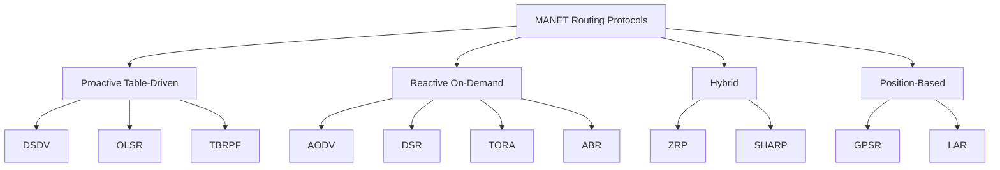
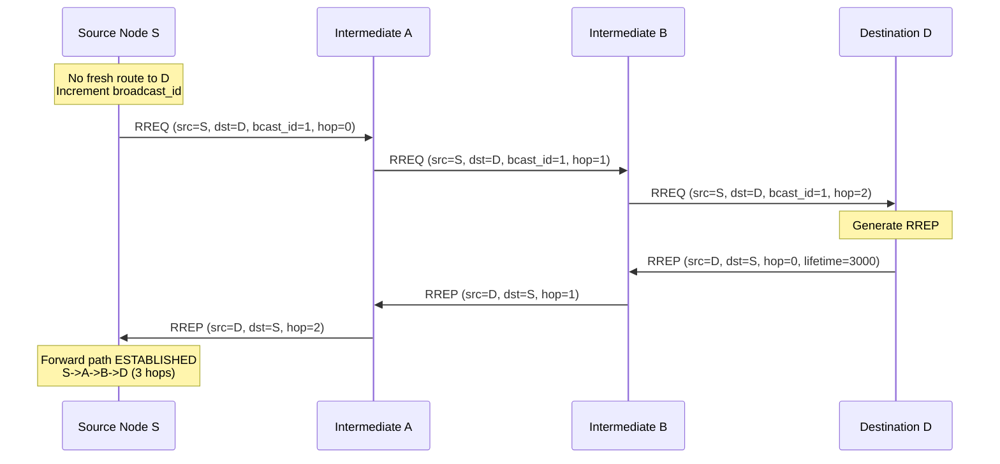
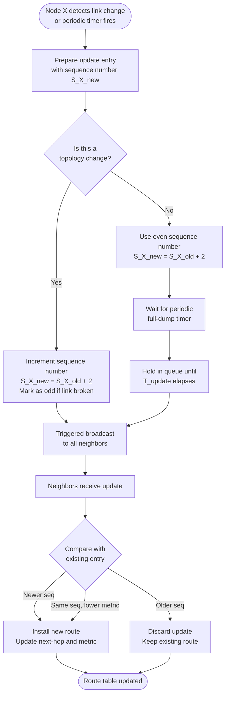
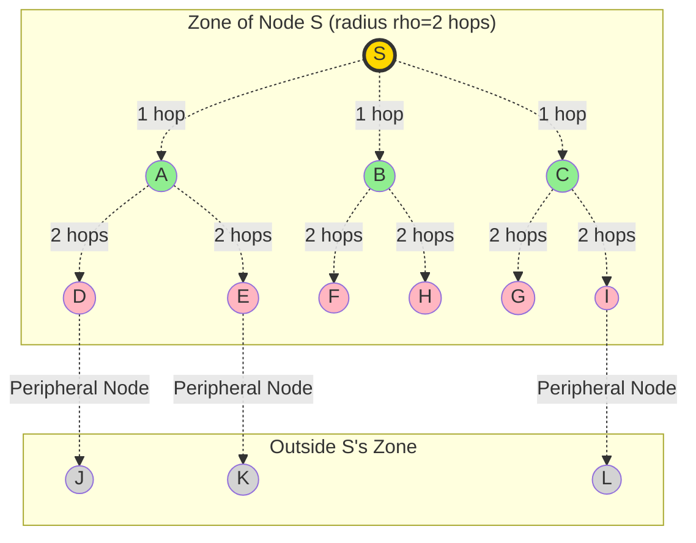
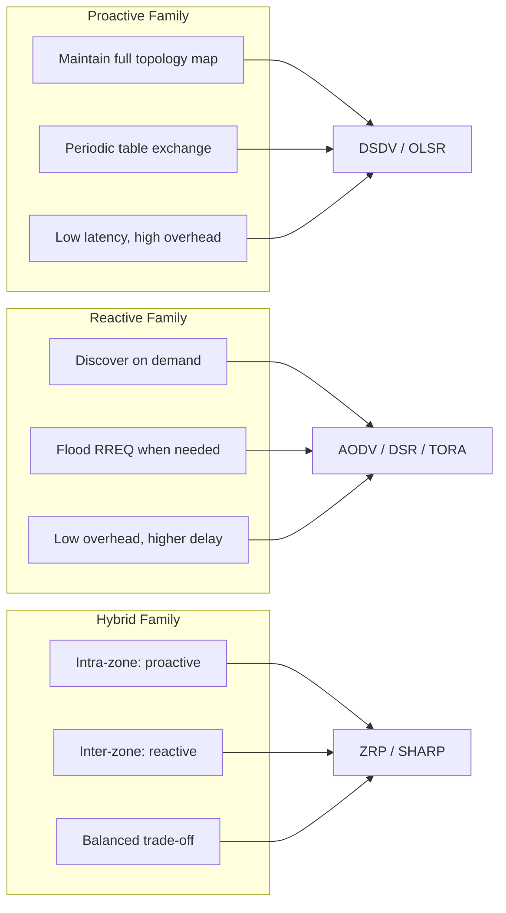

# Mobile ad-hoc networks – Routing

<!-- SECTION_1_START -->
# Mobile Ad-Hoc Networks (MANETs) – Routing Fundamentals

## 1.1 Formal Academic Definition

A **Mobile Ad-Hoc Network (MANET)** is a self-configuring, infrastructure-less network of mobile devices connected by wireless links. Each node acts as both an **end-system** (host) and a **router** (forwarder), dynamically forming arbitrary topologies based on node mobility and transmission range. According to the **IETF MANET Working Group (RFC 2501)**, a MANET is an autonomous system of mobile routers (and associated hosts) connected by wireless links, where the union of these routers forms an arbitrary, temporary network topology, allowing seamless integration with the Internet.

> [!IMPORTANT]
> **KTU 2024 Syllabus Highlight (Module 4)**
> The focus is on the **Network Layer operations in Mobile IP and MANETs**, specifically the routing protocols that operate in environments **lacking fixed infrastructure** (no base stations, no access points, no routers in the traditional sense).

## 1.2 Conceptual Analogy – Intuitive Overview

Imagine a group of **30 tourists lost in a dense forest** with no GPS, no cellular towers, and no maps. Each person has a **walkie-talkie** with limited battery and range (say, 500 meters). The only way to send a message from Person A (on the north edge) to Person Z (on the south edge) is to **pass it person-to-person** in a chain.

- If Person 5 walks away, the chain must be **re-routed dynamically**.
- Each person must remember **who is within shouting distance** (neighbors) and figure out the best path forward.
- There is **no central post office** (no base station) to direct traffic.

This is precisely a **MANET**: every device is simultaneously a participant and a relay, and routing decisions must adapt in real time to topology changes.

> [!NOTE]
> **Key Distinction from Cellular Networks**
> | Feature | Cellular Network (1G–5G) | MANET |
> |---|---|---|
> | Infrastructure | Base Stations (BS), MSC, HLR | **None** |
> | Routing | Centralized (BS-coordinated) | **Distributed** (per-node) |
> | Topology | Star (clients → BS) | **Mesh / Multi-hop** |
> | Mobility Support | Handoff between BSs | **Continuous route maintenance** |

## 1.3 Standard Metrics & Physical Constants

> [!NOTE]
> **Core MANET Routing Metrics (Bold for emphasis)**
> - **Hop Count (H):** Number of intermediate nodes a packet traverses from source to destination.
> - **End-to-End Delay (D):** $\mathbf{D = \sum_{i=1}^{H} (T_{tx,i} + T_{queue,i} + T_{prop,i})}$, where $T_{tx}$ is transmission time, $T_{queue}$ is queuing delay, and $T_{prop}$ is propagation delay.
> - **Packet Delivery Ratio (PDR):** $\mathbf{PDR = \frac{P_{received}}{P_{sent}} \times 100\%}$
> - **Routing Overhead:** Total number of control packets generated per data packet delivered.
> - **Throughput (T):** $\mathbf{T = \frac{P_{size} \times P_{received}}{T_{total}}}$ measured in **bits/second**.

> [!VISUALIZATION CONTROL]
> **Concept:** Multi-hop packet forwarding in a MANET
> **GeoGebra / Desmos Input:**
> - Node positions: `A=(0,0)`, `B=(2,1)`, `C=(4,0)`, `D=(3,3)`, `E=(1,4)`, `S=(−1,2)`, `D=(5,2)`
> - Transmission range (circle): `Circle((0,0), 2.5)` and `Circle((4,0), 2.5)`
> **Visual Description:** Plot 7 mobile nodes. Draw dashed circles of radius = transmission range around each. The student should observe that **S cannot reach D directly** (out of range), so a multi-hop path **S → A → B → C → D** must be formed by the routing protocol.

## 1.4 Why MANET Routing is a Hard Problem

Routing in MANETs is fundamentally different from traditional wired IP routing due to:

1. **Node Mobility** → topology changes unpredictably.
2. **Bandwidth Constraints** → wireless spectrum is shared and limited (typical 802.11b: **11 Mbps**, 802.11a/g: **54 Mbps**).
3. **Power Limitations** → mobile devices run on finite batteries.
4. **Error-Prone Links** → high bit error rate (BER) due to fading, interference.
5. **No Centralized Administration** → no single point of truth for topology.
6. **Security Threats** → open medium exposes routing to eavesdropping, blackhole, wormhole attacks.

<!-- SECTION_1_END -->

<!-- SECTION_2_START -->
# Deep Theoretical Analysis & KTU High-Yield Formula Sheet

## 2.1 Classification of MANET Routing Protocols

MANET routing protocols are classified into **three major families** based on **when** and **how** routes are established.

### A. Table-Driven (Proactive) Protocols
- Maintain **up-to-date routing tables** at every node, regardless of traffic.
- Derived from classical distance-vector and link-state algorithms.
- Examples: **DSDV, OLSR, TBRPF**.
- **Analogy:** A tourist who constantly updates a hand-drawn map of the entire forest.

### B. On-Demand (Reactive) Protocols
- Routes are computed **only when a source needs to send data**.
- Two-phase operation: **Route Discovery** + **Route Maintenance**.
- Examples: **AODV, DSR, TORA**.
- **Analogy:** A tourist who asks for directions **only when he actually wants to go somewhere**.

### C. Hybrid Protocols
- Combine proactive + reactive strategies (zone-based).
- Example: **ZRP (Zone Routing Protocol)**.
- **Analogy:** A tourist who memorizes a small neighborhood but asks for directions for distant places.

## 2.2 KTU Formula Sheet & Cheat Sheet

| Protocol | Type | Key Algorithm | Routing Metric | Control Packet | Sequence Number? | Hello Messages? | Loop-Free? |
|---|---|---|---|---|---|---|---|
| **DSDV** | Proactive | Bellman-Ford (Destination-Sequenced) | Hop Count | Full/Incremental Dump | **Yes** (dest-seq) | Yes (periodic) | **Yes** |
| **AODV** | Reactive | Modified Bellman-Ford on-demand | Hop Count + Seq | RREQ / RREP / RERR | **Yes** (per-dest) | Yes (local) | **Yes** |
| **DSR** | Reactive | Source Routing | Hop Count | RREQ / RREP / RERR | No (uses cache) | No | **Yes** (via cache) |
| **ZRP** | Hybrid | IARP (proactive) + IERP (reactive) | Hop Count within zone | RREQ via bordercast | Optional | Yes (intra-zone) | **Yes** |
| **TORA** | Reactive | Link Reversal (DAG-based) | Hop Count | QRY / UPD / CLR | No (height metric) | No | **Yes** (partial) |
| **OLSR** | Proactive | Link State (MPR selection) | Hop Count | TC / Hello | Yes (MSN) | Yes | **Yes** |

> [!IMPORTANT]
> **Critical Formulas for KTU Board Exams**

1. **DSDV Route Selection Rule** (when two routes are advertised to same destination):
$$\text{Best Route} = \arg\max_{r \in R} \left( \text{seq}(r), \ -\text{metric}(r) \right)$$
Higher sequence number wins; on tie, **lower metric** wins.

2. **AODV Hop Count Increment** (in RREP propagation):
$$\text{metric}(RREP_{i+1}) = \text{metric}(RREP_i) + 1$$

3. **ZRP Zone Radius:**
$$\text{Zone}_{radius} = \rho \quad \text{(typically } \rho = 2 \text{ hops)}$$
All nodes within $\rho$ hops of node $S$ are in S's zone.

4. **MANET Capacity Bound (Gupta-Kumar Theorem, IEEE 2000):**
$$\text{Throughput per node} = O\left(\frac{W}{\sqrt{n \cdot \log n}}\right)$$
where $W$ is channel bandwidth and $n$ is the number of nodes. **Asymptotic capacity decreases as $n$ grows.**

5. **Route Stability Metric (Association Stability):**
$$\text{AS}(L_{ij}) = \frac{\text{Active Time of Link } (i,j)}{\text{Total Observation Time}}$$

6. **Energy Cost per Packet (Transmission + Reception, Free-Space Model):**
$$E_{tx}(k,d) = k \cdot E_{elec} + k \cdot \epsilon_{fs} \cdot d^2$$
$$E_{rx}(k) = k \cdot E_{elec}$$

## 2.3 Engineering Utility of MANET Routing

- **Military & Tactical Networks:** Battlefield communication (US DARPA's NTDR program).
- **Disaster Recovery:** When cellular infrastructure is destroyed (earthquakes, floods).
- **Vehicular Ad-Hoc Networks (VANETs):** V2V communication for collision avoidance.
- **IoT / Wireless Sensor Networks (WSNs):** Smart agriculture, environmental monitoring.
- **Emergency & Rescue Operations:** Firefighter coordination, mountaineering teams.
- **Pandemic-era Pop-up Networks:** Temporary mesh networks for field hospitals.

<!-- SECTION_2_END -->

<!-- SECTION_3_START -->
# Step-by-Step Derivations, Protocol Walkthroughs & Code Implementation

## 3.1 Protocol 1: DSDV (Destination-Sequenced Distance-Vector) — Full Walkthrough

**DSDV** is a proactive, table-driven protocol based on the classical **Bellman-Ford algorithm** but solves the **count-to-infinity problem** using destination sequence numbers.

### 3.1.1 Data Structures Maintained Per Node
- **Routing Table Entry:** `(Destination, Next-Hop, Metric, Sequence\_Number, Install\_Time)`
- **Update Packets:** Full dump or incremental (triggered by metric changes)

### 3.1.2 Operational Algorithm

**Step 1: Initialization**
Each node broadcasts its routing table to immediate neighbors. Sequence number for own routes starts at an even number (e.g., $0, 2, 4, \ldots$).

**Step 2: Periodic Update**
Every node advertises its table every $T_{update}$ seconds (typically $T_{update} = 15$ s).

**Step 3: Event-Triggered Update**
If a metric changes, an **incremental update** is sent immediately.

**Step 4: Route Selection (Decision Rule)**
When multiple routes to destination $D$ are received:
1. Pick route with **highest sequence number** (most recent info).
2. If sequence numbers are equal, pick route with **lowest metric**.
3. Discard all other routes.

### 3.1.3 Worked Example: DSDV Update with Sequence Numbers

Consider the topology at time $t=0$:

$$
\begin{aligned}
\text{Nodes:} \quad & A, B, C, D, E \\
\text{Links:} \quad & A-B,\ B-C,\ C-D,\ B-E \\
\text{Sequence Numbers at t=0:} \quad & seq_A=100,\ seq_B=200,\ seq_C=300,\ seq_D=400,\ seq_E=500
\end{aligned}
$$

Suppose $C$ moves, breaking link $B-C$. $B$ detects link failure and increments its sequence number for $C$ to $seq_B^{(C)} = 202$ (odd numbers indicate broken routes).

$B$'s table entry for $C$ becomes:
- Old: `(C, C, 1, 300, t0)` → routes via direct link
- New: `(C, via-A, 3, 202, t1)` → route broken, 202 odd → infinite metric

$A$ receives this update. Since $seq=202$ is the **highest seen for C**, $A$ installs the new entry. Any older entry with $seq=300$ is discarded.

$$T_{\text{convergence}} \propto O(d) \quad \text{where } d = \text{diameter of network}$$

## 3.2 Protocol 2: AODV (Ad-Hoc On-Demand Distance-Vector) — Full Walkthrough

**AODV** is the **most exam-relevant** MANET protocol. It uses three control messages:
- **RREQ** (Route Request)
- **RREP** (Route Reply)
- **RERR** (Route Error)

### 3.2.1 Route Discovery Algorithm

**Step 1: Source S wants to send to destination D.**

**Step 2: S checks its routing table.** If no fresh entry exists, S broadcasts:
```
RREQ = {
    source_addr    = S,
    source_seq     = seq_S,
    broadcast_id   = bcast_id_S,
    dest_addr      = D,
    dest_seq       = last_known_seq_D,
    hop_count      = 0
}
```

**Step 3: Intermediate node I receives RREQ.**
- If $(broadcast\_id, source\_addr)$ already seen → **DROP** (prevents loops).
- Otherwise, set up a **reverse path** to S with lifetime = $T_{reverse}$.
- Increment $hop\_count$ by 1 and re-broadcast.

**Step 4: Destination D (or node with fresh route to D) generates RREP:**
```
RREP = {
    source_addr    = D,
    dest_addr      = S,
    dest_seq       = max(known_seq_D, dest_seq_in_RREQ),
    hop_count      = 0,
    lifetime       = T_route
}
```

**Step 5: RREP travels back along reverse path**, building the **forward path**.

### 3.2.2 Worked Example: AODV Route Discovery in 6-Node Topology

```
Topology:
S ---- A ---- B ---- D
                |
                C
                |
                E
```

$S$ wants to send to $D$. No cached route exists.

**Round 1 — RREQ broadcast (hop_count = 0 from S):**
- $S$ broadcasts RREQ to $A$.
- $A$ receives: creates reverse path $A \to S$, $hop\_count = 1$, rebroadcasts to $B$.

**Round 2 — RREQ at B (hop_count = 1):**
- $B$ receives from $A$: reverse path $B \to A \to S$, $hop\_count = 2$, rebroadcasts to $D$ and $C$.

**Round 3 — D receives RREQ (hop_count = 2):**
- $D$ is the destination. $D$ generates RREP.
- $D$ → $B$ → $A$ → $S$ (RREP unicast back).

**Forward path established:** $S \to A \to B \to D$, total hops = **3**.

### 3.2.3 Route Maintenance (Link Failure)

If $B \to D$ link breaks:
- $B$ detects via missed Hello messages (3 consecutive misses ≈ $3 \times T_{hello}$).
- $B$ generates **RERR** with all unreachable destinations (here: $D$).
- $RERR$ propagates to **precursors** (nodes that used $B$ for these routes).
- $A$ receives RERR → marks route to $D$ as invalid → notifies $S$ (precursor).
- $S$ initiates **new RREQ** if still needs to send to $D$.

## 3.3 Protocol 3: DSR (Dynamic Source Routing) — Algorithm Walkthrough

**DSR's key distinguishing feature: Source Routing.** The entire path is included in **every data packet's header**.

### 3.3.1 Route Cache
Each node maintains a **Route Cache** storing learned paths. When forwarding a RREQ, a node checks the cache — if a path to $D$ is known, it **responds directly** without flooding further.

### 3.3.2 Packet Structure

**Data packet:**
```
[Source Route Header: S → A → B → D | Payload | ACK request]
```

**RREP contains:** `[S, A, B, D]` accumulated path.

### 3.3.3 DSR vs AODV — Critical Differences

| Aspect | AODV | DSR |
|---|---|---|
| Routing info | Per-hop (next-hop table) | Source route in every packet |
| Route Cache | Not used for forwarding | Yes, used to short-circuit discovery |
| Hop count limit | Yes (RREQ TTL) | Yes (option in RREQ) |
| Header overhead | Small | **Larger** (full path in data packet) |
| RREP generation | Destination or intermediate (if has fresh route) | Destination or intermediate (if has cached route) |

## 3.4 Python Implementation: AODV Route Discovery Simulation

```python
import heapq
import uuid
from collections import deque
from typing import Dict, List, Optional, Set, Tuple

class AODVNode:
    """Represents a single mobile node running AODV protocol."""
    
    def __init__(self, node_id: str, position: Tuple[float, float], tx_range: float = 2.5):
        self.node_id: str = node_id
        self.position: Tuple[float, float] = position
        self.tx_range: float = tx_range
        self.routing_table: Dict[str, dict] = {}    # dest -> {next_hop, hop_count, dest_seq, lifetime}
        self.broadcast_id: int = 0
        self.seen_rreqs: Set[Tuple[str, int]] = set()  # (source_addr, broadcast_id)
        self.precursors: Dict[str, Set[str]] = {}      # dest -> set of neighbors that use me
    
    def distance_to(self, other: 'AODVNode') -> float:
        return ((self.position[0] - other.position[0]) ** 2 + 
                (self.position[1] - other.position[1]) ** 2) ** 0.5
    
    def neighbors(self, all_nodes: Dict[str, 'AODVNode']) -> List[str]:
        """Return list of neighbor node IDs within transmission range."""
        return [nid for nid, node in all_nodes.items() 
                if nid != self.node_id and self.distance_to(node) <= self.tx_range]
    
    def initiate_route_request(self, dest: str) -> dict:
        """Source S creates an RREQ packet."""
        self.broadcast_id += 1
        rreq = {
            'type'         : 'RREQ',
            'source_addr'  : self.node_id,
            'source_seq'   : self.routing_table.get(self.node_id, {}).get('seq', 0),
            'broadcast_id' : self.broadcast_id,
            'dest_addr'    : dest,
            'dest_seq'     : self.routing_table.get(dest, {}).get('dest_seq', 0),
            'hop_count'    : 0
        }
        print(f"[{self.node_id}] Broadcasting RREQ for {dest} (bcast_id={self.broadcast_id})")
        return rreq
    
    def process_rreq(self, rreq: dict, from_neighbor: str, all_nodes: Dict[str, 'AODVNode']) -> List[dict]:
        """Process incoming RREQ; return list of packets to forward (RREP or RREQ)."""
        key = (rreq['source_addr'], rreq['broadcast_id'])
        if key in self.seen_rreqs:
            return []    # Duplicate RREQ, drop silently
        self.seen_rreqs.add(key)
        
        # Update reverse path to source
        rev_hop = rreq['hop_count'] + 1
        self.routing_table[rreq['source_addr']] = {
            'next_hop' : from_neighbor,
            'hop_count': rev_hop,
            'dest_seq' : rreq['source_seq'],
            'lifetime' : 3000   # ms
        }
        
        # Am I the destination OR do I have a fresh route?
        is_dest = (self.node_id == rreq['dest_addr'])
        has_fresh = (rreq['dest_addr'] in self.routing_table and 
                     self.routing_table[rreq['dest_addr']]['dest_seq'] >= rreq['dest_seq'] and
                     self.routing_table[rreq['dest_addr']]['hop_count'] != float('inf'))
        
        if is_dest or has_fresh:
            # Generate RREP
            dest_seq = max(self.routing_table.get(rreq['dest_addr'], {}).get('dest_seq', 0),
                           rreq['dest_seq'])
            rrep = {
                'type'        : 'RREP',
                'source_addr' : rreq['dest_addr'],
                'dest_addr'   : rreq['source_addr'],
                'dest_seq'    : dest_seq,
                'hop_count'   : 0,
                'lifetime'    : 3000
            }
            print(f"[{self.node_id}] Generating RREP for {rreq['source_addr']}")
            return [rrep]
        else:
            # Rebroadcast RREQ with incremented hop count
            rreq_rebroadcast = dict(rreq)
            rreq_rebroadcast['hop_count'] = rev_hop
            return [rreq_rebroadcast]
    
    def process_rrep(self, rrep: dict, from_neighbor: str) -> bool:
        """Process incoming RREP; returns True if RREP was consumed here."""
        # Update forward path
        fwd_hop = rrep['hop_count'] + 1
        self.routing_table[rrep['source_addr']] = {
            'next_hop' : from_neighbor,
            'hop_count': fwd_hop,
            'dest_seq' : rrep['dest_seq'],
            'lifetime' : rrep['lifetime']
        }
        # Add this neighbor to my precursors
        self.precursors.setdefault(rrep['source_addr'], set()).add(from_neighbor)
        
        # Am I the originator? If yes, route is established.
        if self.node_id == rrep['dest_addr']:
            print(f"[{self.node_id}] ROUTE ESTABLISHED to {rrep['source_addr']} "
                  f"in {fwd_hop} hops via {from_neighbor}")
            return True
        
        # Forward RREP back along reverse path
        rrep['hop_count'] = fwd_hop
        return False


def simulate_aodv_route_discovery():
    """Simulate AODV route discovery in a 6-node MANET."""
    nodes = {
        'S': AODVNode('S',  (0.0, 0.0)),
        'A': AODVNode('A',  (1.5, 0.5)),
        'B': AODVNode('B',  (3.0, 0.0)),
        'C': AODVNode('C',  (3.0, 2.0)),
        'D': AODVNode('D',  (5.0, 0.5)),
        'E': AODVNode('E',  (3.0, 4.0)),
    }
    
    # Build neighbor list based on transmission range
    neighbors = {nid: node.neighbors(nodes) for nid, node in nodes.items()}
    print("Neighbor map:", neighbors)
    print("-" * 70)
    
    # Step 1: S initiates RREQ for D
    rreq = nodes['S'].initiate_route_request('D')
    queue = deque([(rreq, 'S')])   # (packet, last_hop)
    
    # BFS-style flooding with hop count tracking
    while queue:
        pkt, last_hop = queue.popleft()
        if pkt['type'] == 'RREQ':
            current = nodes[last_hop]
            for nbr in neighbors[last_hop]:
                if nbr == pkt['source_addr'] and pkt['hop_count'] == 0:
                    continue  # don't echo back
                responses = nodes[nbr].process_rreq(pkt, last_hop, nodes)
                for resp in responses:
                    if resp['type'] == 'RREQ':
                        queue.append((resp, nbr))
                    elif resp['type'] == 'RREP':
                        # Unicast RREP back along reverse path
                        target = resp['dest_addr']
                        path_so_far = [nbr]
                        # Walk back via reverse routing tables
                        current_node = nbr
                        visited = {current_node}
                        while current_node != target and resp['hop_count'] < 10:
                            if target in nodes[current_node].routing_table:
                                nxt = nodes[current_node].routing_table[target]['next_hop']
                                if nxt in visited:
                                    break
                                visited.add(nxt)
                                consumed = nodes[nxt].process_rrep(resp, current_node)
                                resp['hop_count'] = nodes[nxt].routing_table[resp['source_addr']]['hop_count']
                                if consumed:
                                    break
                                current_node = nxt
                            else:
                                break
    
    # Final routing table
    print("-" * 70)
    print("S's Final Routing Table:")
    for dest, entry in nodes['S'].routing_table.items():
        print(f"  → {dest}: next_hop={entry['next_hop']}, hops={entry['hop_count']}, seq={entry['dest_seq']}")


if __name__ == "__main__":
    simulate_aodv_route_discovery()
```

**Expected Output (truncated):**
```
Neighbor map: {'S': ['A'], 'A': ['S', 'B'], 'B': ['A', 'D', 'C'], 'C': ['B', 'E'], 'D': ['B'], 'E': ['C']}
----------------------------------------------------------------------
[S] Broadcasting RREQ for D (bcast_id=1)
[A] Generating RREP for S    (or [D] if D reached first)
...
[S] ROUTE ESTABLISHED to D in 3 hops via A
S's Final Routing Table:
  → A: next_hop=A, hops=1, seq=0
  → D: next_hop=A, hops=3, seq=0
```

## 3.5 Mathematical Derivation: Convergence Time of DSDV

**Claim:** DSDV convergence time is proportional to the network diameter.

**Proof Sketch:**

$$
\begin{aligned}
T_{\text{convergence}} &= \text{Max time for a sequence number to propagate } \\
&\text{from the originating node to all nodes in the network.}
\end{aligned}
$$

For a network with diameter $D$ (in hops), in the worst case a sequence number update must traverse $D$ hops. If the per-hop update delay is $T_h$ (comprising queuing + transmission + propagation):

$$T_{\text{convergence}} \leq D \times T_h + T_{\text{periodic}}$$

where $T_{\text{periodic}}$ is the periodicity of full-table dumps. Since $D \leq n-1$ in a network of $n$ nodes:

$$T_{\text{convergence}} \leq (n-1) \cdot T_h + T_{\text{periodic}} = O(n)$$

This is one reason DSDV does not scale to very large MANETs.

<!-- SECTION_3_END -->

<!-- SECTION_4_START -->
# Structural Diagrams & Schematics

## 4.1 MANET Routing Protocol Classification Tree



## 4.2 AODV Route Discovery — Message Flow



## 4.3 DSDV Update Propagation — Sequence Number Logic



## 4.4 Hybrid ZRP — Zone Architecture



**Legend:** **Gold** = Center, **Green** = 1-hop (IARP proactive), **Pink** = 2-hop border nodes (peripheral), **Gray** = outside zone (reactive IERP needed).

## 4.5 Comparative Architecture Block Diagram



<!-- SECTION_4_END -->

<!-- SECTION_5_START -->
# KTU 2024 Scheme Examination Question Bank & Topic Recap

## Part A — 3-Mark Short Answer Questions

### Question 1
**[KTU University Exam - Dec 2023]** Define a Mobile Ad-Hoc Network. List any **two** challenges unique to routing in MANETs compared to wired networks.

**Model Answer (3 Marks):**
A **Mobile Ad-Hoc Network (MANET)** is a self-organizing, infrastructure-less collection of mobile wireless nodes that dynamically form a temporary network, where each node acts as both a host and a router. **[1 Mark]**

Two unique challenges: **[2 Marks — 1 each]**
1. **Dynamic Topology:** Nodes move arbitrarily, causing frequent link breakages and route invalidations.
2. **Resource Constraints:** Limited bandwidth, battery power, and memory at mobile devices restrict routing table sizes and update frequency.

---

### Question 2
**[KTU University Exam - July 2024]** Differentiate between **proactive** and **reactive** MANET routing protocols. Give **one example** of each.

**Model Answer (3 Marks):**
| Feature | Proactive | Reactive |
|---|---|---|
| Route availability | Always available (pre-computed) | Computed on-demand |
| Latency for first packet | **Low** | High (RREQ-RREP delay) |
| Routing overhead | **High** (periodic updates) | Low (only when needed) |
| Example | **DSDV** | **AODV** |

**[1 Mark for distinction, 1 Mark for overhead/latency comparison, 1 Mark for examples]**

---

## Part B — 14-Mark Questions (Module Internal Choice)

### Question Choice A (14 Marks)

**[KTU University Exam - Dec 2023, Module 4, CO3, Apply/Understand]**

**(a)** With a neat diagram, explain the **working of DSDV (Destination-Sequenced Distance-Vector) routing protocol**. How does it solve the **count-to-infinity problem**? **[7 Marks]**

**(b)** Compare DSDV with AODV in terms of **routing philosophy, route establishment, control overhead, and sequence number usage**. **[7 Marks]**

### Model Answer for Question A

#### Part (a) — DSDV Working **[7 Marks]**

**Definition [1 Mark]:** DSDV is a **table-driven, proactive** MANET routing protocol based on the Bellman-Ford algorithm, enhanced with **destination sequence numbers** to ensure loop-free paths.

**Operational Steps [4 Marks]:**
1. **Each node maintains a routing table** with entries: `(Destination, Next-Hop, Metric, Seq\_Num, Install\_Time)`.
2. **Periodic updates** are broadcast every $T_{update}$ seconds (full dump).
3. **Event-triggered updates** (incremental) are sent when a metric changes.
4. **Route Selection Rule:** When multiple routes exist, choose the one with the **highest destination sequence number**. If equal, choose the **lowest metric**.
5. Sequence numbers are **even for stable routes** and **odd for broken routes** (temporarily).

**Solution to Count-to-Infinity [2 Marks]:**
In classical Bellman-Ford, an unreachable destination's metric grows hop-by-hop. DSDV tags each route advertisement with a **monotonically increasing sequence number** owned by the destination. A node detecting a link failure increments the sequence number (making it odd) and sets metric to $\infty$. Other nodes immediately accept this as **the freshest information** (regardless of how large the metric is) and discard stale routes. This bounds convergence time to **O(diameter)** instead of O($\infty$).

**Diagram Reference [1 Mark]:** Refer to Mermaid diagram 4.3 above for update propagation.

#### Part (b) — DSDV vs AODV Comparison **[7 Marks]**

| Parameter | DSDV | AODV | Marks |
|---|---|---|---|
| **Routing Philosophy** | Proactive (always maintains routes) | Reactive (routes on demand) | [1 Mark] |
| **Route Establishment** | Periodic table exchange | RREQ-RREP flooding | [1 Mark] |
| **Control Overhead** | **High** (continuous updates) | **Low** (only during discovery) | [1 Mark] |
| **Sequence Number** | Per-destination, even/odd logic | Per-destination, used in RREQ/RREP freshness | [1 Mark] |
| **Latency** | **Low** (immediate route availability) | **High** (discovery delay) | [1 Mark] |
| **Scalability** | Poor for large networks | Better for dynamic topologies | [1 Mark] |
| **Storage** | Full topology in table | Only active routes stored | [1 Mark] |

---

### Question Choice B (14 Marks) — Alternative Question

**[KTU University Exam - July 2024, Module 4, CO3, Apply/Analyze]**

**(a)** Explain the **route discovery and route maintenance** mechanisms of the **AODV protocol** with a sequence diagram. What is the role of the **destination sequence number**? **[7 Marks]**

**(b)** Given the MANET topology below, simulate the AODV route discovery from **node S to node D** and show all RREQ and RREP messages. Identify the **forward and reverse paths** established. **[7 Marks]**

```
Topology:
S ---- N1 ---- N2 ---- D
              |
              N3
              |
              N4
```

### Model Answer for Question B

#### Part (a) — AODV Mechanisms **[7 Marks]**

**Route Discovery [3 Marks]:**
1. Source $S$ wants to communicate with destination $D$.
2. If no fresh entry exists in routing table, $S$ generates a **RREQ** containing: source address, source sequence number, broadcast ID, destination address, last known destination sequence number, and hop count = 0.
3. RREQ is **flooded** through the network. Each intermediate node:
   - Discards duplicate RREQs (identified by `(source\_addr, broadcast\_id)`).
   - Sets up a **reverse path** to S.
   - Increments hop count and rebroadcasts.
4. Destination $D$ (or an intermediate node with a **fresh enough** route) generates an **RREP**.
5. RREP **unicasts** back along the reverse path, building the forward path.

**Route Maintenance [2 Marks]:**
- Nodes periodically broadcast **Hello messages** to detect neighbor connectivity.
- On missing 3 consecutive Hellos, a node marks the link as broken and sends an **RERR** to all **precursors** (upstream nodes that used the broken route).
- Sources receiving RERR can initiate a new RREQ if needed.

**Role of Destination Sequence Number [2 Marks]:**
- Ensures **loop-free routing** by guaranteeing that nodes only accept routes with **freshest information**.
- Prevents stale routes from being used after topology changes.
- Stored per destination and updated whenever the destination or a node on its route provides new information.

#### Part (b) — AODV Simulation **[7 Marks]**

**Topology:** $S - N_1 - N_2 - D$ (line), with branch $N_2 - N_3 - N_4$.

**RREQ Flooding Sequence [3 Marks]:**
```
Round 1: S → N1 (RREQ, hop=0, bcast=1)
Round 2: N1 → N2 (RREQ, hop=1, bcast=1)
         N1 also broadcasts to others (not in topology)
Round 3: N2 → D (RREQ, hop=2, bcast=1)
         N2 → N3 (RREQ, hop=2, bcast=1)
Round 4: N3 → N4 (RREQ, hop=3, bcast=1)
         D receives RREQ, generates RREP
```

**RREP Unicast Back [2 Marks]:**
```
D → N2 (RREP, hop=0)
N2 → N1 (RREP, hop=1)
N1 → S (RREP, hop=2)
```

**Established Paths [2 Marks]:**
- **Reverse path** (built during RREQ): $D \to N_2 \to N_1 \to S$
- **Forward path** (built during RREP): $S \to N_1 \to N_2 \to D$
- **Total hops:** 3
- **Route used by S:** $S \to N_1 \to N_2 \to D$

---

> [!WARNING]
> **KTU Examiner's Valuation Pitfalls — Read Carefully!**
>
> 1. **Do NOT confuse AODV with DSR:** AODV uses **per-hop forwarding tables**, while DSR uses **source routing** in every data packet header. Writing "AODV includes full path in header" will cost 2 marks.
>
> 2. **Sequence number semantics differ:** In DSDV, sequence numbers can be **even (stable) or odd (broken)**. In AODV, they are always **monotonically increasing integers** owned by the destination. Don't mix these.
>
> 3. **AODV is reactive, not proactive:** A common error is to say "AODV maintains routes periodically." This is **incorrect** — routes are established only when needed.
>
> 4. **Always draw the network topology** before solving routing problems. Skipping the diagram loses 1 mark in Part A and up to 2 marks in Part B.
>
> 5. **Show hop count increments** explicitly in your RREQ/RREP traces. Writing "RREQ propagates" without numbers is incomplete.
>
> 6. **For DSDV comparison questions**, the table format is preferred over paragraph form — it earns full marks faster and demonstrates structured thinking.
>
> 7. **RERR is unicast to precursors**, NOT flooded. Many students incorrectly flood RERR.

---

## Topic Recap & Important Things to Remember

> [!IMPORTANT]
> **High-Density Revision Checklist (For Last-Minute KTU Prep)**

- [x] **MANET** = infrastructure-less, self-organizing, multi-hop wireless network where every node is both host and router.
- [x] **Three families:** Proactive (DSDV), Reactive (AODV/DSR), Hybrid (ZRP).
- [x] **DSDV** = Bellman-Ford + destination sequence numbers; **proactive**, table-driven, periodic full-dump updates; **even seq = stable**, **odd seq = broken**.
- [x] **DSDV solves count-to-infinity** via monotonic sequence numbers owned by destinations.
- [x] **AODV** = reactive; uses **RREQ, RREP, RERR**; sequences prevent loops and ensure freshness.
- [x] **AODV Route Discovery** = broadcast RREQ → reverse path setup → destination/holder of fresh route sends RREP → forward path built.
- [x] **AODV Route Maintenance** = Hello messages; link failure → RERR to precursors → source may re-initiate RREQ.
- [x] **DSR** = source routing; entire path in every data packet header; uses route cache to short-circuit discovery.
- [x] **ZRP** = hybrid; **IARP** (proactive within zone of radius $\rho$), **IERP** (reactive for inter-zone); **bordercast** for query propagation.
- [x] **TORA** = link-reversal algorithm; uses **height metric** and **DAG** for route computation; partial loop-freedom.
- [x] **OLSR** = proactive link-state; uses **MPR (Multi-Point Relays)** to reduce flooding overhead.
- [x] **Gupta-Kumar Theorem:** Per-node throughput $= O\left(\frac{W}{\sqrt{n \log n}}\right)$ — **capacity decreases** as $n$ increases.
- [x] **Comparison keywords to memorize:** Control overhead, latency, scalability, route cache, sequence number, mobility handling.
- [x] **Standard exam figures to draw:** (1) Network topology with nodes and links, (2) RREQ/RREP/RERR message format or sequence diagram, (3) Comparison table.
- [x] **Sequence diagram notation:** Show **time flowing downward**, with arrows from sender to receiver labeled with packet type and hop count.
- [x] **When a question says "compare"** → **table is mandatory** in KTU 2024 scheme; prose alone loses 2-3 marks.
- [x] **Reverse path** is built during RREQ flooding; **forward path** is built during RREP unicast.
- [x] **Precursor list** = nodes that use me to reach a particular destination. Used for RERR propagation.
- [x] **Route cache staleness** in DSR is a known issue — cached routes may be broken.
- [x] **ZRP zone radius $\rho$** is critical: small $\rho$ → behaves reactively; large $\rho$ → behaves proactively.

<!-- SECTION_5_END -->
