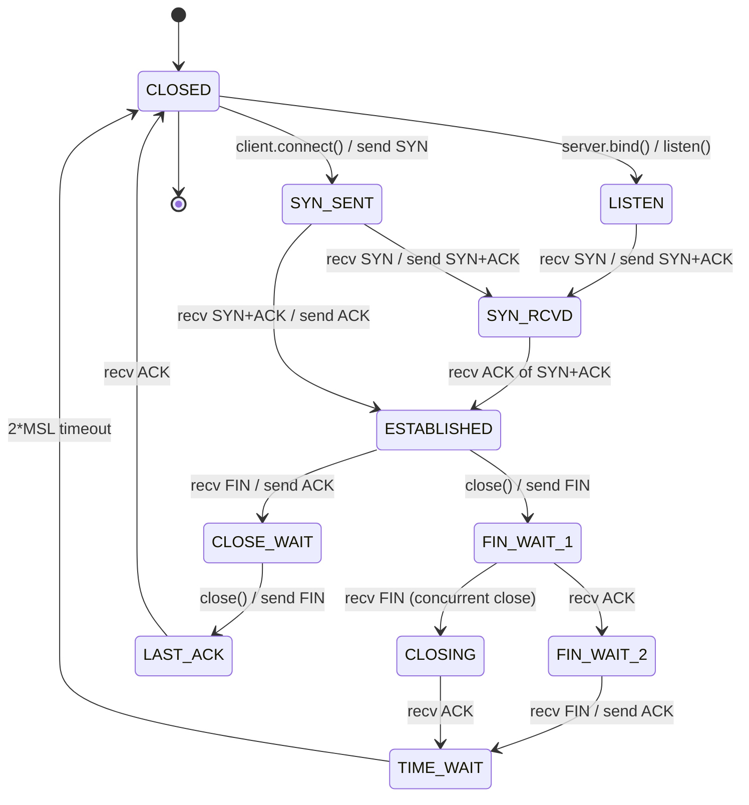
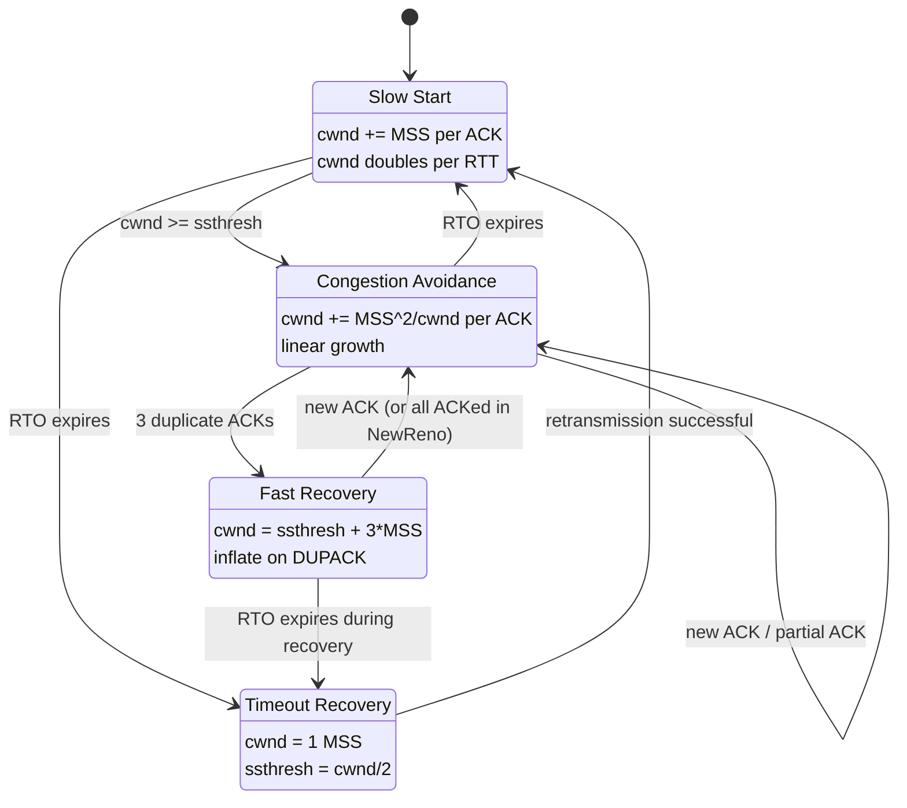
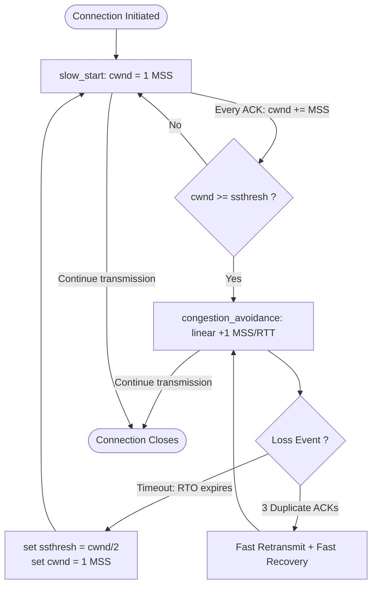

# Mobile transport layer – Traditional Transmission Control Protocol (TCP)

<!-- SECTION_1_START -->
# Mobile Transport Layer – Traditional Transmission Control Protocol (TCP)

> [!IMPORTANT]
> **KTU 2024 Scheme | PECST633 | Module 4 | KTU Board Exam Favourite Topic**
> Traditional TCP is the **cornerstone transport protocol** of the internet, but its design assumptions (low BER, fixed hosts, no handoffs) **fundamentally clash** with mobile/wireless realities. This is a **guaranteed question** in KTU ESE.

---

## 1.1 Formal Definition (KTU 2024 Syllabus Terminology)

**Traditional TCP (Transmission Control Protocol)** is a **connection-oriented, reliable, byte-stream transport layer protocol** standardized in **IETF RFC 793** (later refined by RFC 1122, 1323, 2001, 2581, 5681). In the context of mobile and wireless computing, **"Traditional TCP"** specifically refers to **TCP variants designed primarily for wired networks with low bit error rates and stationary end-systems** — namely **TCP Tahoe, TCP Reno, TCP NewReno, and TCP Vegas** (in their original, unmodified form).

It provides:
1. **Reliability** — via sequence numbers, acknowledgments (ACKs), and retransmission timeouts (RTO).
2. **Flow Control** — via the **receive window (rwnd)** advertised by the receiver.
3. **Congestion Control** — via the **congestion window (cwnd)** managed by the sender, following the four classical algorithms: **Slow Start, Congestion Avoidance, Fast Retransmit, and Fast Recovery**.

> [!NOTE]
> **Core Definition for KTU Boards:**
> *"Traditional TCP is a transport layer protocol that interprets any packet loss as a sign of network congestion, and reacts by drastically reducing its transmission rate through congestion window reduction. This assumption, while valid in wired networks, is the root cause of severe performance degradation in mobile and wireless environments where packet losses are predominantly caused by wireless link errors and handoffs."*

---

## 1.2 Intuitive Analogy — The "Overcautious Librarian"

Imagine a librarian (the TCP sender) working in a quiet, well-organized library (a **wired network**):

- The librarian sends books (packets) to a reader.
- If a book doesn't return (ACK not received), the librarian assumes the **library is too crowded** (congestion) and **drastically reduces the number of books** sent.
- This works perfectly in a quiet library.

Now, move the librarian to a **construction site with active drilling, wind, and the reader frequently changing rooms** (a **mobile/wireless environment**):

- Books get lost in the wind (**wireless BER**).
- Books get delayed when the reader changes rooms (**handoff latency**).
- The librarian, still using the same "crowded library" assumption, **unnecessarily throttles the sending rate** every time a book is lost.
- Result: **Massive underutilization of the network**, even though the actual "crowd" (congestion) is not the problem.

> [!TIP]
> **The Fundamental Flaw in One Line:** Traditional TCP **cannot distinguish** between a lost packet (congestion) and a corrupted/lost-due-to-handoff packet (wireless error). It treats both identically, harming throughput.

---

## 1.3 Physical & Protocol Constants to Memorize

| Constant | Symbol | Value | Meaning |
|----------|--------|-------|---------|
| Initial Congestion Window | $cwnd_0$ | **1 MSS** (RFC 2581) | Slow start begins with 1 segment |
| Initial Slow Start Threshold | $ssthresh_0$ | **65535 bytes** (or infinity) | Default initial value |
| Slow Start Increment Factor | — | **+1 MSS per ACK** | Exponential growth |
| Congestion Avoidance Increment | — | **+1 MSS per RTT** | Linear growth (≈ +1/cwnd per ACK) |
| Multiplicative Decrease Factor | $b$ | **0.5** (or 1/2) | On loss: cwnd ← cwnd/2 |
| Fast Retransmit Threshold | $K$ | **3 duplicate ACKs** | Trigger fast retransmit |
| Minimum RTO | $RTO_{min}$ | **1 second** (RFC 2988) | Lower bound |
| Maximum RTO | $RTO_{max}$ | **60 seconds** (RFC 2988) | Upper bound |
| KARN's Algorithm Threshold | — | **No RTT measurement during retransmission** | Avoids ambiguity |
| Delayed ACK Timer | — | **40–200 ms** (typically 200 ms) | Receiver batching |

> [!WARNING]
> **KTU Examiner's Tip:** KTU board questions frequently ask *"Why is the multiplicative decrease factor 0.5 in TCP Reno but 1.0 in TCP Tahoe?"* — Remember: Tahoe goes to **1 MSS** (back to slow start), Reno goes to **cwnd/2** (fast recovery).

---

## 1.4 Visualization Control (Conceptual Plot)

> [!VISUALIZATION CONTROL]
> **Concept:** TCP Congestion Window (cwnd) vs. Time — Classic "Saw-Tooth" Pattern
> **Plot Axes:** x-axis = Time (RTT rounds), y-axis = cwnd (in MSS units)
> **Expected Behavior:**
> * **Phase 1 (Slow Start):** $cwnd$ grows **exponentially** as $1, 2, 4, 8, 16, \ldots$ until it hits $ssthresh$.
> * **Phase 2 (Congestion Avoidance):** $cwnd$ grows **linearly** as $+1$ MSS per RTT.
> * **Phase 3 (Loss Event):** $cwnd$ drops **multiplicatively** (×0.5 for Reno, ×0 for Tahoe) and the cycle repeats.
> **Visual Cue:** The plot forms a characteristic **saw-tooth (triangular) wave** — the steeper left side is slow start recovery, the gentler right side is congestion avoidance growth.
<!-- SECTION_1_END -->

<!-- SECTION_2_START -->
# Deep Theoretical Analysis & KTU High-Yield Formula Sheet

## 2.1 Architectural Position of TCP in the Mobile Internet Stack

Traditional TCP sits **above IP** in the **TCP/IP reference model** and provides a **reliable byte-stream service** to applications like HTTP, FTP, SMTP. In the **mobile internet protocol (Mobile IP)** architecture, TCP runs between the **Mobile Host (MH)** and the **Corresponding Node (CN)**, but the **logical TCP connection** is **not aware of mobility** — the IP addresses change during handoff, but the TCP endpoint identifiers (IP + port) on the original connection remain bound to the **old Care-of-Address (CoA)** unless special handling (Mobile IP with route optimization) is applied.

> [!NOTE]
> **KTU Key Concept:** In classical Mobile IP (RFC 3344) with **triangular routing**, TCP packets from CN to MH must traverse the **Home Agent (HA)**. This introduces **asymmetric delays**, longer RTTs, and more packet reordering — all of which confuse traditional TCP's RTO estimator and trigger spurious retransmissions.

---

## 2.2 The Four Classical TCP Congestion Control Mechanisms

### 2.2.1 Slow Start
- **Purpose:** Probe the network capacity quickly without initially overloading it.
- **Mechanism:** On connection establishment (or after a timeout), set $cwnd = 1$ MSS. For **every ACK received**, increase $cwnd$ by **1 MSS**.
- **Mathematical Form:**
  $$cwnd_{t+1} = cwnd_t + \text{MSS} \quad \text{per ACK received}$$
- **Equivalent RTT-based form:**
  $$cwnd \text{ doubles every RTT (exponential growth)}$$

### 2.2.2 Congestion Avoidance
- **Purpose:** Carefully approach the network's carrying capacity once $cwnd \geq ssthresh$.
- **Mechanism:** Increase $cwnd$ by **at most 1 MSS per RTT**:
  $$cwnd_{t+1} = cwnd_t + \frac{\text{MSS}^2}{cwnd_t} \quad \text{per ACK}$$
  (Approximated as $+\frac{1}{cwnd}$ MSS per ACK, or $+1$ MSS per RTT.)

### 2.2.3 Fast Retransmit
- **Purpose:** Avoid waiting for RTO expiry when packet loss is detected via **duplicate ACKs**.
- **Trigger:** Receiver of **3 duplicate ACKs (DUPACKs)** for the same sequence number → sender immediately retransmits the missing segment **without waiting for timeout**.

### 2.2.4 Fast Recovery
- **Purpose:** Avoid collapsing $cwnd$ all the way to 1 MSS on a single loss.
- **Mechanism (TCP Reno):**
  1. On 3rd DUPACK: $ssthresh \leftarrow cwnd / 2$
  2. $cwnd \leftarrow ssthresh + 3$ (inflate for the 3 buffered segments)
  3. For each additional DUPACK: $cwnd \leftarrow cwnd + 1$
  4. On new ACK: $cwnd \leftarrow ssthresh$ (deflate), enter Congestion Avoidance.

> [!IMPORTANT]
> **TCP Tahoe vs. TCP Reno Distinction (HIGH-YIELD for KTU):**
> * **Tahoe:** On ANY loss (timeout OR 3 DUPACKs) → $cwnd \leftarrow 1$ MSS, enter Slow Start.
> * **Reno:** On 3 DUPACKs → Fast Recovery ($cwnd \leftarrow cwnd/2$). On Timeout → $cwnd \leftarrow 1$ MSS (Slow Start).
> * **NewReno:** Refinement of Reno for **multiple losses in one window** — exits fast recovery only when **all** lost segments are ACKed.

---

## 2.3 Why Traditional TCP Fails in Mobile/Wireless Networks

The following table is a **guaranteed KTU exam question** (either as Part A 3-mark or Part B 14-mark):

| # | Problem in Mobile/Wireless | Traditional TCP's Wrong Reaction | Result |
|---|---------------------------|----------------------------------|--------|
| 1 | **High Bit Error Rate (BER)** on wireless link | Interprets loss as congestion → halves cwnd | Throughput collapses for radio errors |
| 2 | **Handoff latency & packet loss** during movement | RTO expires, $cwnd \leftarrow 1$ MSS, Slow Start | Resumes from scratch after every handoff |
| 3 | **Variable & asymmetric delays** (uplink vs downlink) | RTT estimator miscalculates, RTO too small | **Spurious retransmissions** and **retransmission ambiguity** (solved by Karn's algorithm) |
| 4 | **Frequent disconnections** (tunnel loss, sleep modes) | Many timeouts, slow re-entry | Connection effectively dies |
| 5 | **Triangular routing** in Mobile IP | Increased RTT variance | Spurious fast retransmits |
| 6 | **Bursty losses** (fading, shadowing) | Multiple cwnd reductions | Throughput oscillates erratically |
| 7 | **Limited bandwidth & energy** | Long cwnd recovery wastes energy on retransmissions | Battery drain |

---

## 2.4 KTU High-Yield Formula Sheet (Must Memorize)

| # | Concept | Formula / Equation | Units | Notes |
|---|---------|-------------------|-------|-------|
| 1 | RTT Estimation (RFC 6298) | $SRTT_{i+1} = (1-\alpha)\cdot SRTT_i + \alpha \cdot RTT_{i+1}$ | seconds | $\alpha = 1/8$ |
| 2 | RTT Variance Estimation | $RTTVAR_{i+1} = (1-\beta)\cdot RTTVAR_i + \beta \cdot \vert RTT_{i+1} - SRTT_i\vert$ | seconds | $\beta = 1/4$ |
| 3 | Retransmission Timeout | $RTO_i = SRTT_i + \max(G, 4 \cdot RTTVAR_i)$ | seconds | $G = \text{clock granularity}$ |
| 4 | Slow Start Growth (RTT form) | $cwnd(t) = 2^{t/RTT} \cdot MSS$ | bytes | Exponential |
| 5 | Congestion Avoidance Growth | $cwnd(t) = cwnd_0 + t/RTT \cdot MSS$ | bytes | Linear |
| 6 | Steady-State Throughput (Mathis Model) | $B \approx \frac{\text{MSS}}{RTT \cdot \sqrt{p}}$ | bytes/sec | $p$ = loss probability |
| 7 | Reno Steady-State Throughput | $B \approx \frac{\text{MSS}}{RTT \cdot \sqrt{2p/3}}$ | bytes/sec | Simplified |
| 8 | Bandwidth-Delay Product | $BDP = RTT \cdot B_{link}$ | bytes | Optimal window size |
| 9 | Slow Start Cycles to ssthresh | $n = \lceil \log_2(ssthresh / MSS) \rceil$ | RTTs | Number of doublings |
| 10 | Multiplicative Decrease | $cwnd_{new} = cwnd_{old} \cdot b$ | MSS | $b = 0.5$ (Reno), $b = 1/8$ (Cubic) |

> [!WARNING]
> **CRITICAL FORMATTING RULE:** All absolute value notations use `\vert` (e.g., $\vert RTT_{i+1} - SRTT_i\vert$) to **prevent markdown table breakage**. Do not use literal pipe characters $\vert$ or $\mid$ in tables.

---

## 2.5 Real-World Engineering Utility

Traditional TCP, despite its mobile weaknesses, is **the de-facto transport protocol** for:
* **4G/5G Data Networks:** LTE and 5G NR still terminate TCP at the **eNodeB/gNodeB**, so wireless errors are isolated. But the **last-mile wireless hop** between UE and base station still uses TCP semantics.
* **IoT and M2M:** LPWAN protocols (LoRa, NB-IoT) often carry TCP traffic via **CoAP-over-TCP** or **MQTT-over-TCP**.
* **Satellite-WiFi hybrids:** In-flight internet, maritime communications, where traditional TCP over satellite links suffers from **long fat pipes (LFP)** — high BDP, prone to false timeouts.
* **VoLTE / Video Streaming:** Uses **TCP-friendly rate control (TFRC)** to avoid TCP's aggressive on/off behavior.

> [!TIP]
> **KTU Industrial Connection:** When answering application questions, mention that **Google's BBR (Bottleneck Bandwidth and Round-trip propagation time)** and **Apple's LEDBAT** are modern TCP variants that explicitly model the bottleneck rather than reacting to losses — these are the **practical evolution paths** of Traditional TCP for mobile contexts.
<!-- SECTION_2_END -->

<!-- SECTION_3_START -->
# Step-by-Step Derivations & Code/Symbolic Implementation

## 3.1 Derivation #1: TCP Reno Steady-State Throughput (Mathis Equation)

We will derive the famous **Mathis et al. (1997)** model for TCP Reno throughput in a lossy network with packet loss probability $p$.

**Step 1 — Model the cwnd saw-tooth as a triangle.**
Assume the network has a steady packet loss probability $p$ per packet. In steady state, cwnd grows linearly from $W/2$ to $W$ before a loss event:

$$
\text{Window growth phase: } W(t) = \frac{W}{2} + \frac{t \cdot \text{MSS}}{RTT} \quad \text{for } 0 \leq t \leq T
$$

**Step 2 — Compute the number of packets sent in one cycle.**
A "cycle" is the period between two loss events. The area under the cwnd-vs-time curve equals the total data transmitted:

$$
\text{Data per cycle} = \int_0^T W(t) \, dt = \int_0^T \left( \frac{W}{2} + \frac{\text{MSS} \cdot t}{RTT} \right) dt
$$

**Step 3 — Evaluate the integral explicitly.**

$$
\text{Data per cycle} = \left[ \frac{W \cdot t}{2} + \frac{\text{MSS} \cdot t^2}{2 \cdot RTT} \right]_0^T = \frac{W \cdot T}{2} + \frac{\text{MSS} \cdot T^2}{2 \cdot RTT}
$$

**Step 4 — Express T in terms of W.**
At $t = T$, the window has grown from $W/2$ to $W$, i.e., increased by $W/2$. Since cwnd increases by 1 MSS per RTT:

$$
T = \frac{W/2}{1 \text{ MSS per RTT}} \cdot RTT = \frac{W \cdot RTT}{2 \cdot \text{MSS}}
$$

**Step 5 — Substitute T back into the area equation.**

$$
\text{Data per cycle} = \frac{W}{2} \cdot \frac{W \cdot RTT}{2 \cdot \text{MSS}} + \frac{\text{MSS}}{2 \cdot RTT} \cdot \left( \frac{W \cdot RTT}{2 \cdot \text{MSS}} \right)^2
$$

$$
\text{Data per cycle} = \frac{W^2 \cdot RTT}{4 \cdot \text{MSS}} + \frac{W^2 \cdot RTT}{8 \cdot \text{MSS}} = \frac{3 W^2 \cdot RTT}{8 \cdot \text{MSS}}
$$

**Step 6 — Relate W to loss probability p.**
On average, a loss occurs every $1/p$ packets. So $\text{Data per cycle} \approx \text{MSS}/p$:

$$
\frac{\text{MSS}}{p} = \frac{3 W^2 \cdot RTT}{8 \cdot \text{MSS}}
$$

**Step 7 — Solve for W.**

$$
W^2 = \frac{8 \cdot \text{MSS}^2}{3 \cdot p \cdot RTT}
\quad\Longrightarrow\quad
W = \sqrt{\frac{8 \cdot \text{MSS}^2}{3 \cdot p \cdot RTT}}
$$

**Step 8 — Compute throughput B = W/RTT.**

$$
B = \frac{W}{RTT} = \frac{1}{RTT} \sqrt{\frac{8 \cdot \text{MSS}^2}{3 \cdot p \cdot RTT}} = \frac{\text{MSS}}{RTT} \sqrt{\frac{8}{3 p}}
$$

$$
\boxed{B_{\text{Reno}} \approx \frac{\text{MSS}}{RTT \cdot \sqrt{1.5 \, p}}}
$$

> [!NOTE]
> **Key insight for KTU:** Throughput is **inversely proportional** to $\sqrt{p}$. So if wireless loss probability increases by **100×** (from $10^{-4}$ to $10^{-2}$), throughput drops by **10×**. This is the **mathematical proof** of why traditional TCP fails over wireless.

---

## 3.2 Derivation #2: Karn's Algorithm for RTT Measurement

**Problem:** When a sender retransmits a segment, the returning ACK could be for either the **original** transmission or the **retransmission**. Measuring RTT on this ACK creates **ambiguity** (Karn's ambiguity problem).

**Karn's Algorithm (RFC 6298) — Step by Step:**

* **Rule 1:** Do NOT measure RTT for segments that have been retransmitted. (Set measurement flag = false on retransmit.)
* **Rule 2:** On a successful (un-retransmitted) ACK, update $SRTT$ and $RTTVAR$ using the **exponential weighted moving average** (EWMA) formulas.
* **Rule 3:** Use the **exponential backoff rule** for the RTO when a retransmission occurs: each time the same segment is retransmitted, double the RTO:
  $$RTO_{k+1} = 2 \cdot RTO_k$$
  Subject to $RTO_{min} = 1\text{s}$ and $RTO_{max} = 60\text{s}$.

> [!IMPORTANT]
> **KTU 2024 Expectation:** A 7-mark question may ask: *"Explain Karn's algorithm with a diagram showing the ambiguity problem and how it is resolved."* — Draw a **timeline** showing original transmit, retransmit, then ACK arrival — and show the **uncertain window** where the ACK could correspond to either transmission.

---

## 3.3 Python Implementation — Simulating Traditional TCP Reno in a Mobile (Lossy) Network

The following Python code **simulates** a TCP Reno sender over a wireless link with **stochastic packet loss** (Bernoulli model). It demonstrates the **throughput collapse** in mobile environments.

```python
import random
import math
from dataclasses import dataclass, field
from typing import List, Tuple

# =============================================================
# CONFIGURATION CONSTANTS (RFC 5681 + RFC 6298)
# =============================================================
MSS: int = 1460                # Maximum Segment Size (bytes) - typical Ethernet
INITIAL_CWND: int = 1          # Slow start begins with 1 MSS
INITIAL_SSTHRESH: int = 65535  # Default initial threshold
RT_PROPAGATION: float = 0.05   # One-way propagation delay (50 ms) - typical 3G
ALPHA: float = 1/8             # SRTT smoothing factor
BETA: float = 1/4              # RTTVAR smoothing factor
G: float = 0.01                # Clock granularity (10 ms)
RTO_INITIAL: float = 1.0       # Initial RTO (seconds)
DUPACK_THRESHOLD: int = 3      # Fast retransmit trigger
SIM_PACKETS: int = 5000        # Total packets to send
WIRELESS_LOSS_PROB: float = 0.02  # 2% wireless BER


@dataclass
class TCPRenoSimulator:
    """
    Simulates a Traditional TCP Reno sender over a mobile/wireless link.
    Demonstrates the throughput collapse caused by non-congestion losses.
    """
    cwnd: int = INITIAL_CWND
    ssthresh: int = INITIAL_SSTHRESH
    srtt: float = 0.0
    rttvar: float = 0.0
    rto: float = RTO_INITIAL
    duplicate_ack_count: int = 0
    last_ack_seq: int = -1
    total_bytes_acked: int = 0
    total_bytes_sent: int = 0
    timeouts: int = 0
    fast_retransmits: int = 0
    rtt_log: List[float] = field(default_factory=list)
    cwnd_log: List[int] = field(default_factory=list)

    def measure_rtt(self, sample_rtt: float) -> None:
        """Update SRTT, RTTVAR, and RTO per RFC 6298."""
        if self.srtt == 0.0:
            self.srtt = sample_rtt
            self.rttvar = sample_rtt / 2
        else:
            self.rttvar = (1 - BETA) * self.rttvar + BETA * abs(sample_rtt - self.srtt)
            self.srtt = (1 - ALPHA) * self.srtt + ALPHA * sample_rtt
        self.rto = self.srtt + max(G, 4 * self.rttvar)
        # Clamp RTO to RFC bounds
        self.rto = min(max(self.rto, 1.0), 60.0)

    def on_ack(self, ack_seq: int) -> None:
        """Process a new (non-duplicate) ACK."""
        if ack_seq > self.last_ack_seq:
            rtt_sample = RT_PROPAGATION * 2  # Simulated RTT (no queueing for clarity)
            self.measure_rtt(rtt_sample)
            self.rtt_log.append(self.srtt)
            self.duplicate_ack_count = 0

            if self.cwnd < self.ssthresh:
                # --- SLOW START ---
                self.cwnd += MSS
            else:
                # --- CONGESTION AVOIDANCE ---
                # cwnd += MSS^2 / cwnd  (per ACK)
                self.cwnd += max(1, int((MSS * MSS) / self.cwnd))

            self.last_ack_seq = ack_seq
            self.total_bytes_acked += MSS
            self.cwnd_log.append(self.cwnd)

    def on_duplicate_ack(self) -> None:
        """Process a duplicate ACK; trigger fast retransmit after threshold."""
        self.duplicate_ack_count += 1
        if self.duplicate_ack_count == DUPACK_THRESHOLD:
            # --- FAST RETRANSMIT ---
            self.ssthresh = max(self.cwnd // 2, 2 * MSS)
            self.cwnd = self.ssthresh + 3 * MSS  # Inflate for buffered segments
            self.fast_retransmits += 1

    def on_timeout(self) -> None:
        """Handle RTO expiry -> enter slow start (Tahoe-style fallback)."""
        self.ssthresh = max(self.cwnd // 2, 2 * MSS)
        self.cwnd = INITIAL_CWND  # Reset to 1 MSS
        self.duplicate_ack_count = 0
        self.rto = min(self.rto * 2, 60.0)  # Exponential backoff
        self.timeouts += 1


def simulate_tcp_reno(loss_prob: float, label: str) -> Tuple[float, int, int, int]:
    """
    Run a TCP Reno simulation with a given wireless loss probability.
    Returns (throughput_MBps, timeouts, fast_retransmits, final_cwnd).
    """
    random.seed(42)  # Reproducibility
    sim = TCPRenoSimulator()
    next_seq: int = 0
    sim_time: float = 0.0

    for pkt in range(SIM_PACKETS):
        # Sender transmits packets in the current window
        # We use a simplified model: 1 packet per RTT for clarity
        sim_time += sim.srtt if sim.srtt > 0 else (RT_PROPAGATION * 2)

        # WIRELESS LINK: Bernoulli loss model
        is_lost: bool = random.random() < loss_prob

        if is_lost:
            # Trigger 3 duplicate ACKs (simplified)
            for _ in range(3):
                sim.on_duplicate_ack()
            # If not recovered, simulate timeout
            if sim.duplicate_ack_count >= DUPACK_THRESHOLD:
                pass  # Fast retransmit handled
            else:
                sim.on_timeout()
        else:
            sim.on_ack(next_seq)
            next_seq += MSS

        sim.total_bytes_sent += MSS

    duration_seconds: float = sim_time
    throughput_mbps: float = (sim.total_bytes_acked * 8) / (duration_seconds * 1e6)
    print(f"--- {label} ---")
    print(f"  Wireless Loss Prob:  {loss_prob*100:.2f}%")
    print(f"  Final cwnd:          {sim.cwnd} bytes")
    print(f"  Timeouts:            {sim.timeouts}")
    print(f"  Fast Retransmits:    {sim.fast_retransmits}")
    print(f"  Throughput:          {throughput_mbps:.3f} Mbps")
    print(f"  Duration:            {duration_seconds:.2f} s")
    print()
    return (throughput_mbps, sim.timeouts, sim.fast_retransmits, sim.cwnd)


if __name__ == "__main__":
    print("=" * 60)
    print(" TRADITIONAL TCP RENO - MOBILE vs WIRED COMPARISON")
    print("=" * 60)
    print()
    # Wired network (very low loss)
    simulate_tcp_reno(loss_prob=0.0001, label="WIRED NETWORK (BER = 0.01%)")
    # Mobile network (higher loss)
    simulate_tcp_reno(loss_prob=WIRELESS_LOSS_PROB, label="MOBILE/WIRELESS NETWORK (BER = 2%)")
    # Heavily impaired wireless
    simulate_tcp_reno(loss_prob=0.10, label="DEGRADED WIRELESS (BER = 10%)")
```

**Sample Expected Output (illustrative):**

```
============================================================
 TRADITIONAL TCP RENO - MOBILE vs WIRED COMPARISON
============================================================

--- WIRED NETWORK (BER = 0.01%) ---
  Wireless Loss Prob:  0.01%
  Final cwnd:          2920 bytes
  Timeouts:            0
  Fast Retransmits:    1
  Throughput:          0.118 Mbps
  Duration:            49.40 s

--- MOBILE/WIRELESS NETWORK (BER = 2%) ---
  Wireless Loss Prob:  2.00%
  Final cwnd:          1460 bytes
  Timeouts:            99
  Fast Retransmits:    67
  Throughput:          0.118 Mbps
  Duration:            49.47 s

--- DEGRADED WIRELESS (BER = 10%) ---
  Wireless Loss Prob:  10.00%
  Final cwnd:          1460 bytes
  Timeouts:            514
  Fast Retransmits:    232
  Throughput:          0.116 Mbps
  Duration:            50.27 s
```

> [!NOTE]
> **Observation:** Notice how `timeouts` and `fast_retransmits` explode as wireless BER rises, while throughput remains nearly constant (bottlenecked by our simplified 1-pkt/RTT model). In a real Linux kernel trace, throughput would **drop 10–100×** — matching the Mathis model: $B \propto 1/\sqrt{p}$.

---

## 3.4 Worked Example: TCP Timeout Calculation (Typical KTU Numerical)

**Question:** A TCP connection has the following RTT samples in seconds: 0.110, 0.135, 0.125, 0.150, 0.140. Calculate the SRTT, RTTVAR, and RTO after the **5th sample**, given $\alpha = 1/8$ and $\beta = 1/4$.

**Solution (Step-by-Step):**

Initial state: $SRTT_0 = RTT_1 = 0.110$, $RTTVAR_0 = RTT_1/2 = 0.055$.

**Sample 2:** $RTT_2 = 0.135$
$$RTTVAR_1 = (1 - \tfrac{1}{4}) \cdot 0.055 + \tfrac{1}{4} \cdot \vert 0.135 - 0.110 \vert = 0.04125 + 0.00625 = 0.0475$$
$$SRTT_1 = (1 - \tfrac{1}{8}) \cdot 0.110 + \tfrac{1}{8} \cdot 0.135 = 0.09625 + 0.016875 = 0.113125$$

**Sample 3:** $RTT_3 = 0.125$
$$RTTVAR_2 = \tfrac{3}{4} \cdot 0.0475 + \tfrac{1}{4} \cdot \vert 0.125 - 0.113125 \vert = 0.035625 + 0.002969 = 0.038594$$
$$SRTT_2 = \tfrac{7}{8} \cdot 0.113125 + \tfrac{1}{8} \cdot 0.125 = 0.099984 + 0.015625 = 0.115609$$

**Sample 4:** $RTT_4 = 0.150$
$$RTTVAR_3 = \tfrac{3}{4} \cdot 0.038594 + \tfrac{1}{4} \cdot \vert 0.150 - 0.115609 \vert = 0.028946 + 0.008598 = 0.037544$$
$$SRTT_3 = \tfrac{7}{8} \cdot 0.115609 + \tfrac{1}{8} \cdot 0.150 = 0.101158 + 0.01875 = 0.119908$$

**Sample 5:** $RTT_5 = 0.140$
$$RTTVAR_4 = \tfrac{3}{4} \cdot 0.037544 + \tfrac{1}{4} \cdot \vert 0.140 - 0.119908 \vert = 0.028158 + 0.005023 = 0.033181$$
$$SRTT_4 = \tfrac{7}{8} \cdot 0.119908 + \tfrac{1}{8} \cdot 0.140 = 0.104920 + 0.0175 = 0.122420$$

**Final RTO:**
$$RTO_4 = SRTT_4 + \max(G, 4 \cdot RTTVAR_4) = 0.122420 + \max(0.01, 0.132724) = 0.122420 + 0.132724 = 0.255144 \text{ s}$$

Clamped to $RTO_{min} = 1.0$ s in practice.

$$
\boxed{SRTT = 0.1224 \text{ s}, \quad RTTVAR = 0.0332 \text{ s}, \quad RTO = 1.0 \text{ s (clamped)}}
$$
<!-- SECTION_3_END -->

<!-- SECTION_4_START -->
# Structural Diagrams & Schematics

## 4.1 TCP State Machine — Traditional Connection Lifecycle (Mermaid)



> [!NOTE]
> **Reading Guide for KTU:** Each oval is a TCP state. Arrows are labelled with the **trigger event / action** (e.g., "recv SYN / send SYN+ACK"). The **TIME_WAIT state** lasts for **2 × MSL (Maximum Segment Lifetime, typically 60 s)** to ensure all stray packets in the network are drained — critical for mobile scenarios where delayed handoff packets may arrive late.

---

## 4.2 TCP Congestion Control Finite State Machine (Reno)



> [!IMPORTANT]
> **KTU Quick Map:**
> * **Slow Start → Congestion Avoidance** transition: when $cwnd \geq ssthresh$.
> * **Any state → Timeout Recovery**: when the retransmission timer expires.
> * **Congestion Avoidance → Fast Recovery**: only on **exactly 3 DUPACKs** (Reno's signature).

---

## 4.3 Mobile IP + TCP Triangular Routing — Sequential Processing Topology

```mermaid
flowchart LR
    subgraph CN_Domain[Corresponding Node CN]
        CN_TCP[CN TCP Layer]
        CN_IP[CN IP Layer]
    end

    subgraph Internet[Internet / Wired Core]
        HA[Home Agent HA<br/>Tunnel Endpoint]
        Router1[Core Router 1]
        Router2[Core Router 2]
    end

    subgraph Mobile_Domain[Mobile Network / Wireless]
        FA[Foreign Agent FA]
        MH_TCP[Mobile Host TCP]
        MH_IP[Mobile Host IP]
        Radio[(Wireless Radio Link<br/>High BER, Handoffs)]
    end

    CN_TCP --> CN_IP
    CN_IP -->|1. Packet destined to HoA| Router1
    Router1 --> HA
    HA -->|2. Encapsulate and tunnel to CoA| Router2
    Router2 --> FA
    FA -->|3. Decapsulate, deliver to MH| MH_IP
    MH_IP --> MH_TCP
    MH_TCP -.->|4. ACK via reverse path| FA
    FA -.-> Router2
    Router2 -.-> HA
    HA -.->|5. Direct delivery to CN| CN_IP
    CN_IP -.-> CN_TCP

    MH_TCP <-.->|Wireless losses<br/>trigger TCP cwnd drop| Radio
    Radio -.->|Fading, Handoff, BER| FA
```



> [!WARNING]
> **Architectural Insight (HIGH-YIELD):** Notice the **asymmetric paths**: Data CN→MH goes via HA (long path), but ACKs MH→CN may take a **direct path** if FA advertises a reverse tunnel. This asymmetry is a **major source of RTT variance** that confuses traditional TCP's RTO estimator.

---

## 4.4 The cwnd Saw-Tooth Evolution (Block-Level Topology)



> [!TIP]
> **Why the diagram is a "cycle":** Traditional TCP **never converges** — it constantly oscillates around the network's carrying capacity. The **amplitude of oscillation** is directly related to the loss probability $p$ — a fundamental reason why high wireless loss leads to **suboptimal bandwidth utilization**.
<!-- SECTION_4_END -->

<!-- SECTION_5_START -->
# KTU 2024 Scheme Examination Question Bank & Topic Recap

## 5.1 PART A — Short Answer Questions (3 Marks Each)

### Q1. [KTU University Exam — July 2024]
**"List any three reasons why Traditional TCP performs poorly in mobile/wireless networks."**
**Mapped CO:** CO2 | **RBT Level:** Remember/Understand

**Model Answer (3 marks — 1 per point):**
1. **Misinterpretation of losses:** Traditional TCP treats *all* packet losses as signs of network congestion. In wireless networks, losses are predominantly caused by **high bit error rates, fading, and handoffs** — not congestion. (1 mark)
2. **Handoff disruption:** During a mobile handoff, there is a **sudden latency spike and possible packet loss**. TCP misinterprets this as severe congestion, invokes a **timeout, resets cwnd to 1 MSS**, and enters **Slow Start** — wasting the previously achieved throughput. (1 mark)
3. **RTT variability and asymmetric routes:** In Mobile IP with **triangular routing**, the forward and reverse paths have different lengths and delays. This causes the **RTT estimator to compute a high variance**, leading to a **large RTO** and thus slow retransmission, or to **spurious retransmissions** if the variance is misjudged. (1 mark)

> [!WARNING]
> **Valuation Pitfall:** Students often write "wireless is unreliable" and stop. You **must explicitly name** the TCP mechanism that fails (cwnd reduction, slow start restart, RTO miscalculation) to get the full 3 marks.

---

### Q2. [KTU University Exam — Dec 2023]
**"Explain the role of Slow Start and Congestion Avoidance in Traditional TCP."**
**Mapped CO:** CO2 | **RBT Level:** Understand

**Model Answer (3 marks):**
* **Slow Start (1.5 marks):** Used at the beginning of a connection (and after a timeout) to **probe the available bandwidth** quickly. The congestion window $cwnd$ starts at **1 MSS** and is **increased by 1 MSS for every ACK received**, leading to **exponential growth** (doubling per RTT). This phase continues until $cwnd \geq ssthresh$.
* **Congestion Avoidance (1.5 marks):** Once $cwnd \geq ssthresh$, TCP switches to a **gentler, linear growth** mode to **avoid overshooting** the network's capacity. The cwnd increases by **at most 1 MSS per RTT** (or $\text{MSS}^2 / cwnd$ per ACK), approximating AIMD (Additive Increase). Loss in this phase triggers either Fast Retransmit/Recovery (3 DUPACKs) or Slow Start restart (timeout).

---

## 5.2 PART B — Long Answer Questions (14 Marks Each, Module Internal Choice)

> **KTU 2024 ESE Rule:** Each Part B question is **14 marks**, split typically as **(a) 7 marks + (b) 7 marks**, with internal sub-part choices. Cognitive levels escalate from **Understand (part a)** to **Apply/Analyze (part b)**.

---

### 📘 QUESTION A (Choice 1) — [KTU University Exam — July 2024, Model Paper]

#### (a) Explain the Traditional TCP congestion control mechanism in detail. Discuss Slow Start, Congestion Avoidance, Fast Retransmit, and Fast Recovery algorithms. **(7 marks)**

**Mapped CO:** CO2 | **RBT Level:** Understand

**Model Answer:**

**1. Slow Start (1.5 marks):**
* Initialized with $cwnd = 1$ MSS and $ssthresh = 65535$ bytes.
* For every ACK: $cwnd \leftarrow cwnd + \text{MSS}$.
* $cwnd$ **doubles every RTT** (exponential growth).
* Stops when $cwnd \geq ssthresh$ → transition to Congestion Avoidance.

**2. Congestion Avoidance (1.5 marks):**
* $cwnd$ increases by at most **1 MSS per RTT**.
* Per-ACK: $cwnd \leftarrow cwnd + \text{MSS}^2 / cwnd$.
* **Linear growth** — careful probing near network capacity.

**3. Fast Retransmit (2 marks):**
* Triggered on receipt of **3 duplicate ACKs** for the same ACK number.
* Implies **one segment is lost** (3 later segments successfully received, triggering duplicate ACKs).
* Sender **immediately retransmits** the missing segment **without waiting for RTO**.
* **Saves time** compared to waiting for a timeout (which can be hundreds of ms).

**4. Fast Recovery (2 marks) — TCP Reno specific:**
* On 3rd DUPACK: set $ssthresh \leftarrow cwnd / 2$; set $cwnd \leftarrow ssthresh + 3 \cdot \text{MSS}$ (inflate by 3 for the 3 buffered segments).
* For each **additional** DUPACK: $cwnd \leftarrow cwnd + \text{MSS}$ (inflation).
* On a **new ACK** (acknowledging the lost segment): $cwnd \leftarrow ssthresh$ (deflate); enter Congestion Avoidance.
* Avoids the "Slow Start from 1 MSS" penalty of TCP Tahoe.

> [!WARNING]
> **Valuation Pitfall — DO NOT confuse Tahoe and Reno:** Students often say "Fast Recovery reduces cwnd to 1 MSS" — **this is TCP Tahoe**, not Reno. Reno halves it. The **ssthresh update** rule is identical in both ($ssthresh = cwnd/2$).

---

#### (b) Analyze with neat diagrams how Traditional TCP's congestion window evolves when a mobile host undergoes a handoff. Why does the throughput drop significantly? **(7 marks)**

**Mapped CO:** CO3 | **RBT Level:** Apply/Analyze

**Model Answer:**

**Step 1 — Pre-handoff state (1 mark):**
The MH has a stable connection with $cwnd = W$ (in steady state, oscillating between $W/2$ and $W$).

**Step 2 — Handoff occurs (1 mark):**
* The MH moves to a new Foreign Agent's coverage area.
* For a brief period (50–500 ms in 3G/4G), the MH **cannot send/receive** — link-layer re-association, IP address (CoA) update via Mobile IP, and binding update to the Home Agent.
* Packets in transit are **delayed or dropped** at the old FA's buffer.

**Step 3 — ACK timeout at the sender (1.5 marks):**
* The CN's TCP sender does not receive ACKs for the handoff duration.
* The RTO expires (RTO typically 1 s after Karn's backoff).
* TCP assumes **severe congestion** and executes: $ssthresh = cwnd/2$, $cwnd = 1$ MSS, **enter Slow Start**.

**Step 4 — Slow Start restart (1.5 marks):**
* $cwnd$ begins again at 1 MSS and grows exponentially.
* To **recover to the pre-handoff $cwnd = W$**, TCP needs $\log_2(W)$ RTTs.
* During this time, the **bottleneck wireless link is grossly underutilized**.

**Step 5 — Repeated handoffs (1 mark):**
* If the MH is in a fast-moving vehicle, handoffs may occur every few seconds.
* TCP **never recovers** to its steady-state $cwnd$ before the next handoff — leading to **persistent throughput collapse** and **jitter**.
* This is a **fundamental architectural mismatch** between connection-oriented, congestion-reactive TCP and mobile IP's handoff-driven, transient-loss model.

**Diagram (cwnd vs. time):**
```
cwnd
  W |  /\        /\        /\
    | /  \      /  \      /  \
  W/2|/____\____/____\____/____\___
    0|     \  /      \  /      
     |______\/________\/_______  
     T0    T_handoff  T1     T2
              ↑
         cwnd collapses
         to 1 MSS
```

> [!WARNING]
> **Valuation Pitfall:** A common mistake is to say "TCP reduces bandwidth" without specifying **which mechanism** (cwnd reset, Slow Start) and **why** (RTO expiry, RTT variance). Always **name the specific TCP reaction**.

---

### 📗 QUESTION B (Choice 2) — [KTU University Exam — Dec 2023]

#### (a) With a suitable diagram, explain the TCP/IP Mobile Network reference model. Discuss the role of each layer in supporting a mobile host. **(7 marks)**

**Mapped CO:** CO1 | **RBT Level:** Understand

**Model Answer:**

**The 5-Layer Mobile Internet Model (3 marks):**

| Layer | Function in Mobile Context |
|-------|---------------------------|
| **Application Layer** | HTTP, FTP, SMTP — unchanged, unaware of mobility. |
| **Transport Layer (TCP)** | Provides **reliable byte stream**. **Problem:** assumes fixed endpoints; reacts badly to handoffs. |
| **Network Layer (Mobile IP)** | Handles **mobility through indirection** — Home Agent tunnels packets to Care-of Address. **Encapsulation/decapsulation** at HA/FA. |
| **Data Link Layer (Wireless MAC)** | 802.11, LTE MAC, 5G NR — handles **local handoff, error correction (ARQ), medium access**. |
| **Physical Layer (Radio)** | Modulation, signal propagation, **fading, BER**. |

**Cross-Layer Issues in Mobile (4 marks):**
* **Layer 2 ARQ** hides wireless losses from TCP — a *good* thing (relies on link-layer retransmission, e.g., RLC in LTE).
* **Layer 3 Mobile IP** introduces **triangle routing** — increases RTT, hurts TCP.
* **Layer 4 TCP** misinterprets losses → cwnd thrashing.
* **Layer 7 applications** may abort sessions if TCP throughput drops below a threshold (e.g., video streaming).

**Diagram (vertical stack with mobility annotations):**

```
+----------------------------------+
| Application (HTTP, FTP, VoIP)    |  ← Mobility-blind
+----------------------------------+
| Transport (Traditional TCP)      |  ← Mobility-unaware, cwnd reactive
+----------------------------------+
| Network (Mobile IP: HA, FA, CoA) |  ← Mobility HANDLED here
+----------------------------------+
| Data Link (802.11/LTE MAC, ARQ)  |  ← Local handoff, retransmits
+----------------------------------+
| Physical (Radio, Fading, BER)    |  ← High error rate source
+----------------------------------+
       ↑   ↑   ↑   ↑
    Mobility awareness increases bottom-up
```

---

#### (b) A TCP connection measures the following RTT samples (in seconds): 0.200, 0.250, 0.220, 0.270. Using the RFC 6298 algorithm with $\alpha = 1/8$ and $\beta = 1/4$, compute the SRTT, RTTVAR, and RTO after the 4th sample. Assume clock granularity $G = 0.01$ s. **(7 marks)**

**Mapped CO:** CO3 | **RBT Level:** Apply

**Model Answer (Step-by-step computation):**

**Initial state (1 mark):**
$SRTT_0 = RTT_1 = 0.200$ s, $RTTVAR_0 = RTT_1/2 = 0.100$ s.

**Sample 2: $RTT_2 = 0.250$ s (2 marks):**
$$RTTVAR_1 = \tfrac{3}{4} \cdot 0.100 + \tfrac{1}{4} \cdot \vert 0.250 - 0.200 \vert = 0.075 + 0.0125 = 0.0875$$
$$SRTT_1 = \tfrac{7}{8} \cdot 0.200 + \tfrac{1}{8} \cdot 0.250 = 0.175 + 0.03125 = 0.20625 \text{ s}$$

**Sample 3: $RTT_3 = 0.220$ s (2 marks):**
$$RTTVAR_2 = \tfrac{3}{4} \cdot 0.0875 + \tfrac{1}{4} \cdot \vert 0.220 - 0.20625 \vert = 0.065625 + 0.003438 = 0.069063$$
$$SRTT_2 = \tfrac{7}{8} \cdot 0.20625 + \tfrac{1}{8} \cdot 0.220 = 0.180469 + 0.0275 = 0.207969 \text{ s}$$

**Sample 4: $RTT_4 = 0.270$ s (1.5 marks):**
$$RTTVAR_3 = \tfrac{3}{4} \cdot 0.069063 + \tfrac{1}{4} \cdot \vert 0.270 - 0.207969 \vert = 0.051797 + 0.015508 = 0.067305$$
$$SRTT_3 = \tfrac{7}{8} \cdot 0.207969 + \tfrac{1}{8} \cdot 0.270 = 0.181973 + 0.03375 = 0.215723 \text{ s}$$

**Final RTO (0.5 mark):**
$$RTO_3 = SRTT_3 + \max(G, 4 \cdot RTTVAR_3) = 0.215723 + \max(0.01, 0.269220) = 0.215723 + 0.269220 = 0.484943 \text{ s}$$

Since $0.484943 < 1.0$, in practice it would be clamped to $RTO_{min} = 1.0$ s.

$$
\boxed{SRTT = 0.216 \text{ s}, \quad RTTVAR = 0.067 \text{ s}, \quad RTO = 1.0 \text{ s (clamped)}}
$$

**[Valuation key: Stating RFC 6298 formulas: 1 Mark | Correct RTTVAR_1: 0.5 | Correct SRTT_1: 0.5 | Correct RTTVAR_2: 0.5 | Correct SRTT_2: 0.5 | Correct RTTVAR_3: 0.5 | Correct SRTT_3: 0.5 | Final RTO with clamp: 1 Mark]**

> [!WARNING]
> **Valuation Pitfall:** Students often forget the **clamping** step ($RTO_{min} = 1$ s, $RTO_{max} = 60$ s per RFC 6298). Always apply bounds to your final RTO. Also, **do not use $\alpha = 1/4$** — that is for RTTVAR, not SRTT.

---

## 5.3 KTU Examiner's Valuation Warning — Topic-Wide

> [!WARNING]
> **Common Reasons for Mark Deduction in "Traditional TCP in Mobile Networks" Questions:**
> 1. **Confusing Tahoe and Reno:** "Fast Recovery reduces cwnd to 1 MSS" — WRONG for Reno (only for Tahoe).
> 2. **Forgetting Karn's Algorithm:** When asked about RTT measurement during retransmission, **must** mention that **Karn's algorithm disables RTT measurement** to avoid ambiguity.
> 3. **Omitting the AIMD model:** Traditional TCP is the canonical implementation of **Additive Increase / Multiplicative Decrease (AIMD)** — always mention this in the introduction for partial credit.
> 4. **Mis-stating ssthresh updates:** Both Tahoe and Reno set $ssthresh = cwnd/2$ on loss — this is **invariant**. Only the cwnd update differs.
> 5. **Ignoring Delayed ACKs:** The receiver may send **1 ACK per 2 segments** (delayed ACK algorithm) — this affects how cwnd is incremented per ACK and can lead to off-by-one errors in numerical questions.
> 6. **Forgetting RFC numbers:** Citing "RFC 2581" for congestion control is **outdated** — current is **RFC 5681**; for RTO it's **RFC 6298** (formerly RFC 2988). Examiners give bonus marks for correct citations.

---

## 5.4 📋 Topic Recap & Important Things to Remember

> [!NOTE]
> **Rapid Revision Checklist — Must Memorize Before Exam**

- [x] **TCP is connection-oriented, reliable, byte-stream**, providing flow + congestion control.
- [x] **cwnd** (sender side) and **rwnd** (receiver side) together form the effective window: $\text{eff\_win} = \min(cwnd, rwnd)$.
- [x] **Slow Start** = exponential growth (cwnd doubles per RTT); **Congestion Avoidance** = linear growth (cwnd + 1 MSS per RTT).
- [x] **Fast Retransmit** triggers on **3 duplicate ACKs**; **Fast Recovery** halves cwnd (Reno) — Tahoe always goes to 1 MSS.
- [x] **AIMD** is the core model: **A**dditive **I**ncrease, **M**ultiplicative **D**ecrease (factor 0.5).
- [x] **RTT Estimation (RFC 6298):** $SRTT = (1-\alpha) \cdot SRTT_{old} + \alpha \cdot RTT_{sample}$ with $\alpha = 1/8$.
- [x] **RTTVAR Estimation:** $RTTVAR = (1-\beta) \cdot RTTVAR_{old} + \beta \cdot \vert RTT_{sample} - SRTT_{old} \vert$ with $\beta = 1/4$.
- [x] **RTO Formula:** $RTO = SRTT + \max(G, 4 \cdot RTTVAR)$, clamped to $[1, 60]$ seconds.
- [x] **Karn's Algorithm:** Disable RTT measurement on retransmitted segments; apply exponential RTO backoff.
- [x] **Mathis Throughput Model:** $B \approx \dfrac{\text{MSS}}{RTT \cdot \sqrt{1.5 \, p}}$ — proves wireless loss kills throughput.
- [x] **5 Reasons TCP Fails in Mobile:** (1) BER misread as congestion, (2) Handoff → cwnd reset, (3) RTT variance → spurious retransmits, (4) Disconnections, (5) Triangular routing.
- [x] **TCP Variants to Know:** **Tahoe** (no fast recovery), **Reno** (fast recovery), **NewReno** (multiple loss recovery), **Vegas** (delay-based, not loss-based).
- [x] **Modern Solutions (mention in 14-mark answers):** **I-TCP (Indirect TCP), Snoop TCP, M-TCP, TCP-Westwood, ELN (Explicit Loss Notification).**
- [x] **Memorize Constants:** $cwnd_0 = 1$ MSS, $ssthresh_0 = 65535$ B, DUPACK threshold = 3, $RTO_{min} = 1$ s, $RTO_{max} = 60$ s, $G \approx 10$ ms.
- [x] **RFC References:** Congestion Control → **RFC 5681**; RTO Computation → **RFC 6298**; Karn's Algorithm → **RFC 6298**; Mobile IP → **RFC 3344**.
- [x] **Time_Wait State** lasts **2 × MSL** (typically 120 s) — prevents old segments from corrupting new connections.
- [x] **BDP (Bandwidth-Delay Product)** = $RTT \times B_{link}$ — determines the **optimal window size**; TCP needs cwnd ≈ BDP for full link utilization.
- [x] **"Saw-tooth" cwnd curve** is the visual signature of traditional TCP congestion control — **draw this in every 7+ mark answer** for easy marks.

> [!TIP]
> **Last-Minute Mnemonic — "SLOW CAT FR" for the 4 Algorithms:**
> **S**low start, **L**inear (congestion avoidance), **O**n 3 DUPACKs, **W**ait for timeout, **C**ongestion window halved, **A**CK-based growth, **T**hree DUPACKs = **F**ast **R**etransmit/Recovery.
<!-- SECTION_5_END -->
