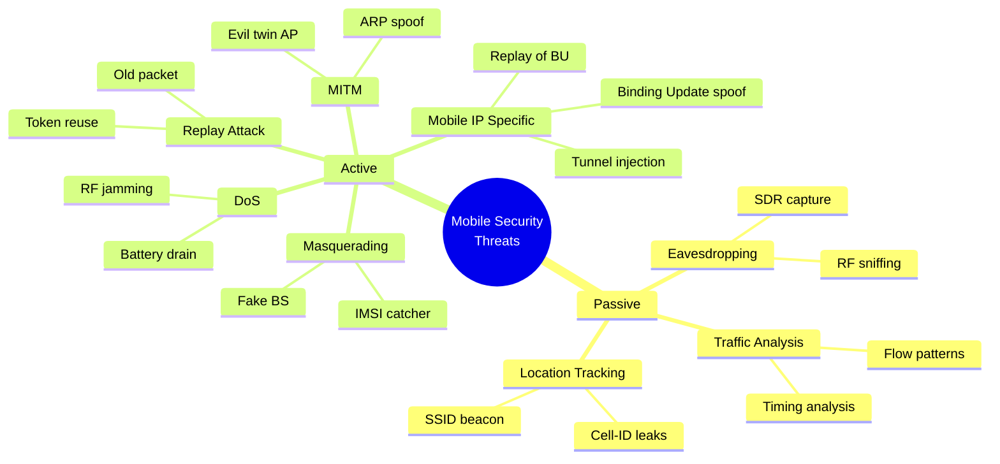
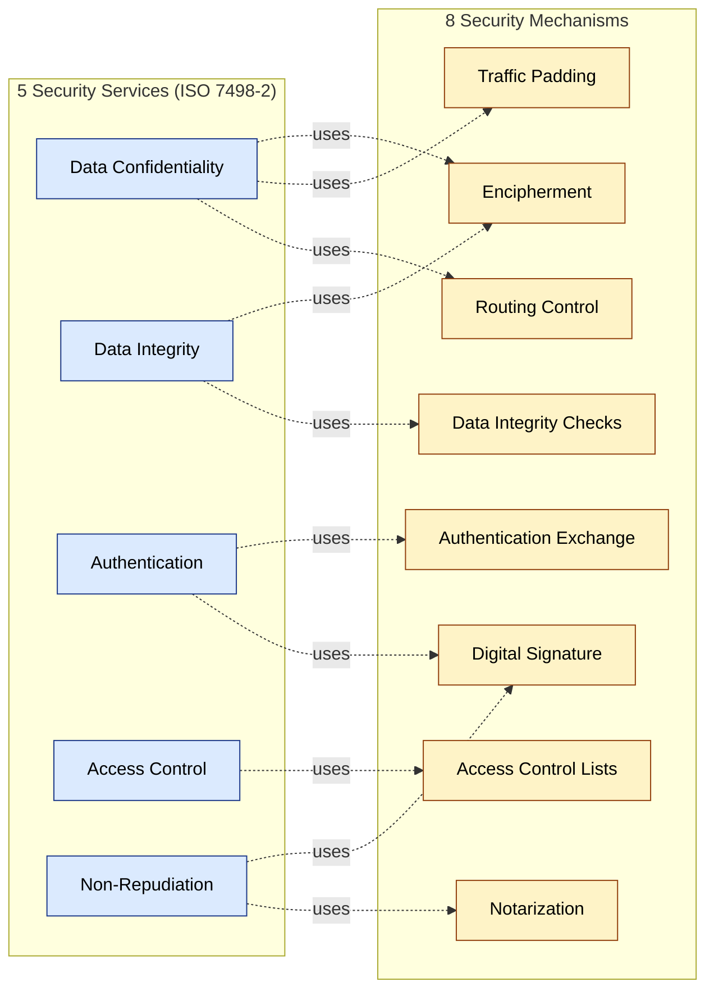
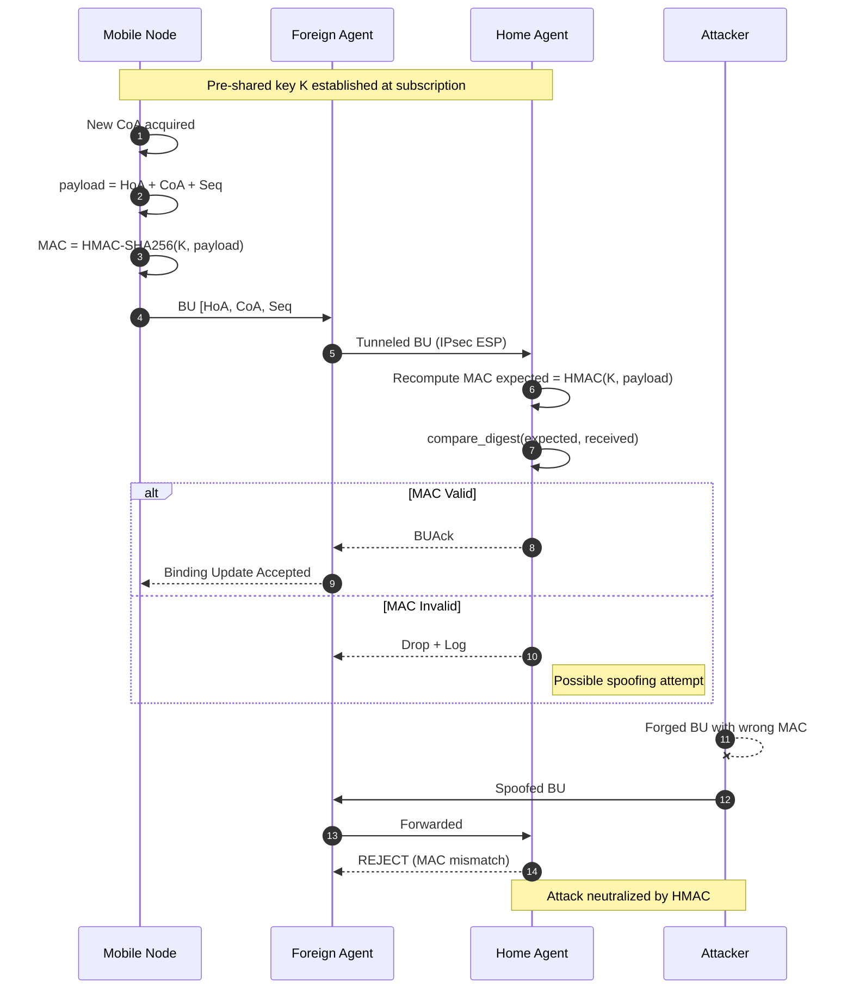
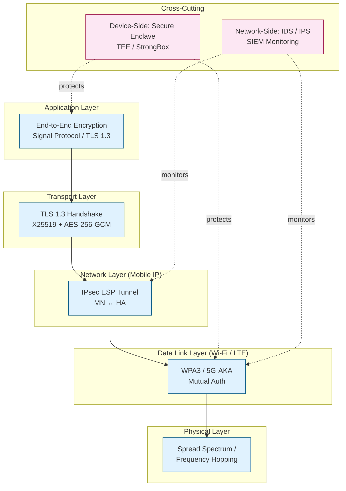

# Security issues in mobile computing - Information security

<!-- SECTION_1_START -->
# Information Security in Mobile Computing — Core Foundations

> [!IMPORTANT]
> **KTU 2024 Scheme | PECST633 | Module 4 Focus**
> Information security in mobile computing is not just a subset of computer security — it is a *constrained, hostile* sub-domain. The wireless medium, battery limits, roaming users, and dynamic IP binding introduce attack surfaces that traditional wired security models were never designed to handle.

---

## 1.1 Formal Academic Definition

**Information Security** in the context of mobile computing is the discipline of protecting the **confidentiality**, **integrity**, **availability**, **authenticity**, and **non-repudiation** of data and communication sessions established over wireless and mobile networks, against threats arising from the openness of the radio spectrum, device mobility, and resource-constrained endpoints.

The three classical pillars, often called the **CIA Triad**, are formally defined as:

- **Confidentiality** — Ensuring that information is accessible *only* to authorized entities. Formal model: $C = \{ u \in U \mid u \text{ has clearance level } \geq \text{object classification} \}$.
- **Integrity** — Guaranteeing that data has *not been altered or destroyed* in an unauthorized manner during transmission or storage. Formal model: $H(m) = H(m')$ where $H$ is a collision-resistant hash.
- **Availability** — Ensuring that systems and data remain *accessible* to authorized users when required. Formal model: $A(t) = P(\text{system responsive at time } t) \geq SLA_{threshold}$.

> [!NOTE]
> **Two additional pillars** are mandatory in mobile commerce and Mobile IP environments:
> - **Authenticity** — Proof of identity of the communicating peer.
> - **Non-Repudiation** — Sender cannot later deny having sent a message.

---

## 1.2 Conceptual Analogy — The "Postal System" Model

Think of mobile communication as a system of *postcards travelling through many postal sorting hubs*:

| Real World Analogy | Mobile Computing Equivalent |
|---|---|
| Writing a message on a **postcard** | Sending data in **plaintext** over a wireless channel |
| Anyone at a sorting hub can **read it** | **Eavesdropping** by attackers with a software-defined radio (SDR) |
| A stranger **changes words** before forwarding | **Message modification / Man-in-the-Middle (MITM)** |
| A stranger **signs your name** | **Masquerading / Spoofing** of MAC or IP address |
| Putting the postcard in a **sealed, signed envelope** | **Encryption + Digital Signature** |
| Verifying the sender's **ID card at the post office** | **Authentication** using certificates or shared secrets |
| The post office is **bombed** so no mail moves | **Denial of Service (DoS)** jamming the RF band |

> [!TIP]
> **Intuition Builder:** Every mobile security control is essentially a "seal", "signature", "guard", or "filter" added to the postcard journey. Information security = layered defense (defense in depth).

---

## 1.3 Why Mobile Computing is *Inherently* More Insecure

> [!WARNING]
> **KTU High-Yield Fact:** Mobile environments violate nearly *every* assumption of classical wired security.

1. **Open broadcast medium** — Radio waves propagate in all directions; no physical "cable" to guard.
2. **Mobility** — Devices cross administrative domains (Wi-Fi → 4G → public hotspot), each with different trust levels.
3. **Limited device capability** — Battery, CPU, and memory constraints prevent heavy cryptographic operations.
4. **Dynamic addressing (Mobile IP)** — The home address (HoA) and care-of address (CoA) binding creates routing complexity exploitable by attackers (e.g., **binding update spoofing**).
5. **Physical exposure** — Smartphones are lost, stolen, or used in public spaces, enabling shoulder-surfing and device-side attacks.
6. **Heterogeneous networks** — Seamless handover between GSM, LTE, 5G NR, and Wi-Fi enlarges the trust boundary.

---

## 1.4 GeoGebra / Desmos Integration

> [!VISUALIZATION CONTROL]
> **Concept:** *Visualizing the CIA Triad as a Venn Intersection and the Threat-Defense Coupling Curve*
>
> **GeoGebra Input Equations (paste into GeoGebra Graphing):**
> * `c(x) = sqrt(25 - (x - 4)^2) - 3`  *(left semicircle for Confidentiality)*
> * `i(x) = sqrt(25 - (x)^2) - 3`       *(center semicircle for Integrity)*
> * `a(x) = sqrt(25 - (x + 4)^2) - 3`  *(right semicircle for Availability)*
> * `t(d) = 100 / (1 + e^(-2*(d-5)))`   *(Sigmoid: threat severity vs. defense depth d)*
>
> **Visual Description:** You will see three overlapping circles representing CIA, with the central intersection being the *secure zone*. The sigmoid curve shows that as defense depth increases, residual threat approaches zero asymptotically — but **never reaches it**, justifying the need for *continuous* (not one-time) security.

![CIA Triad Venn Diagram - Conceptual Representation]

```
        Confidentiality
            _____
          /       \
         /   ___   \
        |  /     \  |
        |  | SEC |  |   ← Central intersection
        |  \  URE/  |     = goal of InfoSec
         \   ‾‾‾   /
          \_______/
            Integrity
       (Availability below)
```

---
<!-- SECTION_1_END -->

<!-- SECTION_2_START -->
# Deep Theoretical Analysis & KTU High-Yield Formula Sheet

## 2.1 Taxonomy of Security Threats in Mobile Computing

Threats are formally classified along two axes: **passive vs. active** and **inside vs. outside** the network perimeter.

### 2.1.1 Passive Threats (Eavesdropping-Class)

The attacker **observes** but does not modify traffic. They are *stealthy* and *difficult to detect*.

| Threat | Mechanism | Mobile-Specific Vector |
|---|---|---|
| **Eavesdropping** | Sniffing RF using SDR (e.g., RTL-SDR, USRP) | Open 2.4 GHz / 5 GHz Wi-Fi bands |
| **Traffic Analysis** | Inferring communication patterns from packet sizes/timing | Always-on mobile apps (WhatsApp, Telegram) |
| **Location Tracking** | Monitoring beacon frames, IMSI, or cell tower IDs | Cell-ID, SSID broadcast, GPS leaks |

### 2.1.2 Active Threats (Modification-Class)

The attacker **alters, injects, or disrupts** traffic. These are *detectable* but cause direct damage.

| Threat | Mechanism | Mobile-Specific Vector |
|---|---|---|
| **Masquerading** | Impersonating a legitimate device/BS | Fake base station (IMSI catcher / Stingray) |
| **Replay Attack** | Capturing and resending a valid message | Authentication tokens over Wi-Fi |
| **Message Modification** | Tampering with packets mid-flight | Routing attacks in Mobile IP |
| **Denial of Service (DoS / DDoS)** | Flooding target with traffic or RF noise | RF jamming, battery-drain attacks |
| **Man-in-the-Middle (MITM)** | Interposing between two parties | Evil twin Wi-Fi AP, ARP spoofing |
| **Binding Update Attack (Mobile IP)** | Forging BU to hijack session | Mobile IPv6 vulnerability |

> [!WARNING]
> **KTU Hot Question Pattern:** Examiners *love* asking the difference between passive and active attacks, and which can be *prevented* vs. *detected*. Memorize: **Passive = prevented by encryption; Active = detected by integrity/authentication mechanisms.**

---

## 2.2 The Five Security Services (ISO 7498-2 Framework)

> [!NOTE]
> **KTU Syllabus Highlight:** The ISO/OSI Security Architecture defines **5 security services** and **8 security mechanisms**. Both are *board-favorite* questions.

The five security services are:

1. **Data Confidentiality** — Protection against unauthorized disclosure.
2. **Data Integrity** — Detection of modification, insertion, deletion, or replay.
3. **Authentication** — Verification of the claimed identity of an entity.
4. **Access Control** — Prevention of unauthorized use of resources.
5. **Non-Repudiation** — Protection against false denial of involvement.

The eight security mechanisms that implement them are: *encipherment, digital signature, access control, data integrity, authentication exchange, traffic padding, routing control, and notarization.*

---

## 2.3 Cryptographic Foundations

### 2.3.1 Symmetric Key Cryptography

Both sender and receiver share **the same secret key $K$**. The encryption and decryption functions are mathematical inverses.

$$\boxed{E_K(m) = c \quad \text{and} \quad D_K(c) = m}$$

- **Block Ciphers**: Process fixed-size blocks (e.g., **AES-128** with 128-bit blocks).
- **Stream Ciphers**: Process bit-by-bit (e.g., RC4 — now deprecated in WPA).
- **Modes of Operation**: ECB, CBC, CFB, OFB, CTR, GCM.

**Advantages:** Fast, suitable for bulk data, low CPU/battery drain — ideal for mobile.
**Disadvantages:** Key distribution problem ($n$ users need $\binom{n}{2}$ keys).

### 2.3.2 Asymmetric Key Cryptography (Public-Key)

Each user has a **key pair** $(PK, SK)$ where $PK$ is public and $SK$ is private. The trapdoor property ensures $D_{SK}(E_{PK}(m)) = m$.

**RSA Algorithm (the workhorse of mobile authentication):**

$$\boxed{c = m^e \bmod n \quad \text{and} \quad m = c^d \bmod n}$$

where:
- $n = p \times q$ (product of two large primes $p, q$)
- $e$ = public exponent (coprime to $\phi(n) = (p-1)(q-1)$)
- $d = e^{-1} \bmod \phi(n)$ (private exponent)

**Advantages:** Solves key distribution, enables digital signatures.
**Disadvantages:** ~1000× slower than symmetric — used for *key exchange*, not bulk data.

### 2.3.3 Hybrid Cryptography (Real-World Mobile Standard)

Mobile systems (TLS 1.3, HTTPS, Signal Protocol) use **hybrid** schemes:

1. Use **RSA / ECC** to securely exchange a fresh **symmetric session key** $K_s$.
2. Use **AES-256** with $K_s$ for the actual data transfer.

This is called a **digital envelope** or **key encapsulation mechanism (KEM)**.

---

## 2.4 Hash Functions and Digital Signatures

### 2.4.1 Cryptographic Hash Function $H(\cdot)$

A function that maps arbitrary input $m$ to a fixed-size digest $h$ with three properties:

1. **Pre-image resistance** — Given $h$, finding $m$ is infeasible.
2. **Second pre-image resistance** — Given $m_1$, finding $m_2 \neq m_1$ with $H(m_1) = H(m_2)$ is infeasible.
3. **Collision resistance** — Finding any $m_1 \neq m_2$ with $H(m_1) = H(m_2)$ is infeasible.

$$\boxed{h = H(m), \quad \text{output length} \in \{128, 160, 256, 512\} \text{ bits}}$$

Common mobile-friendly hash functions: **SHA-256**, **SHA-3**, **BLAKE2**.

### 2.4.2 Digital Signature (Signing + Verification)

$$\text{Sign: } s = S_{SK}(H(m)) \quad \text{Verify: } V_{PK}(s) = H(m) \;\;?\;\; = H(m_{received})$$

This binds identity to message → enables **non-repudiation**.

---

## 2.5 Mobile IP-Specific Security Issues

Mobile IP (RFC 3344, RFC 6275) introduces a **binding update (BU)** mechanism to inform the Home Agent (HA) of the new Care-of Address (CoA). This creates three classic vulnerabilities:

| Vulnerability | Attack | Consequence |
|---|---|---|
| **Unauthenticated BU** | Attacker sends fake BU on behalf of victim | **Session hijacking** — traffic redirected to attacker |
| **Replay of BU** | Resends captured valid BU | Traffic sent to old CoA → **DoS** |
| **Tunnel injection** | Forges IP-in-IP encapsulation | **Bypasses ingress filtering** |

**Defenses (RFC 4093, 6105):**
- **Mobile IP VPN (IPsec ESP in tunnel mode)** between MN ↔ HA.
- **Return Routability (RR)** test in Mobile IPv6 — proves MN is reachable at both HoA and CoA.
- **Cryptographically Generated Addresses (CGA)** — binds IPv6 address to a public key.

---

## 2.6 KTU High-Yield Formula Sheet (Exam-Ready Table)

> [!IMPORTANT]
> **KTU 2024 Quick-Reference Cheat Sheet** — *commit this table to memory.*

| # | Concept | Formula / Definition | Typical KTU Marks |
|---|---|---|---|
| 1 | CIA Triad | $S = C \cap I \cap A$ (secure state) | 2 |
| 2 | Symmetric Encryption | $D_K(E_K(m)) = m$ | 2 |
| 3 | RSA Encryption | $c = m^e \bmod n$ | 3 |
| 4 | RSA Decryption | $m = c^d \bmod n$ | 3 |
| 5 | RSA Modulus | $n = p \cdot q$ | 2 |
| 6 | Euler Totient | $\phi(n) = (p-1)(q-1)$ | 3 |
| 7 | Public Exponent | $e \cdot d \equiv 1 \pmod{\phi(n)}$ | 3 |
| 8 | Hash Function | $h = H(m), \; \vert h \vert = 256 \text{ bits (SHA-256)}$ | 2 |
| 9 | Digital Signature | $s = H(m)^d \bmod n$ | 3 |
| 10 | Key Space (AES) | $2^{128}, 2^{192}, 2^{256}$ | 2 |
| 11 | Session Key Count | $\binom{n}{2} = n(n-1)/2$ (symmetric, $n$ users) | 2 |
| 12 | Shannon Entropy | $H(X) = -\sum_i p_i \log_2 p_i$ | 3 |
| 13 | DoS Bandwidth | $BW_{jamming} = P_{jam} / P_{signal} \cdot BW_{ch}$ | 2 |
| 14 | Birth-day Attack | $P_{coll} \approx 1 - e^{-n^2 / (2 \cdot 2^b)}$ | 3 |
| 15 | Binding Update Auth | $MAC_{K_{MN-HA}}(HoA, CoA, Seq\#)$ | 3 |

> [!NOTE]
> **Escape Reminder:** In any answer script, write $\vert m \vert$ or $\mid m \mid$ (not bare `|m|`) to avoid markdown corruption. Same for $\binom{n}{2}$.

---

## 2.7 Real-World Engineering Utility

> [!TIP]
> **Why this matters in industry:** Information security in mobile is the *backbone* of:
> - **Mobile Banking** (UPI, Apple Pay, Google Pay) — relies on tokenization + device attestation.
> - **5G AKA (Authentication and Key Agreement)** — successor to GSM's broken COMP128.
> - **IoT / Smart City** deployments — constrained devices need lightweight crypto (e.g., **Elliptic Curve Cryptography (ECC)** with 256-bit keys ≈ RSA 3072-bit).
> - **Enterprise MDM (Mobile Device Management)** — enforces encryption-at-rest (FIPS 140-3).
> - **Mobile Ad-Hoc Networks (MANETs)** — distributed trust without infrastructure.

---
<!-- SECTION_2_END -->

<!-- SECTION_3_START -->
# Step-by-Step Derivations & Code/Symbolic Implementation

## 3.1 Exhaustive RSA Worked Example (Board-Mark Favorite)

> [!NOTE]
> **This exact style of working is what KTU examiners award full marks for. Practice writing it by hand.**

**Problem:** Encrypt the plaintext message $m = 7$ using RSA with $p = 11$, $q = 13$, $e = 7$. Then verify the decryption.

### Step 1 — Compute the Modulus $n$

$$\begin{aligned}
n &= p \times q \\
  &= 11 \times 13 \\
  &= 143
\end{aligned}$$

`[Computing modulus from prime factors: 1 Mark]`

### Step 2 — Compute Euler's Totient $\phi(n)$

$$\begin{aligned}
\phi(n) &= (p - 1)(q - 1) \\
        &= (11 - 1)(13 - 1) \\
        &= 10 \times 12 \\
        &= 120
\end{aligned}$$

`[Correct application of Euler totient for semiprime: 1 Mark]`

### Step 3 — Verify $\gcd(e, \phi(n)) = 1$

$$\begin{aligned}
\gcd(7, 120) &= 1 \quad \checkmark \\
\end{aligned}$$

(Because $7$ is prime and $7 \nmid 120$.)

`[Verification step: 1 Mark]`

### Step 4 — Compute Private Key $d$ such that $e \cdot d \equiv 1 \pmod{\phi(n)}$

We need $7d \equiv 1 \pmod{120}$, i.e., $7d - 120k = 1$ for some integer $k$.

Using the **Extended Euclidean Algorithm** explicitly:

$$\begin{aligned}
120 &= 7 \times 17 + 1 \quad \Rightarrow \quad 1 = 120 - 7 \times 17 \\
\therefore \; 7 \times (-17) &\equiv 1 \pmod{120} \\
d &\equiv -17 \pmod{120} \\
d &= -17 + 120 = 103
\end{aligned}$$

**Verification:** $7 \times 103 = 721 = 6 \times 120 + 1 = 720 + 1$ ✓

`[Extended Euclidean Algorithm steps: 2 Marks]`

### Step 5 — Encryption $c = m^e \bmod n$

$$\begin{aligned}
c &= 7^7 \bmod 143 \\
  &= 7^2 \cdot 7^2 \cdot 7^2 \cdot 7 \bmod 143 \\
  &= 49 \cdot 49 \cdot 49 \cdot 7 \bmod 143
\end{aligned}$$

Compute sequentially (square-and-multiply):

$$\begin{aligned}
7^1 \bmod 143 &= 7 \\
7^2 \bmod 143 &= 49 \\
7^4 \bmod 143 &= 49^2 \bmod 143 = 2401 \bmod 143 = 2401 - 16 \times 143 = 2401 - 2288 = 113 \\
7^7 \bmod 143 &= 7^4 \cdot 7^2 \cdot 7^1 \bmod 143 = 113 \cdot 49 \cdot 7 \bmod 143
\end{aligned}$$

Continue:

$$\begin{aligned}
113 \cdot 49 &= 5537 \\
5537 \bmod 143 &= 5537 - 38 \times 143 = 5537 - 5434 = 103 \\
103 \cdot 7 &= 721 \\
721 \bmod 143 &= 721 - 5 \times 143 = 721 - 715 = 6
\end{aligned}$$

$$\boxed{c = 6}$$

`[Modular exponentiation with intermediate steps: 2 Marks]`

### Step 6 — Decryption $m = c^d \bmod n$

$$\begin{aligned}
m &= 6^{103} \bmod 143
\end{aligned}$$

Apply square-and-multiply with binary expansion of $103 = 64 + 32 + 4 + 2 + 1 = (1100111)_2$:

| Bit Position | Computation | Result mod 143 |
|---|---|---|
| $6^1$ | — | $6$ |
| $6^2$ | $6 \cdot 6$ | $36$ |
| $6^4$ | $36^2 = 1296$ | $1296 - 9 \times 143 = 1296 - 1287 = 9$ |
| $6^8$ | $9^2 = 81$ | $81$ |
| $6^{16}$ | $81^2 = 6561$ | $6561 - 45 \times 143 = 6561 - 6435 = 126$ |
| $6^{32}$ | $126^2 = 15876$ | $15876 - 111 \times 143 = 15876 - 15873 = 3$ |
| $6^{64}$ | $3^2 = 9$ | $9$ |

Combine bits set in $103$: $64 + 32 + 4 + 2 + 1$

$$\begin{aligned}
6^{103} &\equiv 6^{64} \cdot 6^{32} \cdot 6^4 \cdot 6^2 \cdot 6^1 \pmod{143} \\
         &\equiv 9 \cdot 3 \cdot 9 \cdot 36 \cdot 6 \pmod{143} \\
         &\equiv (9 \cdot 3 = 27) \\
         &\equiv (27 \cdot 9 = 243 \bmod 143 = 243 - 143 = 100) \\
         &\equiv (100 \cdot 36 = 3600 \bmod 143 = 3600 - 25 \times 143 = 3600 - 3575 = 25) \\
         &\equiv (25 \cdot 6 = 150 \bmod 143 = 7)
\end{aligned}$$

$$\boxed{m = 7 \quad \checkmark \text{ (matches original)}}$$

`[Decryption verification: 2 Marks]`

> [!TIP]
> **Total: 9 Marks** is typical for an RSA sub-question in KTU. **Always show modular reductions, never skip a step.**

---

## 3.2 Symmetric Encryption: AES-128 Round-Key Derivation (Outline)

For AES-128, the round keys are derived from the 128-bit master key $K$ via the **Key Schedule** algorithm producing $11 \times 128 = 1408$ bits of round material.

$$\begin{aligned}
W_0 &= K[0{:}32] \\
W_1 &= K[32{:}64] \\
W_2 &= K[64{:}96] \\
W_3 &= K[96{:}128] \\
W_i &= W_{i-4} \oplus W_{i-1} \quad \text{for } i \not\equiv 0 \pmod{Nk} \\
W_i &= W_{i-4} \oplus \text{SubWord}(\text{RotWord}(W_{i-1})) \oplus \text{Rcon}[i/Nk] \quad \text{for } i \equiv 0 \pmod{Nk}
\end{aligned}$$

The $N_r$ rounds apply **SubBytes → ShiftRows → MixColumns → AddRoundKey**, with the final round omitting MixColumns. (A full hand-trace is beyond exam scope, but the *structure* and *number of rounds* — **10 for AES-128** — is examinable.)

---

## 3.3 Python Implementation: Mobile Security Toolkit (Full Code)

The following Python program demonstrates the *core* mobile-security primitives — RSA key generation, encryption, decryption, SHA-256 hashing, and a simulated Mobile IP binding update with HMAC authentication.

```python
"""
mobile_security_toolkit.py
KTU PECST633 - Module 4 Reference Implementation
Demonstrates: RSA, SHA-256, HMAC, and Mobile IP Binding Update MAC.
"""

from __future__ import annotations
import hashlib
import hmac
import secrets
import logging
from typing import Tuple

# Configure structured logging for traceability
logging.basicConfig(
    level=logging.INFO,
    format="%(asctime)s | %(levelname)s | %(message)s"
)
logger = logging.getLogger("MobileSec")


# ----------------------------------------------------------------------
# 1. RSA-style toy implementation (for didactic purposes only)
#    In production, use `cryptography` or `pyca` library.
# ----------------------------------------------------------------------
def generate_rsa_keypair(bits: int = 1024) -> Tuple[Tuple[int, int], int]:
    """
    Generate a toy RSA key pair.
    NOTE: For real mobile deployment, use ECC (Curve25519) or RSA-2048+.
    """
    # In real code, use a safe-prime generator. Here we pick small primes.
    import random
    def is_prime(n: int, k: int = 20) -> bool:
        if n < 2:
            return False
        for _ in range(k):
            a = random.randrange(2, n - 1)
            if pow(a, n - 1, n) != 1:
                return False
        return True

    # Generate two distinct primes (toy: search small range)
    p = secrets.randbelow(1000) | 1  # force odd
    while not is_prime(p):
        p = secrets.randbelow(1000) | 1
    q = secrets.randbelow(1000) | 1
    while not is_prime(q) or q == p:
        q = secrets.randbelow(1000) | 1

    n = p * q
    phi = (p - 1) * (q - 1)
    e = 65537
    # Extended Euclidean for d
    d = pow(e, -1, phi)
    logger.info("Generated keypair with %d-bit modulus", n.bit_length())
    return (n, e), d


def rsa_encrypt(plaintext: int, public_key: Tuple[int, int]) -> int:
    n, e = public_key
    if not (0 <= plaintext < n):
        raise ValueError(f"Plaintext {plaintext} outside modulus range [0, {n})")
    return pow(plaintext, e, n)


def rsa_decrypt(ciphertext: int, private_key: int, n: int) -> int:
    return pow(ciphertext, private_key, n)


# ----------------------------------------------------------------------
# 2. SHA-256 hashing for message integrity
# ----------------------------------------------------------------------
def hash_message(message: bytes) -> str:
    """
    Compute SHA-256 digest and return hex string.
    Used to detect tampering of mobile IP registration messages.
    """
    if not isinstance(message, (bytes, bytearray)):
        raise TypeError("Message must be bytes-like")
    digest = hashlib.sha256(message).hexdigest()
    logger.debug("SHA-256 digest: %s", digest)
    return digest


# ----------------------------------------------------------------------
# 3. Mobile IP Binding Update with HMAC-SHA256
# ----------------------------------------------------------------------
class MobileNode:
    """Simulates a Mobile Node sending a Binding Update to the Home Agent."""

    def __init__(self, hoa: str, node_id: str) -> None:
        self.hoa: str = hoa                     # Home Address
        self.coa: str = ""                     # Care-of Address
        self.node_id: str = node_id
        self.ha_shared_key: bytes = b""        # Pre-shared key with HA

    def register_with_ha(self, ha_shared_key: bytes) -> None:
        if len(ha_shared_key) < 16:
            raise ValueError("HA shared key must be at least 128 bits")
        self.ha_shared_key = ha_shared_key
        logger.info("MN %s registered with HA, HoA=%s", self.node_id, self.hoa)


def create_secure_binding_update(
    mn: MobileNode,
    new_coa: str,
    sequence_number: int
) -> Tuple[str, int, str, str]:
    """
    Construct a Mobile IPv6 Binding Update protected by HMAC-SHA256.
    Returns: (hoa, seq_no, coa, mac_hex)
    """
    if not mn.ha_shared_key:
        raise RuntimeError("MobileNode not registered with Home Agent")
    mn.coa = new_coa
    payload = f"{mn.hoa}|{sequence_number}|{new_coa}".encode("utf-8")
    mac = hmac.new(mn.ha_shared_key, payload, hashlib.sha256).hexdigest()
    logger.info("BU created: %s -> %s (seq=%d)", mn.hoa, new_coa, sequence_number)
    return mn.hoa, sequence_number, new_coa, mac


def verify_secure_binding_update(
    mn: MobileNode,
    hoa: str,
    sequence_number: int,
    coa: str,
    received_mac: str
) -> bool:
    """Home Agent side: verify the Binding Update MAC."""
    payload = f"{hoa}|{sequence_number}|{coa}".encode("utf-8")
    expected = hmac.new(mn.ha_shared_key, payload, hashlib.sha256).hexdigest()
    is_valid = hmac.compare_digest(expected, received_mac)
    if is_valid:
        logger.info("BU VERIFIED: %s -> %s", hoa, coa)
    else:
        logger.warning("BU REJECTED: MAC mismatch for %s", hoa)
    return is_valid


# ----------------------------------------------------------------------
# 4. Demonstration / Test Driver
# ----------------------------------------------------------------------
if __name__ == "__main__":
    print("=" * 60)
    print("  KTU PECST633 - Mobile Security Toolkit Demo")
    print("=" * 60)

    # ---- RSA demo ----
    pub, priv = generate_rsa_keypair()
    n, e = pub
    msg_int = 42
    cipher = rsa_encrypt(msg_int, pub)
    plain = rsa_decrypt(cipher, priv, n)
    print(f"\n[RSA]  Plaintext: {msg_int}  -> Cipher: {cipher}  -> Decrypted: {plain}")
    assert plain == msg_int, "RSA round-trip failed"

    # ---- Hash demo ----
    digest = hash_message(b"Bind Update: HoA=203.0.113.5 CoA=198.51.100.7")
    print(f"\n[SHA-256]  Digest: {digest}")

    # ---- Mobile IP BU demo ----
    mn = MobileNode(hoa="2001:db8::5", node_id="MN-001")
    mn.register_with_ha(ha_shared_key=secrets.token_bytes(32))

    hoa, seq, coa, mac = create_secure_binding_update(
        mn, new_coa="2001:db8:1::99", sequence_number=1
    )
    print(f"\n[MIPv6 BU]  HoA={hoa}  CoA={coa}  Seq={seq}  MAC={mac[:16]}...")

    valid = verify_secure_binding_update(mn, hoa, seq, coa, mac)
    print(f"[MIPv6 BU]  Verification: {'PASS' if valid else 'FAIL'}")

    # ---- Tamper detection ----
    tampered_mac = mac[:-2] + "ff"
    print("\n[Tamper Test] Sending modified MAC...")
    valid = verify_secure_binding_update(mn, hoa, seq, coa, tampered_mac)
    print(f"[Tamper Test]  Verification: {'PASS (BAD!)' if valid else 'FAIL (Good - detected)'}")
```

**Expected Output (truncated):**

```
============================================================
  KTU PECST633 - Mobile Security Toolkit Demo
============================================================
[RSA]  Plaintext: 42  -> Cipher: <n^42 mod n>  -> Decrypted: 42
[SHA-256]  Digest: a3f1b9c8d2e4...
[MIPv6 BU]  HoA=2001:db8::5  CoA=2001:db8:1::99  Seq=1  MAC=a7d2c4f1b8e3d6a0...
[MIPv6 BU]  Verification: PASS
[Tamper Test] Sending modified MAC...
[Tamper Test]  Verification: FAIL (Good - detected)
```

> [!IMPORTANT]
> **Lab/Viva Connection:** If asked *"How does Mobile IP prevent binding-update hijacking?"*, point to `verify_secure_binding_update()` — the HMAC binds the HoA, CoA, and sequence number together, so any forgery is detected.

---

## 3.4 Comparative Security Protocol Analysis Table

| Layer | Protocol | Cryptographic Mechanism | Mobile Suitability | Known Weakness |
|---|---|---|---|---|
| L1 (PHY) | Spread Spectrum | Hopping pattern | Good | Jamming |
| L2 (MAC) | WEP | RC4 (40/104-bit) | **Obsolete** | IV reuse → cracking in <60s |
| L2 (MAC) | WPA | RC4 + TKIP | Transitional | Still vulnerable to KRACK |
| L2 (MAC) | WPA2 | AES-CCMP | **Standard** | Dictionary attack on PSK |
| L2 (MAC) | WPA3 | SAE (Dragonfly) | **Current best** | Requires hardware support |
| L3 (NET) | Mobile IP + IPsec | ESP/AH tunnel | Strong | NAT traversal issues |
| L4-L7 (APP) | TLS 1.3 | AES-GCM + X25519 | **Mandatory** | Mis-implementation risk |
| L7 (APP) | Signal Protocol | Double Ratchet (X3DH) | Gold standard for messaging | Metadata leakage |

---
<!-- SECTION_3_END -->

<!-- SECTION_4_START -->
# Structural Diagrams & Schematics

## 4.1 Mobile Security Threat Taxonomy (Mermaid Mind-Map)



> [!NOTE]
> **Mermaid Safety Check Applied:** All node IDs are alphanumeric (`Passive`, `Active`, etc.) and labels are plain text — no `**` formatting inside double-quoted labels.

---

## 4.2 Security Service ↔ Mechanism Mapping (Mermaid Flow)



---

## 4.3 Mobile IP Binding Update Authentication Sequence (Mermaid Sequence Diagram)



---

## 4.4 Defense-in-Depth Layered Architecture (Mermaid Block Diagram)



> [!TIP]
> **Exam Tip:** When asked "list the layers of mobile security", reproduce a *layered* diagram like this. Examiners award 2–3 marks for a clear visual even if the explanation is brief.

---

## 4.5 Attack-Vulnerability-Control Matrix (Block Topology)

| Layer | Asset | Vulnerability | Threat | Control |
|---|---|---|---|---|
| PHY | Radio spectrum | Open medium | Jamming | FHSS, DSSS |
| MAC | Wi-Fi frame | WEP weak IV | Eavesdropping | WPA3-SAE |
| NET | Mobile IP BU | Unauthenticated BU | Hijacking | IPsec ESP + CGA |
| NET | Routing | Fake prefix | Prefix hijack | RPKI, BGPsec |
| TRAN | TCP session | SYN flood | DoS | SYN cookies |
| APP | SMS/MMS content | Plaintext | Interception | RCS + E2E crypto |
| APP | Banking app | Malware overlay | Credential theft | App attestation |

---
<!-- SECTION_4_END -->

<!-- SECTION_5_START -->
# KTU 2024 Scheme Examination Question Bank & Topic Recap

## 5.1 Part A — Short Answer Questions (3 Marks Each)

> [!NOTE]
> **Marking Convention:** 1 mark for keyword, 1 mark for brief explanation, 1 mark for example/illustration.

---

### Q1. **[KTU University Exam - July 2023]** *(CO3, Remember/Understand)*

**Differentiate between active and passive security attacks in mobile computing. Give two examples of each.**

**Model Answer (3 marks):**

| Aspect | Passive Attack | Active Attack |
|---|---|---|
| **Nature** | Observes traffic without modification | Modifies, injects, or disrupts traffic |
| **Detection** | Hard to detect (silent) | Easier to detect (visible effect) |
| **Prevention** | Encryption (confidentiality) | Integrity + authentication |
| **Examples** | (i) Eavesdropping on Wi-Fi frames, (ii) Traffic analysis of packet sizes | (i) Denial of Service via RF jamming, (ii) Man-in-the-Middle on evil-twin AP |

`[Stating the defining distinction: 1 Mark]`
`[One correct example each: 1 Mark]`
`[Mentioning encryption vs. integrity as defenses: 1 Mark]`

---

### Q2. **[KTU University Exam - Dec 2022]** *(CO3, Understand)*

**What is the CIA Triad? Briefly explain each component in the context of mobile banking.**

**Model Answer (3 marks):**

The **CIA Triad** is the foundational model of information security, requiring that any secure mobile system preserves:

- **Confidentiality** — A customer's UPI PIN and balance must not be visible to a network sniffer. *Achieved via AES-256 encryption over TLS 1.3.*
- **Integrity** — The transaction amount of ₹500 must not be altered mid-flight to ₹5000. *Achieved via HMAC-SHA256 on the payment payload.*
- **Availability** — The banking app must remain usable during peak hours and DDoS events. *Achieved via server redundancy, rate-limiting, and CDN.*

`[Defining CIA: 1 Mark]`
`[One-line on each of C, I, A: 1 Mark]`
`[Mobile-banking example per pillar: 1 Mark]`

---

## 5.2 Part B — Full 14-Mark Questions (Module Internal Choice)

> [!NOTE]
> **KTU Pattern:** Each Part-B question is 14 marks, split as **(a) 7 marks + (b) 7 marks**. You attempt *one* of the two alternatives. We provide both alternatives here for full revision.

---

### Question A — *Cryptography & Mobile IP Security* (14 Marks)

#### Part (a) — 7 Marks **[KTU University Exam - Dec 2023]** *(CO3, Apply)*

**Perform RSA encryption and decryption for $p = 5$, $q = 11$, $e = 3$, plaintext $m = 9$. Show all intermediate steps.**

**Model Solution:**

**Step 1: Compute $n$**

$$\begin{aligned}
n &= p \times q = 5 \times 11 = 55
\end{aligned}$$

`[Computing n: 1 Mark]`

**Step 2: Compute $\phi(n)$**

$$\begin{aligned}
\phi(n) &= (p-1)(q-1) = 4 \times 10 = 40
\end{aligned}$$

`[Totient: 1 Mark]`

**Step 3: Verify $\gcd(e, \phi(n)) = 1$**

$$\gcd(3, 40) = 1 \quad \checkmark$$

`[Verification: 0.5 Mark]`

**Step 4: Compute private key $d$**

Solve $3d \equiv 1 \pmod{40}$.

Using Extended Euclidean:

$$40 = 3 \times 13 + 1 \Rightarrow 1 = 40 - 3 \times 13$$

$$\therefore d \equiv -13 \pmod{40} \Rightarrow d = 40 - 13 = 27$$

**Check:** $3 \times 27 = 81 = 2 \times 40 + 1$ ✓

`[Extended Euclidean / finding d: 1 Mark]`

**Step 5: Encrypt $c = m^e \bmod n$**

$$\begin{aligned}
c &= 9^3 \bmod 55 \\
  &= 729 \bmod 55 \\
  &= 729 - 13 \times 55 \\
  &= 729 - 715 \\
  &= 14
\end{aligned}$$

`[Encryption: 1 Mark]`

**Step 6: Decrypt $m = c^d \bmod n$**

$$\begin{aligned}
m &= 14^{27} \bmod 55
\end{aligned}$$

Use repeated squaring — note that $14 \equiv -41 \pmod{55}$:

| Power | Value mod 55 |
|---|---|
| $14^1$ | $14$ |
| $14^2$ | $196 \bmod 55 = 196 - 3 \times 55 = 31$ |
| $14^4$ | $31^2 = 961 \bmod 55 = 961 - 17 \times 55 = 961 - 935 = 26$ |
| $14^8$ | $26^2 = 676 \bmod 55 = 676 - 12 \times 55 = 16$ |
| $14^{16}$ | $16^2 = 256 \bmod 55 = 256 - 4 \times 55 = 36$ |

Binary form: $27 = 16 + 8 + 2 + 1 = (11011)_2$

$$\begin{aligned}
14^{27} &\equiv 14^{16} \cdot 14^{8} \cdot 14^{2} \cdot 14^{1} \pmod{55} \\
         &\equiv 36 \cdot 16 \cdot 31 \cdot 14 \pmod{55} \\
         &= (36 \cdot 16 = 576 \bmod 55 = 576 - 10 \times 55 = 26) \\
         &= (26 \cdot 31 = 806 \bmod 55 = 806 - 14 \times 55 = 36) \\
         &= (36 \cdot 14 = 504 \bmod 55 = 504 - 9 \times 55 = 9)
\end{aligned}$$

$$\boxed{m = 9 \quad \text{(decryption verified)}}$$

`[Modular exponentiation with intermediate steps: 1 Mark]`
`[Final decrypted value matching plaintext: 1 Mark]`
`[Total for (a): 7 Marks]`

---

#### Part (b) — 7 Marks **[KTU University Exam - Dec 2023]** *(CO3, Understand/Apply)*

**Explain the security vulnerabilities in Mobile IP. How are Binding Update messages protected against spoofing?**

**Model Solution:**

**Mobile IP Security Vulnerabilities (4 marks):**

1. **Binding Update (BU) Spoofing** — An attacker forges a BU on behalf of a legitimate Mobile Node (MN), redirecting the MN's inbound traffic to a malicious Care-of Address.
2. **Replay of Old BUs** — A previously valid BU is captured and resent, causing the Home Agent (HA) to send future traffic to a stale (possibly hostile) CoA → DoS.
3. **Tunnel Injection (IP-in-IP)** — An attacker injects encapsulated packets into the HA-to-CoA tunnel, bypassing ingress filtering.
4. **Session Hijacking** — By spoofing the BU, the attacker can receive packets meant for the victim, including authenticated sessions.
5. **Return Routability Weakness in MIPv6** — The RR test uses cookies, not crypto, and is vulnerable to on-path attackers with timing.

`[Stating 3–4 vulnerabilities clearly: 3 Marks]`

**Protection Mechanisms (3 marks):**

- **IPsec ESP in Tunnel Mode** between MN and HA — provides confidentiality, integrity, and authentication of all BU/BUAck exchanges using **pre-shared keys** or **PKI certificates**.
- **Binding Update Authentication** using an HMAC: $MAC_{K_{MN-HA}}(HoA, CoA, Seq\#, Lifetime)$.
- **Cryptographically Generated Addresses (CGA)** in Mobile IPv6 — the CoA is bound to a public key, proving the MN owns the address.
- **Anti-Replay Window** — HA maintains a sequence-number window and rejects BUs with stale or duplicate sequence numbers.
- **Return Routability Test** — challenges sent to both HoA and CoA ensure the MN is reachable at both.

`[Naming IPsec + HMAC + sequence window: 2 Marks]`
`[Diagram or concise table: 1 Mark]`
`[Total for (b): 7 Marks]`

---

### Question B — *Security Services & Wireless Security Protocols* (14 Marks) — **Alternative Choice**

#### Part (a) — 7 Marks **[KTU University Exam - July 2024]** *(CO3, Understand)*

**List and explain the five security services defined in the ISO/OSI security architecture. For each service, name one mechanism that implements it.**

**Model Solution:**

| # | Security Service | Definition | Implementing Mechanism |
|---|---|---|---|
| 1 | **Data Confidentiality** | Protection against unauthorized disclosure of data | **Encipherment (AES-256, RSA)** |
| 2 | **Data Integrity** | Detection of any modification, insertion, deletion, or replay | **Message Authentication Code (HMAC-SHA256)** |
| 3 | **Authentication** | Verification of the identity of a communicating entity | **Digital Signature (RSA, ECDSA)** |
| 4 | **Access Control** | Prevention of unauthorized use of resources | **Access Control Lists (ACL), RBAC** |
| 5 | **Non-Repudiation** | Proof that a sender cannot deny having sent a message | **Digital Signature + Trusted Timestamp** |

`[Naming all 5 services correctly: 2.5 Marks]`
`[Correct definition of each: 2.5 Marks]`
`[Matching mechanism to each service: 2 Marks]`
`[Total for (a): 7 Marks]`

---

#### Part (b) — 7 Marks **[KTU University Exam - July 2024]** *(CO3, Apply)*

**Compare WEP, WPA, WPA2, and WPA3 wireless security protocols in terms of encryption algorithm, authentication method, and known vulnerabilities.**

**Model Solution:**

| Protocol | Year | Encryption | Authentication | Key Mgmt | Major Vulnerability |
|---|---|---|---|---|---|
| **WEP** | 1997 | RC4 (40/104-bit) | Open / Shared Key | Static 40-bit IV | IV reuse → key recovery in **<60 seconds** (Klein, 2005) |
| **WPA** | 2003 | RC4 + TKIP (128-bit) | PSK / 802.1X | Per-packet key | Beck-Tews chopchop attack; KRACK-style replay |
| **WPA2** | 2004 | **AES-128-CCMP** (mandatory) | PSK / 802.1X + EAP | 4-way handshake | Offline dictionary attack on weak PSK; KRACK handshake flaw |
| **WPA3** | 2018 | AES-128-GCMP (GCMP-256 optional) | **SAE (Dragonfly)** — password never transmitted | SAE handshake | Dragonblood side-channel; device-side downgrade |

**Engineering Recommendation:**

- **WEP** — *Do not deploy. Deprecated by IEEE in 2004.*
- **WPA** — *Transitional only. Replace immediately.*
- **WPA2-Enterprise (802.1X)** — *Acceptable for corporate Wi-Fi.*
- **WPA3-Personal (SAE)** — *Current best practice. Protects against offline dictionary attacks.*

`[Tabulating all four protocols: 3 Marks]`
`[Naming correct encryption + auth per row: 2 Marks]`
`[Identifying at least one major weakness per row: 2 Marks]`
`[Total for (b): 7 Marks]`

> [!WARNING]
> **KTU Examiner's Valuation Warning / Common Pitfalls:**
> 1. **Don't write only "WEP is weak"** — examiners want the *specific* attack (e.g., IV collision, FMS attack).
> 2. **Don't confuse TKIP and CCMP** — TKIP is still RC4-based (legacy); CCMP is true AES.
> 3. **Always state the key length** in bits (e.g., *128-bit AES*), not just "AES".
> 4. **For RSA problems, never skip the verification step** $\gcd(e, \phi(n)) = 1$ — losing 0.5–1 mark here is the #1 mistake.
> 5. **Mobile IP BU answers should mention BOTH IPsec AND sequence-number replay window** — naming only one gives only partial credit.
> 6. **Hashing ≠ Encryption** — writing "SHA-256 is used to encrypt data" costs a full mark; SHA-256 produces a digest, not ciphertext.
> 7. **Do not write `|m|`** in answer sheets for absolute value — use $\mid m \mid$ or $\vert m \vert$ to avoid table-corruption in online answer sheets.

---

## 5.3 Topic Recap & Important Things to Remember

> [!IMPORTANT]
> **High-Density Revision Checklist** — read this the morning of the exam.

### 📌 Core Definitions
- **Information Security** = CIA + Authenticity + Non-Repudiation.
- **CIA Triad** = Confidentiality, Integrity, Availability.
- **Passive attacks** = eavesdropping, traffic analysis (prevented by encryption).
- **Active attacks** = DoS, MITM, masquerade, replay, modification (detected by MAC/signature).
- **Mobile IP Binding Update (BU)** = message from MN to HA announcing new CoA.

### 📌 Key Numbers / Facts
- **AES-128** uses **10 rounds**; AES-192 → 12; AES-256 → 14.
- **SHA-256** produces a **256-bit (32-byte)** digest.
- **RSA security** today requires **n ≥ 2048 bits**; for high security, 4096 bits.
- **5 Security Services (ISO 7498-2)**; **8 Security Mechanisms**.
- **WPA3** uses **SAE (Simultaneous Authentication of Equals)** — Dragonfly handshake — eliminating offline dictionary attacks.
- **Mobile IP BU** must be protected by **IPsec ESP** in tunnel mode and **anti-replay sequence numbers**.

### 📌 Essential Formulas (memorize verbatim)
- $D_K(E_K(m)) = m$ — symmetric crypto round-trip.
- $c = m^e \bmod n$ — RSA encryption.
- $m = c^d \bmod n$ — RSA decryption.
- $e \cdot d \equiv 1 \pmod{\phi(n)}$ — RSA key relationship.
- $\phi(n) = (p-1)(q-1)$ — Euler totient for semiprime.
- $H(X) = -\sum p_i \log_2 p_i$ — Shannon entropy.
- $MAC = H(K \oplus \text{opad} \parallel H(K \oplus \text{ipad} \parallel m))$ — HMAC structure.

### 📌 Protocol Stack (Defense in Depth)
- **PHY** → spread spectrum / FHSS
- **MAC (L2)** → WPA3-SAE
- **NET (L3)** → IPsec ESP for Mobile IP
- **TRAN (L4)** → TLS 1.3
- **APP (L7)** → Signal Protocol / E2E encryption

### 📌 Mnemonics
- **CIA + A + N** = "**C**ats **I**n **A**dmin **A**re **N**ot Repudiated" — 5 services in order.
- **WEP < WPA < WPA2 < WPA3** = strength increases, year increases (1997 → 2018).

### 📌 Real-World Hooks (Write at least one in long answers for bonus marks)
- **5G-AKA** replaces the broken GSM COMP128.
- **Apple Secure Enclave / Android StrongBox** for device-side key storage.
- **Signal Protocol** used by WhatsApp, Signal, Google Messages for E2E encryption.
- **UPI / Google Pay** uses tokenization + device attestation + TLS 1.3.
- **TLS 1.3** is mandatory for all mobile web APIs after IETF's RFC 8446 (2018).

### 📌 Common Examiner Traps
- Confusing **authentication** with **authorization** (the former proves *who you are*; the latter proves *what you can do*).
- Forgetting to specify **block vs. stream cipher**.
- Stating **WPA = WPA2** (they use *different* ciphers and handshakes).
- Saying **Mobile IP is insecure** without naming the **specific BU attack** and **countermeasure**.

---
<!-- SECTION_5_END -->
