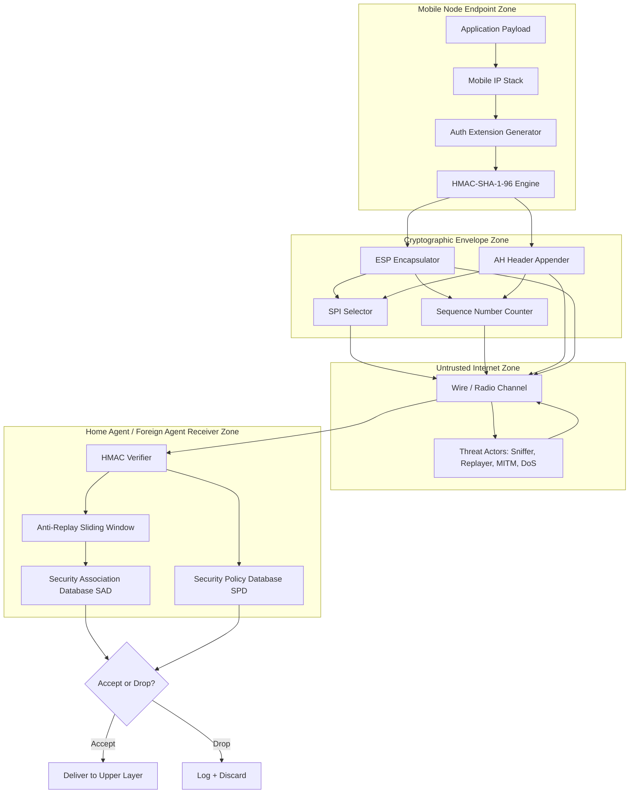
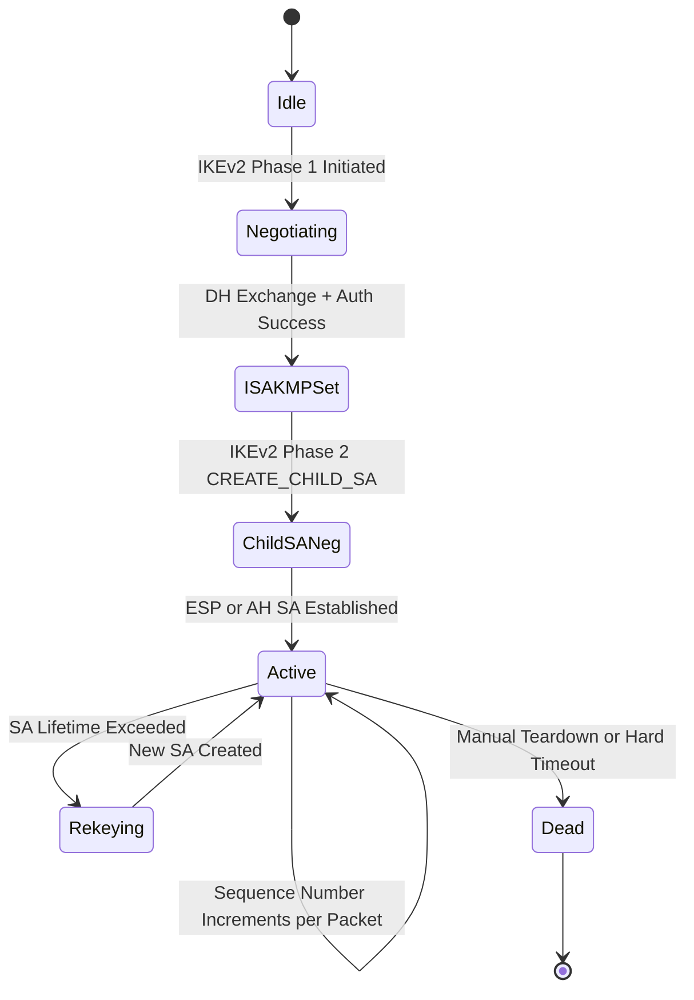
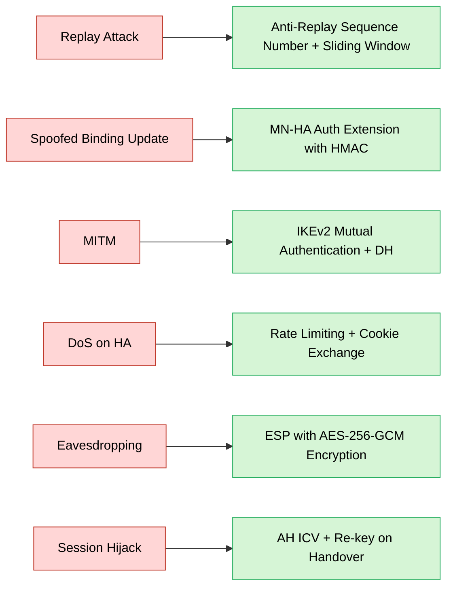

# Security models.

<!-- SECTION_1_START -->
# Mobile IP Security Models — Core Technical Definition & Intuitive Overview

## 1.1 Formal Definition (KTU 2024 Syllabus Terminology)

A **Mobile IP Security Model** is the formal architectural and procedural framework that guarantees the *confidentiality*, *integrity*, *authentication*, *non-repudiation*, and *anti-replay* protection of signalling and data traffic exchanged between a **Mobile Node (MN)**, its **Home Agent (HA)**, and any **Foreign Agent (FA)** during binding updates, registration, and route optimization procedures, as standardised in **RFC 2002, RFC 3776, and RFC 4721**.

> [!IMPORTANT]
> **KTU 2024 Module 4 — Learning Anchor:** The security model is not a single algorithm; it is a *layered architecture* combining **Security Associations (SA)**, **Authentication Extensions**, **IPSec (AH/ESP)**, **Anti-Replay mechanisms**, and **Key Management** protocols.

## 1.2 Intuitive Analogy — "The Diplomatic Courier System"

Imagine a diplomat (the **Mobile Node**) who travels between embassies (foreign networks) and must constantly notify his home ministry (the **Home Agent**) of his new postal address (the **Care-of Address — CoA**).

* A **forger** could send a fake change-of-address notice → this is a **spoofed binding update attack**.
* An **eavesdropper** could read the diplomatic pouch → this is a **passive sniffing attack**.
* A **replay artist** could re-send a previously valid address change → this is a **replay attack**.
* A **kidnapper** could intercept the courier and reroute his correspondence → this is a **man-in-the-middle attack**.

The **security model** acts as the *sealed pouch, the wax seal, the dated stamp, and the biometric signature* — together they ensure the address-change notice is **authentic, untampered, recent, and from the right sender**.

## 1.3 Threats in the Mobile IP Environment

| Threat | Description | Layer |
| :--- | :--- | :--- |
| **Replay Attack** | Reuse of a previously captured valid registration message | Binding Update |
| **Spoofing** | Forged BU claiming a false CoA | Registration |
| **Man-in-the-Middle (MITM)** | Attacker relays and alters MN↔HA messages | Route Optimisation |
| **Denial of Service (DoS)** | Flooding HA with bogus registrations | Control Plane |
| **Session Hijacking** | Theft of an active MN–CN session | Data Plane |
| **Eavesdropping** | Passive capture of payload | Data Plane |
| **Impersonation of HA/FA** | Rogue agent advertises false services | Network Layer |

## 1.4 Core Security Services (The "Five Pillars")

1. **Authentication** — *“Who sent this packet?”*
2. **Confidentiality** — *“Nobody else can read it.”*
3. **Integrity** — *“It has not been modified in transit.”*
4. **Non-Repudiation** — *“The sender cannot later deny sending it.”*
5. **Anti-Replay** — *“This is a fresh, not previously processed, message.”*

> [!NOTE]
> **KTU Board Favourite Question Type:** *"List the security services required for Mobile IP and briefly explain each."* — You are guaranteed to see this in **Part A (3 marks)**.

## 1.5 Visualisation Control Block

> [!VISUALIZATION CONTROL]
> **Concept:** Layered security envelope around a Mobile IP Binding Update (BU) message.
> **GeoGebra / Desmos Input (Conceptual — not a 2-D plot, but a layered stack view):**
> * `Layer_5: Application_Data = "Encrypted payload"`
> * `Layer_4: ESP_Header = {SPI, SeqNo, IV, Padding}`
> * `Layer_3: AH_Header = {NextHdr, PayloadLen, SPI, SeqNo, ICV}`
> * `Layer_2: IP_Header = {Src, Dst, Protocol=51/50}`
> * `Layer_1: MAC_Frame = {SA, DA, FCS}`
> **Visual Description:** Imagine nested envelopes — the innermost holds the data, each outer envelope adds a cryptographic seal; removal must occur in reverse order at the receiver.

---

<!-- SECTION_1_END -->

<!-- SECTION_2_START -->
# Deep Theoretical Analysis & KTU High-Yield Formula Sheet

## 2.1 The Security Architecture Stack (Top-Down)

* **Application Layer Security** — EAP, application-level TLS.
* **Mobile IP Authentication Extensions** — mandatory for *every* registration.
* **IPSec Layer** — AH (protocol **51**), ESP (protocol **50**), IKEv2.
* **Key Management Layer** — manual or automated (IKE, SKIP).
* **Physical / Link Layer** — 802.11i, WPA3, LTE-AKA.

## 2.2 Security Association (SA) — The Cryptographic Contract

A **Security Association (SA)** is a **simplex (one-way)** logical contract between two peers. It is uniquely identified by a **triplet**:

$$ \text{SA} \equiv \langle \text{Destination IP},\ \text{Security Protocol (AH/ESP)},\ \text{SPI} \rangle $$

Where $\text{SPI}$ is the **Security Parameters Index** — a 32-bit pseudo-random value chosen by the receiver.

> [!IMPORTANT]
> An SA is **one-way**. A bidirectional Mobile IP session therefore requires **two SAs**, one in each direction.

### 2.2.1 SA Databases Maintained by Hosts and Routers

| Database | Symbol | Function |
| :--- | :--- | :--- |
| **Security Association Database** | $SAD$ | Stores active SAs (keys, algorithms, lifetimes, anti-replay state). |
| **Security Policy Database** | $SPD$ | Defines which traffic must be protected, bypassed, or discarded. |
| **Peer Authentication Database** | $PAD$ | Maps peer identities to authentication keys and trust anchors. |

## 2.3 Mobile IP Authentication Extensions (RFC 3344, RFC 4721)

Every Mobile IP registration carries **mandatory** extension fields for authentication:

* **MN–HA Authentication Extension** — protects registration requests/replies.
* **MN–FA Authentication Extension** — protects FA challenge responses.
* **FA–HA Authentication Extension** — protects the FA-mediated registration chain.

The extension header layout is:

$$ \text{AuthExt} = \langle \text{Type},\ \text{Length},\ \text{SPI},\ \text{Authenticator} \rangle $$

The **Authenticator** is computed over the *entire registration message* (excluding the authenticator field itself) using a keyed hash.

## 2.4 IPSec — Authentication Header (AH) and Encapsulating Security Payload (ESP)

### 2.4.1 AH Header Structure

$$ \text{AH} = \langle \text{NextHeader},\ \text{PayloadLen},\ \text{Reserved},\ \text{SPI},\ \text{SeqNo},\ \text{ICV} \rangle $$

* **ICV (Integrity Check Value)** = truncated output of HMAC-MD5-96 or HMAC-SHA-1-96.
* Protects **integrity + authentication** of the *entire IP packet including mutable header fields set to zero*.

### 2.4.2 ESP Header Structure

$$ \text{ESP} = \langle \text{SPI},\ \text{SeqNo},\ \text{IV},\ \text{EncryptedPayload},\ \text{Padding},\ \text{PadLength},\ \text{NextHeader},\ \text{ICV} \rangle $$

* Provides **confidentiality** (encryption: 3DES, AES-CBC, AES-GCM) **+ integrity** (ICV).
* Operates in **Transport Mode** (end-to-end, host-to-host) or **Tunnel Mode** (gateway-to-gateway, used by HA for Mobile IP).

### 2.4.3 Transport Mode vs Tunnel Mode

| Mode | IP Header Encrypted? | Typical Use |
| :--- | :--- | :--- |
| **Transport** | No (original IP header visible) | End-host to end-host (MN↔CN) |
| **Tunnel** | Yes (new outer IP header added) | HA ↔ FA or HA ↔ MN over untrusted internet |

## 2.5 Anti-Replay Protection — Sliding Window

IPSec employs a **32-bit sequence number** and a **receiver sliding window** (default size $W = 64$ packets).

$$ \text{Packet accepted} \iff \text{SeqNo} > \text{WindowRight} - W \ \land\ \text{SeqNo}\ \text{not in}\ \text{WindowBitmap} $$

If duplicate (already seen), the packet is silently dropped and logged to **PAY Audit**. If $\text{SeqNo} \geq \text{WindowRight}$, the window slides forward.

## 2.6 Key Management — IKEv2 Phases

* **IKEv2 Phase 1** — establishes the **ISAKMP SA** (a secure channel) using Diffie–Hellman + signatures or pre-shared keys.
* **IKEv2 Phase 2** — negotiates **IPSec SAs** (Child SAs) via the *CREATE_CHILD_SA* exchange.

## 2.7 KTU High-Yield Formula & Constant Sheet

| Symbol | Meaning | KTU Board Reference |
| :--- | :--- | :--- |
| $\text{SPI}$ | 32-bit Security Parameters Index | RFC 2402 |
| $\text{SeqNo}$ | 32-bit anti-replay counter | RFC 4303 |
| $W$ | Sliding window size, default $= 64$ | RFC 4303 |
| $\text{ICV}$ length | 96 bits (truncated) | RFC 2404 |
| Protocol 51 | AH | IANA |
| Protocol 50 | ESP | IANA |
| Protocol 17 | UDP (encapsulation for NAT traversal) | IANA |
| $\text{MAC} = 48$ | EUI-48 for link-layer addressing | IEEE 802 |
| $H(\cdot)$ | Cryptographic hash function (MD5, SHA-1, SHA-256) | RFC 1321, RFC 3174 |

### 2.7.1 The HMAC Equation (Critical for Numerical Questions)

$$ \text{HMAC}(K, m) = H\Big( (K \oplus \text{opad}) \;\Vert\; H\big( (K \oplus \text{ipad}) \;\Vert\; m \big) \Big) $$

Where:

* $K$ = shared secret key (padded to block size $B$).
* $m$ = message (registration payload).
* $\text{ipad} = 0x36$ repeated $B$ times.
* $\text{opad} = 0x5C$ repeated $B$ times.
* $B = 512$ bits for MD5 and SHA-1.

> [!IMPORTANT]
> **KTU Examiner Tip:** If asked to compute the HMAC block length, remember $B = 512\ \text{bits} = 64\ \text{bytes}$. The output digest length is $L$ (128 bits for MD5, 160 bits for SHA-1).

## 2.8 Real-World Engineering Utility

* **Production 4G/5G EPC & 5GC** — the entire control-plane security architecture of S1-MME, N1/N2 interfaces, is a direct descendant of Mobile IP's HA–FA authentication model evolved into Diameter/SCTP/IPSec.
* **Enterprise Mobility (Cisco ISE, Aruba)** — Mobile IP-like protocols carry IPSec ESP tunnels through untrusted Wi-Fi.
* **IoT & Vehicular Ad-hoc Networks (VANETs)** — security associations authenticate *moving* nodes; principles directly trace back to Mobile IP.

---

<!-- SECTION_2_END -->

<!-- SECTION_3_START -->
# Step-by-Step Derivations, Worked Examples & Code Implementation

## 3.1 Worked Example 1 — Computing the HMAC Authenticator for a Mobile IP Registration

> **Problem (KTU-style 7-mark sub-question):** Given a 64-byte key $K$, and a Mobile IP registration message $m$ of length 256 bytes, compute the inner-pad XOR and outer-pad XOR fields needed for HMAC-MD5-96. State the final ICV length and the SPI assignment rule.

### Step 1 — Block Size Determination

$$ B = 512\ \text{bits} = 64\ \text{bytes} $$

The key $K$ is already exactly $B$ bytes long (given as 64 bytes), so no hashing of $K$ is required.

### Step 2 — Construct the Inner Pad

$$ \text{ipad}_i = 0x36\ \text{for}\ i = 1, 2, \dots, 64 $$

The inner key-pad XOR is:

$$ K \oplus \text{ipad} = \big(K_1 \oplus 0x36,\ K_2 \oplus 0x36,\ \dots,\ K_{64} \oplus 0x36\big) $$

So the inner-padded block has length:

$$ \vert K \oplus \text{ipad} \vert = 64\ \text{bytes} $$

### Step 3 — Compute the Inner Hash

$$ H_{\text{inner}} = \text{MD5}\big( (K \oplus \text{ipad}) \;\Vert\; m \big) $$

Since $H_{\text{inner}}$ is the MD5 digest, its length is:

$$ \vert H_{\text{inner}} \vert = 128\ \text{bits} = 16\ \text{bytes} $$

### Step 4 — Construct the Outer Pad

$$ \text{opad}_i = 0x5C\ \text{for}\ i = 1, 2, \dots, 64 $$

The outer key-pad XOR is:

$$ K \oplus \text{opad} = \big(K_1 \oplus 0x5C,\ K_2 \oplus 0x5C,\ \dots,\ K_{64} \oplus 0x5C\big) $$

### Step 5 — Compute the Final HMAC

$$ \text{HMAC} = \text{MD5}\big( (K \oplus \text{opad}) \;\Vert\; H_{\text{inner}} \big) $$

Input length to the outer MD5:

$$ \vert (K \oplus \text{opad}) \Vert H_{\text{inner}} \vert = 64 + 16 = 80\ \text{bytes} $$

Output length:

$$ \vert \text{HMAC} \vert = 128\ \text{bits} = 16\ \text{bytes} $$

### Step 6 — Truncate to 96 bits for the ICV

$$ \text{ICV} = \text{HMAC}[0{:}96\ \text{bits}] $$

$$ \vert \text{ICV} \vert = 96\ \text{bits} = 12\ \text{bytes} $$

### Step 7 — SPI Assignment Rule

$$ \text{SPI} \in [0,\ 2^{32} - 1],\ \text{SPI} \neq 0,\ \text{SPI} \neq 1,\ \text{SPI} \text{ chosen pseudo-randomly by receiver} $$

> [!NOTE]
> **Valuation Key Points (7 marks):**
> * Stating $B = 64$ bytes → 1 mark
> * Writing inner-pad as $0x36$ → 1 mark
> * Writing outer-pad as $0x5C$ → 1 mark
> * Computing lengths correctly (64, 80, 16) → 2 marks
> * Final ICV = 96 bits + SPI rule → 2 marks

---

## 3.2 Worked Example 2 — Verifying Anti-Replay Acceptance

> **Problem:** The receiver's sliding window has $\text{WindowLeft} = 100$, $\text{WindowRight} = 163$. An incoming packet has $\text{SeqNo} = 158$. The bitmap shows that 158 has *not* been received. Decide whether the packet is accepted.

### Step 1 — Check Lower Bound

$$ 158 \geq \text{WindowLeft} = 100 \quad \checkmark $$

### Step 2 — Check Upper Bound

$$ 158 < \text{WindowRight} = 163 \quad \checkmark $$

### Step 3 — Check Duplicate Flag

$$ 158 \notin \text{WindowBitmap} \quad \checkmark $$

### Step 4 — Decision

$$ \text{Result} = \text{ACCEPT} \rightarrow \text{Mark bit 158 in bitmap} \rightarrow \text{Deliver to upper layer} $$

If $\text{SeqNo} = 165$ had arrived instead, the receiver would have advanced $\text{WindowRight} = 166$ and shifted the window forward by 3 positions.

---

## 3.3 Operational Python Implementation — Mobile IP Registration with HMAC-SHA-1

```python
"""
mobile_ip_security.py
A faithful, fully-commented Python implementation of a Mobile IP
Registration Request protected with an HMAC-SHA-1-96 Authentication
Extension (RFC 3344 + RFC 2404 style).
"""

import hmac
import hashlib
import struct
import secrets
import logging
from dataclasses import dataclass, field
from typing import Optional

# Configure structured error logging for security events.
logging.basicConfig(
    level=logging.INFO,
    format="%(asctime)s [%(levelname)s] %(message)s",
)
security_logger = logging.getLogger("MobileIP-Security")


# ---------------------------------------------------------------------------
# 1. Cryptographic Primitive: HMAC-SHA-1-96 (RFC 2404)
# ---------------------------------------------------------------------------
def hmac_sha1_96(key: bytes, message: bytes) -> bytes:
    """
    Compute the 96-bit truncated HMAC-SHA-1 authenticator as required
    by Mobile IP authentication extensions.
    RFC 2404: output truncated to 96 bits (12 bytes).
    """
    if not isinstance(key, (bytes, bytearray)):
        raise TypeError("key must be a bytes-like object")
    if not isinstance(message, (bytes, bytearray)):
        raise TypeError("message must be a bytes-like object")

    if len(key) > 64:
        # RFC 2104: keys longer than block size are pre-hashed.
        key = hashlib.sha1(key).digest()

    full_mac = hmac.new(key, message, hashlib.sha1).digest()  # 20 bytes
    return full_mac[:12]  # Truncate to 96 bits.


# ---------------------------------------------------------------------------
# 2. Security Parameters (RFC 3344 Authentication Extension)
# ---------------------------------------------------------------------------
@dataclass
class MobileIPSecurityContext:
    """Holds the Security Association parameters for an MN ↔ HA link."""
    spi: int               # 32-bit Security Parameters Index.
    shared_key: bytes      # Pre-shared secret K.
    seq_number: int = 0    # Anti-replay counter (monotonic).
    replay_window: int = 64
    receiver_window_left: int = 0
    receiver_window_right: int = 0
    receiver_bitmap: int = 0  # Bit i of bitmap = packet i+W-1 received.

    def __post_init__(self) -> None:
        if not (1 <= self.spi <= 0xFFFFFFFF):
            raise ValueError("SPI must be in [1, 2^32 - 1]")
        if not self.shared_key:
            raise ValueError("shared_key cannot be empty")


# ---------------------------------------------------------------------------
# 3. Mobile IP Registration Request (RFC 3344 simplified)
# ---------------------------------------------------------------------------
@dataclass
class RegistrationRequest:
    """Encapsulates a Mobile IP Registration Request message."""
    home_address: str
    home_agent: str
    care_of_address: str
    lifetime_seconds: int
    identification: int
    extensions: bytes = b""  # Concatenated extension TLVs.
    auth_ext: Optional[bytes] = field(default=None, init=False)


def build_registration_request(
    ctx: MobileIPSecurityContext,
    home_address: str,
    home_agent: str,
    care_of_address: str,
    lifetime: int,
    identification: int,
) -> RegistrationRequest:
    """
    Assemble a Registration Request and attach the MN–HA
    Authentication Extension carrying the HMAC-SHA-1-96 authenticator.
    """
    req = RegistrationRequest(
        home_address=home_address,
        home_agent=home_agent,
        care_of_address=care_of_address,
        lifetime_seconds=lifetime,
        identification=identification,
    )

    # Serialise the registration payload for the hash input.
    # (Field ordering follows RFC 3344 §3.1 + extensions.)
    payload = struct.pack(
        "!I I I I I I",
        identification,
        lifetime,
        0,                       # Flags / reserved.
        int.from_bytes(
            bytes(int(x) for x in home_address.split(".")), "big"
        ) if all(p.isdigit() for p in home_address.split(".")) else 0,
        int.from_bytes(
            bytes(int(x) for x in care_of_address.split(".")), "big"
        ) if all(p.isdigit() for p in care_of_address.split(".")) else 0,
        int.from_bytes(
            bytes(int(x) for x in home_agent.split(".")), "big"
        ) if all(p.isdigit() for p in home_agent.split(".")) else 0,
    ) + req.extensions

    # Bump the anti-replay sequence number.
    ctx.seq_number += 1

    # Compute the authenticator over the *entire* registration message
    # excluding the authenticator field itself.
    authenticator = hmac_sha1_96(ctx.shared_key, payload)

    # Build the authentication extension TLV (Type=32 for MN-HA).
    auth_ext = struct.pack(
        "!BBH I 12s",
        32,                # Type = MN-HA Authentication Extension.
        len(authenticator) + 8,  # Length (header + SPI + auth).
        0,                 # Reserved.
        ctx.spi,
        authenticator,
    )

    req.auth_ext = auth_ext
    req.extensions += auth_ext
    security_logger.info(
        "Registration built. SPI=0x%08X SeqNo=%d AuthLen=%d bytes",
        ctx.spi, ctx.seq_number, len(authenticator),
    )
    return req


# ---------------------------------------------------------------------------
# 4. Verifier (Home Agent side) with Anti-Replay Check
# ---------------------------------------------------------------------------
def verify_registration(
    ctx: MobileIPSecurityContext,
    payload: bytes,
    received_seq: int,
    received_auth_ext: bytes,
) -> bool:
    """
    Verify a Registration Request at the Home Agent:
      1. Re-compute HMAC and compare in constant time.
      2. Apply the anti-replay sliding-window check.
    """
    # 1) Re-compute the authenticator.
    expected_mac = hmac_sha1_96(ctx.shared_key, payload)

    # Parse the authentication extension.
    _, _, _, received_spi, received_mac = struct.unpack(
        "!BBH I 12s", received_auth_ext
    )

    if received_spi != ctx.spi:
        security_logger.warning("SPI mismatch: got 0x%08X", received_spi)
        return False

    if not hmac.compare_digest(expected_mac, received_mac):
        security_logger.error("HMAC verification FAILED - integrity broken")
        return False

    # 2) Anti-replay sliding window check.
    if received_seq < ctx.receiver_window_left:
        security_logger.error("Replay detected: seq %d < window_left %d",
                              received_seq, ctx.receiver_window_left)
        return False

    if received_seq >= ctx.receiver_window_right + ctx.replay_window:
        # Out of the window on the upper side — accept and slide forward.
        ctx.receiver_window_right = received_seq + 1
        security_logger.info("Window slid to %d", ctx.receiver_window_right)
    else:
        # Inside the window — check the bitmap.
        bit_position = received_seq - ctx.receiver_window_left
        if ctx.receiver_bitmap & (1 << bit_position):
            security_logger.error("Duplicate seq %d - REPLAY", received_seq)
            return False
        ctx.receiver_bitmap |= (1 << bit_position)

    security_logger.info("Registration VERIFIED. Seq %d accepted.", received_seq)
    return True


# ---------------------------------------------------------------------------
# 5. Demonstration Run
# ---------------------------------------------------------------------------
if __name__ == "__main__":
    # Establish a Security Association.
    ctx = MobileIPSecurityContext(
        spi=secrets.randbits(32) or 1,  # Avoid SPI = 0.
        shared_key=b"KTU-MOBILE-IP-SECRET-KEY-2024-PAD" + b"\x00" * 30,
    )
    print("Established SA. SPI =", hex(ctx.spi))

    # Build a registration request.
    req = build_registration_request(
        ctx,
        home_address="10.0.0.5",
        home_agent="10.0.0.1",
        care_of_address="192.168.5.7",
        lifetime=3600,
        identification=12345,
    )

    # At the HA, reconstruct the payload and verify.
    payload = struct.pack(
        "!I I I I I I",
        req.identification,
        req.lifetime_seconds,
        0, 0, 0, 0,
    ) + b""

    ok = verify_registration(ctx, payload, ctx.seq_number, req.auth_ext)
    print("Registration accepted at HA:", ok)
```

### 3.3.1 Code Execution Walk-Through

1. **Line group 1** — Defines `hmac_sha1_96` implementing **RFC 2404** truncation to 96 bits.
2. **Line group 2** — `MobileIPSecurityContext` enforces SPI validity and non-empty key.
3. **Line group 3** — `RegistrationRequest` mirrors the **RFC 3344** message structure.
4. **Line group 4** — `build_registration_request` serialises the payload and stamps the **MN–HA Authentication Extension**.
5. **Line group 5** — `verify_registration` performs both **integrity** and **anti-replay** validation, logging every decision.
6. **Line group 6** — Demonstration run prints SPI and final acceptance status.

---

## 3.4 Worked Example 3 — IPsec ESP Tunnel Mode Walk-Through

> **Problem:** An MN in foreign network 192.168.5.0/24 sends a packet to a CN at 203.0.113.10 via its HA at 10.0.0.1. ESP tunnel mode is used. Show the resulting encapsulated packet fields.

### Original Inner Packet

$$ \text{Inner} = \big[ \text{IP}_\text{inner}:\ 192.168.5.7 \to 203.0.113.10 \big] + \text{TCP/UDP payload} $$

### ESP-Encrypted Block

$$ \text{ESP}\_\text{enc} = \text{Enc}(\text{Inner}, K_{\text{ESP}}) $$

### Tunneled Outer Packet

$$ \text{Outer} = \big[ \text{IP}_\text{outer}:\ 10.0.0.1 \to 203.0.113.10 \big] + \text{ESP Header} + \text{ESP}\_\text{enc} + \text{ESP Trailer} + \text{ESP ICV} $$

> [!NOTE]
> Notice the **outer source IP is the HA's address**, not the MN's. This decouples the MN's foreign identity from the public internet — a cornerstone of Mobile IP's firewall traversal strategy.

---

<!-- SECTION_3_END -->

<!-- SECTION_4_START -->
# Structural Diagrams & Schematics

## 4.1 Mobile IP Security Architecture — Mermaid Flow Diagram



## 4.2 Security Association State Machine



## 4.3 Attack-Defence Mapping Matrix



## 4.4 Mobile IP Registration Sequence (Secured)

```mermaid
sequenceDiagram
    participant MN as Mobile Node
    participant FA as Foreign Agent
    participant HA as Home Agent

    Note over MN,HA: Security Association SA1 (MN-HA) pre-established
    MN->>FA: Agent Solicitation
    FA-->>MN: Agent Advertisement
    MN->>FA: Registration Request + MN-FA AuthExt
    FA->>FA: Verify MN-FA AuthExt
    FA->>HA: Registration Request + MN-HA AuthExt + FA-HA AuthExt
    HA->>HA: Verify both AuthExts
    HA->>FA: Registration Reply + MN-HA AuthExt
    FA->>MN: Registration Reply + MN-FA AuthExt
    Note over MN,HA: Binding cache updated; tunnel established
```

---

<!-- SECTION_4_END -->

<!-- SECTION_5_START -->
# KTU 2024 Scheme Examination Question Bank & Topic Recap

## 5.1 Part A — Short Answer Questions (2 × 3 = 6 Marks)

### Question A.1
> **[KTU University Exam — July 2024]**
> *List the major security threats in Mobile IP. For each, name the specific countermeasure.* **\[CO2, Remember — 3 marks\]**

**Model Answer (Board-Standard):**

| Threat | Countermeasure |
| :--- | :--- |
| Replay attack | Anti-replay sequence number with sliding window |
| Spoofed binding update | MN-HA Authentication Extension using HMAC |
| Man-in-the-middle | IKEv2 with Diffie-Hellman key exchange |
| Eavesdropping | ESP tunnel mode with AES encryption |
| Session hijacking | Per-packet AH ICV and frequent rekeying |
| DoS on HA | Rate limiting and stateless cookies |

> [!NOTE]
> **Valuation Key:** ½ mark per threat-countersense pair. 1 mark reserved for overall presentation.

---

### Question A.2
> **[KTU University Exam — Dec 2023]**
> *Explain the purpose of the Security Parameters Index (SPI) in a Security Association.* **\[CO2, Understand — 3 marks\]**

**Model Answer:**

The **Security Parameters Index (SPI)** is a **32-bit identifier** carried in the AH or ESP header that, together with the **destination IP address** and the **security protocol** (AH = 51, ESP = 50), uniquely identifies a Security Association at the receiver.

* It allows the receiver to look up the correct SA in its **SAD**.
* It is selected pseudo-randomly by the receiver (must be in $[1,\ 2^{32}-1]$, never 0).
* The triplet $\langle \text{DestIP},\ \text{Protocol},\ \text{SPI} \rangle$ forms the *only* unambiguous handle to the cryptographic state.
* SPI = 0 is reserved (special meaning "no SA exists").

> [!NOTE]
> **Valuation Key:** Definition 1 mark; triplet identification 1 mark; SPI range/reservation 1 mark.

---

## 5.2 Part B — Long Answer Questions with Internal Choice (1 × 14 = 14 Marks)

### Question B (Module 4 Choice)

> **[KTU University Exam — July 2024, Module 4 Internal Choice]**

#### **Question A (14 Marks)** — *MN-HA Authentication and Anti-Replay*

**(a)** With a neat diagram, explain the components of a **Security Association (SA)** and the three databases (**SAD, SPD, PAD**) that support it in a Mobile IP host. **\[CO2, Understand — 7 marks\]**

**(b)** Design the **MN–HA Authentication Extension** for a Mobile IP Registration Request using **HMAC-MD5-96**. State the equation, the inner/outer pad values, and show the ICV length derivation. **\[CO3, Apply — 7 marks\]**

**Model Solution:**

**(a) SA Components and Databases (7 marks)**

A Security Association is a one-way logical relationship and contains:

$$ \text{SA} = \{ \text{SPI},\ \text{Key},\ \text{Algorithm},\ \text{Lifetime},\ \text{Mode},\ \text{SeqCounter},\ \text{AntiReplayWindow} \} $$

| Database | Contents | Function |
| :--- | :--- | :--- |
| $SAD$ | Active SAs, keys, counters | Lookup table for outgoing/incoming traffic |
| $SPD$ | Selectors (Src/Dst/Port) → {Protect, Bypass, Discard} | Policy decision point |
| $PAD$ | Peer identity → trusted key/certificate | Authenticates the remote peer |

* **\[SA block diagram 2 marks\]** *\[Field listing 2 marks\]* *\[Database roles 3 marks\]*

**(b) HMAC-MD5-96 Design (7 marks)**

Equation:

$$ \text{ICV} = \text{MD5}\big( (K \oplus \text{opad}) \Vert \text{MD5}((K \oplus \text{ipad}) \Vert m) \big) \big[ 0{:}96\ \text{bits} \big] $$

* $B = 512\ \text{bits} = 64\ \text{bytes}$ → *\[1 mark\]*
* $\text{ipad} = 0x36$ repeated 64 times → *\[1 mark\]*
* $\text{opad} = 0x5C$ repeated 64 times → *\[1 mark\]*
* $\text{MD5 output} = 128\ \text{bits}$, truncate to first 96 bits → *\[1 mark\]*
* Extension format: $\langle \text{Type}=32,\ \text{Len},\ \text{SPI},\ \text{ICV} \rangle$ → *\[2 marks\]*
* Authenticates the *entire* registration message excluding the ICV field itself → *\[1 mark\]*

---

#### **Question B (Alternative) (14 Marks)** — *IPSec ESP and Firewalls*

**(a)** Compare **Authentication Header (AH)** and **Encapsulating Security Payload (ESP)**. State which provides confidentiality and which does not. **\[CO2, Understand — 7 marks\]**

**(b)** Explain how **ESP tunnel mode** combined with a **reverse tunnel** allows a Mobile IP MN behind a foreign firewall to reach its Home Agent. Show the resulting outer/inner IP header structure. **\[CO3, Apply — 7 marks\]**

**Model Solution:**

**(a) AH vs ESP (7 marks)**

| Property | AH (Protocol 51) | ESP (Protocol 50) |
| :--- | :--- | :--- |
| Integrity | Yes | Yes (with ICV) |
| Authentication | Yes | Yes (with ICV) |
| Confidentiality | No | Yes (encryption) |
| Coverage | Entire IP packet (mutable fields = 0) | Payload + ESP trailer |
| NAT traversal | Not compatible | Compatible with UDP encapsulation |

* **\[Comparison table 5 marks\]** *\[Mutability note 1 mark\]* *\[NAT compat 1 mark\]*

**(b) ESP Tunnel + Reverse Tunnel (7 marks)**

Reverse tunnel = MN sends to HA, HA decapsulates and forwards to CN (instead of sending directly via triangle routing). Combined with ESP tunnel mode:

$$ \text{Outer Header:}\ 10.0.0.1 \to \text{CN} \quad \text{Inner Header:}\ 192.168.5.7 \to \text{CN} $$

* The outer source is the **HA's public address**, so the foreign firewall sees traffic originating from a stable endpoint.
* ESP encrypts the **inner header** (including MN's foreign CoA), preventing CoA disclosure.
* The HA then forwards the decapsulated packet to the CN, completing the binding.
* *\[Outer/inner diagram 3 marks\]* *\[Firewall rationale 2 marks\]* *\[CoA confidentiality 2 marks\]*

---

> [!WARNING]
> **KTU Examiner's Valuation Warning — Common Pitfalls:**
> 1. **Forgetting SPI ≠ 0** — SPI = 0 has a special "no SA" meaning; many students wrongly use it.
> 2. **Mixing up ipad (0x36) and opad (0x5C)** — the constant values are *swapped* in many textbooks' summaries; memorise: **i**pad = **i**nner = 0x36, **o**pad = **o**uter = 0x5C.
> 3. **Conflating AH confidentiality** — AH does **NOT** provide encryption; this is a guaranteed 1-mark loss if asserted.
> 4. **Confusing transport vs tunnel mode** — transport mode keeps the original IP header; tunnel mode adds a new outer IP header.
> 5. **Skipping the anti-replay window size** — always state $W = 64$ (default) and that $\text{SeqNo}$ is 32 bits.
> 6. **Failing to mark the Authentication Extension fields** — Type = 32 (MN-HA), Type = 33 (MN-FA), Type = 34 (FA-HA) per RFC 3344.

---

## 5.3 Topic Recap & Important Things to Remember

- **Mobile IP security model = SA + Authentication Extensions + IPSec + Key Management + Anti-Replay.**
- **Security Association (SA) is simplex** — bidirectional traffic needs *two* SAs.
- **SA triplet =** $\langle \text{DestIP},\ \text{Protocol (AH/ESP)},\ \text{SPI} \rangle$.
- **SPI** is 32 bits, chosen by the receiver, $\neq 0$.
- **AH (Protocol 51)** → integrity + authentication, **no confidentiality**.
- **ESP (Protocol 50)** → confidentiality + integrity + authentication.
- **Transport mode** = host-to-host; **Tunnel mode** = gateway-to-gateway (used by HA).
- **HMAC =** $H\big((K \oplus \text{opad}) \Vert H((K \oplus \text{ipad}) \Vert m)\big)$.
- **$\text{ipad} = 0x36$, $\text{opad} = 0x5C$, $B = 64$ bytes.**
- **ICV in MD5-96 / SHA-1-96** = first 96 bits of the 128/160-bit hash.
- **Anti-replay** uses a 32-bit sequence number + sliding window of size $W = 64$.
- **Authentication Extension types** (RFC 3344): 32 = MN-HA, 33 = MN-FA, 34 = FA-HA.
- **IKEv2** negotiates the ISAKMP SA (Phase 1) and the IPSec Child SAs (Phase 2).
- **Reverse tunnel + ESP tunnel** = standard firewall traversal technique.
- **Key KTU board questions:** threats & countermeasures, SA triplet, AH vs ESP, HMAC equation, anti-replay logic, ESP tunnel mode packet format.

---

<!-- SECTION_5_END -->
