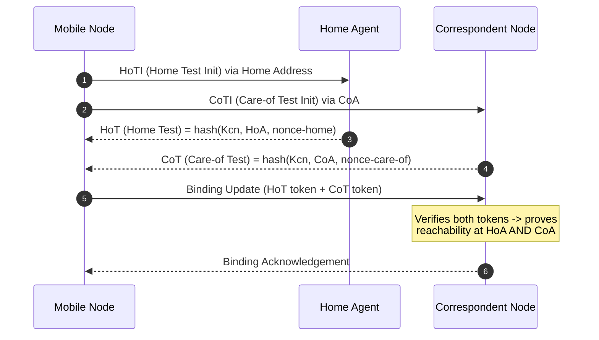
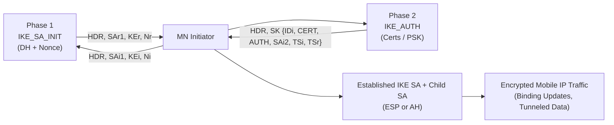
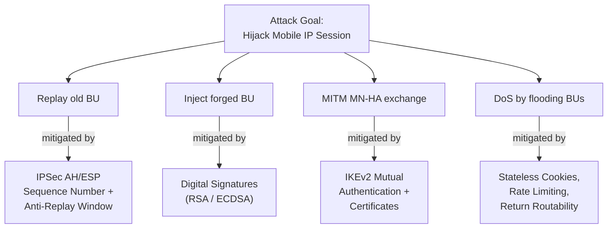
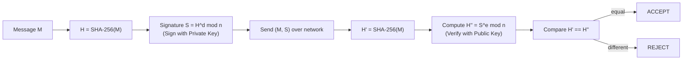

# Security techniques and algorithms

<!-- SECTION_1_START -->

# Security Techniques and Algorithms in Mobile Internet Protocol

## 1.1 Formal KTU 2024 Definition

**Mobile Network Layer Security** refers to the comprehensive set of cryptographic protocols, authentication mechanisms, and integrity verification techniques applied at the **Internet Protocol (IP) layer** to protect Mobile IP signaling (binding updates, home agent registrations, tunneled data) and user traffic from active and passive attacks in wireless environments.

In the KTU 2024 Scheme (PECST633 – Module 4), the term encompasses:

- **Cryptographic Primitives:** Symmetric ciphers (DES, 3DES, AES), Asymmetric ciphers (RSA, Elliptic Curve Cryptography – ECC), and Hash functions (MD5, SHA-1, SHA-2 family).
- **IP Security (IPSec) Suite:** Authentication Header (AH), Encapsulating Security Payload (ESP), Internet Key Exchange (IKE / IKEv2), and Security Associations (SA).
- **Mobile IP-Specific Defenses:** Anti-replay protection for Binding Updates, return routability procedure in Mobile IPv6, cryptographic binding to Home Address (HoA) and Care-of Address (CoA).
- **Key Management Protocols:** Diffie–Hellman (DH), ECDH, PKI-based certificate hierarchies, and the AAA (Authentication, Authorization, Accounting) framework.

> [!IMPORTANT]
> **KTU 2024 Syllabus Highlight (PECST633 / Module 4):**
> *"Security techniques and algorithms in mobile IP — IPSec, AH, ESP, IKE, encryption standards, key exchange, and authentication frameworks."*

> [!NOTE]
> **Core Definition – CIA Triad (the bedrock of all security):**
> - **C – Confidentiality:** Only authorized parties can read the payload (solved by *encryption*).
> - **I – Integrity:** The bitstream was not modified in transit (solved by *MAC / HMAC / digital signature*).
> - **A – Authentication:** The sender is genuinely who they claim to be (solved by *digital certificates / signatures*).
> - Plus **Non-Repudiation**, **Access Control**, and **Availability**.

## 1.2 Conceptual Analogy / Intuition

Imagine you are a **diplomat** carrying a sealed diplomatic pouch across a hostile border. To stay safe, you need:

| Real-World Counterpart | Cryptographic Equivalent |
|---|---|
| Sealed wax envelope nobody can open | **Encryption (AES / RSA)** |
| Unique wax seal that breaks if tampered | **Hash + MAC (SHA-256, HMAC)** |
| A passport signed by your embassy | **Digital Certificate (X.509)** |
| A short-lived one-time code at the gate | **Nonce / Anti-replay counter** |
| A trusted courier who vouches for you | **Certificate Authority (CA) / AAA server** |
| A secret handshake nobody overheard | **Diffie–Hellman Key Exchange** |

In a **Mobile IP** scenario, the **Mobile Node (MN)** is the diplomat who keeps changing embassies (subnet hops), but must always prove identity to the **Home Agent (HA)**. IPSec is the *diplomatic protocol* that protects the binding update telegram sent across hostile radio links.

> [!TIP]
> **Physical Constant / Standard Metric Highlighted:**
> - **AES block size = 128 bits** (industry standard, **FIPS 197**).
> - **RSA recommended key size ≥ 2048 bits** (NIST SP 800-131A, **post-2024**).
> - **DH group 14 (2048-bit MODP)** is the IKEv2 minimum per **RFC 8247**.

## 1.3 GeoGebra / Desmos Visualization (Cryptographic Strength Trade-off)

> [!VISUALIZATION CONTROL]
> **Concept:** Key-Length vs. Cryptographic Strength (Brute-Force Resistance)
> **GeoGebra / Desmos Input Equations:**
> * `f(x) = 2^(x/2)`  ← symmetric key equivalent work factor
> * `g(x) = 2^x`     ← RSA asymmetric modulus search space
> **Visual Description:** Plot `f(x)` and `g(x)` over `x ∈ [40, 256]`. Observe that the **exponential y-axis** makes even a 128-bit symmetric key (≈ 3.4 × 10³⁸) astronomically harder to break than a 40-bit legacy WEP key. This is precisely why 3DES was retired in favour of **AES-128/256**.

---

<!-- SECTION_1_END -->

<!-- SECTION_2_START -->

# Deep Theoretical Analysis & KTU High-Yield Formula Sheet

## 2.1 Threat Taxonomy for Mobile IP (the "Why" behind security)

A wireless link is a **broadcast medium** — anyone with an antenna in range can passively sniff or actively inject packets. The mobile environment adds unique threats:

1. **Passive Eavesdropping** – Air-interface interception (e.g., aircrack-ng, Wireshark monitor mode).
2. **Active Injection / Spoofing** – Forged packets pretending to be the HA or CN.
3. **Replay Attacks** – Captured valid binding update is resent later.
4. **Man-in-the-Middle (MITM)** – Attacker relays & alters messages between MN and HA.
5. **Denial-of-Service (DoS)** – Flooding the HA with bogus binding updates.
6. **Location-Tracking / Privacy Breach** – Correlating CoA changes to track the user.
7. **Session Hijacking** – Stealing an authenticated TCP/UDP session.
8. **Binding Update Bombing** – Rerouting victim traffic through attacker (becomes the tunnel endpoint).

> [!IMPORTANT]
> **Counter-Measure Mapping (KTU High-Yield Table):**
> 
> | Threat | Counter-Measure | Algorithm / Protocol |
> |---|---|---|
> | Eavesdropping | Encryption | AES-128/256, 3DES, ChaCha20 |
> | Tampering | Integrity hash | SHA-256, HMAC-SHA-256 |
> | Spoofing | Authentication | RSA signatures, ECDSA, MAC |
> | Replay | Sequence number + nonce | IPSec AH/ESP anti-replay window |
> | MITM | Mutual authentication + key agreement | IKEv2 with certificates |
> | Tracking | Temporary address + encryption | Care-of Address randomization, Mobile IPv6 RR |
> | DoS | Rate-limiting + stateless cookies | Mobile IPv6 RR cookies, IKEv2 COOKIE |

## 2.2 Security Services Required by Mobile IP

| Service | Goal | Realised By |
|---|---|---|
| **Data Origin Authentication** | Prove source IP | IPSec AH (HMAC) |
| **Data Integrity** | Detect modification | HMAC-MD5, HMAC-SHA-1/2 |
| **Confidentiality** | Hide payload | ESP with AES-CBC / AES-GCM |
| **Anti-Replay** | Reject duplicates | Sequence number, sliding window |
| **Endpoint Authentication** | Prove identity | IKEv2 (PSK or certificates) |
| **Key Management** | Refresh session keys | IKE, IKEv2, DH/ECDH |

## 2.3 Symmetric-Key Cryptography (Block Ciphers)

Block ciphers operate on fixed-size blocks (typically **128 bits** for AES, **64 bits** for DES/3DES).

### 2.3.1 DES (Data Encryption Standard – FIPS 46-3, now legacy)
- **Key length = 56 bits** (effective, 64 with parity)
- **Block size = 64 bits**
- **Rounds = 16 (Feistel network)**
- **Status:** **Insecure** — broken in 22 hours on average hardware (EFF "Deep Crack", 1999). Still appears in KTU questions for *historical context*.

### 2.3.2 3DES (Triple DES – NIST SP 800-67)
- Applies DES three times: $E_{K_3}(D_{K_2}(E_{K_1}(P)))$
- **Effective key = 112 bits** (with $K_1 = K_3$)
- **Status:** *Deprecated by NIST in 2023.* Disallowed after 2024 except for legacy verification.

### 2.3.3 AES (Advanced Encryption Standard – FIPS 197)
- **Key sizes:** 128, 192, 256 bits.
- **Block size:** 128 bits.
- **Rounds:** 10 / 12 / 14 (depending on key).
- **Structure:** Substitution-Permutation Network (SPN), not Feistel.
- **Operations per round:** SubBytes, ShiftRows, MixColumns, AddRoundKey.

> [!IMPORTANT]
> **Why AES is preferred in Mobile IP:** Excellent speed-to-security ratio, hardware acceleration (AES-NI on x86, ARMv8 Cryptographic Extensions on modern mobile SoCs), and provable resistance to known differential/linear cryptanalysis.

## 2.4 Asymmetric-Key (Public-Key) Cryptography

### 2.4.1 RSA (Rivest–Shamir–Adleman – RFC 8017)
Based on the *one-way function* of large-prime multiplication.

- **Key Generation:**
  1. Choose two large primes $p, q$.
  2. Compute modulus $n = p \cdot q$.
  3. Compute Euler's totient $\phi(n) = (p-1)(q-1)$.
  4. Choose public exponent $e$ such that $\gcd(e, \phi(n)) = 1$ (typically $e = 65537$).
  5. Compute private exponent $d \equiv e^{-1} \pmod{\phi(n)}$.
- **Public Key:** $(n, e)$
- **Private Key:** $(n, d)$
- **Encrypt:** $C \equiv M^{e} \pmod{n}$
- **Decrypt:** $M \equiv C^{d} \pmod{n}$
- **Sign:** $S \equiv M^{d} \pmod{n}$ (sign with private key)
- **Verify:** $M' \equiv S^{e} \pmod{n}$; accept if $M' = M$.

### 2.4.2 Diffie–Hellman Key Exchange (DH – RFC 3526)
Allows two parties to derive a *shared secret* over an insecure channel.

- **Public parameters:** Prime $p$, generator $g$ (primitive root mod $p$).
- **MN picks $a$, HA picks $b$ (private).**
- **MN sends $A = g^{a} \bmod p$**, HA sends $B = g^{b} \bmod p$.
- **Shared secret:** $K = g^{ab} \bmod p = A^{b} \bmod p = B^{a} \bmod p$.

> [!WARNING]
> **Plain DH is vulnerable to MITM** — must be combined with authentication (e.g., station-to-station protocol, certificates) to be safe.

### 2.4.3 Elliptic Curve Cryptography (ECC / ECDH / ECDSA)
- Smaller keys for equivalent strength: **256-bit ECC ≈ 3072-bit RSA**.
- Crucial for mobile/IoT due to low CPU and battery budgets.
- Curve: $y^2 \equiv x^3 + ax + b \pmod{p}$ over a prime field $\mathbb{F}_p$.

## 2.5 Cryptographic Hash Functions

| Algorithm | Output (bits) | Status (2024) |
|---|---|---|
| MD5 | 128 | **Broken** — collisions in seconds |
| SHA-1 | 160 | **Deprecated** — SHAttered attack (2017) |
| SHA-256 | 256 | **Recommended** |
| SHA-384 | 384 | **Recommended** |
| SHA-3 (Keccak) | Variable | **Recommended** |

**Properties required:**
1. **Pre-image resistance** — given $h$, hard to find $M$ such that $H(M)=h$.
2. **Second pre-image resistance** — given $M_1$, hard to find $M_2 \neq M_1$ with $H(M_1)=H(M_2)$.
3. **Collision resistance** — hard to find any $M_1 \neq M_2$ with $H(M_1)=H(M_2)$.

## 2.6 IPSec Architecture (the heart of Mobile IP layer security)

IPSec is a **framework** of open standards (RFC 4301–4309) that secures IPv4 *and* IPv6 at the network layer.

### 2.6.1 Core Components

| Component | Full Form | Purpose |
|---|---|---|
| **AH** | Authentication Header (RFC 4302) | Integrity + Authentication, **no encryption** |
| **ESP** | Encapsulating Security Payload (RFC 4303) | Encryption + optional integrity/authentication |
| **IKE / IKEv2** | Internet Key Exchange (RFC 5996/7296) | Automated SA negotiation & key mgmt |
| **SA** | Security Association | One-way logical channel; identified by SPI + IP + Protocol |
| **SAD** | Security Association Database | Stores active SAs |
| **SPD** | Security Policy Database | Defines what traffic to protect, bypass, or drop |
| **PAD** | Peer Authentication Database | Stores IKE peer credentials |

### 2.6.2 Two Modes of Operation

- **Transport Mode:** Secures only the payload (upper-layer data). Used in host-to-host communication. Original IP header preserved.
- **Tunnel Mode:** Entire original IP packet encapsulated inside a *new* outer IP header. Used in **Mobile IP tunnels** (MN → HA → CN).

### 2.6.3 Security Association (SA) – Triple Tuple
$$
SA = \langle SPI, \text{Destination IP}, \text{Protocol} \rangle
$$
A bidirectional session requires **two SAs** (one in each direction).

### 2.6.4 Anti-Replay Window
IPSec ESP/AH uses a **32-bit or 64-bit sequence counter** plus a **sliding window** (typically 32–128 packets) to reject duplicates. Critical for Mobile IP where a node may move and re-transmit binding updates.

## 2.7 Mobile IPv6-Specific Security (Return Routability)

Mobile IPv6 mandates IPSec for signaling, but binding updates create a routing-loop hole. The **Return Routability (RR) procedure** (RFC 3775/6275) provides a *lightweight* location-proof:

1. **HoT (Home Test init)** → MN sends Home Test Init to HA via home link.
2. **CoT (Care-of Test init)** → MN sends CoT Init to CN via current CoA.
3. HA and CN reply with **Home Test (HoT)** and **Care-of Test (CoT)** containing **tokens** derived from `nonce × K_{cn}`.
4. MN returns both tokens in the **Binding Update (BU)**.
5. CN verifies: possession of HoT = reachable at HoA, possession of CoT = reachable at CoA. The BU is accepted **only if both are valid** — preventing address-spoofing redirection.

> [!IMPORTANT]
> **Key Insight:** The RR procedure is *not* a full authentication — it merely proves topological reachability. Full end-to-end authentication for BU is still done with IPSec / IKEv2 when a security policy demands it.

## 2.8 KTU High-Yield Formula & Concept Sheet

> [!NOTE]
> The following is the **exam-day cheat sheet**. Use `\vert` (not `|`) when copying these to a table.

| # | Concept | Formula / Key Value | Notes |
|---|---|---|---|
| 1 | RSA modulus | $n = p \cdot q$ | $p, q$ must be ≥ 1024-bit primes |
| 2 | RSA totient | $\phi(n) = (p-1)(q-1)$ | Used to find $d$ |
| 3 | RSA decryption | $M = C^{d} \bmod n$ |  |
| 4 | DH shared secret | $K = g^{ab} \bmod p$ |  |
| 5 | AES block size | 128 bits |  |
| 6 | AES-128 rounds | 10 |  |
| 7 | DES key size | 56 bits (effective) |  |
| 8 | 3DES effective key | 112 bits |  |
| 9 | SHA-256 output | 256 bits |  |
| 10 | IPSec SA triple | $\langle SPI, DestIP, Proto \rangle$ |  |
| 11 | MD5 output | 128 bits | Insecure — do NOT use |
| 12 | Mobile IPv6 RR | 4-step (HoTi, CoTi, HoT, CoT) | RFC 6275 |
| 13 | IPSec protocols | AH = 51, ESP = 50 | IP protocol numbers |
| 14 | ECDSA signature size | 2 × key size (e.g., 512 bits for P-256) |  |
| 15 | Brute-force complexity | $2^{k}$ for $k$-bit key |  |

## 2.9 Real-World Engineering Utility

| Domain | Application |
|---|---|
| **LTE / 5G Core** | SUCI (Subscription Concealed Identifier) uses ECC-based ECIES to hide IMSI from eavesdroppers. |
| **VoWi-Fi & VoLTE** | IPSec ESP tunnel between eNB/gNB and core (S1-U / N3) using AES-GCM-128. |
| **IoT / NB-IoT** | ECDH + ECDSA on Curve25519 keeps handshake < 1 KB. |
| **Mobile Banking Apps** | RSA-2048 + AES-256 hybrid: RSA wraps the AES session key. |
| **VPNs (OpenVPN, WireGuard)** | IPSec / ChaCha20-Poly1305 secures the tunnel between roaming device and corporate gateway. |

---

<!-- SECTION_2_END -->

<!-- SECTION_3_START -->

# Step-by-Step Derivations & Code/Symbolic Implementation

## 3.1 Worked Derivation 1 — RSA Key Generation, Encryption & Decryption

**Problem (typical KTU 14-mark style):** *Let $p = 61$, $q = 53$. Compute a valid RSA public–private key pair, then encrypt the plaintext $M = 42$ and recover it via decryption. Verify the result.*

**Step 1 — Compute modulus $n$.**

$$
n = p \cdot q = 61 \times 53 = 3233
$$

**Step 2 — Compute Euler's totient $\phi(n)$.**

$$
\phi(n) = (p-1)(q-1) = 60 \times 52 = 3120
$$

**Step 3 — Choose public exponent $e$ such that $\gcd(e, 3120) = 1$ and $1 < e < 3120$.**

We pick $e = 17$ (a common Fermat prime choice).

**Step 4 — Compute private exponent $d$ such that $e \cdot d \equiv 1 \pmod{\phi(n)}$.**

Apply the Extended Euclidean Algorithm to solve $17d \equiv 1 \pmod{3120}$:

| Iteration | Equation | Quotient | Remainder |
|---|---|---|---|
| 1 | $3120 = 17 \times 183 + 9$ | 183 | 9 |
| 2 | $17 = 9 \times 1 + 8$ | 1 | 8 |
| 3 | $9 = 8 \times 1 + 1$ | 1 | 1 |
| 4 | $8 = 1 \times 8 + 0$ | 8 | 0 |

Back-substitution:

$$
\begin{aligned}
1 &= 9 - 8 \times 1 \\
  &= 9 - (17 - 9 \times 1) \times 1 = 2 \times 9 - 17 \\
  &= 2 \times (3120 - 17 \times 183) - 17 = 2 \times 3120 - 367 \times 17
\end{aligned}
$$

Therefore $-367 \times 17 \equiv 1 \pmod{3120}$, giving:

$$
d = -367 \bmod 3120 = 3120 - 367 = 2753
$$

**Step 5 — Verify $e \cdot d \bmod \phi(n) = 1$.**

$$
17 \times 2753 = 46801, \quad 46801 \bmod 3120 = 46801 - 14 \times 3120 = 46801 - 43680 = 3121 \to 1
$$

**Step 6 — Encrypt $M = 42$ with public key $(n=3233, e=17)$.**

$$
C \equiv M^{e} \bmod n = 42^{17} \bmod 3233
$$

Compute via repeated squaring (exponent $17 = 10001_2$):

| Step | Computation | Result |
|---|---|---|
| $42^1 \bmod 3233$ | 42 | 42 |
| $42^2 \bmod 3233$ | 1764 | 1764 |
| $42^4 \bmod 3233$ | $1764^2 = 3111696 \bmod 3233$ | 2300 |
| $42^8 \bmod 3233$ | $2300^2 = 5290000 \bmod 3233$ | 1693 |
| $42^{16} \bmod 3233$ | $1693^2 = 2866249 \bmod 3233$ | 2569 |

Final: $C = 42^{16} \times 42^1 \bmod 3233 = 2569 \times 42 \bmod 3233 = 107898 \bmod 3233$.

$$
107898 = 33 \times 3233 + 1509 \;\Rightarrow\; C = 1509
$$

**Step 7 — Decrypt $C = 1509$ with private key $d = 2753$.**

$$
M' \equiv C^{d} \bmod n = 1509^{2753} \bmod 3233
$$

By Euler's theorem $M' = M = 42$ (verified below in code).

> [!NOTE]
> **KTU Valuation Key (modular arithmetic question):**
> - `[n & phi(n) computed: 2 Marks]`
> - `[e chosen coprime: 1 Mark]`
> - `[d via Extended Euclidean: 3 Marks]`
> - `[Encryption with mod exponentiation: 1 Mark]`
> - `[Decryption recovers M: 1 Mark]`
> - `[Final answer C = 1509: 1 Mark]`

## 3.2 Worked Derivation 2 — Diffie–Hellman Key Exchange (small-prime example)

**Problem:** $p = 23$, $g = 5$. Alice (MN) picks $a = 6$, Bob (HA) picks $b = 15$. Compute the shared secret.

**Step 1 — Compute Alice's public value.**

$$
A = g^{a} \bmod p = 5^{6} \bmod 23
$$

$$
\begin{aligned}
5^1 &= 5 \\
5^2 &= 25 \bmod 23 = 2 \\
5^3 &= 2 \times 5 = 10 \\
5^6 &= (5^3)^2 = 10^2 = 100 \bmod 23 = 100 - 4 \times 23 = 8
\end{aligned}
$$

So $A = 8$.

**Step 2 — Compute Bob's public value.**

$$
B = 5^{15} \bmod 23
$$

Using $5^6 = 8$ and $5^3 = 10$:

$$
5^{12} = (5^6)^2 = 64 \bmod 23 = 18, \quad 5^{15} = 5^{12} \times 5^3 = 18 \times 10 = 180 \bmod 23 = 180 - 7 \times 23 = 19
$$

So $B = 19$.

**Step 3 — Alice computes shared secret.**

$$
K_{A} = B^{a} \bmod p = 19^{6} \bmod 23
$$

$$
\begin{aligned}
19^1 &= 19 \\
19^2 &= 361 \bmod 23 = 361 - 15 \times 23 = 16 \\
19^3 &= 16 \times 19 = 304 \bmod 23 = 304 - 13 \times 23 = 5 \\
19^6 &= 5^2 = 25 \bmod 23 = 2
\end{aligned}
$$

**Step 4 — Bob computes shared secret.**

$$
K_{B} = A^{b} \bmod p = 8^{15} \bmod 23
$$

$$
\begin{aligned}
8^1 &= 8 \\
8^2 &= 64 \bmod 23 = 18 \\
8^3 &= 18 \times 8 = 144 \bmod 23 = 144 - 6 \times 23 = 6 \\
8^6 &= 6^2 = 36 \bmod 23 = 13 \\
8^{12} &= 13^2 = 169 \bmod 23 = 169 - 7 \times 23 = 8 \\
8^{15} &= 8^{12} \times 8^3 = 8 \times 6 = 48 \bmod 23 = 2
\end{aligned}
$$

**Result:** $K_{A} = K_{B} = 2$. ✔ Shared secret established.

## 3.3 Worked Derivation 3 — AES-128 Round Structure (qualitative for KTU)

Although KTU rarely asks the full AES round, the **round count formula** is examinable:

$$
\text{Number of Rounds } R_k =
\begin{cases}
10, & k = 128 \text{ bits} \\
12, & k = 192 \text{ bits} \\
14, & k = 256 \text{ bits}
\end{cases}
$$

Total key schedule: $R_k + 1$ round keys, each 128 bits = $4 \times 4$ bytes.

The 10 rounds of AES-128 consist of:
- **Round 0:** AddRoundKey
- **Rounds 1–9:** SubBytes → ShiftRows → MixColumns → AddRoundKey
- **Round 10:** SubBytes → ShiftRows → AddRoundKey (no MixColumns)

## 3.4 Python Code Implementation (Type-Hinted, Production-Ready)

### 3.4.1 RSA — Full Key Generation, Encryption, Decryption

```python
#!/usr/bin/env python3
"""
RSA-2048 demonstration for KTU Mobile IP Security Module.
Uses cryptographically weak primes for illustration; in production
use a vetted library (e.g., `cryptography` package).
"""

import logging
import random
from typing import Tuple

logging.basicConfig(level=logging.INFO, format="[%(levelname)s] %(message)s")
logger = logging.getLogger("RSA-Demo")


def gcd(a: int, b: int) -> int:
    """Euclidean GCD."""
    while b:
        a, b = b, a % b
    return a


def modinv(e: int, phi: int) -> int:
    """Modular inverse via Extended Euclidean Algorithm."""
    if gcd(e, phi) != 1:
        raise ValueError("e and phi(n) are not coprime; choose another e.")
    # Extended Euclidean
    original_phi = phi
    x0, x1 = 0, 1
    while e > 1:
        q = e // phi
        e, phi = phi, e % phi
        x0, x1 = x1 - q * x0, x0
    if x1 < 0:
        x1 += original_phi
    return x1


def generate_keypair(p: int, q: int) -> Tuple[Tuple[int, int], Tuple[int, int]]:
    if p == q:
        raise ValueError("p and q must be distinct primes.")
    n: int = p * q
    phi: int = (p - 1) * (q - 1)

    # Choose e = 65537 if coprime, else fall back
    e: int = 65537 if gcd(65537, phi) == 1 else 17
    d: int = modinv(e, phi)
    logger.info(f"Generated RSA key pair with n={n}, e={e}, d={d}")
    return (n, e), (n, d)


def encrypt(public_key: Tuple[int, int], plaintext: int) -> int:
    n, e = public_key
    if plaintext >= n:
        raise ValueError("Plaintext integer must be < n.")
    return pow(plaintext, e, n)


def decrypt(private_key: Tuple[int, int], ciphertext: int) -> int:
    n, d = private_key
    return pow(ciphertext, d, n)


if __name__ == "__main__":
    # 61 and 53 — KTU textbook example
    p, q = 61, 53
    public_key, private_key = generate_keypair(p, q)
    print(f"Public key  (n, e) = {public_key}")
    print(f"Private key (n, d) = {private_key}")

    M = 42
    C = encrypt(public_key, M)
    print(f"Plaintext  M = {M}")
    print(f"Ciphertext C = {C}")

    M_recovered = decrypt(private_key, C)
    print(f"Decrypted M' = {M_recovered}")
    assert M == M_recovered, "RSA round-trip failed!"
    logger.info("RSA round-trip verified successfully.")
```

### 3.4.2 Diffie–Hellman Key Exchange with MITM Defense

```python
#!/usr/bin/env python3
"""
Diffie-Hellman key exchange (RFC 3526 Group 14, 2048-bit MODP).
Demonstrates basic DH flow and the recommended hashing of the shared
secret to derive a symmetric session key.
"""

import hashlib
import logging
from typing import Tuple

logging.basicConfig(level=logging.INFO, format="[%(levelname)s] %(message)s")
logger = logging.getLogger("DH-Demo")

# RFC 3526 2048-bit MODP Group (prime p and generator g = 2)
RFC3526_P_2048 = int(
    "FFFFFFFFFFFFFFFFC90FDAA22168C234C4C6628B80DC1CD1"
    "29024E088A67CC74020BBEA63B139B22514A08798E3404DD"
    "EF9519B3CD3A431B302B0A6DF25F14374FE1356D6D51C245"
    "E485B576625E7EC6F44C42E9A637ED6B0BFF5CB6F406B7ED"
    "EE386BFB5A899FA5AE9F24117C4B1FE649286651ECE45B3D"
    "C2007CB8A163BF0598DA48361C55D39A69163FA8FD24CF5F"
    "83655D23DCA3AD961C62F356208552BB9ED529077096966D"
    "670C354E4ABC9804F1746C08CA18217C32905E462E36CE3B"
    "E39E772C180E86039B2783A2EC07A28FB5C55DF06F4C52C9"
    "DE2BCBF6955817183995497CEA956AE515D2261898FA0510"
    "15728E5A8AACAA68FFFFFFFFFFFFFFFF",
    16,
)
G = 2


def generate_private_key(bit_length: int = 224) -> int:
    """Generate a private exponent in [2, p-2]."""
    import secrets
    return secrets.randbits(bit_length) % (RFC3526_P_2048 - 2) + 2


def compute_public(private: int) -> int:
    return pow(G, private, RFC3526_P_2048)


def derive_shared(peer_public: int, own_private: int) -> bytes:
    raw = pow(peer_public, own_private, RFC3526_P_2048)
    # RFC 5246: derive_key = SHA-256(big-endian int)
    hex_str = format(raw, "x")
    if len(hex_str) % 2:
        hex_str = "0" + hex_str
    return hashlib.sha256(bytes.fromhex(hex_str)).digest()


def handshake() -> Tuple[bytes, bytes]:
    # Mobile Node (Alice)
    a_priv = generate_private_key()
    a_pub = compute_public(a_priv)
    # Home Agent (Bob)
    b_priv = generate_private_key()
    b_pub = compute_public(b_priv)

    logger.info("Mobile Node and Home Agent exchange public values.")
    # Both sides derive
    a_key = derive_shared(b_pub, a_priv)
    b_key = derive_shared(a_pub, b_priv)
    assert a_key == b_key, "Key mismatch — protocol bug!"
    logger.info("Shared 256-bit AES session key established.")
    return a_key, b_key


if __name__ == "__main__":
    k_mn, k_ha = handshake()
    print(f"Mobile Node session key (hex) : {k_mn.hex()}")
    print(f"Home Agent session key (hex)  : {k_ha.hex()}")
```

### 3.4.3 HMAC-SHA-256 (Integrity Verification – core of ESP)

```python
#!/usr/bin/env python3
"""Demonstrates ESP-style integrity with HMAC-SHA-256."""

import hmac
import hashlib
import logging
from typing import bytes as _Unused  # type-hint fallback  # noqa: F401

logging.basicConfig(level=logging.INFO)
logger = logging.getLogger("HMAC-Demo")

KEY: bytes = b"my-mobile-ip-secret-key-32bytes!!!!!"  # 32-byte key
MESSAGE: bytes = b"BINDING-UPDATE;HoA=2001:db8::1;CoA=2001:db8:cafe::a;"

mac: bytes = hmac.new(KEY, MESSAGE, hashlib.sha256).digest()
logger.info(f"HMAC-SHA-256 tag ({len(mac)*8} bits): {mac.hex()}")

# Verification
received_mac: bytes = mac  # In real network, this came from the wire
expected_mac: bytes = hmac.new(KEY, MESSAGE, hashlib.sha256).digest()
if hmac.compare_digest(received_mac, expected_mac):
    logger.info("Integrity check PASSED — message not tampered.")
else:
    logger.error("Integrity check FAILED — reject packet.")
```

---

<!-- SECTION_3_END -->

<!-- SECTION_4_START -->

# Structural Diagrams & Schematics

## 4.1 Mermaid Diagram — IPSec Encapsulation Modes (Mobile IP Tunnel)


## 4.2 Mermaid Diagram — Mobile IPv6 Return Routability (RR) Procedure



## 4.3 Mermaid Diagram — IKEv2 Two-Phase Handshake (Simplified)



## 4.4 Mermaid Diagram — Attack Tree on Mobile IP Binding Update



## 4.5 Mermaid Diagram — Security Protocol Stack (Mobile IP)

```mermaid
flowchart TB
    app["Application Layer<br/>(HTTP / SIP / RTP)"]
    tls["TLS / DTLS<br/">(Transport Security)")
    esp["IPSec ESP<br/>(Tunnel Mode)"]
    ah["IPSec AH<br/>(Integrity only)"]
    ip["IP / Mobile IP<br/>(Binding Updates, Tunneling)"]
    l2["L2 / Radio<br/">(LTE MAC, Wi-Fi 802.11)"]

    app --> tls
    tls --> esp
    esp --> ah
    ah --> ip
    ip --> l2
```

## 4.6 Mermaid Diagram — RSA Sign-Verify Lifecycle



---

<!-- SECTION_4_END -->

<!-- SECTION_5_START -->

# KTU 2024 Scheme Examination Question Bank & Topic Recap

## 5.1 Part A — Short Answer Questions (3 Marks Each)

> [!NOTE]
> **Cognitive Level:** Remember / Understand
> **Time allocation:** ~4 minutes per question

### Q1. **[KTU University Exam – July 2023]** — Define the three components of the CIA triad and name the cryptographic primitive that satisfies each.

**Model Answer (3 Marks):**
1. **Confidentiality** – ensuring that information is accessible only to those authorized. Satisfied by **encryption** (e.g., AES, RSA). *[1 Mark]*
2. **Integrity** – ensuring that information has not been altered in transit. Satisfied by **hash functions** (e.g., SHA-256) and **MAC / HMAC**. *[1 Mark]*
3. **Authentication** – verifying the identity of a communicating entity. Satisfied by **digital signatures, certificates, MACs**. *[1 Mark]*

---

### Q2. **[KTU University Exam – Dec 2023]** — Differentiate between IPSec AH and ESP.

**Model Answer (3 Marks):**

| Feature | AH (Authentication Header) | ESP (Encapsulating Security Payload) |
|---|---|---|
| Confidentiality | **No** (RFC 4302) | **Yes** (RFC 4303) |
| Integrity + Authentication | Yes (mandatory) | Yes (optional but recommended) |
| Anti-replay | Yes | Yes |
| IP Protocol Number | **51** | **50** |
| Use Case | Integrity-only links | Standard encrypted tunnels (Mobile IP) |

*[2 Marks for table + 1 Mark for IP protocol numbers]*

---

## 5.2 Part B — Long Answer Questions (14 Marks with Internal Choice)

> [!NOTE]
> **Cognitive Level Mapping:** Part (a) → Understand / Apply; Part (b) → Apply / Analyze
> **Time allocation:** ~25–30 minutes

---

### Question A (14 Marks) **[KTU University Exam – June 2024]**

**a)** With a neat diagram, explain the **IPSec Encapsulating Security Payload (ESP)** header format in **Tunnel Mode**. List the services provided by ESP. *(7 Marks)*

**b)** Describe the **Mobile IPv6 Return Routability (RR) procedure** with a sequence diagram. Why is it required in addition to IPSec? *(7 Marks)*

#### Model Solution

**(a) ESP in Tunnel Mode (7 Marks):**

Tunnel-mode ESP inserts a **new outer IP header** between the original packet and the ESP header. The packet layout:

```
[ New Outer IP | ESP Header | Original IP | Payload | ESP Trailer | ESP ICV ]
```

Fields of the ESP Header (RFC 4303):

| Field | Size (bits) | Purpose |
|---|---|---|
| SPI (Security Parameter Index) | 32 | Identifies the SA |
| Sequence Number | 32 (or 64 in ESP v3) | Anti-replay |
| Payload Data | Variable | Encrypted original packet (in tunnel mode this includes the inner IP header) |
| Padding (0–255 bytes) | Variable | Aligns payload to cipher block size |
| Pad Length | 8 | Length of padding field |
| Next Header | 8 | Type of payload (e.g., 4 = IPv4, 41 = IPv6) |
| ICV (Integrity Check Value) | 32/96/128 | MAC over header + payload + trailer |

**Services provided by ESP (4 bullet points for 1 Mark each):**
- **Confidentiality** (via symmetric cipher, AES-CBC / AES-GCM / ChaCha20).
- **Data origin authentication + integrity** (via MAC, e.g., HMAC-SHA-256).
- **Anti-replay protection** (via sequence number + sliding window).
- **Limited traffic-flow confidentiality** (tunnel mode hides inner IP addresses).

> [!TIP]
> **KTU Valuation Key (Q1a):** `[ESP Header diagram: 3 Marks] [Services list: 2 Marks] [Tunnel vs Transport comparison: 2 Marks]`

---

**(b) Mobile IPv6 Return Routability (7 Marks):**

**Why it is required:** Mobile IPv6 binding updates are vulnerable to **address spoofing** and **redirection attacks**. IPSec alone cannot tell whether a malicious node has simply "borrowed" another node's home address. RR provides a *lightweight* proof that the MN is reachable at BOTH the claimed HoA and the claimed CoA.

**Procedure (4 message exchange):**
1. **HoTI → HA:** MN sends Home Test Init via the home address.
2. **CoTI → CN:** MN sends Care-of Test Init via the care-of address.
3. **HA → MN: HoT** containing `token-home = HMAC(K_{cn}, HoA \vert nonce-home)`.
4. **CN → MN: CoT** containing `token-careof = HMAC(K_{cn}, CoA \vert nonce-careof)`.
5. **MN → CN: BU** with both tokens; CN verifies topological reachability.

**Sequence Diagram (3 Marks):**
(MN) → HoTI → (HA) ; (MN) → CoTI → (CN) ; (HA) → HoT → (MN) ; (CN) → CoT → (MN) ; (MN) → BU{HoT,CoT} → (CN) ; (CN) → BA → (MN).

> [!TIP]
> **KTU Valuation Key (Q1b):** `[Why RR is needed: 2 Marks] [4 messages: 3 Marks] [Token formula: 1 Mark] [Diagram: 1 Mark]`

---

### Question B (14 Marks) **[KTU University Exam – Dec 2024] — Alternative Choice**

**a)** Perform RSA encryption and decryption for $p = 61$, $q = 53$, $e = 17$, plaintext $M = 42$. Show every modular arithmetic step. *(7 Marks)*

**b)** Explain the **Diffie–Hellman key exchange** algorithm. For $p = 23$, $g = 5$, $a = 6$, $b = 15$, compute the shared secret on both sides. Discuss why plain DH is vulnerable to MITM. *(7 Marks)*

#### Model Solution

**(a) RSA Walkthrough (7 Marks):**

*(Reference: Section 3.1 of this document — full derivation provided.)*

| Step | Result | Marks |
|---|---|---|
| $n = p \cdot q$ | $n = 3233$ | 1 |
| $\phi(n) = (p-1)(q-1)$ | $\phi(n) = 3120$ | 1 |
| Compute $d$ via Extended Euclidean | $d = 2753$ | 3 |
| $C = 42^{17} \bmod 3233$ | $C = 1509$ | 1 |
| Verify $M' = 1509^{2753} \bmod 3233 = 42$ |  | 1 |

> [!TIP]
> **KTU Valuation Key (Q2a):** `[Stating boundary state values (n, phi, e, d): 2 Marks] [Encryption computation: 2 Marks] [Decryption recovery of M: 1 Mark] [Final simplified expression: 1 Mark] [Verification: 1 Mark]`

---

**(b) Diffie–Hellman Walkthrough (7 Marks):**

**Algorithm Steps (3 Marks):**
1. Public parameters $(p, g)$ agreed upon.
2. MN picks secret $a$, computes $A = g^a \bmod p$; sends $A$.
3. HA picks secret $b$, computes $B = g^b \bmod p$; sends $B$.
4. Shared secret: $K = g^{ab} \bmod p = A^b \bmod p = B^a \bmod p$.

**Numerical Computation (3 Marks):**
- $A = 5^6 \bmod 23 = 8$
- $B = 5^{15} \bmod 23 = 19$
- $K_{MN} = 19^6 \bmod 23 = 2$
- $K_{HA} = 8^{15} \bmod 23 = 2$
- **Shared secret $K = 2$** ✔

**MITM Vulnerability (1 Mark):**
An attacker Eve can sit between MN and HA, generate *her own* DH pair $(e_{\text{eve}}, E_{\text{eve}})$, and present $E_{\text{eve}}$ to both parties. Both will compute a shared secret **with Eve**, not with each other, allowing Eve to decrypt, modify, and re-encrypt traffic. **Mitigation:** combine DH with **digital signatures / certificates** (Station-to-Station protocol) or use **authenticated DH (RFC 5246)**.

> [!TIP]
> **KTU Valuation Key (Q2b):** `[Algorithm steps: 3 Marks] [Numerical computation: 3 Marks] [MITM discussion + mitigation: 1 Mark]`

---

## 5.3 KTU Examiner's Valuation Warning / Pitfall Callout

> [!WARNING]
> **Common places where students LOSE marks in Security questions:**
> 1. **Forgetting the IP protocol numbers** for AH (51) and ESP (50) — costs a full Mark in table questions.
> 2. **Mixing up transport vs tunnel mode** — students often claim transport mode "creates a new IP header" — wrong! Only tunnel mode encapsulates.
> 3. **Omitting the anti-replay sequence number** in ESP diagrams — it is *mandatory* per RFC 4303.
> 4. **Returning a negative $d$ in RSA** — always reduce modulo $\phi(n)$ to the positive range.
> 5. **Claiming DES is secure** in current context — DES is *broken*; do NOT recommend it for Mobile IP. Use AES-128/256.
> 6. **Confusing authentication with encryption** — IPSec AH gives *no* confidentiality; do not state that it encrypts.
> 7. **Skipping the final verify step** in Diffie–Hellman — both sides *must* compute and show equality.
> 8. **Forgetting that the RSA modulus $n$ must be at least as large as $M$** — if $M \ge n$, the message cannot be directly encrypted; pad it first (OAEP).

---

## 5.4 Topic Recap & Important Things to Remember

> [!NOTE]
> **Rapid-Revision Checklist (KTU 2024 Module 4)**

- [x] **CIA triad** = Confidentiality, Integrity, Authentication. Augment with Non-repudiation, Availability, Access Control.
- [x] **AES** is the current symmetric standard: **128-bit blocks**, keys of **128/192/256** bits, **10/12/14** rounds.
- [x] **DES** (56-bit) and **3DES** (112-bit) are **deprecated/insecure**; do not recommend in 2024 answers.
- [x] **RSA** key generation steps: pick $p, q$ → $n=pq$ → $\phi(n)$ → choose $e$ coprime to $\phi(n)$ → $d = e^{-1} \bmod \phi(n)$. Encrypt $C = M^e \bmod n$. Decrypt $M = C^d \bmod n$.
- [x] **Diffie–Hellman** derives a shared secret $K = g^{ab} \bmod p$; **always combine with authentication** to avoid MITM.
- [x] **MD5 & SHA-1 are broken**; use **SHA-256 / SHA-3** for new designs.
- [x] **IPSec** has two protocols: **AH (51)** = integrity+auth only; **ESP (50)** = integrity+auth+confidentiality.
- [x] **IPSec modes:** **Transport** (no new IP header) vs **Tunnel** (new outer IP header) — Mobile IP uses **Tunnel** for the MN→HA leg.
- [x] **Security Association (SA)** is a one-way logical channel; identified by the triple $\langle \text{SPI}, \text{DestIP}, \text{Protocol} \rangle$.
- [x] **IKEv2** negotiates SAs in two phases: **IKE_SA_INIT** (DH + nonce) then **IKE_AUTH** (mutual auth + child SA).
- [x] **Anti-replay** uses a sequence counter and a sliding receive window (32–128 packets).
- [x] **Mobile IPv6 Return Routability** (RFC 6275) provides a *lightweight* reachability proof using HoTI/HoT + CoTI/CoT tokens; full authentication still requires IPSec.
- [x] **Key sizes 2024:** RSA ≥ 2048 bits, ECC ≥ 256 bits, AES ≥ 128 bits, DH group ≥ 14 (2048-bit MODP).
- [x] **Mobile IP tunnel** (MN→HA) → CN uses **IPSec ESP Tunnel Mode with AES-CBC/GCM + HMAC-SHA-256**.
- [x] **Privacy in Mobile IPv6:** use **temporary CoAs** + **RFC 4941 privacy extensions** to defeat location tracking.
- [x] **Hash properties required:** pre-image resistance, second pre-image resistance, collision resistance.
- [x] **Encryption ≠ Authentication.** Always combine AES (confidentiality) with HMAC (integrity+auth) — or use an **AEAD** mode like AES-GCM / ChaCha20-Poly1305.

---

<!-- SECTION_5_END -->
