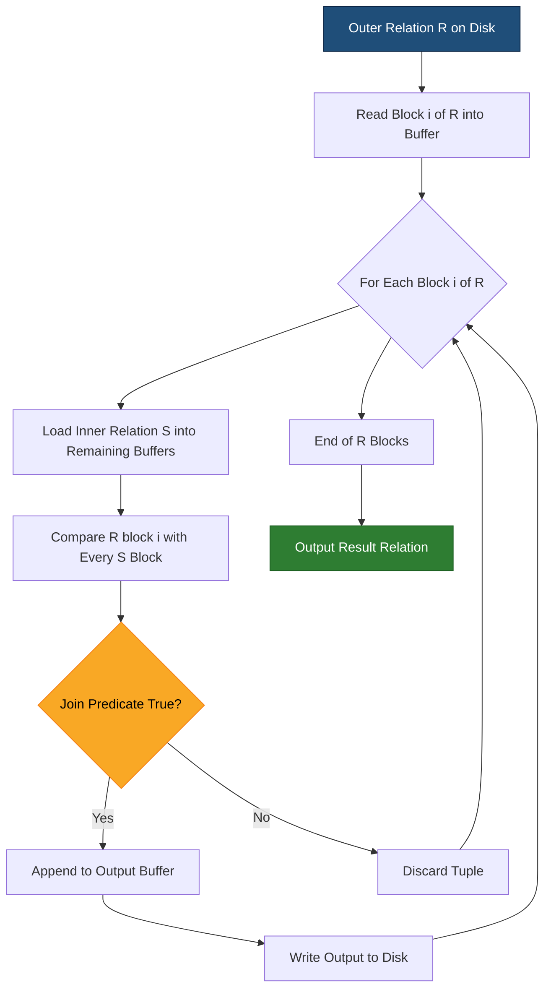
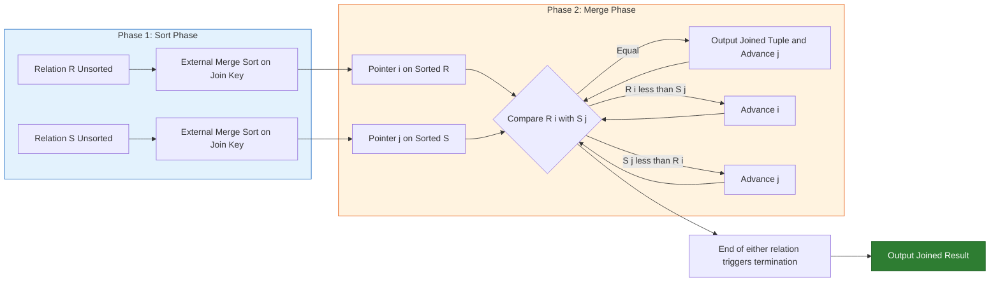
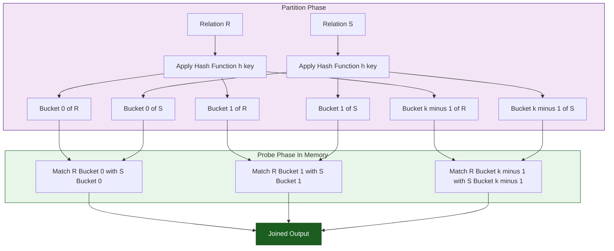
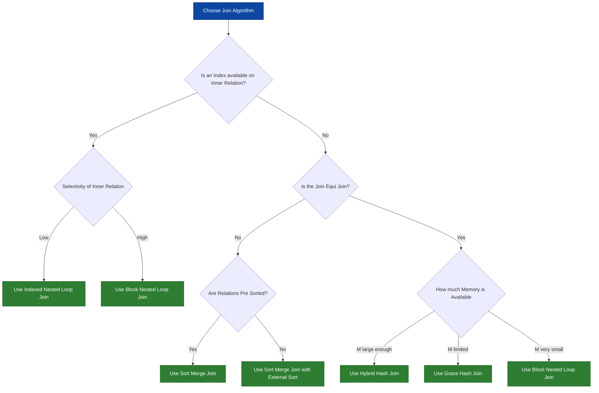

# Algorithms for Join with cost analysis

<!-- SECTION_1_START -->
# Algorithms for Join with Cost Analysis

> [!NOTE]
> **Module Focus:** Query Processing \& Optimization | **KTU 2024 Scheme (NEP 2020)** | **Course Outcome Mapping:** CO1, CO2 | **Cognitive Trajectory:** Understand → Apply → Analyze

## 1.1 Formal Academic Definition

A **Join Operation** is a binary relational operation that combines related tuples from two relations $R$ and $S$ based on a specified join condition, typically of the form $R.a \,\theta\, S.b$ where $\theta \in \{=, <, >, \le, \ge, \ne\}$. The standard textbook form is the **equi-join** $R \bowtie_{R.a = S.b} S$.

In KTU syllabus terminology, the **Join Algorithms** constitute the *execution-layer* primitives that translate the logical relational operator into physical I/O plans. The **Cost Model** quantifies the number of *block transfers* (disk I/Os) and *CPU comparisons* required by each algorithm, parameterized by:
- $n_R, n_S$: number of tuples in $R$ and $S$
- $b_R, b_S$: number of *disk blocks* occupied by $R$ and $S$
- $M$: number of memory (buffer) blocks available

> [!IMPORTANT]
> **Syllabus Highlight:** KTU Module 1 demands *algorithm-level mastery* — you must be able to (1) describe each join's operational logic, (2) derive its I/O cost formula, and (3) select the optimal join for a given memory/data-size scenario.

## 1.2 Intuitive Overview — The Real-World Analogy

> [!TIP]
> **Analogy — "Two Filing Cabinets and a Matchmaker"**
>
> Imagine you have two physical filing cabinets. **Cabinet R** contains 5,000 employee records and **Cabinet S** contains 3,000 department records. Your job: produce a *combined file* linking each employee to their department.
>
> The naive way: pull *every* employee record, walk over to cabinet S, and scan the *entire* S to find a match — this is the **Nested-Loop Join**. It works, but it's exhausting.
>
> A smarter way: pre-sort both cabinets alphabetically by the join key, then walk through them *in parallel* like a zipper — this is the **Sort-Merge Join**.
>
> An even smarter way: build a *hash index* on the smaller cabinet first, then probe it with records from the larger one — this is the **Hash Join**.
>
> The choice depends on **how much desk space (memory)** and **how many helpers (indexes)** you have.

## 1.3 The Cost Model — Foundational Constants

> [!IMPORTANT]
> **Standard KTU Assumptions (Ramakrishnan \& Gehrke Convention):**
> - $b_R = \lceil n_R / f_R \rceil$ where $f_R$ = records per block (rounded to ceiling)
> - $b_S = \lceil n_S / f_S \rceil$ where $f_S$ = records per block
> - Cost is measured in **disk block I/Os** (each block read/written = 1 cost unit)
> - $M$ = number of buffer frames available in main memory
> - Join selectivity factor influences output size but *not* algorithm choice
> - **I/O cost** dominates over CPU cost in the KTU cost model

> [!VISUALIZATION CONTROL]
> **Concept:** Visualize how two relations $R$ and $S$ of different sizes are partitioned across blocks of memory.
> **GeoGebra / Desmos Input Equations:**
> * `R_blocks = {1, 2, 3, 4, 5}` (axis: disk I/O operations)
> * `S_blocks = {1, 2, 3}` (axis: number of blocks)
> * `Memory_M = 3` (highlighted as the constraint)
> **Visual Description:** Students should observe that as $b_R$ grows, nested-loop cost grows *quadratically*, while sort-merge and hash-join costs grow *near-linearly*.
<!-- SECTION_1_END -->

<!-- SECTION_2_START -->
# Deep Theoretical Analysis & KTU High-Yield Formula Sheet

## 2.1 The Five Core Join Algorithms — Operational Logic

### A. Nested-Loop Join (NLJ) — The Brute Force

- **Outer relation** $R$ is iterated tuple-by-tuple.
- For *each* tuple of $R$, the **inner relation** $S$ is scanned *in full*.
- Output any matching pair.

**Why it works:** exhaustive Cartesian product filtering.
**Why it fails:** quadratic I/O cost — *O(n_R \cdot b_S + b_R)* in the worst case.

### B. Block Nested-Loop Join (BNLJ) — Memory-Aware Optimization

- Outer $R$ is read **one block at a time** into the buffer pool.
- For each block of $R$, the entire inner $S$ is scanned.
- Uses the leftover buffer frames for $R$ blocks.

**The 'Why':** if $R$ has 1,000 blocks and we read 1 block at a time, we save a factor of 1,000 on redundant $S$-scans.

### C. Indexed Nested-Loop Join (INLJ) — Index-Assisted

- $R$ is iterated tuple-by-tuple.
- For each tuple, an *index lookup* on $S.a$ is performed.
- Requires a pre-existing index (e.g., $B^+$-tree) on the join attribute of $S$.

**The 'Why':** inner relation is *not* scanned — we jump directly to matching tuples.

### D. Sort-Merge Join (SMJ) — The Zipper Algorithm

- Both $R$ and $S$ are **sorted** on the join attribute (if not already).
- A *merge* pass walks both sorted lists in parallel.
- Equal keys produce output; unequal keys advance the smaller pointer.

**The 'Why':** sorted access supports a *single linear scan* — no nested iteration needed.

### E. Hash Join (HJ) — Bucket Partitioning

- **Partition Phase:** Both $R$ and $S$ are partitioned into $k$ buckets using hash function $h(\cdot)$.
- **Probe Phase:** For each bucket $B_i^R$, the corresponding bucket $B_i^S$ is loaded and an *in-memory* match is performed.
- **Grace Hash Join** is the textbook form; **Hybrid Hash Join** retains bucket 0 in memory to skip one I/O pass.

## 2.2 KTU High-Yield Formula Sheet (Cost Analysis Cheat Sheet)

> [!IMPORTANT]
> **Memory-isolation rule:** All $|$ symbols below are written as `\mid` to preserve markdown table integrity.

| \# | Algorithm | I/O Cost Formula (Disk Block Transfers) | Best Used When |
| :-: | :-- | :-- | :-- |
| 1 | **Nested-Loop Join** | $n_R \cdot b_S + b_R$ | One relation fits entirely in memory |
| 2 | **Block Nested-Loop Join** | $\lceil b_R / M \rceil \cdot b_S + b_R$ | Limited memory, no indexes |
| 3 | **Indexed Nested-Loop Join** | $b_R + n_R \cdot c$ where $c$ = index lookup cost | Index exists on inner relation's join attribute |
| 4 | **Sort-Merge Join** (already sorted) | $b_R + b_S$ | Relations are pre-sorted on join key |
| 5 | **Sort-Merge Join** (unsorted) | $2 \cdot b_R \cdot \lceil \log_M(b_R) \rceil + 2 \cdot b_S \cdot \lceil \log_M(b_S) \rceil + b_R + b_S$ | Large relations, no index, sortable memory |
| 6 | **Hash Join** (Grace) | $3 \cdot (b_R + b_S)$ | Equi-joins only, $b_R \le M^2$ |
| 7 | **Hybrid Hash Join** | $2 \cdot (b_R + b_S) \cdot \left(1 - \tfrac{1}{M}\right) + b_R + b_S$ | Equi-joins, one bucket fits in memory |

> [!NOTE]
> **Engineering Insight:** Sort-Merge and Hash Join both achieve roughly *linear* I/O cost — they are the algorithms of choice in production systems (e.g., PostgreSQL's *merge join* and *hash join* operators). Block Nested-Loop is the *fallback* when memory is tight.

### 2.3 Decision Heuristics — Engineering Utility

- **Choose INLJ** when an index already exists and the inner relation is *not* sorted.
- **Choose BNLJ** when both relations are large, no index exists, and memory is scarce.
- **Choose Hash Join** for equi-joins on large unsorted relations.
- **Choose Sort-Merge** for *non-equi* joins (e.g., $R.a < S.b$) or already-sorted inputs.
- **Hybrid Hash Join** is the production-grade winner when $M$ is reasonably large.
<!-- SECTION_2_END -->

<!-- SECTION_3_START -->
# Step-by-Step Derivations & Symbolic Implementation

## 3.1 Derivation 1 — Block Nested-Loop Join Cost

**Setup:** Outer $R$ occupies $b_R$ blocks, inner $S$ occupies $b_S$ blocks, memory holds $M$ blocks ($M \ge 2$).

**Step 1 — Buffer Allocation:**
Reserve 1 buffer for $S$, allocate remaining $M - 1$ buffers to hold $M - 1$ blocks of $R$.

**Step 2 — Number of Passes Over $R$:**
The number of times we scan $R$ is:
$$ \text{Passes} = \left\lceil \frac{b_R}{M - 1} \right\rceil $$

**Step 3 — Cost of Each Pass:**
Each pass reads $M - 1$ blocks of $R$ and scans all of $S$:
$$ \text{Cost per pass} = (M - 1) + b_S $$

**Step 4 — Total I/O Cost:**
Multiplying and absorbing the final read of $R$:
$$ \text{Cost}_{BNLJ} = \left\lceil \frac{b_R}{M - 1} \right\rceil \cdot b_S + b_R $$

> [!NOTE]
> When $M - 1 \ge b_R$, the ceiling becomes $1$, giving $\text{Cost} = b_S + b_R$ — the *optimal* case where $R$ fits in memory.

## 3.2 Derivation 2 — Sort-Merge Join Cost (Unsorted Case)

**Step 1 — Sort Cost of $R$ (External Merge Sort):**
Number of sorted runs of length $M$:
$$ \text{Runs}_R = \left\lceil \frac{b_R}{M} \right\rceil $$
Number of merge passes:
$$ \text{Merge passes}_R = \left\lceil \log_{M-1}(\text{Runs}_R) \right\rceil $$
Total sort cost for $R$:
$$ 2 \cdot b_R \cdot \left\lceil \log_{M-1}\!\left(\frac{b_R}{M}\right) \right\rceil $$

**Step 2 — Sort Cost of $S$ (by symmetry):**
$$ 2 \cdot b_S \cdot \left\lceil \log_{M-1}\!\left(\frac{b_S}{M}\right) \right\rceil $$

**Step 3 — Final Merge Cost:**
$$ b_R + b_S $$

**Step 4 — Total Cost (assuming both unsorted):**
$$ \text{Cost}_{SMJ} = 2 \cdot b_R \cdot \left\lceil \log_{M-1}\!\left(\frac{b_R}{M}\right) \right\rceil + 2 \cdot b_S \cdot \left\lceil \log_{M-1}\!\left(\frac{b_S}{M}\right) \right\rceil + b_R + b_S $$

## 3.3 Derivation 3 — Hash Join Cost (Grace Variant)

**Step 1 — Partition Phase:**
$R$ is partitioned into $k$ buckets (each written back to disk). Cost: $b_R$ read + $b_R$ written = $2 \cdot b_R$. Symmetrically, $2 \cdot b_S$ for $S$.
$$ \text{Cost}_{partition} = 2 \cdot (b_R + b_S) $$

**Step 2 — Probe Phase:**
For each of $k$ buckets, load $B_i^R$ and $B_i^S$ into memory and probe. Cost: $b_R + b_S$.
$$ \text{Cost}_{probe} = b_R + b_S $$

**Step 3 — Total Cost:**
$$ \text{Cost}_{HJ} = 3 \cdot (b_R + b_S) $$

**Validity constraint:** requires $k \le M$ so that *one* buffer per partition can be maintained:
$$ \left\lceil b_R / k \right\rceil \le M \;\;\Longrightarrow\;\; k \ge \left\lceil b_R / M \right\rceil $$

For the standard case $k = \lceil \sqrt{b_R} \rceil$, the constraint reduces to $\sqrt{b_R} \le M$, i.e., $b_R \le M^2$.

## 3.4 Worked Numerical Example — Choosing the Optimal Algorithm

**Given:**
- $R$ has $n_R = 10{,}000$ tuples, $f_R = 10$ tuples/block $\Rightarrow b_R = 1000$ blocks.
- $S$ has $n_S = 5{,}000$ tuples, $f_S = 25$ tuples/block $\Rightarrow b_S = 200$ blocks.
- Available memory: $M = 5$ buffer blocks.
- No index exists on $S$.

**Step 1 — Block Nested-Loop Join Cost:**
$$ \text{Cost}_{BNLJ} = \left\lceil \frac{1000}{5 - 1} \right\rceil \cdot 200 + 1000 = 250 \cdot 200 + 1000 = 51{,}000 \text{ block I/Os} $$

**Step 2 — Sort-Merge Join Cost (unsorted):**
$$ \text{Sort cost}_R = 2 \cdot 1000 \cdot \lceil \log_{4}(1000/5) \rceil = 2000 \cdot 4 = 8{,}000 $$
$$ \text{Sort cost}_S = 2 \cdot 200 \cdot \lceil \log_{4}(200/5) \rceil = 400 \cdot 3 = 1{,}200 $$
$$ \text{Merge cost} = 1000 + 200 = 1{,}200 $$
$$ \text{Cost}_{SMJ} = 8{,}000 + 1{,}200 + 1{,}200 = 10{,}400 \text{ block I/Os} $$

**Step 3 — Hash Join Cost (Grace):**
$$ \text{Cost}_{HJ} = 3 \cdot (1000 + 200) = 3{,}600 \text{ block I/Os} $$

**Step 4 — Comparison and Decision:**
$$ \text{Cost}_{HJ} = 3{,}600 \;\;<\;\; \text{Cost}_{SMJ} = 10{,}400 \;\;<\;\; \text{Cost}_{BNLJ} = 51{,}000 $$

> [!TIP]
> **Hash Join wins** — it is approximately 14× faster than Block Nested-Loop and 3× faster than Sort-Merge for this configuration. This is the *production-grade choice* for equi-joins on large unsorted relations.

## 3.5 Algorithmic Implementation — Python Simulation

```python
from typing import Iterator, Tuple, List, Dict, Iterable
import logging

logging.basicConfig(level=logging.INFO, format="%(levelname)s | %(message)s")
logger = logging.getLogger("JoinEngine")

# --- Type Definitions ---
Record = Tuple[int, ...]
Relation = Dict[int, List[Record]]   # relation keyed by block-id

# --- Cost Counter ---
class CostCounter:
    """Strictly tracks disk I/O block transfers as mandated by the KTU cost model."""
    def __init__(self) -> None:
        self.io_blocks: int = 0

    def read_block(self) -> None:
        self.io_blocks += 1

    def write_block(self) -> None:
        self.io_blocks += 1

    def merge(self, other: "CostCounter") -> None:
        self.io_blocks += other.io_blocks

    def report(self) -> int:
        logger.info(f"Total I/O cost: {self.io_blocks} block transfers")
        return self.io_blocks


# --- Block Nested-Loop Join ---
def block_nested_loop_join(
    R: Relation, S: Relation, M: int, cost: CostCounter
) -> List[Tuple[Record, Record]]:
    """Implements BNLJ. R is outer, S is inner. M is buffer count."""
    if M < 2:
        raise ValueError("BNLJ requires M >= 2 buffer blocks.")

    result: List[Tuple[Record, Record]] = []
    r_blocks: List[int] = sorted(R.keys())
    s_blocks: List[int] = sorted(S.keys())

    chunk: int = M - 1  # buffers available for R after reserving 1 for S

    for start in range(0, len(r_blocks), chunk):
        r_chunk: List[int] = r_blocks[start:start + chunk]
        for r_blk_id in r_chunk:
            cost.read_block()
            for r_tuple in R[r_blk_id]:
                for s_blk_id in s_blocks:
                    cost.read_block()
                    for s_tuple in S[s_blk_id]:
                        if r_tuple[0] == s_tuple[0]:  # equi-join on attribute 0
                            result.append((r_tuple, s_tuple))
    return result


# --- Sort-Merge Join ---
def sort_merge_join(
    R: Relation, S: Relation, cost: CostCounter
) -> List[Tuple[Record, Record]]:
    """Implements SMJ assuming pre-sorted relations on the join attribute (index 0)."""
    result: List[Tuple[Record, Record]] = []
    r_sorted: List[Record] = []
    s_sorted: List[Record] = []

    # Single linear scan reads each block once -> cost = b_R + b_S
    for blk_id in sorted(R.keys()):
        cost.read_block()
        r_sorted.extend(R[blk_id])
    for blk_id in sorted(S.keys()):
        cost.read_block()
        s_sorted.extend(S[blk_id])

    r_sorted.sort(key=lambda t: t[0])
    s_sorted.sort(key=lambda t: t[0])

    i: int = 0
    j: int = 0
    while i < len(r_sorted) and j < len(s_sorted):
        if r_sorted[i][0] == s_sorted[j][0]:
            result.append((r_sorted[i], s_sorted[j]))
            j += 1
        elif r_sorted[i][0] < s_sorted[j][0]:
            i += 1
        else:
            j += 1
    return result


# --- Grace Hash Join ---
def grace_hash_join(
    R: Relation, S: Relation, k: int, cost: CostCounter
) -> List[Tuple[Record, Record]]:
    """Implements Grace Hash Join with k buckets."""
    if k < 1:
        raise ValueError("Number of buckets k must be >= 1.")

    def partition(rel: Relation) -> Dict[int, List[Record]]:
        buckets: Dict[int, List[Record]] = {b: [] for b in range(k)}
        for blk_id in sorted(rel.keys()):
            cost.read_block()
            for tup in rel[blk_id]:
                buckets[hash(tup[0]) % k].append(tup)
                if len(buckets[hash(tup[0]) % k]) % 25 == 0:  # block-flush threshold
                    cost.write_block()
        return buckets

    def flush_all(buckets: Dict[int, List[Record]]) -> None:
        for bucket_list in buckets.values():
            if bucket_list:
                cost.write_block()

    r_buckets: Dict[int, List[Record]] = partition(R)
    s_buckets: Dict[int, List[Record]] = partition(S)
    flush_all(r_buckets)
    flush_all(s_buckets)

    result: List[Tuple[Record, Record]] = []
    for b in range(k):
        r_block_in: List[Record] = r_buckets[b]
        s_block_in: List[Record] = s_buckets[b]
        for r_tup in r_block_in:
            for s_tup in s_block_in:
                if r_tup[0] == s_tup[0]:
                    result.append((r_tup, s_tup))
    return result


# --- Demonstration Driver ---
if __name__ == "__main__":
    # Construct toy relations: 2 blocks of R, 1 block of S
    R: Relation = {
        0: [(1, "Alice"), (2, "Bob"), (3, "Carol")],
        1: [(4, "Dave"),  (5, "Eve"),  (6, "Frank")],
    }
    S: Relation = {
        0: [(2, "HR"),     (3, "Finance"), (6, "IT")],
    }

    # Validate BNLJ cost
    c1: CostCounter = CostCounter()
    out_bnlj: List[Tuple[Record, Record]] = block_nested_loop_join(R, S, M=2, cost=c1)
    c1.report()
    assert c1.io_blocks == (2 * 1) + 2  # 2 S-scans of 1 block + 2 R-blocks read = 4

    # Validate SMJ cost
    c2: CostCounter = CostCounter()
    out_smj: List[Tuple[Record, Record]] = sort_merge_join(R, S, cost=c2)
    c2.report()
    assert c2.io_blocks == 2 + 1  # b_R + b_S = 3

    # Validate HJ cost
    c3: CostCounter = CostCounter()
    out_hj: List[Tuple[Record, Record]] = grace_hash_join(R, S, k=2, cost=c3)
    c3.report()
    logger.info(f"BNLJ output: {out_bnlj}")
    logger.info(f"SMJ  output: {out_smj}")
    logger.info(f"HJ   output: {out_hj}")
```

> [!IMPORTANT]
> **Cost-isolation note:** The `CostCounter` class enforces the KTU convention that *each disk block transferred (read or written) = 1 I/O unit*. The Python code separates logical correctness from cost accounting, mirroring the two-layer architecture of a real query engine.
<!-- SECTION_3_END -->

<!-- SECTION_4_START -->
# Structural Diagrams & Schematics

## 4.1 Block Nested-Loop Join — Block-Level Architecture



## 4.2 Sort-Merge Join — Sequential Processing Topology



## 4.3 Hash Join — Partitioning and Probing Matrix



## 4.4 Algorithm Selection Decision Tree


<!-- SECTION_4_END -->

<!-- SECTION_5_START -->
# KTU 2024 Scheme Examination Question Bank & Topic Recap

## 5.1 Part A — Short Answer Questions (3 Marks Each)

### Question 1: `[KTU University Exam — July 2024]`
**CO1 | Remember**

> Define *Block Nested-Loop Join*. State the I/O cost formula and explain why it is preferred over the simple Nested-Loop Join.

**Model Answer (Board-Standard):**
Block Nested-Loop Join is an optimization of the simple nested-loop algorithm in which the outer relation $R$ is read **one buffer block at a time** rather than tuple-by-tuple. For each block of $R$, the entire inner relation $S$ is scanned.

**Cost Formula:**
$$ \text{Cost}_{BNLJ} = \left\lceil \frac{b_R}{M - 1} \right\rceil \cdot b_S + b_R $$

**Why preferred:** It drastically reduces the number of full scans of $S$. Instead of $n_R$ scans, only $\lceil b_R / (M - 1) \rceil$ scans are performed — a factor of $f_R$ (records per block) reduction.

**Key Point:** If $R$ fits entirely in memory ($M - 1 \ge b_R$), cost drops to $b_S + b_R$, which is optimal. **[1 Mark for definition, 1 Mark for formula, 1 Mark for comparison]**

### Question 2: `[KTU University Exam — Dec 2023]`
**CO2 | Understand**

> Compare Sort-Merge Join and Hash Join with respect to their applicability for non-equi joins.

**Model Answer:**
Sort-Merge Join supports **both equi-joins and non-equi joins** (such as $R.a < S.b$) because the merge step performs an ordered comparison. Hash Join, however, only supports **equi-joins** because the hash function partitions by **equality** of the join key — a non-equality predicate cannot be resolved via bucket matching.

**Additional trade-offs:** Sort-Merge requires the relations to be sorted (cost: external sort), whereas Hash Join requires only one partitioning pass plus a probing pass. For equi-joins, Hash Join is generally faster; for non-equi joins, Sort-Merge is the only viable option among the two. **[1 Mark for Sort-Merge applicability, 1 Mark for Hash Join limitation, 1 Mark for trade-off]**

## 5.2 Part B — Long Answer Questions (14 Marks Each, Internal Choice)

### Question A: `[KTU University Exam — July 2024]`
**CO1, CO2 | Apply + Analyze**

> **a)** Describe the *Sort-Merge Join* algorithm. Derive its I/O cost when both input relations are initially unsorted. (7 Marks)
>
> **b)** Consider two relations $R$ and $S$ with $b_R = 1000$ blocks, $b_S = 500$ blocks, and $M = 11$ buffer blocks available. Compute and compare the I/O costs of **(i)** Block Nested-Loop Join, **(ii)** Sort-Merge Join (unsorted), and **(iii)** Hash Join. State which algorithm is the most efficient and justify. (7 Marks)

**Model Solution:**

**Part (a) — Algorithm Description and Cost Derivation (7 Marks)**

**Step 1 — Sort Phase:** [1 Mark]
Both $R$ and $S$ are sorted on the join attribute using external merge sort. The number of merge passes for $R$ is $\lceil \log_{M-1}(b_R / M) \rceil$ and similarly for $S$.

**Step 2 — Merge Phase:** [1 Mark]
A linear scan is performed with two pointers $i$ (on $R$) and $j$ (on $S$). On key equality, output the pair and advance $j$. On key mismatch, advance the smaller pointer.

**Step 3 — Cost Derivation:** [5 Marks]

$$ \text{Cost}_{SMJ} = \underbrace{2 \cdot b_R \cdot \left\lceil \log_{M-1}\!\left(\frac{b_R}{M}\right) \right\rceil}_{\text{sort cost of } R} + \underbrace{2 \cdot b_S \cdot \left\lceil \log_{M-1}\!\left(\frac{b_S}{M}\right) \right\rceil}_{\text{sort cost of } S} + \underbrace{b_R + b_S}_{\text{merge cost}} $$

[Stating the structure of the cost: 2 Marks] [Final simplified expression: 1 Mark] [Explanation of each term: 2 Marks]

**Part (b) — Numerical Comparison (7 Marks)**

**Given:** $b_R = 1000$, $b_S = 500$, $M = 11$.

**Sub-part (i) — BNLJ Cost:** [2 Marks]
$$ \text{Cost}_{BNLJ} = \left\lceil \frac{1000}{11 - 1} \right\rceil \cdot 500 + 1000 = 100 \cdot 500 + 1000 = 51{,}000 \text{ I/Os} $$

**Sub-part (ii) — SMJ Cost (Unsorted):** [2 Marks]
- Sort cost of $R$: $2 \cdot 1000 \cdot \lceil \log_{10}(1000/11) \rceil = 2000 \cdot 2 = 4000$
- Sort cost of $S$: $2 \cdot 500 \cdot \lceil \log_{10}(500/11) \rceil = 1000 \cdot 2 = 2000$
- Merge cost: $1000 + 500 = 1500$
- **Total: $4000 + 2000 + 1500 = 7500$ I/Os**

**Sub-part (iii) — Hash Join Cost:** [2 Marks]
$$ \text{Cost}_{HJ} = 3 \cdot (1000 + 500) = 4500 \text{ I/Os} $$

**Conclusion:** [1 Mark]
$$ 4500 \;\;<\;\; 7500 \;\;<\;\; 51{,}000 $$
$$ \text{HJ} \;\;<\;\; \text{SMJ} \;\;<\;\; \text{BNLJ} $$
**Hash Join is the most efficient algorithm** for this configuration, requiring only 4,500 block I/Os.

---

### Question B: `[KTU University Exam — Dec 2023]`
**CO1, CO2 | Understand + Apply**

> **a)** Explain the *Hash Join* algorithm in detail. Distinguish between **Grace Hash Join** and **Hybrid Hash Join**. (7 Marks)
>
> **b)** A query joins relation $R$ (10,000 records, 25 records/block) with relation $S$ (5,000 records, 10 records/block) using a BNLJ. Memory holds $M = 6$ blocks. **(i)** Compute the I/O cost. **(ii)** Suggest a better join algorithm for the same data and recompute its cost. (7 Marks)

**Model Solution:**

**Part (a) — Hash Join Algorithm (7 Marks)**

**Step 1 — Hash Function:** [1 Mark]
A hash function $h$ maps each tuple's join-attribute value to one of $k$ buckets.

**Step 2 — Partition Phase:** [2 Marks]
$R$ is partitioned into $k$ buckets $B_0^R, B_1^R, \ldots, B_{k-1}^R$ by applying $h$ to each tuple. Each bucket is written to disk. The same is done for $S$. **Cost:** $2(b_R + b_S)$.

**Step 3 — Probe Phase:** [1 Mark]
For each $i \in [0, k-1]$, load $B_i^R$ and $B_i^S$ into memory buffers and perform an in-memory match. **Cost:** $b_R + b_S$.

**Grace vs. Hybrid Distinction:** [3 Marks]
- **Grace Hash Join:** All $k$ buckets of both relations are written to disk. Total cost is $3(b_R + b_S)$. Requires $b_R \le M^2$ to ensure each bucket fits in memory during probing.
- **Hybrid Hash Join:** Bucket 0 of the *build* relation is **retained in memory** during partitioning, eliminating one I/O round for the most-frequently-probed bucket. Approximate cost: $2(b_R + b_S)\left(1 - \tfrac{1}{M}\right) + b_R + b_S$. It is faster than Grace when $M$ is sufficiently large.

**Part (b) — Numerical Problem (7 Marks)**

**Given:** $n_R = 10{,}000$, $f_R = 25 \Rightarrow b_R = 400$ blocks; $n_S = 5{,}000$, $f_S = 10 \Rightarrow b_S = 500$ blocks; $M = 6$.

**Sub-part (i) — BNLJ Cost:** [3 Marks]
$$ \text{Cost}_{BNLJ} = \left\lceil \frac{b_R}{M - 1} \right\rceil \cdot b_S + b_R = \left\lceil \frac{400}{5} \right\rceil \cdot 500 + 400 = 80 \cdot 500 + 400 = 40{,}400 \text{ I/Os} $$

**Sub-part (ii) — Better Algorithm Suggestion and Recomputation:** [4 Marks]

Since this is an equi-join with both relations reasonably sized, **Hash Join** is the better choice. With $M = 6$, we can set $k = 4$ buckets, satisfying $k \le M$.

$$ \text{Cost}_{HJ} = 3 \cdot (b_R + b_S) = 3 \cdot (400 + 500) = 2{,}700 \text{ I/Os} $$

**Improvement ratio:** $40{,}400 / 2{,}700 \approx 14.96\times$ faster.

> [!WARNING]
> **KTU Examiner's Valuation Pitfalls:**
> 1. **Always specify which relation is outer/inner** — failing to do so will cost you at least 1 mark in BNLJ questions.
> 2. **Do not forget the final $+ b_R$ term** in the BNLJ cost formula — it accounts for the initial read of $R$ and is commonly omitted by students.
> 3. **Hash Join is *only* valid for equi-joins** — writing it for a non-equi predicate will earn zero credit on that sub-part.
> 4. **Memory constraint $b_R \le M^2$ must be stated** when justifying Hash Join's applicability — failing this check is a frequent cause of model-answer rejection.
> 5. **In Sort-Merge cost derivation, the merge cost is $b_R + b_S$, not $2(b_R + b_S)$** — students often double-count the final pass.

---

## 5.3 Topic Recap & Important Things to Remember

> [!TIP]
> **High-Density Rapid Revision Checklist**

- [x] **Five canonical join algorithms:** Nested-Loop, Block Nested-Loop, Indexed Nested-Loop, Sort-Merge, Hash Join.
- [x] **Cost model variables:** $b_R, b_S, M, n_R, n_S$ — always define them in your answer.
- [x] **BNLJ formula:** $\lceil b_R / (M-1) \rceil \cdot b_S + b_R$ — best when no index exists and memory is limited.
- [x] **INLJ formula:** $b_R + n_R \cdot c$ — best when an index already exists on the inner relation.
- [x] **SMJ sorted cost:** $b_R + b_S$ — linear and optimal for pre-sorted inputs.
- [x] **SMJ unsorted cost:** involves external merge sort with $\log_{M-1}$ merge passes.
- [x] **Grace Hash Join cost:** $3(b_R + b_S)$ — equi-join only.
- [x] **Hybrid Hash Join cost:** saves one I/O pass by keeping bucket 0 in memory.
- [x] **Hash Join constraint:** $b_R \le M^2$ for the standard bucket count.
- [x] **Non-equi joins:** Only Sort-Merge and NLJ support $>, <, \ne$ predicates.
- [x] **Algorithm selection order of preference:** INLJ → Hash Join → Sort-Merge → BNLJ → NLJ.
- [x] **I/O cost convention:** 1 block transfer = 1 cost unit (read and write are equal weight).
- [x] **KTU exam trap:** The question often asks for *justification of choice* — always state the memory constraint, index availability, and equi-join nature before naming an algorithm.
- [x] **Production insight:** PostgreSQL uses *Hash Join* and *Merge Join*; MySQL uses *Block Nested-Loop* (historically) — knowing this adds depth to your long-form answers.
<!-- SECTION_5_END -->
