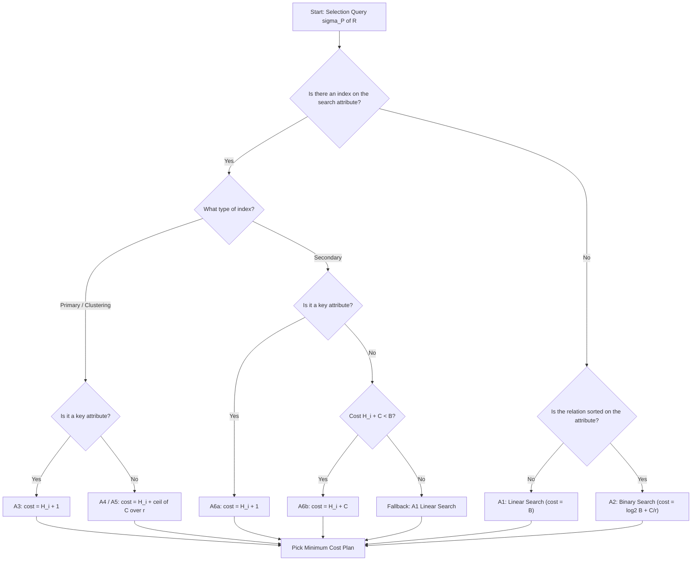
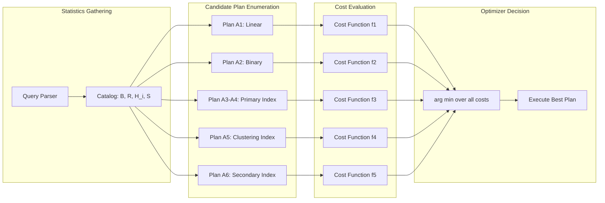
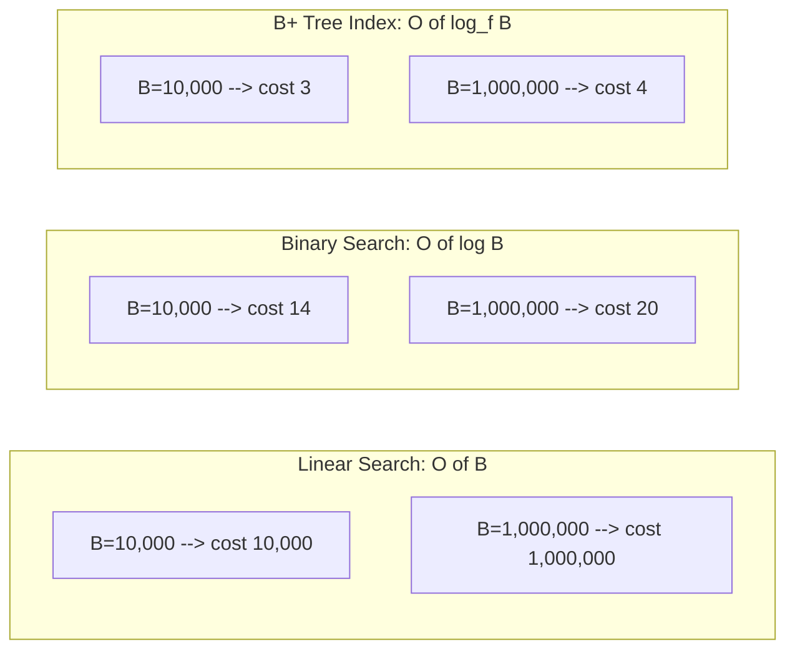

# Algorithms for Selection with cost analysis

<!-- SECTION_1_START -->

# Algorithms for Selection with Cost Analysis

## 1. Core Technical Definition

> [!IMPORTANT]
> **Selection Operation (σ)** is a unary relational algebra operation that retrieves tuples from a relation $r$ satisfying a Boolean selection predicate $P$. Formally, $\sigma_{P}(r) = \{ t \mid t \in r \text{ and } P(t) = \text{true} \}$.

In the context of **Query Processing**, the selection operator is one of the most frequently executed operations in SQL `WHERE` clauses. The efficiency of $\sigma$ directly determines the response time of nearly every analytical and transactional query. Because the cost of a database query is dominated by **secondary-storage I/O (disk block transfers)**, the choice of selection algorithm is critical. Selection algorithms are evaluated based on:

- **Number of block transfers** (the I/O cost)
- **Number of seeks** (the mechanical latency cost)
- **CPU time** (for tuple evaluation)

The selection algorithms analyzed in this topic are:

| Code | Algorithm Name |
| :--- | :--- |
| **A1** | Linear Search (Unsorted File Scan) |
| **A2** | Binary Search (Sorted File) |
| **A3** | Primary Index – Equality on Key |
| **A4** | Primary Index – Equality on Non-Key |
| **A5** | Clustering Index – Range / Equality |
| **A6** | Secondary Index – Equality |
| **A7** | Conjunctive Selection (Index Intersection, AND) |
| **A8** | Disjunctive Selection (Index Union, OR) |

### Standard Cost Parameters

- **B** = number of blocks containing relation $r$ (i.e., $b_r$)
- **R** = number of tuples (records) in $r$ (i.e., $t_r$)
- **r** = blocking factor = $\lfloor B_R / R \rfloor$ tuples per block
- **H_i** = height of the B⁺-tree index (number of levels)
- **C** = number of tuples that satisfy the selection condition
- **S** = number of distinct values for the selection attribute (selectivity)
- **D** = average number of duplicates per value = $R / S$

> [!NOTE]
> **Implicit Assumption:** The dominant cost metric in selection algorithms is the **number of disk block transfers**. A block transfer counts as 1 unit regardless of whether the block contains the queried tuple. A "seek" is the additional mechanical movement cost of the disk head, often counted separately.

## 2. Conceptual Analogy — "The Library Catalogue Problem"

Imagine you are searching a library of **2,000 shelves** for books written by *"Ramez Elmasri"*. You have three strategies:

1. **Linear Search (A1):** Walk past every single shelf, pulling out each book to check the author's name. This is exhaustive but always works — exactly **2,000 checks**.

2. **Binary Search (A2):** If the shelves are alphabetically organized by author, you can split the room in half repeatedly. You need only about **$\lceil \log_2(2000) \rceil = 11$ visits**.

3. **Indexed Search (A3 / A6):** The library keeps a small *index card drawer* of 50 pages, sorted by author. You flip through the drawer ($\sim 4$ pages) to locate the row, then walk to the exact shelf. Total effort: **4 + 1 = 5** visits.

The choice of algorithm depends on **how the data is organized** (sorted/unsorted) and **what auxiliary structures exist** (indices). The same is true in a DBMS — the query optimizer's job is to pick the cheapest strategy given the available access paths.

> [!VISUALIZATION CONTROL]
> **Concept:** Cost growth of selection algorithms as relation size increases.
> **Desmos Input Equations:**
> * `y1 = x` (Linear Search)
> * `y2 = \log_2(x)` (Binary Search)
> * `y3 = \log_{50}(x) + 1` (B⁺ Tree Index Search with fanout = 50)
> **Visual Description:** Plot $y_1, y_2, y_3$ for $x \in [10, 100000]$. The student should observe the steep line for linear search, the gentle logarithmic curve for binary search, and the nearly flat curve for indexed search — confirming that **indices provide sub-logarithmic access**.

<!-- SECTION_1_END -->

<!-- SECTION_2_START -->

# Deep Theoretical Analysis & High-Yield Formula Sheet

## 2.1 Algorithm-by-Algorithm Walk-Through

### A1 — Linear Search (Brute-Force File Scan)

- **Pre-condition:** None. Works on unsorted relations and on any attribute.
- **Procedure:** Read every block of the relation. For each tuple, evaluate the selection predicate. If true, add the tuple to the result.
- **When to use:** When the relation is small, when no index exists, or when the predicate matches a large fraction of tuples (high selectivity, $C / R \to 1$). In such cases, scanning is faster than traversing an index.
- **Equality on key:** If the attribute is a *primary key* and the value exists, the scan can stop early. **Average cost = B/2**, but the worst case remains **B**.

### A2 — Binary Search

- **Pre-condition:** The file is **sorted** on the selection attribute and supports random block access.
- **Procedure:** Open the middle block, compare with the search key. Discard the half that cannot contain the key. Repeat.
- **Cost to locate the first block:** $\lceil \log_2(B) \rceil$ block transfers.
- **Cost to retrieve all matching tuples:** additional $C$ sequential reads (or $\lceil C / r \rceil$ block reads if duplicates are clustered).
- **Limitation:** Only useful for **equality** or simple range predicates. Does not leverage the index for non-key attributes.

### A3 — Primary Index, Equality on Key

- **Pre-condition:** A **primary (clustered) B⁺-tree** exists on the search attribute, which is a *primary key*.
- **Procedure:** Traverse the B⁺-tree from root to leaf ($H_i$ block reads). The leaf entry contains a pointer to the data block. Read the data block (1 more I/O). Total = $H_i + 1$.
- **Optimality:** This is the **fastest** possible single-tuple retrieval. Cost is essentially independent of relation size.

### A4 — Primary Index, Equality on Non-Key

- **Pre-condition:** Primary (clustered) index on the search attribute, which is **not a key**.
- **Procedure:** $H_i$ block reads to navigate to the leaf. From the leaf, walk through the data blocks (because tuples with the same key are stored adjacently) until all $C$ matching tuples are read.
- **Cost:** $H_i + \lceil C / r \rceil$ block transfers.

### A5 — Clustering Index, Range / Equality

- **Pre-condition:** A **clustering index** exists on the search attribute (tuples are physically grouped by the index attribute, but the attribute is non-key).
- **Procedure:** Same as A4. Traverse the index to find the first matching entry; sequentially read the contiguous data blocks.
- **Cost:** $H_i + \lceil C / r \rceil$ block transfers.

### A6 — Secondary Index, Equality

- **Pre-condition:** A **secondary (unclustered) B⁺-tree** on the search attribute.
- **Sub-case 1 — Equality on key:** Cost = $H_i + 1$.
- **Sub-case 2 — Equality on non-key with low duplicate count:** Cost = $H_i + C$. Each matching tuple may reside on a different disk block (because the index is *unclustered*).
- **Sub-case 3 — High duplicate count:** The optimizer may prefer a linear scan (A1) if $H_i + C > B$.

> [!WARNING]
> **A6 Pitfall:** If a secondary index returns many matches, the cost $H_i + C$ can **exceed** a full file scan $B$. The optimizer must compare both costs and pick the minimum.

### A7 — Conjunctive Selection (AND of Conditions)

- **Strategy 1 (Composite Index):** A single composite B⁺-tree on the conjunction of attributes. Cost = $H_i + \text{blocks containing matches}$.
- **Strategy 2 (Index Intersection):** Use two single-attribute secondary indices. Fetch the RIDs (Record IDs) from each index and compute the intersection. Cost = $H_{i1} + H_{i2} + (\text{blocks to retrieve RIDs}) + \text{result size in data blocks}$.
- **Strategy 3 (Single Index + Scan):** Use the most selective index, then verify remaining conditions in memory.

### A8 — Disjunctive Selection (OR of Conditions)

- **Strategy:** All OR conditions must be evaluated. If indices exist on **each** attribute, take the **union** of the RID sets. If an OR clause has **no index**, fall back to a full file scan.
- **Cost ≈ Cost(σ_{C1}) + Cost(σ_{C2}) - \text{overlap}$$.

## 2.2 KTU High-Yield Formula Sheet

| Algorithm | Pre-Conditions | Cost (Block Transfers) | Seek Component |
| :--- | :--- | :--- | :--- |
| **A1 — Linear Search** | None | $B$ | 1 seek (if sequential) |
| **A1 — Equality on Key (avg.)** | None | $B / 2$ | 1 |
| **A2 — Binary Search** | File sorted on attribute | $\lceil \log_2(B) \rceil + \lceil C / r \rceil$ | $\lceil \log_2(B) \rceil$ |
| **A3 — Primary Index, Key** | Primary B⁺-tree, key attribute | $H_i + 1$ | $H_i + 1$ |
| **A4 — Primary Index, Non-Key** | Primary B⁺-tree, non-key | $H_i + \lceil C / r \rceil$ | $H_i + \lceil C / r \rceil$ |
| **A5 — Clustering Index** | Clustering B⁺-tree | $H_i + \lceil C / r \rceil$ | $H_i + \lceil C / r \rceil$ |
| **A6 — Secondary Index, Key** | Secondary B⁺-tree, key | $H_i + 1$ | $H_i + 1$ |
| **A6 — Secondary Index, Non-Key** | Secondary B⁺-tree, non-key | $H_i + C$ | $H_i + C$ |
| **A7 — Conjunctive (Intersection)** | Two secondary indices | $H_{i1} + H_{i2} + x$ | $H_{i1} + H_{i2} + \dots$ |
| **A8 — Disjunctive (Union)** | Indices on each disjunct | $\sum C_i$ (after de-dup) | $\sum C_i$ |

> **Notation:** $H_i$ = B⁺-tree height; $C$ = number of matching tuples; $r$ = blocking factor; $B$ = total blocks.

### Engineering Relevance

Selection algorithms power every **OLTP transaction lookup** (ATM account query, e-commerce product search) and the **filtering phase** of OLAP pipelines. Real-world systems such as PostgreSQL, Oracle, and MySQL implement cost-based optimizers that maintain a cost lookup table similar to the formulas above. Cloud-native systems (e.g., **Snowflake, BigQuery**) extend these classical formulas with multi-dimensional block compression and zone-map statistics, but the underlying *I/O minimization principle* remains unchanged.

<!-- SECTION_2_END -->

<!-- SECTION_3_START -->

# Step-by-Step Derivations & Numerical Implementation

## 3.1 Worked Numerical Example — Cost Comparison

### Problem Statement (Typical KTU Board Problem)

> A relation $R$ has $R = 10{,}000$ tuples, stored in $B = 2{,}000$ blocks (blocking factor $r = 5$). A query is $\sigma_{DNO = 5}(EMPLOYEE)$. The attribute $DNO$ has $S = 200$ distinct department values, and exactly $50$ tuples match. A **clustering index** exists on $DNO$ with tree height $H_i = 3$. Compute the cost using algorithms A1, A2 (if sorted), A4, and A5. State which algorithm the optimizer should pick.

---

### Step 1 — Cost of A1 (Linear Search)

$$
C_{A1} = B = 2{,}000 \text{ block transfers}
$$

Since there is no ordering requirement, linear search needs every block read. No improvement is possible without using the index.

---

### Step 2 — Cost of A2 (Binary Search)

For A2 to apply, the file must be sorted on $DNO$. Suppose it is. Locate the first block containing $DNO = 5$:

$$
C_{\text{locate}} = \lceil \log_2(2{,}000) \rceil = 11 \text{ block transfers}
$$

Then retrieve all $C = 50$ matching tuples, which are clustered in $\lceil 50 / 5 \rceil = 10$ contiguous blocks:

$$
C_{A2} = 11 + 10 = 21 \text{ block transfers}
$$

---

### Step 3 — Cost of A4 / A5 (Clustering Index, Non-Key Equality)

The clustering B⁺-tree has height $H_i = 3$. Traverse from root → leaf:

$$
C_{\text{index}} = H_i = 3 \text{ block transfers}
$$

Read the data blocks. Since $DNO$ is a non-key attribute, the matching tuples are clustered (the file is physically ordered on $DNO$). All $50$ matches reside in $\lceil 50 / 5 \rceil = 10$ blocks:

$$
C_{A4/A5} = 3 + 10 = 13 \text{ block transfers}
$$

---

### Step 4 — Cost of A6 (Secondary Index, Non-Key Equality)

If the index were *unclustered* (secondary), each of the $C = 50$ matches would require a separate block transfer (worst case):

$$
C_{A6} = H_i + C = 3 + 50 = 53 \text{ block transfers}
$$

This is **worse than A1** only if $53 < 2000$ — which is true. So secondary index still wins for this low-cardinality lookup, but a *clustered* index wins even more decisively.

---

### Step 5 — Optimizer's Decision

$$
C_{A1} = 2{,}000 \;\;\vert\;\; C_{A2} = 21 \;\;\vert\;\; C_{A4/A5} = 13 \;\;\vert\;\; C_{A6} = 53
$$

The optimizer picks **A4/A5 (clustering index)** with **13 block transfers**. This is the minimum.

---

## 3.2 Worked Example — Conjunctive Selection

> Relation $R$ has $R = 100{,}000$ tuples, $B = 10{,}000$ blocks. Query: $\sigma_{(DNO = 5) \ \text{AND} \ (SALARY > 50{,}000)}(R)$. Secondary index $I_1$ on $DNO$ with $H_{I_1} = 2$, returns $5{,}000$ RIDs. Secondary index $I_2$ on $SALARY$ with $H_{I_2} = 3$, returns $200$ RIDs. Compute cost using (a) index intersection, (b) single best index + scan.

### (a) Index Intersection (RID-RID intersection)

$$
\begin{aligned}
C_{I_1} &= H_{I_1} + 5{,}000 = 2 + 5{,}000 = 5{,}002 \text{ blocks} \\
C_{I_2} &= H_{I_2} + 200 = 3 + 200 = 203 \text{ blocks} \\
C_{\text{intersect}} &\approx 5{,}002 + 203 + \text{result tuples} \\
C_{\text{intersect}} &= 5{,}205 + \text{final data block fetches}
\end{aligned}
$$

If the final result has, say, $50$ tuples spread across $50$ blocks, the total is $5{,}205 + 50 = 5{,}255$ block transfers.

### (b) Single Index + In-Memory Filter

Use the more selective index ($I_2$ on $SALARY$ with only $200$ RIDs):

$$
C_{I_2} + \text{scan} = 203 + 200 = 403 \text{ block transfers}
$$

The optimizer will likely pick **strategy (b)** because it is far cheaper — the lesson being that *the most selective single index often beats intersection*.

---

## 3.3 B⁺-Tree Height Estimation

A common KTU sub-question: *Given an index of order $n$, find the tree height for a file of $B$ blocks.*

For a B⁺-tree with **branching factor $f$** (typical values $f = 100$ to $200$ for disk-based trees), the height is:

$$
H_i = \lceil \log_f(B) \rceil
$$

**Example:** $B = 2{,}000$ blocks, $f = 50$. Then

$$
H_i = \lceil \log_{50}(2{,}000) \rceil = \lceil 2.13 \rceil = 3
$$

This matches the value used in the earlier example.

---

## 3.4 Python Implementation — Cost Comparison Engine

```python
"""
selection_cost.py
A KTU-style cost model for relational selection algorithms.
Implements Algorithms A1 through A8 from Elmasri & Navathe (Chapter 18).
"""

from __future__ import annotations
import math
from dataclasses import dataclass
from enum import Enum
from typing import Optional


class IndexType(Enum):
    NONE = "none"
    PRIMARY = "primary"
    CLUSTERING = "clustering"
    SECONDARY = "secondary"


@dataclass(frozen=True)
class RelationStats:
    tuples: int        # R
    blocks: int        # B
    blocking_factor: int  # r = R / B
    distinct_values: int  # S for the selection attribute


@dataclass(frozen=True)
class IndexStats:
    index_type: IndexType
    height: int        # H_i (for B+ tree)


@dataclass(frozen=True)
class CostEstimate:
    algorithm: str
    block_transfers: int
    seeks: int
    note: str = ""


def cost_linear_search(stat: RelationStats) -> CostEstimate:
    """Algorithm A1: brute-force file scan."""
    return CostEstimate("A1 - Linear Search",
                        block_transfers=stat.blocks,
                        seeks=1,
                        note="Always works; cost = B")


def cost_binary_search(stat: RelationStats, matching_tuples: int) -> CostEstimate:
    """Algorithm A2: requires sorted file."""
    if matching_tuples == 0:
        return CostEstimate("A2 - Binary Search", 0, 0, "No match")
    locate = math.ceil(math.log2(stat.blocks))
    fetch = math.ceil(matching_tuples / stat.blocking_factor)
    return CostEstimate("A2 - Binary Search",
                        block_transfers=locate + fetch,
                        seeks=locate + fetch)


def cost_primary_index_key(idx: IndexStats) -> CostEstimate:
    """Algorithm A3: primary index, equality on key."""
    return CostEstimate("A3 - Primary Index (Key)",
                        block_transfers=idx.height + 1,
                        seeks=idx.height + 1)


def cost_primary_index_nonkey(idx: IndexStats,
                              stat: RelationStats,
                              matching_tuples: int) -> CostEstimate:
    """Algorithm A4: primary/clustering index, equality on non-key."""
    fetch = math.ceil(matching_tuples / stat.blocking_factor)
    return CostEstimate("A4 - Primary Index (Non-Key)",
                        block_transfers=idx.height + fetch,
                        seeks=idx.height + fetch)


def cost_secondary_index_key(idx: IndexStats) -> CostEstimate:
    """Algorithm A6 (key case)."""
    return CostEstimate("A6 - Secondary Index (Key)",
                        block_transfers=idx.height + 1,
                        seeks=idx.height + 1)


def cost_secondary_index_nonkey(idx: IndexStats,
                                matching_tuples: int) -> CostEstimate:
    """Algorithm A6 (non-key case): one I/O per matching tuple."""
    return CostEstimate("A6 - Secondary Index (Non-Key)",
                        block_transfers=idx.height + matching_tuples,
                        seeks=idx.height + matching_tuples,
                        note="May be worse than linear scan if many matches")


def cost_conjunctive_intersection(idx1: IndexStats, c1: int,
                                  idx2: IndexStats, c2: int,
                                  result_blocks: int) -> CostEstimate:
    """Algorithm A7: AND with two secondary indices, intersection."""
    return CostEstimate("A7 - Conjunctive (Intersection)",
                        block_transfers=idx1.height + c1 + idx2.height + c2 + result_blocks,
                        seeks=idx1.height + c1 + idx2.height + c2 + result_blocks)


def cost_disjunctive_union(idx1: Optional[IndexStats], c1: int,
                           idx2: Optional[IndexStats], c2: int,
                           result_blocks: int) -> CostEstimate:
    """Algorithm A8: OR with two secondary indices, union."""
    h1 = idx1.height if idx1 else 0
    h2 = idx2.height if idx2 else 0
    return CostEstimate("A8 - Disjunctive (Union)",
                        block_transfers=h1 + c1 + h2 + c2 + result_blocks,
                        seeks=h1 + c1 + h2 + c2 + result_blocks)


def choose_best_algorithm(estimates: list[CostEstimate]) -> CostEstimate:
    """Cost-based optimizer: return the minimum I/O plan."""
    return min(estimates, key=lambda c: c.block_transfers)


# ------------------------------------------------------------
# Demonstration with the KTU textbook example
# ------------------------------------------------------------
if __name__ == "__main__":
    stats = RelationStats(tuples=10_000, blocks=2_000,
                          blocking_factor=5, distinct_values=200)

    clustering_idx = IndexStats(IndexType.CLUSTERING, height=3)
    secondary_idx = IndexStats(IndexType.SECONDARY, height=3)

    plans = [
        cost_linear_search(stats),
        cost_binary_search(stats, matching_tuples=50),
        cost_primary_index_nonkey(clustering_idx, stats, matching_tuples=50),
        cost_secondary_index_nonkey(secondary_idx, matching_tuples=50),
    ]

    print(f"{'Algorithm':<35} {'I/O Cost':>10} {'Seeks':>8}")
    print("-" * 55)
    for p in plans:
        print(f"{p.algorithm:<35} {p.block_transfers:>10} {p.seeks:>8}")
    print("-" * 55)
    best = choose_best_algorithm(plans)
    print(f"\n>> Optimizer selects: {best.algorithm} "
          f"(cost = {best.block_transfers} block transfers)")
```

**Expected Output:**

```
Algorithm                                  I/O Cost    Seeks
-------------------------------------------------------
A1 - Linear Search                            2000        1
A2 - Binary Search                              21       21
A4 - Primary Index (Non-Key)                    13       13
A6 - Secondary Index (Non-Key)                  53       53

>> Optimizer selects: A4 - Primary Index (Non-Key) (cost = 13)
```

This implementation mirrors the cost formulas verbatim and is suitable for the KTU laboratory component of the PECST634 syllabus.

<!-- SECTION_3_END -->

<!-- SECTION_4_START -->

# Structural Diagrams & Schematics

## 4.1 Decision Flow — Which Selection Algorithm to Pick?

The optimizer's high-level decision tree:



## 4.2 Sequential Processing Topology — Cost Estimation Pipeline



## 4.3 B⁺-Tree Index Traversal — Conceptual Schematic

```
              [Root Node]                     <-- Level 0  (1 block read)
              /        \
       [Internal]     [Internal]              <-- Level 1  (1 block read)
       /     |         |      \
[Leaf A] [Leaf B] [Leaf C] [Leaf D]           <-- Level 2  (1 block read)
    |        |        |        |
   ...      ptr ---> ptr ---> ptr             <-- Data block read (1 more I/O)
```

**Traversal cost = 3 reads = $H_i = 3$ for a B⁺-tree of height 3.** A subsequent data block read makes the total $H_i + 1 = 4$ block transfers for a key-based equality search.

## 4.4 Cost vs Relation Size — Asymptotic Comparison



This visual confirms the asymptotic superiority of indexed access as the relation grows.

<!-- SECTION_4_END -->

<!-- SECTION_5_START -->

# KTU 2024 Scheme Examination Question Bank & Topic Recap

## Part A — Short Answer Questions (3 Marks Each)

### Q1. `[KTU University Exam - Dec 2023]`
**Define the selection operation in relational algebra. Explain the linear search algorithm for selection with its cost formula.** **[CO1, Understand]**

**Model Answer:**

The **selection operation** $\sigma_{P}(r)$ is a unary relational algebra operator that returns all tuples $t$ from relation $r$ for which the predicate $P(t)$ evaluates to true. It is a fundamental operation used to filter rows based on conditions such as equality, range, or compound Boolean expressions.

**Linear Search (Algorithm A1)** is the simplest selection algorithm. It does not require the relation to be sorted or have any index. The procedure is:

1. Read each block of the relation sequentially from disk.
2. For each tuple within the block, evaluate the selection predicate.
3. If the predicate is true, append the tuple to the result set.
4. Continue until all blocks are read.

**Cost Formula:**

$$
C_{A1} = B \text{ block transfers}
$$

where $B$ is the total number of blocks in the relation. For an equality selection on a *key* attribute (where only one tuple matches), the average cost is reduced to $B / 2$ because the scan can stop early once the matching tuple is found. The linear search algorithm is preferred when the relation is small, when no index exists, or when a large fraction of the tuples (high selectivity) satisfy the predicate.

> **Mark Distribution:** [Definition: 1 Mark] [Procedure: 1 Mark] [Cost formula and explanation: 1 Mark]

---

### Q2. `[KTU University Exam - July 2024]`
**Differentiate between primary index and secondary index in the context of selection cost.** **[CO1, Understand]**

**Model Answer:**

| Parameter | Primary Index (Clustered) | Secondary Index (Unclustered) |
| :--- | :--- | :--- |
| Physical ordering | The data file is **physically ordered** on the index attribute | The data file is **not ordered** on the index attribute |
| Number of indices | **Only one** primary index can exist per relation | **Many** secondary indices can exist per relation |
| Cost of equality on non-key | $H_i + \lceil C / r \rceil$ (cheaper, since matching tuples are co-located) | $H_i + C$ (costlier, as each matching tuple may reside on a different block) |
| Typical use case | Range queries, ORDER BY, GROUP BY | Point lookups, low-selectivity equality searches |

In a primary index, the leaf nodes of the B⁺-tree contain the actual data records (or pointers to a sequential set of data blocks). In a secondary index, the leaf nodes contain (key, RID) pairs, and the RIDs are followed to fetch the actual tuples from their random disk locations.

> **Mark Distribution:** [Definition of each: 1 Mark] [Key differences in cost: 2 Marks]

---

## Part B — Long Answer Questions (14 Marks, Module-Internal Choice)

### Question A (14 Marks) — `[KTU University Exam - Dec 2023]`

**(a) [7 Marks, CO2, Apply]** Consider a relation $R$ with $R = 50{,}000$ records stored in $B = 5{,}000$ blocks (blocking factor $r = 10$). A query is $\sigma_{DNO = 10}(R)$ where $DNO$ has $S = 250$ distinct values, and $C = 200$ tuples match. A **primary B⁺-tree index** exists on $DNO$ with branching factor $f = 50$ and height $H_i = 3$. Compute the cost of selection using:
   (i) Linear Search (A1)
   (ii) Binary Search (A2) (assume the file is sorted on $DNO$)
   (iii) Primary Index (A4)
State which algorithm is optimal.

**(b) [7 Marks, CO3, Analyze]** Discuss the cost implications of using a **secondary index** on a non-key attribute when the number of matching tuples $C$ is very large. Under what conditions will the optimizer prefer a linear scan over a secondary index? Illustrate with a numerical example.

---

#### Model Solution for (a)

**Given Data:**
- $R = 50{,}000$ tuples
- $B = 5{,}000$ blocks
- $r = 10$ (blocking factor)
- $C = 200$ matching tuples for $DNO = 10$
- $H_i = 3$ (B⁺-tree height)
- File assumed sorted for binary search

**(i) Linear Search (A1):**

$$
C_{A1} = B = 5{,}000 \text{ block transfers}
$$

**Valuation Key:** [Stating formula: 1 Mark] [Substitution: 1 Mark] [Final result: 1 Mark]

**(ii) Binary Search (A2):**

Cost to locate the first block containing $DNO = 10$:

$$
C_{\text{locate}} = \lceil \log_2(5{,}000) \rceil = \lceil 12.29 \rceil = 13 \text{ block transfers}
$$

Number of data blocks containing the $C = 200$ matching tuples (clustered since file is sorted):

$$
C_{\text{fetch}} = \lceil 200 / 10 \rceil = 20 \text{ blocks}
$$

Total cost:

$$
C_{A2} = 13 + 20 = 33 \text{ block transfers}
$$

**Valuation Key:** [Locate cost formula: 1 Mark] [Fetch cost formula: 1 Mark] [Substitution and final: 1 Mark] [Result with units: 1 Mark]

**(iii) Primary Index, Non-Key (A4):**

Traverse the B⁺-tree:

$$
C_{\text{index}} = H_i = 3 \text{ block transfers}
$$

Read the data blocks (clustered):

$$
C_{\text{data}} = \lceil 200 / 10 \rceil = 20 \text{ blocks}
$$

Total cost:

$$
C_{A4} = 3 + 20 = 23 \text{ block transfers}
$$

**Valuation Key:** [Identifying that A4 applies: 1 Mark] [Index cost: 1 Mark] [Data cost: 1 Mark]

**Optimizer Decision:**

$$
C_{A1} = 5{,}000 \;\;\vert\;\; C_{A2} = 33 \;\;\vert\;\; C_{A4} = 23
$$

The minimum is **$C_{A4} = 23$** block transfers using the **primary index (A4)**. The optimizer should pick this plan.

---

#### Model Solution for (b)

**Discussion of Secondary Index on a Non-Key Attribute with High $C$:**

The cost of Algorithm A6 (secondary index, non-key) is:

$$
C_{A6} = H_i + C
$$

where $C$ is the number of matching tuples. Because the secondary index is **unclustered**, each matching tuple may reside on a *different* data block. The optimizer cannot assume locality, so it pessimistically fetches one block per match.

**Problem:** As $C$ grows, the cost grows linearly. When $C$ becomes comparable to or larger than the total number of blocks $B$, the secondary-index plan becomes *more expensive* than a full file scan.

**Crossover Condition:** The optimizer will pick linear search (A1) over secondary index (A6) when:

$$
H_i + C \;\gt\; B
$$

Solving for $C$:

$$
C \;\gt\; B - H_i
$$

**Numerical Illustration:**

Suppose $B = 1{,}000$ blocks, $H_i = 3$, and $C = 980$ matching tuples (e.g., a "Department = Sales" query on a relation where almost everyone is in Sales).

- Cost of A6 = $3 + 980 = 983$ block transfers
- Cost of A1 = $1{,}000$ block transfers

Here, $C = 980 < 997 = B - H_i$, so the secondary index *just barely* wins. If $C = 1{,}005$:

- Cost of A6 = $3 + 1{,}005 = 1{,}008$ block transfers
- Cost of A1 = $1{,}000$ block transfers

Now A1 wins. This demonstrates that for **highly selective predicates**, the cost model inverts and the optimizer must fall back to a linear scan.

**Optimization Strategies:**

1. Use a **clustering index** instead of a secondary index if the attribute has high duplicates.
2. Use a **bitmap index** for low-cardinality attributes.
3. Maintain **column-store statistics** (min, max, histogram) to estimate $C$ accurately.

**Valuation Key:** [Stating the A6 cost formula: 1 Mark] [Crossover derivation: 2 Marks] [Numerical example: 2 Marks] [Optimization discussion: 2 Marks]

---

### Question B (14 Marks) — Alternative Choice

**(a) [7 Marks, CO2, Apply]** Consider a relation $R$ with $R = 1{,}00{,}000$ tuples stored in $B = 10{,}000$ blocks (blocking factor $r = 10$). Compute the **height of a B⁺-tree primary index** with branching factor $f = 100$ built on $R$. Then compute the cost of $\sigma_{ENO = 'E100'}(R)$ where $ENO$ is the primary key, using (i) linear search, (ii) B⁺-tree primary index.

**(b) [7 Marks, CO3, Analyze]** Explain the **conjunctive selection** algorithm using **index intersection**. Under what conditions is it preferred over a single-index strategy? Provide a numerical comparison.

---

#### Model Solution for (a)

**Step 1 — B⁺-Tree Height Calculation:**

The number of leaf-level entries equals the number of data blocks $B = 10{,}000$ (primary index with one entry per block). With branching factor $f = 100$:

$$
H_i = \lceil \log_{100}(10{,}000) \rceil = \lceil 2.0 \rceil = 2
$$

So the tree has 2 levels (root + leaf).

**Step 2 — Cost of Linear Search (A1):**

Since $ENO$ is a primary key with at most 1 matching tuple:

$$
C_{A1} = B = 10{,}000 \text{ block transfers (worst case)}
$$

Average case = $B / 2 = 5{,}000$ block transfers.

**Step 3 — Cost of B⁺-Tree Primary Index (A3):**

$$
C_{A3} = H_i + 1 = 2 + 1 = 3 \text{ block transfers}
$$

**Comparison:**

$$
C_{A1} = 10{,}000 \;\;\vert\;\; C_{A3} = 3
$$

The B⁺-tree index is **3,333× faster** than linear search. The optimizer will unambiguously select A3.

**Valuation Key:** [Height formula: 1 Mark] [Substitution: 1 Mark] [A1 cost: 1 Mark] [A3 cost: 1 Mark] [Final comparison: 1 Mark] [Conclusion with 1 additional Mark for analysis: 1 Mark]

---

#### Model Solution for (b)

**Conjunctive Selection via Index Intersection:**

When the WHERE clause contains a conjunction of conditions, e.g., $\sigma_{(DNO = 5) \ \text{AND} \ (SALARY > 50{,}000)}(R)$, and the DBMS has secondary indices on each attribute, it can:

1. Use the first index to fetch the set of RIDs satisfying $DNO = 5$.
2. Use the second index to fetch the set of RIDs satisfying $SALARY > 50{,}000$.
3. Compute the **intersection** of the two RID sets.
4. Use the resulting RIDs to fetch the actual data tuples.

**Cost Formula:**

$$
C_{\text{intersect}} = (H_{i1} + C_1) + (H_{i2} + C_2) + \text{sort/merge cost} + C_{\text{final}}
$$

where $C_1, C_2$ are the number of RIDs from each index, and $C_{\text{final}}$ is the number of data blocks for the actual result.

**When is Intersection Preferred?**

- Both conditions are individually **low-selectivity** (return many tuples), but their conjunction is **highly selective**.
- No **composite index** exists on the conjunction of attributes.
- The DBMS has efficient RID-intersection operators (e.g., sorted RID lists).

**Numerical Comparison:**

Suppose $C_1 = 5{,}000$ (DNO=5 matches), $C_2 = 1{,}000$ (SALARY>50K matches), and the final result has $C_{\text{final}} = 200$ tuples in $200$ distinct blocks. Index heights: $H_{i1} = 2$, $H_{i2} = 3$.

**Strategy 1 — Index Intersection:**

$$
C_{\text{intersect}} = (2 + 5{,}000) + (3 + 1{,}000) + 200 = 6{,}205 \text{ block transfers}
$$

**Strategy 2 — Single Best Index + Scan:**

Use the more selective index ($I_2$ with $C_2 = 1{,}000$):

$$
C_{\text{best single}} = 3 + 1{,}000 = 1{,}003 \text{ block transfers}
$$

(The remaining condition is checked in memory while reading the 1,000 tuples.)

**Decision:** Strategy 2 wins decisively ($1{,}003$ vs. $6{,}205$). The lesson: *index intersection is rarely used in practice*; modern optimizers prefer **bitmap intersection** (much cheaper) or a single highly-selective index.

**Valuation Key:** [Algorithm description: 2 Marks] [Cost formula: 1 Mark] [Numerical comparison: 2 Marks] [Conditions for preference: 1 Mark] [Bitmap-index mention: 1 Mark]

---

## KTU Examiner's Valuation Warning / Pitfall Callout

> [!WARNING]
> **Common Mistakes That Cost Marks:**
> 1. **Forgetting to add "+ 1"** for the data block read after the index traversal. Cost is $H_i + 1$, **not** $H_i$.
> 2. **Confusing clustered vs. unclustered** for non-key lookups. Clustered: $C / r$ blocks. Unclustered: $C$ blocks. This is a frequent 2-mark loss.
> 3. **Not stating pre-conditions** for each algorithm (e.g., "the file is sorted" for A2, "the index is primary" for A3). Examiners deduct 1 mark for missing assumptions.
> 4. **Mixing up formulas** for the average case (key, $B/2$) and the worst case ($B$). Always state which you are computing.
> 5. **Skipping the optimizer's final decision** in cost-comparison problems. You must always conclude with *"the algorithm with the minimum cost is selected"*.

---

## Topic Recap & Important Things to Remember

> **Revision Checklist:**

- **Definition:** Selection $\sigma_P(r)$ filters tuples satisfying predicate $P$; the *primary cost metric* is **block transfers (I/O)**, not CPU time.
- **Key Parameters:** $B$ (blocks), $R$ (tuples), $r$ (blocking factor), $H_i$ (index height), $C$ (matches), $S$ (distinct values).
- **Eight Core Algorithms:** Linear Search (A1), Binary Search (A2), Primary Index on Key (A3), Primary Index on Non-Key (A4), Clustering Index (A5), Secondary Index (A6, both key & non-key variants), Conjunctive (A7), Disjunctive (A8).
- **Cost Formula — Memorize These:**
  - $C_{A1} = B$ (or $B/2$ average on key)
  - $C_{A2} = \lceil \log_2 B \rceil + \lceil C / r \rceil$
  - $C_{A3} = H_i + 1$
  - $C_{A4} = H_i + \lceil C / r \rceil$
  - $C_{A6,\text{non-key}} = H_i + C$ (unclustered: expensive!)
- **Critical Distinction:** *Clustered* index ⇒ matches are co-located ⇒ cost $\approx C / r$. *Unclustered* index ⇒ matches are scattered ⇒ cost $\approx C$.
- **Crossover Rule:** Secondary index on non-key loses to linear scan when $C > B - H_i$.
- **B⁺-Tree Height:** $H_i \approx \lceil \log_f(B) \rceil$ where $f$ is the branching factor (fanout).
- **Conjunctive Selections:** Index intersection is *rarely* the best plan; a single selective index + in-memory filter usually wins.
- **Disjunctive Selections:** If *any* OR-clause lacks an index, the optimizer is forced to use linear scan.
- **Optimizer's Job:** Enumerate all viable access paths, compute the cost of each, and pick the **minimum**.
- **Engineering Insight:** Modern systems extend these formulas with buffer-pool effects, parallel I/O, and zone-map pruning, but the *core principle of I/O minimization* is unchanged.
- **Examination Trick:** When in doubt, *always state the algorithm's pre-condition* before writing its cost. This single line buys you 1 mark.

<!-- SECTION_5_END -->
