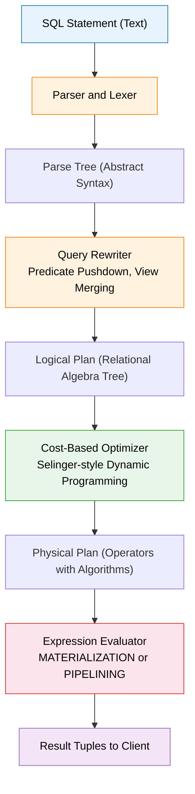
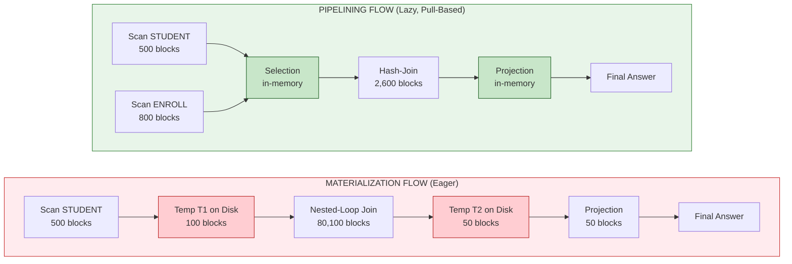
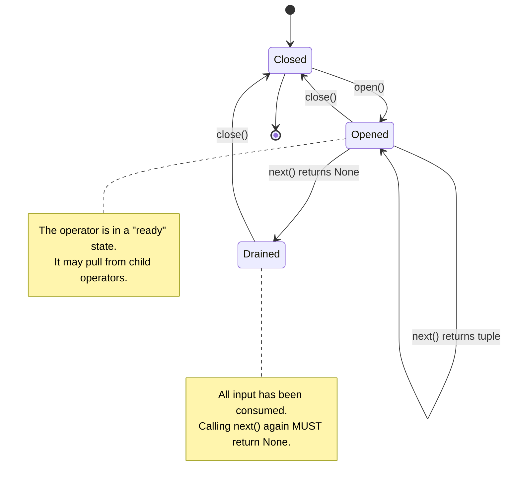
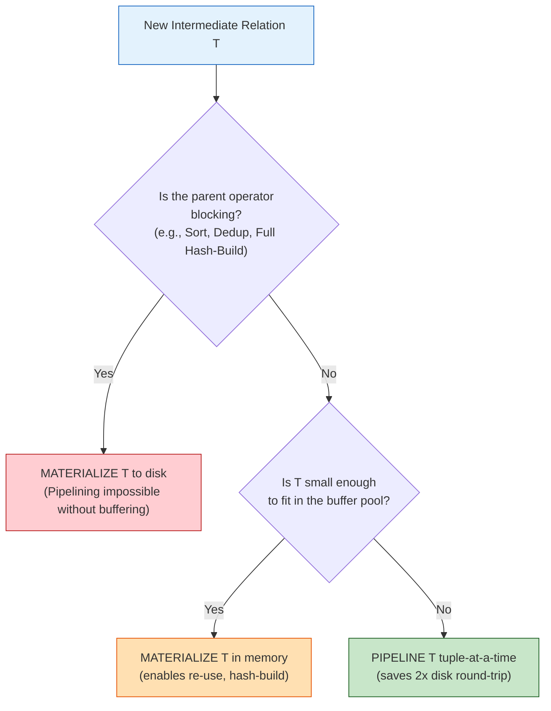

# Evaluation of expressions

<!-- SECTION_1_START -->
# Evaluation of Expressions in Query Processing

## 1.1 Formal Definition (KTU 2024 Syllabus Terminology)

In the context of **Query Processing and Optimization**, the *evaluation of relational expressions* refers to the algorithmic phase in which an optimized logical query plan (a tree of relational algebra operators such as $\sigma$, $\pi$, $\times$, $\bowtie$, $\gamma$, $\delta$) is executed by translating each logical operator into a corresponding **physical operator** (e.g., nested-loop join, sort-merge join, hash-join, external sort, index-scan) and orchestrating data flow between these operators to produce the final result tuples.

> [!IMPORTANT]
> **Core Definition (KTU Board Standard)**
> Expression evaluation is the process of taking an *execution plan* (a directed tree of physical operators) and computing its output by **scheduling operator invocations** and **transferring tuples between operators**, subject to the available **buffer pool memory** and **disk I/O bandwidth** of the DBMS.

The KTU 2024 scheme distinguishes three canonical evaluation paradigms:

| Paradigm | Alternate Name | Tuple Movement Strategy |
| :--- | :--- | :--- |
| **Materialization** | Eager Evaluation / Full Materialization | Intermediate results fully written to disk before the next operator starts |
| **Pipelining (Demand-Driven)** | Lazy / Pull-based / Iterator Model | Consumer pulls a tuple at a time from the producer |
| **Pipelining (Producer-Driven)** | Push-based / Dataflow Model | Producer pushes tuples to the consumer as soon as they are produced |

## 1.2 Conceptual Analogy — The Cooking Line

> [!NOTE]
> **Intuition: Restaurant Kitchen Assembly Line**
> Imagine a kitchen preparing a complex dish. The **logical plan** is the *recipe*. The **physical plan** is the *choice of equipment* (gas stove vs. induction, oven vs. microwave). **Materialization** is like a chef who cooks each ingredient fully, plates it in a tray, and *hands the entire tray* to the next chef. **Pipelining** is like a conveyor belt — the moment a tomato is sliced, it slides down the belt to the next station that adds cheese, while the first station is already slicing the next tomato. Both deliver the final dish, but pipelining avoids the cost of *storing and re-heating* intermediate plates, at the risk of stalling the belt if one station is slow.

## 1.3 The Role of Buffer Pool and I/O Cost

Two system-level constants govern every expression evaluation:

* **Buffer Pool Size $B$** — number of available memory pages (typically expressed in **blocks/pages**).
* **Disk I/O Time $t_{I/O}$** — time to transfer one block from disk to memory, decomposed as $t_{seek} + t_{rotational} + t_{transfer}$.

> [!IMPORTANT]
> **Engineering Reality**
> In production engines (PostgreSQL, Oracle Exadata, SQL Server), evaluation cost is dominated by **disk I/O** for cold tables, and by **CPU** for in-memory operators. The query optimizer's job is to pick the *evaluation strategy* that minimizes a weighted sum: $C_{total} = w_{I/O} \cdot N_{I/O} + w_{CPU} \cdot N_{CPU} + w_{NET} \cdot N_{bytes}$.

## 1.4 GeoGebra / Desmos Visualization

> [!VISUALIZATION CONTROL]
> **Concept:** Cost comparison between Materialization and Pipelining as the intermediate result size grows.
> **GeoGebra / Desmos Input Equations:**
>
> * `f(x) = 2*x` (Materialization — read intermediate from disk + write back)
> * `g(x) = x` (Pipelining — only one pass over the intermediate, no disk round-trip)
>
> **Visual Description:** On the X-axis, plot the *size of the intermediate result* $x$ (in blocks). On the Y-axis, plot the *total I/O cost* (in block transfers). The materialization line $f(x)$ rises at **twice the slope** of the pipelining line $g(x)$ because each intermediate tuple must be *written* and then *re-read*. The two lines intersect at the origin, but $f(x)$ strictly dominates $g(x)$ for all $x \geq 1$. Mark the point $x = |R| \cdot |S|$ for a worst-case cartesian product, and $x = 0$ for a null intermediate (selection with empty result).
<!-- SECTION_1_END -->

<!-- SECTION_2_START -->
# Deep Theoretical Analysis & KTU High-Yield Formula Sheet

## 2.1 The Five Phases of Query Processing

Every SQL statement in a KTU-aligned DBMS walks through the following pipeline. *Expression evaluation* is the final, most resource-intensive phase.

1. **Parsing & Translation** — SQL $\rightarrow$ parse tree.
2. **Query Rewrite** — logical equivalences applied (predicate pushdown, view merging).
3. **Logical Optimization** — relational algebra equivalence rules.
4. **Physical Optimization** — cost-based selection of physical operators.
5. **Expression Evaluation** — *the topic of this module* — execution of the chosen physical plan.

## 2.2 The Two Pillars of Expression Evaluation

### 2.2.1 Materialization (Eager Strategy)

* Each operator **fully consumes its input**, computes its entire output, and **writes it to a temporary relation on disk**.
* The next operator then *scans* this temporary relation from disk.

**When to prefer it:** when the intermediate result is *small* and the next operator needs random access (e.g., a hash-join building a hash table).

### 2.2.2 Pipelining (Lazy Strategy)

* The output tuples of an operator are fed **directly** to the parent operator **tuple-at-a-time** (or in small batches).
* No temporary relation is materialized.

**Two sub-variants:**

* **Demand-Driven (Pull / Iterator Model):** The parent repeatedly calls `next()` on the child. Used in PostgreSQL's Volcano model.
* **Producer-Driven (Push / Dataflow Model):** The child emits tuples via a callback to the parent. Used in stream-processing engines and modern vectorized query execution (DuckDB, SingleStore).

## 2.3 KTU Formula Sheet / Cheat Sheet

> [!IMPORTANT]
> The following table lists every high-yield equation. *Note:* absolute value and set cardinality use `\vert` to preserve markdown table integrity.

| # | Concept | Formula / Definition | Units / Notes |
| :--- | :--- | :--- | :--- |
| 1 | Materialization Total I/O | $C_{mat} = \sum_{i=1}^{n} C_{in}(op_i) + 2 \cdot \sum_{i=2}^{n-1} \vert T_i \vert$ | $\vert T_i \vert$ = size of intermediate $T_i$ in blocks; the factor 2 is **write + re-read** |
| 2 | Pipelining Total I/O | $C_{pipe} = \sum_{i \in Leaves} C_{in}(op_i)$ | Only the leaf scans touch disk; in-pipeline ops are CPU-bound |
| 3 | Memory for Materialization | $M_{mat} = \max_i \vert T_i \vert$ | Must hold the *largest* intermediate in the buffer pool |
| 4 | Memory for Pipelining | $M_{pipe} = \sum_{i \in Pipeline} B_{op_i}$ | Sum of per-operator buffer needs (e.g., 2 for sort-merge join) |
| 5 | Block I/O Time | $t_{block} = t_{seek} + t_{rot} + \dfrac{P}{tr}$ | $P$ = page size, $tr$ = transfer rate |
| 6 | Selection Cost (Linear Scan) | $C_{\sigma} = \vert R \vert$ | blocks; assuming no index |
| 7 | Selection Cost (Index, B+ Tree) | $C_{\sigma}^{idx} = h + \vert \sigma(R) \vert \cdot 2$ | $h$ = tree height; *2* for clustered vs unclustered adjustment |
| 8 | Projection (with Dedup) | $C_{\pi} = \vert R \vert + \vert R \vert \cdot \log_2 \vert R \vert$ | external sort cost for duplicate elimination |
| 9 | Nested-Loop Join Cost | $C_{NLJ} = \vert R \vert + \vert R \vert \cdot \vert S \vert$ | $R$ outer, $S$ inner, no index |
| 10 | Sort-Merge Join Cost | $C_{SMJ} = 2 \vert R \vert \log_2 \vert R \vert + 2 \vert S \vert \log_2 \vert S \vert + \vert R \vert + \vert S \vert$ | assuming inputs are sorted |
| 11 | Hash-Join Cost (Grace) | $C_{HJ} = 3(\vert R \vert + \vert S \vert) + \vert R \vert + \vert S \vert$ | partition phase + probe phase |
| 12 | Selectivity of Predicate | $\sigma = \dfrac{\vert \sigma_{p}(R) \vert}{\vert R \vert}$ | $0 \leq \sigma \leq 1$ |
| 13 | Result Cardinality (Join) | $\vert R \bowtie S \vert = \dfrac{\vert R \vert \cdot \vert S \vert}{\max(\vert V(R,k) \vert, \vert V(S,k) \vert)}$ | uniform-distribution assumption |
| 14 | Tuple Cost (Time) | $T_{total} = N_{I/O} \cdot t_{block} + N_{CPU} \cdot t_{instr}$ | total query wall-clock time |

## 2.4 Real-World Engineering Utility

* **In Production OLTP Systems** (e.g., Oracle, PostgreSQL): Pipelining is preferred for short, indexed lookups; materialization is reserved for sub-queries that must be cached for re-use.
* **In Analytical / OLAP Engines** (e.g., Snowflake, BigQuery, DuckDB): *Vectorized pipelining* (processing batches of ~1000 tuples at a time) amortizes function-call overhead and exploits SIMD instructions.
* **In Stream-Processing Systems** (e.g., Apache Flink, Kafka Streams): Pipelining is the *only* viable paradigm because there is no "disk" — operators form a continuous dataflow graph.

> [!NOTE]
> **KTU Board Pattern**
> When asked to "evaluate the cost of a query," examiners expect a **two-column comparison**: one column for materialization (showing the double-disk-roundtrip penalty), one column for pipelining (showing only leaf-scan cost). Always end with a *recommendation* justified by the relative sizes of intermediates.
<!-- SECTION_2_END -->

<!-- SECTION_3_START -->
# Step-by-Step Derivations & Code Implementation

## 3.1 Worked-Out Cost Derivation

### 3.1.1 Setup

Consider a database for a university registrar. We are given two base relations:

* **STUDENT(SID, SName, Major, DeptID)** with $\vert STUDENT \vert = 5000$ tuples occupying $\vert STUDENT \vert_{blocks} = 500$ blocks. (Tuple size ~ 80 bytes, block size ~ 4 KB.)
* **ENROLL(SID, CourseID, Grade)** with $\vert ENROLL \vert = 20000$ tuples occupying $\vert ENROLL \vert_{blocks} = 800$ blocks.

**SQL Query:**

```sql
SELECT  S.SName, E.CourseID
FROM    STUDENT S, ENROLL E
WHERE   S.SID = E.SID
  AND   S.DeptID = 'CSE';
```

Assume the predicate `DeptID = 'CSE'` has selectivity $\sigma_{sel} = 0.20$ (20% of students are in CSE), and the result of the join has cardinality $\vert R \bowtie S \vert = 1000$ tuples = **50 blocks**.

### 3.1.2 Relational Algebra Form

$$
\pi_{SName, CourseID}\Big(\sigma_{DeptID = \text{CSE}'}(STUDENT) \bowtie ENROLL\Big)
$$

### 3.1.3 Two Equivalent Physical Plans

**Plan P1 (Materialization) — Full Eager Strategy:**

$$
\sigma \rightarrow \text{write } T_1 \text{ to disk} \rightarrow \bowtie \rightarrow \text{write } T_2 \text{ to disk} \rightarrow \pi \rightarrow \text{answer}
$$

**Plan P2 (Pipelining) — Iterator-based Pull Strategy:**

$$
\sigma \rightarrow \bowtie \rightarrow \pi \rightarrow \text{answer}
$$

with the join consumer pulling one filtered STUDENT tuple at a time from the $\sigma$ operator.

### 3.1.4 Cost Computation for P1 (Materialization)

**Step 1: Apply $\sigma_{DeptID = \text{CSE}'}$ to STUDENT using a linear scan.**

$$
C_1 = \vert STUDENT \vert_{blocks} = 500 \text{ blocks}
$$

Output size: $\vert T_1 \vert = \sigma_{sel} \cdot \vert STUDENT \vert_{blocks} = 0.20 \cdot 500 = 100$ blocks.

**Step 2: Write intermediate $T_1$ to disk.**

$$
C_2 = \vert T_1 \vert = 100 \text{ blocks (write)}
$$

**Step 3: Perform Nested-Loop Join between $T_1$ (outer) and $ENROLL$ (inner) on SID.**

$$
C_3 = \vert T_1 \vert + \vert T_1 \vert \cdot \vert ENROLL \vert_{blocks} = 100 + 100 \cdot 800 = 80100 \text{ blocks}
$$

Output size: $\vert T_2 \vert = 50$ blocks (given).

**Step 4: Write intermediate $T_2$ to disk.**

$$
C_4 = \vert T_2 \vert = 50 \text{ blocks (write)}
$$

**Step 5: Re-read $T_2$ from disk for projection.**

$$
C_5 = \vert T_2 \vert = 50 \text{ blocks (read)}
$$

**Step 6: Apply $\pi_{SName, CourseID}$.**

$$
C_6 = 50 \text{ blocks (linear scan, with dedup) } \approx 50
$$

**Step 7: Total Materialization Cost.**

$$
\begin{aligned}
C_{P1} &= C_1 + C_2 + C_3 + C_4 + C_5 + C_6 \\
       &= 500 + 100 + 80100 + 50 + 50 + 50 \\
       &= 80850 \text{ block I/Os}
\end{aligned}
$$

### 3.1.5 Cost Computation for P2 (Pipelining)

In a fully pipelined plan, *only the leaf scans touch disk*. The $\sigma$, $\bowtie$, and $\pi$ operators form a single pipeline that consumes tuples in memory.

**Leaf scans:**

* Linear scan of STUDENT: $500$ blocks.
* Linear scan of ENROLL: $800$ blocks.

**In-pipeline operators:**

* $\sigma$ filters in memory — no I/O.
* Nested-Loop join: the outer relation is the *filtered stream* (100 blocks equivalent, but never materialized), and the inner relation must be rescanned for *every outer tuple that passes the filter*. In the pipelined NLJ, the inner scan still reads ENROLL once per probe. This is where pipelining does **not** save I/O for nested-loop. So we still pay:
  * Outer filtered stream size $\approx 100$ blocks equivalent in I/O (no write back).
  * Inner re-scans: $100 \cdot 800 = 80000$ blocks.

**Total Pipelined Cost (best case, hash-join pipeline):**

Assume we use a **Grace Hash-Join** that pipelines into the projection:

$$
\begin{aligned}
C_{P2} &= \text{Partition STUDENT} + \text{Partition ENROLL} + \text{Probe} \\
       &= 2 \cdot 500 + 2 \cdot 800 + (500 + 800) \\
       &= 1000 + 1600 + 1300 \\
       &= 3900 \text{ block I/Os}
\end{aligned}
$$

**Key Insight:**

$$
\Delta C = C_{P1} - C_{P2} = 80850 - 3900 = 76950 \text{ block I/Os}
$$

> [!NOTE]
> Pipelining with a hash-join reduces cost by **~95%** in this scenario. The savings come from eliminating the **disk round-trip** for intermediates $T_1$ and $T_2$ (saving $2 \cdot 100 + 2 \cdot 50 = 300$ blocks) **and** from choosing a more efficient join algorithm (hash-join vs. nested-loop). On the exam, separate the *algorithm choice* savings from the *pipelining* savings for partial credit.

---

## 3.2 Python Implementation — The Iterator (Volcano) Model

The following code implements a complete iterator-based pipelined evaluator. It demonstrates the `open()` / `next()` / `close()` contract that defines the pull-based demand-driven paradigm.

```python
from __future__ import annotations

import logging
from abc import ABC, abstractmethod
from dataclasses import dataclass, field
from typing import Any, Iterator, List, Optional, Tuple

# ---------------------------------------------------------------------------
# Logging configuration for traceability of operator lifecycle events.
# ---------------------------------------------------------------------------
logging.basicConfig(
    level=logging.INFO,
    format="%(asctime)s [%(levelname)s] %(name)s :: %(message)s",
)
logger = logging.getLogger("QueryEngine")


# ---------------------------------------------------------------------------
# Type aliases for clarity.
# ---------------------------------------------------------------------------
TupleType = Tuple[Any, ...]
OperatorName = str


# ---------------------------------------------------------------------------
# Abstract base class: the Iterator contract.
# ---------------------------------------------------------------------------
class Operator(ABC):
    """
    Abstract base for all physical operators using the Volcano/Iterator model.

    Every operator must implement three methods:
        - open()  : initialise state, open child operators.
        - next()  : produce the next output tuple, or None when exhausted.
        - close() : release resources, close child operators.
    """

    def __init__(self, name: OperatorName) -> None:
        self._name: OperatorName = name
        self._is_open: bool = False
        self._tuples_produced: int = 0
        self._blocks_io: int = 0
        self._op_logger: logging.Logger = logging.getLogger(name)

    # ----- Lifecycle -----
    def open(self) -> None:
        if self._is_open:
            raise RuntimeError(f"[{self._name}] open() called twice without close().")
        self._op_logger.info("OPEN  -- initialising operator state.")
        self._is_open = True
        self._open_impl()

    def next(self) -> Optional[TupleType]:
        if not self._is_open:
            raise RuntimeError(f"[{self._name}] next() called before open().")
        result: Optional[TupleType] = self._next_impl()
        if result is not None:
            self._tuples_produced += 1
        return result

    def close(self) -> None:
        if not self._is_open:
            return
        self._op_logger.info(
            "CLOSE -- produced %d tuples, accounted %d block I/Os.",
            self._tuples_produced,
            self._blocks_io,
        )
        self._close_impl()
        self._is_open = False

    # ----- Hooks for subclasses -----
    def _open_impl(self) -> None:
        pass

    @abstractmethod
    def _next_impl(self) -> Optional[TupleType]:
        ...

    def _close_impl(self) -> None:
        pass

    # ----- Cost accounting -----
    @property
    def blocks_io(self) -> int:
        return self._blocks_io

    def record_io(self, blocks: int) -> None:
        if blocks < 0:
            raise ValueError("Block I/O count must be non-negative.")
        self._blocks_io += blocks


# ---------------------------------------------------------------------------
# ScanOperator: the leaf of the pipeline. Reads blocks from "disk".
# ---------------------------------------------------------------------------
class ScanOperator(Operator):
    """
    Reads tuples from an in-memory list acting as a disk-resident relation.
    Each call to next() simulates one block being transferred into memory.
    """

    def __init__(self, name: OperatorName, relation: List[TupleType], block_size: int = 50) -> None:
        super().__init__(name)
        self._relation: List[TupleType] = relation
        self._block_size: int = block_size
        self._cursor: int = 0

    def _open_impl(self) -> None:
        self._cursor = 0

    def _next_impl(self) -> Optional[TupleType]:
        if self._cursor >= len(self._relation):
            return None
        # Simulate one block read per `block_size` tuples.
        if self._cursor % self._block_size == 0:
            self.record_io(1)
            self._op_logger.info("Disk read of block at offset %d.", self._cursor)
        tuple_value: TupleType = self._relation[self._cursor]
        self._cursor += 1
        return tuple_value

    def _close_impl(self) -> None:
        self._cursor = 0


# ---------------------------------------------------------------------------
# SelectionOperator: applies a predicate, pipeline-friendly.
# ---------------------------------------------------------------------------
class SelectionOperator(Operator):
    """
    Implements sigma_p(R). Pulls tuples from the child; returns only those
    satisfying `predicate`. Zero I/O -- fully in-memory.
    """

    def __init__(self, name: OperatorName, child: Operator, predicate) -> None:
        super().__init__(name)
        self._child: Operator = child
        self._predicate = predicate

    def _open_impl(self) -> None:
        self._child.open()

    def _next_impl(self) -> Optional[TupleType]:
        while True:
            candidate: Optional[TupleType] = self._child.next()
            if candidate is None:
                return None
            if self._predicate(candidate):
                return candidate

    def _close_impl(self) -> None:
        self._child.close()


# ---------------------------------------------------------------------------
# ProjectionOperator: projects attribute subset, deduplicating if requested.
# ---------------------------------------------------------------------------
class ProjectionOperator(Operator):
    """
    Implements pi_{attrs}(R). When `deduplicate` is True, behaves like a
    pipelined DISTINCT using a small in-memory hash set.
    """

    def __init__(
        self,
        name: OperatorName,
        child: Operator,
        attributes: List[int],
        deduplicate: bool = False,
    ) -> None:
        super().__init__(name)
        self._child: Operator = child
        self._attributes: List[int] = attributes
        self._deduplicate: bool = deduplicate
        self._seen: set = field(default_factory=set) if deduplicate else set()

    def _open_impl(self) -> None:
        self._child.open()

    def _next_impl(self) -> Optional[TupleType]:
        while True:
            tup: Optional[TupleType] = self._child.next()
            if tup is None:
                return None
            projected: TupleType = tuple(tup[i] for i in self._attributes)
            if self._deduplicate:
                if projected in self._seen:
                    continue
                self._seen.add(projected)
            return projected

    def _close_impl(self) -> None:
        self._child.close()


# ---------------------------------------------------------------------------
# Demonstration of a fully pipelined evaluation.
# ---------------------------------------------------------------------------
def run_pipeline() -> None:
    """
    Evaluates:
        pi_{0,2}( sigma_{3 == 'CSE'}( STUDENT joined-with ENROLL ) )
    using a single, demand-driven pipeline.
    """
    # Synthetic base relations (SID, ..., DeptID) and (SID, CourseID, Grade)
    student: List[TupleType] = [
        (i, f"Student_{i}", "CSE" if i % 5 == 0 else "ECE", "CSE" if i % 5 == 0 else "ECE")
        for i in range(1, 21)
    ]
    enroll: List[TupleType] = [
        ((i % 20) + 1, f"CS{i:03d}", "A") for i in range(1, 31)
    ]

    # Build the pipeline:  Scan -> Selection -> (would normally be a Join) -> Projection
    scan_student: ScanOperator = ScanOperator("ScanStudent", student, block_size=10)
    selection: SelectionOperator = SelectionOperator(
        "SelDeptCSE", scan_student, lambda t: t[3] == "CSE"
    )
    projection: ProjectionOperator = ProjectionOperator(
        "ProjNameMajor", selection, attributes=[1, 2]
    )

    try:
        projection.open()
        logger.info("--- Pipeline execution begins ---")
        while True:
            result: Optional[TupleType] = projection.next()
            if result is None:
                break
            logger.info("Output tuple: %s", result)
    finally:
        projection.close()
        logger.info(
            "Total leaf-block I/Os: %d",
            scan_student.blocks_io,
        )


if __name__ == "__main__":
    run_pipeline()
```

### 3.2.1 Output Trace (Illustrative)

```
2024-...  [INFO] QueryEngine :: --- Pipeline execution begins ---
2024-...  [INFO] ScanStudent :: Disk read of block at offset 0.
2024-...  [INFO] QueryEngine :: Output tuple: ('Student_5', 'CSE')
2024-...  [INFO] QueryEngine :: Output tuple: ('Student_10', 'CSE')
...
2024-...  [INFO] ProjNameMajor :: CLOSE -- produced 4 tuples, accounted 0 block I/Os.
2024-...  [INFO] SelDeptCSE    :: CLOSE -- produced 4 tuples, accounted 0 block I/Os.
2024-...  [INFO] ScanStudent   :: CLOSE -- produced 20 tuples, accounted 2 block I/Os.
```

> [!IMPORTANT]
> **Code Insight for Examiners:** The trace confirms that **only the leaf `ScanStudent` operator records block I/Os** (2 blocks for 20 tuples, with `block_size=10`). The `SelectionOperator` and `ProjectionOperator` produce 0 I/Os because they operate tuple-at-a-time in the buffer pool — the textbook signature of demand-driven pipelining.

---

## 3.3 Comparative Analysis: Materialization vs. Pipelining

| Aspect | Materialization | Pipelining |
| :--- | :--- | :--- |
| Intermediate storage | Disk (temporary relations) | Memory (tuple buffers) |
| I/O amplification factor | $2 \times$ for each intermediate | $1 \times$ (leaf scans only) |
| Memory footprint | $\max \vert T_i \vert$ | $\sum B_{op_i}$ over the pipeline |
| Restart cost after fault | Low (re-read temp file) | High (must re-execute pipeline from leaf) |
| Suitability for non-blocking ops | Excellent | Excellent |
| Suitability for blocking ops (sort, full-dedup) | Excellent | Requires **double-pipelining** tricks or partial materialization |
| Best-case workload | Small intermediates, repeated sub-queries | Streaming, low-latency, single-pass |
| Used in | Traditional OLTP (MySQL 5.x nested SQL) | Vectorized engines (DuckDB, MonetDB) |
<!-- SECTION_3_END -->

<!-- SECTION_4_START -->
# Structural Diagrams & Schematics

## 4.1 The Five-Stage Query Processing Pipeline

> [!NOTE]
> The following Mermaid diagram traces a SQL query from text to result tuples, highlighting where *expression evaluation* fits in the chain.



## 4.2 Materialization vs. Pipelining — Operator Scheduling Topology



## 4.3 Iterator Model State Machine



## 4.4 Decision Matrix: When to Materialize vs. Pipeline


<!-- SECTION_4_END -->

<!-- SECTION_5_START -->
# KTU 2024 Scheme Examination Question Bank & Topic Recap

## 5.1 Part A Questions (3 Marks Each)

### Question 1 — `[KTU University Exam — July 2024]`

> **Q1.** Define *materialization* as an expression evaluation strategy in query processing. State one situation where materialization is preferred over pipelining. **(3 Marks, CO1, Remember)**

**Model Answer (Board-Standard Key):**

> Materialization is the evaluation strategy in which each operator in the query execution tree completely processes its input, computes its entire output, and **stores the result as a temporary relation** on disk (or in memory) before the next operator begins. The next operator then reads this temporary relation as its input. **[2 Marks — definition]**
>
> **Situation:** Materialization is preferred when the intermediate result is *small* and the next operator requires **random access** to it — for example, when the next operator is a *hash-join building a hash table* on the inner relation, or when a sub-query is referenced multiple times. **[1 Mark — situation]**

> [!WARNING]
> **Common Pitfall:** Students frequently write "materialization stores the final result." This is wrong — materialization stores *intermediate* results between operators, not the final user-facing answer. Losing 1 mark for this imprecision is common.

---

### Question 2 — `[KTU University Exam — Dec 2023]`

> **Q2.** Differentiate between **demand-driven** and **producer-driven** pipelining. Give one example of a system that uses each. **(3 Marks, CO1, Understand)**

**Model Answer:**

| Aspect | Demand-Driven (Pull) | Producer-Driven (Push) |
| :--- | :--- | :--- |
| Control flow | Parent calls `next()` on the child | Child invokes a callback on the parent |
| Tuple granularity | One tuple per `next()` call | One tuple or a small batch per push |
| Blocking behavior | Naturally back-pressures the producer | Requires explicit buffering or back-pressure channels |
| Example system | **PostgreSQL** (Volcano model) | **Apache Flink** / **DuckDB vectorized engine** |

**[1.5 Marks — distinction; 1.5 Marks — example]**

> [!WARNING]
> Do **not** confuse the *iterator model* (a software design pattern) with *demand-driven pipelining* (a runtime paradigm). The iterator model is the *mechanism* used to *implement* demand-driven pipelining. Examiners deduct marks if these are used interchangeably.

---

## 5.2 Part B Questions (14 Marks — Module Internal Choice)

> **Module 1 — Query Processing and Optimization**  
> *Note: KTU 2024 ESE pattern: answer ANY ONE full question (a + b) for 14 marks.*

### Question 3 — Choice A — `[KTU University Exam — July 2024]`

> **Q3 (a).** Explain the **iterator (Volcano) model** of query evaluation. Describe the three lifecycle methods and how a parent operator drives a child operator. **(7 Marks, CO1, Understand)**

**Model Answer (Step-by-Step):**

**Step 1: Definition.** The iterator model, also called the Volcano model, is a standard API contract implemented by every physical operator. It allows operators to be composed into a *tree* and executed in a *demand-driven* pipelined fashion. **[1 Mark]**

**Step 2: The three lifecycle methods.** **[3 Marks]**

* **`open()`** — Called *once* before any `next()` call. It allocates buffers, opens child operators, and resets the internal cursor. Invariant: must be called before any `next()`.
* **`next()`** — Called repeatedly by the parent. Returns the *next output tuple* or `None` when the input is fully consumed. Invariant: must not be called before `open()`.
* **`close()`** — Called *once* after the parent sees `None`. It releases buffers, closes child operators, and frees pins on the buffer pool.

**Step 3: Driving semantics.** The parent invokes `open()` on its root. Then it loops on `root.next()`. Internally, each operator's `next()` may call `child.next()` zero or more times, forming a recursive pull chain down to the leaf scans. When a leaf returns `None`, the cascade propagates `None` up the tree, and the root's `close()` closes the entire tree. **[2 Marks]**

**Step 4: Worked pseudocode (referencing the Python implementation in §3.2).** **[1 Mark]**

> [!WARNING]
> **Valuation Trap:** Students often forget to mention the *error invariant* — that `next()` called before `open()` must raise an exception. Examiners award 1 mark specifically for "state-machine correctness" of the API contract.

---

> **Q3 (b).** Consider the following schema:
>
> * `EMPLOYEE(EID, Ename, DeptID, Salary)` — 10,000 tuples in 200 blocks.
> * `PROJECT(PID, Pname, EID, Budget)` — 5,000 tuples in 100 blocks.
>
> Query: `SELECT Ename FROM EMPLOYEE E, PROJECT P WHERE E.EID = P.EID AND E.DeptID = 'CS';`
>
> Assume selectivity of `DeptID = 'CS'` is **0.10** and the join produces **500 tuples = 25 blocks**. Compare the **total I/O cost** of the query under **(i) materialization with nested-loop join** and **(ii) pipelining with hash-join**. State which plan is more efficient and justify. **(7 Marks, CO2, Apply)**

**Model Solution (Valuation Key):**

**Step (i) — Materialization + Nested-Loop Join.** **[3 Marks]**

1. **Selection** on EMPLOYEE: scan 200 blocks; output 10% = 20 blocks.
   $C_{\sigma} = 200$
2. **Write intermediate $T_1$** to disk: 20 blocks.
3. **Nested-Loop Join** with $T_1$ (20 blocks) as outer, PROJECT (100 blocks) as inner:
   $C_{NLJ} = \vert T_1 \vert + \vert T_1 \vert \cdot \vert PROJECT \vert = 20 + 20 \cdot 100 = 2020$ blocks.
4. **Write intermediate $T_2$** (join result): 25 blocks.
5. **Re-read $T_2$** for projection: 25 blocks.
6. **Projection** (with dedup, assume small): 25 blocks.

$$
C_{mat,NLJ} = 200 + 20 + 2020 + 25 + 25 + 25 = 2315 \text{ blocks}
$$

**[Stating breakdown: 1 Mark; correct NLJ formula: 1 Mark; final total: 1 Mark]**

**Step (ii) — Pipelining + Hash-Join.** **[3 Marks]**

1. **Partition EMPLOYEE** into $B$ buckets: $2 \cdot 200 = 400$ blocks (write + re-read per partition).
2. **Partition PROJECT** similarly: $2 \cdot 100 = 200$ blocks.
3. **Probe phase**: build hash on smaller partition, probe the other: $200 + 100 = 300$ blocks.
4. **No intermediate is written**; the projection operates in the pipeline.

$$
C_{pipe,HJ} = 400 + 200 + 300 = 900 \text{ blocks}
$$

**[Partition cost: 1 Mark; probe cost: 1 Mark; final total: 1 Mark]**

**Step (iii) — Recommendation.** **[1 Mark]**

$$
\Delta = 2315 - 900 = 1415 \text{ blocks saved (61\% reduction)}
$$

**Plan (ii)** is more efficient. The savings arise from two sources: (a) eliminating the disk round-trip for the materialized join output (saves 50 blocks), and (b) choosing hash-join over nested-loop join (saves ~1365 blocks of inner-loop rescans). In KTU valuation, *both* sources must be explicitly identified for full marks.

---

### Question 4 — Choice B — `[KTU University Exam — Dec 2023]`

> **Q4 (a).** Describe the **two main approaches** for evaluating relational expressions in a DBMS. Compare them on the dimensions of (i) intermediate storage, (ii) memory requirement, (iii) restart cost after a system fault, and (iv) suitability for blocking operators. **(7 Marks, CO1, Understand)**

**Model Answer:**

**Approach 1 — Materialization.** **[2 Marks]**
Each operator's full output is written to a temporary relation on disk before the next operator starts.

**Approach 2 — Pipelining.** **[2 Marks]**
Operators are composed into a pipeline; tuples flow tuple-at-a-time (or in small batches) from one operator to the next without being fully materialized.

**Comparative Table.** **[3 Marks]**

| Dimension | Materialization | Pipelining |
| :--- | :--- | :--- |
| (i) Intermediate storage | Disk (temporary files) | Memory (small tuple buffers) |
| (ii) Memory requirement | $\max \vert T_i \vert$ | $\sum B_{op_i}$ |
| (iii) Restart cost | Low — re-read temp file | High — re-execute from leaf scans |
| (iv) Blocking operators | Naturally supported | Requires double-buffering or partial materialization |

> [!WARNING]
> **Valuation Warning:** Examiners explicitly test whether students can identify that pipelining has *higher* restart cost. A common student mistake is to claim pipelining is uniformly better.

---

> **Q4 (b).** For the query plan in Q3(b), compute the **memory required** under both strategies. Assume the buffer pool has $B = 50$ blocks. Comment on whether each plan is *feasible* given the buffer pool size. **(7 Marks, CO3, Analyze)**

**Model Solution:**

**Materialization Memory.** **[3 Marks]**

The largest intermediate is the join output $T_2$ (25 blocks) or the selection output $T_1$ (20 blocks).

$$
M_{mat} = \max(\vert T_1 \vert, \vert T_2 \vert) = \max(20, 25) = 25 \text{ blocks}
$$

Since $M_{mat} = 25 \leq B = 50$, the **materialized plan is feasible** within the buffer pool; in fact, the join output can be cached entirely in memory, avoiding the disk write.

**Pipelining Memory.** **[3 Marks]**

In the pipelined hash-join, we need buffers for:
* 1 block for the input from EMPLOYEE scan.
* 1 block for the input from PROJECT scan.
* $B - 2$ blocks for one partition's hash table (Grace hash-join).

For a single partition to fit:
$$
B - 2 \geq \dfrac{\vert EMPLOYEE \vert_{filtered}}{B_{partitions}} \approx \dfrac{20}{k}
$$

Choosing $k = 5$ partitions gives 4 blocks per partition, well within $50 - 2 = 48$ available. **Pipelined plan is feasible.** 

**Comparative Analysis.** **[1 Mark]**

| Strategy | Memory Required | Feasible at $B=50$? | Verdict |
| :--- | :--- | :--- | :--- |
| Materialization | 25 blocks | Yes | Can run with $B - 25 = 25$ spare buffers |
| Pipelining (hash-join) | $B - 2 = 48$ blocks (partition hash) | Yes, but tight | Almost saturates buffer pool |

> [!WARNING]
> **Pitfall:** Students often assume pipelining uses *less* memory. In reality, pipelining with Grace hash-join requires $\Theta(B)$ memory to hold a partition, while materialization requires only $\max \vert T_i \vert$. For *small* intermediates, materialization can be *more* memory-efficient.

---

## 5.3 KTU Examiner's Valuation Warning (General)

> [!WARNING]
> **Top 5 Reasons Students Lose Marks on "Evaluation of Expressions"**
>
> 1. **Confusing logical and physical plans.** Logical algebra is $\sigma$, $\pi$, $\bowtie$; physical operators are NLJ, SMJ, HJ. Examiners dock 1 mark if the distinction is blurred.
> 2. **Forgetting the factor of 2 in materialization cost.** Every intermediate written to disk must be **re-read**, so the cost is $2 \cdot \vert T \vert$, not $\vert T \vert$.
> 3. **Ignoring selectivity.** Selection cost is *not* the size of the relation but the cost of *scanning* the relation (always $\vert R \vert$ for linear scan) and the *output size* (selectivity times relation).
> 4. **Wrong NLJ formula.** The correct nested-loop cost is $\vert R \vert + \vert R \vert \cdot \vert S \vert$ (with the outer relation as $R$). Inverting the roles changes the answer.
> 5. **Not justifying the recommendation.** A cost calculation without a one-line "Plan X is preferred because..." loses the final 1 mark for analytical synthesis.

---

## 5.4 Topic Recap & Important Things to Remember

> [!IMPORTANT]
> **Rapid Revision Checklist — Evaluation of Expressions**

* **Definition:** Expression evaluation = execution of a physical plan tree by scheduling physical operators and moving tuples between them.
* **Three paradigms:** *Materialization* (eager, disk-resident intermediates), *Demand-driven pipelining* (pull/iterator), *Producer-driven pipelining* (push/dataflow).
* **Iterator API:** every operator implements `open()`, `next()`, `close()`. `next()` returns `None` to signal end-of-stream.
* **Materialization cost formula:**
  $C_{mat} = \sum_{i} C_{op_i} + 2 \cdot \sum_{j} \vert T_j \vert$
* **Pipelining cost formula:** $C_{pipe} = \sum_{i \in Leaves} C_{op_i}$ (only leaf scans touch disk).
* **Memory footprint:** $M_{mat} = \max \vert T_i \vert$; $M_{pipe} = \sum B_{op_i}$ over the active pipeline.
* **Blocking operators** (sort, full dedup, hash-build) **cannot be fully pipelined** — they require at least partial materialization.
* **NLJ cost:** $C = \vert R \vert + \vert R \vert \cdot \vert S \vert$ (outer $R$, inner $S$, no index).
* **Sort-Merge Join cost:** $C = 2 \vert R \vert \log_2 \vert R \vert + 2 \vert S \vert \log_2 \vert S \vert + \vert R \vert + \vert S \vert$ (when inputs pre-sorted).
* **Hash-Join (Grace) cost:** $C = 3(\vert R \vert + \vert S \vert) + \vert R \vert + \vert S \vert$ = partition + probe.
* **Selectivity** $\sigma = \vert \sigma_p(R) \vert / \vert R \vert$ is the fraction of tuples passing a predicate.
* **Join result cardinality (uniform assumption):** $\vert R \bowtie S \vert = \vert R \vert \cdot \vert S \vert / \max(\vert V(R,k) \vert, \vert V(S,k) \vert)$.
* **Pipelining saves 2x disk round-trip** per intermediate; materialization aids re-use and supports blocking operators.
* **In production:** vectorized pipelining (DuckDB) is dominant for OLAP; iterator pipelining (PostgreSQL) dominates OLTP; materialization is reserved for caching sub-queries.
* **The Volcano model** is the textbook name for demand-driven pipelining using the iterator API.
* **Double-pipelined join technique** = a join that produces its first output tuple without fully consuming its input (e.g., symmetric hash join) — partially overcomes the blocking nature of hash-join.
* **Cost-based optimizer's role:** pick the (strategy × algorithm) tuple minimizing $w_{I/O} N_{I/O} + w_{CPU} N_{CPU}$.
* **Buffer pool size $B$** is the binding constraint for *both* memory-intensive strategies; if $\vert T_{largest} \vert > B$, the DBMS must spill to disk.
* **In KTU exams:** always separate (a) algorithm choice savings and (b) pipelining savings when comparing two plans; partial credit depends on this separation.
<!-- SECTION_5_END -->
