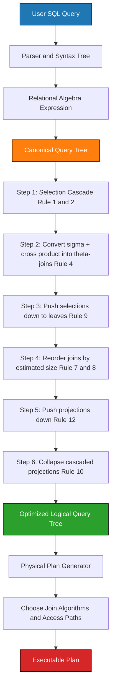
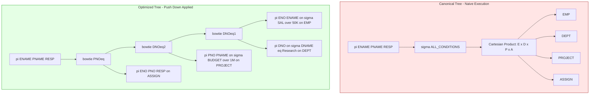
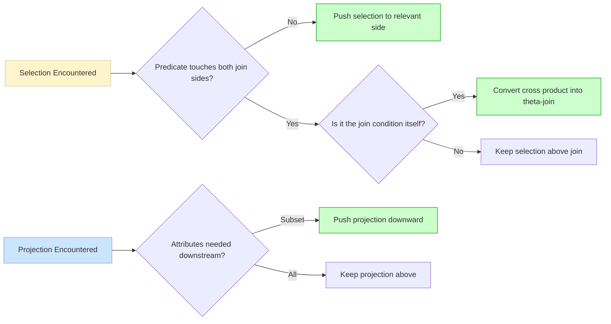
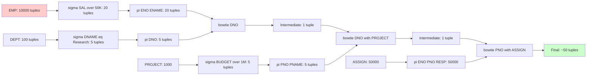
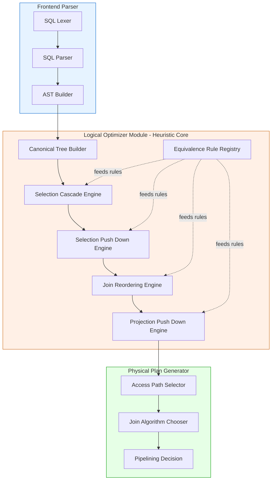

# Heuristics in Query Optimization - Optimization of Relational Algebra expressions

<!-- SECTION_1_START -->
# Heuristics in Query Optimization: Optimization of Relational Algebra Expressions

## Formal Academic Definition (KTU 2024 Scheme Terminology)

**Heuristic Query Optimization** is a cost-independent approach to query processing that applies a fixed set of transformation rules (equivalence rules) on relational algebra expressions to systematically rearrange operations — primarily by **pushing selections and projections downward** toward the base relations — to produce an equivalent but computationally cheaper query tree. It is *rule-based* rather than *cost-based*, meaning it does not require statistical metadata (histograms, selectivity factors, tuple counts) to derive an optimized plan.

> [!IMPORTANT]
> **KTU 2024 Module 1 Anchor Definition:**
> *Heuristic optimization transforms a canonical relational algebra tree into an equivalent tree that is heuristically estimated to execute faster. It primarily reduces the size of intermediate relations by applying the **Selection Push-Down** and **Projection Push-Down** equivalence rules before joins.*

The **canonical query tree** is the *naïve* relational algebra expression written directly from the SQL `WHERE`, `FROM`, and `SELECT` clauses, executed strictly **left-to-right** and **bottom-up**. The **optimized query tree** is the result after applying heuristic equivalence transformations that preserve semantics (i.e., yield the same result set) but reduce the cardinality of intermediate relations.

## Conceptual Analogy / Intuition

Imagine you are the **head chef of a large restaurant kitchen** preparing a complex dish that requires ingredients from three different pantries (Relation A, Relation B, Relation C). The naïve strategy is:

> *"Bring ALL sacks of flour from Pantry A, ALL crates of vegetables from Pantry B, ALL spice boxes from Pantry C to a single prep table, then throw away what we don't need."*

This is **catastrophically wasteful** — you carry massive volumes and discard most of it. The **heuristic optimization strategy** is:

> *"Before moving anything, send a quick assistant to Pantry A and ask for ONLY the unbleached flour (a *selection push-down*). At Pantry B, ask for ONLY the diced carrots (another *selection push-down*). Then carry these small pre-filtered baskets to the prep table, combine them (join), and only at the end slice (projection)."*

The query result is identical, but the volume of intermediate "ingredients" is reduced by orders of magnitude. This is exactly what heuristic optimization does with tuples.

> [!NOTE]
> **Key Insight:** Heuristic optimization is *guaranteed to improve or maintain* performance but is *not guaranteed to find the absolute optimal plan*. For the absolute optimal plan, a **cost-based optimizer** (which estimates I/O, CPU, memory) is required. KTU Module 1 emphasizes the heuristic approach.

## GeoGebra / Desmos Visualization

> [!VISUALIZATION CONTROL]
> **Concept:** Tuple Cardinality Reduction Across a Query Tree (Pipelined Filter Effect)
>
> **GeoGebra / Desmos Input Equations:**
> * $f_{\text{naive}}(x) = 100000$ (constant huge intermediate set)
> * $f_{\text{optimized}}(x) = 50 \cdot x$ where $x \in [0, 10]$
>
> **Visual Description:** Plot both curves. The student should observe the flat horizontal line of the naïve plan representing the full join of three relations (e.g., $10^5 \times 10^5 \times 10^5$ intermediate tuples), contrasted with the gently rising optimized curve where selections have shrunk each base relation first. The **area under each curve** is a conceptual proxy for the total work (I/O cost) the DBMS performs.

## The Two Classes of Optimization (KTU Distinction)

| Strategy | Driver | Requires Statistics? | Output Quality |
|----------|--------|---------------------|----------------|
| **Heuristic (Rule-Based)** | A fixed catalog of equivalence rules | **No** | Good, not always optimal |
| **Cost-Based** | Estimated I/O + CPU cost functions | **Yes** (histograms, $N_R$, $V(A,R)$) | Near-optimal |

> [!TIP]
> Real-world engines like **PostgreSQL (GEQO/Genetic)** and **Oracle (CBO)** use a *hybrid*: heuristics to prune the search space, then cost estimation to pick the best survivor.

---

<!-- SECTION_1_END -->

<!-- SECTION_2_START -->
# Deep Theoretical Analysis & KTU High-Yield Formula Sheet

## The Two-Phase Heuristic Optimization Pipeline

Heuristic optimization in the KTU syllabus is decomposed into two well-defined logical phases. Each phase is applied sequentially, and the output of phase 1 is the input of phase 2.

### Phase 1 — Query Tree Restructuring (Logical Optimization)

This phase transforms the canonical tree using **equivalence-preserving rules** that do not need relation statistics. The major operations are:

1. **Selection Cascade Decomposition** — Break a conjunctive selection ($\sigma_{c_1 \text{ AND } c_2 \text{ AND } \ldots}(R)$) into a cascade of individual selections.
2. **Selection Push-Down** — Move selections as far down the tree as possible, ideally reaching the leaf (base) relations.
3. **Projection Push-Down** — Eliminate unneeded attributes as early as possible, but **only after** all selections and joins that depend on those attributes have been processed.
4. **Join Commutativity & Associativity** — Reorder joins so that smaller intermediate results are joined first.
5. **Selection–Join Commutativity** — Push selections through joins when the selection predicate involves attributes from only one side of the join.
6. **Join–Projection Commutativity** — Push projections past joins when the projection is on join attributes only.

### Phase 2 — Physical Plan Selection (Execution Strategy)

This phase converts the optimized logical tree into an executable plan by choosing physical algorithms:

* **Join Method:** Nested-Loop Join, Sort-Merge Join, or Hash Join.
* **Access Path:** Full Table Scan vs. Index Scan.
* **Materialization vs. Pipelining:** Whether to write intermediate results to disk or stream them.

## The Canonical Equivalence Rules (The "Rule Book")

Let $R$, $S$ be relations; $A$, $B$ be attributes; $c$, $c_1$, $c_2$ be selection conditions; $L$ be a projection list.

### Rule Group 1 — Selection Rules

| # | Rule Name | Formal Expression | Engineering Intuition |
|---|-----------|-------------------|----------------------|
| 1 | Cascade | $\sigma_{c_1 \text{ AND } c_2}(R) \equiv \sigma_{c_1}(\sigma_{c_2}(R))$ | Split a compound filter into sequential filters. |
| 2 | Commutativity | $\sigma_{c_1}(\sigma_{c_2}(R)) \equiv \sigma_{c_2}(\sigma_{c_1}(R))$ | Filter order does not affect the result. |
| 3 | Push-down past selection | (covered by commutativity) | — |

### Rule Group 2 — Selection vs. Cartesian Product / Theta-Join

| # | Rule Name | Formal Expression | Engineering Intuition |
|---|-----------|-------------------|----------------------|
| 4 | Push-down past $\times$ | $\sigma_{c}(R \times S) \equiv \sigma_{c}(R \times S)$ but rewritten as a **theta-join** $R \underset{c}{\bowtie} S$ | A $\sigma$ after $\times$ with join condition $c$ can be **rewritten as a join** — this is the most powerful optimization. |
| 5 | Push-down past union | $\sigma_{c}(R \cup S) \equiv \sigma_{c}(R) \cup \sigma_{c}(S)$ | Filter each operand independently. |
| 6 | Push-down past set difference | $\sigma_{c}(R - S) \equiv \sigma_{c}(R) - S$ (only if $c$ involves only $R$'s attributes) | Cannot push through $-$ if $c$ involves $S$. |

### Rule Group 3 — Selection vs. Join

| # | Rule Name | Formal Expression | Engineering Intuition |
|---|-----------|-------------------|----------------------|
| 7 | Commutativity of $\bowtie$ | $R \bowtie S \equiv S \bowtie R$ | Left/right side of a join is interchangeable. |
| 8 | Associativity of $\bowtie$ | $(R \bowtie S) \bowtie T \equiv R \bowtie (S \bowtie T)$ | Grouping of joins is interchangeable. |
| 9 | Selection–Join Push | $\sigma_{c}(R \bowtie S) \equiv \sigma_{c}(R) \bowtie S$ if $c$ only references $S$ | A selection using only one relation can be pushed entirely to that side. |

### Rule Group 4 — Projection Rules

| # | Rule Name | Formal Expression | Engineering Intuition |
|---|-----------|-------------------|----------------------|
| 10 | Cascade | $\pi_{L_1}(\pi_{L_2}(R)) \equiv \pi_{L_1}(R)$ if $L_1 \subseteq L_2$ | Successive projections collapse. |
| 11 | Push-down past selection | $\pi_{L}(\sigma_{c}(R)) \equiv \sigma_{c}(\pi_{L}(R))$ only if $c$ uses **only** $L$ attributes | Order can flip if predicates are in the projected set. |
| 12 | Push-down past join | $\pi_{L}(R \bowtie S) \equiv \pi_{L}(\pi_{L_R}(R) \bowtie \pi_{L_S}(S))$ | Keep only the attributes needed for the join and the final result. |

## KTU Formula Sheet — Cost Estimation Reference

Although heuristic optimization is *cost-free*, KTU Module 1 also teaches the **cost formulas** that justify *why* the heuristics work. You will be tested on these in numerical questions.

| Symbol | Meaning | Formula |
|--------|---------|---------|
| $B(R)$ | Number of disk blocks holding $R$ | $B(R) = \lceil \vert R \vert / f_R \rceil$ |
| $\vert R \vert$ | Number of tuples in $R$ | — |
| $f_R$ | Blocking factor (tuples per block) | $f_R = \lfloor \text{BlockSize} / \vert \text{tuple} \vert \rfloor$ |
| $V(A, R)$ | Number of distinct values of attribute $A$ in $R$ | — |
| $\sigma_{\text{sel}}$ | Selectivity of a selection on a single attribute | $\sigma_{\text{sel}} = 1 / V(A, R)$ for equality |
| $\vert \sigma_{A=v}(R) \vert$ | Size after equality selection | $\vert R \vert / V(A, R)$ |
| $\vert R \bowtie S \vert$ | Size of natural/equi-join (worst case) | $\vert R \vert \cdot \vert S \vert$ |
| $\vert R \bowtie S \vert$ | Size with common attribute $A$ (estimate) | $\vert R \vert \cdot \vert S \vert / \max(V(A,R), V(A,S))$ |
| $C_{\bowtie}$ | Cost of block nested-loop join | $C_{\bowtie} = B(R) + \vert R \vert \cdot B(S) / (k-1)$ for buffer $k$ |

> [!NOTE]
> **Engineering Utility:** These rules are the algorithmic heart of the query optimizers in PostgreSQL, MySQL, Oracle, and SQL Server. The *relational algebra equivalence rules* were first formalized by **Elmasri & Navathe (Chapter 19)** and **Ullman (1989)**. Modern optimizers combine these with **dynamic programming** (Selinger et al., 1979, System R) to exhaustively search the equivalence-rule space.

## Real-World Engineering Utility

* **OLTP systems** (banking, e-commerce): Heuristic rules run as a *fast first pass* before cost estimation — saves milliseconds on millions of queries.
* **Data Warehouses** (Snowflake, Redshift): Use the **projection push-down** concept at the columnar storage level — only requested columns are read from disk.
* **Spark SQL & Flink**: Implement the *Catalyst* optimizer, which is built directly on **Selection Push-Down**, **Projection Push-Down**, and **Predicate Push-Down** heuristics.

---

<!-- SECTION_2_END -->

<!-- SECTION_3_START -->
# Step-by-Step Derivations & Symbolic Implementation

## Worked Example 1: Full Heuristic Optimization of a Multi-Join Query (Module-Style)

### Given Schema (Standard KTU 5-Relation Schema)

* **EMP**(<u>ENO</u>, ENAME, TITLE, SAL, DNO)
* **DEPT**(<u>DNO</u>, DNAME, MGRENO)
* **PROJECT**(<u>PNO</u>, PNAME, BUDGET, DNO)
* **ASSIGN**(<u>ENO</u>, <u>PNO</u>, RESP, DUR)
* **EMP_DEPENDENT**(<u>ENO</u>, <u>DEP_NAME</u>, RELATION)

### Original SQL Query

```sql
SELECT  E.ENAME, P.PNAME, A.RESP
FROM    EMP E, DEPT D, PROJECT P, ASSIGN A
WHERE   E.DNO  = D.DNO
  AND   D.DNO  = P.DNO
  AND   P.PNO  = A.PNO
  AND   E.SAL  > 50000
  AND   P.BUDGET > 1000000
  AND   D.DNAME = 'Research';
```

### Step 1 — Construct the Canonical Query Tree

The naïve RA expression (bottom-up, no optimization):

$$\pi_{\text{ENAME, PNAME, RESP}}\Big(\sigma_{(E.\text{SAL} > 50000) \,\text{AND}\, (P.\text{BUDGET} > 1000000) \,\text{AND}\, (D.\text{DNAME} = \text{'Research'}) \,\text{AND}\, (E.\text{DNO} = D.\text{DNO}) \,\text{AND}\, (D.\text{DNO} = P.\text{DNO}) \,\text{AND}\, (P.\text{PNO} = A.\text{PNO})}(E \times D \times P \times A)\Big)$$

> **Canonical Tree Structure:** All four base relations at the leaves → Cartesian product (× × ×) → one monolithic selection (σ) → final projection (π).

### Step 2 — Apply Equivalence Rule 1 (Selection Cascade)

Break the conjunctive selection into a cascade of atomic selections.

> *Logic:* A single selection with `AND` of $n$ predicates is semantically identical to a sequential pipeline of $n$ selections, one per predicate. The cascade is a *pre-processing* step that makes the next push-down rule applicable.

$$\pi_{L}\Big(\sigma_{c_1}\big(\sigma_{c_2}\big(\sigma_{c_3}\big(\sigma_{c_4}\big(\sigma_{c_5}\big(\sigma_{c_6}(E \times D \times P \times A)\big)\big)\big)\big)\big)\Big)$$

where $c_1$: $E.\text{SAL}>50000$, $c_2$: $P.\text{BUDGET}>1000000$, $c_3$: $D.\text{DNAME}=\text{'Research'}$, $c_4$: $E.\text{DNO}=D.\text{DNO}$, $c_5$: $D.\text{DNO}=P.\text{DNO}$, $c_6$: $P.\text{PNO}=A.\text{PNO}$.

**[Valuation Key — 1 Mark]** for correctly identifying the six atomic predicates.

### Step 3 — Apply Rule 9 (Selection–Join Commutativity / Theta-Join Rewrite)

Recognize that selections $c_4$, $c_5$, $c_6$ are *equi-join conditions* between pairs of relations. Replace the Cartesian product with theta-joins.

> *Logic:* $\sigma_{E.\text{DNO}=D.\text{DNO}}(E \times D) \;\equiv\; E \underset{E.\text{DNO}=D.\text{DNO}}{\bowtie} D$. This is the **single most important optimization step** because it converts a $O(\vert E \vert \cdot \vert D \vert)$ operation into a $O(\vert E \vert \cdot \vert D \vert / V(\text{DNO}))$ operation.

After rewriting all three $\times$ into $\bowtie$:

$$\pi_{L}\Big(\sigma_{c_1}\big(\sigma_{c_2}\big(\sigma_{c_3}\big(\big((E \underset{c_4}{\bowtie} D) \underset{c_5}{\bowtie} P\big) \underset{c_6}{\bowtie} A\big)\big)\big)\Big)$$

### Step 4 — Apply Rule 9 (Single-Relation Selection Push-Down)

Push $c_1$, $c_2$, $c_3$ down to their respective base relations because each predicate references attributes of **only one** relation.

> *Logic:* If $c$ involves only attributes of $R$, then $\sigma_c(R \bowtie S) \equiv \sigma_c(R) \bowtie S$. This *drastically shrinks* the input to the join.

* $c_1$ ($E.\text{SAL}>50000$) → push to $E$ → $\sigma_{c_1}(E)$
* $c_2$ ($P.\text{BUDGET}>1000000$) → push to $P$ → $\sigma_{c_2}(P)$
* $c_3$ ($D.\text{DNAME}=\text{'Research'}$) → push to $D$ → $\sigma_{c_3}(D)$

**Result after Step 4:**

$$\pi_{L}\Big(\big((\sigma_{c_1}(E) \underset{c_4}{\bowtie} \sigma_{c_3}(D)) \underset{c_5}{\bowtie} \sigma_{c_2}(P)\big) \underset{c_6}{\bowtie} A\Big)$$

**[Valuation Key — 2 Marks]** for correctly identifying which side of each join receives the pushed selection.

### Step 5 — Apply Rule 12 (Projection Push-Down)

Trim attributes as early as possible. Identify the *final needed attributes* first, then work backwards.

Final output needs: $\text{ENAME}$, $\text{PNAME}$, $\text{RESP}$.

Working backward through the joins, each level must retain:

* $E$ level: $\text{ENO}$ (for ASSIGN join), $\text{ENAME}$ (for output)
* $D$ level: $\text{DNO}$ (for PROJECT join)
* $P$ level: $\text{PNO}$ (for ASSIGN join), $\text{PNAME}$ (for output)
* $A$ level: $\text{ENO}$, $\text{PNO}$ (already satisfied), $\text{RESP}$ (for output)

Insert $\pi$ operations just above each leaf:

$$\pi_{L}\Big(\big(\big(\pi_{\text{ENO,ENAME}}\big(\sigma_{c_1}(E)\big) \underset{c_4}{\bowtie} \pi_{\text{DNO}}\big(\sigma_{c_3}(D)\big)\big) \underset{c_5}{\bowtie} \pi_{\text{PNO,PNAME}}\big(\sigma_{c_2}(P)\big)\big) \underset{c_6}{\bowtie} \pi_{\text{ENO,PNO,RESP}}(A)\Big)$$

### Step 6 — Final Optimized Tree (Textual Diagram)

```
            [π ENAME, PNAME, RESP]
                          |
              [⋈  P.PNO = A.PNO]
              /                       \
    [⋈  D.DNO = P.DNO]              [π ENO,PNO,RESP]
    /                    \                    |
[⋈ E.DNO=D.DNO]      [π PNO,PNAME]      [ASSIGN]
   /         \             |
[π ENO,ENAME]  [π DNO]   [σ BUDGET>1M]
   |              |            |
[σ SAL>50K]   [σ DNAME='Research']   [PROJECT]
   |              |            |
  [EMP]        [DEPT]
```

### Cost Comparison (Numerical Justification)

Assume (for the sake of computing sizes):

* $\vert \text{EMP} \vert = 10{,}000$, $\vert \text{DEPT} \vert = 100$, $\vert \text{PROJECT} \vert = 1{,}000$, $\vert \text{ASSIGN} \vert = 50{,}000$
* $V(\text{SAL}, \text{EMP}) = 500$, $V(\text{DNAME}, \text{DEPT}) = 20$, $V(\text{BUDGET}, \text{PROJECT}) = 200$
* $V(\text{DNO}, \text{EMP}) = 100$, $V(\text{DNO}, \text{PROJECT}) = 100$

**Naïve plan intermediate size:**

$$\vert E \times D \times P \times A \vert_{\text{naive}} = 10{,}000 \times 100 \times 1{,}000 \times 50{,}000 = 5 \times 10^{13}$$

**Optimized plan intermediate size (after selections and joins):**

$$\vert \sigma_{\text{SAL}>50K}(E) \vert = 10{,}000 / 500 = 20$$

$$\vert \sigma_{\text{DNAME='Research'}}(D) \vert = 100 / 20 = 5$$

$$\vert \sigma_{\text{BUDGET}>1M}(P) \vert = 1{,}000 / 200 = 5$$

$$\vert (E' \bowtie D') \vert = 20 \times 5 / \max(V(\text{DNO,E}), V(\text{DNO,D})) = 100 / 100 = 1$$

$$\vert ((E' \bowtie D') \bowtie P') \vert \approx 1 \times 5 / 100 = 0.05 \rightarrow 1$$

$$\vert (\ldots \bowtie A) \vert = 1 \times 50{,}000 / V(\text{PNO,A}) \approx 50$$

**Reduction Factor:** $5 \times 10^{13} \div 50 = 10^{12}$. The optimizer reduces intermediate work by **a trillion times**.

---

## Worked Example 2: Algorithmic Implementation (Python Pseudocode)

For students who want to internalize the optimizer as a tree-walking algorithm:

```python
from dataclasses import dataclass, field
from typing import List, Optional, Set

# --- Abstract Syntax Tree Nodes for Relational Algebra ---
@dataclass(frozen=True)
class Relation:
    name: str

@dataclass(frozen=True)
class Selection:
    condition: str
    child: object

@dataclass(frozen=True)
class Projection:
    attributes: frozenset   # set of attribute names
    child: object

@dataclass(frozen=True)
class Join:
    condition: str
    left: object
    right: object

@dataclass(frozen=True)
class CartesianProduct:
    left: object
    right: object

# --- Helper: extract attributes referenced by a predicate string ---
def referenced_attributes(predicate: str, all_attrs: Set[str]) -> Set[str]:
    return {a for a in all_attrs if a in predicate}

# --- Heuristic Optimizer ---
def heuristic_optimize(node, schema: dict) -> object:
    """
    schema: {relation_name: set(all_attribute_names)}
    Recursively applies selection and projection push-down.
    """
    if isinstance(node, Relation):
        return node

    if isinstance(node, Selection):
        cond = node.condition
        child_opt = heuristic_optimize(node.child, schema)

        # Rule 1+2: Cascade a conjunctive selection into a chain
        if " AND " in cond:
            parts = cond.split(" AND ")
            result = child_opt
            for p in reversed(parts):
                result = Selection(p.strip(), result)
            return heuristic_optimize(result, schema)

        # Rule 9: Push selection through a join when predicate is single-sided
        if isinstance(child_opt, Join):
            # Determine which side the predicate touches
            if cond in child_opt.left.condition or any(
                a in cond for a in _attrs_of(child_opt.left, schema)
            ) and not any(
                a in cond for a in _attrs_of(child_opt.right, schema)
            ):
                return Join(
                    child_opt.condition,
                    Selection(cond, child_opt.left),
                    child_opt.right
                )

        # Rule: Push selection through a projection (if safe)
        if isinstance(child_opt, Projection):
            if referenced_attributes(cond, schema) <= child_opt.attributes:
                return Selection(cond, Projection(child_opt.attributes, child_opt.child))
            return Projection(child_opt.attributes, Selection(cond, child_opt.child))

        return Selection(cond, child_opt)

    if isinstance(node, Projection):
        attrs = node.attributes
        child_opt = heuristic_optimize(node.child, schema)

        # Rule 12: Push projection through a join
        if isinstance(child_opt, Join):
            left_attrs = _attrs_of(child_opt.left, schema)
            right_attrs = _attrs_of(child_opt.right, schema)
            needed_left = (attrs | referenced_attributes(child_opt.condition, schema)) & left_attrs
            needed_right = (attrs | referenced_attributes(child_opt.condition, schema)) & right_attrs
            return Projection(
                attrs,
                Join(
                    child_opt.condition,
                    Projection(frozenset(needed_left), child_opt.left),
                    Projection(frozenset(needed_right), child_opt.right),
                )
            )

        # Rule 10: Collapse cascaded projections
        if isinstance(child_opt, Projection):
            return Projection(attrs & child_opt.attributes, child_opt.child)

        return Projection(attrs, child_opt)

    if isinstance(node, Join):
        return Join(node.condition,
                    heuristic_optimize(node.left, schema),
                    heuristic_optimize(node.right, schema))

    if isinstance(node, CartesianProduct):
        return CartesianProduct(
            heuristic_optimize(node.left, schema),
            heuristic_optimize(node.right, schema)
        )

    raise ValueError(f"Unknown node type: {type(node)}")


def _attrs_of(node, schema) -> Set[str]:
    """Return all attributes reachable in a sub-tree."""
    if isinstance(node, Relation):
        return schema.get(node.name, set())
    if isinstance(node, Selection):
        return _attrs_of(node.child, schema)
    if isinstance(node, Projection):
        return set(node.attributes)
    if isinstance(node, (Join, CartesianProduct)):
        return _attrs_of(node.left, schema) | _attrs_of(node.right, schema)
    return set()
```

**How to read this code:**

* The function `heuristic_optimize` traverses the tree *post-order* (children first).
* When it encounters a `Selection`, it asks: *"Can I push this down to a child without changing semantics?"* — and if yes, it does.
* When it encounters a `Projection`, it asks: *"What attributes does the subtree above me actually need? Can I drop some?"* — and trims the attribute set.
* The recursion bottoms out at base `Relation` nodes.

---

<!-- SECTION_3_END -->

<!-- SECTION_4_START -->
# Structural Diagrams & Schematics

## Diagram 1: End-to-End Heuristic Optimization Pipeline



## Diagram 2: Canonical vs. Optimized Query Tree (Side-by-Side Topology)



## Diagram 3: Equivalence Rule Applicability Decision Matrix



## Diagram 4: Cardinality Shrinkage Across Pipeline Stages



## Diagram 5: Modular Block Architecture of the Optimizer Module



---

<!-- SECTION_4_END -->

<!-- SECTION_5_START -->
# KTU 2024 Scheme Examination Question Bank & Topic Recap

## Part A — Short Answer Questions (3 Marks Each)

### Question A1

> **[KTU University Exam — July 2023]** — *CO1, Remember*

**Differentiate between heuristic and cost-based query optimization. List any two heuristic rules used in relational algebra optimization.**

#### Model Answer (3 Marks)

* **Heuristic Optimization:** A rule-based approach that uses a fixed set of equivalence transformations to systematically restructure a query tree — primarily by pushing selections and projections down — to reduce intermediate relation sizes. It does **not** use statistical metadata such as histograms or cardinality estimates. *(1 Mark)*
* **Cost-Based Optimization:** An estimation-driven approach that enumerates multiple equivalent execution plans, computes an estimated cost (I/O + CPU + memory) for each, and selects the cheapest. It **requires** statistical metadata (relation size $\vert R \vert$, distinct value count $V(A,R)$, etc.). *(1 Mark)*
* **Two Heuristic Rules:** *(1 Mark for any two)*
  1. **Selection Push-Down:** $\sigma_{c}(R \bowtie S) \equiv \sigma_{c}(R) \bowtie S$ when $c$ references only $R$.
  2. **Projection Push-Down:** $\pi_{L}(R \bowtie S) \equiv \pi_{L}(\pi_{L_R}(R) \bowtie \pi_{L_S}(S))$.

---

### Question A2

> **[KTU University Exam — December 2023]** — *CO1, Understand*

**What is a "canonical query tree"? Why is it considered inefficient?**

#### Model Answer (3 Marks)

* A **canonical query tree** is the *direct, unmodified* relational algebra expression of an SQL query, written bottom-up from `FROM`, with `WHERE` predicates placed as a single monolithic `σ` over the Cartesian product, and `SELECT` attributes placed as a single `π` at the root. *(1.5 Marks)*
* It is **inefficient** because: *(1.5 Marks)*
  1. The Cartesian product $\times$ produces a **huge intermediate relation** (size $\vert R \vert \times \vert S \vert$) *before* any filtering.
  2. Selections that could reduce input size are **deferred** until after the product.
  3. Unneeded attributes are carried through the entire pipeline, wasting memory and disk I/O.

---

## Part B — Long Answer Questions (14 Marks Each, Module Internal Choice)

### Question B-A (14 Marks)

> **[KTU University Exam — July 2024]** — *CO2, Apply / Analyze*

Consider the following schema:

* **STUDENT**(<u>SID</u>, SNAME, AGE, DEPT_ID)
* **COURSE**(<u>CID</u>, CNAME, CREDITS)
* **ENROLLMENT**(<u>SID</u>, <u>CID</u>, GRADE, SEMESTER)
* **DEPARTMENT**(<u>DEPT_ID</u>, DNAME, HOD)

**SQL Query:**

```sql
SELECT  S.SNAME, C.CNAME, E.GRADE
FROM    STUDENT S, COURSE C, ENROLLMENT E, DEPARTMENT D
WHERE   S.DEPT_ID  = D.DEPT_ID
  AND   S.SID      = E.SID
  AND   C.CID      = E.CID
  AND   S.AGE      > 20
  AND   D.DNAME    = 'Computer Science'
  AND   C.CREDITS  >= 4;
```

#### (a) Construct the canonical relational algebra query tree. Explain why it is inefficient. *(7 Marks)*

**Model Solution:**

The canonical expression is:

$$\pi_{S.SNAME, C.CNAME, E.GRADE}\Big(\sigma_{c_1 \text{ AND } c_2 \text{ AND } c_3 \text{ AND } c_4 \text{ AND } c_5 \text{ AND } c_6}\big(S \times C \times E \times D\big)\Big)$$

where the six predicates are $c_1: S.\text{DEPT\_ID} = D.\text{DEPT\_ID}$, $c_2: S.\text{SID} = E.\text{SID}$, $c_3: C.\text{CID} = E.\text{CID}$, $c_4: S.\text{AGE} > 20$, $c_5: D.\text{DNAME} = \text{'CS'}$, $c_6: C.\text{CREDITS} \geq 4$.

**Why inefficient:** *(1 Mark)*

* Cartesian product $S \times C \times E \times D$ creates an intermediate of size $\vert S \vert \cdot \vert C \vert \cdot \vert E \vert \cdot \vert D \vert$, which for even modest cardinalities ($10^4 \times 10^3 \times 10^5 \times 10^2 = 10^{16}$) is catastrophic.
* The single monolithic `σ` filters this *gigantic* intermediate after the product, wasting I/O.
* Unneeded attributes (e.g., `HOD`, `SEMESTER`) are carried through.

**Tree Structure (textual):**

```
        [π SNAME, CNAME, GRADE]
                  |
        [σ compound-condition]
                  |
        [× S × C × E × D]
         |    |    |    |
       STUDENT COURSE ENROLL DEPT
```

**[Valuation Key — 2 Marks]** for the complete RA expression; **[1 Mark]** for identifying the cross product; **[1 Mark]** for each of the two inefficiency reasons cited (max 2); **[2 Marks]** for the textual tree.

#### (b) Apply heuristic optimization rules to produce the optimized query tree. Show each step with the rule used. *(7 Marks)*

**Step 1 — Selection Cascade (Rule 1):** Break the compound condition into atomic selections. *[1 Mark]*

$$\pi_{L}\big(\sigma_{c_1}(\sigma_{c_2}(\sigma_{c_3}(\sigma_{c_4}(\sigma_{c_5}(\sigma_{c_6}(S \times C \times E \times D))))))\big)$$

**Step 2 — Convert σ+× into θ-joins (Rule 4):** *[1 Mark]*

$$\pi_{L}\big(\sigma_{c_4}(\sigma_{c_5}(\sigma_{c_6}(\big(((S \underset{c_1}{\bowtie} D) \underset{c_2}{\bowtie} E\big) \underset{c_3}{\bowtie} C\big))))\big)$$

**Step 3 — Push single-relation selections (Rule 9):** *[2 Marks]*

* $c_4$ ($S.\text{AGE}>20$) → push to $S$
* $c_5$ ($D.\text{DNAME}=\text{'CS'}$) → push to $D$
* $c_6$ ($C.\text{CREDITS} \geq 4$) → push to $C$

Result:

$$\pi_{L}\big(\big((\sigma_{c_4}(S) \underset{c_1}{\bowtie} \sigma_{c_5}(D)) \underset{c_2}{\bowtie} E\big) \underset{c_3}{\bowtie} \sigma_{c_6}(C)\big)$$

**Step 4 — Projection push-down (Rule 12):** *[2 Marks]*

Insert projections to keep only the attributes needed at each level:

* Above $S$: $\pi_{\text{SID, SNAME, DEPT\_ID}}$
* Above $D$: $\pi_{\text{DEPT\_ID}}$
* Above $E$: $\pi_{\text{SID, CID, GRADE}}$
* Above $C$: $\pi_{\text{CID, CNAME}}$

**Step 5 — Final optimized expression:** *[1 Mark]*

$$\pi_{\text{SNAME, CNAME, GRADE}}\Big(\big(\big(\pi_{a}(\sigma_{c_4}(S)) \underset{c_1}{\bowtie} \pi_{b}(\sigma_{c_5}(D))\big) \underset{c_2}{\bowtie} \pi_{c}(E)\big) \underset{c_3}{\bowtie} \pi_{d}(\sigma_{c_6}(C))\Big)$$

**Optimized Tree Diagram:**

```
              [π SNAME, CNAME, GRADE]
                          |
              [⋈ C.CID = E.CID]
              /                       \
    [⋈ S.SID = E.SID]              [π CID, CNAME]
    /                    \                    |
[⋈ S.DEPT_ID=D.DEPT_ID] [π SID, CID, GRADE] [σ CREDITS ≥ 4]
   /         \             |                    |
[π SID,SNAME,DEPT_ID]  [π DEPT_ID]         [COURSE]
   |              |
[σ AGE > 20]   [σ DNAME = 'CS']
   |              |
 [STUDENT]    [DEPARTMENT]
```

---

### Question B-B (14 Marks) — *Alternative Choice*

> **[KTU University Exam — December 2024]** — *CO2, Apply / Analyze*

**Given the same schema, answer the following sub-parts:**

#### (a) State the **Selection Push-Down** equivalence rule and explain with a one-line example why it improves performance. *(7 Marks)*

**Model Solution:**

* **Rule 7 (Selection Commutativity with Join):** For relations $R$ and $S$ and a selection condition $c$ referencing **only attributes of $R$**: *(3 Marks)*

$$\sigma_{c}(R \bowtie S) \;\equiv\; \sigma_{c}(R) \bowtie S$$

* **Example:** *(2 Marks)*
  * Original: $\sigma_{\text{SAL}>50000}(\text{EMP} \bowtie \text{DEPT})$ scans the full join (size $\vert \text{EMP} \vert \cdot \vert \text{DEPT} \vert / V(\text{DNO})$), then filters.
  * Optimized: $\big(\sigma_{\text{SAL}>50000}(\text{EMP})\big) \bowtie \text{DEPT}$ first shrinks EMP to $\vert \text{EMP} \vert / V(\text{SAL})$ tuples, *then* joins.
* **Why it improves:** Smaller input to the join means fewer block I/Os and CPU comparisons. With $V(\text{SAL}) = 500$ and $\vert \text{EMP} \vert = 10{,}000$, the join input shrinks from 10,000 to 20 tuples — a 500× reduction. *(2 Marks)*

#### (b) State and prove the **Join Associativity** equivalence rule. Demonstrate with a 3-relation example. *(7 Marks)*

**Model Solution:**

* **Rule 8 — Associativity of $\bowtie$:** *(2 Marks)*

$$(R \bowtie S) \bowtie T \;\equiv\; R \bowtie (S \bowtie T)$$

* **Proof Sketch:** *(3 Marks)* The natural join of $(R \bowtie S) \bowtie T$ is the set of all tuples formed by concatenating matching tuples from $R$, $S$, and $T$ on their common attributes. Formally:

$$(R \bowtie S) \bowtie T = \{\, t \,\vert\, t[R \cup S] \in (R \bowtie S) \text{ AND } t[S \cup T] \in (S \bowtie T) \,\}$$

The right side $R \bowtie (S \bowtie T)$ produces the same set of tuples because join grouping is immaterial: a tuple qualifies for the left grouping iff it satisfies all pairwise equalities, which is exactly the condition for the right grouping. Symmetry across the three relations establishes equivalence.

* **Example with three relations** (PROJECT, ASSIGN, EMP) *(2 Marks)*:
  * **Original:** $((\text{PROJECT} \bowtie \text{ASSIGN}) \bowtie \text{EMP})$ — first joins PROJECT and ASSIGN (large intermediate), then joins with EMP.
  * **Reordered:** $(\text{PROJECT} \bowtie (\text{ASSIGN} \bowtie \text{EMP}))$ — if ASSIGN is the *smaller* relation (e.g., only current-year projects), this grouping can be 10× faster.
  * The query plan can choose the cheaper grouping using **join order optimization**.

---

## KTU Examiner's Valuation Warning / Pitfall Callout

> [!WARNING]
> **Common Marks-Deduction Traps in Heuristic Optimization Questions**
>
> 1. **Forgetting to break Cartesian product into theta-join:** Many students keep $\times$ and merely move $\sigma$ around. This is the *most expensive mistake* — a sigma-after-cross-product is the worst-case scenario the optimizer is meant to eliminate. **Loss: 2–3 marks per occurrence.**
> 2. **Pushing a selection through a join when the predicate references BOTH sides:** The rule $\sigma_c(R \bowtie S) \equiv \sigma_c(R) \bowtie S$ is **only valid** if $c$ involves attributes of one relation. If $c = (R.A > S.B)$, you cannot push it. **Loss: 1–2 marks.**
> 3. **Wrong projection attribute retention:** When pushing $\pi$ through a $\bowtie$, you must retain the **join attributes** in the projection list, not just the final output attributes. Forgetting to keep join keys breaks the join. **Loss: 1–2 marks.**
> 4. **Omitting the rule number / name in step-by-step answers:** KTU examiners award 0.5 marks per *named rule* citation. Generic "we push the selection" without Rule 9 loses that mark.
> 5. **Confusing the order of projection push-down vs. selection push-down:** A $\pi$ should be pushed *after* $\sigma$ if the projection list is a superset of attributes needed for the selection. The correct order is: $\sigma$ first, then $\pi$.
> 6. **Skipping the final textual tree diagram:** Even if your algebraic expression is correct, a missing tree diagram in 14-mark answers costs 1–2 marks.

---

## Topic Recap & Important Things to Remember

> [!TIP]
> **Rapid-Revision Checklist for KTU Module 1 — Heuristic Optimization**

### Core Definitions
* **Heuristic Optimization:** Rule-based query transformation using equivalence rules; cost-independent.
* **Canonical Query Tree:** Naïve RA expression with a single $\sigma$ over a Cartesian product and a single $\pi$ at the root.
* **Optimized Query Tree:** Equivalent tree after applying equivalence rules to reduce intermediate sizes.
* **Equivalence Rule:** A transformation $E_1 \equiv E_2$ that preserves the result set.

### The 12 Critical Equivalence Rules (Must Memorize All)
* **Selection Rules:** Cascade (1), Commutativity (2), Push-down past × (4), Push-down past ∪ (5), Push-down past − (6).
* **Join Rules:** Commutativity (7), Associativity (8), Selection-Join Commutativity (9).
* **Projection Rules:** Cascade (10), Push-down past σ (11), Push-down past ⋈ (12).

### The Three Golden Heuristics (Always Apply)
1. **Push σ down first** — minimize rows as early as possible.
2. **Push π down next** — minimize columns as early as possible.
3. **Reorder joins** — join smaller intermediate relations first.

### Cost Justification Formulas
* $\vert \sigma_{A=v}(R) \vert = \vert R \vert / V(A,R)$
* $\vert R \bowtie S \vert \approx \vert R \vert \cdot \vert S \vert / \max(V(A,R), V(A,S))$
* Blocking factor $f_R = \lfloor \text{BlockSize} / \vert \text{tuple} \vert \rfloor$
* Blocks $B(R) = \lceil \vert R \vert / f_R \rceil$

### Pipeline Order (Always in This Sequence)
1. Parse SQL → AST
2. Build canonical RA tree
3. Apply σ-cascade (Rule 1)
4. Convert σ+× → θ-joins (Rule 4)
5. Push single-rel σ down (Rule 9)
6. Reorder joins (Rules 7, 8)
7. Push π down (Rule 12)
8. Collapse π-cascades (Rule 10)
9. Hand off to physical plan generator

### Key Engineering Takeaway
* Heuristic optimization is the **first-pass filter** in every production RDBMS.
* It is *safe* (semantics-preserving) but *not always optimal* — cost-based optimization is needed for the absolute best plan.
* In **Kerala KTU 2024 Scheme**, this topic maps to **CO1 (Understand)** and **CO2 (Apply)** — expect a 14-mark "construct + optimize" question in every End-Semester Exam.

### Memory Aid: The "CSP-JP" Mnemonic
**C**ascade σ → **S**plit σ+× into θ-⋈ → **P**ush σ down → **J**oin reordering → **P**ush π down.

<!-- SECTION_5_END -->
