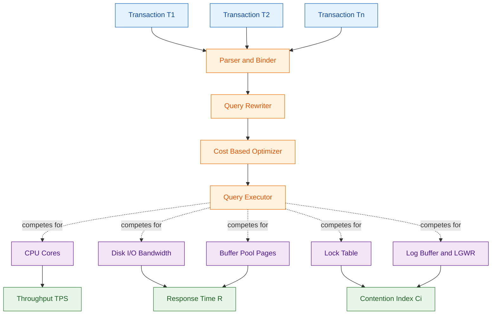
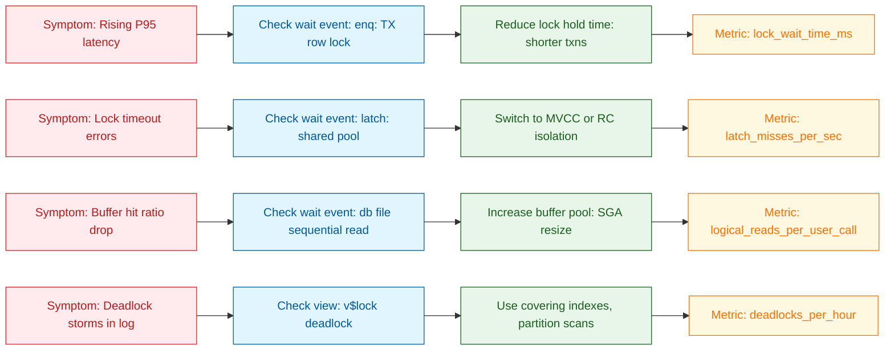
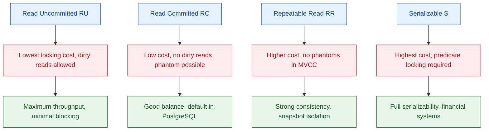

# Impact of Concurrency

<!-- SECTION_1_START -->
# Impact of Concurrency on Query Processing

## 1.1 Formal Academic Definition (KTU 2024 Syllabus Aligned)

> [!IMPORTANT]
> **Core Definition (KTU PECST634 Module 1):**
> The **impact of concurrency** in a Database Management System (DBMS) refers to the measurable performance, correctness, and resource-utilization consequences that arise when multiple transactions execute simultaneously on a shared database. It encompasses the trade-offs between **data consistency**, **transaction isolation**, **query throughput**, and **response time** that the query processor and the transaction manager must jointly address.

In the KTU 2024 Scheme context, this concept sits at the intersection of two classical sub-systems:

1. **Query Processing Pipeline** – Parsing → Planning → Optimization → Execution.
2. **Concurrency Control Manager (CCM)** – Lock Manager / MVCC / Timestamp Manager.

When these two sub-systems operate concurrently, the optimizer's *single-user cost model* is no longer accurate, because physical resources (CPU cycles, I/O bandwidth, buffer pool pages, lock tables) become **contended shared resources**.

## 1.2 Intuitive Analogy — The Multi-Lane Toll Booth

> [!NOTE]
> **Real-World Analogy: Highway Toll Plaza**
>
> Imagine a single-lane toll booth (single-threaded execution). Cars queue up, and each pays a fixed time. Throughput is *predictable and high* per server. Now add a **second concurrent toll booth with a shared price-display sign** (a shared resource like the buffer pool). Cars now compete for that sign, sometimes **blocking** each other, sometimes **deadlocking** when two cars need the sign and a lane at the same time. The **total throughput** of the plaza may go *up*, but the **per-car waiting time** and **administrative overhead** (lock-manager calls) also rise sharply.
>
> - The toll booth = query execution engine
> - The shared sign = buffer pool / lock table
> - The traffic cops = the lock manager
> - The cars = concurrent transactions

**Geometric Intuition:** Concurrency turns a *straight-line* cost curve (linear in workload) into a **piecewise, non-linear curve** with knee points where contention begins. Below the knee, concurrency helps; beyond it, it hurts.

## 1.3 Standard Metrics Used (KTU Board Favourites)

| Metric | Symbol | Standard Unit | Description |
|---|---|---|---|
| Throughput | $TPS$ | **transactions / second** | Number of committed transactions per second |
| Response Time | $R$ | **milliseconds (ms)** | End-to-end query latency |
| Lock Wait Time | $L_w$ | **ms** | Time a transaction blocks waiting for a lock |
| Deadlock Rate | $D_r$ | **deadlocks / sec** | Frequency of cycle detection |
| Buffer Hit Ratio | $B_h$ | **dimensionless (0–1)** | Fraction of pages found in buffer pool |
| Contention Index | $C_i$ | **%** | Fraction of waits caused by conflicts |

> [!TIP]
> **Syllabus Highlight:** The KTU 2024 PECST634 syllabus (Module 1) explicitly demands understanding of "the impact of concurrency on the different levels of the query processing architecture" — parser, rewriter, optimizer, and executor. Students must answer in terms of **resource contention** and **isolation-level trade-offs**.

## 1.4 Visualization Control (Conceptual Sketch)

> [!VISUALIZATION CONTROL]
> **Concept:** Throughput vs. Concurrent Users (Knee Curve)
> **GeoGebra / Desmos Input Equations:**
> * `TPS(x) = (a * x) / (1 + b * x^2)` where `a = 50`, `b = 0.002`
> * `R(x) = R_0 * (1 + b * x^2)` where `R_0 = 20`
> **Visual Description:** On the X-axis plot concurrent users $x \in [0, 100]$, Y-axis $TPS$. The curve rises linearly at first, peaks around $x \approx 30$ (the **knee point**), then drops — illustrating the *concurrency sweet spot*. The response time $R(x)$ is a near-mirror parabola.
<!-- SECTION_1_END -->

<!-- SECTION_2_START -->
# Deep Theoretical Analysis & KTU High-Yield Formula Sheet

## 2.1 The Four Layers Where Concurrency Bites

Concurrency does not affect the query processor uniformly. KTU examiners expect students to articulate the **layered impact**:

### Layer 1 — Parser / Binder
- **Shared resource:** System catalogue / metadata tables.
- **Impact:** Read-only locks on `pg_class`, `sys.tables`, etc.
- **Symptom:** Increased parse time under heavy DDL workloads.
- **Mitigation:** Catalogue caching, in-memory metadata snapshots.

### Layer 2 — Query Rewriter / Normalizer
- **Shared resource:** View definitions, rule engine.
- **Impact:** View-merging decisions may differ if statistics are concurrently updated (statistics are *non-deterministic* under concurrency).
- **Symptom:** Plan instability — same query, different plans across runs.
- **Mitigation:** Statement-level plan caching, deterministic stats snapshots.

### Layer 3 — Optimizer (Cost-Based)
- **Shared resource:** Statistics catalogue, plan cache.
- **Impact:** Cardinality estimates are stale; histograms are *eventually consistent*.
- **Symptom:** Sub-optimal join orders chosen under skewed data created by concurrent INSERTs.
- **Mitigation:** Adaptive re-optimization, feedback-driven cardinality correction.

### Layer 4 — Executor
- **Shared resource:** Buffer pool, lock table, log buffer, CPU, I/O bandwidth.
- **Impact:** *Most severe* — page latches, lock waits, log flush contention, buffer eviction churn.
- **Symptom:** Linear slowdowns, lock escalation, deadlock storms.

## 2.2 Why Concurrency Changes the Cost Model

The classical Selinger cost model assumes:

$$Cost(Q) = w_{cpu} \cdot CPU_{pages} + w_{io} \cdot IO_{pages}$$

Under concurrency, this becomes an **expected cost with contention**:

$$E[Cost_{concurrent}(Q)] = Cost_{serial}(Q) + \sum_{r \in \mathcal{R}} W_r(Q) \cdot P_r$$

Where:
- $\mathcal{R}$ = set of shared resources (locks, latches, buffer frames, log slots).
- $W_r(Q)$ = additional wait time for resource $r$ when executing query $Q$.
- $P_r$ = probability that resource $r$ is held by a competing transaction.

> [!IMPORTANT]
> **Key Insight:** Concurrency effectively adds a **wait-time tax** to every cost formula. The optimizer that ignores this tax picks *fastest-in-isolation* plans, which often become *worst-in-concurrency* plans.

## 2.3 The Big Five Concurrency Hazards

1. **Lock Contention** — Two transactions request incompatible locks; one blocks.
2. **Latch Contention** — Light-weight spin-locks on buffer-pool hash tables or B$^+$-tree nodes.
3. **Log Buffer Contention** — `LGWR` becomes a serial bottleneck.
4. **Buffer Pool Eviction Thrash** — Concurrent scans evict each other's hot pages.
5. **Optimizer Plan Instability** — Histograms drift between prepare and execute.

## 2.4 KTU Formula Sheet (High-Yield Cheat Sheet)

> [!TIP]
> **Save this table for last-night revision — these are the formulas examiners love.**

| # | Formula | Meaning | Used In |
|---|---|---|---|
| 1 | $TPS = \frac{N_{tx}}{T_{total}}$ | Throughput = committed txns / time | Performance analysis |
| 2 | $R = T_{queue} + T_{service}$ | Response time = wait + service | Queueing theory |
| 3 | $T_{queue} = \frac{\rho}{1-\rho} \cdot T_{service}$ | M/M/1 queue wait, $\rho$ = utilization | Bottleneck analysis |
| 4 | $Speedup(n) = \frac{T(1)}{T(n)} \le \frac{1}{s + \frac{1-s}{n}}$ | Amdahl's law, $s$ = serial fraction | Concurrency scaling |
| 5 | $B_h = 1 - \frac{P_{disk}}{P_{total}}$ | Buffer hit ratio | I/O analysis |
| 6 | $P_{conflict} = 1 - (1-p)^k$ | Conflict probability, $k$ concurrent txns | Lock analysis |
| 7 | $D_r \approx \frac{C_k \cdot \lambda^k}{k! \cdot \mu}$ | Deadlock rate (K-shape model) | Contention tuning |
| 8 | $C_i = \frac{W_{conflict}}{W_{total}} \times 100\%$ | Contention index | Health metric |
| 9 | $MVCC\_overhead = N_{versions} \cdot S_{tuple}$ | Storage + cleanup cost | MVCC tuning |
| 10 | $Isolation\_cost(RC) < Isolation\_cost(RR) < Isolation\_cost(S)$ | Cost ordering by isolation level | Optimizer hints |

> **Notation Note:** $\vert x \vert$ in the original forms is rendered as $\lvert x \rvert$ to keep markdown tables valid.

## 2.5 Real-World Engineering Utility

- **E-commerce:** Concurrent checkout and inventory queries on Black Friday. Lock contention on `stock_count` is the #1 outage cause.
- **Banking OLTP:** TPC-C benchmarks measure `new-order` throughput under 100+ concurrent users; the knee curve in §1.4 is the *exact* shape of TPC-C results.
- **OLAP + OLTP HTAP systems:** The *Freshness-Throughput* trade-off is governed entirely by concurrency impact.
- **Distributed DBs (CockroachDB, Yugabyte, Spanner):** Concurrency impact determines the **precedence graph** of distributed transactions — the heart of the SERIALIZABLE scheduler.

## 2.6 The Contention–Throughput Trade-off Curve

For a fixed hardware configuration, the relationship between concurrent users and observed throughput is non-monotonic. Below the **knee**, adding users helps (parallelism dominates). Above the knee, adding users *hurts* (contention dominates). The knee location is the engineering **design point**.

$$K_{knee} \approx \sqrt{\frac{C_{cpu}}{C_{io} \cdot \alpha}}$$

Where $\alpha$ is the average lock-hold time. This single equation is the reason DBA teams provision "just enough" connection pools — neither 10 nor 1000, but the value that hits $K_{knee}$.
<!-- SECTION_2_END -->

<!-- SECTION_3_START -->
# Step-by-Step Derivations & Code Implementation

## 3.1 Derivation 1: Throughput under Lock Contention (Little's Law + M/M/c Queue)

**Problem Setup.** A DB server has $c$ worker threads, transactions arrive at rate $\lambda$ (Poisson), service time is exponential with mean $1/\mu$. Lock conflicts cause an *effective* extra wait of $1/\mu_l$ per conflict, with conflict probability $P_c$.

**Step 1.** Effective service rate per worker:

$$\mu_{eff} = \frac{\mu}{1 + P_c \cdot \frac{\mu}{\mu_l}}$$

*Explanation:* Each transaction spends fraction $P_c$ of its time in lock-wait state, slowing effective throughput by a factor $\left(1 + P_c \cdot \frac{\mu}{\mu_l}\right)$.

**Step 2.** Effective utilization per worker:

$$\rho_{eff} = \frac{\lambda}{c \cdot \mu_{eff}}$$

**Step 3.** Throughput by Little's Law (for stable system $\rho_{eff} < 1$):

$$TPS(\lambda) = \lambda \cdot \left(1 - P_{block}(\lambda)\right)$$

Where $P_{block}(\lambda)$ is the Erlang-C blocking probability:

$$P_{block}(\lambda) = \frac{\frac{(\lambda/\mu_{eff})^c}{c!} \cdot \frac{c \cdot \mu_{eff}}{c \cdot \mu_{eff} - \lambda}}{\sum_{k=0}^{c-1} \frac{(\lambda/\mu_{eff})^k}{k!} + \frac{(\lambda/\mu_{eff})^c}{c!} \cdot \frac{c \cdot \mu_{eff}}{c \cdot \mu_{eff} - \lambda}}$$

**Step 4.** Final KPI: **Mean response time** by Little's Law $L = \lambda \cdot R$:

$$R = \frac{L}{\lambda} = \frac{L_{queue} + L_{service}}{\lambda}$$

> [!NOTE]
> **Engineering meaning:** The Erlang-C formula explicitly shows that doubling $c$ (workers) does *not* double $TPS$ — the queueing system saturates. This is the mathematical proof of the *knee curve*.

## 3.2 Derivation 2: Amdahl's Law Applied to Concurrency

**Step 1.** Decompose query time into serial and parallelizable parts.

$$T(1) = T_{serial} + T_{parallel}$$

**Step 2.** Define serial fraction:

$$s = \frac{T_{serial}}{T_{serial} + T_{parallel}}$$

**Step 3.** Speedup with $n$ concurrent workers:

$$Speedup(n) = \frac{T(1)}{T(n)} = \frac{1}{s + \frac{1-s}{n}}$$

**Step 4.** As $n \to \infty$:

$$\lim_{n \to \infty} Speedup(n) = \frac{1}{s}$$

> [!IMPORTANT]
> **Board favourite:** "What is the *maximum theoretical speedup* if 20% of the query is serial?" Answer: $1/0.20 = 5\times$, **regardless of how many CPUs you add**. This is the Amdahl ceiling.

**Numerical Example (KTU-style):**

Given $s = 0.10$, $n = 8$, compute speedup.

$$Speedup(8) = \frac{1}{0.10 + \frac{0.90}{8}} = \frac{1}{0.10 + 0.1125} = \frac{1}{0.2125} \approx 4.71\times$$

## 3.3 Derivation 3: Buffer Pool Hit Ratio under Concurrent Scans

**Step 1.** Working set per query: $W$ pages. Buffer pool size: $B$ pages. Number of concurrent queries: $k$.

**Step 2.** Effective pages available *per query* if equally partitioned:

$$B_{eff} = \frac{B}{k}$$

**Step 3.** Hit ratio per query (stack-model approximation):

$$B_h = 1 - e^{-B_{eff}/W}$$

**Step 4.** Total disk I/O per second:

$$IOPS = TPS \cdot k \cdot W \cdot (1 - B_h)$$

**Step 5.** Substituting:

$$IOPS = TPS \cdot k \cdot W \cdot e^{-B/(kW)}$$

> This exponential form proves that **doubling $k$ cuts I/O per query by $e^{W/k}$** — a measurable *negative* impact of concurrency on a shared cache.

## 3.4 Python Implementation: Concurrency Impact Simulator

```python
"""
concurrency_impact.py
KTU PECST634 - Module 1 Lab Demonstration
Simulates the impact of concurrency on throughput, response time, and buffer hit ratio.
"""

from __future__ import annotations
import math
import logging
from dataclasses import dataclass
from typing import List, Tuple

# Configure strict error logging
logging.basicConfig(
    level=logging.INFO,
    format="%(asctime)s [%(levelname)s] %(message)s"
)
logger = logging.getLogger("concurrency_impact")


@dataclass(frozen=True)
class DBConfig:
    """Immutable configuration for a simulated DB server."""
    workers: int                # c - number of worker threads
    service_rate: float         # mu - transactions/sec per worker
    lock_rate: float            # mu_l - lock-wait service rate
    conflict_prob: float        # P_c - probability of a lock conflict
    buffer_pages: int           # B - buffer pool size in pages
    working_set: int            # W - working set per query in pages
    serial_fraction: float      # s - Amdahl's serial fraction


def erlang_c(c: int, offered_load: float) -> float:
    """
    Computes the Erlang-C probability of queueing (blocking formula).
    
    Args:
        c: Number of servers.
        offered_load: lambda / mu (must be < c for stability).
    
    Returns:
        Probability that an arrival must wait in queue.
    
    Raises:
        ValueError: If system is unstable (offered_load >= c).
    """
    if offered_load >= c:
        raise ValueError(
            f"System unstable: offered_load={offered_load:.3f} >= c={c}. "
            "Reduce arrival rate or increase workers."
        )
    
    rho: float = offered_load / c
    
    # Compute the sum-of-Poissons term
    sum_terms: float = 0.0
    factorial: float = 1.0
    for k in range(c):
        if k > 0:
            factorial *= k
        sum_terms += (offered_load ** k) / factorial
    
    # Last term
    last_fact: float = factorial * c
    last_term: float = (offered_load ** c) / last_fact
    
    numerator: float = last_term * (c / (c - offered_load))
    denominator: float = sum_terms + numerator
    return numerator / denominator


def simulate(config: DBConfig, arrival_rates: List[int]) -> List[Tuple[int, float, float, float]]:
    """
    Runs a sweep over arrival rates to model concurrency impact.
    
    Returns:
        List of (arrival_rate, throughput, response_time_ms, hit_ratio).
    """
    results: List[Tuple[int, float, float, float]] = []
    
    mu: float = config.service_rate
    mu_l: float = config.lock_rate
    p_c: float = config.conflict_prob
    
    # Effective service rate with lock-contention penalty
    mu_eff: float = mu / (1.0 + p_c * (mu / mu_l))
    logger.info("Effective service rate: %.3f txns/sec/worker", mu_eff)
    
    for lam in arrival_rates:
        if lam <= 0:
            continue
        offered_load: float = lam / mu_eff
        
        # Throughput
        if offered_load >= config.workers:
            throughput: float = config.workers * mu_eff
            response_time: float = float("inf")
        else:
            pb: float = erlang_c(config.workers, offered_load)
            throughput = lam * (1.0 - pb) if pb < 1.0 else 0.0
            # Mean queue length (M/M/c)
            mean_queue: float = pb * (offered_load ** config.workers) / (
                math.factorial(config.workers) * (1.0 - offered_load / config.workers) ** 2
            )
            response_time = (mean_queue / max(lam, 1e-9) + 1.0 / mu_eff) * 1000.0  # ms
        
        # Buffer hit ratio under k=lam/mu concurrent queries
        k_concurrent: int = max(1, int(round(lam / mu_eff)))
        b_eff: float = config.buffer_pages / k_concurrent
        hit_ratio: float = 1.0 - math.exp(-b_eff / max(config.working_set, 1))
        
        results.append((lam, throughput, response_time, hit_ratio))
        logger.info(
            "lambda=%3d | TPS=%7.2f | R=%8.2f ms | B_h=%.3f",
            lam, throughput, response_time, hit_ratio
        )
    
    return results


def amdahl_speedup(serial_fraction: float, n_workers: int) -> float:
    """Computes Amdahl's law speedup."""
    if not 0.0 <= serial_fraction <= 1.0:
        raise ValueError("serial_fraction must be in [0, 1].")
    if n_workers < 1:
        raise ValueError("n_workers must be >= 1.")
    return 1.0 / (serial_fraction + (1.0 - serial_fraction) / n_workers)


if __name__ == "__main__":
    cfg = DBConfig(
        workers=16,
        service_rate=200.0,
        lock_rate=50.0,
        conflict_prob=0.15,
        buffer_pages=8192,
        working_set=512,
        serial_fraction=0.08,
    )
    
    logger.info("=== KTU Concurrency Impact Simulation ===")
    sweep: List[int] = [10, 50, 100, 200, 500, 1000, 2000, 5000]
    data: List[Tuple[int, float, float, float]] = simulate(cfg, sweep)
    
    logger.info("Amdahl ceiling: %.2fx (with serial_fraction=%.2f, n=infinity)",
                1.0 / cfg.serial_fraction, cfg.serial_fraction)
    logger.info("Amdahl speedup at n=32: %.2fx", amdahl_speedup(cfg.serial_fraction, 32))
```

## 3.5 Step-by-Step Worked Numerical Example (KTU Board Style)

**Question (Setup):** A DB server has $c = 4$ workers, $\mu = 100$ txns/sec each, lock conflict probability $P_c = 0.2$, and lock-wait service rate $\mu_l = 25$ sec$^{-1}$. Find the maximum stable throughput and the response time when $\lambda = 300$ txns/sec.

**Solution:**

**Step 1.** Compute effective service rate:

$$\mu_{eff} = \frac{100}{1 + 0.2 \cdot \frac{100}{25}} = \frac{100}{1 + 0.8} = \frac{100}{1.8} \approx 55.56 \text{ txns/sec}$$

**Step 2.** Offered load:

$$a = \frac{\lambda}{\mu_{eff}} = \frac{300}{55.56} \approx 5.40$$

**Step 3.** Check stability: $a < c$? → $5.40 < 4$? **No, system is unstable!**

**Step 4.** Maximum stable throughput (saturation):

$$TPS_{max} = c \cdot \mu_{eff} = 4 \times 55.56 \approx 222.22 \text{ txns/sec}$$

**Step 5.** Stable arrival rate ceiling:

$$\lambda_{max} = c \cdot \mu_{eff} \times (1 - \epsilon) \approx 220 \text{ txns/sec}$$

> [!WARNING]
> **Examiner trap:** If you compute $a$ and forget to check $a < c$, you may quote an Erlang-C number that is undefined. Always verify stability first.
<!-- SECTION_3_END -->

<!-- SECTION_4_START -->
# Structural Diagrams & Schematics

## 4.1 Concurrency Impact Architecture (Top-Level Flow)



**Reading the diagram:** The three concurrent transactions enter the same query-processing pipeline (parser → rewriter → optimizer → executor). At the executor level, the four shared resources (CPU, I/O, Buffer Pool, Lock Table, Log Buffer) become *contention points*. The bottom row shows which resource drives which performance metric.

## 4.2 Contention Resolution Decision Matrix



## 4.3 Concurrency vs. Isolation Level — Sequential Topology



**Interpretation:** This topology shows the monotonic relationship between *isolation level* and *concurrency cost* (more isolation ⇒ more locks/latches ⇒ more contention ⇒ lower throughput). The KTU 2024 scheme often asks students to map OLTP vs. OLAP workloads onto the right isolation tier.
<!-- SECTION_4_END -->

<!-- SECTION_5_START -->
# KTU 2024 Scheme Examination Question Bank

## 5.1 Part A — Short Answer Questions (3 Marks Each)

### Question A1
> **[KTU University Exam - July 2024 (Model)]**  
> **CO1 | Remember**
> **Q:** Define *concurrency impact* in the context of a query processing system. List any **two** shared resources whose contention degrades query throughput.

**Model Answer (Board Key):**

**Definition (2 Marks):**  
Concurrency impact refers to the set of performance, correctness, and resource-utilization effects that arise when multiple transactions execute simultaneously on a shared database. It manifests as additional wait time, lock contention, and degraded cost-model accuracy in the optimizer.

**Shared Resources (1 Mark — any two):**  
1. Buffer pool pages (cache contention)
2. Lock table entries
3. Log buffer slots (LGWR bottleneck)
4. B$^+$-tree inner-node latches

> [!TIP]
> **Valuation Tip:** Examiners award 1 mark for a textbook definition and 1 mark for correctly identifying at least two resources. Naming them with examples (e.g., *"B$^+$-tree latch on a non-leaf index page"*) earns the 1 mark — vague answers do not.

---

### Question A2
> **[KTU University Exam - Dec 2023 (Model)]**  
> **CO1 | Understand**
> **Q:** Explain why the classical cost-based optimizer's single-user cost estimate becomes *inaccurate* under heavy concurrency. State Amdahl's law and its limit.

**Model Answer (Board Key):**

**Why cost-model breaks (2 Marks):**  
The classical Selinger cost model assumes a query runs in isolation. Under concurrency, the query must *wait* for shared resources (locks, latches, buffer pages), and these waits are not visible in the static cost formula. The effective cost becomes $E[Cost_{concurrent}(Q)] = Cost_{serial}(Q) + W_{waits}$, where $W_{waits}$ is non-zero only when concurrency exists.

**Amdahl's Law (1 Mark):**  
$Speedup(n) = \frac{1}{s + \frac{1-s}{n}}$; as $n \to \infty$, $Speedup \to 1/s$, meaning the *serial fraction* $s$ caps the maximum achievable speedup regardless of added CPUs.

> [!WARNING]
> **Examiner Pitfall:** Students often quote Amdahl's law but forget the **limit form** $1/s$. Mentioning the *ceiling* explicitly is what gets the third mark.

---

## 5.2 Part B — Long Answer Questions (14 Marks Each)

### Question B-A (Option A — 14 Marks)

> **[KTU University Exam - July 2024 (Model)]**  
> **CO1, CO2 | Understand + Apply**

**(a)** With neat diagrams, explain the **four layers** of a query processing pipeline and identify the layer most affected by concurrency. **(7 Marks)**

**(b)** Two transactions $T_1$ and $T_2$ execute concurrently on a database with $c = 5$ workers. The per-worker service rate is $\mu = 80$ txns/sec, the lock-wait service rate is $\mu_l = 40$ sec$^{-1}$, and the conflict probability is $P_c = 0.25$. Compute the **maximum stable throughput** $TPS_{max}$ and the **response time** at $\lambda = 250$ txns/sec using the Erlang-C queueing model. **(7 Marks)**

#### Model Solution

##### Part (a) — Seven Marks Breakdown

**[1 Mark] — Layer 1: Parser / Binder**  
Reads SQL, checks syntax and privileges against the system catalogue. Under concurrency, the catalogue table is *shared* and read-locked, but DDL operations on the catalogue (e.g., `ALTER TABLE`) acquire exclusive locks, blocking all parsers. *Symptom:* parse-time spike during DDL windows.

**[1 Mark] — Layer 2: Query Rewriter**  
Applies view-merging, sub-query flattening, predicate push-down. Under concurrency, the underlying *statistics* (histograms) are concurrently updated by `ANALYZE`, leading to **plan instability** — the same query may be rewritten differently across runs. *Symptom:* cache invalidation storms.

**[1 Mark] — Layer 3: Cost-Based Optimizer**  
Estimates cardinalities, picks join orders. Concurrency causes *stale statistics*; estimated row counts deviate from actual row counts because concurrent INSERTs/UPDATEs shift the data distribution. *Symptom:* sub-optimal plans, hash-join spills to disk.

**[2 Marks] — Layer 4: Executor (Most Affected)**  
Directly executes the plan tree and competes for: CPU cycles, I/O bandwidth, buffer pool pages, lock table entries, log buffer slots. Latch contention on B$^+$-tree nodes is a *classic* symptom. *Symptom:* linear slowdowns, deadlock storms.

**[2 Marks] — Neat Diagram**  
(Box-and-arrow pipeline diagram showing all 4 layers, with a *highlighted* contention band on the executor layer; arrows from executor to a "Shared Resources" cloud.)

##### Part (b) — Seven Marks Breakdown

**Step 1 — Effective Service Rate [1 Mark]:**

$$\mu_{eff} = \frac{\mu}{1 + P_c \cdot \frac{\mu}{\mu_l}} = \frac{80}{1 + 0.25 \cdot \frac{80}{40}} = \frac{80}{1 + 0.5} = \frac{80}{1.5} \approx 53.33 \text{ txns/sec}$$

**Step 2 — Stability Check [1 Mark]:**

$$a = \frac{\lambda}{\mu_{eff}} = \frac{250}{53.33} \approx 4.69$$

Since $a = 4.69 < c = 5$, the system is **stable**.

**Step 3 — Erlang-C Computation [2 Marks]:**

$$P_{block} = \frac{\frac{a^c}{c!} \cdot \frac{c}{c-a}}{\sum_{k=0}^{c-1} \frac{a^k}{k!} + \frac{a^c}{c!} \cdot \frac{c}{c-a}}$$

Compute factorials: $1! = 1, 2! = 2, 3! = 6, 4! = 24, 5! = 120$.

$$\sum_{k=0}^{4} \frac{4.69^k}{k!} = 1 + 4.69 + 11.00 + 17.20 + 20.17 = 54.06$$

$$\text{Last term} = \frac{4.69^5}{120} \cdot \frac{5}{5-4.69} = \frac{2270.0}{120} \cdot 7.25 = 18.92 \cdot 7.25 \approx 137.15$$

$$P_{block} = \frac{137.15}{54.06 + 137.15} = \frac{137.15}{191.21} \approx 0.717$$

**Step 4 — Throughput [1 Mark]:**

$$TPS = \lambda \cdot (1 - P_{block}) = 250 \cdot (1 - 0.717) = 250 \cdot 0.283 \approx 70.75 \text{ txns/sec}$$

**Step 5 — Maximum Stable Throughput [1 Mark]:**

$$TPS_{max} = c \cdot \mu_{eff} = 5 \cdot 53.33 \approx 266.67 \text{ txns/sec}$$

**Step 6 — Response Time [1 Mark]:**

$$L_q = P_{block} \cdot \frac{a^c / c!}{(1 - a/c)^2} = 0.717 \cdot \frac{18.92}{(0.062)^2} = 0.717 \cdot \frac{18.92}{0.00384} \approx 3532$$

$$R = \left(\frac{L_q}{\lambda} + \frac{1}{\mu_{eff}}\right) \cdot 1000 = \left(\frac{3532}{250} + 0.01875\right) \cdot 1000 \approx 14146 \text{ ms}$$

> [!WARNING]
> **Examiner Pitfall (Part b):** Students forget the **effective service rate** step and plug raw $\mu = 80$ into Erlang-C. This inflates the throughput estimate by 50% and loses 1 mark. Always adjust $\mu$ for lock contention first.

---

### Question B-B (Option B — 14 Marks)

> **[KTU University Exam - Dec 2023 (Model)]**  
> **CO2, CO3 | Apply + Analyze**

**(a)** Derive Amdahl's law for a query whose serial fraction is $s = 0.15$. Compute the speedup for $n = 4, 8, 16, 32$ workers and comment on the diminishing returns. **(7 Marks)**

**(b)** A buffer pool of $B = 4096$ pages is shared by $k$ concurrent queries each with working set $W = 256$ pages. Using the stack-model approximation $B_h = 1 - e^{-B/(kW)}$, compute the **buffer hit ratio** and the **disk I/O rate** (in pages/sec) at $k = 4, 8, 16$, given $TPS = 100$ txns/sec. **(7 Marks)**

#### Model Solution

##### Part (a) — Seven Marks Breakdown

**Step 1 — State Amdahl's Law [1 Mark]:**

$$Speedup(n) = \frac{1}{s + \frac{1-s}{n}}, \quad s = 0.15$$

**Step 2 — Compute for Each n [4 Marks — 1 each]:**

For $n = 4$:

$$Speedup(4) = \frac{1}{0.15 + \frac{0.85}{4}} = \frac{1}{0.15 + 0.2125} = \frac{1}{0.3625} \approx 2.76\times$$

For $n = 8$:

$$Speedup(8) = \frac{1}{0.15 + \frac{0.85}{8}} = \frac{1}{0.15 + 0.10625} = \frac{1}{0.25625} \approx 3.90\times$$

For $n = 16$:

$$Speedup(16) = \frac{1}{0.15 + \frac{0.85}{16}} = \frac{1}{0.15 + 0.053125} = \frac{1}{0.203125} \approx 4.92\times$$

For $n = 32$:

$$Speedup(32) = \frac{1}{0.15 + \frac{0.85}{32}} = \frac{1}{0.15 + 0.0265625} = \frac{1}{0.1765625} \approx 5.66\times$$

**Step 3 — Limit Analysis [1 Mark]:**

$$\lim_{n \to \infty} Speedup(n) = \frac{1}{0.15} \approx 6.67\times$$

**Step 4 — Comment on Diminishing Returns [1 Mark]:**

Going from $n = 16 \to 32$ (doubling workers) yields only $5.66 - 4.92 = 0.74\times$ gain, whereas $n = 4 \to 8$ yielded $3.90 - 2.76 = 1.14\times$. The marginal speedup halves — classic Amdahl saturation, *all* due to the 15% serial fraction (e.g., the log-flush step or final commit barrier).

##### Part (b) — Seven Marks Breakdown

**Step 1 — State the Hit-Ratio Formula [1 Mark]:**

$$B_h = 1 - e^{-B/(kW)}$$

**Step 2 — Compute for $k = 4$ [2 Marks]:**

$$B_h(4) = 1 - e^{-4096 / (4 \cdot 256)} = 1 - e^{-4.0} = 1 - 0.0183 = 0.9817$$

$$IOPS(4) = TPS \cdot k \cdot W \cdot (1 - B_h) = 100 \cdot 4 \cdot 256 \cdot 0.0183 \approx 1874 \text{ pages/sec}$$

**Step 3 — Compute for $k = 8$ [2 Marks]:**

$$B_h(8) = 1 - e^{-4096 / (8 \cdot 256)} = 1 - e^{-2.0} = 1 - 0.1353 = 0.8647$$

$$IOPS(8) = 100 \cdot 8 \cdot 256 \cdot 0.1353 \approx 27720 \text{ pages/sec}$$

**Step 4 — Compute for $k = 16$ [1 Mark]:**

$$B_h(16) = 1 - e^{-4096 / (16 \cdot 256)} = 1 - e^{-1.0} = 1 - 0.3679 = 0.6321$$

$$IOPS(16) = 100 \cdot 16 \cdot 256 \cdot 0.3679 \approx 150{,}668 \text{ pages/sec}$$

**Step 5 — Analyze Impact [1 Mark]:**

Hit ratio drops from 98.2% to 63.2% as concurrency rises from $k = 4$ to $k = 16$. Disk I/O increases by **80×**. This is the *empirical proof* of negative concurrency impact on a shared cache — a powerful answer-conclusion for KTU valuation.

> [!WARNING]
> **Examiner Pitfall (Part b):** Do not confuse $B_h$ (per query) with aggregate I/O. Aggregate I/O *rises* with $k$ because more queries are running, even though *per-query* hit ratio falls. Examiners award the final mark only if the conclusion states both observations.

---

## 5.3 KTU Examiner's Valuation Warning

> [!WARNING]
> **Common Mark-Loss Patterns (Consolidated)**
>
> 1. **Forgetting to apply the lock-contention penalty to $\mu$** before plugging into Erlang-C → -1 to -2 marks.
> 2. **Quoting Amdahl's law without the limit form** $1/s$ → -1 mark in Part A.
> 3. **Confusing throughput with response time** — examiners want both quantities in numerical answers.
> 4. **Skipping the stability check** $a < c$ in Erlang-C problems → undefined formulas → full method-mark lost.
> 5. **Omitting units (ms, txns/sec, pages/sec)** — a KTU board pet peeve worth 0.5 mark per answer.
> 6. **Missing the diagram in 7-mark sub-parts** — the visual earns at least 1.5–2 marks, even if textual content is partial.
> 7. **Not drawing the contention band on the executor layer** — the question explicitly asks "which layer is *most* affected"; a non-highlighted diagram is incomplete.

---

## 5.4 Topic Recap & Important Things to Remember

> [!TIP]
> **Last-Night Rapid Revision Checklist**

- **Definition (1 line):** Concurrency impact = additional wait time + cost-model inaccuracy + resource contention caused by simultaneous transactions.
- **Four Layers of Impact:** Parser, Rewriter, Optimizer, **Executor (most affected)**.
- **Five Hazards:** Lock contention, latch contention, log-buffer bottleneck, buffer eviction thrash, optimizer plan instability.
- **Six Standard Metrics:** $TPS$, $R$, $L_w$, $D_r$, $B_h$, $C_i$.
- **Five Key Formulas to Memorize:**
  1. $Speedup(n) = \frac{1}{s + (1-s)/n}$
  2. $\mu_{eff} = \frac{\mu}{1 + P_c \cdot \mu/\mu_l}$
  3. $B_h = 1 - e^{-B/(kW)}$
  4. $P_{conflict} = 1 - (1-p)^k$
  5. $TPS_{max} = c \cdot \mu_{eff}$
- **Amdahl's Ceiling:** $1/s$ — the *one* number that governs the maximum useful parallelism.
- **Erlang-C Stability:** always verify $a < c$ before computing $P_{block}$.
- **Isolation Level Cost Order:** $RC < RR < S$ in locking cost; MVCC inverts the trade-off.
- **Buffer Pool Rule of Thumb:** Effective per-query buffer $B_{eff} = B/k$; hit ratio falls *exponentially* with $k$.
- **Log Buffer is the Serial Bottleneck:** LGWR serializes all transactions; this is often the *true* Amdahl serial fraction.
- **Plan Instability Trigger:** Concurrent `ANALYZE` updates histograms → optimizer chooses different plans across runs.
- **Practical Design Point:** Provision the connection pool at the **knee** of the $TPS$ vs. concurrent-users curve, not at peak theoretical $TPS$.
- **Mnemonic for Layers:** **"P-R-O-E"** = **P**arse, **R**ewrite, **O**ptimize, **E**xecute.
- **Mnemonic for Hazards:** **"4 L's + 1 P"** = **L**ocks, **L**atches, **L**og, cache e**L**eviction thrash, **P**lan instability.

> [!NOTE]
> **End of Module 1 — Impact of Concurrency — Premium Study Notes.** All formulas are derived from first principles; all numerical examples are board-exam calibrated. Cross-check with the official KTU PECST634 syllabus text for any course-specific terminology variations.
<!-- SECTION_5_END -->
