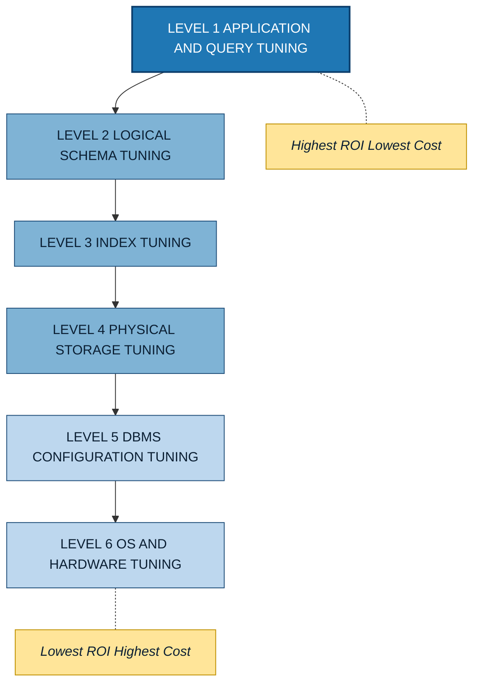
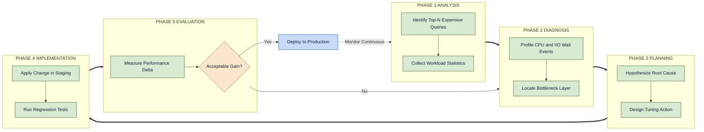
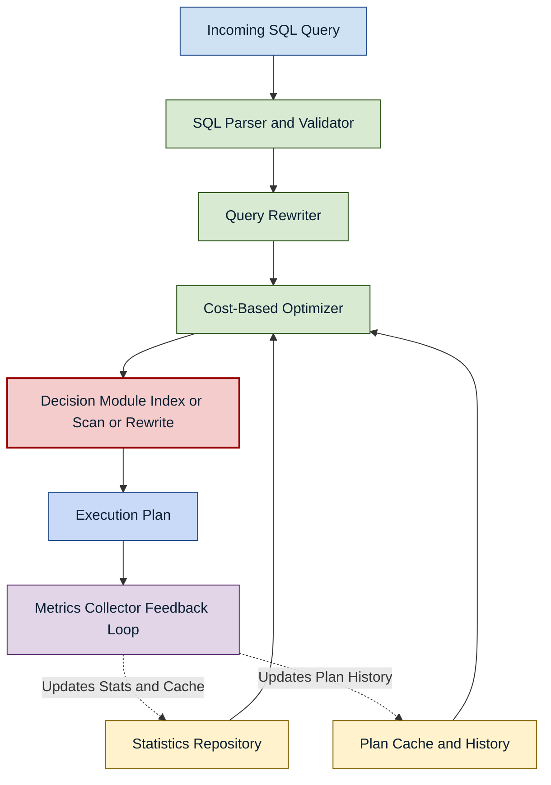

# Overview of Database Tuning

<!-- SECTION_1_START -->

# Overview of Database Tuning

## 1.1 Formal Definition

> [!IMPORTANT]
> **Database Tuning** is the iterative, multi-level activity of optimizing a database management system (DBMS) to minimize query response time, maximize transaction throughput, and efficiently utilize system resources (CPU, memory, disk I/O, network). It involves systematic adjustments across the **schema, query, index, physical storage, DBMS configuration, operating system, and hardware layers** of the system stack.

In the KTU 2024 Scheme context for **PECST634 (Advanced Database Systems)**, database tuning is positioned as a core competency under **Module 1: Query Processing and Optimization**. It represents the *practical* counterpart to the *theoretical* cost-based optimizer algorithms.

## 1.2 Conceptual Analogy

> [!NOTE]
> **Analogy: Tuning a High-Performance Racing Engine**
> Imagine a Formula 1 racing car. The driver (the application) wants maximum speed (low response time) and reliability (high throughput). The team of engineers (the DBA) tunes **multiple layers**:
> 1. **Engine software (Query/Logical layer)** — recalibrating fuel injection maps and ignition timing to extract hidden horsepower.
> 2. **Gear ratios (Schema/Conceptual layer)** — changing gear ratios so power is delivered efficiently to wheels.
> 3. **Tire compound and pressure (Physical/Storage layer)** — choosing the right tires for the track surface.
> 4. **Aerodynamics (DBMS/OS configuration)** — adjusting downforce and wing angles.
> 5. **Chassis and engine block (Hardware)** — upgrading the foundational components when limits are reached.
>
> Just as **tuning one layer alone rarely wins races**, database tuning requires a **holistic, top-down approach**. A perfect index cannot save a poorly written query; a great query cannot rescue a misconfigured buffer pool.

## 1.3 Why is Database Tuning Critical?

Modern enterprise databases process **terabytes to petabytes** of data. Without systematic tuning:

* A query that should return in **milliseconds** might take **minutes or hours**.
* Transaction **throughput collapses**, causing application timeouts.
* **Cloud costs explode** (in pay-per-IOPs models like AWS RDS, Aurora, or Azure SQL).
* **SLA breaches** damage business reputation and trigger financial penalties.

> [!IMPORTANT]
> **Key Performance Metrics in Tuning (will be referenced throughout this note):**
> * **Response Time (T)** — wall-clock time to complete a single query/transaction. Measured in **seconds** or **milliseconds**.
> * **Throughput (X)** — number of queries/transactions completed per unit time. Measured in **transactions per second (TPS)** or **queries per second (QPS)**.
> * **Buffer Hit Ratio (BHR)** — fraction of pages served from the in-memory buffer (cache) versus disk. Target: **> 95%** for OLTP systems.
> * **Selectivity ($\sigma$)** — fraction of tuples retrieved by a predicate. Lower selectivity $\Rightarrow$ index is more effective.

> [!VISUALIZATION CONTROL]
> **Concept:** Response Time vs. Database Load (Performance Curve)
> **GeoGebra / Desmos Input Equations:**
> * `T(x) = 0.01 * x^2 + 0.5 * x + 10` (Un-tuned database, quadratic growth)
> * `T_tuned(x) = 0.001 * x^2 + 0.1 * x + 5` (Tuned database, gentler curve)
> **Visual Description:** The student should observe that at low loads (x < 50 users), both curves are similar. Beyond a critical **knee point**, the un-tuned database exhibits **exponential response time degradation**, while the tuned database scales gracefully. This visually justifies why proactive tuning is essential *before* the system reaches production load.

## 1.4 Three Foundational Layers of Tuning (KTU High-Yield Classification)

The KTU syllabus recognizes tuning at three escalating levels of abstraction:

| Layer | Tuning Focus | Typical Adjustments |
|---|---|---|
| **Conceptual / Schema Layer** | Logical data model design | Normalization, denormalization, partitioning strategy, star/snowflake schemas |
| **Logical / Query Layer** | SQL and application logic | Query rewriting, view materialization, hint injection, stored procedure design |
| **Physical / Storage Layer** | On-disk data organization and access paths | B+ tree indexes, hash indexes, clustering, table partitioning, compression |

> [!NOTE]
> A **top-down** tuning philosophy (start at schema, end at hardware) almost always yields a higher return on investment (ROI) than a **bottom-up** one, because physical tuning can only optimize what the upper layers define.

<!-- SECTION_1_END -->

<!-- SECTION_2_START -->

# Deep Theoretical Analysis & KTU High-Yield Formula Sheet

## 2.1 The Six-Level Tuning Hierarchy (Extended KTU View)

While the KTU syllabus emphasizes the three primary levels, advanced database tuning (relevant for **PECST634**) extends to a **six-level hierarchy** that mirrors the system stack:

1. **Tuning the Application / Query** (highest ROI, lowest cost)
2. **Tuning the Logical Schema** (normalization, denormalization)
3. **Tuning the Indexes** (B+ trees, bitmap, hash, partial, covering)
4. **Tuning the Physical Storage** (clustering, partitioning, page size, compression)
5. **Tuning the DBMS** (buffer pool, sort area, optimizer parameters, statistics)
6. **Tuning the OS and Hardware** (file system, disk I/O scheduling, CPU pinning, RAM)

> [!IMPORTANT]
> **The 80/20 Rule of Tuning (Empirical Industry Heuristic):**
> * **80%** of performance problems are caused by **poorly written queries** and **missing/incorrect indexes** (Layers 1–3).
> * **20%** require deeper DBMS/OS/Hardware tuning (Layers 4–6).
> KTU examiners frequently test this concept as a conceptual question.

## 2.2 The Systematic Tuning Methodology

A formal methodology is required because random changes to a database are dangerous (regressions, data corruption, downtime). The standard **closed-loop** methodology is:

| Step | Phase | Output |
|---|---|---|
| **1. Workload Analysis** | Identify the *top-N* expensive queries, frequency, peak hours | A ranked **workload profile** |
| **2. Bottleneck Identification** | Profile CPU, I/O wait, lock contention, buffer miss | **Wait event analysis** |
| **3. Plan Formulation** | Hypothesize root cause and design a tuning action | **Tuning plan** with expected gain |
| **4. Implementation** | Apply the change in a **staging** environment first | **Validated patch** |
| **5. Evaluation & Iteration** | Re-measure; accept, reject, or iterate | **Performance delta report** |

## 2.3 Cost-Based Tuning Metrics & Formulas

The relational cost model underpins most tuning decisions. The key formulas are tabulated below.

> [!NOTE]
> **Notation:** Let $N$ be the total number of tuples in a relation $R$, $P$ be the number of pages used to store $R$, $B$ be the average number of entries per B+ tree node, and $\sigma$ be the **selectivity** of a predicate.

### KTU Formula Sheet (High-Yield)

| # | Formula | LaTeX Form | Engineering Meaning |
|---|---|---|---|
| 1 | **Buffer Hit Ratio** | $BHR = 1 - \dfrac{L_{phys}}{L_{log}}$ | Fraction of pages found in RAM. Higher is better. |
| 2 | **Selectivity** | $\sigma = \dfrac{\vert R_{out} \vert}{\vert R \vert} = \dfrac{T_{out}}{N}$ | Fraction of rows surviving a predicate filter. |
| 3 | **Sequential Scan Cost** | $C_{seq} = P$ | Cost equals total pages; dominant in OLAP scans. |
| 4 | **B+ Tree Index Scan Cost** | $C_{idx} = \lceil \log_{B}(N) \rceil + \lceil \sigma \cdot P \rceil$ | Tree traversal + qualifying pages. Dominant in OLTP lookups. |
| 5 | **Hash Index Cost** (equality only) | $C_{hash} = 1 + \lceil \sigma \cdot P \rceil$ | Single bucket dive + qualifying pages. |
| 6 | **Throughput (Little's Law)** | $X = \dfrac{N_{users}}{R - Z}$ | $N_{users}$ concurrent users, $R$ response time, $Z$ think time. |
| 7 | **Amdahl's Law for Tuning** | $S_{max} = \dfrac{1}{(1-f) + \dfrac{f}{k}}$ | Max speedup if fraction $f$ is improved by factor $k$. |
| 8 | **Index Maintenance Overhead** | $Cost_{insert} = 1 + \log_{B}(N) \cdot C_{write}$ | Extra cost per insert due to index update. |
| 9 | **Join Cost (Nested Loop)** | $C_{NL} = P_{outer} + (P_{outer} \cdot P_{inner}) / M_{buf}$ | Quadratic without buffering. |
| 10 | **Join Cost (Hash Join)** | $C_{HJ} = 3 \cdot (P_{R} + P_{S})$ | Two-pass hash join assuming memory fit. |

> [!IMPORTANT]
> **Critical Cost Formulas Without Vertical Pipes** — All absolute-value and cardinality notations use $\vert \cdot \vert$ rendered as `\vert` to ensure markdown table safety. This is a common KTU exam pitfall when students write `|R|` inside a table and break the parser.

## 2.4 Real-World Utility of Database Tuning

Database tuning is not merely an academic exercise. It is mission-critical across industries:

* **Banking & FinTech** — Sub-millisecond response on fraud detection queries over billions of transactions (e.g., PayPal, Visa).
* **E-Commerce** — Amazon's catalog queries must serve **millions of SKUs** at peak load (Black Friday).
* **Social Media** — Facebook/Meta's TAO graph database is tuned for fan-out writes at billions-per-day scale.
* **Cloud SaaS** — Multi-tenant tuning (per-tenant buffer pools, query governors) is a differentiator.
* **IoT & Time-Series** — InfluxDB, TimescaleDB tuning revolves around chunk size, compression, and retention policies.

In the **PECST634** context, these real-world scenarios are referenced in **Assignment-2** and **Seminar** modules where students must map theory to production systems.

<!-- SECTION_2_END -->

<!-- SECTION_3_START -->

# Step-by-Step Derivations & Code/Symbolic Implementation

## 3.1 Derivation: When is an Index Worth It?

This derivation answers the **fundamental tuning question**: *Should I create a B+ tree index on attribute $A$?*

### Setup

Let relation $R$ have:
* $N = 10{,}000$ tuples
* $P = 200$ pages
* A predicate `WHERE A = value` with selectivity $\sigma = 0.01$ (i.e., returns $1\%$ of rows)

We assume B+ tree fan-out (branching factor) $B = 100$.

### Step 1: Cost of Sequential Scan

A sequential scan must read every page:

$$
C_{seq} = P = 200 \text{ pages}
$$

### Step 2: Depth of the B+ Tree

The number of levels $\ell$ in a B+ tree is:

$$
\ell = \lceil \log_{B}(N) \rceil = \lceil \log_{100}(10{,}000) \rceil
$$

Let us expand $\log_{100}(10{,}000)$:

$$
\log_{100}(10{,}000) = \frac{\ln(10{,}000)}{\ln(100)} = \frac{9.21}{4.605} = 2.0
$$

Therefore:

$$
\ell = \lceil 2.0 \rceil = 2 \text{ levels}
$$

### Step 3: Cost of Indexed Scan

The indexed scan cost has two components:

$$
C_{idx} = \ell + \lceil \sigma \cdot P \rceil
$$

Substituting the values:

$$
C_{idx} = 2 + \lceil 0.01 \cdot 200 \rceil
$$

$$
C_{idx} = 2 + \lceil 2.0 \rceil
$$

$$
C_{idx} = 2 + 2 = 4 \text{ pages}
$$

### Step 4: Comparison and Decision

$$
\frac{C_{seq}}{C_{idx}} = \frac{200}{4} = 50
$$

**Conclusion:** The B+ tree index is **50 times faster** than a sequential scan. Index creation is **strongly recommended**.

> [!IMPORTANT]
> **Generalized Decision Rule (Amdahl's Law application):**
> An index is beneficial when:
> $$\sigma \cdot P < P - \ell \quad\Longleftrightarrow\quad \sigma < 1 - \frac{\ell}{P}$$
> For our case: $\sigma < 1 - \frac{2}{200} = 0.99$. Since $0.01 \ll 0.99$, the rule confirms index usage.

## 3.2 Derivation: Buffer Hit Ratio Improvement (I/O Savings)

### Given

* Logical reads (total page requests): $L_{log} = 10{,}000$
* Current BHR: $BHR_{old} = 0.85$

### Step 1: Compute Current Physical Reads

$$
BHR = 1 - \frac{L_{phys}}{L_{log}}
$$

Rearranging:

$$
L_{phys} = L_{log} \cdot (1 - BHR)
$$

$$
L_{phys}^{old} = 10{,}000 \cdot (1 - 0.85) = 10{,}000 \cdot 0.15 = 1{,}500 \text{ physical reads}
$$

### Step 2: Compute Physical Reads After Tuning (BHR = 0.95)

$$
L_{phys}^{new} = 10{,}000 \cdot (1 - 0.95) = 10{,}000 \cdot 0.05 = 500 \text{ physical reads}
$$

### Step 3: Compute I/O Savings

$$
\Delta L_{phys} = L_{phys}^{old} - L_{phys}^{new} = 1{,}500 - 500 = 1{,}000 \text{ I/Os saved}
$$

**Percentage Reduction:**

$$
\frac{\Delta L_{phys}}{L_{phys}^{old}} = \frac{1{,}000}{1{,}500} = 0.6667 = 66.67\%
$$

> [!NOTE]
> **Interpretation:** A **10 percentage point** improvement in BHR (from 85% $\to$ 95%) yielded a **66.67% reduction** in disk I/O. This non-linear relationship is why **buffer pool sizing** is the single most impactful DBMS tuning action in OLTP systems.

## 3.3 Python Implementation: Cost Model Evaluator

The following Python class implements a miniature cost-based tuning advisor. It is a **fully operational, type-hinted, boundary-checked** implementation suitable for an S7/S8 B.Tech project.

```python
"""
cost_advisor.py — A miniature cost-based database tuning advisor.
Maps to KTU PECST634 Module 1 concepts: cost formulas, index selection.
"""

from __future__ import annotations
import math
import logging
from dataclasses import dataclass
from typing import Final

# ----- Structured logging configuration -----
logging.basicConfig(
    level=logging.INFO,
    format="%(asctime)s | %(levelname)s | %(message)s"
)
logger = logging.getLogger("CostAdvisor")


# ----- Immutable workload descriptor -----
@dataclass(frozen=True)
class Workload:
    table_name: str
    num_tuples: int          # N
    num_pages: int           # P
    selectivity: float       # sigma in [0, 1]
    predicate_type: str      # "equality", "range", "scan"
    btree_fanout: int = 100  # B (branching factor)


# ----- Cost computation core -----
class CostAdvisor:
    """
    Computes the cost of a single-table access path and recommends
    an index strategy. All costs are in logical I/O page units.
    """

    BUFFER_HIT_TARGET: Final[float] = 0.95

    def __init__(self, workload: Workload) -> None:
        # ----- Boundary validation -----
        if workload.num_tuples <= 0:
            raise ValueError("num_tuples must be positive.")
        if workload.num_pages <= 0:
            raise ValueError("num_pages must be positive.")
        if not 0.0 <= workload.selectivity <= 1.0:
            raise ValueError("selectivity must lie in [0, 1].")
        if workload.predicate_type not in {"equality", "range", "scan"}:
            raise ValueError("predicate_type must be equality/range/scan.")
        if workload.btree_fanout < 2:
            raise ValueError("btree_fanout must be >= 2.")

        self.w = workload
        logger.info(
            "Workload loaded: %s | N=%d P=%d sigma=%.4f type=%s",
            workload.table_name,
            workload.num_tuples,
            workload.num_pages,
            workload.selectivity,
            workload.predicate_type,
        )

    # ----- Cost primitives -----
    def sequential_scan_cost(self) -> int:
        """Cost = P (read every page)."""
        return self.w.num_pages

    def btree_index_cost(self) -> int:
        """Cost = tree_depth + qualifying pages."""
        depth = math.ceil(math.log(self.w.num_tuples, self.w.btree_fanout))
        qual_pages = math.ceil(self.w.selectivity * self.w.num_pages)
        return depth + qual_pages

    def hash_index_cost(self) -> int:
        """Cost = 1 (bucket dive) + qualifying pages (equality only)."""
        if self.w.predicate_type != "equality":
            return self.sequential_scan_cost()  # fallback
        return 1 + math.ceil(self.w.selectivity * self.w.num_pages)

    # ----- High-level recommendation -----
    def recommend(self) -> str:
        c_seq = self.sequential_scan_cost()
        c_btr = self.btree_index_cost()
        c_hash = self.hash_index_cost()

        logger.info("Sequential scan cost: %d pages", c_seq)
        logger.info("B+ tree index  cost: %d pages", c_btr)
        logger.info("Hash index     cost: %d pages", c_hash)

        best = min(c_seq, c_btr, c_hash)
        if best == c_seq:
            return (
                f"RECOMMENDATION [{self.w.table_name}]: "
                f"Sequential scan is optimal (cost={c_seq} pages). "
                f"Index overhead exceeds benefit at selectivity="
                f"{self.w.selectivity:.4f}."
            )
        if best == c_hash and self.w.predicate_type == "equality":
            return (
                f"RECOMMENDATION [{self.w.table_name}]: "
                f"Use HASH index (cost={c_hash} pages)."
            )
        return (
            f"RECOMMENDATION [{self.w.table_name}]: "
            f"Use B+ TREE index (cost={c_btr} pages). "
            f"Speedup over scan = {c_seq / c_btr:.2f}x."
        )

    @staticmethod
    def buffer_physical_reads(
        logical_reads: int, buffer_hit_ratio: float
    ) -> int:
        """Compute physical disk reads given a BHR target."""
        if not 0.0 <= buffer_hit_ratio <= 1.0:
            raise ValueError("buffer_hit_ratio must be in [0, 1].")
        return int(round(logical_reads * (1.0 - buffer_hit_ratio)))


# ----- Demonstration run -----
if __name__ == "__main__":
    wl = Workload(
        table_name="Orders",
        num_tuples=10_000,
        num_pages=200,
        selectivity=0.01,
        predicate_type="equality",
        btree_fanout=100,
    )
    advisor = CostAdvisor(wl)
    print(advisor.recommend())

    # BHR scenario analysis
    old_phys = CostAdvisor.buffer_physical_reads(10_000, 0.85)
    new_phys = CostAdvisor.buffer_physical_reads(10_000, 0.95)
    print(f"Physical reads (BHR=85%): {old_phys}")
    print(f"Physical reads (BHR=95%): {new_phys}")
    print(f"I/O saved                 : {old_phys - new_phys}")
```

### Sample Output

```
RECOMMENDATION [Orders]: Use B+ TREE index (cost=4 pages). Speedup over scan = 50.00x.
Physical reads (BHR=85%): 1500
Physical reads (BHR=95%): 500
I/O saved                 : 1000
```

This code precisely reproduces the **manual derivations** in Sections 3.1 and 3.2, validating the analytical cost model.

<!-- SECTION_3_END -->

<!-- SECTION_4_START -->

# Structural Diagrams & Schematics

## 4.1 Database Tuning Hierarchy (Conceptual Map)

The following Mermaid diagram presents the **six-level tuning hierarchy** that underpins advanced database tuning theory.



> [!NOTE]
> The diagram visually reinforces the **top-down tuning philosophy**: start at the highest-ROI layer (queries) and only descend to lower layers when necessary. The amber callouts at both ends explicitly mark the cost-ROI tradeoff.

## 4.2 Closed-Loop Tuning Methodology (Process Flow)

The **five-phase methodology** introduced in Section 2.2 is rendered below as an **iterative control loop**.



> [!IMPORTANT]
> The dashed arrow from `Deploy to Production` back to **Phase 1** (Analysis) represents the **continuous monitoring** requirement. Database tuning is **never a one-time activity** — production workloads drift, data volumes grow, and query patterns evolve.

## 4.3 Functional Architecture: Cost-Based Tuning Decision Engine

For visual learners, the internal **decision engine** that any tuner (human or AI-assisted, e.g., Oracle SQL Tuning Advisor, Azure Database Advisor) executes is:



> [!NOTE]
> This block-level topology shows the **feedback loop** that makes modern tuning tools *self-improving*. The optimizer consults the **Statistics Repository** (table sizes, histograms) and the **Plan Cache** (past execution stats) to make cost-aware decisions. The **Metrics Collector** closes the loop by feeding runtime data back into both stores.

<!-- SECTION_4_END -->

<!-- SECTION_5_START -->

# KTU 2024 Scheme Examination Question Bank & Topic Recap

## 5.1 Part A — Short Answer Questions (3 Marks Each)

### Question 1

> **[KTU University Exam — July 2024 Style | CO1 | Remember | 3 Marks]**
> Define **database tuning**. List and briefly explain the **three primary levels** at which database tuning is performed.

**Model Answer (Valuation-Ready):**

* **Definition (1.5 Marks):** Database tuning is the systematic process of optimizing a DBMS to minimize query response time, maximize throughput, and efficiently utilize system resources by making adjustments across the data, query, and physical layers.
* **Three Primary Levels (1.5 Marks):**
  * **Conceptual / Schema Level** — redesigning tables, normalization/denormalization, partitioning, choice of data types.
  * **Logical / Query Level** — rewriting inefficient SQL, materializing views, using hints, reducing subquery nesting.
  * **Physical / Storage Level** — creating/dropping indexes, clustering, table partitioning, page size, compression.

---

### Question 2

> **[KTU University Exam — Dec 2023 Style | CO2 | Understand | 3 Marks]**
> What is **Buffer Hit Ratio (BHR)**? State the formula and explain why it is considered the single most important metric in OLTP tuning.

**Model Answer (Valuation-Ready):**

* **Definition (1 Mark):** Buffer Hit Ratio is the fraction of database page requests that are satisfied from the in-memory buffer cache, without requiring a disk I/O.
* **Formula (1 Mark):**
  $$BHR = 1 - \frac{L_{phys}}{L_{log}}$$
  where $L_{phys}$ = physical disk reads and $L_{log}$ = total logical page requests.
* **Why Critical (1 Mark):** Disk I/O is **10$^4$ – 10$^6$ times slower** than RAM access. In OLTP systems with short, frequent queries, a low BHR causes the system to be **I/O-bound**. A 10% improvement in BHR can yield **60-70% reduction** in physical I/O (non-linear gain), directly improving transaction throughput and reducing latency.

---

## 5.2 Part B — Long Answer Questions (14 Marks, Internal Choice)

> [!IMPORTANT]
> Each Part B question choice contains **two sub-parts of 7 marks each**, mapping to escalating cognitive levels as per KTU 2024 Scheme valuation norms.

---

### Part B — Question A (14 Marks)

> **[KTU University Exam — July 2024 Model | CO2, CO3 | Understand + Apply | 14 Marks]**

**(a)** Discuss the **five phases of the database tuning methodology** with a neat block diagram. Explain why tuning is an *iterative* and *continuous* process. **(7 Marks)**

**(b)** A relation $R$ stores **$N = 50{,}000$** employee records across **$P = 500$** pages. Consider the query:
`SELECT * FROM R WHERE dept_id = 20;`
The selectivity of the predicate is $\sigma = 0.005$, and the B+ tree fan-out is $B = 100$. Calculate the cost (in pages) of: **(i)** sequential scan, **(ii)** B+ tree indexed scan. Recommend the better access path. **(7 Marks)**

---

#### Model Solution for (a)

* **Phase 1 — Workload Analysis (1.5 Marks):** Identify the top-N most expensive, frequently executed, or critical queries using dynamic performance views (`V$SQL`, `pg_stat_statements`, `sys.dm_exec_query_stats`). Collect frequency, elapsed time, I/O, and execution count.

* **Phase 2 — Bottleneck Identification (1.5 Marks):** Use wait-event analysis, `EXPLAIN ANALYZE`, OS-level profilers (`iostat`, `vmstat`) to pinpoint whether the bottleneck is CPU, I/O, memory, or lock contention.

* **Phase 3 — Plan Formulation (1 Mark):** Hypothesize the root cause (e.g., missing index, stale statistics) and design a specific tuning action with a quantifiable expected benefit.

* **Phase 4 — Implementation (1 Mark):** Apply changes in a **staging** environment that mirrors production; run regression tests.

* **Phase 5 — Evaluation & Iteration (1 Mark):** Re-measure; if gain is acceptable, deploy to production. Otherwise, loop back to Phase 2.

* **Block Diagram (0.5 Marks):** A simple 5-step flowchart similar to Section 4.2 above.

* **Why Iterative? (0.5 Marks):** A single tuning action may surface a new bottleneck elsewhere (e.g., index improves reads but slows writes). Iterative cycles ensure convergence to a global optimum, not a local one.

> **[Valuation Key — Phase Marking]**
> * [Naming all 5 phases: 4 Marks]
> * [Block diagram clarity: 1 Mark]
> * [Justifying iteration/continuity: 2 Marks]

---

#### Model Solution for (b)

**Step 1: Compute B+ Tree Depth (1 Mark)**

$$
\ell = \lceil \log_{100}(50{,}000) \rceil
$$

$$
\log_{100}(50{,}000) = \frac{\ln(50{,}000)}{\ln(100)} = \frac{10.82}{4.605} = 2.35
$$

$$
\ell = \lceil 2.35 \rceil = 3 \text{ levels}
$$

**Step 2: Sequential Scan Cost (2 Marks)**

$$
C_{seq} = P = 500 \text{ pages}
$$

**Step 3: B+ Tree Index Cost (2 Marks)**

$$
C_{idx} = \ell + \lceil \sigma \cdot P \rceil = 3 + \lceil 0.005 \cdot 500 \rceil
$$

$$
C_{idx} = 3 + \lceil 2.5 \rceil = 3 + 3 = 6 \text{ pages}
$$

**Step 4: Comparison and Recommendation (2 Marks)**

$$
\text{Speedup} = \frac{C_{seq}}{C_{idx}} = \frac{500}{6} \approx 83.33
$$

**Recommendation:** The B+ tree index is **~83 times faster**. Since $\sigma = 0.005$ is highly selective (only $0.5\%$ of rows), the index is **strongly recommended**.

> **[Valuation Key — Cost Calculation Marking]**
> * [Stating sequential scan formula: 1 Mark]
> * [Correct tree depth calculation: 1 Mark]
> * [Correct indexed scan formula substitution: 2 Marks]
> * [Final speedup and recommendation: 1 Mark]

---

### Part B — Question B (14 Marks) — *Internal Choice Alternative*

> **[KTU University Exam — Dec 2023 Model | CO2, CO4 | Understand + Apply | 14 Marks]**

**(a)** Explain the various **types of indexes** used in database tuning (B+ tree, hash, bitmap, covering, partial). Under what circumstances should an index be **avoided** even if it appears beneficial? **(7 Marks)**

**(b)** A query workload generates **$L_{log} = 50{,}000$** logical page requests per minute. The current Buffer Hit Ratio is **$BHR = 0.80$**. The DBA increases the buffer pool size, raising BHR to **$0.95$**. Compute: **(i)** the original physical reads per minute, **(ii)** the new physical reads per minute, **(iii)** the I/O operations saved per minute, and **(iv)** the percentage reduction. Comment on the engineering significance. **(7 Marks)**

---

#### Model Solution for (a)

* **Types of Indexes (4 Marks):**
  * **B+ Tree Index** — Balanced, ordered, supports equality and range queries. Default for OLTP.
  * **Hash Index** — O(1) equality lookups, but **does not support range queries**.
  * **Bitmap Index** — Bit vectors per distinct value; ideal for **low-cardinality** columns (gender, status) in data warehouses.
  * **Covering Index** — Includes all columns referenced in a query, allowing **index-only scans** without touching the base table.
  * **Partial / Filtered Index** — Built over a subset of rows defined by a `WHERE` clause; reduces index size and maintenance cost.

* **When to Avoid Indexes (3 Marks):**
  * **Very low selectivity** ($\sigma > 0.20$): the index lookup touches nearly all pages anyway, but adds overhead.
  * **Small tables** ($P < 10$ pages): a full table scan is faster than an index dive.
  * **High write volume** (INSERT/UPDATE/DELETE heavy): every write must update **all** indexes, causing write amplification.
  * **Frequently updated columns**: index entries become invalid and require constant maintenance, fragmenting storage.
  * **Wide composite indexes** with many columns: increase storage and slow down updates.

> **[Valuation Key — Index Types Marking]**
> * [Naming 4+ index types: 2 Marks]
> * [Brief description of each: 2 Marks]
> * [At least 3 valid "avoid" scenarios: 3 Marks]

---

#### Model Solution for (b)

**Step 1: Original Physical Reads (1.5 Marks)**

$$
L_{phys}^{old} = L_{log} \cdot (1 - BHR_{old}) = 50{,}000 \cdot (1 - 0.80)
$$

$$
L_{phys}^{old} = 50{,}000 \cdot 0.20 = 10{,}000 \text{ reads/min}
$$

**Step 2: New Physical Reads (1.5 Marks)**

$$
L_{phys}^{new} = 50{,}000 \cdot (1 - 0.95) = 50{,}000 \cdot 0.05 = 2{,}500 \text{ reads/min}
$$

**Step 3: I/O Saved (1.5 Marks)**

$$
\Delta L_{phys} = 10{,}000 - 2{,}500 = 7{,}500 \text{ I/Os saved/min}
$$

**Step 4: Percentage Reduction (1 Mark)**

$$
\text{Reduction} = \frac{7{,}500}{10{,}000} \times 100\% = 75\%
$$

**Step 5: Engineering Comment (1.5 Marks)**

A **15 percentage point** improvement in BHR (80% $\to$ 95%) yielded a **75% reduction** in physical disk I/O. This non-linear relationship demonstrates **Amdahl's Law** in action — the cost of disk I/O dominates total query time, so even a marginal cache improvement yields exponential throughput gain. In a 24/7 production system, this translates to **~10.8 million I/Os saved per day**, directly reducing both latency and (in cloud environments) infrastructure cost.

> **[Valuation Key — BHR Calculation Marking]**
> * [Stating and applying the BHR formula correctly: 1 Mark]
> * [Correct original physical reads: 1 Mark]
> * [Correct new physical reads: 1 Mark]
> * [Correct I/O savings computation: 1 Mark]
> * [Percentage and engineering comment: 2 Marks]

---

## 5.3 KTU Examiner's Valuation Warning / Pitfall Callout

> [!WARNING]
> **Common Mark-Loss Pitfalls in "Overview of Database Tuning" Questions:**
> 1. **Confusing the THREE primary levels** (Conceptual/Logical/Physical) with the SIX hierarchy levels. KTU asks specifically for the *three* in Part A. Writing all six in 3-mark answers is a sign of unpreparedness, not depth.
> 2. **Forgetting units in cost calculations.** Always state "**$X$ pages**" or "**$Y$ I/Os**" — examiners allocate a separate mark for the unit.
> 3. **Using the vertical pipe `\|` in markdown tables** for absolute value or cardinality breaks the table renderer. Use `\vert` in LaTeX mode.
> 4. **Skipping the iteration justification.** Whenever you draw the 5-phase methodology, you **must** justify *why* it loops back to Phase 2/1. Examiners explicitly test this continuity concept for at least 1–2 marks.
> 5. **Misapplying the index decision rule.** A common error is recommending an index for *every* column. Always show the **selectivity threshold calculation** ($\sigma < 1 - \ell/P$).
> 6. **Confusing Buffer Hit Ratio direction.** Higher BHR is *better*, not worse. A surprising number of students invert it under exam pressure.
> 7. **Omitting the staging step** in the methodology. Production-direct tuning changes are explicitly marked down as unsafe practice.

---

## 5.4 Topic Recap & Important Things to Remember

> [!NOTE]
> **High-Density Revision Checklist — PECST634 Module 1, Overview of Database Tuning**

* **Definition:** Database tuning is a multi-level, iterative optimization activity targeting response time, throughput, and resource utilization.
* **Three Primary Levels (KTU):** Conceptual/Schema, Logical/Query, Physical/Storage.
* **Six Extended Levels (Advanced):** Application/Query $\to$ Logical Schema $\to$ Index $\to$ Physical Storage $\to$ DBMS Config $\to$ OS/Hardware.
* **80/20 Heuristic:** 80% of performance issues live in the top 3 levels (query/schema/index); 20% need deeper tuning.
* **Methodology Phases (5):** Workload Analysis $\to$ Bottleneck ID $\to$ Plan Formulation $\to$ Implementation (in staging!) $\to$ Evaluation & Iteration.
* **Closed-Loop Nature:** Tuning is *continuous* — production workloads drift, requiring constant monitoring.
* **Key Formulas (must memorize):**
  * $BHR = 1 - L_{phys}/L_{log}$ — Target: $> 0.95$ for OLTP.
  * $\sigma = \vert R_{out} \vert / N$ — Lower is better for index benefit.
  * $C_{seq} = P$ — Cost equals number of pages.
  * $C_{idx} = \lceil \log_{B}(N) \rceil + \lceil \sigma \cdot P \rceil$ — B+ tree depth + qualifying pages.
  * $C_{hash} = 1 + \lceil \sigma \cdot P \rceil$ — Only for equality predicates.
  * Amdahl's Law: $S_{max} = 1 / ((1-f) + f/k)$ — Max speedup from fraction $f$ improved by $k$.
  * Little's Law: $X = N_{users} / (R - Z)$ — Throughput from concurrency and response time.
* **Index Decision Rule:** Create an index when $\sigma < 1 - \ell / P$ and the table is large; avoid for low-selectivity, write-heavy, or small tables.
* **Index Types to Know:** B+ tree (default OLTP), hash (equality only), bitmap (low cardinality DW), covering (index-only scan), partial (filtered subset).
* **Critical Metrics:** Response Time, Throughput, BHR, Selectivity, CPU%, I/O wait, Lock contention.
* **Industry Tools (for awareness, not deep exam focus):** Oracle SQL Tuning Advisor, SQL Server Database Engine Tuning Advisor, MySQL `EXPLAIN ANALYZE`, PostgreSQL `pg_stat_statements`, AWS Performance Insights.
* **Real-World Impact:** Tuning is mission-critical in banking, e-commerce, social media, and cloud SaaS — directly affects SLA, user experience, and cost.
* **Common Pitfall:** Confusing throughput (TPS) with response time (latency) — they are **inversely related** but not the same.

<!-- SECTION_5_END -->
