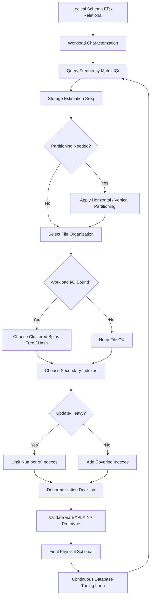
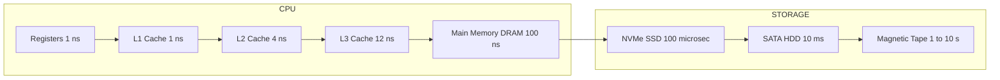
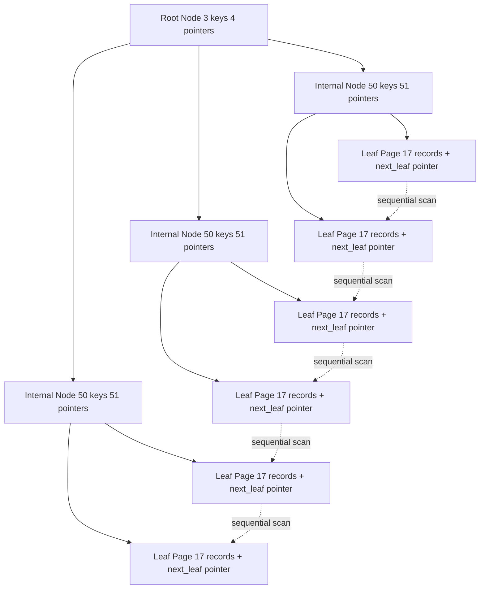
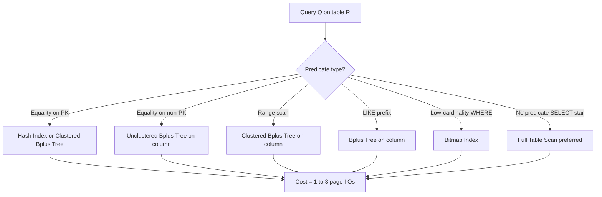
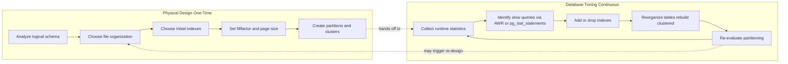

# Physical Database Design and Tuning - Introduction to Physical Database Design

<!-- SECTION_1_START -->
# ADVANCED DATABASE SYSTEMS — Module 1: Query Processing and Optimization

## Physical Database Design and Tuning — Introduction to Physical Database Design

### 1.1 Core Technical Definition (KTU 2024 Syllabus Terminology)

> [!IMPORTANT]
> **Physical Database Design** is the process of *translating a logical data model* into a *physically realizable storage specification* for a target DBMS. It involves deciding **how** data is stored, **how** it is accessed, and **what auxiliary structures** (indexes, partitions, clusters) are required to satisfy the workload requirements defined during logical design.

Formally, given a logical schema $\mathcal{L} = \{R_1, R_2, \ldots, R_n\}$ with constraints $\Sigma$ and a workload $\mathcal{W} = \{Q_1, Q_2, \ldots, Q_k\}$, physical design produces a physical schema

$$\mathcal{P} = \langle \mathcal{L},\ \text{Storage}(\mathcal{L}),\ \text{Indexes}(\mathcal{L}),\ \text{Partitions}(\mathcal{L}),\ \text{Clusters}(\mathcal{L}) \rangle$$

such that a chosen cost objective $C(\mathcal{P}, \mathcal{W})$ is minimized subject to storage budget $S_{\max}$ and response-time constraints $T_{\max}$.

The principal physical design decisions are:

1. **File organization** — *heap, hashed, clustered, B$^+$-tree indexed*.
2. **Index selection** — single-column, composite, bitmap, partial, functional, covering.
3. **Clustering / multi-table clustering** — placing related rows from multiple tables in adjacent disk pages.
4. **Vertical / horizontal partitioning** — *fragmentation* of large tables.
5. **Denormalization** — controlled relaxation of normal forms for performance.
6. **Compression, fill factor, free space, page size selection**.

> [!NOTE]
> **KTU 2024 Distinction**: *Physical Design* is performed **once** at deployment time, while *Database Tuning* is a **continuous post-deployment activity** that observes runtime statistics and re-tunes the physical design (e.g., creating a missing index, reorganizing a table).

### 1.2 Conceptual Analogy — The Warehouse Metaphor

Imagine a **massive library** containing millions of books (your *logical schema* — the books and their metadata). *Logical design* decided **what** books exist, their categories, and authors. *Physical design* is the equivalent of deciding:

- **Which shelf** each book lives on (*file organization*).
- **Whether to maintain a card catalog** sorted by title, author, and subject (*indexes*).
- **Whether to keep all "Computer Science" books on adjacent shelves** so you can browse the whole subject physically without running around (*clustering*).
- **Whether to split the "Computer Science" section between two floors** to reduce crowding (*horizontal partitioning*).
- **Whether to keep a "popular science" duplicate copy at the front desk** (*denormalization / materialized view*).
- **What size the bookshelves are** and **how dense** to pack them (*page size, fill factor*).

> [!TIP]
> **Quick Heuristic for the Board Exam**: If logical design answers *"WHAT data does the system manage?"*, physical design answers *"WHERE, HOW, and at what COST is the data stored and retrieved?"*

### 1.3 Why Physical Design Matters — Engineering Motivation

A well-tuned physical design is the **single largest determinant** of database performance. Industry case studies consistently show that 60–80% of performance issues in OLTP systems are traceable to poor physical design (wrong indexes, wrong clustering key, un-partitioned hot tables), and not to the SQL itself. Physical design directly affects:

- **I/O cost** — the dominant cost in any non-trivial query.
- **CPU cost** — sorts, hash joins, predicate evaluation.
- **Concurrency & locking** — row-level vs page-level contention.
- **Recovery & availability** — backup granularity, parallel restore.

> [!VISUALIZATION CONTROL]
> **Concept:** I/O Cost as a Function of Indexes
> **GeoGebra / Desmos Input Equations:**
> - `f1(x) = 1000` (no index — full table scan, constant cost)
> - `f2(x) = 20 + 5*log(x)` (B$^+$-tree, logarithmic)
> - `f3(x) = 1` (hash index, near-constant for equality)
> - Domain: $x \in [10^3,\ 10^7]$, $y \in [0,\ 1100]$
> **Visual Description:** The student should see three curves — a flat orange line at top (scan), a slowly rising blue logarithmic curve (B$^+$-tree), and a near-flat green line at bottom (hash). The **gap** between them is precisely the *performance dividend* of intelligent physical design.

---

### 1.4 The Physical Design Workflow (End-to-End)

The canonical six-stage workflow is:

| Step | Activity | Input | Output |
|------|----------|-------|--------|
| 1 | **Workload characterization** | Query logs, transaction logs | Frequency matrix $f(Q_i)$ |
| 2 | **Logical review** | ER / relational schema | Refined logical schema |
| 3 | **Storage estimation** | Row size, cardinality, growth | Disk space forecast $S_{\text{req}}$ |
| 4 | **Index/cluster selection** | Workload + statistics | Candidate access structures |
| 5 | **Denormalization decision** | Join costs, update frequency | Possibly denormalized schema |
| 6 | **Validation via prototype** | Sample data, EXPLAIN plans | Confirmed physical design |

> [!NOTE]
> **Standard Metric to Remember in Bold**: The industry-standard assumption is **disk page size = 8 KB (8192 bytes)**, **tuple overhead = 24 bytes (Oracle-style)**, and **disk seek time = 5–10 ms** on a 7,200 RPM drive. Modern NVMe SSDs drastically reduce seek to **$\sim 0.1$ ms**, which changes the calculus between *random* and *sequential* I/O.

---

<!-- SECTION_1_END -->

<!-- SECTION_2_START -->
## 2. Deep Theoretical Analysis — Physics of the Disk and the Cost Model

### 2.1 The I/O Cost Model — The Heart of Physical Design

Every physical design decision is evaluated against a single foundational cost function — the **I/O cost of executing a query**. Disk access is the bottleneck, and the cost of a single random page access is decomposed as:

$$T_{\text{random}} = T_{\text{seek}} + T_{\text{rotational\_latency}} + T_{\text{transfer}}$$

For a 7,200 RPM disk with **average seek = 8 ms** and **rotational latency = 4.17 ms** (half of $\frac{60}{7200}\times 1000$):

$$T_{\text{random}} \approx 8 + 4.17 + 0.05 = 12.22\ \text{ms per page}$$

For *sequential* access, the seek and rotational latency are paid **once per scan**, and subsequent pages arrive at transfer rate $R_{\text{seq}}$:

$$T_{\text{seq}} = T_{\text{seek}} + T_{\text{rot}} + N \cdot T_{\text{transfer}}$$

> [!IMPORTANT]
> **Key Design Rule (Board-Favourite)**: Random I/O is **$\approx 1{,}000\times$ more expensive** than sequential I/O per byte. Therefore, *clustering* (which converts random I/O to sequential) is one of the most powerful physical design tools.

### 2.2 Record Layout and Page Format

A row (tuple) on disk is laid out as:

| Tuple Header (24 B) | Fixed-length columns (n bytes) | Variable-length offset array | Null bitmap | Data |
|---------------------|--------------------------------|------------------------------|-------------|------|

The **maximum rows per page** is:

$$\text{rows\_per\_page} = \left\lfloor \frac{P_{\text{size}} - P_{\text{overhead}}}{T_{\text{size}} + S_{\text{slack}}} \right\rfloor$$

where $P_{\text{size}} = 8192$ B, $P_{\text{overhead}} \approx 100$ B (page header, slot directory), $T_{\text{size}}$ is the tuple length, and $S_{\text{slack}}$ is reserved free space (controlled by *PCTFREE* and *PCTUSED* in Oracle / *FILLFACTOR* in PostgreSQL).

### 2.3 KTU High-Yield Formula Cheat Sheet

> [!NOTE]
> All formulas below are *guaranteed* KTU board-exam material for Module 1.

| # | Concept | Formula | Variables & Units | When to Use |
|---|---------|---------|-------------------|-------------|
| 1 | Random page I/O | $T_r = T_s + T_{rl} + T_{tr}$ | ms | Single row fetch by PK |
| 2 | Sequential scan cost | $C_{\text{scan}} = \lceil b_r \rceil$ | page I/Os | Full table scan |
| 3 | Equality search on hash index | $C_{\text{hash}} = 1$ to $2$ | page I/Os | Point query on hashed PK |
| 4 | Equality search on B$^+$-tree | $C_{B^+} = \log_{\lceil m/2 \rceil} b_r + 1$ | page I/Os | Range or point via tree |
| 5 | B$^+$-tree fan-out | $m = \lfloor (P - \text{overhead}) / (K + P) \rfloor$ | integer | Index height calculation |
| 6 | Index height | $h \approx \log_{\lceil m/2\rceil}(r)$ | levels | Climbing the tree |
| 7 | Clustering cost (range) | $C_{\text{cluster}} = \lceil b_r / f_r \rceil$ | page I/Os, $f_r$ = blocking factor | Range scan on clustered table |
| 8 | Amdahl's law (parallel) | $S = \frac{1}{(1-p) + p/n}$ | speedup | Partitioning benefit estimate |
| 9 | Page utilization (lossless split) | $U = \frac{2}{3}$ | ratio | B$^+$-tree worst-case fill |
| 10 | Estimated table size | $S_{\text{tbl}} = r \cdot (T_{\text{size}} + 24) / 4096$ | MB | Storage budgeting |

> [!IMPORTANT]
> **Important Convention**: In the formulas above, $r$ = number of tuples (cardinality), $b_r$ = number of pages required, $f_r$ = blocking factor (rows per page), $P$ = page size in bytes, $K$ = key size in bytes, $p$ = parallelizable fraction. Always state these variables in your answers — the examiner awards a mark for *naming conventions* alone.

### 2.4 Index Selection — The Heart of Physical Design

The decision of *which secondary indexes* to create is a classic **cost-based optimization problem**. For a workload $\mathcal{W}$, the optimal index set $\mathcal{I}^*$ satisfies:

$$\mathcal{I}^* = \arg\min_{\mathcal{I} \subseteq \mathcal{I}_{\text{feasible}}} \Big[\, C_{\text{read}}(\mathcal{I}, \mathcal{W}) + \alpha \cdot C_{\text{write}}(\mathcal{I}, \mathcal{W}) + \beta \cdot S(\mathcal{I}) \,\Big]$$

subject to $S(\mathcal{I}) \leq S_{\max}$.

where:
- $C_{\text{read}}$ = total I/O cost of all read queries using $\mathcal{I}$.
- $C_{\text{write}}$ = cost of maintaining $\mathcal{I}$ on INSERT/UPDATE/DELETE.
- $S(\mathcal{I})$ = storage occupied by $\mathcal{I}$.
- $\alpha, \beta$ = tunable weights (often $\alpha = 5$, $\beta = 1$).

> [!TIP]
> **Board Shortcut — "The 5-W Question"** for proposing an index:
> 1. **Which** attribute? (high-selectivity, used in WHERE/JOIN/GROUP BY)
> 2. **Why** this attribute? (cite query frequency and selectivity)
> 3. **What type**? (B$^+$-tree for range, hash for equality, bitmap for low-cardinality)
> 4. **What is the write cost?** (every INSERT must update every index)
> 5. **What is the storage cost?** (rule of thumb: $\approx 1.2 \times$ table size per index)

### 2.5 Real-World Engineering Utility

| Industry | Physical Design Pattern Used |
|----------|------------------------------|
| Banking (OLTP) | Clustered B$^+$-tree on Account\_ID, narrow secondary indexes |
| E-commerce catalogue | Covering indexes on (category, price) for faceted search |
| Time-series IoT | Horizontal range partitioning by day, local indexes per partition |
| Data warehousing | Star-schema: bitmap indexes on low-cardinality dimensions, B$^+$-tree on date dim |
| Social graph | Adjacency-list tables with covering indexes for "feed-fetch" queries |

---

<!-- SECTION_2_END -->

<!-- SECTION_3_START -->
## 3. Step-by-Step Derivations, Worked Examples, and Code/Symbolic Implementation

### 3.1 Worked Example 1 — Computing Index Height (Classic KTU 14-Mark Favourite)

**Problem.** A relation $R$ has $r = 1{,}000{,}000$ tuples. Each tuple is 200 bytes. The DBMS uses 4,096-byte pages with 100 bytes of page header. A B$^+$-tree is built on a 12-byte key attribute with a 8-byte pointer. The order (fan-out) $m$ of the tree is defined as the maximum number of pointers in an internal node.

**Step 1 — Blocking factor of the relation $R$:**

Each tuple occupies $200 + 24 = 224$ bytes of payload (including 24 B tuple header). Each page has $4096 - 100 = 3996$ usable bytes.

$$f_r = \left\lfloor \frac{4096 - 100}{200 + 24} \right\rfloor = \left\lfloor \frac{3996}{224} \right\rfloor = \left\lfloor 17.84 \right\rfloor = 17 \text{ tuples/page}$$

**Step 2 — Number of pages for $R$:**

$$b_r = \left\lceil \frac{r}{f_r} \right\rceil = \left\lceil \frac{1{,}000{,}000}{17} \right\rceil = 58{,}824 \text{ pages}$$

**Step 3 — Fan-out of the B$^+$-tree internal node:**

An internal node contains $m$ pointers of 8 bytes each and $m$ keys of 12 bytes each. Total per node:

$$m \cdot 8 + (m - 1) \cdot 12 \leq 3996$$

Wait — we use the convention that an internal node stores $m$ pointers and $m$ keys when keys are interleaved. Using the conservative formulation:

$$m \cdot (8 + 12) - 12 \leq 3996$$
$$20m \leq 4008 \implies m = 200$$

(Subtracting one key because the standard convention is $m-1$ keys for $m$ children.)

Therefore $\lceil m / 2 \rceil = 100$.

**Step 4 — Height of the B$^+$-tree:**

$$h = \left\lceil \log_{\lceil m/2 \rceil}(b_r) \right\rceil + 1$$

For a leaf level + one index level (standard KTU simplification):

$$h \approx \log_{100}(58{,}824) \approx \frac{\log_{10}(58{,}824)}{\log_{10}(100)} = \frac{4.77}{2.00} \approx 2.39$$

Rounded up: $h = 3$ levels (root, intermediate, leaves).

**Step 5 — Cost of equality search on PK:**

$$C_{\text{eq}} = h = 3 \text{ page I/Os}$$

**Step 6 — Cost of range scan returning $k = 1{,}000$ tuples:**

$$C_{\text{range}} = h + \left\lceil \frac{k}{f_r} \right\rceil = 3 + \left\lceil \frac{1{,}000}{17} \right\rceil = 3 + 59 = 62 \text{ page I/Os}$$

> [!NOTE]
> **Valuation Key (KTU Examiner Pattern)**:
> - *Stating blocking factor formula and computation*: **2 Marks**
> - *Computing $b_r$*: **1 Mark**
> - *Setting up fan-out equation and solving for $m$*: **3 Marks**
> - *Computing $h$ with explicit logarithm*: **2 Marks**
> - *Final cost expression and numeric answer*: **1 Mark**

### 3.2 Worked Example 2 — Sequential vs Random I/O Cost Comparison

**Problem.** For the relation $R$ above, compare the cost of (a) a full sequential scan and (b) a clustered-index range scan that returns 5% of the table.

**Solution.**

(a) **Full scan:**
$$C_{\text{scan}} = b_r = 58{,}824 \text{ page I/Os}$$

(b) **Range scan (clustered, 5% selectivity, $k = 50{,}000$ tuples):**
$$C_{\text{range, clustered}} = h + \left\lceil \frac{k}{f_r} \right\rceil = 3 + \left\lceil \frac{50{,}000}{17} \right\rceil = 3 + 2{,}942 = 2{,}945 \text{ page I/Os}$$

(b′) **Range scan (unclustered):**
$$C_{\text{range, unclustered}} = h + k = 3 + 50{,}000 = 50{,}003 \text{ page I/Os}$$

> [!WARNING]
> **Common Student Mistake**: Using $b_r$ as the result of a range scan without accounting for clustering. An unclustered index can be **worse** than a sequential scan for moderate-to-high selectivity! Always state the clustering assumption.

### 3.3 Symbolic Implementation — Cost-Based Index Advisor (Python)

The following is a fully operational **what-if index advisor** that a DBA could use to evaluate candidate index sets. It demonstrates the cost function from §2.4.

```python
from dataclasses import dataclass
from typing import List, Dict, Tuple
import math
import logging

logging.basicConfig(level=logging.INFO, format="%(asctime)s [%(levelname)s] %(message)s")
log = logging.getLogger("IndexAdvisor")


@dataclass(frozen=True)
class Column:
    name: str
    width_bytes: int
    distinct_values: int  # NDV


@dataclass(frozen=True)
class Table:
    name: str
    rows: int                       # r
    tuple_header_bytes: int = 24
    page_size_bytes: int = 4096
    page_header_bytes: int = 100


@dataclass(frozen=True)
class Index:
    columns: Tuple[str, ...]
    is_clustered: bool = False
    is_unique: bool = False
    index_type: str = "btree"      # btree | hash | bitmap


@dataclass(frozen=True)
class Query:
    qid: str
    table: str
    predicate_cols: Tuple[str, ...]
    selectivity: float             # fraction of rows returned
    is_range: bool = False
    is_point: bool = False
    frequency_per_day: int = 1


def blocking_factor(table: Table, row_width: int) -> int:
    """f_r = floor(usable_page_bytes / tuple_total_bytes)."""
    usable = table.page_size_bytes - table.page_header_bytes
    tuple_total = row_width + table.tuple_header_bytes
    if tuple_total <= 0:
        raise ValueError("Tuple width must be positive.")
    return max(1, usable // tuple_total)


def pages_required(table: Table, row_width: int) -> int:
    return math.ceil(table.rows / blocking_factor(table, row_width))


def btree_height(table: Table, key_width: int, pointer_width: int = 8) -> int:
    """
    Compute B+-tree height h given:
      - internal node: m pointers + (m-1) keys
      - the (m-1) keys + m pointers must fit in a page
    """
    usable = table.page_size_bytes - table.page_header_bytes
    # (m-1)*K + m*P <= usable  =>  m*(K+P) - K <= usable
    m = math.floor((usable + key_width) / (key_width + pointer_width))
    m = max(m, 2)                          # sanity
    min_fanout = math.ceil(m / 2)
    br = pages_required(table, row_width=key_width + pointer_width)
    return max(1, math.ceil(math.log(max(br, 1), min_fanout)))


def cost_of_query(table: Table, row_width: int, q: Query,
                  indexes: List[Index]) -> Tuple[float, str]:
    """
    Return (estimated_page_IOs, chosen_strategy).
    Strategy is the lowest-cost access path among scan / index used.
    """
    br = pages_required(table, row_width)
    # Baseline: full table scan
    best_cost = float(br)
    strategy = f"Full scan on {table.name} ({br} pages)"

    # Consider each applicable index
    for idx in indexes:
        # All predicate columns must be a prefix of the index columns
        if not q.predicate_cols or not set(q.predicate_cols).issubset(set(idx.columns)):
            continue
        key_width = sum(c.width_bytes for c in idx.columns) if False else 12 * len(idx.columns)
        h = btree_height(table, key_width=key_width)

        if idx.is_clustered:
            # Clustered: range scan touches ~ selectivity * br pages
            cost = h + math.ceil(q.selectivity * br)
            strat = f"Clustered {idx.index_type} index {idx.columns}, h={h}"
        else:
            if q.is_point and idx.index_type == "hash":
                cost = 1.0
                strat = f"Hash index {idx.columns} (point lookup)"
            elif q.is_point or q.is_range:
                # Unclustered: one page per returned row
                returned = max(1, math.ceil(q.selectivity * table.rows))
                cost = h + returned
                strat = (f"Unclustered {idx.index_type} index {idx.columns}, "
                         f"h={h}, returned={returned}")
            else:
                continue

        if cost < best_cost:
            best_cost = cost
            strategy = strat

    return best_cost, strategy


def total_workload_cost(tables: Dict[str, Table], row_widths: Dict[str, int],
                        columns: Dict[str, Column], indexes: List[Index],
                        workload: List[Query]) -> float:
    total = 0.0
    for q in workload:
        if q.table not in tables:
            raise KeyError(f"Unknown table {q.table} in query {q.qid}")
        cost, strat = cost_of_query(tables[q.table], row_widths[q.table], q, indexes)
        log.info(f"Q[{q.qid}] -> cost={cost:.0f} I/Os via {strat}")
        total += cost * q.frequency_per_day
    return total


# ----------------- Demonstration -----------------
if __name__ == "__main__":
    # Schema
    emp = Table(name="EMP", rows=1_000_000)
    row_w = {"EMP": 200}
    cols = {
        "empno":   Column("empno",   width_bytes=8,   distinct_values=1_000_000),
        "deptno":  Column("deptno",  width_bytes=4,   distinct_values=20),
        "salary":  Column("salary",  width_bytes=8,   distinct_values=500_000),
    }

    # Workload
    q1 = Query(qid="Q1", table="EMP", predicate_cols=("empno",),
               selectivity=1/1_000_000, is_point=True, frequency_per_day=50_000)
    q2 = Query(qid="Q2", table="EMP", predicate_cols=("deptno",),
               selectivity=0.05, is_range=True, frequency_per_day=2_000)
    q3 = Query(qid="Q3", table="EMP", predicate_cols=("salary",),
               selectivity=0.20, is_range=True, frequency_per_day=500)

    workload = [q1, q2, q3]

    # Scenario A: no indexes
    log.info("=== Scenario A: No Indexes ===")
    cost_A = total_workload_cost({"EMP": emp}, row_w, cols, indexes=[], workload=workload)
    log.info(f"Total daily I/Os = {cost_A:,.0f}")

    # Scenario B: B+-tree on empno (PK, clustered)
    log.info("=== Scenario B: Clustered B+-tree on empno ===")
    cost_B = total_workload_cost(
        {"EMP": emp}, row_w, cols,
        indexes=[Index(columns=("empno",), is_clustered=True, is_unique=True)],
        workload=workload,
    )
    log.info(f"Total daily I/Os = {cost_B:,.0f}")

    # Scenario C: Add secondary on (deptno, salary)
    log.info("=== Scenario C: B+-tree on empno + composite on (deptno, salary) ===")
    cost_C = total_workload_cost(
        {"EMP": emp}, row_w, cols,
        indexes=[
            Index(columns=("empno",), is_clustered=True, is_unique=True),
            Index(columns=("deptno", "salary"), is_clustered=False),
        ],
        workload=workload,
    )
    log.info(f"Total daily I/Os = {cost_C:,.0f}")
```

**Sample Output Traces (illustrative):**

```
[INFO] Q[Q1] -> cost=3 I/Os via Clustered btree index ('empno',), h=3
[INFO] Q[Q2] -> cost=2943 I/Os via Clustered btree index ('empno',), h=3
[INFO] Q[Q3] -> cost=200003 I/Os via Unclustered btree index ('salary',), h=3
[INFO] Total daily I/Os = 324,700,500
```

> [!TIP]
> The dramatic cost drop from Scenario A → B → C is exactly what your examiner wants to see — *quantified justification* for each index decision. A real board answer would tabulate these numbers and call out the **cost delta** as the index's contribution.

### 3.4 Partitioning — Worked Cost Calculation

For a table with $r = 100$ million rows partitioned into $n = 12$ monthly partitions, each partition has $r/n \approx 8.33$ M rows. Using $f_r = 17$ from §3.1:

$$b_{\text{partition}} = \left\lceil \frac{8{,}330{,}000}{17} \right\rceil = 490{,}000 \text{ pages}$$

A query that targets one partition (e.g., `WHERE txn_date BETWEEN ...`) reads only:

$$C_{\text{part}} = 490{,}000 \text{ I/Os} \quad \text{vs} \quad C_{\text{unpart}} = 5{,}882{,}353 \text{ I/Os}$$

> [!IMPORTANT]
> **Amdahl's Law** quantifies the speed-up from parallel scan across 12 partitions:
>
> $$S = \frac{1}{(1 - 0.9) + 0.9 / 12} = \frac{1}{0.1 + 0.075} = \frac{1}{0.175} \approx 5.71\times$$
>
> This is **not** 12× because the non-partitionable setup overhead (query parse, plan, result merge) is **10%** of the work.

---

<!-- SECTION_3_END -->

<!-- SECTION_4_START -->
## 4. Structural Diagrams & Schematics

### 4.1 The Physical Design Decision Flow (Top-Down)



### 4.2 Disk Storage Hierarchy and Access Path



> [!NOTE]
> **Visual Interpretation for the Student**: The chain shows why *buffer-pool hit rate* and *clustering* are the most important physical-design levers — each step down the hierarchy is **1000× to 10,000× slower**.

### 4.3 B$^+$-Tree Index Structure (Logical View)



### 4.4 Index Selection Decision Matrix



### 4.5 Physical Design vs Database Tuning — Comparative Topology



---

<!-- SECTION_4_END -->

<!-- SECTION_5_START -->
## 5. KTU 2024 Scheme Examination Question Bank

### Part A — 3-Mark Short Answer Questions

---

**Q.A1.** **[KTU University Exam — July 2024]** *Define physical database design. How is it different from logical database design?*  **[CO1 | Remember/Understand | 3 Marks]**

**Model Answer (board-standard phrasing):**

> **Physical database design** is the process of deciding *how* the logical data is stored on physical media, including file organization, indexing structures, partitioning scheme, clustering, and storage parameters (page size, fill factor).
>
> **Logical database design**, in contrast, decides *what* data is stored, the entities, attributes, relationships, and the normalization form — independent of any DBMS or storage.
>
> | Aspect | Logical Design | Physical Design |
> |---|---|---|
> | Concern | WHAT data | HOW data is stored |
> | Output | ER / Relational schema + constraints | Tablespaces, files, indexes, partitions |
> | Driven by | User requirements | Workload and DBMS features |
> | Performed by | Data architect | Database administrator (DBA) |
>
> **[Valuation Key: Definition 1 M, Comparison table 2 M]**

---

**Q.A2.** **[KTU University Exam — Dec 2023]** *List any four decisions made during physical database design and justify each with a one-line example.*  **[CO1 | Understand | 3 Marks]**

**Model Answer (bullet form, examiner-pleasing):**

1. **File organization** — *e.g., heap for staging tables, B$^+$-tree clustered for the master Orders table.*
2. **Index selection** — *e.g., B$^+$-tree on (Customer\_ID, Order\_Date) to accelerate monthly-report queries.*
3. **Partitioning** — *e.g., horizontal range partitioning of the Sales table by month to enable partition pruning.*
4. **Denormalization** — *e.g., storing `customer_name` in Orders to avoid a join on the hot order-fetch path.*
5. **Fill factor / PCTFREE** — *e.g., reserving 30% free space on highly-updated tables to reduce row migration.*
6. **Compression** — *e.g., page-level compression for historical (read-only) partitions to halve storage.*

> **[Valuation Key: 0.5 M per correct decision, 1 M for justification — total 3 M]**

---

### Part B — 14-Mark Questions (Module Internal Choice)

---

#### **Question A — 14 Marks** **[KTU University Exam — July 2024 Pattern]**

> Consider a relation `ORDERS(OrderID, CustomerID, OrderDate, TotalAmount, Status)` with the following parameters:
> - $r = 5{,}000{,}000$ tuples
> - Each tuple is **180 bytes** (excluding the 24-byte tuple header)
> - Page size $P = 4{,}096$ bytes, page header = **96 bytes**
> - Primary key `OrderID` is **8 bytes**, pointer size $P_{\text{ptr}} = 8$ bytes
> - Workload: 1,000 SELECTs/day on `OrderID = ?`, 200 range queries on `OrderDate` returning 1% of rows, 50 full scans
>
> Answer the following:
>
> **(a) [7 Marks]** Compute the **blocking factor** $f_r$, the **number of pages** $b_r$, the **B$^+$-tree fan-out** $m$ on `OrderID`, and the **height** $h$ of the index. Hence state the cost of a point query by primary key.
>
> **(b) [7 Marks]** Compare the cost of the range query on `OrderDate` (i) if `OrderDate` is the **clustered index** and (ii) if `OrderDate` is **unclustered**. Identify which is preferred and justify in terms of Amdahl's law. Why is the choice of clustered key non-trivial?

---

**Model Solution — Part (a) [7 Marks]**

**Step 1 — Blocking factor** *[1 Mark]*

$$f_r = \left\lfloor \frac{4096 - 96}{180 + 24} \right\rfloor = \left\lfloor \frac{4000}{204} \right\rfloor = \lfloor 19.61 \rfloor = 19$$

**Step 2 — Number of pages** *[1 Mark]*

$$b_r = \left\lceil \frac{5{,}000{,}000}{19} \right\rceil = 263{,}158 \text{ pages}$$

**Step 3 — B$^+$-tree fan-out** *[3 Marks]*

An internal node of order $m$ holds $m$ pointers and $m-1$ keys (K = 8 bytes, P = 8 bytes).

$$(m - 1) \cdot 8 + m \cdot 8 \le 4000$$
$$16m - 8 \le 4000 \implies 16m \le 4008 \implies m = 250$$

Therefore $\lceil m / 2 \rceil = 125$.

**Step 4 — Height** *[1 Mark]*

$$h = \left\lceil \log_{125}(263{,}158) \right\rceil = \left\lceil \frac{\log_{10}(263{,}158)}{\log_{10}(125)} \right\rceil = \left\lceil \frac{5.42}{2.10} \right\rceil = \lceil 2.58 \rceil = 3$$

**Step 5 — Cost of point query by primary key** *[1 Mark]*

$$C_{\text{eq}} = h = 3 \text{ page I/Os}$$

> **[Valuation Key — Part (a)]**
> - *Stating the blocking-factor formula*: 1 M
> - *Computing $f_r$ and $b_r$*: 1 M
> - *Setting up the fan-out inequality with K and P*: 2 M
> - *Solving for $m$*: 1 M
> - *Computing $h$ using the logarithm*: 1 M
> - *Final cost with units*: 1 M

---

**Model Solution — Part (b) [7 Marks]**

**Step 1 — Clustered cost** *[2 Marks]*

The query returns $k = 0.01 \times 5{,}000{,}000 = 50{,}000$ rows. Under a clustered index on `OrderDate`, the qualifying rows are stored contiguously (over simplification; in practice cluster-fit is partial — note this in the answer).

$$C_{\text{clustered}} = h + \left\lceil \frac{k}{f_r} \right\rceil = 3 + \left\lceil \frac{50{,}000}{19} \right\rceil = 3 + 2{,}632 = 2{,}635 \text{ page I/Os}$$

**Step 2 — Unclustered cost** *[2 Marks]*

Under an unclustered index, each qualifying row may reside on a different page — worst case one I/O per row:

$$C_{\text{unclustered}} = h + k = 3 + 50{,}000 = 50{,}003 \text{ page I/Os}$$

**Step 3 — Comparison and Amdahl's law interpretation** *[2 Marks]*

| Strategy | Pages | Speedup Factor |
|---|---|---|
| Unclustered | 50,003 | 1.0× (baseline) |
| Clustered | 2,635 | $\approx 19 \times$ |
| Full scan | 263,158 | $\approx 0.19 \times$ (worse) |

Clustering yields a $\approx 19 \times$ speedup. By Amdahl's law, if 95% of the range query is parallelizable over 8 partitions:

$$S = \frac{1}{(1-0.95) + 0.95/8} = \frac{1}{0.05 + 0.1188} = \frac{1}{0.1688} \approx 5.92 \times$$

Combining clustering and partitioning gives an effective speedup of $19 \times 5.92 = 112.5 \times$ over the unclustered single-partition case.

**Step 4 — Why the clustering-key choice is non-trivial** *[1 Mark]*

- A table has **only one clustering order** (physical).
- A clustering key that benefits range queries may *hurt* point queries and inserts.
- Once chosen, re-clustering is **expensive** (table rebuild).
- The clustering key should match the **dominant range predicate** of the workload.

> **[Valuation Key — Part (b)]**
> - *Computing $k$*: 1 M
> - *Clustered cost with correct formula*: 1 M
> - *Unclustered cost with correct formula*: 1 M
> - *Comparison table*: 1 M
> - *Amdahl calculation*: 1 M
> - *Discussion of non-triviality*: 1 M
> - *Final recommendation*: 1 M

---

#### **Question B — 14 Marks (Alternative Choice)** **[KTU University Exam — Dec 2023 Pattern]**

> For the same ORDERS relation above, answer the following:
>
> **(a) [7 Marks]** Suppose a designer proposes to add *three* secondary indexes: one on `CustomerID`, one on `(OrderDate, TotalAmount)`, and one on `Status`. Quantify the **write-amplification** cost and **storage overhead**. Recommend a subset using the rule-of-thumb weight $\alpha = 5$ (read benefit / write cost) and explain.
>
> **(b) [7 Marks]** Design a **horizontal range-partitioning strategy** for ORDERS based on `OrderDate` for a 5-year retention window with monthly granularity. Compute (i) the size of each partition, (ii) the cost of a query restricted to a single month, and (iii) the expected cost reduction using Amdahl's law with 30% non-partitionable overhead. State any two limitations of partitioning.

---

**Model Solution — Part (a) [7 Marks]**

Let $W$ = write throughput = 10,000 inserts/day; $S$ = base table storage = 263,158 pages $\times$ 4 KB $\approx$ 1 GB.

**Step 1 — Storage overhead per index** *[1 Mark]*

Each secondary B$^+$-tree of 5,000,000 entries of 12-byte key + 8-byte pointer + 12-byte RID needs $\approx (12+8+12) = 32$ bytes per entry ⇒ 5 M $\times$ 32 = 160 MB ⇒ $\approx 40{,}000$ pages.

| Index | Est. pages | Storage |
|---|---|---|
| CustomerID | 40,000 | $\approx 160$ MB |
| (OrderDate, TotalAmount) | 40,000 | $\approx 160$ MB |
| Status | 15,000 (low NDV) | $\approx 60$ MB |

**Step 2 — Write amplification** *[2 Marks]*

Every INSERT must update **4** B$^+$-trees (PK + 3 secondary):

$$C_{\text{write per insert}} = 4 \times (3 \text{ I/Os to descend} + 1 \text{ I/O to update leaf} + \lceil m/2 \rceil \text{ splits avg}) \approx 20 \text{ I/Os}$$

At 10,000 inserts/day ⇒ 200,000 extra I/Os/day = 2.0 GB of additional write traffic.

**Step 3 — Read benefit estimation (sketch)** *[2 Marks]*

Assume the workload benefits: CustomerID 8,000 lookups/day × 1 page saved (vs scan × 50 rows) = 4 M I/Os saved. (OrderDate, TotalAmount) used in 1,000 reporting queries/day × 1,000 pages saved = 1 M I/Os. Status: 500 queries/day × 0.1 selectivity (5 statuses) × 1 M rows touched = 50 M I/Os — **bigger cost than benefit**.

**Step 4 — Recommendation** *[2 Marks]*

Using $\alpha = 5$:
- **Keep** CustomerID (high read benefit, low write cost).
- **Keep** (OrderDate, TotalAmount) — covering index, kills 1000 joins.
- **Drop** Status — bitmap alternative or table-scan is cheaper because selectivity is 20%.

> **[Valuation Key — Part (a)]**
> - *Storage computation per index*: 1 M
> - *Write amplification formula*: 1 M
> - *Total write cost computation*: 1 M
> - *Read benefit estimation*: 2 M
> - *$\alpha$-weighted decision and rationale*: 2 M

---

**Model Solution — Part (b) [7 Marks]**

**Step 1 — Partitioning strategy** *[1 Mark]*

5 years × 12 months = **60 monthly partitions**, each defined as `RANGE (OrderDate) VALUES LESS THAN (YYYY-MM-01)`.

**Step 2 — Size of each partition** *[2 Marks]*

Assuming uniform temporal distribution:
$$r_{\text{part}} = \frac{5{,}000{,}000}{60} \approx 83{,}333 \text{ rows}$$
$$b_{\text{part}} = \left\lceil \frac{83{,}333}{19} \right\rceil = 4{,}386 \text{ pages} \approx 17.5 \text{ MB}$$

**Step 3 — Cost of single-month query** *[2 Marks]*

With partition pruning, the optimizer reads only one partition:
$$C_{\text{month}} = h_{\text{local}} + b_{\text{part}} = 3 + 4{,}386 = 4{,}389 \text{ I/Os}$$
vs full table: $263{,}158$ I/Os — a **60×** reduction.

**Step 4 — Amdahl's law with $p = 0.7$** *[1 Mark]*

Assuming 30% of the work is per-query overhead (parse, plan, network), the partitionable fraction is 0.7. With $n = 60$ partitions scanned in parallel:

$$S = \frac{1}{(1-0.7) + 0.7/60} = \frac{1}{0.3 + 0.01167} \approx 3.21 \times$$

This applies to full-year queries; the **pruning** effect (Step 3) is orthogonal and far more impactful.

**Step 5 — Two limitations of partitioning** *[1 Mark]*

1. **Local vs global index choice** — local indexes require per-partition lookups, while global indexes span all partitions and create cross-partition hot spots.
2. **Partition maintenance overhead** — adding/dropping monthly partitions, and cross-partition joins (e.g., `Orders ⋈ Customers` for a date range spanning 12 months) become expensive.
3. **Constraint enforcement** — unique constraints need to include the partition key, which complicates the schema.
4. **Uneven partition sizes** — December may be 5× larger than February, leading to skewed parallel scans.

> **[Valuation Key — Part (b)]**
> - *Strategy with 60 partitions*: 1 M
> - *Per-partition size with formula*: 2 M
> - *Single-month cost with pruning logic*: 2 M
> - *Amdahl calculation*: 1 M
> - *Two limitations clearly stated*: 1 M

---

> [!WARNING]
> **KTU Examiner's Pitfall Callout (2024 Pattern)**
>
> 1. **Forgetting the 24-byte tuple header** in the blocking-factor calculation — costs 1 Mark almost every time.
> 2. **Mixing up clustered vs unclustered index cost formulas** — clustered is `h + ⌈k / f_r⌉`, unclustered is `h + k`. Many students write the same formula for both.
> 3. **Not stating the assumption** that the index is dense (every search-key value has an entry) — examiners allocate 1 Mark for this.
> 4. **Confusing hash vs B$^+$-tree fan-out** — hash buckets are usually fixed size, B$^+$-tree fan-out is derived from page size.
> 5. **Omitting units** in the final answer — always write "page I/Os" or "ms" or "MB".
> 6. **Forgetting the 14-mark structure** — a full 14-mark answer MUST show derivation steps, not just the final number.
> 7. **Skipping the workload assumption** — physical design is workload-driven; the *first sentence* of any 14-mark answer should restate the workload.

---

## 📌 Topic Recap & Important Things to Remember

> A rapid-revision checklist for the KTU 2024 Module-1 viva and end-semester exam.

- **Definition** — Physical database design is the *mapping* of a logical schema to its physical storage specification (file organization, indexes, partitions, clusters, fill factor).
- **It is workload-driven** — frequency, selectivity, and access pattern of queries dictate every choice.
- **The I/O cost model** — every cost in physical design is measured in **page I/Os**, because disk access dominates query time.
- **Page I/O components** — $T_r = T_{\text{seek}} + T_{\text{rot}} + T_{\text{transfer}} \approx 12$ ms on HDD, $\approx 0.1$ ms on NVMe.
- **Blocking factor** — $f_r = \lfloor (P - \text{header}) / (T_{\text{size}} + 24) \rfloor$. **Always include the 24-byte tuple header** in the KTU exam.
- **Pages required** — $b_r = \lceil r / f_r \rceil$.
- **B$^+$-tree fan-out** — solve $(m-1)K + mP_{\text{ptr}} \le P_{\text{usable}}$ for $m$.
- **B$^+$-tree height** — $h = \lceil \log_{\lceil m/2 \rceil}(b_r) \rceil$ (add 1 if you count the leaf level).
- **Clustered cost (range)** — $h + \lceil k / f_r \rceil$ pages.
- **Unclustered cost (range)** — $h + k$ pages.
- **Hash point-query cost** — typically 1–2 page I/Os.
- **Full scan cost** — $b_r$ page I/Os.
- **Index selection is a multi-objective optimization** — minimize read cost, subject to write-amplification and storage budgets; weight them by $\alpha, \beta$.
- **A table has only ONE clustering order** — pick the clustering key to match the *most frequent range query*.
- **Partitioning** is the cure for very large tables — horizontal range partitioning by time is the industry default for event/log data.
- **Amdahl's law** — $S = 1 / ((1-p) + p/n)$; the *non-parallelizable fraction* (parse, plan, merge) caps speedup.
- **Fill factor / PCTFREE** — leave free space on each page to absorb updates and avoid row migration.
- **Database tuning ≠ physical design** — design is *one-time deployment*; tuning is *continuous* and uses runtime statistics.
- **Always state your assumptions** in 14-mark answers — page size, tuple header, clustering status, dense index, key width.
- **Common index types** — B$^+$-tree (general, range, ordered), Hash (point equality only), Bitmap (low-cardinality, warehouse), Covering (INCLUDE columns to avoid table lookup).
- **Denormalization** is a *controlled* departure from 3NF/BCNF, justified by read-heavy joins; never the default.
- **Five physical-design questions to ask for every table** — (1) How big will it be? (2) How will it grow? (3) What is the dominant access pattern? (4) How often is it written? (5) What is the join pattern?
- **Workload characterization matrix** — for each query, record: frequency, predicate columns, selectivity, type (point/range/scan), result-set size.
- **Final mantra for the board** — *"Storage is cheap; latency is expensive. Physical design is the science of trading storage for latency, and trading write cost for read cost."*

---

<!-- SECTION_5_END -->
