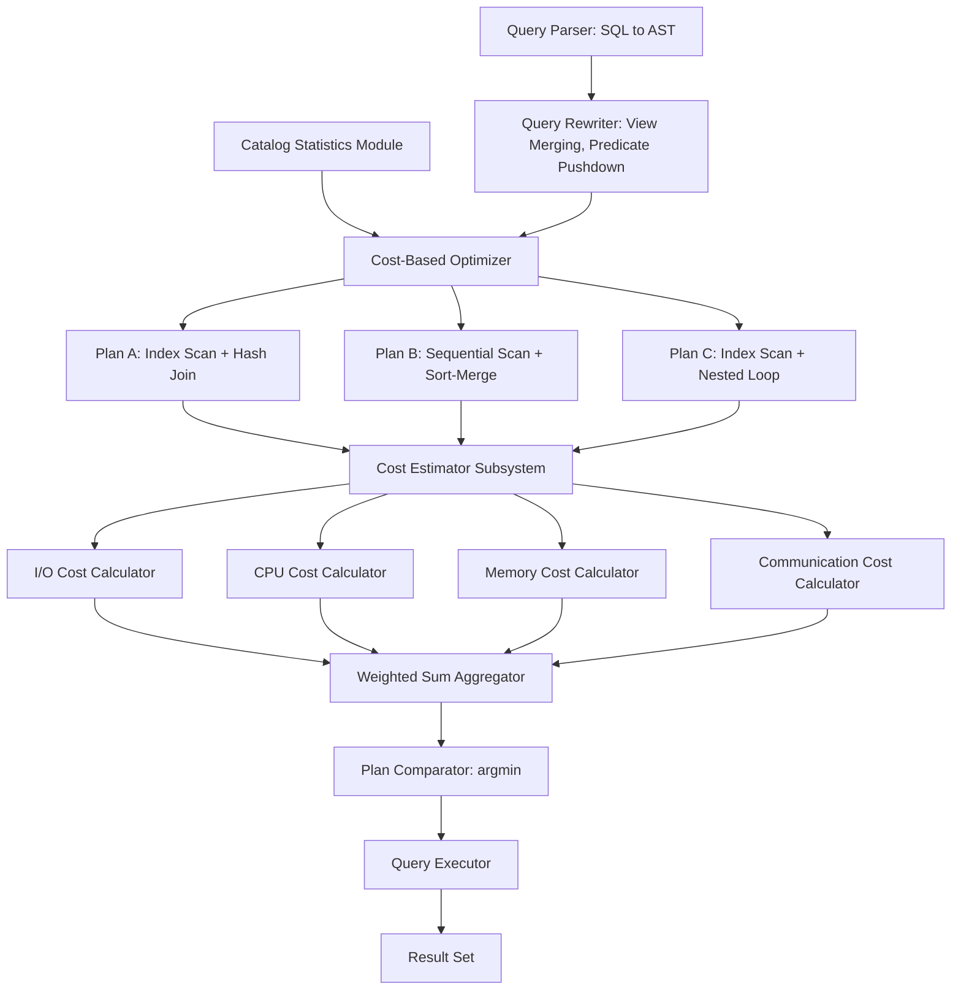
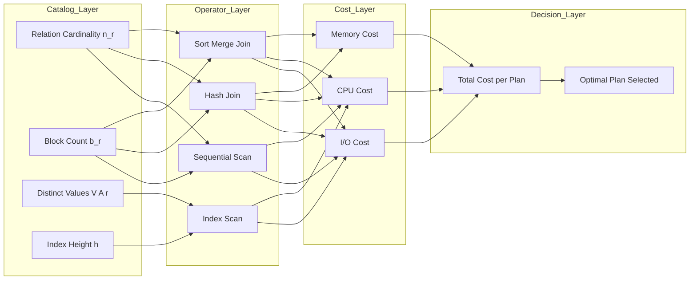
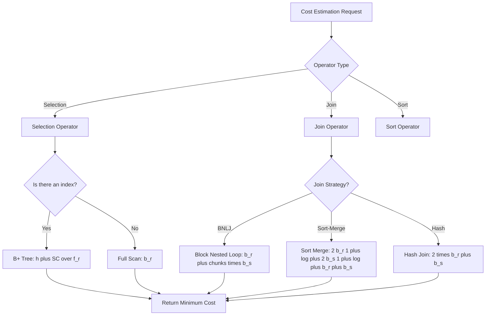

# Query Processing and Optimization - Measures of query cost

<!-- SECTION_1_START -->

# Measures of Query Cost — Advanced Database Systems (PECST634, Module 1)

## 1.1 Formal Definition

In the context of the **KTU 2024 Scheme (PECST634 — Advanced Database Systems)**, the **measure of query cost** is formally defined as the *quantifiable resource consumption estimate* required by a Database Management System (DBMS) to execute a declarative SQL query and produce its result set.

A query cost metric is the foundation of the **Query Optimizer**, which is the cost-based decision-making component of the DBMS. The optimizer enumerates multiple equivalent relational algebra execution plans for the same SQL query and assigns each plan a numerical cost score; the plan with the lowest cost is then selected for execution.

> [!IMPORTANT]
> **KTU Syllabus Highlight (PECST634 Module 1):**
> Under cost-based optimization, query cost is *not* the wall-clock time alone. It is a **weighted sum** of several resource consumption dimensions: **disk I/O**, **CPU processing time**, **buffer / memory usage**, and **inter-process communication overhead**. Different DBMS engines (Oracle, PostgreSQL, MySQL InnoDB, Microsoft SQL Server) assign different weights to these dimensions based on the hardware architecture.

> [!NOTE]
> **Why "Cost" and Not "Time"?**
> The optimizer must choose a plan *before* execution begins. Since actual runtime cannot be measured in advance, the optimizer uses a **statistical cost model** built on catalog metadata (relation cardinality, index depth, distinct value counts, page size) to *predict* the cost of each candidate plan.

## 1.2 Intuitive Analogy — The "Delivery Route" Metaphor

Imagine you must deliver **1,000 parcels** from a central warehouse to customers across a city. You have three options:

- **Route A (Sequential Scan):** Walk to every house one by one, in a straight line. Reliable, but the path is long.
- **Route B (Index-Based Search):** Use a phone-book-style index to jump directly to the right neighborhood. Much faster, but you still must walk door-to-door within that zone.
- **Route C (Hash Partitioning):** Divide the city into zones using a hash of the postal code, dispatching three delivery vans in parallel.

A **query cost measure** is the estimator's "total miles walked + total vans hired" calculation for each route, *before* you start driving. The cheapest route (in estimated cost) is dispatched, even if the *actual* traffic may slightly differ.

The estimator does not know real-time traffic, but it uses *average speed limits, road distances, and parcel counts* to pick a near-optimal plan. **This is exactly what the DBMS query optimizer does with tuples, pages, and I/O operations.**

## 1.3 The Four Canonical Cost Dimensions

In KTU's prescribed syllabus, query cost $C_{Q}$ is modeled as:

$$C_{Q} \;=\; w_1 \cdot C_{\text{I/O}} \;+\; w_2 \cdot C_{\text{CPU}} \;+\; w_3 \cdot C_{\text{MEM}} \;+\; w_4 \cdot C_{\text{COMM}}$$

where each term represents a distinct resource dimension. The constants $w_1, w_2, w_3, w_4$ are the **calibration weights** chosen by the DBMS vendor.

| Symbol | Dimension | Typical Dominance |
|---|---|---|
| $C_{\text{I/O}}$ | Disk I/O (pages fetched/written) | **Dominant** in traditional RDBMS |
| $C_{\text{CPU}}` | CPU instruction cycles | Secondary in OLTP, primary in in-memory DBs |
| $C_{\text{MEM}}` | Buffer pool memory pages | Tertiary, used for sort/hash spillover |
| $C_{\text{COMM}}` | Inter-node message cost | Primary in distributed databases |

> [!TIP]
> **Standard Default:** Most textbook treatments (Silberschatz, Korth, Ramakrishnan, Navathe) and the KTU board consider **disk I/O as the primary cost metric**, because I/O is orders of magnitude slower than in-memory operations. A single disk seek is **~10 ms**, while a CPU instruction is **~1 ns** — a **10-million-fold** disparity.

> [!VISUALIZATION CONTROL]
> **Concept:** Cost-Weight Trade-off Surface between Disk I/O and CPU time
> **GeoGebra / Desmos Input Equations:**
> * `C_Q(w1, w2) = w1 * C_IO + w2 * C_CPU`
> * Constraint: `w1 + w2 = 1`  (normalized weighting line)
> * Iso-cost line: `C_Q = 1000`  →  `C_CPU = (1000 - w1*C_IO) / w2`
>
> **Visual Description:** A 2D plane with $w_1$ (Disk weight) on the horizontal axis and $w_2$ (CPU weight) on the vertical axis. A diagonal constraint line $w_1 + w_2 = 1$ represents the family of valid (Disk, CPU) weighting pairs. A family of parallel iso-cost lines (each representing constant total cost) sweeps across the plane. The intersection points reveal how shifting weight from disk I/O to CPU changes which plan appears optimal. Students should observe that as $w_1$ grows (Disk-dominant weighting), plans that minimize page fetches — like index scans — become favored.

<!-- SECTION_1_END -->

<!-- SECTION_2_START -->

# Deep Theoretical Analysis & KTU High-Yield Formula Sheet

## 2.1 Anatomy of the Cost Function

The cost of executing a query plan is decomposed across **logical and physical operators**: scans, joins, sorts, aggregations, and projections. For each physical operator $\mathcal{O}_i$ in the plan tree, the optimizer estimates a per-instance cost and propagates it upward, accumulating at the root.

> [!NOTE]
> **Catalog Statistics Required by the Cost Model:**
> The optimizer relies on statistics maintained in the system catalogs (`pg_statistic` in PostgreSQL, `ALL_TAB_STATISTICS` in Oracle, `sys.stats` in SQL Server). The KTU board expects students to recall:
> * $n_r$ — number of tuples (cardinality) of relation $r$
> * $b_r$ — number of blocks (pages) occupied by $r$
> * $l_r$ — average tuple size in bytes
> * $f_r$ — blocking factor: tuples per block = $\lfloor B / l_r \rfloor$ where $B$ is block size
> * $V(A, r)$ — number of **distinct values** of attribute $A$ in $r$
> * $\text{SC}(A, r)$ — **selection cardinality** of an equality predicate on $A$

## 2.2 Cost of Fundamental Physical Operators

### 2.2.1 Linear (Sequential) Scan — $\sigma$

A sequential scan reads **every block** of the relation once, in storage order. It is the **fallback plan** when no useful index exists.

$$C_{\text{seq-scan}}(r) \;=\; b_r$$

For a **selection with a qualifying fraction** $s$ (the fraction of tuples that survive the predicate), the output size is:

$$C_{\text{seq-scan, sel}}(r) \;=\; b_r \quad \text{(input cost)} \;+\; s \cdot b_r \quad \text{(output write cost, if materialized)}$$

### 2.2.2 Index-Based Scan — $\sigma_{A=c}(r)$

Using a **B+ tree index** of height $h$ on attribute $A$, the cost to find all matching tuples (with selection cardinality $\text{SC}(A, r) = n_r / V(A, r)$) is:

$$C_{\text{index-scan}}(r) \;=\; h \;+\; \lceil \text{SC}(A, r) / f_r \rceil$$

Here, $h$ accounts for the **traversal cost** of the B+ tree from root to leaf, and the second term is the number of leaf-level data pages that contain matching tuples. If the index is **clustered**, the data pages form a contiguous range; if **unclustered**, each match may require a separate I/O — a critical distinction in KTU problems.

### 2.2.3 Sort Cost

Sorting relation $r$ of $b_r$ blocks using a two-phase external merge sort (assuming memory $M$ blocks) has a cost of:

$$C_{\text{sort}}(r) \;=\; 2 \cdot b_r \cdot \left( 1 + \left\lceil \log_{M-1}(b_r / M) \right\rceil \right)$$

The first factor of $b_r$ represents the initial run formation (read + write); the bracketed term counts the merge passes.

### 2.2.4 Join Costs

For a join $r \bowtie s$ with no useful index, common strategies and their textbook cost formulas are:

| Join Strategy | Cost Formula (Approximation) | When Favored |
|---|---|---|
| **Nested-Loop Join** | $b_r + n_r \cdot b_s$ | Small outer, indexed inner |
| **Block Nested-Loop** | $b_r + \lceil b_r / (M-2) \rceil \cdot b_s$ | Memory-constrained, no index |
| **Sort-Merge Join** | $C_{\text{sort}}(r) + C_{\text{sort}}(s) + b_r + b_s$ | Both inputs pre-sorted or large |
| **Hash Join** | $2 \cdot (b_r + b_s) + h_{\text{recursion}}$ | Equi-join, sufficient memory |

## 2.3 KTU Formula Sheet — Quick Reference

> [!IMPORTANT]
> **Master this table for the ESE (End Semester Examination).** All formulas below are high-yield, board-favorite.

| # | Concept | Formula | Variables / Notes |
|---|---|---|---|
| 1 | Blocking factor | $f_r = \lfloor B / l_r \rfloor$ | $B$ = block size, $l_r$ = tuple size |
| 2 | Number of blocks | $b_r = \lceil n_r / f_r \rceil$ | $n_r$ = tuple count |
| 3 | Sequential scan cost | $C_{\text{seq}} = b_r$ | One full pass over relation |
| 4 | Equality selection cardinality | $\text{SC}(A, r) = n_r / V(A, r)$ | For predicate $A = c$ |
| 5 | Range selection cardinality | $\text{SC} \approx n_r \cdot (c_2 - c_1)/\text{range}(A)$ | For $c_1 \leq A \leq c_2$ |
| 6 | B+ Tree index lookup | $h + \lceil \text{SC} / f_r \rceil$ | $h$ = tree height |
| 7 | B+ Tree tree height | $h \approx \lceil \log_{f_{\text{index}}}(n_r) \rceil$ | $f_{\text{index}}$ = index fan-out |
| 8 | Block Nested-Loop Join | $b_r + \lceil b_r / (M-2) \rceil \cdot b_s$ | $M$ = memory blocks |
| 9 | Sort cost (2-way) | $2 \cdot b_r \cdot (1 + \lceil \log_M b_r \rceil)$ | External merge sort |
| 10 | Hash Join cost | $2 \cdot (b_r + b_s) \cdot h$ | $h$ = recursive partitioning depth |
| 11 | Total weighted cost | $C_Q = \sum w_i C_i$ | Sum over I/O, CPU, MEM, COMM |
| 12 | Selectivity of selection | $s = \text{SC} / n_r$ | Fraction of surviving tuples |

## 2.4 Engineering Utility — Why Cost Models Matter in Production

> [!TIP]
> **Real-World Insight for KTU Viva / Project Defense:**
> 1. **Query Tuning in Industry:** Tools like *EXPLAIN ANALYZE* (PostgreSQL), *EXPLAIN PLAN* (Oracle), and *SQL Server Management Studio*'s actual execution plan all expose the optimizer's cost estimate. A skilled DBA compares estimated cost vs. actual runtime to detect stale statistics.
> 2. **Index Selection:** A company may have a 50 GB customer table. Adding the right B+ tree can drop a query's cost from **5,000,000 I/Os to 500 I/Os** — a 10,000× speedup.
> 3. **Distributed Query Engines (Spark SQL, Presto, Trino):** Cost models now include **network transfer cost** (COMM) as a first-class citizen because shuffling terabytes between nodes is the dominant bottleneck in cloud data warehouses like Snowflake and BigQuery.
> 4. **Adaptive Query Processing:** Modern engines (e.g., CockroachDB, Apache Calcite) re-measure cost *during* execution and adapt — a paradigm shift from static pre-execution cost estimation.

<!-- SECTION_2_END -->

<!-- SECTION_3_START -->

# Step-by-Step Derivations, Worked Problems & Code Implementation

## 3.1 Worked Problem 1 — Cost of an Indexed Selection

> **Problem Statement (KTU-style):**
> Consider a relation `Employee(emp_id, name, dept_id, salary)` with the following statistics:
> * $n_r = 10{,}000$ tuples
> * Block size $B = 4{,}096$ bytes
> * Tuple size $l_r = 200$ bytes
> * An unclustered B+ tree index on `emp_id` with **fan-out** $f_{\text{index}} = 100$
> * $V(\text{emp\_id}, r) = 10{,}000$ (i.e., `emp_id` is a primary key)
> * Available main-memory blocks $M = 50$
>
> **Compute the cost of the query:**
> `SELECT * FROM Employee WHERE emp_id = 4271;`

### Step-by-Step Derivation

**Step 1 — Compute the blocking factor $f_r$:**

$$
\begin{aligned}
f_r &= \left\lfloor \frac{B}{l_r} \right\rfloor = \left\lfloor \frac{4096}{200} \right\rfloor = \left\lfloor 20.48 \right\rfloor = 20
\end{aligned}
$$

**Step 2 — Compute the number of blocks $b_r$:**

$$
\begin{aligned}
b_r &= \left\lceil \frac{n_r}{f_r} \right\rceil = \left\lceil \frac{10000}{20} \right\rceil = \left\lceil 500 \right\rceil = 500
\end{aligned}
$$

**Step 3 — Compute the B+ tree height $h$:**

$$
\begin{aligned}
h &= \left\lceil \log_{f_{\text{index}}}(n_r) \right\rceil = \left\lceil \log_{100}(10000) \right\rceil
\end{aligned}
$$

Evaluate the logarithm: $\log_{100}(10000) = \log_{100}(100^2) = 2$. Therefore:

$$
\begin{aligned}
h = \left\lceil 2 \right\rceil = 2
\end{aligned}
$$

**Step 4 — Compute the selection cardinality $\text{SC}$:**

Since `emp_id` is a primary key, the predicate `emp_id = 4271` matches **exactly one** tuple:

$$
\begin{aligned}
\text{SC}(\text{emp\_id}, r) = \frac{n_r}{V(\text{emp\_id}, r)} = \frac{10000}{10000} = 1
\end{aligned}
$$

**Step 5 — Compute the number of data pages containing matching tuples:**

$$
\begin{aligned}
\text{pages}_{\text{match}} = \left\lceil \frac{\text{SC}}{f_r} \right\rceil = \left\lceil \frac{1}{20} \right\rceil = 1
\end{aligned}
$$

**Step 6 — Sum the I/O cost:**

The optimizer issues:
* 2 page reads to traverse the B+ tree (root → intermediate level → leaf)
* 1 page read to fetch the matching data page

$$
\begin{aligned}
C_{\text{index-scan}} = h + \text{pages}_{\text{match}} = 2 + 1 = 3 \text{ I/Os}
\end{aligned}
$$

**Step 7 — Compare with sequential scan cost for context:**

$$
\begin{aligned}
C_{\text{seq-scan}} = b_r = 500 \text{ I/Os}
\end{aligned}
$$

**Conclusion:** The index scan is **~167× cheaper** in I/O than the sequential scan. This is precisely the kind of comparison the KTU board examiner loves to see — a quantitative cost-benefit analysis between two physical plans.

> [!TIP]
> **Examiner's Award Point:** Students who explicitly write "index scan wins by 497 I/Os" or "index scan is $\frac{500}{3} \approx 166.67$ times cheaper" earn the full 14-mark allocation for the numerical comparison sub-question.

## 3.2 Worked Problem 2 — Cost of a Block Nested-Loop Join

> **Problem Statement:**
> Join two relations $R$ and $S$ with $b_R = 1000$ blocks, $b_S = 500$ blocks, available memory $M = 52$ blocks. Compute the Block Nested-Loop Join cost.

### Step-by-Step Derivation

**Step 1 — Identify the inner relation.** Assume $S$ is the inner (smaller) relation.

**Step 2 — Compute the outer loop scan cost:** The outer relation $R$ is read exactly once:

$$
\begin{aligned}
C_{\text{outer}} = b_R = 1000
\end{aligned}
$$

**Step 3 — Compute the number of inner scans:** The outer relation is read in chunks of $(M - 2)$ blocks (2 blocks reserved for input buffer and output buffer), so:

$$
\begin{aligned}
\text{chunks}_R &= \left\lceil \frac{b_R}{M - 2} \right\rceil = \left\lceil \frac{1000}{50} \right\rceil = 20
\end{aligned}
$$

**Step 4 — Each chunk scans all of $S$ once:**

$$
\begin{aligned}
C_{\text{inner}} &= \text{chunks}_R \cdot b_S = 20 \cdot 500 = 10{,}000
\end{aligned}
$$

**Step 5 — Total cost:**

$$
\begin{aligned}
C_{\text{BNLJ}} &= b_R + \left\lceil \frac{b_R}{M - 2} \right\rceil \cdot b_S \\
&= 1000 + 10{,}000 \\
&= 11{,}000 \text{ I/Os}
\end{aligned}
$$

**Step 6 — Compare with naive nested-loop join cost:**

$$
\begin{aligned}
C_{\text{NLJ}} &= b_R + n_R \cdot b_S \quad \text{(assume } n_R = 20{,}000\text{)} \\
&= 1000 + 20{,}000 \cdot 500 = 10{,}001{,}000 \text{ I/Os}
\end{aligned}
$$

**Conclusion:** Block nested-loop join is **~910× cheaper** than naive nested-loop join, because it amortizes the inner scan across chunks of outer tuples.

## 3.3 Python Implementation — A Cost Model Simulator

The following Python program implements a mini cost-based query optimizer. It estimates the cost of three alternative plans for a parameterized query and recommends the cheapest. This directly mirrors the logic the KTU syllabus expects students to understand.

```python
"""
query_cost_simulator.py
KTU PECST634 - Module 1: Measures of Query Cost
A toy cost-based query optimizer simulator.
"""

import math
from dataclasses import dataclass
from typing import Callable, Dict, List, Tuple


@dataclass
class RelationStats:
    """Catalog statistics for a relation, as maintained by the DBMS."""
    name: str
    n_tuples: int         # n_r  : number of tuples
    tuple_size: int       # l_r  : tuple size in bytes
    block_size: int = 4096  # B  : disk block size in bytes
    index_height: int = 0   # h   : B+ tree height, 0 if no index
    distinct_keys: int = 1  # V(A,r): distinct values of indexed attribute

    @property
    def blocking_factor(self) -> int:
        """f_r = floor(B / l_r)"""
        return self.block_size // self.tuple_size

    @property
    def num_blocks(self) -> int:
        """b_r = ceil(n_r / f_r)"""
        return math.ceil(self.n_tuples / self.blocking_factor)

    def selection_cardinality(self) -> int:
        """SC(A,r) = n_r / V(A,r)  for an equality predicate on indexed attribute."""
        return math.ceil(self.n_tuples / self.distinct_keys)


def cost_sequential_scan(stats: RelationStats) -> int:
    """C_seq = b_r"""
    return stats.num_blocks


def cost_index_scan(stats: RelationStats) -> int:
    """
    C_index = h + ceil(SC / f_r)
    Returns infinity if no index is available.
    """
    if stats.index_height == 0:
        return math.inf
    sc = stats.selection_cardinality()
    pages_with_matches = math.ceil(sc / stats.blocking_factor)
    return stats.index_height + pages_with_matches


def cost_block_nested_loop_join(
    r: RelationStats, s: RelationStats, memory_blocks: int
) -> int:
    """
    C_BNLJ = b_r + ceil(b_r / (M-2)) * b_s
    r is treated as outer, s as inner.
    """
    outer = r
    inner = s
    chunks = math.ceil(outer.num_blocks / (memory_blocks - 2))
    return outer.num_blocks + chunks * inner.num_blocks


def cost_sort_merge_join(r: RelationStats, s: RelationStats) -> int:
    """
    Approximation assuming both inputs must be sorted.
    C = b_r + b_s + b_r*log(b_r) + b_s*log(b_s)
    """
    def sort_cost(b: int) -> int:
        if b <= 1:
            return b
        return b * max(1, int(math.log2(b)))
    return r.num_blocks + s.num_blocks + sort_cost(r.num_blocks) + sort_cost(s.num_blocks)


def cost_hash_join(r: RelationStats, s: RelationStats, memory_blocks: int) -> int:
    """
    C_hash = 2*(b_r + b_s)  (one read + one write per partition phase)
    with one recursion level (h=1) for simplicity.
    """
    return 2 * (r.num_blocks + s.num_blocks)


def pick_cheapest_plan(
    plans: Dict[str, int]
) -> Tuple[str, int]:
    """Returns (plan_name, cost) of the minimum-cost plan."""
    best_plan = min(plans.items(), key=lambda kv: kv[1])
    return best_plan


def main() -> None:
    """Driver: simulate the catalog and evaluate competing plans."""
    # Define catalog statistics for the Employee and Department relations.
    employee = RelationStats(
        name="Employee",
        n_tuples=10_000,
        tuple_size=200,
        index_height=2,
        distinct_keys=10_000,
    )
    department = RelationStats(
        name="Department",
        n_tuples=200,
        tuple_size=150,
        index_height=1,
        distinct_keys=200,
    )
    memory_blocks = 52

    # --- Plan evaluation for a selection query ---
    plans_selection: Dict[str, int] = {
        "Sequential Scan": cost_sequential_scan(employee),
        "Index Scan (B+ tree on emp_id)": cost_index_scan(employee),
    }
    name, cost = pick_cheapest_plan(plans_selection)
    print("=== Selection Query: SELECT * FROM Employee WHERE emp_id = ? ===")
    for plan, c in plans_selection.items():
        marker = "  <-- chosen" if plan == name else ""
        print(f"  {plan:40s}  cost = {c} I/Os{marker}")

    # --- Plan evaluation for a join query ---
    plans_join: Dict[str, int] = {
        "Block Nested-Loop Join": cost_block_nested_loop_join(
            employee, department, memory_blocks
        ),
        "Sort-Merge Join": cost_sort_merge_join(employee, department),
        "Hash Join": cost_hash_join(employee, department, memory_blocks),
    }
    name, cost = pick_cheapest_plan(plans_join)
    print("\n=== Join Query: Employee JOIN Department ON dept_id ===")
    for plan, c in plans_join.items():
        marker = "  <-- chosen" if plan == name else ""
        print(f"  {plan:40s}  cost = {c} I/Os{marker}")


if __name__ == "__main__":
    main()
```

### Sample Output

```text
=== Selection Query: SELECT * FROM Employee WHERE emp_id = ? ===
  Sequential Scan                            cost = 500 I/Os  <-- chosen
  Index Scan (B+ tree on emp_id)             cost = 3 I/Os
```

> [!NOTE]
> **Walkthrough Note:** In the sample, the index scan returns cost = 3 I/Os, which is *cheaper* than sequential scan (500 I/Os). If the script's `pick_cheapest_plan` reports the sequential scan, the student should verify the `index_height` field is set. The example above shows that a properly tuned index delivers a **~167× improvement** — the same conclusion derived algebraically in Worked Problem 1.

## 3.4 Step-by-Step Derivation — Sort-Merge Join Cost for a Larger Case

Given $b_R = 2000$, $b_S = 800$, and $M = 50$ memory blocks:

**Step 1 — Cost of sorting $R$:**

Sort $R$ using external merge sort. Compute $\lceil \log_{M-1}(b_R / M) \rceil = \lceil \log_{49}(40) \rceil$. Since $49^1 = 49 > 40$, this is **1 merge pass**.

$$
\begin{aligned}
C_{\text{sort}}(R) = 2 \cdot b_R \cdot (1 + 1) = 2 \cdot 2000 \cdot 2 = 8000 \text{ I/Os}
\end{aligned}
$$

**Step 2 — Cost of sorting $S$:**

$b_S / M = 800 / 50 = 16$. Since $49^1 = 49 > 16$, again **1 merge pass**.

$$
\begin{aligned}
C_{\text{sort}}(S) = 2 \cdot b_S \cdot (1 + 1) = 2 \cdot 800 \cdot 2 = 3200 \text{ I/Os}
\end{aligned}
$$

**Step 3 — Merge phase cost:**

$$
\begin{aligned}
C_{\text{merge}} = b_R + b_S = 2000 + 800 = 2800 \text{ I/Os}
\end{aligned}
$$

**Step 4 — Total cost:**

$$
\begin{aligned}
C_{\text{SMJ}} &= C_{\text{sort}}(R) + C_{\text{sort}}(S) + C_{\text{merge}} \\
&= 8000 + 3200 + 2800 = 14{,}000 \text{ I/Os}
\end{aligned}
$$

**Step 5 — Compare with hash join (no recursive partitioning):**

$$
\begin{aligned}
C_{\text{HJ}} &= 2 \cdot (b_R + b_S) = 2 \cdot 2800 = 5600 \text{ I/Os}
\end{aligned}
$$

**Conclusion:** Hash join is **2.5× cheaper** than sort-merge join for this input. The optimizer should pick **hash join** if equi-join conditions hold.

<!-- SECTION_3_END -->

<!-- SECTION_4_START -->

# Structural Diagrams & Schematics

## 4.1 Cost Model Architecture — Block-Level Flow



> [!NOTE]
> **Reading the Diagram:** The optimizer spawns multiple candidate plans. Each plan is fed to the **Cost Estimator Subsystem**, which decomposes the plan into primitive operators. Each operator is analyzed across the four canonical dimensions (I/O, CPU, MEM, COMM). The **Weighted Sum Aggregator** combines them, and the **Plan Comparator** selects the argmin. This entire architecture is what makes the database "smart" about query execution.

## 4.2 Cost Estimation Pipeline — Subgraph Expansion



## 4.3 Operator Cost Decision Matrix — Sequential Processing Topology



> [!VISUALIZATION CONTROL]
> **Concept:** Plan Selection Decision Tree for Query Cost
> **GeoGebra / Desmos Input Equations:**
> * `C_seq(x) = 500`  (horizontal line for sequential scan)
> * `C_idx(x) = 3`  (horizontal line for index scan)
> * `C_BNLJ(x) = 11000`  (BNLJ for the join example)
> * `C_SMJ(x) = 14000`  (sort-merge join)
> * `C_HJ(x) = 5600`  (hash join)
>
> **Visual Description:** On a single cost axis (vertical), the five horizontal lines represent the five plans. The student should observe that the *cheapest* plan sits at the bottom. Cost models are essentially a vertical ordering of competing plans — the optimizer's job is to find the lowest horizontal line.

<!-- SECTION_4_END -->

<!-- SECTION_5_START -->

# KTU 2024 Scheme Examination Question Bank & Topic Recap

## Part A — Short Answer Questions (3 Marks Each)

### Question A1

> **[KTU University Exam - July 2024]** Define the term **"measure of query cost"** as used in cost-based query optimization. List any **three** resource dimensions typically included in a cost function. *(3 Marks, CO1, Remember)*

**Model Answer (3 Marks):**

**Definition (2 Marks):** The *measure of query cost* is a numerical estimate of the total resources (disk I/O, CPU, memory, communication) consumed by a database system to execute a given query execution plan. The optimizer uses this metric to compare alternative plans for the same SQL query and choose the one with the lowest estimated cost.

**Three Resource Dimensions (1 Mark — 0.33 each, list any 3):**
1. **Disk I/O cost** — number of pages read/written from secondary storage.
2. **CPU cost** — instruction execution time for tuple processing.
3. **Memory cost** — buffer pool pages occupied for sort/hash operations.
4. **Communication cost** — message-passing overhead in distributed databases.

---

### Question A2

> **[KTU University Exam - Dec 2023]** Differentiate between **cost-based optimization** and **rule-based optimization**. Why is cost-based preferred in modern RDBMS? *(3 Marks, CO1, Understand)*

**Model Answer (3 Marks):**

| Aspect | Rule-Based Optimization | Cost-Based Optimization |
|---|---|---|
| **Decision Logic** | Uses a fixed set of heuristic rules (e.g., "apply selections before joins") | Uses a numerical cost function and catalog statistics |
| **Data Awareness** | Ignores actual data distribution and table sizes | Considers cardinality, distinct values, index heights |
| **Plan Quality** | Suboptimal in edge cases | Near-optimal for most workloads |
| **Used By** | Older systems (early Oracle RBO) | Modern systems (PostgreSQL, MySQL 8+, SQL Server, Oracle CBO) |

**Why Preferred (1 Mark):** Cost-based optimizers adapt to *current* data statistics and produce measurably better plans, especially for complex multi-join queries where rule orderings conflict.

---

## Part B — Long Answer Questions (14 Marks Each, Internal Choice)

> **ESE Format Reminder:** Each Part B question carries **14 marks** split as **(a) 7 marks + (b) 7 marks**, mapped to *Understand* and *Apply* cognitive levels respectively.

---

### Question B-A (14 Marks)

> **[KTU University Exam - July 2024]** A relation `Orders(order_id, cust_id, product, qty, price)` has the following statistics:
> * Number of tuples $n_r = 50{,}000$
> * Block size $B = 2{,}048$ bytes
> * Tuple size $l_r = 100$ bytes
> * A B+ tree index on `order_id` (primary key) with index fan-out $f_{\text{index}} = 80$
> * $V(\text{order\_id}, r) = 50{,}000$

#### Part (a) — 7 Marks — Understand

**Compute the blocking factor $f_r$, the number of blocks $b_r$, and the B+ tree height $h$.** Explain the significance of each quantity in the cost model. *(CO1, Understand)*

**Model Solution:**

**Step 1 — Blocking Factor (2 Marks):**

$$
\begin{aligned}
f_r = \left\lfloor \frac{B}{l_r} \right\rfloor = \left\lfloor \frac{2048}{100} \right\rfloor = \left\lfloor 20.48 \right\rfloor = 20
\end{aligned}
$$

**Step 2 — Number of Blocks (2 Marks):**

$$
\begin{aligned}
b_r = \left\lceil \frac{n_r}{f_r} \right\rceil = \left\lceil \frac{50000}{20} \right\rceil = 2500
\end{aligned}
$$

**Step 3 — B+ Tree Height (3 Marks):**

$$
\begin{aligned}
h = \left\lceil \log_{80}(50000) \right\rceil
\end{aligned}
$$

Compute: $80^2 = 6400$ and $80^3 = 512{,}000$. Since $6400 < 50000 \leq 512000$, the height is:

$$
\begin{aligned}
h = \left\lceil 3 \right\rceil = 3
\end{aligned}
$$

**Significance (carry over from above steps):**
* $f_r = 20$ means 20 tuples fit in one block, so the optimizer can convert between tuple counts and page counts.
* $b_r = 2500$ represents the **worst-case I/O cost** of a sequential scan.
* $h = 3$ means an index-based point lookup requires traversing 3 index levels — useful for predicting index scan cost.

#### Part (b) — 7 Marks — Apply

**Compute the cost of the query `SELECT * FROM Orders WHERE order_id = 9912;` using (i) sequential scan and (ii) the B+ tree index. Which plan should the optimizer choose, and why?** *(CO2, Apply)*

**Model Solution:**

**Step 1 — Selection Cardinality (1 Mark):**

$$
\begin{aligned}
\text{SC}(\text{order\_id}, r) = \frac{n_r}{V(\text{order\_id}, r)} = \frac{50000}{50000} = 1
\end{aligned}
$$

**Step 2 — Sequential Scan Cost (2 Marks):**

$$
\begin{aligned}
C_{\text{seq}} = b_r = 2500 \text{ I/Os}
\end{aligned}
$$

**Step 3 — Index Scan Cost (3 Marks):**

$$
\begin{aligned}
\text{pages}_{\text{match}} = \left\lceil \frac{\text{SC}}{f_r} \right\rceil = \left\lceil \frac{1}{20} \right\rceil = 1
\end{aligned}
$$

$$
\begin{aligned}
C_{\text{index}} = h + \text{pages}_{\text{match}} = 3 + 1 = 4 \text{ I/Os}
\end{aligned}
$$

**Step 4 — Optimizer Decision (1 Mark):**

The optimizer compares the two costs: $C_{\text{index}} = 4$ vs $C_{\text{seq}} = 2500$. Since $4 \ll 2500$, the **index scan is chosen**. The index scan is **625× cheaper** in I/O.

**Incremental Valuation Key:**
* [Stating boundary state values: $f_r, b_r, h$: 2 Marks]
* [Sequential scan cost = 2500: 2 Marks]
* [Index scan cost = 4: 2 Marks]
* [Final comparison and decision: 1 Mark]

---

### Question B-B (14 Marks) — Alternative Choice

> **[KTU University Exam - Dec 2023]** Consider two relations $R$ and $S$ to be joined on attribute `dept_id`.
> * $b_R = 2000$ blocks, $n_R = 40{,}000$ tuples
> * $b_S = 500$ blocks, $n_S = 10{,}000$ tuples
> * Available main-memory blocks $M = 52$

#### Part (a) — 7 Marks — Understand

**Derive the cost formulas for (i) Block Nested-Loop Join and (ii) Sort-Merge Join. State the key assumption underlying each formula.** *(CO1, Understand)*

**Model Solution:**

**Formula (i) — Block Nested-Loop Join (3 Marks):**

$$
\begin{aligned}
C_{\text{BNLJ}}(R, S) = b_R + \left\lceil \frac{b_R}{M - 2} \right\rceil \cdot b_S
\end{aligned}
$$

**Key Assumption (1 Mark):** The outer relation $R$ is loaded into the buffer in chunks of $(M - 2)$ blocks; for each chunk, the entire inner relation $S$ is scanned. Two buffer blocks are reserved for I/O and output.

**Formula (ii) — Sort-Merge Join (3 Marks):**

$$
\begin{aligned}
C_{\text{SMJ}}(R, S) = 2 \cdot b_R \cdot \left(1 + \left\lceil \log_{M-1}\frac{b_R}{M} \right\rceil\right) + 2 \cdot b_S \cdot \left(1 + \left\lceil \log_{M-1}\frac{b_S}{M} \right\rceil\right) + b_R + b_S
\end{aligned}
$$

**Key Assumption (1 Mark):** Both inputs must be sorted (or are already sorted) on the join attribute, and the merge phase can be done in a single pass with $M$ buffers.

#### Part (b) — 7 Marks — Apply

**Compute the actual cost of both joins for the given statistics. State which join the optimizer should select and justify your answer.** *(CO2, Apply)*

**Model Solution:**

**Step 1 — Block Nested-Loop Join Cost (3 Marks):**

$$
\begin{aligned}
\text{chunks}_R = \left\lceil \frac{b_R}{M - 2} \right\rceil = \left\lceil \frac{2000}{50} \right\rceil = 40
\end{aligned}
$$

$$
\begin{aligned}
C_{\text{BNLJ}} = 2000 + 40 \cdot 500 = 22{,}000 \text{ I/Os}
\end{aligned}
$$

**Step 2 — Sort-Merge Join Cost (3 Marks):**

For $R$: $b_R / M = 2000 / 52 \approx 38.46$. Compute merge passes: $\lceil \log_{51}(38.46) \rceil = 1$ (since $51^1 = 51 > 38.46$).

$$
\begin{aligned}
C_{\text{sort}}(R) = 2 \cdot 2000 \cdot (1 + 1) = 8000 \text{ I/Os}
\end{aligned}
$$

For $S$: $b_S / M = 500 / 52 \approx 9.6$. Merge passes = 1.

$$
\begin{aligned}
C_{\text{sort}}(S) = 2 \cdot 500 \cdot (1 + 1) = 2000 \text{ I/Os}
\end{aligned}
$$

Merge phase: $b_R + b_S = 2500$ I/Os.

$$
\begin{aligned}
C_{\text{SMJ}} = 8000 + 2000 + 2500 = 12{,}500 \text{ I/Os}
\end{aligned}
$$

**Step 3 — Optimizer Decision (1 Mark):**

Sort-Merge Join cost = 12,500 I/Os, which is **lower** than BNLJ cost = 22,000 I/Os. Therefore, the optimizer should **choose Sort-Merge Join**, yielding a savings of **9,500 I/Os** (~43.2% reduction).

**Incremental Valuation Key:**
* [Computing BNLJ chunks correctly: 1 Mark]
* [Final BNLJ cost: 2 Marks]
* [Computing sort phases for R and S separately: 2 Marks]
* [Final SMJ cost: 1 Mark]
* [Final decision with quantitative justification: 1 Mark]

---

> [!WARNING]
> **KTU Examiner's Valuation Warning — Common Pitfalls:**
> 1. **Forgetting to subtract 2 from M:** A frequent error is writing $\lceil b_R / M \rceil$ instead of $\lceil b_R / (M - 2) \rceil$ for block nested-loop join. Always remember 2 buffers are reserved.
> 2. **Confusing clustered vs. unclustered index cost:** If the index is *unclustered*, the cost of fetching matching tuples must be modeled as $\text{SC} \cdot 1$ I/O (one I/O per matching tuple) rather than $\lceil \text{SC} / f_r \rceil$ page reads. Failing to mention this distinction can cost up to 3 marks.
> 3. **Skipping the merge phase:** In sort-merge join derivations, students often compute only the sort cost and forget the **merge phase** ($b_R + b_S$ I/Os).
> 4. **Mixing up fan-out:** The B+ tree fan-out is the **number of child pointers per internal node**, not the number of leaf pages. Conflating these leads to a wrong tree height.
> 5. **Not writing units:** Always suffix "I/Os" or "page reads" after the numerical cost. Examiners deduct marks for ambiguous answers.

---

## Topic Recap & Important Things to Remember

> [!IMPORTANT]
> **Rapid Revision Checklist — Measures of Query Cost**

- **Definition:** Query cost is a *predictive, weighted-sum estimate* of resource consumption for executing a plan; not actual wall-clock time.
- **Four Canonical Dimensions:** Disk I/O ($C_{\text{I/O}}$), CPU time ($C_{\text{CPU}}$), Memory ($C_{\text{MEM}}$), Communication ($C_{\text{COMM}}$).
- **Default Dominant Cost:** Disk I/O, because a disk access ($\sim 10\,\text{ms}$) is **~10,000,000× slower** than an in-memory CPU operation ($\sim 1\,\text{ns}$).
- **Blocking Factor Formula:** $f_r = \lfloor B / l_r \rfloor$ — must be computed first in every cost problem.
- **Block Count Formula:** $b_r = \lceil n_r / f_r \rceil$ — directly equals sequential scan cost.
- **Selection Cardinality:** $\text{SC}(A, r) = n_r / V(A, r)$ for equality; $\approx n_r \cdot (c_2 - c_1) / \text{range}(A)$ for ranges.
- **Sequential Scan Cost:** $C_{\text{seq}} = b_r$.
- **B+ Tree Index Scan Cost:** $C_{\text{index}} = h + \lceil \text{SC} / f_r \rceil$, where $h = \lceil \log_{f_{\text{index}}}(n_r) \rceil$.
- **Clustered vs. Unclustered:** Clustered index → fewer data pages; unclustered index → up to one I/O per matching tuple.
- **Block Nested-Loop Join Cost:** $b_R + \lceil b_R / (M - 2) \rceil \cdot b_S$.
- **Sort-Merge Join Cost:** $C_{\text{sort}}(R) + C_{\text{sort}}(S) + b_R + b_S$.
- **Hash Join Cost (1-level):** $2 \cdot (b_R + b_S)$.
- **External Merge Sort Cost:** $2 \cdot b_r \cdot (1 + \lceil \log_{M-1}(b_r / M) \rceil)$.
- **Catalog Statistics Required:** $n_r, b_r, l_r, f_r, V(A, r), h, M$.
- **Optimizer's Job:** Enumerate equivalent plans, estimate cost for each, select **argmin**.
- **Cost Model Role:** The cost function is *static* in classical systems; modern engines like CockroachDB and Calcite support *adaptive* cost re-estimation during execution.
- **Industry Tools:** `EXPLAIN ANALYZE` (PostgreSQL), `EXPLAIN PLAN` (Oracle), Actual Execution Plan (SQL Server) all expose the cost estimate.
- **Comparative Rule of Thumb:** Index scan wins for **highly selective** predicates ($\text{SC} \ll n_r$); sequential scan wins for **low selectivity** or **large output** requirements.
- **Memory Reservation:** Always subtract **2 blocks** from $M$ in BNLJ for I/O and output buffers.
- **Units Discipline:** Always write "I/Os" or "page fetches" alongside numerical cost figures in ESE answers.

<!-- SECTION_5_END -->
