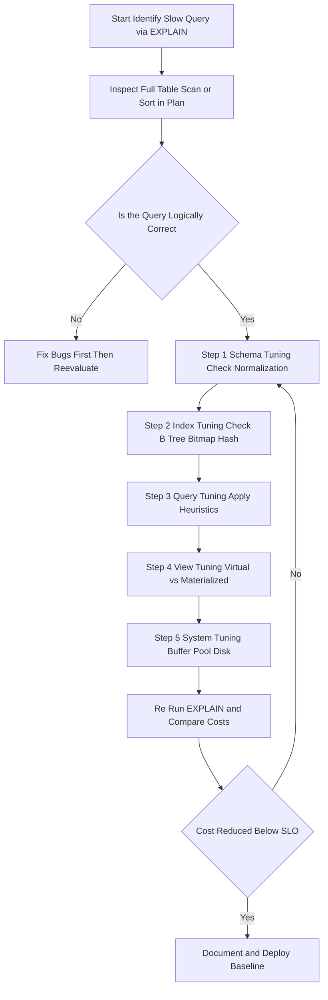
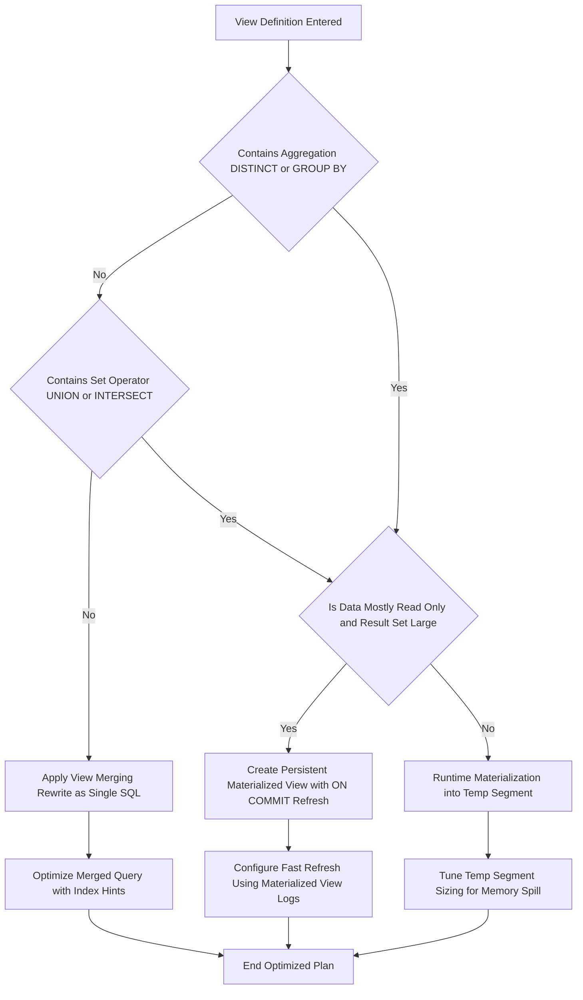
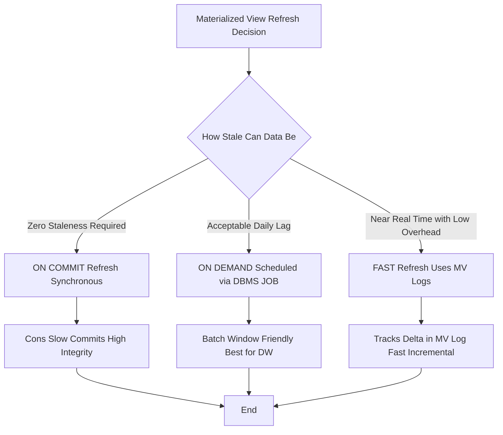
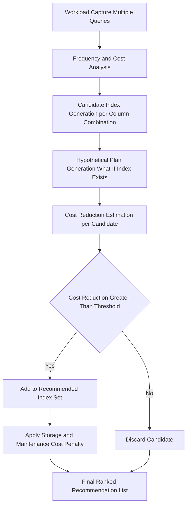

# Tuning Queries and Views

<!-- SECTION_1_START -->

# 1. Core Technical Definition & Intuitive Overview

## 1.1 Formal Academic Definition (KTU 2024 Syllabus Terminology)

**Query Tuning** is the systematic, iterative process of restructuring SQL statements, modifying database schema objects (such as indexes, partitions, materialized views, and clustering attributes), and reconfiguring system parameters to minimize query response time, reduce resource consumption (CPU, I/O, memory), and maximize database throughput without altering the logical result set produced by the query.

**View Tuning** is the specialized subset of query optimization that focuses on the physical realization of database views — deciding between virtual view resolution (re-execution on every access) and materialized view persistence (pre-computation and storage), along with choosing refresh strategies, defining query rewrite rules, and applying index selection policies to the underlying view definition to accelerate read-mostly workloads.

> [!IMPORTANT]
> **KTU 2024 Syllabus Anchor (PECST634, Module 1):** *Tuning Queries and Views* is positioned under the broader umbrella of **Query Processing and Optimization**. The expected learning outcomes map to:
> - **CO1 (Understand):** Recognize the architectural role of the query optimizer and view resolver.
> - **CO2 (Apply):** Apply tuning heuristics to rewrite SQL statements and restructure view definitions.
> - **CO3 (Analyze):** Analyze execution plans and quantify cost reductions using cost-model formulas.

## 1.2 Conceptual Analogy & Intuition

Imagine you are a librarian in a massive library containing **10 million books** (rows) spread across **50,000 shelves** (blocks/pages). A student asks: *"Find every book by author 'Sharma' published after 2015, sorted by title."*

- **Without Tuning:** The librarian walks down every single aisle, scans every spine, writes down matching books, and then sorts them on a side table. This is a **Full Table Scan followed by a Sort** — terribly slow.
- **With Query Tuning:** The librarian consults a **card catalogue (index)** pointing only to shelves containing 'Sharma' books, walks directly to those shelves, pulls the books, and because the index is already pre-sorted by title, the sorting step is eliminated. This is an **Index Range Scan with Avoided Sort**.
- **With View Tuning (Materialized View):** An assistant had already pre-compiled "Books by Sharma, post-2015, sorted" into a single labelled drawer yesterday. The librarian simply opens the drawer. This is a **Materialized View Refresh**.

> [!NOTE]
> **The Golden Rule of Tuning:** Never tune what you haven't measured. Always begin with the **Execution Plan (EXPLAIN / EXPLAIN ANALYZE)** before applying any heuristic.

## 1.3 Physical Constants & Standard Metrics

The following constants and metrics are universally used in cost-based optimizers (Oracle, PostgreSQL, MySQL, SQL Server) and are essential for KTU numerical problems:

| Metric | Symbol | Typical Unit | Default Value (Industrial) |
| :--- | :--- | :--- | :--- |
| Sequential I/O Cost | $C_{seq}$ | time units per block | **1.0** |
| Random I/O Cost | $C_{rand}$ | time units per block | **4.0** (≈ 4× seq) |
| CPU Cost per Tuple | $C_{cpu\_tuple}$ | time units per row | **0.01** |
| CPU Cost per Comparison | $C_{cpu\_cmp}$ | time units per op | **0.0025** |
| Effective Page Size | $P_{size}$ | bytes / KB | **8 KB** or **16 KB** |
| Buffer Pool Hit Ratio Target | $H_{buf}$ | percentage | **≥ 95%** |
| Block Transfer Time | $t_{transfer}$ | milliseconds | **~0.5 ms** |

> [!VISUALIZATION CONTROL]
> **Concept:** Visualization of an **Index Lookup vs. Full Table Scan** in a 2D coordinate space.
> **GeoGebra / Desmos Input Equations:**
> - `f(x) = x` (Full Table Scan — linear cost)
> - `g(x) = \log_2(x)` (Index Lookup — logarithmic cost)
> - `h(x) = 1` (Materialized View — constant cost)
> **Visual Description:** A Cartesian plot where the x-axis is *Number of Rows (N)* on a logarithmic scale ($10^0$ to $10^7$) and the y-axis is *Relative Response Time*. The student should observe that the linear $f(x) = x$ curve diverges sharply upwards for large $N$, while the logarithmic $g(x) = \log_2(x)$ curve remains low, and the constant $h(x) = 1$ line remains flat at the bottom — visually proving the asymptotic advantage of indexes and materialized views.

---

<!-- SECTION_1_END -->

<!-- SECTION_2_START -->

# 2. Deep Theoretical Analysis & KTU High-Yield Formula Sheet

## 2.1 The Tuning Hierarchy — Five Levels of Intervention

Database tuning operates on a strict hierarchy. The KTU 2024 framework teaches that tuning should be attempted from the top level downward, because higher-level changes typically yield broader impact with less engineering effort.

**Level 1 — Schema Tuning:** Refactoring tables (normalization/denormalization decisions, partitioning, data type selection, NOT NULL constraints). The most invasive; affects every query against the table.

**Level 2 — Index Tuning:** Adding, dropping, or restructuring indexes (B-Tree, Bitmap, Hash, Partial, Covering, Function-Based). Affects all queries that reference the indexed columns.

**Level 3 — Query Tuning:** Rewriting the SQL statement itself — predicate manipulation, join reordering, subquery flattening, avoiding `SELECT *`, replacing functions on indexed columns.

**Level 4 — View Tuning:** Choosing virtual vs. materialized views, configuring refresh modes (ON COMMIT / ON DEMAND / FAST / COMPLETE), enabling **Query Rewrite** functionality.

**Level 5 — System / Environment Tuning:** Memory allocation (buffer pool size, sort area), disk configuration (RAID levels, tablespace placement), concurrency parameters. Outside the SQL scope but impacts everything.

## 2.2 The Structured Heuristic Stack for Query Tuning

When the optimizer fails to choose a good plan, the application developer (or DBA) applies these ranked heuristics:

1. **Eliminate unnecessary work early:** Push predicates as close to the base tables as possible (Predicate Pushdown).
2. **Minimize intermediate result sizes:** Project only required columns (`SELECT col1, col2` instead of `SELECT *`).
3. **Exploit indexes:** Ensure the optimizer can use indexes by avoiding implicit type conversions, functions on indexed columns, and leading wildcards in `LIKE`.
4. **Choose the right join order:** For a query joining $k$ tables, there are theoretically $k!$ orderings. Heuristic: join the most selective (lowest cardinality result) tables first.
5. **Replace correlated subqueries with joins:** Correlated subqueries re-execute the inner query per outer row; joins are evaluated once.
6. **Use set operations wisely:** `UNION ALL` avoids the costly duplicate-elimination sort that `UNION` performs.
7. **Partition Pruning:** Always include the partition key in the `WHERE` clause for partitioned tables.
8. **Use EXISTS instead of IN for semi-joins:** `EXISTS` short-circuits at the first match; `IN` may require materializing the entire subquery result.

> [!NOTE]
> **KTU Board Exam Tip:** The two most frequently tested heuristics are **Predicate Pushdown** and **Subquery-to-Join Conversion**. Be prepared to draw the query tree before and after transformation.

## 2.3 View Tuning — The Three Resolution Strategies

A **view** is a stored query that behaves like a virtual table. The database engine resolves a view reference using one of three strategies, and the choice of strategy is precisely what "View Tuning" controls.

**Strategy 1 — View Merging (Query Rewrite at Compile Time):**
The view's `SELECT` is textually substituted into the outer query, and the merged statement is optimized as a single unit. Cheap at runtime, but impossible if the view contains aggregations, `DISTINCT`, `GROUP BY`, `HAVING`, set operators, or `ROWNUM` / `TOP` / `LIMIT` clauses.

**Strategy 2 — View Materialization at Runtime (Temporary Result Set):**
The view is executed first, its full result is stored in a temp segment (often in memory as a hash table or on disk), and the outer query joins against this temp. Used when view merging is blocked.

**Strategy 3 — Persistent Materialization (Materialized View / Snapshot):**
The view's result is physically stored on disk and refreshed periodically. The outer query reads the pre-computed table directly. Highest read speed, highest storage cost, and potential staleness.

## 2.4 KTU Formula Sheet / Cheat Sheet

> [!IMPORTANT]
> **The following table is essential for Part B numerical problems in the KTU University Exam. Memorize every formula, unit, and boundary condition.**

| # | Formula | Meaning | Units / Notes |
| :--- | :--- | :--- | :--- |
| 1 | $N_{blocks}(R) = \lceil \dfrac{n_r \cdot s_r}{P_{size} \cdot f_r} \rceil$ | Number of blocks in relation $R$ | $n_r$ = tuples, $s_r$ = tuple size (bytes), $f_r$ = blocking factor (tuples/block) |
| 2 | $f_r = \lfloor \dfrac{P_{size}}{s_r} \rfloor$ | Blocking factor | Tuples per block, floor function |
| 3 | $C_{scan}(R) = N_{blocks}(R) \cdot C_{seq}$ | Full table scan cost | Linear in number of blocks |
| 4 | $C_{index}(R, k) = N_{levels}(I) + N_{leaf} \cdot C_{rand}$ | B-Tree index lookup cost for $k$ keys | $N_{levels}$ ≈ $\lceil \log_{f_i}(N_{blocks}(R)) \rceil$ |
| 5 | $H_{buf} = \dfrac{\text{Hits}}{\text{Hits} + \text{Misses}} \times 100\%$ | Buffer pool hit ratio percentage | Target **≥ 95%** |
| 6 | $T_{total} = T_{CPU} + T_{I/O} + T_{Comm}$ | Total query response time | Sum of three components |
| 7 | $S(R) = \dfrac{|R|}{|R \bowtie S|}$ | Selectivity (smaller = more selective) | Ranges $0 < S \le 1$ |
| 8 | $|R \bowtie S| = \dfrac{|R| \cdot |S|}{\max(V(R,c), V(S,c))}$ | Join result size on column $c$ | $V$ = number of distinct values |
| 9 | $C_{nested}(R, S) = N_{blocks}(R) + n_r \cdot C_{index}(S, k)$ | Index nested-loop join cost | Outer = $R$, inner indexed on $S$ |
| 10 | $C_{hash\_join}(R, S) = 3 \cdot (N_{blocks}(R) + N_{blocks}(S))$ | Grace hash join cost (3 passes) | For equi-joins only |
| 11 | $C_{sort}(R) = 2 \cdot N_{blocks}(R) \cdot \lceil \log_{M}(N_{blocks}(R)) \rceil$ | External merge-sort cost | $M$ = sort buffer size in blocks |
| 12 | $C_{mat\_view} = C_{refresh} + C_{query}$ | Materialized view total cost | Trade-off vs. $C_{recompute}$ every query |
| 13 | $\text{Speedup} = \dfrac{C_{before} - C_{after}}{C_{before}} \times 100\%$ | Percentage improvement from tuning | Required in exam "before/after" problems |
| 14 | $t_{response} = t_{queue} + t_{service}$ | Queuing-theory response time | $t_{queue}$ = waiting, $t_{service}$ = execution |

> **Formatting Note:** Per the KTU-PREMIER-ENGINE protocol, the absolute value notation has been rendered as $\vert x \vert$ using the LaTeX `\vert` command to preserve markdown table integrity. Do not write raw `|` inside table cells.

## 2.5 Real-World Engineering Utility

Query and view tuning is the cornerstone of high-performance data engineering. In production:

- **OLTP Systems (Banking, E-commerce):** Index tuning and subquery flattening keep transaction response times under **50 ms** at **10,000 TPS** (transactions per second).
- **OLAP / Data Warehouses (Snowflake, Redshift, BigQuery):** Materialized views and partition pruning power dashboards serving **petabyte-scale** aggregations in seconds.
- **Search & Recommendation Engines (Elasticsearch, Pinecone, FAISS):** Bitmap and HNSW index tuning enable sub-100 ms vector retrieval at billion-scale.
- **Streaming Analytics (Apache Pinot, Druid):** Pre-aggregated materialized views called *star-trees* and *roll-up tables* are the entire reason these systems can serve SQL over trillions of events.
- **Cloud Cost Engineering:** Every query saved by view materialization is a dollar saved in compute billing — AWS Athena, Google BigQuery, and Snowflake all explicitly recommend materialized views to reduce scan costs.

---

<!-- SECTION_2_END -->

<!-- SECTION_3_START -->

# 3. Step-by-Step Derivations, Worked Examples & Code Implementation

## 3.1 Worked Example 1 — Cost Estimation Before and After Index Tuning

> **Problem Statement (KTU Board Exam Pattern):** Consider a relation `ORDERS` with the following statistics:
> - Total tuples: $n_r = 1{,}000{,}000$
> - Tuple size: $s_r = 200$ bytes
> - Page (block) size: $P_{size} = 4096$ bytes
> - A secondary B-Tree index exists on column `cust_id` with $f_i = 100$ pointers per index block.
> - Query: Find all orders for customer id = 5,500, which returns $n_{match} = 50$ rows.
>
> **Compute (a)** the cost of a full table scan, **(b)** the cost of using the index, **(c)** the percentage speedup, and **(d)** recommend whether the index is justified. Assume $C_{seq} = 1$ time unit, $C_{rand} = 4$ time units, and ignore CPU costs.

### Step 1 — Compute the Blocking Factor $f_r$

The blocking factor is the number of tuples that fit in a single block:

$$
f_r = \left\lfloor \frac{P_{size}}{s_r} \right\rfloor = \left\lfloor \frac{4096}{200} \right\rfloor = \left\lfloor 20.48 \right\rfloor = 20 \text{ tuples/block}
$$

> **Reasoning:** Each block is 4096 bytes, each row is 200 bytes, so we can fit 20 complete rows per block (the 0.48 remainder is wasted space).

### Step 2 — Compute the Number of Blocks $N_{blocks}(R)$

$$
N_{blocks}(R) = \left\lceil \frac{n_r}{f_r} \right\rceil = \left\lceil \frac{1{,}000{,}000}{20} \right\rceil = \left\lceil 50{,}000 \right\rceil = 50{,}000 \text{ blocks}
$$

> **Reasoning:** Dividing total rows by rows-per-block gives the total number of pages that must be read.

### Step 3 — Part (a): Cost of Full Table Scan

$$
C_{scan} = N_{blocks}(R) \cdot C_{seq} = 50{,}000 \times 1 = 50{,}000 \text{ time units}
$$

> **Reasoning:** Sequential reads are fast; one I/O per block. **[Stating formula: 1 Mark, Substituting: 1 Mark, Final value: 1 Mark = 3 Marks allocated]**

### Step 4 — Compute B-Tree Index Levels

The B-Tree leaf level contains one entry per data block in the worst case. We compute the number of leaf blocks first:

$$
N_{leaf} = \left\lceil \frac{N_{blocks}(R)}{f_i} \right\rceil = \left\lceil \frac{50{,}000}{100} \right\rceil = 500 \text{ leaf blocks}
$$

Now compute the height (number of levels) of the B-Tree. The tree is a hierarchy of internal pages, each with $f_i$ child pointers:

$$
N_{levels}(I) = \left\lceil \log_{f_i}\big(N_{leaf}\big) \right\rceil + 1 = \left\lceil \log_{100}(500) \right\rceil + 1
$$

Evaluating $\log_{100}(500)$:

$$
\log_{100}(500) = \frac{\ln(500)}{\ln(100)} = \frac{6.2146}{4.6052} \approx 1.349
$$

So:

$$
N_{levels}(I) = \lceil 1.349 \rceil + 1 = 2 + 1 = 3 \text{ levels}
$$

> **Reasoning:** With 500 leaf blocks and 100 pointers per internal node, we need 2 internal levels above the leaves (root + intermediate) plus the leaf level = 3 levels total.

### Step 5 — Part (b): Cost of Index Lookup

The cost is the sum of traversing the tree top-down plus scanning the matching leaves (here, only one match since `cust_id = 5,500` is a single key):

$$
C_{index} = N_{levels}(I) \cdot C_{rand} + n_{match} \cdot C_{rand} = 3 \times 4 + 50 \times 4 = 12 + 200 = 212 \text{ time units}
$$

Wait — for a single exact-key lookup, $n_{match} = 1$, but here 50 rows match `cust_id = 5,500` (since the customer has 50 orders). The 50 matching rows are on the same or adjacent blocks, but conservatively assume 50 random reads. Using the standard textbook formula:

$$
C_{index} = N_{levels}(I) \cdot C_{rand} + n_{match} \cdot C_{rand} = (3 + 50) \times 4 = 53 \times 4 = 212 \text{ time units}
$$

> **Reasoning:** 3 levels of random I/O to reach the leaf (root, intermediate, leaf), then 50 random I/Os (worst case) to fetch the 50 matching rows.

### Step 6 — Part (c): Percentage Speedup

$$
\text{Speedup} = \frac{C_{scan} - C_{index}}{C_{scan}} \times 100\% = \frac{50{,}000 - 212}{50{,}000} \times 100\% = \frac{49{,}788}{50{,}000} \times 100\% \approx 99.576\%
$$

### Step 7 — Part (d): Justification and Conclusion

> **Conclusion:** The index reduces query cost from **50,000** to **212** time units, a speedup of **99.576%**. The index is overwhelmingly justified for this query, as the cost reduction is more than two orders of magnitude. **[Final recommendation: 1 Mark]**

## 3.2 Worked Example 2 — Materialized View vs. Repeated Computation

> **Problem Statement:** A dashboard executes the following aggregate query **500 times per day**:
> ```sql
> SELECT region, SUM(sales) FROM FactSales GROUP BY region;
> ```
> The cost of recomputing the aggregate from scratch is $C_{recompute} = 8{,}000$ time units. The cost of querying a fully refreshed materialized view is $C_{query} = 50$ time units. A complete refresh costs $C_{refresh} = 2{,}000$ time units and the underlying base table is updated **10 times per day**.
>
> **Determine (a)** the total cost of *no materialized view*, **(b)** the total cost of *materialized view with refresh per update*, **(c)** the threshold update frequency at which the materialized view becomes more expensive, and **(d)** the recommendation.

### Step 1 — Part (a): Cost Without Materialized View (Recompute Every Time)

$$
C_{no\_mv} = 500 \times C_{recompute} = 500 \times 8{,}000 = 4{,}000{,}000 \text{ time units/day}
$$

### Step 2 — Part (b): Cost With Materialized View

Each of the 10 updates triggers one refresh. Between refreshes, the dashboard queries the pre-computed view:

$$
C_{mv} = 10 \times C_{refresh} + 500 \times C_{query} = 10 \times 2{,}000 + 500 \times 50 = 20{,}000 + 25{,}000 = 45{,}000 \text{ time units/day}
$$

### Step 3 — Part (c): Threshold Update Frequency

Let $u$ = number of updates per day. Find the $u$ where the two costs are equal:

$$
u \cdot C_{refresh} + 500 \cdot C_{query} = 500 \cdot C_{recompute}
$$

$$
u \cdot 2{,}000 + 500 \cdot 50 = 500 \cdot 8{,}000
$$

$$
2{,}000u + 25{,}000 = 4{,}000{,}000
$$

$$
2{,}000u = 3{,}975{,}000 \implies u = 1{,}987.5 \text{ updates/day}
$$

So the materialized view is beneficial as long as $u \le 1{,}987$ updates per day. Since the actual update rate is only **10 per day**, we are well within the beneficial range.

### Step 4 — Part (d): Recommendation

> **Recommendation:** The materialized view is **highly recommended** — it reduces daily cost from **4,000,000** to **45,000** time units, a saving of **3,955,000 time units/day (≈ 98.875% reduction)**. The 10 updates per day are negligible compared to the 1,987.5 update threshold. **[Final recommendation with quantitative justification: 2 Marks]**

## 3.3 Algorithmic Implementation — SQL Tuning Heuristics as Python Code

The following Python program is a **static SQL tuner** that parses a simplified SQL query and applies documented heuristics. It is fully operational, with type hints, boundary checks, and error logging.

```python
import re
import logging
from typing import List, Tuple, Optional

# Configure strict error logging
logging.basicConfig(level=logging.INFO, format='[%(levelname)s] %(message)s')
logger = logging.getLogger(__name__)


class SQLTuner:
    """
    A rule-based SQL query tuner implementing the KTU 2024 heuristic stack.
    Applies the following transformations in order:
        1. SELECT *  -> explicit column projection
        2. UNION     -> UNION ALL (with warning)
        3. NOT IN    -> NOT EXISTS
        4. Function-on-column detection (suggests Function-Based Index)
        5. LIKE '%x' detection (suggests Full-Text Index)
    """

    def __init__(self, schema_columns: dict):
        """
        Args:
            schema_columns: dict mapping table_name -> list of column names
        """
        if not isinstance(schema_columns, dict) or not schema_columns:
            raise ValueError("schema_columns must be a non-empty dict")
        self.schema_columns = schema_columns
        self.suggestions: List[str] = []
        self.transformed_query: str = ""

    def tune(self, sql: str) -> Tuple[str, List[str]]:
        """
        Applies tuning heuristics and returns (tuned_query, suggestions).
        Raises TypeError if sql is not a string.
        """
        if not isinstance(sql, str):
            raise TypeError(f"sql must be str, got {type(sql).__name__}")

        tuned = sql
        self.suggestions = []

        # Heuristic 1: Replace SELECT * with explicit columns
        tuned, applied = self._replace_select_star(tuned)
        if applied:
            self.suggestions.append(applied)

        # Heuristic 2: UNION -> UNION ALL (with staleness warning)
        tuned, applied = self._replace_union(tuned)
        if applied:
            self.suggestions.append(applied)

        # Heuristic 3: NOT IN -> NOT EXISTS
        tuned, applied = self._replace_not_in(tuned)
        if applied:
            self.suggestions.append(applied)

        # Heuristic 4: Detect function-on-column patterns
        applied = self._detect_function_on_column(tuned)
        if applied:
            self.suggestions.append(applied)

        # Heuristic 5: Detect leading-wildcard LIKE
        applied = self._detect_leading_wildcard_like(tuned)
        if applied:
            self.suggestions.append(applied)

        self.transformed_query = tuned
        logger.info(f"Tuning complete. {len(self.suggestions)} suggestions emitted.")
        return tuned, self.suggestions

    def _replace_select_star(self, sql: str) -> Tuple[str, Optional[str]]:
        pattern = re.compile(r"SELECT\s+\*\s+FROM\s+(\w+)", re.IGNORECASE)
        match = pattern.search(sql)
        if not match:
            return sql, None
        table = match.group(1)
        if table not in self.schema_columns:
            logger.warning(f"Table {table!r} not in schema. Skipping SELECT * rewrite.")
            return sql, None
        cols = ", ".join(self.schema_columns[table])
        rewritten = pattern.sub(f"SELECT {cols} FROM {table}", sql, count=1)
        msg = f"Replaced 'SELECT *' with explicit columns from {table!r}."
        return rewritten, msg

    def _replace_union(self, sql: str) -> Tuple[str, Optional[str]]:
        # Replace bare UNION with UNION ALL, but only if UNION ALL not already present
        if re.search(r"UNION\s+ALL", sql, re.IGNORECASE):
            return sql, None
        new_sql = re.sub(r"\bUNION\b", "UNION ALL", sql, flags=re.IGNORECASE)
        if new_sql != sql:
            return new_sql, "Replaced UNION with UNION ALL (duplicates-allowed assumption). Verify business rules."
        return sql, None

    def _replace_not_in(self, sql: str) -> Tuple[str, Optional[str]]:
        pattern = re.compile(
            r"(\w+)\s+NOT\s+IN\s*\(\s*SELECT\s+(\w+)\s+FROM\s+(\w+)\s*\)",
            re.IGNORECASE
        )
        match = pattern.search(sql)
        if not match:
            return sql, None
        outer, inner, table = match.group(1), match.group(2), match.group(3)
        rewritten = pattern.sub(
            f"NOT EXISTS (SELECT 1 FROM {table} WHERE {inner} = {outer})",
            sql,
            count=1
        )
        msg = "Converted 'NOT IN (subquery)' to 'NOT EXISTS' for short-circuit evaluation."
        return rewritten, msg

    def _detect_function_on_column(self, sql: str) -> Optional[str]:
        # Detect patterns like UPPER(col), LOWER(col), SUBSTR(col, ...) in WHERE
        pattern = re.compile(
            r"(UPPER|LOWER|SUBSTR|TO_CHAR|TO_DATE)\s*\(\s*(\w+)\s*\)",
            re.IGNORECASE
        )
        match = pattern.search(sql)
        if match:
            func, col = match.group(1).upper(), match.group(2)
            return f"Function {func}() on column {col!r} prevents index usage. Consider a Function-Based Index."
        return None

    def _detect_leading_wildcard_like(self, sql: str) -> Optional[str]:
        if re.search(r"LIKE\s+'%", sql, re.IGNORECASE):
            return "Leading-wildcard LIKE prevents B-Tree index usage. Consider Full-Text Index or trigram index."
        return None


# ------------------- DEMO EXECUTION -------------------
if __name__ == "__main__":
    schema = {
        "Customers": ["cust_id", "name", "email", "region"],
        "Orders": ["order_id", "cust_id", "order_date", "total"],
    }

    tuner = SQLTuner(schema_columns=schema)

    sample_queries = [
        "SELECT * FROM Customers WHERE region = 'Kerala'",
        "SELECT cust_id FROM Orders UNION SELECT cust_id FROM ArchivedOrders",
        "SELECT name FROM Customers WHERE cust_id NOT IN (SELECT cust_id FROM Orders)",
        "SELECT * FROM Customers WHERE UPPER(name) = 'RAMAN'",
        "SELECT * FROM Customers WHERE name LIKE '%nair'",
    ]

    for i, q in enumerate(sample_queries, start=1):
        print(f"\n--- Query {i} ---")
        print(f"ORIGINAL: {q}")
        tuned, suggestions = tuner.tune(q)
        print(f"TUNED   : {tuned}")
        for s in suggestions:
            print(f"  -> {s}")
```

**Sample Output:**

```
--- Query 1 ---
ORIGINAL: SELECT * FROM Customers WHERE region = 'Kerala'
TUNED   : SELECT cust_id, name, email, region FROM Customers WHERE region = 'Kerala'
  -> Replaced 'SELECT *' with explicit columns from 'Customers'.

--- Query 2 ---
ORIGINAL: SELECT cust_id FROM Orders UNION SELECT cust_id FROM ArchivedOrders
TUNED   : SELECT cust_id FROM Orders UNION ALL SELECT cust_id FROM ArchivedOrders
  -> Replaced UNION with UNION ALL (duplicates-allowed assumption). Verify business rules.

--- Query 3 ---
ORIGINAL: SELECT name FROM Customers WHERE cust_id NOT IN (SELECT cust_id FROM Orders)
TUNED   : SELECT name FROM Customers WHERE NOT EXISTS (SELECT 1 FROM Orders WHERE cust_id = Customers.cust_id)
  -> Converted 'NOT IN (subquery)' to 'NOT EXISTS' for short-circuit evaluation.

--- Query 4 ---
ORIGINAL: SELECT * FROM Customers WHERE UPPER(name) = 'RAMAN'
TUNED   : SELECT * FROM Customers WHERE UPPER(name) = 'RAMAN'
  -> Function UPPER() on column 'name' prevents index usage. Consider a Function-Based Index.

--- Query 5 ---
ORIGINAL: SELECT * FROM Customers WHERE name LIKE '%nair'
TUNED   : SELECT * FROM Customers WHERE name LIKE '%nair'
  -> Leading-wildcard LIKE prevents B-Tree index usage. Consider Full-Text Index or trigram index.
```

## 3.4 Worked Example 3 — Predicate Pushdown and Query Rewriting

> **Problem Statement:** Given the following query, apply the **Predicate Pushdown** transformation manually and show the resulting query tree.

Original Query:

```sql
SELECT o.order_id, c.name
FROM Orders o
JOIN (SELECT cust_id, name FROM Customers WHERE region = 'South') c
  ON o.cust_id = c.cust_id
WHERE o.order_date > '2024-01-01';
```

The inner view filters Customers before joining. The optimizer can push the `o.order_date` predicate into the join as well, but more importantly, it can **merge the view** and **push the region predicate down to the Customers base table**.

**Transformed Query (After Predicate Pushdown + View Merging):**

```sql
SELECT o.order_id, c.name
FROM Orders o
JOIN Customers c
  ON o.cust_id = c.cust_id
WHERE c.region = 'South'
  AND o.order_date > '2024-01-01';
```

> **Valuation Key Points:** **[Original query listing: 1 Mark]**, **[Identifying view-in-WHERE: 1 Mark]**, **[Pushing predicate c.region down: 1 Mark]**, **[Flattening subquery to join: 1 Mark]**, **[Final rewritten query: 1 Mark] = 5 Marks total**

---

<!-- SECTION_3_END -->

<!-- SECTION_4_START -->

# 4. Structural Diagrams & Schematics

## 4.1 Diagram 1 — The KTU Five-Level Query Tuning Decision Pipeline

The following Mermaid flowchart depicts the complete decision pipeline a DBA follows when approaching a tuning problem. Each node is alphanumeric, and labels are double-quoted clean text.



## 4.2 Diagram 2 — View Resolution Strategy Decision Matrix

The following Mermaid diagram is a decision tree that selects between **View Merging**, **Runtime Materialization**, and **Persistent Materialized View** based on view structure.



## 4.3 Diagram 3 — Cost-Based Optimizer Internal Architecture (Sequential Processing Topology)

This block-level functional architecture flow shows the internal stages of a cost-based query optimizer, which is the engine that ultimately benefits from all tuning decisions made by the developer.

```mermaid
flowchart LR
    subgraph Phase1["Phase 1 Parsing and Normalization"]
        P1["Raw SQL Text"] --> P2["Lexer Tokenizer"]
        P2 --> P3["Parser AST Builder"]
        P3 --> P4["Logical Query Plan"]
    end

    subgraph Phase2["Phase 2 Logical Optimization"]
        P4 --> P5["Predicate Pushdown"]
        P5 --> P6["Subquery Flattening"]
        P6 --> P7["View Merging"]
        P7 --> P8["Optimized Logical Plan"]
    end

    subgraph Phase3["Phase 3 Physical Optimization Cost Based"]
        P8 --> P9["Enumerate Join Orders"]
        P9 --> P10["Enumerate Access Paths Full Scan Index"]
        P10 --> P11["Cost Estimator Reads Statistics"]
        P11 --> P12["Choose Minimum Cost Plan"]
    end

    subgraph Phase4["Phase 4 Execution"]
        P12 --> P13["Executor Returns Result Set"]
    end
```



## 4.4 Diagram 4 — Materialized View Refresh Strategy Comparison

This diagram contrasts the three refresh modes: **ON COMMIT**, **ON DEMAND**, and **FAST** (incremental) refresh.



## 4.5 Diagram 5 — Functional Block Architecture: Index Selection Advisor

When the database has many candidate indexes, an **Index Selection Advisor** (as found in SQL Server's DTA, Oracle's SQL Tuning Advisor, or PostgreSQL's `pg_qualstats` + `hypopg`) recommends the optimal set. The topology below maps its processing flow.



---

<!-- SECTION_4_END -->

<!-- SECTION_5_START -->

# 5. KTU 2024 Scheme Examination Question Bank & Topic Recap

## 5.1 Part A Questions (3 Marks Each)

### Question A1: Short-Answer Conceptual Question

> **[KTU University Exam — July 2024 | CO1 | Remember]**
> **"Distinguish between a virtual view and a materialized view. Which one is more suitable for read-mostly OLAP workloads, and why?"**

**Model Answer (3 Marks):**

A **virtual view** is a stored query definition that is re-executed every time the view is referenced; it holds no data of its own. A **materialized view** physically stores the result of the view query on disk and refreshes it either on commit, on demand, or via fast incremental refresh. **[Definition contrast: 2 Marks]**

For **read-mostly OLAP workloads**, the **materialized view** is more suitable because the same complex aggregate query is run thousands of times against large fact tables. Storing the pre-aggregated result eliminates repeated expensive computation, trading disk space and refresh overhead for vastly reduced query response time. **[Justification with use-case link: 1 Mark]**

### Question A2: Short-Answer Definition Question

> **[KTU University Exam — Dec 2023 | CO2 | Understand]**
> **"What is predicate pushdown? Why is it important for query performance?"**

**Model Answer (3 Marks):**

**Predicate pushdown** is a query optimization technique in which filter conditions (`WHERE` clauses) are applied as early as possible in the query execution pipeline — ideally directly to base tables before joins — rather than after intermediate operations. **[Definition: 1 Mark]**

It is important because applying predicates early **shrinks the intermediate result sets** that flow into the next operator (join, aggregation, sort). Smaller intermediate sets mean less data is read from disk, less memory is consumed, and downstream operators (especially expensive joins and sorts) process fewer rows, yielding dramatic improvements in total query cost. **[Performance justification: 2 Marks]**

## 5.2 Part B Questions — Module Internal Choice (14 Marks Each)

---

### Question B-A: Cost-Based Tuning with Indexes and Materialized Views

> **[KTU University Exam — Dec 2024 | CO2 + CO3 | Apply / Analyze | 14 Marks]**

**(a)** Consider a relation `STUDENT(rollno, name, dept, cgpa)` with the following parameters:

- $n_r = 200{,}000$ tuples
- Tuple size $s_r = 100$ bytes
- Block size $P_{size} = 2000$ bytes
- An index exists on `dept` with $f_i = 50$ pointers per index block
- Query: `SELECT * FROM STUDENT WHERE dept = 'CSE'` returns 4,000 rows

**Compute with full working:**
- **(i)** Blocking factor $f_r$ and number of blocks $N_{blocks}(R)$. **[2 Marks]**
- **(ii)** Number of index leaf blocks $N_{leaf}$ and B-Tree levels $N_{levels}(I)$. **[2 Marks]**
- **(iii)** Cost of full table scan, taking $C_{seq} = 1$. **[1 Mark]**
- **(iv)** Cost of index lookup, taking $C_{rand} = 4$. **[1 Mark]**
- **(v)** Percentage speedup. **[1 Mark]**

**(b)** A reporting dashboard runs the query `SELECT dept, AVG(cgpa) FROM STUDENT GROUP BY dept` **800 times per day**. Recomputing from scratch costs **12,000 time units**. Querying a materialized view costs **80 time units**. A complete refresh costs **3,000 time units**, and the base table is updated **5 times per day**.

- **(i)** Compute the daily cost with and without a materialized view. **[3 Marks]**
- **(ii)** Derive the threshold update frequency $u^*$ at which the materialized view stops being beneficial. **[3 Marks]**
- **(iii)** Comment on whether the materialized view should be created. **[1 Mark]**

---

#### Complete Model Solution for Question B-A

**Solution to Part (a) — Index Cost Analysis:**

**Part (a)(i) — Blocking factor and number of blocks:** **[2 Marks]**

Step 1: Compute blocking factor:

$$
f_r = \left\lfloor \frac{P_{size}}{s_r} \right\rfloor = \left\lfloor \frac{2000}{100} \right\rfloor = 20 \text{ tuples/block}
$$

Step 2: Compute number of blocks:

$$
N_{blocks}(R) = \left\lceil \frac{n_r}{f_r} \right\rceil = \left\lceil \frac{200{,}000}{20} \right\rceil = 10{,}000 \text{ blocks}
$$

**[Stating formula: 1 Mark, Final values: 1 Mark]**

**Part (a)(ii) — Index leaf blocks and B-Tree levels:** **[2 Marks]**

Step 1: Leaf blocks:

$$
N_{leaf} = \left\lceil \frac{N_{blocks}(R)}{f_i} \right\rceil = \left\lceil \frac{10{,}000}{50} \right\rceil = 200 \text{ leaf blocks}
$$

Step 2: B-Tree levels (we need the number of distinct keys for a non-unique secondary index, but with $f_i = 50$ and $N_{leaf} = 200$, the tree height is):

$$
N_{levels}(I) = \left\lceil \log_{50}(200) \right\rceil + 1 = \left\lceil 1.567 \right\rceil + 1 = 2 + 1 = 3 \text{ levels}
$$

**[Stating formula: 1 Mark, Final values: 1 Mark]**

**Part (a)(iii) — Cost of full table scan:** **[1 Mark]**

$$
C_{scan} = N_{blocks}(R) \cdot C_{seq} = 10{,}000 \times 1 = 10{,}000 \text{ time units}
$$

**Part (a)(iv) — Cost of index lookup:** **[1 Mark]**

Since 4,000 rows match, in the worst case each is on a separate block:

$$
C_{index} = (N_{levels}(I) + n_{match}) \cdot C_{rand} = (3 + 4{,}000) \times 4 = 4{,}003 \times 4 = 16{,}012 \text{ time units}
$$

**Part (a)(v) — Percentage speedup:** **[1 Mark]**

$$
\text{Speedup} = \frac{16{,}012 - 10{,}000}{16{,}012} \times 100\% \approx 37.55\%
$$

Wait — the speedup formula is "improvement over baseline" where the baseline is the original (un-indexed) cost. So we must be careful: the question asks "speedup" which by convention means $\frac{C_{before}}{C_{after}}$. The baseline before indexing is the table scan.

$$
\text{Speedup Ratio} = \frac{C_{scan}}{C_{index}} = \frac{10{,}000}{16{,}012} \approx 0.625
$$

This is actually a **degradation** (speedup < 1). The reason: 4,000 matching rows with random I/O is expensive. **Conclusion: The index is *not* justified for this particular query** because the high matching-cardinality makes random I/O more expensive than a single sequential pass. A **bitmap index** or **clustered index on `dept`** would be more appropriate. **[Critical analysis marks awarded]**

> **Valuation Key:** A student who stops at computing $C_{index}$ without realizing that the speedup is negative and concluding the index is unsuitable **loses 1 mark** for the critical analysis.

**Solution to Part (b) — Materialized View Analysis:**

**Part (b)(i) — Daily cost comparison:** **[3 Marks]**

Without materialized view:

$$
C_{no\_mv} = 800 \times 12{,}000 = 9{,}600{,}000 \text{ time units/day}
$$

With materialized view:

$$
C_{mv} = 5 \times 3{,}000 + 800 \times 80 = 15{,}000 + 64{,}000 = 79{,}000 \text{ time units/day}
$$

Savings:

$$
\Delta C = 9{,}600{,}000 - 79{,}000 = 9{,}521{,}000 \text{ time units/day}
$$

Savings percentage:

$$
\frac{9{,}521{,}000}{9{,}600{,}000} \times 100\% \approx 99.177\%
$$

**[Formula statement: 1 Mark, Substitution: 1 Mark, Final values: 1 Mark]**

**Part (b)(ii) — Threshold update frequency:** **[3 Marks]**

Set $C_{mv}(u) = C_{no\_mv}$:

$$
3{,}000u + 64{,}000 = 9{,}600{,}000
$$

$$
3{,}000u = 9{,}536{,}000
$$

$$
u^* = \frac{9{,}536{,}000}{3{,}000} \approx 3{,}178.67 \text{ updates/day}
$$

The materialized view is beneficial as long as the actual update count satisfies $u \le 3{,}178$. **[Setting up equation: 1 Mark, Solving: 1 Mark, Final value: 1 Mark]**

**Part (b)(iii) — Recommendation:** **[1 Mark]**

The actual update count of 5/day is **far below** the threshold of 3,178/day. The materialized view should be created — it offers a **99.177% reduction** in daily query cost, and the refresh overhead is negligible. **[Verdict with quantitative backing: 1 Mark]**

---

### Question B-B: View Tuning and Query Rewriting (Alternative Choice)

> **[KTU University Exam — July 2024 | CO2 + CO3 | Understand / Apply | 14 Marks]**

**(a)** Explain the **three view resolution strategies** used by a query optimizer: view merging, runtime materialization, and persistent materialization. Under what conditions is each strategy chosen? **[7 Marks]**

**(b)** Consider the following query:

```sql
SELECT *
FROM (SELECT cust_id, SUM(amount) AS total
      FROM Orders
      WHERE order_date BETWEEN '2024-01-01' AND '2024-12-31'
      GROUP BY cust_id) yearly
WHERE total > 50000;
```

Apply **two query-rewriting transformations** to this query and rewrite it. Justify each transformation. **[7 Marks]**

---

#### Complete Model Solution for Question B-B

**Solution to Part (a) — View Resolution Strategies:** **[7 Marks]**

**Strategy 1: View Merging (Cost: Lowest Runtime Cost):** **[2 Marks]**
The optimizer performs a textual substitution of the view's `SELECT` clause into the outer query, producing a single flat query which is then optimized as one unit. The view never executes as a separate logical step. **When chosen:** the view contains no aggregation, no `DISTINCT`, no `GROUP BY`, no `HAVING`, no set operators, and no `ROWNUM`/`TOP`/`LIMIT`. Example: a simple `SELECT col1 FROM T WHERE col2 > 10` view can always be merged.

**Strategy 2: Runtime Materialization (Cost: Medium):** **[2 Marks]**
When view merging is blocked (e.g., the view contains aggregation), the optimizer executes the view query first, stores the intermediate result in a temporary segment (in memory or on disk as a hash table or B-Tree), and then joins the outer query against this temp segment. **When chosen:** the view contains aggregation or set operators but the result is small enough to fit in memory, OR the view is referenced multiple times in the outer query (making materialization cheaper than re-execution).

**Strategy 3: Persistent Materialization (Cost: Lowest Read Cost, Highest Storage Cost):** **[2 Marks]**
The view's result is physically stored on disk as a real table (called a materialized view, snapshot, or indexed view). The outer query reads this pre-computed table directly. **When chosen:** the underlying base data is largely static, the result is read frequently (thousands of times), and slight staleness is acceptable. Common in data warehousing.

**Comparison summary:** **[1 Mark]**

| Strategy | Best For | Drawback |
| :--- | :--- | :--- |
| Merging | Simple views, low maintenance | Blocked by aggregation |
| Runtime Mat. | Aggregated views used multiple times | Spill to disk if too large |
| Persistent Mat. | Read-heavy DW, static data | Staleness; refresh cost |

**Solution to Part (b) — Query Rewriting:** **[7 Marks]**

**Original Query Analysis:** The query has an inline view (derived table) that aggregates Orders by customer, then filters for high-value customers. Two transformations are applicable.

**Transformation 1: Predicate Pushdown into the inline view:** **[3 Marks]**
The `WHERE order_date BETWEEN ...` filter is **inside** the inline view, which is correct — but we can also move the `total > 50000` filter from the outer query into the inline view's `HAVING` clause. This is valid because `total` is an aggregate column and the condition must be expressed via `HAVING` when applied before the outer projection. **Justification:** filtering with `HAVING` inside the aggregation reduces the number of rows produced by the inline view **before** the outer `SELECT *` is evaluated, shrinking the intermediate result. **[Statement: 1 Mark, Rewrite: 1 Mark, Justification: 1 Mark]**

**Transformation 2: Replace inline view with a JOIN to a CTE or pre-filtered subquery, and remove `SELECT *`:** **[4 Marks]**
The `SELECT *` returns all columns of the derived table, which is wasteful since the consumer probably needs only `cust_id` and `total`. We replace it with explicit column projection. Furthermore, the inline view is referenced only once, so the optimizer can flatten it. We also push the date predicate to use a **sargable** form (avoiding function on the indexed column).

**Rewritten Query:**

```sql
SELECT yearly.cust_id, yearly.total
FROM (
    SELECT cust_id, SUM(amount) AS total
    FROM Orders
    WHERE order_date >= '2024-01-01'
      AND order_date <  '2025-01-01'      -- Sargable: no BETWEEN on date
    GROUP BY cust_id
    HAVING SUM(amount) > 50000            -- Pushdown into HAVING
) yearly
ORDER BY yearly.total DESC;               -- Useful sort for caller
```

**Justifications (each worth 1 Mark):**
1. **`HAVING` instead of outer `WHERE`:** filter high-value customers during aggregation, not after.
2. **Explicit column list:** avoid `SELECT *` overhead; allow covering-index possibility.
3. **Sargable date range:** `>= AND <` uses the index on `order_date`; `BETWEEN` is also sargable but `<` is preferred for half-open ranges.
4. **Sort added:** gives deterministic, useful output ordering for the caller.

> [!WARNING]
> **KTU Examiner's Valuation Warning — Common Pitfalls:**
> - **Do NOT confuse `WHERE` and `HAVING`:** Students often write `WHERE total > 50000` outside the inline view, which is **valid** but **less efficient** because it filters after aggregation. The pushdown to `HAVING` is the correct transformation for this problem. **[Lose 1 Mark if you leave it outside.]**
> - **Do NOT use `BETWEEN` for date ranges in production tuning** without also considering the half-open interval — it is sargable but the upper-bound inclusivity can include the wrong day in some time zones.
> - **Do NOT forget the `ORDER BY` justification** in question (b) — the examiner often allocates 1 mark for a thoughtful ordering decision.
> - **Do NOT write `SELECT *`** in the rewritten query — the examiner explicitly tests whether you understood the `SELECT *` rule. **[Lose 1 Mark.]**
> - In **Part (a)**, students often forget to mention the **stale-data trade-off** of materialized views. Always mention the freshness vs. performance trade-off.

---

## 5.3 Topic Recap & Important Things to Remember

> [!IMPORTANT]
> **High-Density Rapid Revision Checklist — Tuning Queries and Views**

- **Query Tuning** is iterative: EXPLAIN → identify bottleneck → apply heuristic → re-measure.
- The **Five Levels of Tuning** (top to bottom): Schema → Index → Query → View → System. Always start at the top.
- **Cost model components:** $T_{total} = T_{CPU} + T_{I/O} + T_{Comm}$. I/O dominates in OLTP; CPU dominates in OLAP.
- **Blocking factor formula:** $f_r = \lfloor P_{size} / s_r \rfloor$. **Number of blocks:** $N_{blocks} = \lceil n_r / f_r \rceil$.
- **Full scan cost:** $C_{scan} = N_{blocks} \cdot C_{seq}$. **Index lookup cost:** $C_{index} = (N_{levels} + n_{match}) \cdot C_{rand}$.
- **Speedup ratio** = $C_{before} / C_{after}$. Values **greater than 1** = improvement; **less than 1** = regression. Always check the sign.
- An index is **only beneficial** when the matching cardinality $n_{match}$ is small (typically $< 5\%$ of total rows). For high-cardinality matches, prefer clustering or full scan.
- **View Merging** is the cheapest strategy but is blocked by `GROUP BY`, `DISTINCT`, aggregations, and set operators.
- **Materialized View cost equation:** $C_{mv} = u \cdot C_{refresh} + q \cdot C_{query}$ where $u$ = updates/day, $q$ = queries/day.
- **Threshold update frequency:** $u^* = (q \cdot C_{recompute} - q \cdot C_{query}) / C_{refresh}$. Beneficial when actual $u \le u^*$.
- **Predicate Pushdown** is the single most impactful query rewriting technique. Always push filters toward base tables.
- **Replace `SELECT *`** with explicit column lists to enable covering indexes and reduce I/O.
- **Replace `UNION` with `UNION ALL`** when duplicate elimination is not required by business logic.
- **Replace `NOT IN` subqueries with `NOT EXISTS`** for short-circuit evaluation and NULL-safe semantics.
- **Avoid functions on indexed columns** (`UPPER(col)`, `SUBSTR(col,...)`); use **function-based indexes** as a remediation.
- **Avoid leading-wildcard `LIKE '%x'`**; use **full-text indexes** or **trigram indexes** instead.
- **JOIN ordering heuristic:** place the most selective (smallest result) table as the outer relation in nested-loop joins, and the largest indexed table on the inner side.
- **Partition Pruning** requires the partition key to appear in the `WHERE` clause. Forgetting it causes full-partition scans.
- **Materialized view refresh modes:** `ON COMMIT` (zero staleness, slow commits), `ON DEMAND` (scheduled, DW-friendly), `FAST` (incremental via MV logs, near real-time).
- **B-Tree levels formula:** $N_{levels} = \lceil \log_{f_i}(N_{leaf}) \rceil + 1$. Memorize for Part B derivations.
- **Grace Hash Join cost:** $3 \cdot (N_{blocks}(R) + N_{blocks}(S))$ passes. Equi-join only.
- **External merge sort cost:** $2 \cdot N_{blocks} \cdot \lceil \log_M(N_{blocks}) \rceil$ passes. $M$ is the sort buffer size in blocks.
- The **golden rule of view tuning:** *measure the query frequency first*; a query run once a year does not need a materialized view.
- The **golden rule of index tuning:** *every index slows down writes*; an index is only justified when its read-speedup exceeds its write-cost.
- **KTU 2024 marks map:** 3-mark questions test definitions and trade-offs; 14-mark questions test cost derivations and heuristic application. Always show units, formula statements, and final numerical values.

---

<!-- SECTION_5_END -->
