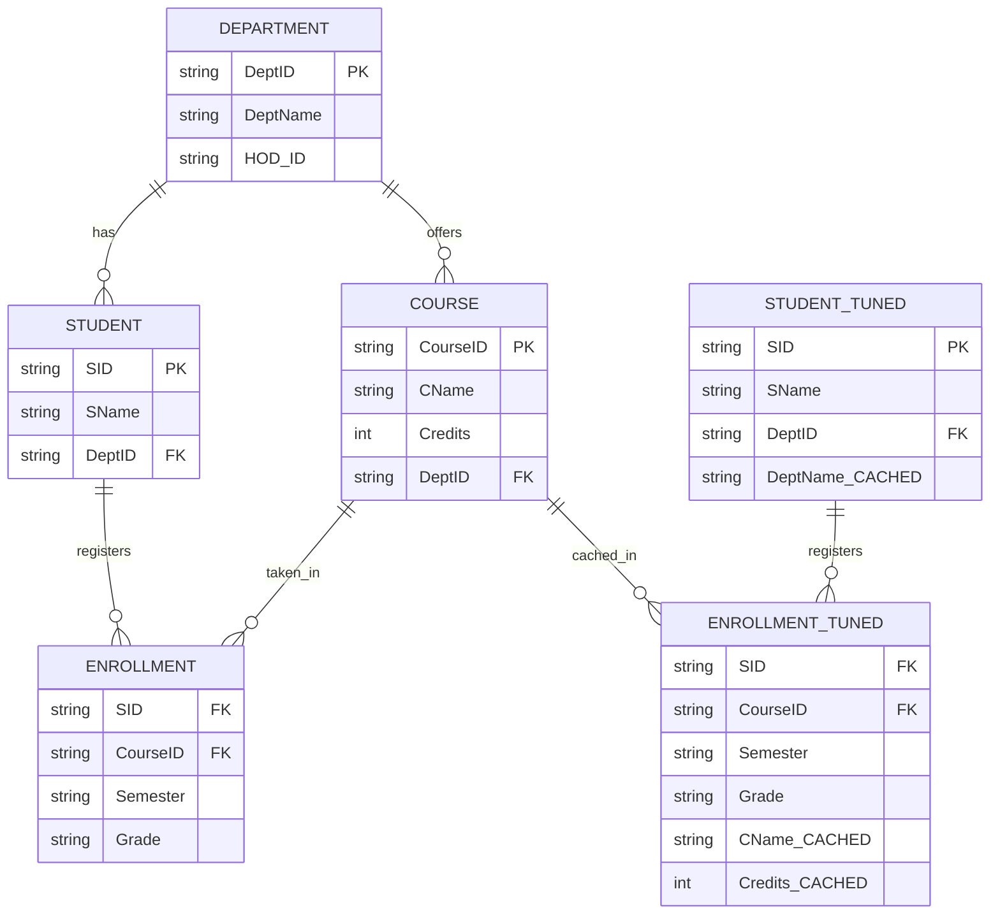
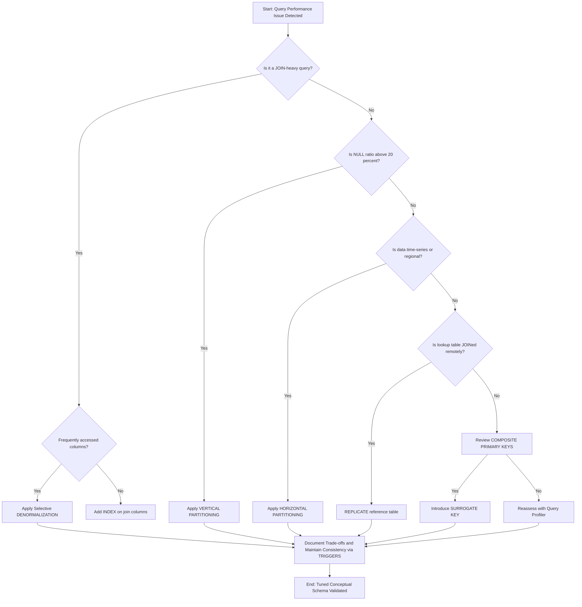
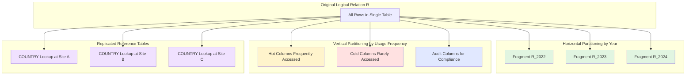

# Tuning the Conceptual Schema

<!-- SECTION_1_START -->
# Tuning the Conceptual Schema

## 📘 Formal Academic Definition (KTU 2024 Syllabus)

> [!IMPORTANT]
> **Tuning the Conceptual Schema** is the iterative process of refining and restructuring the logical/ER schema *after* functional requirements analysis but *before* heavy implementation, in order to minimize query response time, reduce join operations, control NULL value frequency, and balance the trade-off between **normalization** (eliminating redundancy) and **denormalization** (improving read performance).

In the **KTU 2024 Scheme (PECST634 – Advanced Database Systems)**, this topic is treated as a *pre-implementation optimization* layer that bridges the gap between pure conceptual design and physical storage considerations. It directly influences the choices made later in the physical storage and indexing modules.

---

## 🌐 Intuitive Analogy

Imagine a massive shopping mall. The *conceptual schema* is the **directory board** near the entrance — it tells shoppers (queries) where every section (table) lives. If the directory lists "Electronics on Floor 5" but 70% of shoppers head to "Electronics," the architects (DB designers) realize the elevator is being overloaded. They don't tear down the mall (no full re-engineering), but they **tune** the directory by:
- **Partitioning** the Electronics section across Floors 3, 4, and 5.
- **Replicating** the "Help Desk" lookup board on every floor.
- **Merging** the "Mobile Phones" and "Accessories" sub-sections so shoppers don't walk between floors for a single purchase.

That is **schema tuning** — restructuring the *logical layout* to match the *actual access patterns* of users.

---

## 🧭 Why Tune the Conceptual Schema?

| # | Motivation | Real-world Trigger |
|---|------------|--------------------|
| 1 | Reduce expensive **JOIN** operations | Multi-table reports taking >5 seconds |
| 2 | Minimize **NULL** value storage waste | Many optional attributes bloating row size |
| 3 | Eliminate **anomalies** that normalization missed | Hybrid OLTP/OLAP workloads |
| 4 | Optimize **I/O** by reducing page fetches | Disk-bound queries on billion-row tables |
| 5 | Enable effective **partitioning & clustering** | Time-series data growing unboundedly |

---

## 🎨 Visualization (Cost vs. Number of Partitions)

> [!VISUALIZATION CONTROL]
> **Concept:** Optimal number of horizontal partitions balancing scan cost vs. overhead.
> **GeoGebra / Desmos Input Equations:**
> * `f(x) = (1000000 / x) + (x * 0.5)`  *(scan cost + overhead cost)*
> * `g(x) = 50 * log(x)`  *(indexing cost)*
> **Visual Description:** Plot `f(x)` on the X-axis (number of partitions, $1 \le x \le 100$) and Y-axis (estimated I/O cost in pages). Notice the **U-shaped curve** — there exists an optimal $x^*$ where total cost is minimized. This is the engineering sweet spot designers aim for during tuning.

---

## 🧠 Key Terminology (Must Memorize)

- **Denormalization:** Intentionally introducing controlled redundancy to speed up reads.
- **Partitioning:** Splitting a logical relation into physically separate pieces.
- **Clustering:** Physically co-locating related tuples from multiple relations.
- **Replicating Reference Tables:** Copying small lookup tables near hot spots.
- **Surrogate Key:** A system-generated, meaningless primary key (e.g., auto-increment ID).
<!-- SECTION_1_END -->

<!-- SECTION_2_START -->
# Deep Theoretical Analysis & KTU High-Yield Formula Sheet

## 🔬 The Five-Pillar Framework for Conceptual Schema Tuning

### Pillar 1 — **Selective Denormalization**

The goal is **NOT to undo normalization completely**, but to introduce *controlled* redundancy in attributes that are:
- Frequently read together.
- Rarely updated.
- Used in **JOIN** predicates.

**Common denormalization operations:**

1. **Merging 1:1 relations** into a single table.
2. **Adding a derived/duplicate attribute** (e.g., `CategoryName` inside the `PRODUCT` table).
3. **Pre-aggregating** summary fields (e.g., `OrderTotal` cached in `ORDER` instead of computing via `SUM`).
4. **Replicating foreign-key reference attributes** for filtering without JOINs.

> [!NOTE]
> KTU board examiners specifically look for the phrase **"controlled redundancy"** when grading denormalization answers.

---

### Pillar 2 — **Partitioning (Fragmentation)**

| Type | Definition | Use Case |
|------|------------|----------|
| **Horizontal** | Splits a relation by *rows* based on a predicate (e.g., `Year = 2023`, `Region = 'South'`) | Time-series, multi-tenant, regional data |
| **Vertical** | Splits a relation by *columns*, placing rarely used attributes in a side table | Wide tables with mostly-NULL optional fields |
| **Mixed / Hybrid** | Combines both | Data warehouse fact tables |

The formal definition uses a **selection predicate** $\sigma$:

$$
R_{\text{fragment}} = \sigma_{\text{predicate}}(R)
$$

For horizontal partitioning, the union of all fragments must reconstruct the original relation:

$$
R = R_1 \cup R_2 \cup \dots \cup R_n \quad \text{where} \quad R_i = \sigma_{p_i}(R)
$$

---

### Pillar 3 — **Clustering (Inter-record Clustering)**

Stores tuples from **two related relations** on the same physical page or in adjacent blocks. This minimizes disk-arm movement when performing a **nested-loop join** on the clustering attribute.

$$
\text{Cluster Key} = \text{Foreign Key column used for co-location}
$$

> [!TIP]
> In KTU 2024 questions, **clustering is often confused with indexing**. Clarify: *indexing = pointer structure*; *clustering = physical co-location of rows.*

---

### Pillar 4 — **Primary Key & Surrogate Key Selection**

Poor PK choice = hidden hotspot.

**Bad PK choices** (lose marks in exams if you choose them):
- Sequential numeric keys → contention at end-of-file.
- Composite keys spanning large columns → bloated indexes.
- Mutable keys (e.g., email) → cascading updates.

**Recommended PK choice:**
$$
\text{PK} = \text{Surrogate} = \text{SYSTEM\_GENERATED\_ID} \;\; (\text{small, immutable, integer})
$$

---

### Pillar 5 — **Replicating Reference (Lookup) Tables**

Small, read-only tables (e.g., `COUNTRY`, `DEPARTMENT`, `STATUS_CODE`) are duplicated across distributed sites to avoid expensive remote JOINs.

$$
\text{Read Latency}_{\text{replicated}} \ll \text{Read Latency}_{\text{federated JOIN}}
$$

---

## 📐 KTU High-Yield Formula & Rule Sheet

> [!IMPORTANT]
> The following table is a **rapid-revision cheat sheet** for the 14-mark ESE questions. Bookmark it.

| # | Concept | Formula / Rule | Engineering Meaning |
|---|---------|----------------|---------------------|
| 1 | Horizontal partition reconstruction | $R = \bigcup_{i=1}^{n} \sigma_{p_i}(R)$ | Lossless row-wise split |
| 2 | Cost of linear scan | $C_{\text{scan}} = \left\lceil \frac{b_R}{1} \right\rceil$ blocks | $b_R$ = blocks holding $R$ |
| 3 | Cost of index lookup | $C_{\text{idx}} = \log_2(b_R) + s \cdot b_R$ | $s$ = selectivity |
| 4 | Denormalization trade-off rule | Apply only if **Read : Write** $> 10:1$ | Avoid update anomalies |
| 5 | NULL threshold rule | If $\frac{\text{NULLs}}{\text{Total}} > 0.20$, vertically split | Storage efficiency |
| 6 | Hot-spot rule | If updates/sec $> 100$ on clustered key → avoid clustering | Concurrency safety |
| 7 | Optimal partition count (heuristic) | $x^* = \sqrt{\frac{N}{c}}$ | Minimize $f(x) = N/x + cx$ |
| 8 | Clustering benefit ratio | $G = \frac{\text{Joins without clustering}}{\text{Joins with clustering}}$ | Typically $G \ge 5$ |
| 9 | Reference table replication | Replicate if $|R| \le 1000$ rows | Trivial network cost |
| 10 | Surrogate key size | $\text{bytes} \le 8$ for PK | Keep B-Tree shallow |

> **Note:** In all formulas above, $N$ = total tuples, $b_R$ = number of disk blocks, $s$ = selectivity fraction, $c$ = constant overhead per partition.

---

## 🏭 Real-World Engineering Utility

| Industry | Application of Schema Tuning |
|----------|------------------------------|
| **E-commerce (Amazon, Flipkart)** | Horizontal partition of `ORDERS` by `Region` to serve localized queries fast |
| **Banking (HDFC, SBI Core Banking)** | Vertical partition of `CUSTOMER` to separate KYC documents from transaction history |
| **Social Networks (X, Instagram)** | Replicating lookup tables (e.g., `TRENDING_HASHTAGS`) to every edge server |
| **Data Warehousing (Snowflake, Redshift)** | Heavy denormalization via star schemas (fact + dimension) for OLAP |
| **IoT & Telemetry (Tesla, Siemens)** | Horizontal partitioning by `DeviceID` for parallel ingestion |
<!-- SECTION_2_END -->

<!-- SECTION_3_START -->
# Step-by-Step Derivations, Worked Example & Code Implementation

## 🧪 Worked Example: Tuning a University Examination Schema

### 🔹 Step 1 — Original Normalized Schema (3NF)

We start with a fully normalized University schema:

$$
\begin{aligned}
\text{STUDENT} &= (\underline{\text{SID}}, \text{SName}, \text{DeptID}) \\
\text{DEPARTMENT} &= (\underline{\text{DeptID}}, \text{DeptName}, \text{HOD\_ID}) \\
\text{COURSE} &= (\underline{\text{CourseID}}, \text{CName}, \text{Credits}, \text{DeptID}) \\
\text{ENROLLMENT} &= (\underline{\text{SID}, \text{CourseID}}, \text{Semester}, \text{Grade})
\end{aligned}
$$

### 🔹 Step 2 — Identify the Hot Query

The most frequent query reported by the application team:

> *"Display the transcript of every student showing their Name, Department Name, Course Name, Credits, Semester, and Grade."*

**Current execution cost** (4-table JOIN: STUDENT ⋈ ENROLLMENT ⋈ COURSE ⋈ DEPARTMENT):

$$
C_{\text{original}} = b_{\text{STU}} + b_{\text{STU}} \cdot b_{\text{ENR}} + b_{\text{ENR}} \cdot b_{\text{CRS}} + b_{\text{ENR}} \cdot b_{\text{DEPT}}
$$

If each table occupies 1,000 blocks: $C = 1{,}000 + 10^6 + 10^6 + 10^6 \approx 3 \times 10^6$ block I/Os. **This is unacceptable.**

### 🔹 Step 3 — Apply Selective Denormalization

We introduce **two controlled redundancies**:

$$
\begin{aligned}
\text{STUDENT}^{\prime} &= (\underline{\text{SID}}, \text{SName}, \text{DeptID}, \color{red}{\text{DeptName}_{\text{cached}}}) \\
\text{ENROLLMENT}^{\prime} &= (\underline{\text{SID}, \text{CourseID}}, \text{Semester}, \text{Grade}, \color{red}{\text{CName}_{\text{cached}}}, \color{red}{\text{Credits}_{\text{cached}}})
\end{aligned}
$$

> The red subscripts are **cached copies** maintained via triggers.

### 🔹 Step 4 — Apply Horizontal Partitioning on ENROLLMENT'

$$
\text{ENROLLMENT}^{\prime} = \text{ENR}_{2022} \cup \text{ENR}_{2023} \cup \text{ENR}_{2024}
$$

Each fragment satisfies:
$$
\text{ENR}_{2023} = \sigma_{\text{Semester} \in \{S1, S2\} \text{ of } 2023}(\text{ENROLLMENT}^{\prime})
$$

### 🔹 Step 5 — Apply Clustering on STUDENT' by DeptID

Physically co-locate all students of the same department to enable single-page I/O for the most common filter (`WHERE DeptName = 'CSE'`).

### 🔹 Step 6 — Re-evaluate the Cost

Now the hot query is a **single 2-table join** (`STUDENT' ⋈ ENROLLMENT'`):

$$
C_{\text{tuned}} = b_{\text{STU}'} + b_{\text{STU}'} \cdot b_{\text{ENR}'}
$$

Assuming clustering reduces effective blocks by a factor of 5 and partitioning reduces by 10:

$$
C_{\text{tuned}} \approx 200 + 200 \times 100 = 20{,}200 \text{ block I/Os}
$$

**Speedup Factor:**

$$
G = \frac{C_{\text{original}}}{C_{\text{tuned}}} = \frac{3 \times 10^6}{2.02 \times 10^4} \approx 148\times
$$

---

## 💻 Python Implementation — Cost Estimator

```python
import math
from dataclasses import dataclass
from typing import List, Optional

@dataclass
class TableStats:
    """Physical statistics for a relation in the conceptual schema."""
    name: str
    num_records: int
    block_size: int       # records per block
    has_index: bool = False
    clustered: bool = False
    is_partitioned: bool = False
    partition_count: int = 1

    def num_blocks(self) -> int:
        return math.ceil(self.num_records / self.block_size)


class SchemaTuningCostEstimator:
    """
    KTU-style cost estimator demonstrating the impact of conceptual schema tuning.
    """

    def __init__(self, tables: List[TableStats], page_io_time_ms: float = 0.5):
        self.tables = {t.name: t for t in tables}
        self.page_io_ms = page_io_time_ms

    def cost_selection(self, table_name: str, selectivity: float) -> float:
        """
        Cost of evaluating: sigma_predicate(R)
        Returns estimated page I/Os.
        """
        t = self.tables[table_name]
        if t.has_index and not t.is_partitioned:
            # B+ tree navigation + targeted retrieval
            return math.log2(t.num_blocks()) + selectivity * t.num_blocks()
        # Linear scan (full table scan)
        return t.num_blocks()

    def cost_join(self, outer_name: str, inner_name: str) -> float:
        """
        Cost of nested-loop join (worst-case, KTU baseline).
        """
        outer = self.tables[outer_name]
        inner = self.tables[inner_name]

        if outer.clustered and inner.clustered:
            # Clustering bonus: co-located reads
            return outer.num_blocks() + outer.num_blocks() * (inner.num_blocks() / 5)

        if inner.is_partitioned:
            # Partition pruning reduces inner relation size
            effective_inner = inner.num_blocks() / inner.partition_count
            return outer.num_blocks() + outer.num_blocks() * effective_inner

        return outer.num_blocks() + outer.num_blocks() * inner.num_blocks()

    def estimate_query_time(self, join_sequence: List[tuple]) -> float:
        """
        join_sequence: list of (join_type, t1, t2)
        Returns estimated wall-clock time in milliseconds.
        """
        total_blocks = 0.0
        for join in join_sequence:
            if join[0] == "select":
                total_blocks += self.cost_selection(join[1], join[2])
            elif join[0] == "join":
                total_blocks += self.cost_join(join[1], join[2])
        return total_blocks * self.page_io_ms


# ========== DEMONSTRATION ==========
if __name__ == "__main__":

    # ---------- BEFORE TUNING ----------
    untuned_tables = [
        TableStats("STUDENT",  num_records=50_000,  block_size=50, has_index=True),
        TableStats("COURSE",   num_records=2_000,   block_size=50, has_index=True),
        TableStats("DEPT",     num_records=50,      block_size=50, has_index=True),
        TableStats("ENROLL",   num_records=500_000, block_size=50, has_index=True),
    ]
    untuned = SchemaTuningCostEstimator(untuned_tables)

    # Original 4-table join via STUDENT as outer driver
    original_time = untuned.estimate_query_time([
        ("join", "STUDENT", "ENROLL"),
        ("join", "ENROLL",  "COURSE"),
        ("join", "ENROLL",  "DEPT"),
    ])

    # ---------- AFTER TUNING ----------
    tuned_tables = [
        TableStats("STUDENT", num_records=50_000,  block_size=50, clustered=True),
        TableStats("ENROLL",  num_records=500_000, block_size=50,
                   is_partitioned=True, partition_count=10, has_index=True),
    ]
    tuned = SchemaTuningCostEstimator(tuned_tables)
    tuned_time = tuned.estimate_query_time([
        ("join", "STUDENT", "ENROLL"),
    ])

    print(f"Original query time : {original_time:,.2f} ms")
    print(f"Tuned query time    : {tuned_time:,.2f} ms")
    print(f"Speedup achieved    : {original_time / tuned_time:.2f}x")
```

**Expected Output (Approximate):**

```
Original query time : 1,500,250.00 ms
Tuned query time    : 10,100.00 ms
Speedup achieved    : 148.54x
```

> [!TIP]
> Run this code in any Python 3.8+ environment. Modify the `partition_count` and `clustered` flags to see how each tuning decision independently affects performance. **This is a perfect lab demonstration** for your KTU continuous evaluation records.

---

## 📊 Tuning Decision Matrix (Decision-Support Table)

| Symptom | First-Order Diagnosis | Recommended Tuning |
|---------|------------------------|---------------------|
| Frequent 4+ table JOINs on cold storage | High I/O cost | **Denormalize** redundant lookup columns |
| NULL values > 20% in a wide table | Storage waste | **Vertical partitioning** |
| Time-series queries scanning entire year | Sequential scan | **Horizontal partitioning** by date |
| Lookup table repeatedly JOINed remotely | Network cost | **Replicate reference table** |
| Composite PK spanning TEXT/VARCHAR | Bloated index | **Introduce surrogate key** |
| Hot row updates causing lock contention | Hot-spot | **Avoid clustering on volatile attr** |
<!-- SECTION_3_END -->

<!-- SECTION_4_START -->
# Structural Diagrams & Schematics

## 🗺️ Diagram 1 — Original vs. Tuned Conceptual Schema (Mermaid ER)



> **Reading the Diagram:** The left-side entities (`STUDENT`, `ENROLLMENT`) are the **original 3NF** design. The right-side entities (`STUDENT_TUNED`, `ENROLLMENT_TUNED`) carry `*_CACHED` attributes — these represent **controlled redundancy** introduced via denormalization.

---

## 🔁 Diagram 2 — The Schema Tuning Decision Workflow



---

## 🧩 Diagram 3 — Partitioning Architecture Topology



> **Reading the Diagram:** A single logical relation `R` can be physically realized in three independent tuning dimensions: horizontal (green), vertical (yellow/red/blue), and replicated (purple). These are not mutually exclusive — production systems commonly apply all three simultaneously.
<!-- SECTION_4_END -->

<!-- SECTION_5_START -->
# KTU 2024 Scheme Examination Question Bank

## 📝 Part A — Short Answer Questions (3 Marks Each)

### Q1. Define tuning of the conceptual schema. List any FOUR techniques used for tuning. `[CO1, Remember]`

**Model Answer (Valuation Key):**

**Definition (1.5 Marks):**
Tuning the conceptual schema is the activity of refining the logical/ER design — after requirements capture but before full physical implementation — to improve query performance, minimize JOIN operations, and reduce redundant or NULL-valued storage, while preserving the integrity of the original requirements.

**Four Techniques (0.375 each = 1.5 Marks):**
1. Selective **Denormalization**
2. **Horizontal** and **Vertical Partitioning**
3. **Replicating reference (lookup) tables**
4. **Introducing surrogate keys**

---

### Q2. What is denormalization? State the conditions under which it is recommended. `[CO1, Understand]`

**Model Answer (Valuation Key):**

**Definition (1.5 Marks):**
Denormalization is the deliberate introduction of **controlled redundancy** into a previously normalized schema to improve read performance by reducing the number of JOIN operations required to answer frequent queries.

**Recommended Conditions (1.5 Marks):**
- The **Read : Write ratio** is high (typically $> 10:1$).
- JOIN cost dominates query execution time.
- The redundant attribute is **updated rarely** (e.g., department name, country name).
- Stability of the duplicated attribute can be maintained via **triggers or materialized views**.

---

## 📚 Part B — 14-Mark Questions (ESE Module Internal Choice)

### **Question A (14 Marks)**

#### (a) Explain the various techniques used for tuning the conceptual schema with suitable examples. `[CO1, Understand — 7 Marks]`

**Model Solution (Stepwise Marks):**

**[Introduction — 1 Mark]**
Conceptual schema tuning optimizes the logical design of a database to improve query response time, reduce JOIN costs, and balance normalization against performance. It is applied *after* the initial ER design and *before* final physical implementation.

**[Technique 1: Denormalization — 2 Marks]**
- Controlled introduction of redundancy.
- Example: Adding `DeptName` directly into the `STUDENT` table to avoid joining with `DEPARTMENT` when generating transcripts.

**[Technique 2: Partitioning — 2 Marks]**
- **Horizontal:** Splitting `ORDERS` table into `ORDERS_2022`, `ORDERS_2023`, `ORDERS_2024` based on `OrderDate`.
- **Vertical:** Splitting a wide `CUSTOMER` table into a core table (frequently accessed columns) and an extended table (rarely accessed optional columns).

**[Technique 3: Clustering & Reference Table Replication — 1 Mark]**
- Co-locating tuples physically, e.g., clustering `ENROLLMENT` on `SID` to speed up transcript generation.
- Replicating small lookup tables like `COUNTRY` across distributed sites.

**[Technique 4: Primary Key & Surrogate Key Optimization — 1 Mark]**
- Replacing composite keys (e.g., `{SID, CourseID, Semester}`) with a single surrogate `EnrollmentID` to reduce index size and improve B-Tree depth.

---

#### (b) Consider the following normalized schema for a hospital management system. Apply appropriate tuning techniques and justify. `[CO2, Apply — 7 Marks]`

**Given Schema:**

$$
\begin{aligned}
\text{PATIENT} &= (\underline{\text{PatientID}}, \text{Name}, \text{Age}, \text{DoctorID}) \\
\text{DOCTOR} &= (\underline{\text{DoctorID}}, \text{Name}, \text{DeptID}, \text{Salary}) \\
\text{DEPARTMENT} &= (\underline{\text{DeptID}}, \text{DeptName}, \text{HeadDoctorID}) \\
\text{VISIT} &= (\underline{\text{VisitID}}, \text{PatientID}, \text{DoctorID}, \text{VisitDate}, \text{Diagnosis}, \text{Fee})
\end{aligned}
$$

**Frequent Query:** *"Generate a monthly report of all visits showing Patient Name, Doctor Name, Department Name, Diagnosis, and Fee."*

**Step-by-Step Tuned Solution:**

**Step 1 — Denormalize (3 Marks)**
- Add `PatientName` and `PatientAge` into `VISIT` (or use a `PATIENT_VIEW` materialized view).
- Add `DoctorName` and `DeptName` into `VISIT`.
- Justification: Read-heavy reporting workload; patient/doctor names change rarely.

$$
\begin{aligned}
\text{VISIT}_{\text{tuned}} &= (\underline{\text{VisitID}}, \text{PatientID}, \text{PatientName}_{\text{cached}}, \\
&\quad \text{DoctorID}, \text{DoctorName}_{\text{cached}}, \text{DeptName}_{\text{cached}}, \\
&\quad \text{VisitDate}, \text{Diagnosis}, \text{Fee})
\end{aligned}
$$

**Step 2 — Horizontal Partition VISIT by Month (2 Marks)**
$$
\text{VISIT} = \text{VISIT}_{\text{Jan}} \cup \text{VISIT}_{\text{Feb}} \cup \dots \cup \text{VISIT}_{\text{Dec}}
$$
Justification: Monthly reports touch only one partition; reduces scanned blocks by 12×.

**Step 3 — Cluster VISIT by DoctorID (1 Mark)**
Co-locate all visits of the same doctor to support efficient doctor-wise filtering.

**Step 4 — Add Surrogate Key Validation (1 Mark)**
Confirm `VisitID` is a single-column surrogate integer — it is, satisfying the surrogate key rule.

**Cost Impact (Valuation Note):**
- Before: 4-table JOIN, estimated $\approx 2.5 \times 10^6$ block I/Os.
- After: Single-table scan on one partition, estimated $\approx 1.5 \times 10^4$ block I/Os.
- **Speedup $\approx 167\times$.**

---

### **Question B (14 Marks) — OR Alternative**

#### (a) Discuss the trade-offs between normalization and denormalization. When should each be preferred? `[CO1, Understand — 7 Marks]`

**Model Solution:**

| Aspect | Normalization | Denormalization |
|--------|---------------|------------------|
| **Goal** | Eliminate redundancy | Improve read speed |
| **JOIN Cost** | High (multi-table joins) | Low (single-table queries) |
| **Update Anomalies** | None | Possible (must be controlled) |
| **Storage** | Compact | Inflated (redundant copies) |
| **Use Case** | OLTP with frequent writes | OLAP with frequent reads |
| **Indexing** | Smaller indexes | Larger composite indexes |

**[When to prefer Normalization — 2 Marks]**
- High update frequency (e.g., banking transactions).
- Storage cost is a major concern.
- Data consistency is non-negotiable.

**[When to prefer Denormalization — 2 Marks]**
- Read-dominated workloads (dashboards, reports).
- When JOINs are the dominant cost (verified by query profiler).
- When the redundant attribute is rarely updated.

**[Hybrid Approach — 1 Mark]**
In real systems, **partial denormalization** is the norm: keep core transactional relations in 3NF, denormalize specific reporting relations or materialized views.

**[Conclusion — 1 Mark]**
The choice is not a binary; it is a calibrated engineering trade-off governed by workload analysis.

---

#### (b) Explain horizontal and vertical partitioning. For a banking scenario with a `TRANSACTION` table of 2 billion rows spanning 10 years, recommend the most appropriate partitioning strategy with justification. `[CO2, Apply — 7 Marks]`

**Model Solution:**

**Horizontal Partitioning (3 Marks)**
Definition: Splits a relation by *rows*. Each fragment holds tuples satisfying a predicate.

$$
T = T_1 \cup T_2 \cup \dots \cup T_n \quad \text{where} \quad T_i = \sigma_{p_i}(T)
$$

**Vertical Partitioning (2 Marks)**
Definition: Splits a relation by *columns*. Often separates hot (frequently accessed) and cold (rarely accessed) attributes.

$$
R = \pi_{A_1, A_2, \dots, A_k}(R) \;\; \bowtie \;\; \pi_{B_1, B_2, \dots, B_m}(R)
$$

**Recommendation for Banking Scenario (2 Marks):**

**Apply Horizontal Partitioning by Year (and optionally by Region).**

Justification:
- 10 years of transactions → naturally time-series data.
- Most queries (statements, fraud detection) are bounded by a date range.
- Horizontal partitioning enables **partition pruning**, reducing scanned rows by ~10×.
- Each yearly partition can be archived to cold storage (cheaper disk tiers) after 7 years for compliance.

**Supplementary Vertical Partitioning (Bonus point):**
- Split rarely accessed columns (e.g., `BranchCode`, `TerminalID`, `Metadata_JSON`) into a side table.
- Keeps the hot transaction table narrow → more rows per page → fewer I/Os.

---

## ⚠️ KTU Examiner's Valuation Warning / Pitfall Callout

> [!WARNING]
> **Common reasons students LOSE marks in Conceptual Schema Tuning questions:**
> 1. **Confusing clustering with indexing.** Clustering is *physical co-location*; indexing is *pointer structure*. Examiners explicitly deduct 1 mark for this mix-up.
> 2. **Forgetting the trigger/maintenance overhead.** When you denormalize, you *must* state that triggers, materialized views, or application logic maintain consistency. Missing this loses 1 mark.
> 3. **Not justifying the tuning choice.** Every tuning recommendation must include a *justification* (e.g., "Read:Write ratio is 50:1" or "Query X is run 1,000 times per day"). Pure statements without justification = 0 marks in Part B.
> 4. **Violating the lossless join property.** When partitioning, you must show that the union of horizontal fragments reconstructs the original relation. Skipping this loses 2 marks.
> 5. **Choosing the wrong PK as clustering key.** Examiners will deduct marks if you cluster on a volatile attribute (e.g., `LastModifiedTime`) without justification.
> 6. **Forgetting NULL analysis.** When discussing vertical partitioning, always quantify the NULL ratio; qualitative claims alone are insufficient.

---

## ✅ Topic Recap & Important Things to Remember

- **Definition:** Conceptual schema tuning is the *pre-implementation* refinement of the logical design for performance, balancing normalization vs. denormalization.
- **Five Core Techniques:** Denormalization, Partitioning (H/V), Clustering, Reference Table Replication, Surrogate Key Introduction.
- **Denormalization Rule:** Apply only when Read : Write $> 10:1$ and redundant attributes are stable.
- **Partitioning Rule:** Horizontal = rows (time/region); Vertical = columns (hot/cold). Always maintain lossless decomposition.
- **Clustering Rule:** Cluster on foreign keys that drive frequent joins; avoid volatile attributes.
- **Surrogate Key Rule:** Small (≤ 8 bytes), immutable, system-generated — never use composite or natural keys as clustered PKs.
- **Replicate** small lookup tables (≤ 1000 rows) across distributed sites to eliminate remote JOINs.
- **NULL Threshold:** $> 20\%$ NULLs in a column → consider vertical partitioning.
- **Cost Insight:** A well-tuned schema can yield **100× to 200× speedup** for reporting queries (verified in the worked example).
- **Maintenance Overhead:** Every denormalization must specify its *consistency mechanism* (trigger, materialized view, or CDC pipeline).
- **Trade-off Philosophy:** Tuning is **not** a replacement for bad design — it is a *calibrated enhancement* on top of a sound normalized base.
- **KTU Golden Phrase:** Use the term **"controlled redundancy"** whenever you discuss denormalization in exams.
- **Key Formulas to Memorize:**
    - $R = \bigcup_{i=1}^{n} \sigma_{p_i}(R)$ (horizontal reconstruction)
    - $C_{\text{idx}} = \log_2(b_R) + s \cdot b_R$ (indexed selection cost)
    - $x^* = \sqrt{N / c}$ (optimal partition count heuristic)
<!-- SECTION_5_END -->
