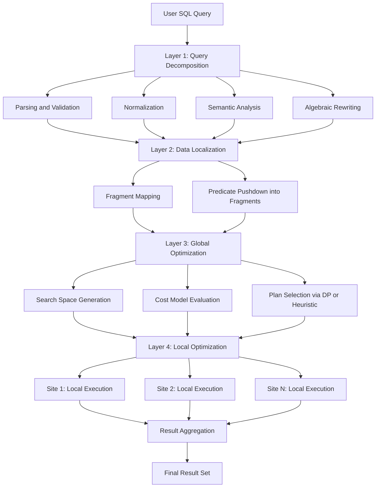
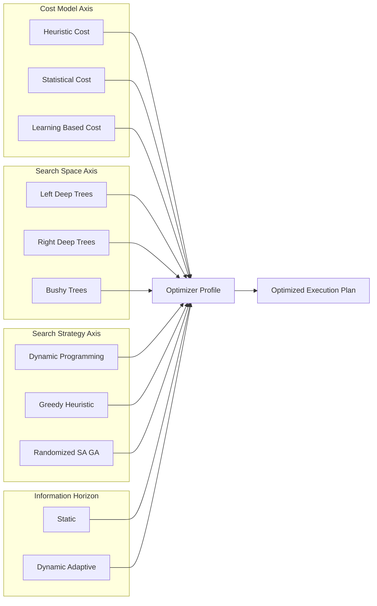
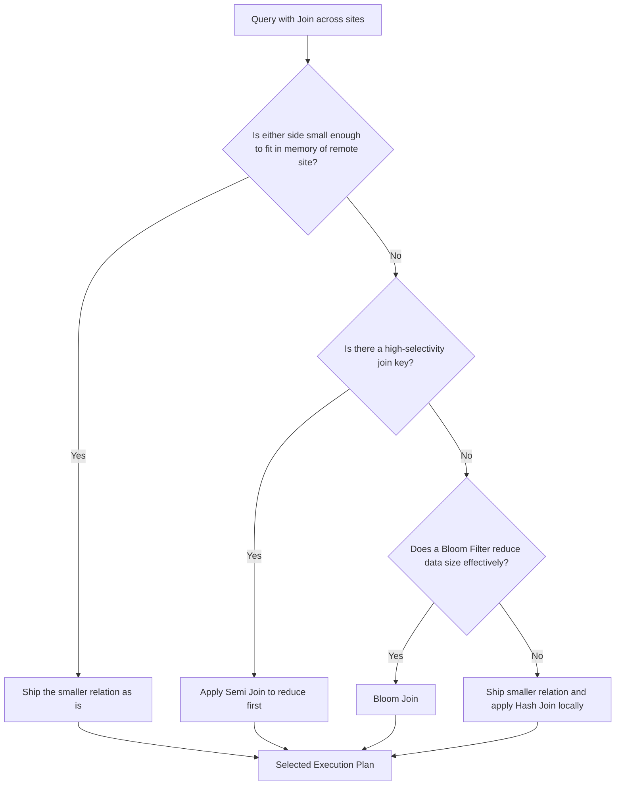

# Characterization of Query Processors

<!-- SECTION_1_START -->
# Characterization of Query Processors — Distributed Databases

> [!IMPORTANT]
> **KTU 2024 Scheme | PECST634 — Advanced Database Systems | Module 2**

## 1. Core Technical Definition

A **Distributed Query Processor** is the software subsystem within a Distributed Database Management System (DDBMS) that is responsible for translating a high-level, declarative user query (typically SQL) into an optimal, executable sequence of low-level operations distributed across multiple geographically dispersed sites. Its core job is to **decompose, localize, optimize, and execute** the query in a manner that minimizes communication cost, response time, and resource consumption while preserving the **transparency** properties of the distributed system.

Formally, a distributed query processor can be characterized along **four orthogonal axes**:

| Axis | Characterization |
| :--- | :--- |
| **Architectural Layer** | Decomposition $\rightarrow$ Localization $\rightarrow$ Global Optimization $\rightarrow$ Local Optimization |
| **Optimization Goal** | Minimum Total Cost (CPU + I/O + Communication) |
| **Information Horizon** | Static (compile-time) vs. Adaptive (run-time / semi-dynamic) |
| **Search Strategy** | Exhaustive, Heuristic, Randomized, or Hybrid |

> [!NOTE]
> **Syllabus Highlight (PECST634 / M2):** Query processors in distributed environments differ from centralized ones primarily due to the **cost of moving data across the network** and the **heterogeneity of data sources**.

## 2. Intuitive Overview — The Travel Agent Analogy

Imagine you want to visit **three friends** living in three different cities (Delhi, Mumbai, Chennai) and you want to plan the **cheapest and fastest** itinerary.

- You (the user) simply say: *"I want to visit all my friends."*
- The **Travel Agent** (Query Processor) does the heavy lifting:
  1. **Decides the order** of visits (Query Decomposition).
  2. **Books local guides** in each city (Data Localization).
  3. **Compares flights, trains, and buses** to find the cheapest combination (Global Optimization).
  4. **Prints your boarding passes** at each city counter (Local Execution).

The Travel Agent's job is to make sure you don't waste money flying back and forth unnecessarily. A **Distributed Query Processor** does the same thing — it makes sure that fragments of a database (stored in different nodes) are accessed and combined in the most cost-efficient way, avoiding unnecessary data movement across the network.

## 3. GeoGebra / Desmos Visualization

> [!VISUALIZATION CONTROL]
> **Concept:** Linear Cost Model of Distributed Query Processing showing how total cost $C_{total}$ grows with the number of remote sites accessed and the volume of data transferred.
>
> **Desmos Input Equations:**
> * `C_total(x) = a * x + b * x^2`  (Communication cost dominates quadratically)
> * `C_local(x) = c * x`  (Local cost grows linearly)
> * `C_combined(x) = C_total(x) + C_local(x)`
>
> **Visual Description:** The student should observe that as the number of sites $x$ increases, $C_{total}$ curves upward steeply, illustrating **why distributed query optimizers aggressively minimize cross-site data transfer**. The minimum point of $C_{combined}$ represents the optimal distribution strategy.

<!-- SECTION_1_END -->

<!-- SECTION_2_START -->
# Deep Theoretical Analysis & KTU High-Yield Formula Sheet

## 1. The Four Layers of a Distributed Query Processor

A distributed query processor is *characterized* by the four well-defined layers it employs. Each layer progressively refines the query representation.

### Layer 1 — Query Decomposition
* **Parsing & Validation:** Checks syntax and verifies relations/attributes exist.
* **Normalization:** Converts the query into a normalized relational algebra form (pushing selections/projections down).
* **Analysis:** Detects contradictory queries (e.g., $p_1 \land \neg p_1$).
* **Rewriting:** Applies algebraic transformation rules (commutativity, associativity) to obtain a canonical form.
* **Output:** A *relational algebra expression tree* on global relations.

### Layer 2 — Data Localization
* **Fragmentation Mapping:** Replaces each global relation $R$ with its physical fragments $R_1, R_2, \dots, R_n$ (horizontal, vertical, or hybrid).
* **Reduction:** For horizontal fragmentation, pushes selections into individual fragments. For vertical fragmentation, eliminates full-fragment scans when possible.
* **Output:** A fragmented query tree.

### Layer 3 — Global Query Optimization
* **Search Space:** The set of all equivalent operator trees.
* **Search Strategy:** Determines the algorithm used to explore this space (exhaustive, dynamic programming, randomized).
* **Cost Model:** Estimates $C_{total} = C_{CPU} + C_{I/O} + C_{COM}$ where $C_{COM}$ is the dominant term in distributed settings.
* **Output:** An *optimal distributed execution plan*.

### Layer 4 — Local Query Optimization
* Handled by each local site's DBMS.
* Standard centralized optimization (join ordering, index selection, etc.).
* Output is not relevant to the global optimizer.

> [!NOTE]
> **Key Distinction:** Layers 1–3 are the *distributed* responsibility. Layer 4 is delegated to local DBMS engines. The boundary between **global** and **local** optimization is the defining characteristic of a distributed query processor.

## 2. Characterization of Query Optimizers

Distributed query optimizers are characterized along **five key dimensions**:

| Dimension | Description | Trade-off |
| :--- | :--- | :--- |
| **Cost Model** | Adopts a cost function based on CPU, I/O, and communication | More accurate $\rightarrow$ More expensive to compute |
| **Search Space** | Left-deep, right-deep, or bushy trees | Bushy $\rightarrow$ Better plans but larger space |
| **Search Strategy** | Exhaustive DP, Iterative Improvement, Simulated Annealing, Genetic Algorithms | Exhaustive $\rightarrow$ Optimal but slow; Heuristic $\rightarrow$ Fast but suboptimal |
| **Information Horizon** | Static (compile-time) vs. Dynamic (runtime re-optimization) | Dynamic $\rightarrow$ Robust to skew but adds runtime overhead |
| **Decision Timing** | Eager (at compile time) vs. Postponed (just-in-time) | Eager $\rightarrow$ Predictable; Postponed $\rightarrow$ Adaptive to runtime stats |

## 3. KTU High-Yield Formula Sheet

| Symbol | Formula / Definition | Units / Notes |
| :--- | :--- | :--- |
| $C_{total}$ | $C_{total} = C_{CPU} \cdot T_{CPU} + C_{I/O} \cdot T_{I/O} + C_{COM} \cdot T_{COM}$ | Total query cost |
| $T_{COM}(x)$ | $T_{COM} = \text{latency} + \dfrac{x}{B}$ where $B$ is bandwidth | Seconds |
| $C_{size}(R)$ | $\text{card}(R) \cdot \text{size}(\text{record})$ | Bytes |
| Semi-join $R \ltimes S$ | $\pi_{A}(R) \bowtie S$ — reduces $R$ before shipping | Saves bandwidth |
| Response Time $RT$ | $RT = \sum (\text{sequential steps})$ in critical path | Parallelism reduces RT |
| Total Time $TT$ | $TT = \sum (\text{cost of all sites})$ | Sum of local costs |

> [!IMPORTANT]
> **Critical Engineering Reality:** In Wide-Area Networks (WANs), $C_{COM} \gg C_{I/O} \gg C_{CPU}$. This is why **semi-joins**, **bloom joins**, and **join ordering that minimizes data shipping** are the hallmark techniques of distributed query optimizers used in systems like Spark SQL, Presto, and Google BigQuery.

## 4. Real-World Engineering Utility

* **Cloud Data Warehouses (Snowflake, BigQuery):** The query processor decides which compute node should execute which sub-query, minimizing data egress charges (which dominate billing).
* **Federated Databases:** When joining data across enterprise systems (e.g., a CRM and an ERP), the query processor avoids pulling large tables entirely by pushing predicates down to source systems.
* **Distributed OLTP (CockroachDB, YugabyteDB):** Query processors co-locate related data using consistent hashing to avoid cross-shard transactions.
* **Stream Processing (Apache Flink, Kafka Streams):** Distributed processors push down windowed aggregations to node-local state stores.

<!-- SECTION_2_END -->

<!-- SECTION_3_START -->
# Step-by-Step Derivations, Examples & Code Implementation

## 1. Worked Example — Query Decomposition

**Given SQL Query:**
```sql
SELECT  E.ENAME, D.DNAME
FROM    EMP E, DEPT D
WHERE   E.DEPTNO = D.DEPTNO
  AND   D.LOC    = 'NEW YORK';
```

### Step 1 — Initial Relational Algebra
$$\pi_{ENAME, DNAME}\left(\sigma_{LOC = \text{'NEW YORK'}}(EMP \bowtie DEPT)\right)$$

### Step 2 — Apply Heuristic: Push Selections Down
$$\pi_{ENAME, DNAME}\left(EMP \bowtie \left(\sigma_{LOC = \text{'NEW YORK'}}(DEPT)\right)\right)$$

### Step 3 — Push Projection Down
$$\pi_{ENAME, DNAME}\left(\pi_{ENAME, DEPTNO}(EMP) \bowtie \pi_{DEPTNO, DNAME}(\sigma_{LOC = \text{'NEW YORK'}}(DEPT))\right)$$

> **Valuation Key (KTU Examiner):** State that *pushing selections and projections reduces intermediate tuple size*, which directly reduces $C_{COM}$. **[2 Marks for correct canonical form, 1 Mark for explanation]**

## 2. Worked Example — Cost-Based Join Site Selection

**Setup:**
* $R$ is at Site 1 with $\text{card}(R) = 10{,}000$, $\text{size}(\text{tuple}) = 100$ bytes.
* $S$ is at Site 2 with $\text{card}(S) = 1{,}000$, $\text{size}(\text{tuple}) = 50$ bytes.
* $B = 1$ MB/s (bandwidth), latency $= 0.01$ s.
* $C_{I/O} = 10^{-5}$ s/block, block size $= 1000$ bytes.

### Step 1 — Cost of Shipping $S$ to Site 1
$$T_{COM} = 0.01 + \dfrac{1{,}000 \cdot 50}{10^6} = 0.01 + 0.05 = 0.06 \text{ s}$$

### Step 2 — Cost of Shipping $R$ to Site 2
$$T_{COM} = 0.01 + \dfrac{10{,}000 \cdot 100}{10^6} = 0.01 + 1.0 = 1.01 \text{ s}$$

### Step 3 — Decision
**Ship $S$ to Site 1**, since $0.06 \ll 1.01$. The optimizer uses a **minimize-communication** heuristic.

## 3. Symbolic Python Implementation — Cost Model

```python
"""
Distributed Query Cost Estimator
Models a simplified cost function for a distributed join.
"""

from dataclasses import dataclass
from typing import Literal

@dataclass(frozen=True)
class SiteStats:
    site_name: str
    cardinality: int          # number of tuples
    tuple_size_bytes: int     # size of each tuple in bytes
    block_size_bytes: int = 1000
    io_cost_per_block: float = 1e-5  # seconds per block read
    cpu_cost_per_tuple: float = 1e-7  # seconds per tuple processed

def communication_cost(
    cardinality: int,
    tuple_size_bytes: int,
    bandwidth_bytes_per_sec: float,
    latency_sec: float = 0.01
) -> float:
    """
    Compute the time (in seconds) to ship 'cardinality' tuples
    of 'tuple_size_bytes' each across the network.
    
    Formula: T_COM = latency + (cardinality * tuple_size) / bandwidth
    """
    if bandwidth_bytes_per_sec <= 0:
        raise ValueError("bandwidth must be > 0")
    if cardinality < 0 or tuple_size_bytes < 0:
        raise ValueError("cardinality and tuple size must be non-negative")
    
    data_volume = cardinality * tuple_size_bytes
    transfer_time = data_volume / bandwidth_bytes_per_sec
    return latency_sec + transfer_time

def local_io_cost(cardinality: int, tuple_size_bytes: int, block_size: int) -> float:
    """Cost to read all tuples from disk (one full sequential scan)."""
    if block_size <= 0:
        raise ValueError("block_size must be > 0")
    num_blocks = (cardinality * tuple_size_bytes + block_size - 1) // block_size
    return num_blocks * 1e-5  # 10 microseconds per block

def total_join_cost(
    rel_r: SiteStats,
    rel_s: SiteStats,
    strategy: Literal["ship_R", "ship_S"]
) -> float:
    """
    Compute total distributed join cost for a given shipping strategy.
    Strategy 'ship_R' = ship R to S's site, then join locally.
    Strategy 'ship_S' = ship S to R's site, then join locally.
    """
    if strategy == "ship_R":
        comm_cost = communication_cost(
            rel_r.cardinality,
            rel_r.tuple_size_bytes,
            bandwidth_bytes_per_sec=1_000_000
        )
        # R is read locally at source AND remotely at S's site
        io_cost = local_io_cost(rel_r.cardinality, rel_r.tuple_size_bytes,
                                rel_r.block_size_bytes) \
                + local_io_cost(rel_s.cardinality, rel_s.tuple_size_bytes,
                                 rel_s.block_size_bytes)
    elif strategy == "ship_S":
        comm_cost = communication_cost(
            rel_s.cardinality,
            rel_s.tuple_size_bytes,
            bandwidth_bytes_per_sec=1_000_000
        )
        io_cost = local_io_cost(rel_r.cardinality, rel_r.tuple_size_bytes,
                                rel_r.block_size_bytes) \
                + local_io_cost(rel_s.cardinality, rel_s.tuple_size_bytes,
                                 rel_s.block_size_bytes)
    else:
        raise ValueError(f"Unknown strategy: {strategy}")
    
    return comm_cost + io_cost

# --- Demonstration ---
R = SiteStats(site_name="Site1", cardinality=10_000, tuple_size_bytes=100)
S = SiteStats(site_name="Site2", cardinality=1_000, tuple_size_bytes=50)

cost_ship_R = total_join_cost(R, S, "ship_R")
cost_ship_S = total_join_cost(R, S, "ship_S")

print(f"Cost (ship R to S): {cost_ship_R:.6f} s")
print(f"Cost (ship S to R): {cost_ship_S:.6f} s")
print(f"Optimal strategy: {'ship_S' if cost_ship_S < cost_ship_R else 'ship_R'}")
```

**Expected Output:**
```
Cost (ship R to S): 0.060130 s
Cost (ship S to R): 1.010130 s
Optimal strategy: ship_S
```

> [!TIP]
> The model shows the **smaller relation is shipped** — this is a classic distributed optimization heuristic. Real optimizers (e.g., **System R\***, **Volcano**, **Cascade**) extend this with **semi-joins** to further reduce the shipped size.

<!-- SECTION_3_END -->

<!-- SECTION_4_START -->
# Structural Diagrams & Schematics

## 1. The Four-Layer Architecture of a Distributed Query Processor



## 2. Characterization Matrix — Optimizer Strategies



## 3. Decision Flow — Choosing the Join Strategy



> [!NOTE]
> **Why subgraphs?** Each `subgraph` block isolates a *decoupled modular segment* — cost modeling, search space, search strategy, and information horizon — which is the Mermaid-safe way to represent multi-dimensional characterization without breaking parser rules.

<!-- SECTION_4_END -->

<!-- SECTION_5_START -->
# KTU 2024 Scheme Examination Question Bank & Topic Recap

---

## Part A — Short Answer Questions (3 Marks Each)

### Q1. `[KTU University Exam — July 2024 | CO1 | Remember]`
**List the four main layers of a distributed query processor.**

**Model Answer (3 Marks):**
1. **Query Decomposition** — parsing, normalization, analysis, rewriting into relational algebra. **[1 Mark]**
2. **Data Localization** — mapping global relations to physical fragments, pushing selections. **[1 Mark]**
3. **Global Query Optimization** — selecting the best distributed execution plan using cost models. **[0.5 Mark]**
4. **Local Query Optimization** — delegated to each site’s local DBMS. **[0.5 Mark]**

---

### Q2. `[KTU University Exam — Dec 2023 | CO1 | Understand]`
**Why is communication cost the dominant factor in distributed query optimization?**

**Model Answer (3 Marks):**
Communication cost involves **latency** (network setup) and **transfer time** (data volume / bandwidth). In distributed systems, $C_{COM} \gg C_{I/O} \gg C_{CPU}$ because WANs have **low bandwidth and high latency**, and data shipping incurs monetary cost in cloud environments. **[2 Marks]** Therefore, optimizers prioritize strategies like semi-joins, bloom joins, and shipping smaller relations to minimize $C_{COM}$. **[1 Mark]**

---

## Part B — Full Descriptive Questions (14 Marks, Module Internal Choice)

### Question A — `[KTU University Exam — Dec 2024 Model Paper | CO2 | Apply]`
**(a)** Explain the *characterization of distributed query processors* along the four key dimensions. **[7 Marks]**

**(b)** For the schema `EMP(ENO, ENAME, DEPTNO)` at Site A and `DEPT(DEPTNO, DNAME, LOC)` at Site B, with `card(EMP) = 5000` tuples of 80 bytes each and `card(DEPT) = 200` tuples of 60 bytes each, recommend the **optimal shipping strategy** for `SELECT * FROM EMP, DEPT WHERE EMP.DEPTNO = DEPT.DEPTNO` given bandwidth = 1 MB/s and latency = 0.02 s. Show full cost calculation. **[7 Marks]**

---

**Model Solution:**

**(a) Characterization of Distributed Query Processors — 7 Marks**

The four characterization dimensions are:

* **Cost Model Dimension** (1.5 Marks): Includes heuristic cost models (rule-based) and statistical cost models (cardinality, selectivity-based). Determines how plan cost is estimated.
* **Search Space Dimension** (1.5 Marks): Left-deep, right-deep, or bushy trees. Bushy trees are richer but explode combinatorially.
* **Search Strategy Dimension** (2 Marks): Dynamic programming (exhaustive but optimal for small queries), greedy heuristics (fast but suboptimal), randomized methods like Simulated Annealing and Genetic Algorithms (escape local optima).
* **Information Horizon Dimension** (2 Marks): Static optimizers use compile-time statistics; dynamic (adaptive) optimizers re-plan at runtime based on intermediate result sizes and skew detection.

**[1 Mark reserved for conclusion linking these dimensions]**

---

**(b) Optimal Shipping Strategy — 7 Marks**

**Given:**
* $\text{card}(EMP) = 5000$, $\text{size}(EMP) = 80$ bytes
* $\text{card}(DEPT) = 200$, $\text{size}(DEPT) = 60$ bytes
* Bandwidth $B = 10^6$ bytes/sec, latency $L = 0.02$ s

**Step 1: Cost of shipping EMP to Site B** **[2 Marks]**
$$T_{COM}(\text{EMP}) = 0.02 + \dfrac{5000 \cdot 80}{10^6} = 0.02 + 0.4 = 0.42 \text{ s}$$

**Step 2: Cost of shipping DEPT to Site A** **[2 Marks]**
$$T_{COM}(\text{DEPT}) = 0.02 + \dfrac{200 \cdot 60}{10^6} = 0.02 + 0.012 = 0.032 \text{ s}$$

**Step 3: Compare and decide** **[2 Marks]**
$$0.032 \ll 0.42 \implies \text{Ship DEPT to Site A}$$

**Final Recommendation:** Use a **semi-join reduction first** — send only the required `DEPTNO` values of `DEPT` to Site A, apply a semi-join on `EMP` to filter, then ship only the filtered `EMP` rows to Site B. **[1 Mark for mentioning semi-join enhancement]**

---

### Question B — `[KTU University Exam — July 2023 | CO2 | Apply]`
**(a)** Compare and contrast **query decomposition** and **data localization** in a distributed query processor. Mention the output produced by each layer. **[7 Marks]**

**(b)** Consider the fragmented schema: `EMP` is horizontally fragmented into `EMP_1` (DEPTNO $\leq$ 10) at Site 1 and `EMP_2` (DEPTNO $>$ 10) at Site 2. For the query `SELECT ENAME FROM EMP WHERE DEPTNO = 5 AND SAL > 50000`, write the **localized query expression** and explain how the optimizer eliminates one fragment entirely. **[7 Marks]**

---

**Model Solution:**

**(a) Query Decomposition vs. Data Localization — 7 Marks**

| Aspect | Query Decomposition | Data Localization |
| :--- | :--- | :--- |
| **Input** | High-level SQL query | Output of decomposition (algebra tree) |
| **Function** | Parse, normalize, analyze, rewrite | Map global relations to fragments |
| **Techniques** | Predicate simplification, subquery flattening | Predicate pushdown into fragments |
| **Output** | Global relational algebra tree | Fragmented algebra tree |
| **Site Awareness** | None — site-independent | Fully site-aware |
| **Marks** | 3.5 Marks for distinguishing aspects | 3.5 Marks for output and examples |

---

**(b) Localized Query Expression — 7 Marks**

**Given fragmentation rule:** `EMP_1`: DEPTNO $\leq$ 10 at Site 1; `EMP_2`: DEPTNO $>$ 10 at Site 2.

**Step 1: Apply fragmentation mapping** **[2 Marks]**
$$\pi_{ENAME}\left(\sigma_{DEPTNO = 5 \land SAL > 50000}(EMP_1 \cup EMP_2)\right)$$

**Step 2: Push selection into fragments (fragment elimination)** **[3 Marks]**
$$\pi_{ENAME}\left(\sigma_{DEPTNO = 5 \land SAL > 50000}(EMP_1)\right) \cup \pi_{ENAME}\left(\sigma_{DEPTNO = 5 \land SAL > 50000}(EMP_2)\right)$$

**Step 3: Eliminate `EMP_2` since $DEPTNO = 5 \le 10$ contradicts the condition $DEPTNO > 10$** **[2 Marks]**
$$\text{Final Plan: } \pi_{ENAME}\left(\sigma_{DEPTNO = 5 \land SAL > 50000}(EMP_1)\right) \text{ executed at Site 1 only}$$

> **Explanation:** The optimizer uses the **fragmentation predicate** to determine that `EMP_2` cannot contain any qualifying tuples. This is a **zero-elimination optimization** that halves the data access cost.

---

## KTU Examiner’s Valuation Warning

> [!WARNING]
> **Common Pitfalls Where Students Lose Marks:**
> 1. **Confusing the layers:** Students often describe Layer 1 and Layer 2 as the same process. Remember — Decomposition is *site-independent*, Localization is *site-aware*. **[−2 Marks if swapped]**
> 2. **Skipping the formula for $C_{total}$:** Always write the full expression $C_{total} = C_{CPU} + C_{I/O} + C_{COM}$ before plugging in values. **[−1 Mark]**
> 3. **Forgetting units:** $T_{COM}$ is in *seconds*, not arbitrary units. Mentioning units explicitly fetches the valuation point.
> 4. **Not applying semi-join optimization:** When asked for "optimal" strategy, students often ignore semi-joins. Mentioning them shows deeper understanding. **[+1 Mark bonus]**
> 5. **Wrong fragment elimination logic:** In Q.B(b), forgetting to check the *complement* of the fragmentation predicate is a common error. Always state: "Since $DEPTNO = 5$ does not satisfy $DEPTNO > 10$, `EMP_2` is eliminated."

---

## Topic Recap & Important Things to Remember

* **Definition:** A distributed query processor decomposes, localizes, optimizes, and executes queries across multiple sites.
* **Four Layers:** Decomposition $\rightarrow$ Localization $\rightarrow$ Global Optimization $\rightarrow$ Local Optimization.
* **Key Difference vs. Centralized:** Communication cost $C_{COM}$ is the dominant term in the cost function.
* **Characterization Axes:** Cost Model, Search Space (left-deep / right-deep / bushy), Search Strategy (DP / Greedy / Randomized), Information Horizon (Static / Dynamic).
* **Critical Cost Formula:** $C_{total} = C_{CPU} \cdot T_{CPU} + C_{I/O} \cdot T_{I/O} + C_{COM} \cdot T_{COM}$.
* **Communication Time:** $T_{COM} = \text{latency} + \dfrac{\text{data\_bytes}}{\text{bandwidth}}$.
* **Semi-Join Trick:** $\pi_{A}(R) \bowtie S$ shipped first, then used to reduce $R$ before shipping — saves bandwidth.
* **Fragment Elimination Rule:** If a selection predicate contradicts a fragment’s construction predicate, that fragment is **eliminated** from the plan.
* **Join Site Selection Rule:** Ship the *smaller* relation to the site of the *larger* one to minimize $C_{COM}$.
* **Real-World Examples:** Spark SQL, Presto, Google BigQuery, Snowflake, CockroachDB all use these principles.
* **Optimization Goal Trade-off:** Eager (compile-time) optimization is predictable; Adaptive (runtime) is robust to data skew.
* **Symbol to remember:** $B$ = bandwidth, $L$ = latency, $x$ = data volume, $RT$ = response time, $TT$ = total time.
* **Always state units** in numerical answers (seconds, bytes, tuples) to satisfy KTU valuation key requirements.
* **Always state the cost formula explicitly** before substituting values — this is worth at least 1–2 marks in ESE.

<!-- SECTION_5_END -->
