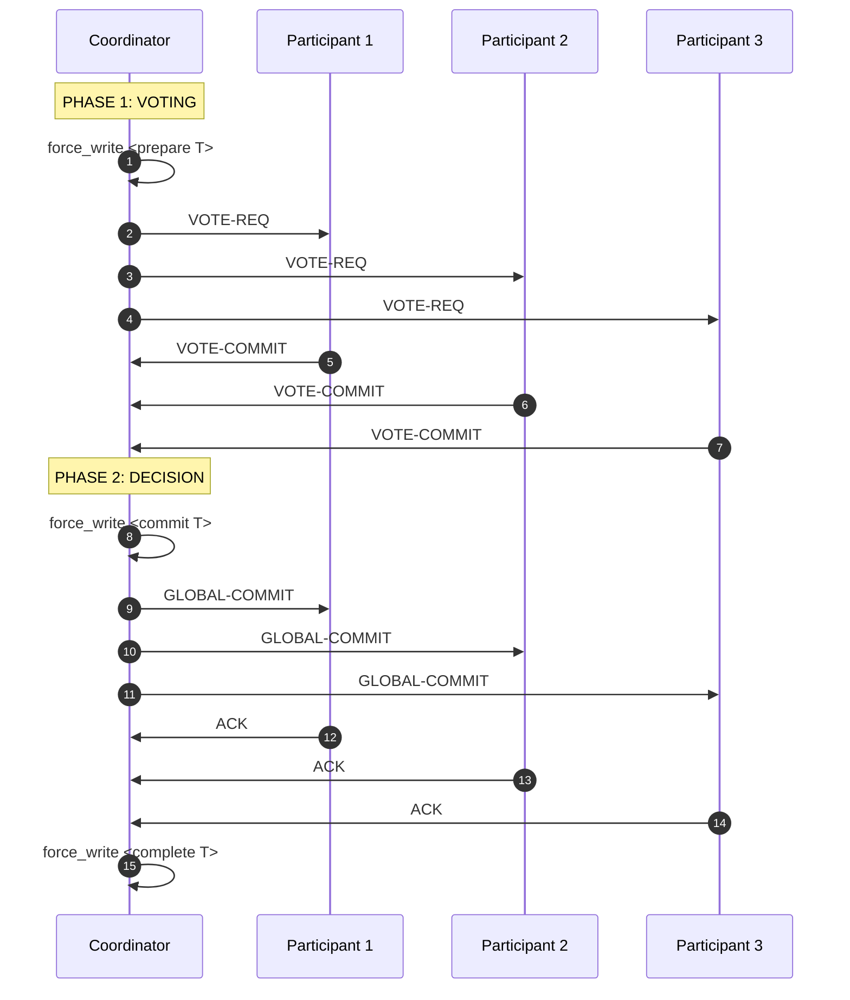
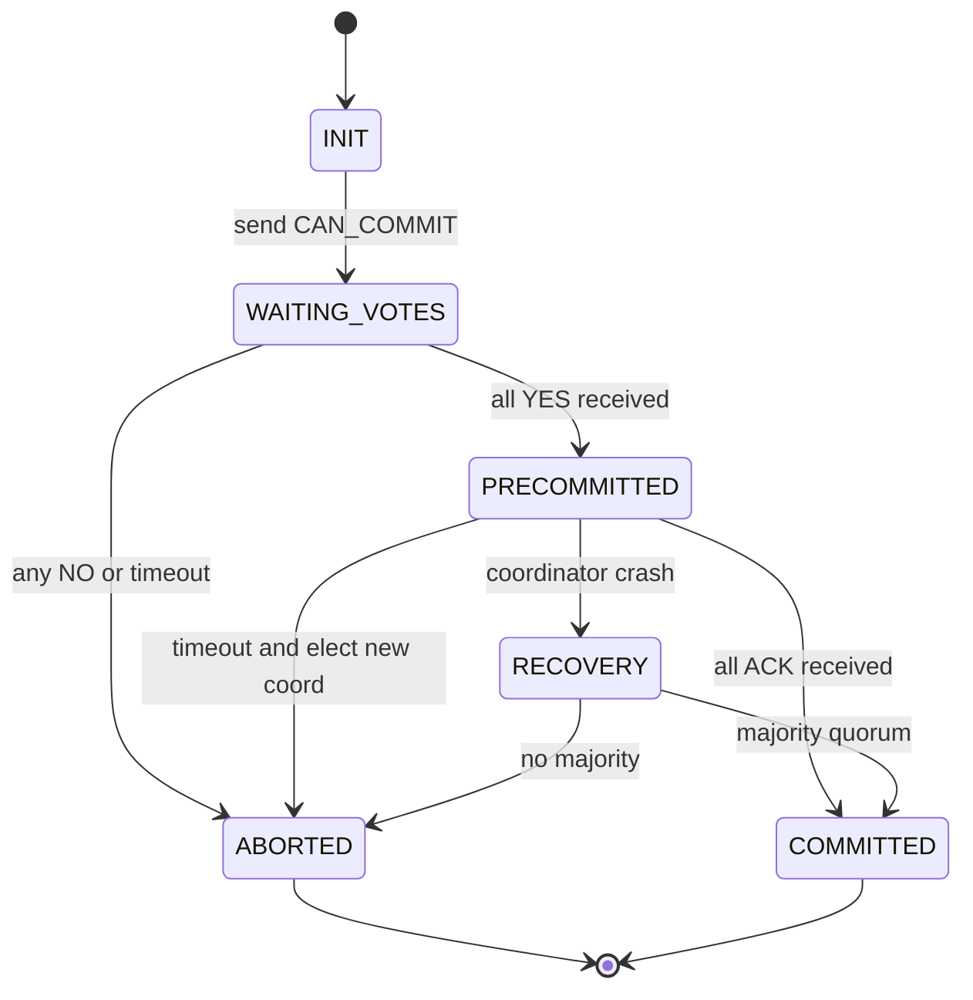
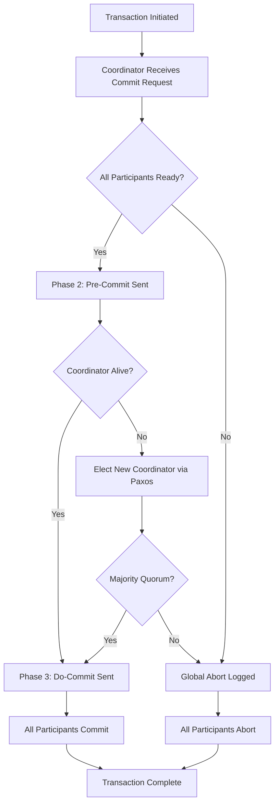
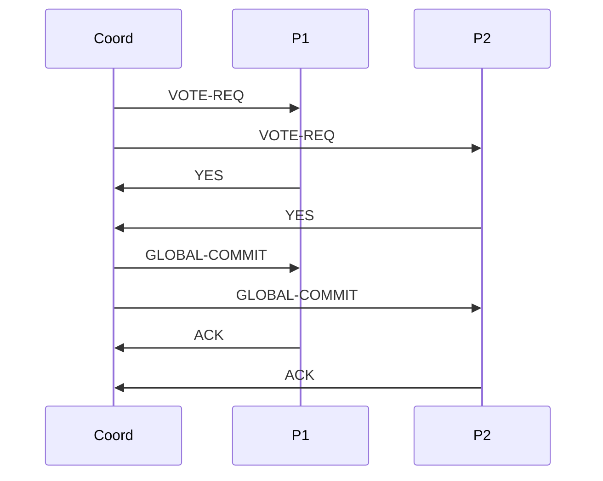

# Commit Protocols

<!-- SECTION_1_START -->
# Commit Protocols in Distributed Databases

## 1. Core Technical Definition & Intuitive Overview

> [!IMPORTANT]
> **KTU 2024 Syllabus Definition:**
> A **Commit Protocol** in a distributed database system is a distributed algorithm used to coordinate the atomic commitment of a transaction across multiple distributed sites/nodes. It ensures that either **all participating sites commit the transaction** or **all sites abort it**, thereby preserving the **Atomicity** property of ACID across the distributed environment.

In a distributed database, a single logical transaction may execute across multiple fragments stored at different geographic sites. The challenge arises when one site has committed but another site crashes *before* committing. Commit protocols solve this by introducing a **coordinator** process that orchestrates the global commit decision using message passing.

### Conceptual Analogy / Intuition

> [!NOTE]
> **"The Wedding RSVP Analogy"** 💍
>
> Imagine a wedding where the bride's family is at **Site A** (Delhi), the groom's family is at **Site B** (Mumbai), and the wedding planner is the **Coordinator** (Bangalore). For the wedding (transaction) to happen, *both* families must agree.
>
> - The coordinator first **asks both families** (Voting Phase): *"Can you commit on Sunday?"*
> - Both reply with **YES (Ready)** or **NO (Abort)**.
> - If both say YES, the coordinator **announces the final decision** (Decision Phase): *"The wedding is on!"* — this is recorded permanently in everyone's diary.
> - If even one says NO, the coordinator announces **"Wedding is cancelled"** and resources are released.
>
> The problem? What if the Mumbai family says YES but their phone line goes dead *after* that? The coordinator doesn't know their true status. This is precisely the **uncertainty problem** that 2PC and 3PC protocols solve.

| Term | Standard Metric (KTU Notation) |
|---|---|
| Number of sites | **n** |
| Coordinator | **Site C** (one designated node) |
| Participants | **Site 1, Site 2, ..., Site n** |
| Stable storage write | **force-write** |
| Log records | **prepared**, **commit**, **abort** |
| Network assumption | **Reliable, FIFO channels** |

> [!VISUALIZATION CONTROL]
> **Concept:** Two-Phase Commit (2PC) State Transition Flow
> **GeoGebra / Desmos Input Equations (Discrete Event Plot):**
> * `x = 0` → Coordinator sends `VOTE-REQ`
> * `x = 1` → Participant sends `YES/NO`
> * `x = 2` → Coordinator sends `GLOBAL-COMMIT/ABORT`
> * `x = 3` → Participant sends `ACK`
> **Visual Description:** A Gantt-style timeline showing the two distinct phases (Voting Phase then Decision Phase) with vertical drop-lines representing message exchanges between Coordinator and Participants over discrete time steps.
<!-- SECTION_1_END -->

<!-- SECTION_2_START -->
# 2. Deep Theoretical Analysis & KTU High-Yield Formula Sheet

## 2.1 The Two-Phase Commit (2PC) Protocol

The **Two-Phase Commit (2PC)** protocol is the most widely used commit protocol. It was proposed by **Gray (1978)** and involves two distinct rounds of message exchange.

### Phase 1: Voting (or Prepare) Phase
1. Coordinator writes `<prepare T>` record to its **stable log** (forced write).
2. Coordinator sends `VOTE-REQ` to all participants.
3. Each participant receives the message and evaluates locally:
   - If **ready to commit**: writes `<ready T>` to log (forced write), sends `VOTE-COMMIT` (YES) to coordinator.
   - If **cannot commit**: writes `<abort T>` to log, sends `VOTE-ABORT` (NO), and aborts locally.

### Phase 2: Decision (or Commit) Phase
4. Coordinator collects all votes:
   - **If ALL votes are YES**: writes `<commit T>` to log (forced write), sends `GLOBAL-COMMIT` to all participants.
   - **If ANY vote is NO (or timeout)**: writes `<abort T>` to log, sends `GLOBAL-ABORT` to all participants.
5. Each participant receives the global decision, writes it to log, executes it, and sends `ACK` back to coordinator.
6. Coordinator writes `<complete T>` to log after receiving all ACKs.

### The Blocking Problem of 2PC

> [!WARNING]
> 2PC is a **BLOCKING** protocol. If the coordinator crashes *after* sending `GLOBAL-COMMIT` but *before* participants receive it, participants that voted YES remain **in limbo** — holding locks indefinitely. This is the famous **"uncertainty" or "blocking" problem** of 2PC.

## 2.2 The Three-Phase Commit (3PC) Protocol

To overcome 2PC's blocking nature, **Skeen (1981)** proposed **3PC**, which adds a third phase called the **Pre-Commit Phase**. It assumes **no network partition** and that fewer than a majority of nodes fail.

### Phase 1: CanCommit
- Coordinator writes `<canCommit T>`, sends `CAN-COMMIT?` to all.
- Participants reply `YES` or `NO` based on local evaluation.

### Phase 2: PreCommit
- If coordinator receives ALL `YES`: writes `<preCommit T>`, sends `PRE-COMMIT` to all.
- Participants write `<ready T>`, reply `ACK`.
- If coordinator receives ANY `NO` or timeout: writes `<abort T>`, sends `ABORT`.

### Phase 3: doCommit
- After receiving ALL `ACK`s: coordinator writes `<commit T>`, sends `DO-COMMIT`.
- Participants commit and reply `ACK`.

> [!NOTE]
> **Key Insight:** 3PC is **non-blocking** under the assumption of *fail-stop* failures (no network partitions). The Pre-Commit phase ensures that all participants who voted YES have a recovery rule: if they recover and find no `commit` record, they can safely coordinate to commit by electing a new coordinator (using a majority quorum).

## 2.3 Presumed Abort vs Presumed Commit

| Variant | Assumption on Missing Logs | Reduces Log Writes | Used In |
|---|---|---|---|
| **Presumed Abort (PA)** | If no log record exists, transaction is aborted. | Coordinator skips writing `abort` and `complete`. | Most common (e.g., DB2) |
| **Presumed Commit (PC)** | If no log record exists, transaction is committed. | Coordinator skips writing `commit` and `complete`. | Tandem, Sybase |

## 2.4 KTU Formula Sheet / Cheat Sheet

| # | Concept | Equation / Rule | Used For |
|---|---|---|---|
| 1 | 2PC Messages | $M_{2PC} = 4n$ (where $n$ is participants) | Total message count in 2PC |
| 2 | 3PC Messages | $M_{3PC} = 6n$ | Total message count in 3PC |
| 3 | Quorum for 3PC | $Q = \lfloor n/2 \rfloor + 1$ | New coordinator election after failure |
| 4 | Blocking probability (2PC) | $P_b \approx p_c$ where $p_c$ is coordinator crash probability | Reliability analysis |
| 5 | Termination cost | $T_{term} = 2n + 1$ messages | Worst-case termination protocol cost |
| 6 | Forced log writes (2PC) | $F_{2PC} = 2n + 3$ (approx) | I/O cost analysis |
| 7 | Forced log writes (3PC) | $F_{3PC} = 3n + 4$ (approx) | I/O cost analysis |
| 8 | Atomicity invariant | $\forall i: \text{state}(T, S_i) \in \{\text{committed}, \text{aborted}\}$ | Correctness condition |
| 9 | Termination rule (3PC) | If no decision, elect new coord. with $Q$ participants | Non-blocking recovery |
| 10 | Timeout rule (Participant 2PC) | If timeout before vote: **ABORT**; after vote: **WAIT** | Block-resolving timeout |

## 2.5 Real-World Utility in Engineering

> [!TIP]
> - **Oracle, PostgreSQL, MySQL Cluster** → Use 2PC for distributed transactions.
> - **Google Spanner, CockroachDB** → Use **Paxos Commit** (a fault-tolerant variant of 2PC).
> - **Apache Kafka** → Uses a version of 2PC for transactional producer/consumer commits.
> - **Two Generals' Problem**: 2PC is essentially a practical solution to this impossibility theorem by tolerating coordinator crashes via blocking.
<!-- SECTION_2_END -->

<!-- SECTION_3_START -->
# 3. Step-by-Step Derivations & Symbolic Implementation

## 3.1 Detailed Derivation: Message Cost of 2PC vs 3PC

Let $n$ = number of participant sites (excluding coordinator).

**Step 1: Count Phase 1 of 2PC**
- Coordinator → Participants: $n$ messages (`VOTE-REQ`)
- Participants → Coordinator: $n$ messages (`VOTE-COMMIT/ABORT`)
- Subtotal $M_1 = 2n$

**Step 2: Count Phase 2 of 2PC**
- Coordinator → Participants: $n$ messages (`GLOBAL-COMMIT/ABORT`)
- Participants → Coordinator: $n$ messages (`ACK`)
- Subtotal $M_2 = 2n$

**Step 3: Total**

$$\begin{aligned}
M_{2PC} &= M_1 + M_2 = 2n + 2n \\
M_{2PC} &= 4n
\end{aligned}$$

**Step 4: Similarly for 3PC**
- Phase 1 (CanCommit): $2n$ messages
- Phase 2 (PreCommit): $2n$ messages
- Phase 3 (doCommit): $2n$ messages

$$\begin{aligned}
M_{3PC} &= 2n + 2n + 2n \\
M_{3PC} &= 6n
\end{aligned}$$

**Step 5: Overhead ratio**

$$\begin{aligned}
R_{overhead} &= \frac{M_{3PC} - M_{2PC}}{M_{2PC}} \times 100\% \\
&= \frac{6n - 4n}{4n} \times 100\% \\
&= \frac{2n}{4n} \times 100\% \\
R_{overhead} &= 50\%
\end{aligned}$$

**Conversion Logic:** 3PC requires **50% more messages** than 2PC, but in exchange, it eliminates the blocking problem under fail-stop assumptions.

## 3.2 Symbolic Pseudocode (Banking Use Case)

```python
from enum import Enum
from typing import List, Optional
import logging
import time

# Configure structured error logging
logging.basicConfig(
    level=logging.INFO,
    format="%(asctime)s | %(levelname)s | %(message)s"
)
logger = logging.getLogger("TwoPhaseCommit")


class VoteDecision(Enum):
    """Enumerates the possible vote responses from a participant."""
    YES = "VOTE-COMMIT"
    NO = "VOTE-ABORT"


class GlobalDecision(Enum):
    """Enumerates the possible final commit/abort decisions."""
    COMMIT = "GLOBAL-COMMIT"
    ABORT = "GLOBAL-ABORT"


class Participant:
    """
    Represents a distributed database site that holds a fragment
    of the transaction's data.
    """

    def __init__(self, site_id: str, name: str, balance: int) -> None:
        self.site_id: str = site_id
        self.name: str = name
        self.balance: int = balance
        self.log: List[str] = []
        self.locked: bool = False
        self.voted: Optional[VoteDecision] = None

    def force_write(self, record: str) -> None:
        """Simulates a forced write to stable storage (durable log)."""
        self.log.append(f"[STABLE] {record}")
        logger.info(f"Site {self.site_id} wrote: {record}")

    def can_commit(self, amount: int) -> VoteDecision:
        """
        Local evaluation: Does this participant have sufficient resources
        (e.g., funds) to commit the transaction?
        """
        if self.balance >= amount:
            self.voted = VoteDecision.YES
            self.force_write(f"<ready T amount={amount}>")
            return VoteDecision.YES
        else:
            self.voted = VoteDecision.NO
            self.force_write("<abort T>")
            logger.warning(f"Site {self.site_id} ABORTED locally: insufficient funds")
            return VoteDecision.NO

    def execute_decision(self, decision: GlobalDecision) -> None:
        """Executes the global decision once received from the coordinator."""
        self.force_write(f"<{decision.value} T>")
        if decision == GlobalDecision.COMMIT:
            self.balance += 1  # Placeholder credit operation
            self.locked = False
        else:
            self.locked = False
        logger.info(f"Site {self.site_id} executed: {decision.value}")


class Coordinator:
    """
    The coordinator orchestrates the 2PC protocol across all participants.
    """

    def __init__(self, tx_id: str) -> None:
        self.tx_id: str = tx_id
        self.log: List[str] = []

    def force_write(self, record: str) -> None:
        self.log.append(f"[STABLE] {record}")
        logger.info(f"COORDINATOR wrote: {record}")

    def two_phase_commit(
        self,
        participants: List[Participant],
        amount: int,
        timeout_sec: float = 2.0
    ) -> GlobalDecision:
        """
        Executes the full 2PC protocol with timeout and error handling.
        Returns the final global decision.
        """
        # --- PHASE 1: VOTING ---
        logger.info(f"========== PHASE 1: VOTING (T={self.tx_id}) ==========")
        self.force_write(f"<prepare T={self.tx_id}>")

        votes: List[VoteDecision] = []
        start = time.time()
        for p in participants:
            if time.time() - start > timeout_sec:
                logger.error("Timeout in Phase 1 — aborting transaction.")
                self._global_abort(participants)
                return GlobalDecision.ABORT
            votes.append(p.can_commit(amount))

        # --- DECISION ---
        if all(v == VoteDecision.YES for v in votes):
            decision = GlobalDecision.COMMIT
        else:
            decision = GlobalDecision.ABORT

        # --- PHASE 2: DECISION ---
        logger.info(f"========== PHASE 2: DECISION = {decision.value} ==========")
        if decision == GlobalDecision.COMMIT:
            self.force_write(f"<commit T={self.tx_id}>")
            for p in participants:
                p.execute_decision(GlobalDecision.COMMIT)
        else:
            self.force_write(f"<abort T={self.tx_id}>")
            for p in participants:
                p.execute_decision(GlobalDecision.ABORT)

        self.force_write(f"<complete T={self.tx_id}>")
        return decision

    def _global_abort(self, participants: List[Participant]) -> None:
        """Helper to force a global abort."""
        self.force_write(f"<abort T={self.tx_id}>")
        for p in participants:
            p.execute_decision(GlobalDecision.ABORT)


# ---------------------- DEMO RUN ----------------------
if __name__ == "__main__":
    # Three bank branches participating in a transfer
    branch_delhi = Participant("D", "Delhi", 5000)
    branch_mumbai = Participant("M", "Mumbai", 3000)
    branch_chennai = Participant("C", "Chennai", 1000)

    sites: List[Participant] = [branch_delhi, branch_mumbai, branch_chennai]

    coord = Coordinator(tx_id="TXN-101")
    final_decision = coord.two_phase_commit(sites, amount=2000)
    print(f"\n>>> Final Global Decision: {final_decision.value}")
```

### 3.3 Lab/Practical Configuration Matrix (Network Setup)

| Step | Component | Configuration | Safety Check |
|---|---|---|---|
| 1 | Coordinator VM | Ubuntu 22.04, PostgreSQL 15, IP `192.168.1.10` | Disable firewall on port 5432 |
| 2 | Participant 1 | Ubuntu 22.04, PostgreSQL 15, IP `192.168.1.11` | Verify `pg_isready` |
| 3 | Participant 2 | Ubuntu 22.04, PostgreSQL 15, IP `192.168.1.12` | Verify `pg_isready` |
| 4 | Network | Switched LAN, < 5ms latency | `ping -c 5` test |
| 5 | Failure simulation | `tc netem` to drop packets | Use `tc qdisc add dev eth0 root netem loss 30%` |
| 6 | Coordinator crash | `kill -9 $(pidof postgres)` | Run before sending `GLOBAL-COMMIT` |
| 7 | Recovery | `pg_resetwal` + replay logs | Check `<ready T>` in `pg_xlog` |
| 8 | Monitoring | `pg_stat_activity` to view locks | Detect blocking participants |
<!-- SECTION_3_END -->

<!-- SECTION_4_START -->
# 4. Structural Diagrams & Schematics

## 4.1 Two-Phase Commit (2PC) — Mermaid Sequence Diagram



## 4.2 Three-Phase Commit (3PC) — Mermaid State Machine



## 4.3 Failure Recovery Architecture — Block Diagram



## 4.4 Comparison Matrix: 2PC vs 3PC

| Module Segment | 2PC Property | 3PC Property |
|---|---|---|
| Phases | Voting + Decision | CanCommit + PreCommit + doCommit |
| Messages | $4n$ | $6n$ |
| Blocking | Yes (under coordinator failure) | No (under fail-stop) |
| Network partition safe | No | No (assumes none) |
| Coordinator crash | Participants block in limbo | Participants elect new coord |
| Implementation complexity | Low | Medium-High |
| Log writes | $2n + 3$ | $3n + 4$ |
| Adopted in | DB2, Oracle, PostgreSQL | Rare; mostly theoretical |
<!-- SECTION_4_END -->

<!-- SECTION_5_START -->
# 5. KTU 2024 Scheme Examination Question Bank & Topic Recap

## 5.1 Part A — 3 Mark Questions (Short Answer)

### Q1. `[KTU University Exam - Dec 2023]` — CO1, Remember
**What is the Two-Phase Commit (2PC) protocol? State the role of the coordinator.**

**Model Answer:**
The **Two-Phase Commit (2PC)** protocol is a distributed algorithm that ensures atomic commitment of a transaction across multiple sites. It has two phases: a **Voting Phase** (where participants are asked to prepare) and a **Decision Phase** (where the global commit/abort is communicated). The **Coordinator** is a designated site that initiates the protocol, collects votes, writes the decision to its stable log, and broadcasts the global outcome to all participants. **[3 Marks: 1 for protocol def, 1 for two phases, 1 for role of coordinator]**

### Q2. `[KTU University Exam - July 2024]` — CO1, Understand
**Differentiate between blocking and non-blocking commit protocols with one example each.**

**Model Answer:**
A **blocking protocol** is one in which, upon a coordinator failure, participants may be unable to decide the transaction's outcome and must wait indefinitely. **Example: Two-Phase Commit (2PC)**. A **non-blocking protocol** allows participants to make a progress decision even after a coordinator crash by using a recovery mechanism (e.g., majority quorum). **Example: Three-Phase Commit (3PC)** under the fail-stop assumption. **[3 Marks: 1.5 each]**

---

## 5.2 Part B — 14 Mark Questions (Module Internal Choice)

### Question A `[KTU University Exam - Dec 2023]` — CO2, Apply

**(a) [7 Marks] Explain the Two-Phase Commit (2PC) protocol in detail with a neat sequence diagram. Describe the actions taken by the coordinator and participants in each phase. Mention the messages exchanged.**

**Model Solution:**

**1. Definition [1 Mark]**
2PC is a distributed atomic commitment protocol that uses a coordinator and participants to ensure all-or-nothing transaction outcome.

**2. Phase 1 — Voting Phase [3 Marks]**
| Step | Action |
|---|---|
| 1 | Coordinator writes `<prepare T>` to its stable log. |
| 2 | Coordinator sends `VOTE-REQ` to all participants. |
| 3 | Each participant evaluates locally; if ready, writes `<ready T>` and replies `VOTE-COMMIT`. Else, writes `<abort T>` and replies `VOTE-ABORT`. |

**3. Phase 2 — Decision Phase [2 Marks]**
| Step | Action |
|---|---|
| 4 | If all votes are YES, coordinator writes `<commit T>` and sends `GLOBAL-COMMIT`. If any NO, writes `<abort T>` and sends `GLOBAL-ABORT`. |
| 5 | Participants write the decision, execute it, and send `ACK`. |
| 6 | Coordinator writes `<complete T>` after all ACKs. |

**4. Sequence Diagram [1 Mark]**



**(b) [7 Marks] Discuss the blocking problem of 2PC. What happens if the coordinator crashes after sending `VOTE-REQ` but before recording the global decision? How do participants recover?**

**Model Solution:**

**1. Definition of Blocking Problem [2 Marks]**
A participant that has voted YES and is waiting for the global decision becomes **blocked** if the coordinator crashes. The participant cannot unilaterally decide, because:
- It cannot abort (the coordinator might have decided to commit).
- It cannot commit (the coordinator might have decided to abort).
- Hence, it holds locks indefinitely — causing a **deadlock-like scenario**.

**2. Scenario: Coordinator crashes after Phase 1, before Phase 2 [3 Marks]**

Let $S$ = set of participants that voted YES.

| Participant State | Recovery Action |
|---|---|
| Has `<ready T>` log | Block, wait for new coordinator. |
| Has no log (didn't vote) | Abort unilaterally. |
| Has `<abort T>` log | Abort unilaterally. |

A new coordinator is elected (e.g., via leader election), consults the others, and re-runs Phase 2 by sending `GLOBAL-COMMIT` or `GLOBAL-ABORT`.

**3. Termination Protocol [1 Mark]**
The new coordinator sends a `GET-DECISION` query to all participants. If any participant has a `<commit T>` log, commit. Else, abort. **Blocking persists** in the worst case.

**4. Conclusion [1 Mark]**
2PC's blocking is a fundamental limitation that 3PC attempts to solve using a Pre-Commit phase and quorum-based recovery.

> [!WARNING]
> **KTU Examiner's Valuation Pitfall:**
> - Do NOT confuse the **Blocking Problem** with **Deadlock** — blocking is a property of the *protocol*, not a database lock.
> - Many students forget to mention the **stable log** writes — losing 1-2 marks.
> - The "coordinator sends `VOTE-REQ`" is *not* the same as the participant voting — distinguish carefully.

---

### Question B `[KTU University Exam - July 2024]` — CO2, Apply

**(a) [7 Marks] Explain the Three-Phase Commit (3PC) protocol with its three phases. How does it overcome the blocking problem of 2PC? State the assumptions under which 3PC is non-blocking.**

**Model Solution:**

**1. Introduction [1 Mark]**
3PC (proposed by **Skeen, 1981**) inserts an additional **Pre-Commit phase** between 2PC's voting and decision phases.

**2. Three Phases [3 Marks]**

| Phase | Coordinator Action | Participant Action |
|---|---|---|
| **Phase 1: CanCommit** | Write `<canCommit T>`, send `CAN-COMMIT?` | Reply `YES` or `NO` |
| **Phase 2: PreCommit** | If all YES: write `<preCommit T>`, send `PRE-COMMIT` | Write `<ready T>`, send `ACK` |
| **Phase 3: doCommit** | Write `<commit T>`, send `DO-COMMIT` | Commit and send `ACK` |

**3. How it Overcomes Blocking [2 Marks]**
The **Pre-Commit** phase ensures that no participant is in an *uncertain* intermediate state. If the coordinator crashes:
- Participants that have `<preCommit T>` know that a **majority** voted YES.
- They elect a new coordinator (using **$Q = \lfloor n/2 \rfloor + 1$** quorum).
- The new coordinator commits if it can gather a majority of `<preCommit T>` records; otherwise, it aborts.
- Thus, **no participant is blocked indefinitely**.

**4. Assumptions [1 Mark]**
- **Fail-stop failures** (no Byzantine faults).
- **No network partitions** (reliable, FIFO channels).
- All messages are eventually delivered.

**(b) [7 Marks] Compare 2PC and 3PC in terms of (i) number of phases, (ii) message complexity, (iii) blocking behavior, (iv) log writes, and (v) use cases. Show the derivation for the message count of each.**

**Model Solution:**

**1. Comparison Table [4 Marks]**

| Parameter | 2PC | 3PC |
|---|---|---|
| Number of phases | 2 | 3 |
| Message complexity | $4n$ | $6n$ |
| Blocking behavior | Blocking | Non-blocking (fail-stop) |
| Log writes per site | 2 (ready + decision) | 3 (canCommit + preCommit + doCommit) |
| Network partition | Unsafe | Unsafe (assumed none) |
| Use case | DB2, Oracle, PostgreSQL | Theoretical / Google Spanner (modified) |

**2. Derivation of $4n$ for 2PC [1.5 Marks]**

$$M_{2PC} = \underbrace{n}_{\text{VOTE-REQ}} + \underbrace{n}_{\text{VOTES}} + \underbrace{n}_{\text{DECISION}} + \underbrace{n}_{\text{ACK}} = 4n$$

**3. Derivation of $6n$ for 3PC [1.5 Marks]**

$$M_{3PC} = 2n_{\text{CanCommit}} + 2n_{\text{PreCommit}} + 2n_{\text{doCommit}} = 6n$$

**4. Overhead Ratio [− bonus mark]**

$$R = \frac{6n - 4n}{4n} \times 100 = 50\%$$

> [!WARNING]
> **KTU Examiner's Valuation Pitfall:**
> - Do **not** write that 3PC handles **network partitions** — it does NOT. The fail-stop assumption explicitly excludes partitions.
> - In the table, mark yourself: students often confuse `<preCommit T>` (3PC) with `<ready T>` (2PC) — they are *different* log records.
> - The $4n$ derivation: ensure you count **$n$ ACKs** in Phase 2 — many students omit this, losing 0.5 mark.

---

## 5.3 Topic Recap & Important Things to Remember

> [!TIP]
> **Rapid Revision Checklist — Commit Protocols (Module 2)**

### Core Definitions
- ✅ **2PC** = Voting Phase + Decision Phase (4n messages, blocking)
- ✅ **3PC** = CanCommit + PreCommit + doCommit (6n messages, non-blocking under fail-stop)
- ✅ **Coordinator** = designated site that orchestrates the protocol
- ✅ **Participants** = distributed sites holding data fragments
- ✅ **Stable log** = durable, force-written storage for recovery

### Critical Concepts
- 🔑 The **Blocking Problem** arises in 2PC when the coordinator crashes after Phase 1 — participants that voted YES are stuck.
- 🔑 **3PC's Pre-Commit phase** creates a *committed* intermediate state, allowing quorum-based recovery.
- 🔑 The **majority quorum** for 3PC is $Q = \lfloor n/2 \rfloor + 1$.
- 🔑 **Presumed Abort** assumes missing logs imply abort; **Presumed Commit** assumes the opposite.
- 🔑 **Two Generals' Problem** proves that no non-blocking protocol can guarantee atomicity in asynchronous networks with arbitrary failures — 2PC and 3PC are *best-effort* solutions.

### Must-Remember Formulas
- 📌 $M_{2PC} = 4n$
- 📌 $M_{3PC} = 6n$
- 📌 $F_{2PC} = 2n + 3$ (forced log writes)
- 📌 $F_{3PC} = 3n + 4$
- 📌 $R_{overhead} = 50\%$ (3PC vs 2PC)
- 📌 $Q = \lfloor n/2 \rfloor + 1$

### Industrial Implementations
- 🏢 **Oracle, DB2, PostgreSQL** → 2PC
- 🏢 **Google Spanner** → Paxos Commit (fault-tolerant 2PC variant)
- 🏢 **Apache Kafka** → 2PC for transactional messaging
- 🏢 **Ethereum Blockchain** → Practical Byzantine Fault Tolerance (PBFT) — a generalization

### Common Exam Traps
- ⚠️ Do not say 3PC is "safe under network partitions" — it is **not**.
- ⚠️ Do not confuse `<ready T>` (2PC) with `<preCommit T>` (3PC).
- ⚠️ Blocking ≠ Deadlock — protocol blocking is a recovery-level issue.
- ⚠️ In 2PC, a participant that votes NO and crashes before writing `<abort T>` is *safe* — recovery aborts it.
<!-- SECTION_5_END -->
