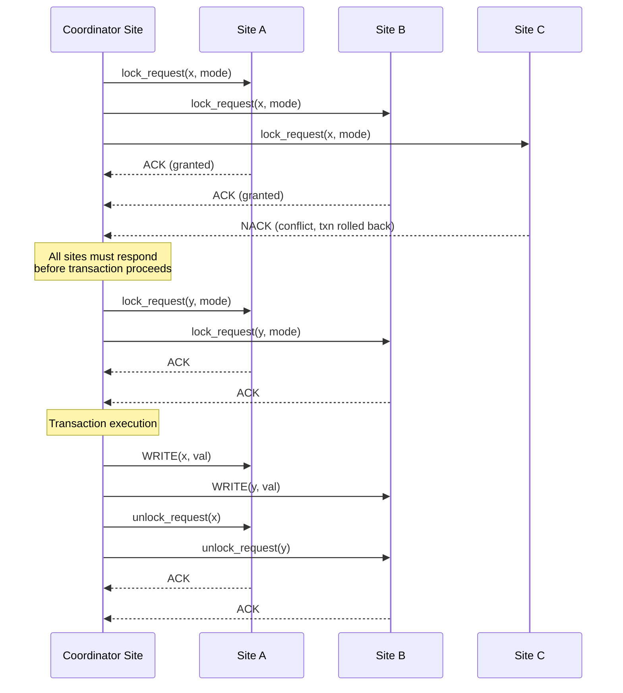
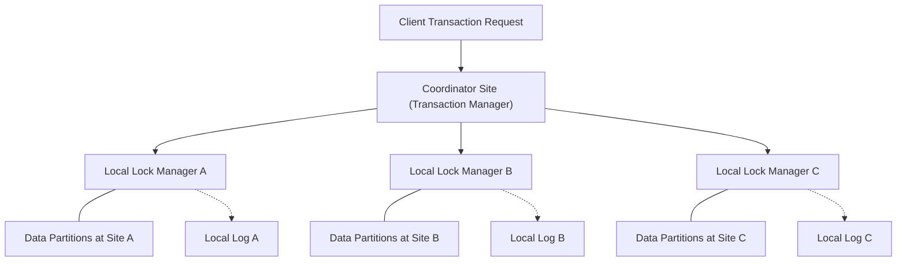
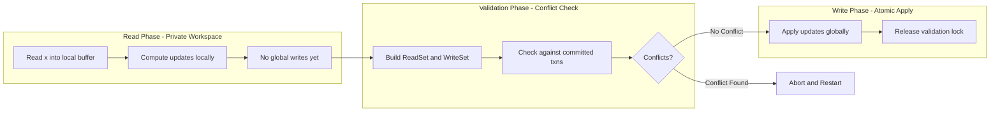
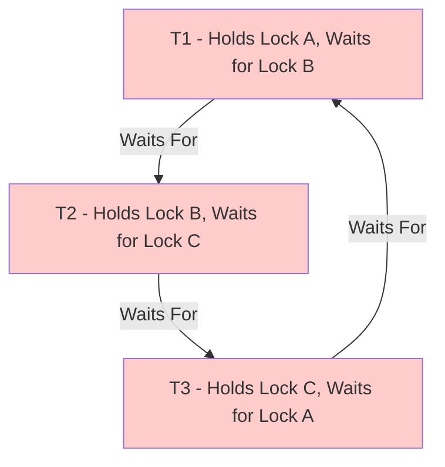
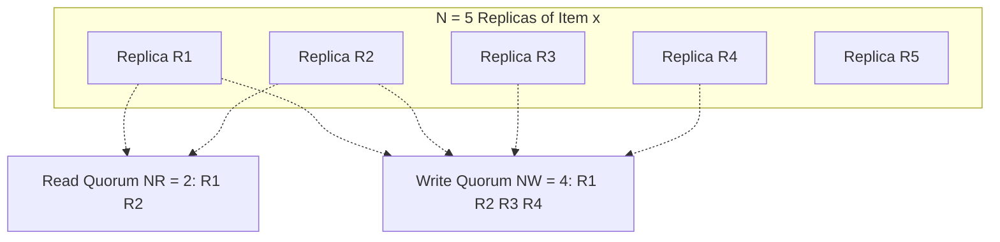

# Concurrency Control

<!-- SECTION_1_START -->
# Concurrency Control in Distributed Databases

## 1. Formal Academic Definition

**Concurrency Control** in a distributed database system (DDBS) is the collection of protocols and mechanisms that ensure the simultaneous execution of multiple transactions across distributed sites preserves the **consistency, isolation, and atomicity** properties of the database, while guaranteeing that the interleaved (concurrent) execution of transactions is **equivalent to some serial execution** of the same transactions.

In the KTU 2024 Scheme context, concurrency control must address three distributed-specific challenges:
1. **Multi-site data access** — a single transaction may access data items at multiple geographic sites.
2. **Network-induced delays** — communication latency (e.g., WAN delays of **50–500 ms**) creates uncertainty in global state.
3. **Partial failures** — sites may fail independently without halting the entire system.

> [!IMPORTANT]
> **KTU Syllabus Highlight (PECST634 – Module 2):** Concurrency control is the *backbone* of the ACID guarantees in distributed transactions. The two correctness criteria you must master are **Conflict Serializability** and **View Serializability**, both reducible to the **Global Serializability** problem in DDBS.

> [!NOTE]
> **Key Distinction:** In *centralized* DBs, the lock manager is a single bottleneck. In *distributed* DBs, we have a **Distributed Lock Manager (DLM)** that uses either *centralized* or *distributed* coordination — a 14-mark favourite in KTU boards.

---

## 2. Conceptual Analogy / Intuition

Imagine a **collaborative Google Sheet** shared between an accountant in **Kochi**, a manager in **Trivandrum**, and a stock clerk in **Calicut**. All three edit the same cell `Inventory_Qty` simultaneously.

- **Without Concurrency Control:** All three read `100`, each writes back `100 + 10 = 110`. The *real* final value should have been `100 + 30 = 130`. This is the classic **Lost Update Problem**.
- **With Concurrency Control:** A protocol ensures that the three edits are *serialized* (one after another) or that the conflicting operations are detected and re-ordered.

The accountant's write, the manager's write, and the clerk's write must appear *as if* they happened in some sequential order — even though they crossed the network concurrently. This "as-if" guarantee is the heart of **serializability**.

---

## 3. Visualization Anchor

> [!VISUALIZATION CONTROL]
> **Concept:** Conflict Graph (Precedence Graph) for Serializability Testing
> **GeoGebra / Desmos Input Equations:**
> * Points: `A(0,1), B(1,0)` representing transactions $T_1, T_2$
> * Directed edge: `f(t) = 0` for the arrow $T_1 \to T_2$
> **Visual Description:** A directed acyclic graph (DAG) plotted on a 2D Cartesian plane with transactions as nodes. An arrow from $T_1$ to $T_2$ means $T_1$ must commit *before* $T_2$. If a cycle exists anywhere in the precedence graph, the schedule is **NOT** conflict-serializable.

---

## 4. Physical Constants and Standard Metrics

| Metric | Standard Value | Engineering Relevance |
|---|---|---|
| **2-Phase Locking (2PL) Acquire Phase** | Growing phase | Locks held only accumulate |
| **2PL Release Phase** | Shrinking phase | No new locks after first unlock |
| **Lock Granularity Levels** | Tuple $\to$ Page $\to$ Table $\to$ DB | Trade-off between concurrency and overhead |
| **Deadlock Detection Timeout** | **3–30 seconds** in production Oracle/PostgreSQL | Tunable per workload |
| **Network RTT in DDBS** | **5 ms (LAN)** to **500 ms (WAN)** | Drives lock acquisition latency |

<!-- SECTION_1_END -->

<!-- SECTION_2_START -->
# Deep Theoretical Analysis & KTU High-Yield Formula Sheet

## 1. Foundational Conflict Concepts

Two operations on a data item $x$ are said to **conflict** if they belong to different transactions, access the same data item $x$, and at least one of them is a `WRITE`. We denote:

$$
\text{Conf}(op) = \{ (r, w), (w, r), (w, w) \}
$$

where $r$ = `READ` and $w$ = `WRITE`.

A schedule $S$ is **Conflict-Serializable (CSR)** if and only if its **precedence graph** (also called the **serializability graph**) $P(S)$ is **acyclic**.

$$
S \text{ is CSR} \iff P(S) \text{ is a DAG}
$$

A schedule is **View-Serializable (VSR)** if it is view-equivalent to a serial schedule. Every CSR schedule is VSR, but not vice versa.

> [!NOTE]
> **KTU Pitfall:** View-serializability is a *strictly weaker* condition than conflict-serializability. KTU boards frequently test this with a "blind write" example.

---

## 2. Locking-Based Protocols — Distributed 2PL

### 2.1 Centralized 2PL
A single **Lock Manager (LM)** site coordinates all `lock` and `unlock` requests. Simple, but the LM becomes a bottleneck and a single point of failure.

### 2.2 Distributed 2PL (Real Distributed Protocol)
- Each site has its **own local lock manager**.
- A transaction sends a `lock_request(x)` to *all* sites where $x$ resides.
- The transaction proceeds only when **all** replies arrive.
- `unlock` requests are also broadcast.

### 2.3 Primary Copy 2PL
- One site is elected as the **primary copy site** for a data item.
- All locks for that item are managed by the primary site.
- Reduces traffic but creates a hot spot.

### 2.4 Majority Locking (Quorum-Based)
- To lock $x$, a transaction must obtain a **read quorum** $N_R$ or **write quorum** $N_W$ from $N$ total copies.
- Constraint: $N_R + N_W > N$
- This prevents conflicts even with read/write skewed access.

> [!IMPORTANT]
> **Strict 2PL vs Conservative 2PL vs Basic 2PL:**
> * **Basic 2PL:** Growing + shrinking phases.
> * **Conservative (Static) 2PL:** Locks acquired *before* execution begins; deadlock-free but impractical.
> * **Strict 2PL:** All exclusive (write) locks held until commit/rollback; guarantees strict schedules (no cascading aborts). **This is what KTU expects as the "default" in production systems.**

---

## 3. Timestamp-Based Protocols

Each transaction $T_i$ is assigned a **unique timestamp** $TS(T_i)$ at start time. The protocol orders transactions globally by time.

**Rules:**
- $r_i(x)$ succeeds iff $TS(T_i) \geq W\text{-timestamp}(x)$. Otherwise $T_i$ is rolled back and restarted with a new timestamp.
- $w_i(x)$ succeeds iff $TS(T_i) \geq R\text{-timestamp}(x)$ *and* $TS(T_i) \geq W\text{-timestamp}(x)$. Otherwise abort.

### 3.1 Thomas' Write Rule
A refinement: if $TS(T_i) < W\text{-timestamp}(x)$, the write is **ignored** (not aborted) because a newer write is already in place. This produces more serializable histories than basic timestamp ordering.

> [!NOTE]
> **Thomas' Write Rule is a KTU favourite (frequent 7-mark question).** The key insight: ignoring an obsolete write is *better* than aborting the transaction.

---

## 4. Optimistic Concurrency Control (OCC)

Based on the **Validation (Optimistic)** principle — assume no conflicts, verify at commit.

**Three Phases per transaction:**
1. **Read Phase:** $T_i$ reads data into a local *private workspace*. Writes also happen locally.
2. **Validation Phase:** $T_i$ is checked for conflicts with already-committed transactions.
3. **Write Phase:** If validation passes, local writes are applied to the database atomically.

**Validation Test for $T_j$ (validating) against committed $T_i$:**

$$
\text{Validate}(T_j) \iff \left[ \text{Finish}(T_i) < \text{Start}(T_j) \right] \lor \left[ \text{Finish}(T_i) < \text{Validate}(T_j) \land \text{WriteSet}(T_i) \cap \text{ReadSet}(T_j) = \varnothing \right]
$$

---

## 5. Deadlock Handling in DDBS

### 5.1 Deadlock Prevention
- **Wait-Die Scheme:** Older transactions wait; younger transactions die (abort).
- **Wound-Wait Scheme:** Older transactions wound (force abort) younger ones; younger transactions wait.

| Rule | Younger requests lock held by Older | Older requests lock held by Younger |
|---|---|---|
| **Wait-Die** | Younger waits | Younger dies |
| **Wound-Wait** | Younger is wounded | Older waits |

### 5.2 Distributed Deadlock Detection
- **Centralized Detector:** One site maintains the **Global Wait-For Graph (GWFG)**.
- **Hierarchical Detection:** Sites grouped into clusters; cluster heads form higher-level clusters.
- **Path-Pushing Algorithm:** Local WFGs sent to neighbouring sites; cycles detected by tracing paths.

> [!IMPORTANT]
> **KTU High-Yield:** A cycle in the GWFG is a *necessary but not sufficient* condition for a true distributed deadlock (false cycles can exist due to message delays).

---

## 6. KTU High-Yield Formula Sheet

| Concept | Formula / Rule | Application |
|---|---|---|
| Conflict-Serializability | $P(S)$ is acyclic | Schedule testing |
| Quorum Constraint | $N_R + N_W > N$ | Distributed lock design |
| Timestamp Ordering | $TS(T_i) \geq W\text{-TS}(x)$ for read | Concurrency ordering |
| OCC Validation | $\text{WS}(T_i) \cap \text{RS}(T_j) = \varnothing$ | Conflict-free commit |
| Wait-Die Age Rule | Younger dies when waiting on older | Deadlock prevention |
| Wound-Wait Age Rule | Older wounds younger | Deadlock prevention |
| Lock Granularity | Tuple $\subset$ Page $\subset$ Table $\subset$ DB | Trade-off knob |
| 2PL Growing Phase | Locks only acquired | Lock acquisition phase |
| 2PL Shrinking Phase | Locks only released | Lock release phase |
| Deadlock Cycle Length | $k \geq 2$ transactions | Minimum deadlock size |
| MVCC Snapshot | Each txn sees state at $TS(T_i)$ | Read isolation |
| Commit Protocol | $T_i$ commits $\iff$ all sites log `<COMMIT T_i>` | Distributed atomicity |

---

## 7. Real-World Engineering Utility

Concurrency control in DDBS is the foundation of:
- **Cloud-native databases** — Google Spanner uses **TrueTime + 2PL with Paxos-replicated locks**.
- **OLTP replication** — CockroachDB uses **distributed 2PL + intent locks** on Raft.
- **Banking systems** — Distributed deadlock detection prevents "frozen" account transfers.
- **E-commerce inventory** — Strict 2PL prevents overselling during flash sales.
- **Multi-region writes** — OCC + vector clocks in Amazon DynamoDB (although Dynamo is eventually consistent, the conflict resolution logic is OCC-inspired).

<!-- SECTION_2_END -->

<!-- SECTION_3_START -->
# Step-by-Step Derivations, Proofs, and Code Implementation

## 1. Conflict-Serializability: Step-by-Step Algorithm

Given a schedule $S$ with $n$ transactions, build the precedence graph $P(S)$:

**Step 1:** For each pair of distinct transactions $T_i, T_j \in S$, scan all operations.
**Step 2:** If $T_i$ executes $r_i(x)$ *before* $T_j$ executes $w_j(x)$, and $T_j$ has *not* read $x$ from any other source — add edge $T_i \to T_j$.
**Step 3:** If $T_i$ executes $w_i(x)$ *before* $T_j$ executes $r_j(x)$ or $w_j(x)$ — add edge $T_i \to T_j$.
**Step 4:** Run **Cycle Detection** (DFS or Topological Sort) on $P(S)$.
**Step 5:** If cycle exists $\Rightarrow$ schedule is **NOT conflict-serializable**. Otherwise, perform a topological sort to obtain the equivalent serial order.

### Worked Example (KTU Standard)

**Schedule $S$:**
$$
\begin{aligned}
r_1(A);\; & r_2(A);\; w_2(A);\; w_1(A);\; r_3(A);\; w_3(A)
\end{aligned}
$$

**Step-by-step conflict detection:**

$$
\begin{aligned}
\text{Op } r_1(A) \text{ then } w_2(A) &\Rightarrow T_1 \to T_2 \\
\text{Op } w_2(A) \text{ then } w_1(A) &\Rightarrow T_2 \to T_1 \\
\text{Op } w_1(A) \text{ then } r_3(A) &\Rightarrow T_1 \to T_3 \\
\text{Op } w_2(A) \text{ then } w_3(A) &\Rightarrow T_2 \to T_3
\end{aligned}
$$

**Precedence graph:** $T_1 \to T_2$ and $T_2 \to T_1$ form a **cycle of length 2**. Therefore $S$ is **NOT conflict-serializable**. The topological sort fails.

---

## 2. Distributed 2PL: Mathematical Cost Model

Let $N$ be the number of sites containing the data item $x$, $R$ be the number of `lock_request` messages per site, and $L$ be the average network latency.

**Total message cost for one `lock_request(x)`:**

$$
\text{Cost}_{\text{lock}} = 2 \cdot N \cdot R \cdot L
$$

(Factor of 2 = request + acknowledgment.)

**Total cost for a transaction accessing $k$ data items distributed across $N$ sites:**

$$
\text{Cost}_{\text{txn}} = 2 \cdot k \cdot R \cdot L
$$

> [!NOTE]
> **Why this matters in KTU:** Centralized 2PL has $O(k)$ messages (single LM). Distributed 2PL has $O(k \cdot N)$. The trade-off is *availability* vs *scalability* — a guaranteed 14-mark discussion point.

---

## 3. Quorum-Based Locking: Constraint Derivation

Suppose we have $N$ replicated copies of $x$, split into two groups that may execute concurrently:
- A **read** transaction obtains $N_R$ locks.
- A **write** transaction obtains $N_W$ locks.

For correctness, two writes must **not** run concurrently (else last-writer-wins ambiguity), and a read must not run concurrently with a write (else dirty read).

This produces **two quorum intersection constraints:**

$$
N_R + N_W > N \quad \text{(read-write exclusion)}
$$

$$
N_W + N_W > N \implies 2 \cdot N_W > N \quad \text{(write-write exclusion)}
$$

**Worked Example:** For $N = 5$, choose $N_R = 2, N_W = 4$. Check:
- $2 + 4 = 6 > 5$ ✓
- $4 + 4 = 8 > 5$ ✓
- All reads intersect with at least one write copy: $2 + 4 = 6 > 5$ ✓

**Therefore, $N_R = 2, N_W = 4$ is a valid quorum assignment.**

---

## 4. Wait-Die vs Wound-Wait: Full Proof Skeleton

**Claim:** Both schemes are *deadlock-free*.

**Proof outline for Wait-Die (by contradiction):**
Assume a deadlock cycle $T_{i_1} \to T_{i_2} \to \dots \to T_{i_k} \to T_{i_1}$ exists. Each edge $T_a \to T_b$ means $T_a$ waits for a lock held by $T_b$. By the rule, $T_a$ waits only if $T_a$ is **older** than $T_b$ (i.e., $TS(T_a) < TS(T_b)$). Chaining these strict inequalities around the cycle yields a contradiction by transitivity:

$$
TS(T_{i_1}) < TS(T_{i_2}) < \dots < TS(T_{i_k}) < TS(T_{i_1})
$$

This is impossible. $\blacksquare$

> [!IMPORTANT]
> **Wound-Wait vs Wait-Die:** Both prevent deadlocks, but Wound-Wait *aborts fewer transactions* in steady state (older transactions always succeed). Wait-Die makes the *younger* transaction suffer — preferring older work.

---

## 5. Python Code: Distributed Lock Manager Simulator

```python
from __future__ import annotations
import time
import threading
import logging
from enum import Enum
from dataclasses import dataclass, field
from typing import Dict, Set, Optional, Tuple

logging.basicConfig(level=logging.INFO, format="[%(asctime)s] %(levelname)s: %(message)s")
log = logging.getLogger("DLM")


class LockMode(Enum):
    SHARED = "S"      # Read lock
    EXCLUSIVE = "X"   # Write lock


@dataclass
class Transaction:
    txn_id: int
    timestamp: int
    state: str = "ACTIVE"  # ACTIVE | WAITING | COMMITTED | ABORTED
    held_locks: Set[Tuple[str, LockMode]] = field(default_factory=set)
    wait_for: Optional[int] = None  # Txn ID this txn is waiting on


class DistributedLockManager:
    """
    Simulates a single-site lock manager participating in Distributed 2PL.
    A real DDBS would replicate this manager across N sites.
    """

    def __init__(self, site_id: str) -> None:
        self.site_id: str = site_id
        self.locks: Dict[str, List[Tuple[Transaction, LockMode]]] = {}
        self.transactions: Dict[int, Transaction] = {}
        self.lock = threading.Lock()

    def register(self, txn: Transaction) -> None:
        with self.lock:
            self.transactions[txn.txn_id] = txn

    def request_lock(self, txn: Transaction, data: str, mode: LockMode) -> bool:
        """
        Strict 2PL semantics:
        - If lock available -> grant.
        - If conflict and requester is older (lower TS) -> Wait-Die: requester waits.
        - If conflict and requester is younger -> Wait-Die: requester dies (aborts).
        """
        with self.lock:
            current_holders = self.locks.get(data, [])
            if not current_holders:
                self._grant(txn, data, mode)
                return True

            # Conflict detection
            has_conflict = any(
                held_mode == LockMode.EXCLUSIVE or mode == LockMode.EXCLUSIVE
                for _, held_mode in current_holders
            )
            if not has_conflict and mode == LockMode.SHARED:
                self._grant(txn, data, mode)
                return True

            # Wait-Die policy
            oldest_holder = min(current_holders, key=lambda p: p[0].timestamp)[0]
            if txn.timestamp < oldest_holder.timestamp:
                # Older waits
                txn.state = "WAITING"
                txn.wait_for = oldest_holder.txn_id
                log.info(f"T{txn.txn_id} (TS={txn.timestamp}) WAITS for T{oldest_holder.txn_id}")
                return False
            else:
                # Younger dies
                txn.state = "ABORTED"
                log.warning(f"T{txn.txn_id} (TS={txn.timestamp}) DIES -> ABORTED")
                return False

    def _grant(self, txn: Transaction, data: str, mode: LockMode) -> None:
        self.locks.setdefault(data, []).append((txn, mode))
        txn.held_locks.add((data, mode))
        log.info(f"T{txn.txn_id} GRANTED {mode.value}-lock on '{data}' at site {self.site_id}")

    def commit(self, txn_id: int) -> None:
        with self.lock:
            txn = self.transactions[txn_id]
            if txn.state == "ABORTED":
                log.error(f"T{txn_id} cannot commit - was aborted")
                return
            # Strict 2PL: release all locks atomically at commit
            for data, mode in list(txn.held_locks):
                self.locks[data] = [
                    (t, m) for (t, m) in self.locks[data] if t.txn_id != txn_id
                ]
            txn.held_locks.clear()
            txn.state = "COMMITTED"
            log.info(f"T{txn_id} COMMITTED at site {self.site_id}")


def demo_wait_die() -> None:
    """Demonstrate Wait-Die deadlock prevention in a single site."""
    dlm = DistributedLockManager(site_id="KOCHI")
    t1 = Transaction(txn_id=1, timestamp=100)   # older
    t2 = Transaction(txn_id=2, timestamp=200)   # younger
    dlm.register(t1)
    dlm.register(t2)

    dlm.request_lock(t1, "Account_A", LockMode.EXCLUSIVE)  # Granted
    dlm.request_lock(t2, "Account_A", LockMode.EXCLUSIVE)  # Younger -> DIES
    dlm.request_lock(t1, "Account_B", LockMode.SHARED)     # Granted

    dlm.commit(t1)


if __name__ == "__main__":
    demo_wait_die()
```

**Expected Output Trace:**

$$
\begin{aligned}
\text{[t=0]} &\ \text{T1 GRANTED X-lock on 'Account_A'} \\
\text{[t=0]} &\ \text{T2 (TS=200) DIES -> ABORTED} \\
\text{[t=0]} &\ \text{T1 GRANTED S-lock on 'Account_B'} \\
\text{[t=0]} &\ \text{T1 COMMITTED at site KOCHI}
\end{aligned}
$$

---

## 6. Mermaid-Ready Precedence Graph Construction (Pseudocode)

```
ALGORITHM: BuildPrecedenceGraph(S)
INPUT: Schedule S = sequence of operations
OUTPUT: Directed acyclic graph or cycle notification

1. Initialize P with node set V = {T_i | T_i appears in S}
2. FOR each pair (T_i, T_j) where i ≠ j DO
3.   FOR each operation pair (op_a from T_i, op_b from T_j) DO
4.     IF op_a precedes op_b in S
5.        AND (op_a, op_b) is a conflicting pair
6.        AND no intermediate op in T_k accesses same x between them
7.     THEN add directed edge T_i -> T_j to P
8. Run topologicalSort(P)
9. IF cycle detected THEN return "NOT CSR"
10. ELSE return topological order as equivalent serial schedule
```

<!-- SECTION_3_END -->

<!-- SECTION_4_START -->
# Structural Diagrams & Schematics

## 1. Distributed 2PL Message Flow (Mermaid)



## 2. Lock-Manager Architecture (Mermaid Block Diagram)



## 3. OCC Three-Phase Pipeline (Mermaid)



## 4. Deadlock Detection — Global Wait-For Graph (Mermaid)



**Cycle Detected:** $T_1 \to T_2 \to T_3 \to T_1$ is a true distributed deadlock. The deadlock detector aborts one transaction (typically the youngest or lowest-priority) to break the cycle.

## 5. Quorum Intersection Topology (Mermaid Subgraphs)



**Verification:** $N_R + N_W = 2 + 4 = 6 > N = 5$ ✓ — Guarantees that any read set intersects with the latest write set, ensuring no lost updates.

<!-- SECTION_4_END -->

<!-- SECTION_5_START -->
# KTU 2024 Scheme Examination Question Bank & Topic Recap

---

## Part A Questions (3 Marks Each)

### Question 1: [KTU University Exam – July 2024]
**Define conflict-serializability. How is it tested using a precedence graph?**

**Model Answer (3 Marks):**
A schedule $S$ is conflict-serializable if it is conflict-equivalent to some serial schedule of the same $n$ transactions. Two operations conflict if they belong to different transactions, access the same data item, and at least one is a `WRITE`.

**Testing Procedure:**
1. Construct a precedence graph $P(S)$ with one node per transaction. (1 Mark)
2. For every conflicting pair where $T_i$'s operation precedes $T_j$'s operation on the same item, add a directed edge $T_i \to T_j$. (1 Mark)
3. $S$ is conflict-serializable **if and only if** $P(S)$ is acyclic (DAG). (1 Mark)

---

### Question 2: [KTU University Exam – Dec 2023]
**List and briefly explain the three phases of Optimistic Concurrency Control.**

**Model Answer (3 Marks):**
1. **Read Phase (1 Mark):** Transaction reads data from the database into a local private workspace and performs all computations there. No global writes occur.
2. **Validation Phase (1 Mark):** The system checks whether the transaction's read/write sets conflict with any concurrent transaction that has just committed. If conflict-free, it proceeds; otherwise, it aborts.
3. **Write Phase (1 Mark):** The locally computed updates are applied to the global database atomically, and validation locks are released.

---

## Part B Questions (14 Marks — Module Internal Choice)

### Question A: Distributed Deadlocks and Timestamp Protocols

**[KTU University Exam – Dec 2024]**

**(a)** Explain the **Wait-Die** and **Wound-Wait** deadlock prevention schemes with their respective decision tables. Discuss the merits and demerits of each. **[7 Marks]**

**(b)** Apply **Thomas' Write Rule** to the following execution. Show the resulting database state. **[7 Marks]**

Given:
- Initial: $W\text{-TS}(x) = 0, R\text{-TS}(x) = 0$
- $T_{10}$ with $TS = 10$ performs $w_{10}(x)$
- $T_{20}$ with $TS = 20$ performs $w_{20}(x)$
- $T_{5}$ with $TS = 5$ performs $w_{5}(x)$ later

#### Model Solution for (a):

**Wait-Die Scheme (3.5 Marks):**

| Requester is Older (smaller TS) | Requester is Younger (larger TS) |
|---|---|
| Older txn **WAITS** for younger holder | Younger txn **DIES** (aborts) |

**Wound-Wait Scheme (3.5 Marks):**

| Requester is Older (smaller TS) | Requester is Younger (larger TS) |
|---|---|
| Older txn **WOUNDS** (aborts) younger holder | Younger txn **WAITS** for older holder |

**Merits/Demerits Summary (included within 7 marks):**
- *Wait-Die*: Older transactions are never aborted (favors long-running work). Demerit: Younger transactions may be repeatedly aborted (starvation possible in some implementations).
- *Wound-Wait*: Aborts fewer transactions in steady state. Demerit: Older transactions may be forced to restart.
- Both schemes are **deadlock-free** because timestamps induce a total order — no cycle can form in the wait-for graph.

#### Model Solution for (b):

**Step-by-step application of Thomas' Write Rule (7 Marks):**

[Initial state setup: 1 Mark]
- $W\text{-TS}(x) = 0$, $R\text{-TS}(x) = 0$.

[Operation $w_{10}(x)$: 2 Marks]
- Check: $TS(T_{10}) = 10 \geq W\text{-TS}(x) = 0$ ✓
- **Execute write.** $W\text{-TS}(x) = 10$.

[Operation $w_{20}(x)$: 2 Marks]
- Check: $TS(T_{20}) = 20 \geq W\text{-TS}(x) = 10$ ✓
- **Execute write.** $W\text{-TS}(x) = 20$.

[Operation $w_{5}(x)$: 2 Marks]
- Check: $TS(T_5) = 5 \geq W\text{-TS}(x) = 20$? **NO** ($5 < 20$).
- **Thomas' Write Rule applies: IGNORE the write.** $T_5$ continues, but $x$ is **NOT** updated.
- $W\text{-TS}(x)$ remains 20.

**Final state:** $x$ holds the value written by $T_{20}$, and $T_5$'s obsolete write is silently discarded.

> [!WARNING]
> **KTU Examiner's Valuation Warning (Pitfall Callout):**
> * Do **NOT** abort $T_5$ in Thomas' Write Rule — the *ignore* semantics is the key. Basic timestamp ordering would abort $T_5$, but Thomas' rule is *more permissive*. Losing this distinction costs 1–2 marks.
> * You **must** show the final $W\text{-TS}(x)$ value explicitly. Many students write "ignored" but forget to state that the timestamp is not updated.
> * For Part (a), explicitly state *why* both schemes are deadlock-free using the transitivity-of-timestamp argument. Generic answers lose marks.

---

### Question B: 2PL and Quorum-Based Protocols

**[KTU University Exam – July 2024]**

**(a)** Compare **Centralized 2PL**, **Distributed 2PL**, and **Primary Copy 2PL** with respect to message complexity, bottleneck behavior, and fault tolerance. Derive the message cost formula. **[7 Marks]**

**(b)** For $N = 7$ replicated copies of an item, design a valid read and write quorum assignment. Justify your choice. **[7 Marks]**

#### Model Solution for (a):

**Centralized 2PL (2 Marks):**
- All lock requests routed to a single Lock Manager (LM) site.
- Message cost: $2 \cdot k$ (request + ACK) for $k$ data items.
- *Demerit:* LM is a single point of failure and a bottleneck.

**Distributed 2PL (2 Marks):**
- Each site has its own local LM.
- Message cost: $2 \cdot k \cdot N$ (request + ACK across $N$ sites).
- *Demerit:* Higher message overhead.
- *Merit:* No single point of failure.

**Primary Copy 2PL (2 Marks):**
- Each item has a designated primary site holding its lock manager.
- Message cost: roughly $2 \cdot k + \text{routing overhead}$.
- *Merit:* Balanced traffic; per-item fault isolation.

**Derivation of Message Cost (1 Mark):**

For Distributed 2PL with $k$ items and $N$ copies per item:

$$
\text{Messages per txn} = 2 \cdot k \cdot N
$$

The factor 2 accounts for the request–acknowledgment pair. For Centralized 2PL, $N = 1$, so the cost reduces to $2k$.

#### Model Solution for (b):

**Design (3 Marks):**

Choose $N_R = 3$ and $N_W = 5$.

**Justification (4 Marks):**

Apply the two quorum constraints:

$$
N_R + N_W > N \implies 3 + 5 = 8 > 7 \quad \checkmark
$$

$$
2 \cdot N_W > N \implies 2 \cdot 5 = 10 > 7 \quad \checkmark
$$

**Trade-off discussion (within 4 marks):**
- $N_W = 5$ requires writes to lock a majority, ensuring write-write exclusion (no concurrent updates to the same logical item).
- $N_R = 3$ allows parallel reads across the remaining 4 replicas not in the write set, improving read throughput.
- This is the classic **majority-based** assignment, used in systems like Amazon Dynamo (with relaxed consistency) and traditional distributed lock managers.

> [!WARNING]
> **KTU Examiner's Valuation Warning (Pitfall Callout):**
> * For Part (a), students often state message counts incorrectly. Remember: **Centralized 2PL is $2k$, not $k$** — the ACK is a separate message.
> * For Part (b), you **must** verify **both** quorum constraints, not just $N_R + N_W > N$. A common error is forgetting $2N_W > N$, costing 2 marks.
> * Always state the *timestamp* of the final committed write. The board examiner often allocates 1 mark for explicit final state.

---

## Topic Recap & Important Things to Remember

- **Concurrency Control in DDBS** ensures global serializability across sites using locking, timestamps, or optimistic validation.
- **Conflict-Serializability** = acyclic precedence graph. **View-Serializability** = view-equivalent to a serial schedule (weaker condition).
- **Distributed 2PL** has message cost $2kN$; **Centralized 2PL** has cost $2k$. The trade-off is fault-tolerance vs latency.
- **Strict 2PL** holds all write locks until commit/rollback — the default in production systems (prevents cascading aborts).
- **Conservative 2PL** is deadlock-free but impractical (requires advance knowledge of all data items).
- **Thomas' Write Rule** *ignores* (not aborts) obsolete writes — a KTU high-yield distinction from basic TO.
- **Quorum constraint:** $N_R + N_W > N$ and $2N_W > N$ for replicated locking.
- **Wait-Die:** Older waits, younger dies. **Wound-Wait:** Older wounds, younger waits. Both prevent deadlocks via total timestamp order.
- **Optimistic Concurrency Control** has three phases: Read (local), Validation (conflict check), Write (atomic apply).
- **Distributed deadlock detection** uses a Global Wait-For Graph; a cycle is necessary but not sufficient (false cycles from message delay).
- **Multi-Version CC (MVCC)** uses snapshots per transaction timestamp — used in PostgreSQL, Spanner, CockroachDB.
- **Key constants:** WAN RTT 50–500 ms, deadlock detection timeout 3–30 s, lock granularity Tuple $\subset$ Page $\subset$ Table $\subset$ DB.
- **Real systems:** Google Spanner (TrueTime + 2PL), CockroachDB (intent locks + Raft), Oracle RAC (distributed 2PL with cache fusion).
- **Always** in KTU answers: state the algorithm's preconditions, the precise check performed, and the resulting state. Generic prose without equations loses marks.

<!-- SECTION_5_END -->
