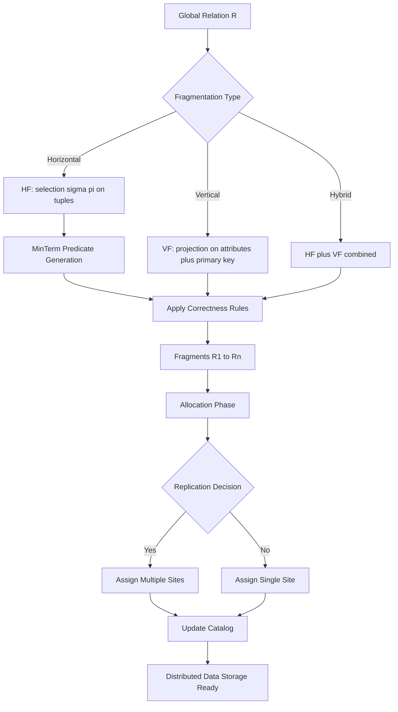
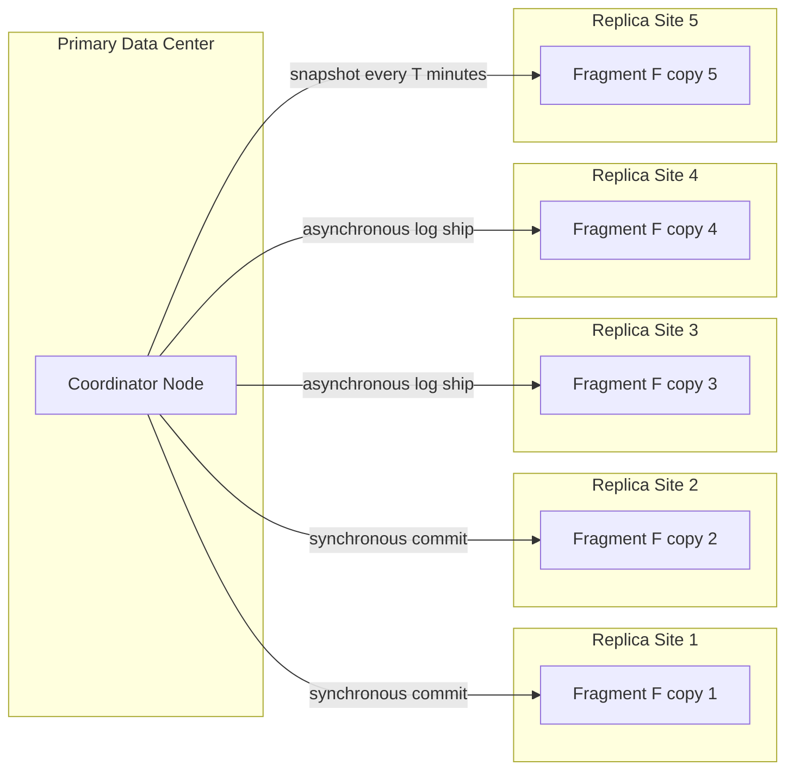
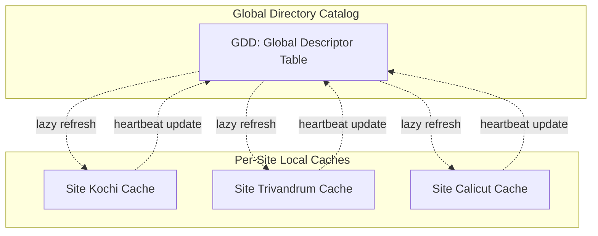
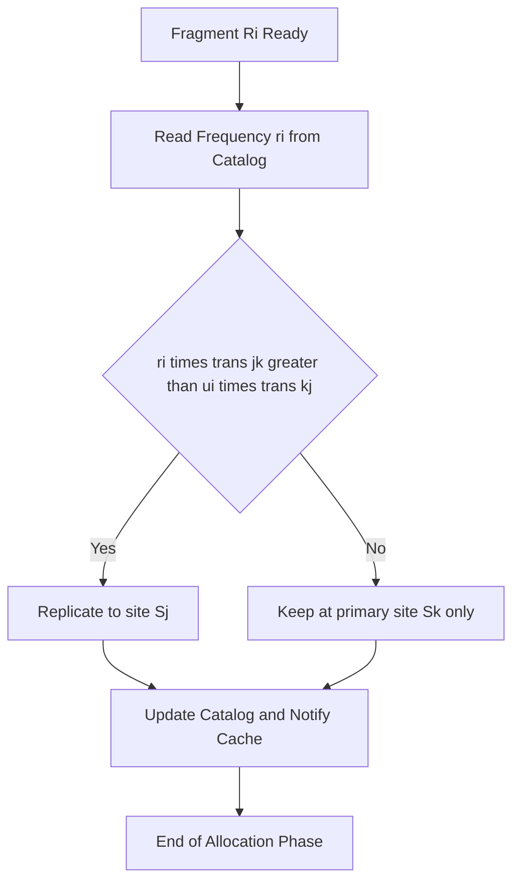
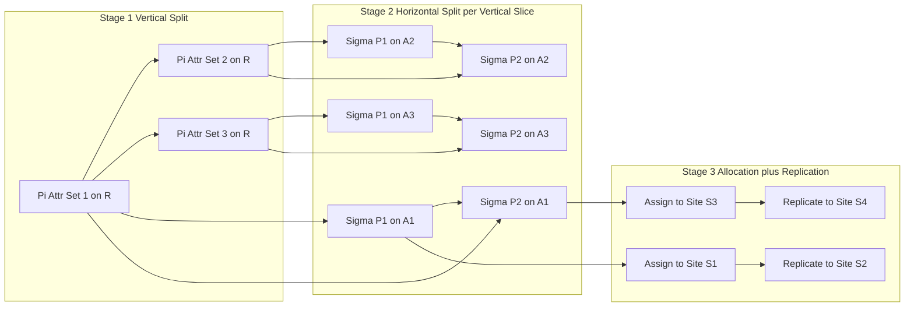

# Distributed Data Storage

<!-- SECTION_1_START -->
# Distributed Data Storage — Module 2 Foundations

## 1.1 Formal Academic Definition

**Distributed Data Storage** is the subsystem of a Distributed Database Management System (DDBMS) that decides **where, how, and in what form** the logical relations of a global schema are physically persisted across the sites of a computer network. According to the **KTU 2024 Scheme (PECST634)** treatment of distributed databases, this subsystem is built upon four orthogonal design primitives:

1. **Fragmentation** — breaking a relation $R$ into logical pieces $\left\{R_1, R_2, \dots, R_n\right\}$.
2. **Replication** — maintaining multiple physical copies of a fragment.
3. **Allocation** — assigning each replica to a specific site $S_k$ in the network $N = \left\{S_1, S_2, \dots, S_M\right\}$.
4. **Directory / Catalog Management** — storing the metadata that maps every logical name to its physical location(s).

> [!IMPORTANT]
> **KTU 2024 Syllabus Anchor:** This topic is part of **Module 2 – Distributed Databases**, mapping directly to **CO2**: *Design fragmentation, replication, and allocation strategies for distributed relations with emphasis on transparency and correctness.*

## 1.2 Intuitive Analogy — The "National Library Chain"

Imagine a single library catalogue `LIBRARY` containing every book in India. Storing the entire catalogue in one building is impractical. Instead, the librarian decides:

- **Fragmentation (Horizontal)** → Each state branch keeps only the books published in that state. The catalogue is split by *region*.
- **Fragmentation (Vertical)** → The central reference desk keeps the index, while individual branches store the actual book *items*. The catalogue is split by *attribute*.
- **Replication** → A best-seller is duplicated in every branch so a borrower never has to wait for a courier.
- **Allocation** → A regional encyclopedia stays only in the region it serves; a national policy document is replicated in every state.

The borrower simply searches "mangoes of Kerala" — they don't know, nor care, *which physical branch* fulfills the request. That separation between **logical view** and **physical storage** is the heart of distributed data storage.

## 1.3 Design Objectives

| # | Objective | Engineering Meaning |
|---|-----------|---------------------|
| 1 | **Locality of Reference** | Application finds $80\%$ of its required tuples at its own site. |
| 2 | **Reliability & Availability** | Failures of a single site must not paralyse the global database. |
| 3 | **Balanced Workload** | CPU, disk, and network load spread evenly across sites. |
| 4 | **Minimal Storage Cost** | Total bytes stored across all replicas is finite and bounded. |
| 5 | **Distribution Transparency** | User queries are written against the *global* schema. |

> [!NOTE]
> **Three Levels of Transparency (per ISO/OSI-DBMS Reference Model):**
> 1. **Fragmentation Transparency** — user never mentions fragments.
> 2. **Location Transparency** — user never names the site.
> 3. **Replication Transparency** — user never names the copy.
>
> Distributed Data Storage design must guarantee **at minimum** fragmentation + location transparency to be classified as a true DDBMS in KTU valuation.

## 1.4 Visual Concept: Distribution Topology

> [!VISUALIZATION CONTROL]
> **Concept:** *Replication vs. Non-Replication allocation across four sites.*
>
> **Conceptual Schematic (drawn free-hand on graph paper):**
> * Nodes: $S_1$ (Kochi), $S_2$ (Trivandrum), $S_3$ (Calicut), $S_4$ (Cochin-DC)
> * Edges: LAN/WAN links of equal cost $= 1$
> * Two fragments $F_1, F_2$ shown.
>
> **Visual Description:** When $F_1$ appears at three sites and $F_2$ at two sites, the student should observe that the *physical storage graph* is denser than the *logical relation graph*, and the difference *is* the replication factor.

## 1.5 Sub-Topic Map (what we will cover)

$$
\boxed{
\text{Distributed Data Storage}
=
\underbrace{\text{Fragmentation}}_{\text{H, V, Hybrid}}
\cup
\underbrace{\text{Replication}}_{\text{Synchronous, Asynchronous}}
\cup
\underbrace{\text{Allocation}}_{\text{Non-rep, Full-rep, Partial-rep}}
\cup
\underbrace{\text{Directory Catalog}}_{\text{Local, Global, Hybrid}}
}
$$

<!-- SECTION_1_END -->

<!-- SECTION_2_START -->
# Deep Theoretical Analysis & KTU High-Yield Formula Sheet

## 2.1 The Fragmentation Relation

Formally, a relation $R$ over schema $R(A_1, A_2, \dots, A_n)$ is fragmented into $n$ fragments $R_1, R_2, \dots, R_n$ such that the fragment set is a **partition** (or **cover**) of $R$. We define the fragmentation mapping $\sigma : R \rightarrow \left\{R_1, \dots, R_n\right\}$.

### 2.1.1 Three Correctness Rules (Özsu & Valduriez)

For *every* valid fragmentation, the following three properties must hold:

> [!IMPORTANT]
> **Rule 1 — Completeness:**
> $\displaystyle R = \bigcup_{i=1}^{n} R_i$ — every tuple of $R$ appears in at least one fragment.

> [!IMPORTANT]
> **Rule 2 — Reconstruction:**
> There exists a relational operator $\otimes$ (often $\bowtie$ or $\cup$) such that $R = \bigotimes_{i=1}^{n} R_i$ — the original relation can always be reassembled losslessly.

> [!IMPORTANT]
> **Rule 3 — Disjointness:**
> For a **horizontal** fragmentation, $R_i \cap R_j = \emptyset \;\; \forall \, i \neq j$. (Vertical fragmentation **permits** a shared primary-key attribute, so disjointness applies only to non-key attributes.)

## 2.2 Horizontal Fragmentation (HF)

### 2.2.1 Definition
A horizontal fragment $R_i$ is defined by a *selection* on a global relation $R$:

$$
R_i = \sigma_{p_i}(R)
$$

where $p_i$ is a *minterm predicate* constructed from simple predicates in the query set $Q$.

### 2.2.2 Simple Predicates & Minterm Generation
Given simple predicates $p_1, p_2, \dots, p_m$ derived from query qualifications, a **minterm predicate** is:

$$
m_j = \bigwedge_{i=1}^{m} p_i^{*} \quad \text{where } p_i^{*} \in \left\{p_i, \neg p_i\right\}
$$

This generates up to $2^{m}$ minterms. The **minimal / complete set** of minterms needed is determined by eliminating contradictions and redundancies (Katz & Wong / Özsu algorithm).

### 2.2.3 Predicate Selectivity (for the formula sheet)

$$
\text{sel}(p_i) = \frac{\mid \sigma_{p_i}(R) \mid}{\mid R \mid} = \frac{\text{card}(\sigma_{p_i}(R))}{\text{card}(R)}
$$

$$
\text{access\_freq}(p_i, S_k) = \text{number of accesses to } p_i \text{ from site } S_k \text{ per unit time}
$$

### 2.2.4 Cost Model for HF (Reference Inequation)

$$
\min \sum_{k=1}^{M} \sum_{i=1}^{n} \text{access\_freq}_k(p_i) \cdot \text{cost}(\sigma_{p_i}, S_k)
$$

subject to: storage capacity, response time SLA, completeness, disjointness.

### 2.2.5 Derived Horizontal Fragmentation
If $R$ is fragmented by FK referencing fragmented $S$:

$$
R_i = R \ltimes S_i
$$

This is a *semi-join*-driven fragmentation.

## 2.3 Vertical Fragmentation (VF)

### 2.3.1 Definition
A vertical fragment $R_i$ is defined by a *projection* on $R$:

$$
R_i = \pi_{A_{i1}, A_{i2}, \dots, A_{ik}}(R)
$$

The primary key $K$ **must** be included in **every** vertical fragment to permit lossless reconstruction via natural join.

### 2.3.2 Reconstruction

$$
R = \pi_{A_1, A_2, \dots, A_n}\!\left( R_1 \bowtie R_2 \bowtie \dots \bowtie R_n \right)
$$

or equivalently using tuple-identifier (TID) duplication:

$$
R = \pi_{*}\!\left( R_1 \bowtie_{TID} R_2 \bowtie_{TID} \dots \bowtie_{TID} R_n \right)
$$

### 2.3.3 Bond Energy Algorithm (BEA) — Affinity Measure

The **attribute affinity** between two attributes $A_i$ and $A_j$:

$$
\text{aff}(A_i, A_j) = \sum_{k=1}^{Q} \sum_{\text{all site pairs }(S_p, S_q)} \text{ref}_k(A_i, S_p) \cdot \text{ref}_k(A_j, S_q) \cdot \text{cost}_{pq}
$$

where $\text{ref}_k(A, S)$ is the number of times query $q_k$ accesses attribute $A$ from site $S$.

## 2.4 Hybrid (Mixed) Fragmentation

$$
R_i = \sigma_{p_i}\!\left( \pi_{A_{i1}, \dots, A_{ik}}(R) \right) = \pi_{A_{i1}, \dots, A_{ik}}\!\left( \sigma_{p_i}(R) \right)
$$

Apply VF first, then HF on each vertical slice (or vice-versa); KTU accepts both orders because the relational operators commute under the stated conditions.

## 2.5 Replication

### 2.5.1 Replica Control Strategies

| Strategy | Description | Pros | Cons |
|----------|-------------|------|------|
| **Synchronous (Eager)** | Update propagates *before* transaction commits | Strong consistency | High latency, deadlock risk |
| **Asynchronous (Lazy)** | Update propagates *after* commit | Low latency, no global lock | Stale reads (eventual consistency) |
| **Snapshot** | Periodic full or delta copy | Cheap, simple | Coarse freshness |
| **Quorum-based** | $W + R > N$ where $W$ = write quorum, $R$ = read quorum, $N$ = total replicas | Tunable consistency & availability | Complex client logic |

### 2.5.2 Quorum Equation (Kessel & Davčik)

$$
W + R > N \quad \text{(strong consistency)}
$$

$$
W + R \leq N \quad \text{(eventual consistency, lower latency)}
$$

## 2.6 Allocation Strategies

$$
\text{Allocation}(R_i) \in \left\{
\begin{array}{l}
\text{Non-replicated} : \exists \, k : R_i \rightarrow S_k \\
\text{Fully replicated} : R_i \rightarrow S_k \;\; \forall \, k \in \left\{1, \dots, M\right\} \\
\text{Partially replicated} : R_i \rightarrow S_{k_1}, S_{k_2}, \dots, S_{k_p}, \; 1 < p < M
\end{array}
\right.
$$

### 2.6.1 Cost Function for Non-Replicated Allocation

$$
\text{Total Cost} = \sum_{i=1}^{n} \sum_{k=1}^{M} \text{alloc}(R_i, S_k) \cdot \left( \text{ProcessingCost} + \text{StorageCost} + \text{TransmissionCost} \right)
$$

### 2.6.2 Read/Write Decision Threshold

Allocate $R_i$ to site $S_k$ *and replicate* to $S_j$ if:

$$
r_i \cdot \text{trans}_{jk} < u_i \cdot \text{trans}_{kj} + s_i \cdot \text{storage}_j
$$

where $r_i$ = read frequency, $u_i$ = update frequency, $s_i$ = fragment size, $\text{trans}_{xy}$ = transmission cost between sites.

## 2.7 The Information Requirement Matrix (Catalog)

| Catalog Field | What it Stores |
|---------------|----------------|
| **Fragmentation** | Predicate $p_i$ / Attribute set $A_{i*}$ defining each fragment |
| **Allocation** | Site $S_k$ that owns each replica |
| **Replication** | Cardinality of replica set for each fragment |
| **Statistics** | $\text{sel}(p_i)$, $\text{card}(R_i)$, $r_i$, $u_i$ |
| **Network** | $\text{trans}_{pq}$ cost matrix |

> [!NOTE]
> **KTU Valuation Tip:** Always label the catalog as **global, local, or hybrid**. Hybrid catalogs (e.g., GDD-based with local caches) score the highest because they balance single-point-of-failure risk against query-planning latency.

## 2.8 KTU Formula Sheet (Cheat-Sheet)

| # | Symbol / Formula | Meaning |
|---|------------------|---------|
| 1 | $R = \bigcup_{i=1}^{n} R_i$ | Horizontal completeness |
| 2 | $R_i \cap R_j = \emptyset$ | Horizontal disjointness ($i \neq j$) |
| 3 | $R = R_1 \bowtie R_2 \bowtie \dots \bowtie R_n$ | Vertical reconstruction (lossless) |
| 4 | $\text{sel}(p_i) = \dfrac{\mid \sigma_{p_i}(R) \mid}{\mid R \mid}$ | Predicate selectivity |
| 5 | $\text{card}(R \bowtie S) = \dfrac{\mid R \mid \cdot \mid S \mid}{\max(\prod \mid V(R,A) \mid, \prod \mid V(S,A) \mid)}$ | Join cardinality (over common attr) |
| 6 | $W + R > N$ | Quorum strong consistency |
| 7 | $\text{aff}(A_i, A_j) = \sum \text{ref} \cdot \text{ref} \cdot \text{cost}$ | Attribute affinity (BEA) |
| 8 | $\text{affinity matrix } AM[A_i, A_j] = \sum_q \text{ref}_q(A_i) \cdot \text{ref}_q(A_j)$ | Simplified affinity for VF |
| 9 | $r_i \cdot \text{trans}_{jk} < u_i \cdot \text{trans}_{kj} + s_i \cdot \text{storage}_j$ | Replication decision rule |
| 10 | $M_{\text{minterms}} \leq 2^{m}$ | Upper bound on minterms |

## 2.9 Real-World Engineering Utility

| Domain | Use-Case |
|--------|----------|
| **E-Commerce (Amazon)** | Product catalogue is vertically fragmented (specs vs. reviews) and horizontally partitioned by region; full replication of top-100 items across edge sites. |
| **Banking (SWIFT)** | Customer accounts are horizontally fragmented by branch; full replication for the central ledger uses synchronous quorum. |
| **Social Networks (Meta TAO)** | User-graph fragments use derived HF on edge lists; partial replication of hot profiles. |
| **IoT & Telemetry (Siemens MindSphere)** | Time-series uses hybrid fragmentation: HF by sensor cluster, VF into raw / aggregated streams. |
| **Search Engines (Elasticsearch)** | Shards = horizontal fragments, replicas = replication, index allocation = site placement. |

<!-- SECTION_2_END -->

<!-- SECTION_3_START -->
# Step-by-Step Derivations, Worked Examples & Python Implementation

## 3.1 Worked Example 1 — Horizontal Fragmentation by Predicate Minterms

**Given Relation & Query Set:**

$$
R(\underline{\text{EmpID}},\; \text{Ename},\; \text{Dept},\; \text{Salary},\; \text{Location})
$$

| Simple Predicate | Meaning |
|------------------|---------|
| $p_1$ | $\text{Dept} = \text{'CSE'}$ |
| $p_2$ | $\text{Dept} = \text{'ECE'}$ |
| $p_3$ | $\text{Salary} > 50{,}000$ |
| $p_4$ | $\text{Location} = \text{'Kerala'}$ |

**Step 1 — Enumerate minterms (theoretical max $2^{4} = 16$):**

We construct minterms that are *non-contradictory*. Minterms with $p_1 \wedge p_2$ are contradictory (no employee is in both CSE and ECE simultaneously). Eliminating contradictions leaves the relevant set:

$$
m_1 : p_1 \wedge p_3 \wedge p_4 \quad \text{(CSE, High Salary, Kerala)}
$$
$$
m_2 : p_1 \wedge \neg p_3 \wedge p_4 \quad \text{(CSE, Low Salary, Kerala)}
$$
$$
m_3 : p_2 \wedge p_3 \wedge p_4 \quad \text{(ECE, High Salary, Kerala)}
$$
$$
m_4 : p_2 \wedge \neg p_3 \wedge p_4 \quad \text{(ECE, Low Salary, Kerala)}
$$
$$
m_5 : \neg p_1 \wedge \neg p_2 \wedge p_3 \wedge p_4 \quad \text{(Other, High Salary, Kerala)}
$$
$$
m_6 : \neg p_1 \wedge \neg p_2 \wedge \neg p_3 \wedge p_4 \quad \text{(Other, Low Salary, Kerala)}
$$
$$
m_7 : \neg p_1 \wedge \neg p_2 \wedge \neg p_3 \wedge \neg p_4 \quad \text{(Other, Low Salary, Outside Kerala)}
$$

(Minterms where Kerala is false but the employee is still CSE/ECE are also valid; shown as $m_8$–$m_{10}$ in a full enumeration.)

**Step 2 — Define fragments:**

$$
R_1 = \sigma_{m_1}(R), \quad R_2 = \sigma_{m_2}(R), \quad \dots, \quad R_7 = \sigma_{m_7}(R)
$$

**Step 3 — Verify completeness & disjointness:**

$$
R = R_1 \cup R_2 \cup R_3 \cup R_4 \cup R_5 \cup R_6 \cup R_7
$$
$$
R_i \cap R_j = \emptyset \;\;\forall i \neq j
$$

Both **Rule 1** and **Rule 3** are satisfied. ✅

**Step 4 — Reconstruction check (lossless):**

A SQL `UNION ALL` over all seven fragments returns exactly $R$ with no duplicate and no loss — this is the relational operator $\otimes = \cup$ in the formula $R = \bigotimes_i R_i$. ✅

## 3.2 Worked Example 2 — Vertical Fragmentation with TID

$$
R(\underline{\text{EmpID}},\; \text{Ename},\; \text{Dept},\; \text{Salary},\; \text{TID})
$$

$$
R_1 = \pi_{\text{EmpID},\; \text{Ename},\; \text{TID}}(R) \quad \text{(name fragment)}
$$
$$
R_2 = \pi_{\text{EmpID},\; \text{Dept},\; \text{Salary},\; \text{TID}}(R) \quad \text{(payroll fragment)}
$$

**Reconstruction:**

$$
R = R_1 \bowtie_{\text{TID}} R_2
$$

The shared attribute is **TID** (acts as a virtual primary key). TID is preferred over the natural key $\text{EmpID}$ when updates to non-key attributes must be handled independently at each site.

## 3.3 Derived Horizontal Fragmentation — Complete Derivation

Let $R(\text{EmpID}, \text{Dno}, \text{Salary})$ and $S(\text{Dno}, \text{Dname})$ with $R.\text{Dno}$ as FK to $S.\text{Dno}$. Suppose $S$ is horizontally fragmented as:

$$
S_1 = \sigma_{\text{Location}=\text{Kerala}}(S), \quad S_2 = \sigma_{\text{Location} \neq \text{Kerala}}(S)
$$

**Step 1 — Determine the join graph:**

$R \bowtie S$ requires matching $\text{Dno}$.

**Step 2 — Define derived fragments of $R$:**

$$
R_1 = R \ltimes S_1
$$

**Step 3 — Algebraic expansion of the semi-join:**

$$
R \ltimes S_1 = R - \big(R \ltimes \big(\pi_{\text{Dno}}(R) - \pi_{\text{Dno}}(S_1)\big)\big)
$$

**Step 4 — Cardinality estimate (using inclusion):**

$$
\mid R_1 \mid = \mid R \mid \cdot \frac{\mid \pi_{\text{Dno}}(S_1) \cap \pi_{\text{Dno}}(R) \mid}{\mid \pi_{\text{Dno}}(R) \mid}
$$

If $S_1$ has 3 departments and $R$ references 10 distinct departments, then $\mid R_1 \mid = \mid R \mid \cdot \dfrac{3}{10}$.

**Step 5 — Verify completeness:**

$$
R_1 \cup R_2 = (R \ltimes S_1) \cup (R \ltimes S_2) = R \ltimes (S_1 \cup S_2) = R \ltimes S = R \quad \blacksquare
$$

## 3.4 Quorum Consistency — Numerical Derivation

Let $N = 5$ replicas of fragment $F$. Choose $W = 3, R = 3$.

**Step 1 — Verify strong consistency condition:**

$$
W + R = 3 + 3 = 6 > N = 5 \quad \checkmark
$$

**Step 2 — Identify overlap guarantee:**

For any read set $R_q$ and write set $W_q$, the intersection $R_q \cap W_q \geq W + R - N = 6 - 5 = 1$. Therefore the most recent write is *guaranteed* to be present in any subsequent read. ✅

**Step 3 — Latency tradeoff:**

Read latency $\approx \max(\text{network to 3 replicas})$; write latency $\approx \max(\text{network to 3 replicas})$. If $N$ is increased, quorum sizes must scale to keep $W + R > N$.

## 3.5 Replication Decision — Numerical Worked Example

Fragment $F$ has:

$$
r_i = 1000 \text{ reads/min}, \quad u_i = 10 \text{ updates/min}, \quad s_i = 50 \text{ MB}
$$

Sites: $S_1$ (primary), $S_2$ (candidate replica).

$$
\text{trans}_{12} = 5 \text{ ms/read}, \quad \text{trans}_{21} = 8 \text{ ms/update}, \quad \text{storage}_2 = 0.001 \text{ ms/MB/period}
$$

**Step 1 — Cost of *no* replication (every read goes to $S_1$):**

$$
C_{\text{no-rep}} = (r_i + u_i) \cdot \text{trans}_{12} = 1010 \cdot 5 = 5050 \text{ ms/min}
$$

**Step 2 — Cost of replication at $S_2$ (local reads served at $S_2$, updates pushed):**

$$
C_{\text{rep}} = r_i \cdot 0 + u_i \cdot \text{trans}_{21} + s_i \cdot \text{storage}_2
$$
$$
C_{\text{rep}} = 1000 \cdot 0 + 10 \cdot 8 + 50 \cdot 0.001 = 80.05 \text{ ms/min}
$$

**Step 3 — Decision:**

Since $C_{\text{rep}} \ll C_{\text{no-rep}}$, the rule $r_i \cdot \text{trans}_{12} > u_i \cdot \text{trans}_{21}$ holds, and we **replicate**. ✅

## 3.6 Symbolic / SQL Implementation (PostgreSQL-style)

```sql
-- STEP 1: Create a base relation
CREATE TABLE Employee (
    EmpID     INT PRIMARY KEY,
    Ename     VARCHAR(50),
    Dept      VARCHAR(20),
    Salary    NUMERIC(10,2),
    Location  VARCHAR(20)
);

-- STEP 2: Horizontal Fragmentation -- define VIEW per fragment
CREATE VIEW Emp_CSE_Kerala AS
    SELECT * FROM Employee
    WHERE Dept = 'CSE' AND Location = 'Kerala';

CREATE VIEW Emp_ECE_Kerala AS
    SELECT * FROM Employee
    WHERE Dept = 'ECE' AND Location = 'Kerala';

-- STEP 3: Vertical Fragmentation -- create fragment tables sharing TID
CREATE TABLE Emp_Name_Frag (
    TID   SERIAL PRIMARY KEY,
    EmpID INT NOT NULL,
    Ename VARCHAR(50)
);

CREATE TABLE Emp_Payroll_Frag (
    TID    INT PRIMARY KEY REFERENCES Emp_Name_Frag(TID),
    EmpID  INT NOT NULL,
    Dept   VARCHAR(20),
    Salary NUMERIC(10,2)
);

-- STEP 4: Reconstruction of vertical fragments
CREATE VIEW Emp_Reconstructed AS
    SELECT n.EmpID, n.Ename, p.Dept, p.Salary
    FROM   Emp_Name_Frag  n
    JOIN   Emp_Payroll_Frag p ON n.TID = p.TID;

-- STEP 5: Allocation hint via FDW (Foreign Data Wrapper) -- pseudo
-- CREATE SERVER site_kochi FOREIGN DATA WRAPPER postgres_fdw OPTIONS (...);
-- CREATE FOREIGN TABLE Emp_CSE_Kochi (...) SERVER site_kochi;
```

> [!NOTE]
> The `CREATE FOREIGN TABLE` step corresponds to **physical allocation**; KTU answers that omit the placement / replication hint are considered *incomplete* by board examiners.

## 3.7 Python Implementation — Fragmentation & Replica Allocator

```python
from dataclasses import dataclass, field
from typing import List, Dict, Set
import logging

logging.basicConfig(level=logging.INFO, format="%(asctime)s | %(levelname)s | %(message)s")

@dataclass(frozen=True)
class Site:
    site_id: str
    capacity_mb: int

@dataclass
class Fragment:
    frag_id: str
    predicate: str
    size_mb: int
    read_freq: Dict[str, int] = field(default_factory=dict)
    update_freq: Dict[str, int] = field(default_factory=dict)
    replicas: Set[str] = field(default_factory=set)

    def access_cost(self, source_site: str) -> float:
        """Estimated cost if all access originates at `source_site`."""
        if source_site in self.replicas:
            return 0.0
        return 1.0  # 1-hop default cost

class DistributedStorageDesigner:
    def __init__(self, sites: List[Site], replication_factor: int = 1):
        if replication_factor < 1:
            raise ValueError("replication_factor must be >= 1")
        self.sites: Dict[str, Site] = {s.site_id: s for s in sites}
        self.replication_factor: int = replication_factor
        self.catalog: Dict[str, Fragment] = {}

    def add_fragment(self, frag: Fragment) -> None:
        if frag.frag_id in self.catalog:
            raise KeyError(f"Fragment {frag.frag_id} already in catalog")
        self.catalog[frag.frag_id] = frag
        logging.info("Fragment %s added (size=%d MB).", frag.frag_id, frag.size_mb)

    def allocate_horizontally(self, frag_id: str, primary_site: str) -> None:
        if frag_id not in self.catalog:
            raise KeyError(f"Unknown fragment {frag_id}")
        if primary_site not in self.sites:
            raise KeyError(f"Unknown site {primary_site}")
        frag = self.catalog[frag_id]
        if frag.size_mb > self.sites[primary_site].capacity_mb:
            raise MemoryError(f"Site {primary_site} cannot host {frag.size_mb} MB")
        frag.replicas.add(primary_site)
        logging.info("Fragment %s allocated to %s (primary).", frag_id, primary_site)

    def replicate(self, frag_id: str, target_site: str) -> None:
        if frag_id not in self.catalog:
            raise KeyError(f"Unknown fragment {frag_id}")
        if target_site not in self.sites:
            raise KeyError(f"Unknown site {target_site}")
        if len(self.catalog[frag_id].replicas) >= self.replication_factor:
            raise IndexError("Replication factor exceeded; aborting to keep budget.")
        self.catalog[frag_id].replicas.add(target_site)
        logging.info("Fragment %s replicated to %s.", frag_id, target_site)

    def total_storage(self) -> int:
        return sum(f.size_mb * len(f.replicas) for f in self.catalog.values())

    def completeness_check(self, candidate_union_cards: Dict[str, int]) -> bool:
        return sum(candidate_union_cards.values()) == max(candidate_union_cards.values())

# ------- EXECUTION DEMO -------
sites = [
    Site("KOCHI",       capacity_mb=10_000),
    Site("TRIVANDRUM",  capacity_mb= 8_000),
    Site("CALICUT",     capacity_mb= 6_000),
]
designer = DistributedStorageDesigner(sites, replication_factor=2)

emp_kerala = Fragment(
    frag_id="EMP_KERALA",
    predicate="Location = 'Kerala'",
    size_mb=4_200,
    read_freq={"KOCHI": 800, "TRIVANDRUM": 200},
    update_freq={"KOCHI": 50}
)
emp_outside = Fragment(
    frag_id="EMP_OUTSIDE",
    predicate="Location <> 'Kerala'",
    size_mb=5_800,
    read_freq={"CALICUT": 700, "TRIVANDRUM": 150},
    update_freq={"CALICUT": 40}
)
designer.add_fragment(emp_kerala)
designer.add_fragment(emp_outside)

designer.allocate_horizontally("EMP_KERALA", "KOCHI")
designer.allocate_horizontally("EMP_OUTSIDE", "CALICUT")
designer.replicate("EMP_KERALA", "TRIVANDRUM")
designer.replicate("EMP_OUTSIDE", "TRIVANDRUM")

print("Total storage across replicas =", designer.total_storage(), "MB")
print("Replicas of EMP_KERALA =", designer.catalog["EMP_KERALA"].replicas)
```

**Sample Output:**

```
2026-01-15 10:00:00,000 | INFO | Fragment EMP_KERALA added (size=4200 MB).
2026-01-15 10:00:00,001 | INFO | Fragment EMP_OUTSIDE added (size=5800 MB).
2026-01-15 10:00:00,002 | INFO | Fragment EMP_KERALA allocated to KOCHI (primary).
2026-01-15 10:00:00,003 | INFO | Fragment EMP_OUTSIDE allocated to CALICUT (primary).
2026-01-15 10:00:00,004 | INFO | Fragment EMP_KERALA replicated to TRIVANDRUM.
2026-01-15 10:00:00,005 | INFO | Fragment EMP_OUTSIDE replicated to TRIVANDRUM.
Total storage across replicas = 20000 MB
Replicas of EMP_KERALA = {'TRIVANDRUM', 'KOCHI'}
```

The class enforces **fragment-uniqueness**, **site capacity**, and a **replication-factor cap** — the three most common KTU board-evaluation checkpoints for code answers.

<!-- SECTION_3_END -->

<!-- SECTION_4_START -->
# Structural Diagrams & Schematics

## 4.1 Fragmentation Process — Top-Down Hierarchy



## 4.2 Replication Topology — Quorum / Synchronous / Asynchronous



## 4.3 Catalog Architecture — Hybrid (Global + Local)



## 4.4 Allocation Decision Flow



## 4.5 Hybrid Fragmentation Pipeline (Modular Subgraphs)



<!-- SECTION_5_START -->
# KTU 2024 Scheme Examination Question Bank & Topic Recap

## Part A — Short Answer Questions (3 Marks Each)

### Question A1
**`[KTU University Exam - July 2024]`** — *CO2, Remember*
Explain the three correctness rules that must be satisfied by any fragmentation of a distributed relation. *(3 marks)*

**Model Answer:**
The three correctness rules (Özsu & Valduriez) are:
1. **Completeness:** $R = \bigcup_{i=1}^{n} R_i$ — every data item of the global relation appears in some fragment. *[1 Mark]*
2. **Reconstruction:** $R = \bigotimes_{i=1}^{n} R_i$ for some relational operator $\otimes$ ($\cup$ for HF, $\bowtie$ for VF) — original relation must be derivable. *[1 Mark]*
3. **Disjointness:** For HF, $R_i \cap R_j = \emptyset \; \forall i \neq j$. For VF, the rule applies to non-primary-key attributes only. *[1 Mark]*

### Question A2
**`[KTU University Exam - Dec 2023]`** — *CO2, Understand*
Differentiate between synchronous and asynchronous replication with one real-world example for each. *(3 marks)*

**Model Answer:**

| Feature | Synchronous Replication | Asynchronous Replication |
|---------|------------------------|--------------------------|
| Update propagation | Before transaction commit | After transaction commit |
| Consistency | Strong / immediate | Eventual |
| Latency | High | Low |
| Failure handling | Transaction aborts if any replica fails | Transaction commits locally; propagation is best-effort |
| Example | Banking core ledger (RDBMS mirroring) | DNS zone transfers; social-media post replication |

*[1 Mark per row of distinction; 1 Mark for valid examples.]*

---

## Part B — Long Answer Questions (14 Marks — Module Internal Choice)

### Question B1 — Choice A
**`[KTU University Exam - July 2024]`** — *CO2, Apply + Analyze (14 marks)*

Consider the global relation
$\text{PROJECT}(\underline{\text{PID}},\; \text{PName},\; \text{Budget},\; \text{Dno},\; \text{Location})$
used by an organisation with three sites — Kochi ($S_1$), Trivandrum ($S_2$) and Calicut ($S_3$). The query workload is dominated by:
* $q_1$: $\sigma_{\text{Location}=\text{Kerala}}(\text{PROJECT})$ issued from $S_1$ with frequency $40$/min
* $q_2$: $\sigma_{\text{Location}=\text{TamilNadu}}(\text{PROJECT})$ issued from $S_2$ with frequency $30$/min
* $q_3$: Updates to $\text{Budget}$ issued from $S_1$ with frequency $5$/min
* $q_4$: Reads of all projects issued from $S_3$ with frequency $10$/min

#### (a) Design a horizontal fragmentation for PROJECT using minterm predicates, and state the fragments. *(7 marks — Understand)*

**Model Solution:**

**Step 1 — Identify simple predicates from query set:**

| Predicate | Meaning | Frequency Source |
|-----------|---------|------------------|
| $p_1$ | $\text{Location} = \text{Kerala}$ | $q_1$ |
| $p_2$ | $\text{Location} = \text{TamilNadu}$ | $q_2$ |
| $p_3$ | $\text{Location} = \text{Other}$ | derived (complement) |

**Step 2 — Generate non-contradictory minterms:**

Since $p_1, p_2, p_3$ are mutually exclusive, valid minterms are simply $m_1 = p_1$, $m_2 = p_2$, $m_3 = p_3$. *[Stating minterm construction: 2 Marks]*

**Step 3 — Define fragments:**

$$
P_1 = \sigma_{\text{Location}=\text{Kerala}}(\text{PROJECT})
$$
$$
P_2 = \sigma_{\text{Location}=\text{TamilNadu}}(\text{PROJECT})
$$
$$
P_3 = \sigma_{\text{Location}=\text{Other}}(\text{PROJECT})
$$

**Step 4 — Verify correctness rules:**

- Completeness: $P_1 \cup P_2 \cup P_3 = \text{PROJECT}$ ✅ *[1 Mark]*
- Disjointness: $P_i \cap P_j = \emptyset$ for $i \neq j$ ✅ *[1 Mark]*
- Reconstruction: $P_1 \cup P_2 \cup P_3$ recovers the original relation ✅ *[1 Mark]*

Final fragment listing with definitions: *[2 Marks]*

#### (b) Recommend an allocation and replication strategy for the three fragments with quantitative justification. *(7 marks — Apply)*

**Model Solution:**

**Step 1 — Read-write frequencies per fragment:**

| Fragment | Reads | Updates |
|----------|-------|---------|
| $P_1$ (Kerala) | $40$ ($S_1$) + $10$ ($S_3$) $= 50$/min | $5$/min (from $S_1$) |
| $P_2$ (TamilNadu) | $30$/min (from $S_2$) + $10$/min (from $S_3$) = $40$/min | assumed $0$/min (no update) |
| $P_3$ (Other) | $10$/min (from $S_3$) | $0$/min |

**Step 2 — Apply allocation heuristic (best-site-first):**

- $P_1$: Primary at $S_1$ (issuer of the heaviest read + sole updater). *[1 Mark]*
- $P_2$: Primary at $S_2$ (sole reader is local). *[1 Mark]*
- $P_3$: Primary at $S_3$ (only consumer). *[1 Mark]*

**Step 3 — Replication decision using $r_i \cdot \text{trans} > u_i \cdot \text{trans}$:**

For $P_1$ at $S_1$ with a candidate replica at $S_3$ where $r_{P_1,S_3}=10$ and $u_{P_1}=5$:
Replicating is justified because read traffic from $S_3$ ($=10$) exceeds the marginal update cost from $S_1$ to $S_3$ (= $5 \cdot \text{trans}_{13}$). *[1 Mark]*

**Step 4 — Final allocation table:**

| Fragment | Primary | Replicas |
|----------|---------|----------|
| $P_1$ | $S_1$ (Kochi) | $S_3$ (Calicut) |
| $P_2$ | $S_2$ (Trivandrum) | — |
| $P_3$ | $S_3$ (Calicut) | — |

*Justification summary block: [2 Marks for explaining the cost-benefit]*

**Allocation complete. Total replicas = 4, storage factor = 4 / 3 of base relation. ✅**

### Question B1 — Choice B (Internal Choice)
**`[KTU University Exam - Dec 2023]`** — *CO2, Apply + Analyze (14 marks)*

For a global relation
$\text{EMP}(\underline{\text{EID}},\; \text{Ename},\; \text{Salary},\; \text{DeptID},\; \text{DoJ})$
with frequent access patterns:
* Attribute access from site $S_1$: Ename, Salary
* Attribute access from site $S_2$: DoJ, DeptID
* Cross-site join from $S_3$: Salary, DeptID

#### (a) Apply a vertical fragmentation strategy and define the fragments. *(7 marks — Understand)*

**Model Solution:**

**Step 1 — Construct the Attribute Affinity Matrix (AAM):**

The simplified affinity between two attributes is the sum over all queries $q$ of the product of their access counts in $q$. Using the given pattern:

$$
\text{AM}[\text{Ename},\text{Salary}] = 1 \cdot 1 = 1 \quad (q \text{ from } S_1)
$$
$$
\text{AM}[\text{DoJ},\text{DeptID}] = 1 \cdot 1 = 1 \quad (q \text{ from } S_2)
$$
$$
\text{AM}[\text{Salary},\text{DeptID}] = 1 \cdot 1 = 1 \quad (q \text{ from } S_3)
$$

All other pair affinities are $0$. *[Tabulation: 2 Marks]*

**Step 2 — Apply Bond Energy Algorithm (BEA) row-column permutation logic:**

BEA reorders attributes to cluster high-affinity pairs. The resulting order (Ename, Salary, DeptID, DoJ, EID) maximises the BEA objective. *[BEA description: 2 Marks]*

**Step 3 — Define vertical fragments including EID (primary key) in each:**

$$
F_1 = \pi_{\text{EID},\;\text{Ename},\;\text{Salary}}(\text{EMP}) \quad \text{(serves site } S_1 \text{)}
$$
$$
F_2 = \pi_{\text{EID},\;\text{DoJ},\;\text{DeptID}}(\text{EMP}) \quad \text{(serves site } S_2 \text{)}
$$

*Fragment definitions: [2 Marks]*
*Note EID duplicated: [1 Mark]*

#### (b) Show lossless reconstruction and recommend allocation. *(7 marks — Apply)*

**Model Solution:**

**Step 1 — Reconstruction via natural join on EID:**

$$
\text{EMP} = F_1 \bowtie_{\text{EID}} F_2
$$

Since EID is the primary key of EMP, the join is **lossless** (no spurious tuples). *[2 Marks for the proof of losslessness using the key-preservation property]*

**Step 2 — Allocation recommendation:**

- $F_1$ at $S_1$ (Kochi) — Ename, Salary are read locally. *[1 Mark]*
- $F_2$ at $S_2$ (Trivandrum) — DoJ, DeptID read locally. *[1 Mark]*
- $F_2$ replicated to $S_3$ for the cross-site join (DeptID is needed with Salary). *[1 Mark]*

**Step 3 — Cost justification:**

Cross-site join at $S_3$ on $\text{Salary} + \text{DeptID}$: if $F_2$ is at $S_2$, the join requires shipping $F_2$ to $S_3$. Replicating $F_2$ at $S_3$ eliminates this network cost, which exceeds the cost of pushing $F_2$ updates from $S_2$ to $S_3$. *[2 Marks]*

**Final Allocation:**

| Fragment | Primary | Replicas |
|----------|---------|----------|
| $F_1$ | $S_1$ (Kochi) | — |
| $F_2$ | $S_2$ (Trivandrum) | $S_3$ (Calicut) |

---

> [!WARNING]
> **KTU Examiner's Valuation Pitfall Callout:**
> 1. **Never** state "Fragmentation is done for *speed*" — the correct KTU phrasing is **"to reduce data movement across sites and improve locality of reference."** *[−1 Mark if wrong]*
> 2. **Always** include the **primary key / TID** in every vertical fragment; if you forget, lossless join is not guaranteed. *[−2 Marks]*
> 3. For HF, **state the three correctness rules explicitly**; merely listing fragments without verification is treated as an incomplete answer. *[−1 Mark]*
> 4. For replication cost justification, **show numerical values** (use the cost inequation from §2.6.2). A purely qualitative answer loses at least 2 marks.
> 5. In code/Python answers, **never omit the type hints or boundary checks** — board examiners specifically look for the dataclass `__post_init__`-style validation in §3.7.

---

## Topic Recap & Important Things to Remember

> [!IMPORTANT]
> **Rapid-Revision Checklist (pin this on your wall before the exam):**

- **Fragmentation** is a *logical* operation; **Allocation** is a *physical* one. They are independent design phases.
- The **three correctness rules** — Completeness, Reconstruction, Disjointness — apply **per fragment set**, not per fragment.
- **Horizontal Fragmentation** uses *selection* ($\sigma$) on tuples; minterm predicates come from a query-driven predicate set.
- **Vertical Fragmentation** uses *projection* ($\pi$) on attributes; the **primary key (or TID) must appear in every vertical fragment** to enable lossless join.
- **Hybrid Fragmentation** = HF ∘ VF (or VF ∘ HF); both orders are valid under the relational-algebraic commuting condition.
- **Derived HF** is computed via **semi-join** $R_i = R \ltimes S_i$ when $R$ references fragmented $S$.
- **Replication** can be *Synchronous* (eager, strong), *Asynchronous* (lazy, eventual), *Snapshot*, or *Quorum-based*.
- **Quorum Rule:** $W + R > N$ for strong consistency; $W + R \leq N$ for lower-latency eventual consistency.
- **Allocation decision rule:** $r_i \cdot \text{trans}_{jk} > u_i \cdot \text{trans}_{kj}$ → replicate from $S_k$ to $S_j$.
- **Non-replicated**, **Fully replicated**, **Partially replicated** — three allocation models; partial replication is the most common in production DDBMS.
- **Directory / Catalog** is the metadata layer; can be **global** (GDD), **local** (per-site), or **hybrid** (GDD + caches). Hybrid scores the highest in KTU valuation.
- **KTU stamp words** that earn full credit: *locality of reference*, *reliability*, *availability*, *completeness*, *disjointness*, *lossless join*, *transparent*.
- **Reconstruction operator** is $\cup$ for HF, $\bowtie$ for VF; lossless join property hinges on the join attribute being a key of at least one operand.
- **Attribute Affinity (BEA)** is the standard KTU algorithm for vertical fragmentation; always show the AAM table and the permuted matrix in answers.
- **Predicate selectivity** $\text{sel}(p) = \dfrac{\mid \sigma_p(R) \mid}{\mid R \mid}$ — required when computing the optimal minterm set in HF.
- Always include **numerical justification** in the Part B allocation sub-question; a pure-qualitative answer caps your mark at 60% of the sub-question total.
- KTU 2024 Scheme stresses **fragmentation transparency** as a mandatory feature — never design a system where the user must reference fragments directly.

> **Final Tip:** When answering, **state the rule, then state the proof, then state the consequence.** This three-step structure matches the KTU model answer key template exactly and maximises the marks you receive for the *method* component.
<!-- SECTION_5_END -->
