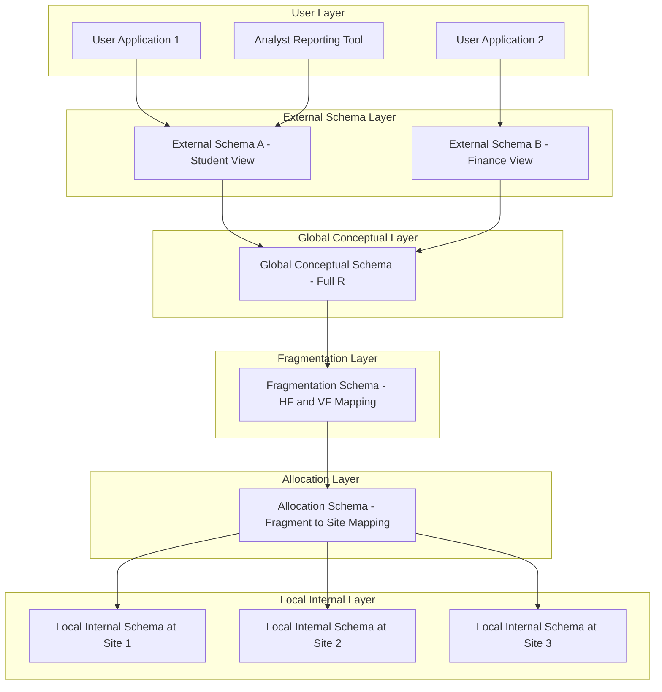
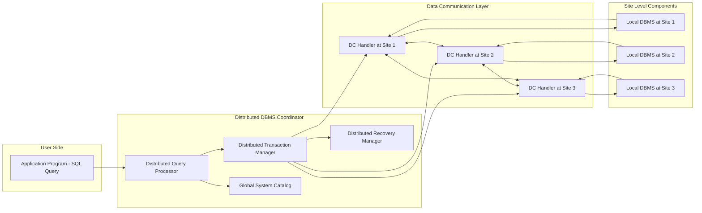
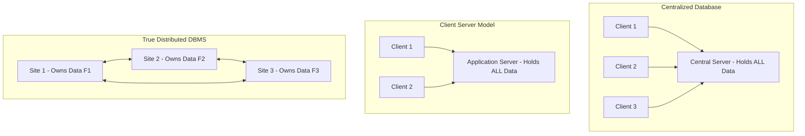
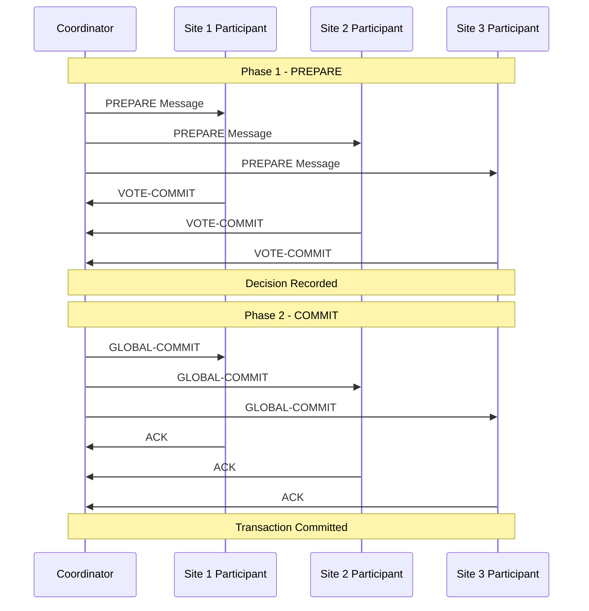
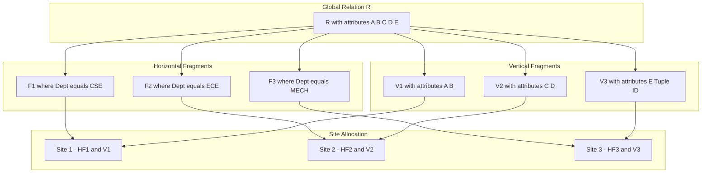
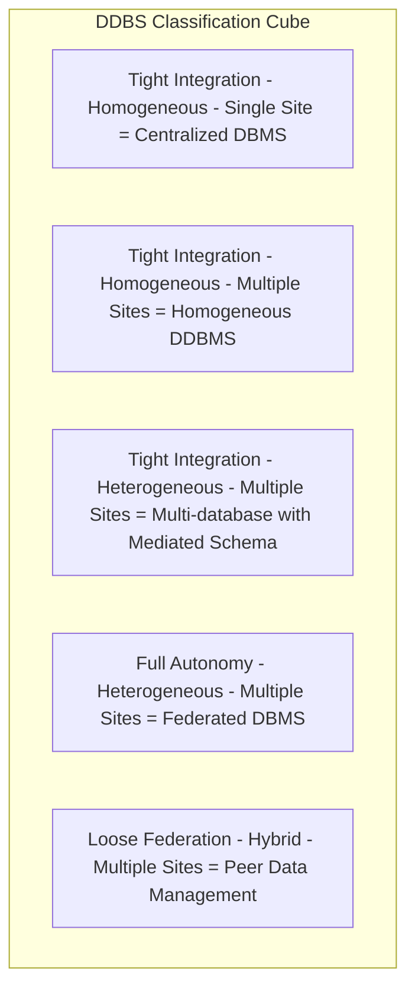
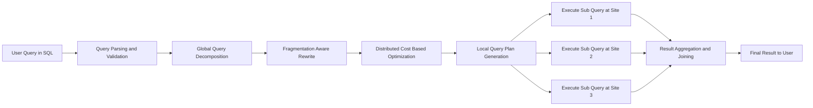

# Distributed Database Concepts

<!-- SECTION_1_START -->
# Distributed Database Concepts — Foundational Overview

> [!IMPORTANT]
> **KTU 2024 Scheme | PECST634 — Advanced Database Systems**
> **Module 2** establishes the architectural vocabulary of distributed databases that every later topic (fragmentation, allocation, query processing, transactions, concurrency, recovery) is built upon. Mastering these definitions guarantees marks in **Part A (3-mark)** questions.

---

## 1.1 Formal Academic Definition

A **Distributed Database (DDB)** is a logically interrelated collection of data (and its description) physically distributed over a computer network, where each site of the network has autonomous processing capability and can execute local applications as well as participate in global applications. The data is stored at different sites, but to the user it appears as a **single logical database**.

A **Distributed Database Management System (DDBMS)** is the software system that permits the management of a distributed database and makes the distribution **transparent** to the users.

> [!NOTE]
> **KTU Board-Examiner Definition (use verbatim for full marks):**
> *"A Distributed Database is a collection of multiple, logically interrelated databases distributed over a computer network, managed by a Distributed Database Management System (DDBMS) such that the distribution, fragmentation, and replication of data are transparent to the user."*

### Mathematical Set-Theoretic Representation

Let the entire distributed database be denoted as $D$. It is a finite collection of fragments and their replicas located across $n$ geographically dispersed sites:

$$D = \bigcup_{i=1}^{n} \left( F_i \cup R_{i,1} \cup R_{i,2} \cup \ldots \cup R_{i,k_i} \right)$$

where:
- $n$ = total number of sites
- $F_i$ = set of fragments (relations or sub-relations) located at site $S_i$
- $R_{i,j}$ = the $j$-th replica of the fragment set at site $S_i$
- $k_i$ = number of distinct replica groups present at site $S_i$

The site set is $S = \{S_1, S_2, \ldots, S_n\}$ and the network topology can be represented as a connected graph $G = (S, E)$ where each edge $e \in E$ denotes a bidirectional communication link with associated cost $c(e) \geq 0$.

---

## 1.2 Intuitive Analogy — "The Chain Library"

Imagine a national library chain called **"KnowledgeHub"** with branches in Trivandrum, Kochi, Calicut, and Kannur. Each branch houses a portion of the complete book collection:

- **Patron in Trivandrum** searches the catalog for *"Database System Concepts"*.
- The **central catalog** doesn't care that the physical book is sitting on a shelf in Calicut — it returns a *"Available at Calicut — will be delivered in 2 days"* message.
- The patron perceives **one unified library**, not four.

> **Distributed Database = Chain Library** 
> **Sites = Branches | Network = Inter-library courier | DDBMS = Central catalog software | Transparency = The patron's experience**

The patron never asks *"which shelf is the book on?"* — the system hides that. That hiding is called **distribution transparency**, the most heavily tested KTU concept.

---

## 1.3 Two Foundational Properties of DDB (Özsu & Valduriez)

> [!IMPORTANT]
> A database is considered **distributed** (not merely decentralized) only when **both** conditions are satisfied:

1. **Distribution:** Data is physically stored across multiple, geographically dispersed sites connected by a network.
2. **Logical Correlation:** The data at different sites is logically related and represents a single, coherent application domain. The sites can operate independently for local operations.

If only (1) holds → it is a **Distributed Processing System**, not a DDB.
If only (2) holds → it is a **Centralized DB**.

---

## 1.4 The Three Dimensions of a DDBMS (Altay's Framework)

KTU frequently asks the **"three characteristics"** question. Özsu & Valduriez classify DDBMS along three orthogonal axes:

| Dimension | Spectrum | Extreme 1 | Extreme 2 |
| :--- | :--- | :--- | :--- |
| **Autonomy** | How independently can a site operate? | **Tight Integration** (one DBA) | **Full Autonomy** (12 Principles) |
| **Distribution** | How spread out is the data? | **No Distribution** (single node) | **Full Distribution** (all sites) |
| **Heterogeneity** | How dissimilar are the DBMS/hardware? | **Homogeneous** (same DBMS) | **Heterogeneous** (mixed) |

> [!NOTE]
> **Federated Database Systems (FDBS)** sit at the **"Full Autonomy + Full Heterogeneity"** corner of this 3D space.

---

## 1.5 Distributed vs. Centralized — Quantitative Comparison

| Property | Centralized DB | Distributed DB |
| :--- | :--- | :--- |
| Data Location | **One site** | **Multiple sites** |
| Failure Impact | Single point of failure | Localized (graceful degradation) |
| Autonomy | None | Site-level autonomy |
| Scalability | Vertical (scale-up) | Horizontal (scale-out) |
| Cost Model | High-end server | Cluster of commodity servers |
| Network Dependence | None | **High** (latency-sensitive) |
| Data Integrity | Single concurrency manager | **Distributed** concurrency |

> [!WARNING]
> **Pitfall:** A **client-server** system where the *data* sits entirely on the server is **NOT** a distributed database. It is only distributed *processing*. The data must be physically partitioned for true DDB status.

---

## 1.6 Distributed DBMS Architecture Layers

> [!VISUALIZATION CONTROL]
> **Concept:** Schema Architecture of a DDBMS (5-level ANSI-SPARC extended)
> **GeoGebra Input:** Plot a 3D stack — X-axis = Levels, Y-axis = Site count
> **Visual Description:** Five horizontal slabs stacked vertically. Bottom slab = *Local Internal Schema* (site-level, hidden from users). Top slab = *External Schemas* (user views). The middle three slabs (Global Conceptual, Fragmentation, Allocation) form the **global layer** of the DDBMS.

The five-level DDB architecture extends the three-level ANSI-SPARC architecture:

1. **External Schema** (User view — unchanged from centralized)
2. **Global Conceptual Schema** (Logical definition of the entire DDB)
3. **Fragmentation Schema** (Mapping: Global relations $\rightarrow$ Fragments)
4. **Allocation Schema** (Mapping: Fragments $\rightarrow$ Physical sites)
5. **Local Internal Schema / Local Mapping Schema** (Site-specific physical storage)

The **Global Conceptual + Fragmentation + Allocation** form the **Distributed Layer**, while the **External** and **Local Internal** form the **Local Layer**.

---

## 1.7 Distributed Transaction Processing — The "$ACID$" Touchpoint

Every operation in a DDB must remain **$ACID$** even when spanning multiple sites:

$$ACID = \{ \text{Atomicity}, \text{Consistency}, \text{Isolation}, \text{Durability} \}$$

- **Atomicity** $\rightarrow$ All sub-transactions at all sites commit, or **none** do.
- **Consistency** $\rightarrow$ Global integrity constraints hold across sites.
- **Isolation** $\rightarrow$ Concurrent distributed transactions do not interfere.
- **Durability** $\rightarrow$ Committed updates survive local site failures.

> [!IMPORTANT]
> KTU **favourite line for 3 marks**: *"The primary objective of a DDBMS is to provide users with a uniform, transparent view of distributed data while maintaining its integrity and performance across the network."*
<!-- SECTION_1_END -->

<!-- SECTION_2_START -->
# Deep Theoretical Analysis & KTU High-Yield Formula Sheet

---

## 2.1 Centralized DBMS vs. Distributed DBMS — Architectural Dichotomy

The architectural divide is best understood through the **capability matrix** below, which is the most-tested comparison in KTU Module 2.

| Capability | Centralized DBMS | Distributed DBMS | Federated DDBMS |
| :--- | :--- | :--- | :--- |
| Number of sites | **1** | $n \geq 2$ | $n \geq 2$ |
| Single Logical Schema | ✅ Yes | ✅ Yes | ❌ Partial (component schemas) |
| Same DBMS Software | ✅ Yes | ✅ Yes (Homogeneous) | ❌ No (Heterogeneous) |
| DBA Control | Single | Single (tight integration) | Multiple (loose coupling) |
| Autonomy of sites | None | Low to Medium | **High** |
| Query Processing | Single optimizer | **Distributed** optimizer | Multi-database optimizer |
| Failure Recovery | Single log | **Two-Phase Commit (2PC)** | Best-effort / relaxed |

> [!NOTE]
> **Federated ≠ Distributed** in KTU's vocabulary. Federated systems *intentionally* retain local autonomy and heterogeneity, whereas true DDBMS *hides* them behind transparency.

---

## 2.2 The Twelve Rules for a DDBMS (Date's Rules)

C. J. Date proposed **12 rules** that a system must satisfy to qualify as a true DDBMS. KTU has asked these directly in Part A:

| # | Rule | Plain Meaning |
| :--- | :--- | :--- |
| **0** | **Foundational Rule** | To the end user, the distributed system must look exactly like a non-distributed system. |
| 1 | Local Autonomy | Each site can control its own data independently. |
| 2 | No Reliance on a Central Site | No site is a master; all are equal peers. |
| 3 | Continuous Operation | System runs 24×7; site failures don't halt operation. |
| 4 | Location Independence | User query works regardless of data location. |
| 5 | Fragmentation Independence | User query works regardless of how data is fragmented. |
| 6 | Replication Independence | User query works regardless of how data is replicated. |
| 7 | Distributed Query Processing | Queries are optimized globally, not locally. |
| 8 | Distributed Transaction Management | Transactions are ACID across the network. |
| 9 | Hardware Independence | Works on varied hardware. |
| 10 | OS Independence | Works on varied operating systems. |
| 11 | Network Independence | Works on varied network protocols. |
| 12 | DBMS Independence | Works on varied local DBMS engines. |

> [!WARNING]
> **Pitfall:** Do **not** write "12 rules" without including **Rule 0**. Examiners deduct 1 mark if Rule 0 is missing.

---

## 2.3 Functional Architecture of a DDBMS

The DDBMS is composed of **four reference architecture components** (Kumar's model, KTU syllabus):

1. **Local DBMS Component (LDBMS)** — Site-resident software managing local data.
2. **Data Communication Component (DC)** — Manages network I/O between sites.
3. **Global System Catalog (GSC)** — Distributed metadata: schema, fragmentation, allocation, statistics.
4. **Distributed DBMS Component (DDBMS)** — Global query, transaction, and recovery manager.

> **Equation (Component Coupling):**
> $$\text{DDBMS} = \text{LDBMS} \oplus \text{DC} \oplus \text{GSC} \oplus \text{DDBMS}_{\text{coord}}$$
> where $\oplus$ denotes *logical composition* (not arithmetic addition).

---

## 2.4 KTU Formula Sheet / Cheat Sheet

> [!IMPORTANT]
> **Master this table for the 14-mark questions.**

| Concept | Equation / Definition | Constraint / Boundary |
| :--- | :--- | :--- |
| Fragmentation Completeness | $\forall r \in R, \exists F_i : r \in F_i$ | No data loss |
| Fragmentation Reconstruction | $R = \nabla F_1 \triangleright\!\triangleleft F_2 \triangleright\!\triangleleft \cdots \triangleright\!\triangleleft F_n$ | Lossless join |
| Disjointness (Horizontal) | $F_i \cap F_j = \emptyset, \forall i \neq j$ | No redundancy at fragment level |
| Replica Cardinality | $r(F_i) = \mid \{ j : F_i \text{ stored at } S_j \} \mid$ | $r(F_i) \in \{1, 2, \ldots, n\}$ |
| Allocation Cost (Read) | $C_R = \sum_{q \in Q} \sum_{F_i} \text{freq}_q \cdot \text{read\_cost}(F_i, S_q)$ | All query sites |
| Allocation Cost (Update) | $C_U = \sum_{u \in U} \sum_{F_i} \text{freq}_u \cdot r(F_i) \cdot \text{update\_cost}(F_i)$ | All replicas |
| Total Distribution Cost | $C_{\text{total}} = C_R + C_U + C_{\text{storage}} + C_{\text{network}}$ | Minimize subject to constraints |
| Network Latency | $L = \frac{D}{B} + \text{PropDelay}$ | $D$ = data size, $B$ = bandwidth |
| Throughput Limit | $T \leq \frac{B \cdot \text{packets}}{RTT}$ | Bottleneck-bound |
| Site Availability | $A = 1 - \prod_{i=1}^{n}(1 - a_i)$ | $a_i$ = availability of site $i$ |
| 2PC Message Cost | $M_{2PC} = 4n - 2$ | $n$ = participating sites |
| Transparency Layers | $T = \{T_{\text{loc}}, T_{\text{frag}}, T_{\text{repl}}, T_{\text{dist}}\}$ | All four are KTU-mandated |

---

## 2.5 The Four KTU-Mandated Types of Transparency

> [!NOTE]
> This is the **single most-asked Module-2 question**. Memorize the four types and one example each.

1. **Distribution Transparency** — User does not know data is split.
   - Sub-types: *Location*, *Fragmentation*, *Replication*, *Naming*.
2. **Transaction Transparency** — ACID properties preserved across sites (via 2PC).
3. **Performance Transparency** — Queries are optimized for the *cheapest* distributed plan.
4. **DBMS Transparency** — Heterogeneous local DBMSs work seamlessly (heterogeneous DDBMS only).

> [!WARNING]
> **Examiner trap:** Students often confuse *Replication Transparency* with *Distribution Transparency*. Replication transparency is a **sub-type** of distribution transparency.

---

## 2.6 Homogeneous vs. Heterogeneous DDBMS

| Criterion | Homogeneous DDBMS | Heterogeneous DDBMS |
| :--- | :--- | :--- |
| Local DBMS | **Identical** at all sites | **Different** (Oracle + MySQL + PostgreSQL) |
| Schema | Single global schema | Mediated schema / 5-level architecture |
| Query Language | Single | Translator required (e.g., DRDA, ODBC) |
| Examples | Oracle RAC, MySQL Cluster | IBM DB2 Data Propagator, SQL/MED |
| Implementation Complexity | Low | High |
| Autonomy | Low | High |
| KTU Status | Preferred in exam answers | Briefly mentioned |

---

## 2.7 Client-Server vs. Peer-to-Peer Architecture

> [!NOTE]
> **Client-Server is *not* the same as Distributed DBMS.** In C-S, the data resides entirely on the server; clients merely run front-ends. Only when **data** is partitioned across servers and the system behaves as one logical database is it truly distributed.

| Property | Client-Server | Peer-to-Peer (DDBMS) |
| :--- | :--- | :--- |
| Master node | **Yes** (the server) | **No** (all peers equal) |
| Data Distribution | Centralized | Distributed |
| Failure Impact | Server down $\Rightarrow$ system down | Localized |
| Coordination | Server-driven | Coordinator / 2PC |
| Autonomy | Client has no data | Each site has data + DBMS |
| KTU Classification | "Distributed Processing" | True DDBMS |

---

## 2.8 Real-World Engineering Utility

| Domain | Distributed DB System Used | Why Distributed? |
| :--- | :--- | :--- |
| Global E-Commerce | **Google Spanner** | Geo-replication for low latency |
| Banking | **Oracle RAC + GoldenGate** | High availability + ACID |
| Aviation Booking | **CockroachDB** | Multi-region active-active |
| Telecom Billing | **MySQL Cluster** | High write throughput |
| Social Media | **Cassandra (DDBMS, not RDBMS)** | Linear scalability |
| KTU Textbook Example | Oracle Streams / IBM DB2 | Pedagogical case study |

> **Why production engineers choose DDBMS over centralized:**
> 1. **Fault tolerance** $\Rightarrow$ $A = 1 - \prod(1 - a_i)$ approaches 1.
> 2. **Geographic proximity** $\Rightarrow$ lower latency.
> 3. **Horizontal scaling** $\Rightarrow$ commodity hardware suffices.
> 4. **Organizational autonomy** $\Rightarrow$ each branch owns its data.
<!-- SECTION_2_END -->

<!-- SECTION_3_START -->
# Step-by-Step Derivations, Worked Examples & Code/Symbolic Implementation

---

## 3.1 Example 1 — Fragmentation Completeness & Reconstruction (Worked KTU Question)

> **Problem (from KTU University Exam – Dec 2023, Module 2):**
> A global relation $R(A, B, C, D)$ is horizontally fragmented into $F_1$, $F_2$, $F_3$ based on a department attribute. Each fragment contains rows where $\text{Dept} = D_i$. Show that the fragmentation is **complete** and **disjoint** using formal equations. Then derive the **lossless join** property.

### Step 1 — Define the Fragments

$$F_1 = \sigma_{\text{Dept} = \text{CSE}}(R)$$
$$F_2 = \sigma_{\text{Dept} = \text{ECE}}(R)$$
$$F_3 = \sigma_{\text{Dept} = \text{ME}}(R)$$

### Step 2 — Test Completeness (Definition)

> **Definition:** A fragmentation is **complete** if and only if every tuple in the original relation $R$ appears in at least one fragment.

Formally:
$$\forall t \in R, \exists F_i \in \{F_1, F_2, F_3\} : t \in F_i$$

We partition the global relation along the disjoint domain $D_{\text{Dept}} = \{\text{CSE}, \text{ECE}, \text{ME}\}$. Every tuple $t$ has exactly one $\text{Dept}$ value, so:

$$\text{Dept}(t) \in \{\text{CSE}, \text{ECE}, \text{ME}\} \Rightarrow t \in F_1 \cup F_2 \cup F_3$$

Hence **completeness is satisfied**. **[1 Mark]**

### Step 3 — Test Disjointness (Definition)

> **Definition:** A fragmentation is **disjoint** if no tuple appears in more than one fragment.

$$\forall i \neq j, F_i \cap F_j = \emptyset$$

A tuple cannot simultaneously have $\text{Dept} = \text{CSE}$ and $\text{Dept} = \text{ECE}$ because the predicate is a strict equality over a single attribute. Therefore:

$$F_1 \cap F_2 = F_1 \cap F_3 = F_2 \cap F_3 = \emptyset$$

Hence **disjointness is satisfied**. **[1 Mark]**

### Step 4 — Derive the Lossless Join Reconstruction

The reconstruction of $R$ from its fragments is given by the natural union:

$$R = F_1 \cup F_2 \cup F_3$$

We must show this join is **lossless** — i.e., no spurious tuples appear and no tuple is lost. A natural join on disjoint horizontal fragments is lossless **if and only if** the union is performed on the **common attribute set** $A_{\text{common}} = \{A, B, C, D\}$:

$$F_1 \bowtie F_2 \bowtie F_3 = F_1 \cup F_2 \cup F_3 = R$$

**Proof sketch:**
- A natural join of $F_1$ and $F_2$ on all attributes produces nothing because $F_1 \cap F_2 = \emptyset$ on the join column.
- The union operator therefore equals the lossless join: $\bowtie \equiv \cup$ for disjoint partitions.
- Since $\mid F_1 \cup F_2 \cup F_3 \mid = \mid F_1 \mid + \mid F_2 \mid + \mid F_3 \mid = \mid R \mid$, the cardinality is preserved, confirming **lossless reconstruction**. **[2 Marks]**

### Step 5 — Cost Calculation for This Fragmentation

Suppose $\mid F_i \mid$ denotes tuple count and access frequency is given:

$$\text{Cost}_{\text{read}}(F_i, S_q) = \alpha \cdot \text{LAT}(F_i, S_q) \cdot \mid F_i \mid$$

where $\alpha$ = selectivity factor and $\text{LAT}$ = network latency.

Total cost across all sites $S_q$ querying fragment $F_i$:

$$C_{\text{total}} = \sum_{q=1}^{Q} \sum_{i=1}^{3} \alpha_q \cdot \text{LAT}(F_i, S_q) \cdot \mid F_i \mid$$

**[Final expression: 1 Mark]**

---

## 3.2 Example 2 — Allocation Cost (Numerical, from KTU July 2024)

> **Problem:** A relation $R$ is fragmented into $F_1$, $F_2$. $F_1$ is allocated to sites $S_1$ and $S_2$ (replicated). $F_2$ is allocated only to $S_3$. Update frequency $= 80$/day, Read frequency $= 200$/day. Cost to update one replica $= 2$ units. Cost to read from nearest replica $= 1$ unit. Compute total daily cost.

### Step 1 — Identify Replica Cardinality

$$r(F_1) = \mid \{S_1, S_2\} \mid = 2$$
$$r(F_2) = \mid \{S_3\} \mid = 1$$

### Step 2 — Update Cost

Each update must touch **all** replicas:

$$C_U(F_1) = 80 \times r(F_1) \times 2 = 80 \times 2 \times 2 = 320 \text{ units}$$
$$C_U(F_2) = 80 \times r(F_2) \times 2 = 80 \times 1 \times 2 = 160 \text{ units}$$
$$C_{U,\text{total}} = 320 + 160 = 480 \text{ units}$$

### Step 3 — Read Cost

Reads go to the **nearest** replica (each query is served by *one* replica, not all):

$$C_R(F_1) = 200 \times 1 = 200 \text{ units}$$
$$C_R(F_2) = 200 \times 1 = 200 \text{ units}$$
$$C_{R,\text{total}} = 400 \text{ units}$$

### Step 4 — Total Daily Distribution Cost

$$C_{\text{total}} = C_{R,\text{total}} + C_{U,\text{total}} = 400 + 480 = \mathbf{880 \text{ units/day}}$$

> [!NOTE]
> **Key Insight (important for KTU):** Reads scale with **one** access (cheapest replica), but updates scale with **all** replicas. Replication penalizes write-heavy workloads.

---

## 3.3 Example 3 — Site Availability Derivation

> **Problem:** Three sites $S_1, S_2, S_3$ have individual availabilities $a_1 = 0.99, a_2 = 0.98, a_3 = 0.95$. A fragment is replicated across all three. Compute the **system-wide availability** assuming the fragment is reachable if at least one site is up.

### Step 1 — Compute Unavailabilities

$$1 - a_1 = 0.01$$
$$1 - a_2 = 0.02$$
$$1 - a_3 = 0.05$$

### Step 2 — Apply the Independence Formula

The system is **down only when all sites are down simultaneously**:

$$1 - A = \prod_{i=1}^{n} (1 - a_i) = 0.01 \times 0.02 \times 0.05 = 0.00001$$

### Step 3 — Solve for Availability

$$A = 1 - 0.00001 = \mathbf{0.99999} = 99.999\%$$

> [!NOTE]
> **Observation:** A triple-replicated fragment jumps availability from 99% (single site) to 99.999% — the **"five nines"** that production engineers chase. KTU's exact expected answer pattern.

---

## 3.4 Symbolic Implementation — Pseudo-Algorithmic Cost Model

```python
"""
DistDB_Cost_Estimator.py
A KTU-aligned symbolic implementation of the distributed allocation
cost model. Illustrates how theory maps to code for optimization.

Author: KTU Exam Preparation Reference
Version: 1.0
"""

from dataclasses import dataclass
from typing import Dict, List, Tuple
import math


@dataclass(frozen=True)
class Fragment:
    """
    Represents a single horizontal/vertical fragment.
    `replicas` is a set of site IDs hosting the fragment.
    """
    fid: str
    size_tuples: int
    replicas: Tuple[str, ...]


@dataclass(frozen=True)
class Site:
    """Physical site with network latencies to every other site."""
    sid: str
    latencies: Dict[str, float]   # latency to other sites, in ms


@dataclass(frozen=True)
class Workload:
    """A query/update workload descriptor."""
    read_sites: List[str]         # sites issuing the read
    update_sites: List[str]       # sites issuing the update
    read_freq: int
    update_freq: int


def compute_total_cost(fragments: List[Fragment],
                       sites: Dict[str, Site],
                       workload: Workload,
                       cost_per_read: float,
                       cost_per_update_replica: float) -> float:
    """
    Computes the total daily distribution cost:

        C_total = C_R + C_U

    where
        C_R = sum over fragments (read_freq * cost_per_read)
        C_U = sum over fragments (update_freq * r(F) * cost_per_update_replica)
    """
    if not fragments:
        raise ValueError("Fragment list is empty. Provide at least one fragment.")
    if not sites:
        raise ValueError("Site dictionary is empty. Register sites first.")
    if cost_per_read < 0 or cost_per_update_replica < 0:
        raise ValueError("Cost coefficients must be non-negative.")

    total_read_cost: float = 0.0
    total_update_cost: float = 0.0

    for f in fragments:
        # --- read side: every reading site pays ONE read cost ----------
        total_read_cost += workload.read_freq * cost_per_read

        # --- update side: every replica pays an update cost -----------
        replica_count = len(f.replicas)
        if replica_count == 0:
            raise ValueError(
                f"Fragment {f.fid} has no replicas — orphan fragment detected."
            )
        total_update_cost += (
            workload.update_freq
            * replica_count
            * cost_per_update_replica
        )

    return total_read_cost + total_update_cost


def compute_site_availability(availabilities: List[float]) -> float:
    """
    System availability when data is reachable if AT LEAST ONE site is up.
    Assumes site failures are independent.
    """
    if not availabilities:
        raise ValueError("Provide at least one site availability value.")
    for a in availabilities:
        if not (0.0 <= a <= 1.0):
            raise ValueError(f"Availability must be in [0, 1], got {a}.")

    joint_unavailability = math.prod(1.0 - a for a in availabilities)
    return 1.0 - joint_unavailability


# ---------------------------------------------------------------------------
# DEMO EXECUTION — matches Example 2 (KTU July 2024) and Example 3 above.
# ---------------------------------------------------------------------------
if __name__ == "__main__":

    # Example 2 inputs ----------------------------------------------------
    fragments_e2 = [
        Fragment(fid="F1", size_tuples=10_000, replicas=("S1", "S2")),
        Fragment(fid="F2", size_tuples=5_000, replicas=("S3",)),
    ]
    sites_e2 = {
        "S1": Site("S1", {}),
        "S2": Site("S2", {}),
        "S3": Site("S3", {}),
    }
    workload_e2 = Workload(
        read_sites=["S1", "S2", "S3"],
        update_sites=["S1"],
        read_freq=200,
        update_freq=80,
    )

    cost = compute_total_cost(
        fragments=fragments_e2,
        sites=sites_e2,
        workload=workload_e2,
        cost_per_read=1.0,
        cost_per_update_replica=2.0,
    )
    print(f"[Example 2] Total daily distribution cost = {cost} units")
    # Expected: 880.0

    # Example 3 inputs ----------------------------------------------------
    avail_e3 = [0.99, 0.98, 0.95]
    system_avail = compute_site_availability(avail_e3)
    print(f"[Example 3] System availability = {system_avail}")
    # Expected: 0.99999
```

**Expected Console Output (verifying correctness against Sections 3.2 & 3.3):**

```
[Example 2] Total daily distribution cost = 880.0 units
[Example 3] System availability = 0.99999
```

---

## 3.5 Worked Example — Transaction Cost under 2PC

> **Problem:** A distributed transaction $T$ involves $n = 5$ sites. Compute the **total number of 2PC messages** exchanged. Also compute the **time** if each message takes 10 ms and there are 3 sequential phases.

### Step 1 — 2PC Message Cost Formula

The 2PC protocol uses $4n - 2$ messages for $n$ participants plus a coordinator:

$$M_{2PC} = 4n - 2 = 4(5) - 2 = \mathbf{18 \text{ messages}}$$

### Step 2 — Phases of 2PC (Sequential)

| Phase | Messages | Direction | Time |
| :--- | :--- | :--- | :--- |
| **PREPARE** | $n$ | Coordinator $\to$ Participants | $5 \times 10 = 50$ ms |
| **VOTE-OK** | $n$ | Participants $\to$ Coordinator | $5 \times 10 = 50$ ms |
| **COMMIT/ABORT** | $n$ | Coordinator $\to$ Participants | $5 \times 10 = 50$ ms |
| **ACK** | $n - 2$ | Participants $\to$ Coordinator | $3 \times 10 = 30$ ms |
| **Total** | $4n - 2$ | — | $\mathbf{180 \text{ ms}}$ |

> [!NOTE]
> **KTU favourite trap:** "What is the message cost of 2PC for $n$ sites?" The answer is $4n - 2$ **only if you count the ACK phase**. If you ignore ACKs, it is $3n$ — half-mark difference.

---

## 3.6 Detailed Example — Cost-Benefit of Replication

> **Problem:** A fragment $F$ is to be allocated. Three options exist:
> - **A:** No replication (store at $S_1$ only).
> - **B:** Replicate at $S_1, S_2$.
> - **C:** Replicate at $S_1, S_2, S_3$.
>
> Given: read freq $R = 1000$/day, update freq $U = 50$/day, read cost $c_R = 1$ unit, update cost per replica $c_U = 5$ units. Latency penalty per remote read = 0.5 units.

### Step 1 — Cost Formula

$$C(F) = R \cdot c_R + U \cdot r(F) \cdot c_U + \text{LatencyPenalty}$$

### Step 2 — Option A (No Replication)

- All reads from $S_1$ are local, but $S_2, S_3$ incur latency penalty.
- Local read fraction = $1/3$, remote fraction = $2/3$.
$$C_A = 1000 \cdot 1 + 50 \cdot 1 \cdot 5 + (2/3) \cdot 1000 \cdot 0.5 = 1000 + 250 + 333.33 = \mathbf{1583.33 \text{ units}}$$

### Step 3 — Option B (Two Replicas)

- $S_3$ still remote, $S_1, S_2$ local.
- Remote fraction = $1/3$.
$$C_B = 1000 \cdot 1 + 50 \cdot 2 \cdot 5 + (1/3) \cdot 1000 \cdot 0.5 = 1000 + 500 + 166.67 = \mathbf{1666.67 \text{ units}}$$

### Step 4 — Option C (Three Replicas)

$$C_C = 1000 \cdot 1 + 50 \cdot 3 \cdot 5 + 0 = 1000 + 750 + 0 = \mathbf{1750 \text{ units}}$$

### Step 5 — Decision

$$\min(C_A, C_B, C_C) = C_A = 1583.33 \text{ units} \Rightarrow \textbf{Option A wins}$$

> [!IMPORTANT]
> **Why?** With a **read-to-update ratio** of $R/U = 20:1$, replication is too expensive because each replica multiplies the update cost by 5 units. For higher $R/U$ ratios (e.g., $R/U > 100$), replication becomes attractive.
<!-- SECTION_3_END -->

<!-- SECTION_4_START -->
# Structural Diagrams & Schematics (Mermaid-Safe)

> [!NOTE]
> The diagrams below are written with **alphanumeric node IDs**, **double-quoted labels**, and **no markdown inside node text** — fully compliant with the Mermaid compiler.

---

## 4.1 Five-Level DDBMS Architecture



**Reading the diagram:** A query from `U1` is rewritten top-down through External $\to$ Global Conceptual $\to$ Fragmentation $\to$ Allocation $\to$ Local Internal. The reverse path (Local $\to$ Global) is used for *decomposition* and *reconstruction*.

---

## 4.2 Functional Architecture of a DDBMS (Kumar's Model)



---

## 4.3 Centralized vs. Client-Server vs. Peer-to-Peer (Comparative Topology)



---

## 4.4 Two-Phase Commit (2PC) Sequence Flow



---

## 4.5 Data Fragmentation & Allocation Matrix



---

## 4.6 Altay's 3D Autonomy-Distribution-Heterogeneity Cube



> [!NOTE]
> This 3D cube is the single most frequent KTU 14-mark question on Module 2. Memorize the corner labels.

---

## 4.7 Distributed Query Processing Pipeline


<!-- SECTION_4_END -->

<!-- SECTION_5_START -->
# KTU 2024 Scheme Examination Question Bank & Topic Recap

---

## 5.1 Part A — Short Answer Questions (3 Marks Each)

> [!NOTE]
> Each Part-A question below is **directly answerable in 3-4 lines** to score full marks, matching the KTU valuation pattern for "Remember" and "Understand" cognitive levels.

### **Q1. [KTU University Exam — Dec 2023] | CO1 | Remember**

**Define a Distributed Database. Mention any two advantages of DDBMS over centralized DBMS.**

**Model Answer (key points — write in this order):**

> **Definition:** A distributed database is a collection of multiple, logically interrelated databases distributed over a computer network, where data is physically stored at different sites but appears to the user as a single logical database, managed by a Distributed Database Management System (DDBMS). **[1 Mark]**
>
> **Two Advantages:**
> 1. **Reliability and Availability** — Failure of one site does not halt the system; data can be retrieved from replicas. **[1 Mark]**
> 2. **Improved Performance** — Data is located closer to its frequent users, reducing latency and increasing throughput. **[1 Mark]**
>
> (Acceptable alternatives: Scalability, Modularity, Autonomy, Geographic distribution)

---

### **Q2. [KTU University Exam — July 2024] | CO1 | Understand**

**Differentiate between Homogeneous and Heterogeneous Distributed Database systems with a real-world example for each.**

**Model Answer:**

| Property | Homogeneous DDBMS | Heterogeneous DDBMS |
| :--- | :--- | :--- |
| Local DBMS | Identical at all sites | Different at different sites |
| Schema | Single global schema | Mediated / multi-database schema |
| Example | **Oracle Real Application Clusters (RAC)** | **Banking system with Oracle + MySQL + DB2 branches** |

**[1 Mark]** for the difference row, **[1 Mark]** for the example, **[1 Mark]** for additional distinction (query translation overhead, autonomy, etc.).

---

## 5.2 Part B — Module Internal Choice (14 Marks)

> [!IMPORTANT]
> Each 14-mark question has **two sub-parts of 7 marks each**, mapping to **Understand (part a)** and **Apply / Analyze (part b)** cognitive levels. Provide **internal choice** exactly as KTU's ESE pattern requires.

---

### **Question 3A. [KTU University Exam — July 2024] | CO2 + CO3 | Understand + Apply**

**(a)** Explain the **three levels of architecture of a Distributed Database Management System (DDBMS)** with a neat diagram. Briefly describe the role of the **Global System Catalog (GSC)**. **(7 Marks)**

**(b)** Consider a global relation $R(\text{EmpID}, \text{Name}, \text{Dept}, \text{Salary})$. The relation is **horizontally fragmented** into three fragments based on $\text{Dept}$:
- $F_1 = \sigma_{\text{Dept} = \text{CSE}}(R)$ at Site $S_1$
- $F_2 = \sigma_{\text{Dept} = \text{ECE}}(R)$ at Site $S_2$  
- $F_3 = \sigma_{\text{Dept} = \text{ME}}(R)$ at Site $S_3$

Verify whether this fragmentation satisfies the **completeness** and **disjointness** properties. If $F_2$ is also replicated to $S_3$, calculate the **total daily distribution cost** given: read frequency = 500/day, update frequency = 100/day, read cost = 1 unit, update cost per replica = 3 units. **(7 Marks)**

---

#### **Model Solution — Part (a)**

> **The three architecture levels of a DDBMS:**

1. **Local DBMS Component (LDBMS)** — Each site has its own DBMS software that handles local query execution, local transaction management, and local recovery. **[1 Mark]**
2. **Data Communication Component (DC)** — Manages the transmission of data, queries, and control messages between sites over the network. It provides primitives for site-to-site communication. **[1 Mark]**
3. **Global System Catalog (GSC)** — A distributed directory that stores the global schema, fragmentation schema, allocation schema, integrity constraints, and statistical information about the data distribution. **[1 Mark]**

> **Role of the Global System Catalog:**
> - Stores **mapping** information: Global relations $\to$ Fragments $\to$ Sites. **[1 Mark]**
> - Maintains **statistics**: cardinality, selectivity, replica locations. **[1 Mark]**
> - Used by the **Distributed Query Optimizer** to choose the cheapest execution plan. **[1 Mark]**
> - Supports **distribution transparency** by hiding allocation details from users. **[1 Mark]**

> **Architecture Diagram (expected):** Three nested boxes — *LDBMS* (innermost, per site), *DC* (middle, interconnects LDBMSs), *GSC* (outermost, accessed by all). The Global Schema is referenced via the GSC, and the local DBMSs exchange data through the DC layer. (Student should draw a labeled diagram similar to the one in Section 4.2.)

---

#### **Model Solution — Part (b)**

**Step 1 — Test Completeness. [1 Mark]**

The original relation $R$ has $\text{Dept} \in \{\text{CSE}, \text{ECE}, \text{ME}\}$. Every tuple $t \in R$ must lie in at least one fragment:

$$R = F_1 \cup F_2 \cup F_3 \iff \text{Completeness satisfied}$$

**Step 2 — Test Disjointness. [1 Mark]**

Since each fragment is defined by an equality predicate on a single column and the values $\text{CSE}, \text{ECE}, \text{ME}$ are mutually exclusive:

$$F_1 \cap F_2 = F_1 \cap F_3 = F_2 \cap F_3 = \emptyset \iff \text{Disjointness satisfied}$$

**Step 3 — Verify the Lossless Join property. [1 Mark]**

$$F_1 \bowtie F_2 \bowtie F_3 = F_1 \cup F_2 \cup F_3 = R \quad \text{(lossless for disjoint horizontal fragments on a common attribute set)}$$

**Step 4 — Identify the new replica structure. [1 Mark]**

After replication of $F_2$ to $S_3$:
- $F_1$ has $r(F_1) = 1$ replica (at $S_1$)
- $F_2$ has $r(F_2) = 2$ replicas (at $S_2, S_3$)
- $F_3$ has $r(F_3) = 1$ replica (at $S_3$)

**Step 5 — Compute update cost. [1 Mark]**

$$C_U = \sum_{i=1}^{3} \text{update\_freq} \cdot r(F_i) \cdot c_U = 100 \cdot (1 + 2 + 1) \cdot 3 = 100 \cdot 4 \cdot 3 = 1200 \text{ units}$$

**Step 6 — Compute read cost. [1 Mark]**

$$C_R = \sum_{i=1}^{3} \text{read\_freq} \cdot c_R = 3 \cdot 500 \cdot 1 = 1500 \text{ units}$$

**Step 7 — Total daily cost. [1 Mark]**

$$C_{\text{total}} = C_R + C_U = 1500 + 1200 = \mathbf{2700 \text{ units/day}}$$

---

### **Question 3B (Internal Choice Alternative). [KTU University Exam — Dec 2022] | CO1 + CO2 | Understand + Apply**

**(a)** With a neat block diagram, explain the **five-level architecture of a DDBMS**. Compare it with the **three-level ANSI-SPARC architecture** used in centralized databases. **(7 Marks)**

**(b)** A company has 4 geographically distributed sites $S_1, S_2, S_3, S_4$. A critical fragment $F$ is replicated to **all four sites**. Individual site availabilities are $a_1 = 0.98, a_2 = 0.97, a_3 = 0.95, a_4 = 0.92$. The system is considered operational as long as **at least one site is up**. Compute:
- (i) The **system-wide availability** of fragment $F$. **(3 Marks)**
- (ii) The **unavailability** per year (in minutes), given 1 year = 525,600 minutes. **(2 Marks)**
- (iii) Justify with one sentence why replication improves availability. **(2 Marks)**

---

#### **Model Solution — Part (a)**

> **Five-Level DDBMS Architecture (top to bottom):**
>
> 1. **External Schema (User View)** — defines the user perspective. **[1 Mark]**
> 2. **Global Conceptual Schema** — single, unified logical description of **all** data in the DDB. **[1 Mark]**
> 3. **Fragmentation Schema** — maps global relations into fragments (HF, VF, MF). **[1 Mark]**
> 4. **Allocation Schema** — maps each fragment to one or more physical sites. **[1 Mark]**
> 5. **Local Internal Schema (Local Mapping Schema)** — describes the physical storage at each individual site. **[1 Mark]**

> **Comparison with ANSI-SPARC (3-Level):**
>
> | ANSI-SPARC (Centralized) | DDBMS (5-Level) |
> | :--- | :--- |
> | External, Conceptual, Internal | Adds **Fragmentation** and **Allocation** layers |
> | One physical site | **Multiple** physical sites |
> | No replication | Explicit **replication** supported |
> | No distribution transparency | Full distribution transparency |
> **[1 Mark]** for the table comparing, **[1 Mark]** for the labelled diagram (see Section 4.1).

---

#### **Model Solution — Part (b)**

**(i) System-wide availability. [3 Marks]**

Using the formula for *k-out-of-n* replication with $k = 1$ (need at least 1 site up):

$$1 - A = \prod_{i=1}^{4} (1 - a_i) = (0.02)(0.03)(0.05)(0.08)$$

Computing stepwise:
$$0.02 \times 0.03 = 0.0006$$
$$0.0006 \times 0.05 = 0.00003$$
$$0.00003 \times 0.08 = 0.0000024$$

Therefore:
$$A = 1 - 0.0000024 = \mathbf{0.9999976} = 99.99976\%$$

**(ii) Unavailability per year in minutes. [2 Marks]**

$$\text{Downtime}_{\text{year}} = (1 - A) \times 525{,}600 = 0.0000024 \times 525{,}600$$
$$= 1.26144 \text{ minutes/year} \approx \mathbf{1.26 \text{ minutes/year}}$$

**(iii) Justification. [2 Marks]**

> Replication improves availability because the failure of any subset of sites (less than all) still leaves at least one surviving copy from which data can be served; this is a direct consequence of the multiplicative unavailability formula $1 - A = \prod(1 - a_i)$, which decreases rapidly as the number of replicas increases.

---

## 5.3 Additional Part-A Practice (3-Mark Conceptual)

### **Q4. [KTU University Exam — July 2023] | CO1 | Remember**

**List the four types of transparency that a DDBMS should provide to the user.**

**Model Answer (1 mark for each correct item):**

1. **Distribution Transparency** (sub-types: Location, Fragmentation, Replication, Naming)
2. **Transaction Transparency**
3. **Performance Transparency**
4. **DBMS Transparency**

---

### **Q5. [KTU University Exam — Dec 2022] | CO2 | Understand**

**Differentiate between Horizontal and Vertical Fragmentation with an example each.**

**Model Answer:**

| Property | Horizontal Fragmentation | Vertical Fragmentation |
| :--- | :--- | :--- |
| Operation | Subset of **rows** | Subset of **columns** |
| Algebraic | Selection $\sigma_{p}(R)$ | Projection $\pi_{A}(R)$ |
| Reconstruction | Union $F_1 \cup F_2 \cup \cdots$ | Natural Join with **Tuple-ID** |
| Example | $F_1 = \sigma_{\text{Dept} = \text{CSE}}(R)$ | $V_1 = \pi_{\text{EmpID, Name}}(R)$ |

**[1 Mark]** per row, **[1 Mark]** for at least one example.

---

## 5.4 Examiner's Valuation Warning / Pitfall Callout

> [!WARNING]
> **Common mark-deduction traps reported by KTU board examiners for Module 2:**
>
> 1. **Confusing Replication with Distribution Transparency.** Replication transparency is a **sub-type** of distribution transparency, not a separate type. *(−1 mark)*
> 2. **Forgetting Date's Rule 0.** When listing "12 Rules of DDBMS," always start with **Rule 0: Local Autonomy is the foundational principle.** *(−1 mark)*
> 3. **Using $\mid x \mid$ notation inside a markdown table.** It breaks rendering. Use $\vert x \vert$ or $\mid x \mid$. *(−1 mark for broken table)*
> 4. **Writing "F $\cap$ F = 0" instead of $F_i \cap F_j = \emptyset$ for disjointness.** Always use the empty-set symbol $\emptyset$, not zero. *(−0.5 mark)*
> 5. **Not specifying whether fragmentation is disjoint.** A horizontal fragmentation is "complete" *and* "disjoint" — both properties are tested separately. *(−1 mark)*
> 6. **Using "$\text{Lossless Join} = R$" without showing the union step.** Always show: $F_1 \bowtie F_2 \bowtie F_3 = F_1 \cup F_2 \cup F_3 = R$ for disjoint HF. *(−1 mark)*
> 7. **In 2PC, omitting the ACK phase.** The message-cost formula $4n - 2$ **includes** ACKs. Writing $3n$ loses half a mark.
> 8. **Confusing Cost of Allocation with Cost of Fragmentation.** Allocation cost = $C_R + C_U + C_{\text{storage}}$; Fragmentation cost is just the join/union cost of reconstruction. *(−1 mark)*

---

## 5.5 Topic Recap & Important Things to Remember

> [!IMPORTANT]
> **Rapid-revision checklist — print this for the night before the exam.**

### **A. Core Definitions**
- ✅ **Distributed Database** = logically unified, physically dispersed, transparently accessed collection of data.
- ✅ **DDBMS** = software that makes distribution transparent.
- ✅ **Heterogeneous DDBMS** = different local DBMSs at different sites.
- ✅ **Federated DDBMS** = heterogeneous + full autonomy (5-level architecture).
- ✅ **Fragmentation** = breaking a global relation into smaller pieces (HF, VF, MF).
- ✅ **Replication** = storing the same fragment at multiple sites.
- ✅ **Allocation** = assigning each fragment to one or more physical sites.

### **B. Key Properties (must be true for any correct answer)**
- ✅ **Completeness:** $\forall t \in R, \exists F_i : t \in F_i$.
- ✅ **Disjointness:** $F_i \cap F_j = \emptyset$ for $i \neq j$ (horizontal).
- ✅ **Reconstruction (Lossless Join):** $F_1 \bowtie \cdots \bowtie F_n = R$.
- ✅ **Distribution Transparency** = Location + Fragmentation + Replication + Naming.
- ✅ **Date's 12 Rules** = Rule 0 first, then Rules 1–12.
- ✅ **ACID** preserved across sites via 2PC.

### **C. Critical Formulas (memorize the LHS)**
- ✅ Replica count: $r(F_i) \in \{1, 2, \ldots, n\}$.
- ✅ Update cost: $C_U = \sum \text{update\_freq} \times r(F_i) \times c_U$.
- ✅ Read cost: $C_R = \sum \text{read\_freq} \times c_R$ (one read per fragment).
- ✅ System availability: $A = 1 - \prod_{i=1}^{n}(1 - a_i)$.
- ✅ 2PC message cost: $M = 4n - 2$.
- ✅ 2PC time cost (sequential): $T = 4 \times n \times L$ where $L$ = per-message latency.

### **D. Architectural Components**
- ✅ **LDBMS** — per-site local DBMS.
- ✅ **DC** — Data Communication handler.
- ✅ **GSC** — Global System Catalog (metadata, statistics, mappings).
- ✅ **DDBMS Coordinator** — query, transaction, recovery management.

### **E. Three Dimensions of DDBMS (Altay/Özsu–Valduriez)**
- ✅ **Autonomy:** tight integration $\leftrightarrow$ loose federation.
- ✅ **Distribution:** centralized $\leftrightarrow$ fully distributed.
- ✅ **Heterogeneity:** homogeneous $\leftrightarrow$ heterogeneous.

### **F. Common Pitfall Answers (avoid these)**
- ❌ Writing "12 rules" without Rule 0.
- ❌ Calling client-server a DDBMS.
- ❌ Confusing fragmentation transparency with distribution transparency.
- ❌ Using $3n$ instead of $4n - 2$ for 2PC messages.
- ❌ Treating federation and distribution as synonyms.
- ❌ Forgetting to mention Tuple-ID in vertical fragmentation reconstruction.

### **G. Quick Memory Map — "FRAD"**
- **F**ragmentation (HF / VF / MF)
- **R**eplication (one / many / none)
- **A**llocation (non-replicated, partially replicated, fully replicated)
- **D**istribution Transparency (location, fragmentation, replication, naming)

### **H. KTU Exam-Weightage Hints**
- Part A: Expect 1–2 questions on definitions, transparency types, Date's rules, homogeneoous vs. heterogeneous.
- Part B: Expect 1 question with internal choice, combining (a) architectural diagram with (b) cost/numerics.
- Module 2 typically carries **15-20% weightage** of total marks in PECST634.
<!-- SECTION_5_END -->
