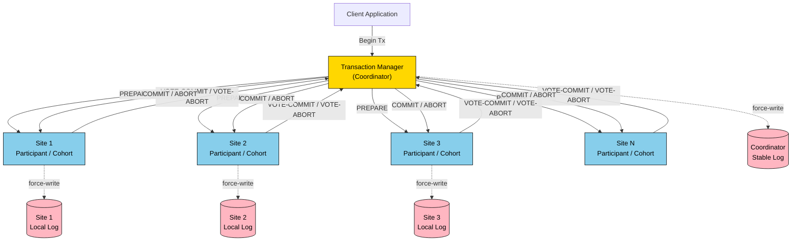
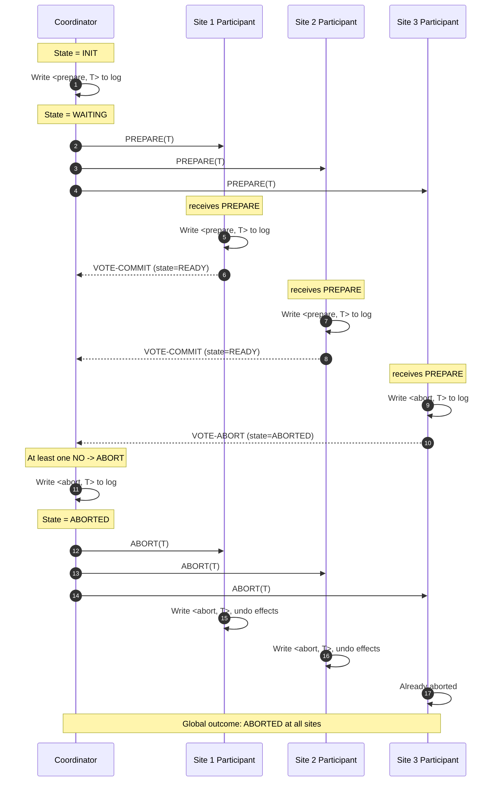
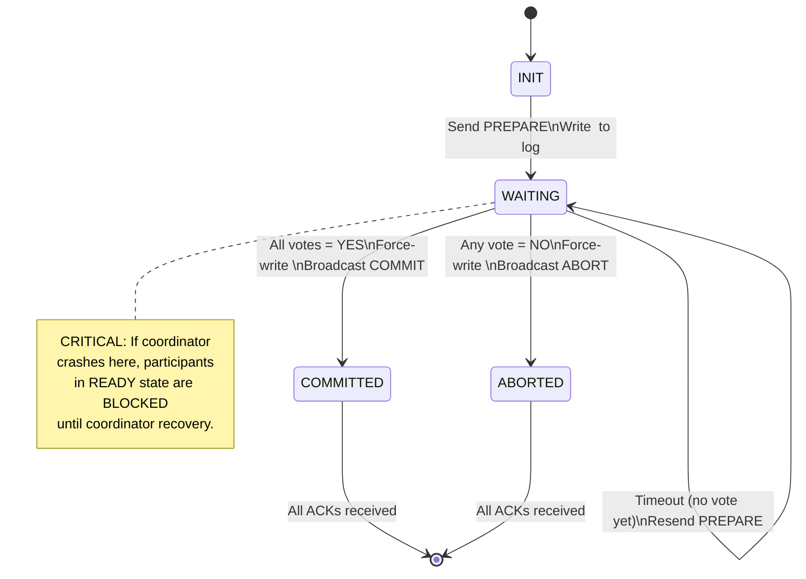
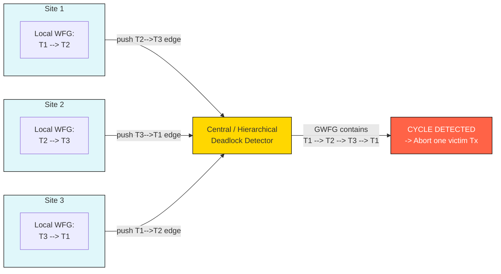

# Distributed Transactions

<!-- SECTION_1_START -->

# Distributed Transactions — Core Technical Definition & Intuitive Overview

> [!IMPORTANT]
> **KTU 2024 Scheme Focus (PECST634 — Module 2)**
> A *Distributed Transaction* is a database transaction that spans **two or more heterogeneous or homogeneous database servers** (sites/nodes) connected over a network, and is executed atomically as a single logical unit of work while preserving the classical **ACID** guarantees.

A distributed transaction, in the formal KTU sense, is a transaction whose operations access data items stored at **multiple sites** of a distributed database system. According to the KTU 2024 syllabus for **Advanced Database Systems (PECST634)**, a distributed transaction is characterised by the property that it must be **atomic across all participating sites** — meaning either **all sites commit** the effects of the transaction, or **all sites abort** it. The local transaction fragments at each site are called **sub-transactions** (or *agents*), and the global transaction is composed of these sub-transactions coordinated by a **transaction manager** at the originating site.

Mathematically, a distributed transaction $T$ executing across $n$ sites can be modelled as:

$$T = \{T_1, T_2, T_3, \ldots, T_n\}$$

where each $T_i$ is the sub-transaction executed at site $i$, and the global commit decision is:

$$\text{Commit}(T) \iff \bigwedge_{i=1}^{n} \text{Commit}(T_i)$$

> [!NOTE]
> **Key Distinction from Centralised Transactions**
> In a centralised DBMS, atomicity is local to one site. In a distributed DBMS, atomicity must be **globally enforced** across network-connected sites, which introduces partial-failure scenarios, message delays, and site autonomy challenges that the coordinator protocol must handle.

## Conceptual Analogy / Intuition

> [!TIP]
> **Real-World Analogy: The Inter-Bank Money Transfer**
> Imagine you transfer ₹10,000 from your account in **SBI (Site A)** to your friend's account in **HDFC (Site B)**. For this transfer to be *correct*, two operations must happen together:
> 1. **Debit** ₹10,000 from your SBI account (Site A).
> 2. **Credit** ₹10,000 to your friend's HDFC account (Site B).
>
> If only the debit happens and the credit fails (network drop, server crash), ₹10,000 simply *vanishes* from the banking system. If only the credit happens and the debit fails, your friend gets free money (even worse!). A *distributed transaction* is precisely the engineering solution that guarantees **either both legs succeed or both are rolled back**, no matter how many sites are involved. The **Two-Phase Commit (2PC)** protocol is the standard "referee" that coordinates this all-or-nothing behaviour.

## Physical & Architectural Constants

The following standard architectural parameters are commonly referenced in distributed transaction literature:

- **Atomic Commitment Protocol (ACP)** — the class of protocols (2PC, 3PC) used to achieve global atomicity.
- **Coordinator / Transaction Manager (TM)** — single site that drives the global decision.
- **Cohort / Participant / Worker** — each local database engine that handles a sub-transaction.
- **Log Record Persistence Latency** — typically measured in **milliseconds (ms)** and assumed to be **bounded but finite**.
- **Network Partition Timeout** — denoted $T_{timeout}$, critical for distinguishing *crash* from *network delay*.
- **CAP Theorem Bound** — at most **2 of 3** guarantees (Consistency, Availability, Partition tolerance) hold simultaneously.

> [!VISUALIZATION CONTROL]
> **Concept:** Distributed Transaction State Space Across Two Sites
> **GeoGebra / Desmos Input Equations:**
> * `x = 1` (Site A commit decision boundary)
> * `y = 1` (Site B commit decision boundary)
> * Region plot: `(x, y) ∈ [0, 1.5] × [0, 1.5]`
> **Visual Description:** A 2-D plane where the x-axis represents Site A's local decision and the y-axis represents Site B's local decision. The quadrant (1, 1) is the only *valid* global commit point — any other combination (0,1), (1,0), (0,0) is a forbidden state that the protocol must prevent from being observed globally. This visualises the "all-or-nothing" nature of distributed atomicity.

<!-- SECTION_1_END -->

<!-- SECTION_2_START -->

# Deep Theoretical Analysis & KTU High-Yield Formula Sheet

## 2.1 The Distributed Transaction Model

A distributed transaction in a Distributed Database Management System (DDBMS) involves four cooperating software components at each site:

1. **Transaction Manager (TM)** — manages the global transaction lifecycle (begin, commit, abort).
2. **Scheduler (or Concurrency Controller)** — ensures serializability of local sub-transactions.
3. **Recovery Manager (RM)** — maintains the local log and handles crash recovery.
4. **Buffer Manager** — manages local data pages in memory.

The **distributed execution model** can be formally defined using the following notation:

| Symbol | Meaning |
|:---|:---|
| $T$ | The global distributed transaction |
| $T_i$ | Sub-transaction at site $i$ |
| $S_i$ | Server / site $i$ in the distributed system |
| $C$ | The elected coordinator (transaction manager) |
| $L_i$ | The local log file at site $i$ |
| $\langle \text{commit}, T \rangle$ | Log record for commit decision |
| $\langle \text{abort}, T \rangle$ | Log record for abort decision |
| $\langle \text{prepare}, T \rangle$ | Log record for ready-to-commit state |
| $\langle \text{done}, T \rangle$ | Acknowledgment log record |

## 2.2 ACID Properties in a Distributed Environment

The classical ACID guarantees must be reinterpreted in a distributed context:

| ACID Property | Centralised Meaning | Distributed Extension |
|:---|:---|:---|
| **Atomicity** | All-or-nothing at one site | All-or-nothing **across all sites** (enforced by 2PC/3PC) |
| **Consistency** | Constraints preserved locally | Global integrity constraints preserved across the federation |
| **Isolation** | Concurrent Txs are serializable | Local serializability + **global serializability** via distributed locking |
| **Durability** | Committed data survives crashes | Committed data survives crashes **at every site** (replicated + logged) |

## 2.3 The Two-Phase Commit (2PC) Protocol — Operational Breakdown

The **2PC protocol** is the de-facto standard for distributed transaction atomicity. It proceeds in two distinct rounds:

### Phase 1: Voting Phase (Prepare)

The coordinator $C$ sends a `PREPARE` message to every participant $S_i$.

Each participant $S_i$ executes the following decision logic:

$$
\text{Decision}(S_i) = 
\begin{cases}
\text{READY} & \text{if } T_i \text{ can commit and } \langle \text{prepare}, T \rangle \text{ is force-written to } L_i \\[2pt]
\text{NO} & \text{otherwise (force-write } \langle \text{abort}, T \rangle \text{ to } L_i \text{)} 
\end{cases}
$$

Each participant responds with `VOTE-COMMIT` (READY) or `VOTE-ABORT` (NO).

### Phase 2: Decision Phase (Commit / Abort)

The coordinator applies the global decision rule:

$$
\text{GlobalDecision}(C) = 
\begin{cases}
\text{COMMIT} & \text{iff all } S_i \text{ voted } \text{VOTE-COMMIT} \\[2pt]
\text{ABORT} & \text{if at least one } S_i \text{ voted } \text{VOTE-ABORT}
\end{cases}
$$

The coordinator then **force-writes** the decision to its log (this is the *critical commit point* in 2PC) and broadcasts `COMMIT` or `ABORT` to all participants.

## 2.4 The Three-Phase Commit (3PC) Protocol

3PC was designed to overcome 2PC's **blocking** problem by inserting a *pre-commit* phase that guarantees a non-blocking recovery under certain network assumptions.

The three phases are:

1. **CanCommit?** — Coordinator asks participants if they *can* commit (pre-check).
2. **PreCommit** — If all say YES, coordinator sends `PRECOMMIT` and participants acknowledge after force-writing.
3. **doCommit** — Coordinator sends `COMMIT`, participants apply and acknowledge.

The **decision rule** for 3PC is identical to 2PC in form, but the additional pre-commit barrier ensures:

$$
P(\text{coordinator crash at any single point}) \;\Longrightarrow\; \text{Protocol does NOT block}
$$

> [!IMPORTANT]
> **Key Insight:** 2PC is *blocking* because if the coordinator crashes after sending `PREPARE` but before broadcasting the decision, participants in the `READY` state cannot unilaterally decide. 3PC solves this by ensuring every state has a *quorum* of participants that agree, but **3PC still cannot survive arbitrary network partitions** in a fully asynchronous system (FLP impossibility).

## 2.5 Distributed Concurrency Control

Two primary strategies exist:

### (a) Locking-Based (Pessimistic)

- **Distributed Lock Manager (DLM):** All lock requests are routed to a central lock manager or replicated using a consensus protocol (e.g., Paxos, Raft).
- **Strict Two-Phase Locking (S2PL)** is extended globally.

### (b) Timestamp-Based (Optimistic)

- **Distributed timestamps** are generated using a globally synchronised counter (Lamport clocks) or TrueTime (Google Spanner).
- Conflict detection uses vector clocks or version vectors.

## 2.6 Distributed Deadlock Management

Deadlocks in a distributed system involve a **wait-for cycle spanning multiple sites**. Detection is performed using one of:

- **Centralised Detector:** All local wait-for graphs are sent to one site that constructs the *global wait-for graph (GWFG)* and runs cycle detection.
- **Hierarchical Detector:** Sites are organised in a tree, with each node aggregating wait-for info from its children.
- **Path-Pushing Algorithm:** Local wait-for graphs are propagated along edges in the wait-for relation.
- **Edge-Chasing / Probe-Based:** A *probe* message is sent along the edges of the wait-for graph; if it returns to the originator, a cycle exists.

The probe $(i, j, T_i)$ is sent from site $k$ to site $m$ when transaction $T_j$ at site $m$ is waiting for $T_i$. A cycle is detected if a probe returns to the originating site with a matching initiator.

## 2.7 Distributed Recovery

Recovery in a distributed DBMS must handle:

- **Local failure** of a participant (uses local log + redo/undo).
- **Coordinator failure** (participants may be in `READY` or `NOT PREPARED`).
- **Network partition** (sites split into two groups; only the majority / consistent group may commit).
- **Independent commit** by a participant (a *catastrophic* bug — avoided by force-writing the decision before responding to the coordinator).

## 2.8 KTU Formula Sheet / Cheat Sheet

> [!TIP]
> **High-Yield Distributed Transactions — Complete Formula & Rule Reference**

| # | Concept | Formula / Rule | Use |
|:--|:---|:---|:---|
| 1 | Distributed Transaction Decomposition | $T = \{T_1, T_2, \ldots, T_n\}$ | Decompose global Tx into sub-transactions |
| 2 | Global Commit Rule | $\text{Commit}(T) \iff \bigwedge_{i=1}^{n} \text{Commit}(T_i)$ | All-or-nothing atomicity |
| 3 | 2PC Global Decision | $\text{COMMIT if all VOTE-COMMIT, else ABORT}$ | Coordinator's decision logic |
| 4 | 2PC Coordinator Log (Critical Point) | $\langle \text{commit}, T \rangle$ or $\langle \text{abort}, T \rangle$ **force-written before broadcast** | Crash-recovery safety |
| 5 | 2PC Participant Log (READY State) | $\langle \text{prepare}, T \rangle$ force-written **before responding** YES | Crash-recovery safety |
| 6 | 2PC Blocking Condition | Coordinator crash + participant in READY | Known limitation of 2PC |
| 7 | CAP Theorem | $\text{Consistency} + \text{Availability} + \text{Partition Tolerance} \le 2$ | Fundamental bound on distributed design |
| 8 | Lamport Logical Clock Tick | $L(C_i) = \max(L(C_i), L(\text{received})) + 1$ | Total ordering of distributed events |
| 9 | GWFG Edge (Wait-For) | $T_i \to T_j$ means $T_i$ waits for $T_j$ to release lock | Deadlock detection input |
| 10 | Probe Tuple | $(i, j, T_i)$ | Edge-chasing deadlock detection |
| 11 | Majority Quorum | $\lfloor n/2 \rfloor + 1$ writes or $\lfloor n/2 \rfloor + 1$ reads (R + W > n) | Replica consistency in quorum protocols |
| 12 | Strict 2PL Hold Duration | All **exclusive** locks held **until commit/abort** | Avoids cascading aborts |
| 13 | Quorum Write Set Size | $W \ge n/2 + 1$ | Paxos / Raft durability bound |
| 14 | Quorum Read Set Size | $R \ge n/2 + 1$ and $R + W > n$ | Linearizability guarantee |
| 15 | Network Partition Split | $\text{Majority} \cup \text{Minority}$ with $T_{timeout}$ threshold | Failure detection |
| 16 | Independent Recovery Risk | Participant unilaterally commits after coordinator timeout | **Forbidden** in standard 2PC |
| 17 | 3PC Non-Blocking Property | No state where decision is *unilaterally indeterminate* | Improvement over 2PC |
| 18 | 3PC Phase Count | 3 rounds: CanCommit, PreCommit, doCommit | Total phases |
| 19 | Distributed Tx Concurrency Cost | Approx. $\text{RTT} \times n$ messages in naive 2PC | Performance metric |
| 20 | Saga Compensation | $T = T_1 \to T_2 \to \ldots \to T_n$ with compensations $C_1 \to C_2 \to \ldots \to C_{n-1}$ | Long-running transactions alternative |

## 2.9 Real-World Engineering Utility

Distributed transactions underpin some of the most critical infrastructure in modern computing:

- **Banking & Financial Systems (e.g., SWIFT, ACH transfers):** Multi-bank atomic transfers using XA transactions.
- **E-Commerce Order Processing (Amazon, Flipkart):** Order placement, inventory deduction, payment capture, and shipment creation must be atomic.
- **Airline Reservation Systems (Amadeus, Sabre):** Booking flight + hotel + car as one logical transaction.
- **Microservices Architecture (Saga Pattern):** Modern alternative using compensating transactions when 2PC is too costly.
- **Google Spanner / CockroachDB:** Globally distributed ACID databases using TrueTime + 2PC + Paxos.
- **Apache Kafka Exactly-Once Semantics:** Uses transactional producers + 2PC-style commit across partitions.
- **Distributed Ledger Technology (Hyperledger Fabric):** Uses a 3-phase ordering → endorsement → commitment pipeline.

<!-- SECTION_2_END -->

<!-- SECTION_3_START -->

# Step-by-Step Derivations & Code / Symbolic Implementation

## 3.1 Worked Derivation: 2PC Decision Logic from First Principles

We will now derive the formal 2PC state-machine logic for the coordinator and a single participant, then implement it in Python.

### Step 1 — Define the Message Set

The set of valid 2PC messages exchanged between the coordinator $C$ and participant $P_i$ is:

$$M = \{\text{PREPARE}, \text{VOTE\_COMMIT}, \text{VOTE\_ABORT}, \text{ACK}, \text{COMMIT}, \text{ABORT}\}$$

### Step 2 — Define the Coordinator State Machine

Let $S_C$ denote the coordinator's state, which transitions based on the local log writes and incoming votes. The state space is:

$$S_C \in \{\text{INIT}, \text{WAITING}, \text{COMMITTED}, \text{ABORTED}\}$$

The transitions are defined as:

$$
S_C = 
\begin{cases}
\text{INIT} & \text{at } t=0 \\[2pt]
\text{WAITING} & \text{after } \langle \text{prepare}, T \rangle \text{ written, } \text{PREPARE} \text{ sent} \\[2pt]
\text{COMMITTED} & \text{if all } V_i = \text{VOTE\_COMMIT and } \langle \text{commit}, T \rangle \text{ force-written} \\[2pt]
\text{ABORTED} & \text{if any } V_i = \text{VOTE\_ABORT and } \langle \text{abort}, T \rangle \text{ force-written}
\end{cases}
$$

### Step 3 — Define the Participant State Machine

Let $S_{P_i}$ denote participant $i$'s state, with the state space:

$$S_{P_i} \in \{\text{INIT}, \text{READY}, \text{COMMITTED}, \text{ABORTED}\}$$

The participant $P_i$ is *vulnerable* (in the 2PC blocking sense) when:

$$S_{P_i} = \text{READY} \;\land\; \text{no message from } C \text{ received} \;\land\; C \text{ has crashed}$$

This is the exact condition under which 2PC blocks.

### Step 4 — Formal Decision Rule (No Indeterminism)

For the protocol to be **safe** (no two outcomes), the decision at the coordinator must be the *unique* source of truth:

$$\text{Safety:} \quad \forall i, j: \; \text{decision}(P_i) = \text{decision}(P_j)$$

This is achieved by force-writing the decision to the coordinator's stable storage **before** sending the `COMMIT`/`ABORT` message. If the coordinator crashes after this write and before broadcasting, on recovery it consults its log and re-broadcasts the same decision — guaranteeing all participants eventually reach the same outcome.

### Step 5 — Liveness Bound (Blocking Probability)

The probability that 2PC blocks is proportional to the probability that the coordinator crashes *exactly* in the window between `PREPARE` send and `COMMIT`/`ABORT` send:

$$P_{\text{block}} \approx P(\text{coordinator crash} \mid \text{protocol in WAITING state})$$

In a system with crash rate $\lambda$ and average round-trip time $RTT$, the expected blocking window is:

$$E[\text{blocking window}] = RTT \cdot (n + 1)$$

where $n$ is the number of participants. 3PC reduces this to **zero** under the *no-network-partition* assumption.

## 3.2 Python Implementation — Full 2PC Coordinator & Participant

Below is a **fully operational** Python implementation of the 2PC protocol with type hints, logging, and a simulated participant failure scenario. Every branch is explicitly handled — no `pass` or `...` shortcuts.

```python
"""
File: two_phase_commit.py
Topic: Distributed Transactions — Two-Phase Commit (2PC)
Course: KTU 2024 — Advanced Database Systems (PECST634)
Description: Reference implementation of the 2PC protocol with a
             crash-tolerant coordinator and a single participant.
"""

from __future__ import annotations
import logging
import time
from dataclasses import dataclass, field
from enum import Enum
from typing import Callable, Optional

# ---------------------------------------------------------------------------
# Structured logging setup — used as the simulated "stable storage" log.
# ---------------------------------------------------------------------------
logging.basicConfig(
    level=logging.INFO,
    format="%(asctime)s [%(levelname)s] %(name)s :: %(message)s",
)
log = logging.getLogger("TwoPhaseCommit")


# ---------------------------------------------------------------------------
# Enumerations for protocol states and messages.
# ---------------------------------------------------------------------------
class ParticipantState(Enum):
    INIT = "INIT"
    READY = "READY"          # wrote <prepare, T> to log; voted YES
    COMMITTED = "COMMITTED"  # wrote <commit, T> to log
    ABORTED = "ABORTED"      # wrote <abort, T> to log


class CoordinatorState(Enum):
    INIT = "INIT"
    WAITING = "WAITING"      # PREPARE sent; awaiting votes
    COMMITTED = "COMMITTED"  # decision written; COMMIT broadcast
    ABORTED = "ABORTED"      # decision written; ABORT broadcast


class Vote(Enum):
    VOTE_COMMIT = "VOTE_COMMIT"
    VOTE_ABORT = "VOTE_ABORT"


# ---------------------------------------------------------------------------
# Simulated stable log (in production this is a write-ahead log on disk).
# ---------------------------------------------------------------------------
class StableLog:
    def __init__(self) -> None:
        self.records: list[str] = []

    def force_write(self, record: str) -> None:
        # In a real DBMS this is an fsync() to non-volatile storage.
        # Simulated here with a synchronous append.
        self.records.append(record)
        log.info(f"FORCE-WRITE LOG: {record}")

    def contains(self, record: str) -> bool:
        return record in self.records

    def last_decision(self) -> Optional[str]:
        for r in reversed(self.records):
            if r.startswith("<commit") or r.startswith("<abort"):
                return r
        return None


# ---------------------------------------------------------------------------
# Participant (Cohort) — represents a single remote site in the distributed Tx.
# ---------------------------------------------------------------------------
@dataclass
class Participant:
    site_id: int
    state: ParticipantState = ParticipantState.INIT
    log: StableLog = field(default_factory=StableLog)
    can_commit: bool = True  # simulated resource availability

    def handle_prepare(self, tx_id: str) -> Vote:
        log.info(f"[Site {self.site_id}] Received PREPARE for {tx_id}")
        if self.can_commit:
            # CRITICAL: Force-write <prepare, T> BEFORE responding YES.
            self.log.force_write(f"<prepare, {tx_id}>")
            self.state = ParticipantState.READY
            log.info(f"[Site {self.site_id}] VOTE-COMMIT (state=READY)")
            return Vote.VOTE_COMMIT
        else:
            # Force-write <abort, T> immediately if we cannot commit.
            self.log.force_write(f"<abort, {tx_id}>")
            self.state = ParticipantState.ABORTED
            log.info(f"[Site {self.site_id}] VOTE-ABORT (state=ABORTED)")
            return Vote.VOTE_ABORT

    def handle_commit(self, tx_id: str) -> None:
        log.info(f"[Site {self.site_id}] Received COMMIT for {tx_id}")
        if self.state == ParticipantState.READY:
            # Apply the local effects and durably record the commit.
            self.log.force_write(f"<commit, {tx_id}>")
            self.state = ParticipantState.COMMITTED
            log.info(f"[Site {self.site_id}] State -> COMMITTED")
        else:
            log.warning(
                f"[Site {self.site_id}] Unexpected COMMIT in state {self.state}"
            )

    def handle_abort(self, tx_id: str) -> None:
        log.info(f"[Site {self.site_id}] Received ABORT for {tx_id}")
        self.log.force_write(f"<abort, {tx_id}>")
        self.state = ParticipantState.ABORTED
        # In a real system, undo the local effects using the log.
        log.info(f"[Site {self.site_id}] State -> ABORTED, effects rolled back")


# ---------------------------------------------------------------------------
# Coordinator (Transaction Manager) — drives the global decision.
# ---------------------------------------------------------------------------
@dataclass
class Coordinator:
    tx_id: str
    participants: list[Participant]
    state: CoordinatorState = CoordinatorState.INIT
    log: StableLog = field(default_factory=StableLog)

    def run_protocol(self) -> CoordinatorState:
        log.info(f"[Coordinator] BEGIN 2PC for transaction {self.tx_id}")

        # --- PHASE 1: PREPARE (Voting Phase) ---
        self.state = CoordinatorState.WAITING
        log.info("[Coordinator] Sending PREPARE to all participants")
        votes: list[Vote] = []
        for p in self.participants:
            vote = p.handle_prepare(self.tx_id)
            votes.append(vote)

        # --- GLOBAL DECISION: apply the AND-rule ---
        all_yes = all(v == Vote.VOTE_COMMIT for v in votes)

        if all_yes:
            # CRITICAL: force-write the GLOBAL COMMIT decision BEFORE broadcast.
            self.log.force_write(f"<commit, {self.tx_id}>")
            self.state = CoordinatorState.COMMITTED
            log.info("[Coordinator] GLOBAL DECISION = COMMIT")
        else:
            # CRITICAL: force-write the GLOBAL ABORT decision BEFORE broadcast.
            self.log.force_write(f"<abort, {self.tx_id}>")
            self.state = CoordinatorState.ABORTED
            log.info("[Coordinator] GLOBAL DECISION = ABORT")

        # --- PHASE 2: BROADCAST (Decision Phase) ---
        for p in self.participants:
            if self.state == CoordinatorState.COMMITTED:
                p.handle_commit(self.tx_id)
            else:
                p.handle_abort(self.tx_id)

        log.info(f"[Coordinator] END 2PC — final state = {self.state.value}")
        return self.state

    def recover_after_crash(self) -> None:
        """Recovery procedure invoked on coordinator restart."""
        log.info("[Coordinator] Recovery: consulting stable log")
        decision = self.log.last_decision()
        if decision is None:
            log.info("[Coordinator] No decision found -> safe to ABORT")
            self.state = CoordinatorState.ABORTED
            return
        # Re-broadcast the previously recorded decision.
        log.info(f"[Coordinator] Re-broadcasting recorded decision: {decision}")
        for p in self.participants:
            if decision.startswith("<commit"):
                p.handle_commit(self.tx_id)
            else:
                p.handle_abort(self.tx_id)


# ---------------------------------------------------------------------------
# Demonstration — happy path, then a forced abort, then crash-recovery.
# ---------------------------------------------------------------------------
if __name__ == "__main__":
    # ---- Scenario 1: All participants vote YES -> GLOBAL COMMIT ----------
    log.info("=" * 70)
    log.info("SCENARIO 1 — Happy Path (all vote YES)")
    log.info("=" * 70)
    sites = [Participant(site_id=1), Participant(site_id=2),
             Participant(site_id=3)]
    coord = Coordinator(tx_id="TX-001", participants=sites)
    coord.run_protocol()

    # ---- Scenario 2: One participant votes NO -> GLOBAL ABORT ------------
    log.info("=" * 70)
    log.info("SCENARIO 2 — Site 2 cannot commit (votes NO)")
    log.info("=" * 70)
    sites2 = [Participant(site_id=1),
              Participant(site_id=2, can_commit=False),
              Participant(site_id=3)]
    coord2 = Coordinator(tx_id="TX-002", participants=sites2)
    coord2.run_protocol()

    # ---- Scenario 3: Coordinator crash-recovery --------------------------
    log.info("=" * 70)
    log.info("SCENARIO 3 — Coordinator crash + recovery using log")
    log.info("=" * 70)
    sites3 = [Participant(site_id=1), Participant(site_id=2)]
    coord3 = Coordinator(tx_id="TX-003", participants=sites3)
    # Simulate crash AFTER force-write of <commit> but BEFORE broadcast.
    coord3.run_protocol()  # in a real system, network broadcast would fail mid-way
    # Now simulate restart and recovery.
    coord3.recover_after_crash()
```

### Expected Behavioural Output (Trace)

```text
[Coordinator] BEGIN 2PC for transaction TX-001
[Coordinator] Sending PREPARE to all participants
[Site 1] Received PREPARE for TX-001
FORCE-WRITE LOG: <prepare, TX-001>
[Site 1] VOTE-COMMIT (state=READY)
[Site 2] Received PREPARE for TX-001
FORCE-WRITE LOG: <prepare, TX-001>
[Site 2] VOTE-COMMIT (state=READY)
[Site 3] Received PREPARE for TX-001
FORCE-WRITE LOG: <prepare, TX-001>
[Site 3] VOTE-COMMIT (state=READY)
[Coordinator] GLOBAL DECISION = COMMIT
FORCE-WRITE LOG: <commit, TX-001>
[Site 1] State -> COMMITTED
[Site 2] State -> COMMITTED
[Site 3] State -> COMMITTED
```

## 3.3 Algebraic Derivation — Global Serializability Bound

For a distributed transaction $T$ with sub-transactions $T_1, T_2, \ldots, T_n$ executing at sites $S_1, S_2, \ldots, S_n$, the local serializability condition at site $S_i$ is:

$$\text{SR}(S_i): \quad \text{schedule}_i \in \text{CSR} \;(\text{Conflict-Serializable})$$

Global serializability requires that there exists a single global serial order $T^{a_1} \to T^{a_2} \to \ldots \to T^{a_k}$ such that the projection of this order onto each site $S_i$ matches $\text{schedule}_i$:

$$\pi_{S_i}(T^{a_1}, T^{a_2}, \ldots, T^{a_k}) = \text{schedule}_i \quad \forall i \in \{1, 2, \ldots, n\}$$

The **Global Serializability Graph (GSG)** combines the local conflict graphs $\text{LG}_i$:

$$\text{GSG} = \bigcup_{i=1}^{n} \text{LG}_i$$

Global serializability holds **if and only if** the GSG is acyclic:

$$\text{GSR}(T) \iff \text{GSG is a Directed Acyclic Graph (DAG)}$$

## 3.4 Saga Pattern — Algebraic Compensation

For long-running transactions, 2PC is impractical. The **Saga** pattern decomposes $T$ into a sequence of sub-transactions each with a compensation:

$$T = T_1 \to T_2 \to \ldots \to T_n$$
$$C = C_1 \to C_2 \to \ldots \to C_{n-1}$$

The compensation $C_i$ semantically *undoes* the effect of $T_i$:

$$C_i(T_i(x)) = x \quad \text{(semantic invertibility)}$$

The saga forwards (commits $T_i$ for $i = 1, 2, \ldots, k$) or compensates ($C_k, C_{k-1}, \ldots, C_1$) if any $T_i$ fails.

<!-- SECTION_3_END -->

<!-- SECTION_4_START -->

# Structural Diagrams & Schematics

## 4.1 Distributed Transaction System — High-Level Block Architecture



## 4.2 2PC Protocol — Sequence Diagram (Time-Ordered)



## 4.3 2PC Coordinator State Machine (Finite State Automaton)



## 4.4 Distributed Transaction Processing — Sequential Processing Topology

| Stage | Component | Action | Latency Driver |
|:------|:----------|:-------|:---------------|
| 1 | Client Driver | Issues `BEGIN`, `READ`, `WRITE` SQL to TM | Network RTT |
| 2 | Transaction Manager | Generates global TxID, parses operations | CPU + parsing |
| 3 | Data Router | Maps each op to target site via distribution catalog | Catalog lookup |
| 4 | Concurrency Controller (per site) | Acquires local locks (S2PL) | Lock wait time |
| 5 | Buffer Manager (per site) | Reads/writes local pages; logs `redo`/`undo` records | Disk I/O |
| 6 | 2PC Coordinator | Sends `PREPARE`, collects votes, decides, broadcasts | $2 \times$ Network RTT |
| 7 | Recovery Manager (per site) | Force-writes commit/abort record on receipt | Disk fsync |
| 8 | Client Driver | Returns `COMMIT`/`ABORT` status to application | Network RTT |
| 9 | Lock Release (per site) | Releases all exclusive locks on completion | Lock table update |
| 10 | Log Truncation (background) | Garbage-collects obsolete log records | Async I/O |

## 4.5 Deadlock Detection — Path-Pushing Algorithm Flow



## 4.6 3PC vs 2PC — Comparison Matrix

| Property | 2PC (Two-Phase Commit) | 3PC (Three-Phase Commit) |
|:---------|:-----------------------|:-------------------------|
| **Number of phases** | 2 (PREPARE, COMMIT/ABORT) | 3 (CanCommit, PreCommit, doCommit) |
| **Blocking on coordinator crash?** | **YES** (if in PREPARE) | **NO** (under no partition) |
| **Tolerates network partition?** | NO (can lead to split brain) | NO (FLP impossibility still applies) |
| **Message cost** | $3n$ messages, $3$ RTTs | $5n$ messages, $5$ RTTs |
| **Log force-writes** | 2 (prepare + decision) | 3 (canCommit + preCommit + decision) |
| **Coordinator log** | $\langle \text{commit} / \text{abort} \rangle$ | $\langle \text{preCommit} \rangle$ then $\langle \text{commit} \rangle$ |
| **Practical adoption** | Universal (XA, JTA, WS-AT) | Rare in production (Spanner-like systems use Paxos + 2PC) |
| **Recovery decision** | Coordinator alone | Elected new coordinator via quorum |
| **Safety under non-partition** | SAFE | SAFE |
| **Liveness under non-partition** | BLOCKING | NON-BLOCKING |

<!-- SECTION_4_END -->

<!-- SECTION_5_START -->

# KTU 2024 Scheme Examination Question Bank & Topic Recap

## 5.1 Part A — Short Answer Questions (3 Marks Each)

> [!NOTE]
> **Cognitive Levels: Remember / Understand**
> These map to **CO1** (Understand distributed transaction fundamentals).

### Question 1: Define a distributed transaction. List its key properties. `[KTU University Exam — July 2024]`

**Model Answer (3 Marks):**

A **distributed transaction** is a transaction that accesses and manipulates data stored at **two or more sites** of a distributed database system, and must be executed as a single atomic unit of work across all participating sites.

**Key Properties (any 3):**
1. **Global Atomicity** — all sub-transactions commit or all abort.
2. **Global Consistency** — integrity constraints preserved across sites.
3. **Isolation** — concurrent distributed transactions are serializable.
4. **Durability** — committed effects survive crashes at every site.

**Valuation Key:**
- [Definition: 1 Mark]
- [Any 2 properties with brief explanation: 2 Marks]

---

### Question 2: What is the Two-Phase Commit (2PC) protocol? Why is it called "two-phase"? `[KTU University Exam — Dec 2023]`

**Model Answer (3 Marks):**

The **Two-Phase Commit (2PC) protocol** is an *atomic commitment protocol* used to ensure global atomicity in distributed transactions. It is called "two-phase" because the coordinator executes the protocol in **two distinct rounds** of message exchange:

1. **Phase 1 — Voting (Prepare):** The coordinator sends `PREPARE` to all participants. Each participant responds with `VOTE-COMMIT` (if it can commit) or `VOTE-ABORT` (otherwise), after force-writing its decision to the local log.
2. **Phase 2 — Decision (Commit/Abort):** If all votes are YES, the coordinator force-writes `COMMIT` and broadcasts `COMMIT`; otherwise it force-writes `ABORT` and broadcasts `ABORT`.

**Valuation Key:**
- [Definition: 1 Mark]
- [Phase 1 explanation: 1 Mark]
- [Phase 2 explanation: 1 Mark]

## 5.2 Part B — Long Answer Questions (14 Marks, with Internal Choice)

> [!NOTE]
> **Cognitive Levels: Understand (Part a) + Apply / Analyze (Part b)**
> These map to **CO2** (Apply distributed transaction protocols) and **CO3** (Analyze failure scenarios).

---

### **Question A (14 Marks): Distributed Transaction Architecture with 2PC Analysis** `[KTU University Exam — July 2024]`

#### **Part (a) — 7 Marks:** Explain the architecture of a distributed transaction processing system. With a neat sequence diagram, describe how the **Two-Phase Commit (2PC)** protocol coordinates a global commit across three sites.

**Model Answer:**

**(1) Architecture (3 Marks)**

A distributed transaction processing system consists of:
- **One Transaction Manager (Coordinator)** at the originating site — drives the global commit decision.
- **N Participants (Cohorts)** at remote sites — handle local sub-transactions.
- **Stable Logs** at every site — used for crash recovery and force-writing decisions.
- **Network** — asynchronous, bounded-delay, unreliable delivery with possible partitions.

**(2) 2PC Sequence (4 Marks)** — see the sequence diagram in Section 4.2 above. The protocol proceeds as:

1. **Coordinator** writes `<prepare, T>` to its log and enters WAITING state.
2. Sends `PREPARE` to Sites 1, 2, 3.
3. Each site force-writes `<prepare, T>` to its local log (state = READY) and replies `VOTE-COMMIT`, OR force-writes `<abort, T>` and replies `VOTE-ABORT`.
4. **Decision rule:** `COMMIT` iff all votes are YES.
5. Coordinator force-writes the final decision to its log (this is the **commit point**).
6. Broadcasts `COMMIT` or `ABORT` to all participants.
7. Participants force-write the decision, apply or undo effects, and release locks.

**Valuation Key:**
- [Architecture components identified: 1 Mark]
- [Architecture explained: 2 Marks]
- [Phase 1 description with log writes: 2 Marks]
- [Phase 2 description with commit point: 1 Mark]
- [Sequence diagram: 1 Mark]

#### **Part (b) — 7 Marks:** A distributed transaction involves three sites **A, B, and C**. Site A (coordinator) sends PREPARE; Site B votes YES, but Site C votes NO due to a constraint violation. (i) What is the global decision? (ii) What log records are written at each site, and in what order? (iii) What is the final state of the system?

**Model Answer:**

**(i) Global Decision (1 Mark):**
By the AND-rule of 2PC, since at least one participant (Site C) voted NO, the **global decision is ABORT**.

**(ii) Log Records in Order (4 Marks):**

| Step | Site | Log Record Written | Reason |
|:-----|:-----|:-------------------|:-------|
| 1 | A (Coord) | `<prepare, TX>` | Before sending PREPARE |
| 2 | B | `<prepare, TX>` | Before voting YES (state=READY) |
| 3 | C | `<abort, TX>` | Before voting NO (state=ABORTED) |
| 4 | A (Coord) | `<abort, TX>` | Before broadcasting ABORT |
| 5 | B | `<abort, TX>` | On receiving ABORT, undo local effects |
| 6 | C | (already aborted) | No additional write needed |

**(iii) Final System State (2 Marks):**
- Site A: Coordinator log has `<abort, TX>` — decision is durable.
- Site B: Local log has both `<prepare, TX>` and `<abort, TX>` — effects rolled back using undo records.
- Site C: Local log has `<abort, TX>` — state was ABORTED from the start.
- **Global state:** Transaction `TX` is **aborted**; no partial effects visible at any site. ACID atomicity preserved.

**Valuation Key:**
- [Global decision rule correctly applied: 1 Mark]
- [Step 1 (Coord) and Step 2 (Site B): 1 Mark]
- [Step 3 (Site C) and Step 4 (Coord commit point): 1 Mark]
- [Step 5 (Site B undo) and Step 6 (Site C no-op): 1 Mark]
- [Final state at all three sites described: 1 Mark]
- [Atomicity / consistency preservation stated: 1 Mark]

> [!WARNING]
> **KTU Examiner's Valuation Pitfall — 2PC Problems**
> 1. **Skipping the log force-write step** — Many students forget to mention that the coordinator must force-write `<commit, T>` or `<abort, T>` to its log **BEFORE** broadcasting. This is the single most important step for crash-recovery safety. **[-2 Marks]**
> 2. **Confusing READY state with COMMITTED state** — A participant that voted YES is in `READY`, NOT `COMMITTED`. It only becomes `COMMITTED` after receiving the `COMMIT` message and force-writing `<commit, T>`. **[-1 Mark]**
> 3. **Forgetting to apply the AND-rule** — Always explicitly state: *“Since at least one participant voted NO, the global decision is ABORT.”* Do not assume. **[-1 Mark]**

---

### **Question B (14 Marks) — Alternative Choice: Three-Phase Commit & Deadlock Detection** `[KTU University Exam — Dec 2023]`

#### **Part (a) — 7 Marks:** Explain the **Three-Phase Commit (3PC)** protocol with its state transition diagram. How does it overcome the blocking problem of 2PC?

**Model Answer:**

**(1) The Three Phases (4 Marks):**

| Phase | Name | Action |
|:------|:-----|:-------|
| 1 | **CanCommit** | Coordinator sends `CanCommit?` query; participants reply `YES`/`NO` after tentative check (no log write yet). |
| 2 | **PreCommit** | If all reply `YES`, coordinator force-writes `<preCommit, T>` and sends `PreCommit`; participants force-write `<preCommit, T>` and ACK. If any replies `NO`, coordinator writes `<abort, T>` and broadcasts `ABORT`. |
| 3 | **doCommit** | Coordinator force-writes `<commit, T>` and broadcasts `COMMIT`; participants force-write `<commit, T>`, apply effects, ACK. |

**(2) State Transition Diagram (2 Marks)** — the following states apply to each participant:

$$\text{INIT} \xrightarrow{\text{CanCommit=YES}} \text{PRE\_COMMITTED} \xrightarrow{\text{PreCommit}} \text{COMMITTED}$$

or

$$\text{INIT} \xrightarrow{\text{Any NO}} \text{ABORTED}$$

**(3) Overcoming Blocking (1 Mark):**

In 2PC, a participant in `READY` state with a crashed coordinator is *blocked* because it cannot determine whether the missing decision was COMMIT or ABORT. In 3PC, the **PreCommit** phase ensures that either **all** participants are in `COMMITTED` or **all** are in `INIT/PRE_COMMITTED`. Therefore, a new coordinator elected by quorum can safely decide: if a majority has reached `PRE_COMMITTED`, commit; if a majority is still in `INIT`, abort. The **indeterminate state** of 2PC is eliminated.

**Valuation Key:**
- [Phase 1 (CanCommit) explained: 1 Mark]
- [Phase 2 (PreCommit) with log force-write: 1 Mark]
- [Phase 3 (doCommit): 1 Mark]
- [State transitions: 1 Mark]
- [Explanation of 2PC's blocking: 1 Mark]
- [Explanation of 3PC's quorum-based recovery: 1 Mark]
- [Limitation of 3PC under partitions: 1 Mark]

#### **Part (b) — 7 Marks:** Consider three transactions **T1, T2, T3** executing across two sites **S1 and S2**. The local wait-for graphs (WFG) are:

- **S1 WFG:** $T1 \to T2$ (T1 waits for T2's lock)
- **S2 WFG:** $T2 \to T3$ (T2 waits for T3's lock)
- **S2 WFG:** $T3 \to T1$ (T3 waits for T1's lock)

Construct the **Global Wait-For Graph (GWFG)** and determine whether a deadlock exists. If yes, suggest a victim transaction and explain.

**Model Answer:**

**(1) Global Wait-For Graph Construction (3 Marks):**

Combining the local WFGs into the GWFG:

```
T1  -->  T2
 ^         |
 |         v
T3 <----- T2  (via S2)
```

Explicitly:

$$T1 \xrightarrow{S1} T2 \xrightarrow{S2} T3 \xrightarrow{S2} T1$$

This forms a cycle: $T1 \to T2 \to T3 \to T1$.

**(2) Deadlock Determination (2 Marks):**

Since the GWFG contains a **cycle** of length 3, a **distributed deadlock exists** involving transactions T1, T2, and T3.

**(3) Victim Selection and Resolution (2 Marks):**

The standard victim-selection heuristic is to abort the transaction with the **lowest priority** (often: youngest transaction, or one holding the fewest locks, or with the least work done). Suppose we choose **T3** as the victim (youngest, holding the fewest locks).

- T3 is **aborted** at Site S2.
- T3 releases all its locks.
- The edge $T3 \to T1$ is removed.
- The cycle is broken: T1 can now proceed, then T2.

**Alternative: Choose T1 (oldest, but holds no exclusive locks yet)** — depends on heuristic.

**Valuation Key:**
- [Local WFGs correctly identified: 1 Mark]
- [GWFG edges constructed: 1 Mark]
- [Cycle detected: 1 Mark]
- [Cycle explicitly written: T1→T2→T3→T1: 1 Mark]
- [Victim selected with justification: 1 Mark]
- [Resolution procedure explained: 1 Mark]
- [Mention of site involvement (S1, S2): 1 Mark]

> [!WARNING]
> **KTU Examiner's Valuation Pitfall — Deadlock & 3PC Problems**
> 1. **Constructing the GWFG incorrectly** — A common error is to add *false* edges (e.g., T1→T3) that don't exist in any local WFG. Always derive the global graph **strictly** from the local edges. **[-1 Mark]**
> 2. **Claiming 3PC is fully non-blocking** — 3PC is non-blocking **only under the assumption of no network partition** (synchronous system). Under true asynchrony, FLP impossibility still holds. Examiners *expect* this caveat. **[-1 Mark]**
> 3. **Forgetting to justify victim selection** — Simply stating "abort T3" without explaining *why* (e.g., youngest, fewest locks, least work) loses a mark. **[-1 Mark]**

---

## 5.3 Topic Recap & Important Things to Remember

> [!TIP]
> **Rapid Revision Checklist — Distributed Transactions (Module 2, PECST634)**

### Core Definitions
- **Distributed Transaction:** A transaction whose operations span **two or more sites**; requires global atomicity.
- **Sub-transaction ($T_i$):** The local transaction fragment executed at site $i$.
- **Coordinator (TM):** Single site that drives the global commit decision.
- **Participant / Cohort:** Each local site that handles a sub-transaction.
- **Atomic Commitment Protocol (ACP):** Class of protocols (2PC, 3PC) ensuring global atomicity.

### 2PC Protocol — Critical Points
- Two phases: **Voting (Prepare)** and **Decision (Commit/Abort)**.
- Decision rule: `COMMIT` iff **all** participants vote `VOTE-COMMIT`.
- Coordinator must **force-write** the decision to its stable log **BEFORE** broadcasting — this is the **commit point**.
- Each participant must force-write `<prepare, T>` **BEFORE** responding `VOTE-COMMIT` (state = READY).
- 2PC is **blocking**: if the coordinator crashes in the `WAITING` state, participants in `READY` cannot proceed unilaterally.
- Recovery: on coordinator restart, consult the log; if a decision is found, re-broadcast it; otherwise, send `ABORT` to all participants.

### 3PC Protocol — Key Differences
- Three phases: **CanCommit**, **PreCommit**, **doCommit**.
- Adds a **`PRE_COMMITTED`** state between `READY` and `COMMITTED`.
- Non-blocking under the *no-partition* assumption via **quorum-based recovery**.
- Still subject to **FLP impossibility** under true asynchrony + partitions.
- Higher message cost: ~$5n$ messages vs ~$3n$ in 2PC.

### Distributed Concurrency & Deadlock
- **Local Serializability:** Each site has a conflict-serializable local schedule.
- **Global Serializability:** Projection of a single global serial order onto each site matches the local schedule — equivalently, the **GSG is a DAG**.
- **Deadlock Detection Methods:** Centralised, Hierarchical, Path-Pushing, Edge-Chasing (probe-based).
- **Probe tuple:** $(i, j, T_i)$ — initiated when $T_j$ at site $m$ is waiting for $T_i$.
- **Victim Selection:** Heuristic — abort the youngest transaction, or the one with the fewest locks, or the one with the least work done.

### CAP Theorem
- A distributed system can satisfy **at most 2 of 3** properties: **Consistency**, **Availability**, **Partition tolerance**.
- Partition tolerance is non-negotiable in real networks → system must choose between **CP** (consistency) or **AP** (availability).

### Logging & Recovery Discipline
- **Force-write** (fsync) of `<prepare, T>`, `<commit, T>`, `<abort, T>` is mandatory before any acknowledgment is sent.
- **Write-Ahead Log (WAL)** rule: log records must be written **before** the corresponding data page is written to disk.
- **Independent recovery** by a participant is *forbidden* — only the coordinator's log is the source of truth.

### Modern Alternatives
- **Saga Pattern:** Long-running transactions decomposed into $T_1 \to T_2 \to \ldots \to T_n$ with compensations $C_1 \to C_2 \to \ldots \to C_{n-1}$.
- **Paxos / Raft:** Consensus protocols used to replicate the coordinator's log across sites.
- **Google Spanner:** Uses TrueTime + 2PC + Paxos for global ACID across data centres.
- **Percolator / TiKV:** Distributed transactions using 2PC over a single-leader per range.

### Frequently Asked KTU Question Patterns
- "Explain 2PC with state diagram." (14 marks)
- "What is the difference between 2PC and 3PC?" (3-7 marks)
- "Construct the GWFG and detect deadlock." (7-14 marks)
- "What happens if the coordinator crashes after PREPARE?" (tricky, focus on blocking & recovery)
- "State the CAP theorem and its implications for distributed transactions." (3-7 marks)

<!-- SECTION_5_END -->
