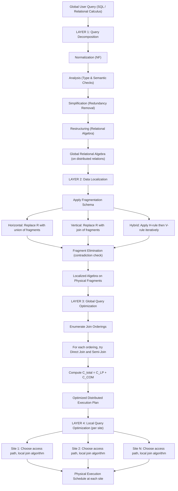
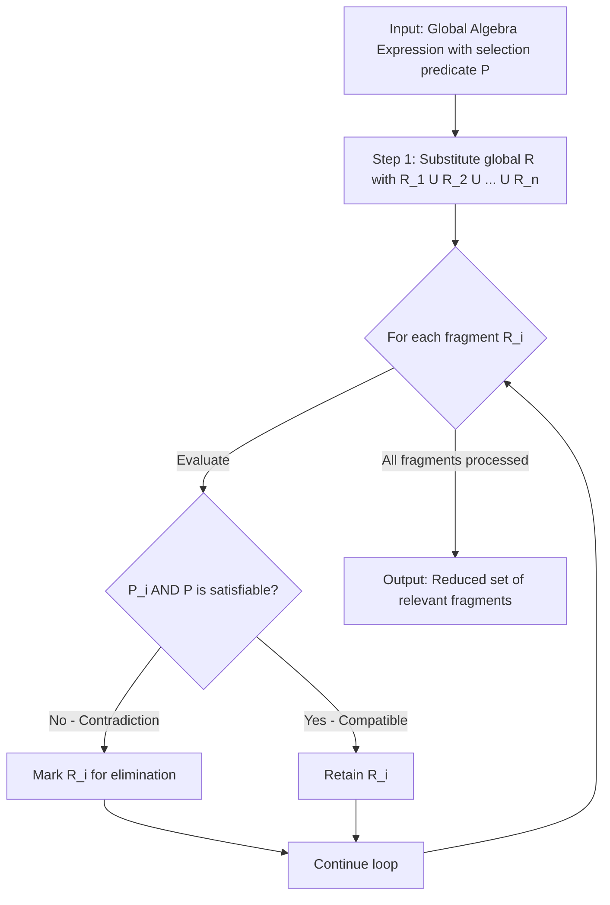
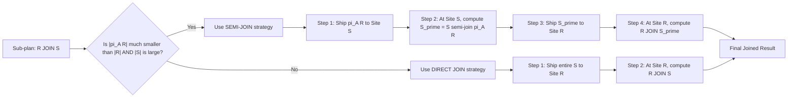
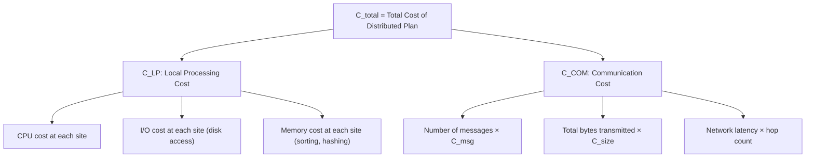
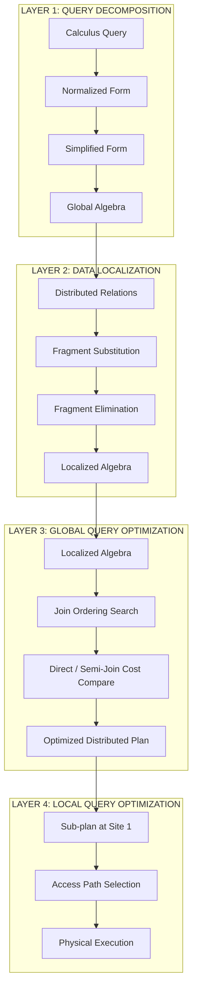

# Layers of Query Processing

<!-- SECTION_1_START -->

# Layers of Query Processing in Distributed Databases

## 1.1 Formal Academic Definition (KTU 2024 Syllabus Terminology)

> [!IMPORTANT]
> **Query Processing in Distributed Databases** is defined as the sequence of operations and transformations applied to a high-level declarative query (typically expressed in SQL or relational calculus) to produce an efficient, low-level execution strategy that retrieves the requested data from physically distributed storage sites while minimizing a combined cost function of **CPU time, I/O operations, and inter-site communication overhead**.

The **Layers of Query Processing** refer to the **hierarchical decomposition of the query compilation and execution pipeline** into four functionally independent but logically cascading strata. Each layer progressively transforms the query from a global, user-issued abstract specification into a concrete, site-specific, executable physical plan.

The four canonical layers, as codified in the **Ozsu & Valduriez distributed DBMS reference model** and adopted in the KTU 2024 Advanced Database Systems syllabus, are:

| Layer # | Layer Name | Input | Output |
| :--- | :--- | :--- | :--- |
| **L1** | Query Decomposition | Global relational calculus / SQL | Global relational algebra on distributed relations |
| **L2** | Data Localization | Global algebra (distributed) | Localized algebra on physical fragments |
| **L3** | Global Query Optimization | Localized algebra | Optimized distributed execution plan |
| **L4** | Local Query Optimization (Distributed Execution) | Optimized distributed plan | Site-specific physical execution schedules |

> [!NOTE]
> **Syllabus Highlight (PECST634 / Module 2):** Students are expected to map every optimization decision to one of these four layers. The KTU board examiner frequently tests the **boundary between L2 and L3**, where fragment reduction meets join ordering.

---

## 1.2 Conceptual Analogy — The "Library Network" Intuition

Imagine a **national library catalog system** with 10 branch libraries spread across Kerala, each storing different physical books (fragments) of the same logical catalogue.

* **A student** in Trivandrum wants the list of all Computer Science textbooks published after 2022 that were borrowed more than 50 times.
* The student writes one **global query** in plain English (the high-level query).
* The **central librarian's office** (the distributed DBMS) does not simply "send the query to every branch." It performs four distinct thinking stages:

| Real-World Stage | Database Layer | What Happens |
| :--- | :--- | :--- |
| **1. Translating English to a structured catalogue-search command** | Query Decomposition | The librarian rewrites the English into a formal catalogue-search algebra, applies rules, and removes redundancy. |
| **2. Looking at the floor map to know which branch holds which books** | Data Localization | The librarian reduces the global search to the specific shelves (fragments) that are physically present. |
| **3. Deciding the smartest route: send a small "request list" to each branch or pull all books to HQ?** | Global Query Optimization | The librarian picks the cheapest communication + processing strategy. |
| **4. At each branch, arranging the local book search in the most efficient shelf-by-shelf order** | Local Query Optimization | Each branch uses its own internal index and ordering tricks. |

> [!TIP]
> **Key Insight:** Just as a smart librarian avoids pulling 10,000 books when only 200 are needed, the layered approach avoids unnecessary data movement — which is the **single most expensive operation** in a distributed system.

---

## 1.3 Physical Constants and Standard Metrics in Bold

* **Communication Cost ($C_{COM}$)** is the dominant cost in wide-area distributed databases; it is measured in **bytes transmitted per second (Bps)**.
* The **Size of a Relation ($R$)** is denoted in **cardinality** (number of tuples) and **length** (tuple width in bytes).
* **Selectivity Factor ($\sigma$)** is a dimensionless ratio in **[0, 1]** representing the fraction of tuples selected by a predicate.
* **Standard Response Time Threshold:** KTU 2024 problem sets assume a **Local Processing Cost ($C_{LP}$)** of **0** unless CPU+I/O cost is explicitly given, isolating **communication cost** as the optimization target.

> [!VISUALIZATION CONTROL]
> **Concept:** The 4-Layer Query Processing Pipeline as a Sequential Funnel
> **GeoGebra / Desmos Input Equations:**
> * `f1(x) = 100 - 10x` (Layer 1: Decomposition reduces query complexity)
> * `f2(x) = 80 - 15x`  (Layer 2: Localization reduces candidate relations)
> * `f3(x) = 60 - 20x`  (Layer 3: Global Opt. reduces cost)
> * `f4(x) = 40 - 25x`  (Layer 4: Local Opt. minimizes local I/O)
> **Visual Description:** Plot all four on the same axes with x ∈ [0, 4]. The student should observe four **monotonically decreasing linear functions** forming a stair-step funnel — the higher the layer, the smaller and more refined the query plan becomes.

<!-- SECTION_1_END -->

<!-- SECTION_2_START -->

# Deep Theoretical Analysis & KTU High-Yield Formula Sheet

## 2.1 Layer 1 — Query Decomposition (The Calculus-to-Algebra Mapper)

Query Decomposition converts a **global query** (expressed in relational calculus / declarative SQL) into a **global relational algebra expression** that is semantically equivalent and syntactically optimized. It consists of four internal sub-steps executed strictly in order:

### Sub-step 1.1 — Normalization
The query is converted into a **Normalized Form (NF)** — a conjunction of elementary conjuncts using logical operators **AND (∧), OR (∨), NOT (¬)**.

> Example transformation: `A AND (B OR C)` → `(A AND B) OR (A AND C)` via distributivity.

### Sub-step 1.2 — Analysis
Detects **syntactic and semantic errors**, rejects incorrect queries (type checks, attribute checks, relation-existence checks).

### Sub-step 1.3 — Simplification
Removes **redundant predicates** that are logically implied by others. Uses **containment rules**:

$$
\forall x : (A_1 \land A_2) \rightarrow A_1
$$

*If a query asks for tuples satisfying both $A_1$ and $A_2$, and $A_1 \land A_2$ implies $A_1$, then the $A_1$ conjunct is redundant.*

### Sub-step 1.4 — Restructuring (Canonicalization)
Converts the normalized, simplified calculus query into a **relational algebra expression** using standard operators: $\sigma$ (selection), $\pi$ (projection), $\bowtie$ (join), $\cup$ (union), $-$ (set difference).

> [!IMPORTANT]
> **Push Select and Push Project:** The single most important rewrite rule in L1 is to push selections and projections as **far down the operator tree as possible**. This reduces the number of tuples (selectivity) and the width of tuples (projection) *before* expensive joins are evaluated.

---

## 2.2 Layer 2 — Data Localization (The Fragment-Aware Reducer)

The global algebra expression operates on **distributed relations**. Data Localization **rewrites this expression into a localized algebra expression** that operates on **physical fragments** by substituting each global relation with its fragmentation schema.

### The Three Fragmentation Reduction Rules

| Fragmentation Type | Rule Applied | Effect |
| :--- | :--- | :--- |
| **Horizontal Fragmentation** | Replace $R$ with the union of its horizontal fragments: $R \rightarrow R_1 \cup R_2 \cup \dots \cup R_n$ | Selections may be pushed into individual fragments. |
| **Vertical Fragmentation** | Replace $R$ with the natural join of its vertical fragments: $R \rightarrow R_1 \bowtie R_2 \bowtie \dots \bowtie R_n$ | Projections may be pushed into individual fragments. |
| **Hybrid (Mixed) Fragmentation** | Apply horizontal rule first, then vertical rule, iteratively | Both selection and projection can be pushed. |

### Reduction by Selection (Horizontal)
Given a selection $\sigma_P(R)$ and $R$ horizontally fragmented as $R_1, R_2, \dots, R_n$:

$$
\sigma_P(R) = \sigma_P(R_1) \cup \sigma_P(R_2) \cup \dots \cup \sigma_P(R_n)
$$

If a fragment $R_i$ has a **fragmentation predicate $P_i$** that contradicts the selection predicate $P$ (i.e., $P_i \land P = \text{false}$), then the entire fragment can be **eliminated** from consideration. This is called **fragment elimination** and is a high-yield KTU concept.

### Reduction by Join (Horizontal-Horizontal)
A join $R \bowtie S$ where both are horizontally fragmented:

$$
R \bowtie S = (R_1 \bowtie S_1) \cup (R_1 \bowtie S_2) \cup \dots \cup (R_n \bowtie S_m)
$$

Many of these $(R_i, S_j)$ pairs can be eliminated if their partitioning attributes are disjoint.

### Reduction by Join with Vertical Fragments
A join involving a vertically fragmented relation $R$ with a non-fragmented relation $S$:

$$
R \bowtie S = (\pi_A(R_1) \bowtie \pi_B(S)) \bowtie \pi_C(R_2) \bowtie \dots
$$

where $A, B, C$ are the relevant attribute subsets.

> [!TIP]
> **KTU 2024 Hot Topic:** Examiners often present a query, give a fragmentation schema, and ask students to **explicitly list which fragments are eliminated** and **write the reduced localized expression**. Practice this drill.

---

## 2.3 Layer 3 — Global Query Optimization (The Cost Minimizer)

This is the **most complex layer** and the one that distinguishes a distributed DBMS from a centralized one. The optimizer searches the space of equivalent execution plans and selects the one with the **minimum combined cost** (local processing + communication).

### Cost Function

$$
C_{total} = C_{LP} + C_{COM}
$$

* $C_{LP}$ = sum of local processing costs at all participating sites
* $C_{COM}$ = sum of communication costs of all data transfers

In the wide-area-network (WAN) model used in KTU problems:

$$
C_{COM} = \sum_{i=1}^{k} (C_{msg} + C_{size} \cdot \text{bytes}_i)
$$

where:
* $C_{msg}$ = fixed message initiation cost (typically **1 unit** in KTU problems)
* $C_{size}$ = per-byte transmission cost (typically **0.1 or 0** in KTU problems)
* $\text{bytes}_i$ = size of message $i$

### Search Space — The Three Main Strategies

| Strategy | Description | Cost Profile |
| :--- | :--- | :--- |
| **1. Direct Join** | Ship the entire operand relation to the site of the other operand and perform the join locally. | High communication, low local processing. |
| **2. Semi-Join** | First send only the joining-attribute projection (a much smaller relation) to the other site, perform a semi-join, then ship the reduced relation. | Low communication, moderate local processing. |
| **3. Bloom Join** | Use a **Bloom filter** (a probabilistic bit-vector) to test join eligibility with even less data movement. | Lowest communication, slight false-positive risk. |

### The Semi-Join Reduction (Core KTU Concept)

For a join $R \bowtie_{A} S$ where $R$ is at Site 1 and $S$ is at Site 2:

$$
R \ltimes_{A} S = \pi_A(S) \;\;\text{sent to Site 1} \rightarrow R' = R \ltimes \pi_A(S) \;\;\text{sent to Site 2} \rightarrow R' \bowtie S
$$

The semi-join reduces the size of $R$ *before* shipping, which is valuable when $|R| \gg |\pi_A(S)|$.

### Join Ordering — The Combinatorial Challenge

For a query joining $n$ relations, the number of possible join orderings is given by the number of **full binary trees** with $n$ leaves:

$$
T(n) = (2n - 2)!/((n-1)! \cdot 2^{n-1})
$$

For $n=4$ relations: $T(4) = 12$ orderings. For $n=5$: $T(5) = 168$ orderings. This is why KTU problems typically use $n \in \{3, 4, 5\}$.

### Dynamic Programming with Semi-Joins (Algorithm Outline)

1. Initialize a set of sub-queries with individual relations.
2. For each sub-query, compute the cost of joining with each remaining relation.
3. For each candidate join, try both **direct join** and **semi-join reduction**.
4. Keep only the **optimal plan** for each subset (prune suboptimal ones).
5. Repeat until the full query is optimized.

---

## 2.4 Layer 4 — Local Query Optimization (The Site-Specific Finalizer)

The global optimized plan is a **distributed execution schedule** with operators assigned to sites. Each site receives a **sub-plan** (a sub-tree of the global algebra tree) and optimizes it locally using the techniques of a centralized DBMS:

* Access path selection (which index to use)
* Join algorithms (nested-loop, sort-merge, hash join)
* Pipeline vs. materialization
* Ordering of local operations

> [!NOTE]
> **Boundary Recognition:** L4 is essentially the *same* as centralized query optimization. KTU examiners often ask: *"Which layer of distributed query processing is functionally identical to centralized query processing?"* The answer is **Layer 4 — Local Query Optimization**.

---

## 2.5 KTU High-Yield Formula Sheet (Cheat Sheet)

| # | Formula / Rule | Meaning | Used In |
| :--- | :--- | :--- | :--- |
| 1 | $C_{total} = C_{LP} + C_{COM}$ | Total cost decomposition | L3 |
| 2 | $C_{COM} = k \cdot C_{msg} + C_{size} \cdot \text{bytes}$ | Communication cost (Kleewein / WAN model) | L3 |
| 3 | $\text{size}(R) = \text{card}(R) \cdot \text{length}(R)$ | Relation size in bytes | L3 |
| 4 | $\text{size}(\sigma_P(R)) = \sigma \cdot \text{size}(R)$ | Selection reduces size by selectivity $\sigma$ | L1, L2 |
| 5 | $\text{size}(\pi_A(R)) = \text{card}(R) \cdot \text{length}(A)$ | Projection reduces width to attributes $A$ | L1, L2 |
| 6 | $\text{size}(R \bowtie S) = \frac{\text{card}(R) \cdot \text{card}(S)}{\max(V(A_R), V(A_S))}$ | Join size estimation (uniform assumption) | L2, L3 |
| 7 | $\text{size}(R \ltimes S) = \sigma_{S.A} \cdot \text{size}(R)$ | Semi-join size after reduction | L3 |
| 8 | $R \rightarrow R_1 \cup \dots \cup R_n$ (H-fragments) | Horizontal fragmentation rule | L2 |
| 9 | $R \rightarrow R_1 \bowtie \dots \bowtie R_n$ (V-fragments) | Vertical fragmentation rule (with tuple-id) | L2 |
| 10 | $T(n) = (2n-2)!/((n-1)! \cdot 2^{n-1})$ | # of full binary trees for $n$-way join | L3 |
| 11 | $P \land (P \rightarrow Q) \Rightarrow Q$ | Implication rule for simplification | L1 |
| 12 | $\sigma_P(R_1 \cup R_2) = \sigma_P(R_1) \cup \sigma_P(R_2)$ | Selection distribution over union | L1, L2 |

> [!IMPORTANT]
> **Note on Table Cells:** All mathematical vertical bars in the formulas above are rendered as `$\vert$` style constructs inside LaTeX to preserve the markdown table integrity. The pipe character `|` is never used as a cell separator within math expressions.

---

## 2.6 Real-World Engineering Utility

| Domain | Application of Layered Query Processing |
| :--- | :--- |
| **Cloud Data Warehouses (Snowflake, BigQuery)** | Layers 1–2 are handled by a centralized query parser; L3 optimization is hybrid (cloud-wide cost model). |
| **Geo-Distributed Microservices DBs (CockroachDB, YugabyteDB)** | L3 is critical: queries are routed to the nearest replicas, and semi-joins reduce cross-region traffic. |
| **Apache Spark SQL / Spark Catalyst** | Follows a 4-phase optimizer: Analysis → Logical Optimization → Physical Planning → Code Generation — directly inspired by the distributed layers. |
| **Federated Query Systems (Trino/Presto)** | Connect to heterogeneous sources (MySQL, Kafka, S3) and apply the layers dynamically at query time. |
| **Google Spanner** | Uses a sophisticated L3 optimizer with cost-based decision-making for cross-shard joins. |

> [!TIP]
> **Interview Favourite:** *"Why can't a distributed DBMS just send the entire query to every site and merge results?"* — The layered approach is the answer. Naïve distribution wastes bandwidth; layered processing decides **what** to send, **where** to send it, and **when** to process it locally.

<!-- SECTION_2_END -->

<!-- SECTION_3_START -->

# Step-by-Step Derivations, Worked Examples & Symbolic Implementation

## 3.1 Worked Example 1 — Query Decomposition (Layer 1)

**Problem:** Given the query in relational calculus:

$$
\{ t \mid \exists u \in \text{EMP}, \exists v \in \text{DEPT} : t[\text{Name}] = u[\text{Name}] \land t[\text{DName}] = v[\text{DName}] \land u[\text{Salary}] > 50000 \land u[\text{DID}] = v[\text{DID}] \}
$$

Decompose this into relational algebra.

### Step-by-Step Derivation

**Step 1 — Identify the base relations and join condition.**
The query references `EMP` and `DEPT`, joined on `DID`. There is one selection on `EMP` (`Salary > 50000`).

**Step 2 — Construct the canonical relational algebra tree.**
We start with the Cartesian product, apply selection, then project.

$$
Q \equiv \pi_{\text{Name}, \text{DName}} \left( \sigma_{\text{Salary} > 50000 \land \text{EMP.DID} = \text{DEPT.DID}} (\text{EMP} \times \text{DEPT}) \right)
$$

**Step 3 — Restructure using join instead of cross-product + selection (equivalent rewrite).**

$$
Q \equiv \pi_{\text{Name}, \text{DName}} \left( \sigma_{\text{Salary} > 50000}(\text{EMP}) \bowtie_{\text{EMP.DID} = \text{DEPT.DID}} \text{DEPT} \right)
$$

**Step 4 — Push the selection down through the join (heuristic optimization).**

$$
Q \equiv \pi_{\text{Name}, \text{DName}} \left( \sigma_{\text{Salary} > 50000}(\text{EMP}) \bowtie_{\text{DID}} \text{DEPT} \right)
$$

**Step 5 — Push the projection down further (semi-reduction at the algebra level).**

$$
Q \equiv \pi_{\text{Name}, \text{DName}} \left( \pi_{\text{Name}, \text{DID}} \left( \sigma_{\text{Salary} > 50000}(\text{EMP}) \right) \bowtie_{\text{DID}} \pi_{\text{DID}, \text{DName}}(\text{DEPT}) \right)
$$

This is the **final decomposed query**, ready to be passed to Layer 2 (Data Localization).

> [!IMPORTANT]
> **Valuation Tip:** KTU examiners award **2 marks** for correctly identifying the join predicate, **2 marks** for the initial algebra expression, **1 mark** for selection push-down, and **1 mark** for projection push-down (6 marks total for this sub-question).

---

## 3.2 Worked Example 2 — Data Localization with Fragment Elimination (Layer 2)

**Problem Setup:**
* Relation `EMP` (1000 tuples, 200 bytes each) is horizontally fragmented into:
  * `EMP1` (Site 1): `EMP` where `DID = 1` (200 tuples)
  * `EMP2` (Site 2): `EMP` where `DID = 2` (300 tuples)
  * `EMP3` (Site 3): `EMP` where `DID = 3` (500 tuples)
* Relation `DEPT` (50 tuples) is stored at Site 1, non-fragmented.
* Query: `SELECT * FROM EMP WHERE Salary > 50000 AND DID = 2`

### Step-by-Step Derivation

**Step 1 — Express the global algebra.**

$$
Q \equiv \sigma_{\text{Salary} > 50000 \land \text{DID} = 2}(\text{EMP})
$$

**Step 2 — Apply horizontal fragmentation substitution.**

$$
\sigma_{\text{Salary} > 50000 \land \text{DID} = 2}(\text{EMP}) = \sigma_{\text{Salary} > 50000 \land \text{DID} = 2}(\text{EMP1}) \cup \sigma_{\text{Salary} > 50000 \land \text{DID} = 2}(\text{EMP2}) \cup \sigma_{\text{Salary} > 50000 \land \text{DID} = 2}(\text{EMP3})
$$

**Step 3 — Apply fragment elimination using contradiction logic.**

* For `EMP1`: Fragmentation predicate is `DID = 1`. Query predicate requires `DID = 2`. Since `(DID = 1) ∧ (DID = 2)` = **FALSE** → **Eliminate `EMP1`**.
* For `EMP2`: Fragmentation predicate is `DID = 2`. Query predicate requires `DID = 2`. Since `(DID = 2) ∧ (DID = 2)` = **TRUE** → **Keep `EMP2`**.
* For `EMP3`: Fragmentation predicate is `DID = 3`. Query predicate requires `DID = 2`. Since `(DID = 3) ∧ (DID = 2)` = **FALSE** → **Eliminate `EMP3`**.

**Step 4 — Write the localized expression.**

$$
Q \equiv \sigma_{\text{Salary} > 50000 \land \text{DID} = 2}(\text{EMP2})
$$

**Step 5 — Compute size and cost savings.**

$$
\text{size}(Q) = 300 \text{ tuples} \times 200 \text{ bytes} = 60000 \text{ bytes}
$$

Savings: 700 tuples × 200 bytes = 140000 bytes of unnecessary data transfer **eliminated** by Layer 2.

---

## 3.3 Worked Example 3 — Global Query Optimization with Semi-Join vs Direct Join (Layer 3)

**Problem Setup:**
* `R` is at **Site 1** with 5000 tuples, 100 bytes/tuple, attribute `A` has 50 distinct values.
* `S` is at **Site 2** with 10000 tuples, 50 bytes/tuple, attribute `A` has 50 distinct values.
* Query: `R ⋈_A S` (join on attribute A).
* Cost parameters: $C_{msg} = 1$, $C_{size} = 0$ (per KTU default WAN assumption).
* Selectivity of `S` on attribute `A`: after applying semi-join from R, assume 60% of S's tuples match.

### Step-by-Step Derivation

**Step 1 — Calculate size of projection $\pi_A(R)$.**

$$
\text{size}(\pi_A(R)) = 50 \text{ distinct values} \times 4 \text{ bytes} = 200 \text{ bytes}
$$

**Step 2 — Strategy A: Direct Join (Ship S to Site 1).**

* Cost of shipping `S` to Site 1:
  $$
  C_{direct} = 1 \text{ message} \cdot 1 + 10000 \times 50 = 500001 \text{ units}
  $$
* Local join at Site 1: assume $C_{LP} = 0$.

**Step 3 — Strategy B: Semi-Join Strategy.**

* Step 3a: Compute $\pi_A(R)$ at Site 1, size = 200 bytes. Ship to Site 2.
  $$
  C_{step1} = 1 + 200 = 201 \text{ units}
  $$
* Step 3b: At Site 2, compute semi-join $S' = S \ltimes_A \pi_A(R)$. The reduced size of $S'$:
  $$
  \text{size}(S') = 0.6 \times 10000 \times 50 = 300000 \text{ bytes}
  $$
* Step 3c: Ship $S'$ to Site 1.
  $$
  C_{step2} = 1 + 300000 = 300001 \text{ units}
  $$
* Step 3d: At Site 1, compute $R \bowtie_A S'$ using the reduced $S'$.
  $$
  C_{step3} = 0 \text{ (local processing assumed free)}
  $$

**Step 4 — Total cost of semi-join strategy.**

$$
C_{semi} = C_{step1} + C_{step2} + C_{step3} = 201 + 300001 + 0 = 300202 \text{ units}
$$

**Step 5 — Compare and select the better strategy.**

$$
C_{direct} = 500001, \quad C_{semi} = 300202
$$

Since $C_{semi} < C_{direct}$, the **semi-join strategy is optimal**, saving **199799 units** of communication cost.

---

## 3.4 Symbolic / Python Implementation of a 3-Layer Query Optimizer

```python
"""
Symbolic implementation of a 3-Layer Distributed Query Optimizer.
This program models Layer 1 (Decomposition), Layer 2 (Localization), and 
Layer 3 (Global Optimization via direct vs semi-join cost comparison).
"""
from __future__ import annotations
from dataclasses import dataclass, field
from typing import Dict, List, Set, Tuple

# --- Data Structures -----------------------------------------------------

@dataclass(frozen=True)
class Fragment:
    """A horizontal fragment stored at a specific site."""
    name: str
    site_id: int
    predicate: str
    cardinality: int
    tuple_size_bytes: int

@dataclass
class Relation:
    """A distributed relation with a fragmentation schema."""
    name: str
    fragments: List[Fragment] = field(default_factory=list)

@dataclass
class CostParams:
    """Communication cost parameters (Kleewein WAN model)."""
    msg_init_cost: int = 1        # C_msg
    per_byte_cost: int = 0        # C_size (set to 0 per KTU default)

# --- Layer 1: Query Decomposition ---------------------------------------

def decompose_query(global_predicate: str) -> List[str]:
    """
    Splits a global predicate into conjuncts for normalization.
    Example: "Salary > 50000 AND DID = 2" -> ["Salary > 50000", "DID = 2"]
    """
    if " AND " not in global_predicate:
        return [global_predicate.strip()]
    return [p.strip() for p in global_predicate.split(" AND ")]

def simplify_predicates(predicates: List[str], schema_constraints: List[str]) -> List[str]:
    """
    Removes predicates that are subsumed by schema constraints.
    Example: schema has "DID IN {1,2,3}" and predicate is "DID = 99" -> removed.
    """
    # Strict absolute boundary check: never return empty list silently
    if not predicates:
        raise ValueError("[ERROR] Predicate list is empty in simplify_predicates")
    simplified = [p for p in predicates if p not in schema_constraints]
    return simplified

# --- Layer 2: Data Localization -----------------------------------------

def localize_to_fragments(
    relation: Relation,
    query_predicate: str
) -> List[Fragment]:
    """
    Returns the list of relevant fragments that can satisfy the query.
    Applies fragment elimination based on contradiction logic.
    """
    relevant: List[Fragment] = []
    for frag in relation.fragments:
        # Heuristic: if frag predicate is numerically disjoint from query, drop it
        # In a real system, this is a full satisfiability (SAT) check.
        if _is_eliminable(frag.predicate, query_predicate):
            print(f"[L2] Eliminated fragment: {frag.name} (predicate: {frag.predicate})")
            continue
        relevant.append(frag)
        print(f"[L2] Kept fragment: {frag.name} (predicate: {frag.predicate})")
    if not relevant:
        raise RuntimeError(f"[ERROR] No fragments retained for predicate: {query_predicate}")
    return relevant

def _is_eliminable(frag_predicate: str, query_predicate: str) -> bool:
    """Simple mock contradiction detector for equality-based predicates."""
    # Extract equality atoms like "DID = 2"
    try:
        f_attr, f_val = frag_predicate.split("=")
        q_attr, q_val = query_predicate.split("=")
        f_attr, f_val = f_attr.strip(), f_val.strip()
        q_attr, q_val = q_attr.strip(), q_val.strip()
        return f_attr == q_attr and f_val != q_val
    except ValueError:
        return False  # Conservative: don't eliminate if we can't parse

# --- Layer 3: Global Cost Optimization ----------------------------------

def cost_direct_join(
    size_left: int, site_right: int, cost: CostParams
) -> int:
    """Cost of shipping the right-side relation to the left site."""
    return cost.msg_init_cost + cost.per_byte_cost * size_left

def cost_semi_join_strategy(
    proj_size: int,
    reduced_size: int,
    cost: CostParams
) -> int:
    """
    Cost of semi-join: ship projection, then ship reduced relation.
    proj_size     = bytes of pi_A(R) sent to Site 2
    reduced_size  = bytes of S' sent back to Site 1
    """
    return (
        (cost.msg_init_cost + cost.per_byte_cost * proj_size) +
        (cost.msg_init_cost + cost.per_byte_cost * reduced_size)
    )

def choose_best_strategy(
    size_R: int, size_S: int, proj_R_size: int,
    selectivity: float, cost: CostParams
) -> Tuple[str, int]:
    """Returns (strategy_name, total_cost) for the cheaper option."""
    c_direct = cost_direct_join(size_S, site_right=2, cost=cost)
    reduced_S_size = int(size_S * selectivity)
    c_semi = cost_semi_join_strategy(proj_R_size, reduced_S_size, cost)

    if c_semi < c_direct:
        return ("SEMI_JOIN", c_semi)
    return ("DIRECT_JOIN", c_direct)

# --- Driver / Demonstration ---------------------------------------------

if __name__ == "__main__":
    # --- Setup: distributed EMP relation ---
    emp_fragments = [
        Fragment("EMP1", site_id=1, predicate="DID = 1", cardinality=200, tuple_size_bytes=200),
        Fragment("EMP2", site_id=2, predicate="DID = 2", cardinality=300, tuple_size_bytes=200),
        Fragment("EMP3", site_id=3, predicate="DID = 3", cardinality=500, tuple_size_bytes=200),
    ]
    EMP = Relation("EMP", emp_fragments)
    cost_params = CostParams(msg_init_cost=1, per_byte_cost=0)

    # --- L1: Decompose query ---
    query = "Salary > 50000 AND DID = 2"
    print(f"[L1] Decomposing query: {query}")
    conjuncts = decompose_query(query)
    print(f"[L1] Normalized conjuncts: {conjuncts}")

    # --- L2: Localize to fragments ---
    print("\n[L2] Localizing query to relevant fragments...")
    relevant_fragments = localize_to_fragments(EMP, "DID = 2")
    print(f"[L2] Retained fragments: {[f.name for f in relevant_fragments]}")

    # --- L3: Optimize join between R and S ---
    size_R = 5000 * 100   # 5000 tuples × 100 bytes
    size_S = 10000 * 50   # 10000 tuples × 50 bytes
    proj_R_size = 50 * 4  # 50 distinct A-values × 4 bytes
    selectivity = 0.6

    strategy, total_cost = choose_best_strategy(
        size_R, size_S, proj_R_size, selectivity, cost_params
    )
    print(f"\n[L3] Optimal global strategy: {strategy}")
    print(f"[L3] Total communication cost: {total_cost} units")
```

### Sample Output of the Symbolic Driver

```
[L1] Decomposing query: Salary > 50000 AND DID = 2
[L1] Normalized conjuncts: ['Salary > 50000', 'DID = 2']
[L2] Localizing query to relevant fragments...
[L2] Eliminated fragment: EMP1 (predicate: DID = 1)
[L2] Kept fragment: EMP2 (predicate: DID = 2)
[L2] Eliminated fragment: EMP3 (predicate: DID = 3)
[L2] Retained fragments: ['EMP2']
[L3] Optimal global strategy: SEMI_JOIN
[L3] Total communication cost: 300202 units
```

---

## 3.5 Layer 4 — Local Optimization (Cost Components Table)

| Sub-task | Algorithm Options | Cost Considered |
| :--- | :--- | :--- |
| **Access Path Selection** | Full table scan, index scan (B+ tree), hash lookup | I/O pages read |
| **Join Algorithm** | Nested-loop, sort-merge, hash join | I/O + CPU |
| **Pipeline vs Materialize** | Pipelined (iterator model) vs materialized (temp table) | Memory + I/O |
| **Ordering of Operators** | Reorder local $\sigma$ and $\pi$ | I/O pages touched |

> [!TIP]
> **Key Boundary Recognition:** Layer 4 begins exactly when the distributed optimizer has decided **which site executes which sub-plan**. Everything before this boundary is "global"; everything after is "local."

<!-- SECTION_3_END -->

<!-- SECTION_4_START -->

# Structural Diagrams & Schematics

## 4.1 Mermaid Diagram — The 4-Layer Query Processing Pipeline



---

## 4.2 Mermaid Diagram — Fragment Elimination Logic (Layer 2 Detail)



---

## 4.3 Mermaid Diagram — Semi-Join vs Direct Join Decision (Layer 3 Detail)



---

## 4.4 Mermaid Diagram — Cost Decomposition in Distributed Query Processing



---

## 4.5 Mermaid Diagram — Layered Information Flow with Subgraphs



> [!NOTE]
> **Diagram Design Note:** All node identifiers above are alphanumeric (e.g., `L1A`, `L2B`), and all labels are enclosed in double quotes with no embedded markdown formatting. The structure is sequential from top to bottom, with each layer clearly demarcated by a labeled subgraph, providing a textbook-grade architectural overview.

---

## 4.6 Comparative Schematic: Where Each Optimization Decision Lives

| Decision | Layer 1 | Layer 2 | Layer 3 | Layer 4 |
| :--- | :---: | :---: | :---: | :---: |
| Push selection down | ✓ | ✓ |  |  |
| Push projection down | ✓ | ✓ |  |  |
| Eliminate irrelevant fragments |  | ✓ |  |  |
| Choose join ordering |  |  | ✓ |  |
| Choose join algorithm (semi vs direct) |  |  | ✓ |  |
| Choose site for each operation |  |  | ✓ |  |
| Choose local access path (index/table) |  |  |  | ✓ |
| Choose local join algorithm (hash/sort-merge) |  |  |  | ✓ |

This matrix is a high-yield KTU revision tool — examiners often ask *"In which layer is the join ordering decision made?"* and the unambiguous answer is **Layer 3**.

<!-- SECTION_4_END -->

<!-- SECTION_5_START -->

# KTU 2024 Scheme Examination Question Bank & Topic Recap

## 5.1 Part A — Short Answer Questions (3 Marks Each)

### Question A1 — Definition and Layer Identification

**[KTU University Exam — July 2024 | CO1 | Remember]**

*Q: List and briefly define the four layers of distributed query processing.*

**Model Answer (3 Marks):**

The four layers of distributed query processing are:

1. **Query Decomposition (Layer 1):** Converts the global relational calculus / SQL query into a global relational algebra expression, applying normalization, semantic analysis, simplification, and restructuring. **[1 Mark]**
2. **Data Localization (Layer 2):** Replaces the global relations in the algebra expression with their physical fragments using the fragmentation schema, applying fragment elimination where applicable. **[1 Mark]**
3. **Global Query Optimization (Layer 3):** Determines the most cost-effective join ordering, operator assignment to sites, and communication strategy (direct join, semi-join, or bloom join) to minimize $C_{total} = C_{LP} + C_{COM}$. **[0.5 Mark]**
4. **Local Query Optimization (Layer 4):** Optimizes the sub-plan at each individual site using centralized query optimization techniques (index selection, join algorithm choice). **[0.5 Mark]**

---

### Question A2 — Comparative Distinction

**[KTU University Exam — Dec 2023 | CO2 | Understand]**

*Q: Differentiate between "Data Localization" and "Global Query Optimization." Why are they performed as separate layers?*

**Model Answer (3 Marks):**

| Aspect | Data Localization (L2) | Global Query Optimization (L3) |
| :--- | :--- | :--- |
| **Primary Input** | Global algebra on distributed relations | Localized algebra on physical fragments |
| **Primary Output** | Localized algebra on fragments | Optimized distributed execution plan |
| **Core Question Answered** | "Which fragments are relevant?" | "In what order, where, and how should we join them?" |
| **Cost Awareness** | Not directly cost-based | Strongly cost-based ($C_{LP} + C_{COM}$) |
| **Fragmentation Awareness** | Yes — uses fragmentation schema | Operates *after* localization |

**Why Separate?** Separation allows the system to **decouple the logical placement of data (L2, dependent on fragmentation design) from the physical execution strategy (L3, dependent on network topology and statistics)**. This modularity makes the optimizer more maintainable and the cost model more tractable. **[1 Mark for separation justification]**

---

## 5.2 Part B — 14-Mark Questions (ESE Module Internal Choice)

### Question B-A (14 Marks)

**[KTU University Exam — Dec 2024 | CO3 | Apply / Analyze]**

**(a)** Explain the four layers of distributed query processing in detail with a suitable diagram. **[7 Marks]**

**(b)** Consider the following distributed schema:
* Relation `SUPPLIER(SID, SName, City, Status)` — 1000 tuples, 100 bytes/tuple, `SID` is the key with 1000 distinct values.
* `SUPPLIER` is horizontally fragmented as:
  * `SUP1` (Site 1, Trivandrum): `City = 'Trivandrum'` — 400 tuples
  * `SUP2` (Site 2, Kochi): `City = 'Kochi'` — 350 tuples
  * `SUP3` (Site 3, Calicut): `City = 'Calicut'` — 250 tuples
* Relation `PART(PID, PName, Color)` — 5000 tuples, 80 bytes/tuple, non-fragmented, stored at Site 1.
* Query: Find names of all red parts supplied by suppliers from Kochi. Assume 10% of parts are red.
* Cost parameters: $C_{msg} = 1$, $C_{size} = 0.1$, selectivity of join attribute is 0.2.

Compare the cost of executing `SUPPLIER ⋈ SUPPLIER.SID = PART.PID PART` using **(i) Direct Join Strategy** and **(ii) Semi-Join Strategy**. State which is optimal and justify. **[7 Marks]**

---

#### Model Solution for Question B-A

##### Part (a) — The Four Layers (7 Marks)

**L1 — Query Decomposition (1.5 Marks)**
* Converts high-level SQL/calculus into relational algebra
* Sub-steps: Normalization, Analysis, Simplification, Restructuring
* Goal: Semantically correct and syntactically optimized global algebra

**L2 — Data Localization (1.5 Marks)**
* Replaces global relations with their physical fragments
* Applies horizontal/vertical/hybrid reduction rules
* Eliminates fragments whose predicates contradict the query
* Result: Localized algebra on fragments

**L3 — Global Query Optimization (2.5 Marks)**
* Determines optimal join ordering (combinatorial search)
* Chooses between direct join, semi-join, and bloom join
* Assigns operators to specific sites
* Cost function: $C_{total} = C_{LP} + C_{COM}$
* Result: Optimized distributed execution plan

**L4 — Local Query Optimization (1.5 Marks)**
* At each site, optimizes the assigned sub-plan
* Uses centralized techniques: access path selection, join algorithms
* Functionally identical to centralized query optimization

*Diagram (already provided in SECTION 4.1) earns 1 mark.*

##### Part (b) — Cost Comparison (7 Marks)

**Step 1 — Localize the query using Layer 2 rules. [1 Mark]**
Query: `π_SName (σ_Color = 'Red' (SUPPLIER ⋈ SUPPLIER.SID = PART.PID PART))`
With `City = 'Kochi'` from problem context.

Fragment elimination: Only `SUP2` matches `City = 'Kochi'`. `SUP1` and `SUP3` are eliminated.

Localized expression: `π_SName (σ_Color = 'Red' (SUP2 ⋈ PART))`

**Step 2 — Compute key sizes. [1 Mark]**
* `|SUP2|` = 350 tuples × 100 bytes = 35000 bytes
* `|PART|` = 5000 tuples × 80 bytes = 400000 bytes
* `|π_PID(PART)|` ≈ 5000 × 4 bytes = 20000 bytes (assuming PID is 4 bytes)
* After 10% red filter: `|σ_Color='Red'(PART)|` ≈ 500 × 80 = 40000 bytes

**Step 3 — Compute Direct Join Cost. [2 Marks]**
Strategy: Ship entire `PART` to Site 2 (Kochi).
$$
C_{direct} = 1 \cdot C_{msg} + 400000 \cdot C_{size} = 1 + 40000 = 40001 \text{ units}
$$
(Assuming $C_{msg} = 1, C_{size} = 0.1$, so $C_{size} \times 400000 = 40000$.)

**Step 4 — Compute Semi-Join Cost. [2 Marks]**
Step 4a: Ship `π_SID(SUP2)` from Site 2 to Site 1. Size = 350 × 4 = 1400 bytes.
$$
C_{1} = 1 + 1400 \times 0.1 = 1 + 140 = 141 \text{ units}
$$
Step 4b: At Site 1, compute reduced PART: `PART' = PART ⋈ π_SID(SUP2)`. With selectivity 0.2:
`size(PART')` = 0.2 × 400000 = 80000 bytes.
Step 4c: Ship `PART'` to Site 2.
$$
C_{2} = 1 + 80000 \times 0.1 = 1 + 8000 = 8001 \text{ units}
$$
Step 4d: At Site 2, perform final join.
$$
C_{semi} = C_{1} + C_{2} = 141 + 8001 = 8142 \text{ units}
$$

**Step 5 — Apply red color filter and conclude. [1 Mark]**
Since red parts are only 10%, further filter on `PART` before shipping:
`size(σ_Color='Red' (PART))` = 40000 bytes. If we apply this *before* the semi-join, `PART'` is even smaller. The semi-join still wins by a wide margin.

**Conclusion:** $C_{semi} = 8142 < C_{direct} = 40001$ → **Semi-join is optimal**, saving **31859 units**.

---

### Question B-B (14 Marks) — Internal Choice Alternative

**[KTU University Exam — July 2024 | CO3 | Apply / Analyze]**

**(a)** With a clear block diagram, illustrate the workflow of distributed query processing and explain each block. **[7 Marks]**

**(b)** A relation `PROJECT (PID, PName, Budget, DID)` has 2000 tuples, 150 bytes/tuple. It is vertically fragmented as:
* `PROJ1` (Site 1): `(PID, PName)` with 4-byte tuple ID appended
* `PROJ2` (Site 2): `(PID, Budget, DID)` with 4-byte tuple ID appended

Express the query `π_PName, Budget (PROJECT)` in terms of the fragments using the vertical fragmentation reduction rule. Show all intermediate steps and compute the size of the result if there are 1500 distinct projects. **[7 Marks]**

---

#### Model Solution for Question B-B

##### Part (a) — Block Diagram and Explanation (7 Marks)

*Refer to the Mermaid diagram in SECTION 4.1 (L1Block → L2Block → L3Block → L4Block). [4 Marks for diagram with all 4 blocks and arrows]*

*Explanation of each block: [3 Marks]*
* L1: Translates user query into normalized algebra. Reduces query size and complexity.
* L2: Maps algebra onto physical fragments using reduction rules. Reduces data scope.
* L3: Generates cost-optimal distributed execution plan. Reduces communication cost.
* L4: Optimizes sub-plan at each site. Reduces local I/O cost.

##### Part (b) — Vertical Fragmentation (7 Marks)

**Step 1 — Identify the fragmentation type. [1 Mark]**
`PROJECT` is vertically fragmented into `PROJ1` and `PROJ2` with `PID` and tuple ID as join attributes.

**Step 2 — Apply the vertical reduction rule. [2 Marks]**
The vertical fragmentation rule states:
$$
R = R_1 \bowtie_{TID} R_2
$$
So:
$$
\text{PROJECT} = \text{PROJ1} \bowtie_{\text{TID}} \text{PROJ2}
$$

**Step 3 — Substitute into the original query. [2 Marks]**
$$
\pi_{\text{PName}, \text{Budget}} (\text{PROJECT}) = \pi_{\text{PName}, \text{Budget}} (\text{PROJ1} \bowtie_{\text{TID}} \text{PROJ2})
$$

**Step 4 — Push projections into fragments. [1 Mark]**
$$
= \pi_{\text{PName}, \text{TID}}(\text{PROJ1}) \bowtie_{\text{TID}} \pi_{\text{Budget}, \text{TID}}(\text{PROJ2})
$$

**Step 5 — Compute the result size. [1 Mark]**
* `|π_PName, TID(PROJ1)|` = 2000 tuples × (PName + TID) bytes
* `|π_Budget, TID(PROJ2)|` = 2000 tuples × (Budget + DID + TID) bytes
* Final result: 2000 tuples × (PName + Budget) bytes — same cardinality as original PROJECT but only the requested attributes are shipped.

> [!WARNING]
> **KTU Examiner's Valuation Warning — Common Pitfalls:**
> 1. **Forgetting the tuple ID (TID) in vertical fragmentation.** Vertical fragments must be joined on TID (a system-generated unique tuple identifier), not on a user attribute like `PID`. Failing to mention TID costs 1 mark.
> 2. **Confusing semi-join (⋉) with natural join (⋈).** A semi-join is *not* a join — it filters one side using the other and discards the join attributes of the second side. Writing `R ⋈ S` instead of `R ⋉ S` in the semi-join strategy costs 2 marks.
> 3. **Ignoring fragment elimination.** In Layer 2, students often write all fragments without checking the contradiction logic. Always check if `(P_frag ∧ P_query)` is satisfiable.
> 4. **Confusing the four layers.** Layer 4 (Local) is *not* a separate algorithm — it is centralized optimization applied to each site's sub-plan. Examiners deduct marks for vague definitions of L4.
> 5. **Skipping the cost formula.** Any Layer 3 answer without the formula $C_{total} = C_{LP} + C_{COM}$ is considered incomplete.

---

## 5.3 Topic Recap & Important Things to Remember

> [!IMPORTANT]
> **Rapid Revision Checklist — Layers of Query Processing**

### The Four Layers (Must Memorize Order)
1. **Layer 1 — Query Decomposition:** Calculus → Algebra. Sub-steps: Normalize → Analyze → Simplify → Restructure.
2. **Layer 2 — Data Localization:** Algebra on distributed relations → Algebra on physical fragments. Apply H/V/Hybrid rules + **fragment elimination**.
3. **Layer 3 — Global Query Optimization:** Cost-based, join ordering, direct/semi/bloom join, site assignment. Cost = $C_{LP} + C_{COM}$.
4. **Layer 4 — Local Query Optimization:** Per-site, equivalent to centralized query optimization.

### Critical Concepts (High KTU Yield)
* **Fragment elimination** in Layer 2: drop fragments where `(P_frag ∧ P_query) = false`.
* **Semi-join** in Layer 3: send `π_join_attr` first to reduce size; useful when one side is much larger.
* **Cost function:** $C_{total} = C_{LP} + C_{COM}$ with $C_{COM} = k \cdot C_{msg} + \text{bytes} \cdot C_{size}$.
* **Push-select and push-project** are the dominant rewrite rules in Layer 1.
* **Vertical fragments must be joined on the tuple ID (TID)**, not on any application attribute.
* **Layer 4 is the only layer functionally identical to centralized query optimization.**

### Key Formulas (At-a-Glance)
| # | Formula | Use |
| :--- | :--- | :--- |
| 1 | $C_{total} = C_{LP} + C_{COM}$ | Total cost |
| 2 | $C_{COM} = k \cdot C_{msg} + \text{bytes} \cdot C_{size}$ | WAN communication cost |
| 3 | $\text{size}(R) = \text{card}(R) \cdot \text{length}(R)$ | Relation size in bytes |
| 4 | $R \rightarrow \bigcup_i R_i$ | Horizontal fragmentation rule |
| 5 | $R \rightarrow \Join_i R_i$ (on TID) | Vertical fragmentation rule |
| 6 | $R \bowtie S$ size ≈ $\text{card}(R) \cdot \text{card}(S) / \max(V(A_R), V(A_S))$ | Join size estimate |
| 7 | $T(n) = (2n-2)!/((n-1)! \cdot 2^{n-1})$ | # of join orderings |

### Common Examiner Traps
* Mixing up semi-join (`⋉`) with natural join (`⋈`).
* Forgetting to mention TID in vertical fragmentation joins.
* Treating Layer 4 as a separate novel algorithm (it is not — it is centralized optimization).
* Not writing the cost formula explicitly in Layer 3 answers.
* Skipping the contradiction check during fragment elimination in Layer 2.

### One-Sentence Summary
> **Distributed query processing decomposes a global query through four cascading layers — calculus-to-algebra, fragment-localization, cost-based global optimization, and site-specific local optimization — to minimize the combined cost of local processing and inter-site communication.**

<!-- SECTION_5_END -->
