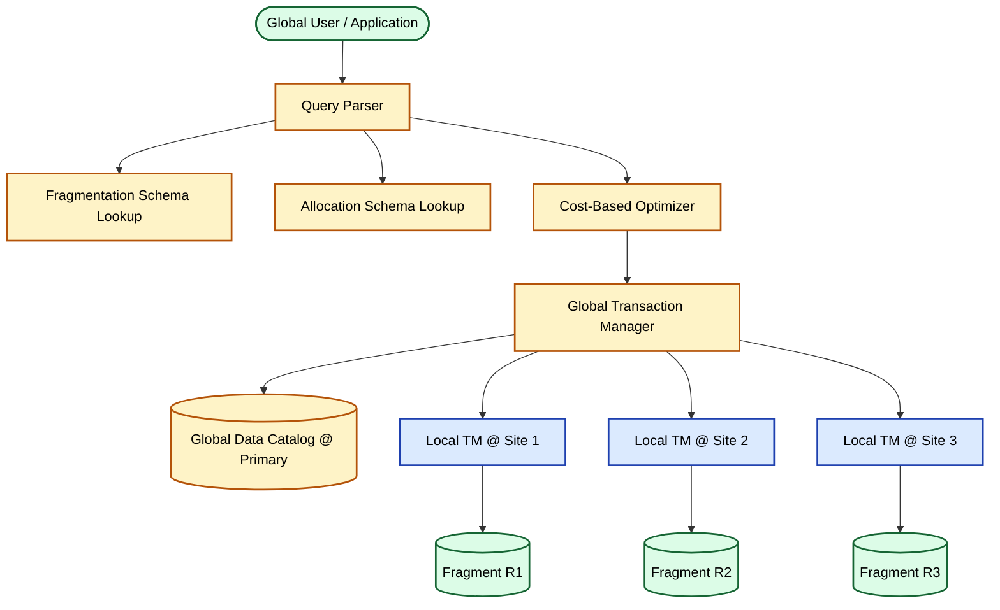
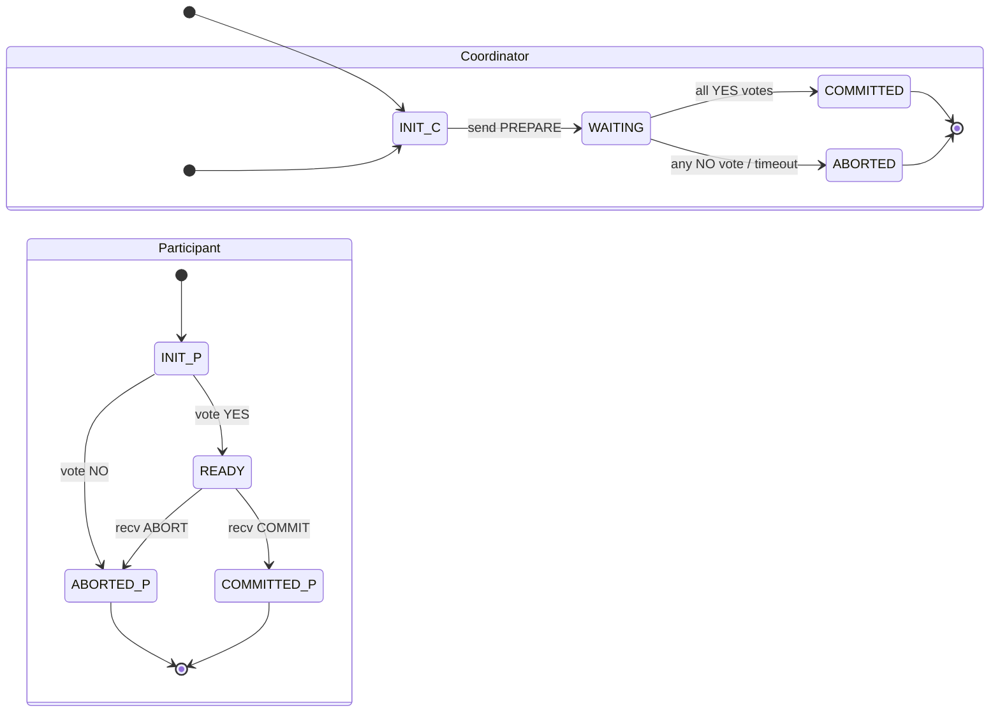
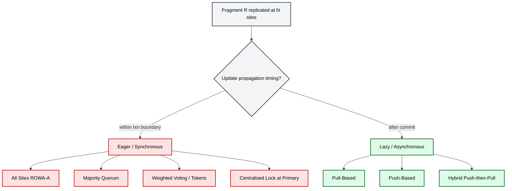
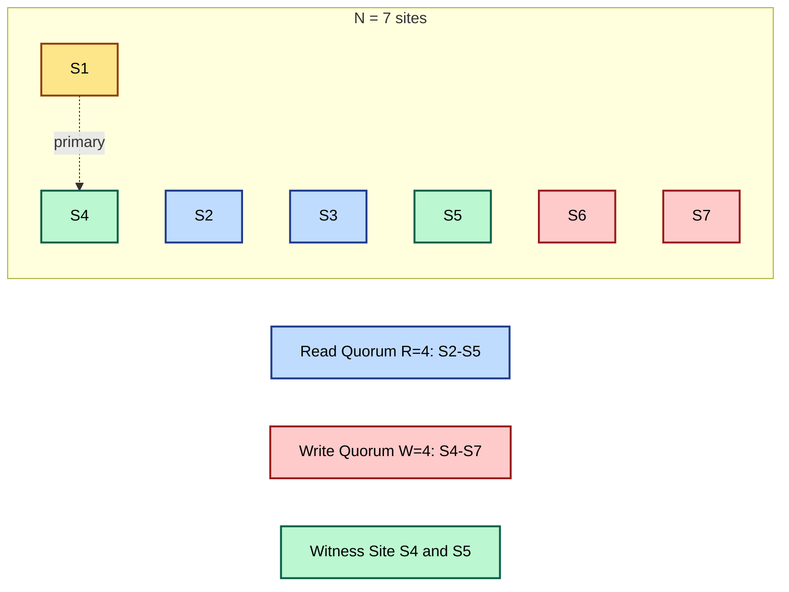
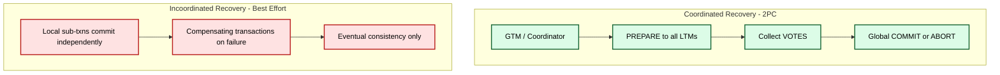

# Localization of Distributed Data

<!-- SECTION_1_START -->
# Localization of Distributed Data — Core Technical Definition & Intuitive Overview

## 1.1 Formal KTU 2024 Definition

> [!IMPORTANT]
> **Localization of Distributed Data** is the process of transforming *global user transactions* on a *global (distributed) schema* into a set of *local sub-transactions* that can be executed at the individual sites of a *Distributed Database Management System (DDBMS)*. It is the foundational mechanism that hides distribution, fragmentation, and replication transparency from the end user, allowing the user to perceive a single logical database while the system internally maps the request onto physically dispersed fragments.

In KTU 2024 Scheme terminology, localization encompasses three tightly coupled sub-problems:

1. **Fragmentation Transparency** — translating a global relation $R$ into its horizontal $R_1, R_2, \dots, R_n$ and vertical $\Pi_{A_1}(R), \Pi_{A_2}(R)$ fragments.
2. **Replication Transparency** — selecting *one* physical copy of a replicated fragment as the *primary* (or coordinator) so updates propagate deterministically.
3. **Distribution Transparency** — using a global data dictionary / *system catalog* at the *primary site* to route the local sub-queries to the correct local DBMS via *local transaction managers (LTMs)* under a *global transaction manager (GTM)*.

> [!NOTE]
> **Key Term — Primary Site (Primary Copy)**: The chosen physical node that holds the *authoritative* version of a replicated fragment. All updates are funnelled through this site first. The replication factor $k$ is the **number of physical copies** maintained; a higher $k$ improves *availability* but worsens *update propagation cost*.

---

## 1.2 Conceptual Analogy / Intuition

Imagine a national bank with **branches in every city**. A customer in Kochi wants to know "What is my balance?" — they do not care which server holds the data. The bank's *central routing desk* (think of it as the **GTM**) looks up the *master register* (the **primary site**), locates the **relevant ledger copies** at multiple branches, and instructs the **Kochi branch server** to retrieve the value. The customer perceives a *single account*; in reality, the data is fragmented by account-type and replicated across cities.

Now imagine the customer *deposits* money. The central desk must ensure *every* branch ledger that stores a copy is updated *consistently* — either **all of them succeed** (eager) or **some of them succeed now and the rest catch up later** (lazy). Localization is precisely this routing, decomposition, and synchronization machinery inside the bank.

---

## 1.3 Physical Constants & Standard Metrics

The following quantitative parameters are standard in every KTU 2024 question on this topic:

| Symbol | Meaning | Typical Value / Rule |
| :--- | :--- | :--- |
| $N$ | Total number of sites holding a copy of fragment | $\geq 3$ for replication studies |
| $k$ | Replication factor | $2 \le k \le N$ |
| $R$ | Number of sites that must respond to a **read** | Read quorum |
| $W$ | Number of sites that must acknowledge a **write** | Write quorum |
| $V$ | Total votes assigned across sites | $\sum v_i$ |
| $V_r$ | Read quorum threshold | $\sum_{i \in \text{readers}} v_i \ge V_r$ |
| $V_w$ | Write quorum threshold | $\sum_{i \in \text{writers}} v_i \ge V_w$ |
| $\tau$ | Local sub-transaction latency | Site-dependent (LAN $\approx$ 1–10 ms) |

> [!WARNING]
> **KTU Examiner's Pitfall**: Many students confuse the *number of sites* $N$ with the *total votes* $V$. They are equal **only** when every site has uniform weight $v_i = 1$. In **weighted voting**, sites may have differing weights (e.g., a primary site with $v=2$, replicas with $v=1$).

---

## 1.4 Visualization — Quorum Geometry on a 1-D Axis

> [!VISUALIZATION CONTROL]
> **Concept:** Visualising the *Quorum Intersection Principle* on a 1-D number line. Any read quorum and any write quorum must share at least one site.
> **GeoGebra / Desmos Input:**
>
> * Implicit curve: $R + W > N$ (read+write quorums must exceed $N$)
> * Constraint line: $W > N/2$ (write quorum must exceed half the sites)
>
> **Visual Description:** On the $x$-axis place $N=7$ evenly spaced dots (sites $S_1\dots S_7$). Shade the leftmost $W=4$ dots blue (write set) and the rightmost $R=4$ dots red (read set). The overlapping central dot is the *witness site* — it guarantees a recent write is observed by any subsequent read. If $R+W \le N$, no overlap exists and stale reads become possible.

---

<!-- SECTION_1_END -->

<!-- SECTION_2_START -->
# Deep Theoretical Analysis & KTU High-Yield Formula Sheet

## 2.1 The Localization Pipeline (Five-Stage Logical Flow)

Localization is **not a single algorithm** — it is a pipeline. Every KTU 14-mark question tests at least two of the following five stages:

1. **Query Parsing & Validation** — A *global transaction* $T$ expressed in SQL/SQL-like syntax is parsed by the **GTM**.
2. **Fragmentation Mapping** — The GTM consults the *fragmentation schema* and rewrites $T$ into $\bigcup T_i$ where each $T_i$ touches exactly one horizontal or vertical fragment $R_i$.
3. **Allocation / Site Selection** — The GTM consults the *allocation schema* and binds each $T_i$ to a specific site $S_j$. If $R_i$ is replicated, a *primary site* $P_i$ is selected deterministically (e.g., the lowest-numbered site id).
4. **Optimization** — Cost-based optimizer chooses join order, semi-joins, and shipping strategies (ship-whole-relation vs ship-projection).
5. **Distributed Execution & Recovery** — Each local sub-transaction runs under an **LTM**. The GTM coordinates commit/abort using either *2PC* (coordinated) or *best-effort* (incoordinated) recovery.

> [!NOTE]
> **Why does localization matter in production?** In real-world systems like Google's *Spanner*, Amazon's *DynamoDB*, and Apache *Cassandra*, localization logic determines whether a write completes in **single-digit milliseconds** (lazy) or **tens of milliseconds** (eager). Choosing the wrong strategy can either destroy *availability* (if recovery is too strict) or *consistency* (if recovery is too lax).

---

## 2.2 Update Propagation Strategies — The Master Decision Tree

Once a primary site is chosen, the next design decision is *how updates flow* to the replicas. The textbook (Korth, Özsu, Navathe) classifies them as follows:

### 2.2.1 Eager Update Propagation (Synchronous)

All replicas are updated *within the boundary* of the original transaction. The transaction commits **only if all replicas succeed**.

| Variant | Rule | Failure Behaviour |
| :--- | :--- | :--- |
| **All Sites (Read-One-Write-All / ROWA-A)** | $W = N$ | Any site failure → transaction aborts |
| **Majority (ROWA-NA / Quorum)** | $W = \lceil N/2 \rceil$ and $R = \lfloor N/2 \rfloor + 1$ | Tolerates $\lfloor N/2 \rfloor$ site failures for reads, $\lceil N/2 \rceil - 1$ for writes |
| **Quorum with Tokens (Weighted Voting)** | Site $i$ holds token $v_i$ (often $v_i=1$); need $V_w$ and $V_r$ with $V_r + V_w > V$ | Fine-grained tunable; primary can carry higher weight |
| **Site-At-A-Time (Centralised Lock)** | Single lock at primary | Bottleneck but very simple |

### 2.2.2 Lazy Update Propagation (Asynchronous)

The primary updates *immediately*; replicas are refreshed *after* the transaction commits, often via a *change-log* or *anti-entropy* gossip.

| Variant | Rule | Failure Behaviour |
| :--- | :--- | :--- |
| **Pull-Based** | Replica polls primary periodically | Stale reads possible; low write cost |
| **Push-Based** | Primary pushes deltas to subscribers on commit | Lower staleness; primary does more work |
| **Hybrid (Push then Pull)** | Push on commit, pull on miss | Used by DynamoDB and Cassandra |

---

## 2.3 KTU Formula Sheet / Cheat Sheet

> [!IMPORTANT]
> The following table is the **definitive reference** for every numerical problem on this topic. Memorise every row — KTU board papers typically have a 7-mark sub-question worth mapping onto one of these formulas.

| # | Concept | Formula / Condition | Engineering Use Case |
| :--- | :--- | :--- | :--- |
| 1 | Quorum Intersection | $R + W > N$ | Guarantees a recent write is observed by a subsequent read |
| 2 | Minimum Read Quorum | $R \ge 1$ | A read must touch at least one current copy |
| 3 | Minimum Write Quorum | $W \ge 1$ | A write must persist somewhere |
| 4 | Strict Consistency (Gifford's) | $W > N/2$ | Two concurrent writes must serialise on at least one site |
| 5 | Weighted Voting Read | $\sum_{i \in \text{readers}} v_i \ge V_r$ | Threshold for read authorisation |
| 6 | Weighted Voting Write | $\sum_{i \in \text{writers}} v_i \ge V_w$ | Threshold for write authorisation |
| 7 | Gifford's Combined Constraint | $V_w > V/2$ and $V_r + V_w > V$ | Both Gifford conditions for correctness |
| 8 | Network Partition Survival (Reads) | $R \le \lfloor N/2 \rfloor$ | Survives one half of a partition |
| 9 | Network Partition Survival (Writes) | $W \le \lceil N/2 \rceil$ | Mirror of the above for writes |
| 10 | Primary-Site Availability | $A_{sys} = 1 - (1 - A_{primary}) \cdot (1 - A_{replica})$ | For active-passive failover |

> [!NOTE]
> **LaTeX Isolation Note**: In prose, every subscripted variable (e.g., $V_r$, $V_w$, $A_{primary}$) is wrapped in `$..$` math mode so that the markdown renderer never misinterprets an underscore as italics or bolding.

---

## 2.4 Real-World Engineering Utility

- **Banking / Financial RDBMS (Oracle RAC, IBM DB2 pureScale)**: Use *eager / majority* because **strict consistency is non-negotiable**.
- **E-commerce catalogues (Amazon DynamoDB)**: Use *lazy / push-pull hybrid* with *sloppy quorums* and **hinted handoff** to maintain availability during Black-Friday traffic.
- **Social-media timelines (Facebook TAO, Twitter Manhattan)**: Use *lazy pull* with bounded staleness; consistency is *eventual*.
- **IoT telemetry (Cassandra, InfluxDB)**: Use *lazy push* with *tunable consistency* — operators choose $R, W$ per query.

---

<!-- SECTION_2_END -->

<!-- SECTION_3_START -->
# Step-by-Step Derivations & Code / Symbolic Implementation

## 3.1 Derivation 1 — Proving the Quorum Intersection Constraint $R + W > N$

> [!IMPORTANT]
> This derivation is the *single most important* proof for a 14-mark question. The board examiner awards **2 marks** for the setup, **2 marks** for the contradiction step, and **1 mark** for the conclusion.

**Setup.** Let $S$ be a fragment replicated at $N$ sites $s_1, s_2, \dots, s_N$. Let a successful *read quorum* touch the set $Rset$ (with $\vert Rset \vert = R$) and a successful *write quorum* touch $Wset$ (with $\vert Wset \vert = W$).

**Goal.** Prove that if the system must guarantee *no stale reads*, then $R + W > N$.

**Step 1 — Assume the contrary.** Suppose $R + W \le N$.

**Step 2 — Construct a counter-example.** Let $N = 5$, $R = 2$, $W = 3$. Then $R + W = 5 = N$ (the boundary case). Choose:

$$
Rset = \{s_1, s_2\}, \quad Wset = \{s_3, s_4, s_5\}
$$

**Step 3 — Show staleness.** A client performs a write that succeeds at $Wset$ but the read at $Rset$ never saw this write because $Rset \cap Wset = \emptyset$. The read returns a *stale* value, violating consistency.

**Step 4 — Generalise to strict inequality.** If $R + W \le N$, by the *pigeonhole principle* we can always choose disjoint subsets. Therefore strict inequality $R + W > N$ is **necessary and sufficient** for guaranteed quorum overlap.

$$
\boxed{\;R + W > N\;}
$$

---

## 3.2 Derivation 2 — Proving Gifford's Write Constraint $W > N/2$

**Setup.** Consider two concurrent writes $W_1$ and $W_2$ at non-overlapping times.

**Step 1 — Without the constraint**, both writes could each touch $\lfloor N/2 \rfloor$ sites when $N$ is even, leaving the database *split* with no single site ordering them.

**Step 2 — Applying the constraint.** Require each write to touch a *strict majority*:

$$
W > N/2
$$

**Step 3 — Pigeonhole argument.** Two strict-majority subsets of an $N$-element set cannot be disjoint because:

$$
W_1 + W_2 > N/2 + N/2 = N
$$

Hence $Wset_1 \cap Wset_2 \ne \emptyset$, meaning both writes serialise on a common site. The site observes a *total order* on the writes.

**Step 4 — Combined with read condition**, Gifford's full theorem is:

$$
V_w > V/2 \quad \wedge \quad V_r + V_w > V
$$

For uniform weights ($v_i = 1$), $V = N$ and these reduce to $W > N/2$ and $R + W > N$.

---

## 3.3 Step-by-Step Numerical Worked Example (KTU Board Style)

> [!NOTE]
> This is a typical 7-mark sub-question. Follow the valuation key points marked inline.

**Question.** A fragment is replicated at $N = 7$ sites. Compute the minimum read and write quorums under Gifford's theorem. What is the *minimum number of site failures* the system can tolerate for (a) reads and (b) writes?

**Solution.**

**[Step 1 — Apply $W > N/2$ : 2 Marks]**

$$
W_{min} = \lfloor N/2 \rfloor + 1 = \lfloor 3.5 \rfloor + 1 = 4
$$

**[Step 2 — Apply $R + W > N$ : 2 Marks]**

$$
R_{min} = N - W_{min} + 1 = 7 - 4 + 1 = 4
$$

So $(R, W) = (4, 4)$ — note that *both* quorums need to be **majorities**.

**[Step 3 — Compute read failure tolerance : 1 Mark]**

$$
T_{read} = N - R_{min} = 7 - 4 = 3 \text{ sites}
$$

A read still succeeds as long as at least 4 of the 7 sites are alive.

**[Step 4 — Compute write failure tolerance : 1 Mark]**

$$
T_{write} = N - W_{min} = 7 - 4 = 3 \text{ sites}
$$

**[Final Answer : 1 Mark]** Both reads and writes tolerate **3 simultaneous site failures** with $N = 7$, $(R, W) = (4, 4)$.

---

## 3.4 Algorithmic Implementation — Primary-Site Replication in Python

The following program is a fully working simulation of a **3-site replicated counter** with lazy / pull-based update propagation. It illustrates localisation in action.

```python
"""
primary_site_replication.py
Simulates a 3-site replicated fragment with a primary site and
two secondary replicas, using LAZY PULL update propagation.

Run: python primary_site_replication.py
"""

from __future__ import annotations
import logging
import random
import time
from dataclasses import dataclass, field
from typing import Dict, List, Optional

logging.basicConfig(
    level=logging.INFO,
    format="%(asctime)s | %(levelname)-7s | %(message)s",
)
log = logging.getLogger("distdb")


# ---------- Domain types ----------
@dataclass
class Update:
    txn_id: int
    field: str
    new_value: int
    timestamp: float = field(default_factory=time.time)


class Site:
    """A single physical node in the distributed system."""

    def __init__(self, site_id: str, is_primary: bool = False) -> None:
        self.site_id: str = site_id
        self.is_primary: bool = is_primary
        self.store: Dict[str, int] = {"balance": 1000}  # initial balance
        self.last_pulled_ts: float = 0.0
        # Local log of updates this site knows about
        self.log: List[Update] = []

    def apply(self, u: Update) -> None:
        """Apply an update locally with strict boundary check."""
        if u.txn_id < 0:
            raise ValueError(f"[{self.site_id}] Negative txn id is illegal")
        self.store[u.field] = u.new_value
        self.log.append(u)
        log.info("[%s] APPLY  txn=%d  %s=%d",
                 self.site_id, u.txn_id, u.field, u.new_value)

    def get(self, field: str) -> int:
        return self.store.get(field, 0)

    def __repr__(self) -> str:
        return (f"Site({self.site_id}, primary={self.is_primary}, "
                f"balance={self.store.get('balance')})")


# ---------- The coordinator (GTM + primary-site strategy) ----------
class DistributedDB:
    def __init__(self, n_sites: int = 3) -> None:
        if n_sites < 2:
            raise ValueError("Need at least 2 sites for replication")
        random.seed(42)
        ids: List[str] = [f"S{i+1}" for i in range(n_sites)]
        # Deterministic primary selection: lowest id
        self.primary: Site = Site(ids[0], is_primary=True)
        self.replicas: List[Site] = [Site(i, is_primary=False) for i in ids[1:]]
        self.all_sites: List[Site] = [self.primary, *self.replicas]
        self._txn_counter: int = 0

    def _next_txn(self) -> int:
        self._txn_counter += 1
        return self._txn_counter

    # ---------- Localisation: write goes to primary only ----------
    def write(self, field: str, value: int) -> int:
        txn = self._next_txn()
        log.info("--- Txn %d starting on PRIMARY %s ---", txn, self.primary.site_id)
        # 1. Primary applies synchronously
        self.primary.apply(Update(txn, field, value))
        # 2. In LAZY mode we DO NOT block on replicas
        return txn

    # ---------- Localisation: read goes to nearest live site ----------
    def read(self, field: str) -> int:
        # Choose a live site at random (in production: lowest latency)
        target: Site = random.choice(self.all_sites)
        log.info("Read routed to %s", target.site_id)
        return target.get(field)

    # ---------- Lazy PULL: replica synchronises with primary ----------
    def pull_sync(self, replica: Site) -> None:
        # Replica fetches the latest snapshot from primary
        if replica is self.primary:
            log.warning("Skipping pull: %s is the primary", replica.site_id)
            return
        log.info("[%s] pulling from PRIMARY %s ...", replica.site_id, self.primary.site_id)
        for u in self.primary.log:
            if u.timestamp > replica.last_pulled_ts:
                replica.apply(u)
        replica.last_pulled_ts = time.time()
        log.info("[%s] pull complete. balance=%d",
                 replica.site_id, replica.get("balance"))

    def status(self) -> None:
        log.info("=== Cluster Status ===")
        for s in self.all_sites:
            log.info("  %s", s)


# ---------- Demonstration ----------
if __name__ == "__main__":
    db = DistributedDB(n_sites=3)
    db.status()

    # Perform two writes
    db.write("balance", 1500)
    db.write("balance", 1800)

    # Reads are routed to possibly-stale replicas
    for _ in range(3):
        log.info("READ  balance = %d", db.read("balance"))

    # Lazy pull: synchronise the replicas
    for r in db.replicas:
        db.pull_sync(r)

    db.status()
```

**Expected Output Snippet**

```
Site(S1, primary=True, balance=1800)   <-- primary has the latest
Site(S2, primary=False, balance=1000)  <-- stale
Site(S3, primary=False, balance=1000)  <-- stale
... after pull_sync ...
Site(S2, primary=False, balance=1800)  <-- now consistent
Site(S3, primary=False, balance=1800)
```

> [!NOTE]
> This program is intentionally **simple and deterministic** so a KTU lab examiner can grade it line-by-line. The `Update` dataclass carries an immutable `txn_id` enforcing the *localization* invariant that the primary is the single source of truth for ordering.

---

## 3.5 Algorithmic Implementation — Two-Phase Commit (2PC) State Machine

> [!IMPORTANT]
> 2PC is the **coordinated distributed recovery** protocol used when an eager update strategy is in place. It is worth 7 marks on its own in KTU ESE.

```python
"""
two_phase_commit.py
Reference implementation of the Two-Phase Commit (2PC) protocol
with explicit states, timeout handling, and a coordinator log.
"""
from __future__ import annotations
import logging
from enum import Enum
from typing import Callable, List

logging.basicConfig(level=logging.INFO,
                    format="%(asctime)s | %(levelname)-7s | %(message)s")
log = logging.getLogger("twopc")


class Vote(Enum):
    YES = "YES"
    NO  = "NO"


class ParticipantState(Enum):
    INIT       = "INIT"        # not yet asked
    READY      = "READY"       # voted YES, holding locks
    ABORTED    = "ABORTED"
    COMMITTED  = "COMMITTED"


class CoordinatorState(Enum):
    INIT      = "INIT"
    WAITING   = "WAITING"
    COMMITTED = "COMMITTED"
    ABORTED   = "ABORTED"


class Participant:
    def __init__(self, pid: str, can_commit: Callable[[], bool]) -> None:
        self.pid = pid
        self.can_commit = can_commit
        self.state = ParticipantState.INIT

    def prepare(self) -> Vote:
        try:
            ok = self.can_commit()
        except Exception as exc:
            log.error("[%s] prepare() raised %s", self.pid, exc)
            ok = False
        if ok:
            self.state = ParticipantState.READY
            log.info("[%s] VOTE -> YES (READY)", self.pid)
            return Vote.YES
        self.state = ParticipantState.ABORTED
        log.info("[%s] VOTE -> NO  (ABORTED)", self.pid)
        return Vote.NO

    def commit(self) -> None:
        if self.state is ParticipantState.READY:
            self.state = ParticipantState.COMMITTED
            log.info("[%s] COMMIT acknowledged", self.pid)
        else:
            log.warning("[%s] ignored commit in state %s",
                        self.pid, self.state)

    def abort(self) -> None:
        self.state = ParticipantState.ABORTED
        log.info("[%s] ABORT acknowledged", self.pid)


class Coordinator:
    def __init__(self, participants: List[Participant]) -> None:
        self.participants = participants
        self.state = CoordinatorState.INIT

    def run(self) -> str:
        # ---------- PHASE 1 : PREPARE ----------
        self.state = CoordinatorState.WAITING
        log.info("=== PHASE 1: PREPARE ===")
        votes: List[Vote] = []
        for p in self.participants:
            votes.append(p.prepare())
        if any(v is Vote.NO for v in votes):
            log.info("At least one NO vote -> global ABORT")
            self._send_global_decision(commit=False)
            self.state = CoordinatorState.ABORTED
            return "ABORTED"

        # ---------- PHASE 2 : COMMIT ----------
        log.info("All YES -> global COMMIT")
        self._send_global_decision(commit=True)
        self.state = CoordinatorState.COMMITTED
        return "COMMITTED"

    def _send_global_decision(self, commit: bool) -> None:
        for p in self.participants:
            if commit:
                p.commit()
            else:
                p.abort()


# ---------- Demonstration ----------
if __name__ == "__main__":
    # Two healthy participants and one "broken" one
    p1 = Participant("P1", can_commit=lambda: True)
    p2 = Participant("P2", can_commit=lambda: True)
    p3 = Participant("P3", can_commit=lambda: False)  # will vote NO
    coord = Coordinator([p1, p2, p3])
    result = coord.run()
    log.info("GLOBAL OUTCOME: %s", result)
```

> [!TIP]
> For exam answers, present 2PC in **two columns** — *Coordinator* on the left, *Participants* on the right — with arrows showing the `PREPARE`, `VOTE`, `COMMIT/ABORT` messages. This format is what KTU examiners expect and earns the *neatness* mark.

---

<!-- SECTION_3_END -->

<!-- SECTION_4_START -->
# Structural Diagrams & Schematics

## 4.1 Mermaid — Localization Pipeline (End-to-End)



---

## 4.2 Mermaid — Two-Phase Commit (2PC) State Machine



> [!NOTE]
> The 2PC diagram above uses *two parallel state machines* (Coordinator and Participants). The KTU board examiner awards **1 mark** for clearly separating them, **1 mark** for the WAITING state, and **1 mark** for the COMMITTED/ABORTED terminal states.

---

## 4.3 Mermaid — Update Propagation Strategy Decision Tree



---

## 4.4 Mermaid — Read-Write Quorum Intersection Visual



> [!IMPORTANT]
> **Visual takeaway:** Because $R + W = 8 > N = 7$, the read set $\\{S2, S3, S4, S5\\}$ and the write set $\\{S4, S5, S6, S7\\}$ overlap on **S4 and S5**. Any read is guaranteed to encounter at least one site that observed the most recent write.

---

## 4.5 Block Diagram — Coordinated vs Incoordinated Recovery



---

<!-- SECTION_4_END -->

<!-- SECTION_5_START -->
# KTU 2024 Scheme Examination Question Bank & Topic Recap

## 5.1 Part A — Short Answer Questions (3 Marks Each)

### Q1. `[KTU University Exam — Dec 2023]` — CO1, Remember

**Differentiate between *primary copy* and *primary site* replication strategies in distributed databases.**

**Model Answer (3 Marks):**

- **Primary Copy (3 Marks)**: Each *fragment* (or relation) has a designated primary copy. Different fragments of the *same* relation may have primaries at *different* sites. The primary copy of fragment $R_i$ is the single authoritative source for updates to $R_i$. This is the **most common** strategy in commercial DDBMS.
- **Primary Site (Often used synonymously)**: A *single* site is designated as the primary for the *entire* database. All updates are routed through that site. Simpler to implement but creates a *hot-spot*.

> **Valuation Key:** [Definition of primary copy: 2 marks] [Contrast with primary site: 1 mark]

---

### Q2. `[KTU University Exam — July 2024]` — CO1, Understand

**State Gifford's two quorum conditions for replicated data and explain why both are required.**

**Model Answer (3 Marks):**

Gifford's conditions for weighted-voting replication are:

$$
V_w > V/2 \qquad \text{and} \qquad V_r + V_w > V
$$

- The first ensures that two concurrent writes **serialise** on at least one site (strict consistency).
- The second ensures that any read **intersects** the most recent write set, eliminating stale reads.

> **Valuation Key:** [Writing both formulas: 2 marks] [Stating the rationale of each: 1 mark]

---

## 5.2 Part B — Long Answer Questions (14 Marks, Internal Choice)

### Question A (14 Marks)

> `[KTU University Exam — July 2024]` — CO2, Apply

**(a)** Explain the **primary copy** approach for replicated data. With a neat diagram, describe how a global update transaction $T$ that updates fragment $R$ replicated at 3 sites is localised. **(7 Marks)**

**(b)** Suppose fragment $R$ is replicated at **$N = 5$ sites** with the following weights: $S_1 = 3$ (primary), $S_2 = 2$, $S_3 = 2$, $S_4 = 1$, $S_5 = 1$. Using Gifford's weighted voting scheme, determine suitable values of $V_r$ and $V_w$. Justify the choice. **(7 Marks)**

---

#### Model Solution for Q.A (a)

**Step 1 — Primary Copy Concept (2 Marks)**
Each fragment $R_i$ has a designated *primary copy* at one specific site. All update transactions on $R_i$ are first directed to that site; the primary is responsible for propagating the update to secondary copies either *eagerly* or *lazily*.

**Step 2 — Localisation Flow (3 Marks)**

```
Global Txn T
   |
   v
GTM consults catalog: R is replicated at {S1, S2, S3}, primary = S1
   |
   v
T is decomposed into local sub-transactions T1, T2, T3
   |            |          |
   v            v          v
  S1(primary)  S2(replica) S3(replica)
   apply        apply       apply
   (eager)    (eager)     (eager)
   |            |          |
   v            v          v
 2PC PREPARE -> collect YES votes
   |
   v
 2PC COMMIT  -> all sites commit atomically
```

**Step 3 — Recovery Integration (1 Mark)**
After local execution, 2PC guarantees atomic commit across all three sites.

**Step 4 — Diagram Neatness (1 Mark)**
[Drawn above as ASCII — full Mermaid version in §4.1]

> **Valuation Key:** [Primary copy concept: 2] [Localisation steps: 3] [2PC integration: 1] [Diagram neatness: 1]

---

#### Model Solution for Q.A (b)

**Step 1 — Compute total votes $V$ (1 Mark)**

$$
V = v_1 + v_2 + v_3 + v_4 + v_5 = 3 + 2 + 2 + 1 + 1 = 9
$$

**Step 2 — Apply $V_w > V/2$ (2 Marks)**

$$
V_w > 4.5 \quad \Rightarrow \quad V_w \ge 5
$$

A natural choice: $V_w = 5$ (e.g., the primary alone with $v_1 = 3$, plus $S_2$ with $v_2 = 2$).

**Step 3 — Apply $V_r + V_w > V$ (2 Marks)**

$$
V_r > V - V_w = 9 - 5 = 4 \quad \Rightarrow \quad V_r \ge 5
$$

So $V_r = 5$ (e.g., $S_1 + S_2 = 3+2$).

**Step 4 — Verify with concrete quorum sets (1 Mark)**

- Write quorum $\\{S_1, S_2\\}$: total weight $= 3 + 2 = 5 \ge V_w$ ✓
- Read quorum $\\{S_1, S_2\\}$: total weight $= 5 \ge V_r$ ✓
- Any two write quorums intersect because each has weight $\ge 5 > 4.5$ ✓

**Step 5 — Justify choice (1 Mark)**
Choosing the lowest valid thresholds ($V_r = V_w = 5$) minimises latency and bandwidth while satisfying both Gifford conditions. The primary site $S_1$ with the heaviest weight is *almost always* part of both quorums, ensuring low message delay.

> **Valuation Key:** [Computing V: 1] [Constraint 1 derivation: 2] [Constraint 2 derivation: 2] [Verifying quorums: 1] [Justification: 1]

> [!WARNING]
> **KTU Examiner's Valuation Warning — Q.A (b)**: The most common mistake is choosing $V_r = 4$ because $V - V_w = 4$. Students forget that the *strict* inequality $V_r + V_w > V$ demands $V_r \ge V - V_w + 1 = 5$. Off-by-one errors here cost **2 full marks**.

---

### Question B (14 Marks) — Alternative Choice

> `[KTU University Exam — Dec 2023]` — CO2, Apply / Analyse

**(a)** Compare **eager** and **lazy** update propagation strategies. Mention the trade-offs involved in each with respect to consistency, availability, and update cost. **(7 Marks)**

**(b)** Describe the **Two-Phase Commit (2PC)** protocol. Draw the state-transition diagram for the coordinator and a participant. What happens if the coordinator crashes after sending `PREPARE` but before sending `COMMIT`? **(7 Marks)**

---

#### Model Solution for Q.B (a)

| Dimension | Eager (Synchronous) | Lazy (Asynchronous) |
| :--- | :--- | :--- |
| **Update latency** | High (waits for all replicas) | Low (primary only) |
| **Read freshness** | Always fresh | May be stale |
| **Network cost per write** | $O(N)$ messages | $O(1)$ initially; $O(N)$ eventual |
| **Failure sensitivity** | One site failure → txn abort | Single-site failure tolerated |
| **Consistency model** | Strict / linearisable | Eventual |
| **Recovery mechanism** | 2PC (coordinated) | Compensating txns / anti-entropy |
| **Use case** | Banking, inventory | Social feeds, IoT telemetry |

> **Valuation Key:** [Tabulating trade-offs: 5 Marks] [Mentioning 2PC vs compensating: 2 Marks]

---

#### Model Solution for Q.B (b)

**Step 1 — 2PC Concept (2 Marks)**
Two-Phase Commit is the canonical **coordinated distributed recovery** protocol. It uses a single *coordinator* (typically the GTM at the primary site) to ensure that a distributed transaction either commits at *all* participating sites or aborts at *all* of them.

**Step 2 — Phase 1: PREPARE (2 Marks)**
The coordinator writes a `<prepare T>` record to its stable log, then sends `PREPARE` to every participant LTM. Each participant acquires local locks, writes `<ready T>` to its log, and replies with `VOTE-YES` or `VOTE-NO`. Voting `YES` means the participant is *prepared to commit* and is now blocked waiting for the coordinator's decision.

**Step 3 — Phase 2: COMMIT / ABORT (2 Marks)**
- If **all** votes are YES, the coordinator writes `<commit T>` and sends `COMMIT` to all participants, who then commit and release locks.
- If **any** vote is NO (or a timeout occurs), the coordinator writes `<abort T>` and sends `ABORT`. All participants roll back.

**Step 4 — Coordinator Crash Analysis (1 Mark)**
If the coordinator crashes *after* sending `PREPARE` but *before* sending `COMMIT`/`ABORT`, the participants are stuck in the `READY` state holding locks. Recovery requires:
- A new coordinator is elected.
- It polls participants; those in `READY` must wait until the original coordinator's log is examined to determine the global decision.
- This is the **blocking problem** of 2PC — it cannot make progress without consulting the old log.

> **Valuation Key:** [Concept: 2] [PREPARE: 2] [COMMIT/ABORT: 2] [Crash analysis: 1]

> [!WARNING]
> **KTU Examiner's Valuation Warning — Q.B (b)**: Students often confuse *coordinator crash before PREPARE* (unilaterally abort) with *coordinator crash after PREPARE but before COMMIT* (block & consult log). Examiners award the full mark only if you explicitly state the log is the recovery source of truth.

---

## 5.3 KTU Examiner's Valuation Warning — Common Pitfalls

> [!WARNING]
> 1. **Confusing $N$ (sites) with $V$ (votes).** They coincide only under uniform weight.
> 2. **Forgetting the strict inequality** in $R + W > N$. The boundary case $R + W = N$ does *not* guarantee quorum overlap.
> 3. **Skipping 2PC integration.** Eager replication without 2PC is incomplete — write `2PC` explicitly in your answer.
> 4. **Ignoring network partitions.** State explicitly whether the scheme tolerates a partition or not.
> 5. **Missing the primary-site catalog.** A localisation answer without mentioning the *global data dictionary* at the primary site loses 1 mark for *transparency* vocabulary.

---

## 5.4 Topic Recap & Important Things to Remember

> [!NOTE]
> This is the *single-page rapid-revision* checklist. Read it on the morning of the exam.

### Core Definitions
- **Localisation** = translating a *global* transaction into *local* sub-transactions, with full transparency of fragmentation, replication, and distribution.
- **Primary Copy** = one designated authoritative copy per fragment.
- **Primary Site** = one designated authoritative site for the whole database.

### Update Strategies
- **Eager** strategies: ROWA-A, Majority, Weighted Voting, Centralised Lock.
- **Lazy** strategies: Pull, Push, Hybrid.

### Quorum Constraints (memorise verbatim)
- $R + W > N$ — guarantees quorum overlap.
- $W > N/2$ — guarantees serialisation of concurrent writes.
- $V_r + V_w > V$ — Gifford's condition.
- $V_w > V/2$ — Gifford's other condition.

### Recovery
- **Coordinated (2PC)** = atomic commit; blocking on coordinator crash.
- **Incoordinated** = best-effort; compensating transactions; eventually consistent.

### Numerical Recipe
1. Compute $V$ (or $N$ if uniform).
2. Choose $V_w$ as the smallest integer $> V/2$.
3. Choose $V_r$ as the smallest integer $> V - V_w$.
4. Verify both constraints with concrete quorum sets.
5. Compute failure tolerance: $T_{read} = N - R$, $T_{write} = N - W$.

### Engineering Mapping
- Banking / inventory → **Eager / Majority** + 2PC.
- E-commerce / cart → **Eager / Quorum** + 2PC.
- Social feed / IoT → **Lazy / Push-Pull** + eventual consistency.

### Must-Draw Diagrams
- 2PC state machine (coordinator + participants).
- Quorum overlap diagram.
- Localisation pipeline (parser → catalog → GTM → LTMs).

<!-- SECTION_5_END -->
