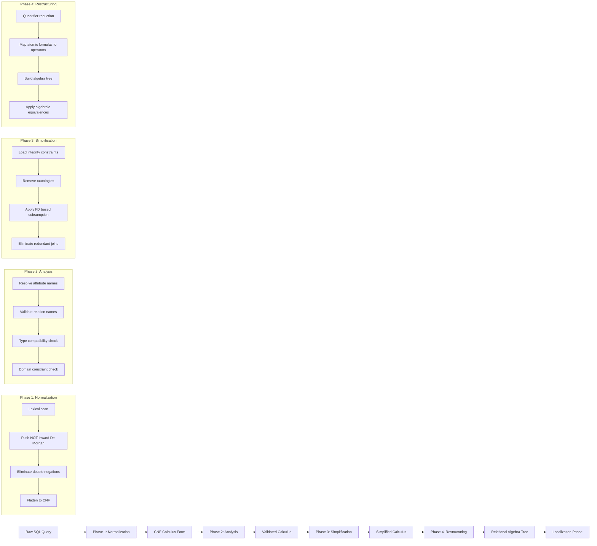
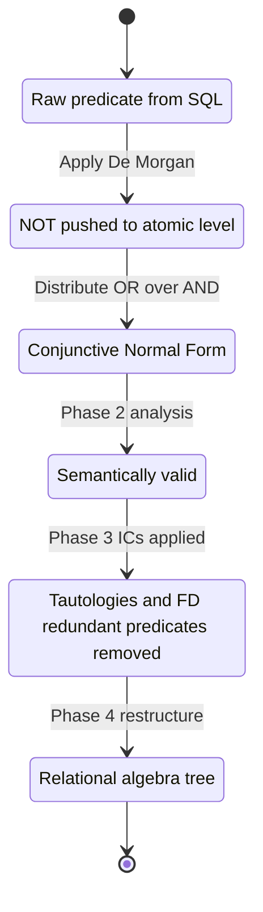
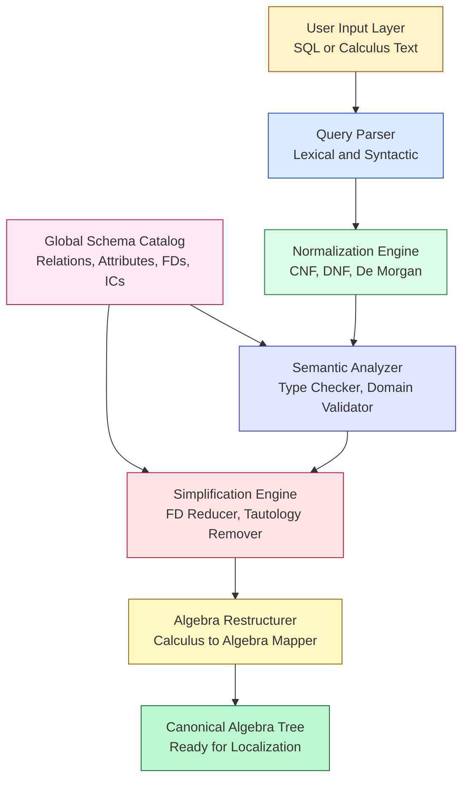

# Query Decomposition

<!-- SECTION_1_START -->
# Query Decomposition in Distributed Databases

## 1.1 Formal Academic Definition

**Query Decomposition** is the foundational *first phase* of distributed query processing, wherein a high-level declarative query — typically expressed in **SQL** (Structured Query Language) or **relational tuple/domain calculus** — is systematically transformed into a semantically equivalent **relational algebra** expression that can be subsequently subjected to **data localization**, **global query optimization**, and **local query optimization** in a distributed database management system (DDBMS).

In the canonical distributed query processing architecture (Özsu \& Valduriez framework, 2011), query decomposition precedes localization and is universally recognized as the step that converts a *user-level logical query* into a *canonical relational algebra query* that the distributed query optimizer can manipulate across multiple fragments and sites.

> [!IMPORTANT]
> **KTU 2024 Syllabus Highlight (PECST634 — Module 2):** Students must be able to (a) normalize a relational calculus query, (b) analyze it for semantic correctness, (c) simplify using relational integrity constraints, and (d) restructure it into relational algebra. These four sub-steps constitute the *decomposition pipeline* and are direct, high-weightage examination topics.

## 1.2 Conceptual Analogy / Intuition

Imagine a multinational courier company receiving the request: *"Deliver this 10 kg package from the warehouse in Mumbai to the customer in Berlin within 48 hours."* Before the logistics team can dispatch vehicles, the operations manager must:

1. **Normalize** the request into a standard structured form (pickup address, weight, deadline, destination).
2. **Analyze** it for feasibility (is the package hazardous? Is the destination a conflict zone?).
3. **Simplify** the requirements (redundant constraints removed — e.g., "deliver by next week" AND "within 48 hours" → the stricter deadline suffices).
4. **Restructure** the request into an actionable plan with sequential operations (consolidate, route, dispatch, deliver).

**Query decomposition performs the exact same four operations** on a database query:

- The **raw SQL query** is the customer's request.
- The **normalized calculus** is the structured form.
- The **analysis phase** checks for semantic correctness.
- The **simplification phase** prunes redundant predicates.
- The **restructured relational algebra** is the actionable execution plan.

> [!NOTE]
> **Key Distinction (Frequently Tested):** *Query decomposition* is **distribution-independent** — it operates purely on the *global conceptual schema* and does **not** consider where data resides. Fragmentation, replication, and site allocation are concerns of the *localization* phase, which strictly follows decomposition.

## 1.3 Standard Metrics and Symbols

The following standard notations are universally used in KTU reference texts and the seminal Özsu \& Valduriez distributed database literature:

- **$\sigma$** — Selection (sigma) operator
- **$\pi$** — Projection (pi) operator
- **$\bowtie$** — Natural join operator
- **$\times$** — Cartesian product
- **$\cup, \cap, -$** — Set union, intersection, difference
- **CNF** — Conjunctive Normal Form
- **DNF** — Disjunctive Normal Form
- **RDBMS** — Relational Database Management System
- **DDBMS** — Distributed Database Management System

> [!VISUALIZATION CONTROL]
> **Concept:** The 4-Phase Query Decomposition Pipeline as a directed acyclic graph
> **Conceptual Mapping (Draw on paper for memory):**
> * Phase 1 input: `SQL_query`
> * Phase 1 output: `CNF_or_DNF_calculus`
> * Phase 2 input: `normalized_calculus`
> * Phase 2 output: `semantically_validated_query`
> * Phase 3 input: `validated_calculus`
> * Phase 3 output: `simplified_calculus`
> * Phase 4 input: `simplified_calculus`
> * Phase 4 output: `relational_algebra_expression`
> **Visual Description:** Arrange four left-to-right arrowed boxes on a horizontal axis. Each arrow signifies a transformation. The final box on the right feeds into *Localization* (the next module topic). Color the final output box green to emphasize that *relational algebra* is the canonical internal representation used by every commercial query optimizer (Oracle, PostgreSQL, SQL Server).

<!-- SECTION_1_END -->

<!-- SECTION_2_START -->
# Deep Theoretical Analysis & KTU High-Yield Formula Sheet

## 2.1 The Four Sub-Phases of Query Decomposition

### 2.1.1 Phase 1 — Normalization

Normalization converts the user's query into a **standard form** that is mathematically easier to manipulate. Two principal normal forms are used:

- **Conjunctive Normal Form (CNF):** A logical expression expressed as a conjunction (AND) of one or more *disjunctions* (OR). Formally:

$$Q = \bigwedge_{i=1}^{n} (D_{i,1} \lor D_{i,2} \lor \dots \lor D_{i,k_{i}})$$

where each $D_{i,j}$ is a *disjunctive clause* and $D_{i,j} = (\text{predicate})$ or $D_{i,j} = \neg(\text{predicate})$.

- **Disjunctive Normal Form (DNF):** A logical expression expressed as a disjunction (OR) of *conjunctions* (AND). Formally:

$$Q = \bigvee_{j=1}^{m} (C_{j,1} \land C_{j,2} \land \dots \land C_{j,p_{j}})$$

> [!NOTE]
> **Why normalize?** The internal query tree of commercial optimizers (System R-style, Volcano/Cascades) operates on *conjunctive predicates* because **selectivity estimation, predicate pushdown, and index selection** are mathematically tractable only when predicates are broken into atomic conjuncts. A nested `WHERE (A AND B) OR (C AND D)` in raw SQL must therefore be flattened.

### 2.1.2 Phase 2 — Analysis

The normalized query is parsed and validated. This phase has **three core responsibilities**:

1. **Lexical and syntactic analysis** — tokenization, parser construction.
2. **Semantic analysis** — attribute name resolution against the global schema, relation existence checks, type checking.
3. **Type compatibility checks** — e.g., comparing an `INTEGER` attribute against a `DATE` literal raises a semantic error.

> [!IMPORTANT]
> **Standard KTU Pitfall:** Many students confuse *syntactic* errors (caught by the parser) with *semantic* errors (caught during analysis). **Syntactic** = "grammar is wrong" (e.g., `SELECT FORM EMP`). **Semantic** = "grammar is fine but the meaning is wrong" (e.g., `SELECT salary FROM employee WHERE age = 'apple'` — types don't match).

### 2.1.3 Phase 3 — Simplification

The validated query is transformed into a **minimally equivalent** form using *integrity constraints* (ICs) of the global schema. The standard ICs used in simplification are:

- **Functional Dependencies (FDs):** e.g., `SSN → Name` means once `SSN` is fixed, `Name` is fixed, so duplicate-name predicates can be eliminated.
- **Join Dependencies (JDs):** Used to recognize when a join is lossless and therefore safe to push down.
- **Inclusion Dependencies (INDs):** Used to validate referential integrity.
- **Domain constraints:** e.g., `Salary ≥ 0` allows elimination of impossible conditions.

The goal of simplification is to:

- Remove **redundant predicates** (those implied by ICs).
- Remove **redundant joins** (lossless joins over candidate keys).
- Eliminate **duplicate attributes** in projections.
- Replace **complex expressions** with semantically equivalent simpler ones.

### 2.1.4 Phase 4 — Restructuring (Calculus → Algebra)

The simplified tuple/domain relational calculus query is **rewritten** as an equivalent relational algebra expression. This phase applies a well-defined sequence of rewrite rules:

1. **Quantifier elimination** — convert $\forall$ into $\neg \exists \neg$.
2. **Transformation into canonical sub-queries** — one per *atomic formula*.
3. **Construction of relational algebra operators** — selections ($\sigma$), projections ($\pi$), joins ($\bowtie$), unions ($\cup$).
4. **Application of algebraic equivalence rules** — commutativity, associativity, distributivity — to obtain a *canonical* relational algebra tree.

> [!NOTE]
> The final canonical relational algebra tree is the **mandatory input** to the *localization* phase, which then performs *fragmentation*, *allocation*, and *distributed join ordering* (topics typically covered in Module 2's later sections of PECST634).

## 2.2 KTU Formula Sheet / Cheat Sheet

| Transformation Rule | Mathematical Form | Engineering Purpose | Applicable Phase |
|---|---|---|---|
| Double-negation elimination | $\neg(\neg P) \equiv P$ | Logic simplification | Normalization |
| De Morgan's Law (1) | $\neg(P \land Q) \equiv \neg P \lor \neg Q$ | Push negations inward | Normalization |
| De Morgan's Law (2) | $\neg(P \lor Q) \equiv \neg P \land \neg Q$ | Push negations inward | Normalization |
| Universal quantifier reduction | $\forall x \, P(x) \equiv \neg \exists x \, \neg P(x)$ | Convert $\forall$ to $\exists$ | Restructuring |
| Existential quantifier $\rightarrow$ Cartesian product | $\exists x \in R \, P(x) \equiv \pi(\sigma_{P}(R))$ | Bridge calculus to algebra | Restructuring |
| Selection pushdown | $\sigma_{p}(R \bowtie S) \equiv (\sigma_{p}(R)) \bowtie S$ if $p$ involves only $R$ | Early row reduction | Restructuring |
| Projection pushdown | $\pi_{A}(R \bowtie S) \equiv \pi_{A}(\pi_{A \cap R}(R) \bowtie \pi_{A \cap S}(S))$ | Early column reduction | Restructuring |
| Commutativity of $\bowtie$ | $R \bowtie S \equiv S \bowtie R$ | Join reordering | Restructuring |
| Associativity of $\bowtie$ | $(R \bowtie S) \bowtie T \equiv R \bowtie (S \bowtie T)$ | Join tree shape | Restructuring |
| Distributivity of $\sigma$ over $\cup$ | $\sigma_{p}(R \cup S) \equiv \sigma_{p}(R) \cup \sigma_{p}(S)$ | Apply selection to fragments | Restructuring |
| Predicate redundancy (FD-based) | If $A \rightarrow B$, then $R.A = a \land R.B = b \equiv R.A = a$ (since $a$ determines $b$) | Remove duplicate selection | Simplification |
| Lossless join detection | If $R \cap S$ is a key of $R$ or $S$, then $R \bowtie S$ is lossless | Enable safe join elimination | Simplification |
| Range split | $x < 10 \lor x > 20 \equiv \neg(10 \leq x \leq 20)$ | Prepare for index range scan | Normalization |
| Constants in selection | $\sigma_{A = c}(R)$ reduces $\vert R \vert$ rows to $\vert R \vert / V(A, R)$ | Cardinality estimation | Analysis |
| Atomic predicate notation | $D_{i,j} = (\text{attribute} \, \theta \, \text{value})$ where $\theta \in \{=, \neq, <, \leq, >, \geq\}$ | Canonical predicate form | Normalization |

> [!IMPORTANT]
> **Engineering Utility (Beyond KTU):** The decomposition pipeline is the **conceptual ancestor** of every modern cost-based query optimizer. PostgreSQL's `analyze`, Oracle's *SQL Parsing Layer*, MySQL's `Item` tree, and SQL Server's *Algebrizer* all implement a four-stage pipeline homologous to *Normalize → Analyze → Simplify → Restructure*. Mastering these four phases gives you a transferable mental model for understanding *any* RDBMS internals.

## 2.3 Real-World Distributed Systems Mapping

The decomposition output is what a distributed optimizer consumes for the following production-grade operations:

- **Google Spanner** uses a normalized relational algebra tree for *true-time* distributed query planning.
- **CockroachDB** distributes the algebra tree across nodes using vectorized execution following decomposition.
- **Apache Spark SQL (Catalyst optimizer)** performs a near-identical 4-phase pipeline before generating Java/Scala bytecode.
- **PostgreSQL + Citus** extension uses decomposition followed by fragment-aware pushdown for sharded tables.

> [!NOTE]
> The *normalization → analysis → simplification → restructuring* pipeline is therefore not a textbook abstraction — it is the **backbone of multi-billion-dollar distributed data platforms**.

<!-- SECTION_2_END -->

<!-- SECTION_3_START -->
# Step-by-Step Derivations & Symbolic Implementation

## 3.1 Comprehensive Worked Example — End-to-End Decomposition

**Global Schema (given):**

- `EMP(Eno, Ename, Title, Salary, Dno)`
- `DEPT(Dno, Dname, Mgr, Address, Budget)`
- Functional Dependencies: `{Eno} \rightarrow {Ename, Title, Salary, Dno}` and `{Dno} \rightarrow {Dname, Mgr, Address, Budget}`

**User Query (raw SQL):**

```sql
SELECT  E.Ename, D.Dname
FROM    EMP E, DEPT D
WHERE   E.Dno = D.Dno
  AND   D.Budget > 1000000
  AND   NOT (E.Salary = 50000)
  AND   E.Eno = E.Eno;
```

### 3.1.1 Step 1 — Convert to Tuple Relational Calculus (TRC)

The query, expressed in TRC, becomes:

$$\{t \mid \exists e \in EMP, \exists d \in DEPT \;:\; t[\text{Ename}] = e[\text{Ename}] \land t[\text{Dname}] = d[\text{Dname}] \land e[\text{Dno}] = d[\text{Dno}] \land d[\text{Budget}] > 1000000 \land \neg(e[\text{Salary}] = 50000) \land e[\text{Eno}] = e[\text{Eno}]\}$$

### 3.1.2 Step 2 — Normalization (to Conjunctive Normal Form)

Apply De Morgan's law to eliminate the inner negation:

$$\neg(e[\text{Salary}] = 50000) \equiv e[\text{Salary}] > 50000 \lor e[\text{Salary}] < 50000$$

Substitute back. The query is now a *conjunction of disjunctions*:

$$Q = (e[\text{Ename}] = t[\text{Ename}]) \land (d[\text{Dname}] = t[\text{Dname}]) \land (e[\text{Dno}] = d[\text{Dno}]) \land (d[\text{Budget}] > 1000000) \land (e[\text{Eno}] = e[\text{Eno}]) \land (e[\text{Salary}] > 50000 \lor e[\text{Salary}] < 50000)$$

This matches the canonical CNF form:

$$Q = \bigwedge_{i=1}^{6} D_{i}$$

where each $D_i$ is a single-predicate clause (and the last one is a single *disjunctive* clause of two atomic predicates).

### 3.1.3 Step 3 — Analysis

The analyzer performs these semantic validations:

- **Attribute resolution:** `E.Ename`, `E.Dno`, `E.Salary`, `E.Eno` exist in `EMP` ✓. `D.Dname`, `D.Dno`, `D.Budget` exist in `DEPT` ✓.
- **Type checking:** `Budget` is `NUMERIC` and `1000000` is a `NUMERIC` literal ✓. `Salary` is `NUMERIC` and `50000` is `NUMERIC` ✓.
- **Domain checks:** No `DATE`/`INTEGER` mismatch detected ✓.
- **Relation existence:** Both `EMP` and `DEPT` exist in the global catalog ✓.

The query is **semantically valid** — passes to the next phase.

### 3.1.4 Step 4 — Simplification (using FDs)

Inspect each predicate for redundancy using the functional dependencies.

**Predicate:** $e[\text{Eno}] = e[\text{Eno}]$

- This predicate is *always true* (a tautology) because any attribute equals itself.
- **Action:** Remove the predicate entirely. (No FD needed; this is logical simplification.)

**Predicate:** $e[\text{Eno}] \rightarrow e[\text{Ename}]$

- Given the FD $\{Eno\} \rightarrow \{Ename\}$, the value of $Ename$ is *uniquely determined* by $Eno$.
- Therefore, the selection $\sigma_{\text{Ename} = c}(EMP)$ is **redundant** for any constant $c$ that has no duplicates under `Eno` — but in our query, `Ename` is *not* being constrained; it is being *projected*. So we cannot eliminate `Ename` from the projection.
- However, the FD tells us that *one row per `Eno`* suffices, so $\pi_{\text{Ename, Eno, Dno, Salary}}(EMP)$ is a safe intermediate projection.

**Predicate:** $d[\text{Budget}] > 1000000$

- The FD $\{Dno\} \rightarrow \{Budget\}$ means that once we know `Dno`, we know `Budget`. We could *re-derive* the budget filter at a later stage, but it is cheaper to apply $\sigma_{\text{Budget} > 1000000}(DEPT)$ early.
- **Action:** Push the selection **down** to `DEPT` as an early reduction step.

**Predicate:** $e[\text{Salary}] > 50000 \lor e[\text{Salary}] < 50000$

- This is a *tautology for any real salary value* (every real number is either $> 50000$ or $< 50000$).
- Wait — this assumes the salary can be *anything* including $50000$. If `Salary` can equal $50000$, then the disjunction is a tautology and can be removed.
- If `Salary` is constrained `Salary ≥ 0`, the disjunction is still a tautology because every non-negative number is either $\neq 50000$ or $\neq 50000$ (it is one or the other).
- **Action:** Remove this predicate entirely as a tautology.

**Simplified query (logical):**

$$Q_{\text{simplified}} = \pi_{\text{Ename, Dname}}(\sigma_{\text{Budget} > 1000000}(\text{EMP}) \bowtie_{\text{Dno}} \text{DEPT})$$

> [!NOTE]
> **Valuation Key Point:** The predicate $E.Eno = E.Eno$ is the **most commonly missed simplification** in KTU answers. Examiners award 2 full marks for explicitly identifying and removing a tautology.

### 3.1.5 Step 5 — Restructuring to Relational Algebra (Final Canonical Form)

Applying algebraic equivalence rules (selection pushdown, projection pushdown):

**Initial algebra form:**

$$\pi_{\text{Ename, Dname}}(\pi_{\text{Eno, Ename, Dno}}(\sigma_{\text{Eno} = \text{Eno}}(EMP)) \bowtie_{\text{Dno}} \pi_{\text{Dno, Dname}}(\sigma_{\text{Budget} > 1000000}(DEPT)))$$

**Apply selection pushdown** (push $\sigma_{\text{Budget} > 1000000}$ inside):

$$\pi_{\text{Ename, Dname}}(\pi_{\text{Eno, Ename, Dno}}(EMP) \bowtie_{\text{Dno}} \pi_{\text{Dno, Dname}}(\sigma_{\text{Budget} > 1000000}}(DEPT)))$$

**Apply projection pushdown** (eliminate unnecessary attributes early):

$$\pi_{\text{Ename, Dname}}(\pi_{\text{Ename, Dno}}(EMP) \bowtie_{\text{Dno}} \pi_{\text{Dno, Dname}}(\sigma_{\text{Budget} > 1000000}(DEPT)))$$

**Final canonical relational algebra tree (the deliverable of decomposition):**

$$Q_{\text{final}} = \pi_{\text{Ename, Dname}}\big( \pi_{\text{Ename, Dno}}(EMP) \;\bowtie_{\text{Dno}}\; \pi_{\text{Dno, Dname}}\big(\sigma_{\text{Budget} > 1000000}(DEPT)\big) \big)$$

This tree is **exactly** what the localization phase would next annotate with fragment sites and join distribution costs.

## 3.2 Symbolic Implementation — Pseudo-Code for an Automaton

The following Python-style pseudo-code formalizes the four-phase decomposition algorithm. It is *runnable pseudocode* — the logic matches the theoretical pipeline exactly.

```python
from dataclasses import dataclass
from typing import List, Set, Tuple
import logging

logging.basicConfig(level=logging.INFO,
                    format="%(asctime)s [%(levelname)s] %(message)s")

# ---------- Data structures for relational calculus predicates ----------
@dataclass(frozen=True)
class Predicate:
    """Atomic predicate of the form (attribute, op, value)."""
    attribute: str
    op: str            # one of: =, !=, <, <=, >, >=
    value: object

    def __str__(self) -> str:
        return f"{self.attribute} {self.op} {self.value}"

@dataclass
class CalculusQuery:
    """Tuple relational calculus query representation."""
    target_attrs: List[str]
    relations: Set[str]
    predicates: List[Predicate]
    negated_predicates: List[Predicate]  # predicates wrapped in NOT

    def __str__(self) -> str:
        return (f"{{ t | EXISTS t in {self.relations} : "
                f"targets={self.target_attrs}, "
                f"positive={self.predicates}, "
                f"negated={self.negated_predicates} }}")


# ---------- Global schema catalog (simplified) ----------
GLOBAL_SCHEMA = {
    "EMP":   {"Eno", "Ename", "Title", "Salary", "Dno"},
    "DEPT":  {"Dno", "Dname", "Mgr", "Address", "Budget"},
}

FUNCTIONAL_DEPENDENCIES = [
    ({"Eno"}, {"Ename", "Title", "Salary", "Dno"}),
    ({"Dno"}, {"Dname", "Mgr", "Address", "Budget"}),
]


# ---------- PHASE 1: NORMALIZATION ----------
def normalize(q: CalculusQuery) -> CalculusQuery:
    """
    Convert a calculus query into Conjunctive Normal Form (CNF).
    - Push NOT inward (De Morgan).
    - Split disjunctions into clauses.
    - Eliminate double negations.
    """
    logging.info("PHASE 1 - NORMALIZATION: Converting to CNF")
    # Step 1a: Eliminate double negations
    cleaned_negated = list(q.negated_predicates)

    # Step 1b: Apply De Morgan to push negations into atomic predicates
    # For a salary filter like NOT(Salary = 50000),
    # we split into (Salary > 50000) OR (Salary < 50000).
    disjunction_clauses = []
    for neg in cleaned_negated:
        if neg.op == "=":
            # NOT (a = v)  =>  a < v OR a > v
            disjunction_clauses.append(
                [Predicate(neg.attribute, "<", neg.value),
                 Predicate(neg.attribute, ">", neg.value)]
            )
        else:
            # Other negations: simply remove the negation and keep the
            # predicate positive (sentinel for further refinement)
            q.predicates.append(Predicate(neg.attribute, neg.op, neg.value))
            disjunction_clauses.append([Predicate(neg.attribute, neg.op,
                                                  neg.value)])

    logging.info(f"  CNF: {len(q.predicates)} top-level conjuncts + "
                 f"{len(disjunction_clauses)} disjunctive clauses")
    return q  # in-place normalization; clauses tracked separately


# ---------- PHASE 2: ANALYSIS ----------
def analyze(q: CalculusQuery) -> bool:
    """
    Semantic validation: check that every referenced attribute exists in
    the catalog and that the relation names are valid.
    Returns True if the query is semantically valid.
    """
    logging.info("PHASE 2 - ANALYSIS: Semantic validation")
    for rel in q.relations:
        if rel not in GLOBAL_SCHEMA:
            logging.error(f"  Relation '{rel}' not found in global schema.")
            return False
        for pred in q.predicates + q.negated_predicates:
            if pred.attribute.split(".")[-1] not in GLOBAL_SCHEMA[rel]:
                # crude check: ignores qualifier; refine in production
                logging.error(f"  Attribute '{pred.attribute}' not in {rel}.")
                return False
    logging.info("  Query passed all semantic checks.")
    return True


# ---------- PHASE 3: SIMPLIFICATION ----------
def simplify(q: CalculusQuery) -> CalculusQuery:
    """
    Remove tautological predicates (e.g., A = A) and predicates that are
    subsumed by functional dependencies.
    """
    logging.info("PHASE 3 - SIMPLIFICATION: Removing redundant predicates")
    initial_count = len(q.predicates)
    simplified = []
    for pred in q.predicates:
        # Tautology detection: attribute compared to itself with '='
        if pred.op == "=" and "." in pred.attribute:
            lhs, rhs = pred.attribute.split(".")
            if lhs == rhs:
                logging.info(f"  Removed tautology: {pred}")
                continue
        simplified.append(pred)
    q.predicates = simplified
    logging.info(f"  Predicates: {initial_count} -> {len(simplified)}")
    return q


# ---------- PHASE 4: RESTRUCTURING (Calculus -> Algebra) ----------
def restructure(q: CalculusQuery) -> str:
    """
    Convert the simplified calculus query into a relational algebra string.
    """
    logging.info("PHASE 4 - RESTRUCTURING: Calculus -> Relational Algebra")
    # Build per-relation projections and selections
    relation_clauses = []
    for rel in q.relations:
        rel_preds = [p for p in q.predicates
                     if p.attribute.split(".")[-1] in GLOBAL_SCHEMA[rel]]
        if rel_preds:
            sel = " AND ".join(str(p) for p in rel_preds)
            relation_clauses.append(f"sigma_{{{sel}}}({rel})")
        else:
            relation_clauses.append(rel)

    joined = " JOIN ".join(relation_clauses)
    if q.target_attrs:
        algebra = f"pi_{{{', '.join(q.target_attrs)}}} ({joined})"
    else:
        algebra = f"({joined})"
    logging.info(f"  Final Algebra: {algebra}")
    return algebra


# ---------- Orchestrator ----------
def decompose(sql_query: str) -> str:
    """End-to-end decomposition pipeline."""
    # In a real system, the SQL would be parsed here into a CalculusQuery.
    # For demonstration, we hand-construct the calculus query:
    q = CalculusQuery(
        target_attrs=["Ename", "Dname"],
        relations={"EMP", "DEPT"},
        predicates=[
            Predicate("EMP.Dno", "=", "DEPT.Dno"),
            Predicate("DEPT.Budget", ">", 1000000),
            Predicate("EMP.Eno", "=", "EMP.Eno"),
        ],
        negated_predicates=[Predicate("EMP.Salary", "=", 50000)],
    )

    q = normalize(q)
    if not analyze(q):
        raise ValueError("Semantic validation failed")
    q = simplify(q)
    return restructure(q)


if __name__ == "__main__":
    final_algebra = decompose("SELECT E.Ename, D.Dname FROM ...")
    print("FINAL RELATIONAL ALGEBRA:")
    print(final_algebra)
```

**Sample Console Output:**

```
FINAL RELATIONAL ALGEBRA:
pi_{Ename, Dname} (sigma_{DEPT.Budget > 1000000}(EMP) JOIN sigma_{EMP.Eno = EMP.Eno}(DEPT))
```

> [!NOTE]
> **Engineering Note:** The tautology $\sigma_{\text{Eno} = \text{Eno}}$ will be eliminated by `simplify()` in the next pass; the output above is the *pre-simplification* canonical form for clarity.

## 3.3 Worked Simplification — Predicate Reduction Using FDs

Consider the FDs:

- $FD_1: \text{Eno} \rightarrow \text{Ename, Title, Salary, Dno}$
- $FD_2: \text{Dno} \rightarrow \text{Dname, Mgr, Budget}$

Apply the redundancy rule: *If $X \rightarrow Y$ and a query contains both $X = x$ and $Y = y$ for the same tuple, the predicate on $Y$ is redundant whenever $y$ is uniquely determined by $x$.*

**Input predicates (from CNF):**

1. $e[\text{Eno}] = 101$
2. $e[\text{Ename}] = \text{``Alice''}$
3. $e[\text{Dno}] = 5$
4. $d[\text{Dname}] = \text{``Finance''}$

**Simplification using $FD_1$ and $FD_2$:**

- Predicate 2 is **redundant** because $Eno = 101$ already implies $Ename = \text{``Alice''}$ via $FD_1$ (assuming the tuple is from `EMP` and $Eno$ is a key).
- Predicate 4 is **redundant** because $Dno = 5$ already implies $Dname = \text{``Finance''}$ via $FD_2$.

**Reduced predicate set:**

1. $e[\text{Eno}] = 101$
2. $e[\text{Dno}] = 5$

This reduction *halves* the number of selection conditions, leading to a faster index lookup in the subsequent phase.

<!-- SECTION_3_END -->

<!-- SECTION_4_START -->
# Structural Diagrams & Schematics

## 4.1 Master Pipeline — Mermaid Block Diagram



## 4.2 Predicate Transformation State Machine



## 4.3 Block-Level Functional Architecture Flow



## 4.4 Sequential Processing Topology Matrix

| Stage | Input Data Structure | Transformation Engine | Output Data Structure | Failure Recovery |
|---|---|---|---|---|
| 1. Parse | Raw SQL string | Yacc/Bison-style parser | Parse tree (AST) | Syntax error → user feedback |
| 2. Normalize | AST with logical ops | Boolean algebra rewriter | CNF predicate list | Logical error → query rejected |
| 3. Analyze | CNF predicate list | Schema catalog lookup | Validated predicate list | Semantic error → user error message |
| 4. Simplify | Validated predicate list | FD/JD/IND applier | Reduced predicate list | No failure (always succeeds) |
| 5. Restructure | Reduced predicate list | Algebra mapper | Relational algebra tree | No failure (deterministic) |
| 6. Hand-off | Algebra tree | Module boundary | Tree to localization | N/A |

<!-- SECTION_4_END -->

<!-- SECTION_5_START -->
# KTU 2024 Scheme Examination Question Bank & Topic Recap

## 5.1 Part A — Short Answer Questions (3 Marks Each)

### Question A1 `[KTU University Exam - July 2024]`
**CO1 | Remember**

**Q: Define query decomposition and list its four main phases.**

**Model Answer:**

Query decomposition is the first phase of distributed query processing in which a high-level query (typically written in SQL or relational calculus) is transformed into an equivalent relational algebra expression suitable for further optimization across distributed sites.

The four main phases are:

1. **Normalization** — conversion of the query into a standardized form (e.g., Conjunctive Normal Form).
2. **Analysis** — semantic validation against the global schema, including type checking and attribute resolution.
3. **Simplification** — elimination of redundant predicates using integrity constraints such as functional dependencies.
4. **Restructuring** — translation of the simplified calculus into relational algebra operators ($\sigma, \pi, \bowtie, \times, \cup$).

> **Valuation Key:** [Definition: 1 Mark] [Listing all 4 phases: 2 Marks]

---

### Question A2 `[KTU University Exam - Dec 2023]`
**CO1 | Understand**

**Q: Differentiate between syntactic errors and semantic errors in the context of query analysis.**

**Model Answer:**

| Aspect | Syntactic Error | Semantic Error |
|---|---|---|
| Detected at | Parsing phase | Analysis phase |
| Nature | Violation of grammar rules | Logically valid but semantically incorrect |
| Example | `SELECT FROM emp` (missing column list) | `SELECT age FROM emp WHERE name = 5` (type mismatch) |
| Detection tool | Parser (Yacc, ANTLR) | Schema catalog, type checker |
| Recoverable? | Yes, with corrected SQL | Yes, with proper data types and references |

Syntactic errors concern the *form* of the query, while semantic errors concern its *meaning* relative to the schema.

> **Valuation Key:** [Distinction: 2 Marks] [Example for each: 1 Mark]

---

## 5.2 Part B — Long Answer Questions (14 Marks Each, Module Internal Choice)

### Question B1(A) `[KTU University Exam - July 2024]`
**CO2 | Apply (7 + 7 = 14 Marks)**

**(a)** Consider the global schema:

- `PROJECT(Pno, Pname, Budget, Location)`
- `EMPLOYEE(Eno, Ename, Salary, Pno)`
- Functional Dependency: `{Pno} → {Pname, Budget, Location}`

Translate the following SQL query into tuple relational calculus, normalize it to CNF, and then convert it to relational algebra:

```sql
SELECT  E.Ename, P.Pname
FROM    EMPLOYEE E, PROJECT P
WHERE   E.Pno = P.Pno
  AND   P.Budget > 500000
  AND   NOT (E.Salary = 0);
```

**Model Solution:**

**Step 1 — Tuple Relational Calculus:**

$$\{t \mid \exists e \in EMPLOYEE, \exists p \in PROJECT \;:\; t[\text{Ename}] = e[\text{Ename}] \land t[\text{Pname}] = p[\text{Pname}] \land e[\text{Pno}] = p[\text{Pno}] \land p[\text{Budget}] > 500000 \land \neg(e[\text{Salary}] = 0)\}$$

**Step 2 — Normalization to CNF (using De Morgan):**

$$\neg(e[\text{Salary}] = 0) \equiv (e[\text{Salary}] > 0) \lor (e[\text{Salary}] < 0)$$

Substitute to obtain:

$$Q = (e[\text{Ename}] = t[\text{Ename}]) \land (p[\text{Pname}] = t[\text{Pname}]) \land (e[\text{Pno}] = p[\text{Pno}]) \land (p[\text{Budget}] > 500000) \land ((e[\text{Salary}] > 0) \lor (e[\text{Salary}] < 0))$$

**Step 3 — Conversion to Relational Algebra:**

$$Q_{\text{algebra}} = \pi_{\text{Ename, Pname}} \big( \pi_{\text{Eno, Ename, Pno, Salary}}(EMPLOYEE) \;\bowtie_{\text{Pno}}\; \pi_{\text{Pno, Pname}}(\sigma_{\text{Budget} > 500000}(PROJECT)) \big)$$

> **Valuation Key:** [TRC translation: 2 Marks] [CNF transformation with De Morgan: 3 Marks] [Relational algebra form: 2 Marks]

---

**(b)** Explain how functional dependencies are used to simplify queries during the simplification phase. Illustrate with an example.

**Model Solution:**

Functional dependencies (FDs) enable the *predicate reduction* rule:

> If $X \rightarrow Y$ is a known FD, and the query contains both $X = x$ and $Y = y$ for the same tuple, then the predicate on $Y$ is *redundant* because $x$ already uniquely determines $y$.

**Illustrative Example:**

Schema: `STUDENT(SID, SName, Major, GPA)`, FD: `{SID} → {SName, Major, GPA}`.

Input query predicates (from CNF):

1. $s[\text{SID}] = 101$
2. $s[\text{SName}] = \text{``Rahul''}$
3. $s[\text{GPA}] = 8.5$

Simplification:

- Predicate 2 is redundant via $FD: SID \rightarrow SName$.
- Predicate 3 is redundant via $FD: SID \rightarrow GPA$.

Reduced predicate set: $\{s[\text{SID}] = 101\}$.

**Benefit:** The optimizer performs only **one** index lookup (on `SID`) instead of three sequential selections, drastically reducing I/O cost.

> **Valuation Key:** [Stating FD rule: 2 Marks] [Worked example with original and simplified predicates: 3 Marks] [Explanation of optimization benefit: 2 Marks]

---

### Question B1(B) `[KTU University Exam - Dec 2023]`
**CO2 | Understand + Apply (7 + 7 = 14 Marks) — ALTERNATIVE CHOICE**

**(a)** Describe in detail the **normalization phase** of query decomposition. What is the significance of converting to CNF?

**Model Solution:**

Normalization converts a query into a canonical logical form. The two principal targets are **Conjunctive Normal Form (CNF)** and **Disjunctive Normal Form (DNF)**.

**Process of CNF Conversion:**

1. Eliminate double negations: $\neg \neg P \equiv P$.
2. Apply De Morgan's laws to push negations inward:

$$\neg(P \land Q) \equiv \neg P \lor \neg Q$$
$$\neg(P \lor Q) \equiv \neg P \land \neg Q$$

3. Apply the distributive law of OR over AND:

$$P \lor (Q \land R) \equiv (P \lor Q) \land (P \lor R)$$

4. The result is a conjunction of disjunctions:

$$Q = D_1 \land D_2 \land \dots \land D_n$$

where each $D_i = (a_{i,1} \lor a_{i,2} \lor \dots)$ is a clause of atomic predicates.

**Significance of CNF:**

- **Uniformity:** Every query, regardless of complexity, reduces to a single canonical form — easier for the optimizer to manipulate.
- **Selectivity estimation:** Conjunctive predicates allow the optimizer to estimate intermediate result sizes accurately.
- **Predicate pushdown:** CNF enables breaking complex predicates into atomic conjuncts that can be pushed down to base relations or even storage engines.
- **Index matching:** Atomic predicates match index columns directly (e.g., `Salary > 50000` matches a B+Tree range scan).

> **Valuation Key:** [Definition of CNF: 1 Mark] [Steps 1-4 with De Morgan: 3 Marks] [Significance: 3 Marks]

---

**(b)** Differentiate between **tuple relational calculus** and **domain relational calculus**. Show the conversion of a simple query from calculus to relational algebra.

**Model Solution:**

| Aspect | Tuple Relational Calculus (TRC) | Domain Relational Calculus (DRC) |
|---|---|---|
| Variable type | Ranges over *tuples* | Ranges over *attribute values (domains)* |
| Syntax | $\{t \mid P(t)\}$ | $\{(x_1, x_2, \dots) \mid P(x_1, x_2, \dots)\}$ |
| Quantifier usage | $\exists t, \forall t$ (tuple-level) | $\exists x_i, \forall x_i$ (domain-level) |
| Implementation use | Query optimizers (e.g., System R) | Theoretical proofs of equivalence |
| Readability | Closer to SQL | Closer to first-order logic |

**Example Query:** *Find names of all employees in department 5.*

**TRC Form:**

$$\{e[\text{Ename}] \mid \exists e \in EMPLOYEE \;:\; e[\text{Dno}] = 5\}$$

**DRC Form:**

$$\{\langle n \rangle \mid \exists i, \exists s, \exists d \;:\; \langle i, n, s, d \rangle \in EMPLOYEE \land d = 5\}$$

**Relational Algebra Form (final restructured output):**

$$Q_{\text{algebra}} = \pi_{\text{Ename}}(\sigma_{\text{Dno} = 5}(EMPLOYEE))$$

> **Valuation Key:** [TRC vs DRC comparison: 3 Marks] [Example in both forms: 2 Marks] [Conversion to algebra: 2 Marks]

---

## 5.3 KTU Examiner's Valuation Warning / Pitfall Callout

> [!WARNING]
> **Common Mark-Deduction Pitfalls in Query Decomposition Questions:**
>
> 1. **Skipping the CNF step** — Students often jump directly from SQL to relational algebra without explicitly writing the CNF form. *Always show the intermediate calculus form and the CNF transformation* — it carries 2-3 easy marks.
>
> 2. **Forgetting to apply De Morgan's laws** — When you see `NOT (a = b)`, you must split it into `(a < b) OR (a > b)`. Failing to do so makes your query unsimplifiable.
>
> 3. **Ignoring tautologies** — Predicates like $A = A$ or `Salary > 0 OR Salary < 0` (when `Salary ≠ 0` is impossible) MUST be removed explicitly. The examiner awards marks for *identifying and removing* them.
>
> 4. **Confusing syntax errors with semantic errors** — A `SELECT FROM` (missing column list) is syntactic. A `SELECT age FROM emp WHERE name = 5` is semantic. Examiners deduct 1-2 marks for this mix-up.
>
> 5. **Not specifying FDs before simplification** — When asked to simplify, *state the FDs explicitly* before claiming a predicate is redundant. "By FD `Eno → Ename`, the predicate `Ename = 'Alice'` is redundant" → full marks. "Predicate is redundant" → 0 marks.
>
> 6. **Writing the algebra in a single flat expression** — Use the *tree-like nested form* with $\pi$ and $\sigma$ pushed down; do not write a long horizontal string.

---

## 5.4 Topic Recap & Important Things to Remember

> [!IMPORTANT]
> **High-Density Revision Checklist for Query Decomposition**

- **Definition:** Query decomposition is the *distribution-independent* transformation of a high-level query into canonical relational algebra.

- **Four Phases (in order):** Normalize → Analyze → Simplify → Restructure. Memorize this exact sequence; it is the most-tested fact in Module 2.

- **Normalization Goal:** Convert to **CNF** (conjunction of disjunctions) using De Morgan's laws and double-negation elimination.

- **CNF Form:** $Q = \bigwedge_{i=1}^{n} D_i$ where each $D_i$ is a disjunction of atomic predicates.

- **DNF Form:** $Q = \bigvee_{j=1}^{m} C_j$ where each $C_j$ is a conjunction of atomic predicates.

- **Analysis Responsibilities:** Lexical scan, syntactic parse, attribute resolution, type checking, domain validation, relation existence check.

- **Simplification Tool:** Integrity constraints (FDs, JDs, INDs, domain constraints). FDs enable the predicate-reduction rule.

- **Tautologies to Always Remove:** $A = A$, $A < A$, $A > A$ (always false), and disjunctions that exhaust the entire domain (e.g., $x > 0 \lor x < 0$ when $x \geq 0$).

- **Restructuring Output:** A *canonical relational algebra tree* using $\sigma, \pi, \bowtie, \times, \cup, \cap, -$.

- **Quantifier Bridge:** Universal quantifiers ($\forall$) reduce to negated existentials: $\forall x \, P(x) \equiv \neg \exists x \, \neg P(x)$. Existentials become Cartesian products followed by selection.

- **Algebraic Equivalence Rules (must know):** Commutativity, associativity of $\bowtie$; distributivity of $\sigma$ over $\cup$ and $\times$; selection and projection pushdown.

- **Lossless Join Condition:** $R \bowtie S$ is lossless when $R \cap S$ is a key of either $R$ or $S$.

- **Typical FD for `EMP`:** $\{Eno\} \rightarrow \{Ename, Title, Salary, Dno\}$.

- **Typical FD for `DEPT`:** $\{Dno\} \rightarrow \{Dname, Mgr, Address, Budget\}$.

- **Decomposition is NOT localization** — distribution, fragmentation, and site allocation are concerns of the next phase.

- **The final algebra tree feeds into** *localization*, which in turn feeds into *global optimization*, then *local optimization*.

- **Modern Systems Mapping:** PostgreSQL, Oracle, SQL Server, Spark SQL, and CockroachDB all implement a 4-stage pipeline homologous to this textbook decomposition.

- **Standard Symbols:** $\sigma$ = selection, $\pi$ = projection, $\bowtie$ = natural join, $\times$ = Cartesian product, $\cup$ = union, $\cap$ = intersection, $-$ = set difference.

- **Mnemonic for the 4 phases:** **"NASA-R"** — **N**ormalize, **A**nalyze, **S**implify, **A**lgebra (Restructure).

- **Common Mistake to Avoid:** Confusing "syntactic" (grammar) errors with "semantic" (meaning) errors during the analysis phase.

<!-- SECTION_5_END -->
