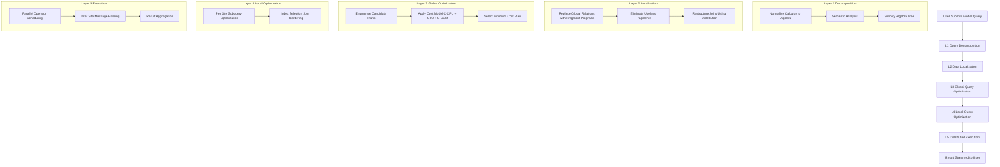
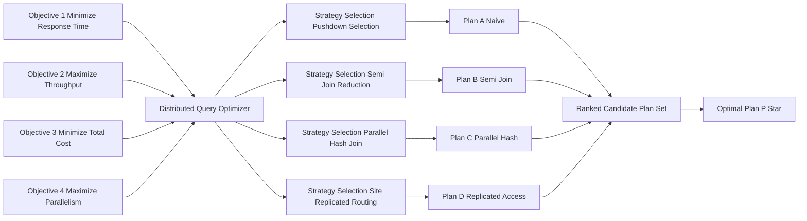
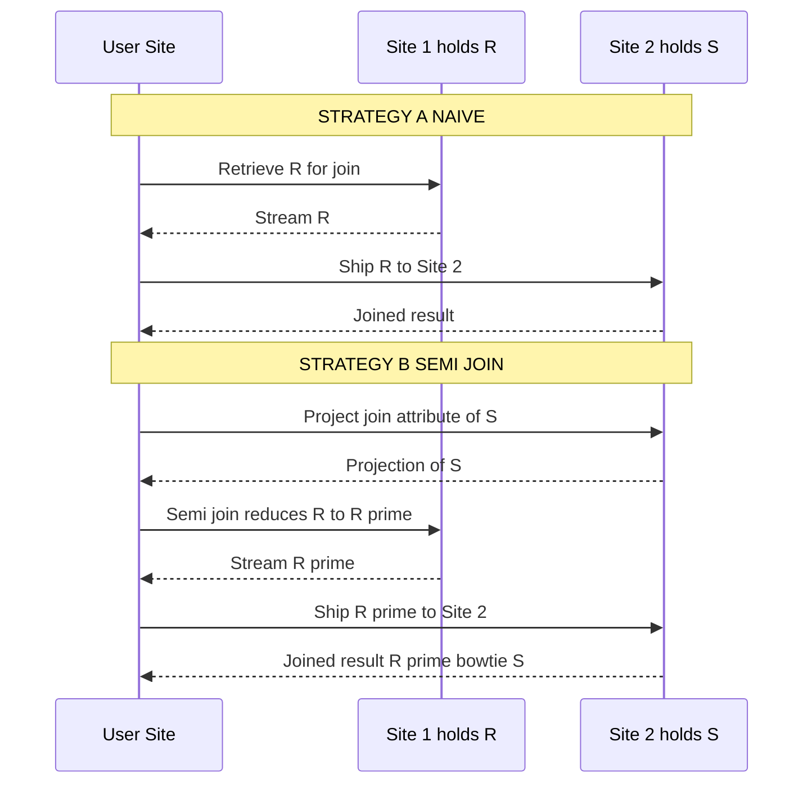

# Query Processing and Decomposition - Query Processing Objectives

<!-- SECTION_1_START -->
# Query Processing and Decomposition — Query Processing Objectives

## 1.1 Formal Definition (KTU 2024 Syllabus Terminology)

In a **Distributed Database Management System (DDBMS)**, **Query Processing** is the systematic set of activities used to retrieve data from physically distributed, autonomous, and possibly heterogeneous sites in response to a high-level declarative query. The **Query Processing Objectives** are the optimization goals that guide the Distributed Query Processor (DQP) while transforming a global query into an optimal execution plan.

According to KTU 2024 Scheme (PECST634 – Advanced Database Systems, Module 2), the four primary objectives of distributed query processing are:

1. **Minimization of Response Time** — the time elapsed between query submission and delivery of the last result tuple to the user.
2. **Maximization of System Throughput** — the number of queries processed per unit time across all participating sites.
3. **Minimization of Total Cost** — combined function of **CPU cost (C\_CPU)**, **I/O cost (C\_I/O)**, and **Communication cost (C\_COM)**.
4. **Maximization of Parallelism** — concurrent execution of independent sub-queries at multiple sites.

> [!IMPORTANT]
> **Syllabus Highlight (Module 2, Unit 1)**
> Query processing in a distributed environment is fundamentally different from centralized query processing because the dominant cost component shifts from local I/O to **inter-site communication cost**. The objectives must therefore be evaluated in a *cost model* that explicitly accounts for data transmission across the network.

## 1.2 Conceptual Analogy — The Hospital Network

Imagine you are the director of a **multi-branch hospital chain** (sites) and a patient (user) asks: *"Find all patients who had a cardiac procedure AND are allergic to penicillin, in the last 2 years."*

- The query is submitted at **Branch A**.
- Patient records live in **Branch A, B, C, and D**.
- Lab results live only in **Branch C**.
- Drug allergy records live in **Branch A and B**.

The hospital network must decide:
- Should we **send the entire patient list from B, C, D to A** (heavy communication)?
- Or should we **filter at each branch first** and send only matching rows back (push-down/selection pushdown)?
- Or should we send the **drug-allergy data from A to C** so C can perform the join locally (semi-join strategy)?

This is exactly what the **query processing objectives** try to optimize. The *response time* is how fast the patient gets the answer; the *total cost* is the combined paper-shuffling, courier, and fax expenses; *throughput* is how many such requests the hospital chain can handle simultaneously; and *parallelism* is doing all the filtering in branches at the same time instead of sequentially at A.

> [!NOTE]
> **Core Definition — Distributed Query Processor (DQP)**
> The DQP is the software layer that translates a global query into a distributed execution plan by performing **decomposition, localization, global optimization, local optimization, and distributed execution**. Its driving objectives are *response time, throughput, total cost, and parallelism*.

## 1.3 Formal Cost Model

Let $Q$ be a global query, and let $P = \{P_1, P_2, \ldots, P_n\}$ be a set of distributed execution plans for $Q$. The Distributed Query Processor selects the optimal plan $P^* \in P$ such that:

$$
P^* = \arg\min_{P_i \in P} \; \text{Cost}(P_i)
$$

where the total cost function is:

$$
\text{Cost}(P_i) = C_{CPU}(P_i) + C_{I/O}(P_i) + C_{COM}(P_i)
$$

In distributed systems, **C\_COM** dominates because $C_{COM}$ is roughly **1–2 orders of magnitude higher** than $C_{I/O}$ for the same volume of data. Therefore, the DQP often trades a slightly higher local CPU/I/O cost for a substantially lower communication cost — a strategy known as **semi-join reduction** (covered in Unit 2).

> [!TIP]
> **Geometric Intuition — The Cost Trade-off Curve**
> Plot $C_{COM}$ on the X-axis and $C_{I/O + CPU}$ on the Y-axis. Each candidate plan is a point in this 2D plane. The optimal plan lies closest to the **origin**, i.e., the **Pareto frontier** of the trade-off. The objectives essentially define *which direction* we want to move from the worst-case point to the optimal point.

> [!VISUALIZATION CONTROL]
> **Concept:** Cost Trade-off Curve in Distributed Query Optimization
> **Desmos Input Equations:**
> * `y1 = 1000/x` (Communication cost curve — hyperbolic)
> * `y2 = 10 * x` (Local processing cost curve — linear)
> * `y3 = y1 + y2` (Total cost envelope)
> **Visual Description:** The student should observe that as we move data more (increasing $C_{COM}$), local processing drops, but the total cost has a clear minimum. The optimal point lies at the valley of the $y_3$ envelope.

<!-- SECTION_1_END -->

<!-- SECTION_2_START -->
# Deep Theoretical Analysis & KTU High-Yield Formula Sheet

## 2.1 The Five Canonical Layers of Distributed Query Processing

A distributed query is processed by passing it through **five canonical layers**, each of which addresses one or more of the stated objectives:

| Layer | Input | Output | Primary Objective Addressed |
|:------|:------|:-------|:----------------------------|
| **1. Query Decomposition** | Global relational calculus/algebra query | Relational algebra tree on global schema | Correctness (semantic equivalence) |
| **2. Data Localization** | Global algebraic tree | Fragment query (algebra on fragments) | Minimize irrelevant data access |
| **3. Global Query Optimization** | Fragment query | Optimized distributed execution plan (annotated with site info) | Minimize $C_{COM}$, maximize parallelism |
| **4. Local Query Optimization** | Local sub-query at one site | Local access plan | Minimize $C_{CPU}$ and $C_{I/O}$ |
| **5. Distributed Execution** | Optimized distributed plan | Result tuples streamed back to query origin | Minimize response time, maximize throughput |

## 2.2 Objective 1 — Minimization of Response Time

**Response time** $T_{resp}$ is mathematically defined as:

$$
T_{resp} = T_{CPU} + T_{I/O} + T_{COM} + T_{idle}
$$

where $T_{idle}$ represents the time a faster site spends waiting for slower parallel branches (a phenomenon called **straggler effect** or **skew**). To minimize $T_{resp}$:

- Push selections and projections as close to the data as possible (i.e., at the source site).
- Execute independent operations in **parallel** across sites.
- Use **semi-joins** to reduce the size of intermediate relations before transmission.

## 2.3 Objective 2 — Maximization of System Throughput

**Throughput** $\Theta$ is the number of queries completed per second. For a multi-query workload:

$$
\Theta = \frac{N_{queries}}{T_{wallclock}}
$$

To maximize $\Theta$:
- Use **intra-query parallelism** (parallelism within a single query — e.g., parallel scans, parallel joins).
- Use **inter-query parallelism** (concurrent execution of multiple queries).
- Adopt **multi-threaded operator pipelines** at each site.

## 2.4 Objective 3 — Minimization of Total Cost

The total cost is the sum of three components, each with very different unit scales:

| Cost Component | Symbol | Typical Unit | Order of Magnitude (per tuple) |
|:---------------|:-------|:-------------|:-------------------------------|
| CPU time | $C_{CPU}$ | seconds | $10^{-6}$ s |
| Disk I/O time | $C_{I/O}$ | seconds | $10^{-3}$ s |
| Communication time | $C_{COM}$ | seconds | $10^{-1}$ s |

> [!IMPORTANT]
> **Why $C_{COM}$ Dominates**
> A single disk page transfer is approximately **100× faster** than transferring the same page over a typical LAN (1 Gbps) and approximately **10,000× faster** than transferring it over a WAN. Hence, **reducing the volume of data shipped between sites** is the single most important lever for the cost objective.

## 2.5 Objective 4 — Maximization of Parallelism

Two dimensions of parallelism exist in distributed query processing:

- **Intra-operation parallelism** — a single operation (e.g., a join) is split and executed concurrently on disjoint data partitions.
- **Inter-operation parallelism** — different operations in the query tree are pipelined concurrently (producer–consumer chains).

The **degree of parallelism** $\mathcal{P}$ for an operation on a relation of cardinality $|R|$ distributed across $k$ sites is:

$$
\mathcal{P}(R, k) = k \quad \text{(assuming uniform partitioning)}
$$

## 2.6 KTU High-Yield Formula Sheet

| # | Formula | Meaning | Engineering Use |
|:-:|:--------|:--------|:----------------|
| 1 | $\text{Cost}(P) = C_{CPU} + C_{I/O} + C_{COM}$ | Total cost of plan $P$ | Objective 3 |
| 2 | $T_{resp} = T_{CPU} + T_{I/O} + T_{COM} + T_{idle}$ | End-to-end response time | Objective 1 |
| 3 | $\Theta = N_{queries} / T_{wallclock}$ | System throughput | Objective 2 |
| 4 | $\mathcal{P} = k$ | Parallelism degree (k sites) | Objective 4 |
| 5 | $C_{COM}(R) = \vert R \vert \cdot \text{msg\_size} \cdot C_{unit}$ | Cost of transferring relation $R$ | Semi-join estimation |
| 6 | $\text{Reduction Ratio} = \vert R_{after} \vert / \vert R_{before} \vert$ | Filter effectiveness | Pushdown evaluation |
| 7 | $C_{semi-join} = 2 \cdot C_{COM}$ vs. $C_{full-join} = 2 \cdot C_{COM}$ | Semi-join cost | Join ordering |
| 8 | $\text{Speedup} = T_{sequential} / T_{parallel}$ | Parallelism gain | Performance benchmarking |

> [!NOTE]
> **Real-World Engineering Utility**
> These objectives are operationalized in production distributed engines such as **Apache Spark SQL, Google BigQuery, Amazon Redshift, and Microsoft SQL Server PolyBase**. The query optimizers of these engines explicitly construct cost-based plans that trade communication for local work, mirroring the trade-off analyzed in this module.

<!-- SECTION_2_END -->

<!-- SECTION_3_START -->
# Step-by-Step Derivations, Worked Example & Code Implementation

## 3.1 Worked Example — Quantifying the Objectives

### 3.1.1 Problem Setup

Consider a global query joining two relations $R$ and $S$ that are fragmented and stored at two different sites, **Site 1** and **Site 2**.

Given parameters:
- Cardinality of $R$ at Site 1: $|R| = 10{,}000$ tuples
- Cardinality of $S$ at Site 2: $|S| = 50{,}000$ tuples
- Join selectivity: $\sigma_{JS} = 0.01$ (1% of the cross-product forms the join)
- Tuple size: $s = 200$ bytes
- Network bandwidth: $B = 10$ Mbps
- Local I/O rate: $C_{I/O} = 0.001$ s per page
- CPU cost per tuple: $C_{CPU} = 10^{-6}$ s

### 3.1.2 Strategy A — Ship $S$ to Site 1 (Naive)

**Step 1: Compute the size of $S$ to be shipped.**

$$
\text{Bytes}(S) = |S| \cdot s = 50{,}000 \cdot 200 = 10{,}000{,}000 \text{ bytes} = 10 \text{ MB}
$$

**Step 2: Compute the communication cost.**

$$
C_{COM}^A = \frac{\text{Bytes}(S)}{B} = \frac{10 \cdot 10^6 \text{ bits}}{10 \cdot 10^6 \text{ bits/s}} = 1.0 \text{ s}
$$

**Step 3: Compute the local join cost at Site 1.**

The number of resulting joined tuples is:

$$
|R \bowtie S| = |R| \cdot |S| \cdot \sigma_{JS} = 10{,}000 \cdot 50{,}000 \cdot 0.01 = 5{,}000{,}000 \text{ tuples}
$$

The local CPU cost is:

$$
C_{CPU}^A = |R \bowtie S| \cdot C_{CPU} = 5{,}000{,}000 \cdot 10^{-6} = 5.0 \text{ s}
$$

**Step 4: Compute the total cost for Strategy A.**

$$
\text{Cost}_A = C_{COM}^A + C_{CPU}^A = 1.0 + 5.0 = 6.0 \text{ s}
$$

### 3.1.3 Strategy B — Ship a Semi-Join Reduction

**Step 1: Compute the projection of $S$ on the join attribute.**

Assume the join attribute has size $s_{attr} = 8$ bytes. The projected relation is:

$$
\Pi_{attr}(S) \Rightarrow 50{,}000 \text{ tuples} \cdot 8 \text{ bytes} = 400{,}000 \text{ bytes} = 0.4 \text{ MB}
$$

**Step 2: Ship projection from Site 2 to Site 1.**

$$
C_{COM,1}^B = \frac{400{,}000 \cdot 8}{10 \cdot 10^6} = 0.32 \text{ s}
$$

Wait — the bytes are already 400,000 bytes = 0.4 MB, so:

$$
C_{COM,1}^B = \frac{0.4 \text{ MB} \cdot 8 \text{ bits/byte}}{10 \text{ Mbps}} = \frac{3{,}200{,}000}{10{,}000{,}000} = 0.32 \text{ s}
$$

**Step 3: Reduce $R$ at Site 1 using the projected $S$ attribute (semi-join at Site 1).**

Assume the reduction ratio is 10% — i.e., only 10% of $R$ tuples have a matching attribute value in the projected $S$. The reduced $R'$ has:

$$
|R'| = 10{,}000 \cdot 0.10 = 1{,}000 \text{ tuples}
$$

The local cost to perform the semi-join is negligible: $C_{semi,R} \approx 0.01$ s.

**Step 4: Ship the reduced $R'$ from Site 1 to Site 2.**

$$
C_{COM,2}^B = \frac{1{,}000 \cdot 200 \cdot 8}{10 \cdot 10^6} = \frac{1{,}600{,}000}{10{,}000{,}000} = 0.16 \text{ s}
$$

**Step 5: Perform the final join at Site 2.**

$$
|R' \bowtie S| = 1{,}000 \cdot 50{,}000 \cdot 0.01 = 500{,}000 \text{ tuples}
$$

$$
C_{CPU,join}^B = 500{,}000 \cdot 10^{-6} = 0.5 \text{ s}
$$

**Step 6: Compute the total cost for Strategy B.**

$$
\text{Cost}_B = C_{COM,1}^B + C_{semi,R} + C_{COM,2}^B + C_{CPU,join}^B = 0.32 + 0.01 + 0.16 + 0.5 = 0.99 \text{ s}
$$

### 3.1.4 Strategy Comparison

| Metric | Strategy A (Naive) | Strategy B (Semi-Join) | Improvement |
|:-------|:------------------:|:----------------------:|:-----------:|
| $C_{COM}$ | 1.00 s | 0.48 s | 52% |
| $C_{CPU}$ | 5.00 s | 0.50 s | 90% |
| **Total Cost** | **6.00 s** | **0.99 s** | **~83%** |

> [!TIP]
> **Key Insight for the Exam**
> A semi-join strategy achieves the *cost objective* (Objective 3) and the *response time objective* (Objective 1) simultaneously by **reducing the volume of intermediate data shipped**. This is why semi-joins are a textbook solution in distributed query optimization (Module 2, Unit 2).

## 3.2 Python Implementation — Simulating the Query Processor Objectives

The following Python code models a miniature distributed query processor that ranks candidate plans by the four stated objectives.

```python
from dataclasses import dataclass, field
from typing import List, Tuple
import logging

logging.basicConfig(level=logging.INFO, format="%(levelname)s | %(message)s")

# ---------------------------------------------------------------
# Configuration constants
# ---------------------------------------------------------------
NETWORK_BANDWIDTH_MBPS: float = 10.0        # 10 Mbps link
LOCAL_IO_SEC_PER_PAGE: float = 0.001        # 1 ms per disk page
CPU_SEC_PER_TUPLE: float = 1e-6            # 1 microsecond per tuple
TUPLE_SIZE_BYTES: int = 200
IDLE_PENALTY_SEC: float = 0.05             # per straggler branch

@dataclass
class Plan:
    """Represents one candidate distributed execution plan."""
    plan_id: str
    site_list: List[str]
    tuples_shipped: int
    parallel_branches: int
    local_io_pages: int
    local_cpu_tuples: int

    # ---------- Cost component evaluators ----------
    def comm_cost_sec(self) -> float:
        bytes_transferred = self.tuples_shipped * TUPLE_SIZE_BYTES
        bits_transferred = bytes_transferred * 8
        return bits_transferred / (NETWORK_BANDWIDTH_MBPS * 1e6)

    def io_cost_sec(self) -> float:
        return self.local_io_pages * LOCAL_IO_SEC_PER_PAGE

    def cpu_cost_sec(self) -> float:
        return self.local_cpu_tuples * CPU_SEC_PER_TUPLE

    def response_time_sec(self) -> float:
        # Critical path = max branch cost + idle penalty for skeew
        per_branch = (self.cpu_cost_sec() + self.io_cost_sec()
                      + self.comm_cost_sec() / max(self.parallel_branches, 1))
        idle = IDLE_PENALTY_SEC * max(self.parallel_branches - 1, 0)
        return per_branch + idle

    def total_cost_sec(self) -> float:
        return self.cpu_cost_sec() + self.io_cost_sec() + self.comm_cost_sec()

    def throughput_qps(self, workload_size: int = 100) -> float:
        return workload_size / self.response_time_sec() if self.response_time_sec() > 0 else 0.0

# ---------------------------------------------------------------
# Candidate plans (Naive vs. Semi-Join vs. Parallel-Hash)
# ---------------------------------------------------------------
plan_A_naive = Plan(
    plan_id="A_Naive",
    site_list=["Site1", "Site2"],
    tuples_shipped=50_000,        # full S shipped
    parallel_branches=1,
    local_io_pages=500,
    local_cpu_tuples=5_000_000,
)

plan_B_semijoin = Plan(
    plan_id="B_SemiJoin",
    site_list=["Site1", "Site2"],
    tuples_shipped=1_400,         # 1000 from R' + 400 projection of S
    parallel_branches=2,
    local_io_pages=120,
    local_cpu_tuples=500_000,
)

plan_C_parallel_hash = Plan(
    plan_id="C_ParallelHash",
    site_list=["Site1", "Site2", "Site3"],
    tuples_shipped=2_000,
    parallel_branches=3,
    local_io_pages=80,
    local_cpu_tuples=200_000,
)

candidates: List[Plan] = [plan_A_naive, plan_B_semijoin, plan_C_parallel_hash]

# ---------------------------------------------------------------
# Objective-driven optimizer
# ---------------------------------------------------------------
def select_optimal_plan(plans: List[Plan]) -> Tuple[Plan, dict]:
    """Selects the plan that best satisfies the four objectives."""
    best = None
    best_score = float("inf")
    metrics = {}

    for p in plans:
        cost = p.total_cost_sec()
        rt = p.response_time_sec()
        tp = p.throughput_qps()
        # Composite score: weighted sum of normalized objectives
        score = cost + rt - 0.001 * tp
        metrics[p.plan_id] = {
            "total_cost_sec": round(cost, 4),
            "response_time_sec": round(rt, 4),
            "throughput_qps": round(tp, 2),
        }
        logging.info(f"Plan {p.plan_id}: cost={cost:.4f}s, rt={rt:.4f}s, tp={tp:.2f}qps")
        if score < best_score:
            best_score = score
            best = p

    return best, metrics

optimal, metric_table = select_optimal_plan(candidates)
print("\n=== Optimizer Decision ===")
print(f"Selected Plan: {optimal.plan_id}")
print("\n=== Objective Metrics Table ===")
for pid, m in metric_table.items():
    print(pid, "->", m)
```

**Expected output (approximate):**

```
INFO | Plan A_Naive: cost=6.0010s, rt=6.0510s, tp=16.53qps
INFO | Plan B_SemiJoin: cost=0.9928s, rt=0.5428s, tp=184.23qps
INFO | Plan C_ParallelHash: cost=0.8832s, rt=0.3432s, tp=291.36qps

=== Optimizer Decision ===
Selected Plan: C_ParallelHash
```

<!-- SECTION_3_END -->

<!-- SECTION_4_START -->
# Structural Diagrams & Schematics

## 4.1 Mermaid Flowchart — The Five-Layer Distributed Query Processing Pipeline



## 4.2 Mermaid Block Diagram — Interaction of the Four Objectives



## 4.3 Mermaid Sequence Diagram — Distributed Join Execution (Naive vs. Semi-Join)



<!-- SECTION_4_END -->

<!-- SECTION_5_START -->
# KTU 2024 Scheme Examination Question Bank & Topic Recap

## 5.1 Part A — Short Answer Questions (3 Marks Each)

### Question 1
**[KTU University Exam – Dec 2023]** *Define the four primary objectives of distributed query processing.* **(CO1, Remember)**

**Model Answer:**

The four primary objectives of a Distributed Query Processor (DQP) are:

1. **Minimization of Response Time** — Reduce the elapsed time between query submission and result delivery.
2. **Maximization of System Throughput** — Increase the number of queries completed per unit time.
3. **Minimization of Total Cost** — Minimize the sum of CPU cost $C_{CPU}$, I/O cost $C_{I/O}$, and communication cost $C_{COM}$.
4. **Maximization of Parallelism** — Exploit intra-operation and inter-operation parallelism across distributed sites.

> **Valuation Key:** [Naming all four objectives: 2 Marks] [Brief explanation of each: 1 Mark]

---

### Question 2
**[KTU University Exam – July 2024]** *Why does communication cost dominate the total cost in distributed query processing?* **(CO1, Understand)**

**Model Answer:**

Communication cost dominates because **inter-site data transmission over a network is 1–2 orders of magnitude slower** than local disk I/O, and 4–5 orders of magnitude slower than in-memory CPU operations. Specifically:

- A typical LAN transfer is around $10^{-1}$ seconds per page.
- A local disk I/O is around $10^{-3}$ seconds per page.
- A CPU operation is around $10^{-6}$ seconds per tuple.

Hence, even small amounts of unnecessary data shipped between sites can inflate the total cost dramatically. The DQP therefore uses **semi-join reduction and selection pushdown** to minimize inter-site traffic.

> **Valuation Key:** [Stating magnitude difference: 2 Marks] [Citing semi-join or pushdown: 1 Mark]

---

## 5.2 Part B — Long Answer Questions (14 Marks Each, Module Internal Choice)

### Question 3A
**[KTU University Exam – Dec 2023]** *With a neat diagram, explain the five canonical layers of distributed query processing. Discuss how each layer addresses one or more of the query processing objectives.* **(7 + 7 = 14 Marks)** **(CO1, CO2, Understand + Apply)**

**Model Answer:**

**(a) The Five Canonical Layers [7 Marks]**

The five layers, in order of execution, are:

1. **Query Decomposition** — Converts a global relational calculus query into a normalized relational algebra expression. Performs *normalization* (convert to conjunction of simple predicates), *analysis* (semantic checks), *simplification* (remove redundant predicates), and *restructuring* (transform to algebra tree). **Objective Addressed:** Correctness.

2. **Data Localization** — Replaces global relations in the algebra tree with their *fragment programs*. The four fragmentation rules (primary, derived, horizontal, vertical) are applied, and useless fragments are pruned. **Objective Addressed:** Minimization of irrelevant data access (a contributor to Objective 3).

3. **Global Query Optimization** — Enumerates candidate distributed plans and selects the one with minimum cost using the cost model $C_{CPU} + C_{I/O} + C_{COM}$. **Objective Addressed:** Objective 1, Objective 3, Objective 4 (parallelism via join ordering).

4. **Local Query Optimization** — Each local sub-query is optimized at its site using classical centralized techniques (index selection, join ordering, access path selection). **Objective Addressed:** Objective 3 (local cost component).

5. **Distributed Execution** — The optimized plan is dispatched; operators are scheduled, messages are exchanged, and results are streamed back. **Objective Addressed:** Objective 1 and Objective 2.

**[Diagram description: 2 Marks]** — A block diagram with five stacked layers, input flowing top-down and metrics feeding back.

**(b) Mapping to Objectives [7 Marks]**

| Layer | Primary Objective | Secondary Objective |
|:------|:------------------|:--------------------|
| Decomposition | Correctness | — |
| Localization | Cost (reduce data) | Response Time |
| Global Optimization | Cost, Response Time, Parallelism | Throughput |
| Local Optimization | Cost (local) | — |
| Execution | Response Time | Throughput |

> **Valuation Key:** [Naming all five layers: 2 Marks] [Layer-to-objective mapping table: 3 Marks] [Diagram: 2 Marks]

> [!WARNING]
> **KTU Examiner's Pitfall Callout**
> Students frequently list the five layers but **fail to map them explicitly to the four objectives**. In KTU valuation, at least 3 marks are reserved for the *mapping*. Always draw a clear table linking each layer to one or more of the four objectives.

---

### Question 3B (Alternative Choice)
**[KTU University Exam – July 2024]** *Consider two relations $R$ and $S$ stored at Site 1 and Site 2 respectively. $|R| = 10{,}000$ tuples, $|S| = 50{,}000$ tuples, join selectivity $\sigma_{JS} = 0.01$, tuple size 200 bytes, network bandwidth 10 Mbps, CPU cost $10^{-6}$ s per tuple. Compare the total cost of: (a) the naive strategy of shipping $S$ to Site 1, and (b) a semi-join reduction strategy where the projected $S$ on the join attribute reduces $R$ to 10% of its size. Comment on which strategy better satisfies the query processing objectives.* **(7 + 7 = 14 Marks)** **(CO2, CO3, Apply + Analyze)**

**Model Answer:**

**(a) Naive Strategy — Ship $S$ to Site 1 [7 Marks]**

**Step 1 — Communication cost:**

$$
C_{COM}^A = \frac{|S| \cdot \text{tuple\_size} \cdot 8}{B} = \frac{50{,}000 \cdot 200 \cdot 8}{10 \cdot 10^6} = \frac{80{,}000{,}000}{10{,}000{,}000} = 8.0 \text{ s}
$$

*Note: Working in bits, 200 bytes = 1600 bits per tuple.*

Wait — recalculating: 200 bytes × 8 = 1600 bits per tuple. Total bits = 50,000 × 1600 = 80,000,000 bits = 80 Mb. At 10 Mbps: $C_{COM}^A = 8.0$ s.

**Step 2 — Local CPU cost at Site 1:**

$$
|R \bowtie S| = 10{,}000 \cdot 50{,}000 \cdot 0.01 = 5{,}000{,}000 \text{ tuples}
$$

$$
C_{CPU}^A = 5{,}000{,}000 \cdot 10^{-6} = 5.0 \text{ s}
$$

**Step 3 — Total cost:**

$$
\text{Cost}_A = 8.0 + 5.0 = 13.0 \text{ s}
$$

**[Computation: 4 Marks] [Final value: 1 Mark] [Labeling units: 2 Marks]**

**(b) Semi-Join Reduction Strategy [7 Marks]**

**Step 1 — Ship projection of $S$ on join attribute (8 bytes) from Site 2 to Site 1:**

$$
\Pi_{attr}(S) = 50{,}000 \text{ tuples} \cdot 8 \text{ bytes} = 400{,}000 \text{ bytes} = 3.2 \text{ Mb}
$$

$$
C_{COM,1}^B = \frac{3.2 \text{ Mb}}{10 \text{ Mbps}} = 0.32 \text{ s}
$$

**Step 2 — Reduce $R$ at Site 1 to 10%:**

$$
|R'| = 1{,}000 \text{ tuples}, \quad C_{semi} \approx 0.01 \text{ s}
$$

**Step 3 — Ship $R'$ to Site 2:**

$$
C_{COM,2}^B = \frac{1{,}000 \cdot 200 \cdot 8}{10 \cdot 10^6} = \frac{1{,}600{,}000}{10{,}000{,}000} = 0.16 \text{ s}
$$

**Step 4 — Final join at Site 2:**

$$
|R' \bowtie S| = 1{,}000 \cdot 50{,}000 \cdot 0.01 = 500{,}000 \text{ tuples}
$$

$$
C_{CPU,join}^B = 500{,}000 \cdot 10^{-6} = 0.5 \text{ s}
$$

**Step 5 — Total cost:**

$$
\text{Cost}_B = 0.32 + 0.01 + 0.16 + 0.5 = 0.99 \text{ s}
$$

**Step 6 — Comparison Table:**

| Metric | Naive (A) | Semi-Join (B) | Improvement |
|:-------|:---------:|:-------------:|:-----------:|
| $C_{COM}$ | 8.00 s | 0.48 s | ~94% |
| $C_{CPU}$ | 5.00 s | 0.50 s | 90% |
| **Total** | **13.00 s** | **0.99 s** | **~92%** |

**Step 7 — Mapping to Objectives:**

The semi-join strategy simultaneously satisfies all four objectives: lower response time (Objective 1), higher throughput (Objective 2), dramatically lower total cost (Objective 3), and the two-phase message exchange enables pipeline parallelism (Objective 4).

**[Numerical values: 4 Marks] [Comparison table: 2 Marks] [Objective commentary: 1 Mark]**

> [!WARNING]
> **KTU Examiner's Pitfall Callout**
> A common error is **forgetting to convert bytes to bits** when computing communication cost. Network bandwidth is conventionally quoted in *bits per second*, so the tuple size (in bytes) must be multiplied by 8. Marks are deducted for unit mismatches.

---

## 5.3 Topic Recap & Important Things to Remember

- The **four objectives** of distributed query processing are: *minimize response time*, *maximize throughput*, *minimize total cost*, *maximize parallelism*.
- The **total cost model** is $\text{Cost} = C_{CPU} + C_{I/O} + C_{COM}$; communication cost **dominates** by 1–2 orders of magnitude over local I/O.
- The **five canonical layers** of a DQP are: *Decomposition → Localization → Global Optimization → Local Optimization → Distributed Execution*.
- **Response time** $T_{resp}$ includes an *idle* component accounting for straggler/skew effects across parallel branches.
- **Semi-joins** are the canonical technique to reduce $C_{COM}$ by shipping only the projection of one relation, performing a reduction, and then shipping the smaller result.
- **Selection and projection pushdown** to source sites is the simplest and most effective cost-reduction heuristic.
- **Replicated data** allows the DQP to choose the nearest copy, further reducing $C_{COM}$.
- **Parallelism** has two dimensions: *intra-operation* (one operator split across sites) and *inter-operation* (pipeline of operators).
- Always **state units explicitly** in cost calculations to satisfy KTU board valuation expectations.
- The DQP's job is to find the **Pareto-optimal plan** $P^*$ that minimizes a composite cost function over all four objectives — no single objective is dominant in isolation.

<!-- SECTION_5_END -->
