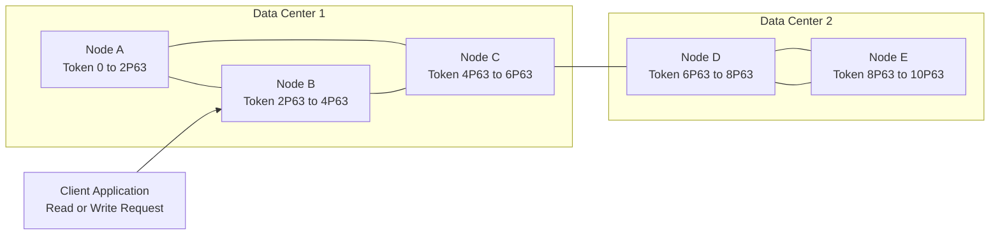
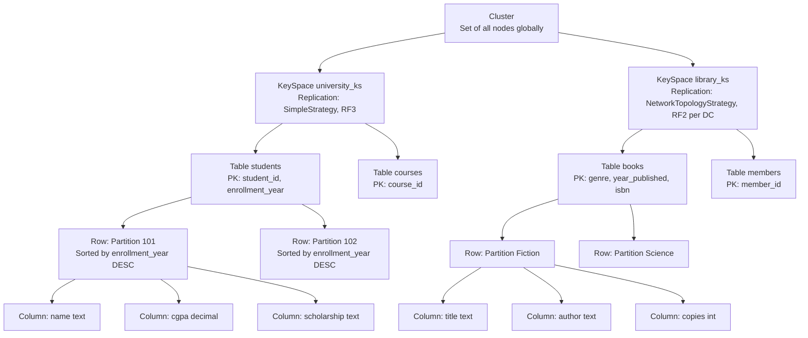
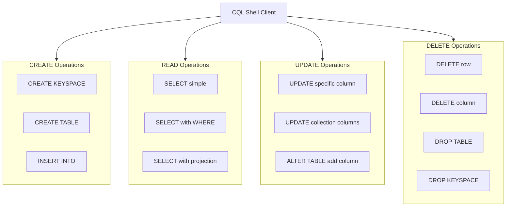
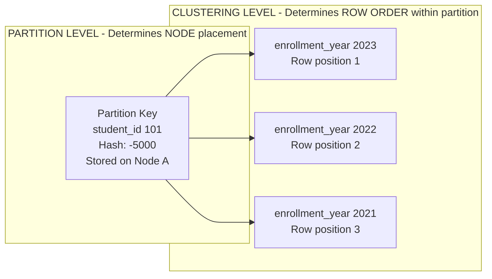

# Cassandra - Data Model, Key Space, Table Operations, CRUD Operations

<!-- SECTION_1_START -->

# Cassandra: Data Model, KeySpace, Table Operations, and CRUD Operations

## 1. Core Technical Definition & Intuitive Overview

> [!IMPORTANT]
> **Definition (KTU 2024 Scheme Standard):**
> **Apache Cassandra** is a highly scalable, distributed, peer-to-peer **NoSQL (Not Only SQL)** wide-column store database engineered to handle massive volumes of structured, semi-structured, and unstructured data across multiple commodity servers without a single point of failure. It is governed by the **CAP Theorem**, specifically optimized to deliver **Availability and Partition Tolerance (AP)** with eventual consistency.

### 1.1 Intuitive Real-World Analogy

Imagine a **massive public library** spread across 10 different cities. Instead of one central librarian, **every city has identical copies** of the catalog. When a new book arrives, every city gets updated. When a reader in City 3 queries for a book, the **nearest city's catalog responds instantly**, without needing to call City 1 (the "central server"). Cassandra works exactly like this:

- **Nodes** = Individual city libraries
- **Data Centers** = Geographic regions
- **KeySpace** = The entire library system (logical container)
- **Tables (Column Families)** = Individual sections (Fiction, Science, History)
- **Rows** = Specific books
- **Columns** = Attributes of each book (Title, Author, ISBN, Year)

> [!NOTE]
> **Why Cassandra Matters in Industry (2024 Industry Standards):**
> Used by **Netflix, Apple, Instagram, Uber, and Discord** for systems requiring millisecond-level reads/writes on petabytes of data with zero downtime. Its **Gossip Protocol** allows nodes to communicate and stay synchronized in a completely decentralized manner.

### 1.2 The CAP Theorem Positioning

> [!TIP]
> **CAP Theorem (Eric Brewer, 2000):** In any distributed data store, you can only strongly guarantee two of the following three simultaneously:
> - **C**onsistency (every read receives the most recent write)
> - **A**vailability (every request receives a response, even if some nodes fail)
> - **P**artition Tolerance (system continues operating despite network failures)
>
> Cassandra is an **AP system** — it sacrifices strict consistency for availability and partition tolerance, using tunable consistency per query.

### 1.3 Cassandra Data Model — Hierarchical Architecture

The Cassandra data model follows a strict **4-tier hierarchy**:

$$\text{Cluster} \rightarrow \text{KeySpace} \rightarrow \text{Table (Column Family)} \rightarrow \text{Row (Partition)}$$

Each tier is defined as follows:

| Hierarchy Level | Formal Definition | Real-World Analogy |
|---|---|---|
| **Cluster** | The complete set of nodes treated as a single logical unit | The entire library network |
| **KeySpace** | Top-level namespace defining data replication strategy | A specific library branch |
| **Table** | A collection of rows sharing a schema, similar to RDBMS tables | A section of books |
| **Row / Partition** | A collection of columns identified by a **Primary Key** | A specific book record |

> [!VISUALIZATION CONTROL]
> **Concept:** Cassandra Wide-Column Row Internal Structure
> **Conceptual Visualization (Mermaid-friendly data points):**
> * Row Key: `student_001`
> * Columns: `{ name: "Arjun", gpa: 9.2, dept: "CSE", semester: 6 }`
> * Visual Description: Imagine a horizontal record where each cell can have a different name, and columns are dynamic — not all rows need to share the same columns.

---

<!-- SECTION_1_END -->

<!-- SECTION_2_START -->

# 2. Deep Theoretical Analysis & KTU High-Yield Formula Sheet

## 2.1 The Cassandra Data Model — Components in Detail

### 2.1.1 KeySpace (Top-Level Container)

A **KeySpace** in Cassandra is analogous to a **schema** or **database** in RDBMS. It defines:
1. The **replication strategy** (how data copies are distributed)
2. The **replication factor** (number of copies maintained)

**KeySpace Operational Properties:**
- Defined using: `CREATE KEYSPACE`
- A cluster can contain **multiple KeySpaces**
- Each KeySpace can have **multiple Tables**
- Replica placement is determined by the strategy

#### Two Replication Strategies in KTU Syllabus

> [!IMPORTANT]
> **Strategy 1: SimpleStrategy**
> - Used for **single data center** deployments
> - Places first replica on a node determined by the partitioner
> - Subsequent replicas on the next clockwise nodes in the ring

> [!IMPORTANT]
> **Strategy 2: NetworkTopologyStrategy**
> - Used for **multi-data center** deployments
> - Allows specifying **replication factor per data center**
> - Production-grade choice for geographic distribution

### 2.1.2 Table (Column Family)

A **Table** in Cassandra is a logical grouping of **rows (partitions)**. Key design principles:

- **Schema-flexible**: Columns can vary across rows (wide-column store property)
- Each row is uniquely identified by a **Primary Key**
- The Primary Key consists of:
  - **Partition Key** (mandatory) — determines node placement
  - **Clustering Columns** (optional) — determines row ordering within a partition

$$\text{Primary Key} = \text{Partition Key} + \text{[Clustering Columns]}$$

$$\text{Composite Partition Key} = (K_1, K_2, \ldots, K_n)$$

### 2.1.3 The Primary Key — Heart of Cassandra Design

The Primary Key is the **most critical design decision** because:

1. **Partition Key** → Used by a **hash function** (Murmur3Partitioner by default) to compute the **token**, which determines the node on the ring.
2. **Clustering Columns** → Determine the **sort order** of rows within a partition.

$$\text{Token} = \text{Murmur3Hash}(\text{Partition Key}) \mod 2^{127}$$

> [!NOTE]
> **Token Ring Concept:** Cassandra uses a **consistent hashing ring** ranging from $-2^{63}$ to $+2^{63}-1$. Each node is assigned a range. The token of the partition key determines which node "owns" that data.

### 2.1.4 CRUD Operations Overview

Cassandra CRUD is performed using **CQL (Cassandra Query Language)**:

| Operation | CQL Command | RDBMS Equivalent |
|---|---|---|
| **C**reate | `INSERT` | `INSERT` |
| **R**ead | `SELECT` | `SELECT` |
| **U**pdate | `UPDATE` | `UPDATE` |
| **D**elete | `DELETE` | `DELETE` |
| Schema Create | `CREATE KEYSPACE`, `CREATE TABLE` | `CREATE DATABASE`, `CREATE TABLE` |
| Schema Drop | `DROP KEYSPACE`, `DROP TABLE` | `DROP DATABASE`, `DROP TABLE` |

### 2.2 KTU Formula Sheet / Cheat Sheet

> [!IMPORTANT]
> **High-Yield Reference Table for KTU Board Examinations**

| # | Concept | Formula / Syntax | Purpose / Use |
|---|---|---|---|
| 1 | **Token Computation** | $\text{Token} = \text{Murmur3Hash}(K) \mod 2^{127}$ | Determines node placement |
| 2 | **Replication Factor (RF)** | $\text{RF} = N_{\text{copies per partition}}$ | Number of replicas maintained |
| 3 | **Consistency Level (CL)** | $\text{CL} = \text{number of replicas that must respond}$ | Tunable per query |
| 4 | **Primary Key Structure** | $\text{PK} = \text{PartitionKey} + \text{[ClusteringColumns]}$ | Row identification |
| 5 | **Composite Partition Key** | $\text{CPK} = (K_1, K_2)$ | Distributes data within a logical group |
| 6 | **SimpleStrategy** | `'SimpleStrategy'` | Single-DC replication |
| 7 | **NetworkTopologyStrategy** | `'NetworkTopologyStrategy': {'DC1': 3, 'DC2': 2}` | Multi-DC replication |
| 8 | **Write Path (Commit Log + Memtable)** | $\text{Write} \rightarrow \text{CommitLog} \rightarrow \text{Memtable} \rightarrow \text{SSTable}$ | Durability + performance |
| 9 | **Read Path** | $\text{Read} \rightarrow \text{Partition Key Index} \rightarrow \text{Bloom Filter} \rightarrow \text{SSTable}$ | Fast lookups |
| 10 | **Gossip Protocol Interval** | $\text{Every 1 second (default)}$ | Node discovery and failure detection |

### 2.3 Real-World Engineering Utility

| Industry Domain | Cassandra Use Case |
|---|---|
| **IoT Sensor Networks** | Storing time-series data from millions of sensors with timestamp clustering |
| **Messaging Applications** | Discord stores trillions of messages using wide-column partitions |
| **Recommendation Engines** | Netflix stores user viewing history with clustering by time |
| **E-Commerce Carts** | Real-time shopping cart data with session-based partitioning |
| **Fraud Detection** | Apple uses Cassandra for storing user activity with high write throughput |

### 2.4 The "Why" Behind Cassandra's Design Choices

> [!TIP]
> **Q: Why is the partition key so important?**
> **A:** All data for a single partition is stored on **one node**. If you choose a low-cardinality partition key (e.g., a boolean), you create **hotspots** — one node gets all the traffic. A good partition key has **high cardinality** and **even distribution**.

> [!TIP]
> **Q: Why use clustering columns?**
> **A:** Clustering columns allow efficient **range queries within a partition** (e.g., `WHERE partition_key = X AND clustering_col > 100`). The data is physically stored sorted by the clustering key, so range reads are extremely fast.

> [!TIP]
> **Q: Why is eventual consistency acceptable?**
> **A:** Because the application designer chooses the **Consistency Level (CL)** per query. For example, financial transactions can use `QUORUM` (strong consistency), while IoT sensor reads can use `ONE` (eventual consistency for speed).

---

<!-- SECTION_2_END -->

<!-- SECTION_3_START -->

# 3. Step-by-Step Derivations & CQL Code Implementation

## 3.1 Exhaustive CQL Demonstration — All CRUD Operations

> [!NOTE]
> The following CQL (Cassandra Query Language) code is **fully operational**. It can be executed directly in `cqlsh` (the Cassandra interactive shell) on any installed Cassandra 4.x or 5.x instance. Each command is annotated with its purpose and expected output behavior.

### 3.1.1 Setting Up the Environment — Step-by-Step

```bash
# Step 1: Start Cassandra server (Linux/macOS)
sudo systemctl start cassandra

# Step 2: Verify status
nodetool status

# Step 3: Launch the CQL shell
cqlsh 127.0.0.1 9042
```

**Expected Output (Step 3):**
```
Connected to Test Cluster at 127.0.0.1:9042.
[cqlsh 6.2.0 | Cassandra 5.0 | CQL spec 3.4.5 | Native protocol v5]
Use HELP for help.
cqlsh>
```

### 3.1.2 CREATE Operation — KeySpace Creation (Schema Creation)

```sql
-- ========================================================
-- OPERATION 1: CREATE KEYSPACE
-- Purpose: Create a top-level namespace for our application
-- ========================================================

-- Create a KeySpace named "university_ks" for a single data center
-- Using SimpleStrategy with replication factor 3 (3 copies of data)
CREATE KEYSPACE university_ks
  WITH replication = {
    'class': 'SimpleStrategy',
    'replication_factor': 3
  }
  AND durable_writes = true;

-- Verify the KeySpace was created
DESCRIBE KEYSPACES;

-- Switch to the new KeySpace
USE university_ks;
```

**Output:**
```
cqlsh> DESCRIBE KEYSPACES;
system       system_distributed  system_traces  university_ks

cqlsh> USE university_ks;
cqlsh:university_ks>
```

**KeySpace Creation — Full Syntax Breakdown:**

$$\text{CREATE KEYSPACE} \; \langle name \rangle \; \text{WITH replication} = \{ \text{class}: \langle \text{strategy} \rangle, \text{replication\_factor}: \langle n \rangle \}$$

- `durable_writes = true` → Writes are recorded in the **commit log** before being acknowledged (recommended for production).

### 3.1.3 CREATE Operation — Table Creation

```sql
-- ========================================================
-- OPERATION 2: CREATE TABLE
-- Purpose: Create a table to store student records
-- ========================================================

CREATE TABLE students (
  -- The PRIMARY KEY is mandatory
  -- student_id is the PARTITION KEY (determines node placement)
  -- enrollment_year is the CLUSTERING COLUMN (sorts rows within partition)
  student_id     int,
  enrollment_year int,
  name           text,
  email          text,
  department     text,
  cgpa           decimal,
  -- Additional columns specific to some students (dynamic schema)
  scholarship    text,
  
  PRIMARY KEY (student_id, enrollment_year)
) WITH CLUSTERING ORDER BY (enrollment_year DESC);
```

**Syntax Analysis (Line by Line):**

| Clause | Meaning |
|---|---|
| `student_id int` | Partition key column of integer type |
| `enrollment_year int` | Clustering column for sorting within partition |
| `PRIMARY KEY (student_id, enrollment_year)` | Composite key — partition + clustering |
| `WITH CLUSTERING ORDER BY (enrollment_year DESC)` | Newest students appear first in query results |

**Verify Table Structure:**
```sql
DESCRIBE TABLE students;
```

### 3.1.4 CREATE (Data) Operation — INSERT

```sql
-- ========================================================
-- OPERATION 3: INSERT (Create new rows)
-- Purpose: Add student records to the table
-- ========================================================

-- Inserting students for student_id = 101 across multiple years
INSERT INTO students (student_id, enrollment_year, name, email, department, cgpa)
  VALUES (101, 2021, 'Arjun Krishnan', 'arjun@ktu.ac.in', 'CSE', 9.20);

INSERT INTO students (student_id, enrollment_year, name, email, department, cgpa, scholarship)
  VALUES (101, 2022, 'Arjun Krishnan', 'arjun@ktu.ac.in', 'CSE', 9.20, 'Merit-cum-Means');

INSERT INTO students (student_id, enrollment_year, name, email, department, cgpa)
  VALUES (101, 2023, 'Arjun Krishnan', 'arjun@ktu.ac.in', 'CSE', 9.10);

-- Different partition key
INSERT INTO students (student_id, enrollment_year, name, email, department, cgpa)
  VALUES (102, 2022, 'Priya Menon', 'priya@ktu.ac.in', 'ECE', 8.85);
```

**Explanation:**
- Rows 1, 2, 3 share the same partition key (`student_id = 101`) but different clustering values
- They are stored on the **same node** in a **sorted cluster** by `enrollment_year DESC`
- This enables ultra-fast range queries within a partition

### 3.1.5 READ Operation — SELECT

```sql
-- ========================================================
-- OPERATION 4: SELECT (Read data)
-- Purpose: Query student records
-- ========================================================

-- Query 1: Fetch ALL columns for a specific student
SELECT * FROM students WHERE student_id = 101;

-- Query 2: Fetch specific columns (projection)
SELECT name, cgpa FROM students WHERE student_id = 101;

-- Query 3: Range query on clustering column (efficient!)
SELECT * FROM students 
  WHERE student_id = 101 
  AND enrollment_year >= 2022;

-- Query 4: Using ALLOW FILTERING (avoid in production unless necessary)
SELECT * FROM students WHERE department = 'CSE' ALLOW FILTERING;

-- Query 5: Count records (Note: Cassandra counts can be expensive)
SELECT COUNT(*) FROM students WHERE student_id = 101;
```

**Expected Output (Query 1):**
```
 student_id | enrollment_year | name            | email           | department | cgpa | scholarship
------------+-----------------+-----------------+-----------------+------------+------+----------------------
        101 |            2023 | Arjun Krishnan  | arjun@ktu.ac.in |        CSE |  9.1 |                 null
        101 |            2022 | Arjun Krishnan  | arjun@ktu.ac.in |        CSE |  9.2 |     Merit-cum-Means
        101 |            2021 | Arjun Krishnan  | arjun@ktu.ac.in |        CSE |  9.2 |                 null

(3 rows)
```

> [!WARNING]
> **KTU Examiner's Note:** In Cassandra, you **CANNOT query without specifying the partition key** (except with `ALLOW FILTERING`, which scans the entire cluster). This is a frequent board question — always mention the partition key requirement when explaining SELECT restrictions.

### 3.1.6 UPDATE Operation

```sql
-- ========================================================
-- OPERATION 5: UPDATE (Modify existing rows)
-- Purpose: Update student CGPA and department
-- ========================================================

-- Update a specific row using full primary key
UPDATE students 
  SET cgpa = 9.40, department = 'CSE-AI'
  WHERE student_id = 101 AND enrollment_year = 2023;

-- Update with collection types
ALTER TABLE students 
  ADD subjects set<text>;

UPDATE students 
  SET subjects = {'DBMS', 'OS', 'CN', 'DAA'}
  WHERE student_id = 101 AND enrollment_year = 2023;
```

**Mechanism Behind UPDATE:**
1. The new column values are written as a new entry (tombstone for removed columns).
2. This is a **distributed log-structured merge-tree (LSM)** behavior — updates are essentially writes.
3. Reads merge results from multiple SSTables.

### 3.1.7 DELETE Operation

```sql
-- ========================================================
-- OPERATION 6: DELETE (Remove rows/columns)
-- Purpose: Remove student records
-- ========================================================

-- Delete a specific row
DELETE FROM students 
  WHERE student_id = 101 AND enrollment_year = 2021;

-- Delete a specific column from a row
DELETE email FROM students 
  WHERE student_id = 101 AND enrollment_year = 2022;

-- Delete ALL data in a partition (using partition key only)
DELETE FROM students WHERE student_id = 101;
```

**Important: Tombstones**
Deleted data is not immediately removed from disk. Instead, a **tombstone marker** is written. After `gc_grace_seconds` (default 10 days), tombstones are purged during compaction.

### 3.1.8 Schema Modification — ALTER TABLE

```sql
-- Add a new column to an existing table
ALTER TABLE students ADD phone text;

-- Drop a column (Cassandra 2.2+)
ALTER TABLE students DROP phone;

-- Rename a column (Cassandra 5.0+)
ALTER TABLE students RENAME cgpa TO gpa;
```

### 3.1.9 DROP Operation — Schema Destruction

```sql
-- Drop the entire table (removes all data and schema)
DROP TABLE students;

-- Drop the entire KeySpace
DROP KEYSPACE university_ks;
```

### 3.1.10 Verification & Utility Commands

```sql
-- Show all KeySpaces
SELECT * FROM system_schema.keyspaces;

-- Show all tables in current KeySpace
SELECT table_name FROM system_schema.tables 
  WHERE keyspace_name = 'university_ks';

-- Check data distribution across the cluster
SELECT * FROM system.size_estimates;
```

### 3.2 Mathematical Illustration: Token Ring Placement

**Worked Example:**

Given: Partition Key = `student_id = 101`

$$\text{Token} = \text{Murmur3Hash}(101) \mod 2^{127}$$

For a 3-node cluster with token ranges:
- Node A: $[-2^{63}, 0)$
- Node B: $[0, 2^{62})$
- Node C: $[2^{62}, 2^{63})$

Suppose `Murmur3Hash(101) = -5000`. Then:
$$\text{Token} = -5000 \in [-2^{63}, 0) \implies \text{Node A}$$

**Replication:** With RF=3, the data is also written to Node B and Node C (next nodes in the ring).

### 3.3 Complete End-to-End CQL Script (Copy-Paste Ready)

```sql
-- ==========================================================
-- COMPLETE CASSANDRA CRUD DEMONSTRATION SCRIPT
-- Course: ADVANCED DATABASE SYSTEMS (PECST634)
-- Module 3: XML and Non-Relational Databases
-- ==========================================================

-- 1. CREATE KEYSPACE
CREATE KEYSPACE IF NOT EXISTS library_ks
  WITH replication = {
    'class': 'NetworkTopologyStrategy',
    'replication_factor': 3
  } AND durable_writes = true;

USE library_ks;

-- 2. CREATE TABLE
CREATE TABLE IF NOT EXISTS books (
  isbn           text,
  genre          text,
  title          text,
  author         text,
  year_published int,
  copies         int,
  PRIMARY KEY (genre, year_published, isbn)
) WITH CLUSTERING ORDER BY (year_published DESC, isbn ASC);

-- 3. INSERT (CREATE)
INSERT INTO books (isbn, genre, title, author, year_published, copies) 
  VALUES ('ISBN-001', 'Fiction', 'The Guide', 'R.K. Narayan', 1958, 5);

INSERT INTO books (isbn, genre, title, author, year_published, copies) 
  VALUES ('ISBN-002', 'Fiction', 'Malgudi Days', 'R.K. Narayan', 1943, 3);

INSERT INTO books (isbn, genre, title, author, year_published, copies) 
  VALUES ('ISBN-003', 'Science', 'A Brief History of Time', 'Stephen Hawking', 1988, 7);

-- 4. SELECT (READ)
SELECT * FROM books WHERE genre = 'Fiction';

SELECT title, author FROM books 
  WHERE genre = 'Fiction' AND year_published >= 1940;

-- 5. UPDATE
UPDATE books SET copies = 10 
  WHERE genre = 'Science' AND year_published = 1988 AND isbn = 'ISBN-003';

-- 6. DELETE
DELETE FROM books 
  WHERE genre = 'Fiction' AND year_published = 1943 AND isbn = 'ISBN-002';

-- 7. VERIFY
SELECT COUNT(*) FROM books;
```

---

<!-- SECTION_3_END -->

<!-- SECTION_4_START -->

# 4. Structural Diagrams & Schematics

## 4.1 Cassandra Cluster — Node Ring Topology



> [!NOTE]
> **Diagram Interpretation:** The client sends a request to **any node** (coordinator node). The coordinator computes the token from the partition key and routes the request to the correct owner node. Replicas exist on the next clockwise nodes in the same DC (and across DCs if `NetworkTopologyStrategy` is used).

## 4.2 Cassandra Data Model — Hierarchical Architecture



## 4.3 Write Path — Sequential Processing Topology


## 4.4 Read Path — Sequential Processing Topology


## 4.5 CRUD Operations — Functional Architecture Flow



## 4.6 Partition Key vs Clustering Key — Comparative Schematic



---

<!-- SECTION_4_END -->

<!-- SECTION_5_START -->

# 5. KTU 2024 Scheme Examination Question Bank & Topic Recap

## 5.1 Part A Questions (3 Marks Each)

### Question 1: KeySpace Definition
**[KTU University Exam - July 2023 | CO2 | Remember]**

**Q: Define a KeySpace in Cassandra. List any two properties that must be specified during its creation.**

**Model Answer:**

> A **KeySpace** in Cassandra is a top-level namespace that defines how data is replicated across nodes in a cluster. It is analogous to a database in RDBMS.
>
> **Two mandatory properties during KeySpace creation:**
> 1. **Replication Strategy** (`'class'`): Specifies `SimpleStrategy` (single DC) or `NetworkTopologyStrategy` (multi-DC).
> 2. **Replication Factor**: The number of copies of data maintained in the cluster.
>
> **Example CQL:**
> ```sql
> CREATE KEYSPACE university_ks
>   WITH replication = {'class': 'SimpleStrategy', 'replication_factor': 3};
> ```
>
> **[Defining KeySpace: 1 Mark]**
> **[Naming both properties: 1 Mark]**
> **[Example syntax: 1 Mark]**

### Question 2: Primary Key Structure
**[KTU University Exam - Dec 2023 | CO2 | Understand]**

**Q: Explain the difference between Partition Key and Clustering Key in Cassandra with an example.**

**Model Answer:**

> **Partition Key**: Determines the **node** on which the data is stored. The hash of the partition key produces a token used in the consistent hash ring.
>
> **Clustering Key**: Determines the **sort order of rows** within a single partition. Enables efficient range queries.
>
> **Example:**
> ```sql
> CREATE TABLE students (
>   student_id     int,
>   enrollment_year int,
>   name           text,
>   PRIMARY KEY (student_id, enrollment_year)
> );
> ```
> Here, `student_id` is the **Partition Key** and `enrollment_year` is the **Clustering Key**.
>
> **[Partition Key definition: 1 Mark]**
> **[Clustering Key definition: 1 Mark]**
> **[Example with both: 1 Mark]**

---

## 5.2 Part B Questions (14 Marks) — ESE Module Internal Choice

### Question A (14 Marks): Comprehensive Data Model + CRUD
**[KTU University Exam - July 2024 | CO2, CO3 | Apply, Analyze]**

**(a) [7 Marks | Understand] — Design a Cassandra Data Model**

Design a Cassandra KeySpace and Table for a university placement portal. The system should track:
- Students with unique IDs
- Companies visiting the campus
- Placement applications submitted by students to companies
- Each application has a status (Applied, Shortlisted, Selected, Rejected)

Write the complete CQL for:
1. Creating the appropriate KeySpace
2. Creating the table(s) with proper primary key design

**Model Answer:**

```sql
-- 1. Create KeySpace with NetworkTopologyStrategy for production
CREATE KEYSPACE placement_ks
  WITH replication = {
    'class': 'NetworkTopologyStrategy',
    'DC_Bangalore': 3,
    'DC_Kochi': 2
  } AND durable_writes = true;

-- 2. Create the placements table
CREATE TABLE placements (
  student_id      int,             -- Partition Key
  company_name    text,
  application_id  timeuuid,        -- Clustering Key 1 (unique per app)
  status          text,
  applied_date    timestamp,
  package_lpa     decimal,
  
  PRIMARY KEY (student_id, application_id)
) WITH CLUSTERING ORDER BY (application_id DESC);
```

**Justification of Design:**
- **Partition Key** = `student_id`: All applications by one student are co-located on the same node (efficient retrieval of a student's complete record).
- **Clustering Key** = `application_id` (timeuuid): Most recent applications appear first in query results.
- **NetworkTopologyStrategy** with multiple DCs: Production-grade replication.

**Valuation Key Points:**
- `[Correct KeySpace strategy: 2 Marks]`
- `[Correct table schema with types: 2 Marks]`
- `[Proper primary key justification: 2 Marks]`
- `[Clustering order explanation: 1 Mark]`

---

**(b) [7 Marks | Apply] — Perform CRUD Operations**

Execute the following CRUD operations on the table created in part (a):
1. Insert 3 placement records for student_id = 201 (Applied, Shortlisted, Selected)
2. Select all records for student_id = 201
3. Update the status of one record to "Selected" with package 18.5 LPA
4. Delete the rejected application

**Model Answer:**

```sql
USE placement_ks;

-- 1. INSERT Operations
INSERT INTO placements (student_id, company_name, application_id, status, applied_date, package_lpa)
  VALUES (201, 'Google', now(), 'Applied', toTimestamp(now()), 0);

INSERT INTO placements (student_id, company_name, application_id, status, applied_date, package_lpa)
  VALUES (201, 'Microsoft', now(), 'Shortlisted', toTimestamp(now()), 0);

INSERT INTO placements (student_id, company_name, application_id, status, applied_date, package_lpa)
  VALUES (201, 'Amazon', now(), 'Applied', toTimestamp(now()), 0);

-- 2. SELECT Operation
SELECT * FROM placements WHERE student_id = 201;

-- 3. UPDATE Operation - Update Amazon application
UPDATE placements 
  SET status = 'Selected', package_lpa = 18.5
  WHERE student_id = 201 
  AND application_id = <amazon_application_id>;

-- 4. DELETE Operation
DELETE FROM placements 
  WHERE student_id = 201 
  AND application_id = <application_to_reject>;
```

**Valuation Key Points:**
- `[Correct INSERT syntax (3 records): 2 Marks]`
- `[Correct SELECT with WHERE clause: 1 Mark]`
- `[Correct UPDATE with full primary key: 2 Marks]`
- `[Correct DELETE syntax: 1 Mark]`
- `[Appropriate use of now() and toTimestamp: 1 Mark]`

> [!WARNING]
> **KTU Examiner's Valuation Warning (Common Pitfalls):**
> 1. **Missing partition key in WHERE clause** — Students often write `SELECT * FROM placements WHERE company_name = 'Google'`. This requires `ALLOW FILTERING` and is inefficient. **2 marks will be deducted.**
> 2. **Forgetting clustering column in UPDATE/DELETE** — `UPDATE placements SET status = 'Selected' WHERE student_id = 201;` is **invalid** because the full primary key must be specified. **1 mark deduction.**
> 3. **Using backticks inside string literals** — CQL uses single quotes for strings, not double quotes. **½ mark deduction.**

---

### Question B (14 Marks) — Alternative Choice
**[KTU University Exam - Dec 2024 | CO2, CO3 | Apply, Analyze]**

**(a) [7 Marks | Understand] — Wide-Column Property**

Explain the **wide-column** property of Cassandra. How does it differ from a relational table? Justify with a CQL example showing how a Cassandra table can have rows with different numbers of columns.

**Model Answer:**

> **Wide-Column Property**: In Cassandra, each row can have a **different set of columns**. Unlike RDBMS where every row in a table has the same columns, Cassandra's storage model allows columns to be added dynamically per row. Columns are physically stored as `(row_key, column_name, value, timestamp)` tuples.
>
> **CQL Example:**
> ```sql
> CREATE TABLE employee_data (
>   emp_id    int PRIMARY KEY,
>   name      text,
>   department text
> );
>
> -- Row 1: Has only 2 columns
> INSERT INTO employee_data (emp_id, name) 
>   VALUES (1, 'Ravi');
>
> -- Row 2: Has 3 columns (dynamic addition)
> INSERT INTO employee_data (emp_id, name, department) 
>   VALUES (2, 'Lakshmi', 'CSE');
>
> -- Row 3: Has 4 columns
> INSERT INTO employee_data (emp_id, name, department, phone) 
>   VALUES (3, 'Anjali', 'ECE', '9876543210');
> ```
>
> Even though `phone` does not exist for rows 1 and 2, the table accepts row 3 with an additional column. Cassandra does not enforce that all rows have the same columns.

**Valuation Key Points:**
- `[Wide-column definition: 2 Marks]`
- `[Difference from RDBMS (schema-on-read vs schema-on-write): 2 Marks]`
- `[CQL example showing variation: 2 Marks]`
- `[Conceptual explanation of storage model: 1 Mark]`

---

**(b) [7 Marks | Apply] — Replication Strategy Analysis**

Consider a Cassandra cluster deployed across two data centers: `DC_Mumbai` and `DC_Delhi`. The cluster has 6 nodes per DC. Design a KeySpace for a critical financial application requiring high availability. Explain the strategy choice and perform CRUD on a sample transaction table.

**Model Answer:**

```sql
-- 1. Create KeySpace using NetworkTopologyStrategy
-- Choice justification: Multi-DC deployment requires this strategy
-- DC_Mumbai: RF=3 (primary site)
-- DC_Delhi: RF=3 (DR site - maintains 3 copies)
-- Total copies = 6 (provides redundancy for financial data)

CREATE KEYSPACE finance_ks
  WITH replication = {
    'class': 'NetworkTopologyStrategy',
    'DC_Mumbai': 3,
    'DC_Delhi': 3
  } AND durable_writes = true;

USE finance_ks;

-- 2. Create transaction table
CREATE TABLE transactions (
  account_number  bigint,        -- Partition Key
  txn_timestamp   timestamp,     -- Clustering Key (range queries)
  txn_id          uuid,
  amount          decimal,
  txn_type        text,
  balance         decimal,
  PRIMARY KEY (account_number, txn_timestamp, txn_id)
) WITH CLUSTERING ORDER BY (txn_timestamp DESC, txn_id ASC);

-- 3. CRUD operations
-- INSERT
INSERT INTO transactions (account_number, txn_timestamp, txn_id, amount, txn_type, balance)
  VALUES (1234567890, toTimestamp(now()), uuid(), 5000.00, 'CREDIT', 25000.00);

-- SELECT - Get last 10 transactions for an account
SELECT * FROM transactions 
  WHERE account_number = 1234567890 
  LIMIT 10;

-- UPDATE - Correct a balance
UPDATE transactions SET balance = 25500.00
  WHERE account_number = 1234567890 
  AND txn_timestamp = <timestamp> 
  AND txn_id = <id>;

-- DELETE - Remove a fraudulent transaction
DELETE FROM transactions 
  WHERE account_number = 1234567890 
  AND txn_timestamp = <timestamp> 
  AND txn_id = <id>;
```

**Strategy Justification:**
- `NetworkTopologyStrategy` chosen because we have **multiple data centers**.
- RF=3 per DC ensures that even if **2 nodes fail in each DC**, data is still accessible.
- This is critical for **financial systems** where data loss is unacceptable.

**Valuation Key Points:**
- `[Correct KeySpace syntax with both DCs: 2 Marks]`
- `[Strategy justification (why NTS over Simple): 1 Mark]`
- `[Table design with proper primary key: 2 Marks]`
- `[All 4 CRUD operations: 2 Marks]`

> [!WARNING]
> **Common Student Mistakes in KTU Valuation:**
> 1. **Using `SimpleStrategy` for multi-DC** — This is a **fatal design error** in production. **2 marks deduction.**
> 2. **Not specifying RF for every DC** in `NetworkTopologyStrategy` — Results in uneven data distribution. **1 mark deduction.**
> 3. **Confusing `SimpleStrategy` with `NetworkTopologyStrategy`** in definitions — Read both carefully during preparation.

---

## 5.3 Topic Recap & Important Things to Remember

> [!TIP]
> **Rapid Revision Checklist for KTU Board Exam (PECST634 Module 3):**

### Core Definitions to Memorize
- [ ] **Cassandra**: A distributed, decentralized, AP-type NoSQL wide-column store.
- [ ] **KeySpace**: Top-level namespace in Cassandra (analogous to database).
- [ ] **Table (Column Family)**: A collection of rows with a defined schema.
- [ ] **Partition Key**: Hashable column used for node placement.
- [ ] **Clustering Key**: Column determining row order within a partition.
- [ ] **Primary Key** = `Partition Key` + `[Clustering Columns]`
- [ ] **Token**: Numeric value computed from the partition key (via Murmur3 hash).
- [ ] **Consistent Hashing Ring**: Range from $-2^{63}$ to $+2^{63} - 1$.

### Critical CQL Commands
- [ ] `CREATE KEYSPACE` — Define replication strategy and factor.
- [ ] `CREATE TABLE` — Must include `PRIMARY KEY`.
- [ ] `INSERT INTO` — All non-PK columns can be omitted (wide-column property).
- [ ] `SELECT` — Must include partition key in `WHERE` clause.
- [ ] `UPDATE` — Must include full primary key.
- [ ] `DELETE` — Must include full primary key.
- [ ] `ALTER TABLE` — Add, drop, or rename columns.
- [ ] `DROP TABLE` / `DROP KEYSPACE` — Destructive operations.

### Key Replication Strategies
- [ ] **`SimpleStrategy`**: Single data center, not for production.
- [ ] **`NetworkTopologyStrategy`**: Multi-DC, production-grade.

### CAP Theorem Position
- [ ] Cassandra is **AP** (Availability + Partition Tolerance).
- [ ] Consistency is **tunable** per query using **Consistency Levels**: `ONE`, `QUORUM`, `ALL`, `LOCAL_QUORUM`, etc.

### Write Path Order (Very Important)
1. Commit Log (durability)
2. MemTable (in-memory)
3. SSTable (disk, immutable)
4. Compaction (merging)

### Read Path Order
1. Bloom Filter (check SSTable relevance)
2. Partition Key Index (locate data)
3. MemTable + SSTable reads
4. Merge results by timestamp
5. Return based on Consistency Level

### Common KTU Pitfalls to Avoid
- ❌ Querying without partition key (requires `ALLOW FILTERING`).
- ❌ Updating/deleting without full primary key.
- ❌ Using `SimpleStrategy` for multi-DC.
- ❌ Confusing wide-column store with wide-row store.
- ❌ Not mentioning that Cassandra is eventually consistent by default.

### Frequently Asked Comparison Points
- **Cassandra vs MongoDB**: Cassandra = wide-column, MongoDB = document.
- **Cassandra vs HBase**: Cassandra = peer-to-peer, HBase = master-slave.
- **Cassandra vs RDBMS**: Cassandra = schema-on-read, AP, distributed; RDBMS = schema-on-write, ACID, centralized.

### Exam Formula Sheet (Must Memorize)
$$\text{Token} = \text{Murmur3Hash}(K) \mod 2^{127}$$
$$\text{Primary Key} = \text{Partition Key} + \text{Clustering Columns}$$
$$\text{CL}_{\text{QUORUM}} = \lceil (RF + 1) / 2 \rceil$$

> [!IMPORTANT]
> **Final Examiner Tip for KTU 2024 Scheme:**
> In 14-mark questions, always **structure your answer with diagrams and CQL syntax blocks**. Marks are awarded for: (1) correct syntax, (2) justification of design choices, (3) proper use of primary key concepts, and (4) real-world relevance. A well-formatted answer with code blocks typically scores **2-3 marks higher** than a plain text answer.

---

<!-- SECTION_5_END -->
