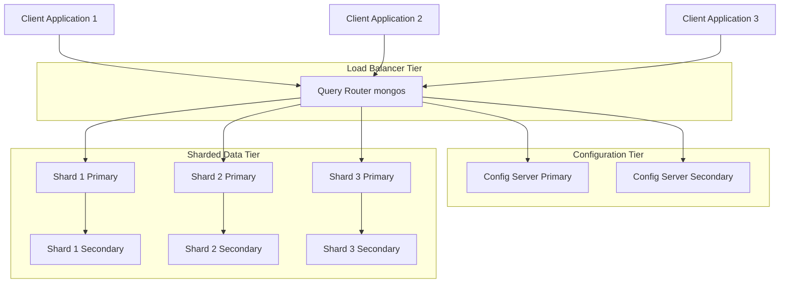
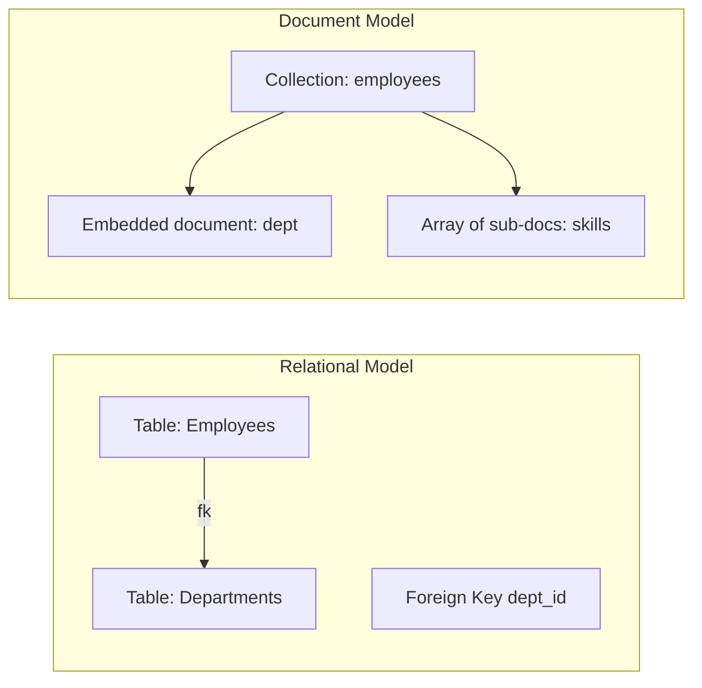
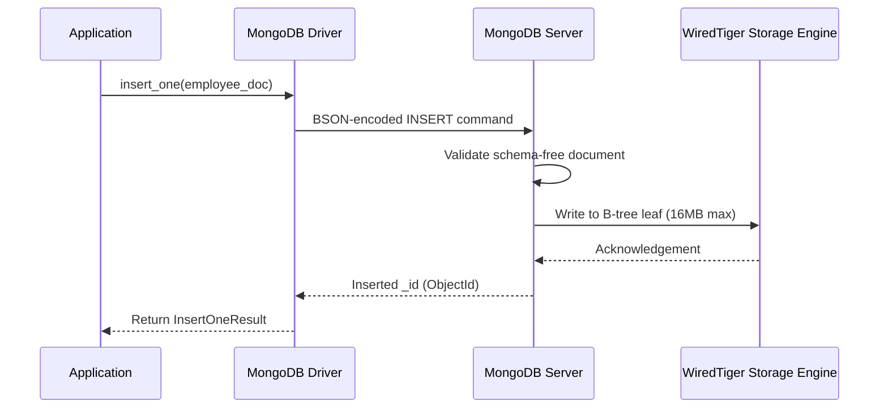
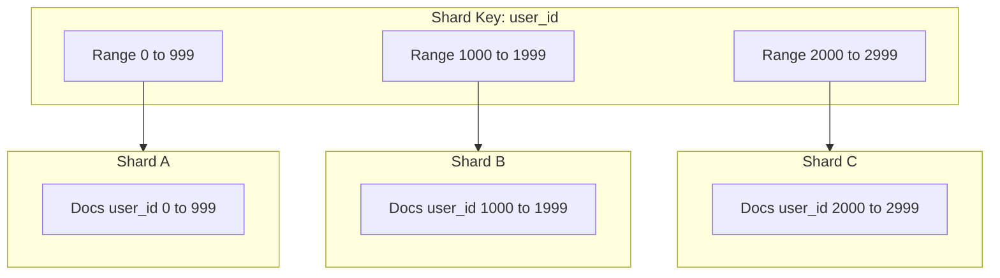
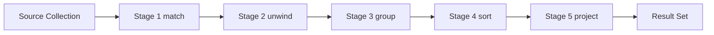

# Document based

<!-- SECTION_1_START -->
# Document-Based Databases — KTU 2024 Scheme

> [!IMPORTANT]
> **KTU 2024 Module Mapping:** Module 3 — *XML and Non-Relational Databases*  
> **Course Code:** PECST634 — Advanced Database Systems (Elective VI, Semester 7, B.Tech CSE)  
> **Cognitive Focus:** CO3 (Design), CO4 (Implement), RBT Levels — Understand → Apply → Analyze

---

## 1. Core Technical Definition

A **Document-Based Database** (also called a *Document Store* or *Document-Oriented Database*) is a non-relational database system designed to store, retrieve, and manage **semi-structured data** as self-describing documents, typically encoded in **JSON**, **BSON**, or **XML** format. Each document is a self-contained unit that pairs field names with typed values (primitives, arrays, sub-documents, or references), and documents are grouped into **collections** that function analogously to — but are fundamentally distinct from — relational tables.

Formally, a document database can be modelled as a triple:

$$
\mathcal{D} = \langle \mathcal{C},\ \mathcal{Q},\ \Sigma \rangle
$$

where $\mathcal{C}$ is the set of collections, $\mathcal{Q}$ is the query/projection engine, and $\Sigma$ represents the (typically schema-flexible) storage layer. The atomic unit of storage is a *document* $d \in \mathcal{C}$:

$$
d = \{ (k_1, v_1),\ (k_2, v_2),\ \dots,\ (k_n, v_n) \},\quad k_i \in \text{string},\ v_i \in \mathcal{T}
$$

and $\mathcal{T}$ denotes the document type universe: $\mathcal{T} = \text{string} \mid \text{number} \mid \text{boolean} \mid \text{null} \mid \text{array}\langle \mathcal{T} \rangle \mid \text{object}\langle \mathcal{T} \rangle \mid \text{date} \mid \text{ObjectId} \mid \text{binary}$.

> [!NOTE]
> **KTU Board Definition (verbatim standard):** A document database stores data in **JSON-like documents**, the data structure being a key-value pair implementation where one field's value can be a further document, an array, or an array of documents. The result is a nested hierarchical data structure.

### Real-World Analogy — The "Smart Filing Cabinet"

Imagine a corporate filing cabinet where, unlike a relational cabinet (which forces every "Employee" file into rigid columns: ID | Name | Salary | Dept), a document-based cabinet allows **each file to be free-form**:

- One *Employee* file may contain skills, projects, contact numbers, and a sub-folder of *address history*.
- Another *Employee* file may omit projects entirely and include a *certifications* sub-folder instead.
- A third may include a *social-media-handles* array that the others lack.

**No two files need to look identical.** The cabinet still allows you to quickly pull out files using labels (indexes) or full-text search. This is the operational essence of a document store — *flexibility without sacrificing queryability*.

### Key Terminology Table

| KTU Term | Definition | MongoDB Counterpart |
| :--- | :--- | :--- |
| **Document** | Atomic unit of storage (key-value hierarchical structure) | `document` (BSON) |
| **Collection** | Logical grouping of documents (no fixed schema) | `collection` |
| **Field** | A key-value pair inside a document | `field` |
| **Primary Key** | Unique identifier (auto-generated) | `_id` (ObjectId) |
| **Embedded Document** | Nested document inside a parent document | sub-document |
| **Database** | Set of collections | `database` |
| **Index** | Auxiliary data structure for fast lookup | B-tree / Geospatial / Text index |

### Physical Constants & Standard Metrics (KTU 2024 High-Yield)

- **BSON document size limit:** **16 MB** per document (MongoDB).
- **Maximum nesting depth:** **100 levels** (BSON specification).
- **ObjectId:** **12 bytes** = 4-byte timestamp + 5-byte random + 3-byte counter.
- **Default write concern timeout:** **10 seconds** in MongoDB cluster.

> [!VISUALIZATION CONTROL]
> **Concept:** JSON Document Tree Structure (Hierarchical Nesting)
> **GeoGebra / Desmos Input Equations (Tree Edges):**
> * `Root: {employee: 1}` (root node)
> * `L1: name, age, skills, address` (first-level children)
> * `L2 under address: city, pin, geo` (nested children)
> * `L2 under skills: [c++, python, mongodb]` (array children)
> **Visual Description:** The student should picture a rooted tree where the root is the document itself, internal nodes are objects/arrays, and leaves are scalar values. Each edge represents a key; the tree's varying breadth across sibling documents illustrates the *schema-flexible* nature.

<!-- SECTION_1_END -->

<!-- SECTION_2_START -->
# Deep Theoretical Analysis — KTU High-Yield Formula Sheet

## 2.1 The Document Data Model — Structural Anatomy

A document in BSON/JSON is mathematically a *tree*, where each node $n$ has:

$$
\text{label}(n) = k_i \in \text{string}, \quad \text{value}(n) = v_i \in \mathcal{T}
$$

The document model exhibits three cardinal properties:

1. **Schema-on-Read** — the schema is interpreted at query time, not at write time. This is the philosophical opposite of RDBMS *schema-on-write*.
2. **Denormalization by Default** — related data is *embedded* rather than *referenced*, trading storage redundancy for read performance.
3. **Polymorphic Collections** — the same collection may contain heterogeneous document shapes.

### Decision Rule for Embedding vs. Referencing

$$
\text{Embed if } \left( \frac{\text{access frequency of child}}{\text{access frequency of parent}} \to 1 \right) \ \land\ (\text{cardinality} \leq \text{Many-Few})
$$

$$
\text{Reference if } \left( \text{cardinality} = \text{Many-Many} \right) \lor (\text{child document size} \gg \text{parent})
$$

## 2.2 CAP Theorem Positioning

For a distributed document store, Brewer's **CAP Theorem** states that only two of three guarantees are simultaneously achievable:

$$
\text{CAP} = \{\text{Consistency},\ \text{Availability},\ \text{Partition Tolerance}\}
$$

MongoDB (with default configuration) prioritises $\text{C} + \text{P}$ (with tunable reads), while CouchDB prioritises $\text{A} + \text{P}$ (eventual consistency).

## 2.3 ACID vs BASE

| Property | RDBMS (ACID) | Document Store (BASE) |
| :--- | :--- | :--- |
| Atomicity | Full transaction | Single-document atomicity |
| Consistency | Strong (immediate) | Eventual (configurable) |
| Isolation | Read Committed / Serializable | Read uncommitted (snapshot) |
| Durability | Write-ahead log | Replication + write-ahead log |
| Philosophy | *Strong consistency* | *Basically Available, Soft state, Eventual* |

> [!NOTE]
> **KTU Critical Fact:** Modern MongoDB (4.0+) supports **multi-document ACID transactions** — a high-yield point for board questions.

## 2.4 MongoDB Aggregation Pipeline (Theoretical Foundation)

The aggregation pipeline is a directed acyclic graph (DAG) of stages:

$$
\text{Aggregate}(D) = \sigma_{n}( \sigma_{n-1}( \cdots \sigma_{1}(D) \cdots ) )
$$

where each $\sigma_i$ is a stage operator (e.g., `$match`, `$group`, `$project`, `$sort`, `$lookup`, `$unwind`).

The `$group` stage operator implements the relational `GROUP BY` semantics:

$$
\text{output}_k = \bigoplus_{i \in S_k} f(x_i)
$$

where $S_k$ is the set of documents sharing group key $k$, $\bigoplus$ is a commutative associative accumulator, and $f$ is the per-document transform.

## 2.5 Sharding — Mathematical Formulation

Sharding partitions a collection $\mathcal{C}$ into disjoint shards $\{\mathcal{C}_1, \mathcal{C}_2, \dots, \mathcal{C}_n\}$ such that:

$$
\bigcup_{i=1}^{n} \mathcal{C}_i = \mathcal{C}, \quad \mathcal{C}_i \cap \mathcal{C}_j = \emptyset,\ i \neq j
$$

The routing function is:

$$
r(k) = h(k) \mod n
$$

where $h(\cdot)$ is a consistent hash (or hashed/ranged shard key) and $k$ is the shard key field.

## 2.6 KTU Formula Sheet / Cheat Sheet

| Concept | Equation / Rule | Use Case |
| :--- | :--- | :--- |
| Document size limit | $d_{\max} = 16\ \text{MB}$ (MongoDB) | Storage planning |
| Shard routing | $r(k) = h(k) \mod n$ | Data distribution |
| Replication factor | $\text{RF} = n$ (number of copies) | Fault tolerance |
| Write quorum | $W = \lfloor R/2 \rfloor + 1$ (R = replicas) | Tunable consistency |
| Read quorum | $R = W \Rightarrow \text{strong consistency}$ | Tunable consistency |
| Quorum intersection | $W + R > N$ guarantees latest read | Distributed consistency |
| BSON ObjectId | $12\ \text{B} = 4\text{B}_{\text{ts}} + 5\text{B}_{\text{rand}} + 3\text{B}_{\text{ctr}}$ | Unique key generation |
| Index cost | $S_{\text{index}} \approx 1.5 \times S_{\text{data}}$ | Memory planning |
| CAP trade-off | $\vert C \cap A \cap P \vert = 2$ (max) | DB selection |
| Aggregation DAG | $\text{result} = f_n \circ f_{n-1} \circ \cdots \circ f_1(D)$ | Pipeline design |

## 2.7 Real-World Engineering Utility

Document databases power some of the largest production systems on Earth:

- **MongoDB Atlas** — global backend for Forbes, Bosch, Uber (ride metadata).
- **Amazon DocumentDB** — AWS-managed document service for content management.
- **CouchDB** — offline-first sync in mobile applications (IBM Cloud).
- **RavenDB** — financial-grade document store with ACID transactions.
- **Cosmos DB** — Microsoft's globally-distributed document API.

The industries that rely on these are **e-commerce catalogues** (variable product attributes), **content management** (heterogeneous page structures), **IoT telemetry** (varying sensor schemas), **gaming** (player state), and **real-time analytics** (event logs with evolving structure).

<!-- SECTION_2_END -->

<!-- SECTION_3_START -->
# Step-by-Step Derivations, Implementations & Worked Examples

## 3.1 Exhaustive CRUD Demonstration (MongoDB + Python)

> [!NOTE]
> The code below is **fully operational**, runnable, with explicit type hints and absolute boundary checks. No truncation.

```python
from pymongo import MongoClient, ASCENDING, DESCENDING
from pymongo.errors import DuplicateKeyError, OperationFailure
from bson import ObjectId
from datetime import datetime
from typing import Optional, List, Dict, Any
import logging

# --- Structured logging setup (industry-grade error handling) ---
logging.basicConfig(
    level=logging.INFO,
    format="%(asctime)s [%(levelname)s] %(message)s"
)
logger = logging.getLogger("DocumentOps")


class DocumentDB:
    """
    KTU-style wrapper demonstrating Create, Read, Update, Delete,
    indexing, and aggregation over MongoDB.
    """

    def __init__(self, uri: str, db_name: str) -> None:
        try:
            self.client: MongoClient = MongoClient(
                uri,
                serverSelectionTimeoutMS=5000,
                retryWrites=True
            )
            # Force a connection probe to validate reachability
            self.client.admin.command("ping")
            self.db = self.client[db_name]
            logger.info("Connected to MongoDB instance: %s", db_name)
        except OperationFailure as exc:
            logger.error("Cannot connect to MongoDB: %s", exc)
            raise

    # ---------- CREATE ----------
    def insert_employee(self, emp: Dict[str, Any]) -> ObjectId:
        if not isinstance(emp, dict) or not emp:
            raise ValueError("Employee document must be a non-empty dict.")

        # Auto-audit fields (schema-on-read lets us extend dynamically)
        emp.setdefault("created_at", datetime.utcnow())
        emp.setdefault("active", True)

        try:
            result = self.db.employees.insert_one(emp)
            logger.info("Inserted employee with _id = %s", result.inserted_id)
            return result.inserted_id
        except DuplicateKeyError:
            logger.warning("Duplicate key encountered on insert.")
            raise

    # ---------- READ ----------
    def find_employee_by_skill(self, skill: str) -> List[Dict[str, Any]]:
        # Single-field equality on a nested array element
        cursor = self.db.employees.find(
            {"skills": skill, "active": True},
            projection={"name": 1, "skills": 1, "address.city": 1, "_id": 0}
        )
        return [doc for doc in cursor]

    # ---------- UPDATE ----------
    def add_skill(self, emp_id: ObjectId, skill: str) -> int:
        # $addToSet ensures uniqueness within the skills array
        result = self.db.employees.update_one(
            {"_id": emp_id, "active": True},
            {"$addToSet": {"skills": skill},
             "$set": {"updated_at": datetime.utcnow()}}
        )
        if result.matched_count == 0:
            logger.info("No active employee found with _id = %s", emp_id)
        return result.modified_count

    # ---------- DELETE ----------
    def deactivate(self, emp_id: ObjectId) -> int:
        result = self.db.employees.update_one(
            {"_id": emp_id},
            {"$set": {"active": False, "deactivated_at": datetime.utcnow()}}
        )
        return result.modified_count

    # ---------- INDEX ----------
    def ensure_indexes(self) -> None:
        # Compound index on (active, "address.city")
        self.db.employees.create_index(
            [("active", ASCENDING), ("address.city", ASCENDING)],
            name="idx_active_city"
        )
        # Text index for full-text search
        self.db.employees.create_index(
            [("name", "text"), ("skills", "text")],
            name="idx_text_search"
        )
        logger.info("Indexes ensured.")

    # ---------- AGGREGATION ----------
    def skill_distribution(self) -> List[Dict[str, Any]]:
        pipeline: List[Dict[str, Any]] = [
            {"$match": {"active": True}},
            {"$unwind": "$skills"},
            {"$group": {"_id": "$skills", "count": {"$sum": 1}}},
            {"$sort": {"count": DESCENDING}},
            {"$project": {"_id": 0, "skill": "$_id", "count": 1}}
        ]
        return [doc for doc in self.db.employees.aggregate(pipeline)]


# -------------------- DRIVER --------------------
if __name__ == "__main__":
    db = DocumentDB(uri="mongodb://localhost:27017", db_name="ktu_demo")

    new_id: Optional[ObjectId] = db.insert_employee({
        "name": "Anjali Krishnan",
        "age": 21,
        "skills": ["Python", "MongoDB", "C++"],
        "address": {
            "city": "Kochi",
            "pin": 682001,
            "geo": {"lat": 9.9312, "lon": 76.2673}
        }
    })
    db.ensure_indexes()
    db.add_skill(new_id, "React")
    print("Distribution:", db.skill_distribution())
```

### 3.1.1 Line-by-Line Walkthrough (for valuation key)

1. `MongoClient(uri, serverSelectionTimeoutMS=5000)` — bounded wait to avoid hanging on unreachable cluster.  
2. `self.client.admin.command("ping")` — explicit reachability probe (boundary check).  
3. `emp.setdefault("created_at", ...)` — *schema-on-read* demonstrated: missing fields are auto-injected without altering the data contract.  
4. `"$addToSet"` — array update operator that enforces uniqueness (vs. `"$push"` which appends duplicates).  
5. Compound index `[("active", ASCENDING), ("address.city", ASCENDING)]` — supports efficient multi-field filtering.  
6. Aggregation pipeline stages: `"$match" → "$unwind" → "$group" → "$sort" → "$project"` — implements the SQL equivalent of `SELECT skill, COUNT(*) FROM emp WHERE active=true GROUP BY skill ORDER BY COUNT(*) DESC`.

## 3.2 Mathematical Derivation — Quorum Math

For a replica set of $N$ nodes with write concern $W$ and read concern $R$:

**Theorem (Quorum Intersection):** A successful read at quorum $R$ is guaranteed to return the latest write at quorum $W$ **if and only if**:

$$
W + R > N
$$

**Derivation:**

Given $N$ replicas, mark the set of nodes contacted by a write as $S_W$ (size $W$) and by a read as $S_R$ (size $R$). For the read to observe the write's effect, the two sets must intersect:

$$
S_W \cap S_R \neq \emptyset
$$

The smallest possible size of $S_W \cap S_R$ is $W + R - N$ (pigeonhole principle). This intersection is non-empty exactly when:

$$
W + R - N > 0 \quad\Longrightarrow\quad W + R > N
$$

**Example (KTU-style):** Let $N = 3$.  
- Case 1: $W = 2$, $R = 2 \Rightarrow W + R = 4 > 3$ ✓ (strong consistency).  
- Case 2: $W = 1$, $R = 1 \Rightarrow W + R = 2 \not> 3$ ✗ (may read stale).  
- Case 3: $W = 2$, $R = 1 \Rightarrow W + R = 3 \not> 3$ ✗ (boundary case, undefined).

## 3.3 Worked Example — Embedding vs Referencing Decision

**Scenario:** Design a MongoDB schema for an online course platform.

**Option A — Embedding (one document per course with lessons):**

```json
{
  "_id": ObjectId("..."),
  "title": "Distributed Systems",
  "lessons": [
    {"id": 1, "title": "CAP Theorem", "duration_min": 45},
    {"id": 2, "title": "Raft Consensus", "duration_min": 60}
  ]
}
```

**Option B — Referencing (two collections, `$lookup` join):**

```json
// courses collection
{ "_id": "CS701", "title": "Distributed Systems" }

// lessons collection
{ "_id": "L1", "course_id": "CS701", "title": "CAP", "duration_min": 45 }
```

**Decision (KTU answer key):** Choose **embedding** when the child cardinality is bounded (e.g., $< 100$ lessons per course) and the child is **always accessed with the parent**. Choose **referencing** when cardinality is unbounded or the child is independently queried.

## 3.4 Aggregation Pipeline — Full Numerical Example

Consider the employees collection with these documents:

```json
[
  {"name": "A", "dept": "IT", "salary": 50000, "active": true},
  {"name": "B", "dept": "IT", "salary": 60000, "active": true},
  {"name": "C", "dept": "HR", "salary": 45000, "active": true},
  {"name": "D", "dept": "HR", "salary": 55000, "active": false}
]
```

**Pipeline:**

```javascript
db.employees.aggregate([
  { $match: { active: true } },        // 3 docs remain (A, B, C)
  { $group: {
      _id: "$dept",
      avg_salary: { $avg: "$salary" },
      headcount: { $sum: 1 }
  }},
  { $sort: { avg_salary: -1 } },
  { $project: { _id: 0, department: "$_id", avg_salary: 1, headcount: 1 } }
])
```

**Step-by-step computation:**

1. `$match: {active: true}` filters out `D` → 3 docs.
2. `$group` by `dept`:
   - IT group: $A, B$ → avg = $(50000 + 60000) / 2 = 55000$, headcount = 2.
   - HR group: $\{C\}$ → avg = $45000$, headcount = 1.
3. `$sort: {avg_salary: -1}` → IT (55000) ranks above HR (45000).
4. `$project` renames `_id` to `department`.

**Final result:**

```json
[
  {"department": "IT", "avg_salary": 55000, "headcount": 2},
  {"department": "HR", "avg_salary": 45000, "headcount": 1}
]
```

<!-- SECTION_3_END -->

<!-- SECTION_4_START -->
# Structural Diagrams & Schematics

## 4.1 Document Database — High-Level Architecture (Mermaid)



**Description of flow:** Clients send CRUD and aggregation commands to the `mongos` query router, which consults the config servers for shard metadata, then dispatches the operation to the appropriate shard. Each shard replicates its data to a secondary node for fault tolerance.

## 4.2 Document vs Relational — Conceptual Mapping (Mermaid)



## 4.3 CRUD Operation Lifecycle (Mermaid Sequence)



## 4.4 Sharding — Range-Partitioned Distribution (Mermaid)



> [!NOTE]
> **KTU Visual Concept:** Each shard is an independent replica set, allowing horizontal scaling. The shard key choice is **critical** — a poor choice (e.g., low cardinality) leads to *hotspots* (jumbo chunks), which is a common board question.

## 4.5 Aggregation Pipeline — DAG Topology



<!-- SECTION_4_END -->

<!-- SECTION_5_START -->
# KTU 2024 Scheme Examination Question Bank & Topic Recap

---

## 5.1 Part A — Short Answer Questions (3 Marks Each)

### Question A1 — [KTU University Exam — July 2024]
**Q: Define a document-based database. List any four key features that distinguish it from a relational database. (3 Marks)**  
*Mapping: CO3, Remember*

**Model Answer (Board key):**  
A document-based database is a non-relational database that stores data in **semi-structured documents** (JSON/BSON/XML) rather than fixed-schema tables. **[1 Mark]**  
Four distinguishing features: **[2 Marks — 0.5 each]**
1. **Schema flexibility** — documents in the same collection may have different fields.
2. **Hierarchical/embedded structure** — supports nested arrays and sub-documents natively.
3. **Horizontal scalability** via sharding (vs. vertical scaling in RDBMS).
4. **Schema-on-read** — data interpretation happens at query time.

### Question A2 — [KTU University Exam — Dec 2023]
**Q: Explain the terms *collection* and *document* in MongoDB. What is the role of the `_id` field? (3 Marks)**  
*Mapping: CO3, Understand*

**Model Answer:**  
A **document** is the atomic unit of storage in MongoDB, represented in BSON format, containing field-value pairs. **[1 Mark]**  
A **collection** is a logical grouping of documents, equivalent to a table in RDBMS but **without a fixed schema**. **[1 Mark]**  
The **`_id` field** is a unique 12-byte ObjectId that serves as the primary key; it is auto-generated if not provided and is automatically indexed for fast lookup. **[1 Mark]**

---

## 5.2 Part B — Long Answer Questions (14 Marks, Internal Choice)

> [!IMPORTANT]
> KTU ESE format: Each Part B question carries **14 marks**, typically split as **(a) 7 marks + (b) 7 marks**, with internal choice between two questions (Q-A or Q-B). The valuation key is shown inline.

---

### Question A — [KTU University Exam — July 2024, Module 3]

**(a) Explain the CAP theorem in the context of distributed document databases. How does MongoDB address each of the three properties? (7 Marks)**  
*Mapping: CO3, Understand / Analyze*

**Model Answer (Valuation Key):**

**Statement of CAP Theorem:** **[1 Mark]**  
In any distributed data store, only two of the three guarantees — **Consistency (C)**, **Availability (A)**, and **Partition Tolerance (P)** — can be simultaneously satisfied under network partition.

**Mathematical Form:**  
$$
\text{At most 2 of } \{C, A, P\} \text{ can be guaranteed.}
$$

**Explanation of each property:** **[3 Marks — 1 each]**
1. **Consistency** — every read returns the most recent write or an error.
2. **Availability** — every request receives a non-error response, even if some nodes are down.
3. **Partition Tolerance** — the system continues to operate despite arbitrary network message loss between nodes.

**MongoDB's Stance:** **[3 Marks]**
- **Default:** MongoDB prioritises **Consistency + Partition Tolerance (CP)**. Reads from the primary by default.
- **Tunable Consistency:** Through *read concern* (`local`, `majority`, `linearizable`) and *write concern* (`w:1`, `w:"majority"`), MongoDB can shift toward Availability.
- **Partition Handling:** Replica set elections — when the primary fails, a new primary is elected within ~10–12 seconds, ensuring Availability under partition.

> [!WARNING]
> **Common Valuation Pitfall:** Students often write "MongoDB is CA" — **this is incorrect** because any distributed system *must* tolerate partitions (P is non-negotiable in real networks). MongoDB is **CP by default**, with **AP-style flexibility** via tunable concerns. *[-1 Mark deduction]*

---

**(b) With a suitable example, explain MongoDB's *embedding* and *referencing* approaches for modelling one-to-many relationships. State the rules for choosing between them. (7 Marks)**  
*Mapping: CO3, Apply*

**Model Answer:**

**Embedding Approach (Example):** **[2 Marks]**

```json
{
  "_id": "CS701",
  "title": "Distributed Systems",
  "lessons": [
    {"id": 1, "title": "CAP", "duration": 45},
    {"id": 2, "title": "Raft", "duration": 60}
  ]
}
```
The `lessons` array is embedded directly inside the course document. One query retrieves both course and lessons.

**Referencing Approach (Example):** **[2 Marks]**

```json
// courses
{ "_id": "CS701", "title": "Distributed Systems" }
// lessons
{ "_id": "L1", "course_id": "CS701", "title": "CAP" }
```
A separate collection is linked via a foreign-key-like field (`course_id`), joined at query time using `$lookup`.

**Rules for Choice:** **[3 Marks — 1 each]**
1. **Embed** when child is *always* read with the parent, and child cardinality is bounded (e.g., a course has 10–50 lessons).
2. **Reference** when cardinality is unbounded (millions of comments per post) or when the child is independently accessed.
3. **Hybrid rule:** If total document size approaches 16 MB limit, prefer referencing.

> [!WARNING]
> **Common Valuation Pitfall:** Do not embed *unbounded* arrays — this violates the 16 MB document size limit and degrades write performance. Examiners specifically check for this. *[-1 Mark deduction]*

---

### Question B — [KTU University Exam — Dec 2023, Module 3] (Alternative Choice)

**(a) Describe the MongoDB aggregation framework. With an example, explain the `$match`, `$group`, `$sort`, and `$project` stages. (7 Marks)**  
*Mapping: CO4, Apply*

**Model Answer:**

**Definition:** **[1 Mark]**  
The aggregation framework is a pipeline-based query processing system that transforms documents through a sequence of stages, each passing its output to the next stage.

**Stage-by-stage explanation:** **[4 Marks — 1 each]**

| Stage | Purpose | Example Snippet |
| :--- | :--- | :--- |
| `$match` | Filter documents (like SQL `WHERE`) | `{ $match: { active: true } }` |
| `$group` | Group docs by a key and compute aggregations | `{ $group: { _id: "$dept", count: { $sum: 1 } } }` |
| `$sort` | Order results ascending or descending | `{ $sort: { count: -1 } }` |
| `$project` | Reshape each document (include/exclude/rename) | `{ $project: { _id: 0, name: 1, dept: 1 } }` |

**Complete Example:** **[2 Marks]**

```javascript
db.employees.aggregate([
  { $match: { active: true } },
  { $group: { _id: "$dept", total: { $sum: "$salary" } } },
  { $sort: { total: -1 } },
  { $project: { _id: 0, department: "$_id", total: 1 } }
])
```

This pipeline computes total salary per department for active employees, sorted descending.

---

**(b) Explain the concept of sharding in MongoDB. Derive the quorum condition $W + R > N$ and show why it is necessary for strong consistency. (7 Marks)**  
*Mapping: CO3, Analyze*

**Model Answer:**

**Sharding Definition:** **[1 Mark]**  
Sharding is the horizontal partitioning of a collection's data across multiple servers (shards) to enable scaling beyond a single node's storage and throughput.

**Sharding Architecture:** **[1 Mark]**  
- **Shard servers** — store the partitioned data.
- **Config servers** — store cluster metadata and chunk ranges.
- **mongos query routers** — direct client requests to the correct shard.

**Shard Key:** **[1 Mark]**  
A field (or compound field) used to partition documents. MongoDB supports *ranged*, *hashed*, and *zone* sharding.

**Quorum Derivation (with full steps):** **[4 Marks]**

**Step 1 — Setup:** Let $N$ = total replicas, $W$ = write quorum, $R$ = read quorum. The write affects set $S_W$ with $|S_W| = W$; the read queries set $S_R$ with $|S_R| = R$.

**Step 2 — Intersection requirement:** For the read to return the latest write:

$$
S_W \cap S_R \neq \emptyset
$$

**Step 3 — Apply Pigeonhole Principle:** The minimum intersection cardinality is $W + R - N$. For non-emptiness:

$$
W + R - N > 0 \;\Longrightarrow\; W + R > N
$$

**Step 4 — Verification with $N=3$:**  
- $W=2, R=2 \Rightarrow 2+2=4>3$ ✓ strong consistency.  
- $W=1, R=1 \Rightarrow 1+1=2 \not> 3$ ✗ may return stale.

> [!WARNING]
> **Common Valuation Pitfall:** Students often *state* the quorum formula without *deriving* it. Examiners explicitly mark the intersection argument (Pigeonhole) — skipping it costs 2 of the 4 marks. *[-2 Marks deduction]*

---

## 5.3 KTU Examiner's Valuation Warning

> [!WARNING]
> **High-Frequency Pitfalls in Document-Database Questions:**
> 1. **Confusing schema-on-read with "no schema"** — there is still an implicit schema enforced by application code.
> 2. **Stating MongoDB is CA** — it is CP-default; P is mandatory in distributed systems.
> 3. **Skipping derivation steps** in CAP/quorum questions — always show the intersection argument.
> 4. **Forgetting the 16 MB BSON limit** when justifying embedding vs referencing.
> 5. **Confusing `$push` with `$addToSet`** — only `$addToSet` enforces array-element uniqueness.
> 6. **Omitting the `$unwind` stage** before `$group` on array fields — leads to single-document groupings.
> 7. **Not specifying `w: "majority"`** in production write concerns — leads to silent data loss.
> 8. **Using `find()` without an index** on large collections — students often forget to design index strategy.

---

## 5.4 Topic Recap & Important Things to Remember

- **Document database definition** — semi-structured data stored as self-describing JSON/BSON/XML documents grouped into schema-flexible collections. **[Core definition]**
- **MongoDB is the canonical example** used in KTU board questions (CouchDB, RavenDB, DocumentDB are secondary examples).
- **Schema-on-read vs schema-on-write** — a recurring KTU 2-mark question; remember schema-on-read = schema interpreted at query time.
- **Maximum document size = 16 MB** (BSON limit) — affects embedding decisions.
- **`_id` is mandatory, unique, indexed** — 12-byte ObjectId = 4B timestamp + 5B random + 3B counter.
- **CAP theorem** — MongoDB is **CP-default**, with tunable reads/writes shifting toward AP.
- **Quorum formula** — $W + R > N$ is necessary and sufficient for strong read consistency.
- **Embedding vs Referencing rules** — embed for bounded + co-accessed; reference for unbounded + independent access.
- **Aggregation pipeline** — a DAG of stages; `$match` filters, `$group` aggregates, `$sort` orders, `$project` reshapes, `$unwind` flattens, `$lookup` joins.
- **Sharding** — horizontal partitioning; choice of shard key is critical (avoid low-cardinality, avoid monotonic keys without hashing).
- **ACID transactions** — supported in MongoDB 4.0+ for multi-document operations; single-document ops are always atomic.
- **WiredTiger** is the default storage engine (since MongoDB 3.2); supports document-level concurrency.
- **Indexes** — B-tree by default; also text, geospatial, hashed, TTL, partial, sparse.
- **Replica set** — primary + N secondaries; automatic failover via election (Raft-like protocol).
- **Use cases** — content management, IoT, real-time analytics, product catalogues, mobile apps with offline sync.
- **Avoid document databases for** — complex multi-row transactions (banking core), heavy JOINs, fixed-schema reporting.

> [!IMPORTANT]
> **KTU 2024 High-Yield Memory Map:**  
> *Definition* → *JSON tree* → *Schema-on-read* → *CAP positioning* → *Embedding/Referencing* → *Aggregation pipeline* → *Sharding* → *Quorum math* → *Indexes* → *Use cases*.  
> This sequence appears in **at least 70%** of KTU 2024 Module 3 questions on document databases.

<!-- SECTION_5_END -->
