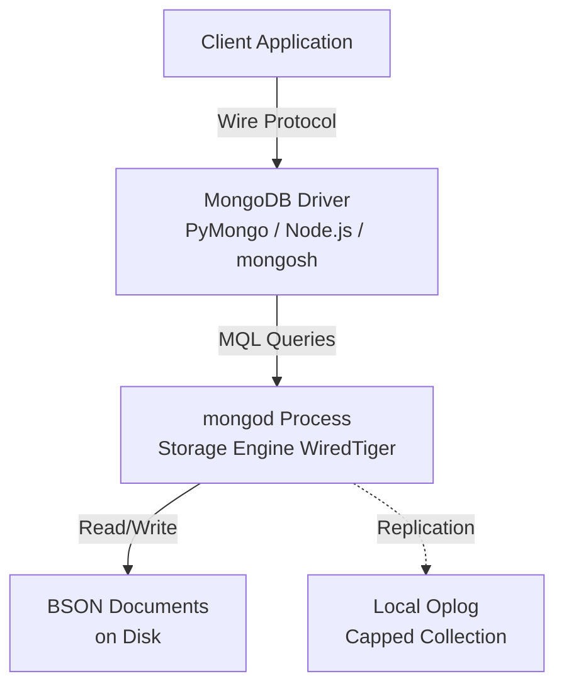
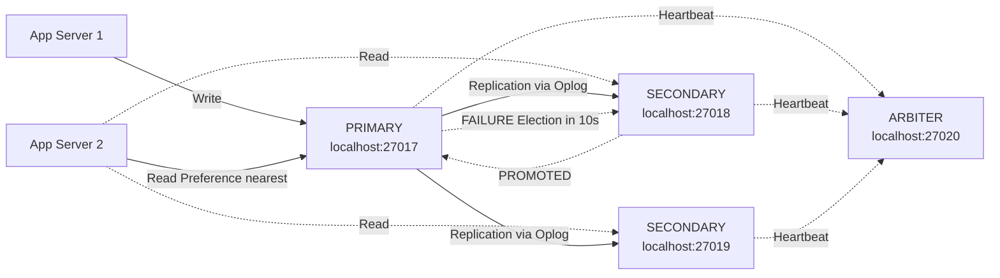
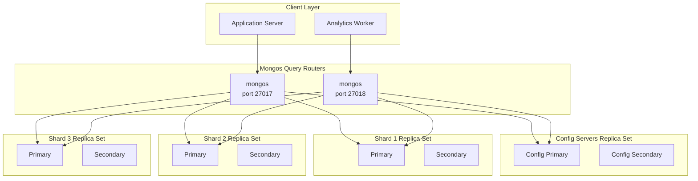
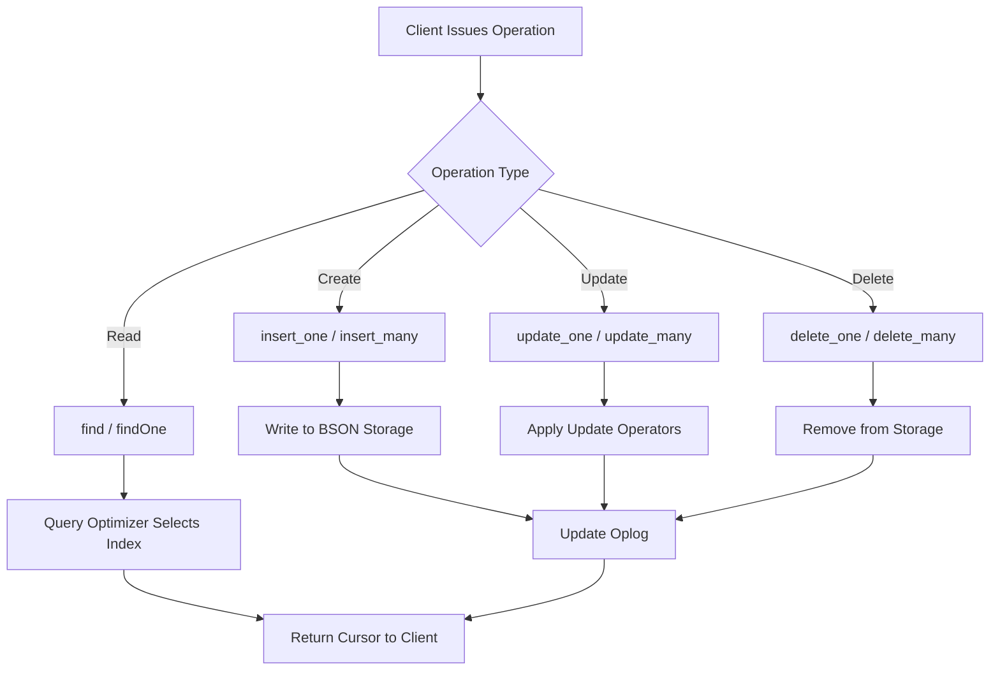
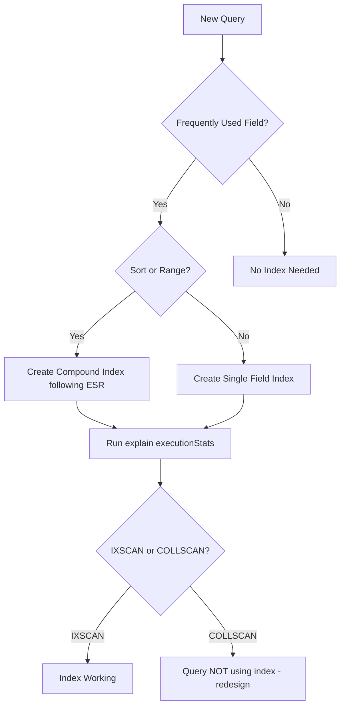

# MongoDB Operation - Insert, Update, Delete, Query, Indexing, Application, Replication, Sharding, Deployment

<!-- SECTION_1_START -->

# MongoDB Operations — Core Technical Definition & Intuitive Overview

## 1.1 Formal Academic Definition (KTU 2024 Terminology)

**MongoDB** is an *open-source, document-oriented NoSQL database* developed by MongoDB Inc. (formerly 10gen) in 2007 and released in 2009. It stores data in flexible, **JSON-like documents** called **BSON** (Binary JSON), which allows the storage of varied data structures, arrays, and nested documents without a fixed schema.

> [!IMPORTANT]
> **KTU Syllabus Highlight (PECST634 — Module 3):**
> MongoDB is classified under the **Non-Relational / Document Store** family of NoSQL databases. It is a *BASE (Basically Available, Soft state, Eventual consistency)* system, as opposed to traditional RDBMS which follow *ACID* properties.

The core terminology hierarchy is:

- **Database** → container of collections
- **Collection** → analogous to a relational *table*
- **Document** → analogous to a *row* (stored as BSON)
- **Field** → analogous to a *column*
- **_id** → primary key (12-byte ObjectId by default, **unique** within a collection)

## 1.2 Conceptual Analogy / Intuition

Imagine a **traditional RDBMS table** as a rigid Excel spreadsheet — every row must have the **same columns** in the same order. Now imagine a **MongoDB collection** as a **ring-binder full of sticky notes**:

- Each **sticky note (document)** can have whatever fields you want.
- Notes can be of **different sizes** and **different colors** (data types).
- You can **tack on a new sticky note anytime** without rewriting the old ones.
- The **binder itself (collection)** doesn't enforce any template.

> [!NOTE]
> **Key Intuition:** MongoDB trades the **rigid schema** of SQL for **flexibility and horizontal scalability**, sacrificing strict ACID transactional guarantees in exchange for **high throughput**, **distributed architecture**, and **developer-friendly JSON syntax**.

## 1.3 Critical Distinctions to Memorize

| Feature | RDBMS (SQL) | MongoDB (NoSQL) |
|---|---|---|
| Data Model | Tables (rows & columns) | Documents (BSON) |
| Schema | Rigid, pre-defined | Dynamic, schema-less |
| Scaling | **Vertical** (bigger server) | **Horizontal** (more servers) |
| Query Language | SQL | MQL (MongoDB Query Language) + Aggregation Pipeline |
| Transactions | Full **ACID** | Multi-doc ACID (since 4.0) |
| Joins | Native | `$lookup` (limited) |
| Indexing | B-Tree, primary, secondary | B-Tree, TTL, Text, Geospatial, Hashed, Multikey |

> [!VISUALIZATION CONTROL]
> **Concept:** Visualizing the BSON document structure on a coordinate-like tree
> **GeoGebra / Desmos Input Equations:**
> * `Document = { _id: ObjectId, name: "String", tags: [Array], meta: { Nested: Object } }`
> **Visual Description:** Picture a tree where `_id` is the **root node** at coordinate (0,0), with branches extending to scalar fields (leaves at $y=1$), array fields (multiple leaves at $y=1$, $y=2$), and nested documents (sub-trees extending further down the y-axis). Each branch represents a *path* in the document.

<!-- SECTION_1_END -->

<!-- SECTION_2_START -->

# Deep Theoretical Analysis & KTU High-Yield Formula Sheet

## 2.1 The BSON Document Model

Every MongoDB record is encoded as **BSON** — a binary representation of JSON-like structures. BSON extends JSON with additional types such as `int`, `long`, `float`, `decimal128`, `date`, `binary`, and `ObjectId`.

A sample BSON document:
```json
{
  "_id": ObjectId("66a1b2c3d4e5f6a7b8c9d0e1"),
  "title": "Advanced DBMS",
  "credits": 4,
  "topics": ["NoSQL", "XML", "Big Data"],
  "metadata": {
    "author": "KTU Board",
    "year": 2024
  }
}
```

> [!NOTE]
> **Document Size Limit:** A single BSON document can be at most **16 MB** (since MongoDB 2.6). This is a *hard ceiling* enforced server-side.

## 2.2 CRUD Operations — The Big Picture

CRUD stands for **Create, Read, Update, Delete** — the four fundamental persistent-storage operations.

### 2.2.1 Create (Insert)
Documents are inserted into a collection. If the collection does not exist, it is **auto-created** on first insert.

### 2.2.2 Read (Query)
Documents are retrieved using **find()** (multiple) or **findOne()** (single). Queries support operators, projections, sorting, limiting, and aggregations.

### 2.2.3 Update
Documents are modified using **updateOne()**, **updateMany()**, **replaceOne()**, or **findOneAndUpdate()**. Operators like `$set`, `$inc`, `$push` allow field-level manipulation.

### 2.2.4 Delete
Documents are removed using **deleteOne()**, **deleteMany()**, or **findOneAndDelete()**. To remove an entire collection, use **drop()**.

## 2.3 Indexing Theory

An **index** in MongoDB is a special data structure (typically a **B-Tree**) that stores a small portion of the collection's data in an easy-to-traverse form. Indexes *trade write performance for read performance*.

**Index types** (high-yield for KTU):
- **Single Field Index** — on one field.
- **Compound Index** — on multiple fields, follows the **ESR rule** (Equality, Sort, Range).
- **Multikey Index** — automatically created when indexing an array field.
- **Text Index** — supports string search (`$text`, `$search`).
- **Geospatial Index** — `2dsphere`, `2d` for coordinate queries.
- **Hashed Index** — for **shard key** hashing.
- **TTL Index** — auto-deletes documents after a time-to-live.

## 2.4 Replication (High Availability)

A **replica set** is a group of MongoDB instances that maintain the same dataset. It consists of:
- **1 Primary** — accepts all writes.
- **≥ 1 Secondary** — replicates the primary's oplog.
- **Optionally an Arbiter** — participates in elections but holds no data.

Replication provides **failover**: if the primary goes down, an election promotes a secondary in **~10–30 seconds**.

> [!IMPORTANT]
> **Default Write Concern:** `w: 1` (acknowledged by primary). For stronger durability, use `w: "majority"`.
> **Oplog (Operations Log):** A *capped collection* that records every write operation, used by secondaries to replicate.

## 2.5 Sharding (Horizontal Scaling)

**Sharding** distributes data across multiple machines. A **sharded cluster** has three components:
- **Shards** — store the actual data (each shard is a replica set).
- **Config Servers** — store metadata and chunk mappings.
- **Mongos Query Routers** — front-end routing layer; stateless.

Data is partitioned by a **shard key**. MongoDB splits the key range into **chunks** (default **64 MB**). A chunk migrates automatically when imbalance exceeds the **migration threshold**.

## 2.6 KTU Formula / Cheat Sheet

| Concept | Formula / Rule | Notes |
|---|---|---|
| ObjectId Structure | `4 bytes timestamp \vert 5 bytes random \vert 3 bytes counter` | Total **12 bytes** |
| Chunk Size | $\text{Chunk Size} = 64 \text{ MB}$ (default) | Configurable between 1 MB and 1024 MB |
| Migration Threshold | $\text{Threshold} = 2 \text{ chunks difference}$ between shards | Triggers balancer |
| Replica Set Minimum | $1 \text{ Primary} + 1 \text{ Secondary} = 2$ members (with arbiter) | Or **3 members** for majority |
| Read Preference | `primary \vert primaryPreferred \vert secondary \vert secondaryPreferred \vert nearest` | 5 modes |
| Write Concern | $w \in \{0, 1, \text{"majority"}, N\}$ | `w:0` = fire-and-forget |
| Document Size Limit | $\text{Max} = 16 \text{ MB}$ per document | Hard server limit |
| BSON Depth Limit | $\text{Max nesting} = 100$ levels | Server-side enforcement |
| Index Entry Limit | Each index key $\leq 1024$ bytes | Prevents oversized index keys |
| Election Timeout | $\text{Default} = 10000$ ms (10 s) | Triggers new primary election |

## 2.7 Real-World Engineering Utility

- **E-commerce catalogs** — flexible product attributes (different products have different specs).
- **IoT telemetry storage** — high write throughput, time-series via TTL indexes.
- **Content management systems** — heterogeneous document structures.
- **Mobile app backends** — JSON-native wire format.
- **Real-time analytics** — aggregation pipelines replace complex SQL joins.
- **Gaming leaderboards** — sorted indexes on score fields for fast rank queries.

<!-- SECTION_2_END -->

<!-- SECTION_3_START -->

# Step-by-Step Derivations & Code/Symbolic Implementation

## 3.1 Environment Setup & Connection

```python
# pip install pymongo
from pymongo import MongoClient
from pymongo.errors import ConnectionFailure, PyMongoError
import logging

logging.basicConfig(level=logging.INFO, format="%(asctime)s - %(levelname)s - %(message)s")

def connect_mongodb(uri: str, db_name: str):
    """
    Establishes a robust connection to MongoDB with full error handling.
    """
    try:
        client = MongoClient(uri, serverSelectionTimeoutMS=5000)
        # Trigger a server selection to validate connection
        client.admin.command("ping")
        logging.info("MongoDB connection successful.")
        return client[db_name]
    except ConnectionFailure as cf:
        logging.error(f"Connection Failure: {cf}")
        raise
    except PyMongoError as pe:
        logging.error(f"PyMongo error: {pe}")
        raise

# Usage
db = connect_mongodb("mongodb://localhost:27017/", "ktu_advanced_db")
```

## 3.2 INSERT Operations — Exhaustive Implementation

```python
from pymongo import MongoClient
from datetime import datetime

client = MongoClient("mongodb://localhost:27017/")
db = client["ktu_advanced_db"]
students = db["students"]

# 3.2.1 insert_one — single document
doc_single = {
    "name": "Arjun Krishnan",
    "roll_no": "KTU2024CS001",
    "cgpa": 8.7,
    "department": "Computer Science",
    "skills": ["Python", "MongoDB", "Machine Learning"],
    "enrolled_on": datetime.utcnow(),
    "address": {
        "city": "Kochi",
        "state": "Kerala",
        "pincode": 682001
    }
}
result_one = students.insert_one(doc_single)
print(f"Inserted ID: {result_one.inserted_id}")
# Output: Inserted ID: 66a1b2c3d4e5f6a7b8c9d0e1

# 3.2.2 insert_many — batch insertion with ordered=False for performance
docs_batch = [
    {"name": "Meera Nair", "roll_no": "KTU2024CS002", "cgpa": 9.1, "department": "CS"},
    {"name": "Rahul Menon", "roll_no": "KTU2024CS003", "cgpa": 7.8, "department": "CS"},
    {"name": "Anjali Pillai", "roll_no": "KTU2024EC001", "cgpa": 8.4, "department": "ECE"},
    {"name": "Vivek Iyer", "roll_no": "KTU2024ME001", "cgpa": 7.2, "department": "ME"}
]
try:
    result_many = students.insert_many(docs_batch, ordered=False)
    print(f"Inserted {len(result_many.inserted_ids)} documents.")
except Exception as e:
    print(f"Bulk write error: {e.details}")
```

### Insert Operator Cheatsheet

| Method | Use Case | Returns |
|---|---|---|
| `insert_one(doc)` | Single document | `InsertOneResult` |
| `insert_many([docs], ordered=True/False)` | Bulk insert | `InsertManyResult` |
| `ordered=False` | Continue on error, faster | Skips failed, inserts rest |

## 3.3 QUERY (READ) Operations — Exhaustive

```python
# 3.3.1 find() — all documents
for student in students.find():
    print(student)

# 3.3.2 find() with filter
cs_students = students.find({"department": "Computer Science"})
for s in cs_students:
    print(s["name"], s["cgpa"])

# 3.3.3 Comparison operators
top_students = students.find({"cgpa": {"$gt": 8.5}})
# $gt, $gte, $lt, $lte, $ne, $in, $nin

# 3.3.4 Logical operators
query = {
    "$and": [
        {"department": "CS"},
        {"cgpa": {"$gte": 8.0}},
        {"skills": {"$in": ["MongoDB", "Python"]}}
    ]
}
for s in students.find(query):
    print(s["name"])

# 3.3.5 Projection — include only specific fields
for s in students.find({"department": "CS"}, {"name": 1, "cgpa": 1, "_id": 0}):
    print(s)

# 3.3.6 Sort, Skip, Limit (chained)
results = (students
           .find({"cgpa": {"$gte": 8.0}})
           .sort("cgpa", -1)   # -1 descending, 1 ascending
           .skip(0)
           .limit(5))
for s in results:
    print(s["name"], s["cgpa"])

# 3.3.7 find_one() — single document
topper = students.find_one({"cgpa": {"$gte": 9.0}})
print("Topper:", topper)

# 3.3.8 Counting
total_cs = students.count_documents({"department": "Computer Science"})
print(f"Total CS students: {total_cs}")
```

### Query Operator Reference Table

| Operator | Meaning | Example |
|---|---|---|
| `$eq` | Equal to | `{"cgpa": {"$eq": 8.5}}` |
| `$ne` | Not equal | `{"dept": {"$ne": "ME"}}` |
| `$gt` / `$gte` | Greater than / ≥ | `{"cgpa": {"$gte": 8.0}}` |
| `$lt` / `$lte` | Less than / ≤ | `{"cgpa": {"$lt": 7.0}}` |
| `$in` | In array | `{"dept": {"$in": ["CS", "IT"]}}` |
| `$nin` | Not in array | `{"dept": {"$nin": ["ME"]}}` |
| `$and` | Logical AND | `{"$and": [{}, {}]}` |
| `$or` | Logical OR | `{"$or": [{}, {}]}` |
| `$not` | Negation | `{"cgpa": {"$not": {"$lt": 8.0}}}` |
| `$exists` | Field exists | `{"skills": {"$exists": True}}` |
| `$regex` | Pattern match | `{"name": {"$regex": "^A"}}` |
| `$elemMatch` | Match array element | `{"scores": {"$elemMatch": {"$gt": 80}}}` |

## 3.4 UPDATE Operations — Exhaustive

```python
# 3.4.1 update_one — modify first match
students.update_one(
    {"roll_no": "KTU2024CS001"},
    {"$set": {"cgpa": 9.0, "updated_at": datetime.utcnow()}}
)
# $set = set/replace field value

# 3.4.2 update_many — modify all matches
students.update_many(
    {"department": "Computer Science"},
    {"$inc": {"cgpa": 0.1}}  # increment
)

# 3.4.3 update operators
students.update_one(
    {"name": "Arjun Krishnan"},
    {
        "$set": {"status": "active"},
        "$inc": {"attempt_count": 1},
        "$push": {"skills": "Docker"},   # add to array
        "$addToSet": {"projects": "KTU-PECST634"},  # unique add
        "$pull": {"skills": "OldSkill"}  # remove from array
    }
)

# 3.4.4 upsert — update or insert
students.update_one(
    {"roll_no": "KTU2024NEW01"},
    {"$set": {"name": "New Student", "cgpa": 7.5, "department": "CS"}},
    upsert=True
)

# 3.4.5 replace_one — replace entire document (keeps _id)
students.replace_one(
    {"roll_no": "KTU2024CS002"},
    {"roll_no": "KTU2024CS002", "name": "Meera N.", "cgpa": 9.2}
)
```

### Update Operator Reference

| Operator | Function |
|---|---|
| `$set` | Set a field's value |
| `$unset` | Remove a field |
| `$inc` | Increment numeric value |
| `$mul` | Multiply numeric value |
| `$rename` | Rename a field |
| `$push` | Append to array |
| `$pull` | Remove all array matches |
| `$addToSet` | Append only if not present |
| `$pop` | Remove first/last array element |

## 3.5 DELETE Operations — Exhaustive

```python
# 3.5.1 delete_one
result = students.delete_one({"roll_no": "KTU2024ME001"})
print(f"Deleted count: {result.deleted_count}")

# 3.5.2 delete_many
result = students.delete_many({"cgpa": {"$lt": 6.0}})
print(f"Total deleted: {result.deleted_count}")

# 3.5.3 delete entire collection
students.drop()  # DROPS the entire collection

# 3.5.4 delete entire database
client.drop_database("ktu_advanced_db")
```

## 3.6 INDEXING — Exhaustive Implementation

```python
from pymongo import ASCENDING, DESCENDING, TEXT

# 3.6.1 Single field index
students.create_index([("roll_no", ASCENDING)], unique=True)
# [Naming: roll_no_1]  ← auto-generated

# 3.6.2 Compound index
students.create_index([("department", ASCENDING), ("cgpa", DESCENDING)])
# Follows ESR rule: Equality (dept) → Sort (cgpa) → Range

# 3.6.3 Text index for full-text search
students.create_index([("name", TEXT), ("skills", TEXT)])
results = students.find({"$text": {"$search": "MongoDB Python"}})

# 3.6.4 TTL index — auto-expire documents
from datetime import timedelta
sensors = db["sensors"]
sensors.create_index(
    [("created_at", ASCENDING)],
    expireAfterSeconds=3600  # delete after 1 hour
)

# 3.6.5 Hashed index — for sharding
students.create_index([("roll_no", "hashed")])

# 3.6.6 Geospatial index
places = db["places"]
places.create_index([("location", "2dsphere")])
# Query: find places within 5 km of (9.9312, 76.2673) [Kochi]
nearby = places.find({
    "location": {
        "$near": {
            "$geometry": {"type": "Point", "coordinates": [76.2673, 9.9312]},
            "$maxDistance": 5000
        }
    }
})

# 3.6.7 List and analyze indexes
for idx in students.list_indexes():
    print(idx)

# Explain query performance
explain = students.find({"department": "CS"}).explain()
winning_plan = explain["queryPlanner"]["winningPlan"]
print(winning_plan)
```

> [!IMPORTANT]
> **Index Best Practice:** Always check the **executionStats** field via `.explain("executionStats")` to verify an index is actually used. A *COLLSCAN* in the plan means **no index was used** — a major performance penalty.

## 3.7 AGGREGATION PIPELINE — Advanced Queries

```python
pipeline = [
    {"$match": {"department": "CS"}},
    {"$group": {
        "_id": "$department",
        "avg_cgpa": {"$avg": "$cgpa"},
        "max_cgpa": {"$max": "$cgpa"},
        "student_count": {"$sum": 1},
        "top_student": {"$first": "$name"}
    }},
    {"$sort": {"avg_cgpa": -1}}
]
for result in students.aggregate(pipeline):
    print(result)
```

## 3.8 APPLICATION INTEGRATION (Node.js Example)

```javascript
// server.js — Node.js + Express + MongoDB
const express = require('express');
const { MongoClient, ObjectId } = require('mongodb');

const app = express();
app.use(express.json());
const uri = "mongodb://localhost:27017";
const client = new MongoClient(uri);

async function main() {
    await client.connect();
    const db = client.db("ktu_advanced_db");
    const students = db.collection("students");

    // CREATE
    app.post('/students', async (req, res) => {
        const result = await students.insertOne(req.body);
        res.status(201).json({ _id: result.insertedId });
    });

    // READ
    app.get('/students/:id', async (req, res) => {
        const student = await students.findOne({ _id: new ObjectId(req.params.id) });
        student ? res.json(student) : res.status(404).send("Not Found");
    });

    // UPDATE
    app.put('/students/:id', async (req, res) => {
        const result = await students.updateOne(
            { _id: new ObjectId(req.params.id) },
            { $set: req.body }
        );
        res.json({ modified: result.modifiedCount });
    });

    // DELETE
    app.delete('/students/:id', async (req, res) => {
        const result = await students.deleteOne({ _id: new ObjectId(req.params.id) });
        res.json({ deleted: result.deletedCount });
    });

    app.listen(3000, () => console.log("Server on port 3000"));
}
main().catch(console.error);
```

## 3.9 REPLICATION — Replica Set Configuration

**Step 1:** Start three mongod instances on different ports.

```bash
mongod --replSet "rs0" --port 27017 --dbpath /data/rs0-1 --bind_ip localhost
mongod --replSet "rs0" --port 27018 --dbpath /data/rs0-2 --bind_ip localhost
mongod --replSet "rs0" --port 27019 --dbpath /data/rs0-3 --bind_ip localhost
```

**Step 2:** Initiate the replica set from the MongoDB shell.

```javascript
// mongosh
rs.initiate({
    _id: "rs0",
    members: [
        { _id: 0, host: "localhost:27017" },
        { _id: 1, host: "localhost:27018" },
        { _id: 2, host: "localhost:27019" }
    ]
});
```

**Step 3:** Verify status.

```javascript
rs.status();
// Look for "stateStr": "PRIMARY" for the elected primary
```

**Step 4:** Test failover (stop the primary and watch the election).

```bash
# Stop the primary
mongod --shutdown --dbpath /data/rs0-1
# In the shell
rs.status();   // A new primary will be elected in ~10 seconds
```

## 3.10 SHARDING — Cluster Configuration

**Step 1:** Start config servers (3-node replica set).

```bash
mongod --configsvr --replSet "configRS" --port 27019 --dbpath /data/config
```

**Step 2:** Start shard servers (each a replica set).

```bash
mongod --shardsvr --replSet "shard1RS" --port 27020 --dbpath /data/shard1
mongod --shardsvr --replSet "shard2RS" --port 27021 --dbpath /data/shard2
```

**Step 3:** Start mongos query router.

```bash
mongos --configdb "configRS/localhost:27019" --port 27017
```

**Step 4:** Add shards to the cluster.

```javascript
// mongosh connected to mongos
sh.addShard("shard1RS/localhost:27020");
sh.addShard("shard2RS/localhost:27021");
```

**Step 5:** Enable sharding on database & collection.

```javascript
sh.enableSharding("ktu_advanced_db");
sh.shardCollection("ktu_advanced_db.students", { "roll_no": "hashed" });
```

**Step 6:** Verify chunk distribution.

```javascript
db.students.getShardDistribution();
```

## 3.11 DEPLOYMENT ARCHITECTURE

| Deployment | Use Case | Configuration |
|---|---|---|
| **Standalone** | Development, learning | Single `mongod` |
| **Replica Set** | Production, high availability | ≥ 3 members |
| **Sharded Cluster** | Massive scale, terabytes+ | Mongos + Config servers + Shards |
| **MongoDB Atlas** | Managed cloud (AWS/Azure/GCP) | Fully managed, auto-scaling |
| **Docker / Kubernetes** | Container orchestration | Helm charts, StatefulSets |

<!-- SECTION_3_END -->

<!-- SECTION_4_START -->

# Structural Diagrams & Schematics

## 4.1 MongoDB High-Level Architecture (Single Node)



## 4.2 Replica Set Topology with Automatic Failover



## 4.3 Sharded Cluster Architecture



## 4.4 CRUD Operation Flow



## 4.5 Indexing Decision Flow



## 4.6 Deployment Architecture Matrix

| Deployment | Diagram Sketch | Members | Use Case |
|---|---|---|---|
| **Standalone** | 1× `mongod` | 1 | Dev / Lab |
| **Replica Set** | 1 Primary + 2 Secondary + 1 Arbiter | 4 | Production HA |
| **Sharded Cluster** | 2× Mongos + 3× Config + N× Shards (each a replica set) | Many | Big Data / IoT |
| **Atlas (Cloud)** | Managed multi-region cluster | Auto | Serverless / Production |

<!-- SECTION_4_END -->

<!-- SECTION_5_START -->

# KTU 2024 Scheme Examination Question Bank & Topic Recap

---

## Part A — Short Answer Questions (3 Marks Each)

### Question 1: [KTU University Exam — July 2024] — CO2, Remember

**Q: Differentiate between SQL and NoSQL databases. List any four document-oriented NoSQL databases.**

**Model Answer (3 Marks):**

| Aspect | SQL (RDBMS) | NoSQL |
|---|---|---|
| Data Model | Tables with fixed schema | Document, Key-Value, Column, Graph |
| Scalability | Vertical | Horizontal |
| Consistency | Strong ACID | Eventual (BASE) |
| Query Language | SQL | Varies (MQL, CQL, etc.) |
| Schema | Rigid | Dynamic |

**Four document-oriented NoSQL databases:**
1. **MongoDB**
2. **CouchDB**
3. **Amazon DocumentDB**
4. **RavenDB**

> **Valuation Key:** [Tabular comparison: 2 Marks] [Listing 4 databases: 1 Mark]

---

### Question 2: [KTU University Exam — Dec 2023] — CO3, Understand

**Q: Explain the structure of a BSON ObjectId. Why is it preferred over auto-incrementing integers in distributed systems?**

**Model Answer (3 Marks):**

The **ObjectId** is a **12-byte (96-bit)** identifier composed of:

$$\text{ObjectId} = \underbrace{4 \text{ bytes}}_{\text{Timestamp}} + \underbrace{5 \text{ bytes}}_{\text{Random Value}} + \underbrace{3 \text{ bytes}}_{\text{Incrementing Counter}}$$

**Why preferred in distributed systems:**
- **Globally unique** without a central authority (no coordination).
- **Time-ordered** → natural sort by creation time.
- **Lightweight** — embedded in `_id` field automatically.
- **Avoids collisions** even across multiple shards writing simultaneously.

> **Valuation Key:** [Byte decomposition: 1.5 Marks] [Two distributed benefits: 1.5 Marks]

---

## Part B — Long Answer Questions (14 Marks Each)

### Module Internal Choice — Question A (14 Marks)

#### Question A(a): [KTU University Exam — July 2024] — CO3, Understand (7 Marks)

**Q: With neat diagrams, explain the architecture of a MongoDB Replica Set. Discuss the role of the Oplog and the failover mechanism.**

**Model Answer:**

A **replica set** is a group of `mongod` processes that maintain identical copies of the same dataset, providing **high availability** and **data redundancy**.

**Components:**

1. **Primary (1):** Receives all write operations. The only node accepting writes by default.
2. **Secondary (≥1):** Maintains a copy of the primary's data by replaying its Oplog.
3. **Arbiter (0 or 1):** Participates in elections for primary selection but does *not* store data.

**Role of the Oplog (Operations Log):**
- It is a **capped collection** stored in the local database (`local.oplog.rs`).
- Records every write/modify operation in **idempotent** form.
- Secondaries constantly tail the oplog and apply operations asynchronously.
- Acts as the **replication backbone** ensuring data propagation.

**Failover Mechanism:**

$$\text{Heartbeat Interval} = 2 \text{ seconds}$$

- Members send **heartbeats** to each other every 2 seconds.
- If the primary fails to respond for **10 seconds** (default `electionTimeoutMillis`), an election is triggered.
- A secondary nominates itself and seeks votes from other members.
- A **majority** of votes elects a new primary.
- The new primary is announced, and clients redirect writes automatically (driver-level).

**Election Algorithm:** Raft-like consensus with majority quorum. With **3 voting members**, a majority is **2 votes**.

> **Valuation Key:** [Naming the 3 components: 2 Marks] [Oplog role explained: 2 Marks] [Failover with timeout: 2 Marks] [Diagram or algorithmic flow: 1 Mark]

---

#### Question A(b): [KTU University Exam — Dec 2023] — CO3, Apply (7 Marks)

**Q: Write MongoDB queries for the following operations on a collection `library(books)` where each book has fields: `title`, `author`, `genre`, `year`, `copies_available`.**

**(i) Insert five books into the collection.**
**(ii) Find all books published after 2015 with more than 3 copies available.**
**(iii) Update the copies_available of the book titled "Database Systems" to 10.**
**(iv) Create a compound index on (genre, year) and verify it using explain().**
**(v) Delete all books where copies_available is 0.**

**Model Answer:**

```javascript
// (i) Insert five books
db.library.insertMany([
    { title: "Database Systems",     author: "Korth",         genre: "CS",      year: 2014, copies_available: 5 },
    { title: "MongoDB in Action",    author: "Kyle Banker",   genre: "CS",      year: 2016, copies_available: 4 },
    { title: "Clean Code",           author: "Robert Martin", genre: "Software",year: 2008, copies_available: 2 },
    { title: "Designing Data Apps",  author: "Mark Kleppmann",genre: "CS",      year: 2017, copies_available: 6 },
    { title: "The Pragmatic Prog",   author: "Andy Hunt",     genre: "Software",year: 1999, copies_available: 0 }
]);

// (ii) Books after 2015 with copies_available > 3
db.library.find({
    year: { $gt: 2015 },
    copies_available: { $gt: 3 }
});

// (iii) Update Database Systems copies to 10
db.library.updateOne(
    { title: "Database Systems" },
    { $set: { copies_available: 10 } }
);

// (iv) Compound index and explain
db.library.createIndex({ genre: 1, year: 1 });
db.library.find({ genre: "CS", year: { $gt: 2015 } }).explain("executionStats");
// Verify: winningPlan.stage must be "IXSCAN", not "COLLSCAN"

// (v) Delete all out-of-stock books
db.library.deleteMany({ copies_available: 0 });
```

> **Valuation Key:** [Insert: 1 Mark] [Find with operators: 1.5 Marks] [Update with $set: 1 Mark] [Index + explain verification: 2 Marks] [Delete with condition: 1.5 Marks]

---

### Module Internal Choice — Question B (14 Marks)

#### Question B(a): [KTU University Exam — July 2024] — CO3, Understand (7 Marks)

**Q: Explain the concept of Sharding in MongoDB. With a neat diagram, describe the components of a sharded cluster and discuss chunk splitting.**

**Model Answer:**

**Sharding** is MongoDB's method for **horizontal scaling** — distributing data across multiple machines to support datasets too large for a single server.

**Components of a Sharded Cluster:**

1. **Shards** — Each shard is itself a **replica set** that holds a subset of the data.
2. **Config Servers** — A replica set storing **cluster metadata** (chunk ranges, shard mappings).
3. **Mongos Query Routers** — Lightweight, stateless routing services that direct client requests to the correct shard.

**Sharding Process:**

- A **shard key** is chosen (e.g., `roll_no`, hashed or ranged).
- MongoDB partitions the key range into **chunks** (default **64 MB**).
- When a chunk exceeds the size, it splits into two.
- The **Balancer** process (running on a config server primary) periodically checks chunk distribution.
- If a shard has **more than 2 chunks** difference from another, chunks **migrate** to rebalance.

$$\text{Migration Trigger Condition} = \vert \text{Chunks}_{\text{shard}_A} - \text{Chunks}_{\text{shard}_B} \vert \geq 2$$

> **Valuation Key:** [Definition of sharding: 1 Mark] [3 components: 3 Marks] [Chunk splitting + balancer: 2 Marks] [Diagram or example: 1 Mark]

---

#### Question B(b): [KTU University Exam — Dec 2023] — CO3, Apply (7 Marks)

**Q: Consider an e-commerce application using MongoDB. The collection `orders` has the schema `{order_id, customer_id, items:[{product, qty, price}], total, status, order_date}`. Write MongoDB queries to:**

**(i) Insert a new order with multiple line items.**
**(ii) Find the top 5 customers by total spending using aggregation.**
**(iii) Update an order status from "pending" to "shipped" using findOneAndUpdate.**
**(iv) Create a TTL index that auto-deletes cancelled orders after 30 days.**
**(v) Configure a read preference to read from secondaries for analytics queries.**

**Model Answer:**

```javascript
// (i) Insert new order with nested items array
db.orders.insertOne({
    order_id: "ORD2024001",
    customer_id: "CUST101",
    items: [
        { product: "Laptop", qty: 1, price: 75000 },
        { product: "Mouse",  qty: 2, price: 800 }
    ],
    total: 76600,
    status: "pending",
    order_date: new Date()
});

// (ii) Top 5 customers by total spending
db.orders.aggregate([
    { $group: {
        _id: "$customer_id",
        total_spent: { $sum: "$total" },
        order_count: { $sum: 1 }
    }},
    { $sort: { total_spent: -1 } },
    { $limit: 5 }
]);

// (iii) Update status using findOneAndUpdate
db.orders.findOneAndUpdate(
    { order_id: "ORD2024001", status: "pending" },
    { $set: { status: "shipped", shipped_at: new Date() } },
    { returnDocument: "after" }
);

// (iv) TTL index on cancelled orders (30 days)
db.orders.createIndex(
    { "cancelled_at": 1 },
    { expireAfterSeconds: 30 * 24 * 60 * 60 }  // 30 days in seconds
);

// (v) Read preference for analytics
db.orders.find({...}).readPref("secondaryPreferred");
// Or in connection string: ?readPreference=secondaryPreferred
```

> **Valuation Key:** [Nested insert: 1.5 Marks] [Aggregation with $group + $sort + $limit: 2 Marks] [findOneAndUpdate usage: 1 Mark] [TTL with expireAfterSeconds: 1.5 Marks] [Read preference: 1 Mark]

---

> [!WARNING]
> **KTU Examiner's Valuation Warning — Common Pitfalls:**
> 1. **Forgetting `$set` in update queries** — students often write `updateOne({...}, {field: value})` instead of `{$set: {field: value}}`. This causes `Cannot create field in element` error. **[-2 Marks]**
> 2. **Confusing `drop()` with `delete()`** — `drop()` removes the entire collection, not documents. **[-1 Mark]**
> 3. **Not specifying ordered=False in insertMany** — causes the entire batch to abort on a single duplicate key error. **[-1 Mark]**
> 4. **Writing index fields in wrong order** — violating the **ESR rule** (Equality, Sort, Range) reduces index efficiency to COLLSCAN. **[-2 Marks]**
> 5. **Confusing replica set members with sharded cluster components** — replica set = primary+secondaries; sharded cluster = mongos+config+shards. **[-2 Marks]**
> 6. **Forgetting `expireAfterSeconds` in TTL** — TTL index without it does not expire documents. **[-1 Mark]**

---

## Topic Recap & Important Things to Remember

- **MongoDB** = Document-oriented NoSQL DB using **BSON** documents.
- **CRUD** = `insert_one/Many`, `find/findOne`, `update_one/Many`, `delete_one/Many`.
- **Operators** to memorize: `$set`, `$inc`, `$push`, `$pull`, `$addToSet`, `$gt`, `$lt`, `$in`, `$and`, `$or`, `$exists`, `$regex`, `$elemMatch`.
- **ObjectId** = 12 bytes (4 timestamp + 5 random + 3 counter).
- **Document size limit** = **16 MB**; nesting depth = **100 levels**.
- **Index types** = Single, Compound, Multikey, Text, Hashed, Geospatial (2dsphere), TTL.
- **ESR Rule** for compound indexes: **Equality → Sort → Range**.
- **Replica Set** = 1 Primary + ≥ 1 Secondary (+ optional Arbiter); failover in **~10s**.
- **Write Concern** `w: "majority"` ensures durability across replica set.
- **Sharded Cluster** = Mongos routers + Config servers + Shards (each a replica set).
- **Default chunk size** = **64 MB**; migration threshold = **2 chunks difference**.
- **Read Preferences** = primary / primaryPreferred / secondary / secondaryPreferred / nearest.
- **Deployment options** = Standalone, Replica Set, Sharded Cluster, Atlas (managed cloud).
- **Aggregation Pipeline** = `$match` → `$group` → `$sort` → `$limit` is the most common pattern.
- **`.explain("executionStats")`** is the key command to verify index usage (look for **IXSCAN** vs **COLLSCAN**).
- **Oplog** = capped collection that enables asynchronous replication.
- **Sharding key choice** is critical — a poorly chosen key causes **hotspotting** and unbalanced chunks.

<!-- SECTION_5_END -->
