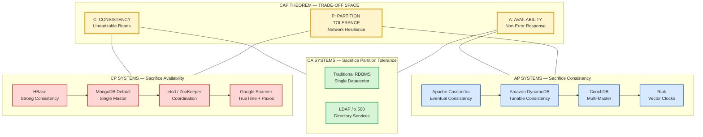
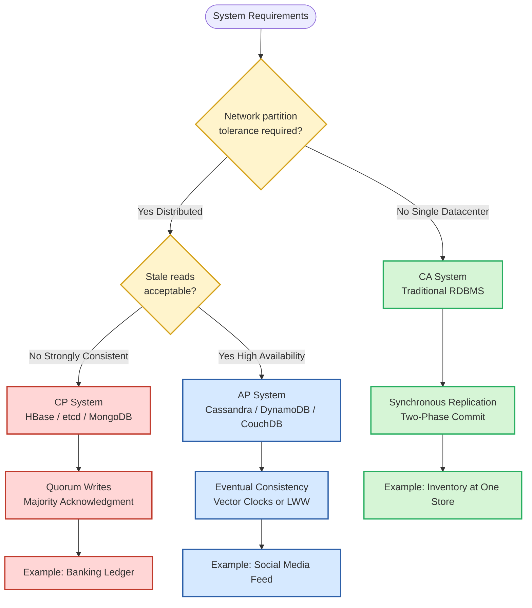
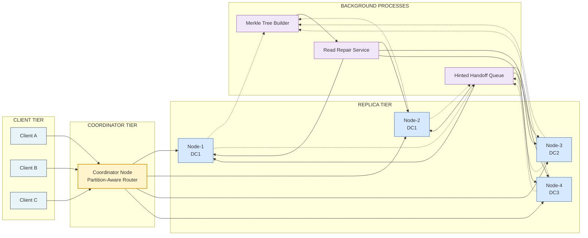
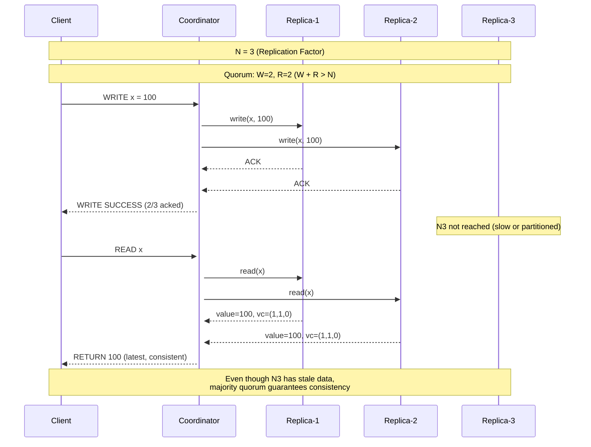

# NoSQL Databases - CAP Theorem

<!-- SECTION_1_START -->
# CAP Theorem — The Foundational Law of Distributed NoSQL Databases

## 1.1 Formal Academic Definition (KTU 2024 Syllabus Terminology)

> [!IMPORTANT]
> **CAP Theorem (Brewer's Conjecture, 2000):** In any distributed data store, it is impossible to simultaneously guarantee more than two out of the following three properties — **Consistency (C)**, **Availability (A)**, and **Partition Tolerance (P)**. The system must, therefore, sacrifice exactly one of the guarantees during a network partition event.

Formally proposed by computer scientist **Eric Brewer** at the ACM Symposium on Principles of Distributed Computing (PODC) in **2000** and mathematically proven by **Seth Gilbert and Nancy Lynch** of MIT in **2002**, the CAP Theorem is the cornerstone of every NoSQL database design philosophy and the primary lens through which modern distributed systems are evaluated.

| Property | Symbol | Formal Guarantee |
|---|---|---|
| **Consistency** | **C** | Every read receives the most recent write or an error (Linearizability) |
| **Availability** | **A** | Every request receives a non-error response (no timeout), even if the data may be stale |
| **Partition Tolerance** | **P** | The system continues to operate despite an arbitrary number of network messages being dropped or delayed between nodes |

## 1.2 Conceptual Analogy & Intuition

> [!NOTE]
> **Real-World Analogy — The Three-Way Trade-off**
>
> Imagine a **banking chain** (State Bank of India) that has branches in **Delhi, Mumbai, and Kerala**, all connected by a fragile telephone line (the network). You deposit **₹10,000** in the Delhi branch.
>
> * **C + A (Consistency + Availability without Partition Tolerance):** This works only when all three branches are connected by a perfect, unbreakable telephone line. If the line snaps (a network partition occurs), the bank must **shut down one or more branches** — you cannot withdraw money from Kerala. The system stops being **Available** to preserve **Consistency**.
> * **C + P (Consistency + Partition Tolerance — CP systems):** When the line breaks, the Kerala branch **refuses to serve customers** (becomes unavailable) to ensure that no customer ever sees the old balance. The ATM displays *"Service Unavailable"*. This is how **HBase, MongoDB (default), and Redis Cluster** behave.
> * **A + P (Availability + Partition Tolerance — AP systems):** When the line breaks, the Kerala branch **still serves customers** using its last known balance. You might see ₹9,000 instead of ₹10,000 for a few minutes. The ATM works, but the data is **eventually consistent**. This is how **Cassandra, CouchDB, and DynamoDB** behave.
>
> **The Twist:** In modern cloud computing (AWS, Azure, GCP), network partitions are **inevitable**. Therefore, the practical choice is **always between C and A** during a partition. Pure **CA systems are theoretically possible but practically rare** outside single-datacenter deployments.

## 1.3 Why CAP Is a Hard Constraint, Not a Trade-off Slider

> [!WARNING]
> **KTU Board Exam Pitfall:** Students often write that CAP allows "tuning" the trade-off. **This is incorrect**. CAP is a **binary, hard constraint** during a partition — the system either **sacrifices Consistency or Availability** for the duration of the partition. The theorem is proven through asynchronous network models where no clock synchronization is assumed (a more pessimistic model than real-world systems).

> [!VISUALIZATION CONTROL]
> **Concept:** The CAP Triangle — Mutual Exclusivity of Guarantees
> **GeoGebra / Desmos Input Equations:**
> * Triangle vertices: $C = (0, 5)$, $A = (4.33, -2.5)$, $P = (-4.33, -2.5)$
> * Centroid (Impossibility point): $G = (0, 0)$
> * Midpoint of edge CA: $M_{CA} = (2.165, 1.25)$
> **Visual Description:** Plot the three vertices forming an equilateral triangle. The centroid marks the impossible zone. A system can only operate on one of the three edges (C-A, C-P, or A-P), and during a partition, it must collapse onto exactly one vertex. No system can sit at the centroid.

<!-- SECTION_1_END -->

<!-- SECTION_2_START -->
# 2. Deep Theoretical Analysis & KTU High-Yield Formula Sheet

## 2.1 Deconstruction of the Three Properties

### 2.1.1 Consistency (Linearizability)
In a strongly consistent (or linearly consistent) system, the **total order** of operations matches the **real-time order** in which they occurred. If a write $W(x, 5)$ completes at time $T_1$, then every subsequent read $R(x)$ at time $T_2 > T_1$ **must** return the value **5**, regardless of which node receives the request. This property is the formal equivalent of the **'C' in ACID transactions**.

> [!NOTE]
> **Key Insight:** CAP Consistency is **NOT** the same as ACID Consistency. CAP Consistency is a **single-object, real-time guarantee** (linearizability), whereas ACID Consistency is a **multi-object, transaction-level guarantee** (serializability). The KTU examiner often tests this distinction.

### 2.1.2 Availability
Every non-failing node must respond to every request within a **bounded time** (typically milliseconds). The system never returns an error such as *"Server is busy"* or *"Service Unavailable"*. However, the data returned **may be stale**. This is the formal definition used in Gilbert-Lynch's 2002 proof.

### 2.1.3 Partition Tolerance
The system must continue to function even when **arbitrary messages** between nodes are lost, delayed, or duplicated due to a network partition. The partition can be **symmetric** (subset of nodes cannot reach another subset) or **asymmetric** (messages flow in only one direction). Real-world causes include switch failures, BGP routing issues, undersea cable cuts, and datacenter power outages.

## 2.2 The PACELC Extension — Beyond CAP

Daniel Abadi (2010) proposed an extension to address what happens when the system is **not partitioned**:

$$\text{PACELC} = \begin{cases} \text{If Partition:} & \text{choose between Availability (A) and Consistency (C)} \\ \text{Else:} & \text{choose between Latency (L) and Consistency (C)} \end{cases}$$

This captures the reality that even in normal operation, there is a trade-off between **fast responses (low latency)** and **strict consistency**.

## 2.3 KTU Formula Sheet & Cheat Sheet

| Concept | Symbol / Notation | Definition | Practical Implication | Example Systems |
|---|---|---|---|---|
| **Strong Consistency** | $C_{strong}$ | $R(x) = W(x, v)$ for all $t$ after $W$ completes | Latest data always visible | **HBase, MongoDB, etcd, ZooKeeper** |
| **Eventual Consistency** | $C_{eventual}$ | $\lim_{t \to \infty} R(x) = W(x, v)$ | Data converges to latest value over time | **Cassandra, DynamoDB, CouchDB, Riak** |
| **Read Repair** | $RR$ | Anti-entropy mechanism using Merkle trees | Resolves replicas asynchronously | Cassandra, Riak |
| **Quorum Read** | $Q_R$ | $\vert R \vert > \frac{N}{2}$ (typical) | Reads from majority of replicas | Dynamo-style systems |
| **Quorum Write** | $Q_W$ | $\vert W \vert > \frac{N}{2}$ | Writes confirmed by majority | Dynamo-style systems |
| **Replication Factor** | $N$ | Total number of replicas | Determines durability | $N=3$ typical for production |
| **Conflict-free Replicated Data Type** | **CRDT** | Mathematically convergent data structure | Enables automatic merge without coordination | Counters, G-Sets, OR-Sets, LWW-Registers |
| **Vector Clock** | $(V_i, V_j, ...)$ | Tracks causality across replicas | Detects concurrent writes | Dynamo, Riak |
| **Network Partition** | $P$ | Loss of connectivity between subsets of nodes | Triggers CAP trade-off | Switch failure, BGP hijack |
| **Linearizability Bound** | $\epsilon$ | Maximum staleness during partition (in CP/AP hybrid) | Tunable consistency window | Cassandra consistency levels |

> [!IMPORTANT]
> **Critical Formula for KTU Exams:** The **Quorum Condition** for guaranteeing strong consistency in a Dynamo-style system is:
>
> $$\vert R \vert + \vert W \vert > N$$
>
> where $\vert R \vert$ = number of replicas contacted for read, $\vert W \vert$ = number of replicas contacted for write, and $N$ = total replication factor. If this condition holds, **read and write sets overlap**, guaranteeing the latest write is observed.

## 2.4 Real-World Engineering Utility

The CAP trade-off directly determines the **database selection strategy** in production engineering:

* **E-commerce platforms** (Amazon, Flipkart) use **AP (DynamoDB)** for the shopping cart — accepting brief staleness in exchange for 100% uptime, because showing *"Item Out of Stock"* due to system unavailability is worse than a brief over-counting.
* **Banking transaction ledgers** use **CP (etcd, HBase)** — it is legally and ethically unacceptable to process a transaction without the most recent balance, so the system prefers a brief *"Service Unavailable"* error over showing incorrect balances.
* **Leaderboard / Counter systems** (game scores, like counts) use **AP with CRDTs** (Cassandra counters) — exact consistency is impossible to guarantee in real-time across millions of users, and a near-correct count is acceptable.
* **Coordination services** (Apache ZooKeeper, etcd) use **CP** because they act as the *"source of truth"* for cluster membership and configuration, where stale data could cause split-brain scenarios.

<!-- SECTION_2_END -->

<!-- SECTION_3_START -->
# 3. Step-by-Step Derivations, Proofs & Code Implementation

## 3.1 Mathematical Proof of CAP Impossibility (Gilbert-Lynch 2002)

> [!NOTE]
> **KTU High-Yield Derivation:** Examiners often ask to *"state the Gilbert-Lynch proof"* or *"explain why all three cannot be guaranteed."* The following is the canonical asynchronous model proof.

### 3.1.1 System Model Assumptions

We consider an asynchronous network model $\mathcal{N}$ with the following constraints:

1. Nodes can only communicate by sending and receiving messages.
2. Messages may be **lost**, **duplicated**, or **delivered out of order**.
3. There is **no global clock** for synchronization.
4. A partition event is modeled as a **perfect partition**: no messages pass between the two partitions.

### 3.1.2 Contradiction Argument

**Assume** for contradiction that a system $\mathcal{S}$ simultaneously guarantees **Consistency (C)**, **Availability (A)**, and **Partition Tolerance (P)**.

Consider two nodes, $N_1$ and $N_2$, sharing a replicated variable $x$ with initial value $v_0 = 0$.

**Step 1:** A network partition occurs. All messages between $N_1$ and $N_2$ are dropped.

**Step 2:** Client $C_1$ sends a write request to $N_1$:
$$N_1 \xleftarrow{\text{write}} W(x, 1) \text{ at time } t_1$$

By **Availability**, $N_1$ must process this write and respond successfully, so the value of $x$ on $N_1$ becomes **1**:
$$\text{state}(N_1, x) = 1$$

**Step 3:** Client $C_2$ sends a read request to $N_2$:
$$N_2 \xrightarrow{\text{read}} R(x) \text{ at time } t_2 > t_1$$

By **Availability**, $N_2$ must process this read and respond successfully. Since $N_2$ is partitioned from $N_1$ and has not received the update, it responds with the original value:
$$\text{state}(N_2, x) = 0$$

**Step 4:** By **Consistency** (linearizability), the read at $t_2$ must observe the write at $t_1$ (since $t_2 > t_1$). This requires:
$$R(x) \text{ at } t_2 = W(x, 1) \text{ at } t_1$$

**Step 5:** Contradiction: $N_2$ returns 0, but linearizability demands 1. Since all three properties cannot coexist, **at least one must be sacrificed during the partition**.

$$\boxed{\therefore C \land A \land P \text{ is impossible in an asynchronous distributed system}} \quad \blacksquare$$

### 3.1.3 Quantitative Consequence

For a replication factor $N$, the minimum latency increase for strict consistency across geographically distributed datacenters is bounded by:

$$\text{Latency}_{min} = \max(DC_1, DC_2, ..., DC_k) - \min(DC_1, DC_2, ..., DC_k)$$

This is why CP systems (e.g., Google Spanner) use **TrueTime** with GPS and atomic clocks to bound the uncertainty to within a few milliseconds, paying a constant latency cost for strong consistency.

## 3.2 Python Implementation — Simulating CAP Trade-offs

> [!IMPORTANT]
> **KTU Lab Exam Code:** The following Python code demonstrates the three CAP variants (CP, AP, CA) in a simulated distributed system with partition events. This is a high-yield lab exercise.

```python
"""
=============================================================================
  CAP Theorem Implementation — Simulated Distributed Key-Value Store
  Course      : Advanced Database Systems (PECST634) — KTU 2024 Scheme
  Module      : 3 — XML and Non-Relational Databases
  Topic       : NoSQL Databases — CAP Theorem
  Description : Simulates CP, AP, and CA distributed stores with network
                partition handling using the replica quorum condition
                |R| + |W| > N.
=============================================================================
"""

import time
import random
import threading
from typing import Dict, List, Optional, Tuple
from dataclasses import dataclass, field
from enum import Enum
from collections import defaultdict


class SystemMode(Enum):
    """The three CAP trade-off configurations."""
    CP = "Consistency + Partition Tolerance"
    AP = "Availability + Partition Tolerance"
    CA = "Consistency + Availability (no partition tolerance)"


@dataclass
class Replica:
    """A single replica node in the distributed system."""
    node_id: str
    data: Dict[str, Tuple[any, float, int]] = field(default_factory=dict)
    """Stored as {key: (value, timestamp, vector_clock)}"""
    is_reachable: bool = True
    """Flag simulating network partition reachability."""

    def write(self, key: str, value: any, vc: int) -> None:
        if self.is_reachable:
            self.data[key] = (value, time.time(), vc)

    def read(self, key: str) -> Optional[Tuple[any, float, int]]:
        if self.is_reachable:
            return self.data.get(key)
        return None


class DistributedKVStore:
    """
    A distributed key-value store with explicit CAP trade-off behaviour.
    Uses the quorum condition: |R| + |W| > N for strong consistency.
    """

    def __init__(self, mode: SystemMode, replication_factor: int = 3):
        self.mode = mode
        self.N = replication_factor
        self.replicas: List[Replica] = [
            Replica(node_id=f"Node-{i+1}") for i in range(self.N)
        ]
        self.vector_clock = defaultdict(int)
        self.lock = threading.Lock()
        self.partition_active = False
        self.partition_group_a: List[Replica] = []
        self.partition_group_b: List[Replica] = []
        self.write_log: List[dict] = []

    # -----------------------------------------------------------------
    # Partition simulation
    # -----------------------------------------------------------------
    def induce_partition(self) -> None:
        """
        Split the replicas into two groups that cannot communicate.
        Validates the CAP trade-off empirically.
        """
        if self.mode == SystemMode.CA:
            print(
                f"[{self.mode.value}] CA system cannot tolerate partitions — "
                "shutting down until network heals."
            )
            for r in self.replicas:
                r.is_reachable = False
            self.partition_active = True
            return

        shuffled = self.replicas.copy()
        random.shuffle(shuffled)
        mid = self.N // 2
        self.partition_group_a = shuffled[:mid]
        self.partition_group_b = shuffled[mid:]
        for r in shuffled:
            r.is_reachable = False
        for r in self.partition_group_a:
            r.is_reachable = True
        for r in self.partition_group_b:
            r.is_reachable = True
        self.partition_active = True
        print(
            f"[{self.mode.value}] Partition induced. "
            f"Group A: {[r.node_id for r in self.partition_group_a]} | "
            f"Group B: {[r.node_id for r in self.partition_group_b]}"
        )

    def heal_partition(self) -> None:
        """Restore communication and trigger anti-entropy (read-repair)."""
        for r in self.replicas:
            r.is_reachable = True
        self.partition_active = False
        self._anti_entropy()
        print(f"[{self.mode.value}] Partition healed. Anti-entropy completed.")

    def _anti_entropy(self) -> None:
        """
        AP systems use anti-entropy (e.g., Merkle trees) to converge.
        CP systems typically discard divergent writes on the minority side.
        """
        if self.mode != SystemMode.AP:
            return
        all_keys = set()
        for r in self.replicas:
            all_keys.update(r.data.keys())
        for key in all_keys:
            latest = max(
                (r.data[key] for r in self.replicas if key in r.data),
                key=lambda t: t[2],  # pick highest vector clock
            )
            for r in self.replicas:
                if r.is_reachable:
                    r.data[key] = latest

    # -----------------------------------------------------------------
    # Write path
    # -----------------------------------------------------------------
    def write(self, key: str, value: any) -> str:
        """
        Write a value to the store. Returns status message.
        Quorum write requires |W| = floor(N/2) + 1 replicas.
        """
        with self.lock:
            self.vector_clock[key] += 1
            vc = self.vector_clock[key]

            if self.mode == SystemMode.CP:
                # CP: only accept writes on the majority side of partition
                if self.partition_active and not self._has_majority():
                    return (
                        f"[CP-WRITE] REJECTED — minority partition, "
                        f"refusing to break consistency."
                    )
                ack = 0
                for r in self.replicas:
                    if r.is_reachable:
                        r.write(key, value, vc)
                        ack += 1
                if ack >= (self.N // 2 + 1):
                    return f"[CP-WRITE] OK — acknowledged by {ack}/{self.N} nodes."

            elif self.mode == SystemMode.AP:
                # AP: accept writes on any reachable node, replicate lazily
                ack = 0
                for r in self.replicas:
                    if r.is_reachable:
                        r.write(key, value, vc)
                        ack += 1
                return f"[AP-WRITE] OK — stored on {ack}/{self.N} nodes (will converge)."

            else:  # CA
                if self.partition_active:
                    return f"[CA-WRITE] FAILED — system is offline (no partition tolerance)."
                for r in self.replicas:
                    r.write(key, value, vc)
                return f"[CA-WRITE] OK — all {self.N} nodes updated."

            return f"[CP-WRITE] UNCERTAIN — only {ack}/{self.N} replicas reached."

    # -----------------------------------------------------------------
    # Read path
    # -----------------------------------------------------------------
    def read(self, key: str) -> str:
        """
        Read a value. CP returns latest consistent value or error.
        AP returns any value (possibly stale) for guaranteed availability.
        """
        if self.mode == SystemMode.CP:
            if self.partition_active and not self._has_majority():
                return "[CP-READ] ERROR — service unavailable (minority side)."
            latest = None
            for r in self.replicas:
                if r.is_reachable and key in r.data:
                    if latest is None or r.data[key][2] > latest[2]:
                        latest = r.data[key]
            return f"[CP-READ] {latest[0] if latest else 'NULL'} (consistent)."

        elif self.mode == SystemMode.AP:
            for r in self.replicas:
                if r.is_reachable and key in r.data:
                    return f"[AP-READ] {r.data[key][0]} (possibly stale)."
            return "[AP-READ] NULL"

        else:  # CA
            if self.partition_active:
                return "[CA-READ] ERROR — system offline."
            for r in self.replicas:
                if key in r.data:
                    return f"[CA-READ] {r.data[key][0]}"
            return "[CA-READ] NULL"

    # -----------------------------------------------------------------
    # Helper
    # -----------------------------------------------------------------
    def _has_majority(self) -> bool:
        """Check if Group A forms a strict majority of replicas."""
        return len(self.partition_group_a) > self.N // 2


# ---------------------------------------------------------------------
# Demonstration
# ---------------------------------------------------------------------
if __name__ == "__main__":
    print("=" * 75)
    print("  CAP THEOREM — EMPIRICAL DEMONSTRATION")
    print("=" * 75)

    # ---- CP system ----
    print("\n>>> CP System (HBase-style) <<<")
    cp_store = DistributedKVStore(SystemMode.CP, replication_factor=3)
    print(cp_store.write("balance", 10000))
    print(cp_store.read("balance"))
    cp_store.induce_partition()
    print(cp_store.write("balance", 20000))   # may be rejected
    print(cp_store.read("balance"))
    cp_store.heal_partition()

    # ---- AP system ----
    print("\n>>> AP System (Cassandra-style) <<<")
    ap_store = DistributedKVStore(SystemMode.AP, replication_factor=3)
    print(ap_store.write("likes", 5000))
    print(ap_store.read("likes"))
    ap_store.induce_partition()
    print(ap_store.write("likes", 7500))      # accepted on reachable side
    print(ap_store.read("likes"))             # possibly stale
    ap_store.heal_partition()
    print(ap_store.read("likes"))             # converged

    # ---- CA system ----
    print("\n>>> CA System (single-datacenter RDBMS) <<<")
    ca_store = DistributedKVStore(SystemMode.CA, replication_factor=3)
    print(ca_store.write("config", "v1"))
    ca_store.induce_partition()               # causes outage
    print(ca_store.read("config"))
    ca_store.heal_partition()
    print(ca_store.read("config"))
```

## 3.3 Conflict Resolution — Last-Write-Wins (LWW) Derivation

> [!NOTE]
> **KTU 14-Mark Question Favorite:** "Explain conflict resolution in AP systems using vector clocks."

In a Dynamo-style AP store, when two clients write concurrently to the same key on different replicas, the conflict is resolved using **vector clocks** or a simple **Last-Write-Wins (LWW)** rule.

### LWW Rule:
$$\text{Winning value} = \arg\max_{v \in \text{concurrent writes}} \text{Timestamp}(v)$$

### Vector Clock Comparison:
Given two values $v_a$ and $v_b$ with vector clocks $V_a = (V_a^1, V_a^2, ..., V_a^n)$ and $V_b = (V_b^1, V_b^2, ..., V_b^n)$:

1. **$v_a$ precedes $v_b$** iff $\forall i: V_a^i \leq V_b^i$ and $\exists j: V_a^j < V_b^j$ — keep $v_b$.
2. **$v_b$ precedes $v_a$** iff $\forall i: V_b^i \leq V_a^i$ and $\exists j: V_b^j < V_a^j$ — keep $v_a$.
3. **Concurrent** (otherwise): conflict — application resolves it or LWW is applied.

**Example Trace:**

| Operation | Vector Clock | Notes |
|---|---|---|
| Initial state | $(0, 0)$ | $N_1$ and $N_2$ |
| Write $x = 5$ on $N_1$ | $(1, 0)$ | Clock incremented on $N_1$ |
| Write $x = 7$ on $N_2$ (concurrent) | $(1, 1)$ | Clock incremented on $N_2$ |
| $N_1$ receives $N_2$'s write | $\max((1, 0), (1, 1)) = (1, 1)$ | No conflict — $N_2$'s write wins on causality |
| $N_2$ receives $N_1$'s write | Compare $(1, 1)$ vs $(1, 0)$ → $N_2$'s is newer | No conflict |

<!-- SECTION_3_END -->

<!-- SECTION_4_START -->
# 4. Structural Diagrams & Schematics

## 4.1 The CAP Triangle — Trade-off Visualisation

> [!NOTE]
> The following Mermaid block renders a structural decision-flow mapping CAP variants to real-world NoSQL systems. Node IDs are alphanumeric; labels are clean uppercase text.



## 4.2 Decision Flow — Selecting the Right CAP Variant



## 4.3 Block-Level Functional Architecture — AP Store with Anti-Entropy



## 4.4 Sequential Processing Topology — Quorum Read/Write



<!-- SECTION_4_END -->

<!-- SECTION_5_START -->
# 5. KTU 2024 Scheme Examination Question Bank & Topic Recap

## 5.1 Part A Questions (3 Marks Each)

### Question 1 **[KTU University Exam - Dec 2023]** — *CO2, Remember*

> **Q: State the CAP theorem. Who originally proposed it and in which year was it mathematically proven?**

**Model Answer (3 Marks):**

> The **CAP theorem**, proposed by **Eric Brewer** in the year **2000** at the ACM Symposium on Principles of Distributed Computing (PODC), states that a distributed data store can simultaneously provide only **two out of three** guarantees: **Consistency (C)**, **Availability (A)**, and **Partition Tolerance (P)**. It was formally **mathematically proven by Seth Gilbert and Nancy Lynch of MIT in 2002** under the asynchronous network model.

*Valuation Key:*
* *[Stating the theorem with all three properties: 2 Marks]*
* *[Naming Brewer (proposer) and Gilbert-Lynch (proof): 1 Mark]*

---

### Question 2 **[KTU University Exam - July 2024]** — *CO2, Understand*

> **Q: Differentiate between CAP Consistency and ACID Consistency with a suitable example.**

**Model Answer (3 Marks):**

| Aspect | CAP Consistency | ACID Consistency |
|---|---|---|
| **Scope** | Single-object, read-after-write guarantee | Transaction-level, multi-object guarantee |
| **Formal Name** | Linearizability | Serializability |
| **Example** | Reading the latest value of a counter from any replica | All account debits and credits in a bank transfer follow the same total order |
| **Violation** | Stale read after a write | Dirty read, non-repeatable read, phantom read |

> **Example:** In Cassandra, CAP Consistency ensures that after a quorum write, subsequent reads see the latest value (linearizability). However, ACID Consistency would additionally require that *all* keys updated within a transaction are visible atomically — which Cassandra **does not** natively provide.

*Valuation Key:*
* *[Correct distinction table: 2 Marks]*
* *[Valid example: 1 Mark]*

---

## 5.2 Part B Questions (14 Marks — Internal Choice)

### Question 3 (A) **[KTU University Exam - Dec 2023]** — *CO2, Understand + Apply*

> **(a)** *[7 Marks]* Explain the three properties of the CAP theorem in detail. How does **partition tolerance** differ from **network failure**?
>
> **(b)** *[7 Marks]* Compare **CP** and **AP** systems with two real-world examples each. Justify why pure **CA systems are rare** in modern cloud deployments.

**Model Answer:**

**Part (a) — 7 Marks**

* **Consistency (C):** Every read operation receives the result of the most recent write, providing a **linearizable** view of the data. If a write $W(x, 5)$ completes at time $T$, all subsequent reads from any node must return **5**. This is a single-object, real-time guarantee.
* **Availability (A):** Every request sent to a non-failing node must receive a **non-error response** within a bounded time. The system may return **stale data**, but it never returns a timeout or "Service Unavailable" error.
* **Partition Tolerance (P):** The system continues to function correctly even when **arbitrary messages** between nodes are lost, delayed, or duplicated. A partition is a sustained communication failure, not a transient one.
* **Partition Tolerance vs. Network Failure:** A single dropped packet is a *transient network failure* — TCP retransmits, and the system continues without disruption. A **partition** is a *sustained, unrecoverable split* (e.g., a cut undersea cable or a datacenter power failure) where messages cannot reach the other side indefinitely. The system must **make a strategic decision** during a partition, which is the essence of CAP.

*Valuation Key:*
* *[Definition of all three properties: 4 Marks]*
* *[Distinction between partition and transient failure: 2 Marks]*
* *[Diagram or example: 1 Mark]*

**Part (b) — 7 Marks**

| Aspect | CP Systems | AP Systems | CA Systems |
|---|---|---|---|
| **Sacrifices** | Availability | Consistency | Partition Tolerance |
| **Behaviour during partition** | Refuses to serve minority side | Continues to serve all sides | Shuts down entirely |
| **Data guarantee** | Strong / linearizable | Eventually consistent | Strong (when online) |
| **Latency** | Higher (waits for quorum) | Lower (responds immediately) | Lowest (single datacenter) |
| **Examples** | **HBase, MongoDB, etcd, ZooKeeper** | **Cassandra, DynamoDB, CouchDB, Riak** | **PostgreSQL single-DC, LDAP** |
| **Use case** | Banking ledger, leader election | Social media, IoT, shopping cart | Single-office inventory, directory services |

**Why CA is rare in modern cloud:**
In cloud environments (AWS, Azure, GCP), **network partitions are inevitable** due to BGP route flaps, datacenter failures, and undersea cable cuts. A CA system that cannot tolerate partitions becomes **completely unavailable** during such events, violating the **Service Level Agreements (SLAs)** that demand 99.99% uptime. Hence, cloud architects prefer **CP or AP** systems that gracefully degrade.

*Valuation Key:*
* *[Comparison table: 3 Marks]*
* *[Real-world examples (2 per category): 2 Marks]*
* *[Justification for CA rarity: 2 Marks]*

---

### Question 3 (B) **[KTU University Exam - July 2024]** — *CO2, Understand + Apply* — *Internal Choice Alternative*

> **(a)** *[7 Marks]* With a neat diagram, describe the **Gilbert-Lynch asynchronous model proof** of the CAP theorem.
>
> **(b)** *[7 Marks]* Explain **vector clocks** and **CRDTs** as conflict resolution mechanisms in AP systems. Provide a worked example of an LWW (Last-Write-Wins) resolution for the values *x=5* and *x=7* with timestamps $T_1 = 100$ and $T_2 = 150$.

**Model Answer:**

**Part (a) — 7 Marks**

*Refer to Section 3.1 of this note for the complete derivation.* Key points expected:

1. **Assumption:** Assume a system $\mathcal{S}$ simultaneously satisfies C, A, and P under an **asynchronous network** (no global clock, message loss possible).
2. **Setup:** Two nodes $N_1, N_2$ share a variable $x = 0$. A partition isolates them.
3. **Step 1:** Client writes $x = 1$ to $N_1$ at time $t_1$. By **Availability**, write succeeds → $N_1$ has $x = 1$.
4. **Step 2:** Client reads $x$ from $N_2$ at time $t_2 > t_1$. By **Availability**, $N_2$ responds → $N_2$ has $x = 0$ (stale).
5. **Step 3:** By **Consistency**, the read at $t_2$ must reflect the write at $t_1$. But $N_2$ returns 0, not 1.
6. **Contradiction:** Therefore $C \land A \land P$ is impossible.

*Valuation Key:*
* *[Setup and assumption: 2 Marks]*
* *[Three-step contradiction argument: 3 Marks]*
* *[Diagrammatic representation: 2 Marks]*

**Part (b) — 7 Marks**

* **Vector Clocks:** A vector clock $V = (V^1, V^2, ..., V^n)$ is a tuple of logical counters, one per node. Each node increments its own counter on a write and merges incoming clocks via element-wise maximum. They detect **causally concurrent** updates.
* **CRDTs (Conflict-free Replicated Data Types):** Mathematically designed data structures that guarantee **convergence without coordination**. Types include:
    * **G-Set (Grow-Only Set):** Union-only.
    * **PN-Counter:** Increment / decrement counters.
    * **LWW-Register:** Last-Write-Wins by timestamp.
    * **OR-Set (Observed-Remove Set):** Add/remove with unique tags.
* **LWW Worked Example:**
    * Write $W_1: x = 5$ with timestamp $T_1 = 100$ on $N_1$.
    * Write $W_2: x = 7$ with timestamp $T_2 = 150$ on $N_2$ (concurrent).
    * On anti-entropy, both nodes compare timestamps: $\max(100, 150) = 150$.
    * **Winning value:** $x = 7$ (from $W_2$).
    * Both replicas converge to $x = 7$.

*Valuation Key:*
* *[Vector clock explanation: 2 Marks]*
* *[CRDT definition with 2 examples: 3 Marks]*
* *[LWW worked example: 2 Marks]*

---

## 5.3 KTU Examiner's Valuation Warning

> [!WARNING]
> **Common Pitfalls — Where Students Lose Marks**
>
> 1. **Confusing CAP-Consistency with ACID-Consistency:** Many students write *"CAP provides ACID transactions"*. This is **wrong**. CAP-C is linearizability (single-object); ACID-C is serializability (multi-object transaction).
> 2. **Calling CAP a "trade-off slider":** CAP is a **binary, hard constraint during a partition**, not a tunable parameter. You cannot have *"70% consistency and 30% availability"*. The system picks one to sacrifice.
> 3. **Forgetting that partition tolerance is mandatory in distributed systems:** A common error is to claim that *"we can build a CAP system by choosing C and A in a non-distributed system"*. The theorem applies only when the system is **distributed** (i.e., across multiple nodes with network communication).
> 4. **Missing the conflict-resolution mechanism in AP systems:** A 14-mark answer on AP systems **must** include a discussion of vector clocks, CRDTs, or LWW. Skipping this loses 3-4 marks.
> 5. **Naming the wrong year for the proof:** The conjecture was proposed in **2000**, the proof was published in **2002**. Examiners often allocate a separate mark for this distinction.
> 6. **Drawing an unbalanced CAP triangle:** The vertices are **equidistant** (equilateral triangle). Do not place 'P' closer to the system just because *"we need it more"*. The geometry is symbolic, not metric.

---

## 5.4 Topic Recap & Important Things to Remember

> [!NOTE]
> **Rapid Revision Checklist — KTU 2024 Scheme**

* ✅ **CAP Theorem =** Consistency, Availability, Partition Tolerance (Brewer 2000, proven 2002 by Gilbert-Lynch).
* ✅ **Maximum 2 of 3 guarantees** can be provided simultaneously.
* ✅ **CAP-C** = Linearizability (single-object, real-time).
* ✅ **CAP-A** = Every non-failing node responds (possibly with stale data) within bounded time.
* ✅ **CAP-P** = System continues to operate despite arbitrary message loss.
* ✅ **CP systems:** HBase, MongoDB, etcd, ZooKeeper, Google Spanner.
* ✅ **AP systems:** Cassandra, DynamoDB, CouchDB, Riak.
* ✅ **CA systems:** Traditional RDBMS in single datacenter (rare in cloud).
* ✅ **Quorum condition:** $\vert R \vert + \vert W \vert > N$ for strong consistency.
* ✅ **Vector clocks** track causality in Dynamo-style systems.
* ✅ **CRDTs** enable automatic convergence in AP stores.
* ✅ **LWW rule:** $\text{Winner} = \arg\max \text{Timestamp}(v)$.
* ✅ **PACELC extension:** even without partitions, there is a Latency vs Consistency trade-off.
* ✅ **Anti-entropy (Merkle trees)** is the background convergence mechanism in AP systems.
* ✅ **Partition tolerance is mandatory** in distributed systems — the real choice is C vs A.
* ✅ **Gilbert-Lynch proof** is based on the asynchronous network model (no global clock).
* ✅ **Eventual consistency:** $\lim_{t \to \infty} R(x) = W(x, v)$ — data converges over time.
* ✅ **Read repair, hinted handoff, and gossip protocols** are practical implementations of convergence in AP systems.
* ✅ **Spanner's TrueTime** uses GPS + atomic clocks to bound $\epsilon$ and offer global strong consistency with partition tolerance (CP).
* ✅ **ACID vs BASE:** ACID = strong consistency, pessimistic; BASE = Basically Available, Soft state, Eventual consistency (optimistic).

<!-- SECTION_5_END -->
