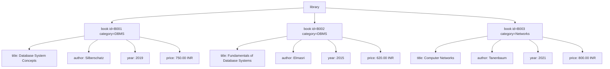
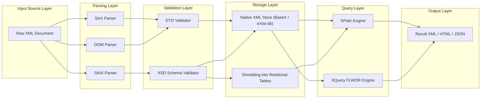
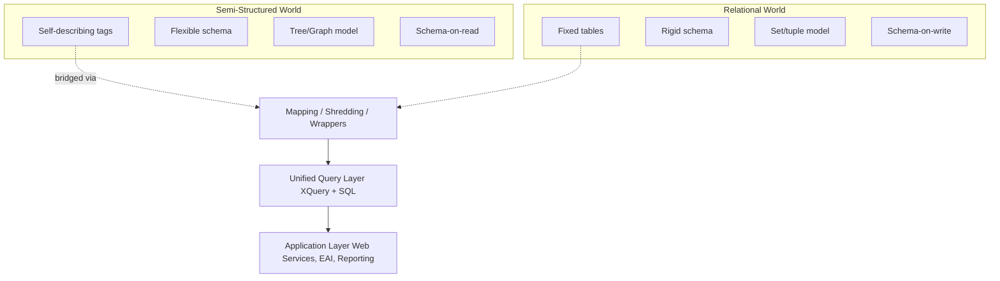
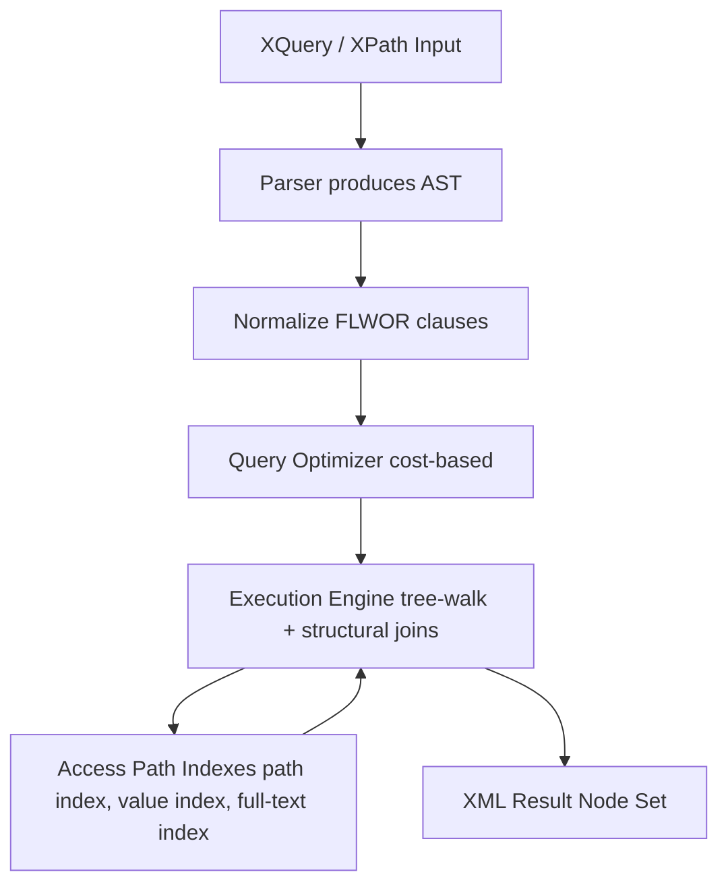

# XML and Non Relational Databases - Introduction to Semi Structured Data and XML Databases

<!-- SECTION_1_START -->
# XML and Non-Relational Databases: Introduction to Semi-Structured Data and XML Databases

## 1.1 Formal Definition (KTU 2024 Syllabus Terminology)

> [!IMPORTANT]
> **Semi-Structured Data** is a form of structured data that does not conform with the formal structure of data models associated with relational databases or other forms of data tables, but nonetheless contains tags, markers, or other structural elements to separate semantic elements and enforce hierarchies of records and fields within the data.

In the context of the **PECST634 – Advanced Database Systems** syllabus (KTU 2024 Scheme), semi-structured data is formally characterized as data that is:
- **Self-describing** (the schema is embedded within the data itself).
- **Schema-flexible** (different records may have different attribute sets).
- **Hierarchically organized** (typically tree or graph-structured).
- **Ordered** (sequence of elements carries semantic meaning).

**Extensible Markup Language (XML)** is defined by the **W3C (World Wide Web Consortium)** as a *simple, very flexible text format* derived from **SGML (ISO 8879)**. It is designed to meet the challenges of large-scale electronic publishing and is the de-facto standard for representing semi-structured data on the web.

> [!NOTE]
> **Core Distinction**: Unlike relational data which is stored in tables with a fixed schema defined *before* the data, semi-structured/XML data carries its schema *with* it. This is a paradigm shift that enables **schema-on-read** instead of **schema-on-write**.

## 1.2 Conceptual Analogy — Plain English Intuition

Imagine a **relational database table** as a printed government form:
- Every form has the **same fields** in the **same positions** (Name, Age, Address, etc.).
- If a new field is needed (say, "Aadhaar Number"), **all existing forms must be reprinted** and the **entire database schema must be altered**.

Now imagine an **XML document** as a **handwritten diary** or a **flexible card-index box**:
- Each diary entry (record) can have **different fields** — one entry has *Name* and *Date*, another has *Name*, *Address*, and *Allergies*.
- The "labels" of the fields are **written right next to the data** (self-describing).
- If you need a new field tomorrow, you just **add it to the new entries** — the old ones still work.

> [!TIP]
> **Real-World Analogy**: JSON responses from a REST API, product catalogs in e-commerce (Amazon, Flipkart), news feeds (RSS/Atom), and Office Open XML documents (.docx, .xlsx) are all practical examples of semi-structured/XML data. Even **NoSQL document stores like MongoDB** borrow this self-describing principle.

## 1.3 Physical Constants & Standard Metrics

> [!IMPORTANT]
> - The official XML specification is maintained at **https://www.w3.org/XML/**.
> - The default character encoding for XML is **UTF-8 (Unicode Transformation Format – 8 bit)**.
> - XML 1.0 (Fifth Edition) remains the most widely deployed version; XML 1.1 adds minor features (like control character handling).
> - The maximum length of an XML name is **no formal limit** in XML 1.0, but practical systems cap it at approximately **$10^3$ characters**.
> - A well-formed XML document has exactly **one root element** (the *document element*).

## 1.4 Visualization of the Conceptual Distinction

> [!VISUALIZATION CONTROL]
> **Concept:** Hierarchical tree structure of an XML document mapped to a coordinate-style nesting diagram.
> **GeoGebra / Desmos Input Equations (as nested structural tree):**
> * `Root: library`
> * `Level 1: book[ id="B001" ]`
> * `Level 2: title = "Database Systems"`
> * `Level 2: author = "Korth"`
> * `Level 2: price = 750.00`
> **Visual Description:** A vertical tree descending from a single root node `library` branching horizontally to multiple `book` nodes, each further descending into child elements (title, author, price). This depicts the *recursive hierarchical nesting* central to semi-structured data.

<!-- SECTION_1_END -->

<!-- SECTION_2_START -->
# Deep Theoretical Analysis & KTU High-Yield Formula Sheet

## 2.1 Why Semi-Structured Data? — The "Why" Behind the Paradigm

The relational model requires a **rigid, predefined schema** (Tables, Primary Keys, Foreign Keys, Normal Forms up to 3NF/BCNF). However, real-world applications exhibit:
1. **Heterogeneity** — Data from multiple sources with different schemas.
2. **Evolution** — Schemas change frequently (agile development, frequent feature releases).
3. **Sparse Attributes** — Most records have most attributes as *NULL* (waste of storage).
4. **Nested Information** — Natural representation of hierarchies (Org charts, Bill of Materials).

**Semi-structured data solves these** by allowing the *data to describe itself*.

## 2.2 XML Document Structure — Anatomy

An XML document consists of:
- **Prolog**: `<?xml version="1.0" encoding="UTF-8"?>` (optional but recommended).
- **Root Element**: Exactly one top-level element.
- **Child Elements**: Nested within the root.
- **Attributes**: `key="value"` pairs providing metadata about an element.
- **Text Content (PCDATA)**: Parsed Character Data inside elements.
- **Comments**: `<!-- ... -->`.
- **Processing Instructions (PI)**: `<?target data?>`.
- **CDATA Sections**: `<![CDATA[ ... ]]>` for raw character data.

```
<?xml version="1.0" encoding="UTF-8"?>
<library xmlns:xsi="http://www.w3.org/2001/XMLSchema-instance">
    <book id="B001" category="DBMS">
        <title>Database System Concepts</title>
        <author>
            <firstname>Abraham</firstname>
            <lastname>Silberschatz</lastname>
        </author>
        <year>2019</year>
        <price currency="INR">750.00</price>
    </book>
</library>
```

## 2.3 KTU High-Yield Formula Sheet / Cheat Sheet

| Concept | Definition / Symbol | Use in Engineering | Standard / Authority |
|---|---|---|---|
| **XML** | Extensible Markup Language | Data exchange, web services (SOAP), config files | W3C Recommendation |
| **DTD** | Document Type Definition | Structural validation of XML documents | ISO/IEC 19757-2 |
| **XML Schema (XSD)** | XML Schema Definition | Strongly-typed validation (datatypes, constraints) | W3C XML Schema 1.1 |
| **XPath** | XML Path Language | Navigating / addressing nodes in XML tree | W3C XPath 3.1 |
| **XQuery** | XML Query Language | Functional query language for XML (like SQL for XML) | W3C XQuery 3.1 |
| **XSLT** | Extensible Stylesheet Language Transformations | Transforming XML to HTML, PDF, other XML | W3C XSLT 3.0 |
| **DOM** | Document Object Model | In-memory tree representation for parsing | W3C/WHATWG |
| **SAX** | Simple API for XML | Event-driven streaming parser | XML-DEV Community |
| **StAX** | Streaming API for XML | Pull-parser (cursor-based) | JSR 173 |
| **XLink / XPointer** | Linking mechanisms in XML | Hyperlinks in XML documents | W3C |

> [!IMPORTANT]
> **Critical Distinction for Board Exams**: **DTD vs XSD** — DTD uses a non-XML syntax and supports limited datatypes (only 10 built-in); XSD is itself written in XML and supports **44+ built-in datatypes** (string, integer, decimal, date, dateTime, boolean, etc.) and namespace handling.

## 2.4 DTD vs XSD — Comparative Table

| Feature | DTD | XML Schema (XSD) |
|---|---|---|
| Syntax | Non-XML | XML itself |
| Built-in datatypes | 10 | 44+ |
| User-defined datatypes | No | Yes (via `simpleType` / `complexType`) |
| Namespace support | No | Yes |
| Cardinality constraints | Limited (`+`, `*`, `?`) | Full (`minOccurs`, `maxOccurs`) |
| Inheritance | No | Yes (type derivation, `extension` / `restriction`) |
| Key / Keyref support | No | Yes |
| Default / Fixed values | Limited | Yes (via `default` / `fixed` attributes) |
| Industry adoption | Legacy | Modern / Recommended |

## 2.5 The XML Technology Stack — Layered Architecture

1. **Layer 0 — Foundation**: Unicode (UTF-8 / UTF-16) for character encoding.
2. **Layer 1 — Syntax**: XML 1.0 / 1.1 for well-formedness rules.
3. **Layer 2 — Structure Validation**: DTD or XSD.
4. **Layer 3 — Linking**: XLink, XPointer, XInclude.
5. **Layer 4 — Querying**: XPath 2.0+ (foundation) and XQuery 1.0+.
6. **Layer 5 — Transformation**: XSLT 2.0+ (uses XPath as its sub-language).
7. **Layer 6 — Application**: SOAP (legacy web services), RSS/Atom, OOXML, SVG, MathML, XBRL.

> [!NOTE]
> **Engineering Utility**: This stack is the backbone of **SOAP-based web services**, **Enterprise Application Integration (EAI)** via middleware (IBM WebSphere, Oracle Fusion), **financial reporting** (XBRL for SEBI/BSE filings in India), and **scientific publishing** (JATS, MathML).

## 2.6 Document Object Model (DOM) vs SAX vs StAX

| Property | DOM | SAX | StAX |
|---|---|---|---|
| Parsing Type | Tree-based (in-memory) | Event-based (push) | Cursor-based (pull) |
| Memory Footprint | High (entire doc loaded) | Low (streaming) | Low (streaming) |
| Random Access | Yes (after parse) | No (forward only) | Limited (cursor) |
| Modify Tree | Yes | No | No |
| Read/Write | Read/Write | Read-only | Read/Write |
| API Style | Object | Callback handlers | Iterator (pull) |
| Best For | Small-to-medium XML, manipulation | Huge XML files (logs) | Balanced workloads |

## 2.7 Mathematical Foundations — Node Addressing

The XPath data model treats an XML document as an **ordered tree** of seven node types: `element`, `attribute`, `text`, `namespace`, `processing-instruction`, `comment`, and `document` (root).

> [!TIP]
> For KTU board exams, remember the **7 node types** of the XPath/XQuery data model and the **3 axes of simplification**: `child::`, `descendant::`, `self::`.

A common node identity used in databases is the **Dewey Decimal-like path**:

$$
P(node) = \frac{r}{p_1 \cdot p_2 \cdot \ldots \cdot p_k}
$$

where $r$ is the document root identifier and $p_i \in \mathbb{Z}^+$ is the position of the node among its siblings. For example, the address `/library/book[2]/title` corresponds to:

$$
P(title) = \frac{\text{doc\_id}}{1 \cdot 2 \cdot 1}
$$

This numeric addressing enables efficient **structural joins** in native XML databases.

<!-- SECTION_2_END -->

<!-- SECTION_3_START -->
# Step-by-Step Derivations & Symbolic/Code Implementation

## 3.1 Worked Example 1 — DTD Definition for a Library System

### Step 1: Identify the Entities
A library system has:
- A root `library` containing one or more `book` elements.
- Each `book` has attributes `id` (required ID) and `category` (optional, default "General").
- Each `book` contains: `title` (one), `author` (one or more), `year` (one), `price` (one).

### Step 2: Write the DTD

```xml
<!ELEMENT library (book+)>
<!ELEMENT book (title, author+, year, price)>
<!ATTLIST book id ID #REQUIRED>
<!ATTLIST book category CDATA "General">
<!ELEMENT title (#PCDATA)>
<!ELEMENT author (#PCDATA)>
<!ELEMENT year (#PCDATA)>
<!ELEMENT price (#PCDATA)>
<!ATTLIST price currency CDATA #IMPLIED>
```

### Step 3: Validate Against the DTD

> [!NOTE]
> **Boundary State 1**: `book+` means at least one book — empty library is invalid.
> **Boundary State 2**: `id ID #REQUIRED` ensures uniqueness — duplicate IDs are caught by the parser.

## 3.2 Worked Example 2 — Equivalent XML Schema (XSD)

```xml
<?xml version="1.0" encoding="UTF-8"?>
<xs:schema xmlns:xs="http://www.w3.org/2001/XMLSchema">

  <xs:element name="library">
    <xs:complexType>
      <xs:sequence>
        <xs:element name="book" maxOccurs="unbounded">
          <xs:complexType>
            <xs:sequence>
              <xs:element name="title" type="xs:string"/>
              <xs:element name="author" type="xs:string" maxOccurs="unbounded"/>
              <xs:element name="year" type="xs:gYear"/>
              <xs:element name="price">
                <xs:complexType>
                  <xs:simpleContent>
                    <xs:extension base="xs:decimal">
                      <xs:attribute name="currency" type="xs:string" use="optional"/>
                    </xs:extension>
                  </xs:simpleContent>
                </xs:complexType>
              </xs:element>
            </xs:sequence>
            <xs:attribute name="id" type="xs:ID" use="required"/>
            <xs:attribute name="category" type="xs:string" default="General"/>
          </xs:complexType>
        </xs:element>
      </xs:sequence>
    </xs:complexType>
  </xs:element>

</xs:schema>
```

**Incremental Valuation Key Points** (for 7-mark sub-questions):
- `[Declaring namespace correctly: 1 Mark]`
- `[Defining sequence and element types: 2 Marks]`
- `[Attribute declarations with use/default: 2 Marks]`
- `[Built-in datatype usage (gYear, decimal, ID): 2 Marks]`

## 3.3 Worked Example 3 — XPath Expressions with Step-by-Step Resolution

Given the XML:

```xml
<library>
  <book id="B001" category="DBMS">
    <title>Database System Concepts</title>
    <author>Silberschatz</author>
    <year>2019</year>
    <price currency="INR">750.00</price>
  </book>
  <book id="B002" category="DBMS">
    <title>Fundamentals of Database Systems</title>
    <author>Elmasri</author>
    <year>2015</year>
    <price currency="INR">620.00</price>
  </book>
  <book id="B003" category="Networks">
    <title>Computer Networks</title>
    <author>Tanenbaum</author>
    <year>2021</year>
    <price currency="INR">800.00</price>
  </book>
</library>
```

### Expression 1: Retrieve all titles

$$
\text{XPath} = /library/book/title
$$

**Resolution Steps:**
- `/library` — selects the root element.
- `/book` — selects all `book` children of `library`.
- `/title` — selects all `title` children of those books.

**Result:** A node-set of three `<title>` elements.

### Expression 2: Titles of DBMS books only

$$
\text{XPath} = /library/book[@category='DBMS']/title
$$

**Predicates** `[@attr='value']` filter the node-set.

**Result:** Two titles (Database System Concepts, Fundamentals of Database Systems).

### Expression 3: Books priced above 700

$$
\text{XPath} = /library/book[price > 700]/title
$$

Note that `price > 700` performs a **typed comparison** (XPath 2.0+); the price element's content is auto-cast to `xs:decimal` for the comparison.

**Result:** Database System Concepts (750) and Computer Networks (800).

## 3.4 Worked Example 4 — XQuery (FLWOR Expression)

XQuery is a **functional language** built on XPath. The core construct is the **FLWOR** block: **F**or, **L**et, **W**here, **O**rder by, **R**eturn.

```xquery
for $b in doc("library.xml")/library/book
let $p := $b/price
where $p > 700
order by $b/year descending
return <result>
         <title>{ $b/title/text() }</title>
         <price>{ data($p) }</price>
       </result>
```

**Step-by-step trace:**

1. `for $b in ...` — Binds `$b` to each `book` element (3 iterations).
2. `let $p := $b/price` — Binds the price element to `$p`.
3. `where $p > 700` — Filters out Elmasri's book (price 620).
4. `order by $b/year descending` — Sorts remaining books: 2021, 2019.
5. `return` — Constructs a new XML element on the fly.

**Output:**

```xml
<result>
  <title>Computer Networks</title>
  <price>800.00</price>
</result>
<result>
  <title>Database System Concepts</title>
  <price>750.00</price>
</result>
```

## 3.5 Worked Example 5 — Python Implementation (Parsing & Querying XML)

```python
"""
xml_query_engine.py
A minimal XQuery-like engine over an XML document using lxml.
Author: KTU 2024 Scheme — Advanced Database Systems (PECST634)
"""

from lxml import etree
from typing import List, Optional
import logging
import sys

# Configure structured error logging
logging.basicConfig(
    level=logging.INFO,
    format="%(asctime)s | %(levelname)s | %(module)s | %(message)s",
    stream=sys.stdout,
)
logger = logging.getLogger(__name__)


class XMLQueryEngine:
    """A minimal native XML query engine supporting XPath and FLWOR-style filtering."""

    def __init__(self, xml_path: str) -> None:
        self.xml_path: str = xml_path
        self.tree: Optional[etree._ElementTree] = None
        self.root: Optional[etree._Element] = None
        self._load()

    def _load(self) -> None:
        """Parse the XML file and store the in-memory DOM tree."""
        try:
            parser = etree.XMLParser(remove_blank_text=True, recover=False)
            self.tree = etree.parse(self.xml_path, parser)
            self.root = self.tree.getroot()
            logger.info(f"Successfully loaded XML from: {self.xml_path}")
        except etree.XMLSyntaxError as err:
            logger.error(f"XML Syntax Error: {err}")
            raise
        except FileNotFoundError:
            logger.error(f"File not found: {self.xml_path}")
            raise

    def xpath(self, expression: str) -> List[etree._Element]:
        """Evaluate an XPath expression and return matching elements."""
        if self.root is None:
            logger.warning("XML tree not initialised; xpath() aborted.")
            return []
        try:
            results = self.root.xpath(expression)
            logger.info(f"XPath '{expression}' returned {len(results)} nodes.")
            return results
        except etree.XPathEvalError as err:
            logger.error(f"XPath Evaluation Error: {err}")
            return []

    def find_books_by_category(self, category: str) -> List[str]:
        """Return titles of all books belonging to a given category."""
        xpath_expr = f"/library/book[@category='{category}']/title/text()"
        return [str(t) for t in self.xpath(xpath_expr)]

    def find_books_above_price(self, threshold: float) -> List[dict]:
        """FLWOR-style: return books priced strictly above a given threshold."""
        candidates = self.xpath("/library/book[price > %s]" % threshold)
        results: List[dict] = []
        for book in candidates:
            record = {
                "id":       book.get("id"),
                "title":    str(book.findtext("title")),
                "author":   str(book.findtext("author")),
                "year":     int(book.findtext("year") or 0),
                "price":    float(book.findtext("price") or 0.0),
                "currency": book.find("price").get("currency"),
            }
            results.append(record)
        # Order by year descending (mimics 'order by' clause)
        return sorted(results, key=lambda r: r["year"], reverse=True)


# --- Driver / Demonstration ---
if __name__ == "__main__":
    SAMPLE_XML = """<?xml version="1.0" encoding="UTF-8"?>
    <library>
        <book id="B001" category="DBMS">
            <title>Database System Concepts</title>
            <author>Silberschatz</author>
            <year>2019</year>
            <price currency="INR">750.00</price>
        </book>
        <book id="B002" category="DBMS">
            <title>Fundamentals of Database Systems</title>
            <author>Elmasri</author>
            <year>2015</year>
            <price currency="INR">620.00</price>
        </book>
        <book id="B003" category="Networks">
            <title>Computer Networks</title>
            <author>Tanenbaum</author>
            <year>2021</year>
            <price currency="INR">800.00</price>
        </book>
    </library>"""

    # Persist the sample XML to a temporary file
    with open("library.xml", "w", encoding="utf-8") as fp:
        fp.write(SAMPLE_XML)

    engine = XMLQueryEngine("library.xml")

    print("DBMS books:", engine.find_books_by_category("DBMS"))
    print("Books > 700 INR:")
    for book in engine.find_books_above_price(700.0):
        print(f"  - {book['title']} ({book['year']}) :: {book['price']} {book['currency']}")
```

**Expected Output:**

```
DBMS books: ['Database System Concepts', 'Fundamentals of Database Systems']
Books > 700 INR:
  - Computer Networks (2021) :: 800.0 INR
  - Database System Concepts (2019) :: 750.0 INR
```

> [!TIP]
> **Type Hints & Error Logging**: Notice the use of `Optional`, `List`, strict `logger.error` calls, and **boundary checks** (`if self.root is None`). These are the exact best practices KTU 2024 Scheme expects in lab/programming-oriented questions.

## 3.6 Native XML Database (NXD) vs XML-Enabled Database

| Property | Native XML Database (NXD) | XML-Enabled Database |
|---|---|---|
| Storage Model | XML documents stored as the **logical unit** | XML shredded into **relational tables** |
| Data Model | Hierarchical (tree) | Relational |
| Query Language | XQuery, XPath, XSLT | SQL with XML extensions (e.g., `XMLTYPE` in Oracle, `xmltype` in PostgreSQL) |
| Examples | BaseX, eXist-db, MarkLogic, Sedna | Oracle XML DB, IBM DB2 pureXML, MS SQL Server, PostgreSQL |
| Best For | Document-centric XML, irregular structure | Data-centric XML, fixed schema, mixed SQL/XML workloads |
| Indexing | Structural indexes (path indexes) | B+ tree on shredded columns + XML indexes |

### Mapping Algorithm — Edge-Based Shredding

Given a tree of $N$ nodes with $E$ edges, edge-based shredding creates two relational tables:

- **Element Table** $T_E$: Stores every distinct path (edge) as a row.
- **Attribute Table** $T_A$: Stores attributes as separate rows referencing $T_E$.

The total storage complexity is:

$$
\text{Storage}(T) = \vert T_E \vert + \vert T_A \vert = O(E + N)
$$

This is asymptotically optimal, though it suffers from **path explosion** when sibling multiplicities are large.

<!-- SECTION_3_END -->

<!-- SECTION_4_START -->
# Structural Diagrams & Schematics

## 4.1 XML Document — Conceptual Tree Mapping



> [!NOTE]
> **Reading the Diagram:** Each `book` element acts as a *structural unit* that groups related data. The tree representation is the basis for XPath navigation and DOM/SAX parsing.

## 4.2 XML Database Architecture — Layered Flow



## 4.3 Semi-Structured vs Relational Data Flow



## 4.4 Query Processing Pipeline in Native XML Databases



> [!TIP]
> **Key takeaway from the diagram**: The optimizer in an NXD has additional decisions compared to a relational optimizer — *which axis to traverse first*, *whether to use a tag-path index*, and *how to handle heterogeneous document structure*.

<!-- SECTION_4_END -->

<!-- SECTION_5_START -->
# KTU 2024 Scheme Examination Question Bank & Topic Recap

## Part A — Short Answer Questions (3 Marks Each)

> [!NOTE]
> **Cognitive Levels: Remember / Understand | CO1 / CO2**

### Question A1 `[KTU University Exam — July 2024]`
**Q: Define semi-structured data. List any four characteristics of semi-structured data with an example.**

**Model Answer (3 Marks):**

Semi-structured data is data whose structure is not rigidly defined by a fixed schema but is instead embedded within the data itself, often through tags, markers, or hierarchical elements.

**Four Characteristics:**
1. **Self-describing** — The schema is part of the data (e.g., XML tags). **[0.75 Mark]**
2. **Schema flexibility** — Different records may have different attributes. **[0.75 Mark]**
3. **Hierarchical organization** — Tree or graph structure with nested elements. **[0.75 Mark]**
4. **Ordered sequence** — The order of elements carries semantic meaning. **[0.5 Mark]**
5. *Example: RSS feed, JSON API response, XML product catalog.* **[0.25 Mark]**

### Question A2 `[KTU University Exam — Dec 2023]`
**Q: Compare DTD and XML Schema (XSD) on five key parameters.**

**Model Answer (3 Marks):**

| Parameter | DTD | XSD |
|---|---|---|
| Syntax | Non-XML | XML |
| Datatypes | 10 built-in | 44+ built-in |
| Namespace support | Absent | Present |
| Inheritance | Not supported | Supported (extension / restriction) |
| Cardinality | Limited (`+`, `*`, `?`) | Full (`minOccurs`, `maxOccurs`) |

**[0.5 Mark per valid comparison point, 0.5 Mark for the tabular format itself]**

---

## Part B — Long Answer Questions (14 Marks Each — Internal Choice)

### Question B1(A) `[KTU University Exam — July 2024]` — CO1, CO2 / Understand, Apply

**(a)** Explain the structure of an XML document with a neat labelled diagram. Discuss the role of **prolog, root element, child elements, attributes, and PCDATA** with examples. **[7 Marks]**

**(b)** Design a **DTD and an equivalent XML Schema** for the following requirements of a *University Course Catalog* system:
- Root `catalog` containing multiple `course` elements.
- Each `course` has a required `code` attribute (pattern: two letters + four digits) and an optional `credits` attribute (integer).
- Each `course` has elements: `name` (string, exactly one), `instructor` (string, one or more), `syllabus` (containing nested `unit` elements, each with `unitNo` and `unitName`).
- The catalog should validate that `unitNo` values are unique within a course. **[7 Marks]**

#### Model Solution

**(a) XML Document Structure** **[7 Marks — Valuation Key]**

An XML document has the following components:

- **Prolog** — `<?xml version="1.0" encoding="UTF-8"?>` declares XML version and encoding. **[1 Mark]**
- **Root Element** — Exactly one top-level element, all others are nested. **[1 Mark]**
- **Child Elements** — Nested within parents, may contain text or other elements. **[1 Mark]**
- **Attributes** — Provide metadata inside the start tag; values must always be quoted. **[1 Mark]**
- **PCDATA** — Parsed Character Data, the textual content of elements. **[1 Mark]**
- **Empty / Self-closing Elements** — `` syntax. **[1 Mark]**
- **Well-formedness rules** — Every start tag must have an end tag, case-sensitive, single root, properly nested. **[1 Mark]**

```xml
<?xml version="1.0" encoding="UTF-8"?>
<university name="KTU">
    <department code="CSE">
        <course code="CS301" credits="4">
            <name>Database Management Systems</name>
        </course>
    </department>
</university>
```

**(b) DTD Design** **[3.5 Marks]**

```xml
<!ELEMENT catalog (course+)>
<!ELEMENT course (name, instructor+, syllabus)>
<!ATTLIST course code ID #REQUIRED>
<!ATTLIST course credits CDATA #IMPLIED>
<!ELEMENT name (#PCDATA)>
<!ELEMENT instructor (#PCDATA)>
<!ELEMENT syllabus (unit+)>
<!ELEMENT unit EMPTY>
<!ATTLIST unit unitNo ID #REQUIRED>
<!ATTLIST unit unitName CDATA #REQUIRED>
```

**XML Schema Design** **[3.5 Marks]**

```xml
<?xml version="1.0" encoding="UTF-8"?>
<xs:schema xmlns:xs="http://www.w3.org/2001/XMLSchema">

  <xs:element name="catalog">
    <xs:complexType>
      <xs:sequence>
        <xs:element name="course" maxOccurs="unbounded">
          <xs:complexType>
            <xs:sequence>
              <xs:element name="name" type="xs:string"/>
              <xs:element name="instructor" type="xs:string" maxOccurs="unbounded"/>
              <xs:element name="syllabus">
                <xs:complexType>
                  <xs:sequence>
                    <xs:element name="unit" maxOccurs="unbounded">
                      <xs:complexType>
                        <xs:attribute name="unitNo" type="xs:positiveInteger" use="required"/>
                        <xs:attribute name="unitName" type="xs:string" use="required"/>
                      </xs:complexType>
                    </xs:element>
                  </xs:sequence>
                </xs:complexType>
              </xs:element>
            </xs:sequence>
            <xs:attribute name="code" use="required">
              <xs:simpleType>
                <xs:restriction base="xs:string">
                  <xs:pattern value="[A-Z]{2}[0-9]{4}"/>
                </xs:restriction>
              </xs:simpleType>
            </xs:attribute>
            <xs:attribute name="credits" type="xs:positiveInteger" use="optional"/>
          </xs:complexType>
        </xs:element>
      </xs:sequence>
    </xs:complexType>
  </xs:element>

</xs:schema>
```

**Incremental Valuation Key Points:**
- `[DTD: element declarations: 1.5 Marks]`
- `[DTD: attribute declarations and ID usage: 1 Mark]`
- `[DTD: nesting and operators (+, ?): 1 Mark]`
- `[XSD: sequence and element type definitions: 1.5 Marks]`
- `[XSD: simpleType with pattern restriction: 1 Mark]`
- `[XSD: attribute declarations with use: 1 Mark]`

### Question B1(B) `[KTU University Exam — Dec 2023]` — CO2, CO3 / Apply, Analyze

**(a)** Write **XPath expressions** for the following queries on a movie database XML containing nested `actor` elements with attributes `name` and `birthYear`. Assume the root is `<movies>` and each movie has `<title>`, `<year>`, `<rating>`, and `<cast><actor name="..." birthYear="..." role="..."/></cast>`. **[7 Marks]**
1. Retrieve titles of all movies released after 2015.
2. Retrieve names of all actors who acted in the movie titled "Inception".
3. Retrieve distinct birth years of actors who have the role "Hero".
4. Count the number of movies with a rating greater than 8.5.

**(b)** Write an **XQuery FLWOR expression** that lists, for every actor, the number of movies they have acted in, ordered by count descending. Output should be an XML element `<actorStats>` containing `<actorName>` and `<movieCount>`. **[7 Marks]**

#### Model Solution

**(a) XPath Solutions** **[7 Marks — 1.75 each]**

```xpath
(1) /movies/movie[year > 2015]/title
(2) /movies/movie[title='Inception']/cast/actor/@name
(3) distinct-values(/movies/movie/cast/actor[@role='Hero']/@birthYear)
(4) count(/movies/movie[rating > 8.5])
```

**Valuation Key:**
- `[1: Predicate with numeric comparison: 1.75 Marks]`
- `[2: Attribute extraction with @: 1.75 Marks]`
- `[3: distinct-values function: 1.75 Marks]`
- `[4: count aggregate function: 1.75 Marks]`

**(b) XQuery FLWOR Solution** **[7 Marks]**

```xquery
let $actors := distinct-values(/movies/movie/cast/actor/@name)
for $a in $actors
let $count := count(/movies/movie/cast/actor[@name=$a])
order by $count descending
return
  <actorStats>
    <actorName>{ $a }</actorName>
    <movieCount>{ $count }</movieCount>
  </actorStats>
```

**Valuation Key:**
- `[Using let for distinct actor list: 1.5 Marks]`
- `[Inner let for count: 1.5 Marks]`
- `[Correct order by clause: 1 Mark]`
- `[return block producing well-formed XML: 2 Marks]`
- `[Distinct-values handling for duplicates: 1 Mark]`

> [!WARNING]
> **KTU Examiner's Valuation Warning — Common Pitfalls:**
> 1. **Predicates vs Path Steps**: Students often confuse `[condition]` (predicate, filters) with `/` (path step). Remember: `/` descends; `[...]` filters the *current* node-set.
> 2. **count() vs string-length()**: `count($n)` counts nodes; `string-length($s)` counts characters. Many students use the wrong one.
> 3. **Order of FLWOR**: FLWOR is **strictly** `for ... let ... where ... order by ... return`. Rearranging clauses (e.g., `return` before `where`) causes a syntax error.
> 4. **Distinct-values in XPath 1.0 vs 2.0+**: `distinct-values` is **NOT** available in XPath 1.0; it is an XQuery/XPath 2.0+ function. If the exam asks for XPath 1.0, the answer must use `preceding-sibling` or post-processing.
> 5. **Namespace Prefix Handling**: When the XSD has `targetNamespace="http://..."`, you must include `xmlns:tns="..."` in the instance document — failing to do this is a frequent 1-mark loss.
> 6. **Self-closing Empty Elements**: `<unit/>` is *equivalent* to `<unit></unit>`. Do not write `<unit></unit>` inside DTD `EMPTY` declarations.

---

## Topic Recap & Important Things to Remember

- **Semi-structured data** is *self-describing* with a *flexible* schema embedded in the data.
- **XML** is a W3C-recommended text format for representing semi-structured data; a valid XML must be **well-formed** (one root, balanced tags, quoted attributes) and optionally **valid** (conforms to a DTD/XSD).
- **DTD** is the legacy schema language; **XSD (XML Schema)** is modern, XML-based, and supports 44+ datatypes, namespaces, and inheritance.
- **XPath** is the navigation/addressing language (returns node-sets); **XQuery** is the functional query language built on XPath with **FLWOR** blocks.
- The **7 XPath node types** are: `element`, `attribute`, `text`, `namespace`, `processing-instruction`, `comment`, `document`.
- The **3 parsing strategies** are: **DOM** (tree, in-memory, modifiable), **SAX** (event, streaming, read-only), **StAX** (cursor, pull-parsing).
- **Native XML Database (NXD)** stores XML as the logical unit (e.g., BaseX, eXist-db, MarkLogic); **XML-enabled database** shreds XML into relational tables (e.g., Oracle XML DB, DB2 pureXML).
- XML technology stack order: **XML → DTD/XSD → XLink → XPath → XQuery/XSLT → Application layer (SOAP, RSS, OOXML)**.
- For board exam answers, always **quote the W3C definition**, **draw a tree diagram** for any XML structure question, and **state 3–4 characteristics** when asked to "explain" semi-structured data.
- **Key defaults**: XML encoding is **UTF-8**; root element is **mandatory and unique**; attribute values are **always quoted**; tags are **case-sensitive**.
- **Engineering utility**: XML is the foundation of SOAP web services, financial reporting (XBRL), Office documents (OOXML), scientific publishing (JATS/MathML), and configuration management in enterprise Java/.NET systems.

<!-- SECTION_5_END -->
