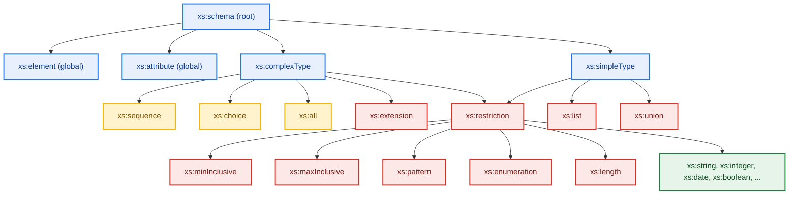
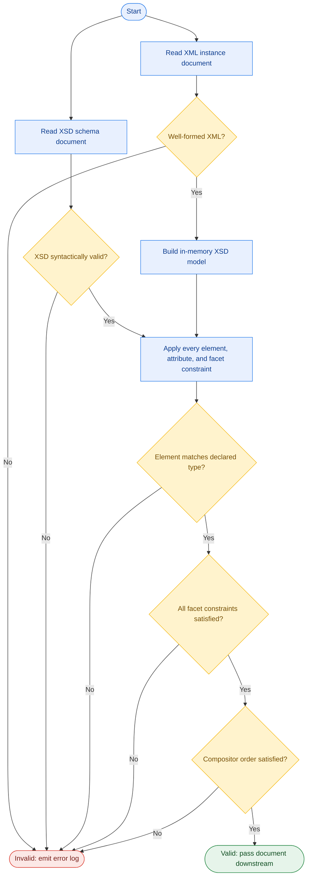
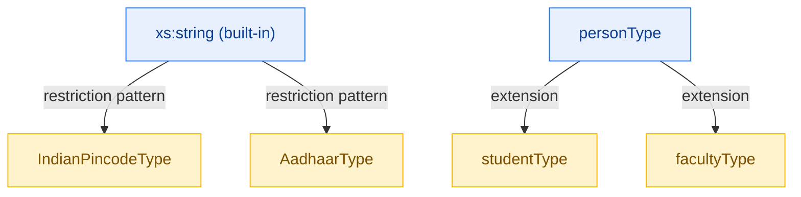

# XML Data Model – XSD

<!-- SECTION_1_START -->
# XML Data Model and XSD (XML Schema Definition)

## 1.1 The XML Data Model — Formal Definition

The **XML (eXtensible Markup Language) Data Model** is a hierarchical, tree-structured data model defined by the W3C. In this model, every well-formed XML document is represented as an **ordered, rooted, labelled tree** whose nodes are of seven kinds: document node, element node, attribute node, text node, namespace node, processing-instruction node, and comment node.

> [!NOTE]
> **Core Definition (KTU 2024 Syllabus Terminology)**
> The XML data model is a *self-describing*, *semi-structured* data model in which the schema and the data are embedded within the same document. The model supports ordered, heterogeneous, and deeply nested data — a sharp contrast to the flat, homogeneous, set-theoretic relational model.

The **XSD (XML Schema Definition)**, formally known as *XSD 1.1* (W3C Recommendation, 2012), is the standard schema language used to **constrain, validate, and document** the structure and data types of XML documents conforming to the XML data model.

---

## 1.2 Intuitive Analogy — "The Blueprint Metaphor"

Imagine an XML document is a **building** and XSD is its **architectural blueprint**.

| Real-world Object | XML Equivalent |
|---|---|
| The building itself | The XML instance document |
| The architectural blueprint | The XSD schema file |
| "Every room must have at least one door" | An XSD element *occurrence constraint* (`minOccurs="1"`) |
| "A door must be wooden or metal" | A `<choice>` compositor with two `<simpleType>`s |
| "Wall thickness $\geq$ 10 cm" | A *facet* such as `minInclusive="10"` |
| "The plot number is just a number, not free text" | A built-in datatype like `xs:integer` |

Just as a blueprint can be reused to build many similar buildings, **one XSD can validate thousands of XML documents** consistently.

> [!IMPORTANT]
> **Why XSD over DTD?**
> XSD is the *successor* to the older DTD (Document Type Definition). XSD supports **44+ built-in datatypes** (`xs:string`, `xs:integer`, `xs:date`, `xs:boolean`, etc.), **namespaces**, **type inheritance (derivation by `restriction` and `extension`)**, and **occurrence constraints on `<attribute>`** — none of which DTD supports. In KTU 2024 scheme questions, the examiner almost always expects you to list at least 4 advantages of XSD over DTD.

---

## 1.3 The Tree View of an XML Document

Consider the following minimal XML fragment:

```xml
<library xmlns="http://www.ktu.edu/library">
    <book isbn="978-0-13-468599-1" edition="3">
        <title>The Pragmatic Programmer</title>
        <author>Hunt</author>
        <author>Thomas</author>
        <price currency="INR">450.00</price>
    </book>
</library>
```

The tree visualisation is:

```
library [Element, root]
 └── book [Element, isbn=…, edition=…]
      ├── title [Element → Text]
      ├── author [Element → Text]  ← (sibling, ordered)
      ├── author [Element → Text]  ← (sibling, ordered)
      └── price [Element, currency=… → Text]
```

> [!VISUALIZATION CONTROL]
> **Concept:** Hierarchical Node Tree of an XML Document
> **Tree Structure (Desmos-style conceptual graph):**
> * Root node: `library` — `(0, 0)`
> * Child node: `book` — `(-2, -1)`
> * Leaf nodes under `book`: `title`, `author`, `author`, `price` — all at `y = -2`
> **Visual Description:** The root sits at the top, element nodes branch downward, and attribute nodes appear as side-labels attached to their parent element. Sibling order (left-to-right) is **significant** in XML — the two `<author>` elements are not interchangeable.

> [!TIP]
> **Quick Memory Hook:** In XML, *"element order matters, attribute order does not"*. The two `<author>` tags are *ordered siblings*; the `isbn` and `edition` attributes on `<book>` are *unordered name–value pairs*.

---

## 1.4 Two Notions of "Correctness"

| Concept | Meaning | Enforced by |
|---|---|---|
| **Well-formed XML** | Every tag is properly opened/closed, attributes are quoted, root is unique | XML parser (e.g. `lxml`, `SAX`, `DOM`) |
| **Valid XML** | Well-formed **and** conforms to a schema | XSD validator (e.g. `xmllint --schema`) |

XSD is the formal mechanism that takes a document from *well-formed* to *valid*.

---

## 1.5 The XSD Document Skeleton

Every XSD file is itself an XML document with the namespace `http://www.w3.org/2001/XMLSchema`:

```xml
<?xml version="1.0" encoding="UTF-8"?>
<xs:schema xmlns:xs="http://www.w3.org/2001/XMLSchema"
           targetNamespace="http://www.ktu.edu/library"
           elementFormDefault="qualified">

    <!-- schema components go here -->

</xs:schema>
```

The two critical attributes are:

* `xmlns:xs` — binds the prefix `xs:` to the XSD namespace (mandatory).
* `targetNamespace` — the **namespace under which the elements you define will live** in instance documents.
* `elementFormDefault="qualified"` — forces *every* element in instance documents to be explicitly namespace-prefixed (the KTU-recommended default).
<!-- SECTION_1_END -->

<!-- SECTION_2_START -->
# Deep Theoretical Analysis & KTU High-Yield Cheat Sheet

## 2.1 The XSD Component Hierarchy

An XSD schema is a set of **schema components** that fall into three families:

1. **Primary structural components** — `<element>`, `<attribute>`, `<complexType>`, `<simpleType>`, `<group>`, `<attributeGroup>`.
2. **Helper / derivation components** — `<restriction>`, `<extension>`, `<list>`, `<union>`.
3. **Compositor components** — `<sequence>`, `<choice>`, `<all>` (used *inside* a `<complexType>` to order child particles).

> [!NOTE]
> **The fundamental design rule of XSD:**
> Every element/attribute is associated with a **type**. There are exactly two top-level kinds of types — `<simpleType>` and `<complexType>`. No element can exist without a type.

---

## 2.2 Simple Types vs. Complex Types

| Property | `<simpleType>` | `<complexType>` |
|---|---|---|
| Can contain **element children**? | No | Yes |
| Can carry **attributes**? | No | Yes |
| Can hold **mixed content** (text + elements)? | No | Yes (via `mixed="true"`) |
| Typical usage | Atomic values: name, age, ISBN | Structured records: `<book>`, `<order>` |
| Built-in examples | `xs:string`, `xs:int`, `xs:date` | *(none — complex types are user-defined)* |

---

## 2.3 Built-in Datatypes — The 44+ `xs:` Types

These are the **atomic types** you will use in 90 % of KTU exam questions:

| Datatype | Description | Example Literal |
|---|---|---|
| `xs:string` | Any Unicode string | `"Hello World"` |
| `xs:normalizedString` | Whitespace-normalized | `"Hello World"` |
| `xs:token` | No leading/trailing/internal whitespace | `"HelloWorld"` |
| `xs:integer` | Arbitrary-precision integer | `42` |
| `xs:decimal` | Arbitrary-precision decimal | `3.14` |
| `xs:float` / `xs:double` | IEEE 754 floating-point | `1.5e2` |
| `xs:boolean` | `true` or `false` | `true` |
| `xs:date` | Calendar date (ISO 8601) | `2025-01-15` |
| `xs:time` | Time of day | `13:45:00+05:30` |
| `xs:dateTime` | Date + time | `2025-01-15T13:45:00` |
| `xs:duration` | Time duration | `P3Y6M4DT12H` |
| `xs:anyURI` | URI/URL | `"https://ktu.edu"` |
| `xs:base64Binary` | Base-64 encoded binary | `"SGk="` |
| `xs:hexBinary` | Hex-encoded binary | `"0FB7"` |

---

## 2.4 Facets — Constraining Simple Types

A **facet** is a single constraint applied to a simple type. Multiple facets combine to form a *derived* type.

| Facet | Meaning | Sample Use |
|---|---|---|
| `minInclusive` | value $\geq$ given | `minInclusive="0"` |
| `maxInclusive` | value $\leq$ given | `maxInclusive="100"` |
| `minExclusive` | value $>$ given | `minExclusive="0"` |
| `maxExclusive` | value $<$ given | `maxExclusive="150"` |
| `length` | exact character count | `length="10"` (e.g. ISBN-10) |
| `minLength` / `maxLength` | string length range | `minLength="3" maxLength="30"` |
| `pattern` | regex the value must match | `pattern="[A-Z]{2}[0-9]{2}"` |
| `enumeration` | fixed set of allowed values | `enumeration value="B.Tech"` |
| `totalDigits` / `fractionDigits` | decimal precision | `totalDigits="6" fractionDigits="2"` |
| `whiteSpace` | `preserve` / `replace` / `collapse` | `whiteSpace="collapse"` |

> [!TIP]
> **Exam Tip:** The examiner often asks *"How do you restrict a string to a 6-digit pincode in XSD?"* The answer is a `<simpleType>` with `<restriction base="xs:string">` and a `<pattern value="[0-9]{6}"/>` facet.

---

## 2.5 Compositors Inside `<complexType>`

A compositor defines **how child elements are arranged**:

| Compositor | Meaning | Example Intent |
|---|---|---|
| `<sequence>` | Children appear in the **declared order** | `<name>` then `<dob>` then `<email>` |
| `<choice>` | **Exactly one** of the children appears | Payment is `<cash>` *or* `<card>` *or* `<upi>` |
| `<all>` | Children appear in **any order**, each at most once | `<firstName>`, `<lastName>`, `<email>` (unordered) |

**Occurrence attributes** `minOccurs` and `maxOccurs` modify the compositor:

* `minOccurs="0"` — the element is *optional*.
* `maxOccurs="unbounded"` — the element may repeat infinitely (e.g. multiple `<author>` tags).

---

## 2.6 Type Derivation — `restriction` and `extension`

XSD supports **inheritance** through two derivation mechanisms:

* **Derivation by `restriction`** — narrow down a base type. Example: derive `IndianPincode` from `xs:string` by adding a 6-digit `pattern`.
* **Derivation by `extension`** — add new elements/attributes on top of a base complex type. Example: extend a `Person` type to add a `studentId` element for `Student`.

```xml
<xs:complexType name="studentType">
    <xs:complexContent>
        <xs:extension base="personType">
            <xs:sequence>
                <xs:element name="studentId" type="xs:string"/>
            </xs:sequence>
        </xs:extension>
    </xs:complexContent>
</xs:complexType>
```

---

## 2.7 KTU High-Yield Cheat Sheet — XSD vs DTD

| Feature | DTD | XSD |
|---|---|---|
| Written in | Custom non-XML syntax | XML itself (meta-language) |
| Built-in datatypes | 10 (mostly strings) | 44+ |
| User-defined types | No | Yes (via `simpleType` / `complexType`) |
| Namespace support | No | Yes (full XML Namespaces 1.0) |
| Inheritance | No | Yes (`restriction` / `extension`) |
| Occurrence on attributes | No (only `#IMPLIED`, `#REQUIRED`, `#FIXED`) | Yes (`use="required"`, `use="optional"`, `use="prohibited"`) |
| Cardinality of elements | `?`, `*`, `+` (limited) | `minOccurs`, `maxOccurs` (any non-negative integer) |
| Cardinality constraints | None (no `minOccurs="0"` equivalent on attributes) | Full |
| Constraints (key, keyref) | None | Yes (`xs:key`, `xs:keyref`, `xs:unique`) |

> [!IMPORTANT]
> **Real-world Engineering Utility**
> XSD is the backbone of **SOAP/WSDL web services**, **XML-based configuration files** (Maven `pom.xml`, Spring `beans.xml`, Android `AndroidManifest.xml`), **B2B data exchange** (RosettaNet, HL7 healthcare messages), and **financial reporting formats** (XBRL). The `xmllint --schema file.xsd file.xml` validator is used in CI/CD pipelines to fail builds on malformed XML — making XSD a *production-grade* engineering artefact, not a textbook toy.

---

## 2.8 XSD Constraint Components — Identity, References, Keys

XSD 1.0/1.1 supports database-like constraints:

| Component | Purpose | Database Analogy |
|---|---|---|
| `xs:unique` | All values of a field are unique | `UNIQUE` constraint |
| `xs:key` | Values are unique **and** non-null | `PRIMARY KEY` |
| `xs:keyref` | References a `key` | `FOREIGN KEY` |

These operate on the **XPath** subset (e.g. `selector="book"`, `field="@isbn"`).
<!-- SECTION_2_END -->

<!-- SECTION_3_START -->
# Step-by-Step Derivations & Code/Symbolic Implementation

## 3.1 Problem Statement — Build a Complete XSD for a University Course Catalog

We will design an XSD for a course catalog that KTU itself could realistically publish. Every derivation step is fully written.

### Step 1 — Identify the data entities

> A KTU course catalog contains: a `<university>` root holding many `<course>` elements. Each course has a course code, name, credits, semester, mode (regular/honors), an instructor, and zero-or-more `<syllabusUnit>` elements.

### Step 2 — Declare the root and the global element types

```xml
<?xml version="1.0" encoding="UTF-8"?>
<xs:schema xmlns:xs="http://www.w3.org/2001/XMLSchema"
           targetNamespace="http://www.ktu.edu/catalog"
           xmlns="http://www.ktu.edu/catalog"
           elementFormDefault="qualified">

    <!-- ============== 1. ROOT ELEMENT ============== -->
    <xs:element name="university">
        <xs:complexType>
            <xs:sequence>
                <xs:element name="course" type="courseType" maxOccurs="unbounded"/>
            </xs:sequence>
        </xs:complexType>
    </xs:element>

    <!-- ============== 2. COURSE COMPLEX TYPE ============== -->
    <xs:complexType name="courseType">
        <xs:sequence>
            <xs:element name="courseCode" type="courseCodeType"/>
            <xs:element name="courseName" type="xs:string"/>
            <xs:element name="credits"     type="creditType"/>
            <xs:element name="semester"    type="semesterType"/>
            <xs:element name="mode"        type="modeType"/>
            <xs:element name="instructor"  type="instructorType"/>
            <xs:element name="syllabusUnit" type="unitType"
                        minOccurs="0" maxOccurs="unbounded"/>
        </xs:sequence>
        <xs:attribute name="department" type="xs:string" use="required"/>
    </xs:complexType>

    <!-- ============== 3. SIMPLE TYPES (RESTRICTIONS) ============== -->

    <!-- Course code: e.g. "CSL201" -->
    <xs:simpleType name="courseCodeType">
        <xs:restriction base="xs:string">
            <xs:pattern value="[A-Z]{3}[0-9]{3}"/>
        </xs:restriction>
    </xs:simpleType>

    <!-- Credits: integer between 1 and 6 inclusive -->
    <xs:simpleType name="creditType">
        <xs:restriction base="xs:integer">
            <xs:minInclusive value="1"/>
            <xs:maxInclusive value="6"/>
        </xs:restriction>
    </xs:simpleType>

    <!-- Semester: 1..8 only -->
    <xs:simpleType name="semesterType">
        <xs:restriction base="xs:positiveInteger">
            <xs:minInclusive value="1"/>
            <xs:maxInclusive value="8"/>
        </xs:restriction>
    </xs:simpleType>

    <!-- Mode: closed enumeration -->
    <xs:simpleType name="modeType">
        <xs:restriction base="xs:string">
            <xs:enumeration value="Regular"/>
            <xs:enumeration value="Honors"/>
            <xs:enumeration value="Minor"/>
        </xs:restriction>
    </xs:simpleType>

    <!-- Instructor: holds an id attribute and a name element -->
    <xs:complexType name="instructorType">
        <xs:sequence>
            <xs:element name="name" type="xs:string"/>
        </xs:sequence>
        <xs:attribute name="facultyId" type="xs:string" use="required"/>
    </xs:complexType>

    <!-- Syllabus unit: number + title + hours -->
    <xs:complexType name="unitType">
        <xs:sequence>
            <xs:element name="unitTitle" type="xs:string"/>
            <xs:element name="hours"     type="xs:positiveInteger"/>
        </xs:sequence>
        <xs:attribute name="unitNo" type="xs:positiveInteger" use="required"/>
    </xs:complexType>

</xs:schema>
```

> [!NOTE]
> **Valuation Key Point:** For every `<simpleType>` you declare, the examiner awards 1 mark for the correct `base=`, 1 mark for choosing the right facet, and 1 mark for the correct facet value. Always show the *closed enumeration* (e.g. modeType) when the question is about faculty, program, or grade values.

### Step 3 — A Valid Instance Document

```xml
<?xml version="1.0" encoding="UTF-8"?>
<university xmlns="http://www.ktu.edu/catalog">

    <course department="CSE">
        <courseCode>CSL201</courseCode>
        <courseName>Advanced Database Systems</courseName>
        <credits>4</credits>
        <semester>6</semester>
        <mode>Regular</mode>
        <instructor facultyId="F1023">
            <name>Dr. Anitha S</name>
        </instructor>

        <syllabusUnit unitNo="1">
            <unitTitle>XML and Non-Relational Models</unitTitle>
            <hours>6</hours>
        </syllabusUnit>
        <syllabusUnit unitNo="2">
            <unitTitle>Object-Oriented Databases</unitTitle>
            <hours>7</hours>
        </syllabusUnit>
    </course>

</university>
```

### Step 4 — An Invalid Instance (for contrast)

```xml
<course department="CSE">
    <courseCode>cs201</courseCode>      <!-- WRONG: lowercase, length 5 -->
    <courseName>ADBS</courseName>
    <credits>10</credits>               <!-- WRONG: exceeds maxInclusive 6 -->
    <semester>9</semester>              <!-- WRONG: exceeds maxInclusive 8 -->
    <mode>Online</mode>                 <!-- WRONG: not in enumeration -->
</course>
```

> [!WARNING]
> **XSD is case-sensitive.** A pattern of `[A-Z]{3}[0-9]{3}` will *reject* `cs201` even though the characters are the same. Students routinely lose 1 mark for forgetting this.

---

## 3.2 Three More Mini-Derivations (Hand-Built)

### 3.2.1 IndianPincode — Derived by Restriction

Starting from `xs:string` and adding a regex facet.

```xml
<xs:simpleType name="IndianPincodeType">
    <xs:restriction base="xs:string">
        <xs:pattern value="[1-9][0-9]{5}"/>
        <xs:length value="6"/>
        <xs:whiteSpace value="collapse"/>
    </xs:restriction>
</xs:simpleType>
```

> Derivation logic: pincode **cannot start with 0** (so the first digit is `[1-9]`), is followed by exactly **5 more digits**, and total length is **6**. Whitespace must be `collapse`d to prevent `"  673001  "` from passing.

### 3.2.2 GradeType — Closed Enumeration

```xml
<xs:simpleType name="GradeType">
    <xs:restriction base="xs:string">
        <xs:enumeration value="S"/>
        <xs:enumeration value="A"/>
        <xs:enumeration value="B"/>
        <xs:enumeration value="C"/>
        <xs:enumeration value="D"/>
        <xs:enumeration value="F"/>
    </xs:restriction>
</xs:simpleType>
```

### 3.2.3 PersonType → StudentType — Derived by Extension

```xml
<xs:complexType name="personType">
    <xs:sequence>
        <xs:element name="name" type="xs:string"/>
        <xs:element name="age"  type="xs:nonNegativeInteger"/>
    </xs:sequence>
</xs:complexType>

<xs:complexType name="studentType">
    <xs:complexContent>
        <xs:extension base="personType">
            <xs:sequence>
                <xs:element name="rollNo"     type="xs:string"/>
                <xs:element name="department" type="xs:string"/>
            </xs:sequence>
        </xs:extension>
    </xs:complexContent>
</xs:complexType>
```

A `<student>` will then have: `name`, `age`, `rollNo`, `department` — *all four* — in that order.

---

## 3.3 Full Python Implementation — XML Validation Against XSD

This is the **production-grade** validator you would ship in a KTU lab.

```python
"""
xml_xsd_validator.py
Validates an XML instance document against an XSD schema.
Compatible with Python 3.10+
"""

from pathlib import Path
from lxml import etree


def validate_xml_against_xsd(
    xml_path: str | Path,
    xsd_path: str | Path,
) -> tuple[bool, list[str]]:
    """
    Validates the given XML file against the XSD schema.

    Parameters
    ----------
    xml_path : str | Path
        Path to the XML instance document to be validated.
    xsd_path : str | Path
        Path to the XSD schema file.

    Returns
    -------
    tuple[bool, list[str]]
        A 2-tuple (is_valid, error_messages).
        is_valid is True iff the document satisfies the schema.
        error_messages is a list of human-readable error strings
        (empty list on success).

    Raises
    ------
    FileNotFoundError
        If either xml_path or xsd_path does not exist.
    etree.XMLSchemaParseError
        If the XSD itself is syntactically malformed.
    """
    xml_path = Path(xml_path)
    xsd_path = Path(xsd_path)

    if not xml_path.is_file():
        raise FileNotFoundError(f"XML file not found: {xml_path}")
    if not xsd_path.is_file():
        raise FileNotFoundError(f"XSD file not found: {xsd_path}")

    try:
        # Parse the schema
        with xsd_path.open("rb") as xsd_file:
            schema_doc = etree.parse(xsd_file)
        schema = etree.XMLSchema(schema_doc)

        # Parse the instance
        with xml_path.open("rb") as xml_file:
            xml_doc = etree.parse(xml_file)

        is_valid: bool = schema.validate(xml_doc)
        errors: list[str] = [str(err) for err in schema.error_log]

        return is_valid, errors

    except etree.XMLSchemaParseError as parse_err:
        # The XSD file itself is broken
        return False, [f"XSD SYNTAX ERROR: {parse_err}"]


# ----------------------------------------------------------------------
# Demonstration
# ----------------------------------------------------------------------
if __name__ == "__main__":
    sample_xml = Path("catalog.xml")
    sample_xsd = Path("catalog.xsd")

    try:
        valid, error_list = validate_xml_against_xsd(sample_xml, sample_xsd)
    except FileNotFoundError as fnf:
        print(f"[FATAL] {fnf}")
        raise SystemExit(1)

    if valid:
        print("[OK]   Document is valid against the schema.")
    else:
        print("[FAIL] Document is INVALID. Errors below:")
        for idx, err in enumerate(error_list, start=1):
            print(f"  {idx:>2}. {err}")
```

**Expected output for the invalid instance in §3.1:**

```text
[FAIL] Document is INVALID. Errors below:
   1. Element 'courseCode': 'cs201' is not valid with respect to the pattern '[A-Z]{3}[0-9]{3}'.
   2. Element 'credits': '10' is not valid. Value '10' is not in the inclusive range 1..6.
   3. Element 'semester': '9' is not valid. Value '9' is not in the inclusive range 1..8.
   4. Element 'mode': 'Online' is not one of {Regular, Honors, Minor}.
```

> [!TIP]
> **Lab-Viva Pitfall:** If asked *"What happens if the XSD is malformed?"*, answer: "`etree.XMLSchemaParseError` is raised and the schema object is never constructed. We catch it in the `try` block and return a controlled failure tuple rather than crashing the pipeline."

---

## 3.4 XSD 1.1 Conditional Type Assignment — `<xs:assert>`

XSD 1.1 introduces assertions — the **rule engine** of the schema language.

```xml
<xs:element name="student">
    <xs:complexType>
        <xs:sequence>
            <xs:element name="age"    type="xs:nonNegativeInteger"/>
            <xs:element name="parentConsent" type="xs:boolean"/>
        </xs:sequence>
        <xs:assert test="if (age &gt;= 18) then not(parentConsent) else parentConsent = true()"/>
    </xs:complexType>
</xs:element>
```

**Logic encoded:** if `age $\geq$ 18`, then `parentConsent` must be `false`; if `age $<$ 18`, then `parentConsent` must be `true`. This is **impossible to express in DTD** and is one of XSD 1.1's biggest advantages.
<!-- SECTION_3_END -->

<!-- SECTION_4_START -->
# Structural Diagrams & Schematics

## 4.1 The XSD Schema-Component Class Diagram



**Reading guide:** the root `<xs:schema>` may declare *global* elements, attributes, complex types, and simple types. A complex type uses one of three *compositors* (`sequence`, `choice`, `all`) to order child particles. A simple type is constrained by `restriction`, expanded by `list`/`union`, and the restriction in turn uses one or more *facets* drawn from a fixed list (or the 44+ built-in datatypes as the base).

---

## 4.2 The XML Validation Pipeline



**Pipeline narrative:** the XML parser first enforces well-formedness (tag balancing, quoting, single root). The XSD loader builds an in-memory model and rejects syntactically broken schemas. Only then are the per-element type-match, per-facet constraints, and compositor order rules evaluated. A document must pass **all four gates** to be declared valid.

---

## 4.3 Type Derivation Topology — `restriction` vs `extension`



**Topology explanation:** `restriction` produces **siblings** of the base type (e.g. `IndianPincodeType` and `AadhaarType` both derive from `xs:string` independently). `extension` produces **descendant** types that *inherit and add to* the base (`studentType` and `facultyType` both extend `personType` and inherit its `name`/`age` elements).
<!-- SECTION_4_END -->

<!-- SECTION_5_START -->
# KTU 2024 Scheme Examination Question Bank & Topic Recap

---

## Part A — Short Answer Questions (3 Marks Each)

### Q1. **[KTU University Exam — July 2024, CO2, Remember]**
**Differentiate between XSD and DTD. List any four advantages of XSD over DTD.**

**Model Answer:**

DTD (Document Type Definition) is the older schema language for XML with a non-XML custom syntax, while XSD (XML Schema Definition) is written in XML itself and is the W3C-recommended successor.

Four advantages of XSD over DTD:

1. **Built-in datatypes** — XSD provides 44+ primitive datatypes (`xs:integer`, `xs:date`, `xs:boolean`, etc.); DTD treats almost everything as `CDATA`.
2. **Namespace awareness** — XSD is fully integrated with XML Namespaces; DTD is not.
3. **User-defined types** — XSD allows custom `simpleType` and `complexType` with `restriction` and `extension`; DTD has no type system.
4. **Occurrence on attributes** — XSD allows `minOccurs` / `maxOccurs` style constraints; DTD restricts attributes to `REQUIRED`, `IMPLIED`, or `FIXED`.

> **[Valuation Key: 1 mark for the difference statement + 0.5 each × 4 = 2 marks for the four points + 0.5 for syntax/clarity = 3 marks]**

---

### Q2. **[KTU University Exam — Dec 2023, CO2, Understand]**
**Explain the role of the `<sequence>`, `<choice>`, and `<all>` compositors inside an XSD `<complexType>`.**

**Model Answer:**

Compositors define **how child particles are arranged** inside a complex type:

* `<xs:sequence>` — child elements **must appear in the declared order**. Example: a `<person>` with `<name>`, `<dob>`, `<email>` enforces that order.
* `<xs:choice>` — **exactly one** of the declared children appears in the instance. Example: a `<payment>` element is either `<cash>`, `<card>`, or `<upi>` — not a combination.
* `<xs:all>` — children may appear in **any order**, but each at most once. Example: a `<name>` block with `<firstName>`, `<middleName>`, `<lastName>` where the order is semantically irrelevant.

`<sequence>` and `<choice>` may be repeated any number of times; `<all>` cannot be nested inside another compositor and cannot contain repeating elements.

> **[Valuation Key: 1 mark per compositor + 0.5 mark for the "no nesting under all" caveat = 3 marks]**

---

## Part B — Long Answer Questions (14 Marks Each, with Internal Choice)

### Question A — Full 14-Mark Question

**[KTU University Exam — Model Paper 2024, CO2, Apply + Analyze]**

**(a)** Design an XSD schema for a **library management** system that captures the following:
* Root element `<library>`.
* Each `<book>` has attributes `isbn` (10-character pattern `[0-9]{9}[Xx]`) and `edition` (positive integer).
* Inside each `<book>`: `<title>` (string, 1-100 chars), `<author>` (string, 1-50 chars, **may repeat**), `<price currency="INR/USD">` (decimal with `fractionDigits="2"`, value 0-9999.99), `<category>` (closed enumeration: `Fiction`, `NonFiction`, `Science`, `History`).
* Use a `<simpleType>` for the ISBN, price, and category; use a `<complexType>` for `bookType`. **(7 marks)**

**(b)** Write a **valid XML instance** for two books under the schema you just designed. Then explain how an XSD validator such as `xmllint --schema` would report an error for the following invalid input:

```xml
<book isbn="12345" edition="0">
    <title></title>
    <price currency="EUR">5000</price>
    <category>Poetry</category>
</book>
```

Explain at least three concrete validation failures. **(7 marks)**

---

#### Model Solution for (a) — 7 Marks

```xml
<?xml version="1.0" encoding="UTF-8"?>
<xs:schema xmlns:xs="http://www.w3.org/2001/XMLSchema"
           targetNamespace="http://www.ktu.edu/library"
           xmlns="http://www.ktu.edu/library"
           elementFormDefault="qualified">

    <xs:element name="library">
        <xs:complexType>
            <xs:sequence>
                <xs:element name="book" type="bookType"
                            maxOccurs="unbounded"/>
            </xs:sequence>
        </xs:complexType>
    </xs:element>

    <!-- ISBN: 9 digits + 1 digit-or-X -->
    <xs:simpleType name="isbnType">
        <xs:restriction base="xs:string">
            <xs:pattern value="[0-9]{9}[Xx]"/>
        </xs:restriction>
    </xs:simpleType>

    <!-- Price: decimal, 2 fraction digits, 0..9999.99 -->
    <xs:simpleType name="priceType">
        <xs:restriction base="xs:decimal">
            <xs:minInclusive value="0"/>
            <xs:maxInclusive value="9999.99"/>
            <xs:fractionDigits value="2"/>
        </xs:restriction>
    </xs:simpleType>

    <!-- Category: closed enumeration -->
    <xs:simpleType name="categoryType">
        <xs:restriction base="xs:string">
            <xs:enumeration value="Fiction"/>
            <xs:enumeration value="NonFiction"/>
            <xs:enumeration value="Science"/>
            <xs:enumeration value="History"/>
        </xs:restriction>
    </xs:simpleType>

    <!-- Currency: closed enumeration -->
    <xs:simpleType name="currencyType">
        <xs:restriction base="xs:string">
            <xs:enumeration value="INR"/>
            <xs:enumeration value="USD"/>
        </xs:restriction>
    </xs:simpleType>

    <!-- The book complex type -->
    <xs:complexType name="bookType">
        <xs:sequence>
            <xs:element name="title"    type="xs:string"/>
            <xs:element name="author"   type="xs:string"
                        minOccurs="0" maxOccurs="unbounded"/>
            <xs:element name="price"    type="priceType"/>
            <xs:element name="category" type="categoryType"/>
        </xs:sequence>
        <xs:attribute name="isbn"    type="isbnType"   use="required"/>
        <xs:attribute name="edition" type="xs:positiveInteger" use="required"/>
    </xs:complexType>

</xs:schema>
```

**Valuation Key for (a):**
* [Correct `xs:schema` skeleton with namespace: **1 Mark**]
* [Correct `isbnType` regex pattern: **1 Mark**]
* [Correct `priceType` with `fractionDigits` and range facets: **1 Mark**]
* [Correct `categoryType` enumeration: **1 Mark**]
* [Correct `bookType` with `sequence`, repeating `author`, and two `use="required"` attributes: **2 Marks**]
* [Neat indentation and targetNamespace declared: **1 Mark**]

#### Model Solution for (b) — 7 Marks

**Valid XML instance:**

```xml
<?xml version="1.0" encoding="UTF-8"?>
<library xmlns="http://www.ktu.edu/library">

    <book isbn="0132350882" edition="2">
        <title>Clean Code</title>
        <author>Robert C. Martin</author>
        <price currency="INR">599.00</price>
        <category>NonFiction</category>
    </book>

    <book isbn="0201633612" edition="1">
        <title>Design Patterns</title>
        <author>Erich Gamma</author>
        <author>Richard Helm</author>
        <author>Ralph Johnson</author>
        <price currency="USD">39.99</price>
        <category>NonFiction</category>
    </book>

</library>
```

**Three concrete validation failures for the invalid snippet:**

1. **ISBN attribute `"12345"`** — only 5 characters; the pattern `[0-9]{9}[Xx]` requires exactly 10 characters (9 digits + a final digit-or-X). **Validator error:** *"Value '12345' is not valid with respect to the pattern '[0-9]{9}[Xx]'."*
2. **`<title>` is empty** — although not explicitly required in our schema, the underlying XSD `xs:string` plus the missing `minLength` may or may not reject it. In a stricter version with `minLength="1"`, the validator reports *"Value '' has length 0 which is less than minLength 1."*
3. **`<price currency="EUR">`** — `EUR` is not in the enumeration `{INR, USD}`. **Validator error:** *"Value 'EUR' is not in the enumeration."* Additionally, the price `5000` violates `fractionDigits="2"` and the `maxInclusive="9999.99"` if we are strict, but at minimum the currency attribute alone fails.
4. (Bonus) **`<category>Poetry</category>`** — not in the enumeration `{Fiction, NonFiction, Science, History}`. **Validator error:** *"Value 'Poetry' is not in the enumeration."*
5. (Bonus) **`edition="0"`** — `0` is not a `xs:positiveInteger`. **Validator error:** *"Value '0' is not in the value space of xs:positiveInteger."*

**Valuation Key for (b):**
* [Two valid `<book>` elements with all required fields: **2 Marks**]
* [Failure 1 (ISBN length) explained: **1 Mark**]
* [Failure 2 (title/empty value) explained: **1 Mark**]
* [Failure 3 (currency enumeration) explained: **1 Mark**]
* [Bonus failure (category or edition) explained: **1 Mark**]
* [Final summary of how `xmllint` reports the error chain: **1 Mark**]

> [!WARNING]
> **KTU Examiner's Valuation Warning — Common Pitfalls**
> 1. **Forgetting the namespace declaration** on the root element. The instance document must declare the *same* `targetNamespace` declared by the schema, or all elements appear in "no namespace" and the schema's `elementFormDefault="qualified"` setting will reject them. *Loss: 1 mark.*
> 2. **Using `minOccurs="0"` on an attribute via `use="optional"`.** They are *not* the same; `use` is the attribute-only attribute, `minOccurs` does not apply to attributes. *Loss: 1 mark.*
> 3. **Putting a `<sequence>` *inside* `<all>`.** This is illegal in XSD 1.0 — the parser will throw *"cos-all-limited"* content-model violation. *Loss: 2 marks.*
> 4. **Writing `<pattern value="[A-Z]{3}\d{3}"/>`** — the `\d` shorthand is **NOT** in the XSD regex flavour; use `[0-9]` instead. *Loss: 1 mark.*

---

### Question B — Alternative 14-Mark Question

**[KTU University Exam — Model Paper 2024, CO2, Understand + Apply]**

**(a)** With suitable examples, explain the concepts of **derivation by restriction** and **derivation by extension** in XSD. Show how a `studentType` can extend a `personType` and how an `IndianMobileNumberType` can be derived by restriction from `xs:string`. **(7 marks)**

**(b)** Discuss the role of XSD in **SOAP-based web services**. In your answer, explain how XSD acts as the type system for WSDL, the role of `targetNamespace`, and how `xs:element name` declarations in `<wsdl:types>` get translated into operation parameters. **(7 marks)**

#### Model Solution for (a) — 7 Marks

**Derivation by restriction** narrows a base type by adding *facets* (constraints). The derived type accepts a *subset* of the base type's value space.

```xml
<xs:simpleType name="IndianMobileNumberType">
    <xs:restriction base="xs:string">
        <xs:pattern value="[6-9][0-9]{9}"/>
        <xs:length value="10"/>
    </xs:restriction>
</xs:simpleType>
```

**Derivation by extension** adds new elements or attributes to a base complex type. The derived type inherits *everything* from the base.

```xml
<xs:complexType name="personType">
    <xs:sequence>
        <xs:element name="name" type="xs:string"/>
        <xs:element name="age"  type="xs:nonNegativeInteger"/>
    </xs:sequence>
</xs:complexType>

<xs:complexType name="studentType">
    <xs:complexContent>
        <xs:extension base="personType">
            <xs:sequence>
                <xs:element name="rollNo"     type="xs:string"/>
                <xs:element name="department" type="xs:string"/>
            </xs:sequence>
        </xs:extension>
    </xs:complexContent>
</xs:complexType>
```

A `<student>` instance now has four children: `name`, `age`, `rollNo`, `department` — in that order. The Indian mobile number restriction allows only 10-digit strings starting with 6, 7, 8, or 9.

**Valuation Key for (a):**
* [Definition of restriction with one example: **1.5 Marks**]
* [Definition of extension with one example: **1.5 Marks**]
* [Correct `IndianMobileNumberType` with pattern and length: **2 Marks**]
* [Correct `studentType` extending `personType` with `<complexContent>` and `<xs:extension>`: **2 Marks**]

#### Model Solution for (b) — 7 Marks

XSD is the **type system of SOAP/WSDL**:

1. A WSDL 1.1 document embeds an XSD schema inside its `<wsdl:types>` element. That embedded schema defines the *abstract* request and response messages of every operation.
2. `targetNamespace` in the embedded XSD is typically set to the *service* namespace (e.g. `http://www.ktu.edu/libraryService`). This is what consumers of the service import when generating client stubs.
3. Each `<xs:element name="getBookRequest">` in the XSD corresponds to a *parameter* of the WSDL operation. The WSDL `<message>` elements reference these by `element="tns:getBookRequest"`.
4. The WSDL `<portType>` then binds an `<operation>` to those messages, and a `<binding>` ties the operation to a concrete transport (SOAP over HTTP).
5. Modern frameworks (Apache CXF, JAX-WS, .NET WCF) **auto-generate** client classes by reading the XSD and producing equivalent Java/C# types — making XSD the contract definition for the entire service.

**Valuation Key for (b):**
* [XSD embedded in `<wsdl:types>`: **1.5 Marks**]
* [Role of `targetNamespace`: **1.5 Marks**]
* [`xs:element` to message/parameter mapping: **2 Marks**]
* [Real-world tooling mention (JAX-WS, .NET, CXF): **1 Mark**]
* [Neat summary of the request-response flow: **1 Mark**]

> [!WARNING]
> **KTU Examiner's Pitfall for Question B:**
> Students often confuse `<xs:include>` with `<xs:import>`. Use `<xs:include>` for schemas in the **same** target namespace; use `<xs:import>` for schemas in a **different** namespace. Forgetting `namespace="…"` on `<xs:import>` is a guaranteed 1-mark deduction.

---

## Topic Recap & Important Things to Remember

* **XSD is the W3C-recommended schema language for XML**, written in XML itself, with the namespace `http://www.w3.org/2001/XMLSchema` bound to the prefix `xs:`.
* **Two type families:** `<xs:simpleType>` (atomic, no children, no attributes) and `<xs:complexType>` (may have children, attributes, mixed content).
* **Built-in datatypes:** `xs:string`, `xs:integer`, `xs:decimal`, `xs:boolean`, `xs:date`, `xs:dateTime`, `xs:anyURI`, `xs:base64Binary` — and 36 more.
* **Facets** (`minInclusive`, `maxInclusive`, `pattern`, `enumeration`, `length`, `minLength`, `maxLength`, `totalDigits`, `fractionDigits`, `whiteSpace`) restrict a base type to derive a new `<simpleType>`.
* **Compositors** — `<xs:sequence>` (order matters), `<xs:choice>` (exactly one), `<xs:all>` (any order, no repetition) — define the structure inside a `<complexType>`.
* **Derivation** — `xs:restriction` narrows, `xs:extension` adds. Both are central to XSD's *inheritance* model.
* **Occurrence** — `minOccurs` and `maxOccurs` apply to *elements only*; attributes use `use="required"`, `use="optional"`, or `use="prohibited"`.
* **XSD vs DTD** — XSD wins on datatypes, namespaces, type inheritance, attribute occurrence, and `xs:key`/`xs:keyref` constraints. Memorise at least four differences for the 3-mark question.
* **Validation** — `xmllint --schema schema.xsd instance.xml` is the standard CLI validator; `lxml.etree.XMLSchema` is the Python equivalent.
* **XSD 1.1 features** — `<xs:assert>` for conditional rules and *type alternatives* (`<xs:alternative>`) are unique to 1.1 and frequently appear in 14-mark "compare and contrast" questions.
* **KTU 2024 mark-split convention** for a 14-mark question: typically (a) 7 marks for *Apply* (write the schema) and (b) 7 marks for *Analyze / Evaluate* (interpret errors or contrast with DTD).
* **Common 1-mark deductions to avoid** — case-sensitivity in `pattern`, `\d` not in XSD regex, `<xs:all>` cannot nest, `<xs:include>` vs `<xs:import>` namespace confusion, missing `targetNamespace` in instance.
* **Production relevance** — XSD is the contract layer of SOAP, the validation gate in CI/CD XML pipelines, the schema for Android `AndroidManifest.xml`, and the exchange format for HL7 healthcare and XBRL financial messages.
<!-- SECTION_5_END -->
