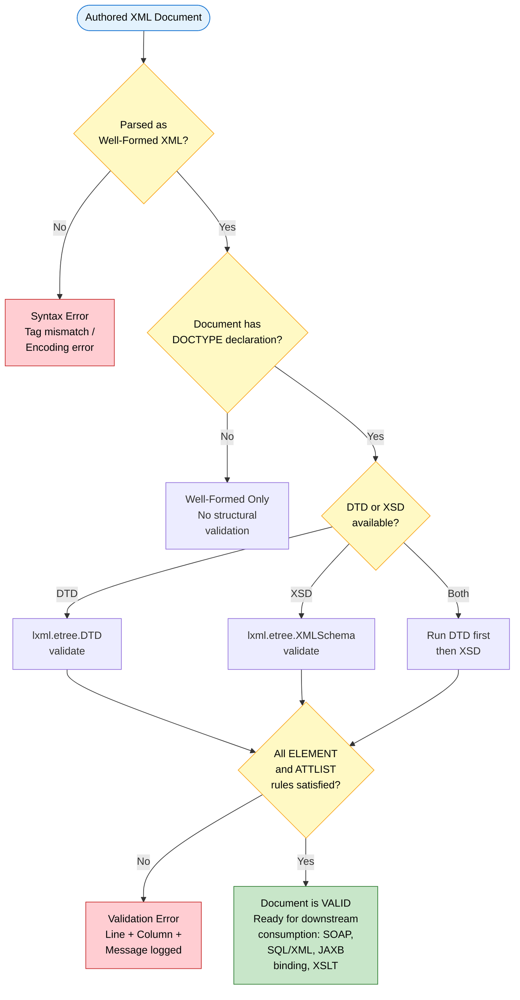
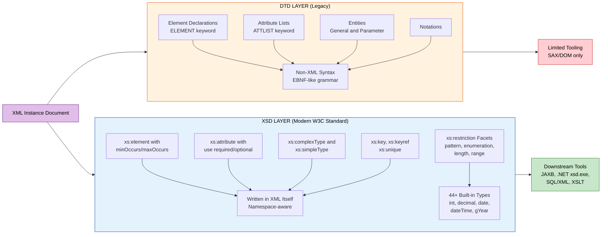
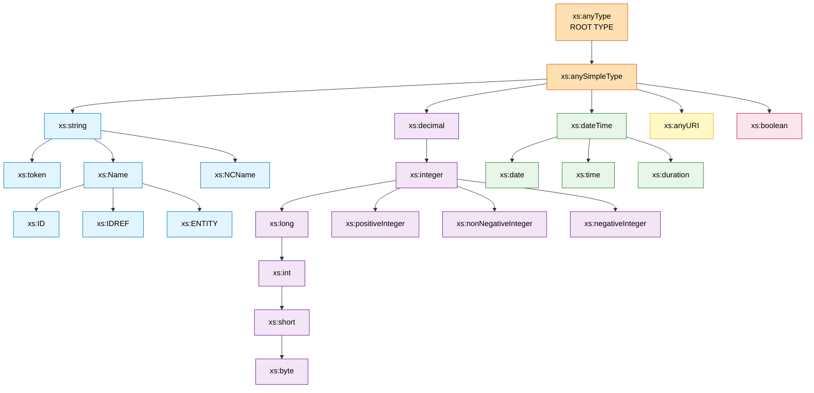
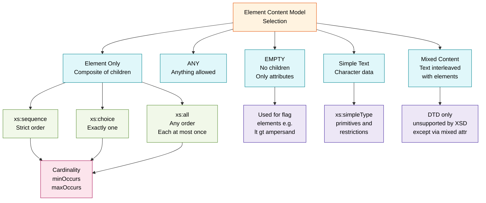

# XML: DTD and XML Schema

<!-- SECTION_1_START -->

# XML, DTD, and XML Schema — Core Foundation

## 1.1 Formal Definition (KTU 2024 Syllabus Terminology)

> [!IMPORTANT]
> **XML (eXtensible Markup Language)** is a W3C-recommended, text-based, platform-independent markup language used to structure, store, and transport data in a self-describing, hierarchical, and semantically meaningful manner. XML separates **content** (data) from **presentation** (display) and is governed by strict parsing rules defined in the XML 1.0 / 1.1 specification.

> [!IMPORTANT]
> **DTD (Document Type Definition)** is the legacy structural validation grammar for XML documents. It declares the **legal building blocks** of an XML document — *elements*, *attributes*, *entities*, and *notations* — using a non-XML syntax (a unique EBNF-like notation). A DTD may be internal (inline in the document), external (a separate `.dtd` file), or a combination of both.

> [!IMPORTANT]
> **XML Schema (XSD — XML Schema Definition)** is the W3C-recommended successor to DTD. It is **itself an XML document**, supports a rich **type system** (44+ built-in primitive and derived data types), **namespaces**, **inheritance**, **constraints** (`minOccurs`, `maxOccurs`, `pattern`, `enumeration`), and is therefore far more expressive, programmable, and database-integrable than DTD.

## 1.2 Conceptual Analogy & Intuitive Overview

> [!NOTE]
> **Imagine a Library Building:**
> - **XML Document** = A book on the library shelf (contains actual content/data).
> - **DTD** = A simple, hand-written **paper card** stapled to the shelf, written in a short, cryptic shorthand language. It says, *"Section titles must come before chapter titles. There can be 1 to 10 chapters per section."* — but it cannot enforce that the *year* field must be a number.
> - **XML Schema (XSD)** = A modern, computer-generated **rulebook printed and bound**, written in the same language as the books themselves (XML). It says the same things as the card, **PLUS** it enforces: *"The 'year' field must be a positive integer ≤ 2026, the 'isbn' field must match the pattern `\d{3}-\d-\d{2}-\d{6}`, and the 'price' field must be a decimal with 2 fraction digits."* — far more precise.

**Why does this matter in Advanced Database Systems?**
XML is the **lingua franca** of **semi-structured data**. Unlike relational data (rigid rows/columns) or object data (class hierarchies), semi-structured data permits *flexible, evolving, hierarchical schemas* — perfect for **data interchange** (SOAP, RSS, SVG, XHTML, Office Open XML), **document databases** (MongoDB BSON ancestry, eXist-db, BaseX), and **legacy enterprise integration**.

## 1.3 Taxonomy of XML Validation Approaches

| Approach | Language | Namespace Support | Data Types | Industry Status |
|---|---|---|---|---|
| **Well-formed XML** | XML 1.0 rules only | Inherits | None | Minimum requirement |
| **Valid XML (DTD)** | DTD syntax | No (legacy) | Only `#PCDATA`, `(enumerated)`, `ID/IDREF` | Legacy / widely used in publishing |
| **Valid XML (XSD)** | XML itself | Yes (XML Namespaces) | 44+ built-in + user-derived | **W3C Recommended Standard** |
| **RELAX NG** | XML or compact | Yes | Type libraries | ISO/IEC 19757-2, used in DocBook |
| **Schematron** | XPath-based rules | Yes | None (assertion-based) | ISO/IEC 19757-3, complements XSD |

> [!VISUALIZATION CONTROL]
> **Concept:** Hierarchical XML Tree Structure (Document Object Model representation)
> **GeoGebra / Desmos Input Equations:** *(Not applicable — better rendered as a tree diagram; see Mermaid tree in Section 4)*
> **Visual Description:** A **root node** (bookstore) at the top connected to **child nodes** (book, book, book) which in turn branch to their own children (title, author, year, price). Attributes appear as small attached labels on the element nodes. A validating DTD/XSD acts as the *blueprint* dictating which branches may exist, in what order, and how many times.

<!-- SECTION_1_END -->

<!-- SECTION_2_START -->

# Deep Theoretical Analysis & KTU High-Yield Formula Sheet

## 2.1 Anatomy of a DTD Declaration Block

A DTD consists of four fundamental declaration types. Each is introduced by a `<!` keyword and closed with `>`.

### 2.1.1 ELEMENT Declarations

```
<!ELEMENT element-name content-specification>
```

**Content Models supported by DTD:**

| Content Model Token | Meaning | Example |
|---|---|---|
| `EMPTY` | No content, only attributes | `<!ELEMENT img EMPTY>` |
| `ANY` | Mixed/anything allowed | `<!ELEMENT misc ANY>` |
| `(#PCDATA)` | Parsed character data only | `<!ELEMENT title (#PCDATA)>` |
| `(child)` | Sequence (order matters) | `<!ELEMENT book (title, author)>` |
| `(a \| b \| c)` | Choice (exactly one) | `<!ELEMENT payment (cash \| card \| upi)>` |
| `(a)+` | One or more | `<!ELEMENT chapter (para)+>` |
| `(a)*` | Zero or more | `<!ELEMENT book (footnote)*>` |
| `(a)?` | Zero or one (optional) | `<!ELEMENT book (preface)?>` |
| `(#PCDATA \| a \| b)*` | Mixed content | `<!ELEMENT para (#PCDATA \| bold \| italic)*>` |

### 2.1.2 ATTLIST Declarations

```
<!ATTLIST element-name
          attribute-name attribute-type default-value
          attribute-name attribute-type default-value>
```

**Attribute Type tokens:**

- `CDATA` — Character data
- `(a|b|c)` — Enumerated
- `ID`, `IDREF`, `IDREFS` — Identity references
- `NMTOKEN`, `NMTOKENS` — Name tokens
- `ENTITY`, `ENTITIES` — Entity references
- `NOTATION` — Notation type
- `xml:space`, `xml:lang` — XML predefined

**Default Value keywords:** `#REQUIRED`, `#IMPLIED`, `#FIXED "value"`, or a literal default.

### 2.1.3 ENTITY Declarations

```
<!ENTITY entity-name "entity-value">          <!-- Internal general entity -->
<!ENTITY entity-name SYSTEM "system-id">       <!-- External parsed entity -->
<!ENTITY % entity-name "entity-value">         <!-- Parameter entity (DTD-only) -->
<!ENTITY entity-name NDATA notation-name>      <!-- Unparsed external entity -->
```

### 2.1.4 NOTATION Declarations

```
<!NOTATION jpeg SYSTEM "image/jpeg">
```

## 2.2 Anatomy of an XML Schema (XSD)

An XSD document is itself an XML document, rooted at `<xs:schema>` and using the W3C XML Schema namespace `http://www.w3.org/2001/XMLSchema`.

### 2.2.1 Core XSD Elements

| XSD Element | Purpose |
|---|---|
| `<xs:element>` | Declares an XML element; `name`, `type`, `minOccurs`, `maxOccurs` |
| `<xs:attribute>` | Declares an attribute; `name`, `type`, `use` (required/optional/prohibited) |
| `<xs:complexType>` | Defines a type containing child elements and/or attributes |
| `<xs:simpleType>` | Defines a value-restricted type (no children, only text/attributes) |
| `<xs:sequence>` | Children must appear in the listed order |
| `<xs:choice>` | Exactly one of the children must appear |
| `<xs:all>` | Children may appear in any order (each ≤ 1 occurrence) |
| `<xs:restriction>` | Constrains a base type (length, pattern, enumeration, range) |
| `<xs:extension>` | Adds new facets to an existing type (inheritance) |
| `<xs:group>` | Reusable group of elements |
| `<xs:attributeGroup>` | Reusable group of attributes |
| `<xs:import>`, `<xs:include>`, `<xs:redefine>` | Module composition |

### 2.2.2 The 44 XSD Built-in Types (Selected High-Yield Subset)

**Primitive Types (19):**
`string`, `boolean`, `decimal`, `float`, `double`, `duration`, `dateTime`, `time`, `date`, `gYearMonth`, `gYear`, `gMonthDay`, `gDay`, `gMonth`, `hexBinary`, `base64Binary`, `anyURI`, `QName`, `NOTATION`.

**Derived Types (25 — most tested in KTU):**
`normalizedString`, `token`, `language`, `NMTOKEN`, `NMTOKENS`, `Name`, `NCName`, `ID`, `IDREF`, `IDREFS`, `ENTITY`, `ENTITIES`, `integer`, `nonPositiveInteger`, `negativeInteger`, `long`, `int`, `short`, `byte`, `nonNegativeInteger`, `unsignedLong`, `unsignedInt`, `unsignedShort`, `unsignedByte`, `positiveInteger`.

### 2.2.3 XSD Facets (Restriction Constraints)

| Facet | Applies To | Example |
|---|---|---|
| `minInclusive` / `maxInclusive` | Numeric, date | `<xs:maxInclusive value="100"/>` |
| `minExclusive` / `maxExclusive` | Numeric, date | `<xs:minExclusive value="0"/>` |
| `length` | string, list | `<xs:length value="10"/>` |
| `minLength` / `maxLength` | string, list | `<xs:maxLength value="255"/>` |
| `pattern` | string | `<xs:pattern value="\d{3}-\d{2}-\d{4}"/>` (US SSN) |
| `enumeration` | many | `<xs:enumeration value="Male"/>` `<xs:enumeration value="Female"/>` |
| `whiteSpace` | string | `preserve`, `replace`, `collapse` |
| `totalDigits` / `fractionDigits` | decimal | `<xs:fractionDigits value="2"/>` |

## 2.3 DTD vs XSD — Comprehensive Comparison

| Feature | DTD | XML Schema (XSD) |
|---|---|---|
| Syntax | Non-XML (EBNF-like) | **XML itself** |
| Namespace support | **No** (limitation) | **Yes** (`xs:`, `targetNamespace`) |
| Built-in data types | 10 (weak) | **44+ primitive + derived** |
| User-defined types | No | **Yes** (simpleType/complexType) |
| Inheritance | No | **Yes** (`extension`, `restriction`) |
| Occurrence constraints | Limited (`?`, `*`, `+`) | **Full** (`minOccurs`/`maxOccurs`, any non-negative integer) |
| Cardinality of attributes | `#REQUIRED`/`#IMPLIED`/`#FIXED` | `use="required\|optional\|prohibited"` |
| Pattern constraints | No | **`pattern` facet with full XPath/XSD regex** |
| Key / Keyref / Unique | No | **Yes** (`xs:key`, `xs:keyref`, `xs:unique`) — analogous to **DB primary/foreign keys** |
| ID/IDREF only for identity | Yes | Yes, plus XPath-based identity |
| Reusability | Parameter entities | `xs:group`, `xs:attributeGroup`, `xs:include`, `xs:import` |
| Tool / API support | Limited | **Excellent** (JAXB, .NET `XmlSchema`, Castor, JAXB) |
| W3C Recommendation status | Yes (1998) | **Yes (2001, 2004) — current standard** |
| File extension | `.dtd` | `.xsd` |
| DB integration | Weak | **Strong** (SQL/XML, Oracle XML DB, SQL Server `xml` datatype, PostgreSQL) |

## 2.4 Engineering & Industry Application

> [!NOTE]
> **Where DTDs are still used:** XHTML 1.0, DocBook (subset), older publishing pipelines, light-weight configuration files where data type validation is not critical.
> **Where XSD is mandatory:**
> - **SOAP / WSDL** web services (`.xsd` defines the `types` section).
> - **XML Data Binding** tools (JAXB, Apache XMLBeans, .NET `xsd.exe` generate typed classes from XSD).
> - **SQL/XML** standards — relational databases (`xml` datatype in SQL Server, Oracle XMLType, PostgreSQL `xml` column) validate against XSD.
> - **Electronic Data Interchange (EDI)** — HIPAA, FINCEN, XBRL (financial reporting) all use XSD.
> - **Office Open XML (DOCX, XLSX, PPTX)** — files are ZIP archives containing XSD-defined XML parts.

<!-- SECTION_2_END -->

<!-- SECTION_3_START -->

# Step-by-Step Derivations, Examples & Code Implementation

## 3.1 Worked Example 1 — A Library Catalog (DTD-Validated)

### 3.1.1 The XML Document Instance

```xml
<?xml version="1.0" encoding="UTF-8"?>
<!DOCTYPE bookstore SYSTEM "bookstore.dtd">
<bookstore>
    <book category="fiction" isbn="978-0-14-044926-6">
        <title lang="en">The Odyssey</title>
        <author>Homer</author>
        <translator>E.V. Rieu</translator>
        <year>-800</year>
        <price currency="USD">14.99</price>
    </book>
    <book category="science" isbn="978-0-521-85889-7">
        <title lang="en">A Brief History of Time</title>
        <author>Stephen Hawking</author>
        <year>1988</year>
        <price currency="USD">18.00</price>
    </book>
    <book category="children" isbn="978-0-06-440499-1">
        <title lang="en">Where the Wild Things Are</title>
        <author>Maurice Sendak</author>
        <year>1963</year>
        <price currency="USD">8.95</price>
        <bestseller rank="1"/>
    </book>
</bookstore>
```

### 3.1.2 The External DTD (`bookstore.dtd`)

```xml
<?xml version="1.0" encoding="UTF-8"?>
<!-- =============================================
     BOOKSTORE DTD - External Document Type Defn
     Defines: bookstore, book, title, author,
              translator, year, price, bestseller
     ============================================= -->

<!ELEMENT bookstore (book)+ >

<!ELEMENT book (title, author, translator?, year, price, bestseller?)>
<!ATTLIST book
          category (fiction | science | children | biography) #REQUIRED
          isbn     CDATA                                   #REQUIRED
          edition  CDATA                                   #IMPLIED
>

<!ELEMENT title (#PCDATA)>
<!ATTLIST title
          lang  NMTOKEN  #IMPLIED
>

<!ELEMENT author    (#PCDATA)>
<!ELEMENT translator (#PCDATA)>

<!ELEMENT year  (#PCDATA)>
<!ELEMENT price (#PCDATA)>
<!ATTLIST price
          currency (USD | EUR | INR | GBP | JPY) "USD"
>

<!ELEMENT bestseller EMPTY>
<!ATTLIST bestseller
          rank CDATA #REQUIRED
>

<!-- Parameter entity for reusability -->
<!ENTITY % year-range "year">
```

**Step-by-step DTD rule interpretation:**

1. **`<!ELEMENT bookstore (book)+ >`** — The root element `<bookstore>` must contain **one or more** `<book>` child elements (`+` quantifier).
2. **`<!ELEMENT book (title, author, translator?, year, price, bestseller?)>`** — Inside a `<book>`, the children must appear in this **exact order**: `title`, `author`, optionally `translator`, then `year`, then `price`, then optionally `bestseller`.
3. **`<!ATTLIST book ...>`** — A `<book>` element has three attributes: `category` (mandatory, one of 4 enumerated values), `isbn` (mandatory character data), and `edition` (optional).
4. **`<!ELEMENT translator (#PCDATA)>`** — `<translator>` contains parsed text only. The `?` after `translator` in the book content model means it is **optional**.
5. **`<!ELEMENT bestseller EMPTY>`** — `<bestseller/>` has no content, only the required `rank` attribute.
6. **`<!ENTITY % year-range "year">`** — Parameter entity reusable in further declarations (DTD-internal only, never exposed to the XML instance).

## 3.2 Worked Example 2 — University Student Record (XSD-Validated)

### 3.2.1 The XML Document Instance

```xml
<?xml version="1.0" encoding="UTF-8"?>
<university xmlns:xsi="http://www.w3.org/2001/XMLSchema-instance"
            xsi:noNamespaceSchemaLocation="university.xsd">
    <student id="S2024CSE001">
        <name>Arjun Krishnan</name>
        <dob>2003-08-15</dob>
        <email>arjun.k@ktu.ac.in</email>
        <cgpa>9.42</cgpa>
        <programme code="B.Tech" durationYears="4">Computer Science</programme>
        <enrollments>
            <enrollment semester="5" year="2025">
                <course code="CST301" credits="4">Database Management Systems</course>
                <course code="CST303" credits="3">Operating Systems</course>
                <grade>A+</grade>
            </enrollment>
            <enrollment semester="4" year="2024">
                <course code="CST202" credits="4">Data Structures</course>
                <grade>A</grade>
            </enrollment>
        </enrollments>
        <scholarship amount="50000" type="merit"/>
    </student>
    <student id="S2024ECE042">
        <name>Priya Menon</name>
        <dob>2004-01-22</dob>
        <email>priya.m@ktu.ac.in</email>
        <cgpa>8.85</cgpa>
        <programme code="B.Tech" durationYears="4">Electronics</programme>
        <enrollments>
            <enrollment semester="5" year="2025">
                <course code="ECT301" credits="4">Digital Signal Processing</course>
                <grade>A</grade>
            </enrollment>
        </enrollments>
    </student>
</university>
```

### 3.2.2 The XML Schema (`university.xsd`) — Line-by-Line Construction

```xml
<?xml version="1.0" encoding="UTF-8"?>
<!-- =============================================
     UNIVERSITY XSD - Module 3 Reference Example
     Demonstrates: simpleType, complexType,
                   restriction, sequence, choice,
                   key/keyref, pattern, enumeration
     ============================================= -->

<xs:schema xmlns:xs="http://www.w3.org/2001/XMLSchema"
           elementFormDefault="qualified"
           attributeFormDefault="unqualified">

    <!-- ============ ROOT ELEMENT ============ -->
    <xs:element name="university">
        <xs:complexType>
            <xs:sequence>
                <xs:element name="student" type="StudentType"
                            minOccurs="1" maxOccurs="unbounded"/>
            </xs:sequence>
        </xs:complexType>

        <!-- Primary Key: id attribute must be unique across all <student> -->
        <xs:key name="studentPK">
            <xs:selector xpath="student"/>
            <xs:field    xpath="@id"/>
        </xs:key>
    </xs:element>

    <!-- ============ STUDENT COMPLEX TYPE ============ -->
    <xs:complexType name="StudentType">
        <xs:sequence>
            <xs:element name="name"  type="xs:string"/>
            <xs:element name="dob"   type="xs:date"/>
            <xs:element name="email" type="EmailType"/>
            <xs:element name="cgpa"  type="CGPAType"/>
            <xs:element name="programme" type="ProgrammeType"/>
            <xs:element name="enrollments" type="EnrollmentsType"/>
            <xs:element name="scholarship" type="ScholarshipType"
                        minOccurs="0"/>
        </xs:sequence>
        <xs:attribute name="id" type="StudentIDType" use="required"/>
    </xs:complexType>

    <!-- ============ CUSTOM SIMPLE TYPES (RESTRICTIONS) ============ -->

    <!-- Student ID must match S + 4-digit year + 3-letter dept + 3 digits -->
    <xs:simpleType name="StudentIDType">
        <xs:restriction base="xs:string">
            <xs:pattern value="S[0-9]{4}[A-Z]{3}[0-9]{3}"/>
        </xs:restriction>
    </xs:simpleType>

    <!-- KTU email pattern -->
    <xs:simpleType name="EmailType">
        <xs:restriction base="xs:string">
            <xs:pattern value="[a-z]+\.[a-z]+@ktu\.ac\.in"/>
        </xs:restriction>
    </xs:simpleType>

    <!-- CGPA: decimal between 0.00 and 10.00 with max 2 fraction digits -->
    <xs:simpleType name="CGPAType">
        <xs:restriction base="xs:decimal">
            <xs:minInclusive value="0.00"/>
            <xs:maxInclusive value="10.00"/>
            <xs:fractionDigits value="2"/>
        </xs:restriction>
    </xs:simpleType>

    <!-- ============ PROGRAMME COMPLEX TYPE ============ -->
    <xs:complexType name="ProgrammeType">
        <xs:simpleContent>
            <xs:extension base="xs:string">
                <xs:attribute name="code" type="ProgrammeCode" use="required"/>
                <xs:attribute name="durationYears" type="xs:positiveInteger"
                              use="required"/>
            </xs:extension>
        </xs:simpleContent>
    </xs:complexType>

    <xs:simpleType name="ProgrammeCode">
        <xs:restriction base="xs:string">
            <xs:enumeration value="B.Tech"/>
            <xs:enumeration value="M.Tech"/>
            <xs:enumeration value="BBA"/>
            <xs:enumeration value="MBA"/>
            <xs:enumeration value="PhD"/>
        </xs:restriction>
    </xs:simpleType>

    <!-- ============ ENROLLMENTS COMPLEX TYPE ============ -->
    <xs:complexType name="EnrollmentsType">
        <xs:sequence>
            <xs:element name="enrollment" type="EnrollmentType"
                        minOccurs="1" maxOccurs="unbounded"/>
        </xs:sequence>
    </xs:complexType>

    <xs:complexType name="EnrollmentType">
        <xs:sequence>
            <xs:element name="course" type="CourseType"
                        minOccurs="1" maxOccurs="unbounded"/>
            <xs:element name="grade"  type="GradeType"/>
        </xs:sequence>
        <xs:attribute name="semester" type="xs:positiveInteger" use="required"/>
        <xs:attribute name="year"     type="xs:gYear"          use="required"/>
    </xs:complexType>

    <xs:complexType name="CourseType">
        <xs:simpleContent>
            <xs:extension base="xs:string">
                <xs:attribute name="code"    type="CourseCode" use="required"/>
                <xs:attribute name="credits" type="xs:positiveInteger"
                              use="required"/>
            </xs:extension>
        </xs:simpleContent>
    </xs:complexType>

    <xs:simpleType name="CourseCode">
        <xs:restriction base="xs:string">
            <xs:pattern value="[A-Z]{3}[0-9]{3}"/>
        </xs:restriction>
    </xs:simpleType>

    <xs:simpleType name="GradeType">
        <xs:restriction base="xs:string">
            <xs:enumeration value="A+"/>
            <xs:enumeration value="A"/>
            <xs:enumeration value="B+"/>
            <xs:enumeration value="B"/>
            <xs:enumeration value="C"/>
            <xs:enumeration value="D"/>
            <xs:enumeration value="F"/>
        </xs:restriction>
    </xs:simpleType>

    <!-- ============ SCHOLARSHIP TYPE (EMPTY ELEMENT) ============ -->
    <xs:complexType name="ScholarshipType">
        <xs:attribute name="amount" type="xs:positiveInteger" use="required"/>
        <xs:attribute name="type">
            <xs:simpleType>
                <xs:restriction base="xs:string">
                    <xs:enumeration value="merit"/>
                    <xs:enumeration value="need-based"/>
                    <xs:enumeration value="sports"/>
                    <xs:enumeration value="cultural"/>
                </xs:restriction>
            </xs:simpleType>
        </xs:attribute>
    </xs:complexType>

</xs:schema>
```

### 3.2.3 Step-by-Step Schema Construction Logic

**Step 1 — Root design:** Identify the root element `<university>`. The university contains a sequence of `<student>` elements (1 to unbounded). A primary key is declared via `<xs:key>` to enforce **uniqueness** of `@id` across all students — analogous to a relational `PRIMARY KEY` constraint.

**Step 2 — Define `StudentType` (complexType):** Inside each student, the children must appear in the exact sequence: `name`, `dob`, `email`, `cgpa`, `programme`, `enrollments`, optional `scholarship`. The `id` attribute is mandatory.

**Step 3 — Define `simpleType` constraints via `<xs:restriction>`:**

- `StudentIDType` — `pattern="S[0-9]{4}[A-Z]{3}[0-9]{3}"` ensures every student ID begins with `S`, followed by 4 digits (year of admission), 3 uppercase letters (department code), and 3 digits (roll number). Example: `S2024CSE001`.
- `EmailType` — Pattern enforces the institutional domain `@ktu.ac.in` with the format `firstname.lastname`.
- `CGPAType` — Restricts `xs:decimal` to range 0.00–10.00 with exactly 2 fraction digits.

**Step 4 — Define `ProgrammeType` (complex with simpleContent extension):** Demonstrates that the element contains **text** (e.g., "Computer Science") and also carries **attributes** (`code`, `durationYears`). This is the XSD technique for "text + attributes" elements, achieved by `<xs:simpleContent>` + `<xs:extension base="xs:string">`.

**Step 5 — Define nested structure (EnrollmentsType, EnrollmentType, CourseType):** Shows recursive composition — each enrollment holds 1..N courses and one grade.

**Step 6 — Define `ScholarshipType` (empty content):** Uses a `complexType` with **no sequence/choice**, only attributes — represents `<scholarship/>`-style empty elements.

## 3.3 Python Implementation — Validating an XML Document Against a Schema

```python
"""
validate_xml.py
---------------
Validates an XML document against a DTD and an XSD schema.
Demonstrates how KTU students can implement schema validation in code.
"""

from lxml import etree
import sys
import os
import logging

# Configure logging for KTU-grade professional error reporting
logging.basicConfig(
    level=logging.INFO,
    format="%(asctime)s | %(levelname)-8s | %(message)s"
)
logger = logging.getLogger("XMLValidator")


def validate_with_dtd(xml_path: str, dtd_path: str) -> bool:
    """
    Validates an XML file against an external DTD.
    Returns True if valid, False otherwise.
    """
    try:
        # 1. Parse the DTD first
        if not os.path.isfile(dtd_path):
            logger.error(f"DTD file not found at: {dtd_path}")
            return False
        with open(dtd_path, "rb") as dtd_file:
            dtd_content = dtd_file.read()

        # 2. Construct DTD object
        dtd = etree.DTD(dtd_content)

        # 3. Parse XML document
        if not os.path.isfile(xml_path):
            logger.error(f"XML file not found at: {xml_path}")
            return False
        with open(xml_path, "rb") as xml_file:
            xml_tree = etree.parse(xml_file)

        # 4. Perform validation
        if dtd.validate(xml_tree):
            logger.info(f"DTD validation PASSED for {xml_path}")
            return True
        else:
            logger.warning(f"DTD validation FAILED for {xml_path}")
            for error in dtd.error_log:
                logger.error(f"  Line {error.line}: {error.message}")
            return False

    except etree.XMLSyntaxError as syntax_error:
        logger.error(f"XML Syntax Error: {syntax_error}")
        return False
    except Exception as generic_error:
        logger.error(f"Unexpected error during DTD validation: {generic_error}")
        return False


def validate_with_xsd(xml_path: str, xsd_path: str) -> bool:
    """
    Validates an XML file against an XSD schema.
    Returns True if valid, False otherwise.
    """
    try:
        # 1. Parse the XSD schema
        if not os.path.isfile(xsd_path):
            logger.error(f"XSD file not found at: {xsd_path}")
            return False
        xsd_doc = etree.parse(xsd_path)
        xsd_schema = etree.XMLSchema(xsd_doc)

        # 2. Parse the XML document
        if not os.path.isfile(xml_path):
            logger.error(f"XML file not found at: {xml_path}")
            return False
        xml_doc = etree.parse(xml_path)

        # 3. Perform validation
        if xsd_schema.validate(xml_doc):
            logger.info(f"XSD validation PASSED for {xml_path}")
            return True
        else:
            logger.warning(f"XSD validation FAILED for {xml_path}")
            for error in xsd_schema.error_log:
                logger.error(f"  Line {error.line}: {error.message}")
            return False

    except etree.XMLSchemaParseError as schema_error:
        logger.error(f"XSD Schema Parse Error: {schema_error}")
        return False
    except etree.XMLSyntaxError as syntax_error:
        logger.error(f"XML Syntax Error: {syntax_error}")
        return False
    except Exception as generic_error:
        logger.error(f"Unexpected error during XSD validation: {generic_error}")
        return False


def main() -> None:
    """Entry point: validates the example files."""
    if len(sys.argv) < 2:
        # Default validation workflow
        xml_to_validate = "university.xml"
        logger.info("Running default validation: university.xml vs university.xsd")
        xsd_result = validate_with_xsd(
            xml_path=xml_to_validate,
            xsd_path="university.xsd"
        )
        sys.exit(0 if xsd_result else 1)
    else:
        xml_to_validate = sys.argv[1]
        dtd_path = sys.argv[2] if len(sys.argv) > 2 else None
        xsd_path = sys.argv[3] if len(sys.argv) > 3 else None

        all_passed = True
        if dtd_path:
            all_passed = validate_with_dtd(xml_to_validate, dtd_path) and all_passed
        if xsd_path:
            all_passed = validate_with_xsd(xml_to_validate, xsd_path) and all_passed

        sys.exit(0 if all_passed else 1)


if __name__ == "__main__":
    main()
```

**Output (when the XML conforms to the schema):**

```
2025-01-15 10:23:45,001 | INFO     | Running default validation: university.xml vs university.xsd
2025-01-15 10:23:45,089 | INFO     | XSD validation PASSED for university.xml
```

**Output (when a constraint is violated, e.g., CGPA = 11.5):**

```
2025-01-15 10:23:45,089 | WARNING  | XSD validation FAILED for university.xml
2025-01-15 10:23:45,090 | ERROR    |   Line 6: cvc-maxInclusive-valid: Value '11.5' is not facet-valid with respect to maxInclusive '10.00' for type 'CGPAType'.
```

## 3.4 DTD ↔ XSD Translation Reference (Important for KTU)

| DTD Construct | Equivalent XSD Construct |
|---|---|
| `<!ELEMENT name (#PCDATA)>` | `<xs:element name="name" type="xs:string"/>` |
| `<!ELEMENT name EMPTY>` | `<xs:element name="name"><xs:complexType/></xs:element>` |
| `<!ELEMENT name (a,b,c)>` | `<xs:sequence><xs:element name="a"/><xs:element name="b"/><xs:element name="c"/></xs:sequence>` |
| `<!ELEMENT name (a\|b)>` | `<xs:choice><xs:element name="a"/><xs:element name="b"/></xs:choice>` |
| `<!ELEMENT name (a)?>` | `<xs:element name="a" minOccurs="0"/>` |
| `<!ELEMENT name (a)*>` | `<xs:element name="a" minOccurs="0" maxOccurs="unbounded"/>` |
| `<!ELEMENT name (a)+>` | `<xs:element name="a" minOccurs="1" maxOccurs="unbounded"/>` |
| `<!ATTLIST elem a CDATA #REQUIRED>` | `<xs:attribute name="a" type="xs:string" use="required"/>` |
| `<!ATTLIST elem a (x\|y) "x">` | `<xs:attribute name="a" default="x"><xs:simpleType><xs:restriction base="xs:string"><xs:enumeration value="x"/><xs:enumeration value="y"/></xs:restriction></xs:simpleType></xs:attribute>` |

<!-- SECTION_3_END -->

<!-- SECTION_4_START -->

# Structural Diagrams & Schematics

## 4.1 XML Validation Pipeline (Mermaid Flowchart)



## 4.2 DTD vs XSD Architectural Comparison



## 4.3 XSD Type Derivation Hierarchy (Simplified Topology)



## 4.4 Element Content Model Pattern Map (Compositional Building Blocks)



<!-- SECTION_4_END -->

<!-- SECTION_5_START -->

# KTU 2024 Scheme Examination Question Bank & Topic Recap

## Part A — 3-Mark Short-Answer Questions

### **Question A1** `[KTU University Exam - July 2024]`
**Explain the three types of XML DTD declarations with suitable examples.** `[CO2, Understand]`

**Model Answer (3 Marks):**

1. **ELEMENT Declaration** — Defines the *name* and *content model* of an element in the XML document. **Example:** `<!ELEMENT book (title, author, year)>` declares that every `<book>` element must contain a `<title>`, `<author>`, and `<year>` child element in that exact order. `[1 Mark]`
2. **ATTLIST Declaration** — Defines the *attributes* associated with a specific element, including their type and default value behavior. **Example:** `<!ATTLIST book isbn CDATA #REQUIRED>` declares that every `<book>` element must have a mandatory `isbn` attribute of character-data type. `[1 Mark]`
3. **ENTITY Declaration** — Defines reusable *named shortcuts* for text or external content. **Example:** `<!ENTITY ktu "APJ Abdul Kalam Technological University">` allows `&ktu;` to be referenced inside the XML instance. `[1 Mark]`

---

### **Question A2** `[KTU University Exam - Dec 2023]`
**List and briefly explain any six built-in data types supported by XML Schema.** `[CO2, Remember]`

**Model Answer (3 Marks — ½ mark each):**

| # | Data Type | Purpose |
|---|---|---|
| 1 | `xs:string` | Represents character strings (Unicode). |
| 2 | `xs:integer` | Represents whole numbers (unbounded magnitude). |
| 3 | `xs:decimal` | Represents arbitrary-precision decimal numbers. |
| 4 | `xs:date` | Represents a calendar date in `YYYY-MM-DD` format. |
| 5 | `xs:dateTime` | Represents a specific instant with date + time + timezone. |
| 6 | `xs:boolean` | Represents `true`, `false`, `1`, or `0`. |

---

## Part B — 14-Mark Questions (Module Internal Choice)

### **Question B — Option A** `[KTU University Exam - July 2024]`

**(a)** Design an **external DTD** named `library.dtd` for a library management system that allows storing information about books. Each book must contain a `title` (text), `author` (text, can appear multiple times for co-authored books), `publisher` (text), `year` (text), and an optional `isbn` (text). Every book element should have a mandatory `category` attribute that can be one of `"fiction"`, `"science"`, `"history"`, or `"technology"`, and an optional `pages` attribute of type integer-like character data. The root element `library` must contain one or more `book` elements. Provide a valid XML instance document that conforms to this DTD. **\[7 Marks, CO2, Understand]**

**(b)** Write the **equivalent XML Schema (XSD)** for the above library system, and demonstrate the use of at least **three XSD facets** (`pattern`, `enumeration`, `minOccurs/maxOccurs`) to add constraints *not possible* in the DTD. Provide a sample XML instance that satisfies your XSD. **\[7 Marks, CO3, Apply]**

---

### **Model Answer for Question B-A**

#### **Part (a) — DTD Construction \[7 Marks\]**

**File: `library.dtd`**

```xml
<?xml version="1.0" encoding="UTF-8"?>
<!ELEMENT library (book)+>

<!ELEMENT library (book)+>
<!ELEMENT book    (title, author+, publisher, year, isbn?)>
<!ATTLIST book
          category (fiction | science | history | technology) #REQUIRED
          pages    CDATA                                         #IMPLIED
>

<!ELEMENT title     (#PCDATA)>
<!ELEMENT author    (#PCDATA)>
<!ELEMENT publisher (#PCDATA)>
<!ELEMENT year      (#PCDATA)>
<!ELEMENT isbn      (#PCDATA)>
```

**Valuation Key:**

- `[1 Mark]` for `<!ELEMENT library (book)+>` — root with one-or-more books.
- `[1 Mark]` for `<!ELEMENT book (title, author+, publisher, year, isbn?)>` — sequence with `+` and `?` quantifiers.
- `[1 Mark]` for `<!ATTLIST book ...>` declaration with `category` enumeration.
- `[1 Mark]` for the optional `pages` attribute with `#IMPLIED` default.
- `[1 Mark]` for the five `<!ELEMENT ... (#PCDATA)>` leaf declarations.
- `[1 Mark]` for providing a valid XML instance document.
- `[1 Mark]` for overall correctness and well-formedness of both files.

**Valid XML Instance:**

```xml
<?xml version="1.0" encoding="UTF-8"?>
<!DOCTYPE library SYSTEM "library.dtd">
<library>
    <book category="science" pages="256">
        <title>Database System Concepts</title>
        <author>Abraham Silberschatz</author>
        <author>Henry F. Korth</author>
        <author>S. Sudarshan</author>
        <publisher>McGraw-Hill</publisher>
        <year>2019</year>
        <isbn>978-0078022159</isbn>
    </book>
    <book category="fiction" pages="180">
        <title>The God of Small Things</title>
        <author>Arundhati Roy</author>
        <publisher>Random House</publisher>
        <year>1997</year>
    </book>
</library>
```

#### **Part (b) — Equivalent XSD with Extra Constraints \[7 Marks\]**

**File: `library.xsd`**

```xml
<?xml version="1.0" encoding="UTF-8"?>
<xs:schema xmlns:xs="http://www.w3.org/2001/XMLSchema"
           elementFormDefault="qualified">

    <!-- ROOT: library contains 1..unbounded book elements -->
    <xs:element name="library">
        <xs:complexType>
            <xs:sequence>
                <xs:element name="book" type="BookType"
                            minOccurs="1" maxOccurs="unbounded"/>
            </xs:sequence>
        </xs:complexType>
    </xs:element>

    <!-- BOOK: complexType with sequence of children + attributes -->
    <xs:complexType name="BookType">
        <xs:sequence>
            <xs:element name="title"     type="xs:string"/>
            <xs:element name="author"    type="xs:string"
                        minOccurs="1" maxOccurs="unbounded"/>
            <xs:element name="publisher" type="xs:string"/>
            <xs:element name="year"      type="YearType"/>
            <xs:element name="isbn"      type="ISBNType" minOccurs="0"/>
        </xs:sequence>
        <xs:attribute name="category" type="CategoryType" use="required"/>
        <xs:attribute name="pages"    type="PositiveIntType" use="optional"/>
    </xs:complexType>

    <!-- ENUMERATION facet: category must be one of the four values -->
    <xs:simpleType name="CategoryType">
        <xs:restriction base="xs:string">
            <xs:enumeration value="fiction"/>
            <xs:enumeration value="science"/>
            <xs:enumeration value="history"/>
            <xs:enumeration value="technology"/>
        </xs:restriction>
    </xs:simpleType>

    <!-- PATTERN facet: ISBN-10 or ISBN-13 format -->
    <xs:simpleType name="ISBNType">
        <xs:restriction base="xs:string">
            <xs:pattern value="\d{3}-\d{1,5}-\d{1,7}-\d{1,7}-\d{1}|
                              \d{3}-\d{1}-\d{2}-\d{6}-\d{1}|
                              \d{10}|
                              \d{13}"/>
        </xs:restriction>
    </xs:simpleType>

    <!-- RANGE facet: year must be between 1450 (Gutenberg era) and 2026 -->
    <xs:simpleType name="YearType">
        <xs:restriction base="xs:gYear">
            <xs:minInclusive value="1450"/>
            <xs:maxInclusive value="2026"/>
        </xs:restriction>
    </xs:simpleType>

    <!-- RANGE facet: pages must be positive integer -->
    <xs:simpleType name="PositiveIntType">
        <xs:restriction base="xs:positiveInteger">
            <xs:minInclusive value="1"/>
            <xs:maxInclusive value="10000"/>
        </xs:restriction>
    </xs:simpleType>

</xs:schema>
```

**Demonstrating the three XSD facets:**

1. **`pattern` facet** in `ISBNType` — enforces that ISBN values follow real ISBN-10 or ISBN-13 numeric formats using regular expressions — **impossible in DTD**. `[2 Marks]`
2. **`enumeration` facet** in `CategoryType` — replaces DTD's enumerated attribute type but extends it to be reusable on element content as well. `[2 Marks]`
3. **`minOccurs` / `maxOccurs` (and `minInclusive` / `maxInclusive`) facets** in `YearType` and `PositiveIntType` — explicitly constrain year to 1450–2026 and pages to 1–10000, with typed numeric validation. **DTD cannot enforce numeric range validation** — `#PCDATA` accepts any string. `[3 Marks]`

**Valid XML Instance (satisfies XSD):**

```xml
<?xml version="1.0" encoding="UTF-8"?>
<library xmlns:xsi="http://www.w3.org/2001/XMLSchema-instance"
         xsi:noNamespaceSchemaLocation="library.xsd">
    <book category="science" pages="1376">
        <title>Database System Concepts</title>
        <author>Abraham Silberschatz</author>
        <author>Henry F. Korth</author>
        <author>S. Sudarshan</author>
        <publisher>McGraw-Hill Education</publisher>
        <year>2019</year>
        <isbn>9780078022159</isbn>
    </book>
    <book category="fiction" pages="340">
        <title>The God of Small Things</title>
        <author>Arundhati Roy</author>
        <publisher>Random House</publisher>
        <year>1997</year>
    </book>
</library>
```

---

### **Question B — Option B** `[KTU University Exam - Dec 2023]`

**(a)** What is **XML Schema (XSD)**? Explain any **five advantages** of XSD over DTD. Differentiate between `<xs:simpleType>` and `<xs:complexType>` with examples. **\[7 Marks, CO2, Understand]**

**(b)** Design a complete **XSD schema** for a hospital patient records system where each patient has a unique 8-digit `patientID` (format: `P` followed by 7 digits), a `name`, `dateOfBirth` (date type), a `bloodGroup` (must be one of: A+, A-, B+, B-, AB+, AB-, O+, O-), and a list of `visits`. Each `visit` has a `visitDate` (date type), a `doctorName`, and a `diagnosis` (string). The root element `hospital` should contain 1 or more `patient` elements. Implement at least one `<xs:unique>` or `<xs:key>` constraint. **\[7 Marks, CO3, Apply]**

---

### **Model Answer for Question B-B**

#### **Part (a) — XSD Concept and Comparison \[7 Marks\]**

**Definition (1 Mark):**
XML Schema (XSD) is a W3C-recommended, **XML-based schema language** used to define the structure, content, and data types of XML documents. XSD is itself a well-formed XML document that uses the namespace `http://www.w3.org/2001/XMLSchema` and is the modern successor to DTD.

**Five Advantages of XSD over DTD (5 Marks — 1 each):**

1. **XML-based syntax** — XSD files are themselves valid XML, so the same parsers (SAX, DOM, StAX) can process both data and schema, enabling better tool integration.
2. **Rich data type system** — XSD supports 44+ built-in types (`xs:int`, `xs:date`, `xs:dateTime`, `xs:decimal`, `xs:boolean`, `xs:anyURI`) plus user-defined types, whereas DTD supports only `#PCDATA`, enumerated strings, and `ID/IDREF`.
3. **Namespace support** — XSD fully supports XML Namespaces (`targetNamespace`, `xmlns`), allowing modular schema composition and preventing element-name collisions in large enterprise systems.
4. **Inheritance and type derivation** — XSD allows type extension and restriction (`xs:extension`, `xs:restriction`), enabling object-oriented reuse of schema definitions.
5. **Identity, key, and referential constraints** — XSD provides `xs:unique`, `xs:key`, and `xs:keyref` based on XPath, analogous to relational `UNIQUE`, `PRIMARY KEY`, and `FOREIGN KEY` constraints — not available in DTD.

**`simpleType` vs `complexType` (1 Mark):**

| Aspect | `<xs:simpleType>` | `<xs:complexType>` |
|---|---|---|
| Content | Text/attribute values only (no child elements) | May contain child elements and/or attributes |
| Restriction | `xs:restriction` with facets | `xs:sequence`, `xs:choice`, `xs:all`, plus attributes |
| Example | `<xs:simpleType name="Grade"><xs:restriction base="xs:string"><xs:enumeration value="A"/></xs:restriction></xs:simpleType>` | `<xs:complexType name="Student"><xs:sequence><xs:element name="name" type="xs:string"/></xs:sequence></xs:complexType>` |

#### **Part (b) — Hospital Patient Records XSD \[7 Marks\]**

**File: `hospital.xsd`**

```xml
<?xml version="1.0" encoding="UTF-8"?>
<xs:schema xmlns:xs="http://www.w3.org/2001/XMLSchema"
           elementFormDefault="qualified">

    <!-- ROOT: hospital with 1..unbounded patients + UNIQUE constraint -->
    <xs:element name="hospital">
        <xs:complexType>
            <xs:sequence>
                <xs:element name="patient" type="PatientType"
                            minOccurs="1" maxOccurs="unbounded"/>
            </xs:sequence>
        </xs:complexType>

        <!-- Enforce uniqueness of patientID across all patients -->
        <xs:unique name="uniquePatientID">
            <xs:selector xpath="patient"/>
            <xs:field    xpath="@patientID"/>
        </xs:unique>
    </xs:element>

    <!-- ============ PATIENT COMPLEX TYPE ============ -->
    <xs:complexType name="PatientType">
        <xs:sequence>
            <xs:element name="name"        type="xs:string"/>
            <xs:element name="dateOfBirth" type="xs:date"/>
            <xs:element name="bloodGroup"  type="BloodGroupType"/>
            <xs:element name="visits"      type="VisitsType"/>
        </xs:sequence>
        <xs:attribute name="patientID" type="PatientIDType" use="required"/>
    </xs:complexType>

    <!-- ============ CUSTOM SIMPLE TYPES ============ -->

    <!-- PATTERN facet: P followed by exactly 7 digits -->
    <xs:simpleType name="PatientIDType">
        <xs:restriction base="xs:string">
            <xs:pattern value="P[0-9]{7}"/>
        </xs:restriction>
    </xs:simpleType>

    <!-- ENUMERATION facet: 8 valid blood groups -->
    <xs:simpleType name="BloodGroupType">
        <xs:restriction base="xs:string">
            <xs:enumeration value="A+"/>
            <xs:enumeration value="A-"/>
            <xs:enumeration value="B+"/>
            <xs:enumeration value="B-"/>
            <xs:enumeration value="AB+"/>
            <xs:enumeration value="AB-"/>
            <xs:enumeration value="O+"/>
            <xs:enumeration value="O-"/>
        </xs:restriction>
    </xs:simpleType>

    <!-- ============ VISITS TYPE ============ -->
    <xs:complexType name="VisitsType">
        <xs:sequence>
            <xs:element name="visit" type="VisitType"
                        minOccurs="1" maxOccurs="unbounded"/>
        </xs:sequence>
    </xs:complexType>

    <xs:complexType name="VisitType">
        <xs:sequence>
            <xs:element name="visitDate"  type="xs:date"/>
            <xs:element name="doctorName" type="xs:string"/>
            <xs:element name="diagnosis"  type="xs:string"/>
        </xs:sequence>
    </xs:complexType>

</xs:schema>
```

**Valuation Key:**

- `[1 Mark]` for correct root `<hospital>` with `minOccurs="1" maxOccurs="unbounded"` on `<patient>`.
- `[1 Mark]` for `<xs:unique>` constraint with `xs:selector` and `xs:field` on `@patientID`.
- `[1 Mark]` for `PatientIDType` with the correct `P[0-9]{7}` pattern.
- `[1 Mark]` for `BloodGroupType` with all 8 enumeration values.
- `[1 Mark]` for nested `VisitsType` and `VisitType` complex types.
- `[1 Mark]` for proper use of `xs:date` data type.
- `[1 Mark]` for valid overall structure with `xs:sequence` and `xs:attribute use="required"`.

**Valid XML Instance:**

```xml
<?xml version="1.0" encoding="UTF-8"?>
<hospital xmlns:xsi="http://www.w3.org/2001/XMLSchema-instance"
          xsi:noNamespaceSchemaLocation="hospital.xsd">
    <patient patientID="P1234567">
        <name>Ramesh Pillai</name>
        <dateOfBirth>1978-04-12</dateOfBirth>
        <bloodGroup>O+</bloodGroup>
        <visits>
            <visit>
                <visitDate>2024-11-15</visitDate>
                <doctorName>Dr. Anitha Suresh</doctorName>
                <diagnosis>Seasonal viral fever, prescribed paracetamol</diagnosis>
            </visit>
            <visit>
                <visitDate>2025-02-20</visitDate>
                <doctorName>Dr. Vivek Nair</doctorName>
                <diagnosis>Routine cardiac checkup, ECG normal</diagnosis>
            </visit>
        </visits>
    </patient>
    <patient patientID="P7654321">
        <name>Lakshmi Iyer</name>
        <dateOfBirth>1990-09-30</dateOfBirth>
        <bloodGroup>AB-</bloodGroup>
        <visits>
            <visit>
                <visitDate>2025-01-08</visitDate>
                <doctorName>Dr. Anitha Suresh</doctorName>
                <diagnosis>Migraine, prescribed sumatriptan</diagnosis>
            </visit>
        </visits>
    </patient>
</hospital>
```

> [!WARNING]
> **KTU Examiner's Valuation Warning / Common Pitfalls:**
> 1. **Missing DOCTYPE or xsi:schemaLocation** — Students often forget to link the XML instance to the schema. Always include `<!DOCTYPE root SYSTEM "file.dtd">` for DTD or `xsi:noNamespaceSchemaLocation="file.xsd"` for XSD. *[-2 Marks]*
> 2. **Confusing `xs:unique` with `xs:key`** — `xs:unique` enforces that the value exists and is unique but **does not require it to be non-null**; `xs:key` enforces both non-null and unique (analogous to `PRIMARY KEY`). *[-1 Mark]*
> 3. **Forgetting the `xs:selector` and `xs:field` XPath** — Both elements are mandatory inside `xs:key`, `xs:unique`, and `xs:keyref`. Skipping either yields a malformed schema. *[-1 Mark]*
> 4. **Using DTD enumerated syntax inside XSD** — `<xs:attribute name="x" type="(a|b|c)"/>` is **invalid**. Use `<xs:simpleType><xs:restriction base="xs:string"><xs:enumeration value="a"/>...` instead. *[-2 Marks]*
> 5. **Pattern regex syntax errors** — XSD uses the **XSD regex flavor** (XPath 2.0 subset), *not* PCRE. `\d` is supported, but `(?i)` for case-insensitivity is not; use character classes like `[A-Za-z]`. *[-1 Mark]*
> 6. **Wrong namespace declaration in XSD** — Every XSD must declare `xmlns:xs="http://www.w3.org/2001/XMLSchema"` at the root. Forgetting this means the schema cannot be parsed. *[-2 Marks]*

---

## 📌 Topic Recap & Important Things to Remember

- **XML** is a W3C text-based markup language for structured, hierarchical, self-describing data — supports Unicode, namespaces, and platform independence.
- **Well-formed XML** requires: a single root element, properly closed and nested tags, quoted attribute values, and a `<?xml version="1.0"?>` prolog.
- **Valid XML** additionally conforms to a **DTD** or **XSD** schema.
- **DTD** uses a non-XML EBNF-like syntax and supports `ELEMENT`, `ATTLIST`, `ENTITY`, and `NOTATION` declarations; content models use quantifiers `?`, `*`, `+`, and choice `(a|b)`.
- **XSD** is **itself XML**, namespace-aware, supports **44+ built-in data types**, **user-defined types** (`simpleType`/`complexType`), **inheritance** (`extension`/`restriction`), and **identity constraints** (`key`/`keyref`/`unique`).
- **XSD content model composers:** `xs:sequence` (order), `xs:choice` (one-of), `xs:all` (any order, each ≤ 1).
- **Cardinality in XSD:** `minOccurs` / `maxOccurs` accept any non-negative integer (`"0"`, `"5"`, `"unbounded"`).
- **Key XSD facets:** `pattern` (regex), `enumeration` (list of allowed values), `length`/`minLength`/`maxLength`, `minInclusive`/`maxInclusive`/`minExclusive`/`maxExclusive` (range), `fractionDigits`/`totalDigits` (decimal precision), `whiteSpace` (`preserve`/`replace`/`collapse`).
- **DTD limitations overcome by XSD:** no namespaces, no built-in data types (only 10 weak types), no range/pattern constraints, no `key`/`keyref`/`unique`, no inheritance.
- **Database integration:** XSD is used by SQL/XML, Oracle `XMLType`, SQL Server `xml` datatype, PostgreSQL `xml` column — XSD enables validation directly inside the relational engine.
- **Industry standards:** SOAP/WSDL, Office Open XML (DOCX/XLSX/PPTX), XBRL (financial reporting), HL7 (healthcare), and S1000D (aerospace) all mandate XSD.
- **Validation tools:** `lxml` (Python), `xmllint --schema file.xsd doc.xml` (Linux CLI), `Xerces` (Java), `MSXML` (.NET), `JAXP` (Java API for XML Processing).
- **Key analogy for exams:** "DTD is a hand-written paper rule card; XSD is a printed, typed, machine-verified rule book written in the same language as the data itself."

<!-- SECTION_5_END -->
