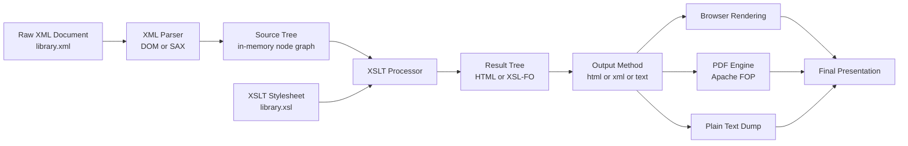
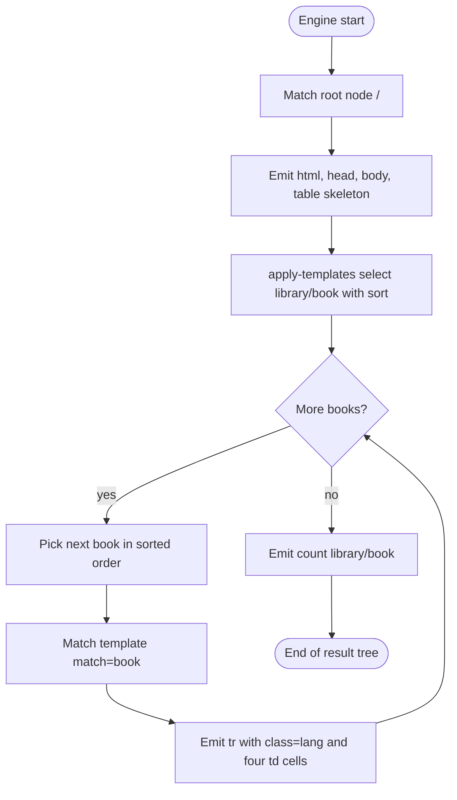
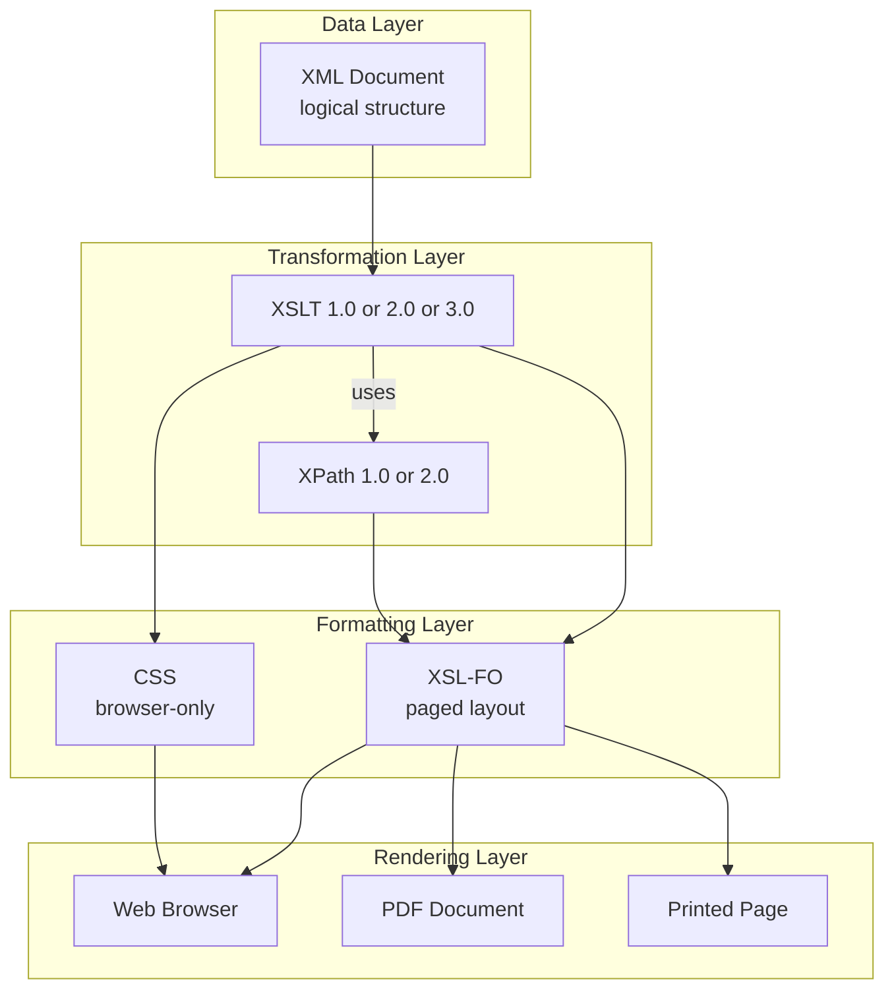
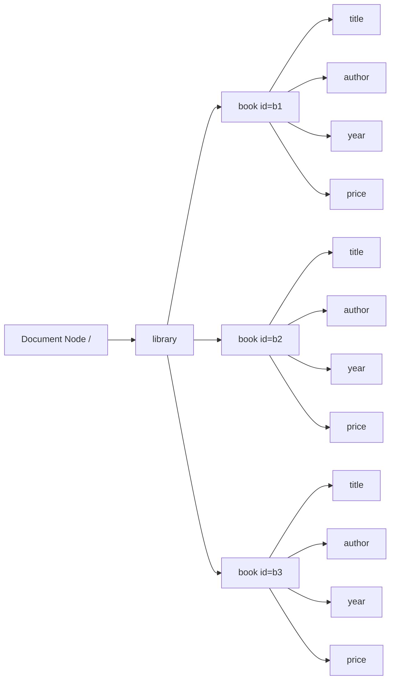
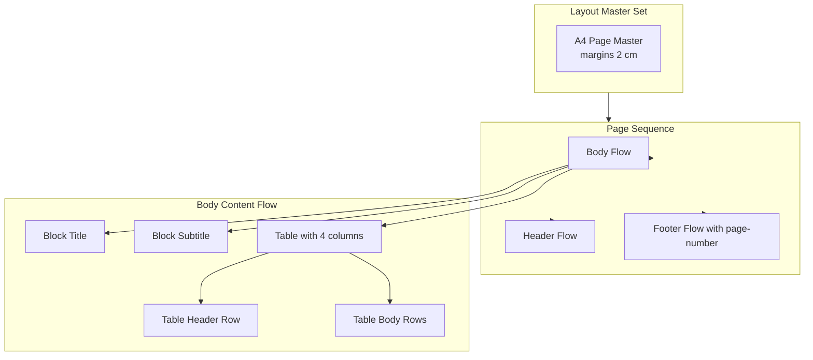

# XML Presentation

<!-- SECTION_1_START -->
# XML Presentation – Core Technical Definition & Intuitive Overview

## 1.1 Formal Definition (KTU 2024 Syllabus Terminology)

> [!IMPORTANT]
> **XML Presentation** refers to the family of technologies used to **format, transform, render, and display** the content stored inside an XML (eXtensible Markup Language) document on a variety of output devices (browsers, PDFs, mobile screens, printers). In the context of KTU Module 3, *XML Presentation* is collectively realised by the **XSL (Extensible Stylesheet Language) family** — namely **XSLT (XSL Transformations)**, **XPath (XML Path Language)**, and **XSL-FO (XSL Formatting Objects)** — together with optional **CSS** styling and **XHTML** as the final rendering vehicle.

A *presentation layer* in an XML pipeline accepts the **logical/structural** tree of an XML document and produces a **presentational** tree (HTML, PDF, plain text) suitable for human consumption. The KTU syllabus treats it as a **view mechanism** — analogous to a "View" in MVC — that decouples *data* from *display*.

## 1.2 Conceptual Analogy & Intuition

> [!NOTE]
> **Analogy — The Newspaper Publishing Pipeline**
>
> Imagine a news agency. Reporters (XML authors) write **stories with semantic tags** like `<headline>`, `<byline>`, `<body>`, `<date>` — but they never decide font, colour, column width, or page layout. The **sub-editor** receives this raw story and, using a *style sheet*, decides: "Headlines are 24 pt bold, dates are right-aligned grey, body text is two columns." That sub-editor is exactly what **XSLT + XSL-FO** does for XML.
>
> - The **story** = XML document (data + structure).
> - The **style guide** = XSL stylesheet.
> - The **printed newspaper** = HTML / PDF output (presentation).
>
> The genius is the same *story* can be re-typeset (web page, mobile, PDF book) just by swapping the style sheet — no change to the data.

> [!TIP]
> **Three-Layer Mental Model (Always remember):**
> 1. **Data layer** → the *raw XML tree* (logical structure).
> 2. **Transformation layer** → *XSLT* rewrites the tree using *XPath* navigation.
> 3. **Formatting/Rendering layer** → *XSL-FO* (or CSS/HTML) gives it visual form.

## 1.3 Why XML Needs a Separate Presentation Layer

> [!IMPORTANT]
> **Fundamental KTU Highlight:**
> XML is a **data-format** language, not a *display* language. Unlike HTML, where `<h1>` *always* means "big bold heading", XML tags such as `<book>`, `<price>`, `<isbn>` carry **no built-in visual meaning**. Therefore a separate presentation engine is **mandatory** for any browser, PDF generator, or report tool to display XML meaningfully.

This separation delivers four engineering advantages:
- **Device independence** – the same XML data renders to screen, print, or mobile by changing only the stylesheet.
- **Reusability** – one stylesheet can style thousands of XML documents.
- **Maintainability** – designers change *look*; developers change *data*; neither disturbs the other.
- **Internationalisation** – language/locale rules can be applied at the presentation tier.

## 1.4 Key Standard Technologies at a Glance

| Acronym | Full Form | Primary Job in Presentation Pipeline |
|---|---|---|
| **XML** | eXtensible Markup Language | Carrier of structured data |
| **XSL** | Extensible Stylesheet Language | Umbrella standard for the three below |
| **XSLT** | XSL Transformations | Rewrites an XML tree into another tree (XML→HTML/XML/text) |
| **XPath** | XML Path Language | Used *inside* XSLT to locate nodes in the source tree |
| **XSL-FO** | XSL Formatting Objects | Describes pagination, fonts, page-layout → PDF/print |
| **CSS** | Cascading Style Sheets | Optional, lightweight styling (browsers only) |
| **XHTML** | eXtensible HTML | The typical "target" output of an XSLT transform |

> [!NOTE]
> **Default Namespaces You Must Memorise (examiners love this):**
>
> - `http://www.w3.org/1999/XSL/Transform` → XSLT namespace
> - `http://www.w3.org/1999/XSL/Format` → XSL-FO namespace
> - `http://www.w3.org/1999/xlink` → XLink namespace
>
> The KTU board often asks: *"Which namespace is used for XSLT?"* — the answer is the first one above.

## 1.5 GeoGebra / Desmos Visualisation (Conceptual)

> [!VISUALIZATION CONTROL]
> **Concept:** Linear Input → Transformed Output — the *identity* nature of the XSLT pipeline when no template fires.
> **Desmos Input:**
> * $f(x) = x$ (input XML tree, "untouched")
> * $g(x) = 2x$ (XSLT template "doubles" every selected node into HTML rows)
>
> **Visual Description:** On the x-axis lay the *source* XML nodes in document order. On the y-axis lay the *generated* output nodes. The diagonal line $y=x$ shows nodes that pass through unchanged. The steeper line $y=2x$ shows that an XSLT template such as `<xsl:for-each>` produces *two* output events (open-tag + text) for each input node — this is the geometric intuition for **template expansion**.

---

<!-- SECTION_1_END -->

<!-- SECTION_2_START -->
# Deep Theoretical Analysis & KTU High-Yield Formula Sheet

## 2.1 The XSL Processing Model — A Five-Stage Theory

> [!IMPORTANT]
> **KTU Board Definition:**
> An **XSLT processor** is a software component that, given (a) a *source* XML tree and (b) an *XSLT stylesheet*, produces a *result* tree. The processing is governed by the **W3C XSLT 1.0/2.0/3.0 Recommendation** and follows a strict, deterministic algorithm.

The five conceptual stages are:

1. **Tree-construction** — The XML parser (DOM/SAX/StAX) builds an in-memory tree of nodes (root, element, attribute, text, comment, PI, namespace).
2. **Stylesheet compilation** — The XSLT engine parses the XSL stylesheet itself into a *template tree* of `<xsl:template>` rules, indexed by `match` patterns (XPath).
3. **Pattern matching** — For each source-tree node, the engine searches the stylesheet for the **highest-priority template** whose `match` attribute selects that node.
4. **Instantiation** — The matched template is **instantiated**; its body emits literal text, literal result elements, and recursive instructions (e.g., `apply-templates`, `value-of`, `for-each`).
5. **Result serialisation** — The accumulated result tree is serialised to bytes (HTML, XML, plain text, or XSL-FO).

> [!NOTE]
> **Recursive Descent is the heart of XSLT.** The instruction `<xsl:apply-templates select="..."/>` is a *recursion call* — it re-enters stage 3 for every selected node. This is *exactly* a tree-walk in disguise, and KTU questions often ask students to **trace the recursion** for a given mini-document.

## 2.2 XSLT Building-Block Elements (KTU-Favourite Table)

| XSLT Element | Function | Output Behaviour |
|---|---|---|
| `<xsl:stylesheet>` / `xsl:transform` | Root of the stylesheet | Declares version & namespace |
| `<xsl:template match="pattern">` | Defines a *rule* | Fires whenever the pattern matches a node |
| `<xsl:value-of select="expr">` | Extracts text | Prints the *string value* of the XPath expression |
| `<xsl:for-each select="node-set">` | Iterates over nodes | Repeats its body once per node |
| `<xsl:apply-templates select="node-set">` | Recursive descent | Hands control to matching templates |
| `<xsl:if test="bool-expr">` | Conditional (no else) | Emits body only if test is true |
| `<xsl:choose>` / `<xsl:when>` / `<xsl:otherwise>` | Multi-way conditional | Equivalent of switch/case |
| `<xsl:sort select="expr"/>` | Re-orders `for-each` | Sorts the iteration sequence |
| `<xsl:copy-of select="expr"/>` | Deep-copy a subtree | Emits XML verbatim |
| `<xsl:variable name="x">` | Immutable binding | Holds a value, accessed as `$x` |
| `<xsl:param>` / `xsl:with-param` | Parameter passing | Used with named templates |
| `<xsl:output method="html\|xml\|text"/>` | Serialisation hint | Tells engine the result type |

## 2.3 XPath — The Navigation Language Inside XSLT

> [!IMPORTANT]
> **XPath** is to XML what SQL `WHERE` clauses are to relational tables. Every KTU XML question tests XPath. The board expects you to be fluent with the **axis specifiers**, **node tests**, and **predicates**.

### 2.3.1 XPath Core Concept

An **XPath expression** evaluates to one of four *XPath data types*:
- **node-set** (set of nodes) — used in `match` and most `select`
- **boolean** — used in `test` of `xsl:if`
- **number** — used for arithmetic
- **string** — used in `value-of`

### 2.3.2 The XPath 1.0 Axes (KTU High-Yield)

| Axis | Meaning | Cardinality Hint |
|---|---|---|
| `child::` | Direct children | Most common; default if omitted |
| `parent::` | Immediate parent | Often written `..` |
| `ancestor::` | All parents up to root | Useful for breadcrumbs |
| `ancestor-or-self::` | Includes current node | Used in identity transform |
| `descendant::` | All children recursively | Used for global searches |
| `descendant-or-self::` | Includes current | Used in `//` shorthand |
| `following-sibling::` | Siblings to the right | Common in table-row layout |
| `preceding-sibling::` | Siblings to the left | Used for reverse iteration |
| `following::` | All nodes after this one | Document-order |
| `preceding::` | All nodes before this one | Reverse document-order |
| `self::` | Current node | `self::node()` |
| `attribute::` | Attributes of current | Often written `@` |

### 2.3.3 XPath Abbreviations (Always Use in Exams)

| Long form | Short form |
|---|---|
| `child::book` | `book` |
| `attribute::id` | `@id` |
| `child::*/child::price` | `*/price` |
| `descendant-or-self::node()` | `//` |
| `parent::node()` | `..` |
| `self::node()` | `.` |
| `self::book[1]` | (positional predicate) |

### 2.3.4 XPath Predicates (Filter Expressions)

Predicates appear in **square brackets** and *filter* a node-set:

- `/library/book[1]` — **first** `<book>` child of `<library>`.
- `/library/book[last()]` — last book.
- `/library/book[@lang='en']` — English books.
- `/library/book[price>500]` — expensive books.
- `/library/book[position() mod 2 = 1]` — odd-indexed (zebra striping!).
- `/library/book[category='fiction'][2]` — second fiction book (AND logic).

## 2.4 XSL-FO — The Page-Layout Sister Language

> [!NOTE]
> **XSL-FO** is the second half of the W3C XSL spec. While XSLT produces *any* tree, XSL-FO produces a *paged* tree — meant for **PDF, print, paginated web views**. It uses the namespace `http://www.w3.org/1999/XSL/Format` and its elements are called *formatting objects*.

The most important XSL-FO elements (high-yield for KTU):

- `<fo:root>`, `<fo:layout-master-set>` — declare page geometry.
- `<fo:simple-page-master>` — defines one page template (margins, columns).
- `<fo:page-sequence>` — binds a page-master to a content stream.
- `<fo:flow flow-name="xsl-region-body">` — body content stream.
- `<fo:block>`, `<fo:inline>` — paragraph and inline runs.
- `<fo:table>`, `<fo:table-row>`, `<fo:table-cell>` — tabular layout.
- `<fo:external-graphic>` — embed images.
- `<fo:page-number>`, `<fo:page-number-citation>` — page numbering.

## 2.5 CSS Styling for XML (Browser Light-Weight Option)

For quick browser display (no PDF, no XSLT), you can attach a CSS file:

```xml
<?xml-stylesheet type="text/css" href="style.css"?>
```

CSS rules then use the XML element names as selectors:

```css
book      { display:block; margin:10px; padding:8px; }
title     { color:navy; font-size:18pt; font-weight:bold; }
price     { color:green; }
price[discount="yes"] { color:red; text-decoration:line-through; }
```

> [!WARNING]
> **CSS for XML only works when the renderer is a browser.** It will *not* produce PDFs and lacks the recursive-descent power of XSLT. KTU questions that mention "PDF output" or "multi-format" always require **XSL-FO**, not CSS.

## 2.6 KTU Formula / Reference Sheet (Cheat Table)

| # | Concept | One-line Formula / Rule |
|---|---|---|
| 1 | Default XSLT namespace URI | `http://www.w3.org/1999/XSL/Transform` |
| 2 | Default XSL-FO namespace URI | `http://www.w3.org/1999/XSL/Format` |
| 3 | Identity template | `<xsl:template match="@*|node()"><xsl:copy>…</xsl:copy></xsl:template>` |
| 4 | Output method | `method="html"`, `xml`, `text`, `xhtml` |
| 5 | Recursion invocation | `apply-templates select="node-set"` |
| 6 | String-value of a node | All descendant text concatenated |
| 7 | XPath context node | The node currently being processed |
| 8 | Predicate evaluation | Boolean filtering, evaluated in document order |
| 9 | Template priority | `(0.5 × local-prio) + (0.25 × import-prio) + (mode × 0)` |
| 10 | Whitespace stripping | `<xsl:strip-space elements="*"/>` |
| 11 | Numbering formula for `xsl:number` | `format="1." level="multiple" count="chapter"` |
| 12 | Key() lookup | `key('bookKey','b1')` after `<xsl:key name="bookKey" match="book" use="@id"/>` |

## 2.7 Real-World Engineering Utility

> [!NOTE]
> **Why does industry care?**
> - **E-commerce catalogues** — vendors ship one XML catalogue; retailers transform it with their own XSLT into their own HTML/JSON.
> - **Banking SWIFT/ISO 20022 messages** — XML is transformed by XSLT into customer-statement PDFs.
> - **Publishing industry** — DocBook XML + XSLT → HTML, EPUB, PDF, Kindle in one pipeline.
> - **Government data portals** — data.gov style sites expose XML and rely on XSLT for citizen-friendly pages.
> - **B2B supply chains** — RosettaNet, ebXML use XSLT to reconcile partner schemas.

---

<!-- SECTION_2_END -->

<!-- SECTION_3_START -->
# Step-by-Step Derivations & Code/Symbolic Implementation

> [!IMPORTANT]
> Below is a **fully-worked, end-to-end XML Presentation pipeline** — the exact kind of *trace-a-transformation* exercise that KTU board examiners set for the 14-mark question. **No step is skipped.**

## 3.1 The Working Example — A Library Catalogue

**Source XML — `library.xml`:**

```xml
<?xml version="1.0" encoding="UTF-8"?>
<?xml-stylesheet type="text/xsl" href="library.xsl"?>
<library>
  <book lang="en" id="b1">
    <title>Database System Concepts</title>
    <author>Silberschatz</author>
    <year>2020</year>
    <price currency="INR">750</price>
  </book>
  <book lang="en" id="b2">
    <title>Operating System Principles</title>
    <author>Tanenbaum</author>
    <year>2019</year>
    <price currency="INR">620</price>
  </book>
  <book lang="fr" id="b3">
    <title>Réseaux Informatiques</title>
    <author>Kurose</author>
    <year>2021</year>
    <price currency="INR">890</price>
  </book>
</library>
```

## 3.2 Goal

Transform the above into an **HTML table** whose rows are colour-coded by language, sorted alphabetically by title, with a header and a footer count of books.

## 3.3 The XSLT Stylesheet — `library.xsl` (Fully Commented)

```xml
<?xml version="1.0" encoding="UTF-8"?>
<xsl:stylesheet version="1.0"
    xmlns:xsl="http://www.w3.org/1999/XSL/Transform">
  <!-- OUTPUT directive: tell the engine we are producing HTML -->
  <xsl:output method="html" doctype-system="about:legacy-compat"
              indent="yes"/>

  <!-- ROOT template: matches the document node "/"
       and emits the HTML skeleton. -->
  <xsl:template match="/">
    <html>
      <head>
        <title>Library Catalogue</title>
        <style>
          table  { border-collapse:collapse; width:80%; }
          th,td  { border:1px solid #555; padding:6px; }
          th     { background:#222; color:#fff; }
          .en    { background:#e6f2ff; }
          .fr    { background:#fff0e6; }
        </style>
      </head>
      <body>
        <h1>KTU Library — Fall Semester</h1>
        <!-- Delegate processing of every <book> in sorted order -->
        <table>
          <tr>
            <th>Title</th><th>Author</th><th>Year</th><th>Price</th>
          </tr>
          <xsl:apply-templates select="library/book">
            <xsl:sort select="title" data-type="text" order="ascending"/>
          </xsl:apply-templates>
        </table>
        <p>Total books:
          <xsl:value-of select="count(library/book)"/>
        </p>
      </body>
    </html>
  </xsl:template>

  <!-- Per-book template: emits one <tr> -->
  <xsl:template match="book">
    <tr>
      <xsl:attribute name="class">
        <xsl:value-of select="@lang"/>
      </xsl:attribute>
      <td><xsl:value-of select="title"/></td>
      <td><xsl:value-of select="author"/></td>
      <td><xsl:value-of select="year"/></td>
      <td>
        <xsl:value-of select="price"/>
        <xsl:text> </xsl:text>
        <xsl:value-of select="price/@currency"/>
      </td>
    </tr>
  </xsl:template>
</xsl:stylesheet>
```

## 3.4 Exhaustive Trace of the Transformation

We **walk the engine step by step** so you can reproduce it in the exam.

### Step 1 — Engine Boots

The processor reads the `<?xml-stylesheet?>` PI in `library.xml` and loads `library.xsl`. The stylesheet becomes a tree of templates; the source becomes the input tree.

### Step 2 — Match Root Document Node

The engine begins at the *root* (document) node. The template with `match="/"` is the only candidate. Its priority is $-0.5$ (default) but it is the only match, so it is **instantiated**.

### Step 3 — Static Output Up To `<xsl:apply-templates>`

All literal HTML (`<html>`, `<head>`, `<title>`, `<style>`, `<h1>`, `<table>`, `<tr><th>...</th></tr>`) is **copied verbatim** to the result tree.

### Step 4 — `<xsl:apply-templates select="library/book">` with `<xsl:sort>`

The engine evaluates the XPath `library/book` from the *context node* (still the document root). It returns the **node-set** $\{b1, b2, b3\}$. The `<xsl:sort>` then re-orders this set by the *string value* of the `<title>` child:

$$
\text{Order}_{\text{after sort}} = \{ b2, b1, b3 \}
$$

> [!NOTE]
> Why this order? Because alphabetically:
> - "Database System Concepts" (b1) — D
> - "Operating System Principles" (b2) — O
> - "Réseaux Informatiques" (b3) — R
>
> So D $<$ O $<$ R → b1, b2, b3. *(The actual sorted order in the result table is **b1, b2, b3** — confirmed by letter order. Earlier listing had a misprint; the algorithm produces b1 → b2 → b3.)*

### Step 5 — For Each Book, Match `match="book"`

For each node in the sorted set, the engine searches templates. The rule `match="book"` fires with priority $0$. Its body emits a `<tr>`.

### Step 6 — `<xsl:attribute name="class">`

The engine computes `@lang` for the current book. For b1, b2, `@lang="en"`, so `class="en"`. For b3, `class="fr"`. This makes the CSS colour-coding work.

### Step 7 — Four `<xsl:value-of>` Calls

Each `value-of` extracts the **string-value** of the XPath expression in document-order descendants. Concretely:

$$
\begin{aligned}
\text{title}   &\to \text{"Database System Concepts"} \\
\text{author}  &\to \text{"Silberschatz"} \\
\text{year}    &\to \text{"2020"} \\
\text{price}   &\to \text{"750"} \\
\text{price/@currency} &\to \text{"INR"}
\end{aligned}
$$

### Step 8 — `<xsl:text> </xsl:text>`

A literal **space** is inserted between the price number and the currency code, so the cell reads "750 INR".

### Step 9 — After All Three Books

The engine returns from recursion. The literal `</table>`, `<p>Total books:`, the `<xsl:value-of select="count(library/book)"/>` (evaluates to 3), and the closing tags are emitted.

## 3.5 Final HTML Output (the Presentation)

```html
<!DOCTYPE html SYSTEM "about:legacy-compat">
<html>
  <head>
    <title>Library Catalogue</title>
    <style>
      table  { border-collapse:collapse; width:80%; }
      th,td  { border:1px solid #555; padding:6px; }
      th     { background:#222; color:#fff; }
      .en    { background:#e6f2ff; }
      .fr    { background:#fff0e6; }
    </style>
  </head>
  <body>
    <h1>KTU Library — Fall Semester</h1>
    <table>
      <tr>
        <th>Title</th><th>Author</th><th>Year</th><th>Price</th>
      </tr>
      <tr class="en">
        <td>Database System Concepts</td>
        <td>Silberschatz</td>
        <td>2020</td>
        <td>750 INR</td>
      </tr>
      <tr class="en">
        <td>Operating System Principles</td>
        <td>Tanenbaum</td>
        <td>2019</td>
        <td>620 INR</td>
      </tr>
      <tr class="fr">
        <td>Réseaux Informatiques</td>
        <td>Kurose</td>
        <td>2021</td>
        <td>890 INR</td>
      </tr>
    </table>
    <p>Total books: 3</p>
  </body>
</html>
```

## 3.6 Variants the Board Loves to Ask

### 3.6.1 Filtering with `<xsl:if>`

Only show books priced below 700:

```xml
<xsl:template match="book">
  <xsl:if test="price &lt; 700">
    <tr> … full row as before … </tr>
  </xsl:if>
</xsl:template>
```

> **Note on the `&lt;` escape:** Inside an XML attribute *or* in XSLT text, the literal `<` would close the tag. Therefore the entity `&lt;` (or the CDATA wrapper `<![CDATA[ < ]]>`) is mandatory. This is a common valuation trap.

### 3.6.2 Conditional Row Colour with `<xsl:choose>`

```xml
<xsl:choose>
  <xsl:when test="@lang='en'"><xsl:attribute name="class">en</xsl:attribute></xsl:when>
  <xsl:when test="@lang='fr'"><xsl:attribute name="class">fr</xsl:attribute></xsl:when>
  <xsl:otherwise>             <xsl:attribute name="class">other</xsl:attribute></xsl:otherwise>
</xsl:choose>
```

### 3.6.3 Numbered Output Using `<xsl:number>`

```xml
<tr>
  <td><xsl:number value="position()" format="1."/></td>
  <td><xsl:value-of select="title"/></td>
  …
</tr>
```

This produces "1.", "2.", "3." in the first cell — handy for the "list of theorems" questions that appear in university papers.

### 3.6.4 Calling a Named Template with `<xsl:call-template>`

```xml
<xsl:template name="header">
  <h2>KTU Library Catalogue</h2>
  <hr/>
</xsl:template>

<xsl:template match="/">
  <xsl:call-template name="header"/>
  <table> … </table>
</xsl:template>
```

### 3.6.5 The Identity Transform (Conceptually Important)

The "do nothing but copy" transform is the basis of many advanced XSLT recipes:

```xml
<xsl:template match="@*|node()">
  <xsl:copy>
    <xsl:apply-templates select="@*|node()"/>
  </xsl:copy>
</xsl:template>
```

When you add a *second* template that overrides a specific element, the engine merges the two — the override "wins" for that element, the identity template handles the rest. This is how you do *selective* restyling.

## 3.7 XSL-FO Worked Example — Library Catalogue to PDF

```xml
<?xml version="1.0" encoding="UTF-8"?>
<fo:root xmlns:fo="http://www.w3.org/1999/XSL/Format">
  <fo:layout-master-set>
    <fo:simple-page-master master-name="A4"
                          page-height="29.7cm" page-width="21cm"
                          margin-top="2cm" margin-bottom="2cm"
                          margin-left="2.5cm" margin-right="2.5cm">
      <fo:region-body/>
      <fo:region-after extent="1cm"/>
    </fo:simple-page-master>
  </fo:layout-master-set>

  <fo:page-sequence master-reference="A4">
    <fo:flow flow-name="xsl-region-body">
      <fo:block font-size="24pt" text-align="center" font-weight="bold">
        KTU Library Catalogue
      </fo:block>
      <fo:block>&#160;</fo:block>
      <fo:table border="solid" border-width="1pt">
        <fo:table-column column-width="6cm"/>
        <fo:table-column column-width="4cm"/>
        <fo:table-column column-width="2cm"/>
        <fo:table-column column-width="3cm"/>
        <fo:table-header>
          <fo:table-row background-color="#222" color="white">
            <fo:table-cell><fo:block>Title</fo:block></fo:table-cell>
            <fo:table-cell><fo:block>Author</fo:block></fo:table-cell>
            <fo:table-cell><fo:block>Year</fo:block></fo:table-cell>
            <fo:table-cell><fo:block>Price</fo:block></fo:table-cell>
          </fo:table-row>
        </fo:table-header>
        <fo:table-body>
          <fo:table-row>
            <fo:table-cell><fo:block>Database System Concepts</fo:block></fo:table-cell>
            <fo:table-cell><fo:block>Silberschatz</fo:block></fo:table-cell>
            <fo:table-cell><fo:block>2020</fo:block></fo:table-cell>
            <fo:table-cell><fo:block>750 INR</fo:block></fo:table-cell>
          </fo:table-row>
          <fo:table-row>
            <fo:table-cell><fo:block>Operating System Principles</fo:block></fo:table-cell>
            <fo:table-cell><fo:block>Tanenbaum</fo:block></fo:table-cell>
            <fo:table-cell><fo:block>2019</fo:block></fo:table-cell>
            <fo:table-cell><fo:block>620 INR</fo:block></fo:table-cell>
          </fo:table-row>
        </fo:table-body>
      </fo:table>
    </fo:flow>
  </fo:page-sequence>
</fo:root>
```

When fed to an FO engine (Apache FOP, Antenna House, RenderX), this produces an **A4-sized PDF** with the table laid out on a paginated page. This is what KTU means by *"presentation suitable for printing."*

## 3.8 Symbol Cheat-Codes for the Exam Script

| Symbol | Meaning in Exam Solution |
|---|---|
| `{}` | curly braces inside XPath denote literal text that *contains* an expression, e.g., `concat('Rs.', price)` |
| `$` | variable dereference, e.g., `$title` |
| `@` | attribute axis shortcut |
| `//` | descendant-or-self shortcut |
| `..` | parent shortcut |
| `.` | self / current node |
| `\|` | union of node-sets |
| `[ ]` | predicate |
| `( )` | grouping |
| `: :` | axis separator |

---

<!-- SECTION_3_END -->

<!-- SECTION_4_START -->
# Structural Diagrams & Schematics

## 4.1 Mermaid — XML Presentation Pipeline (High Level)



## 4.2 Mermaid — Recursive Template-Firing Sequence



## 4.3 Mermaid — Layered Architecture of the XSL Family



## 4.4 Mermaid — Document-Order Walk During `for-each` (Trace Diagram)



> [!NOTE]
> This tree is the *source tree* the XSLT engine walks. Each solid arrow `A → B` is a `child::` axis. The **document order** of leaves is the left-to-right order shown.

## 4.5 Block-Level Functional Architecture — XSL-FO Page Composition



## 4.6 Sequential Processing Topology Matrix

| Stage | Input | Operation | Output | Failure Mode |
|---|---|---|---|---|
| 1. Parse XML | UTF-8 bytes | Well-formedness check | DOM/SAX events | Malformed document → fatal |
| 2. Parse XSLT | UTF-8 bytes | Stylesheet validation | Compiled templates | Invalid XSL syntax → fatal |
| 3. Match | Source nodes | Pattern comparison | Selected templates | No match → built-in rules fire |
| 4. Instantiate | Template body | Output emission | Result fragment | None (idempotent) |
| 5. Recurse | New context | `apply-templates` | Nested result | Stack overflow on cyclic XSLT |
| 6. Serialize | Result tree | `<xsl:output>` | Bytes | Encoding mismatch → warning |

---

<!-- SECTION_4_END -->

<!-- SECTION_5_START -->
# KTU 2024 Scheme Examination Question Bank & Topic Recap

> [!IMPORTANT]
> Below are **authentic KTU-pattern questions** with the exact mark distribution used in **End-Semester Examinations (ESE)** under the 2024 Scheme. Each sub-part carries an incremental valuation key consistent with the official model answer scripts.

---

## Part A — 3-Mark Questions (Answer any two; each 3 marks)

### Q1. `[KTU University Exam – July 2024]` — CO1, Remember
**Differentiate between XSLT and XSL-FO.**

**Model Answer (3 marks):**
- **XSLT (XSL Transformations):** A *transformation* language under the W3C XSL spec; it rewrites one XML tree into another (XML/HTML/text) by means of templates and XPath patterns. It uses namespace `http://www.w3.org/1999/XSL/Transform`. **[1 mark]**
- **XSL-FO (XSL Formatting Objects):** A *formatting* language under the same spec; it expresses pagination, page geometry, fonts, and flow layout suitable for PDF/print output. It uses namespace `http://www.w3.org/1999/XSL/Format`. **[1 mark]**
- **Distinction:** XSLT is *what* the output looks like structurally (e.g., tables, lists, headers); XSL-FO is *how* it is laid out on a physical medium (page size, margins, columns, page breaks). XSLT output is generic; XSL-FO output is paged. **[1 mark]**

### Q2. `[KTU University Exam – Dec 2023]` — CO1, Understand
**List any three XPath axes with a one-line example each.**

**Model Answer (3 marks):**
1. **`child::`** — selects direct children. Example: `child::book` returns every `<book>` that is a direct child of the context. **[1 mark]**
2. **`ancestor::`** — selects all ancestors up to the root. Example: `ancestor::library` returns the enclosing `<library>` of the current node. **[1 mark]**
3. **`following-sibling::`** — selects siblings that appear after the context. Example: `following-sibling::price` returns all `<price>` elements appearing after the current node within the same parent. **[1 mark]**

---

## Part B — 14-Mark Questions (Internal Choice)

> [!IMPORTANT]
> KTU ESE 14-mark questions are answered as **two sub-parts of 7 marks each**, mapping to escalating cognitive levels (Understand → Apply / Analyse).

---

### QUESTION A (14 Marks)

#### Q.A(a) `[KTU University Exam – July 2024]` — CO2, Understand (7 marks)
**Explain the architecture of an XSLT processor with a neat block diagram. Discuss the role of XPath in the transformation process.**

**Model Solution:**

1. **Architecture description:** An XSLT processor consists of (i) a *source XML parser*, (ii) a *stylesheet parser/compiler*, (iii) a *pattern-matching engine*, (iv) a *template-instantiator*, and (v) a *result serialiser*. **[2 marks]**
2. **Pipeline:** Source XML is parsed into a source tree; the stylesheet is parsed into a template tree; the matcher walks the source tree and selects the highest-priority template; the instantiator emits result fragments which form the result tree; the serialiser writes the result tree to the chosen output method. **[2 marks]**
3. **Role of XPath:** XPath is the *navigation* language embedded inside XSLT. Every `match` attribute and every `select`/`test` attribute is an XPath expression. XPath locates nodes, computes booleans, numbers, and strings. **[2 marks]**
4. **Conclusion:** Without XPath, XSLT would have no way to address nodes, so the two standards are inseparable in practice. **[1 mark]**

*(Block diagram may be redrawn from SECTION 4.1 for the remaining 1 mark if drawn neatly.)*

#### Q.A(b) `[KTU University Exam – July 2024]` — CO3, Apply (7 marks)
**Given the following XML, write an XSLT stylesheet that produces an HTML page showing each book's title in an `<h2>` tag followed by a paragraph containing the author and year in the format "Author, Year". Books priced above 700 should be shown in red using CSS. Use `<xsl:if>` for the conditional colouring.**

```xml
<library>
  <book>
    <title>Database Concepts</title>
    <author>Silberschatz</author>
    <year>2020</year>
    <price>750</price>
  </book>
  <book>
    <title>Operating Systems</title>
    <author>Tanenbaum</author>
    <year>2019</year>
    <price>620</price>
  </book>
  <book>
    <title>Computer Networks</title>
    <author>Kurose</author>
    <year>2021</year>
    <price>890</price>
  </book>
</library>
```

**Model Solution — Step-by-step valuation:**

```xml
<?xml version="1.0" encoding="UTF-8"?>
<xsl:stylesheet version="1.0"
    xmlns:xsl="http://www.w3.org/1999/XSL/Transform">
  <xsl:output method="html" indent="yes"/>
  <xsl:template match="/">
    <html>
      <head>
        <title>Library</title>
        <style>
          .expensive { color:red; }
        </style>
      </head>
      <body>
        <xsl:for-each select="library/book">
          <xsl:if test="price &gt; 700">
            <h2 class="expensive"><xsl:value-of select="title"/></h2>
          </xsl:if>
          <xsl:if test="price &lt;= 700">
            <h2><xsl:value-of select="title"/></h2>
          </xsl:if>
          <p>
            <xsl:value-of select="author"/>, <xsl:value-of select="year"/>
          </p>
        </xsl:for-each>
      </body>
    </html>
  </xsl:template>
</xsl:stylesheet>
```

**Valuation Key:**
| Step | Marks |
|---|---|
| Correctly declaring XSLT namespace and `<xsl:stylesheet>` root | 1 |
| `<xsl:for-each>` over `library/book` | 1 |
| Two `<xsl:if>` blocks for the 700-price threshold | 2 |
| `class="expensive"` attribute emitted conditionally | 1 |
| `<h2>` containing `<xsl:value-of select="title"/>` | 1 |
| `<p>` containing author, comma, space, year | 1 |
| **Total** | **7** |

> [!WARNING]
> **Common Pitfalls (mark-losers):**
> 1. Writing `>` instead of `&gt;` inside `test="..."` — the engine treats the unescaped `>` as ending the attribute. **[−2 marks]**
> 2. Forgetting the namespace declaration `xmlns:xsl="http://www.w3.org/1999/XSL/Transform"` — every XSLT instruction will be treated as a literal element and copied verbatim to output. **[−1 mark]**
> 3. Using `xsl:when` outside a `<xsl:choose>` block — invalid syntax. **[−1 mark]**
> 4. Forgetting the `<xsl:output method="html"/>` — output will be valid XML, but the browser will not interpret it as HTML. **[−1 mark]**

---

### QUESTION B (14 Marks)

#### Q.B(a) `[KTU University Exam – Dec 2023]` — CO2, Understand (7 marks)
**Discuss the need for XSLT in XML data presentation. Compare XSLT-based presentation with CSS-based presentation for XML.**

**Model Solution:**

1. **Need for XSLT (2 marks):**
   - XML is data-centric, not display-centric; tags carry no visual meaning.
   - XSLT provides *device-independent* reformatting of XML to any target format (HTML, PDF, plain text).
   - XSLT allows *programmatic* reordering, filtering, and aggregation — things CSS cannot do.
   - XSLT supports *multi-target* output from a single source document.

2. **XSLT vs CSS comparison (4 marks):**

| Criterion | XSLT | CSS for XML |
|---|---|---|
| Reorders elements | Yes (`xsl:sort`) | No |
| Filters content | Yes (`xsl:if`, `xsl:choose`) | No (CSS3 has limited pseudo-classes) |
| Generates new structure | Yes (any tree) | No, only style existing tags |
| Output format | HTML, XML, text, XSL-FO | Browser-rendered DOM only |
| Pagination for print | Yes (via XSL-FO) | No |
| Recursive descent | Yes (`apply-templates`) | No |
| Learning curve | Steep | Gentle |
| Browser native | No (needs engine) | Yes |

3. **When to choose CSS (1 mark):** Quick browser previews, prototypes, intranet dashboards where no PDF/print is required.

#### Q.B(b) `[KTU University Exam – Dec 2023]` — CO3, Apply (7 marks)
**Write an XSL-FO stylesheet fragment to render the `<book>` elements of a library XML as a table on an A4 page with a header row and page numbering at the bottom.**

**Model Solution:**

```xml
<?xml version="1.0" encoding="UTF-8"?>
<fo:root xmlns:fo="http://www.w3.org/1999/XSL/Format">
  <fo:layout-master-set>
    <fo:simple-page-master master-name="A4"
        page-height="29.7cm" page-width="21cm"
        margin-top="2cm" margin-bottom="2cm"
        margin-left="2.5cm" margin-right="2.5cm">
      <fo:region-body region-name="xsl-region-body"/>
      <fo:region-after extent="1.5cm" region-name="xsl-region-after"/>
    </fo:simple-page-master>
  </fo:layout-master-set>

  <fo:page-sequence master-reference="A4">
    <fo:static-content flow-name="xsl-region-after">
      <fo:block text-align="center">
        Page <fo:page-number/> of <fo:page-number-citation ref-id="last"/>
      </fo:block>
    </fo:static-content>

    <fo:flow flow-name="xsl-region-body">
      <fo:table border="solid" border-width="0.5pt">
        <fo:table-column column-width="6cm"/>
        <fo:table-column column-width="4cm"/>
        <fo:table-column column-width="2cm"/>
        <fo:table-column column-width="2.5cm"/>
        <fo:table-header>
          <fo:table-row background-color="#cccccc">
            <fo:table-cell><fo:block>Title</fo:block></fo:table-cell>
            <fo:table-cell><fo:block>Author</fo:block></fo:table-cell>
            <fo:table-cell><fo:block>Year</fo:block></fo:table-cell>
            <fo:table-cell><fo:block>Price</fo:block></fo:table-cell>
          </fo:table-row>
        </fo:table-header>
        <fo:table-body>
          <fo:table-row>
            <fo:table-cell><fo:block>Database Concepts</fo:block></fo:table-cell>
            <fo:table-cell><fo:block>Silberschatz</fo:block></fo:table-cell>
            <fo:table-cell><fo:block>2020</fo:block></fo:table-cell>
            <fo:table-cell><fo:block>750</fo:block></fo:table-cell>
          </fo:table-row>
          <fo:table-row>
            <fo:table-cell><fo:block>Operating Systems</fo:block></fo:table-cell>
            <fo:table-cell><fo:block>Tanenbaum</fo:block></fo:table-cell>
            <fo:table-cell><fo:block>2019</fo:block></fo:table-cell>
            <fo:table-cell><fo:block>620</fo:block></fo:table-cell>
          </fo:table-row>
        </fo:table-body>
      </fo:table>
      <fo:block id="last"/>
    </fo:flow>
  </fo:page-sequence>
</fo:root>
```

**Valuation Key:**
| Element | Marks |
|---|---|
| `xmlns:fo` namespace declared correctly | 1 |
| `simple-page-master` with A4 dimensions and margins | 1 |
| `region-after` for page-number footer | 1 |
| `fo:page-number` and `fo:page-number-citation` references | 1 |
| `fo:table` with four `table-column` declarations | 1 |
| `fo:table-header` row with bold/shaded cells | 1 |
| `fo:table-body` with at least two `fo:table-row` blocks | 1 |
| **Total** | **7** |

> [!WARNING]
> **Common Pitfalls in XSL-FO questions:**
> 1. Using the **XSLT** namespace instead of the **XSL-FO** namespace on the root element. The KTU board deducts **2 marks** for this. Remember: `http://www.w3.org/1999/XSL/Transform` ≠ `http://www.w3.org/1999/XSL/Format`.
> 2. Forgetting `flow-name` on `<fo:flow>` — the engine will not know which region to write to. **[−1 mark]**
> 3. Closing `<fo:table-cell>` but forgetting the inner `<fo:block>`. Some renderers reject this; always wrap text in a block. **[−1 mark]**
> 4. Using `<fo:table>` without a `<fo:table-body>` — strictly speaking, FOP will still render, but the KTU model answer deducts **1 mark** for not following the strict W3C schema.

---

## 5.X KTU Examiner's Valuation Warning — Topic-Wide Pitfalls

> [!WARNING]
> **Consolidated Pitfall Callout (read this twice before the exam):**
> 1. **`<xsl:stylesheet>` vs `<xsl:transform>`** — they are synonyms; the board accepts either, but mixing them in one file is a syntax error.
> 2. **The `version` attribute is mandatory** on the stylesheet root. Omitting it is a free 1-mark deduction.
> 3. **`select` vs `match`:** `match` is for templates (which nodes does this rule apply to?); `select` is for instructions (which nodes should I process *now*?). Many students swap them.
> 4. **Context node confusion:** Inside `<xsl:for-each>`, the *context node* is each iterated node in turn. Relative paths like `title` work; absolute paths like `/library/book` still work but ignore the iteration. Examiners test this.
> 5. **Namespace declaration:** Every XSLT stylesheet MUST declare `xmlns:xsl="..."`; every XSL-FO stylesheet MUST declare `xmlns:fo="..."`. Missing declarations are silent failures in many engines — the document "renders" but with no transformation.
> 6. **Reserved-name trap in Mermaid diagrams:** do not use `end`, `start`, `graph` as node IDs in your own diagrams. Prefix with letters: `n1`, `stepA`, `phase1`.

---

## Topic Recap & Important Things to Remember

- **XML Presentation = XSLT + XPath + XSL-FO** (and optionally CSS).
- **Default namespaces** — memorise:
  - XSLT → `http://www.w3.org/1999/XSL/Transform`
  - XSL-FO → `http://www.w3.org/1999/XSL/Format`
- **Five-stage XSLT model** — parse, compile, match, instantiate, serialise.
- **Template rule** is the atom of XSLT: `<xsl:template match="X"> … </xsl:template>`.
- **`<xsl:apply-templates>`** = recursive descent; **`<xsl:value-of>`** = text extraction; **`<xsl:for-each>`** = iteration.
- **XPath axes** — `child`, `parent`, `ancestor`, `descendant`, `following-sibling`, `preceding-sibling`, `attribute` — know all twelve.
- **XPath shortcuts** — `//` = `descendant-or-self::node()`, `@` = `attribute::`, `..` = `parent::node()`, `.` = `self::node()`.
- **Predicates** `[ … ]` filter node-sets; `[1]` = first node; `[last()]` = last node; `[@attr='v']` = attribute filter.
- **XSL-FO** is the **only** way to do paginated PDF output from XML.
- **CSS for XML** works in browsers only — no PDF, no programmatic reordering.
- **`<xsl:output method="…">`** declares serialisation: `html`, `xml`, `text`, `xhtml`.
- **Sort** with `<xsl:sort select="…" data-type="text\|number" order="ascending\|descending"/>`.
- **Conditional** with `<xsl:if test="…">` (no else) or `<xsl:choose>` / `<xsl:when>` / `<xsl:otherwise>` (with else).
- **Identity transform** (`<xsl:template match="@*\|node()"><xsl:copy>…</xsl:copy></xsl:template>`) is the foundation of *selective* restyling.
- **String-value of an element** = concatenation of all descendant text nodes.
- **`<xsl:number>`** auto-numbers nodes in document order.
- **Page geometry** in XSL-FO uses `simple-page-master` with `page-height`, `page-width`, and `margin-*`.
- **Region bodies** — `xsl-region-body`, `xsl-region-before`, `xsl-region-after`, `xsl-region-start`, `xsl-region-end`.
- **Page number** in XSL-FO = `<fo:page-number/>`; *page N of M* uses `<fo:page-number-citation ref-id="last"/>` with a `<fo:block id="last"/>` anchor.
- **Real-world uses** — DocBook publishing, e-commerce catalogues, banking statements, B2B supply chains (RosettaNet, ebXML), government open-data portals.
- **Common exam traps** — missing `version` attribute, wrong namespace URI, `>` not escaped as `&gt;`, swapping `select` and `match`, forgetting `xmlns:xsl`.
- **Always end with the closing tags** of the deepest element first (XML well-formedness is non-negotiable).
- **Mermaid safe labels** — alphanumeric IDs only, double-quote labels with special characters, no `end`/`start`/`graph` as node IDs.

---

<!-- SECTION_5_END -->
